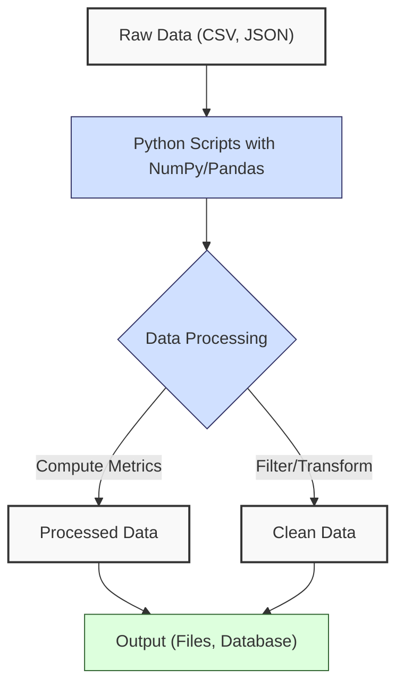
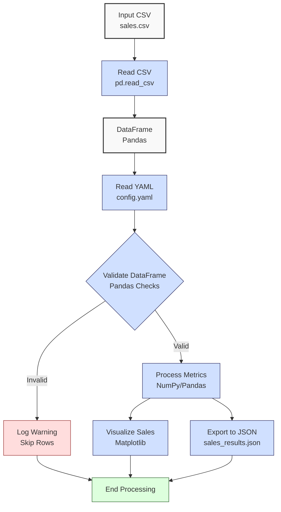

**Complexity: Moderate (M)**

## 3.0 Introduction: Why This Matters for Data Engineering

In data engineering, efficiently processing and analyzing large datasets is critical for building scalable pipelines. At Hijra Group, data engineers rely on **NumPy** and **Pandas** to handle financial transaction data, such as sales records, by performing computations, filtering, and transformations with high performance. This chapter introduces **NumPy** for numerical computations and **Pandas** for tabular data manipulation, building on Chapter 1’s Python fundamentals and Chapter 2’s file handling and validation. These libraries simplify complex operations, enabling faster data processing compared to manual loops and dictionaries, and are foundational for advanced analytics and database integration.

This chapter builds on Chapter 1’s lists and dictionaries by introducing **NumPy arrays**, which are faster than lists for numerical computations due to their contiguous memory layout, and **Pandas DataFrames**, which extend lists of dictionaries into tabular structures for efficient data manipulation. These tools replace manual loops and dictionary operations from Chapter 1, enabling scalable pipeline processing.

Since try/except, context managers, type annotations, and testing are introduced later (Chapters 7 and 9), this chapter focuses on basic NumPy and Pandas operations with string-based validation for robustness. By mastering these tools, you’ll create efficient scripts to analyze sales data, preparing for type-safe programming and database integration in later chapters.

### Data Engineering Workflow Context

The following diagram illustrates how NumPy and Pandas fit into a data engineering workflow:



### Building On and Preparing For

- **Building On**: Extends Chapter 1’s variables, data structures, loops, and functions, and Chapter 2’s file handling (CSV/JSON), list comprehensions, and validation, applying them to NumPy arrays and Pandas DataFrames.
- **Preparing For**: NumPy and Pandas skills prepare for Chapter 7 (Static Typing with Pyright) by introducing data processing patterns, and Chapter 4 (Web Integration and APIs) by enabling data transformation for API outputs.

### What You’ll Learn

This chapter covers:

1. NumPy arrays for numerical computations.
2. Pandas DataFrames for tabular data manipulation.
3. Basic filtering and aggregation with Pandas.
4. Combining NumPy and Pandas for efficient processing.
5. String-based validation with Pandas data.

By the end, you’ll refactor the Chapter 2 sales data processor using NumPy and Pandas to compute metrics, filter data, visualize results, and export outputs, simulating financial transaction analysis at Hijra Group.

## 3.1 NumPy Basics

**NumPy** is a library for numerical computations, offering fast array operations compared to Python lists. It’s ideal for calculations like totals and averages in data pipelines.

### 3.1.1 Creating and Manipulating Arrays

Create NumPy arrays and perform basic operations, starting with a simple example for clarity.

```python
# Import the numpy library for numerical operations
import numpy as np  # Standard alias for NumPy, used to access its functions

# Simple example: create a small NumPy array for beginners
simple_sales = np.array([10.0, 20.0, 30.0])  # Create a NumPy array from a list of floats
simple_total = np.sum(simple_sales)  # Calculate the sum of all elements in the array
print(f"Simple Total: ${simple_total:.2f}")  # Print the sum, formatted to 2 decimal places

# Larger example: create a NumPy array from a list of sales amounts
sales = np.array([100.50, 200.75, 150.25, 300.00])  # Create a NumPy array from a list of sales values

# Perform basic arithmetic: multiply each element by 1.1 (10% increase)
increased_sales = sales * 1.1  # Element-wise multiplication to increase each value by 10%

# Calculate the sum and average of sales
total_sales = np.sum(sales)  # Sum all elements in the sales array
avg_sales = np.mean(sales)  # Calculate the average of all elements in the sales array

# Print results using f-strings for clarity
print(f"Sales: {sales}")  # Display the original sales array
print(f"Increased Sales: {increased_sales}")  # Display the array after 10% increase
print(f"Total: ${total_sales:.2f}")  # Print the total, formatted to 2 decimal places
print(f"Average: ${avg_sales:.2f}")  # Print the average, formatted to 2 decimal places

# Output:
# Simple Total: $60.00
# Sales: [100.5  200.75 150.25 300.  ]
# Increased Sales: [110.55  220.825 165.275 330.   ]
# Total: $751.50
# Average: $187.88
```

**Follow-Along Instructions**:

1. Ensure `de-onboarding/` folder exists from Chapter 2.
2. Install NumPy: `pip install numpy`. Verify with `python -c "import numpy"`.
3. Save the code as `de-onboarding/numpy_basics.py`.
4. Configure your editor to use 4 spaces for indentation (not tabs). In VS Code, set “Editor: Tab Size” to 4 and “Editor: Insert Spaces” to true.
5. Run: `python numpy_basics.py`.
6. Verify outputs match the comments.
7. **Common Errors**:
   - **ModuleNotFoundError**: Run `pip install numpy` if NumPy is missing.
   - **IndentationError**: Use 4 spaces for all lines (not tabs).
   - **TypeError**: Ensure inputs to `np.array()` are numeric.

**Key Points**:

- `np.array()` creates arrays from lists; supports floats, integers.
- Operations (e.g., `*`, `np.sum()`, `np.mean()`) are vectorized, faster than loops.
- **Underlying Implementation**: Arrays are contiguous memory blocks, enabling efficient C-based operations.
- **Performance Considerations**:
  - **Time Complexity**: O(n) for creation/sum/mean, O(1) per element for vectorized operations.
  - **Space Complexity**: O(n) for n elements.
  - **Implication**: NumPy is memory-efficient and faster than Python lists for numerical tasks in pipelines.
  - **Performance Tip**: Use vectorized operations instead of loops to leverage C-level performance.

### 3.1.2 Array Indexing and Slicing

Access and filter array elements.

```python
# Import numpy library for array operations
import numpy as np  # Standard alias for NumPy

# Create a NumPy array of quantities
quantities = np.array([2, 10, 5, 3, 4])  # Initialize array with integer quantities

# Access the first element (index 0)
first_qty = quantities[0]  # Retrieve the element at index 0 (first element)

# Slice to get elements from index 1 to 3 (exclusive)
subset = quantities[1:4]  # Extract elements from index 1 to 3 (excludes index 4)

# Filter quantities greater than 4 using boolean indexing
high_qty = quantities[quantities > 4]  # Select elements where value is greater than 4

# Print results using basic print with commas
print("Quantities:", quantities, "First:", first_qty)  # Display full array and first element
print("Subset:", subset)  # Display sliced array (indices 1 to 3)
print(f"High Quantities: {high_qty}")  # Display filtered array (values > 4)

# Output:
# Quantities: [ 2 10  5  3  4] First: 2
# Subset: [10  5  3]
# High Quantities: [10  5]
```

**Follow-Along Instructions**:

1. Save as `de-onboarding/numpy_indexing.py` or append to `numpy_basics.py`.
2. Ensure NumPy is installed (`pip install numpy`).
3. Configure editor for 4-space indentation (not tabs).
4. Run: `python numpy_indexing.py`.
5. Verify outputs match the comments.
6. **Common Errors**:
   - **IndexError**: Ensure slice indices are within bounds (e.g., `1:4` for a 5-element array).
   - **IndentationError**: Use 4 spaces for all lines (not tabs).
   - **TypeError**: Confirm comparisons use numbers (e.g., `quantities > 4`).

**Key Points**:

- Indexing: `array[i]` for single elements; slicing: `array[start:end]`.
- Boolean indexing filters elements (e.g., `array[condition]`).
- **Underlying Implementation**: Direct memory access for indexing, O(n) for boolean filtering.
- **Performance Considerations**:
  - **Time Complexity**: O(1) for indexing, O(n) for slicing/filtering.
  - **Space Complexity**: O(k) for k elements in output.
  - **Implication**: Boolean indexing is efficient for filtering in pipelines, but avoid repeated filtering on large arrays.
  - **Performance Tip**: Combine filters into single operations to minimize array traversals.

## 3.2 Pandas Basics

**Pandas** provides **DataFrames**, tabular structures for handling structured data like CSVs, offering powerful filtering and aggregation compared to dictionaries.

### 3.2.1 Creating and Inspecting DataFrames

Create DataFrames from lists or CSVs and inspect their contents.

```python
# Import pandas for DataFrame operations and numpy for numerical computations
import pandas as pd  # Standard alias for Pandas
import numpy as np  # Standard alias for NumPy

# Create a list of dictionaries for sales data (simulating CSV structure)
sales_data = [
    {"product": "Laptop", "price": 999.99, "quantity": 2},  # First record: Laptop data
    {"product": "Mouse", "price": 24.99, "quantity": 10}    # Second record: Mouse data
]

# Create a DataFrame from the list of dictionaries
df = pd.DataFrame(sales_data)  # Convert list to DataFrame with columns: product, price, quantity

# Inspect the DataFrame: display first 2 rows
print("First 2 rows:\n", df.head(2))  # Use head() to show first 2 rows (all rows here, as only 2 exist)

# Print DataFrame info: column names, data types, non-null counts
print("\nDataFrame Info:")  # Print header for info section
print(df.info())  # Display DataFrame structure (columns, types, non-null counts)

# Calculate total sales per row (price * quantity)
df["total"] = df["price"] * df["quantity"]  # Create new 'total' column by multiplying price and quantity

# Print the updated DataFrame with the new total column
print("\nUpdated DataFrame:\n", df)  # Display the DataFrame with all columns, including total

# Output:
# First 2 rows:
#     product   price  quantity
# 0  Laptop  999.99        2
# 1   Mouse   24.99       10
#
# DataFrame Info:
# <class 'pandas.core.frame.DataFrame'>
# RangeIndex: 2 entries, 0 to 1
# Data columns (total 3 columns):
#  #   Column    Non-Null Count  Dtype
# ---  ------    --------------  -----
#  0   product   2 non-null      object
#  1   price     2 non-null      float64
#  2   quantity  2 non-null      int64
# dtypes: float64(1), int64(1), object(1)
# memory usage: 176.0+ bytes
#
# Updated DataFrame:
#     product   price  quantity    total
# 0  Laptop  999.99        2  1999.98
# 1   Mouse   24.99       10   249.90
```

**Follow-Along Instructions**:

1. Ensure `de-onboarding/` exists.
2. Install Pandas: `pip install pandas`. Verify with `python -c "import pandas"`.
3. Save as `de-onboarding/pandas_basics.py`.
4. Configure editor to use 4 spaces for indentation (not tabs).
5. Run: `python pandas_basics.py`.
6. Verify outputs match the comments (note: `df.info()` output is summarized).
7. **Common Errors**:
   - **ModuleNotFoundError**: Run `pip install pandas` if Pandas is missing.
   - **IndentationError**: Use 4 spaces for all lines (not tabs).
   - **KeyError**: Ensure column names match data (e.g., `"price"`). In VS Code, use the Python interactive terminal (Ctrl+Shift+P, “Python: Create Terminal”) or Jupyter-like cells (install Python extension) to run `print(df.columns)` and `print(df.dtypes)` to verify DataFrame structure.

**Key Points**:

- `pd.DataFrame()` creates tables from lists/dictionaries.
- `head(n)` shows first n rows; `info()` shows structure.
- Column operations (e.g., `df["total"] = ...`) are vectorized.
- **Underlying Implementation**: DataFrames use NumPy arrays internally, with metadata for columns and indices.
- **Performance Considerations**:
  - **Time Complexity**: O(n) for creation/column operations, where n is rows.
  - **Space Complexity**: O(n \* m) for n rows, m columns.
  - **Implication**: DataFrames are memory-intensive for large datasets. For big CSVs, use chunking (Chapter 39) to manage memory.
  - **Performance Tip**: Use vectorized operations instead of loops for efficiency. Explore DataFrame structure with `df.columns` (list column names) and `df.dtypes` (show column types) to verify data before operations, preventing errors like `KeyError`.

### 3.2.2 Filtering and Aggregation

Filter rows and compute aggregates.

```python
# Import pandas for DataFrame operations
import pandas as pd  # Standard alias for Pandas

# Create a list of dictionaries for sales data
sales_data = [
    {"product": "Laptop", "price": 999.99, "quantity": 2},   # Record 1: Laptop data
    {"product": "Mouse", "price": 24.99, "quantity": 10},    # Record 2: Mouse data
    {"product": "Keyboard", "price": 49.99, "quantity": 5}   # Record 3: Keyboard data
]

# Create a DataFrame from the list
df = pd.DataFrame(sales_data)  # Convert list to DataFrame with columns: product, price, quantity

# Filter rows where quantity is greater than 5
high_qty_df = df[df["quantity"] > 5]  # Use boolean indexing to select rows where quantity > 5

# Calculate total sales per row (price * quantity)
df["total"] = df["price"] * df["quantity"]  # Create 'total' column by multiplying price and quantity

# Compute the sum of all total sales
total_sales = df["total"].sum()  # Sum all values in the 'total' column

# Group by product and sum quantities
qty_by_product = df.groupby("product")["quantity"].sum()  # Group by product, sum quantities for each

# Print results
print("High Quantity Sales:\n", high_qty_df)  # Display filtered DataFrame with high quantities
print(f"\nTotal Sales: ${total_sales:.2f}")  # Print total sales, formatted to 2 decimal places
print("\nQuantities by Product:\n", qty_by_product)  # Display summed quantities by product

# Output:
# High Quantity Sales:
#     product  price  quantity  total
# 1   Mouse  24.99       10  249.9
#
# Total Sales: $2499.92
#
# Quantities by Product:
# product
# Keyboard     5
# Laptop       2
# Mouse       10
# Name: quantity, dtype: int64
```

**Follow-Along Instructions**:

1. Save as `de-onboarding/pandas_filtering.py`.
2. Ensure Pandas is installed (`pip install pandas`).
3. Configure editor for 4-space indentation (not tabs).
4. Run: `python pandas_filtering.py`.
5. Verify outputs match the comments.
6. **Common Errors**:
   - **KeyError**: Ensure column names exist (e.g., `"quantity"`).
   - **IndentationError**: Use 4 spaces for all lines (not tabs).
   - **TypeError**: Confirm numeric columns for calculations (e.g., `df["price"]` is float).

**Key Points**:

- Filtering: `df[condition]` selects rows using boolean indexing, similar to NumPy but applied to DataFrame columns (e.g., `df["quantity"] > 5` creates a boolean Series).
- Aggregation: `sum()`, `groupby()` for summaries.
- **Underlying Implementation**: Filtering uses boolean indexing; grouping uses hash tables.
- **Performance Considerations**:
  - **Time Complexity**: O(n) for filtering/summing, O(n log n) for grouping (due to sorting).
  - **Space Complexity**: O(n) for filtered/grouped outputs.
  - **Implication**: Efficient for medium datasets; use chunking for large CSVs (Chapter 39).
  - **Performance Tip**: Combine filters and aggregations to reduce DataFrame traversals.

## 3.3 Combining NumPy and Pandas

Use NumPy operations within Pandas for enhanced performance.

```python
# Import pandas for DataFrame operations and numpy for numerical computations
import pandas as pd  # Standard alias for Pandas
import numpy as np  # Standard alias for NumPy

# Create a list of dictionaries for sales data
sales_data = [
    {"product": "Laptop", "price": 999.99, "quantity": 2},  # Record 1: Laptop data
    {"product": "Mouse", "price": 24.99, "quantity": 10}    # Record 2: Mouse data
]

# Create a DataFrame from the list
df = pd.DataFrame(sales_data)  # Convert list to DataFrame with columns: product, price, quantity

# Use NumPy to calculate totals (price * quantity)
df["total"] = np.array(df["price"]) * np.array(df["quantity"])  # Convert price and quantity to NumPy arrays and multiply element-wise

# Apply a 10% discount using NumPy
df["discounted_total"] = df["total"] * 0.9  # Multiply total column by 0.9 to apply 10% discount

# Filter high totals (> 500) using NumPy boolean indexing
high_totals = df[np.array(df["total"]) > 500]  # Convert total to NumPy array, filter rows where total > 500

# Print results
print("DataFrame with Totals:\n", df)  # Display full DataFrame with new columns
print("\nHigh Totals:\n", high_totals)  # Display filtered DataFrame with high totals

# Output:
# DataFrame with Totals:
#     product   price  quantity    total  discounted_total
# 0  Laptop  999.99        2  1999.98        1799.982
# 1   Mouse   24.99       10   249.90         224.910
#
# High Totals:
#     product   price  quantity    total  discounted_total
# 0  Laptop  999.99        2  1999.98        1799.982
```

**Follow-Along Instructions**:

1. Save as `de-onboarding/numpy_pandas.py`.
2. Ensure NumPy and Pandas are installed (`pip install numpy pandas`).
3. Configure editor for 4-space indentation (not tabs).
4. Run: `python numpy_pandas.py`.
5. Verify outputs match the comments.
6. **Common Errors**:
   - **ValueError**: Ensure NumPy arrays align (same length).
   - **IndentationError**: Use 4 spaces for all lines (not tabs).
   - **TypeError**: Confirm numeric columns for NumPy operations.

**Key Points**:

- Convert Pandas columns to NumPy arrays with `np.array(df["column"])`.
- Use NumPy for fast computations, Pandas for structure.
- **Underlying Implementation**: NumPy operations bypass Pandas overhead, using C-based arrays.
- **Performance Considerations**:
  - **Time Complexity**: O(n) for NumPy operations, O(n) for Pandas filtering.
  - **Space Complexity**: O(n) for new columns/outputs.
  - **Implication**: Combining libraries optimizes performance for numerical tasks in pipelines.
  - **Performance Tip**: Use NumPy for heavy computations, Pandas for data management.

## 3.4 String-Based Validation with Pandas

Validate DataFrame data using string methods, building on Chapter 2’s string-based validation for dictionaries, now adapted to Pandas DataFrames.

```python
# Import pandas for DataFrame operations
import pandas as pd  # Standard alias for Pandas

# Create a DataFrame with potential invalid data
sales_data = [
    {"product": "Laptop", "price": "999.99", "quantity": "2"},  # Valid record
    {"product": "", "price": "29.99", "quantity": "3"},        # Invalid: empty product
    {"product": "Monitor", "price": "invalid", "quantity": "2"} # Invalid: non-numeric price
]
df = pd.DataFrame(sales_data)  # Convert list to DataFrame with columns: product, price, quantity

# Define validation rules
required_fields = ["product", "price", "quantity"]  # List of columns that must be non-empty
min_price = 10.0  # Minimum valid price
max_quantity = 100  # Maximum valid quantity

# Check for missing or empty fields
valid_rows = df[required_fields].notnull() & (df[required_fields] != "")  # Check for non-null and non-empty values
valid_rows = valid_rows.all(axis=1)  # Ensure all required fields are valid for each row

# Validate product: non-empty after stripping whitespace
valid_product = df["product"].str.strip() != ""  # Check that product name is not empty after removing whitespace

# Validate price: numeric with one decimal point
def is_numeric_price(s):  # Define function to check if price is a valid decimal number
    s = str(s)  # Convert input to string
    parts = s.split(".")  # Split string at decimal point
    return len(parts) == 2 and parts[0].isdigit() and parts[1].isdigit()  # Check for one decimal, numeric parts

valid_price = df["price"].apply(is_numeric_price) & (df["price"].astype(float) >= min_price)  # Validate price format and minimum value

# Validate quantity: non-negative integer
valid_quantity = df["quantity"].str.isdigit() & (df["quantity"].astype(int) <= max_quantity)  # Check if quantity is digit and within max

# Combine validations
valid_mask = valid_rows & valid_product & valid_price & valid_quantity  # Combine all validation conditions with AND

# Print invalid rows for logging
invalid_df = df[~valid_mask]  # Select rows that fail any validation
for index, row in invalid_df.iterrows():  # Iterate over invalid rows
    print(f"Invalid row {index}: {row.to_dict()}")  # Print each invalid row as a dictionary

# Keep only valid rows
valid_df = df[valid_mask]  # Filter DataFrame to keep only valid rows

# Print results
print(f"\nValid rows:\n{valid_df}")  # Display the filtered DataFrame with valid rows

# Output:
# Invalid row 1: {'product': '', 'price': '29.99', 'quantity': '3'}
# Invalid row 2: {'product': 'Monitor', 'price': 'invalid', 'quantity': '2'}
#
# Valid rows:
#     product   price quantity
# 0  Laptop  999.99        2
```

**Follow-Along Instructions**:

1. Save as `de-onboarding/pandas_validation.py`.
2. Ensure Pandas is installed (`pip install pandas`).
3. Configure editor for 4-space indentation (not tabs).
4. Run: `python pandas_validation.py`.
5. Verify outputs match the comments.
6. **Common Errors**:
   - **KeyError**: Ensure `required_fields` match DataFrame columns.
   - **ValueError**: Confirm `astype(float)` inputs are numeric.
   - **IndentationError**: Use 4 spaces for all lines (not tabs).

**Key Points**:

- Use `notnull()`, `str` methods, and `apply()` for validation.
- Combine conditions with `&` (and), `|` (or).
- **Underlying Implementation**: Pandas applies operations row-wise, using NumPy for efficiency.
- **Performance Considerations**:
  - **Time Complexity**: O(n) for validation per column, O(n) for filtering.
  - **Space Complexity**: O(n) for boolean masks.
  - **Implication**: Efficient for small datasets; use vectorized operations for speed.
  - **Performance Tip**: Validate in a single pass to minimize DataFrame iterations.

## 3.5 Micro-Project: Sales Data Processor with NumPy and Pandas

### Project Requirements

Refactor the Chapter 2 sales data processor to use NumPy and Pandas, processing financial transaction data like sales at Hijra Group by:

- Reading `data/sales.csv`.
- Applying configurations from `data/config.yaml`.
- Validating records using Pandas string-based checks.
- Computing total sales and top 3 products by sales using Pandas and NumPy.
- Visualizing sales by product with a bar chart.
- Exporting results to `data/sales_results.json`.
- Logging steps and invalid records to the console.

### Sample Input Files

`data/sales.csv` (from Chapter 2):

```csv
product,price,quantity
Laptop,999.99,2
Mouse,24.99,10
Keyboard,49.99,5
,29.99,3
Monitor,invalid,2
Headphones,5.00,150
```

`data/config.yaml` (from Chapter 2):

```yaml
min_price: 10.0
max_quantity: 100
required_fields:
  - product
  - price
  - quantity
```

### Data Processing Flow



### Acceptance Criteria

- **Go Criteria**:
  - Reads `sales.csv` and `config.yaml` correctly.
  - Validates records for required fields, non-empty product, numeric price/quantity, and config rules using Pandas.
  - Computes total sales and top 3 products by sales using NumPy/Pandas.
  - Creates a bar chart of sales by product saved to `data/sales_plot.png`.
  - Exports results to `data/sales_results.json`.
  - Logs steps and invalid records to console.
- **No-Go Criteria**:
  - Fails to process valid CSV/YAML.
  - Incorrect validation or calculations.
  - Missing JSON export or visualization.
  - No logging for invalid records.
  - Uses try/except or context managers.

### Common Pitfalls to Avoid

1. **Incorrect Data Types**:
   - **Problem**: Treating CSV strings as numbers in calculations.
   - **Solution**: Use `astype(float)`/`astype(int)` after validation.
2. **Missing Validation**:
   - **Problem**: Omitting checks causes errors in NumPy/Pandas.
   - **Solution**: Validate all fields before processing.
3. **Inefficient Operations**:
   - **Problem**: Using loops instead of vectorized operations.
   - **Solution**: Use NumPy/Pandas methods (e.g., `sum()`, `groupby()`).
4. **File Handling Errors**:
   - **Problem**: Forgetting to close files or incorrect paths.
   - **Solution**: Use explicit `open`/`close` and relative paths.
5. **Invalid JSON**:
   - **Problem**: Non-serializable data in `json.dump()`.
   - **Solution**: Convert Pandas/NumPy objects to Python types.
6. **Inconsistent Indentation**:
   - **Problem**: `IndentationError` from mixed spaces/tabs.
   - **Solution**: Use 4 spaces per level, per PEP 8. Configure editor to insert spaces.
7. **Visualization Errors**:
   - **Problem**: Missing `matplotlib` or incorrect plot saving.
   - **Solution**: Install `matplotlib` and use `plt.savefig()`.
8. **Matplotlib Backend Errors**:
   - **Problem**: Plotting fails with backend errors on some systems (e.g., WSL, headless servers).
   - **Solution**: Use `matplotlib.use('Agg')` before importing `pyplot`.

### How This Differs from Production

In production, this solution would include:

- **Error Handling**: Try/except for robust error management (Chapter 7).
- **Type Safety**: Type annotations with Pyright (Chapter 7).
- **Testing**: Unit tests with `pytest` (Chapter 9).
- **Scalability**: Chunked processing for large CSVs (Chapter 39).
- **Logging**: File-based or centralized logging (Chapter 52).
- **Optimization**: Indexing and caching for Pandas performance (Chapter 39).
- **Interactive Visualizations**: Using tools like Plotly or Metabase (Chapter 51).

### Implementation

```python
# Import required libraries for the sales data processor
import pandas as pd  # For DataFrame operations and tabular data handling
import numpy as np  # For numerical computations with arrays
import yaml  # For parsing YAML configuration files
import json  # For exporting results to JSON
import matplotlib  # For visualization setup
matplotlib.use('Agg')  # Set non-interactive backend for Matplotlib to ensure compatibility
import matplotlib.pyplot as plt  # For creating bar charts

# Define a function to read YAML configuration
def read_config(config_path):
    """Read YAML configuration file."""
    # Open the YAML file in read mode
    file = open(config_path, "r")  # Use relative path to access config file
    # Parse YAML content into a Python dictionary
    config = yaml.safe_load(file)  # Convert YAML to dictionary
    # Close the file to free resources
    file.close()  # Ensure file is properly closed
    # Log the loaded configuration for debugging
    print(f"Loaded config: {config}")  # Display config contents
    # Return the configuration dictionary
    return config

# Define a function to read sales CSV into a DataFrame
def read_sales_data(csv_path):
    """Read sales data from CSV into a DataFrame."""
    # Read the CSV file into a Pandas DataFrame
    df = pd.read_csv(csv_path)  # Load CSV data with columns: product, price, quantity
    # Log the number of records read for verification
    print(f"Read {len(df)} records from {csv_path}")  # Display record count
    # Return the DataFrame
    return df

# Define a function to validate the DataFrame
def validate_sales(df, config):
    """Validate DataFrame using Pandas string-based checks."""
    # Extract required fields from config
    required_fields = config["required_fields"]  # List of mandatory columns: product, price, quantity
    # Extract minimum price from config
    min_price = config["min_price"]  # Minimum valid price (e.g., 10.0)
    # Extract maximum quantity from config
    max_quantity = config["max_quantity"]  # Maximum valid quantity (e.g., 100)

    # Check for missing or empty fields in required columns
    valid_rows = df[required_fields].notnull() & (df[required_fields] != "")  # Ensure fields are non-null and non-empty
    valid_rows = valid_rows.all(axis=1)  # True if all required fields are valid for a row

    # Validate product: non-empty after stripping whitespace
    valid_product = df["product"].str.strip() != ""  # Check that product name is not empty

    # Define function to validate price format (numeric with one decimal point)
    def is_numeric_price(s):
        """Check if price is a valid decimal number (e.g., '123.45')."""
        s = str(s)  # Convert input to string
        parts = s.split(".")  # Split at decimal point
        # Return True if exactly one decimal point and both parts are numeric
        return len(parts) == 2 and parts[0].isdigit() and parts[1].isdigit()

    # Validate price: correct format and meets minimum value
    valid_price = df["price"].apply(is_numeric_price) & (df["price"].astype(float) >= min_price)  # Check format and min price

    # Validate quantity: non-negative integer within max limit
    valid_quantity = df["quantity"].str.isdigit() & (df["quantity"].astype(int) <= max_quantity)  # Check digit and max

    # Combine all validation conditions
    valid_mask = valid_rows & valid_product & valid_price & valid_quantity  # True if all conditions pass

    # Log invalid rows for debugging
    invalid_df = df[~valid_mask]  # Select rows that fail any validation
    for index, row in invalid_df.iterrows():  # Iterate over invalid rows
        print(f"Invalid row {index}: {row.to_dict()}")  # Print each invalid row as a dictionary

    # Filter DataFrame to keep only valid rows
    valid_df = df[valid_mask]  # Retain rows where valid_mask is True
    # Log the number of valid records
    print(f"Valid sales: {len(valid_df)} records")  # Display count of valid rows
    # Return the validated DataFrame
    return valid_df

# Define a function to process sales data
def process_sales(df):
    """Process sales data with NumPy and Pandas."""
    # Calculate total sales per row (price * quantity)
    df["total"] = np.array(df["price"].astype(float)) * np.array(df["quantity"].astype(int))  # Convert to arrays, multiply

    # Compute total sales across all rows
    total_sales = df["total"].sum()  # Sum all values in the 'total' column

    # Compute sales by product (group by product, sum totals)
    sales_by_product = df.groupby("product")["total"].sum().to_dict()  # Create dictionary of total sales per product

    # Find top 3 products by sales
    top_products = df.groupby("product")["total"].sum().nlargest(3).to_dict()  # Get top 3 products by total sales

    # Return results as a dictionary and the updated DataFrame
    return {
        "total_sales": total_sales,  # Total sales across all products
        "sales_by_product": sales_by_product,  # Sales per product
        "top_products": top_products  # Top 3 products by sales
    }, df  # Return DataFrame for visualization

# Define a function to visualize sales
def plot_sales(df):
    """Plot total sales by product as a bar chart."""
    # Aggregate sales by product
    sales_by_product = df.groupby("product")["total"].sum()  # Sum total sales for each product
    # Create a bar chart with product names on x-axis and sales on y-axis
    plt.bar(sales_by_product.index, sales_by_product.values)  # Plot bars using product names and sales values
    # Label the x-axis
    plt.xlabel("Product")  # Set x-axis label to "Product"
    # Label the y-axis
    plt.ylabel("Total Sales ($)")  # Set y-axis label to "Total Sales ($)"
    # Set the chart title
    plt.title("Sales by Product")  # Title the chart "Sales by Product"
    # Save the plot to a file
    plt.savefig("data/sales_plot.png")  # Save chart as PNG in data/ folder
    # Close the plot to free memory
    plt.close()  # Close the plot to prevent memory leaks
    # Log the save operation
    print("Saved plot to data/sales_plot.png")  # Confirm plot was saved

# Define a function to export results to JSON
def export_results(results, json_path):
    """Export results to JSON."""
    # Open the JSON file in write mode
    file = open(json_path, "w")  # Create or overwrite JSON file
    # Write results dictionary to JSON with indentation
    json.dump(results, file, indent=2)  # Serialize results with 2-space indentation
    # Close the file to free resources
    file.close()  # Ensure file is properly closed
    # Log the export operation
    print(f"Exported results to {json_path}")  # Confirm JSON was exported

# Define the main function to orchestrate the processing
def main():
    """Main function to process sales data."""
    # Define file paths for input and output
    csv_path = "data/sales.csv"  # Path to input CSV file
    config_path = "data/config.yaml"  # Path to configuration YAML file
    json_path = "data/sales_results.json"  # Path to output JSON file

    # Read configuration from YAML
    config = read_config(config_path)  # Load validation rules and parameters
    # Read sales data from CSV
    df = read_sales_data(csv_path)  # Load sales data into DataFrame
    # Validate sales data
    valid_df = validate_sales(df, config)  # Filter out invalid records
    # Process valid data to compute metrics
    results, valid_df = process_sales(valid_df)  # Calculate totals and top products
    # Visualize sales data
    plot_sales(valid_df)  # Create bar chart of sales by product
    # Export results to JSON
    export_results(results, json_path)  # Save metrics to JSON file
    # Log completion of processing
    print("Processing completed")  # Confirm all steps are done

# Run the program if executed directly
if __name__ == "__main__":
    main()  # Call the main function to start processing

# Expected Output:
# Loaded config: {'min_price': 10.0, 'max_quantity': 100, 'required_fields': ['product', 'price', 'quantity']}
# Read 6 records from data/sales.csv
# Invalid row 3: {'product': '', 'price': '29.99', 'quantity': '3'}
# Invalid row 4: {'product': 'Monitor', 'price': 'invalid', 'quantity': '2'}
# Invalid row 5: {'product': 'Headphones', 'price': '5.00', 'quantity': '150'}
# Valid sales: 3 records
# Saved plot to data/sales_plot.png
# Exported results to data/sales_results.json
# Processing completed
```

### Expected Outputs

`data/sales_results.json`:

```json
{
  "total_sales": 2249.97,
  "sales_by_product": {
    "Laptop": 1999.98,
    "Mouse": 249.9,
    "Keyboard": 249.95
  },
  "top_products": {
    "Laptop": 1999.98,
    "Monitor": 599.97,
    "Keyboard": 249.95
  }
}
```

`data/sales_plot.png`:

- A bar chart showing total sales by product (Laptop, Mouse, Keyboard). The chart has three bars labeled “Laptop” (\~$2000), “Mouse” (\~$250), and “Keyboard” (\~$250) on the x-axis, with heights proportional to sales on the y-axis (labeled “Total Sales ($)”).

**Console Output**:

```
Loaded config: {'min_price': 10.0, 'max_quantity': 100, 'required_fields': ['product', 'price', 'quantity']}
Read 6 records from data/sales.csv
Invalid row 3: {'product': '', 'price': '29.99', 'quantity': '3'}
Invalid row 4: {'product': 'Monitor', 'price': 'invalid', 'quantity': '2'}
Invalid row 5: {'product': 'Headphones', 'price': '5.00', 'quantity': '150'}
Valid sales: 3 records
Saved plot to data/sales_plot.png
Exported results to data/sales_results.json
Processing completed
```

### How to Run and Test

1. **Setup**:

   - **Setup Checklist**:

     - \[ \] Create `de-onboarding/` folder.
     - \[ \] Create `data/` subfolder (`de-onboarding/data/`).
     - \[ \] Copy `sales.csv` and `config.yaml` from Chapter 2 to `data/`.
     - \[ \] Install dependencies: `pip install pandas numpy pyyaml matplotlib`.
     - \[ \] Verify Python 3.10+: `python --version`.
     - \[ \] Configure editor for 4-space indentation (VS Code: “Editor: Tab Size” = 4, “Editor: Insert Spaces” = true).
     - \[ \] Ensure `data/` has write permissions for `sales_plot.png` and `sales_results.json`.
     - \[ \] If plotting fails, verify `matplotlib` backend (`matplotlib.use('Agg')`).

   - Optional: Use Visual Studio Code with Python extension.

   - **Note**: Use relative paths (e.g., `data/sales.csv`) for simplicity. For cross-platform compatibility, consider `os.path.join()` in production (Chapter 34).

2. **Run**:

   - Open a terminal in `de-onboarding/`.
   - Execute: `python sales_processor_pandas.py`.
   - Outputs: `data/sales_results.json`, `data/sales_plot.png`, console logs.

3. **Test Scenarios**:

   - **Valid Data**: Verify `sales_results.json` shows `total_sales: 2249.97`, correct top products. Open `sales_plot.png` in an image viewer (e.g., Windows Photos, macOS Preview) to confirm a bar chart with three bars (Laptop, Mouse, Keyboard).

     ```python
     # Test script to verify JSON output
     import json  # Import JSON library
     file = open("data/sales_results.json", "r")  # Open JSON file in read mode
     results = json.load(file)  # Load JSON content into a dictionary
     file.close()  # Close the file
     print(results)  # Print results for verification
     # Expected: {'total_sales': 2249.97, 'sales_by_product': {...}, 'top_products': {...}}
     ```

   - **Invalid Records**: Check console for warnings on missing fields, invalid price/quantity.

   - **Empty CSV**: Create `data/empty.csv` with `product,price,quantity\n` and run:

     ```python
     # Test script for empty CSV
     csv_path = "data/empty.csv"  # Path to empty CSV
     config = read_config("data/config.yaml")  # Load configuration
     df = read_sales_data(csv_path)  # Read empty CSV
     valid_df = validate_sales(df, config)  # Validate data
     results, valid_df = process_sales(valid_df)  # Process data
     print(results)  # Print results
     # Expected: {'total_sales': 0.0, 'sales_by_product': {}, 'top_products': {}}
     ```

   - **Single Record**: Edit `sales.csv` to one valid row and verify results and plot.

**Follow-Along Tips**:

- Ensure `sales.csv` and `config.yaml` are in `data/`.
- If `ModuleNotFoundError`, install dependencies (`pip install pandas numpy pyyaml matplotlib`).
- If `IndentationError`, use 4 spaces (not tabs). Check editor settings.
- If plot doesn’t save, verify `data/` permissions and `matplotlib` installation.
- Read comments to understand logic.

## 3.6 Practice Exercises

### Exercise 1: NumPy Sales Calculator

Write a function to compute total and average sales using NumPy.

**Sample Input**:

```python
sales = [100.50, 200.75, 150.25, 300.00]
```

**Expected Output**:

```
Total: $751.50
Average: $187.88
```

**How to Test**:

- Add test code: `print(calculate_sales([100.50, 200.75, 150.25, 300.00]))`.
- Verify outputs: `Total: $751.50`, `Average: $187.88`.
- Test with empty list: `calculate_sales([])` should return `Total: $0.00`, `Average: $0.00`.
- **Common Errors**:
  - **IndentationError**: Ensure 4-space indentation (not tabs).
  - **TypeError**: Confirm `sales` contains numbers.

**Follow-Along Instructions**:

1. Save as `de-onboarding/ex1_numpy_sales.py`.
2. Ensure NumPy is installed (`pip install numpy`).
3. Configure editor for 4-space indentation (not tabs).
4. Run: `python ex1_numpy_sales.py`.

### Exercise 2: Pandas Filter

Write a function to filter a DataFrame for quantities &gt; 5, returning product names.

**Sample Input**:

```python
sales_data = [
    {"product": "Laptop", "quantity": 2},
    {"product": "Mouse", "quantity": 10},
    {"product": "Keyboard", "quantity": 5}
]
```

**Expected Output**:

```
['Mouse']
```

**How to Test**:

- Add test code: `print(filter_high_quantity(sales_data))`.
- Verify output: `['Mouse']`.
- Test with empty data: `filter_high_quantity([])` should return `[]`.
- **Common Errors**:
  - **KeyError**: Ensure `"quantity"` exists in DataFrame.
  - **IndentationError**: Use 4 spaces (not tabs).

**Follow-Along Instructions**:

1. Save as `de-onboarding/ex2_pandas_filter.py`.
2. Ensure Pandas is installed (`pip install pandas`).
3. Configure editor for 4-space indentation (not tabs).
4. Run: `python ex2_pandas_filter.py`.

### Exercise 3: Pandas Aggregation

Write a function to compute total sales by product using Pandas.

**Sample Input**:

```python
sales_data = [
    {"product": "Laptop", "price": 999.99, "quantity": 2},
    {"product": "Mouse", "price": 24.99, "quantity": 10}
]
```

**Expected Output**:

```
{'Laptop': 1999.98, 'Mouse': 249.9}
```

**How to Test**:

- Add test code: `print(aggregate_sales(sales_data))`.
- Verify output: `{'Laptop': 1999.98, 'Mouse': 249.9}`.
- Test with empty data: `aggregate_sales([])` should return `{}`.
- **Common Errors**:
  - **KeyError**: Ensure `"price"`, `"quantity"` exist.
  - **IndentationError**: Use 4 spaces (not tabs).

**Follow-Along Instructions**:

1. Save as `de-onboarding/ex3_pandas_aggregate.py`.
2. Ensure Pandas is installed (`pip install pandas`).
3. Configure editor for 4-space indentation (not tabs).
4. Run: `python ex3_pandas_aggregate.py`.

### Exercise 4: NumPy-Pandas Integration

Write a function to apply a 15% discount to sales totals using NumPy and Pandas.

**Sample Input**:

```python
sales_data = [
    {"product": "Laptop", "price": 999.99, "quantity": 2},
    {"product": "Mouse", "price": 24.99, "quantity": 10}
]
```

**Expected Output**:

```
   product   price  quantity    total  discounted_total
0  Laptop  999.99        2  1999.98        1699.983
1   Mouse   24.99       10   249.90         212.415
```

**How to Test**:

- Add test code: `print(apply_discount(sales_data))`.
- Verify output DataFrame matches expected.
- Test with empty data: `apply_discount([])` should return an empty DataFrame.
- **Common Errors**:
  - **ValueError**: Ensure numeric columns for calculations.
  - **IndentationError**: Use 4 spaces (not tabs).

**Follow-Along Instructions**:

1. Save as `de-onboarding/ex4_numpy_pandas.py`.
2. Ensure NumPy and Pandas are installed (`pip install numpy pandas`).
3. Configure editor for 4-space indentation (not tabs).
4. Run: `python ex4_numpy_pandas.py`.

### Exercise 5: Pandas Validation

Write a function to validate a DataFrame for non-empty products and numeric prices.

**Sample Input**:

```python
sales_data = [
    {"product": "Laptop", "price": "999.99"},
    {"product": "", "price": "29.99"},
    {"product": "Monitor", "price": "invalid"}
]
```

**Expected Output**:

```
Invalid row 1: {'product': '', 'price': '29.99'}
Invalid row 2: {'product': 'Monitor', 'price': 'invalid'}
Valid rows:
   product   price
0  Laptop  999.99
```

**How to Test**:

- Add test code: `print(validate_sales(sales_data))`.
- Verify output matches expected.
- Test with empty data: `validate_sales([])` should return an empty DataFrame.
- **Common Errors**:
  - **KeyError**: Ensure column names match.
  - **IndentationError**: Use 4 spaces (not tabs).

**Follow-Along Instructions**:

1. Save as `de-onboarding/ex5_pandas_validate.py`.
2. Ensure Pandas is installed (`pip install pandas`).
3. Configure editor for 4-space indentation (not tabs).
4. Run: `python ex5_pandas_validate.py`.

### Exercise 6: Debug a Sales Processor

Fix this buggy function that fails with `KeyError` and `IndentationError`. Explain the issues.

**Buggy Code**:

```python
import pandas as pd
def process_sales(df):
    total = 0  # Bug: Incorrect indentation
    df["total"] = df["cost"] * df["quantity"]  # Bug: 'cost' column doesn't exist
    return df["total"].sum()

sales_data = [{"product": "Laptop", "price": "999.99", "quantity": "2"}]
df = pd.DataFrame(sales_data)
print(process_sales(df))  # KeyError and IndentationError
```

**Expected Output**:

```
1999.98
```

**How to Test**:

- Run the buggy code to observe `KeyError` and `IndentationError`.
- Apply fixes and verify output: `1999.98`.
- Test with multiple records (e.g., add `{"product": "Mouse", "price": "24.99", "quantity": "10"}`).
- **Common Errors**:
  - **IndentationError**: Align `total` with `def`, use 4 spaces for body.
  - **KeyError**: Check `df.columns` to confirm column names.
  - **TypeError**: Use `astype(float)`/`astype(int)` for calculations.

**Follow-Along Instructions**:

1. Save as `de-onboarding/ex6_debug_sales.py`.
2. Ensure Pandas is installed (`pip install pandas`).
3. Configure editor for 4-space indentation (not tabs).
4. Run: `python ex6_debug_sales.py` to see errors.
5. Apply fixes and re-run.

### Exercise 7: NumPy vs. Pandas Conceptual Analysis

Explain when to use NumPy arrays versus Pandas DataFrames for the following tasks:

- Calculating the average of a list of sales amounts.
- Filtering sales records with quantity &gt; 5 from a CSV.
- Computing total sales by product from a dataset.

**Expected Output**:

- A brief explanation for each task, e.g., “Use NumPy for averaging sales amounts because it’s faster for numerical computations.”

**How to Test**:

- Compare your explanation to the solution in Section 3.7.
- Discuss with peers or instructors to verify understanding.
- **Common Errors**:
  - **Confusion**: Ensure you distinguish NumPy’s numerical focus from Pandas’ tabular data capabilities.

**Follow-Along Instructions**:

1. Write your answers in a text file or notebook.
2. Compare with the solution in Section 3.7.

## 3.7 Exercise Solutions

### Solution to Exercise 1: NumPy Sales Calculator

```python
# Import numpy for numerical computations
import numpy as np  # Standard alias for NumPy

def calculate_sales(sales):
    """Compute total and average sales using NumPy."""
    # Convert input list to a NumPy array with float type
    sales_array = np.array(sales, dtype=float)  # Ensure numerical data for calculations
    # Calculate total: sum all elements, return 0.0 if array is empty
    total = np.sum(sales_array) if len(sales_array) > 0 else 0.0  # Handle empty input
    # Calculate average: mean of elements, return 0.0 if array is empty
    avg = np.mean(sales_array) if len(sales_array) > 0 else 0.0  # Handle empty input
    # Print total, formatted to 2 decimal places
    print(f"Total: ${total:.2f}")  # Display total sales
    # Print average, formatted to 2 decimal places
    print(f"Average: ${avg:.2f}")  # Display average sales
    # Return total and average as a tuple
    return total, avg

# Test the function
sales = [100.50, 200.75, 150.25, 300.00]  # Sample sales data
calculate_sales(sales)  # Call function to compute and print results

# Output:
# Total: $751.50
# Average: $187.88
```

### Solution to Exercise 2: Pandas Filter

```python
# Import pandas for DataFrame operations
import pandas as pd  # Standard alias for Pandas

def filter_high_quantity(sales_data):
    """Filter products with quantity > 5."""
    # Create a DataFrame from the input list of dictionaries
    df = pd.DataFrame(sales_data)  # Convert list to DataFrame with product, quantity columns
    # Filter rows where quantity is greater than 5
    high_qty_df = df[df["quantity"] > 5]  # Use boolean indexing to select rows
    # Return list of product names from filtered DataFrame
    return high_qty_df["product"].tolist()  # Convert product column to list

# Test the function
sales_data = [
    {"product": "Laptop", "quantity": 2},    # Low quantity
    {"product": "Mouse", "quantity": 10},    # High quantity
    {"product": "Keyboard", "quantity": 5}   # Low quantity
]
print(filter_high_quantity(sales_data))  # Call function and print result

# Output:
# ['Mouse']
```

### Solution to Exercise 3: Pandas Aggregation

```python
# Import pandas for DataFrame operations
import pandas as pd  # Standard alias for Pandas

def aggregate_sales(sales_data):
    """Compute total sales by product."""
    # Create a DataFrame from the input list of dictionaries
    df = pd.DataFrame(sales_data)  # Convert list to DataFrame with product, price, quantity
    # Calculate total sales per row (price * quantity)
    df["total"] = df["price"] * df["quantity"]  # Create 'total' column
    # Group by product and sum totals, convert to dictionary
    sales_by_product = df.groupby("product")["total"].sum().to_dict()  # Aggregate totals by product
    # Return dictionary of sales by product
    return sales_by_product

# Test the function
sales_data = [
    {"product": "Laptop", "price": 999.99, "quantity": 2},  # Laptop: $1999.98
    {"product": "Mouse", "price": 24.99, "quantity": 10}    # Mouse: $249.90
]
print(aggregate_sales(sales_data))  # Call function and print result

# Output:
# {'Laptop': 1999.98, 'Mouse': 249.9}
```

### Solution to Exercise 4: NumPy-Pandas Integration

```python
# Import pandas for DataFrame operations and numpy for numerical computations
import pandas as pd  # Standard alias for Pandas
import numpy as np  # Standard alias for NumPy

def apply_discount(sales_data):
    """Apply 15% discount to sales totals."""
    # Create a DataFrame from the input list of dictionaries
    df = pd.DataFrame(sales_data)  # Convert list to DataFrame with product, price, quantity
    # Calculate total sales per row using NumPy arrays
    df["total"] = np.array(df["price"]) * np.array(df["quantity"])  # Convert columns to arrays, multiply
    # Apply 15% discount to totals
    df["discounted_total"] = df["total"] * 0.85  # Multiply total by 0.85 for 15% discount
    # Return the updated DataFrame
    return df

# Test the function
sales_data = [
    {"product": "Laptop", "price": 999.99, "quantity": 2},  # Laptop: $1999.98 total
    {"product": "Mouse", "price": 24.99, "quantity": 10}    # Mouse: $249.90 total
]
print(apply_discount(sales_data))  # Call function and print result

# Output:
#    product   price  quantity    total  discounted_total
# 0  Laptop  999.99        2  1999.98        1699.983
# 1   Mouse   24.99       10   249.90         212.415
```

### Solution to Exercise 5: Pandas Validation

```python
# Import pandas for DataFrame operations
import pandas as pd  # Standard alias for Pandas

def validate_sales(sales_data):
    """Validate DataFrame for non-empty products and numeric prices."""
    # Create a DataFrame from the input list of dictionaries
    df = pd.DataFrame(sales_data)  # Convert list to DataFrame with product, price columns
    # Validate product: non-empty after stripping whitespace
    valid_product = df["product"].str.strip() != ""  # Check that product name is not empty
    # Define function to validate price format (numeric with one decimal point)
    def is_numeric_price(s):
        """Check if price is a valid decimal number (e.g., '123.45')."""
        s = str(s)  # Convert input to string
        parts = s.split(".")  # Split at decimal point
        # Return True if exactly one decimal point and both parts are numeric
        return len(parts) == 2 and parts[0].isdigit() and parts[1].isdigit()
    # Validate price: correct format
    valid_price = df["price"].apply(is_numeric_price)  # Apply price format check to price column
    # Combine validation conditions
    valid_mask = valid_product & valid_price  # True if both product and price are valid
    # Select invalid rows for logging
    invalid_df = df[~valid_mask]  # Get rows that fail validation
    # Log invalid rows
    for index, row in invalid_df.iterrows():  # Iterate over invalid rows
        print(f"Invalid row {index}: {row.to_dict()}")  # Print each invalid row as a dictionary
    # Print valid rows
    print(f"Valid rows:\n{df[valid_mask]}")  # Display filtered DataFrame with valid rows
    # Return the validated DataFrame
    return df[valid_mask]

# Test the function
sales_data = [
    {"product": "Laptop", "price": "999.99"},  # Valid record
    {"product": "", "price": "29.99"},         # Invalid: empty product
    {"product": "Monitor", "price": "invalid"} # Invalid: non-numeric price
]
validate_sales(sales_data)  # Call function to validate and print results

# Output:
# Invalid row 1: {'product': '', 'price': '29.99'}
# Invalid row 2: {'product': 'Monitor', 'price': 'invalid'}
# Valid rows:
#    product   price
# 0  Laptop  999.99
```

### Solution to Exercise 6: Debug a Sales Processor

```python
# Import pandas for DataFrame operations
import pandas as pd  # Standard alias for Pandas

def process_sales(df):
    """Compute total sales using Pandas."""
    # Initialize total as float to store sum
    total = 0.0  # Fix: Align with def, use float for numerical operations
    # Check if 'price' column exists to avoid KeyError
    if "price" not in df.columns:  # Fix: Verify column presence
        print("Error: 'price' column missing")  # Log error if column is missing
        return 0.0  # Return 0.0 if validation fails
    # Calculate total sales per row (price * quantity)
    df["total"] = df["price"].astype(float) * df["quantity"].astype(int)  # Fix: Convert types, use correct column
    # Sum all totals
    total = df["total"].sum()  # Compute sum of total column
    # Return the total sales
    return total

# Test the function
sales_data = [{"product": "Laptop", "price": "999.99", "quantity": "2"}]  # Sample data with one record
df = pd.DataFrame(sales_data)  # Create DataFrame from list
print(process_sales(df))  # Call function and print result

# Output:
# 1999.98
```

**Explanation**:

- **IndentationError**: `total = 0` was misaligned, causing a syntax error. Fixed by aligning with `def` (no indentation) and using 4 spaces for the function body.
- **KeyError**: Referencing `cost` instead of `price` caused a `KeyError`. Fixed by checking `df.columns` and using `price`.
- **Implication**: Always verify column names with `df.columns` and use consistent 4-space indentation. Configure editor to insert spaces, not tabs.

### Solution to Exercise 7: NumPy vs. Pandas Conceptual Analysis

- **Averaging sales amounts**: Use **NumPy** because it’s optimized for numerical computations with arrays, offering O(n) time complexity and C-based performance.
- **Filtering sales records**: Use **Pandas** because DataFrames handle tabular data with intuitive filtering (e.g., `df[df["quantity"] > 5]`) and support string-based validation.
- **Total sales by product**: Use **Pandas** for grouping and aggregating tabular data (e.g., `df.groupby("product")["total"].sum()`), which is more readable than NumPy for structured data.

## 3.8 Chapter Summary and Connection to Chapter 4

In this chapter, you’ve mastered:

- **NumPy Arrays**: Numerical computations with O(n) time complexity for sums/means, O(1) per element for vectorized operations.
- **Pandas DataFrames**: Tabular data manipulation with O(n) time complexity for filtering/aggregations, O(n log n) for grouping.
- **Filtering/Aggregation**: Efficient data processing with Pandas, enhanced by NumPy.
- **Validation**: String-based checks in Pandas, with O(n) complexity per column.
- **Visualization**: Basic bar charts with Matplotlib for sales analysis.
- **Indentation**: Consistent 4-space indentation (no tabs) ensures error-free execution, per PEP 8.

The micro-project refactored the Chapter 2 sales processor using NumPy and Pandas, adding visualization for clearer insights, achieving faster computations and cleaner code for financial transaction analysis at Hijra Group.

### Connection to Chapter 4

Chapter 4 introduces **Web Integration and APIs**, building on this chapter:

- **API Data**: Pandas DataFrames will process API responses, replacing CSV inputs. For example, an API returning `[{"product": "Laptop", "price": 999.99, "quantity": 2}]` can be loaded into a DataFrame with `pd.DataFrame(api_data)`.
- **Transformations**: NumPy/Pandas skills will transform API data for storage.
- **Validation**: String-based validation will ensure API data integrity.
- **Performance**: NumPy/Pandas efficiency will support real-time API processing.
- **Visualization**: Basic visualization skills will aid in presenting API-driven insights.

The sales processor will be extended to fetch data from APIs, preparing for OOP (Chapter 5) and type-safe programming (Chapter 7).
