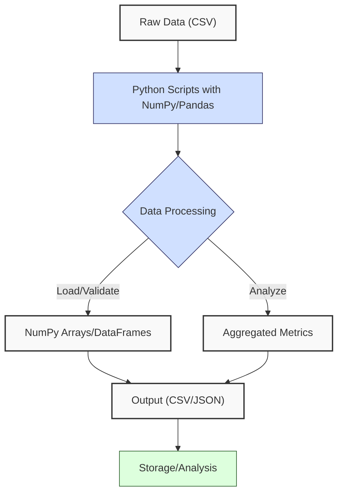
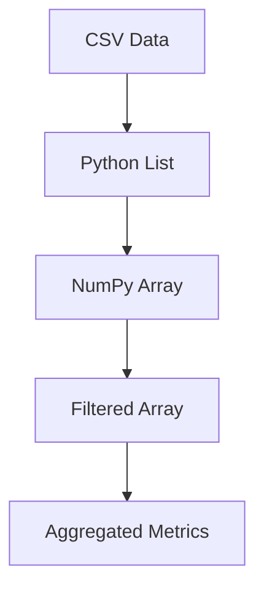
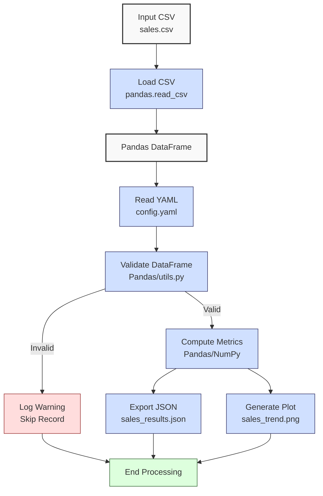

**Complexity: Moderate (M)**

## 3.0 Introduction: Why This Matters for Data Engineering

In data engineering, efficient data manipulation is critical for transforming financial transaction data into actionable insights for Hijra Group's Sharia-compliant fintech analytics. NumPy and Pandas are foundational libraries for handling large datasets, with Pandas DataFrames using ~24MB for 1 million rows (3 columns) and NumPy arrays offering 10–100x faster computations than Python loops. Visualization with Matplotlib enables stakeholder reporting by producing plots like sales trends, laying the groundwork for interactive dashboards with BI tools in Chapter 51. Building on Chapters 1 and 2, this chapter introduces **NumPy** for numerical computations and **Pandas** for structured data analysis, essential for processing sales data in pipelines.

This chapter avoids advanced concepts like type annotations (Chapter 7), testing (Chapter 9), or error handling (try/except, Chapter 7), focusing on basic operations, filtering, and grouping. All code uses **PEP 8's 4-space indentation**, preferring spaces over tabs to avoid `IndentationError` due to Python's white-space sensitivity, ensuring compatibility with Hijra Group's pipeline scripts.

### Data Engineering Workflow Context

This diagram illustrates how NumPy and Pandas fit into a data engineering pipeline:



### Building On and Preparing For

- **Building On**:
  - Chapter 1: Uses lists, dictionaries, and loops for data manipulation, extended to NumPy arrays and Pandas DataFrames.
  - Chapter 2: Leverages CSV parsing (`csv.DictReader`), string validation, and modules (`utils.py`) for data loading and cleaning, now streamlined with `pandas.read_csv`.
- **Preparing For**:
  - Chapter 4: Prepares for API data integration by handling structured data.
  - Chapter 5: Supports OOP by organizing data processing logic in modules.
  - Chapter 7: Lays groundwork for type-safe Pandas operations.
  - Chapter 38–39: Enables advanced NumPy/Pandas for large-scale analytics.

### What You’ll Learn

This chapter covers:

1. **NumPy Basics**: Arrays for numerical operations (e.g., sales calculations).
2. **Pandas Basics**: DataFrames for structured data (e.g., sales records).
3. **Data Loading**: Reading CSVs with `pandas.read_csv`.
4. **Data Cleaning**: Filtering and validating data with Pandas.
5. **Basic Analysis**: Grouping and aggregating metrics.
6. **Visualization**: Simple plots with Matplotlib (saved to files).

By the end, you’ll refactor Chapter 2’s sales processor to use NumPy for calculations and Pandas for data handling, producing a JSON report and a sales trend plot, all with 4-space indentation per PEP 8.

**Follow-Along Tips**:

- Ensure `data/sales.csv` and `data/config.yaml` exist in `de-onboarding/data/`.
- Install libraries: `pip install numpy pandas matplotlib pyyaml`.
- If `IndentationError`, use **4 spaces** (not tabs) per PEP 8. Run `python -tt script.py` or use VS Code’s Pylint to detect tab/space mixing.
- Use print statements (e.g., `print(df.head())`) to debug DataFrames.
- Save plots to `data/` (e.g., `sales_trend.png`) instead of using `plt.show()`.

## 3.1 NumPy Basics

NumPy provides **arrays** for fast numerical computations, ideal for sales calculations. Arrays are fixed-size, contiguous memory blocks, offering O(1) access and vectorized operations, unlike Python lists (O(n) for some operations). For 1 million sales records, NumPy arrays use ~8MB for floats, with operations 10–100x faster than loops.

The following diagram shows the NumPy data flow:



### 3.1.1 Creating and Operating on Arrays

Create arrays from lists and perform vectorized operations.

```python
import numpy as np  # Import NumPy with standard alias

# Create arrays from sales data
prices = np.array([999.99, 24.99, 49.99])  # Array of prices
quantities = np.array([2, 10, 5])  # Array of quantities

# Vectorized operations
amounts = prices * quantities  # Element-wise multiplication
total_sales = np.sum(amounts)  # Sum all amounts
average_price = np.mean(prices)  # Average price
max_quantity = np.max(quantities)  # Maximum quantity

# Print results
print("Prices:", prices)  # Debug: print array
print("Quantities:", quantities)  # Debug: print array
print("Amounts:", amounts)  # Debug: print computed amounts
print("Total Sales:", total_sales)  # Output total
print("Average Price:", average_price)  # Output average
print("Max Quantity:", max_quantity)  # Output max

# Expected Output:
# Prices: [999.99  24.99  49.99]
# Quantities: [2 10  5]
# Amounts: [1999.98  249.9   249.95]
# Total Sales: 2499.83
# Average Price: 358.3233333333333
# Max Quantity: 10
```

**Follow-Along Instructions**:

1. Ensure `de-onboarding/` exists from Chapter 2.
2. Install NumPy: `pip install numpy`.
3. Save as `de-onboarding/numpy_basics.py`.
4. Configure editor for **4-space indentation** (not tabs) per PEP 8.
5. Run: `python numpy_basics.py`.
6. Verify output matches comments.
7. **Common Errors**:
   - **ModuleNotFoundError**: Install `numpy` with `pip install numpy`.
   - **ValueError**: Ensure lists have same length for operations. Print `len(prices)`, `len(quantities)`.
   - **IndentationError**: Use 4 spaces (not tabs). Run `python -tt numpy_basics.py`.

**Key Points**:

- **White-Space Sensitivity and PEP 8**: Indentation (4 spaces per PEP 8) ensures readable code. Spaces are preferred over tabs to avoid `IndentationError`.
- `np.array()`: Creates arrays from lists.
- Vectorized operations: `+`, `*`, etc., are O(n) but faster than loops due to C-based implementation.
- Aggregation: `np.sum()`, `np.mean()`, `np.max()` are O(n).
- **Underlying Implementation**: Arrays are contiguous memory, enabling SIMD (Single Instruction, Multiple Data) operations. NumPy uses C for vectorized operations, reducing Python’s interpreter overhead, making operations 10–100x faster than loops.
- **Performance Considerations**:
  - **Time Complexity**: O(n) for vectorized operations, O(n) for aggregations.
  - **Space Complexity**: O(n) for n elements (~8MB for 1M floats).
  - **Implication**: Use NumPy for numerical tasks in pipelines, e.g., computing sales totals for Hijra Group’s analytics.

### 3.1.2 Array Filtering

Filter arrays based on conditions, e.g., high-quantity sales.

```python
import numpy as np  # Import NumPy

# Create arrays
quantities = np.array([2, 10, 5, 150])  # Sales quantities
prices = np.array([999.99, 24.99, 49.99, 5.00])  # Prices

# Filter high-quantity sales (>100)
high_quantity = quantities > 100  # Boolean array
filtered_prices = prices[high_quantity]  # Filter prices where quantities > 100

# Print results
print("Quantities:", quantities)  # Debug: print quantities
print("High Quantity Mask:", high_quantity)  # Debug: print boolean mask
print("Filtered Prices:", filtered_prices)  # Output filtered prices

# Expected Output:
# Quantities: [  2  10   5 150]
# High Quantity Mask: [False False False  True]
# Filtered Prices: [5.]
```

**Follow-Along Instructions**:

1. Save as `de-onboarding/numpy_filtering.py`.
2. Configure editor for 4-space indentation per PEP 8.
3. Run: `python numpy_filtering.py`.
4. Verify output matches comments.
5. **Common Errors**:
   - **IndexError**: Ensure arrays have same length. Print `len(quantities)`, `len(prices)`.
   - **IndentationError**: Use 4 spaces (not tabs). Run `python -tt numpy_filtering.py`.

**Key Points**:

- Boolean indexing: Creates O(n) boolean arrays for filtering.
- **Time Complexity**: O(n) for filtering.
- **Space Complexity**: O(n) for boolean mask, O(k) for filtered array (k elements).
- **Implication**: Efficient for identifying outliers, e.g., excessive quantities in sales data.

## 3.2 Pandas Basics

Pandas provides **DataFrames**, tabular structures for structured data, ideal for sales records. DataFrames are built on NumPy arrays, offering labeled columns and rows, with O(1) column access and O(n) row operations. A 1 million-row DataFrame (~3 columns) uses ~24MB for numeric types. Pandas **Series** are 1D structures, used for single columns or grouped results, distinct from DataFrames’ 2D tables.

### 3.2.1 Creating and Loading DataFrames

Load CSVs into DataFrames using `pandas.read_csv`.

```python
import pandas as pd  # Import Pandas with standard alias

# Load sales CSV
df = pd.read_csv("data/sales.csv")  # Read CSV into DataFrame

# Inspect DataFrame
print("DataFrame Head:")  # Debug: print first few rows
print(df.head())  # Show first 5 rows
print("DataFrame Info:")  # Debug: print structure
print(df.info())  # Show column types and null counts

# Expected Output (with sales.csv from Chapter 2):
# DataFrame Head:
#          product   price  quantity
# 0   Halal Laptop  999.99         2
# 1    Halal Mouse   24.99        10
# 2  Halal Keyboard   49.99         5
# 3            NaN   29.99         3
# 4       Monitor      NaN         2
# DataFrame Info:
# <class 'pandas.core.frame.DataFrame'>
# RangeIndex: 6 entries, 0 to 5
# Data columns (total 3 columns):
#  #   Column    Non-Null Count  Dtype
# ---  ------    --------------  -----
#  0   product   5 non-null      object
#  1   price     5 non-null      float64
#  2   quantity  6 non-null      int64
# dtypes: float64(1), int64(1), object(1)
# memory usage: 272.0+ bytes
```

**Follow-Along Instructions**:

1. Ensure `data/sales.csv` exists from Chapter 2.
2. Install Pandas: `pip install pandas`.
3. Save as `de-onboarding/pandas_basics.py`.
4. Configure editor for 4-space indentation per PEP 8.
5. Run: `python pandas_basics.py`.
6. Verify output shows DataFrame structure.
7. **Common Errors**:
   - **FileNotFoundError**: Ensure `data/sales.csv` exists. Print path with `print("data/sales.csv")`.
   - **ModuleNotFoundError**: Install `pandas` with `pip install pandas`.
   - **IndentationError**: Use 4 spaces (not tabs). Run `python -tt pandas_basics.py`.

**Key Points**:

- `pd.read_csv()`: Loads CSVs with automatic type inference.
- `df.head()`: Shows first 5 rows for debugging.
- `df.info()`: Displays column types, null counts, memory usage.
- **Underlying Implementation**: DataFrames are column-oriented, storing each column as a NumPy array for fast column-wise operations (O(1) access), but row iterations are slower (O(n)) due to non-contiguous memory.
- **Performance Considerations**:
  - **Time Complexity**: O(n) for loading n rows.
  - **Space Complexity**: O(n) for n rows. The ~24MB estimate for 1 million rows (3 columns) assumes float64/int64 types (8 bytes each); string columns like `product` may increase memory usage due to object types storing variable-length data.
  - **Implication**: Use Pandas for structured data in pipelines, e.g., sales records at Hijra Group.

### 3.2.2 Data Cleaning and Filtering

Clean and filter DataFrames using boolean indexing and string operations. The `is_numeric_value` function from `utils.py` checks if a value is numeric, ensuring clarity.

```python
import pandas as pd  # Import Pandas
import utils  # Import utils module

# Load and clean DataFrame
df = pd.read_csv("data/sales.csv")  # Read CSV
df = df.dropna(subset=["product"])  # Drop rows with missing product
df = df[df["product"].str.startswith("Halal")]  # Filter Halal products
df = df[df["quantity"] <= 100]  # Filter quantity <= 100
df = df[df["price"].apply(utils.is_numeric_value)]  # Ensure price is numeric

# Print cleaned DataFrame
print("Cleaned DataFrame:")  # Debug
print(df)  # Show filtered DataFrame

# Expected Output:
# Cleaned DataFrame:
#          product   price  quantity
# 0   Halal Laptop  999.99         2
# 1    Halal Mouse   24.99        10
# 2  Halal Keyboard   49.99         5
```

**Follow-Along Instructions**:

1. Save as `de-onboarding/pandas_cleaning.py`.
2. Ensure `utils.py` includes `is_numeric_value` (see micro-project).
3. Configure editor for 4-space indentation per PEP 8.
4. Run: `python pandas_cleaning.py`.
5. Verify output shows 3 rows with Halal products, valid prices, and quantity <= 100.
6. **Common Errors**:
   - **KeyError**: Ensure column names match CSV. Print `df.columns`.
   - **TypeError**: Check for non-string values in `str.startswith`. Print `df["product"]`.
   - **Type Mismatch**: If filtering fails (e.g., `TypeError` in `price` checks), print `df["price"].apply(type)` to inspect data types and ensure numeric values.
   - **IndentationError**: Use 4 spaces (not tabs). Run `python -tt pandas_cleaning.py`.

**Key Points**:

- `dropna()`: Removes rows with missing values.
- `str.startswith()`: Filters strings (e.g., Halal products).
- Boolean indexing: Filters rows based on conditions.
- `apply()`: Applies custom validation (e.g., `utils.is_numeric_value`).
- **Time Complexity**: O(n) for filtering n rows.
- **Space Complexity**: O(k) for filtered DataFrame (k rows).
- **Implication**: Efficient for cleaning transaction data, ensuring Sharia compliance.

### 3.2.3 Grouping and Aggregation

Group data and compute metrics, e.g., total sales by product. The result of `groupby().sum()` is a **Pandas Series**, a 1D structure, unlike a DataFrame’s 2D table.

```python
import pandas as pd  # Import Pandas

# Load and clean DataFrame
df = pd.read_csv("data/sales.csv")  # Read CSV
df = df.dropna(subset=["product", "price"])  # Drop missing product/price
df = df[df["product"].str.startswith("Halal")]  # Filter Halal products

# Compute amount per sale
df["amount"] = df["price"] * df["quantity"]  # New column for price * quantity

# Group by product and sum amounts
sales_by_product = df.groupby("product")["amount"].sum()  # Returns a Series

# Print results
print("Sales by Product (Series):")  # Debug
print(sales_by_product)  # Show grouped sums

# Expected Output:
# Sales by Product (Series):
# product
# Halal Keyboard     249.95
# Halal Laptop      1999.98
# Halal Mouse        249.90
# Name: amount, dtype: float64
```

**Follow-Along Instructions**:

1. Save as `de-onboarding/pandas_grouping.py`.
2. Configure editor for 4-space indentation per PEP 8.
3. Run: `python pandas_grouping.py`.
4. Verify output shows sales by product.
5. **Common Errors**:
   - **KeyError**: Ensure `amount` column exists. Print `df.columns`.
   - **Grouping Errors**: If `groupby` produces unexpected results, print `df.groupby("product").size()` to check the number of rows per group and verify data integrity.
   - **IndentationError**: Use 4 spaces (not tabs). Run `python -tt pandas_grouping.py`.

**Key Points**:

- `groupby()`: Groups data by column(s).
- `sum()`: Aggregates grouped data, returning a Series.
- **Time Complexity**: O(n) for grouping n rows.
- **Space Complexity**: O(k) for k groups.
- **Implication**: Useful for summarizing sales metrics in pipelines.

## 3.3 Basic Visualization with Matplotlib

Visualize data with Matplotlib, saving plots to files (avoiding `plt.show()` per Pyodide guidelines).

```python
import pandas as pd  # Import Pandas
import matplotlib.pyplot as plt  # Import Matplotlib

# Load and clean DataFrame
df = pd.read_csv("data/sales.csv")  # Read CSV
df = df.dropna(subset=["product", "price"])  # Drop missing values
df = df[df["product"].str.startswith("Halal")]  # Filter Halal products

# Compute amount
df["amount"] = df["price"] * df["quantity"]  # Price * quantity

# Plot sales by product
plt.figure(figsize=(8, 6))  # Set figure size
plt.bar(df["product"], df["amount"])  # Bar plot
plt.title("Sales by Product")  # Title
plt.xlabel("Product")  # X-axis label
plt.ylabel("Sales Amount ($)")  # Y-axis label
plt.xticks(rotation=45)  # Rotate x labels
plt.grid(True)  # Add grid
plt.tight_layout()  # Adjust layout
plt.savefig("data/sales_plot.png")  # Save plot
plt.close()  # Close figure

print("Plot saved to data/sales_plot.png")  # Confirm save

# Expected Output:
# Plot saved to data/sales_plot.png
# (Creates data/sales_plot.png with bar plot)
```

**Follow-Along Instructions**:

1. Install Matplotlib: `pip install matplotlib`.
2. Save as `de-onboarding/visualization.py`.
3. Configure editor for 4-space indentation per PEP 8.
4. Run: `python visualization.py`.
5. Verify `data/sales_plot.png` exists and shows bars for Halal products.
6. **Common Errors**:
   - **ModuleNotFoundError**: Install `matplotlib` with `pip install matplotlib`.
   - **FileNotFoundError**: Ensure write permissions for `data/`. Check with `ls -l data/`.
   - **Plot Sizing**: If labels are cut off, adjust `plt.tight_layout()` or increase `figsize` (e.g., `(10, 8)`). Print `plt.gcf().get_size_inches()` to check figure dimensions.
   - **IndentationError**: Use 4 spaces (not tabs). Run `python -tt visualization.py`.

**Key Points**:

- `plt.bar()`: Creates bar plots.
- `plt.savefig()`: Saves plots to files.
- **Time Complexity**: O(n) for plotting n items in bar plots. Complex visualizations like scatter plots with many points may have higher complexity depending on rendering.
- **Space Complexity**: O(1) for plot metadata.
- **Implication**: Visualizations aid stakeholder reporting at Hijra Group.

## 3.4 Micro-Project: Refactored Sales Data Processor

### Project Requirements

Refactor Chapter 2’s sales processor to use NumPy and Pandas for efficient analytics and visualization, processing `data/sales.csv` for Hijra Group’s analytics. Hijra Group’s daily transaction datasets often include thousands of records, making efficient tools like Pandas and NumPy critical for processing large volumes of sales data. Real-world CSVs may have inconsistent delimiters (e.g., semicolons) or encodings (e.g., UTF-16). `pd.read_csv` supports these with parameters like `sep` or `encoding`, which are explored in Chapter 40 for large-scale data processing:

- Load `data/sales.csv` with `pandas.read_csv`.
- Read `data/config.yaml` with PyYAML.
- Validate records using Pandas filtering and `utils.py`, ensuring Halal products and config rules (e.g., currency validation from Chapter 2’s Exercise 7 will be extended in later chapters).
- Compute total sales and top 3 products using Pandas/NumPy.
- Export results to `data/sales_results.json`.
- Generate a sales trend plot saved to `data/sales_trend.png`.
- Log steps and invalid records using print statements.
- Use **4-space indentation** per PEP 8, preferring spaces over tabs.

### Sample Input Files

`data/sales.csv` (from Chapter 2):

```csv
product,price,quantity
Halal Laptop,999.99,2
Halal Mouse,24.99,10
Halal Keyboard,49.99,5
,29.99,3
Monitor,invalid,2
Headphones,5.00,150
```

`data/config.yaml` (from Chapter 2):

```yaml
min_price: 10.0
max_quantity: 100
required_fields:
  - product
  - price
  - quantity
product_prefix: 'Halal'
max_decimals: 2
```

### Data Processing Flow



### Acceptance Criteria

- **Go Criteria**:
  - Loads CSV and YAML correctly.
  - Validates records for required fields, Halal prefix, numeric price/quantity, positive prices, and config rules.
  - Computes total sales and top 3 products by sales.
  - Exports results to `data/sales_results.json`.
  - Saves sales trend plot to `data/sales_trend.png`.
  - Logs steps and invalid records.
  - Uses 4-space indentation per PEP 8, preferring spaces over tabs.
- **No-Go Criteria**:
  - Fails to load CSV/YAML.
  - Incorrect validation or calculations.
  - Missing JSON export or plot.
  - Uses try/except or type annotations.
  - Inconsistent indentation or tab/space mixing.

### Common Pitfalls to Avoid

1. **Incorrect CSV Loading**:
   - **Problem**: `pd.read_csv` fails due to missing file.
   - **Solution**: Print path with `print(csv_path)`. Ensure `data/sales.csv` exists.
2. **Validation Errors**:
   - **Problem**: Missing values cause filtering issues.
   - **Solution**: Use `dropna()` and print `df.head()` to debug.
3. **Type Mismatches**:
   - **Problem**: Non-numeric prices cause calculation errors.
   - **Solution**: Validate with `utils.is_numeric_value`. Print `df.dtypes`.
4. **NumPy Shape Mismatches**:
   - **Problem**: `ValueError` when multiplying arrays of different lengths.
   - **Solution**: Print `prices.shape`, `quantities.shape` to verify compatibility.
5. **Pandas Type Inference**:
   - **Problem**: `pd.read_csv` parses `quantity` as float if CSV contains non-integer values (e.g., "invalid"). This causes errors in integer-based operations.
   - **Solution**: Validate types with `df["quantity"].apply(lambda x: str(x).isdigit())` and convert with `df["quantity"].astype(int)`. Print `df.dtypes` to debug.
6. **Plotting Issues**:
   - **Problem**: Plot not saved.
   - **Solution**: Use `plt.savefig()` and check permissions. Print `plt.get_fignums()`.
7. **IndentationError**:
   - **Problem**: Mixed spaces/tabs.
   - **Solution**: Use 4 spaces per PEP 8. Run `python -tt sales_processor.py`.

### How This Differs from Production

In production, this solution would include:

- **Error Handling**: Try/except for robust errors (Chapter 7).
- **Type Safety**: Type annotations with Pyright (Chapter 7).
- **Testing**: Unit tests with `pytest` (Chapter 9).
- **Scalability**: Chunked loading for large CSVs (Chapter 40).
- **Logging**: File-based logging (Chapter 52).
- **Visualization**: Interactive dashboards with Metabase (Chapter 51).

### Implementation

```python
# File: de-onboarding/utils.py (updated from Chapter 2)
def is_numeric(s, max_decimals=2):  # Check if string is a decimal number
    """Check if string is a decimal number with up to max_decimals."""
    parts = s.split(".")  # Split on decimal point
    if len(parts) != 2 or not parts[0].isdigit() or not parts[1].isdigit():
        return False  # Invalid format
    return len(parts[1]) <= max_decimals  # Check decimal places

def clean_string(s):  # Clean string by stripping whitespace
    """Strip whitespace from string."""
    return s.strip()

def is_numeric_value(x):  # Check if value is numeric
    """Check if value is an integer or float."""
    return isinstance(x, (int, float))  # Return True for numeric types

def has_valid_decimals(x, max_decimals):  # Check decimal places
    """Check if value has valid decimal places."""
    return is_numeric(str(x), max_decimals)  # Use is_numeric for validation

def validate_sale(sale, config):  # Validate a sale dictionary
    """Validate sale based on config rules."""
    required_fields = config["required_fields"]  # Get required fields
    min_price = config["min_price"]  # Get minimum price
    max_quantity = config["max_quantity"]  # Get maximum quantity
    prefix = config["product_prefix"]  # Get product prefix
    max_decimals = config["max_decimals"]  # Get max decimal places

    print(f"Validating sale: {sale}")  # Debug: print sale
    # Check for missing or empty fields
    for field in required_fields:  # Loop through required fields
        if not sale[field] or sale[field].strip() == "":  # Check if field is empty
            print(f"Invalid sale: missing {field}: {sale}")  # Log invalid
            return False

    # Validate product: non-empty and matches prefix
    product = clean_string(sale["product"])  # Clean product string
    if not product.startswith(prefix):  # Check prefix
        print(f"Invalid sale: product lacks '{prefix}' prefix: {sale}")  # Log invalid
        return False

    # Validate price: numeric, meets minimum, and positive
    price = clean_string(sale["price"])  # Clean price string
    if not is_numeric(price, max_decimals) or float(price) < min_price or float(price) <= 0:  # Check format, value, and positivity
        print(f"Invalid sale: invalid price: {sale}")  # Log invalid
        return False

    # Validate quantity: integer and within limit
    quantity = clean_string(sale["quantity"])  # Clean quantity string
    if not quantity.isdigit() or int(quantity) > max_quantity:  # Check format and limit
        print(f"Invalid sale: invalid quantity: {sale}")  # Log invalid
        return False

    return True  # Return True if all checks pass

# File: de-onboarding/sales_processor.py
import pandas as pd  # For DataFrame operations
import numpy as np  # For numerical computations
import yaml  # For YAML parsing
import json  # For JSON export
import matplotlib.pyplot as plt  # For plotting
import utils  # Import custom utils module
import os  # For file existence check

# Define function to read YAML configuration
def read_config(config_path):  # Takes config file path
    """Read YAML configuration."""
    print(f"Opening config: {config_path}")  # Debug: print path
    file = open(config_path, "r")  # Open YAML
    config = yaml.safe_load(file)  # Parse YAML
    file.close()  # Close file
    print(f"Loaded config: {config}")  # Debug: print config
    return config  # Return config dictionary

# Define function to load and validate sales data
def load_and_validate_sales(csv_path, config):  # Takes CSV path and config
    """Load sales CSV and validate using Pandas."""
    print(f"Loading CSV: {csv_path}")  # Debug: print path
    df = pd.read_csv(csv_path)  # Load CSV into DataFrame
    print("Initial DataFrame:")  # Debug
    print(df.head())  # Show first 5 rows

    # Validate required fields
    required_fields = config["required_fields"]  # Get required fields
    missing_fields = [f for f in required_fields if f not in df.columns]
    if missing_fields:  # Check for missing columns
        print(f"Missing columns: {missing_fields}")  # Log error
        return pd.DataFrame(), 0, len(df)  # Return empty DataFrame

    # Clean and filter DataFrame
    df = df.dropna(subset=["product"])  # Drop rows with missing product
    df = df[df["product"].str.startswith(config["product_prefix"])]  # Filter Halal products
    df = df[df["quantity"].apply(lambda x: str(x).isdigit())]  # Ensure quantity is integer
    df["quantity"] = df["quantity"].astype(int)  # Convert to int
    df = df[df["quantity"] <= config["max_quantity"]]  # Filter quantity <= max_quantity
    df = df[df["price"].apply(utils.is_numeric_value)]  # Ensure price is numeric
    df = df[df["price"] > 0]  # Filter positive prices
    df = df[df["price"] >= config["min_price"]]  # Filter price >= min_price
    df = df[df["price"].apply(lambda x: utils.has_valid_decimals(x, config["max_decimals"]))]  # Check decimals

    total_records = len(df)  # Count total records after filtering
    print("Validated DataFrame:")  # Debug
    print(df)  # Show filtered DataFrame
    return df, len(df), total_records  # Return DataFrame and counts

# Define function to process sales data
def process_sales(df, config):  # Takes DataFrame and config
    """Process sales: compute total and top products using Pandas/NumPy."""
    if df.empty:  # Check for empty DataFrame
        print("No valid sales data")  # Log empty
        return {"total_sales": 0.0, "unique_products": [], "top_products": {}}, 0

    # Compute amount
    df["amount"] = df["price"] * df["quantity"]  # Price * quantity
    print("DataFrame with Amount:")  # Debug
    print(df)  # Show DataFrame with amount

    # Compute metrics using NumPy
    total_sales = np.sum(df["amount"].values)  # Total sales
    unique_products = df["product"].unique().tolist()  # Unique products
    sales_by_product = df.groupby("product")["amount"].sum()  # Group by product
    top_products = sales_by_product.sort_values(ascending=False).head(3).to_dict()  # Top 3

    valid_sales = len(df)  # Count valid sales
    print(f"Valid sales: {valid_sales} records")  # Log valid count

    return {
        "total_sales": float(total_sales),  # Convert to float for JSON
        "unique_products": unique_products,  # List of products
        "top_products": top_products  # Top 3 products
    }, valid_sales  # Return results and count

# Define function to export results
def export_results(results, json_path):  # Takes results and file path
    """Export results to JSON."""
    print(f"Writing to: {json_path}")  # Debug: print path
    print(f"Results: {results}")  # Debug: print results
    file = open(json_path, "w")  # Open JSON file
    json.dump(results, file, indent=2)  # Write JSON
    file.close()  # Close file
    print(f"Exported results to {json_path}")  # Confirm export

# Define function to plot sales
def plot_sales(df, plot_path):  # Takes DataFrame and plot path
    """Generate sales trend plot."""
    if df.empty:  # Check for empty DataFrame
        print("No data to plot")  # Log empty
        return

    plt.figure(figsize=(8, 6))  # Set figure size
    plt.bar(df["product"], df["amount"])  # Bar plot
    plt.title("Sales by Product")  # Title
    plt.xlabel("Product")  # X-axis label
    plt.ylabel("Sales Amount ($)")  # Y-axis label
    plt.xticks(rotation=45)  # Rotate x labels
    plt.grid(True)  # Add grid
    plt.tight_layout()  # Adjust layout
    plt.savefig(plot_path)  # Save plot
    plt.close()  # Close figure
    print(f"Plot saved to {plot_path}")  # Confirm save
    print(f"File exists: {os.path.exists(plot_path)}")  # Confirm file creation

# Define main function
def main():  # No parameters
    """Main function to process sales data."""
    csv_path = "data/sales.csv"  # CSV path
    config_path = "data/config.yaml"  # YAML path
    json_path = "data/sales_results.json"  # JSON output path
    plot_path = "data/sales_trend.png"  # Plot output path

    config = read_config(config_path)  # Read config
    df, valid_sales, total_records = load_and_validate_sales(csv_path, config)  # Load and validate
    results, valid_sales = process_sales(df, config)  # Process
    export_results(results, json_path)  # Export results
    plot_sales(df, plot_path)  # Generate plot

    # Output report
    print("\nSales Report:")  # Print header
    print(f"Total Records Processed: {total_records}")  # Total records
    print(f"Valid Sales: {valid_sales}")  # Valid count
    print(f"Invalid Sales: {total_records - valid_sales}")  # Invalid count
    print(f"Total Sales: ${round(results['total_sales'], 2)}")  # Total sales
    print(f"Unique Products: {results['unique_products']}")  # Products
    print(f"Top Products: {results['top_products']}")  # Top products
    print("Processing completed")  # Confirm completion

if __name__ == "__main__":
    main()  # Run main function
```

### Expected Outputs

`data/sales_results.json`:

```json
{
  "total_sales": 2499.83,
  "unique_products": ["Halal Laptop", "Halal Mouse", "Halal Keyboard"],
  "top_products": {
    "Halal Laptop": 1999.98,
    "Halal Mouse": 249.9,
    "Halal Keyboard": 249.95
  }
}
```

`data/sales_trend.png`: Bar plot showing sales amounts for Halal products.

**Console Output** (abridged):

```
Opening config: data/config.yaml
Loaded config: {'min_price': 10.0, 'max_quantity': 100, 'required_fields': ['product', 'price', 'quantity'], 'product_prefix': 'Halal', 'max_decimals': 2}
Loading CSV: data/sales.csv
Initial DataFrame:
          product   price  quantity
0   Halal Laptop  999.99         2
1    Halal Mouse   24.99        10
2  Halal Keyboard   49.99         5
3            NaN   29.99         3
4       Monitor      NaN         2
Validated DataFrame:
          product   price  quantity
0   Halal Laptop  999.99         2
1    Halal Mouse   24.99        10
2  Halal Keyboard   49.99         5
DataFrame with Amount:
          product   price  quantity   amount
0   Halal Laptop  999.99         2  1999.98
1    Halal Mouse   24.99        10   249.90
2  Halal Keyboard   49.99         5   249.95
Valid sales: 3 records
Writing to: data/sales_results.json
Exported results to data/sales_results.json
Plot saved to data/sales_trend.png
File exists: True

Sales Report:
Total Records Processed: 3
Valid Sales: 3
Invalid Sales: 0
Total Sales: $2499.83
Unique Products: ['Halal Laptop', 'Halal Mouse', 'Halal Keyboard']
Top Products: {'Halal Laptop': 1999.98, 'Halal Mouse': 249.9, 'Halal Keyboard': 249.95}
Processing completed
```

### How to Run and Test

1. **Setup**:

   - **Setup Checklist**:
     - [ ] Ensure `de-onboarding/data/` exists.
     - [ ] Copy `sales.csv` and `config.yaml` to `data/`.
     - [ ] Install libraries: `pip install numpy pandas matplotlib pyyaml`.
     - [ ] Create virtual environment: `python -m venv venv`, activate (Windows: `venv\Scripts\activate`, Unix: `source venv/bin/activate`).
     - [ ] Verify Python 3.10+: `python --version`.
     - [ ] Configure editor for 4-space indentation per PEP 8 (VS Code: “Editor: Tab Size” = 4, “Editor: Insert Spaces” = true, “Editor: Detect Indentation” = false).
     - [ ] Save `utils.py` and `sales_processor.py` in `de-onboarding/`.
   - **Troubleshooting**:
     - If `FileNotFoundError`, verify paths with `pwd` or `cd`.
     - If `ModuleNotFoundError`, install libraries or check `utils.py` path.
     - If `IndentationError`, use 4 spaces (not tabs). Run `python -tt sales_processor.py`.

2. **Run**:

   - Open terminal in `de-onboarding/`.
   - Run: `python sales_processor.py`.
   - Outputs: `data/sales_results.json`, `data/sales_trend.png`, console logs.

3. **Test Scenarios**:

   - **Valid Data**: Verify `sales_results.json` shows `total_sales: 2499.83`, correct top products, and `sales_trend.png` displays bars.
   - **Invalid Records**: Check console for warnings on missing fields, non-Halal products, invalid price/quantity, or negative prices.
   - **Empty CSV**: Create `data/empty.csv` with `product,price,quantity\n` and run:
     ```python
     config = read_config("data/config.yaml")
     df, valid_sales, total_records = load_and_validate_sales("data/empty.csv", config)
     results, valid_sales = process_sales(df, config)
     print(results, valid_sales, total_records)
     # Expected: {'total_sales': 0.0, 'unique_products': [], 'top_products': {}}, 0, 0
     ```
   - **Invalid Headers**: Create `data/invalid.csv` with `name,price,quantity\n` and verify empty DataFrame.
   - **Malformed Data**: Create `data/malformed.csv` with:
     ```csv
     product,price,quantity
     Halal Laptop,999.99,invalid
     Halal Mouse,24.99,10
     ```
     Run:
     ```python
     config = read_config("data/config.yaml")
     df, valid_sales, total_records = load_and_validate_sales("data/malformed.csv", config)
     print(df)
     # Expected: DataFrame with only Halal Mouse row
     ```
     - **Note**: In the malformed data test, `quantity: "invalid"` is parsed as an object type by `pd.read_csv`. The validation in `load_and_validate_sales` filters out non-integer quantities using `df["quantity"].apply(lambda x: str(x).isdigit())`, ensuring only valid integer quantities (e.g., 10) remain.
   - **Negative Prices**: Create `data/negative.csv` with:
     ```csv
     product,price,quantity
     Halal Laptop,-999.99,2
     Halal Mouse,24.99,10
     ```
     Run:
     ```python
     config = read_config("data/config.yaml")
     df, valid_sales, total_records = load_and_validate_sales("data/negative.csv", config)
     print(df)
     # Expected: DataFrame with only Halal Mouse row
     ```

## 3.5 Practice Exercises

### Exercise 1: NumPy Sales Calculator

Write a function to compute total sales using NumPy arrays, with 4-space indentation per PEP 8.

**Sample Input**:

```python
prices = [999.99, 24.99, 49.99]
quantities = [2, 10, 5]
```

**Expected Output**:

```
2499.83
```

**Follow-Along Instructions**:

1. Save as `de-onboarding/ex1_numpy.py`.
2. Configure editor for 4-space indentation per PEP 8.
3. Run: `python ex1_numpy.py`.
4. **How to Test**:
   - Add: `print(calculate_sales([999.99, 24.99, 49.99], [2, 10, 5]))`.
   - Verify output: `2499.83`.
   - Test with empty lists: Should return `0.0`.
   - **Common Errors**:
     - **ValueError**: Print `len(prices)`, `len(quantities)` to check lengths.
     - **IndentationError**: Use 4 spaces (not tabs). Run `python -tt ex1_numpy.py`.

### Exercise 2: Pandas Data Loader

Write a function to load and filter a CSV for Halal products, with 4-space indentation per PEP 8.

**Sample Input**:

`data/sample.csv`:

```csv
product,price,quantity
Halal Laptop,999.99,2
Monitor,199.99,1
```

**Expected Output**:

```
          product   price  quantity
0   Halal Laptop  999.99         2
```

**Follow-Along Instructions**:

1. Save as `de-onboarding/ex2_pandas.py`.
2. Create `data/sample.csv`.
3. Configure editor for 4-space indentation per PEP 8.
4. Run: `python ex2_pandas.py`.
5. **How to Test**:
   - Add: `print(load_halal_sales("data/sample.csv"))`.
   - Verify output matches expected.
   - Test with empty CSV: Should return empty DataFrame.

### Exercise 3: Pandas Grouping

Write a function to group sales by product and compute totals, with 4-space indentation per PEP 8.

**Sample Input**:

`data/sample.csv`:

```csv
product,price,quantity
Halal Laptop,999.99,2
Halal Mouse,24.99,10
```

**Expected Output**:

```
product
Halal Laptop    1999.98
Halal Mouse      249.90
Name: amount, dtype: float64
```

**Follow-Along Instructions**:

1. Save as `de-onboarding/ex3_grouping.py`.
2. Create `data/sample.csv`.
3. Configure editor for 4-space indentation per PEP 8.
4. Run: `python ex3_grouping.py`.
5. **How to Test**:
   - Add: `print(group_sales("data/sample.csv"))`.
   - Verify output matches expected.
   - Test with non-Halal products: Should exclude them.

### Exercise 4: Visualization

Write a function to plot sales by product, saving to `data/plot.png`, with 4-space indentation per PEP 8.

**Sample Input**:

`data/sample.csv`:

```csv
product,price,quantity
Halal Laptop,999.99,2
Halal Mouse,24.99,10
```

**Expected Output**:

```
Plot saved to data/plot.png
```

**Follow-Along Instructions**:

1. Save as `de-onboarding/ex4_plot.py`.
2. Create `data/sample.csv`.
3. Configure editor for 4-space indentation per PEP 8.
4. Run: `python ex4_plot.py`.
5. **How to Test**:
   - Verify `data/plot.png` exists with correct bars.
   - Test with empty CSV: Should not generate plot.

### Exercise 5: Debug a Pandas Grouping Bug

Fix this buggy code that groups by the wrong column, causing incorrect sales totals, ensuring 4-space indentation per PEP 8.

**Buggy Code**:

```python
import pandas as pd
def group_sales(csv_path):
    df = pd.read_csv(csv_path)
    df["amount"] = df["price"] * df["quantity"]
    sales_by_product = df.groupby("price")["amount"].sum()  # Bug: Wrong column
    return sales_by_product

print(group_sales("data/sample.csv"))
```

**Sample Input** (`data/sample.csv`):

```csv
product,price,quantity
Halal Laptop,999.99,2
Halal Mouse,24.99,5
```

**Expected Output**:

```
product
Halal Laptop    1999.98
Halal Mouse      124.95
Name: amount, dtype: float64
```

**Follow-Along Instructions**:

1. Save as `de-onboarding/ex5_debug.py`.
2. Create `data/sample.csv` as above.
3. Configure editor for 4-space indentation per PEP 8.
4. Run: `python ex5_debug.py` to see incorrect output.
5. Fix and re-run.
6. **How to Test**:
   - Verify output matches expected.
   - Test with additional products to ensure correct grouping.
   - **Common Errors**:
     - **KeyError**: Print `df.columns` to check column names.
     - **IndentationError**: Use 4 spaces (not tabs). Run `python -tt ex5_debug.py`.

### Exercise 6: NumPy vs. Pandas Selector

Write a function to process sales data using NumPy or Pandas based on a `use_numpy` flag, and explain why each is chosen, with 4-space indentation per PEP 8.

**Sample Input**:

```python
prices = [999.99, 24.99]
quantities = [2, 10]
use_numpy = True
```

**Expected Output**:

```
2249.88
Explanation: NumPy is chosen for numerical computations like summing sales amounts due to its fast, C-based array operations. Pandas is chosen for structured data with labeled columns, ideal for filtering Halal products or grouping sales by product.
```

**Follow-Along Instructions**:

1. Save as `de-onboarding/ex6_selector.py`.
2. Configure editor for 4-space indentation per PEP 8.
3. Run: `python ex6_selector.py`.
4. **How to Test**:
   - Add: `print(process_sales([999.99, 24.99], [2, 10], True))`.
   - Verify output: `2249.88` and explanation.
   - Test with `use_numpy=False`: Should return a DataFrame with amounts.
   - Test with mismatched lengths: `process_sales([999.99], [2, 10], True)` should return 0.0. Print `len(prices)`, `len(quantities)` to debug.
   - Save explanation to `de-onboarding/ex6_concepts.txt` for review.
   - **Common Errors**:
     - **ValueError**: Ensure `prices` and `quantities` have same length.
     - **IndentationError**: Use 4 spaces (not tabs). Run `python -tt ex6_selector.py`.

## 3.6 Exercise Solutions

### Solution to Exercise 1: NumPy Sales Calculator

```python
import numpy as np  # Import NumPy

def calculate_sales(prices, quantities):  # Takes prices and quantities lists
    """Compute total sales using NumPy."""
    if not prices or not quantities:  # Check for empty inputs
        return 0.0  # Return 0 for empty
    prices_array = np.array(prices)  # Convert to array
    quantities_array = np.array(quantities)  # Convert to array
    amounts = prices_array * quantities_array  # Compute amounts
    total = np.sum(amounts)  # Sum amounts
    print("Amounts:", amounts)  # Debug
    return total  # Return total

# Test
print(calculate_sales([999.99, 24.99, 49.99], [2, 10, 5]))  # Call function

# Output:
# Amounts: [1999.98  249.9   249.95]
# 2499.83
```

### Solution to Exercise 2: Pandas Data Loader

```python
import pandas as pd  # Import Pandas

def load_halal_sales(csv_path):  # Takes CSV path
    """Load and filter CSV for Halal products."""
    df = pd.read_csv(csv_path)  # Load CSV
    print("Initial DataFrame:")  # Debug
    print(df.head())  # Show first rows
    df = df[df["product"].str.startswith("Halal")]  # Filter Halal products
    return df  # Return filtered DataFrame

# Test
print(load_halal_sales("data/sample.csv"))  # Call function

# Output:
# Initial DataFrame:
#          product   price  quantity
# 0   Halal Laptop  999.99         2
# 1       Monitor   199.99         1
#          product   price  quantity
# 0   Halal Laptop  999.99         2
```

### Solution to Exercise 3: Pandas Grouping

```python
import pandas as pd  # Import Pandas

def group_sales(csv_path):  # Takes CSV path
    """Group sales by product and compute totals."""
    df = pd.read_csv(csv_path)  # Load CSV
    df["amount"] = df["price"] * df["quantity"]  # Compute amount
    sales_by_product = df.groupby("product")["amount"].sum()  # Group and sum
    print("Grouped Data:")  # Debug
    print(sales_by_product)  # Show results
    return sales_by_product  # Return Series

# Test
print(group_sales("data/sample.csv"))  # Call function

# Output:
# Grouped Data:
# product
# Halal Laptop    1999.98
# Halal Mouse      249.90
# Name: amount, dtype: float64
```

### Solution to Exercise 4: Visualization

```python
import pandas as pd  # Import Pandas
import matplotlib.pyplot as plt  # Import Matplotlib

def plot_sales(csv_path, plot_path):  # Takes CSV and plot paths
    """Plot sales by product."""
    df = pd.read_csv(csv_path)  # Load CSV
    df["amount"] = df["price"] * df["quantity"]  # Compute amount
    plt.figure(figsize=(8, 6))  # Set figure size
    plt.bar(df["product"], df["amount"])  # Bar plot
    plt.title("Sales by Product")  # Title
    plt.xlabel("Product")  # X-axis label
    plt.ylabel("Sales Amount ($)")  # Y-axis label
    plt.xticks(rotation=45)  # Rotate x labels
    plt.grid(True)  # Add grid
    plt.tight_layout()  # Adjust layout
    plt.savefig(plot_path)  # Save plot
    plt.close()  # Close figure
    print(f"Plot saved to {plot_path}")  # Confirm save

# Test
plot_sales("data/sample.csv", "data/plot.png")  # Call function

# Output:
# Plot saved to data/plot.png
```

### Solution to Exercise 5: Debug a Pandas Grouping Bug

```python
import pandas as pd  # Import Pandas

def group_sales(csv_path):  # Takes CSV path
    """Group sales by product and compute totals."""
    df = pd.read_csv(csv_path)  # Load CSV
    df["amount"] = df["price"] * df["quantity"]  # Compute amount
    sales_by_product = df.groupby("product")["amount"].sum()  # Fix: Group by product
    return sales_by_product  # Return Series

# Test
print(group_sales("data/sample.csv"))  # Call function

# Output:
# product
# Halal Laptop    1999.98
# Halal Mouse      124.95
# Name: amount, dtype: float64
```

**Explanation**:

- **Grouping Bug**: Grouping by `price` instead of `product` produced incorrect totals, as prices are not unique identifiers. Fixed by using `df.groupby("product")`.

### Solution to Exercise 6: NumPy vs. Pandas Selector

```python
import numpy as np  # Import NumPy
import pandas as pd  # Import Pandas

def process_sales(prices, quantities, use_numpy):  # Takes prices, quantities, and flag
    """Process sales using NumPy or Pandas based on use_numpy flag."""
    if len(prices) != len(quantities):  # Check for mismatched lengths
        print("Error: Mismatched lengths")  # Log error
        return 0.0  # Return 0 for invalid input
    if use_numpy:  # Use NumPy for numerical computation
        prices_array = np.array(prices)  # Convert to array
        quantities_array = np.array(quantities)  # Convert to array
        amounts = prices_array * quantities_array  # Compute amounts
        total = np.sum(amounts)  # Sum amounts
        print("Explanation: NumPy is chosen for numerical computations like summing sales amounts due to its fast, C-based array operations.")
        return total  # Return total
    else:  # Use Pandas for structured data
        df = pd.DataFrame({"price": prices, "quantity": quantities})  # Create DataFrame
        df["amount"] = df["price"] * df["quantity"]  # Compute amount
        print("Explanation: Pandas is chosen for structured data with labeled columns, ideal for filtering Halal products or grouping sales by product.")
        return df[["price", "quantity", "amount"]]  # Return DataFrame

# Test
print(process_sales([999.99, 24.99], [2, 10], True))  # Call with NumPy

# Output:
# Explanation: NumPy is chosen for numerical computations like summing sales amounts due to its fast, C-based array operations.
# 2249.88
```

**Explanation** (save to `de-onboarding/ex6_concepts.txt`):

```
NumPy is chosen for numerical computations like summing sales amounts due to its fast, C-based array operations, ideal for large datasets. Pandas is chosen for structured data with labeled columns, perfect for filtering Halal products or grouping sales by product in Hijra Group’s pipelines.
```

## 3.7 Chapter Summary and Connection to Chapter 4

In this chapter, you’ve mastered:

- **NumPy**: Arrays for numerical computations (O(n) vectorized operations, ~8MB for 1M floats).
- **Pandas**: DataFrames for structured data (O(n) loading, ~24MB for 1M rows with numeric types) and Series for 1D results.
- **Visualization**: Matplotlib plots saved to files (O(n) for bar plots, higher for complex visualizations).
- **White-Space Sensitivity and PEP 8**: Using 4-space indentation, preferring spaces over tabs to avoid `IndentationError`.

The micro-project refactored Chapter 2’s processor, leveraging Pandas for data handling and NumPy for calculations, producing a JSON report and plot, all with 4-space indentation per PEP 8. The modular functions like `load_and_validate_sales` prepare for organizing pipeline logic into classes in Chapter 5’s Object-Oriented Programming, enhancing code scalability. Visualization skills prepare for creating dashboards with Metabase in Chapter 51, enhancing stakeholder reporting.

### Connection to Chapter 4

Chapter 4 introduces **Web Integration and APIs**, building on this chapter:

- **Data Loading**: Extends `pd.read_csv` to API data with `requests.get`, processing JSON responses into DataFrames.
- **Data Structures**: Uses Pandas DataFrames for API data, building on Chapter 3’s filtering and grouping.
- **Modules**: Reuses `utils.py` for validation, preparing for OOP in Chapter 5.
- **Fintech Context**: Prepares for fetching transaction data from APIs, aligning with Hijra Group’s real-time analytics, maintaining PEP 8’s 4-space indentation for maintainable pipeline scripts.
