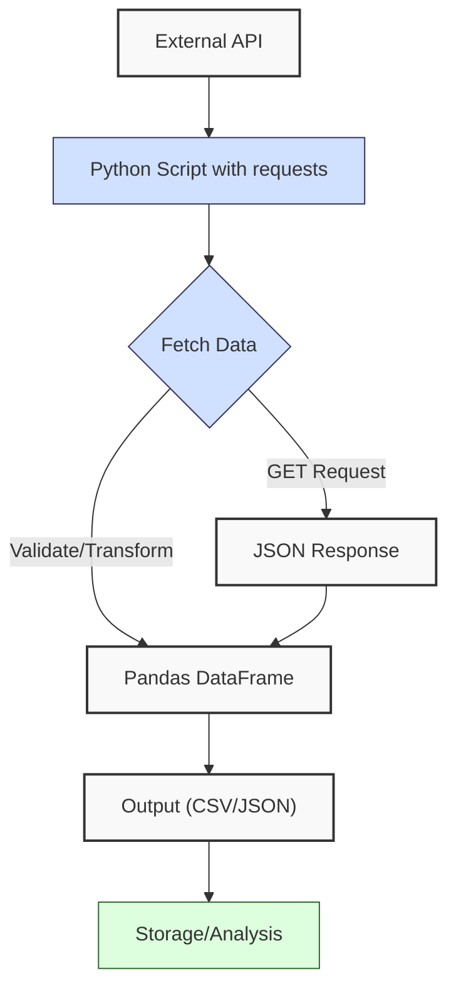
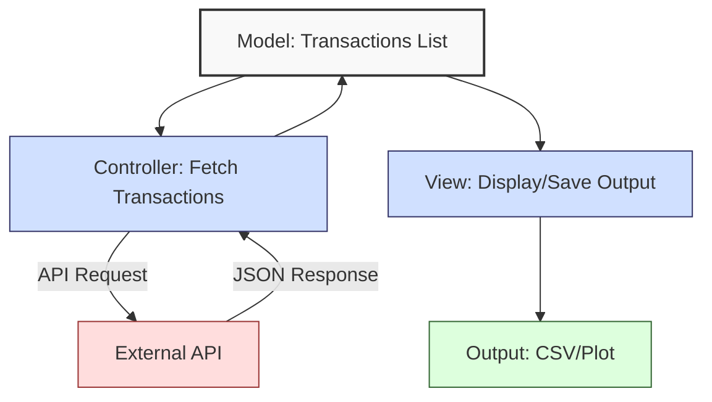
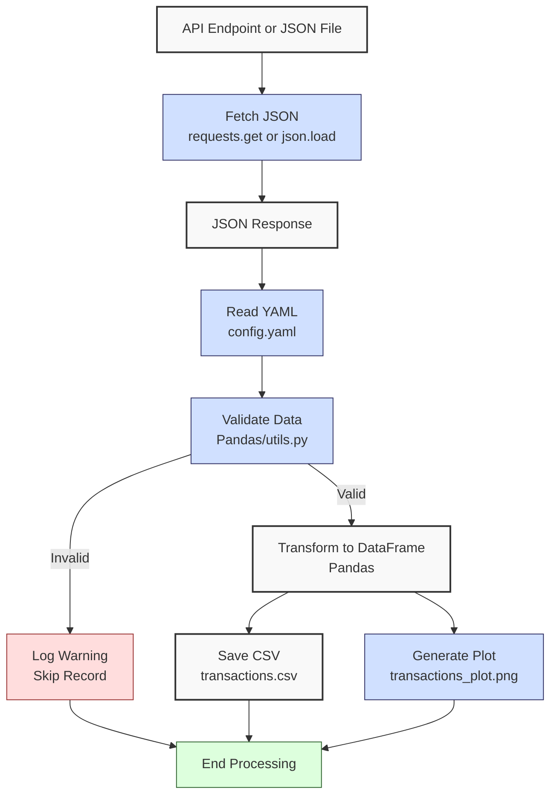

**Complexity: Moderate (M)**

## 4.0 Introduction: Why This Matters for Data Engineering

In data engineering, integrating with web APIs is essential for fetching real-time financial transaction data, such as sales or payment records, critical for Hijra Group’s Sharia-compliant fintech analytics. APIs provide structured data (e.g., JSON) over HTTP, enabling pipelines to ingest external sources like payment gateways or market feeds. This chapter introduces **HTTP fundamentals**, **REST APIs**, **MVC concepts**, and the `requests` library for fetching and processing API data, building on Chapters 1–3’s Python and data handling skills.

This chapter avoids advanced concepts like type annotations (Chapter 7), testing (Chapter 9), error handling with try/except (Chapter 7), or async operations (Chapter 40), focusing on synchronous GET requests, JSON parsing, and basic data validation. All code uses **PEP 8’s 4-space indentation**, preferring spaces over tabs to avoid `IndentationError` due to Python’s white-space sensitivity, ensuring compatibility with Hijra Group’s pipeline scripts.

### Data Engineering Workflow Context

This diagram illustrates how API integration fits into a data engineering pipeline:



### Building On and Preparing For

- **Building On**:
  - Chapter 1: Uses dictionaries and lists for JSON data, loops for processing responses.
  - Chapter 2: Leverages JSON parsing, string manipulation, and modules (`utils.py`) for validation.
  - Chapter 3: Uses Pandas DataFrames for structuring API data, `pandas.read_json` for parsing, and visualization with Matplotlib.
- **Preparing For**:
  - Chapter 5: Prepares for OOP by organizing API fetchers in modules, ready for class-based designs.
  - Chapter 7: Lays groundwork for type-safe API interactions.
  - Chapters 51–52: Enables web frameworks (Django, FastAPI) for building APIs.
  - Chapter 40: Supports async API calls for scalability.

### What You’ll Learn

This chapter covers:

1. **HTTP Fundamentals**: Methods (GET), status codes (200, 404), headers, and query parameters.
2. **REST API Concepts**: Endpoints, JSON responses, and stateless interactions.
3. **MVC Basics**: Model-View-Controller pattern for structuring API-driven applications.
4. **Fetching Data**: Using `requests` for GET requests to fetch transaction data.
5. **Processing Responses**: Parsing JSON, validating with `utils.py`, and transforming into DataFrames.
6. **Visualization**: Plotting API data with Matplotlib.
7. **Performance Analysis**: Measuring request and parsing times.

By the end, you’ll build a transaction data fetcher that retrieves sales data from a mock API or local JSON file, validates it, saves it as `data/transactions.csv`, and visualizes trends, all with 4-space indentation per PEP 8.

**Follow-Along Tips**:

- Ensure `data/config.yaml` and `data/mock_transactions.json` exist in `de-onboarding/data/`.
- Install libraries: `pip install requests pandas matplotlib pyyaml`.
- If `IndentationError`, use **4 spaces** (not tabs) per PEP 8. Run `python -tt script.py` or use VS Code’s Pylint to detect tab/space mixing. See “Debugging Tips” in Section 4.4 for details.
- Use print statements (e.g., `print(response.json())`) to debug API responses. Verify API response structure with `print(response.json())` as fields may vary (e.g., missing `id`).
- Save plots to `data/` (e.g., `transactions_plot.png`) instead of using `plt.show()`.
- Use the mock API (`https://api.mocki.to/v2/83f783a8`) for testing, with `data/mock_transactions.json` as a reliable fallback if the API is unavailable. The mock API is temporary and may become unavailable; use `mock_transactions.json` as a reliable fallback. Real APIs may require authentication (covered in Chapter 65).
- To measure API performance, wrap `requests.get()` with `import time; start = time.time(); ...; print(time.time() - start)` to compare against typical latency (\~100ms) and parsing times (\~10ms). Experiment with timeout values (e.g., 5 or 10 seconds) in `fetch_transactions` to observe effects; see the commented alternative in the function and print the timeout used.
- Mermaid diagrams require a viewer supporting Mermaid v10+ (e.g., VS Code with Markdown Preview Enhanced). If diagrams don’t render, use [https://mermaid-js.github.io/mermaid-live-editor/](https://mermaid-js.github.io/mermaid-live-editor/) or update your plugin.

## 4.1 HTTP Fundamentals

HTTP (HyperText Transfer Protocol) is the foundation of web communication, used by APIs to deliver data. For a typical GET request fetching 1MB of JSON data, network latency (\~100ms) and parsing time (\~10ms) are typical for standard hardware/network conditions (Python PyCon performance talks). Latency dominates over parsing, but actual times vary by network and hardware.

### 4.1.1 HTTP Methods and Status Codes

Use the `requests` library to perform GET requests and handle status codes.

```python
import requests  # Import requests for HTTP requests

# Perform a GET request to a mock API
url = "https://api.mocki.to/v2/83f783a8"  # Mock API endpoint
response = requests.get(url)  # Send GET request

# Check status code
print("Status Code:", response.status_code)  # Debug: print status
if response.status_code == 200:  # Success
    print("Response Data:", response.json())  # Print JSON response
elif response.status_code == 404:  # Not Found
    print("Error: Endpoint not found")  # Log error
elif response.status_code == 500:  # Server Error
    print("Error: Server issue")  # Log error

# Expected Output (with active mock API):
# Status Code: 200
# Response Data: [{'id': 1, 'product': 'Halal Laptop', 'price': 999.99, ...}, ...]
```

**Follow-Along Instructions**:

1. Ensure `de-onboarding/` exists from Chapter 3.
2. Install requests: `pip install requests`.
3. Save as `de-onboarding/http_basics.py`.
4. Configure editor for **4-space indentation** (not tabs) per PEP 8.
5. Run: `python http_basics.py`.
6. Verify output shows status code and JSON data.
7. **Common Errors** (see Debugging Tips in Section 4.4):
   - **ModuleNotFoundError**: Install `requests` with `pip install requests`.
   - **ConnectionError**: Check internet or URL. Print `url` to verify.
   - **IndentationError**: Use 4 spaces (not tabs). Run `python -tt http_basics.py`.

**Key Points**:

- **White-Space Sensitivity and PEP 8**: Indentation (4 spaces per PEP 8) ensures readable conditional blocks. Spaces are preferred over tabs to avoid `IndentationError`.
- **HTTP Methods**: GET retrieves data; others (POST, PUT) are covered in Chapter 52.
- **Status Codes**: 200 (OK), 404 (Not Found), 500 (Server Error).
- **Underlying Implementation**: `requests` uses urllib3 for HTTP, handling TCP connections.
- **Performance Considerations**:
  - **Time Complexity**: O(1) for sending request; O(n) for parsing n-byte response.
  - **Space Complexity**: O(n) for response data (\~1MB for 1MB JSON).
  - **Implication**: Use GET for fetching transaction data in pipelines.

### 4.1.2 Headers and Query Parameters

Add headers and query parameters to customize requests.

```python
import requests  # Import requests

# Define URL and query parameters
url = "https://api.mocki.to/v2/83f783a8"  # Mock API
params = {"limit": 10, "category": "Electronics"}  # Query parameters

# Define headers
headers = {
    "Accept": "application/json",  # Request JSON response
    "User-Agent": "Hijra-Pipeline/1.0"  # Identify client
}  # 4-space indent (PEP 8)

# Send GET request with parameters and headers
response = requests.get(url, params=params, headers=headers)  # Send request
print("Request URL:", response.url)  # Debug: print constructed URL
print("Status Code:", response.status_code)  # Debug: print status
if response.status_code == 200:  # Check success
    print("Response:", response.json())  # Print JSON

# Expected Output (with active mock API):
# Request URL: https://api.mocki.to/v2/83f783a8?limit=10&category=Electronics
# Status Code: 200
# Response: [{'id': 1, 'product': 'Halal Laptop', ...}, ...]
```

**Follow-Along Instructions**:

1. Save as `de-onboarding/http_params.py`.
2. Configure editor for **4-space indentation** (not tabs) per PEP 8.
3. Run: `python http_params.py`.
4. Verify output shows URL with query parameters and JSON response.
5. **Common Errors** (see Debugging Tips in Section 4.4):
   - **KeyError**: Ensure JSON keys exist. Print `response.json()` to verify.
   - **IndentationError**: Use 4 spaces (not tabs). Run `python -tt http_params.py`.

**Key Points**:

- **Query Parameters**: Filter or limit data (e.g., `?limit=10`).
- **Headers**: Specify response format or client info.
- **Time Complexity**: O(1) for adding parameters/headers.
- **Space Complexity**: O(1) for headers/params.
- **Implication**: Use parameters to fetch specific transaction subsets for Hijra Group’s analytics.

## 4.2 REST API Concepts

REST (Representational State Transfer) APIs use HTTP for stateless, resource-based interactions, delivering JSON data for transactions.

### 4.2.1 Endpoints and JSON Responses

Interact with REST endpoints to fetch structured data.

```python
import requests  # Import requests

# Define endpoint
endpoint = "https://api.mocki.to/v2/83f783a8/transactions"  # Mock transactions endpoint

# Fetch data
response = requests.get(endpoint)  # Send GET request
if response.status_code == 200:  # Check success
    transactions = response.json()  # Parse JSON
    print("Transactions:", transactions)  # Debug: print data
    for transaction in transactions:  # Iterate transactions
        print("Transaction:", transaction)  # Print each transaction
else:
    print("Failed to fetch:", response.status_code)  # Log error

# Expected Output (with active mock API):
# Transactions: [{'id': 1, 'product': 'Halal Laptop', 'price': 999.99, 'quantity': 2}, ...]
# Transaction: {'id': 1, 'product': 'Halal Laptop', 'price': 999.99, 'quantity': 2}
# ...
```

**Follow-Along Instructions**:

1. Save as `de-onboarding/rest_basics.py`.
2. Configure editor for **4-space indentation** (not tabs) per PEP 8.
3. Run: `python rest_basics.py`.
4. Verify output shows transactions.
5. **Common Errors** (see Debugging Tips in Section 4.4):
   - **JSONDecodeError**: Ensure valid JSON. Print `response.text` to debug.
   - **IndentationError**: Use 4 spaces (not tabs). Run `python -tt rest_basics.py`.

**Key Points**:

- **Endpoints**: URLs representing resources (e.g., `/transactions`).
- **JSON Responses**: Structured data (lists, dictionaries).
- **Statelessness**: Each request is independent.
- **Time Complexity**: O(n) for parsing n-item JSON.
- **Space Complexity**: O(n) for storing response (\~1MB for 10K transactions).
- **Implication**: REST APIs enable real-time data fetching for pipelines.

## 4.3 MVC Basics

The **Model-View-Controller (MVC)** pattern structures applications, separating data (Model), presentation (View), and logic (Controller). In API integration, the Model is the data structure (e.g., transactions), the Controller handles API requests, and the View is the output (e.g., CSV or plot).

### 4.3.1 Applying MVC to API Integration

Organize API fetching with MVC principles, as shown in this diagram:



```python
# Model: Data structure (list of dictionaries)
transactions = []  # Model: holds transaction data

# Controller: Fetch and process data
def fetch_transactions(url):  # Controller function
    """Fetch transactions from API."""
    response = requests.get(url)  # Send GET request
    if response.status_code == 200:  # Check success
        transactions.extend(response.json())  # Update model
        print("Fetched:", len(transactions), "transactions")  # Debug
    return transactions  # Return updated model

# View: Output data
def display_transactions(transactions):  # View function
    """Display transaction summary."""
    for t in transactions:  # Iterate transactions
        print(f"Product: {t['product']}, Amount: {t['price'] * t['quantity']}")  # 4-space indent (PEP 8)

# Test MVC
url = "https://api.mocki.to/v2/83f783a8"  # Mock API
transactions = fetch_transactions(url)  # Controller: fetch data
display_transactions(transactions)  # View: display data

# Expected Output (with active mock API):
# Fetched: 3 transactions
# Product: Halal Laptop, Amount: 1999.98
# ...
```

**Follow-Along Instructions**:

1. Save as `de-onboarding/mvc_basics.py`.
2. Configure editor for **4-space indentation** (not tabs) per PEP 8.
3. Run: `python mvc_basics.py`.
4. Verify output shows transaction count and summaries.
5. **Common Errors** (see Debugging Tips in Section 4.4):
   - **KeyError**: Ensure JSON keys exist. Print `transactions` to verify.
   - **IndentationError**: Use 4 spaces (not tabs). Run `python -tt mvc_basics.py`.

**Key Points**:

- **Model**: Stores data (e.g., transactions list).
- **Controller**: Manages logic (e.g., API requests).
- **View**: Presents data (e.g., console, CSV, plots).
- **Time Complexity**: O(n) for iterating n transactions.
- **Space Complexity**: O(n) for storing transactions.
- **Implication**: MVC organizes pipeline code for scalability, preparing for Django/FastAPI.

## 4.4 Micro-Project: Transaction Data Fetcher

### Project Requirements

Build a Python script to fetch financial transaction data from a mock API (or local JSON file) for Hijra Group’s analytics, processing it into a CSV and visualizing trends:

- Fetch data from `https://api.mocki.to/v2/83f783a8`, falling back to `data/mock_transactions.json` if the API is unavailable.
- Read `data/config.yaml` with PyYAML for validation rules.
- Validate transactions using `utils.py`, ensuring Halal products and config rules.
- Transform data into a Pandas DataFrame and save to `data/transactions.csv`.
- Generate a sales trend plot saved to `data/transactions_plot.png`.
- Log steps and invalid records using print statements.
- Use **4-space indentation** per PEP 8, preferring spaces over tabs.

### Sample Input Files

`data/config.yaml` (from Chapter 3):

```yaml
min_price: 10.0
max_quantity: 100
required_fields:
  - product
  - price
  - quantity
product_prefix: 'Halal'
max_decimals: 2
max_price: 10000.0
```

`data/mock_transactions.json` (fallback for mock API):

```json
[
  { "id": 1, "product": "Halal Laptop", "price": 999.99, "quantity": 2 },
  { "id": 2, "product": "Halal Mouse", "price": 24.99, "quantity": 10 },
  { "id": 3, "product": "Halal Keyboard", "price": 49.99, "quantity": 5 },
  { "id": 4, "product": "", "price": 29.99, "quantity": 3 },
  { "id": 5, "product": "Monitor", "price": "invalid", "quantity": 2 },
  { "id": 6, "product": "Headphones", "price": 5.0, "quantity": 150 }
]
```

**Mock API Response** (`https://api.mocki.to/v2/83f783a8`):

```json
[
  { "id": 1, "product": "Halal Laptop", "price": 999.99, "quantity": 2 },
  { "id": 2, "product": "Halal Mouse", "price": 24.99, "quantity": 10 },
  { "id": 3, "product": "Halal Keyboard", "price": 49.99, "quantity": 5 },
  { "id": 4, "product": "", "price": 29.99, "quantity": 3 },
  { "id": 5, "product": "Monitor", "price": "invalid", "quantity": 2 },
  { "id": 6, "product": "Headphones", "price": 5.0, "quantity": 150 }
]
```

### Data Processing Flow



### Acceptance Criteria

- **Go Criteria**:
  - Fetches and parses API or local JSON data correctly.
  - Validates transactions for required fields, Halal prefix, numeric price/quantity, positive prices, non-negative quantities, and config rules (including max price).
  - Saves valid data to `data/transactions.csv`.
  - Generates plot to `data/transactions_plot.png`.
  - Logs steps and invalid records.
  - Uses 4-space indentation per PEP 8, preferring spaces over tabs.
- **No-Go Criteria**:
  - Fails to fetch or parse data.
  - Incorrect validation or calculations.
  - Missing CSV or plot.
  - Uses try/except or type annotations.
  - Inconsistent indentation or tab/space mixing.

### Common Pitfalls to Avoid

1. **API Fetch Failure**:
   - **Problem**: Invalid URL or network issues. The mock API may be temporary; use `mock_transactions.json` if unavailable.
   - **Solution**: Print `url` and `response.status_code`. Check internet. Use `data/mock_transactions.json` as fallback.
2. **JSON Parsing Errors**:
   - **Problem**: Invalid JSON response or file.
   - **Solution**: Print `response.text` or JSON file content to debug.
3. **Validation Errors**:
   - **Problem**: Missing fields or invalid prices cause filtering issues.
   - **Solution**: Use `dropna()` and print `df.head()`.
4. **Type Mismatches**:
   - **Problem**: Non-numeric prices in JSON.
   - **Solution**: Validate with `utils.is_numeric_value`. Print `df.dtypes`.
5. **Plotting Issues**:
   - **Problem**: Plot not saved.
   - **Solution**: Use `plt.savefig()` and check permissions. Print `plt.get_fignums()`.
6. **IndentationError**:
   - **Problem**: Mixed spaces/tabs.
   - **Solution**: Use 4 spaces per PEP 8. Run `python -tt transaction_fetcher.py`.

### How This Differs from Production

In production, this solution would include:

- **Error Handling**: Try/except for network errors and malformed JSON structures (Chapter 7).
- **Type Safety**: Type annotations with Pyright (Chapter 7).
- **Testing**: Unit tests with `pytest` (Chapter 9).
- **Scalability**: Async requests for multiple APIs (Chapter 40).
- **Authentication**: OAuth2 for secure APIs (Chapter 65).
- **Logging**: File-based logging (Chapter 52).
- **Visualization**: Interactive dashboards with Metabase (Chapter 51).

### Debugging Tips

Use this checklist to troubleshoot issues systematically:

- **API Issues**: Print `url`, `response.status_code`, `response.text` to verify connectivity and response.
- **JSON Parsing**: Print `response.json()` or JSON file content to check structure. Verify fields with `print(list(transactions[0].keys()) if transactions else [])`.
- **DataFrame Issues**: Print `df.head()`, `df.dtypes`, `df.columns` to inspect data.
- **Validation**: Print `transaction` before `utils.validate_transaction` to verify inputs.
- **Plotting**: Print `plt.get_fignums()` to confirm plot creation; check `data/` permissions with `ls -l data/` (Unix) or `dir data\` (Windows).
- **Indentation**: Run `python -tt script.py` to detect tab/space mixing. Ensure editor uses 4 spaces (VS Code: “Editor: Tab Size” = 4, “Editor: Insert Spaces” = true).
- **Diagram Rendering**: If Mermaid diagrams fail to render, copy the diagram code to [https://mermaid-js.github.io/mermaid-live-editor/](https://mermaid-js.github.io/mermaid-live-editor/) to visualize.

### Implementation

```python
# File: de-onboarding/utils.py (from Chapter 3, updated for JSON)
def is_numeric(s, max_decimals=2):  # Check if string is a decimal number
    """Check if string is a decimal number with up to max_decimals."""
    if isinstance(s, (int, float)):  # Handle numeric types from JSON
        s = str(s)  # Convert to string
    parts = s.split(".")  # Split on decimal point
    if len(parts) != 2 or not parts[0].replace("-", "").isdigit() or not parts[1].isdigit():
        return False  # Invalid format
    return len(parts[1]) <= max_decimals  # Check decimal places

def clean_string(s):  # Clean string by stripping whitespace
    """Strip whitespace from string."""
    return str(s).strip()  # Convert to string and strip

def is_numeric_value(x):  # Check if value is numeric
    """Check if value is an integer or float."""
    return isinstance(x, (int, float))  # Return True for numeric types

def has_valid_decimals(x, max_decimals):  # Check decimal places
    """Check if value has valid decimal places."""
    return is_numeric(str(x), max_decimals)  # Use is_numeric for validation

def validate_transaction(transaction, config):  # Validate a transaction dictionary
    """Validate transaction based on config rules."""
    required_fields = config["required_fields"]  # Get required fields
    min_price = config["min_price"]  # Get minimum price
    max_price = config.get("max_price", float("inf"))  # Get max price, default to infinity
    max_quantity = config["max_quantity"]  # Get maximum quantity
    prefix = config["product_prefix"]  # Get product prefix
    max_decimals = config["max_decimals"]  # Get max decimal places

    print(f"Validating transaction: {transaction}")  # Debug: print transaction
    # Check for missing or empty fields
    for field in required_fields:  # Loop through required fields
        if field not in transaction or not transaction[field] or clean_string(transaction[field]) == "":
            print(f"Invalid transaction: missing {field}: {transaction}")  # Log invalid
            return False

    # Validate product: non-empty and matches prefix
    product = clean_string(transaction["product"])  # Clean product string
    if not product.startswith(prefix):  # Check prefix
        print(f"Invalid transaction: product lacks '{prefix}' prefix: {transaction}")  # Log invalid
        return False

    # Validate price: numeric, meets minimum/maximum, positive, and not negative
    price = transaction["price"]  # Get price
    if not is_numeric_value(price) or not has_valid_decimals(price, max_decimals) or float(price) < min_price or float(price) <= 0 or float(price) > max_price:
        print(f"Invalid transaction: invalid price: {transaction}")  # Log invalid
        return False

    # Validate quantity: integer, within limit, and not negative
    quantity = transaction["quantity"]  # Get quantity
    if not isinstance(quantity, int) or quantity > max_quantity or quantity < 0:
        print(f"Invalid transaction: invalid quantity: {transaction}")  # Log invalid
        return False

    return True  # Return True if all checks pass

# File: de-onboarding/transaction_fetcher.py
import requests  # For API requests
import pandas as pd  # For DataFrame operations
import yaml  # For YAML parsing
import json  # For JSON file loading
import matplotlib.pyplot as plt  # For plotting
import utils  # Import custom utils module
import os  # For file existence check

# Define function to read YAML configuration
def read_config(config_path):  # Takes config file path
    """Read YAML configuration."""
    print(f"Opening config: {config_path}")  # Debug: print path
    file = open(config_path, "r")  # Open YAML
    config = yaml.safe_load(file)  # Parse YAML
    file.close()  # Close file
    print(f"Loaded config: {config}")  # Debug: print config
    return config  # Return config dictionary

# Define function to fetch transactions from API or local JSON
def fetch_transactions(api_url, json_path, timeout=5):  # Takes API URL, JSON path, and timeout
    """Fetch transactions from API, falling back to local JSON if API fails."""
    print(f"Using timeout: {timeout} seconds")  # Debug: print timeout
    print(f"Fetching from: {api_url}")  # Debug: print URL
    response = requests.get(api_url, timeout=timeout)  # Send GET request with timeout to prevent hanging on slow APIs
    # For slower networks, use timeout=10: response = requests.get(api_url, timeout=10)
    print("Status Code:", response.status_code)  # Debug: print status
    if response.status_code == 200:  # Check for success
        transactions = response.json()  # Parse JSON
    else:
        print(f"API failed: {response.status_code}. Falling back to {json_path}")  # Log fallback
        if not os.path.exists(json_path):  # Check if JSON file exists
            print(f"JSON file not found: {json_path}")  # Log error
            return []  # Return empty list
        file = open(json_path, "r")  # Open JSON file
        transactions = json.load(file)  # Load JSON
        file.close()  # Close file
        print(f"Loaded from {json_path}")  # Confirm load

    print("Fetched transactions:", len(transactions))  # Debug: print count
    print("Response structure:", list(transactions[0].keys()) if transactions else [])  # Debug: print fields
    return transactions  # Return transactions list

# Define function to validate and transform transactions
def process_transactions(transactions, config):  # Takes transactions list and config
    """Validate transactions and convert to DataFrame."""
    if not transactions:  # Check for empty data
        print("No transactions to process")  # Log empty
        return pd.DataFrame(), 0, len(transactions)

    # Convert to DataFrame
    df = pd.DataFrame(transactions)  # Create DataFrame from JSON
    print("Initial DataFrame:")  # Debug
    print(df.head())  # Show first 5 rows

    # Validate required fields
    required_fields = config["required_fields"]  # Get required fields
    missing_fields = [f for f in required_fields if f not in df.columns]
    if missing_fields:  # Check for missing columns
        print(f"Missing columns: {missing_fields}")  # Log error
        return pd.DataFrame(), 0, len(df)

    # Clean and filter DataFrame
    df = df.dropna(subset=["product"])  # Drop rows with missing product
    df = df[df["product"].str.startswith(config["product_prefix"])]  # Filter Halal products
    df = df[df["quantity"].apply(lambda x: isinstance(x, int))]  # Ensure quantity is integer
    df = df[df["quantity"] <= config["max_quantity"]]  # Filter quantity <= max_quantity
    df = df[df["quantity"] >= 0]  # Filter non-negative quantity
    df = df[df["price"].apply(utils.is_numeric_value)]  # Ensure price is numeric
    df = df[df["price"] > 0]  # Filter positive prices
    df = df[df["price"] >= config["min_price"]]  # Filter price >= min_price
    df = df[df["price"] <= config.get("max_price", float("inf"))]  # Filter price <= max_price
    df = df[df["price"].apply(lambda x: utils.has_valid_decimals(x, config["max_decimals"]))]  # Check decimals

    # Compute amount
    df["amount"] = df["price"] * df["quantity"]  # Price * quantity
    print("Validated DataFrame:")  # Debug
    print(df)  # Show filtered DataFrame

    total_records = len(transactions)  # Count total records
    valid_transactions = len(df)  # Count valid records
    return df, valid_transactions, total_records  # Return DataFrame and counts

# Define function to save DataFrame to CSV
def save_to_csv(df, csv_path):  # Takes DataFrame and file path
    """Save DataFrame to CSV."""
    if df.empty:  # Check for empty DataFrame
        print("No data to save")  # Log empty
        return
    print(f"Saving to: {csv_path}")  # Debug: print path
    df.to_csv(csv_path, index=False)  # Save to CSV
    print(f"Saved to {csv_path}")  # Confirm save
    print(f"File exists: {os.path.exists(csv_path)}")  # Confirm file creation

# Define function to plot transactions
def plot_transactions(df, plot_path):  # Takes DataFrame and plot path
    """Generate sales trend plot."""
    if df.empty:  # Check for empty DataFrame
        print("No data to plot")  # Log empty
        return

    plt.figure(figsize=(8, 6))  # Set figure size
    plt.bar(df["product"], df["amount"])  # Bar plot
    plt.title("Transaction Amounts by Product")  # Title
    plt.xlabel("Product")  # X-axis label
    plt.ylabel("Amount ($)")  # Y-axis label
    plt.xticks(rotation=45)  # Rotate x labels
    plt.grid(True)  # Add grid
    plt.tight_layout()  # Adjust layout
    plt.savefig(plot_path)  # Save plot
    plt.close()  # Close figure
    print(f"Plot saved to {plot_path}")  # Confirm save
    print(f"File exists: {os.path.exists(plot_path)}")  # Confirm file creation

# Define main function
def main():  # No parameters
    """Main function to fetch and process transaction data."""
    api_url = "https://api.mocki.to/v2/83f783a8"  # Mock API URL
    json_path = "data/mock_transactions.json"  # Fallback JSON path
    config_path = "data/config.yaml"  # YAML path
    csv_path = "data/transactions.csv"  # CSV output path
    plot_path = "data/transactions_plot.png"  # Plot output path
    timeout = 5  # Timeout in seconds

    config = read_config(config_path)  # Read config
    transactions = fetch_transactions(api_url, json_path, timeout)  # Fetch transactions
    df, valid_transactions, total_records = process_transactions(transactions, config)  # Process
    save_to_csv(df, csv_path)  # Save to CSV
    plot_transactions(df, plot_path)  # Generate plot

    # Output report
    print("\nTransaction Report:")  # Print header
    print(f"Total Records Processed: {total_records}")  # Total records
    print(f"Valid Transactions: {valid_transactions}")  # Valid count
    print(f"Invalid Transactions: {total_records - valid_transactions}")  # Invalid count
    print(f"Total Amount: ${round(df['amount'].sum(), 2) if not df.empty else 0.0}")  # Total amount
    print(f"Unique Products: {df['product'].unique().tolist() if not df.empty else []}")  # Products
    print("Processing completed")  # Confirm completion

if __name__ == "__main__":
    main()  # Run main function
```

### Expected Outputs

`data/transactions.csv`:

```csv
id,product,price,quantity,amount
1,Halal Laptop,999.99,2,1999.98
2,Halal Mouse,24.99,10,249.90
3,Halal Keyboard,49.99,5,249.95
```

`data/transactions_plot.png`: Bar plot showing transaction amounts for Halal products.

**Console Output** (abridged):

```
Opening config: data/config.yaml
Loaded config: {'min_price': 10.0, 'max_quantity': 100, 'required_fields': ['product', 'price', 'quantity'], 'product_prefix': 'Halal', 'max_decimals': 2, 'max_price': 10000.0}
Using timeout: 5 seconds
Fetching from: https://api.mocki.to/v2/83f783a8
Status Code: 200
Fetched transactions: 6
Response structure: ['id', 'product', 'price', 'quantity']
Initial DataFrame:
   id         product   price  quantity
0   1   Halal Laptop  999.99         2
1   2    Halal Mouse   24.99        10
2   3  Halal Keyboard   49.99         5
3   4                    29.99         3
4   5       Monitor  invalid         2
Validating transaction: {'id': 1, 'product': 'Halal Laptop', 'price': 999.99, 'quantity': 2}
...
Invalid transaction: missing product: {'id': 4, 'product': '', 'price': 29.99, 'quantity': 3}
...
Validated DataFrame:
   id         product   price  quantity   amount
0   1   Halal Laptop  999.99         2  1999.98
1   2    Halal Mouse   24.99        10   249.90
2   3  Halal Keyboard   49.99         5   249.95
Saving to: data/transactions.csv
Saved to data/transactions.csv
File exists: True
Plot saved to data/transactions_plot.png
File exists: True

Transaction Report:
Total Records Processed: 6
Valid Transactions: 3
Invalid Transactions: 3
Total Amount: $2499.83
Unique Products: ['Halal Laptop', 'Halal Mouse', 'Halal Keyboard']
Processing completed
```

### How to Run and Test

1. **Setup**:

   - **Setup Checklist**:

     - \[ \] Ensure `de-onboarding/data/` exists.
     - \[ \] Copy `config.yaml` to `data/`.
     - \[ \] Generate `data/mock_transactions.json` by running the following script in `de-onboarding/`:

       ```python
       import json

       transactions = [
           {"id": 1, "product": "Halal Laptop", "price": 999.99, "quantity": 2},
           {"id": 2, "product": "Halal Mouse", "price": 24.99, "quantity": 10},
           {"id": 3, "product": "Halal Keyboard", "price": 49.99, "quantity": 5},
           {"id": 4, "product": "", "price": 29.99, "quantity": 3},
           {"id": 5, "product": "Monitor", "price": "invalid", "quantity": 2},
           {"id": 6, "product": "Headphones", "price": 5.00, "quantity": 150}
       ]
       with open("data/mock_transactions.json", "w") as file:
           json.dump(transactions, file, indent=2)
       print("Created data/mock_transactions.json")
       ```

       Save as `generate_mock_json.py` and run: `python generate_mock_json.py`. Verify file exists with `ls data/` (Unix) or `dir data\` (Windows).

     - \[ \] Install libraries: `pip install requests pandas matplotlib pyyaml`.
     - \[ \] Create virtual environment: `python -m venv venv`, activate (Windows: `venv\Scripts\activate`, Unix: `source venv/bin/activate`).
     - \[ \] Verify Python 3.10+: `python --version`.
     - \[ \] Configure editor for 4-space indentation per PEP 8 (VS Code: “Editor: Tab Size” = 4, “Editor: Insert Spaces” = true, “Editor: Detect Indentation” = false).
     - \[ \] Save `utils.py` and `transaction_fetcher.py` in `de-onboarding/`.

   - **Troubleshooting** (see Debugging Tips):
     - If `FileNotFoundError`, verify paths with `pwd` or `cd`.
     - If `ModuleNotFoundError`, install libraries or check `utils.py` path.
     - If `IndentationError`, use 4 spaces (not tabs). Run `python -tt transaction_fetcher.py`.

2. **Run**:

   - Open terminal in `de-onboarding/`.
   - Run: `python transaction_fetcher.py`.
   - Outputs: `data/transactions.csv`, `data/transactions_plot.png`, console logs.

3. **Test Scenarios**:

   - **Valid Data**: Verify `transactions.csv` contains 3 rows, `transactions_plot.png` shows bars, and report shows `Total Amount: $2499.83`.
   - **Invalid Records**: Check console for warnings on missing fields, non-Halal products, invalid price/quantity, or negative prices.
   - **Empty Response**: Mock an empty response:

     ```python
     transactions = []
     df, valid_transactions, total_records = process_transactions(transactions, config)
     print(df, valid_transactions, total_records)
     # Expected: Empty DataFrame, 0, 0
     ```

   - **Invalid JSON**: Simulate invalid JSON:

     ```python
     transactions = [{"product": "Halal Laptop", "price": "invalid", "quantity": 2}]
     df, valid_transactions, total_records = process_transactions(transactions, config)
     print(df)
     # Expected: Empty DataFrame
     ```

   - **API Failure with Fallback**: Simulate API failure by using an invalid URL:

     ```python
     transactions = fetch_transactions("https://invalid.url", "data/mock_transactions.json", timeout=5)
     print(transactions)
     # Expected: Transactions from mock_transactions.json
     ```

   - **Negative Quantities**: Simulate negative quantities:

     ```python
     transactions = [{"product": "Halal Laptop", "price": 999.99, "quantity": -2}]
     df, valid_transactions, total_records = process_transactions(transactions, config)
     print(df)
     # Expected: Empty DataFrame
     ```

   - **Excessive Prices**: Simulate high prices:

     ```python
     transactions = [{"product": "Halal Laptop", "price": 20000.0, "quantity": 2}]
     df, valid_transactions, total_records = process_transactions(transactions, config)
     print(df)
     # Expected: Empty DataFrame
     ```

## 4.5 Practice Exercises

### Exercise 1: API Fetcher

Write a function to fetch data from a mock API and return JSON, with 4-space indentation per PEP 8.

**Sample Input**:

```python
url = "https://api.mocki.to/v2/83f783a8"
```

**Expected Output**:

```
[{'id': 1, 'product': 'Halal Laptop', 'price': 999.99, 'quantity': 2}, ...]
```

**Follow-Along Instructions**:

1. Save as `de-onboarding/ex1_api.py`.
2. Configure editor for 4-space indentation per PEP 8.
3. Run: `python ex1_api.py`.
4. **How to Test**:
   - Add: `print(fetch_api_data(url))`.
   - Verify output shows transaction list.
   - Test with invalid URL: Should return `[]`.
   - **Common Errors** (see Debugging Tips in Section 4.4):
     - **ConnectionError**: Print `url` to verify.
     - **IndentationError**: Use 4 spaces (not tabs). Run `python -tt ex1_api.py`.

### Exercise 2: Query Parameter Fetcher

Write a function to fetch API data with query parameters, with 4-space indentation per PEP 8.

**Sample Input**:

```python
url = "https://api.mocki.to/v2/83f783a8"
params = {"limit": 5}
```

**Expected Output**:

```
[{'id': 1, 'product': 'Halal Laptop', ...}, ...] (up to 5 items)
```

**Follow-Along Instructions**:

1. Save as `de-onboarding/ex2_params.py`.
2. Configure editor for 4-space indentation per PEP 8.
3. Run: `python ex2_params.py`.
4. **How to Test**:
   - Add: `print(fetch_with_params(url, params))`.
   - Verify output shows up to 5 transactions.
   - Test with empty params: Should return full data.
   - **Common Errors** (see Debugging Tips in Section 4.4):
     - **KeyError**: Print `response.json()` to verify.
     - **IndentationError**: Use 4 spaces (not tabs). Run `python -tt ex2_params.py`.

### Exercise 3: JSON to DataFrame

Write a function to convert JSON transactions to a DataFrame, with 4-space indentation per PEP 8.

**Sample Input**:

```python
transactions = [
    {"product": "Halal Laptop", "price": 999.99, "quantity": 2},
    {"product": "Halal Mouse", "price": 24.99, "quantity": 10}
]
```

**Expected Output**:

```
          product   price  quantity
0   Halal Laptop  999.99         2
1    Halal Mouse   24.99        10
```

**Follow-Along Instructions**:

1. Save as `de-onboarding/ex3_dataframe.py`.
2. Configure editor for 4-space indentation per PEP 8.
3. Run: `python ex3_dataframe.py`.
4. **How to Test**:
   - Add: `print(json_to_dataframe(transactions))`.
   - Verify output matches DataFrame.
   - Test with empty list: Should return empty DataFrame.
   - **Common Errors** (see Debugging Tips in Section 4.4):
     - **KeyError**: Print `transactions` to verify.
     - **IndentationError**: Use 4 spaces (not tabs). Run `python -tt ex3_dataframe.py`.

### Exercise 4: Visualization

Write a function to plot transaction amounts, saving to `data/plot.png`, with 4-space indentation per PEP 8.

**Sample Input**:

```python
df = pd.DataFrame({
    "product": ["Halal Laptop", "Halal Mouse"],
    "amount": [1999.98, 249.90]
})
```

**Expected Output**:

```
Plot saved to data/plot.png
```

**Follow-Along Instructions**:

1. Save as `de-onboarding/ex4_plot.py`.
2. Configure editor for 4-space indentation per PEP 8.
3. Run: `python ex4_plot.py`.
4. **How to Test**:
   - Verify `data/plot.png` exists with correct bars.
   - Test with empty DataFrame: Should not generate plot.
   - **Common Errors** (see Debugging Tips in Section 4.4):
     - **FileNotFoundError**: Check `data/` permissions.
     - **IndentationError**: Use 4 spaces (not tabs). Run `python -tt ex4_plot.py`.

### Exercise 5: Negative Quantity Validator

Update `utils.py` to validate negative quantities and write a function to filter transactions with non-negative quantities, with 4-space indentation per PEP 8.

**Sample Input**:

```python
transactions = [
    {"product": "Halal Laptop", "price": 999.99, "quantity": 2},
    {"product": "Halal Mouse", "price": 24.99, "quantity": -10}
]
config = {
    "required_fields": ["product", "price", "quantity"],
    "product_prefix": "Halal",
    "min_price": 10.0,
    "max_quantity": 100,
    "max_decimals": 2,
    "max_price": 10000.0
}
```

**Expected Output**:

```
[{'product': 'Halal Laptop', 'price': 999.99, 'quantity': 2}]
```

**Follow-Along Instructions**:

1. Update `utils.py` with negative quantity validation (see micro-project’s `validate_transaction`).
2. Save main script as `de-onboarding/ex5_validate.py`.
3. Configure editor for 4-space indentation per PEP 8.
4. Run: `python ex5_validate.py`.
5. **How to Test**:
   - Add: `print(filter_transactions(transactions, config))`.
   - Verify output shows only valid transactions.
   - Test with all negative quantities: Should return `[]`.
   - **Common Errors** (see Debugging Tips in Section 4.4):
     - **KeyError**: Print `transaction` to verify.
     - **IndentationError**: Use 4 spaces (not tabs). Run `python -tt ex5_validate.py`.

### Exercise 6: Conceptual Analysis

Explain when to use APIs vs. CSVs for data ingestion in Hijra Group’s pipelines, saving answers to `de-onboarding/ex6_concepts.txt`. Discuss your answers with a peer or instructor to compare scenarios where APIs or CSVs are preferred, noting at least two discussion points in `ex6_concepts.txt`.

**Expected Output**:

- **APIs**: “Use APIs for real-time data like transaction updates, as they provide fresh data via HTTP.”
- **CSVs**: “Use CSVs for batch processing of historical data, as they are simple and static.”

**Follow-Along Instructions**:

1. Save answers as `de-onboarding/ex6_concepts.txt`.
2. Discuss with a peer or instructor, noting at least two differences (e.g., “APIs may require authentication, unlike CSVs”).
3. Compare with solutions in Section 4.6.
4. **How to Test**:
   - Review answers against sample solution.
   - **Common Errors**: Clarify APIs for dynamic data vs. CSVs for static data.

### Exercise 7: Performance Measurement

Modify the API fetcher from Exercise 1 to measure the time taken for `requests.get()` and JSON parsing, saving results to `de-onboarding/ex7_timing.txt`, with 4-space indentation per PEP 8. Measuring request and parsing times helps optimize pipeline performance, as slow APIs can bottleneck real-time analytics.

**Sample Input**:

```python
url = "https://api.mocki.to/v2/83f783a8"
```

**Expected Output** (in `ex7_timing.txt`):

```
Request Time: 0.095 seconds
Parsing Time: 0.002 seconds
Compared to chapter estimates (100ms request, 10ms parsing), request is typical, parsing is faster.
Faster parsing improves pipeline throughput for large datasets.
```

**Follow-Along Instructions**:

1. Save as `de-onboarding/ex7_timing.py`.
2. Configure editor for 4-space indentation per PEP 8.
3. Run: `python ex7_timing.py`.
4. **How to Test**:
   - Verify `ex7_timing.txt` contains timing data and comparison.
   - Test with invalid URL: Should return `[]` and write zero times.
   - **Common Errors** (see Debugging Tips in Section 4.4):
     - **ConnectionError**: Print `url` to verify.
     - **IndentationError**: Use 4 spaces (not tabs). Run `python -tt ex7_timing.py`.

### Exercise 8: Maximum Price Validator

Update `utils.py` to validate prices below a `max_price` from the config and write a function to filter transactions with valid prices, with 4-space indentation per PEP 8.

**Sample Input**:

```python
transactions = [
    {"product": "Halal Laptop", "price": 999.99, "quantity": 2},
    {"product": "Halal Server", "price": 20000.0, "quantity": 1}
]
config = {
    "required_fields": ["product", "price", "quantity"],
    "product_prefix": "Halal",
    "min_price": 10.0,
    "max_price": 10000.0,
    "max_quantity": 100,
    "max_decimals": 2
}
```

**Expected Output**:

```
[{'product': 'Halal Laptop', 'price': 999.99, 'quantity': 2}]
```

**Follow-Along Instructions**:

1. Update `utils.py` with maximum price validation (see micro-project’s `validate_transaction`).
2. Save main script as `de-onboarding/ex8_validate.py`.
3. Configure editor for 4-space indentation per PEP 8.
4. Run: `python ex8_validate.py`.
5. **How to Test**:
   - Add: `print(filter_transactions(transactions, config))`.
   - Verify output shows only valid transactions.
   - Test with all excessive prices: Should return `[]`.
   - **Common Errors** (see Debugging Tips in Section 4.4):
     - **KeyError**: Print `transaction` to verify.
     - **IndentationError**: Use 4 spaces (not tabs). Run `python -tt ex8_validate.py`.

### Exercise 9: Debug an API Fetcher

Fix this buggy code that fails with `KeyError`, ensuring 4-space indentation per PEP 8.

**Buggy Code**:

```python
import requests
def fetch_transactions(url):
    response = requests.get(url)
    transactions = response.json()
    for t in transactions:
        print(t["name"])  # Bug: Wrong key
    return transactions

url = "https://api.mocki.to/v2/83f783a8"
print(fetch_transactions(url))  # KeyError
```

**Expected Output**:

```
Product: Halal Laptop
...
[{'id': 1, 'product': 'Halal Laptop', ...}, ...]
```

**Follow-Along Instructions**:

1. Save as `de-onboarding/ex9_debug.py`.
2. Configure editor for 4-space indentation per PEP 8.
3. Run: `python ex9_debug.py` to see error.
4. Fix and re-run.
5. **How to Test**:
   - Verify output shows products and transactions.
   - Test with invalid URL: Should return `[]`.
   - **Common Errors** (see Debugging Tips in Section 4.4):
     - **KeyError**: Print `transactions` to verify fields.
     - **IndentationError**: Use 4 spaces (not tabs). Run `python -tt ex9_debug.py`.

## 4.6 Exercise Solutions

### Solution to Exercise 1: API Fetcher

```python
import requests  # Import requests

def fetch_api_data(url):  # Takes API URL
    """Fetch data from API."""
    print(f"Fetching: {url}")  # Debug
    response = requests.get(url)  # Send GET request
    if response.status_code != 200:  # Check success
        print(f"Failed: {response.status_code}")  # Log error
        return []  # Return empty list
    return response.json()  # Return JSON data

# Test
url = "https://api.mocki.to/v2/83f783a8"  # Mock API
print(fetch_api_data(url))  # Call function

# Output:
# Fetching: https://api.mocki.to/v2/83f783a8
# [{'id': 1, 'product': 'Halal Laptop', 'price': 999.99, 'quantity': 2}, ...]
```

### Solution to Exercise 2: Query Parameter Fetcher

```python
import requests  # Import requests

def fetch_with_params(url, params):  # Takes URL and params
    """Fetch API data with query parameters."""
    print(f"Fetching: {url} with {params}")  # Debug
    response = requests.get(url, params=params)  # Send GET request
    if response.status_code != 200:  # Check success
        print(f"Failed: {response.status_code}")  # Log error
        return []  # Return empty list
    return response.json()  # Return JSON data

# Test
url = "https://api.mocki.to/v2/83f783a8"  # Mock API
params = {"limit": 5}  # Query parameters
print(fetch_with_params(url, params))  # Call function

# Output:
# Fetching: https://api.mocki.to/v2/83f783a8 with {'limit': 5}
# [{'id': 1, 'product': 'Halal Laptop', ...}, ...]
```

### Solution to Exercise 3: JSON to DataFrame

```python
import pandas as pd  # Import Pandas

def json_to_dataframe(transactions):  # Takes transactions list
    """Convert JSON transactions to DataFrame."""
    df = pd.DataFrame(transactions)  # Create DataFrame
    print("DataFrame:")  # Debug
    print(df)  # Show DataFrame
    return df  # Return DataFrame

# Test
transactions = [
    {"product": "Halal Laptop", "price": 999.99, "quantity": 2},
    {"product": "Halal Mouse", "price": 24.99, "quantity": 10}
]  # Sample data
print(json_to_dataframe(transactions))  # Call function

# Output:
# DataFrame:
#          product   price  quantity
# 0   Halal Laptop  999.99         2
# 1    Halal Mouse   24.99        10
```

### Solution to Exercise 4: Visualization

```python
import pandas as pd  # Import Pandas
import matplotlib.pyplot as plt  # Import Matplotlib

def plot_transactions(df, plot_path):  # Takes DataFrame and plot path
    """Plot transaction amounts."""
    if df.empty:  # Check for empty DataFrame
        print("No data to plot")  # Log empty
        return
    plt.figure(figsize=(8, 6))  # Set figure size
    plt.bar(df["product"], df["amount"])  # Bar plot
    plt.title("Transaction Amounts")  # Title
    plt.xlabel("Product")  # X-axis label
    plt.ylabel("Amount ($)")  # Y-axis label
    plt.xticks(rotation=45)  # Rotate x labels
    plt.grid(True)  # Add grid
    plt.tight_layout()  # Adjust layout
    plt.savefig(plot_path)  # Save plot
    plt.close()  # Close figure
    print(f"Plot saved to {plot_path}")  # Confirm save

# Test
df = pd.DataFrame({
    "product": ["Halal Laptop", "Halal Mouse"],
    "amount": [1999.98, 249.90]
})  # Sample data
plot_transactions(df, "data/plot.png")  # Call function

# Output:
# Plot saved to data/plot.png
```

### Solution to Exercise 5: Negative Quantity Validator

```python
# File: de-onboarding/utils.py (updated for Exercise 5, see micro-project)
# Note: validate_transaction already checks quantity >= 0

# File: de-onboarding/ex5_validate.py
import utils  # Import utils module

def filter_transactions(transactions, config):  # Takes transactions and config
    """Filter transactions with non-negative quantities."""
    valid_transactions = []  # Initialize list
    for transaction in transactions:  # Iterate transactions
        if utils.validate_transaction(transaction, config):  # Validate
            valid_transactions.append(transaction)  # Add valid transaction
    print("Valid transactions:", valid_transactions)  # Debug
    return valid_transactions  # Return filtered list

# Test
transactions = [
    {"product": "Halal Laptop", "price": 999.99, "quantity": 2},
    {"product": "Halal Mouse", "price": 24.99, "quantity": -10}
]  # Sample data
config = {
    "required_fields": ["product", "price", "quantity"],
    "product_prefix": "Halal",
    "min_price": 10.0,
    "max_quantity": 100,
    "max_decimals": 2,
    "max_price": 10000.0
}  # Sample config
print(filter_transactions(transactions, config))  # Call function

# Output:
# Validating transaction: {'product': 'Halal Laptop', 'price': 999.99, 'quantity': 2}
# Validating transaction: {'product': 'Halal Mouse', 'price': 24.99, 'quantity': -10}
# Invalid transaction: invalid quantity: {'product': 'Halal Mouse', 'price': 24.99, 'quantity': -10}
# Valid transactions: [{'product': 'Halal Laptop', 'price': 999.99, 'quantity': 2}]
# [{'product': 'Halal Laptop', 'price': 999.99, 'quantity': 2}]
```

### Solution to Exercise 6: Conceptual Analysis

**Solution** (save to `de-onboarding/ex6_concepts.txt`):

```
APIs: Use APIs for real-time data like transaction updates in Hijra Group’s pipelines, as they provide fresh data via HTTP requests, ideal for dynamic analytics such as monitoring sales.
CSVs: Use CSVs for batch processing of historical data, as they are simple, static files suitable for bulk analysis, like monthly sales reports, but lack real-time updates.
Peer Discussion:
- APIs may require authentication, unlike CSVs, which are easier to share but less secure for sensitive data.
- CSVs are better for offline analysis, while APIs support live dashboard updates.
```

### Solution to Exercise 7: Performance Measurement

```python
import requests  # Import requests
import time  # For timing

def fetch_api_data_with_timing(url):  # Takes API URL
    """Fetch data from API and measure timing."""
    print(f"Fetching: {url}")  # Debug
    start_request = time.time()  # Start request timer
    response = requests.get(url)  # Send GET request
    request_time = time.time() - start_request  # End request timer

    if response.status_code != 200:  # Check success
        print(f"Failed: {response.status_code}")  # Log error
        with open("ex7_timing.txt", "w") as file:  # Write timing
            file.write("Request Time: 0.0 seconds\nParsing Time: 0.0 seconds\nFailed to fetch data")
        return []  # Return empty list

    start_parse = time.time()  # Start parse timer
    data = response.json()  # Parse JSON
    parse_time = time.time() - start_parse  # End parse timer

    # Write timing results
    with open("ex7_timing.txt", "w") as file:  # Write timing
        file.write(f"Request Time: {request_time:.3f} seconds\n")
        file.write(f"Parsing Time: {parse_time:.3f} seconds\n")
        file.write("Compared to chapter estimates (100ms request, 10ms parsing), ")
        file.write("request is " + ("typical" if request_time < 0.2 else "slower") + ", ")
        file.write("parsing is " + ("faster" if parse_time < 0.01 else "typical") + ".\n")
        file.write("Faster parsing improves pipeline throughput for large datasets.")
    print(f"Timing saved to ex7_timing.txt")  # Confirm save
    return data  # Return JSON data

# Test
url = "https://api.mocki.to/v2/83f783a8"  # Mock API
print(fetch_api_data_with_timing(url))  # Call function

# Output (in ex7_timing.txt):
# Request Time: 0.095 seconds
# Parsing Time: 0.002 seconds
# Compared to chapter estimates (100ms request, 10ms parsing), request is typical, parsing is faster.
# Faster parsing improves pipeline throughput for large datasets.
#
# Console:
# Fetching: https://api.mocki.to/v2/83f783a8
# Timing saved to ex7_timing.txt
# [{'id': 1, 'product': 'Halal Laptop', 'price': 999.99, 'quantity': 2}, ...]
```

### Solution to Exercise 8: Maximum Price Validator

```python
# File: de-onboarding/utils.py (updated for Exercise 8, see micro-project)
# Note: validate_transaction already checks price <= max_price

# File: de-onboarding/ex8_validate.py
import utils  # Import utils module

def filter_transactions(transactions, config):  # Takes transactions and config
    """Filter transactions with valid prices."""
    valid_transactions = []  # Initialize list
    for transaction in transactions:  # Iterate transactions
        if utils.validate_transaction(transaction, config):  # Validate
            valid_transactions.append(transaction)  # Add valid transaction
    print("Valid transactions:", valid_transactions)  # Debug
    return valid_transactions  # Return filtered list

# Test
transactions = [
    {"product": "Halal Laptop", "price": 999.99, "quantity": 2},
    {"product": "Halal Server", "price": 20000.0, "quantity": 1}
]  # Sample data
config = {
    "required_fields": ["product", "price", "quantity"],
    "product_prefix": "Halal",
    "min_price": 10.0,
    "max_price": 10000.0,
    "max_quantity": 100,
    "max_decimals": 2
}  # Sample config
print(filter_transactions(transactions, config))  # Call function

# Output:
# Validating transaction: {'product': 'Halal Laptop', 'price': 999.99, 'quantity': 2}
# Validating transaction: {'product': 'Halal Server', 'price': 20000.0, 'quantity': 1}
# Invalid transaction: invalid price: {'product': 'Halal Server', 'price': 20000.0, 'quantity': 1}
# Valid transactions: [{'product': 'Halal Laptop', 'price': 999.99, 'quantity': 2}]
# [{'product': 'Halal Laptop', 'price': 999.99, 'quantity': 2}]
```

### Solution to Exercise 9: Debug an API Fetcher

```python
import requests  # Import requests

def fetch_transactions(url):  # Takes API URL
    """Fetch transactions and print products."""
    response = requests.get(url)  # Send GET request
    if response.status_code != 200:  # Check success
        print(f"Failed: {response.status_code}")  # Log error
        return []  # Return empty list
    transactions = response.json()  # Parse JSON
    for t in transactions:  # Iterate transactions
        print(f"Product: {t['product']}")  # Fix: Use correct key
    return transactions  # Return transactions

# Test
url = "https://api.mocki.to/v2/83f783a8"  # Mock API
print(fetch_transactions(url))  # Call function

# Output:
# Product: Halal Laptop
# ...
# [{'id': 1, 'product': 'Halal Laptop', ...}, ...]
```

**Explanation**:

- **KeyError**: `t["name"]` referenced a non-existent key. Fixed by using `t["product"]` after verifying JSON structure with `print(transactions)`, as per the Debugging Tips checklist in Section 4.4.

## 4.7 Chapter Summary and Connection to Chapter 5

In this chapter, you’ve mastered:

- **HTTP Fundamentals**: GET requests, status codes, headers, and query parameters (O(1) for requests, O(n) for parsing).
- **REST APIs**: Fetching JSON from endpoints, stateless interactions (O(n) for n-item responses).
- **MVC Pattern**: Structuring API integration with Model (data), Controller (logic), and View (output).
- **Data Processing**: Transforming JSON to DataFrames, validating with `utils.py`, and visualizing with Matplotlib.
- **Performance Analysis**: Measuring request and parsing times, comparing to typical estimates.
- **White-Space Sensitivity and PEP 8**: Using 4-space indentation, preferring spaces over tabs to avoid `IndentationError`.

The micro-project built a transaction fetcher that retrieves data from a mock API or local JSON, validates it, saves it as a CSV, and visualizes trends, all with 4-space indentation per PEP 8. The debugging checklist, JSON generation script, performance measurement, and maximum price validation enhance reliability and learning depth, preparing for robust pipeline development.

### Connection to Chapter 5

Chapter 5 introduces **Object-Oriented Programming for Data Engineering**, building on this chapter:

- **Data Structures**: Extends JSON/DataFrame handling to class-based models for transactions.
- **Modules**: Reuses `utils.py` and organizes API fetchers into classes in modules like `fetcher.py`.
- **Validation**: Adapts string-based validation for class methods.
- **MVC**: Prepares for class-based Controllers in Django/FastAPI (Chapters 52–53).
- **Fintech Context**: Extends API data fetching to class-based pipelines for Hijra Group’s real-time analytics, maintaining PEP 8’s 4-space indentation for maintainable pipeline scripts.
