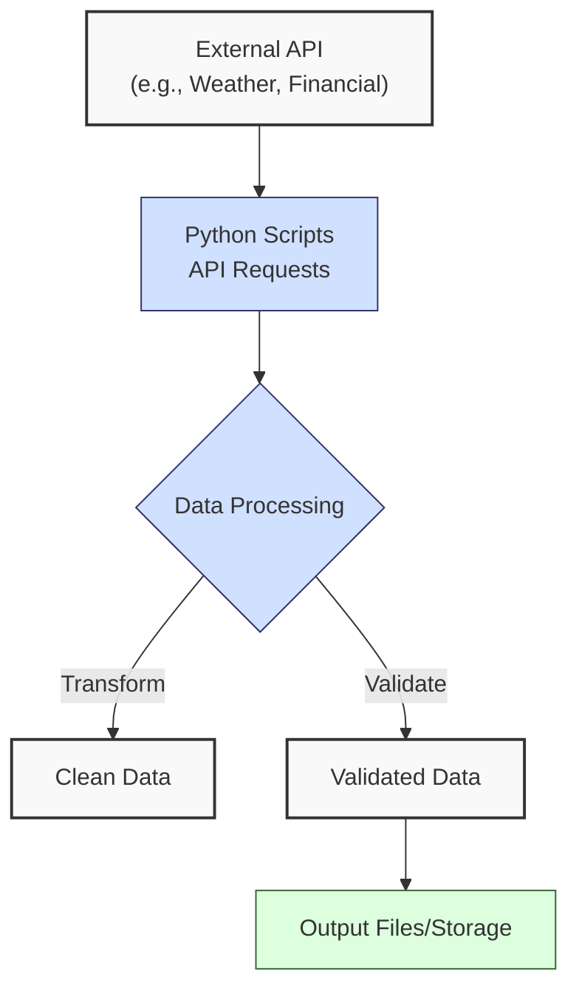
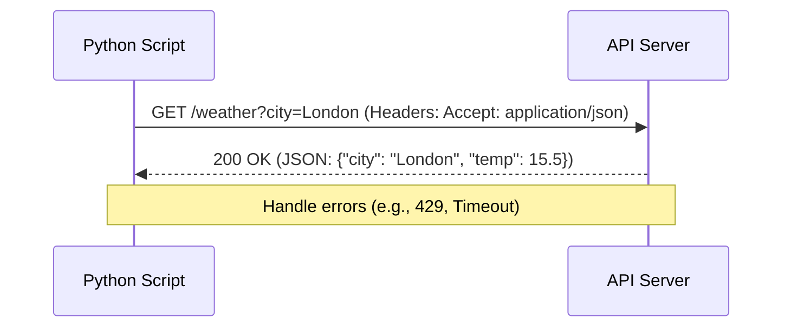

**Complexity: Moderate (M)**

## 4.0 Introduction: Why This Matters for Data Engineering

In data engineering, accessing external data sources via web APIs is a critical skill. APIs allow you to ingest real-time or diverse data from services like weather providers, financial systems, or social media platforms, enriching your data pipelines. Understanding HTTP protocols, API structures, and secure data handling ensures your pipelines are robust and scalable.

**Case Study**: Imagine you’re a data engineer at a fintech startup tasked with building a dashboard showing real-time stock prices. You use an API (e.g., Alpha Vantage) to fetch stock data, parse JSON responses, and store results in a CSV for analysis. This chapter equips you to handle such tasks by teaching API requests, data parsing, and error management.

This chapter builds on the Python fundamentals from Chapters 1 and 2, extending your ability to work with external data beyond local files. You'll learn to make API requests, parse JSON responses, and handle network errors, all essential for modern data engineering workflows.

### Setup Instructions

To follow along, ensure you have:

1. **Python Environment**:

   - Python 3.6+ installed (https://www.python.org/downloads/).
   - At least 8GB RAM and a stable internet connection.

2. **Install Dependencies**:

   ```bash
   pip install requests python-dotenv
   ```

   - `requests`: For making API calls.
   - `python-dotenv`: Optional, for loading API keys from a `.env` file.

3. **Get an OpenWeatherMap API Key**:

   - Sign up at https://home.openweathermap.org/users/sign_up.
   - Verify your email and log in.
   - Find your API key under “API keys” (takes ~10 minutes to activate).
   - Set the key in an environment variable:
     ```bash
     # Linux/Mac
     export OPENWEATHER_API_KEY="your_api_key"
     ```
     ```cmd
     :: Windows
     set OPENWEATHER_API_KEY=your_api_key
     ```
   - Or create a `.env` file:
     ```
     OPENWEATHER_API_KEY=your_api_key
     ```
     Add `.env` to `.gitignore`:
     ```
     .env
     ```

4. **Test Setup**:
   - Run this snippet to verify:
     ```python
     import os
     print(os.getenv("OPENWEATHER_API_KEY") or "API key not set")
     ```
   - If the key prints, you’re ready. If not, check your `.env` file or environment variable.

### Data Engineering Workflow Context

Here’s how web integration and APIs fit into a typical data engineering workflow:



### Building On and Preparing For

- **Building On**: This chapter leverages Python fundamentals (Chapter 1: data structures, functions), file handling, error management, and JSON processing (Chapter 2). You’ll apply these to network operations and JSON responses.
- **Preparing For**: API integration skills are crucial for Chapter 5 (Object-Oriented Programming), where you’ll structure API interactions using classes, and Chapter 23 (ETL Processes), where APIs are a common data source. These skills also support BigQuery integration (Chapter 26) and real-world data pipelines.

### What You’ll Learn

This chapter covers:

1. HTTP and REST fundamentals for web communication
2. API concepts, including methods and status codes
3. Using the `requests` library to make API calls
4. Parsing JSON responses for data extraction
5. Basic error handling for network issues
6. API security, focusing on authentication and key management

By the end, you’ll be able to fetch, process, and store data from public APIs, a key component of data ingestion pipelines.

---

## 4.1 HTTP and REST Fundamentals

APIs rely on HTTP (Hypertext Transfer Protocol) to communicate over the web. REST (Representational State Transfer) is a common architectural style for designing APIs, using standard HTTP methods to perform operations.

### 4.1.1 HTTP Basics

HTTP is a request-response protocol. A client (your Python script) sends a request to a server, which responds with data or status information. The following diagram illustrates this flow:



```python
# Conceptual example of an HTTP request (not executable)
request = """
GET /weather?city=London HTTP/1.1
Host: api.example.com
Accept: application/json
"""
# Response might look like:
response = """
HTTP/1.1 200 OK
Content-Type: application/json

{"city": "London", "temp": 15.5}
"""
```

**Key Points**:

- **Methods**: Common HTTP methods include:
  - `GET`: Retrieve data (e.g., fetch weather data).
  - `POST`: Send data to create resources.
  - `PUT`: Update existing resources.
  - `DELETE`: Remove resources.
- **Status Codes**: Indicate the result of the request:
  - `200 OK`: Success.
  - `404 Not Found`: Resource not available.
  - `429 Too Many Requests`: Rate limit exceeded.
  - `500 Internal Server Error`: Server-side issue.
- **Headers**: Metadata like `Content-Type` (e.g., `application/json`) or `Authorization` for authentication.
- **Underlying Implementation**: HTTP operates over TCP/IP, with requests and responses as text-based messages. REST APIs use stateless, client-server communication, making them scalable for data engineering.
- **Performance Considerations**:
  - **Time Complexity**: O(1) for sending a request, but network latency dominates (milliseconds to seconds).
  - **Space Complexity**: O(n), where n is the response size, for storing response data in memory.
  - **JSON Parsing**: O(n) time complexity, where n is the response size, as it constructs Python objects recursively.
  - **Implication**: Network calls are slower than local operations, so minimize requests and handle timeouts.

### 4.1.2 REST Principles

REST APIs follow principles like:

- **Stateless**: Each request is independent, containing all necessary information.
- **Resource-Based**: Data is accessed via URLs (e.g., `/weather/city/London`).
- **Standard Methods**: Use HTTP methods for CRUD operations (Create, Read, Update, Delete).

---

## 4.2 API Concepts

APIs provide structured access to data. Understanding their structure and behavior is key to effective integration.

### 4.2.1 API Structure

APIs expose **endpoints** (URLs) that return data in formats like JSON. Parameters customize requests. Some APIs use pagination (e.g., fetching data in chunks) or POST requests, which you’ll explore in later chapters like ETL processes (Chapter 23).

```python
# Example API endpoint structure (not executable)
endpoint = "https://api.example.com/weather"
params = {"city": "London", "units": "metric"}
# Resulting URL: https://api.example.com/weather?city=London&units=metric
```

**Key Points**:

- **Base URL**: The API’s root (e.g., `https://api.example.com`).
- **Path**: Specific resource (e.g., `/weather`).
- **Query Parameters**: Key-value pairs (e.g., `?city=London`) to filter or customize.

### 4.2.2 Authentication

Many APIs require authentication, often via API keys or tokens.

```python
# Conceptual example of API key usage
headers = {"Authorization": "Bearer YOUR_API_KEY"}
```

**Key Points**:

- **API Key**: A unique string for authentication.
- **Token**: Often used for OAuth-based APIs, providing temporary access.
- **Security**: Never hardcode keys in scripts; use environment variables.

---

## 4.3 Working with the `requests` Library

The `requests` library simplifies HTTP requests in Python. Install it with:

```bash
pip install requests
```

### 4.3.1 Making GET Requests

Fetch data from an API using `GET`.

```python
# Run this after setting OPENWEATHER_API_KEY (see Section 4.0 Setup Instructions)
import os
import requests

api_key = os.getenv("OPENWEATHER_API_KEY")
if not api_key:
    print("Error: Set OPENWEATHER_API_KEY environment variable")
else:
    url = "http://api.openweathermap.org/data/2.5/weather"
    params = {
        "q": "London",
        "units": "metric",
        "appid": api_key
    }
    response = requests.get(url, params=params)
    print(f"Status Code: {response.status_code}")
    print(f"Response: {response.json()}")

# Sample Output (simplified):
# Status Code: 200
# Response: {'name': 'London', 'main': {'temp': 15.5, 'humidity': 80}, ...}
```

**Key Points**:

- `requests.get(url, params)` sends a `GET` request with query parameters.
- `response.status_code` checks the HTTP status.
- `response.json()` parses JSON responses into Python dictionaries.
- **Performance Considerations**:
  - **Time Complexity**: O(1) for initiating the request, O(n) for parsing JSON, where n is the response size.
  - **Space Complexity**: O(n) for storing the response.
  - **Implication**: Efficient for small responses; use streaming for large data.

### 4.3.2 Handling Responses

Process JSON responses to extract relevant data.

```python
# Run this after setting OPENWEATHER_API_KEY
import os
import requests

api_key = os.getenv("OPENWEATHER_API_KEY")
if not api_key:
    print("Error: Set OPENWEATHER_API_KEY environment variable")
else:
    url = "http://api.openweathermap.org/data/2.5/weather"
    params = {"q": "London", "units": "metric", "appid": api_key}
    response = requests.get(url, params=params)
    if response.status_code == 200:
        data = response.json()
        city = data["name"]
        temp = data["main"]["temp"]
        print(f"City: {city}, Temperature: {temp}°C")
    else:
        print(f"Error: Status {response.status_code}")

# Output:
# City: London, Temperature: 15.5°C
```

**Key Points**:

- Check `status_code` before processing.
- Use dictionary access (`data["key"]`) to extract fields.
- Handle missing keys with `.get()` to avoid `KeyError`.

---

## 4.4 Parsing API Data

API responses are often JSON, requiring parsing to extract usable data.

### 4.4.1 Navigating JSON Structures

JSON maps to Python data structures: objects to dictionaries, arrays to lists.

```python
# Run this to parse a sample JSON response (no API key needed)
response_data = {
    "name": "London",
    "main": {"temp": 15.5, "humidity": 80},
    "weather": [{"description": "cloudy"}]
}

city = response_data["name"]
temp = response_data["main"]["temp"]
description = response_data["weather"][0]["description"]
print(f"{city}: {temp}°C, {description}")

# Output:
# London: 15.5°C, cloudy
```

**Key Points**:

- Use nested indexing for complex structures.
- Validate structure to avoid errors (e.g., check if keys exist).
- **Performance Considerations**:
  - **Time Complexity**: O(1) for dictionary lookups, O(n) for iterating lists.
  - **Space Complexity**: O(1) for accessing fields, O(n) if storing the entire response.
  - **Implication**: Fast for small responses; validate structure for reliability.

### 4.4.2 Transforming Data

Transform API data into a structured format.

```python
# Run this after setting OPENWEATHER_API_KEY
import os
import requests

url = "http://api.openweathermap.org/data/2.5/weather"
api_key = os.getenv("OPENWEATHER_API_KEY")
if not api_key:
    print("Error: Set OPENWEATHER_API_KEY environment variable")
else:
    cities = ["London", "Paris"]
    weather_data = []

    for city in cities:
        params = {"q": city, "units": "metric", "appid": api_key}
        response = requests.get(url, params=params)
        if response.status_code == 200:
            data = response.json()
            if data.get("main") and data.get("name"):
                weather_data.append({
                    "city": data["name"],
                    "temperature": data["main"]["temp"],
                    "humidity": data["main"]["humidity"]
                })
            else:
                print(f"Skipping {city}: Invalid response")
        else:
            print(f"Error for {city}: Status {response.status_code}")

    print(weather_data)

# Sample Output:
# [{'city': 'London', 'temperature': 15.5, 'humidity': 80}, {'city': 'Paris', 'temperature': 17.2, 'humidity': 75}]
```

**Key Points**:

- Use loops or list comprehensions to process multiple requests.
- Structure data for downstream use (e.g., CSV export).

---

## 4.5 Basic Error Handling for APIs

Network operations are prone to errors like timeouts, rate limits, or server failures. Robust error handling is essential.

### 4.5.1 Handling Network Errors

Catch exceptions raised by `requests` and handle API-specific errors like partial responses or quota limits.

```python
# Run this after setting OPENWEATHER_API_KEY
import os
import requests

api_key = os.getenv("OPENWEATHER_API_KEY")
if not api_key:
    print("Error: Set OPENWEATHER_API_KEY environment variable")
else:
    url = "http://api.openweathermap.org/data/2.5/weather"
    params = {"q": "London", "units": "metric", "appid": api_key}
    try:
        response = requests.get(url, params=params, timeout=5)
        response.raise_for_status()  # Raises exception for 4xx/5xx codes
        data = response.json()
        if not data.get("main"):
            print("Error: Incomplete response, missing weather data")
        elif data.get("cod") == "429":
            print("Error: API quota exceeded")
        else:
            print(f"Success: {data['name']}")
    except requests.exceptions.Timeout:
        print("Error: Request timed out")
    except requests.exceptions.HTTPError as e:
        print(f"Error: HTTP error: {e}")
    except requests.exceptions.RequestException as e:
        print(f"Error: Network error: {e}")
    except ValueError:
        print("Error: Invalid JSON response")

# Sample Output (on success):
# Success: London
```

**Key Points**:

- `timeout` sets a maximum wait time (seconds).
- `raise_for_status()` checks for HTTP errors (4xx, 5xx).
- Catch specific exceptions: `Timeout`, `HTTPError`, `RequestException`.
- Validate response structure and API-specific errors (e.g., quota limits).
- **Performance Considerations**:
  - **Time Complexity**: O(1) for exception handling.
  - **Space Complexity**: O(1) for exception objects.
  - **Implication**: Minimal overhead; use for all API calls.

### 4.5.2 Rate Limit Handling

APIs often impose rate limits. Implement basic retry logic.

```python
# Run this after setting OPENWEATHER_API_KEY
import os
import requests
import time
import logging

logging.basicConfig(filename="retry.log", level=logging.INFO)

def fetch_with_retry(url, params, retries=3, delay=1):
    for attempt in range(retries):
        try:
            response = requests.get(url, params=params, timeout=5)
            response.raise_for_status()
            logging.info(f"Fetched data for {params['q']}")
            return response.json()
        except requests.exceptions.HTTPError as e:
            if response.status_code == 429:  # Too Many Requests
                logging.warning(f"Rate limit for {params['q']} (status {response.status_code}), retrying in {delay}s")
                time.sleep(delay)
                delay *= 2  # Exponential backoff
            else:
                logging.error(f"HTTP error for {params['q']}: {e}")
                raise
        except requests.exceptions.RequestException as e:
            logging.error(f"Attempt {attempt + 1} failed for {params['q']}: {e}")
            time.sleep(delay)
    logging.error(f"Max retries exceeded for {params['q']}")
    raise Exception("Max retries exceeded")

# Usage
api_key = os.getenv("OPENWEATHER_API_KEY")
if not api_key:
    print("Error: Set OPENWEATHER_API_KEY environment variable")
else:
    url = "http://api.openweathermap.org/data/2.5/weather"
    params = {"q": "London", "units": "metric", "appid": api_key}
    try:
        data = fetch_with_retry(url, params)
        print(data["name"])
    except Exception as e:
        print(f"Failed: {e}")

# Sample Output (on success):
# London
```

**Key Points**:

- Check for `429` status to handle rate limits.
- Use exponential backoff (`delay *= 2`) to avoid overwhelming the server.
- Limit retries to prevent infinite loops.
- **Performance Trade-off**: Retries increase runtime (e.g., 3 retries with 1s, 2s, 4s delays add up to 7s per failed request) but improve reliability by recovering from transient errors. For critical pipelines, balance retry count and delay to avoid excessive latency.

---

## 4.6 API Security

Securely handling API credentials is critical to prevent leaks and unauthorized access.

### 4.6.1 Using Environment Variables

Store API keys in environment variables, not in code.

```python
# Run this to test API key loading (no API call)
import os

api_key = os.getenv("OPENWEATHER_API_KEY")
if not api_key:
    print("Error: Set OPENWEATHER_API_KEY environment variable")
else:
    print("API key loaded successfully")
```

**Set Environment Variable** (Linux/Mac):

```bash
export OPENWEATHER_API_KEY="your_api_key"
```

**Windows (Command Prompt)**:

```cmd
set OPENWEATHER_API_KEY=your_api_key
```

Alternatively, store keys in a `.env` file using the `python-dotenv` library:

```bash
pip install python-dotenv
```

```python
# Run this to test .env file loading
from dotenv import load_dotenv
import os

load_dotenv()
api_key = os.getenv("OPENWEATHER_API_KEY")
if not api_key:
    print("Error: Set OPENWEATHER_API_KEY in .env file")
else:
    print("API key loaded from .env")
```

Ensure `.env` is added to `.gitignore` to prevent committing sensitive data.

**Key Points**:

- Use `os.getenv()` to access environment variables.
- Never commit `.env` files or scripts with keys to version control.
- **Performance Considerations**:
  - **Time Complexity**: O(1) for environment variable lookup.
  - **Space Complexity**: O(1) for storing the key.
  - **Implication**: Secure and efficient; always use for credentials.

### 4.6.2 Basic Authentication Headers

Some APIs require headers for authentication.

```python
# Run this after setting OPENWEATHER_API_KEY (example for header-based auth)
import os
import requests

api_key = os.getenv("OPENWEATHER_API_KEY")
if not api_key:
    print("Error: Set OPENWEATHER_API_KEY environment variable")
else:
    url = "http://api.openweathermap.org/data/2.5/weather"
    params = {"q": "London", "units": "metric"}
    headers = {"Authorization": f"Bearer {api_key}"}
    response = requests.get(url, params=params, headers=headers)
    print(f"Status Code: {response.status_code}")

# Note: OpenWeatherMap uses appid parameter, not headers; this is an example
```

**Key Points**:

- Include `Authorization` headers as required by the API.
- Ensure headers are not logged or exposed.

---

## 4.7 Micro-Project: Weather Data API Integrator

### Project Requirements

Create a Python script that connects to the OpenWeatherMap API, retrieves weather data for 5–10 cities, processes the JSON responses, transforms the data into a structured format (including a humidity category), and saves it to a CSV file. Implement error handling and secure API key management.

### API Setup

- **API**: OpenWeatherMap (https://openweathermap.org/api)
- **Endpoint**: `http://api.openweathermap.org/data/2.5/weather`
- **Parameters**:
  - `q`: City name (e.g., `London`)
  - `units`: `metric` for Celsius
  - `appid`: Your API key
- **Sign Up**: See Section 4.0 Setup Instructions for registering and obtaining a free API key.

### Acceptance Criteria

- **Go Criteria**:
  - Authenticates with the API using secure key management (environment variables).
  - Handles API response codes and network errors.
  - Processes JSON data into a structured format (e.g., list of dictionaries with humidity category).
  - Implements at least one transformation (e.g., categorize humidity).
  - Creates a well-formatted CSV with headers.
  - Includes timeout handling and retry logic for failed requests.
  - Documentation includes instructions for obtaining and using an API key.
- **No-Go Criteria**:
  - Hardcoded API keys in the script.
  - Crashes on API timeout or error.
  - No error handling for network issues.
  - Overwrites results without confirmation.
  - No documentation for API usage or key handling.
  - Inconsistent CSV formatting.

### Common Pitfalls to Avoid

1. **Exposing API Keys**:
   - **Problem**: Hardcoding keys in the script risks exposure.
   - **Solution**: Use `os.getenv()` and a `.env` file excluded from version control.
2. **Hitting Rate Limits**:
   - **Problem**: Rapid requests exceed API limits (60 calls/minute for free tier).
   - **Solution**: Implement retry logic with exponential backoff for `429` errors.
3. **API Structure Changes**:
   - **Problem**: Unexpected JSON structure causes `KeyError`.
   - **Solution**: Use `.get()` and validate response structure.
4. **Network Failures**:
   - **Problem**: Timeouts or server errors crash the script.
   - **Solution**: Use `try/except` with `requests` exceptions and timeouts.
5. **CSV Formatting Issues**:
   - **Problem**: Inconsistent data leads to malformed CSV.
   - **Solution**: Validate data before writing and use `csv.DictWriter`.

### How This Differs from Production-Grade Solutions

In production, this solution would include:

- **Advanced Error Handling**: Centralized error logging (Chapter 8).
- **Rate Limit Management**: Throttling requests based on API quotas (Chapter 32).
- **Scalability**: Parallel API calls for many cities (Chapter 32).
- **Monitoring**: Alerts for API failures (Chapter 53).
- **Security**: Encrypted storage for keys and audited access (Chapter 8).
- **Testing**: Unit tests for response parsing (Chapter 9).

### Sample JSON for Offline Testing

If you can’t access the API (e.g., awaiting key activation), use this sample JSON file (`sample_weather.json`) to test parsing and CSV export:

```json
[
  {
    "name": "London",
    "main": { "temp": 15.5, "humidity": 80 },
    "weather": [{ "description": "cloudy" }]
  },
  {
    "name": "Paris",
    "main": { "temp": 17.2, "humidity": 75 },
    "weather": [{ "description": "partly cloudy" }]
  },
  {
    "name": "Tokyo",
    "main": { "temp": 22.0, "humidity": 65 },
    "weather": [{ "description": "sunny" }]
  },
  {
    "name": "Sydney",
    "main": { "temp": 20.5, "humidity": 70 },
    "weather": [{ "description": "clear" }]
  },
  {
    "name": "Berlin",
    "main": { "temp": 14.0, "humidity": 85 },
    "weather": [{ "description": "rain" }]
  }
]
```

Save as `sample_weather.json` and modify the micro-project’s `main()` function to load it:

```python
import json
with open("sample_weather.json", "r") as file:
    raw_data = json.load(file)
weather_data = [
    {
        "city": d["name"],
        "temperature": d["main"]["temp"],
        "humidity": d["main"]["humidity"],
        "description": d["weather"][0]["description"],
        "humidity_category": "Low" if d["main"]["humidity"] < 40 else "Medium" if d["main"]["humidity"] <= 70 else "High"
    }
    for d in raw_data
]
write_to_csv(weather_data, "weather_data.csv")
```

### Implementation (Full Version)

```python
# Save as weather_integrator.py and run after setting OPENWEATHER_API_KEY
import csv
import logging
import os
import requests
import time

# Configure logging
logging.basicConfig(
    filename="weather_integrator.log",
    level=logging.INFO,
    format="%(asctime)s - %(levelname)s - %(message)s"
)

# Function to fetch weather data with retries
def fetch_weather_data(city, api_key, retries=3, delay=1):
    """
    Fetch weather data for a city with retry logic.
    Returns None on failure.
    """
    url = "http://api.openweathermap.org/data/2.5/weather"
    params = {"q": city, "units": "metric", "appid": api_key}

    for attempt in range(retries):
        try:
            response = requests.get(url, params=params, timeout=5)
            response.raise_for_status()
            data = response.json()
            humidity = data["main"]["humidity"]
            humidity_category = "Low" if humidity < 40 else "Medium" if humidity <= 70 else "High"
            logging.info(f"Fetched data for {city}")
            return {
                "city": data["name"],
                "temperature": data["main"]["temp"],
                "humidity": humidity,
                "description": data["weather"][0]["description"],
                "humidity_category": humidity_category
            }
        except requests.exceptions.HTTPError as e:
            if response.status_code == 429:
                logging.warning(f"Rate limit for {city} (status {response.status_code}), retrying in {delay}s")
                time.sleep(delay)
                delay *= 2
            else:
                logging.error(f"HTTP error for {city}: {e}")
                return None
        except (requests.exceptions.RequestException, ValueError) as e:
            logging.error(f"Error for {city}: {e}")
            time.sleep(delay)
            delay *= 2
    logging.error(f"Max retries exceeded for {city}")
    return None

# Function to validate and transform data
def validate_data(data):
    """Validate that required fields are present and valid."""
    required = ["city", "temperature", "humidity", "description", "humidity_category"]
    if not data or not all(key in data for key in required):
        logging.warning(f"Invalid data: {data}")
        return False
    try:
        float(data["temperature"])
        int(data["humidity"])
        return True
    except (ValueError, TypeError):
        logging.warning(f"Invalid data types: {data}")
        return False

# Function to write data to CSV
def write_to_csv(weather_data, csv_path):
    """Write weather data to a CSV file."""
    try:
        with open(csv_path, "w", newline="") as file:
            writer = csv.DictWriter(
                file,
                fieldnames=["city", "temperature", "humidity", "description", "humidity_category"]
            )
            writer.writeheader()
            writer.writerows(weather_data)
        logging.info(f"Exported data to {csv_path}")
    except IOError as e:
        logging.error(f"Error writing to {csv_path}: {e}")

# Main function
def main():
    # Load API key
    api_key = os.getenv("OPENWEATHER_API_KEY")
    if not api_key:
        logging.error("API key not set in OPENWEATHER_API_KEY")
        raise ValueError("API key not set. See Section 4.0 Setup Instructions")

    # List of cities
    cities = ["London", "Paris", "New York", "Tokyo", "Sydney", "Berlin", "Moscow"]
    weather_data = []

    # Fetch data for each city
    for city in cities:
        data = fetch_weather_data(city, api_key)
        if data and validate_data(data):
            weather_data.append(data)
        else:
            logging.warning(f"Skipping {city} due to invalid data")

    # Write to CSV
    if weather_data:
        write_to_csv(weather_data, "weather_data.csv")
    else:
        logging.error("No valid data to export")

    logging.info("Weather integration completed")

if __name__ == "__main__":
    main()
```

### Implementation (Simplified Version)

This version fetches data for 2–3 cities, skips retry logic, and focuses on basic error handling and CSV export.

```python
# Save as simple_weather.py and run after setting OPENWEATHER_API_KEY
import csv
import logging
import os
import requests

# Configure logging
logging.basicConfig(
    filename="simple_weather.log",
    level=logging.INFO,
    format="%(asctime)s - %(levelname)s - %(message)s"
)

# Function to fetch weather data
def fetch_weather_data(city, api_key):
    """Fetch weather data for a city."""
    url = "http://api.openweathermap.org/data/2.5/weather"
    params = {"q": city, "units": "metric", "appid": api_key}

    try:
        response = requests.get(url, params=params, timeout=5)
        response.raise_for_status()
        data = response.json()
        humidity = data["main"]["humidity"]
        humidity_category = "Low" if humidity < 40 else "Medium" if humidity <= 70 else "High"
        logging.info(f"Fetched data for {city}")
        return {
            "city": data["name"],
            "temperature": data["main"]["temp"],
            "humidity": humidity,
            "humidity_category": humidity_category
        }
    except (requests.exceptions.RequestException, ValueError) as e:
        logging.error(f"Error for {city}: {e}")
        return None

# Function to write data to CSV
def write_to_csv(weather_data, csv_path):
    """Write weather data to CSV."""
    try:
        with open(csv_path, "w", newline="") as file:
            writer = csv.DictWriter(
                file,
                fieldnames=["city", "temperature", "humidity", "humidity_category"]
            )
            writer.writeheader()
            writer.writerows(weather_data)
        logging.info(f"Exported to {csv_path}")
    except IOError as e:
        logging.error(f"Error writing to {csv_path}: {e}")

# Main function
def main():
    api_key = os.getenv("OPENWEATHER_API_KEY")
    if not api_key:
        logging.error("API key not set")
        raise ValueError("API key not set. See Section 4.0 Setup Instructions")

    cities = ["London", "Paris", "Tokyo"]
    weather_data = []

    for city in cities:
        data = fetch_weather_data(city, api_key)
        if data:
            weather_data.append(data)

    if weather_data:
        write_to_csv(weather_data, "simple_weather.csv")
    else:
        logging.error("No data to export")

    logging.info("Processing completed")

if __name__ == "__main__":
    main()
```

### Sample Output (Full Version)

- **weather_data.csv**:

```csv
city,temperature,humidity,description,humidity_category
London,15.5,80,cloudy,High
Paris,17.2,75,partly cloudy,High
Tokyo,22.0,65,sunny,Medium
Sydney,20.5,70,clear,Medium
Berlin,14.0,85,rain,High
```

- **weather_integrator.log** (sample):

```
2025-04-20 08:00:00,123 - INFO - Fetched data for London
2025-04-20 08:00:00,456 - INFO - Fetched data for Paris
2025-04-20 08:00:00,789 - INFO - Fetched data for Tokyo
2025-04-20 08:00:01,012 - INFO - Fetched data for Sydney
2025-04-20 08:00:01,345 - INFO - Fetched data for Berlin
2025-04-20 08:00:01,678 - WARNING - Skipping Moscow due to invalid data
2025-04-20 08:00:01,901 - INFO - Exported data to weather_data.csv
2025-04-20 08:00:01,902 - INFO - Weather integration completed
```

### Sample Output (Simplified Version)

- **simple_weather.csv**:

```csv
city,temperature,humidity,humidity_category
London,15.5,80,High
Paris,17.2,75,High
Tokyo,22.0,65,Medium
```

- **simple_weather.log** (sample):

```
2025-04-20 08:00:00,123 - INFO - Fetched data for London
2025-04-20 08:00:00,456 - INFO - Fetched data for Paris
2025-04-20 08:00:00,789 - INFO - Fetched data for Tokyo
2025-04-20 08:00:00,901 - INFO - Exported to simple_weather.csv
2025-04-20 08:00:00,902 - INFO - Processing completed
```

### How to Run and Test the Solution

#### Setup

1. **Install Python**:

   - Download Python 3.6+ from https://www.python.org/downloads/.
   - Verify with: `python --version`.

2. **Install Dependencies**:

   ```bash
   pip install requests python-dotenv
   ```

3. **Get OpenWeatherMap API Key**:

   - Register at https://home.openweathermap.org/users/sign_up.
   - Verify your email and log in.
   - Go to “API keys” tab to copy your key (activates in ~10 minutes).
   - Set the key in a `.env` file:

     ```
     OPENWEATHER_API_KEY=your_api_key
     ```

     Or use environment variables:

     ```bash
     # Linux/Mac
     export OPENWEATHER_API_KEY="your_api_key"
     ```

     ```cmd
     :: Windows
     set OPENWEATHER_API_KEY=your_api_key
     ```

   - Add `.env` to `.gitignore`:

     ```
     .env
     ```

4. **Test API Key**:

   ```python
   import os
   print(os.getenv("OPENWEATHER_API_KEY") or "API key not set")
   ```

#### Running

- **Full Version**:

  ```bash
  python weather_integrator.py
  ```

  - Outputs: `weather_data.csv`, `weather_integrator.log`

- **Simplified Version**:

  ```bash
  python simple_weather.py
  ```

  - Outputs: `simple_weather.csv`, `simple_weather.log`

- **Offline Testing**:

  - Save `sample_weather.json` (see above).
  - Modify `main()` to load it:

    ```python
    import json
    with open("sample_weather.json", "r") as file:
        raw_data = json.load(file)
    weather_data = [
        {
            "city": d["name"],
            "temperature": d["main"]["temp"],
            "humidity": d["main"]["humidity"],
            "description": d["weather"][0]["description"],
            "humidity_category": "Low" if d["main"]["humidity"] < 40 else "Medium" if d["main"]["humidity"] <= 70 else "High"
        }
        for d in raw_data
    ]
    write_to_csv(weather_data, "weather_data.csv")
    ```

#### Testing Scenarios

1. **Valid Data**:

   - Verify CSV contains correct data (temperature, humidity, humidity_category).
   - Check log for successful fetches and export.

2. **Missing API Key**:

   - Unset `OPENWEATHER_API_KEY`. Verify error in log and script exits.

3. **Network Failure**:

   - Set `url` to an invalid value (e.g., `http://invalid`). Check log for `RequestException`.

4. **Rate Limit** (Full Version):

   - Run a loop fetching 10 cities 10 times (100 requests) to simulate hitting the 60 calls/minute limit. Alternatively, use `sample_weather.json`.

5. **Invalid City**:

   - Add `InvalidCity` to `cities`. Confirm it’s skipped with a log warning.

6. **CSV Write Failure**:

   - Set `csv_path` to a read-only directory. Verify `IOError` in log.

#### Debugging Tips

- **Check Raw Response**: If `response.json()` fails, print `response.text`:

  ```python
  print(response.text)  # E.g., {"cod": 401, "message": "Invalid API key"}
  ```

- **Verify Status Codes**: Log `response.status_code` (e.g., `401` for invalid key, `429` for rate limit).
- **Test Connectivity**: Try a simple request:

  ```python
  requests.get("https://api.openweathermap.org/data/2.5/weather?q=London&appid=invalid")
  ```

**Choosing Between Versions**:

- Use the **simplified version** (<30 minutes) if new to APIs or time-constrained.
- Use the **full version** (60–90 minutes) for practicing retries and validation.

### Documentation

- **Obtaining an API Key**:
  - Register at https://home.openweathermap.org/users/sign_up.
  - Verify email, log in, and copy key from “API keys” tab (https://home.openweathermap.org/api_keys).
  - Key activates in ~10 minutes. Check status at https://openweathermap.org/faq.
- **Running the Script**:
  - Install Python 3.6+, `requests`, and `python-dotenv`.
  - Set `OPENWEATHER_API_KEY` in `.env` or environment variable.
  - Run: `python weather_integrator.py` (or `simple_weather.py`).
- **Security Notes**:

  - Never hardcode API keys.
  - Use `.env` and add to `.gitignore`:

    ```
    .env
    ```

  - Exclude sensitive files from version control.

- **Troubleshooting**:
  - **401 Invalid API Key**: Verify key at https://home.openweathermap.org/api_keys.
  - **429 Too Many Requests**: Wait 1 minute (free tier: 60 calls/minute) or use retry logic.
  - **Network Errors**: Check internet connection or try `sample_weather.json`.
  - **CSV Errors**: Ensure write permissions for `csv_path`.
  - See logs (`weather_integrator.log`) for details.

---

## 4.8 Practice Exercises

These exercises reinforce HTTP, `requests`, JSON parsing, error handling, and API security, with increasing complexity.

### Exercise 1: Simple API Fetcher

Write a function that fetches weather data for a single city using `requests`, handling `RequestException` and `HTTPError`. Log errors to a file.

### Exercise 2: JSON Response Parser

Write a function that takes a weather API response (JSON) and extracts city, temperature, and humidity into a dictionary. Handle missing keys with `.get()`.

### Exercise 3: Multi-City Data Collector

Write a script that fetches weather data for three cities, validates the responses, and returns a list of dictionaries. Log invalid responses.

### Exercise 4: Retry Logic Implementer

Write a function that fetches API data with retry logic for `429` (rate limit) errors, using exponential backoff. Log retries.

### Exercise 5: Secure CSV Exporter

Write a function that exports weather data to CSV, using environment variables for the API key and handling `IOError`. Validate data before writing.

### Exercise 6: Weather Data Validator

Write a function that takes a weather API response (JSON) and validates that it contains required fields (`name`, `main.temp`, `main.humidity`) and reasonable values (temperature between -50 and 50°C, humidity between 0 and 100). Return `True` if valid, `False` otherwise. Log invalid cases.

---

## 4.9 Exercise Solutions

### Solution to Exercise 1: Simple API Fetcher

```python
# Save as ex1.py and run after setting OPENWEATHER_API_KEY
import logging
import os
import requests

logging.basicConfig(filename="api_fetcher.log", level=logging.INFO)

def fetch_city_weather(city, api_key):
    """Fetch weather data for a city."""
    url = "http://api.openweathermap.org/data/2.5/weather"
    params = {"q": city, "units": "metric", "appid": api_key}
    try:
        response = requests.get(url, params=params, timeout=5)
        response.raise_for_status()
        logging.info(f"Fetched data for {city}")
        return response.json()
    except (requests.exceptions.RequestException, requests.exceptions.HTTPError) as e:
        logging.error(f"Error fetching {city}: {e}")
        return None

# Test
api_key = os.getenv("OPENWEATHER_API_KEY")
if not api_key:
    print("Error: Set OPENWEATHER_API_KEY")
else:
    data = fetch_city_weather("London", api_key)
    print(data)

# Expected Output: JSON response or None on error
```

### Solution to Exercise 2: JSON Response Parser

```python
# Save as ex2.py and run (no API key needed)
def parse_weather_data(data):
    """Parse weather JSON into a dictionary."""
    if not data:
        return None
    return {
        "city": data.get("name"),
        "temperature": data.get("main", {}).get("temp"),
        "humidity": data.get("main", {}).get("humidity")
    }

# Test
sample_data = {
    "name": "London",
    "main": {"temp": 15.5, "humidity": 80}
}
result = parse_weather_data(sample_data)
print(result)
# Expected Output: {'city': 'London', 'temperature': 15.5, 'humidity': 80}
```

### Solution to Exercise 3: Multi-City Data Collector

```python
# Save as ex3.py and run after setting OPENWEATHER_API_KEY
import logging
import os
import requests

logging.basicConfig(filename="multi_city.log", level=logging.INFO)

def collect_weather_data(cities, api_key):
    """Collect weather data for multiple cities."""
    url = "http://api.openweathermap.org/data/2.5/weather"
    results = []
    for city in cities:
        try:
            params = {"q": city, "units": "metric", "appid": api_key}
            response = requests.get(url, params=params, timeout=5)
            response.raise_for_status()
            data = response.json()
            parsed = {
                "city": data.get("name"),
                "temperature": data.get("main", {}).get("temp"),
                "humidity": data.get("main", {}).get("humidity")
            }
            if all(parsed.values()):
                results.append(parsed)
                logging.info(f"Collected data for {city}")
            else:
                logging.warning(f"Invalid data for {city}")
        except (requests.exceptions.RequestException, ValueError) as e:
            logging.error(f"Error for {city}: {e}")
    return results

# Test
api_key = os.getenv("OPENWEATHER_API_KEY")
if not api_key:
    print("Error: Set OPENWEATHER_API_KEY")
else:
    cities = ["London", "Paris", "Tokyo"]
    data = collect_weather_data(cities, api_key)
    print(data)

# Expected Output: List of dictionaries or empty list on error
```

### Solution to Exercise 4: Retry Logic Implementer

```python
# Save as ex4.py and run after setting OPENWEATHER_API_KEY
import logging
import os
import requests
import time

logging.basicConfig(filename="retry_fetcher.log", level=logging.INFO)

def fetch_with_retry(city, api_key, retries=3, delay=1):
    """Fetch weather data with retry logic."""
    url = "http://api.openweathermap.org/data/2.5/weather"
    params = {"q": city, "units": "metric", "appid": api_key}
    for attempt in range(retries):
        try:
            response = requests.get(url, params=params, timeout=5)
            response.raise_for_status()
            logging.info(f"Fetched data for {city}")
            return response.json()
        except requests.exceptions.HTTPError as e:
            if response.status_code == 429:
                logging.warning(f"Rate limit (status {response.status_code}), retrying in {delay}s")
                time.sleep(delay)
                delay *= 2
            else:
                logging.error(f"HTTP error for {city}: {e}")
                return None
        except requests.exceptions.RequestException as e:
            logging.error(f"Attempt {attempt + 1} failed for {city}: {e}")
            time.sleep(delay)
    logging.error(f"Max retries exceeded for {city}")
    return None

# Test
api_key = os.getenv("OPENWEATHER_API_KEY")
if not api_key:
    print("Error: Set OPENWEATHER_API_KEY")
else:
    data = fetch_with_retry("London", api_key)
    print(data)

# Expected Output: JSON response or None on error
```

### Solution to Exercise 5: Secure CSV Exporter

```python
# Save as ex5.py and run after setting OPENWEATHER_API_KEY
import csv
import logging
import os
import requests

logging.basicConfig(filename="csv_exporter.log", level=logging.INFO)

def export_weather_to_csv(cities, api_key, csv_path):
    """Fetch and export weather data to CSV securely."""
    url = "http://api.openweathermap.org/data/2.5/weather"
    weather_data = []

    for city in cities:
        try:
            params = {"q": city, "units": "metric", "appid": api_key}
            response = requests.get(url, params=params, timeout=5)
            response.raise_for_status()
            data = response.json()
            parsed = {
                "city": data.get("name"),
                "temperature": data.get("main", {}).get("temp"),
                "humidity": data.get("main", {}).get("humidity")
            }
            if all(parsed.values()):
                weather_data.append(parsed)
                logging.info(f"Fetched data for {city}")
            else:
                logging.warning(f"Invalid data for {city}")
        except (requests.exceptions.RequestException, ValueError) as e:
            logging.error(f"Error for {city}: {e}")

    try:
        with open(csv_path, "w", newline="") as file:
            writer = csv.DictWriter(file, fieldnames=["city", "temperature", "humidity"])
            writer.writeheader()
            writer.writerows(weather_data)
        logging.info(f"Exported to {csv_path}")
    except IOError as e:
        logging.error(f"Error writing to {csv_path}: {e}")

# Test
api_key = os.getenv("OPENWEATHER_API_KEY")
if not api_key:
    print("Error: Set OPENWEATHER_API_KEY")
else:
    export_weather_to_csv(["London", "Paris"], api_key, "weather_export.csv")

# Expected Output: Creates weather_export.csv with valid data
```

### Solution to Exercise 6: Weather Data Validator

```python
# Save as ex6.py and run (no API key needed)
import logging

logging.basicConfig(filename="validator.log", level=logging.INFO)

def validate_weather_data(data):
    """Validate weather API response."""
    required = ["name", "main"]
    if not data or not all(key in data for key in required):
        logging.warning(f"Missing required fields: {data}")
        return False
    if not data["main"].get("temp") or not data["main"].get("humidity"):
        logging.warning(f"Missing temp/humidity: {data}")
        return False
    try:
        temp = float(data["main"]["temp"])
        humidity = int(data["main"]["humidity"])
        if not (-50 <= temp <= 50):
            logging.warning(f"Invalid temperature: {temp}")
            return False
        if not (0 <= humidity <= 100):
            logging.warning(f"Invalid humidity: {humidity}")
            return False
        return True
    except (ValueError, TypeError) as e:
        logging.warning(f"Validation error: {e}")
        return False

# Test
sample_data = {
    "name": "London",
    "main": {"temp": 15.5, "humidity": 80}
}
print(validate_weather_data(sample_data))  # Expected Output: True
invalid_data = {
    "name": "London",
    "main": {"temp": 100, "humidity": 80}
}
print(validate_weather_data(invalid_data))  # Expected Output: False
```

---

## 4.10 Chapter Summary and Connection to Chapter 5

In this chapter, you’ve mastered:

- **HTTP and REST**: Understanding web communication and API structures.
- **Requests Library**: Making `GET` requests and handling responses.
- **JSON Parsing**: Extracting and transforming API data.
- **Error Handling**: Managing network errors and rate limits.
- **API Security**: Securely handling API keys with environment variables.

These skills, along with their performance considerations, enable you to integrate external data into your pipelines. The micro-project demonstrated fetching weather data, transforming it (e.g., categorizing humidity), and exporting to CSV, simulating real-world data ingestion. The simplified version provides a quicker alternative for core skills.

### Connection to Chapter 5

Chapter 5 introduces Object-Oriented Programming (OOP), which builds on this chapter by:

- **Structuring API Code**: Using classes to encapsulate API interactions, improving modularity.
- **Reusability**: Creating reusable `DataFetcher` classes for APIs, extending the weather integrator.
- **Error Handling**: Applying OOP to centralize error management, building on `try/except`.
- **Data Processing**: Using objects to manage JSON data, leveraging dictionary skills.

The weather integrator will be refactored in Chapter 5 into an OOP framework, preparing you for professional data engineering practices and database integration in later chapters.
