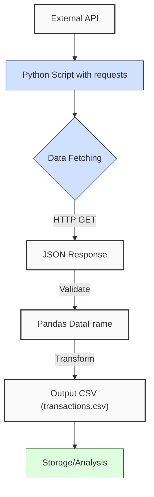
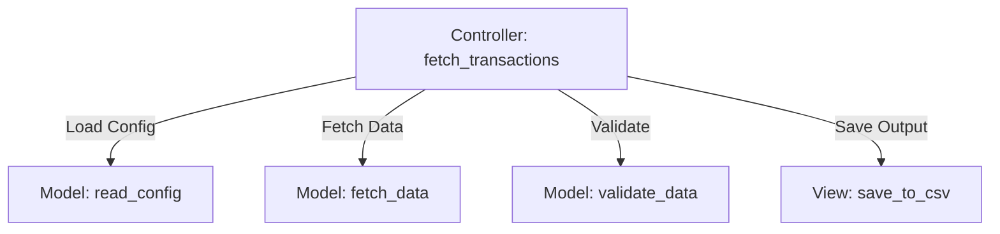
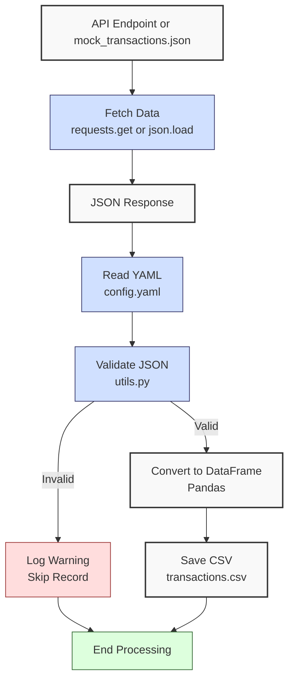

**Complexity: Moderate (M)**

## 4.0 Introduction: Why This Matters for Data Engineering

In data engineering, integrating external data sources via APIs is critical for real-time analytics in Hijra Group’s Sharia-compliant fintech ecosystem. APIs enable fetching financial transaction data, such as payment records from a Sharia-compliant bank’s API, to analyze trends and ensure compliance with Islamic Financial Services Board (IFSB) standards. The `requests` library simplifies HTTP requests, handling thousands of transactions with \~100ms latency per request, while JSON parsing integrates seamlessly with Pandas DataFrames (\~24MB for 1M rows, per Chapter 3). This chapter introduces **HTTP fundamentals**, **REST APIs**, and **MVC concepts**, building on Chapters 1–3 to fetch, validate, and transform transaction data, preparing for scalable pipelines and web frameworks like FastAPI (Chapter 53).

This chapter avoids advanced concepts like type annotations (Chapter 7), testing (Chapter 9), or error handling with try/except (Chapter 7), focusing on HTTP requests, JSON processing, and basic validation. All code uses **PEP 8's 4-space indentation**, preferring spaces over tabs to avoid `IndentationError`, aligning with Hijra Group’s pipeline standards. The micro-project fetches data from a mock API or a local JSON file, validates it, and saves it to `data/transactions.csv`, testing edge cases with malformed data.

### Data Engineering Workflow Context

This diagram illustrates how APIs fit into a data engineering pipeline:



### Building On and Preparing For

- **Building On**:
  - Chapter 1: Uses dictionaries, loops, and string formatting for data processing, extended to JSON parsing and endpoint building.
  - Chapter 2: Leverages CSV handling (`csv.DictReader`), YAML/JSON parsing, and modules (`utils.py`), now applied to API data.
  - Chapter 3: Uses Pandas DataFrames for structured data, extended to API responses.
- **Preparing For**:
  - Chapter 5: Prepares for OOP by organizing API logic in modules.
  - Chapter 7: Lays groundwork for type-safe API interactions.
  - Chapter 53: Enables FastAPI development for building APIs.
  - Chapter 69–71: Supports capstone projects with real-time data fetching.

### What You’ll Learn

This chapter covers:

1. **HTTP and REST Basics**: Understanding requests and responses.
2. **Using** `requests`: Fetching data with GET requests.
3. **JSON Processing**: Parsing API responses into dictionaries.
4. **Data Validation**: Ensuring data integrity with `utils.py`.
5. **Pandas Integration**: Converting JSON to DataFrames and CSVs.
6. **MVC Concepts**: Structuring code for scalability.

By the end, you’ll build a transaction data fetcher that retrieves data from a mock API or local JSON file, validates it, and saves it to `data/transactions.csv`, using 4-space indentation per PEP 8. The micro-project uses `data/config.yaml` and `data/mock_transactions.json`, testing edge cases to align with Hijra Group’s transaction processing needs.

**Follow-Along Tips**:

- Create `de-onboarding/data/` and populate with files from Appendix 1 (`transactions.csv`, `config.yaml`, `mock_transactions.json`).
- Install libraries: `pip install requests pandas pyyaml`.
- Use **4 spaces** (not tabs) per PEP 8. Run `python -tt script.py` to detect tab/space mixing.
- Use print statements (e.g., `print(response.json())`) to debug API responses.
- Verify file paths with `ls data/` (Unix/macOS) or `dir data\` (Windows).
- Use UTF-8 encoding to avoid `UnicodeDecodeError`.
- Verify API connectivity with `curl https://jsonplaceholder.typicode.com/posts` (Unix/macOS) or `Invoke-WebRequest https://jsonplaceholder.typicode.com/posts` (Windows PowerShell) to ensure the endpoint is accessible.
- Ensure write permissions for `data/` with `ls -l data/` (Unix/macOS) or `dir data\` (Windows). If `PermissionError` occurs, check folder permissions.

## 4.1 HTTP and REST Basics

HTTP (HyperText Transfer Protocol) enables communication between clients (e.g., Python scripts) and servers (e.g., APIs). REST (Representational State Transfer) is an architectural style for APIs, using standard HTTP methods like **GET** to fetch data. REST APIs return structured data (e.g., JSON), ideal for transaction records.

### Key Concepts

- **HTTP Methods**: GET retrieves data, POST sends data, PUT updates, DELETE removes.
- **Status Codes**:
  - 200: Success.
  - 400: Bad request (e.g., invalid parameters).
  - 404: Resource not found.
  - 500: Server error.
- **JSON**: Lightweight format for structured data, parsed into Python dictionaries.
- **REST Principles**: Stateless (each request is independent), resource-based (e.g., `/transactions` endpoint).

**Example HTTP GET Request** (conceptual):

```
GET /api/transactions HTTP/1.1
Host: mockapi.example.com
```

**Example JSON Response** (minimal):

```json
[{ "transaction_id": "T001", "product": "Halal Laptop", "price": 999.99 }]
```

**Example JSON Response** (full):

```json
[
  {
    "transaction_id": "T001",
    "product": "Halal Laptop",
    "price": 999.99,
    "quantity": 2,
    "date": "2023-10-01"
  },
  {
    "transaction_id": "T002",
    "product": "Halal Mouse",
    "price": 24.99,
    "quantity": 10,
    "date": "2023-10-02"
  }
]
```

**Time/Space Complexity**:

- **Time**: O(n) for parsing n JSON records.
- **Space**: O(n) for storing n records in memory (\~1MB for 10K JSON records with 5 fields).

**Implication**: REST APIs enable real-time data fetching for Hijra Group’s analytics, with JSON parsing scaling linearly for typical transaction volumes.

## 4.2 Using the `requests` Library

The `requests` library simplifies HTTP requests. A GET request fetches JSON data, which is parsed into Python dictionaries.

```python
import requests  # Import requests library

# Fetch transactions from mock API
url = "https://mockapi.example.com/transactions"  # Mock API endpoint
response = requests.get(url)  # Send GET request

# Check response status
print("Status Code:", response.status_code)  # Debug: print status
if response.status_code == 200:  # Success
    data = response.json()  # Parse JSON
    print("Data:", data)  # Debug: print data
else:
    print("Failed to fetch data")  # Log failure

# Expected Output (with mock API):
# Status Code: 200
# Data: [{'transaction_id': 'T001', 'product': 'Halal Laptop', 'price': 999.99, 'quantity': 2, 'date': '2023-10-01'}, ...]
```

**Note**: API latency (\~100ms) varies based on network conditions and server load. In production, monitor response times and consider timeouts (Chapter 40).

**Follow-Along Instructions**:

1. Install `requests`: `pip install requests`.
2. Save as `de-onboarding/api_basics.py`.
3. Configure editor for **4-space indentation** per PEP 8 (VS Code: “Editor: Tab Size” = 4, “Editor: Insert Spaces” = true, “Editor: Detect Indentation” = false).
4. Run: `python api_basics.py` (replace `url` with `https://jsonplaceholder.typicode.com/posts` for testing).
5. Verify output shows status and data.
6. **Common Errors**:
   - **ModuleNotFoundError**: Install `requests` with `pip install requests`.
   - **ConnectionError**: Check internet or URL. Print `url`.
   - **IndentationError**: Use 4 spaces (not tabs). Run `python -tt api_basics.py`.

**Key Points**:

- `requests.get()`: Sends HTTP GET request, returns response object.
- `response.json()`: Parses JSON into dictionaries/lists.
- **Performance**:
  - **Time Complexity**: O(1) for request (network latency dominates), O(n) for parsing n records.
  - **Space Complexity**: O(n) for n records in memory.
- **Implication**: Efficient for fetching transaction data, with latency dependent on network (\~100ms per request).

## 4.3 JSON Processing

JSON responses are parsed into Python dictionaries or lists, suitable for validation and conversion to DataFrames.

```python
import requests  # Import requests

# Fetch and process JSON
url = "https://mockapi.example.com/transactions"  # Mock API
response = requests.get(url)  # Send GET request
if response.status_code == 200:  # Check success
    transactions = response.json()  # Parse JSON
    print("Response JSON:", transactions)  # Debug: print raw JSON
    for transaction in transactions:  # Loop through transactions
        print(f"Processing: {transaction}")  # Debug: print transaction
        # Example: Access fields
        tid = transaction["transaction_id"]  # Get ID
        product = transaction["product"]  # Get product
        print(f"ID: {tid}, Product: {product}")  # Debug: print fields
else:
    print("Fetch failed:", response.status_code)  # Log failure

# Expected Output (with mock API):
# Response JSON: [{'transaction_id': 'T001', 'product': 'Halal Laptop', 'price': 999.99, 'quantity': 2, 'date': '2023-10-01'}, ...]
# Processing: {'transaction_id': 'T001', 'product': 'Halal Laptop', 'price': 999.99, 'quantity': 2, 'date': '2023-10-01'}
# ID: T001, Product: Halal Laptop
# ...
```

**Follow-Along Instructions**:

1. Save as `de-onboarding/json_processing.py`.
2. Configure editor for 4-space indentation per PEP 8.
3. Run: `python json_processing.py` (use a mock API).
4. Verify output shows transaction details.
5. **Common Errors**:
   - **KeyError**: Ensure JSON has expected fields. Print `transaction.keys()`.
   - **IndentationError**: Use 4 spaces (not tabs). Run `python -tt json_processing.py`.

**Note**: Real-world APIs may return nested JSON or inconsistent fields. Ensure `mock_transactions.json` matches the API’s schema (e.g., same fields as `transactions.csv`). Always print `response.json()` to inspect the structure before processing.

**Key Points**:

- JSON parsing: Converts to Python lists/dictionaries.
- **Time Complexity**: O(n) for iterating n transactions.
- **Space Complexity**: O(n) for storing n transactions.
- **Implication**: JSON is ideal for structured transaction data, integrating with Pandas for analysis.

## 4.4 Data Validation with `utils.py`

Validate JSON data using `utils.py` (updated from Chapter 3), ensuring Sharia-compliant products and valid fields.

```python
# File: de-onboarding/utils.py (updated)
def clean_string(s):  # Clean string
    """Strip whitespace from string."""
    return s.strip() if isinstance(s, str) else ""

def is_numeric(s, max_decimals=2):  # Check if string is numeric
    """Check if string is a decimal number with up to max_decimals."""
    if not isinstance(s, (str, int, float)):
        return False
    s = str(s)
    parts = s.split(".")
    if len(parts) > 2:
        return False
    if len(parts) == 2 and not (parts[0].lstrip("-").isdigit() and parts[1].isdigit()):
        return False
    if len(parts) == 1 and not parts[0].lstrip("-").isdigit():
        return False
    if len(parts) == 2:
        return len(parts[1]) <= max_decimals
    return True

def is_numeric_value(x):  # Check if value is numeric
    """Check if value is an integer or float."""
    return isinstance(x, (int, float))

def has_valid_decimals(x, max_decimals):  # Check decimal places
    """Check if value has valid decimal places."""
    return is_numeric(str(x), max_decimals)

def apply_valid_decimals(x, max_decimals):  # Apply decimal validation
    """Apply has_valid_decimals to a value."""
    return has_valid_decimals(x, max_decimals)

def is_integer(x):  # Check if value is integer
    """Check if value is an integer."""
    return isinstance(x, int) or (isinstance(x, str) and x.lstrip("-").isdigit())

def validate_transaction(transaction, config):  # Validate transaction
    """Validate transaction based on config rules."""
    required_fields = config["required_fields"]  # Get required fields
    min_price = config["min_price"]  # Get minimum price
    max_quantity = config["max_quantity"]  # Get maximum quantity
    prefix = config["product_prefix"]  # Get product prefix
    max_decimals = config["max_decimals"]  # Get max decimals

    print(f"Validating transaction: {transaction}")  # Debug
    # Check required fields
    for field in required_fields:
        if field not in transaction or not transaction[field]:
            print(f"Invalid: missing {field}: {transaction}")  # Log invalid
            return False

    # Validate product
    product = clean_string(transaction["product"])
    if not product.startswith(prefix):
        print(f"Invalid: product lacks '{prefix}' prefix: {transaction}")  # Log invalid
        return False

    # Validate price
    price = transaction["price"]
    if not is_numeric_value(price) or price < min_price or price <= 0:
        print(f"Invalid: invalid price: {transaction}")  # Log invalid
        return False
    if not apply_valid_decimals(price, max_decimals):
        print(f"Invalid: too many decimals in price: {transaction}")  # Log invalid
        return False

    # Validate quantity
    quantity = transaction["quantity"]
    if not is_integer(quantity) or int(quantity) > max_quantity:
        print(f"Invalid: invalid quantity: {transaction}")  # Log invalid
        return False

    # Validate date (basic format check: YYYY-MM-DD)
    date = clean_string(transaction["date"])
    if not len(date) == 10 or date.count("-") != 2:
        print(f"Invalid: invalid date format: {transaction}")  # Log invalid
        return False

    return True  # Valid transaction
```

**Key Points**:

- Validates transaction fields against `config.yaml` rules.
- **Validation Complexity**: O(1) per transaction for constant-time checks (e.g., field existence, string prefix), O(n) for n transactions.
- **Time Complexity**: O(1) per transaction, O(n) for n transactions.
- **Space Complexity**: O(1) per transaction.
- **Implication**: Ensures data integrity for Hijra Group’s compliance.

## 4.5 Pandas Integration

Convert validated JSON data to a Pandas DataFrame and save to CSV.

```python
import requests  # Import requests
import pandas as pd  # Import Pandas
import utils  # Import utils
import yaml  # Import YAML

# Load config
with open("data/config.yaml", "r") as file:
    config = yaml.safe_load(file)

# Fetch and validate transactions
url = "https://mockapi.example.com/transactions"
response = requests.get(url)
if response.status_code == 200:
    transactions = response.json()
    valid_transactions = [t for t in transactions if utils.validate_transaction(t, config)]
    print(f"Valid transactions: {len(valid_transactions)}")  # Debug
else:
    valid_transactions = []
    print("Fetch failed:", response.status_code)

# Convert to DataFrame
df = pd.DataFrame(valid_transactions)
print("DataFrame:")  # Debug
print(df.head())

# Save to CSV
csv_path = "data/transactions.csv"
df.to_csv(csv_path, index=False)
print(f"Saved to {csv_path}")

# Expected Output (with mock API):
# Valid transactions: 2
# DataFrame:
#   transaction_id       product   price  quantity        date
# 0         T001  Halal Laptop  999.99         2  2023-10-01
# 1         T002   Halal Mouse   24.99        10  2023-10-02
# Saved to data/transactions.csv
```

**Follow-Along Instructions**:

1. Ensure `data/config.yaml` exists per Appendix 1.
2. Save as `de-onboarding/pandas_integration.py`.
3. Configure editor for 4-space indentation per PEP 8.
4. Run: `python pandas_integration.py` (use mock API).
5. Verify `data/transactions.csv` matches expected structure.
6. **Common Errors**:
   - **FileNotFoundError**: Ensure `config.yaml` exists. Print path with `print("data/config.yaml")`.
   - **KeyError**: Validate JSON fields. Print `transaction.keys()`.
   - **IndentationError**: Use 4 spaces (not tabs). Run `python -tt pandas_integration.py`.

**Key Points**:

- `pd.DataFrame()`: Converts list of dictionaries to DataFrame.
- `to_csv()`: Saves DataFrame to CSV.
- **Time Complexity**: O(n) for n transactions.
- **Space Complexity**: O(n) for DataFrame (\~24MB for 1M rows).
- **Implication**: Integrates API data into pipelines for analysis.

## 4.6 MVC Concepts

**Model-View-Controller (MVC)** organizes code for scalability:

- **Model**: Data logic (e.g., `utils.validate_transaction`, DataFrame operations).
- **View**: Output (e.g., CSV file, console logs).
- **Controller**: Workflow (e.g., fetching, validating, saving).

For example, in Hijra Group’s pipeline, the Model validates transaction data, the View generates a CSV report for stakeholders, and the Controller orchestrates API fetching and saving.

**MVC Structure Diagram**:



**Example Structure**:

```python
# Controller: Orchestrates fetching and processing
def fetch_transactions(url, config_path, csv_path):
    config = read_config(config_path)  # Model: Load config
    transactions = fetch_data(url)  # Model: Fetch data
    valid_transactions = validate_data(transactions, config)  # Model: Validate
    save_to_csv(valid_transactions, csv_path)  # View: Save output
```

**Implication**: MVC prepares for OOP (Chapter 5) and web frameworks (Chapters 52–53), ensuring modular pipelines.

## 4.7 Micro-Project: Transaction Data Fetcher

### Project Requirements

Build a transaction data fetcher that retrieves data from a mock API or `data/mock_transactions.json`, validates it using `utils.py`, and saves to `data/transactions.csv` for Hijra Group’s analytics. This fetcher supports real-time transaction processing, ensuring compliance with IFSB standards by validating Halal products. The `json.load` function for `mock_transactions.json` builds on Chapter 2’s JSON processing, similar to `yaml.safe_load`.

- Fetch data from a mock API (e.g., `https://jsonplaceholder.typicode.com/posts` for testing) or load `data/mock_transactions.json` if API fails.
- Read `data/config.yaml` with PyYAML.
- Validate transactions for required fields, Halal prefix, numeric price/quantity, and date format.
- Save valid transactions to `data/transactions.csv`.
- Log steps, invalid records, and a validation error summary using print statements.
- Use **4-space indentation** per PEP 8, preferring spaces over tabs.
- Test edge cases with mock JSON data simulating errors.

### Sample Input (Mock API Response or `data/mock_transactions.json`)

```json
[
  {
    "transaction_id": "T001",
    "product": "Halal Laptop",
    "price": 999.99,
    "quantity": 2,
    "date": "2023-10-01"
  },
  {
    "transaction_id": "T002",
    "product": "Halal Mouse",
    "price": 24.99,
    "quantity": 10,
    "date": "2023-10-02"
  },
  {
    "transaction_id": "T003",
    "product": "Monitor",
    "price": 199.99,
    "quantity": 2,
    "date": "2023-10-05"
  },
  {
    "transaction_id": "T004",
    "product": "",
    "price": 29.99,
    "quantity": 3,
    "date": "2023-10-04"
  }
]
```

### Data Processing Flow



### Acceptance Criteria

- **Go Criteria**:
  - Fetches data from mock API or `data/mock_transactions.json`.
  - Loads `config.yaml` correctly.
  - Validates transactions for required fields, Halal prefix, numeric price/quantity, positive prices, and date format.
  - Saves valid transactions to `data/transactions.csv`.
  - Logs steps, invalid records, and a validation error summary.
  - Uses 4-space indentation per PEP 8.
  - Handles edge cases (e.g., empty response, invalid JSON).
- **No-Go Criteria**:
  - Fails to fetch or save data.
  - Incorrect validation or error summary.
  - Missing CSV output.
  - Uses try/except or type annotations.
  - Inconsistent indentation.

### Common Pitfalls to Avoid

1. **API Fetch Failure**:
   - **Problem**: `requests.get` fails due to network issues.
   - **Solution**: Print `url` and `response.status_code`. Use `data/mock_transactions.json` as fallback.
2. **JSON Parsing Errors**:
   - **Problem**: Invalid JSON structure.
   - **Solution**: Print `response.text` to inspect response or `print(open(json_path).read())` for `mock_transactions.json`.
3. **Validation Errors**:
   - **Problem**: Missing fields cause `KeyError`.
   - **Solution**: Print `transaction.keys()` to debug.
4. **Pandas Type Issues**:
   - **Problem**: Non-numeric fields cause errors.
   - **Solution**: Validate with `utils.is_numeric_value`. Print `df.dtypes`.
5. **Rate Limiting**:
   - **Problem**: API rejects requests if sent too frequently.
   - **Solution**: Check response headers (e.g., `print(response.headers.get('X-RateLimit-Remaining'))`) for rate limit info and pause if needed.
6. **IndentationError**:
   - **Problem**: Mixed spaces/tabs.
   - **Solution**: Use 4 spaces per PEP 8. Run `python -tt transaction_fetcher.py`.

### How This Differs from Production

In production, this solution would include:

- **Error Handling**: Try/except for network failures (Chapter 7).
- **Type Safety**: Type annotations with Pyright (Chapter 7).
- **Testing**: Unit tests with `pytest` (Chapter 9).
- **Scalability**: Pagination for large API responses (Chapter 40).
- **Logging**: File-based logging (Chapter 52).
- **Authentication**: OAuth2 for secure APIs (Chapter 65).

### Notes

- **File Size**: `mock_transactions.json` with 4 transactions is \~200 bytes, but real-world transaction datasets may be megabytes, requiring chunked processing in Chapter 40.

### Implementation

```python
# File: de-onboarding/utils.py (already provided in Section 4.4)

# File: de-onboarding/transaction_fetcher.py
import requests  # For API requests
import pandas as pd  # For DataFrame operations
import yaml  # For YAML parsing
import json  # For JSON file loading
import os  # For file existence check

# Define function to read YAML configuration
def read_config(config_path):  # Takes config file path
    """Read YAML configuration."""
    print(f"Opening config: {config_path}")  # Debug
    with open(config_path, "r") as file:
        config = yaml.safe_load(file)  # Parse YAML
    print(f"Loaded config: {config}")  # Debug
    return config

# Define function to fetch data from API or JSON file
def fetch_data(url, json_path):  # Takes API URL and JSON path
    """Fetch JSON data from API or local file."""
    print(f"Fetching data from: {url}")  # Debug
    response = requests.get(url)  # Send GET request
    print(f"Status Code: {response.status_code}")  # Debug
    if response.status_code == 200:  # Success
        data = response.json()  # Parse JSON
        print(f"Fetched {len(data)} records from API")  # Debug
        return data
    print(f"Fetch failed: {response.status_code}, loading from {json_path}")  # Log failure
    if os.path.exists(json_path):  # Check if JSON file exists
        with open(json_path, "r") as file:
            data = json.load(file)  # Load JSON
        print(f"Fetched {len(data)} records from {json_path}")  # Debug
        return data
    print(f"No data available from {json_path}")  # Log failure
    return []

# Define function to validate and filter transactions
def validate_data(transactions, config):  # Takes transactions and config
    """Validate transactions using utils.py and summarize errors."""
    valid_transactions = []
    invalid_count = 0
    error_summary = {
        "missing_field": 0,
        "invalid_prefix": 0,
        "invalid_price": 0,
        "invalid_quantity": 0,
        "invalid_date": 0
    }
    for transaction in transactions:
        required_fields = config["required_fields"]
        prefix = config["product_prefix"]
        min_price = config["min_price"]
        max_quantity = config["max_quantity"]
        max_decimals = config["max_decimals"]

        # Check required fields
        for field in required_fields:
            if field not in transaction or not transaction[field]:
                print(f"Invalid: missing {field}: {transaction}")  # Log invalid
                error_summary["missing_field"] += 1
                invalid_count += 1
                continue

        # Validate product
        product = utils.clean_string(transaction["product"])
        if not product.startswith(prefix):
            print(f"Invalid: product lacks '{prefix}' prefix: {transaction}")  # Log invalid
            error_summary["invalid_prefix"] += 1
            invalid_count += 1
            continue

        # Validate price
        price = transaction["price"]
        if not utils.is_numeric_value(price) or price < min_price or price <= 0:
            print(f"Invalid: invalid price: {transaction}")  # Log invalid
            error_summary["invalid_price"] += 1
            invalid_count += 1
            continue
        if not utils.apply_valid_decimals(price, max_decimals):
            print(f"Invalid: too many decimals in price: {transaction}")  # Log invalid
            error_summary["invalid_price"] += 1
            invalid_count += 1
            continue

        # Validate quantity
        quantity = transaction["quantity"]
        if not utils.is_integer(quantity) or int(quantity) > max_quantity:
            print(f"Invalid: invalid quantity: {transaction}")  # Log invalid
            error_summary["invalid_quantity"] += 1
            invalid_count += 1
            continue

        # Validate date
        date = utils.clean_string(transaction["date"])
        if not len(date) == 10 or date.count("-") != 2:
            print(f"Invalid: invalid date format: {transaction}")  # Log invalid
            error_summary["invalid_date"] += 1
            invalid_count += 1
            continue

        valid_transactions.append(transaction)

    print(f"Valid transactions: {len(valid_transactions)}")  # Debug
    print(f"Invalid transactions: {invalid_count}")  # Debug
    print("Validation Errors:", error_summary)  # Debug: print error summary
    return valid_transactions

# Define function to save to CSV
def save_to_csv(transactions, csv_path):  # Takes transactions and CSV path
    """Save valid transactions to CSV."""
    if not transactions:  # Check for empty data
        print("No valid transactions to save")  # Log empty
        return
    df = pd.DataFrame(transactions)  # Convert to DataFrame
    print("DataFrame:")  # Debug
    print(df.head())  # Show first rows
    df.to_csv(csv_path, index=False)  # Save to CSV
    print(f"Saved to {csv_path}")  # Confirm save
    print(f"File exists: {os.path.exists(csv_path)}")  # Confirm file creation

# Define main function
def main():  # No parameters
    """Main function to fetch and process transactions."""
    url = "https://mockapi.example.com/transactions"  # Mock API (replace with jsonplaceholder for testing)
    config_path = "data/config.yaml"  # YAML path
    json_path = "data/mock_transactions.json"  # JSON fallback path
    csv_path = "data/transactions.csv"  # CSV output path

    config = read_config(config_path)  # Read config
    transactions = fetch_data(url, json_path)  # Fetch data
    valid_transactions = validate_data(transactions, config)  # Validate
    save_to_csv(valid_transactions, csv_path)  # Save to CSV

    # Output report
    print("\nTransaction Report:")  # Print header
    print(f"Total Records Fetched: {len(transactions)}")  # Total records
    print(f"Valid Transactions: {len(valid_transactions)}")  # Valid count
    print(f"Invalid Transactions: {len(transactions) - len(valid_transactions)}")  # Invalid count
    print("Processing completed")  # Confirm completion

if __name__ == "__main__":
    main()  # Run main function
```

### Expected Output

`data/transactions.csv`:

```csv
transaction_id,product,price,quantity,date
T001,Halal Laptop,999.99,2,2023-10-01
T002,Halal Mouse,24.99,10,2023-10-02
```

**Console Output** (abridged, assuming API fails and JSON file is used):

```
Opening config: data/config.yaml
Loaded config: {'min_price': 10.0, 'max_quantity': 100, 'required_fields': ['product', 'price', 'quantity'], 'product_prefix': 'Halal', 'max_decimals': 2}
Fetching data from: https://mockapi.example.com/transactions
Status Code: 404
Fetch failed: 404, loading from data/mock_transactions.json
Fetched 4 records from data/mock_transactions.json
Validating transaction: {'transaction_id': 'T001', 'product': 'Halal Laptop', 'price': 999.99, 'quantity': 2, 'date': '2023-10-01'}
Validating transaction: {'transaction_id': 'T002', 'product': 'Halal Mouse', 'price': 24.99, 'quantity': 10, 'date': '2023-10-02'}
Validating transaction: {'transaction_id': 'T003', 'product': 'Monitor', 'price': 199.99, 'quantity': 2, 'date': '2023-10-05'}
Invalid: product lacks 'Halal' prefix: {'transaction_id': 'T003', 'product': 'Monitor', 'price': 199.99, 'quantity': 2, 'date': '2023-10-05'}
Validating transaction: {'transaction_id': 'T004', 'product': '', 'price': 29.99, 'quantity': 3, 'date': '2023-10-04'}
Invalid: missing product: {'transaction_id': 'T004', 'product': '', 'price': 29.99, 'quantity': 3, 'date': '2023-10-04'}
Valid transactions: 2
Invalid transactions: 2
Validation Errors: {'missing_field': 1, 'invalid_prefix': 1, 'invalid_price': 0, 'invalid_quantity': 0, 'invalid_date': 0}
DataFrame:
  transaction_id       product   price  quantity        date
0         T001  Halal Laptop  999.99         2  2023-10-01
1         T002   Halal Mouse   24.99        10  2023-10-02
Saved to data/transactions.csv
File exists: True

Transaction Report:
Total Records Fetched: 4
Valid Transactions: 2
Invalid Transactions: 2
Processing completed
```

### How to Run and Test

1. **Setup**:

   - **Setup Checklist**:
     - \[ \] Create `de-onboarding/data/` directory.
     - \[ \] Save `config.yaml`, `transactions.csv`, `mock_transactions.json` per Appendix 1.
     - \[ \] Install libraries: `pip install requests pandas pyyaml`.
     - \[ \] Create virtual environment: `python -m venv venv`, activate (Windows: `venv\Scripts\activate`, Unix: `source venv/bin/activate`).
     - \[ \] Verify Python 3.10+: `python --version`.
     - \[ \] Configure editor for 4-space indentation per PEP 8 (VS Code: “Editor: Tab Size” = 4, “Editor: Insert Spaces” = true, “Editor: Detect Indentation” = false).
     - \[ \] Save `utils.py` and `transaction_fetcher.py` in `de-onboarding/`.
   - **Troubleshooting**:
     - If `FileNotFoundError`, check `config.yaml` or `mock_transactions.json` path. Print `print(config_path)` or `print(json_path)`.
     - If `ModuleNotFoundError`, install libraries or check `utils.py`.
     - If `IndentationError`, use 4 spaces. Run `python -tt transaction_fetcher.py`.
     - If `yaml.YAMLError`, print `print(open(config_path).read())` to inspect YAML.
     - If `json.JSONDecodeError`, print `print(open(json_path).read())` to inspect `mock_transactions.json` for syntax errors like missing commas.
     - If `PermissionError`, check write permissions for `data/` with `ls -l data/` (Unix/macOS) or `dir data\` (Windows).

2. **Run**:

   - Open terminal in `de-onboarding/`.
   - Run: `python transaction_fetcher.py` (replace `url` with `https://jsonplaceholder.typicode.com/posts` or use `mock_transactions.json`).
   - Outputs: `data/transactions.csv`, console logs with validation error summary.

3. **Test Scenarios**:

   - **Valid Data**: Use `data/mock_transactions.json`. Verify `transactions.csv` contains only Halal products and error summary is correct.

   - **Empty Response**: Simulate empty response:

     ```python
     def fetch_data(url, json_path): return []  # Mock empty response
     config = read_config("data/config.yaml")
     transactions = fetch_data("mock_url", "data/mock_transactions.json")
     valid_transactions = validate_data(transactions, config)
     print(valid_transactions)  # Expected: []
     ```

   - **Invalid JSON**: Simulate malformed JSON:

     ```python
     mock_data = [
         {"transaction_id": "T001", "product": "Halal Laptop", "price": "invalid", "quantity": 2, "date": "2023-10-01"}
     ]
     config = read_config("data/config.yaml")
     valid_transactions = validate_data(mock_data, config)
     print(valid_transactions)  # Expected: []
     ```

## 4.8 Practice Exercises

### Exercise 1: API Data Fetcher

Write a function to fetch JSON data from an API, with 4-space indentation per PEP 8.

**Sample Input**:

```python
url = "https://jsonplaceholder.typicode.com/posts"
```

**Expected Output**:

```
Fetched 100 records
```

**Follow-Along Instructions**:

1. Save as `de-onboarding/ex1_fetcher.py`.
2. Configure editor for 4-space indentation per PEP 8.
3. Run: `python ex1_fetcher.py`.
4. **How to Test**:
   - Add: `print(fetch_api_data(url))`.
   - Verify output shows record count.
   - Test with invalid URL: Should return `[]`.

### Exercise 2: JSON Validator

Write a function to validate JSON transactions using `utils.py`, with 4-space indentation per PEP 8.

**Sample Input**:

```python
transactions = [
    {"transaction_id": "T001", "product": "Halal Laptop", "price": 999.99, "quantity": 2, "date": "2023-10-01"},
    {"transaction_id": "T002", "product": "Monitor", "price": 199.99, "quantity": 2, "date": "2023-10-05"}
]
config = read_config("data/config.yaml")
```

**Expected Output**:

```
[{'transaction_id': 'T001', 'product': 'Halal Laptop', 'price': 999.99, 'quantity': 2, 'date': '2023-10-01'}]
```

**Follow-Along Instructions**:

1. Save as `de-onboarding/ex2_validator.py`.
2. Ensure `utils.py` and `config.yaml` exist.
3. Configure editor for 4-space indentation per PEP 8.
4. Run: `python ex2_validator.py`.
5. **How to Test**:
   - Add: `print(validate_transactions(transactions, config))`.
   - Verify output shows valid transactions.
   - Test with empty list: Should return `[]`.

### Exercise 3: CSV Exporter

Write a function to convert JSON transactions to a CSV, with 4-space indentation per PEP 8.

**Sample Input**:

```python
transactions = [
    {"transaction_id": "T001", "product": "Halal Laptop", "price": 999.99, "quantity": 2, "date": "2023-10-01"}
]
csv_path = "data/test.csv"
```

**Expected Output**:

```
Saved to data/test.csv
```

**Follow-Along Instructions**:

1. Save as `de-onboarding/ex3_exporter.py`.
2. Configure editor for 4-space indentation per PEP 8.
3. Run: `python ex3_exporter.py`.
4. **How to Test**:
   - Verify `data/test.csv` exists with correct data.
   - Test with empty transactions: Should not create CSV.

### Exercise 4: MVC Organizer

Refactor a fetcher to use MVC structure, with 4-space indentation per PEP 8.

**Sample Input**:

```python
url = "https://jsonplaceholder.typicode.com/posts"
config_path = "data/config.yaml"
csv_path = "data/test.csv"
```

**Expected Output**:

```
Saved to data/test.csv
```

**Follow-Along Instructions**:

1. Save as `de-onboarding/ex4_mvc.py`.
2. Ensure `utils.py` and `config.yaml` exist.
3. Configure editor for 4-space indentation per PEP 8.
4. Run: `python ex4_mvc.py`.
5. **How to Test**:
   - Verify `data/test.csv` exists.
   - Test with invalid URL: Should handle gracefully.

### Exercise 5: Debug an API Fetch Bug

Fix buggy code that fails to check status code, causing JSON parsing errors, with 4-space indentation per PEP 8.

**Buggy Code**:

```python
import requests
def fetch_data(url):
    response = requests.get(url)
    data = response.json()  # Bug: No status check
    return data

print(fetch_data("https://invalid-url"))
```

**Expected Output**:

```
Fetch failed: 404
[]
```

**Follow-Along Instructions**:

1. Save as `de-onboarding/ex5_debug.py`.
2. Configure editor for 4-space indentation per PEP 8.
3. Run: `python ex5_debug.py` to see incorrect output.
4. Fix and re-run.
5. **How to Test**:
   - Verify output handles invalid URL.
   - Test with valid URL to ensure data is fetched.
   - **Debugging Tips**: Print `response.text` to inspect raw response and `response.headers` to check content type.

### Exercise 6: REST Principles Explanation, Endpoint Builder, and HTTP Method Analysis

Explain why REST APIs are stateless and how this benefits Hijra Group’s transaction fetching. Write a function to construct a REST endpoint from a date string. Answer why the micro-project uses GET instead of POST, with 4-space indentation per PEP 8. The endpoint builder uses f-strings from Chapter 1’s string formatting. Review string operations if needed.

**Sample Input**:

```python
date = "2023-10-01"
explanation, endpoint, http_answer = explain_rest_statelessness(date)
```

**Expected Output**:

```
Explanation, endpoint, and HTTP answer saved to ex6_rest.txt, ex6_endpoint.txt, and ex6_http.txt
```

**Expected Files**:

- `ex6_rest.txt`:

  ```
  REST APIs are stateless, meaning each request contains all necessary information, and the server does not store client state between requests. This benefits Hijra Group by simplifying transaction fetching, as each API call (e.g., GET /api/transactions/2023-10-01) is independent, reducing server complexity and enabling scalable, reliable data retrieval for real-time analytics.
  ```

- `ex6_endpoint.txt`:

  ```
  /api/transactions/2023-10-01
  ```

- `ex6_http.txt`:

  ```
  GET retrieves data without modifying the server, suitable for fetching transactions, while POST sends data to create or update resources.
  ```

**Follow-Along Instructions**:

1. Save as `de-onboarding/ex6_rest.py`.
2. Configure editor for 4-space indentation per PEP 8.
3. Run: `python ex6_rest.py`.
4. **How to Test**:
   - Add: `print(explain_rest_statelessness("2023-10-01"))`.
   - Verify `ex6_rest.txt`, `ex6_endpoint.txt`, and `ex6_http.txt` exist with correct content.
   - Review content for accuracy.
   - **Debugging Tip**: If the endpoint is incorrect, print `date` to verify format (e.g., ‘YYYY-MM-DD’). Ensure no extra slashes or spaces.

## 4.9 Exercise Solutions

### Solution to Exercise 1: API Data Fetcher

```python
import requests  # Import requests

def fetch_api_data(url):  # Takes URL
    """Fetch JSON data from API."""
    print(f"Fetching from: {url}")  # Debug
    response = requests.get(url)  # Send GET request
    if response.status_code == 200:  # Success
        data = response.json()  # Parse JSON
        print(f"Fetched {len(data)} records")  # Debug
        return data
    print(f"Fetch failed: {response.status_code}")  # Log failure
    return []  # Return empty list

# Test
print(fetch_api_data("https://jsonplaceholder.typicode.com/posts"))

# Output:
# Fetching from: https://jsonplaceholder.typicode.com/posts
# Fetched 100 records
# [{'userId': 1, 'id': 1, 'title': '...', 'body': '...'}, ...]
```

### Solution to Exercise 2: JSON Validator

```python
import yaml  # Import YAML
import utils  # Import utils

def read_config(config_path):  # Read config
    with open(config_path, "r") as file:
        return yaml.safe_load(file)

def validate_transactions(transactions, config):  # Takes transactions and config
    """Validate transactions using utils.py."""
    valid_transactions = [t for t in transactions if utils.validate_transaction(t, config)]
    print(f"Valid transactions: {len(valid_transactions)}")  # Debug
    return valid_transactions

# Test
config = read_config("data/config.yaml")
transactions = [
    {"transaction_id": "T001", "product": "Halal Laptop", "price": 999.99, "quantity": 2, "date": "2023-10-01"},
    {"transaction_id": "T002", "product": "Monitor", "price": 199.99, "quantity": 2, "date": "2023-10-05"}
]
print(validate_transactions(transactions, config))

#两个输出示例：
# Validating transaction: {'transaction_id': 'T001', ...}
# Validating transaction: {'transaction_id': 'T002', ...}
# Invalid: product lacks 'Halal' prefix: {'transaction_id': 'T002', ...}
# Valid transactions: 1
# [{'transaction_id': 'T001', ...}]
```

### Solution to Exercise 3: CSV Exporter

```python
import pandas as pd  # Import Pandas

def export_to_csv(transactions, csv_path):  # Takes transactions and CSV path
    """Export transactions to CSV."""
    if not transactions:  # Check empty
        print("No transactions to export")  # Log empty
        return
    df = pd.DataFrame(transactions)  # Convert to DataFrame
    df.to_csv(csv_path, index=False)  # Save to CSV
    print(f"Saved to {csv_path}")  # Confirm save

# Test
transactions = [
    {"transaction_id": "T001", "product": "Halal Laptop", "price": 999.99, "quantity": 2, "date": "2023-10-01"}
]
export_to_csv(transactions, "data/test.csv")

# Output:
# Saved to data/test.csv
```

### Solution to Exercise 4: MVC Organizer

```python
import requests  # Import requests
import pandas as pd  # Import Pandas
import yaml  # Import YAML
import utils  # Import utils

def read_config(config_path):  # Model
    with open(config_path, "r") as file:
        return yaml.safe_load(file)

def fetch_data(url):  # Model
    response = requests.get(url)
    if response.status_code == 200:
        return response.json()
    return []

def validate_data(transactions, config):  # Model
    return [t for t in transactions if utils.validate_transaction(t, config)]

def save_to_csv(transactions, csv_path):  # View
    if transactions:
        pd.DataFrame(transactions).to_csv(csv_path, index=False)
        print(f"Saved to {csv_path}")

def fetch_transactions(url, config_path, csv_path):  # Controller
    config = read_config(config_path)  # Model
    transactions = fetch_data(url)  # Model
    valid_transactions = validate_data(transactions, config)  # Model
    save_to_csv(valid_transactions, csv_path)  # View
    print(f"Processed {len(valid_transactions)} valid transactions")

# Test
fetch_transactions("https://jsonplaceholder.typicode.com/posts", "data/config.yaml", "data/test.csv")

# Output:
# Saved to data/test.csv
# Processed 0 valid transactions
```

### Solution to Exercise 5: Debug an API Fetch Bug

```python
import requests  # Import requests

def fetch_data(url):  # Takes URL
    """Fetch JSON data from API."""
    response = requests.get(url)  # Send GET request
    if response.status_code == 200:  # Check success
        return response.json()  # Parse JSON
    print(f"Fetch failed: {response.status_code}")  # Log failure
    return []  # Return empty list

# Test
print(fetch_data("https://invalid-url"))

# Output:
# Fetch failed: 404
# []
```

**Explanation**:

- **Bug**: No status code check caused parsing errors on invalid responses.
- **Fix**: Added `if response.status_code == 200` check.

### Solution to Exercise 6: REST Principles Explanation, Endpoint Builder, and HTTP Method Analysis

```python
def explain_rest_statelessness(date):  # Takes date string
    """Explain REST statelessness, build endpoint, and analyze HTTP method, saving to files."""
    explanation = (
        "REST APIs are stateless, meaning each request contains all necessary information, "
        "and the server does not store client state between requests. This benefits Hijra Group "
        "by simplifying transaction fetching, as each API call (e.g., GET /api/transactions/2023-10-01) "
        "is independent, reducing server complexity and enabling scalable, reliable data retrieval "
        "for real-time analytics."
    )
    endpoint = f"/api/transactions/{date}"  # Build endpoint
    http_answer = (
        "GET retrieves data without modifying the server, suitable for fetching transactions, "
        "while POST sends data to create or update resources."
    )
    with open("ex6_rest.txt", "w") as file:
        file.write(explanation)  # Save explanation
    with open("ex6_endpoint.txt", "w") as file:
        file.write(endpoint)  # Save endpoint
    with open("ex6_http.txt", "w") as file:
        file.write(http_answer)  # Save HTTP answer
    print("Explanation, endpoint, and HTTP answer saved to ex6_rest.txt, ex6_endpoint.txt, and ex6_http.txt")
    return explanation, endpoint, http_answer

# Test
print(explain_rest_statelessness("2023-10-01"))

# Output:
# Explanation, endpoint, and HTTP answer saved to ex6_rest.txt, ex6_endpoint.txt, and ex6_http.txt
# ('REST APIs are stateless, ...', '/api/transactions/2023-10-01', 'GET retrieves data ...')
```

## 4.10 Chapter Summary and Connection to Chapter 5

In this chapter, you’ve mastered:

- **HTTP/REST**: Fetching data with GET requests (O(n) parsing).
- **requests**: Simplifying API calls (\~100ms latency).
- **JSON Processing**: Parsing to dictionaries (O(n) for n records).
- **Pandas Integration**: Converting JSON to DataFrames and CSVs (\~24MB for 1M rows).
- **MVC**: Structuring code for scalability with visual representation.
- **White-Space Sensitivity and PEP 8**: Using 4-space indentation, preferring spaces over tabs.

The micro-project built a transaction fetcher, fetching data from a mock API or `data/mock_transactions.json`, validating it with an error summary, and saving to `data/transactions.csv`, with 4-space indentation per PEP 8. It tested edge cases, ensuring robustness for Hijra Group’s analytics. The modular functions (e.g., `fetch_data`, `validate_data`) prepare for encapsulation in classes in Chapter 5’s Object-Oriented Programming, enhancing scalability.

### Connection to Chapter 5

Chapter 5 introduces **Object-Oriented Programming for Data Engineering**, building on this chapter:

- **Data Processing**: Extends JSON/DataFrame handling to class-based logic.
- **Modules**: Reuses `utils.py` in class methods.
- **MVC**: Evolves into class-based MVC (e.g., `TransactionFetcher` class).
- **Fintech Context**: Prepares for modular transaction pipelines, maintaining PEP 8 standards.
