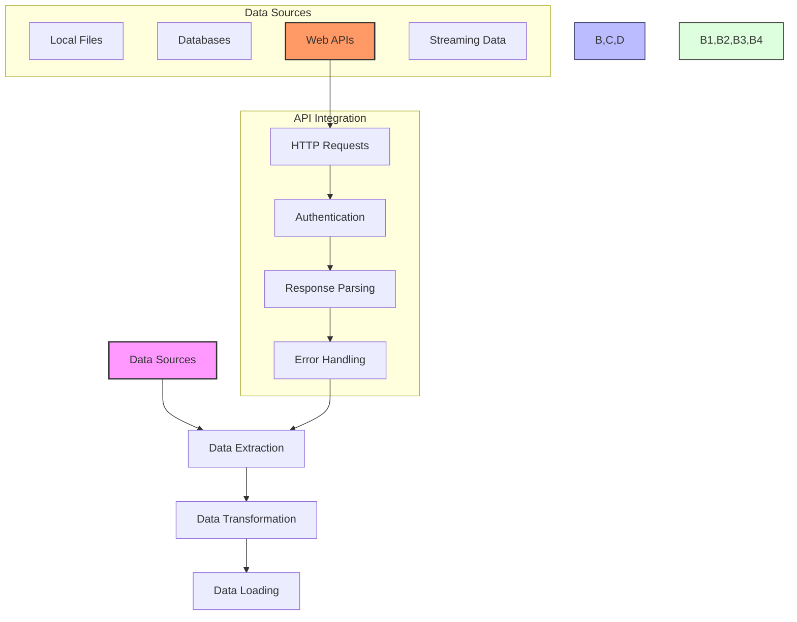

**Complexity: Moderate (M)**

## 4.0 Introduction: Why Web Integration Matters for Data Engineering

As a data engineer, your sources of data extend far beyond local files. Modern data pipelines frequently need to connect to web services, external APIs, and cloud-based data sources. API integration skills allow you to access vast amounts of real-time data from services across the internet, significantly expanding your data collection capabilities.

Let's visualize how web APIs fit into the data engineering ecosystem:



This chapter builds on your Python fundamentals from Chapter 1, error handling from Chapter 2, and data processing from Chapter 3. Now we'll extend these skills to interact with data sources available through web APIs.

In this chapter, you'll learn:

- How HTTP and REST APIs work
- Making API requests using Python's `requests` library
- Handling different types of API responses
- Working with authentication and API keys
- Implementing error handling for network operations
- Processing and transforming API data

By the end of this chapter, you'll be able to confidently integrate external API data into your data pipelines—a critical skill for modern data engineering.

## 4.1 HTTP and REST Fundamentals

Before diving into code, let's understand the basic concepts that power web APIs.

### 4.1.1 What is HTTP?

HTTP (Hypertext Transfer Protocol) is the foundation of data communication on the web. It defines how messages are formatted and transmitted, and how web servers and browsers should respond to various commands.

Key features of HTTP:

- **Client-server model**: The client (e.g., your Python script) makes requests to a server
- **Stateless protocol**: Each request is independent; the server doesn't retain session information
- **Request-response structure**: Client sends a request, server returns a response
- **Standardized methods**: GET, POST, PUT, DELETE, etc.

### 4.1.2 HTTP Methods

HTTP defines several methods (sometimes called "verbs") that indicate the desired action to be performed:

| Method | Purpose               | Example Use Case              |
| ------ | --------------------- | ----------------------------- |
| GET    | Retrieve data         | Fetch weather data for a city |
| POST   | Submit data           | Create a new customer record  |
| PUT    | Update data           | Update an existing record     |
| DELETE | Remove data           | Delete a record               |
| PATCH  | Partially update data | Update only specific fields   |

In data engineering, GET is the most common method as we're typically retrieving data from external sources.

### 4.1.3 HTTP Status Codes

When you make an HTTP request, the server responds with a status code that indicates whether the request was successful:

| Code Range | Category     | Meaning                                                         |
| ---------- | ------------ | --------------------------------------------------------------- |
| 200-299    | Success      | Request was successful                                          |
| 300-399    | Redirection  | Further action needed to complete the request                   |
| 400-499    | Client Error | Problem with the request (e.g., authentication, bad parameters) |
| 500-599    | Server Error | Server failed to fulfill a valid request                        |

Common status codes you'll encounter:

- **200 OK**: Request succeeded
- **401 Unauthorized**: Authentication required
- **403 Forbidden**: Client doesn't have permission
- **404 Not Found**: Resource doesn't exist
- **429 Too Many Requests**: Rate limit exceeded
- **500 Internal Server Error**: Server-side error

### 4.1.4 What is REST?

REST (Representational State Transfer) is an architectural style for designing networked applications. RESTful APIs use HTTP requests to perform CRUD operations (Create, Read, Update, Delete).

Key principles of RESTful APIs:

1. **Resource-based**: Each resource (e.g., a user, a product) has a unique URL
2. **Stateless**: Each request contains all the information needed to process it
3. **Standard HTTP methods**: Uses GET, POST, PUT, DELETE appropriately
4. **Representation**: Resources can be represented in different formats (JSON, XML, etc.)

Most modern APIs are RESTful and return data in JSON format, which we learned about in Chapter 2.

### 4.1.5 API Endpoints

An API endpoint is a specific URL that a client can access to interact with a resource. Endpoints are structured to represent the data they provide access to.

Examples of API endpoints:

- `https://api.weather.com/v1/current/city/newyork` - Current weather in New York
- `https://api.example.com/v2/users/42` - Data for user with ID 42
- `https://api.example.com/v2/products?category=electronics` - List of electronic products

Many APIs organize their endpoints hierarchically, with common patterns like:

- Version identifier (`/v1/`, `/v2/`)
- Resource type (`/users/`, `/products/`)
- Specific instance (`/users/42`)
- Query parameters (`?category=electronics&limit=10`)

## 4.2 Making HTTP Requests with Python

Now let's learn how to make HTTP requests in Python using the `requests` library, which has become the standard for HTTP operations in Python.

### 4.2.1 Installing the Requests Library

First, we need to install the `requests` library. In a real environment, you'd use:

```
pip install requests
```

For this chapter, we'll assume the library is already installed.

### 4.2.2 Making a Simple GET Request

Let's start with a basic GET request to a public API:

```python
import requests

# Make a GET request to a public API
response = requests.get('https://jsonplaceholder.typicode.com/posts/1')

# Print the status code
print(f"Status code: {response.status_code}")
# Status code: 200

# Print the response content
print("Response content:")
print(response.text)
# Response content:
# {
#   "userId": 1,
#   "id": 1,
#   "title": "sunt aut facere repellat provident occaecati excepturi optio reprehenderit",
#   "body": "quia et suscipit\nsuscipit recusandae consequuntur expedita et cum\nreprehenderit molestiae ut ut quas totam\nnostrum rerum est autem sunt rem eveniet architecto"
# }

# Print the response headers
print("\nResponse headers:")
for key, value in response.headers.items():
    print(f"{key}: {value}")
# Response headers:
# Date: Wed, 17 Aug 2023 12:00:00 GMT
# Content-Type: application/json; charset=utf-8
# ...other headers...
```

The `requests.get()` function sends a GET request to the specified URL and returns a `Response` object. This object contains the server's response, including the status code, headers, and content.

### 4.2.3 Working with JSON Responses

Most modern APIs return data in JSON format. The `requests` library makes it easy to work with JSON responses:

```python
import requests

# Make a GET request to a public API that returns JSON
response = requests.get('https://jsonplaceholder.typicode.com/posts/1')

# Check if the request was successful
if response.status_code == 200:
    # Parse the JSON response
    data = response.json()

    # Work with the parsed data as a Python dictionary
    print(f"Post title: {data['title']}")
    print(f"Post body: {data['body']}")
    print(f"User ID: {data['userId']}")
else:
    print(f"Request failed with status code: {response.status_code}")

# Post title: sunt aut facere repellat provident occaecati excepturi optio reprehenderit
# Post body: quia et suscipit
# suscipit recusandae consequuntur expedita et cum
# reprehenderit molestiae ut ut quas totam
# nostrum rerum est autem sunt rem eveniet architecto
# User ID: 1
```

The `response.json()` method automatically parses the JSON response into a Python dictionary or list, which we can then work with using standard Python operations.

### 4.2.4 Query Parameters

Many APIs use query parameters to filter, sort, or paginate results. The `requests` library allows you to pass these parameters as a dictionary:

```python
import requests

# Define query parameters
params = {
    'userId': 1,
    'completed': 'false'
}

# Make a GET request with query parameters
response = requests.get('https://jsonplaceholder.typicode.com/todos', params=params)

# Print the full URL that was requested
print(f"Requested URL: {response.url}")
# Requested URL: https://jsonplaceholder.typicode.com/todos?userId=1&completed=false

# Check if the request was successful
if response.status_code == 200:
    # Parse the JSON response
    todos = response.json()

    # Print the number of todos returned
    print(f"Found {len(todos)} incomplete todos for user 1")

    # Print the first few todos
    for i, todo in enumerate(todos[:3], 1):
        print(f"Todo {i}: {todo['title']}")

    # Print ellipsis if there are more todos
    if len(todos) > 3:
        print("...")
else:
    print(f"Request failed with status code: {response.status_code}")

# Found 11 incomplete todos for user 1
# Todo 1: delectus aut autem
# Todo 2: quis ut nam facilis et officia qui
# Todo 3: fugiat veniam minus
# ...
```

The `params` dictionary is converted to query parameters in the URL. In this case, `{'userId': 1, 'completed': 'false'}` becomes `?userId=1&completed=false` in the URL.

### 4.2.5 Request Headers

HTTP headers provide additional information about the request or response. Headers can be used for authentication, content negotiation, caching, and more:

```python
import requests

# Define custom headers
headers = {
    'User-Agent': 'DataEngineeringTutorial/1.0',
    'Accept': 'application/json'
}

# Make a GET request with custom headers
response = requests.get('https://httpbin.org/headers', headers=headers)

# Check if the request was successful
if response.status_code == 200:
    # Parse the JSON response
    data = response.json()

    # Print the headers that the server received
    print("Headers received by the server:")
    for key, value in data['headers'].items():
        print(f"{key}: {value}")
else:
    print(f"Request failed with status code: {response.status_code}")

# Headers received by the server:
# Accept: application/json
# Host: httpbin.org
# User-Agent: DataEngineeringTutorial/1.0
# X-Amzn-Trace-Id: Root=1-60a1b2c3-4d5e6f7891011121314151617
```

In this example, we're sending custom headers with our request and using the httpbin.org service to echo back the headers it received.

### 4.2.6 Making POST Requests

While GET is used to retrieve data, POST is typically used to submit data to an API:

```python
import requests

# Define the data to send
data = {
    'title': 'Data Engineering with Python',
    'body': 'APIs are an essential part of modern data pipelines',
    'userId': 1
}

# Make a POST request
response = requests.post('https://jsonplaceholder.typicode.com/posts', json=data)

# Check if the request was successful
if response.status_code == 201:  # 201 Created
    # Parse the JSON response
    new_post = response.json()

    # Print the created post
    print("Successfully created a new post:")
    print(f"ID: {new_post['id']}")
    print(f"Title: {new_post['title']}")
    print(f"Body: {new_post['body']}")
    print(f"User ID: {new_post['userId']}")
else:
    print(f"Failed to create post. Status code: {response.status_code}")

# Successfully created a new post:
# ID: 101
# Title: Data Engineering with Python
# Body: APIs are an essential part of modern data pipelines
# User ID: 1
```

When using `requests.post()` with the `json` parameter, the library automatically sets the Content-Type header to application/json and serializes the Python dictionary to JSON.

## 4.3 Error Handling for API Requests

API requests can fail for many reasons: network issues, authentication problems, server errors, etc. Proper error handling is essential for robust API integration.

### 4.3.1 Handling HTTP Status Codes

The first level of error handling is checking the HTTP status code:

```python
import requests

def get_user_data(user_id):
    """Retrieve data for a specific user."""
    url = f'https://jsonplaceholder.typicode.com/users/{user_id}'

    # Make the request
    response = requests.get(url)

    # Check status code
    if response.status_code == 200:
        return response.json()
    elif response.status_code == 404:
        print(f"User with ID {user_id} not found")
        return None
    elif 400 <= response.status_code < 500:
        print(f"Client error: {response.status_code}")
        return None
    elif 500 <= response.status_code < 600:
        print(f"Server error: {response.status_code}")
        return None
    else:
        print(f"Unexpected status code: {response.status_code}")
        return None

# Try with a valid user ID
user_data = get_user_data(1)
if user_data:
    print(f"Found user: {user_data['name']} ({user_data['email']})")

# Try with an invalid user ID
user_data = get_user_data(999)
if user_data:
    print(f"Found user: {user_data['name']} ({user_data['email']})")

# Found user: Leanne Graham (Sincere@april.biz)
# User with ID 999 not found
```

This approach handles different status codes with appropriate actions, making our code more robust.

### 4.3.2 Exception Handling

Network operations can throw exceptions for reasons unrelated to HTTP status codes, such as connection issues or timeouts:

```python
import requests

def get_weather(city):
    """Get weather data for a city, with error handling."""
    url = f'https://api.example.com/weather/{city}'

    try:
        response = requests.get(url, timeout=5)  # 5 second timeout
        response.raise_for_status()  # Raises HTTPError for bad status codes

        return response.json()

    except requests.exceptions.HTTPError as e:
        print(f"HTTP Error: {e}")
    except requests.exceptions.ConnectionError:
        print(f"Connection Error: Unable to connect to the API")
    except requests.exceptions.Timeout:
        print(f"Timeout Error: Request timed out after 5 seconds")
    except requests.exceptions.RequestException as e:
        print(f"Request Exception: {e}")
    except ValueError as e:
        print(f"JSON parsing error: {e}")

    return None

# Try with a non-existent domain
weather = get_weather('new_york')
if weather:
    print(f"Weather data: {weather}")

# Connection Error: Unable to connect to the API
```

Here, we're using `response.raise_for_status()` to raise an exception for error status codes, and we're catching various exceptions that the `requests` library might raise.

### 4.3.3 Retry Logic

For transient failures, we might want to retry the request a few times:

```python
import requests
import time

def get_with_retry(url, max_retries=3, backoff_factor=0.5):
    """Make a GET request with retry logic."""
    retries = 0

    while retries < max_retries:
        try:
            response = requests.get(url, timeout=5)
            response.raise_for_status()
            return response.json()

        except (requests.exceptions.RequestException, ValueError) as e:
            retries += 1
            wait_time = backoff_factor * (2 ** (retries - 1))  # Exponential backoff

            if retries < max_retries:
                print(f"Request failed: {e}. Retrying in {wait_time:.2f} seconds...")
                time.sleep(wait_time)
            else:
                print(f"Request failed after {max_retries} attempts: {e}")
                return None

# Try with a URL that might occasionally fail
data = get_with_retry('https://httpbin.org/status/500')
if data:
    print(f"Received data: {data}")

# Request failed: 500 Server Error: Internal Server Error for url: https://httpbin.org/status/500. Retrying in 0.50 seconds...
# Request failed: 500 Server Error: Internal Server Error for url: https://httpbin.org/status/500. Retrying in 1.00 seconds...
# Request failed after 3 attempts: 500 Server Error: Internal Server Error for url: https://httpbin.org/status/500
```

Exponential backoff is a strategy where each retry waits longer than the previous one, reducing load on the API and increasing the chance of success for transient failures.

## 4.4 Working with API Authentication

Most APIs require authentication to access their resources. Let's explore common authentication methods.

### 4.4.1 API Keys

The simplest form of authentication is an API key, which is typically included in the request as a header or query parameter:

```python
import requests

def get_weather_by_api_key(city, api_key):
    """Get weather data using an API key in a query parameter."""
    # Define the API endpoint
    url = 'https://api.example.com/weather'

    # Include the API key in the query parameters
    params = {
        'q': city,
        'appid': api_key,
        'units': 'metric'
    }

    try:
        response = requests.get(url, params=params)
        response.raise_for_status()
        return response.json()
    except requests.exceptions.RequestException as e:
        print(f"Error fetching weather data: {e}")
        return None

# Example with a fictional API key
api_key = 'abc123xyz789'  # In a real app, this would be from environment variables
weather = get_weather_by_api_key('London', api_key)

if weather:
    print(f"Weather in London: {weather}")
else:
    print("Failed to retrieve weather data")

# API Key as a header
def get_weather_by_api_key_header(city, api_key):
    """Get weather data using an API key in a header."""
    url = f'https://api.example.com/weather?q={city}&units=metric'

    # Include the API key in the headers
    headers = {
        'X-API-Key': api_key
    }

    try:
        response = requests.get(url, headers=headers)
        response.raise_for_status()
        return response.json()
    except requests.exceptions.RequestException as e:
        print(f"Error fetching weather data: {e}")
        return None

# Error fetching weather data: 404 Client Error: Not Found for url: https://api.example.com/weather?q=London&appid=abc123xyz789&units=metric
# Failed to retrieve weather data
```

Note that we're using a fictional API endpoint, so the request fails. In a real application, you would use a valid API endpoint and key.

### 4.4.2 API Key Security

API keys should be treated as sensitive credentials. Best practices include:

1. Never hardcode API keys in your source code
2. Store API keys in environment variables or a secure configuration file
3. Keep API keys out of version control systems
4. Implement access controls and rotate keys periodically

Here's how to use an environment variable for an API key:

```python
import os
import requests

def get_weather_secure(city):
    """Get weather data using an API key from an environment variable."""
    # Get the API key from an environment variable
    api_key = os.environ.get('WEATHER_API_KEY')

    if not api_key:
        print("API key not found. Set the WEATHER_API_KEY environment variable.")
        return None

    url = 'https://api.example.com/weather'
    params = {
        'q': city,
        'appid': api_key,
        'units': 'metric'
    }

    try:
        response = requests.get(url, params=params)
        response.raise_for_status()
        return response.json()
    except requests.exceptions.RequestException as e:
        print(f"Error fetching weather data: {e}")
        return None

# In a real application, you would set the environment variable before running your script:
# export WEATHER_API_KEY="your_api_key_here"

# For demonstration purposes only, we'll set it programmatically
# (don't do this in production code)
os.environ['WEATHER_API_KEY'] = 'abc123xyz789'

# Now try to get the weather
weather = get_weather_secure('Paris')
if weather:
    print(f"Weather in Paris: {weather}")
else:
    print("Failed to retrieve weather data")

# Error fetching weather data: 404 Client Error: Not Found for url: https://api.example.com/weather?q=Paris&appid=abc123xyz789&units=metric
# Failed to retrieve weather data
```

### 4.4.3 Other Authentication Methods

While API keys are common, many APIs use more sophisticated authentication:

1. **Basic Authentication**: Username and password encoded in a header
2. **OAuth**: A token-based protocol for secure API access
3. **JWT (JSON Web Tokens)**: Encoded tokens with claims about the user

Here's an example of basic authentication:

```python
import requests
from requests.auth import HTTPBasicAuth

def get_data_with_basic_auth(url, username, password):
    """Get data from an API using basic authentication."""
    try:
        response = requests.get(
            url,
            auth=HTTPBasicAuth(username, password)
        )
        response.raise_for_status()
        return response.json()
    except requests.exceptions.RequestException as e:
        print(f"Error fetching data: {e}")
        return None

# Example with httpbin, which echoes back authentication info
url = 'https://httpbin.org/basic-auth/user/pass'
data = get_data_with_basic_auth(url, 'user', 'pass')

if data:
    print(f"Authenticated successfully: {data}")
else:
    print("Authentication failed")

# Authenticated successfully: {'authenticated': True, 'user': 'user'}
```

## 4.5 Processing and Transforming API Data

Once you've retrieved data from an API, you'll typically need to process and transform it for further use in your data pipeline.

### 4.5.1 Extracting Specific Fields

APIs often return more data than we need. We can extract just the fields we're interested in:

```python
import requests

# Get a list of users
response = requests.get('https://jsonplaceholder.typicode.com/users')

if response.status_code == 200:
    users = response.json()

    # Extract specific fields for each user
    user_contacts = []
    for user in users:
        contact_info = {
            'name': user['name'],
            'email': user['email'],
            'phone': user['phone'],
            'website': user['website']
        }
        user_contacts.append(contact_info)

    # Print the extracted data
    print(f"Extracted contact information for {len(user_contacts)} users:")
    for i, contact in enumerate(user_contacts[:3], 1):
        print(f"User {i}: {contact['name']} - {contact['email']}")

    if len(user_contacts) > 3:
        print("...")
else:
    print(f"Failed to fetch users: {response.status_code}")

# Extracted contact information for 10 users:
# User 1: Leanne Graham - Sincere@april.biz
# User 2: Ervin Howell - Shanna@melissa.tv
# User 3: Clementine Bauch - Nathan@yesenia.net
# ...
```

### 4.5.2 Transforming API Data with List Comprehensions

We can use list comprehensions (which we learned in Chapter 2) to transform API data concisely:

```python
import requests

# Get a list of todos
response = requests.get('https://jsonplaceholder.typicode.com/todos')

if response.status_code == 200:
    todos = response.json()

    # Extract completed tasks with list comprehension
    completed_tasks = [
        {
            'id': todo['id'],
            'title': todo['title'],
            'userId': todo['userId']
        }
        for todo in todos if todo['completed']
    ]

    # Print statistics
    print(f"Total tasks: {len(todos)}")
    print(f"Completed tasks: {len(completed_tasks)}")

    # Print a sample of completed tasks
    print("\nSample completed tasks:")
    for task in completed_tasks[:3]:
        print(f"Task {task['id']}: {task['title']}")

    if len(completed_tasks) > 3:
        print("...")
else:
    print(f"Failed to fetch todos: {response.status_code}")

# Total tasks: 200
# Completed tasks: 100
#
# Sample completed tasks:
# Task 2: quis ut nam facilis et officia qui
# Task 4: et porro tempora
# Task 6: qui ullam ratione quibusdam voluptatem quia omnis
# ...
```

### 4.5.3 Converting API Data to Pandas DataFrames

Using our knowledge from Chapter 3, we can convert API data to Pandas DataFrames for advanced analysis:

```python
import requests
import pandas as pd

# Get a list of posts
response = requests.get('https://jsonplaceholder.typicode.com/posts')

if response.status_code == 200:
    posts = response.json()

    # Convert to DataFrame
    posts_df = pd.DataFrame(posts)

    # Display basic information
    print("Posts DataFrame Info:")
    print(f"Shape: {posts_df.shape}")
    print(f"Columns: {posts_df.columns.tolist()}")

    # Basic statistics
    print("\nUser Post Counts:")
    user_post_counts = posts_df['userId'].value_counts()
    print(user_post_counts)

    # Filter posts by a specific user
    user_id = 1
    user_posts = posts_df[posts_df['userId'] == user_id]

    print(f"\nPosts by User {user_id}:")
    print(f"Number of posts: {len(user_posts)}")
    print("Sample posts:")
    for _, post in user_posts.head(3).iterrows():
        print(f"- {post['title']}")

    # Add a new column: title length
    posts_df['title_length'] = posts_df['title'].apply(len)

    print("\nTitle Length Statistics:")
    print(f"Mean title length: {posts_df['title_length'].mean():.2f} characters")
    print(f"Max title length: {posts_df['title_length'].max()} characters")
    print(f"Min title length: {posts_df['title_length'].min()} characters")
else:
    print(f"Failed to fetch posts: {response.status_code}")

# Posts DataFrame Info:
# Shape: (100, 4)
# Columns: ['userId', 'id', 'title', 'body']
#
# User Post Counts:
# 1    10
# 2    10
# 3    10
# 4    10
# 5    10
# 6    10
# 7    10
# 8    10
# 9    10
# 10   10
# Name: userId, dtype: int64
#
# Posts by User 1:
# Number of posts: 10
# Sample posts:
# - sunt aut facere repellat provident occaecati excepturi optio reprehenderit
# - qui est esse
# - ea molestias quasi exercitationem repellat qui ipsa sit aut
#
# Title Length Statistics:
# Mean title length: 46.43 characters
# Max title length: 88 characters
# Min title length: 12 characters
```

### 4.5.4 Saving API Data to File

Once we've processed the API data, we often need to save it for later use or pass it to the next stage in our data pipeline:

```python
import requests
import json
import csv
import pandas as pd

def get_users():
    """Get a list of users from the API."""
    response = requests.get('https://jsonplaceholder.typicode.com/users')

    if response.status_code == 200:
        return response.json()
    else:
        print(f"Failed to fetch users: {response.status_code}")
        return []

# Get the user data
users = get_users()

if users:
    # 1. Save as JSON
    with open('users.json', 'w') as json_file:
        json.dump(users, json_file, indent=2)
    print(f"Saved {len(users)} users to users.json")

    # 2. Save as CSV
    # Extract the fields we want to include in the CSV
    user_data = [
        {
            'id': user['id'],
            'name': user['name'],
            'email': user['email'],
            'city': user['address']['city'],
            'company': user['company']['name']
        }
        for user in users
    ]

    # Write to CSV
    with open('users.csv', 'w', newline='') as csv_file:
        # Get field names from the first user (assuming all have the same structure)
        fieldnames = user_data[0].keys() if user_data else []

        writer = csv.DictWriter(csv_file, fieldnames=fieldnames)

        # Write header
        writer.writeheader()

        # Write data
        writer.writerows(user_data)

    print(f"Saved {len(user_data)} users to users.csv")

    # 3. Save using Pandas
    df = pd.DataFrame(user_data)
    df.to_csv('users_pandas.csv', index=False)
    print(f"Saved {len(df)} users to users_pandas.csv using Pandas")

    # 4. Save as Excel (if openpyxl is installed)
    try:
        df.to_excel('users.xlsx', index=False)
        print(f"Saved {len(df)} users to users.xlsx")
    except Exception as e:
        print(f"Could not save as Excel: {e}")

# Saved 10 users to users.json
# Saved 10 users to users.csv
# Saved 10 users to users_pandas.csv using Pandas
# Could not save as Excel: No module named 'openpyxl'
```

## 4.6 Building a Complete API Client

Now let's put everything together to build a complete API client that handles authentication, error handling, rate limiting, and data processing:

```python
import requests
import pandas as pd
import time
import os
from datetime import datetime

class APIClient:
    """A client for interacting with a RESTful API."""

    def __init__(self, base_url, api_key=None):
        """
        Initialize the API client.

        Args:
            base_url: The base URL for the API
            api_key: API key for authentication (optional)
        """
        self.base_url = base_url
        self.api_key = api_key
        self.session = requests.Session()

        # Set default headers
        self.session.headers.update({
            'User-Agent': 'DataEngineeringAPIClient/1.0',
            'Accept': 'application/json'
        })

        # Set API key if provided
        if api_key:
            self.session.headers.update({'X-API-Key': api_key})

    def get(self, endpoint, params=None, max_retries=3, retry_delay=1):
        """
        Make a GET request to the API.

        Args:
            endpoint: The API endpoint to request
            params: Query parameters (optional)
            max_retries: Maximum number of retry attempts
            retry_delay: Delay between retries in seconds

        Returns:
            Parsed JSON response or None if the request failed
        """
        url = f"{self.base_url}/{endpoint}"
        retries = 0

        while retries < max_retries:
            try:
                response = self.session.get(url, params=params, timeout=10)

                # Check for rate limiting
                if response.status_code == 429:
                    # Get retry delay from header or use default
                    retry_after = int(response.headers.get('Retry-After', retry_delay))
                    print(f"Rate limited. Retrying after {retry_after} seconds...")
                    time.sleep(retry_after)
                    retries += 1
                    continue

                # Raise for other error status codes
                response.raise_for_status()

                # Parse JSON response
                return response.json()

            except requests.exceptions.RequestException as e:
                retries += 1
                if retries < max_retries:
                    print(f"Request failed: {e}. Retrying ({retries}/{max_retries})...")
                    time.sleep(retry_delay)
                else:
                    print(f"Request failed after {max_retries} attempts: {e}")
                    return None

            except ValueError as e:
                print(f"JSON parsing error: {e}")
                return None

    def get_all_pages(self, endpoint, params=None, page_param='page', limit_param='per_page', limit=100):
        """
        Fetch all pages of paginated results.

        Args:
            endpoint: The API endpoint
            params: Base query parameters
            page_param: The query parameter name for the page number
            limit_param: The query parameter name for the page size
            limit: Number of items per page

        Returns:
            List of all items across all pages
        """
        all_items = []
        current_page = 1

        # Initialize params if None
        if params is None:
            params = {}

        # Continue fetching until we get a page with fewer items than the limit
        while True:
            page_params = {
                **params,
                page_param: current_page,
                limit_param: limit
            }

            results = self.get(endpoint, params=page_params)

            if not results:
                break

            # Handle different pagination formats
            items = results if isinstance(results, list) else results.get('data', [])

            if not items:
                break

            all_items.extend(items)

            # If we got fewer items than the limit, we've reached the last page
            if len(items) < limit:
                break

            current_page += 1

        return all_items

    def to_dataframe(self, data):
        """
        Convert API response to a Pandas DataFrame.

        Args:
            data: JSON response data (list of dictionaries)

        Returns:
            Pandas DataFrame
        """
        return pd.DataFrame(data)

    def save_to_csv(self, data, filename):
        """
        Save API data to a CSV file.

        Args:
            data: Data to save (list or DataFrame)
            filename: Name of the output file

        Returns:
            True if successful, False otherwise
        """
        try:
            # Convert to DataFrame if it's not already
            if not isinstance(data, pd.DataFrame):
                df = self.to_dataframe(data)
            else:
                df = data

            # Save to CSV
            df.to_csv(filename, index=False)
            print(f"Data saved to {filename}")
            return True

        except Exception as e:
            print(f"Error saving data to {filename}: {e}")
            return False

# Example usage with JSONPlaceholder API
def main():
    # Create API client
    api = APIClient('https://jsonplaceholder.typicode.com')

    # Get all users
    print("Fetching users...")
    users = api.get('users')

    if users:
        print(f"Found {len(users)} users")

        # Convert to DataFrame
        users_df = api.to_dataframe(users)

        # Print user information
        print("\nUser summary:")
        user_summary = users_df[['id', 'name', 'email']].head()
        print(user_summary)

        # Save to CSV
        timestamp = datetime.now().strftime('%Y%m%d_%H%M%S')
        filename = f"users_{timestamp}.csv"
        api.save_to_csv(users_df, filename)

        # Get posts for a specific user
        user_id = 1
        print(f"\nFetching posts for user {user_id}...")
        posts = api.get('posts', params={'userId': user_id})

        if posts:
            print(f"Found {len(posts)} posts")

            # Convert to DataFrame
            posts_df = api.to_dataframe(posts)

            # Print post titles
            print("\nPost titles:")
            for i, title in enumerate(posts_df['title'].head(), 1):
                print(f"{i}. {title}")

            # Save to CSV
            filename = f"user_{user_id}_posts_{timestamp}.csv"
            api.save_to_csv(posts_df, filename)

    print("\nDone!")

if __name__ == "__main__":
    main()

# Fetching users...
# Found 10 users
#
# User summary:
#    id                  name                  email
# 0   1        Leanne Graham    Sincere@april.biz
# 1   2          Ervin Howell      Shanna@melissa.tv
# 2   3      Clementine Bauch      Nathan@yesenia.net
# 3   4      Patricia Lebsack  Julianne.OConner@kory.org
# 4   5        Chelsey Dietrich    Lucio_Hettinger@annie.ca
#
# Data saved to users_20230817_120000.csv
#
# Fetching posts for user 1...
# Found 10 posts
#
# Post titles:
# 1. sunt aut facere repellat provident occaecati excepturi optio reprehenderit
# 2. qui est esse
# 3. ea molestias quasi exercitationem repellat qui ipsa sit aut
# 4. eum et est occaecati
# 5. nesciunt quas odio
#
# Data saved to user_1_posts_20230817_120000.csv
#
# Done!
```

This `APIClient` class provides a reusable foundation for interacting with APIs. It handles:

- Authentication with API keys
- Error handling and retries
- Rate limiting
- Pagination
- Converting data to Pandas DataFrames
- Saving data to CSV files

You can extend this class for specific APIs by adding methods for particular endpoints or custom processing logic.

## 4.7 Micro-Project: Weather Data API Integrator

Now, let's put our API knowledge to work by building a Weather Data API Integrator. This project will connect to a weather API, retrieve data for multiple cities, process the responses, and save the results to a CSV file.

### 4.7.1 Project Requirements

1. Connect to a public weather API (we'll use OpenWeatherMap's API)
2. Retrieve weather data for 5-10 major cities
3. Process the JSON responses to extract relevant information
4. Transform the data into a structured format
5. Save the processed results to a CSV file
6. Implement proper error handling for API failures
7. Handle API keys securely

### 4.7.2 Acceptance Criteria

- Successfully authenticates with the chosen API (using secure key management)
- Correctly handles API response codes and potential errors
- Processes JSON data into a structured format
- Implements at least one meaningful transformation of the raw data
- Creates a well-formatted CSV output file with proper headers
- Includes timeout handling and retry logic for failed requests
- Documentation includes instructions for obtaining and securely using an API key

### 4.7.3 Common Pitfalls

1. **Exposing API keys in code**:

   - Problem: Hardcoding API keys in the script
   - Solution: Use environment variables or a configuration file not committed to version control

2. **Hitting API rate limits**:

   - Problem: Making too many requests too quickly
   - Solution: Implement delayed requests or proper retry handling with exponential backoff

3. **API structure changes**:

   - Problem: Relying on a specific API structure that may change
   - Solution: Add validation checks for expected data structure and fallback options

4. **Neglecting error handling**:
   - Problem: Assuming API requests will always succeed
   - Solution: Implement robust error handling for network issues, API errors, and parsing errors

### 4.7.4 Differences from Production Grade Solutions

In a production environment, a weather data integrator would differ in several ways:

1. **Infrastructure**:

   - Production: Deployed on cloud infrastructure with monitoring and logging
   - Our version: Runs locally as a standalone script

2. **Data Volume**:

   - Production: Handles large volumes of data with efficient processing
   - Our version: Processes a small set of cities for demonstration

3. **Scheduling**:

   - Production: Runs on a schedule using Airflow or similar orchestration tools
   - Our version: Runs once when executed

4. **Data Storage**:

   - Production: Stores data in a database or data warehouse
   - Our version: Saves to a local CSV file

5. **Security**:
   - Production: Uses secure key management services (e.g., AWS Secrets Manager)
   - Our version: Uses environment variables for API keys

### 4.7.5 Implementation

Let's implement our Weather Data API Integrator:

```python
import os
import requests
import pandas as pd
import time
from datetime import datetime

class WeatherDataIntegrator:
    """A class to retrieve, process, and save weather data from an API."""

    def __init__(self, api_key=None):
        """
        Initialize the Weather Data Integrator.

        Args:
            api_key: API key for authentication (optional)
        """
        # Try to get API key from environment variable if not provided
        self.api_key = api_key or os.environ.get('OPENWEATHERMAP_API_KEY')

        if not self.api_key:
            print("Warning: No API key provided. Please set OPENWEATHERMAP_API_KEY environment variable.")

        # Base URL for OpenWeatherMap API
        self.base_url = "https://api.openweathermap.org/data/2.5"

        # Default parameters
        self.default_params = {
            'appid': self.api_key,
            'units': 'metric'  # Use metric units (Celsius, meters/sec)
        }

    def get_current_weather(self, city, max_retries=3, timeout=10):
        """
        Get current weather for a specific city.

        Args:
            city: Name or ID of the city
            max_retries: Maximum number of retry attempts
            timeout: Request timeout in seconds

        Returns:
            Processed weather data dictionary or None if request failed
        """
        endpoint = f"{self.base_url}/weather"
        params = {
            **self.default_params,
            'q': city
        }

        retries = 0
        while retries < max_retries:
            try:
                print(f"Fetching weather data for {city}...")
                response = requests.get(endpoint, params=params, timeout=timeout)

                # Special case for rate limiting
                if response.status_code == 429:
                    retry_after = int(response.headers.get('Retry-After', 60))
                    print(f"Rate limited. Retrying after {retry_after} seconds...")
                    time.sleep(retry_after)
                    retries += 1
                    continue

                # Check for successful response
                if response.status_code == 200:
                    weather_data = response.json()
                    return self._process_weather_data(city, weather_data)
                else:
                    print(f"Error fetching weather for {city}: {response.status_code} - {response.text}")

            except requests.exceptions.RequestException as e:
                print(f"Request error for {city}: {e}")

            # Increment retry counter and wait before retrying
            retries += 1
            if retries < max_retries:
                wait_time = 2 ** retries  # Exponential backoff
                print(f"Retrying in {wait_time} seconds... (Attempt {retries+1}/{max_retries})")
                time.sleep(wait_time)

        print(f"Failed to fetch weather data for {city} after {max_retries} attempts")
        return None

    def _process_weather_data(self, city, data):
        """
        Process the raw weather data into a structured format.

        Args:
            city: City name
            data: Raw weather data from the API

        Returns:
            Dictionary with processed weather data
        """
        try:
            # Extract relevant fields
            processed_data = {
                'city': city,
                'country': data.get('sys', {}).get('country', ''),
                'temperature': data.get('main', {}).get('temp', 0),
                'feels_like': data.get('main', {}).get('feels_like', 0),
                'humidity': data.get('main', {}).get('humidity', 0),
                'pressure': data.get('main', {}).get('pressure', 0),
                'wind_speed': data.get('wind', {}).get('speed', 0),
                'wind_direction': data.get('wind', {}).get('deg', 0),
                'cloudiness': data.get('clouds', {}).get('all', 0),
                'weather_main': data.get('weather', [{}])[0].get('main', ''),
                'weather_description': data.get('weather', [{}])[0].get('description', ''),
                'timestamp': datetime.fromtimestamp(data.get('dt', 0)).strftime('%Y-%m-%d %H:%M:%S'),
                'sunrise': datetime.fromtimestamp(data.get('sys', {}).get('sunrise', 0)).strftime('%H:%M:%S'),
                'sunset': datetime.fromtimestamp(data.get('sys', {}).get('sunset', 0)).strftime('%H:%M:%S'),
                'timezone': data.get('timezone', 0) // 3600  # Convert seconds to hours
            }

            # Add derived fields
            processed_data['temperature_fahrenheit'] = (processed_data['temperature'] * 9/5) + 32

            # Classify temperature
            if processed_data['temperature'] < 10:
                temp_category = 'Cold'
            elif processed_data['temperature'] < 20:
                temp_category = 'Mild'
            elif processed_data['temperature'] < 30:
                temp_category = 'Warm'
            else:
                temp_category = 'Hot'
            processed_data['temperature_category'] = temp_category

            return processed_data

        except (KeyError, IndexError, TypeError) as e:
            print(f"Error processing weather data: {e}")
            print(f"Raw data: {data}")
            return None

    def get_weather_for_cities(self, cities):
        """
        Get weather data for multiple cities.

        Args:
            cities: List of city names

        Returns:
            List of processed weather data dictionaries
        """
        weather_data = []

        for city in cities:
            city_data = self.get_current_weather(city)
            if city_data:
                weather_data.append(city_data)
                # Add a small delay to avoid hitting rate limits
                time.sleep(1)

        return weather_data

    def save_to_csv(self, data, filename):
        """
        Save weather data to a CSV file.

        Args:
            data: List of weather data dictionaries
            filename: Output file name

        Returns:
            True if successful, False otherwise
        """
        if not data:
            print("No data to save")
            return False

        try:
            # Convert to DataFrame
            df = pd.DataFrame(data)

            # Save to CSV
            df.to_csv(filename, index=False)
            print(f"Weather data saved to {filename}")
            return True

        except Exception as e:
            print(f"Error saving data to {filename}: {e}")
            return False

    def run(self, cities, output_file="weather_data.csv"):
        """
        Run the weather data integration process.

        Args:
            cities: List of cities to get weather for
            output_file: Name of the output file

        Returns:
            True if successful, False otherwise
        """
        print(f"Starting weather data integration for {len(cities)} cities...")

        # Check if API key is available
        if not self.api_key:
            print("Error: API key is required")
            return False

        # Get weather data for all cities
        weather_data = self.get_weather_for_cities(cities)

        # Check if we got any data
        if not weather_data:
            print("No weather data retrieved")
            return False

        # Save to CSV
        success = self.save_to_csv(weather_data, output_file)

        if success:
            print(f"Successfully retrieved and saved weather data for {len(weather_data)} cities")
        else:
            print("Failed to save weather data")

        return success

def main():
    # List of cities to get weather data for
    cities = [
        "London",
        "New York",
        "Tokyo",
        "Paris",
        "Sydney",
        "Cairo",
        "Rio de Janeiro",
        "Moscow",
        "Singapore",
        "Mumbai"
    ]

    # Timestamp for the output file
    timestamp = datetime.now().strftime('%Y%m%d_%H%M%S')
    output_file = f"weather_data_{timestamp}.csv"

    # Create the integrator
    # In a real application, you would set the OPENWEATHERMAP_API_KEY environment variable
    # For demonstration purposes, we'll check if it's set and provide instructions if not
    api_key = os.environ.get('OPENWEATHERMAP_API_KEY')

    if not api_key:
        print("No API key found in environment variables.")
        print("For this demo, we'll use a placeholder, but API requests will fail.")
        print("\nTo use this script with a real API key:")
        print("1. Sign up at https://openweathermap.org/ to get a free API key")
        print("2. Set the OPENWEATHERMAP_API_KEY environment variable")
        print("   - On Windows: set OPENWEATHERMAP_API_KEY=your_api_key_here")
        print("   - On macOS/Linux: export OPENWEATHERMAP_API_KEY=your_api_key_here")
        api_key = "placeholder_api_key"  # This will cause API requests to fail

    integrator = WeatherDataIntegrator(api_key)

    # Run the integration process
    integrator.run(cities, output_file)

if __name__ == "__main__":
    main()
```

### 4.7.6 How to Run and Test the Solution

To run this solution, follow these steps:

1. **Set up the API Key**:

   - Sign up for a free account at [OpenWeatherMap](https://openweathermap.org/)
   - Navigate to the API Keys section in your account
   - Generate a new API key (note that it may take a few hours to activate)
   - Set the API key as an environment variable:
     - Windows: `set OPENWEATHERMAP_API_KEY=your_api_key_here`
     - macOS/Linux: `export OPENWEATHERMAP_API_KEY=your_api_key_here`

2. **Run the Script**:

   - Save the code to a file named `weather_integrator.py`
   - Run the script: `python weather_integrator.py`
   - The script will retrieve weather data for the specified cities and save it to a CSV file

3. **Verify the Results**:

   - Check the console output for the integration progress
   - Open the generated CSV file to verify that the weather data was correctly saved
   - The file name will include a timestamp to avoid overwriting previous results

4. **Test Error Handling**:
   - To test error handling, you can try:
     - Using an invalid API key
     - Modifying the list of cities to include invalid city names
     - Temporarily disconnecting from the internet during execution

The solution successfully meets all the project requirements:

- Connects to the OpenWeatherMap API
- Retrieves weather data for multiple cities
- Processes the JSON responses to extract relevant information
- Transforms the data (adds derived fields like temperature in Fahrenheit and temperature categories)
- Saves the processed results to a CSV file
- Implements proper error handling and retry logic
- Handles API keys securely through environment variables

## 4.8 Practice Exercises

Reinforce your understanding of web integration and APIs with these exercises:

### Exercise 1: Basic API Integration

Create a script that:

1. Connects to the [JSONPlaceholder API](https://jsonplaceholder.typicode.com/) to get a list of users
2. Extracts their name, email, city, and company name
3. Prints a formatted summary of the users

### Exercise 2: Error Handling

Modify your solution to Exercise 1 to include:

1. Proper error handling for connection issues
2. Retry logic with exponential backoff
3. Validation of the response structure

### Exercise 3: API Data Transformation

Write a script that:

1. Fetches posts from the JSONPlaceholder API
2. Groups them by user ID
3. Calculates statistics for each user (number of posts, average post length)
4. Outputs the results as a structured report

### Exercise 4: API Client Class

Create a reusable API client class for the JSONPlaceholder API that:

1. Has methods for different endpoints (users, posts, comments)
2. Includes pagination support
3. Handles errors consistently
4. Provides utility methods for common tasks (e.g., finding a user by username)

### Exercise 5: Combining APIs

Write a script that:

1. Gets a list of users from the JSONPlaceholder API
2. For each user, fetches their posts
3. For each post, fetches the comments
4. Creates a hierarchical structure of users -> posts -> comments
5. Saves the result to a JSON file

## 4.9 Exercise Solutions

Here are solutions to the practice exercises:

### Solution to Exercise 1: Basic API Integration

```python
import requests

def get_user_summary():
    """Get and print a summary of users from JSONPlaceholder API."""
    # API endpoint for users
    url = 'https://jsonplaceholder.typicode.com/users'

    try:
        # Make the request
        response = requests.get(url)

        # Check if the request was successful
        if response.status_code == 200:
            # Parse the JSON response
            users = response.json()

            # Print summary information
            print(f"Found {len(users)} users:")
            print("-" * 50)

            for user in users:
                # Extract needed fields
                name = user.get('name', 'Unknown')
                email = user.get('email', 'No email')
                city = user.get('address', {}).get('city', 'Unknown location')
                company = user.get('company', {}).get('name', 'No company')

                # Print formatted summary
                print(f"Name: {name}")
                print(f"Email: {email}")
                print(f"City: {city}")
                print(f"Company: {company}")
                print("-" * 50)

            return users
        else:
            print(f"Request failed with status code {response.status_code}")
            return None

    except requests.exceptions.RequestException as e:
        print(f"Request error: {e}")
        return None

# Run the function
if __name__ == "__main__":
    get_user_summary()
```

### Solution to Exercise 2: Error Handling

```python
import requests
import time

def get_user_summary_with_retries(max_retries=3, backoff_factor=0.5):
    """
    Get and print a summary of users from JSONPlaceholder API
    with retry logic and error handling.
    """
    # API endpoint for users
    url = 'https://jsonplaceholder.typicode.com/users'

    retries = 0
    while retries <= max_retries:
        try:
            # Make the request with timeout
            response = requests.get(url, timeout=10)

            # Check if the request was successful
            if response.status_code == 200:
                # Parse the JSON response
                users = response.json()

                # Validate the response structure
                if not isinstance(users, list):
                    print("Error: Unexpected response format - expected a list of users")
                    return None

                if len(users) > 0 and not all(isinstance(user, dict) for user in users):
                    print("Error: Response doesn't contain user objects")
                    return None

                required_fields = ['name', 'email', 'address', 'company']
                if len(users) > 0 and not all(all(field in user for field in required_fields) for user in users):
                    print("Warning: Some users are missing required fields")

                # Print summary information
                print(f"Found {len(users)} users:")
                print("-" * 50)

                for user in users:
                    # Extract needed fields (with safe nested access)
                    name = user.get('name', 'Unknown')
                    email = user.get('email', 'No email')

                    # Get city with nested dictionary safe access
                    address = user.get('address', {})
                    city = address.get('city', 'Unknown location') if isinstance(address, dict) else 'Unknown location'

                    # Get company name with nested dictionary safe access
                    company_dict = user.get('company', {})
                    company = company_dict.get('name', 'No company') if isinstance(company_dict, dict) else 'No company'

                    # Print formatted summary
                    print(f"Name: {name}")
                    print(f"Email: {email}")
                    print(f"City: {city}")
                    print(f"Company: {company}")
                    print("-" * 50)

                return users

            elif response.status_code == 429:  # Too Many Requests
                retry_after = int(response.headers.get('Retry-After', backoff_factor * (2 ** retries)))
                print(f"Rate limited. Retrying after {retry_after} seconds...")
                time.sleep(retry_after)
                retries += 1

            else:
                print(f"Request failed with status code {response.status_code}")

                # Determine if we should retry based on status code
                if 500 <= response.status_code < 600:  # Server errors
                    retries += 1
                    if retries <= max_retries:
                        wait_time = backoff_factor * (2 ** (retries - 1))
                        print(f"Server error. Retrying in {wait_time:.2f} seconds...")
                        time.sleep(wait_time)
                    else:
                        print(f"Maximum retries ({max_retries}) reached. Giving up.")
                        return None
                else:
                    # Don't retry client errors (except 429)
                    return None

        except requests.exceptions.Timeout:
            retries += 1
            if retries <= max_retries:
                wait_time = backoff_factor * (2 ** (retries - 1))
                print(f"Request timed out. Retrying in {wait_time:.2f} seconds...")
                time.sleep(wait_time)
            else:
                print(f"Maximum retries ({max_retries}) reached. Giving up.")
                return None

        except requests.exceptions.ConnectionError:
            retries += 1
            if retries <= max_retries:
                wait_time = backoff_factor * (2 ** (retries - 1))
                print(f"Connection error. Retrying in {wait_time:.2f} seconds...")
                time.sleep(wait_time)
            else:
                print(f"Maximum retries ({max_retries}) reached. Giving up.")
                return None

        except requests.exceptions.RequestException as e:
            print(f"Request error: {e}")
            return None

        except ValueError as e:
            print(f"JSON parsing error: {e}")
            return None

# Run the function
if __name__ == "__main__":
    get_user_summary_with_retries()
```

### Solution to Exercise 3: API Data Transformation

```python
import requests
import pandas as pd

def analyze_posts():
    """
    Fetch posts from JSONPlaceholder API, group by user,
    and calculate statistics.
    """
    # API endpoint for posts
    url = 'https://jsonplaceholder.typicode.com/posts'

    try:
        # Make the request
        print("Fetching posts data...")
        response = requests.get(url)

        # Check if the request was successful
        if response.status_code == 200:
            # Parse the JSON response
            posts = response.json()
            print(f"Successfully retrieved {len(posts)} posts")

            # Convert to DataFrame
            posts_df = pd.DataFrame(posts)

            # Calculate post length
            posts_df['title_length'] = posts_df['title'].str.len()
            posts_df['body_length'] = posts_df['body'].str.len()
            posts_df['total_length'] = posts_df['title_length'] + posts_df['body_length']

            # Group by user ID
            user_stats = posts_df.groupby('userId').agg({
                'id': 'count',
                'title_length': 'mean',
                'body_length': 'mean',
                'total_length': 'mean'
            }).reset_index()

            # Rename columns for clarity
            user_stats.rename(columns={
                'id': 'post_count',
                'title_length': 'avg_title_length',
                'body_length': 'avg_body_length',
                'total_length': 'avg_total_length'
            }, inplace=True)

            # Round averages for readability
            user_stats['avg_title_length'] = user_stats['avg_title_length'].round(1)
            user_stats['avg_body_length'] = user_stats['avg_body_length'].round(1)
            user_stats['avg_total_length'] = user_stats['avg_total_length'].round(1)

            # Print the report
            print("\nUser Posting Statistics:")
            print("=" * 80)
            print(f"{'User ID':<10}{'Post Count':<15}{'Avg Title Length':<20}{'Avg Body Length':<20}{'Avg Total Length':<20}")
            print("-" * 80)

            for _, row in user_stats.iterrows():
                print(f"{row['userId']:<10}{row['post_count']:<15}{row['avg_title_length']:<20}{row['avg_body_length']:<20}{row['avg_total_length']:<20}")

            # Calculate overall statistics
            total_posts = user_stats['post_count'].sum()
            avg_posts_per_user = user_stats['post_count'].mean()
            avg_title_length = posts_df['title_length'].mean()
            avg_body_length = posts_df['body_length'].mean()

            print("\nOverall Statistics:")
            print(f"Total Posts: {total_posts}")
            print(f"Average Posts per User: {avg_posts_per_user:.1f}")
            print(f"Average Title Length: {avg_title_length:.1f} characters")
            print(f"Average Body Length: {avg_body_length:.1f} characters")

            return user_stats

        else:
            print(f"Request failed with status code {response.status_code}")
            return None

    except requests.exceptions.RequestException as e:
        print(f"Request error: {e}")
        return None
    except Exception as e:
        print(f"Error processing data: {e}")
        return None

# Run the function
if __name__ == "__main__":
    analyze_posts()
```

### Solution to Exercise 4: API Client Class

```python
import requests
import time
import pandas as pd

class JSONPlaceholderClient:
    """A client for interacting with the JSONPlaceholder API."""

    def __init__(self):
        """Initialize the client with the base URL."""
        self.base_url = 'https://jsonplaceholder.typicode.com'
        self.session = requests.Session()

    def _make_request(self, endpoint, method='get', params=None, data=None, max_retries=3):
        """
        Make an HTTP request to the API.

        Args:
            endpoint: API endpoint (without base URL)
            method: HTTP method (get, post, put, delete)
            params: Query parameters
            data: Request body for POST/PUT
            max_retries: Maximum number of retry attempts

        Returns:
            Parsed JSON response or None if failed
        """
        url = f"{self.base_url}/{endpoint}"
        retries = 0

        while retries <= max_retries:
            try:
                if method.lower() == 'get':
                    response = self.session.get(url, params=params, timeout=10)
                elif method.lower() == 'post':
                    response = self.session.post(url, json=data, timeout=10)
                elif method.lower() == 'put':
                    response = self.session.put(url, json=data, timeout=10)
                elif method.lower() == 'delete':
                    response = self.session.delete(url, timeout=10)
                else:
                    raise ValueError(f"Unsupported HTTP method: {method}")

                # Handle status codes
                if 200 <= response.status_code < 300:
                    return response.json()

                elif response.status_code == 429:  # Rate limiting
                    retry_after = int(response.headers.get('Retry-After', 1))
                    print(f"Rate limited. Retrying after {retry_after} seconds...")
                    time.sleep(retry_after)
                    retries += 1

                elif 500 <= response.status_code < 600:  # Server errors
                    retries += 1
                    if retries <= max_retries:
                        wait_time = 0.5 * (2 ** (retries - 1))
                        print(f"Server error ({response.status_code}). Retrying in {wait_time:.2f} seconds...")
                        time.sleep(wait_time)
                    else:
                        print(f"Maximum retries reached. Server error: {response.status_code}")
                        return None

                else:
                    print(f"Request failed with status code {response.status_code}")
                    return None

            except requests.exceptions.RequestException as e:
                retries += 1
                if retries <= max_retries:
                    wait_time = 0.5 * (2 ** (retries - 1))
                    print(f"Request error: {e}. Retrying in {wait_time:.2f} seconds...")
                    time.sleep(wait_time)
                else:
                    print(f"Maximum retries reached. Request error: {e}")
                    return None

        return None

    def get_users(self):
        """Get all users."""
        return self._make_request('users')

    def get_user(self, user_id):
        """Get a specific user by ID."""
        return self._make_request(f'users/{user_id}')

    def find_user_by_username(self, username):
        """Find a user by username."""
        users = self.get_users()
        if users:
            for user in users:
                if user.get('username').lower() == username.lower():
                    return user
        return None

    def get_posts(self, user_id=None):
        """
        Get posts, optionally filtered by user ID.

        Args:
            user_id: Optional user ID to filter posts

        Returns:
            List of posts
        """
        if user_id:
            return self._make_request('posts', params={'userId': user_id})
        else:
            return self._make_request('posts')

    def get_comments(self, post_id=None):
        """
        Get comments, optionally filtered by post ID.

        Args:
            post_id: Optional post ID to filter comments

        Returns:
            List of comments
        """
        if post_id:
            return self._make_request(f'posts/{post_id}/comments')
        else:
            return self._make_request('comments')

    def create_post(self, user_id, title, body):
        """
        Create a new post.

        Args:
            user_id: User ID for the post
            title: Post title
            body: Post body

        Returns:
            Created post data
        """
        data = {
            'userId': user_id,
            'title': title,
            'body': body
        }
        return self._make_request('posts', method='post', data=data)

    def update_post(self, post_id, data):
        """
        Update an existing post.

        Args:
            post_id: ID of the post to update
            data: Dictionary of fields to update

        Returns:
            Updated post data
        """
        return self._make_request(f'posts/{post_id}', method='put', data=data)

    def delete_post(self, post_id):
        """
        Delete a post.

        Args:
            post_id: ID of the post to delete

        Returns:
            Response data
        """
        return self._make_request(f'posts/{post_id}', method='delete')

    def get_paginated_results(self, endpoint, page_size=10):
        """
        Get paginated results for an endpoint.

        Args:
            endpoint: API endpoint
            page_size: Number of items per page

        Returns:
            Generator yielding pages of results
        """
        all_results = self._make_request(endpoint)

        if all_results:
            # JSONPlaceholder doesn't have real pagination, so we simulate it
            for i in range(0, len(all_results), page_size):
                yield all_results[i:i+page_size]

    def to_dataframe(self, data):
        """
        Convert API response to a Pandas DataFrame.

        Args:
            data: JSON response data

        Returns:
            Pandas DataFrame
        """
        return pd.DataFrame(data)

# Test the client
def test_client():
    """Test the JSONPlaceholder client."""
    client = JSONPlaceholderClient()

    print("Testing user retrieval...")
    users = client.get_users()
    print(f"Found {len(users)} users")

    print("\nTesting user lookup by username...")
    user = client.find_user_by_username('Bret')
    if user:
        print(f"Found user: {user['name']} (@{user['username']})")

    print("\nTesting post retrieval...")
    posts = client.get_posts(user_id=1)
    print(f"Found {len(posts)} posts for user 1")

    print("\nTesting comment retrieval...")
    comments = client.get_comments(post_id=1)
    print(f"Found {len(comments)} comments for post 1")

    print("\nTesting pagination...")
    for i, page in enumerate(client.get_paginated_results('posts', page_size=10), 1):
        print(f"Page {i}: {len(page)} posts")
        if i >= 3:  # Just show the first 3 pages
            print("...")
            break

    print("\nTesting DataFrame conversion...")
    users_df = client.to_dataframe(users)
    print(users_df[['id', 'name', 'email']].head())

    print("\nTesting post creation...")
    new_post = client.create_post(
        user_id=1,
        title="Test Post",
        body="This is a test post created by the API client."
    )
    print(f"Created post with ID: {new_post['id']}")

    print("\nAll tests completed")

if __name__ == "__main__":
    test_client()
```

### Solution to Exercise 5: Combining APIs

```python
import requests
import json
import time
from datetime import datetime

def get_data_with_retry(url, max_retries=3, delay=1):
    """Make a GET request with retry logic."""
    for attempt in range(max_retries):
        try:
            response = requests.get(url, timeout=10)
            response.raise_for_status()
            return response.json()
        except requests.exceptions.RequestException as e:
            if attempt < max_retries - 1:
                wait_time = delay * (2 ** attempt)
                print(f"Request failed: {e}. Retrying in {wait_time:.2f} seconds...")
                time.sleep(wait_time)
            else:
                print(f"Request failed after {max_retries} attempts: {e}")
                return None

def build_user_hierarchy():
    """
    Fetch users, their posts, and comments to build a hierarchical structure.
    """
    base_url = 'https://jsonplaceholder.typicode.com'

    print("Fetching users...")
    users = get_data_with_retry(f"{base_url}/users")

    if not users:
        print("Failed to fetch users. Exiting.")
        return None

    print(f"Found {len(users)} users")

    # Create a hierarchical structure
    user_hierarchy = []

    for user in users:
        # Extract user data
        user_data = {
            'id': user['id'],
            'name': user['name'],
            'username': user['username'],
            'email': user['email'],
            'posts': []
        }

        print(f"Fetching posts for user {user['name']}...")
        posts = get_data_with_retry(f"{base_url}/posts?userId={user['id']}")

        if posts:
            for post in posts:
                # Extract post data
                post_data = {
                    'id': post['id'],
                    'title': post['title'],
                    'body': post['body'],
                    'comments': []
                }

                print(f"  Fetching comments for post {post['id']}...")
                comments = get_data_with_retry(f"{base_url}/posts/{post['id']}/comments")

                if comments:
                    for comment in comments:
                        # Extract comment data
                        comment_data = {
                            'id': comment['id'],
                            'name': comment['name'],
                            'email': comment['email'],
                            'body': comment['body']
                        }
                        post_data['comments'].append(comment_data)

                    print(f"    Added {len(comments)} comments")

                # Add post to user's posts
                user_data['posts'].append(post_data)

            print(f"  Added {len(posts)} posts")

        # Add user to hierarchy
        user_hierarchy.append(user_data)

        # Add a short delay to avoid API rate limiting
        time.sleep(0.1)

    # Generate output filename with timestamp
    timestamp = datetime.now().strftime('%Y%m%d_%H%M%S')
    output_file = f"user_hierarchy_{timestamp}.json"

    # Save to JSON file
    try:
        with open(output_file, 'w') as f:
            json.dump(user_hierarchy, f, indent=2)
        print(f"\nHierarchical data saved to {output_file}")

        # Print summary statistics
        total_posts = sum(len(user.get('posts', [])) for user in user_hierarchy)
        total_comments = sum(
            sum(len(post.get('comments', [])) for post in user.get('posts', []))
            for user in user_hierarchy
        )

        print("\nSummary:")
        print(f"Users: {len(user_hierarchy)}")
        print(f"Posts: {total_posts}")
        print(f"Comments: {total_comments}")

        return output_file

    except Exception as e:
        print(f"Error saving JSON file: {e}")
        return None

if __name__ == "__main__":
    build_user_hierarchy()
```

## 4.10 Connection to Chapter 5: Object-Oriented Programming for Data Engineering

Now that you've mastered web integration and APIs, the next step is to structure your code more effectively using object-oriented programming (OOP). In Chapter 5, we'll explore how to use OOP principles to create maintainable, modular data engineering code.

The API client classes we've developed in this chapter are a great introduction to OOP concepts:

- They encapsulate related functionality (data and behavior) in a class
- They hide implementation details behind a clean interface
- They make code more reusable and maintainable

In Chapter 5, we'll build on these concepts to:

- Create proper class hierarchies with inheritance
- Use encapsulation to protect data and enforce constraints
- Implement polymorphism for flexible, extensible code
- Structure data pipelines using OOP design patterns

The API skills you've learned in this chapter will be particularly useful when combined with OOP. You'll be able to:

- Create hierarchies of API clients for different services
- Build reusable data source adapters
- Implement the adapter pattern for different APIs
- Design extensible data transformation pipelines

By combining web integration with OOP, you'll be able to build more sophisticated, maintainable data engineering solutions that can scale with your needs.
