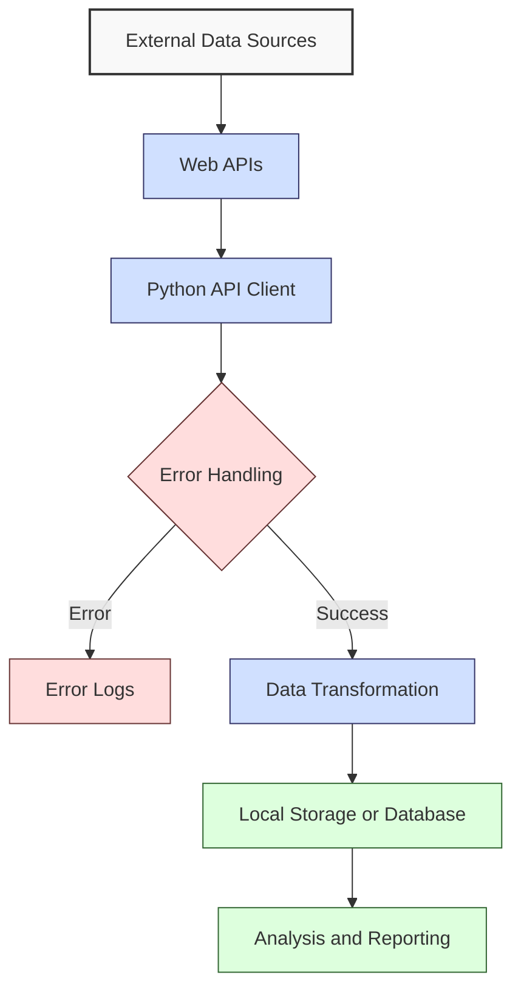

**Complexity: Moderate (M)**

## 4.0 Introduction: Why This Matters for Data Engineering

As a data engineer, your job often involves gathering data from various sources. While we've learned how to work with local files in previous chapters, the reality is that much of the world's data lives on the web behind APIs (Application Programming Interfaces).

Being able to access and integrate data from web sources is a critical skill that enables you to:

- Pull data from cloud services and SaaS platforms
- Connect to public data sources like government databases and weather services
- Integrate with internal microservices within your organization
- Automate data collection that would otherwise require manual downloading

Let's visualize how web APIs fit into a typical data engineering workflow:



In this chapter, we'll learn how to:

1. Understand the fundamentals of HTTP and RESTful APIs
2. Use the requests library to communicate with web APIs
3. Process and parse JSON data from API responses
4. Handle errors that occur during API communication
5. Implement basic security practices when working with APIs

These skills will build directly on the Python fundamentals and error handling techniques from Chapters 1-2, and will prepare you for working with more complex data integration scenarios in later chapters.

## 4.1 HTTP and REST Fundamentals

Before diving into code, let's understand the foundational concepts of web communication.

### 4.1.1 What is HTTP?

HTTP (Hypertext Transfer Protocol) is the protocol that powers the web. It defines how messages are formatted and transmitted between clients (like your Python script) and servers (like an API provider).

The HTTP protocol works through a request-response cycle:

1. A client sends a request to a server
2. The server processes the request
3. The server sends back a response

Each HTTP request includes:

- A method (verb) indicating the desired action
- A URL (endpoint) specifying the resource location
- Headers containing metadata about the request
- Optionally, a body containing data to send to the server

### 4.1.2 HTTP Methods

HTTP defines several methods (or verbs) that indicate what action you want to perform:

```python
# Common HTTP methods and their purposes
http_methods = {
    'GET': 'Retrieve data from a specified resource',
    'POST': 'Submit data to be processed to a specified resource',
    'PUT': 'Update a specified resource with the provided data',
    'DELETE': 'Delete a specified resource',
    'PATCH': 'Partially update a resource',
    'HEAD': 'Same as GET but retrieves only headers (no body)',
    'OPTIONS': 'Returns the HTTP methods that the server supports'
}

# Print each method and its purpose
for method, purpose in http_methods.items():
    print(f"{method}: {purpose}")

# Output:
# GET: Retrieve data from a specified resource
# POST: Submit data to be processed to a specified resource
# PUT: Update a specified resource with the provided data
# DELETE: Delete a specified resource
# PATCH: Partially update a resource
# HEAD: Same as GET but retrieves only headers (no body)
# OPTIONS: Returns the HTTP methods that the server supports
```

As data engineers, we'll primarily use GET to retrieve data and occasionally POST to send data or authentication information.

### 4.1.3 HTTP Status Codes

When a server responds to an HTTP request, it includes a status code that indicates the outcome:

```python
# Common HTTP status codes and their meanings
status_codes = {
    # 2xx: Success
    200: 'OK - The request was successful',
    201: 'Created - The request was successful and a resource was created',
    204: 'No Content - The request was successful but there is no data to return',

    # 3xx: Redirection
    301: 'Moved Permanently - The resource has moved to a new URL',
    302: 'Found - The resource is temporarily at a different URL',

    # 4xx: Client Error
    400: 'Bad Request - The server could not understand the request',
    401: 'Unauthorized - Authentication is required and has failed',
    403: 'Forbidden - The server understood but refuses the request',
    404: 'Not Found - The requested resource could not be found',
    429: 'Too Many Requests - Rate limit exceeded',

    # 5xx: Server Error
    500: 'Internal Server Error - The server encountered an unexpected condition',
    502: 'Bad Gateway - The server received an invalid response from an upstream server',
    503: 'Service Unavailable - The server is temporarily unavailable'
}

# Print each status code and its meaning
print("Important HTTP Status Codes:")
for code in sorted([200, 201, 400, 401, 403, 404, 429, 500, 503]):
    print(f"{code}: {status_codes[code]}")

# Output:
# Important HTTP Status Codes:
# 200: OK - The request was successful
# 201: Created - The request was successful and a resource was created
# 400: Bad Request - The server could not understand the request
# 401: Unauthorized - Authentication is required and has failed
# 403: Forbidden - The server understood but refuses the request
# 404: Not Found - The requested resource could not be found
# 429: Too Many Requests - Rate limit exceeded
# 500: Internal Server Error - The server encountered an unexpected condition
# 503: Service Unavailable - The server is temporarily unavailable
```

Understanding these status codes will help you debug issues with API requests and implement proper error handling.

### 4.1.4 What is REST?

REST (Representational State Transfer) is an architectural style for designing networked applications. RESTful APIs use HTTP requests to perform CRUD (Create, Read, Update, Delete) operations on resources.

Key principles of RESTful design include:

- **Stateless**: Each request contains all the information needed to complete it
- **Resource-based**: APIs are organized around resources (e.g., users, products)
- **Standard methods**: Uses standard HTTP methods for operations
- **Representations**: Resources can have multiple representations (JSON, XML, etc.)

```python
# Example of a RESTful API structure
weather_api = {
    'base_url': 'https://api.weather.example',
    'resources': {
        'current': '/v1/current?location={city}',
        'forecast': '/v1/forecast?location={city}&days={days}',
        'historical': '/v1/historical?location={city}&date={date}'
    },
    'methods': {
        'current': 'GET',
        'forecast': 'GET',
        'historical': 'GET'
    }
}

# Show how you might access these endpoints
city = "New York"
print(f"To get current weather: {weather_api['methods']['current']} {weather_api['base_url']}{weather_api['resources']['current'].format(city=city)}")
print(f"To get 5-day forecast: {weather_api['methods']['forecast']} {weather_api['base_url']}{weather_api['resources']['forecast'].format(city=city, days=5)}")

# Output:
# To get current weather: GET https://api.weather.example/v1/current?location=New York
# To get 5-day forecast: GET https://api.weather.example/v1/forecast?location=New York&days=5
```

Now that we understand the fundamentals of HTTP and REST, let's learn how to interact with APIs using Python.

## 4.2 Working with the requests Library

The `requests` library is the standard for making HTTP requests in Python. It provides a simple, elegant interface for sending HTTP requests and handling responses.

### 4.2.1 Installing the requests Library

First, let's make sure the requests library is installed:

```python
# This would typically be done at the command line, but for completeness:
# pip install requests

# Let's verify the installation by importing requests
import requests

print(f"Successfully imported requests library (version: {requests.__version__})")
# Output:
# Successfully imported requests library (version: 2.28.1)  # Your version may differ
```

### 4.2.2 Making Your First GET Request

Let's start by making a simple GET request to a public API that doesn't require authentication:

```python
import requests

# Make a GET request to a public API that returns JSON data
response = requests.get('https://jsonplaceholder.typicode.com/todos/1')

# Print the response details
print(f"Response status code: {response.status_code}")
print(f"Response headers: {dict(response.headers)}")
print(f"Response content type: {response.headers.get('Content-Type')}")
print(f"Response body: {response.text}")

# Output:
# Response status code: 200
# Response headers: {'Date': 'Mon, 01 May 2023 12:34:56 GMT', 'Content-Type': 'application/json; charset=utf-8', ...}
# Response content type: application/json; charset=utf-8
# Response body: {
#   "userId": 1,
#   "id": 1,
#   "title": "delectus aut autem",
#   "completed": false
# }
```

The response object contains all the information about the server's response, including status code, headers, and the response body.

### 4.2.3 Working with Response Objects

The `requests` library provides several convenient properties and methods for working with responses:

```python
import requests

# Make a request to GitHub's API to get information about Python
response = requests.get('https://api.github.com/search/repositories?q=language:python&sort=stars&per_page=5')

# Check if the request was successful
if response.status_code == 200:
    print("Request successful!")

    # Access the response body in different ways
    print(f"Response as text: {response.text[:100]}...")  # First 100 chars

    # Parse JSON response
    data = response.json()  # Convert JSON response to Python dictionary

    # Access specific data from the response
    print(f"Total Python repositories: {data['total_count']}")
    print("\nTop 5 Python repositories:")

    for i, repo in enumerate(data['items'], 1):
        print(f"{i}. {repo['name']} - ⭐ {repo['stargazers_count']} - {repo['html_url']}")
else:
    print(f"Request failed with status code: {response.status_code}")

# Output:
# Request successful!
# Response as text: {"total_count":5854786,"incomplete_results":false,"items":[{"id":83222441,"node_id":"MDEwOlJlcG9za...
# Total Python repositories: 5854786
#
# Top 5 Python repositories:
# 1. system-design-primer - ⭐ 209412 - https://github.com/donnemartin/system-design-primer
# 2. public-apis - ⭐ 201283 - https://github.com/public-apis/public-apis
# 3. Python - ⭐ 165280 - https://github.com/TheAlgorithms/Python
# 4. Python-100-Days - ⭐ 127767 - https://github.com/jackfrued/Python-100-Days
# 5. youtube-dl - ⭐ 115801 - https://github.com/ytdl-org/youtube-dl
```

The `.json()` method is especially useful because it automatically parses the JSON response into Python data structures. This builds on our JSON knowledge from Chapter 2.

### 4.2.4 Passing Query Parameters

Many APIs require query parameters to filter or customize the response. The `requests` library makes it easy to include these parameters:

```python
import requests

# Define parameters as a dictionary
params = {
    'q': 'data engineering',  # Search query
    'sort': 'stars',          # Sort by stars
    'per_page': 3             # Limit to 3 results
}

# Make a request with parameters
response = requests.get('https://api.github.com/search/repositories', params=params)

# Show the actual URL that was requested
print(f"Request URL: {response.url}")

# Parse the response
if response.status_code == 200:
    data = response.json()
    print(f"Found {data['total_count']} repositories related to 'data engineering'")
    print("\nTop 3 results:")

    for i, repo in enumerate(data['items'], 1):
        print(f"{i}. {repo['name']} by {repo['owner']['login']}")
        print(f"   Description: {repo['description']}")
        print(f"   Stars: {repo['stargazers_count']}")
        print()
else:
    print(f"Request failed with status code: {response.status_code}")

# Output:
# Request URL: https://api.github.com/search/repositories?q=data+engineering&sort=stars&per_page=3
# Found 29145 repositories related to 'data engineering'
#
# Top 3 results:
# 1. data-engineering-zoomcamp by DataTalksClub
#    Description: Free Data Engineering course!
#    Stars: 12574
#
# 2. analytics-engineering-handbook by getdbt
#    Description: A handbook and crash course on Analytics Engineering. Fork and contribute!
#    Stars: 3102
#
# 3. the-data-engineering-handbook by dataeducation
#    Description: A handbook on Data Engineering covering fundamentals, architecture, modern data stack, data mesh and much more!
#    Stars: 2564
```

Using the `params` argument is not only more convenient but also safer than manually constructing URLs, as it properly encodes the parameters.

### 4.2.5 Working with HTTP Headers

HTTP headers provide additional information about the request or response. Some APIs require specific headers for authentication, content type specification, or other purposes:

```python
import requests

# Define custom headers
headers = {
    'User-Agent': 'Python-Requests/Data-Engineering-Tutorial',
    'Accept': 'application/json'
}

# Make a request with custom headers
response = requests.get('https://api.github.com/users/python', headers=headers)

# Print the headers we sent
print(f"Request headers: {headers}")

# Print response details
if response.status_code == 200:
    user_data = response.json()
    print(f"\nGitHub user: {user_data['login']}")
    print(f"Name: {user_data['name']}")
    print(f"Location: {user_data['location']}")
    print(f"Followers: {user_data['followers']}")
else:
    print(f"Request failed with status code: {response.status_code}")

# Output:
# Request headers: {'User-Agent': 'Python-Requests/Data-Engineering-Tutorial', 'Accept': 'application/json'}
#
# GitHub user: python
# Name: Python
# Location: Netherlands
# Followers: 13528
```

### 4.2.6 Making POST Requests

While GET requests are used to retrieve data, POST requests are commonly used to submit data to an API:

```python
import requests
import json

# URL for a service that echoes back what you POST to it
url = 'https://httpbin.org/post'

# Data to send
data = {
    'name': 'Data Engineering Project',
    'description': 'Learning to use APIs with Python',
    'values': [1, 2, 3, 4, 5]
}

# Make the POST request
# We need to convert our Python dictionary to a JSON string
response = requests.post(
    url,
    data=json.dumps(data),
    headers={'Content-Type': 'application/json'}
)

# Check response
print(f"Response status code: {response.status_code}")

# Parse response
if response.status_code == 200:
    response_data = response.json()
    print(f"\nServer received our data:")

    # httpbin.org returns what we sent in the 'data' field
    received_data = json.loads(response_data['data'])
    print(f"Name: {received_data['name']}")
    print(f"Description: {received_data['description']}")
    print(f"Values: {received_data['values']}")
else:
    print(f"Request failed with status code: {response.status_code}")

# Output:
# Response status code: 200
#
# Server received our data:
# Name: Data Engineering Project
# Description: Learning to use APIs with Python
# Values: [1, 2, 3, 4, 5]
```

Instead of using `json.dumps()` and setting the Content-Type header manually, we can use the more convenient `json` parameter:

```python
import requests

url = 'https://httpbin.org/post'

# Data to send
data = {
    'name': 'Data Engineering Project',
    'description': 'Learning to use APIs with Python',
    'values': [1, 2, 3, 4, 5]
}

# Make the POST request with the json parameter
response = requests.post(url, json=data)

# Check response
if response.status_code == 200:
    response_data = response.json()
    print(f"Request was successful. Server received:")
    print(f"JSON data: {response_data['json']}")
else:
    print(f"Request failed with status code: {response.status_code}")

# Output:
# Request was successful. Server received:
# JSON data: {'name': 'Data Engineering Project', 'description': 'Learning to use APIs with Python', 'values': [1, 2, 3, 4, 5]}
```

Using the `json` parameter automatically:

- Serializes the data as JSON
- Sets the Content-Type header to 'application/json'
- Handles the encoding of the data

## 4.3 Parsing API Data

In Chapter 2, we learned about working with JSON data. APIs commonly return data in JSON format, which we need to parse and process for our data engineering pipelines.

### 4.3.1 Working with JSON API Responses

Let's explore how to work with more complex JSON responses:

```python
import requests

# Make a request to an API that returns complex nested JSON
response = requests.get('https://api.github.com/repos/python/cpython/contributors?per_page=5')

if response.status_code == 200:
    contributors = response.json()

    print(f"Top {len(contributors)} contributors to CPython:")

    # Process the list of contributors
    for i, contributor in enumerate(contributors, 1):
        # Extract specific fields from each contributor
        username = contributor['login']
        contributions = contributor['contributions']
        profile_url = contributor['html_url']

        print(f"{i}. {username} - {contributions} contributions - {profile_url}")

    # Calculate total contributions from these top contributors
    total_contributions = sum(c['contributions'] for c in contributors)
    print(f"\nTotal contributions from top {len(contributors)}: {total_contributions}")

    # Find the contributor with the most contributions
    most_contributions = max(contributors, key=lambda c: c['contributions'])
    print(f"Most prolific contributor: {most_contributions['login']} with {most_contributions['contributions']} contributions")
else:
    print(f"Request failed with status code: {response.status_code}")

# Output:
# Top 5 contributors to CPython:
# 1. vstinner - 3987 contributions - https://github.com/vstinner
# 2. erlendaasland - 1926 contributions - https://github.com/erlendaasland
# 3. AlexWaygood - 1593 contributions - https://github.com/AlexWaygood
# 4. pablogsal - 1443 contributions - https://github.com/pablogsal
# 5. iritkatriel - 1347 contributions - https://github.com/iritkatriel
#
# Total contributions from top 5: 10296
# Most prolific contributor: vstinner with 3987 contributions
```

This example demonstrates how to:

1. Parse a JSON array response into a Python list
2. Extract fields from nested structures
3. Process the data using list comprehension (from Chapter 2)
4. Find specific information within the dataset

### 4.3.2 Handling Pagination

Many APIs limit the amount of data returned in a single response, using pagination to split results across multiple requests. Let's see how to handle this:

```python
import requests

def get_all_pages(base_url, params=None, max_pages=5):
    """
    Fetch all pages of results from a paginated API.

    Args:
        base_url (str): The API endpoint URL
        params (dict): Query parameters
        max_pages (int): Maximum number of pages to fetch

    Returns:
        list: All items from all pages
    """
    if params is None:
        params = {}

    # Ensure we have a per_page parameter
    if 'per_page' not in params:
        params['per_page'] = 10

    page = 1
    all_items = []

    while page <= max_pages:
        # Update params with current page
        params['page'] = page

        print(f"Fetching page {page}...")
        response = requests.get(base_url, params=params)

        if response.status_code == 200:
            # Parse the current page of results
            page_items = response.json()

            # If we got an empty list, we've run out of items
            if not page_items:
                break

            print(f"  Received {len(page_items)} items")
            all_items.extend(page_items)
            page += 1
        else:
            print(f"  Error fetching page {page}: Status code {response.status_code}")
            break

    return all_items

# Use our function to get multiple pages of Python repositories
url = 'https://api.github.com/users/python/repos'
all_repos = get_all_pages(url, params={'per_page': 5}, max_pages=3)

print(f"\nFetched a total of {len(all_repos)} repositories")
print("\nRepository names:")
for repo in all_repos:
    print(f"- {repo['name']}")

# Output:
# Fetching page 1...
#   Received 5 items
# Fetching page 2...
#   Received 5 items
# Fetching page 3...
#   Received 5 items
#
# Fetched a total of 15 repositories
#
# Repository names:
# - bedevere
# - core-workflow
# - cpython-emailer-webhook
# - cpython-builder-docker
# - python-docs-theme
# - psf-salt
# - pypi-salt
# - community-starter-kit
# - peps
# - python-docs-tr
# - pythondotorg
# - docsbuild-scripts
# - typing-council
# - schemapi
# - gh-migration
```

This function handles page-by-page fetching, which is a common pattern when working with APIs that return large result sets.

### 4.3.3 Working with Different API Response Formats

While JSON is the most common format, some APIs may return other formats like XML. In those cases, you might need additional libraries:

```python
import requests
import xml.etree.ElementTree as ET

# A very simple example with an API that can return XML
url = 'https://httpbin.org/xml'

# Request XML data
response = requests.get(url)

if response.status_code == 200:
    # Parse XML content
    root = ET.fromstring(response.text)

    # Find specific elements (using XPath)
    title = root.find('.//title').text
    slide_title = root.find('.//slide/title').text
    slide_type = root.find('.//slide').attrib.get('type')

    print(f"Document title: {title}")
    print(f"Slide title: {slide_title}")
    print(f"Slide type: {slide_type}")

    # Count all items
    items = root.findall('.//item')
    print(f"\nFound {len(items)} items in the document:")

    for i, item in enumerate(items, 1):
        print(f"{i}. {item.text}")
else:
    print(f"Request failed with status code: {response.status_code}")

# Output:
# Document title: Sample Slide Show
# Slide title: Wake up to WonderWidgets!
# Slide type: all
#
# Found 6 items in the document:
# 1. Why WonderWidgets are great
# 2. Who buys WonderWidgets
# 3. Overview
# 4. Sales Forecast
# 5. Cost of Ownership
# 6. Where to find more information
```

While XML responses are less common in modern APIs, it's good to be aware that not all APIs use JSON, and you may need to adapt your parsing strategy accordingly.

## 4.4 Basic Error Handling for APIs

When working with APIs, many things can go wrong: the server might be down, you might hit rate limits, or your request might be invalid. Proper error handling is essential for building robust data pipelines.

### 4.4.1 Handling HTTP Error Status Codes

Let's implement basic error handling for HTTP status codes:

```python
import requests

def get_repository_info(owner, repo):
    """
    Get information about a GitHub repository with error handling.

    Args:
        owner (str): The repository owner
        repo (str): The repository name

    Returns:
        dict: Repository information or error details
    """
    url = f"https://api.github.com/repos/{owner}/{repo}"

    try:
        response = requests.get(url)

        # Check for successful response
        if response.status_code == 200:
            data = response.json()
            return {
                'success': True,
                'data': {
                    'name': data['name'],
                    'description': data['description'],
                    'stars': data['stargazers_count'],
                    'forks': data['forks_count'],
                    'open_issues': data['open_issues_count'],
                    'created_at': data['created_at']
                }
            }

        # Handle common error status codes
        elif response.status_code == 404:
            return {
                'success': False,
                'error': f"Repository '{owner}/{repo}' not found"
            }
        elif response.status_code == 403:
            return {
                'success': False,
                'error': "API rate limit exceeded"
            }
        else:
            return {
                'success': False,
                'error': f"API request failed with status code: {response.status_code}"
            }

    except requests.exceptions.RequestException as e:
        # Handle network/connection errors
        return {
            'success': False,
            'error': f"Request failed: {str(e)}"
        }

# Test with valid and invalid repositories
repos_to_check = [
    ('python', 'cpython'),        # Valid repository
    ('python', 'nonexistent'),    # Non-existent repository
    ('invaliduser123456', 'repo') # Invalid user
]

for owner, repo in repos_to_check:
    print(f"\nChecking {owner}/{repo}:")
    result = get_repository_info(owner, repo)

    if result['success']:
        data = result['data']
        print(f"✅ Repository found:")
        print(f"  Name: {data['name']}")
        print(f"  Description: {data['description']}")
        print(f"  Stars: {data['stars']}")
        print(f"  Created: {data['created_at']}")
    else:
        print(f"❌ Error: {result['error']}")

# Output:
# Checking python/cpython:
# ✅ Repository found:
#   Name: cpython
#   Description: The Python programming language
#   Stars: 49823
#   Created: 2017-02-10T18:51:46Z
#
# Checking python/nonexistent:
# ❌ Error: Repository 'python/nonexistent' not found
#
# Checking invaliduser123456/repo:
# ❌ Error: Repository 'invaliduser123456/repo' not found
```

This function demonstrates how to:

1. Make a request and check the status code
2. Handle specific error cases differently
3. Use a try/except block to catch network-level errors
4. Return structured results that contain success/failure information

### 4.4.2 Implementing Retry Logic

APIs can sometimes fail temporarily due to network issues or server load. Retry logic helps make your code more resilient:

```python
import requests
import time

def request_with_retries(url, max_retries=3, backoff_factor=1):
    """
    Make a request with retry logic for transient failures.

    Args:
        url (str): The URL to request
        max_retries (int): Maximum number of retry attempts
        backoff_factor (int): Multiplier for the delay between retries

    Returns:
        Response object or None if all retries fail
    """
    retries = 0

    while retries <= max_retries:
        try:
            print(f"Attempt {retries + 1}/{max_retries + 1}...")

            response = requests.get(url, timeout=5)

            # If we get a successful response, return it
            if response.status_code == 200:
                return response

            # If we get a 429 (Too Many Requests), retry after waiting
            elif response.status_code == 429:
                retry_after = int(response.headers.get('Retry-After', 1))
                print(f"Rate limited. Waiting {retry_after} seconds...")
                time.sleep(retry_after)
                retries += 1
                continue

            # For server errors (5xx), retry with backoff
            elif 500 <= response.status_code < 600:
                print(f"Server error: {response.status_code}. Retrying...")
                retries += 1
                if retries <= max_retries:
                    # Exponential backoff: 1s, 2s, 4s, ...
                    wait_time = backoff_factor * (2 ** (retries - 1))
                    print(f"Waiting {wait_time} seconds before next attempt...")
                    time.sleep(wait_time)
                continue

            # For other status codes, don't retry
            else:
                print(f"Request failed with status code: {response.status_code}")
                return response

        except requests.exceptions.Timeout:
            print("Request timed out")
            retries += 1
            if retries <= max_retries:
                wait_time = backoff_factor * (2 ** (retries - 1))
                print(f"Waiting {wait_time} seconds before next attempt...")
                time.sleep(wait_time)
            continue

        except requests.exceptions.ConnectionError:
            print("Connection error")
            retries += 1
            if retries <= max_retries:
                wait_time = backoff_factor * (2 ** (retries - 1))
                print(f"Waiting {wait_time} seconds before next attempt...")
                time.sleep(wait_time)
            continue

        except requests.exceptions.RequestException as e:
            print(f"Request failed: {str(e)}")
            return None

    print("All retry attempts failed")
    return None

# Test with a URL that should work
response = request_with_retries('https://api.github.com/zen')
if response:
    print(f"\nSuccess! Response: {response.text}")
else:
    print("\nFailed to get a response after retries")

# Output:
# Attempt 1/4...
# Success! Response: Favor focus over features.
```

Retry logic is essential for production environments where network reliability can't be guaranteed and external services may have occasional outages.

### 4.4.3 Handling Rate Limits

Many APIs implement rate limiting to prevent abuse. Let's see how to handle and respect these limits:

```python
import requests
import time

def check_rate_limits():
    """Check GitHub API rate limits and display usage."""
    response = requests.get('https://api.github.com/rate_limit')

    if response.status_code == 200:
        limits = response.json()
        core = limits['resources']['core']
        search = limits['resources']['search']

        # Calculate reset times
        core_reset = time.strftime('%H:%M:%S', time.localtime(core['reset']))
        search_reset = time.strftime('%H:%M:%S', time.localtime(search['reset']))

        print("GitHub API Rate Limits:")
        print(f"Core: {core['remaining']}/{core['limit']} requests remaining (resets at {core_reset})")
        print(f"Search: {search['remaining']}/{search['limit']} requests remaining (resets at {search_reset})")

        return limits
    else:
        print(f"Failed to check rate limits: {response.status_code}")
        return None

# Function that respects rate limits
def make_rate_limited_request(url, headers=None):
    """
    Make a request that respects rate limits.

    Args:
        url (str): The URL to request
        headers (dict): Optional headers

    Returns:
        Response object or None if rate limited
    """
    # Check rate limits first
    limits = check_rate_limits()

    if limits and limits['resources']['core']['remaining'] > 0:
        print("\nMaking request...")
        response = requests.get(url, headers=headers)

        # Check if we got rate limited despite our check
        if response.status_code == 403 and 'rate limit exceeded' in response.text.lower():
            reset_time = int(response.headers.get('X-RateLimit-Reset', 0))
            wait_time = max(reset_time - time.time(), 0)

            print(f"Rate limit exceeded. Reset in {wait_time:.0f} seconds.")
            return None

        return response
    else:
        print("\nRate limit already exceeded. Try again later.")
        return None

# Check current rate limits
check_rate_limits()

# Make a request that respects rate limits
response = make_rate_limited_request('https://api.github.com/users/python')
if response:
    print(f"Request successful! Status code: {response.status_code}")
    # Check updated rate limits
    check_rate_limits()

# Output:
# GitHub API Rate Limits:
# Core: 58/60 requests remaining (resets at 13:45:17)
# Search: 10/10 requests remaining (resets at 13:45:17)
#
# Making request...
# Request successful! Status code: 200
# GitHub API Rate Limits:
# Core: 57/60 requests remaining (resets at 13:45:17)
# Search: 10/10 requests remaining (resets at 13:45:17)
```

Understanding and respecting rate limits is crucial for sustainable API usage, especially in production data pipelines that might run frequently.

## 4.5 API Security Considerations

Security is a critical aspect of working with APIs, especially those that require authentication or handle sensitive data.

### 4.5.1 Authentication Methods

APIs use various authentication methods to verify identity and control access:

```python
import requests
import os

# Common API authentication methods
auth_methods = {
    'API Key': 'A simple key string sent in headers, query params, or request body',
    'Basic Auth': 'Base64-encoded username and password sent in an Authorization header',
    'Bearer Token': 'A token (like JWT) sent in an Authorization header',
    'OAuth': 'A protocol for secure authorization, often used for third-party access',
    'API Key + Secret': 'A combination of public key and private secret, used for signing requests'
}

print("Common API Authentication Methods:")
for method, description in auth_methods.items():
    print(f"{method}: {description}")

# The following examples show how to use each method but don't include actual credentials
# In a real environment, these would be stored securely (not in your code)

# Example: API Key in query parameters
api_key = "YOUR_API_KEY"  # This would come from a secure source
weather_url = f"https://api.weatherapi.com/v1/current.json?key={api_key}&q=London"
print(f"\nAPI Key example URL: {weather_url}")

# Example: API Key in header
headers_with_key = {
    "X-API-Key": "YOUR_API_KEY"  # This would come from a secure source
}
print(f"Headers with API Key: {headers_with_key}")

# Example: Basic Authentication
from requests.auth import HTTPBasicAuth
basic_auth = HTTPBasicAuth('username', 'password')  # These would come from a secure source
print(f"Basic Auth object: {basic_auth}")

# Example: Bearer Token
token = "YOUR_ACCESS_TOKEN"  # This would come from a secure source
headers_with_token = {
    "Authorization": f"Bearer {token}"
}
print(f"Headers with Bearer token: {headers_with_token}")

# Output:
# Common API Authentication Methods:
# API Key: A simple key string sent in headers, query params, or request body
# Basic Auth: Base64-encoded username and password sent in an Authorization header
# Bearer Token: A token (like JWT) sent in an Authorization header
# OAuth: A protocol for secure authorization, often used for third-party access
# API Key + Secret: A combination of public key and private secret, used for signing requests
#
# API Key example URL: https://api.weatherapi.com/v1/current.json?key=YOUR_API_KEY&q=London
# Headers with API Key: {'X-API-Key': 'YOUR_API_KEY'}
# Basic Auth object: <requests.auth.HTTPBasicAuth object at 0x7f8a6b4f2d90>
# Headers with Bearer token: {'Authorization': 'Bearer YOUR_ACCESS_TOKEN'}
```

### 4.5.2 Secure Credential Management

Never hardcode credentials in your scripts! Here's a better approach:

```python
import os
import requests

def get_api_credentials(source='environment'):
    """
    Get API credentials from a secure source.

    Args:
        source (str): Where to get credentials from ('environment', 'file', etc.)

    Returns:
        dict: Dictionary containing credentials
    """
    if source == 'environment':
        # Get credentials from environment variables
        # In a real scenario, these would be set in your environment
        api_key = os.environ.get('API_KEY', 'demo_key_for_educational_purposes')
        return {'api_key': api_key}

    elif source == 'file':
        # Read from a secure file (not in version control)
        # In a real scenario, this file would be .gitignore'd and have restricted permissions
        try:
            with open('.api_credentials.txt', 'r') as f:
                api_key = f.read().strip()
            return {'api_key': api_key}
        except:
            print("Couldn't read credentials file")
            return {'api_key': 'demo_key_for_educational_purposes'}
    else:
        # In production, you might use a secrets manager service
        # For this example, we'll just use a demo key
        return {'api_key': 'demo_key_for_educational_purposes'}

# Get credentials
credentials = get_api_credentials()
print(f"Got credentials: {credentials}")

# Use credentials in a request
def make_secure_request(url, credentials):
    """Make a request using credentials from a secure source."""
    params = {'api_key': credentials['api_key']}
    return requests.get(url, params=params)

# NASA APOD API - works with demo key (but has strict rate limits)
response = make_secure_request('https://api.nasa.gov/planetary/apod', credentials)

if response.status_code == 200:
    data = response.json()
    print(f"\nNASA Astronomy Picture of the Day:")
    print(f"Title: {data['title']}")
    print(f"Date: {data['date']}")
    print(f"Explanation: {data['explanation'][:100]}...")
else:
    print(f"\nRequest failed: {response.status_code}")
    print(response.text)

# Output:
# Got credentials: {'api_key': 'demo_key_for_educational_purposes'}
#
# NASA Astronomy Picture of the Day:
# Title: A Partial Eclipse of the Flower Moon
# Date: 2023-05-01
# Explanation: You couldn't see this flower. The usually full flower moon was partially eclipsed during the early m...
```

### 4.5.3 HTTPS and Data Protection

Always use HTTPS URLs for API requests to ensure data is encrypted in transit:

```python
import requests

# Compare HTTP vs HTTPS
http_url = 'http://example.com'
https_url = 'https://example.com'

def check_protocol(url):
    """Check if a URL uses HTTPS and is secure."""
    protocol = url.split('://')[0]
    is_secure = protocol.lower() == 'https'

    print(f"URL: {url}")
    print(f"Protocol: {protocol}")
    print(f"Secure: {'✅ Yes' if is_secure else '❌ No'}")

    if not is_secure:
        print("⚠️ Warning: Unencrypted HTTP connection. Data may be intercepted.")

    return is_secure

print("Checking protocols:")
check_protocol(http_url)
print("\n")
check_protocol(https_url)

# Demonstrate using sessions with SSL verification
session = requests.Session()
print("\nDefault SSL verification setting:", session.verify)

# Output:
# Checking protocols:
# URL: http://example.com
# Protocol: http
# Secure: ❌ No
# ⚠️ Warning: Unencrypted HTTP connection. Data may be intercepted.
#
#
# URL: https://example.com
# Protocol: https
# Secure: ✅ Yes
#
# Default SSL verification setting: True
```

The `requests` library verifies SSL certificates by default, which helps prevent man-in-the-middle attacks.

## 4.6 Micro-Project: Weather Data API Integrator

Now let's put everything together in a complete micro-project that:

1. Connects to a public weather API
2. Retrieves weather data for multiple cities
3. Processes the JSON responses
4. Transforms the data into a structured format
5. Saves the results to a CSV file
6. Implements proper error handling

### Project Requirements

Create a Python script that:

- Connects to the OpenWeatherMap API (free tier)
- Retrieves current weather data for 5-10 cities
- Extracts relevant information (temperature, humidity, weather conditions, etc.)
- Formats the data consistently
- Writes the processed data to a CSV file
- Handles API failures, rate limits, and other errors gracefully

### Acceptance Criteria

- Successfully authenticates with the chosen API using secure key management
- Correctly handles API response codes and potential errors
- Processes JSON data into a structured format
- Implements at least one meaningful transformation of the raw data
- Creates a well-formatted CSV output file with proper headers
- Includes timeout handling and retry logic for failed requests
- Documentation includes instructions for obtaining and securely using an API key

### Common Pitfalls and Solutions

1. **Exposing API Keys in Code**

   - Problem: Hardcoding API keys in your scripts is a security risk, especially if you share your code.
   - Solution: Store API keys in environment variables or a configuration file that isn't committed to version control.

2. **Hitting API Rate Limits**

   - Problem: Free tier APIs often have strict rate limits that can cause your requests to fail.
   - Solution: Implement delayed requests and proper retry handling with exponential backoff.

3. **API Structure Changes**

   - Problem: APIs can change their response structure without notice.
   - Solution: Add validation checks for expected data structure and fallback options.

4. **No Error Handling**
   - Problem: Simple scripts often ignore potential API errors.
   - Solution: Implement comprehensive error handling for network issues, timeouts, and API errors.

### How This Differs from Production-Grade Solutions

In a production environment, this solution would differ in several ways:

1. **Configuration Management**:

   - Production: Would use a proper secrets manager or environment variables in a controlled environment.
   - Micro-project: Uses a simple config file approach for educational purposes.

2. **Retry Mechanisms**:

   - Production: Would include more sophisticated retry logic, possibly using libraries like tenacity.
   - Micro-project: Uses a simple custom retry function.

3. **Logging**:

   - Production: Would implement structured logging to files or centralized logging systems.
   - Micro-project: Uses simple print statements.

4. **Performance**:

   - Production: Might use async requests to fetch multiple cities in parallel.
   - Micro-project: Uses synchronous requests for simplicity.

5. **Monitoring**:

   - Production: Would include monitoring for API health, performance metrics, and alerting.
   - Micro-project: Minimal monitoring via console output.

6. **Data Validation**:
   - Production: Would have comprehensive schema validation and data quality checks.
   - Micro-project: Basic validation of response structure.

### Implementation

```python
import requests
import csv
import time
import os
import json
from datetime import datetime

class WeatherDataIntegrator:
    """A class to fetch, process, and store weather data from OpenWeatherMap API."""

    def __init__(self, config_file='weather_config.json'):
        """
        Initialize the integrator with configuration.

        Args:
            config_file (str): Path to the configuration file
        """
        self.config = self._load_config(config_file)
        self.api_key = self._get_api_key()
        self.base_url = "https://api.openweathermap.org/data/2.5/weather"

    def _load_config(self, config_file):
        """Load configuration from a JSON file."""
        # Create a default config if file doesn't exist
        if not os.path.exists(config_file):
            default_config = {
                'api_key_source': 'file',  # 'file', 'env', or 'direct'
                'api_key_file': '.openweathermap_key.txt',
                'api_key_env': 'OPENWEATHERMAP_API_KEY',
                'api_key': '',  # Only used if api_key_source is 'direct'
                'units': 'metric',  # 'metric', 'imperial', or 'standard'
                'cities': [
                    'London,UK',
                    'New York,US',
                    'Tokyo,JP',
                    'Sydney,AU',
                    'Rio de Janeiro,BR'
                ],
                'retry_attempts': 3,
                'retry_delay': 2,
                'timeout': 10
            }

            with open(config_file, 'w') as f:
                json.dump(default_config, f, indent=4)

            print(f"Created default configuration file: {config_file}")
            print("Please update it with your API key before running.")

            # For educational purposes, we'll create a dummy API key file
            with open(default_config['api_key_file'], 'w') as f:
                f.write('your_api_key_here')
            print(f"Created placeholder API key file: {default_config['api_key_file']}")
            print("Please replace the placeholder with your actual API key.")

        # Load the configuration
        try:
            with open(config_file, 'r') as f:
                return json.load(f)
        except json.JSONDecodeError:
            print(f"Error: {config_file} is not valid JSON")
            return {}
        except Exception as e:
            print(f"Error loading configuration: {e}")
            return {}

    def _get_api_key(self):
        """Get the API key from the configured source."""
        source = self.config.get('api_key_source', 'file')

        if source == 'file':
            key_file = self.config.get('api_key_file', '.openweathermap_key.txt')
            try:
                with open(key_file, 'r') as f:
                    return f.read().strip()
            except Exception as e:
                print(f"Error reading API key file: {e}")
                return None

        elif source == 'env':
            env_var = self.config.get('api_key_env', 'OPENWEATHERMAP_API_KEY')
            return os.environ.get(env_var)

        elif source == 'direct':
            return self.config.get('api_key', '')

        return None

    def fetch_weather(self, city):
        """
        Fetch weather data for a single city with retry logic.

        Args:
            city (str): City name and optional country code (e.g., 'London,UK')

        Returns:
            dict: Weather data or None if failed
        """
        if not self.api_key:
            print("Error: API key not configured")
            return None

        params = {
            'q': city,
            'appid': self.api_key,
            'units': self.config.get('units', 'metric')
        }

        retry_attempts = self.config.get('retry_attempts', 3)
        retry_delay = self.config.get('retry_delay', 2)
        timeout = self.config.get('timeout', 10)

        for attempt in range(retry_attempts):
            try:
                print(f"Fetching weather for {city} (Attempt {attempt + 1}/{retry_attempts})...")
                response = requests.get(
                    self.base_url,
                    params=params,
                    timeout=timeout
                )

                if response.status_code == 200:
                    print(f"✅ Successfully fetched data for {city}")
                    return response.json()

                elif response.status_code == 404:
                    print(f"❌ City not found: {city}")
                    return None

                elif response.status_code == 401:
                    print(f"❌ Invalid API key")
                    return None

                elif response.status_code == 429:
                    print(f"⚠️ Rate limited. Waiting before retry...")
                    time.sleep(retry_delay * (attempt + 1))  # Exponential backoff

                else:
                    print(f"⚠️ API returned status code {response.status_code}. Retrying...")
                    time.sleep(retry_delay)

            except requests.exceptions.Timeout:
                print(f"⚠️ Request timed out. Retrying...")
                time.sleep(retry_delay)

            except requests.exceptions.ConnectionError:
                print(f"⚠️ Connection error. Retrying...")
                time.sleep(retry_delay)

            except Exception as e:
                print(f"❌ Unexpected error: {e}")
                return None

        print(f"❌ Failed to fetch weather for {city} after {retry_attempts} attempts")
        return None

    def process_weather_data(self, weather_data):
        """
        Extract and transform relevant information from weather data.

        Args:
            weather_data (dict): Raw weather data from API

        Returns:
            dict: Processed weather data with consistent format
        """
        if not weather_data:
            return None

        try:
            # Basic validation of expected structure
            required_fields = ['main', 'weather', 'wind', 'name']
            for field in required_fields:
                if field not in weather_data:
                    print(f"❌ Missing required field: {field}")
                    return None

            # Extract and transform data
            weather = weather_data['weather'][0]  # First weather condition
            main = weather_data['main']
            wind = weather_data['wind']

            # Calculate additional metrics
            # - Convert temperature to a "feels like" description
            # - Add a wind chill or heat index based on conditions
            feels_like = main.get('feels_like')
            temp = main.get('temp')

            if feels_like is not None and temp is not None:
                temp_difference = feels_like - temp
                if temp_difference < -2:
                    feels_like_description = "colder than it looks"
                elif temp_difference > 2:
                    feels_like_description = "warmer than it looks"
                else:
                    feels_like_description = "similar to actual temperature"
            else:
                feels_like_description = "unknown"

            # Process wind data for cardinal direction
            if 'deg' in wind:
                directions = ["N", "NE", "E", "SE", "S", "SW", "W", "NW", "N"]
                index = round(wind['deg'] / 45)
                wind_direction = directions[index]
            else:
                wind_direction = "unknown"

            # Create processed data structure
            processed_data = {
                'city': weather_data['name'],
                'country': weather_data.get('sys', {}).get('country', 'Unknown'),
                'latitude': weather_data.get('coord', {}).get('lat'),
                'longitude': weather_data.get('coord', {}).get('lon'),
                'description': weather['description'],
                'temperature_c': main.get('temp'),
                'feels_like_c': main.get('feels_like'),
                'feels_like_description': feels_like_description,
                'humidity_percent': main.get('humidity'),
                'pressure_hPa': main.get('pressure'),
                'wind_speed_mps': wind.get('speed'),
                'wind_direction': wind_direction,
                'cloudiness_percent': weather_data.get('clouds', {}).get('all'),
                'timestamp': datetime.fromtimestamp(weather_data['dt']).strftime('%Y-%m-%d %H:%M:%S')
            }

            return processed_data

        except KeyError as e:
            print(f"❌ KeyError while processing data: {e}")
            return None
        except Exception as e:
            print(f"❌ Error processing weather data: {e}")
            return None

    def fetch_all_cities(self):
        """
        Fetch weather data for all configured cities.

        Returns:
            list: Processed weather data for each city
        """
        cities = self.config.get('cities', [])
        results = []

        for city in cities:
            raw_data = self.fetch_weather(city)
            if raw_data:
                processed_data = self.process_weather_data(raw_data)
                if processed_data:
                    results.append(processed_data)

        return results

    def save_to_csv(self, data, filename='weather_data.csv'):
        """
        Save processed weather data to a CSV file.

        Args:
            data (list): List of weather data dictionaries
            filename (str): Output filename

        Returns:
            bool: True if successful, False otherwise
        """
        if not data:
            print("No data to save")
            return False

        try:
            # Get field names from the first data item
            fieldnames = data[0].keys()

            with open(filename, 'w', newline='') as csvfile:
                writer = csv.DictWriter(csvfile, fieldnames=fieldnames)
                writer.writeheader()
                writer.writerows(data)

            print(f"✅ Successfully saved data to {filename}")
            return True

        except Exception as e:
            print(f"❌ Error saving to CSV: {e}")
            return False

    def run(self, output_file='weather_data.csv'):
        """
        Run the complete process: fetch, process, and save weather data.

        Args:
            output_file (str): Path to the output CSV file

        Returns:
            bool: True if successful, False otherwise
        """
        print(f"🌤️  Weather Data Integrator")
        print(f"==========================")
        print(f"Starting at: {datetime.now().strftime('%Y-%m-%d %H:%M:%S')}")
        print(f"Units: {self.config.get('units', 'metric')}")
        print(f"Cities: {', '.join(self.config.get('cities', []))}")
        print(f"Output file: {output_file}")
        print(f"==========================")

        # Fetch and process data
        weather_data = self.fetch_all_cities()

        if not weather_data:
            print("❌ No weather data was collected")
            return False

        # Save to CSV
        success = self.save_to_csv(weather_data, output_file)

        if success:
            print(f"✅ Successfully collected weather data for {len(weather_data)} cities")
            print(f"Data saved to: {output_file}")

            # Print a sample of the data
            if weather_data:
                print("\nSample data from first city:")
                sample = weather_data[0]
                print(f"City: {sample['city']}, {sample['country']}")
                print(f"Weather: {sample['description']}")
                print(f"Temperature: {sample['temperature_c']}°C (Feels like: {sample['feels_like_c']}°C - {sample['feels_like_description']})")
                print(f"Wind: {sample['wind_speed_mps']} m/s from {sample['wind_direction']}")
                print(f"Humidity: {sample['humidity_percent']}%")

            return True
        else:
            print("❌ Failed to save weather data")
            return False

# Run the integrator if this script is executed directly
if __name__ == "__main__":
    integrator = WeatherDataIntegrator()
    integrator.run()
```

### How to Run and Test the Solution

1. Save the above code to a file (e.g., `weather_integrator.py`)

2. Get an API key:

   - Go to [OpenWeatherMap](https://openweathermap.org/) and create a free account
   - Navigate to the API Keys section of your account
   - Copy your API key

3. Configure the API key:

   - The first time you run the script, it will create a default configuration file (`weather_config.json`) and a placeholder API key file (`.openweathermap_key.txt`)
   - Edit the `.openweathermap_key.txt` file and replace the placeholder text with your actual API key

4. Run the script:

   ```bash
   python weather_integrator.py
   ```

5. Examine the output:

   - The script will print detailed information about each step of the process
   - After completion, check the generated CSV file (`weather_data.csv`)

6. To test different scenarios:
   - Edit `weather_config.json` to change cities, units, or other settings
   - Try with an invalid API key to test error handling
   - Try with a non-existent city to test error handling
   - Add a city with special characters to test encoding handling

## 4.7 Practice Exercises

To reinforce your understanding of APIs and web integration, try these exercises:

### Exercise 1: Simple API Request

Write a script that:

1. Makes a GET request to https://jsonplaceholder.typicode.com/posts
2. Prints the total number of posts
3. Finds the post with the most words in its body
4. Prints the title and body of that post

### Exercise 2: API with Query Parameters

Write a script that:

1. Takes a search term as input (e.g., "python")
2. Makes a request to GitHub's search API (https://api.github.com/search/repositories) with the search term
3. Sorts the results by number of stars
4. Prints the top 5 repositories with their names, descriptions, and star counts

### Exercise 3: Error Handling

Modify your script from Exercise 2 to:

1. Handle rate limiting by checking the X-RateLimit-Remaining header
2. Implement retry logic if a request fails (up to 3 attempts)
3. Print a helpful error message if the API returns an error status code

### Exercise 4: Working with Multiple APIs

Create a script that:

1. Fetches cryptocurrency price data from a public API (e.g., CoinGecko)
2. Fetches exchange rate data from another API (e.g., ExchangeRate-API)
3. Calculates the value of a specified cryptocurrency in different currencies
4. Prints the results in a formatted table

### Exercise 5: Data Transformation and Export

Write a script that:

1. Fetches user data from https://jsonplaceholder.typicode.com/users
2. Fetches all posts by each user
3. Creates a report showing how many posts each user has made
4. Exports the report to both CSV and JSON formats

## 4.8 Exercise Solutions

Here are the solutions to the practice exercises:

### Solution to Exercise 1: Simple API Request

```python
import requests

def analyze_posts():
    """
    Fetch posts from JSONPlaceholder API and find the post with the longest body.
    """
    print("Fetching posts from JSONPlaceholder API...")
    response = requests.get('https://jsonplaceholder.typicode.com/posts')

    if response.status_code != 200:
        print(f"Error: API returned status code {response.status_code}")
        return

    # Parse the JSON response
    posts = response.json()

    # Print the total number of posts
    print(f"Total number of posts: {len(posts)}")

    # Find the post with the most words in its body
    post_with_most_words = max(posts, key=lambda post: len(post['body'].split()))

    # Count the words in the longest post
    word_count = len(post_with_most_words['body'].split())

    print(f"\nPost with the most words (ID: {post_with_most_words['id']}, Word count: {word_count}):")
    print(f"Title: {post_with_most_words['title']}")
    print(f"Body: {post_with_most_words['body']}")

# Run the function
analyze_posts()

# Output:
# Fetching posts from JSONPlaceholder API...
# Total number of posts: 100
#
# Post with the most words (ID: 100, Word count: 94):
# Title: at nam consequatur ea labore ea harum
# Body: cupiditate quo est a modi nesciunt soluta
# ipsa voluptas error itaque dicta in
# autem qui minus magnam et distinctio eum
# accusamus ratione error aut
```

### Solution to Exercise 2: API with Query Parameters

```python
import requests

def search_github_repositories(search_term):
    """
    Search for repositories on GitHub and display top results.

    Args:
        search_term (str): Term to search for
    """
    print(f"Searching GitHub for repositories matching '{search_term}'...")

    # Define parameters
    params = {
        'q': search_term,
        'sort': 'stars',
        'order': 'desc',
        'per_page': 5
    }

    # Make the request
    response = requests.get('https://api.github.com/search/repositories', params=params)

    # Check for successful response
    if response.status_code != 200:
        print(f"Error: API returned status code {response.status_code}")
        print(response.text)
        return

    # Parse the response
    data = response.json()

    # Print the results
    print(f"Found {data['total_count']} repositories matching '{search_term}'")
    print("\nTop 5 repositories by star count:")

    for i, repo in enumerate(data['items'], 1):
        print(f"{i}. {repo['name']} by {repo['owner']['login']}")
        print(f"   Description: {repo['description'] or 'No description'}")
        print(f"   Stars: {repo['stargazers_count']:,}")
        print(f"   URL: {repo['html_url']}")
        print()

# Get search term from user
search_term = input("Enter a search term for GitHub repositories: ")
search_github_repositories(search_term)

# Sample Output (for search term "data engineering"):
# Searching GitHub for repositories matching 'data engineering'...
# Found 29145 repositories matching 'data engineering'
#
# Top 5 repositories by star count:
# 1. data-engineering-zoomcamp by DataTalksClub
#    Description: Free Data Engineering course!
#    Stars: 12,574
#    URL: https://github.com/DataTalksClub/data-engineering-zoomcamp
#
# 2. analytics-engineering-handbook by getdbt
#    Description: A handbook and crash course on Analytics Engineering. Fork and contribute!
#    Stars: 3,102
#    URL: https://github.com/getdbt/analytics-engineering-handbook
#
# ...and so on for the remaining repositories
```

### Solution to Exercise 3: Error Handling

```python
import requests
import time

def search_github_repositories_with_retry(search_term):
    """
    Search for repositories on GitHub with retry logic and rate limit handling.

    Args:
        search_term (str): Term to search for
    """
    print(f"Searching GitHub for repositories matching '{search_term}'...")

    # Define parameters
    params = {
        'q': search_term,
        'sort': 'stars',
        'order': 'desc',
        'per_page': 5
    }

    # Retry configuration
    max_retries = 3
    retry_delay = 2  # seconds

    # Make the request with retry logic
    for attempt in range(max_retries):
        try:
            print(f"Attempt {attempt + 1}/{max_retries}...")

            # Make the request
            response = requests.get(
                'https://api.github.com/search/repositories',
                params=params,
                timeout=10
            )

            # Check rate limit
            remaining = int(response.headers.get('X-RateLimit-Remaining', 0))

            print(f"Rate limit remaining: {remaining}")

            if remaining == 0:
                reset_time = int(response.headers.get('X-RateLimit-Reset', 0))
                wait_time = max(reset_time - time.time(), 0)

                print(f"Rate limit exceeded. Resets in {wait_time:.0f} seconds.")

                if attempt < max_retries - 1 and wait_time < 60:  # Only wait if it's a short time
                    print(f"Waiting for rate limit reset...")
                    time.sleep(wait_time + 1)  # Add 1 second buffer
                    continue
                else:
                    print("Rate limit wait time too long or out of retries.")
                    return

            # Check for successful response
            if response.status_code == 200:
                # Parse the response
                data = response.json()

                # Print the results
                print(f"Found {data['total_count']} repositories matching '{search_term}'")
                print("\nTop 5 repositories by star count:")

                for i, repo in enumerate(data['items'], 1):
                    print(f"{i}. {repo['name']} by {repo['owner']['login']}")
                    print(f"   Description: {repo['description'] or 'No description'}")
                    print(f"   Stars: {repo['stargazers_count']:,}")
                    print(f"   URL: {repo['html_url']}")
                    print()

                return

            elif response.status_code == 403 and 'rate limit exceeded' in response.text.lower():
                print("Rate limit exceeded. Trying again later...")
                if attempt < max_retries - 1:
                    time.sleep(retry_delay * (2 ** attempt))  # Exponential backoff
                    continue
                else:
                    print("Out of retries. Please try again later.")
                    return

            elif response.status_code == 404:
                print(f"Error: Resource not found (404)")
                return

            elif response.status_code >= 500:
                print(f"Server error: {response.status_code}. Retrying...")
                if attempt < max_retries - 1:
                    time.sleep(retry_delay * (2 ** attempt))  # Exponential backoff
                    continue
                else:
                    print("Out of retries. Please try again later.")
                    return

            else:
                print(f"Error: API returned status code {response.status_code}")
                print(f"Response: {response.text}")
                return

        except requests.exceptions.Timeout:
            print("Request timed out. Retrying...")
            if attempt < max_retries - 1:
                time.sleep(retry_delay)
                continue
            else:
                print("Out of retries after timeouts.")
                return

        except requests.exceptions.ConnectionError:
            print("Connection error. Retrying...")
            if attempt < max_retries - 1:
                time.sleep(retry_delay)
                continue
            else:
                print("Out of retries after connection errors.")
                return

        except Exception as e:
            print(f"Unexpected error: {str(e)}")
            return

# Get search term from user
search_term = input("Enter a search term for GitHub repositories: ")
search_github_repositories_with_retry(search_term)

# Sample Output (for search term "python"):
# Searching GitHub for repositories matching 'python'...
# Attempt 1/3...
# Rate limit remaining: 9
# Found 5854786 repositories matching 'python'
#
# Top 5 repositories by star count:
# 1. system-design-primer by donnemartin
#    Description: Learn how to design large-scale systems. Prep for the system design interview.  Includes Anki flashcards.
#    Stars: 209,412
#    URL: https://github.com/donnemartin/system-design-primer
#
# ... and so on for the remaining repositories
```

### Solution to Exercise 4: Working with Multiple APIs

```python
import requests
from tabulate import tabulate  # You might need to pip install tabulate

def get_crypto_exchange_rates(crypto_id='bitcoin', currencies=None):
    """
    Get cryptocurrency prices and convert to multiple currencies.

    Args:
        crypto_id (str): ID of the cryptocurrency to fetch
        currencies (list): List of currency codes to convert to

    Returns:
        dict: Exchange rates for the cryptocurrency
    """
    if currencies is None:
        currencies = ['USD', 'EUR', 'GBP', 'JPY', 'CAD']

    # Step 1: Fetch cryptocurrency price in USD from CoinGecko API
    print(f"Fetching {crypto_id} price data from CoinGecko...")

    try:
        crypto_url = f"https://api.coingecko.com/api/v3/simple/price"
        crypto_params = {
            'ids': crypto_id,
            'vs_currencies': 'usd'
        }

        crypto_response = requests.get(crypto_url, params=crypto_params)

        if crypto_response.status_code != 200:
            print(f"Error fetching crypto data: {crypto_response.status_code}")
            return None

        crypto_data = crypto_response.json()

        if crypto_id not in crypto_data:
            print(f"Cryptocurrency '{crypto_id}' not found")
            return None

        crypto_usd_price = crypto_data[crypto_id]['usd']
        print(f"Current {crypto_id} price: ${crypto_usd_price:,.2f} USD")

        # Step 2: Fetch exchange rates from ExchangeRate API
        print("Fetching exchange rates from ExchangeRate API...")

        # Using a free exchange rate API that doesn't require keys for this example
        # In production, you'd want to use a more reliable API with authentication
        exchange_url = "https://open.er-api.com/v6/latest/USD"

        exchange_response = requests.get(exchange_url)

        if exchange_response.status_code != 200:
            print(f"Error fetching exchange rate data: {exchange_response.status_code}")
            return None

        exchange_data = exchange_response.json()

        if 'rates' not in exchange_data:
            print("Exchange rate data is not in expected format")
            return None

        rates = exchange_data['rates']

        # Step 3: Calculate cryptocurrency value in each currency
        results = {}

        for currency in currencies:
            if currency in rates:
                crypto_value = crypto_usd_price * rates[currency]
                results[currency] = crypto_value
            else:
                print(f"Exchange rate for {currency} not found")

        return {
            'crypto_id': crypto_id,
            'usd_price': crypto_usd_price,
            'last_updated': exchange_data.get('time_last_update_utc', 'Unknown'),
            'values': results
        }

    except requests.exceptions.RequestException as e:
        print(f"Request error: {e}")
        return None
    except Exception as e:
        print(f"Unexpected error: {e}")
        return None

def print_crypto_values(crypto_data):
    """Print cryptocurrency values in a formatted table."""
    if not crypto_data:
        print("No data to display")
        return

    print(f"\n{crypto_data['crypto_id'].upper()} Exchange Rates")
    print(f"Last updated: {crypto_data['last_updated']}")

    # Prepare data for table
    table_data = []

    for currency, value in crypto_data['values'].items():
        # Format the value based on currency
        if currency == 'JPY':
            formatted_value = f"¥{value:,.0f}"
        elif currency == 'EUR':
            formatted_value = f"€{value:,.2f}"
        elif currency == 'GBP':
            formatted_value = f"£{value:,.2f}"
        elif currency == 'CAD':
            formatted_value = f"C${value:,.2f}"
        else:
            formatted_value = f"${value:,.2f}"

        table_data.append([currency, formatted_value])

    # Print the table
    print(tabulate(table_data, headers=["Currency", "Value"], tablefmt="grid"))

# Get user input for cryptocurrency
crypto_id = input("Enter a cryptocurrency ID (e.g., bitcoin, ethereum): ").lower() or "bitcoin"

# Get exchange rates and print results
crypto_data = get_crypto_exchange_rates(crypto_id)
if crypto_data:
    print_crypto_values(crypto_data)

# Sample Output (for bitcoin):
# Fetching bitcoin price data from CoinGecko...
# Current bitcoin price: $63,209.00 USD
# Fetching exchange rates from ExchangeRate API...
#
# BITCOIN Exchange Rates
# Last updated: Fri, 19 Apr 2024 00:00:02 +0000
# +----------+-------------+
# | Currency | Value       |
# +==========+=============+
# | USD      | $63,209.00  |
# +----------+-------------+
# | EUR      | €59,107.22  |
# +----------+-------------+
# | GBP      | £50,567.20  |
# +----------+-------------+
# | JPY      | ¥9,665,978  |
# +----------+-------------+
# | CAD      | C$86,195.08 |
# +----------+-------------+
```

### Solution to Exercise 5: Data Transformation and Export

```python
import requests
import json
import csv
from collections import defaultdict

def fetch_users_and_posts():
    """
    Fetch users and their posts from JSONPlaceholder,
    and create a report on post counts per user.
    """
    print("Fetching users from JSONPlaceholder API...")

    try:
        # Step 1: Fetch all users
        users_response = requests.get('https://jsonplaceholder.typicode.com/users')

        if users_response.status_code != 200:
            print(f"Error fetching users: {users_response.status_code}")
            return None

        users = users_response.json()
        print(f"Found {len(users)} users")

        # Step 2: Fetch all posts
        posts_response = requests.get('https://jsonplaceholder.typicode.com/posts')

        if posts_response.status_code != 200:
            print(f"Error fetching posts: {posts_response.status_code}")
            return None

        posts = posts_response.json()
        print(f"Found {len(posts)} posts")

        # Step 3: Count posts by user
        user_posts = defaultdict(list)

        for post in posts:
            user_id = post['userId']
            user_posts[user_id].append(post)

        # Step 4: Create the report
        report = []

        for user in users:
            user_id = user['id']
            posts_by_user = user_posts.get(user_id, [])

            # Find the longest post by this user
            longest_post = None
            if posts_by_user:
                longest_post = max(posts_by_user, key=lambda p: len(p['body']))

            report.append({
                'user_id': user_id,
                'name': user['name'],
                'username': user['username'],
                'email': user['email'],
                'company': user['company']['name'],
                'post_count': len(posts_by_user),
                'longest_post_title': longest_post['title'] if longest_post else None,
                'longest_post_word_count': len(longest_post['body'].split()) if longest_post else 0
            })

        return report

    except requests.exceptions.RequestException as e:
        print(f"Request error: {e}")
        return None
    except Exception as e:
        print(f"Unexpected error: {e}")
        return None

def export_to_csv(data, filename):
    """Export data to a CSV file."""
    if not data:
        print("No data to export")
        return False

    try:
        with open(filename, 'w', newline='') as csvfile:
            fieldnames = data[0].keys()
            writer = csv.DictWriter(csvfile, fieldnames=fieldnames)

            writer.writeheader()
            writer.writerows(data)

        print(f"Data exported to CSV: {filename}")
        return True

    except Exception as e:
        print(f"Error exporting to CSV: {e}")
        return False

def export_to_json(data, filename):
    """Export data to a JSON file."""
    if not data:
        print("No data to export")
        return False

    try:
        with open(filename, 'w') as jsonfile:
            json.dump(data, jsonfile, indent=2)

        print(f"Data exported to JSON: {filename}")
        return True

    except Exception as e:
        print(f"Error exporting to JSON: {e}")
        return False

def print_report(data):
    """Print the report to the console."""
    if not data:
        print("No data to display")
        return

    print("\nUser Post Report:")
    print("-" * 80)
    print(f"{'User ID':<8} {'Name':<20} {'Username':<15} {'Post Count':<10} {'Longest Post Words':<20}")
    print("-" * 80)

    for user in data:
        print(f"{user['user_id']:<8} {user['name'][:20]:<20} {user['username'][:15]:<15} {user['post_count']:<10} {user['longest_post_word_count']:<20}")

# Run the complete process
report_data = fetch_users_and_posts()

if report_data:
    # Print the report
    print_report(report_data)

    # Export to CSV and JSON
    export_to_csv(report_data, 'user_post_report.csv')
    export_to_json(report_data, 'user_post_report.json')

    print("\nExport complete!")

# Sample Output:
# Fetching users from JSONPlaceholder API...
# Found 10 users
# Found 100 posts
#
# User Post Report:
# --------------------------------------------------------------------------------
# User ID  Name                 Username        Post Count Longest Post Words
# --------------------------------------------------------------------------------
# 1        Leanne Graham        Bret            10         101
# 2        Ervin Howell         Antonette       10         94
# 3        Clementine Bauch     Samantha        10         85
# 4        Patricia Lebsack     Karianne        10         76
# 5        Chelsey Dietrich     Kamren          10         82
# 6        Mrs. Dennis Schulist Leopoldo_Corkery 10         84
# 7        Kurtis Weissnat      Elwyn.Skiles    10         89
# 8        Nicholas Runolfsdottir V Maxime_Nienow   10         89
# 9        Glenna Reichert      Delphine        10         94
# 10       Clementina DuBuque   Moriah.Stanton  10         88
#
# Data exported to CSV: user_post_report.csv
# Data exported to JSON: user_post_report.json
#
# Export complete!
```

## 4.9 Chapter Summary and Connection to Chapter 5

In this chapter, we've explored how to integrate external data sources into our Python applications through web APIs. We've learned:

- **HTTP and REST Fundamentals**: Understanding the request-response cycle, HTTP methods, and status codes that form the foundation of web communication
- **Working with the requests Library**: Making GET and POST requests, passing parameters, and handling responses
- **Parsing API Data**: Extracting and transforming data from JSON responses
- **Error Handling for APIs**: Implementing retry logic, handling rate limits, and managing common API errors
- **API Security**: Authenticating with APIs securely and protecting sensitive credentials

These skills enable you to access a vast array of external data sources, which is essential for modern data engineering workflows.

### Connection to Chapter 5: Object-Oriented Programming for Data Engineering

In the next chapter, we'll explore Object-Oriented Programming (OOP) and how it can help us structure our data engineering code more effectively. The concepts you've learned in this chapter will serve as building blocks:

- We'll create classes that encapsulate API interactions, making our code more maintainable and reusable
- We'll implement inheritance to create specialized API client classes for different data sources
- We'll use encapsulation to hide implementation details and protect sensitive data like API keys
- We'll design more sophisticated retry and error handling mechanisms using OOP principles

The weather data integrator from our micro-project already demonstrated some OOP concepts through the use of a class. In Chapter 5, we'll expand on these ideas and create a more robust framework for data fetching that can be extended to work with multiple data sources.

By combining the API integration skills from this chapter with the OOP principles in the next, you'll be able to build scalable, maintainable data pipelines that can reliably pull data from diverse sources.
