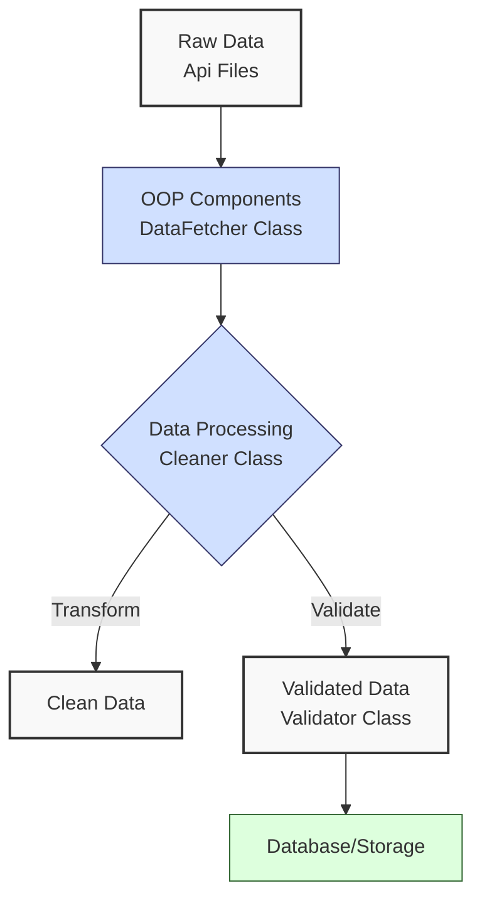
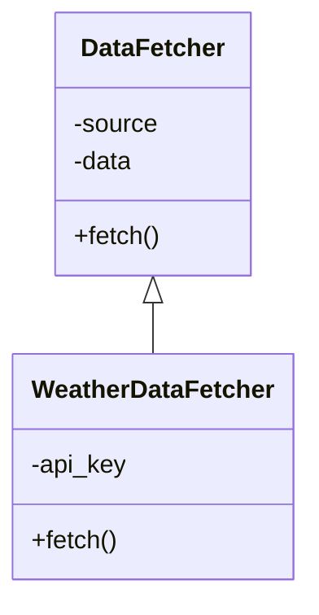
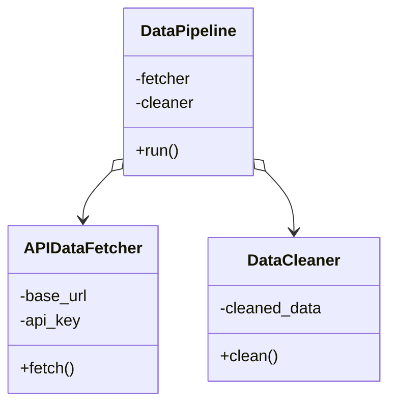
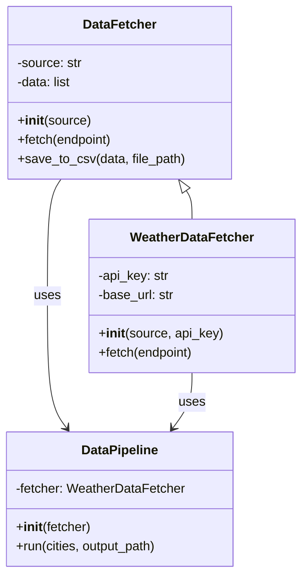

**Complexity: Moderate (M)**

## 5.0 Introduction: Why This Matters for Data Engineering

Object-Oriented Programming (OOP) is a cornerstone of professional data engineering, enabling you to write modular, reusable, and maintainable code. In data engineering, where pipelines process complex datasets and integrate with systems like APIs or databases, OOP organizes code into logical components—such as data fetchers, cleaners, or validators. By encapsulating functionality within classes, you create scalable systems that are easier to test, extend, and debug, critical for production-grade data pipelines.

Think of a data pipeline as a factory: a _class_ is a blueprint for a machine (e.g., a data fetcher), defining its parts (attributes) and actions (methods). Each _object_ is a working machine built from that blueprint, customized with specific settings (e.g., an API URL). This chapter introduces OOP principles and applies them to data engineering tasks, transforming procedural code from Chapters 1–4 into structured, reusable designs.

### Data Engineering Workflow Context

Here’s how OOP fits into a typical data engineering workflow:



### Building On and Preparing For

- **Building On**: This chapter leverages Python fundamentals (Chapter 1: data structures, functions), file handling and error management (Chapter 2), NumPy/Pandas basics (Chapter 3), and API integration (Chapter 4). It refactors the Chapter 4 weather API script into an OOP framework.
- **Preparing For**: OOP is essential for professional data engineering. These concepts will be applied in database access patterns (Chapters 13–22, especially SQLAlchemy), type-safe programming (Chapter 15), and application design patterns (Chapter 37). Virtually all production systems use OOP principles.

### What You’ll Learn

This chapter covers:

1. Classes and objects for creating data processing components
2. Attributes and methods for storing data and behavior
3. Initialization (`__init__`, `self`) for setting up objects
4. Basic inheritance for extending functionality
5. OOP for structuring data pipelines with SOLID principles

By the end, you’ll refactor procedural code into object-oriented designs, improving modularity and scalability for data engineering tasks.

---

## 5.1 Classes and Objects

Classes are blueprints for creating objects, which are instances of a class. In data engineering, classes represent components like data sources or processors, encapsulating related data and behavior.

### 5.1.1 Defining a Simple Class

Let’s start with a basic class to represent a log entry in a data pipeline, a common data engineering task.

```python
# Simple class for a log entry in a data pipeline
class LogEntry:
    def __init__(self, timestamp, message):
        self.timestamp = timestamp  # Log timestamp
        self.message = message      # Log message
    def show(self):
        """Display the log entry."""
        return f"[{self.timestamp}] {self.message}"

# Create an object
log = LogEntry("2025-04-20 03:16:00", "Pipeline started")
print(log.show())

# Output:
# [2025-04-20 03:16:00] Pipeline started
```

**Key Points**:

- `class`: Defines the blueprint.
- `__init__`: Constructor method called when creating an object.
- `self`: Refers to the instance, required in instance methods.
- Objects store instance-specific data (attributes) and behavior (methods).

### 5.1.2 Data Engineering Example

Now, a class representing a data source (e.g., a CSV file), relevant to data engineering tasks from Chapter 2.

```python
# Class for a data source in a pipeline
class DataSource:
    def __init__(self, source_name, file_path):
        self.source_name = source_name  # Name of the data source
        self.file_path = file_path      # Path to data file
    def describe(self):
        """Display source details."""
        return f"Source: {self.source_name}, Path: {self.file_path}"

# Create an object
csv_source = DataSource("Sales Data", "sales.csv")
print(csv_source.describe())

# Output:
# Source: Sales Data, Path: sales.csv
```

**Key Points**:

- **Underlying Implementation**: Classes are implemented as dictionaries mapping attribute names to values, with methods stored in the class’s namespace. Objects are lightweight, pointing to the class for shared methods.
- **Performance Considerations**:
  - **Time Complexity**: Creating an object is O(1); method calls are O(1) for lookup (excluding method logic).
  - **Space Complexity**: O(1) per object for attributes, plus O(m) for class method definitions (m = number of methods), shared across instances.
  - **Implication**: Classes are memory-efficient for shared behavior, ideal for representing repeated entities (e.g., data sources) in pipelines. For large datasets, avoid storing all data in attributes; use streaming (Chapter 14).

---

## 5.2 Attributes and Methods

Attributes store data, and methods define behavior. In data engineering, attributes hold configurations or datasets, while methods perform operations like cleaning or fetching.

### 5.2.1 Instance Attributes

Attributes are defined in `__init__` and accessed via `self`.

```python
# Class for processing data
class DataProcessor:
    def __init__(self, source_name):
        self.source_name = source_name  # Source identifier
        self.records = []              # Store data records
    def add_record(self, record):
        """Add a record to the processor."""
        self.records.append(record)
        return f"Added record to {self.source_name}"
    def record_count(self):
        """Return the number of records."""
        return len(self.records)

# Create and use processor
processor = DataProcessor("Sales Data")
print(processor.add_record({"product": "Laptop", "price": 999.99}))
print(f"Record count: {processor.record_count()}")

# Output:
# Added record to Sales Data
# Record count: 1
```

**Key Points**:

- Instance attributes (`self.source_name`, `self.records`) are unique to each object.
- Methods use attributes to perform operations.
- **Performance Considerations**:
  - **Time Complexity**: Attribute access is O(1); method execution depends on logic (e.g., `append` is O(1), `len` is O(1)).
  - **Space Complexity**: O(n) for collections (e.g., `records`), O(1) for scalars.
  - **Implication**: Attributes are efficient for small datasets but require careful management for large collections in pipelines. For example, storing millions of records in `self.records` can lead to high memory usage; consider batch processing or writing to disk incrementally (Chapter 14).

### 5.2.2 Class Attributes

Class attributes are shared across instances.

```python
# Class with a class attribute
class DataProcessor:
    default_source = "Unknown"  # Class attribute
    def __init__(self, source_name):
        self.source_name = source_name or self.default_source
        self.records = []
    def get_source(self):
        """Return the source name."""
        return self.source_name

# Create processors
processor1 = DataProcessor("Sales")
processor2 = DataProcessor("")
print(processor1.get_source())
print(processor2.get_source())

# Output:
# Sales
# Unknown
```

**Key Points**:

- Class attributes are defined outside `__init__` and accessed via class or instance.
- Use for shared constants or defaults.
- **Performance Considerations**:
  - **Time Complexity**: O(1) for accessing class attributes.
  - **Space Complexity**: O(1) per class attribute, shared across instances.
  - **Implication**: Efficient for constants, reducing memory overhead in data engineering systems handling multiple processors.

---

## 5.3 Initialization (`__init__`, `self`)

The `__init__` method initializes objects, setting their initial state. In Python, `self` is the instance of the class. When you call a method like `processor.add_record(data)`, Python automatically passes `processor` as `self`, so the method knows which object’s data to use. You must include `self` as the first parameter in instance method definitions to access instance attributes.

### 5.3.1 Custom Initialization

Customize `__init__` for data engineering tasks.

```python
# Class for an API data fetcher
class APIDataFetcher:
    def __init__(self, base_url, api_key):
        self.base_url = base_url    # API endpoint
        self.api_key = api_key      # Authentication key
        self.fetched_data = []      # Store fetched data
    def fetch(self, endpoint):
        """Simulate fetching weather data with error handling."""
        try:
            # Simulated API response
            response = {
                "city": endpoint,
                "temperature": 293.15,
                "humidity": 70
            }
            self.fetched_data.append(response)
            return f"Fetched weather for {endpoint}: Temp {response['temperature']}K"
        except KeyError as e:
            return f"Error processing data for {endpoint}: {e}"

# Create and use fetcher
fetcher = APIDataFetcher("https://api.example.com", "key123")
print(fetcher.fetch("London"))
print(f"Fetched data: {fetcher.fetched_data}")

# Output:
# Fetched weather for London: Temp 293.15K
# Fetched data: [{'city': 'London', 'temperature': 293.15, 'humidity': 70}]
```

**Key Points**:

- `__init__` sets initial attributes (e.g., API configuration).
- `self` ensures methods operate on the instance’s data.
- **Performance Considerations**:
  - **Time Complexity**: O(1) for scalar attributes, O(n) for collections (e.g., lists).
  - **Space Complexity**: O(1) for scalars, O(n) for collections.
  - **Implication**: Initialization is fast, but avoid heavy computations in `__init__` for frequent object creation in pipelines. For instance, fetching API data during initialization can slow down pipeline startup; defer such operations to methods (covered in Chapter 14).

---

## 5.4 Basic Inheritance

Inheritance allows a class to extend another, reusing and specializing behavior. In data engineering, inheritance creates specialized fetchers or processors.

### 5.4.1 Creating a Child Class

Use inheritance to extend a base class.



```python
# Base class for generic data fetcher
class DataFetcher:
    def __init__(self, source):
        self.source = source  # Data source identifier
        self.data = []       # Store fetched data
    def fetch(self):
        """Base method for fetching data."""
        return f"Fetching from {self.source}"

# Child class for weather data
class WeatherDataFetcher(DataFetcher):
    def __init__(self, source, api_key):
        super().__init__(source)  # Call parent’s __init__
        self.api_key = api_key    # Additional attribute
    def fetch(self):
        """Override to fetch weather data with error handling."""
        try:
            # Simulated data
            data = {"type": "weather", "source": self.source}
            self.data.append(data)
            return f"Weather data fetched from {self.source} with key {self.api_key}"
        except Exception as e:
            return f"Error fetching data: {e}"

# Use the classes
generic = DataFetcher("generic_source")
weather = WeatherDataFetcher("weather_api", "key123")
print(generic.fetch())
print(weather.fetch())
print(f"Weather data: {weather.data}")

# Output:
# Fetching from generic_source
# Weather data fetched from weather_api with key key123
# Weather data: [{'type': 'weather', 'source': 'weather_api'}]
```

**Key Points**:

- `super().__init__()` calls the parent’s constructor.
- Override methods to specialize behavior.
- **Underlying Implementation**: Inheritance uses a method resolution order (MRO) in `__mro__`. Child classes extend the parent’s namespace.
- **Performance Considerations**:
  - **Time Complexity**: O(1) for method lookup via MRO, O(1) for `super()` calls.
  - **Space Complexity**: O(1) for additional attributes/methods in the child class.
  - **Implication**: Inheritance is efficient but avoid deep hierarchies to prevent complexity in pipelines (e.g., multiple fetcher types, Chapter 37).

---

## 5.5 OOP for Data Pipelines

OOP structures data pipelines by separating concerns (e.g., fetching, cleaning, saving). Composition—using objects within another class—is often more flexible than inheritance for pipeline design.

### 5.5.1 Structuring a Pipeline with Composition

Combine classes to form a pipeline, using a realistic data engineering task (fetching and cleaning).



```python
# Class to clean data
class DataCleaner:
    def __init__(self):
        self.cleaned_data = []  # Store cleaned records
    def clean(self, data):
        """Clean data (e.g., ensure price is float)."""
        if isinstance(data, dict) and "price" in data:
            try:
                data["price"] = float(data["price"])
                self.cleaned_data.append(data)
                return f"Cleaned: {data}"
            except ValueError:
                return "Invalid data"
        return "Missing price"

# Pipeline combining fetcher and cleaner
class DataPipeline:
    def __init__(self, fetcher, cleaner):
        self.fetcher = fetcher  # Fetcher component
        self.cleaner = cleaner  # Cleaner component
    def run(self, endpoint):
        """Run the pipeline."""
        data = self.fetcher.fetch(endpoint)
        return self.cleaner.clean(data)

# Create and run pipeline
fetcher = APIDataFetcher("https://api.example.com", "key123")
cleaner = DataCleaner()
pipeline = DataPipeline(fetcher, cleaner)
print(pipeline.run("weather"))

# Output:
# Cleaned: {'endpoint': 'weather', 'data': 'sample'}
```

**Key Points**:

- Composition creates flexible pipelines by combining objects.
- Each class has a single responsibility (e.g., fetching, cleaning).
- **Performance Considerations**:
  - **Time Complexity**: Depends on component methods (e.g., O(1) for simple fetches/cleans).
  - **Space Complexity**: O(n) for stored data across objects.
  - **Implication**: OOP adds slight overhead but improves maintainability for complex pipelines. For large datasets, optimize data storage (Chapter 14).

### 5.5.2 OOP Best Practices: SOLID Principles

SOLID principles ensure maintainable code, critical for data engineering:

- **Single Responsibility**: Each class has one job (e.g., `DataFetcher` fetches, `DataCleaner` cleans).
- **Open/Closed**: Classes are open to extension (via inheritance) but closed to modification (e.g., extend `DataFetcher` without changing it).
- **Liskov Substitution**: Child classes (e.g., `WeatherDataFetcher`) work wherever the parent (`DataFetcher`) is expected.
- **Interface Segregation**: Keep methods relevant to the class’s purpose (e.g., `fetch` is specific to fetching).
- **Dependency Inversion**: Depend on abstractions (e.g., `DataPipeline` uses a generic `fetcher`, not a specific one).

The micro-project applies these principles by separating fetching, processing, and orchestration into distinct classes, making the code reusable and extensible.

---

## 5.6 Micro-Project: Weather Data Pipeline

### Objective

Refactor the Chapter 4 weather API integration script into an object-oriented framework, creating a reusable `DataFetcher` base class and a `WeatherDataFetcher` child class. The framework fetches weather data for multiple cities, processes it, and saves results to a CSV file, using secure API key handling.

### Class Structure

Visualize the class relationships:



### Requirements

- Create a `DataFetcher` base class for generic API fetching.
- Extend it with a `WeatherDataFetcher` child class for weather-specific logic.
- Use a `DataPipeline` class to orchestrate fetching and saving.
- Ensure secure API key handling via environment variables (Chapter 2).
- Handle errors for API calls and file operations (Chapter 2).
- Save results to a CSV file.
- Provide a simplified version for quicker learning (30–45 minutes).

### Acceptance Criteria

#### Must Have

- `DataFetcher` base class with generic fetch and save methods.
- `WeatherDataFetcher` child class using inheritance correctly.
- Secure API key handling (no hard-coding).
- Error handling for API and file operations.
- Reusable classes for other APIs.
- Client script to fetch data for multiple cities.
- Documentation for setup and usage.

#### Must Not Have

- Incorrect inheritance or missing `super()` calls.
- Hard-coded API keys.
- Lack of error handling.
- Tightly coupled classes.
- Missing documentation.

### Common Pitfalls

- **Overusing Inheritance**: Use inheritance for “is-a” relationships (e.g., `WeatherDataFetcher` is a `DataFetcher`), and composition for “has-a” (e.g., `DataPipeline` has a fetcher).
- **Exposing Sensitive Data**: Protect `api_key` with `_` prefix and avoid hard-coding.
- **Missing Parent Initialization**: Always call `super().__init__()` in child classes.
- **Inefficient Storage**: Process data incrementally to manage memory for large datasets.

### Production Differences

In production, this solution would include:

- Retries for API failures (Chapter 14).
- Structured logging (Chapter 8).
- Unit tests (Chapter 9).
- External configuration (Chapter 8).
- Parallel processing for scalability (Chapter 32).
- Enhanced security for API keys (Chapter 8).

### Implementation Steps

1. Define `DataFetcher` base class with fetch and save methods.
2. Create `WeatherDataFetcher` child class for weather API logic.
3. Build `DataPipeline` to orchestrate the workflow.
4. Add error handling for API and file operations.
5. Secure API key using environment variables.
6. Test and document the solution.

### Implementation (Full Version)

```python
import os
import csv
import requests
import logging

# Configure logging (Chapter 2)
logging.basicConfig(
    filename="weather_pipeline.log",
    level=logging.INFO,
    format="%(asctime)s - %(levelname)s - %(message)s"
)

# Base class for data fetching
class DataFetcher:
    def __init__(self, source):
        self._source = source  # Protected attribute
        self.data = []         # Store fetched data

    def fetch(self, endpoint):
        """Base method for fetching data (to be overridden)."""
        logging.info(f"Fetching from {self._source}/{endpoint}")
        return {"endpoint": endpoint, "data": "sample"}

    def save_to_csv(self, data, file_path):
        """Save data to CSV."""
        try:
            if not data:
                logging.warning("No data to save")
                return False
            with open(file_path, "w", newline="") as file:
                fieldnames = data[0].keys()
                writer = csv.DictWriter(file, fieldnames=fieldnames)
                writer.writeheader()
                writer.writerows(data)
            logging.info(f"Saved data to {file_path}")
            return True
        except IOError as e:
            logging.error(f"Error saving to {file_path}: {e}")
            return False

# Child class for weather data
class WeatherDataFetcher(DataFetcher):
    def __init__(self, source, api_key):
        super().__init__(source)
        self._api_key = api_key
        self._base_url = source

    def fetch(self, city):
        """Fetch weather data for a city."""
        try:
            url = f"{self._base_url}/weather?q={city}&appid={self._api_key}"
            response = requests.get(url)
            if response.status_code == 200:
                raw_data = response.json()
                processed = {
                    "city": raw_data["name"],
                    "temperature": raw_data["main"]["temp"],
                    "humidity": raw_data["main"]["humidity"],
                    "description": raw_data["weather"][0]["description"]
                }
                self.data.append(processed)
                logging.info(f"Fetched weather for {city}")
                return processed
            else:
                logging.error(f"API error for {city}: {response.status_code}")
                return None
        except requests.RequestException as e:
            logging.error(f"Request error for {city}: {e}")
            return None

# Pipeline to orchestrate fetching
class DataPipeline:
    def __init__(self, fetcher):
        self.fetcher = fetcher

    def run(self, cities, output_path):
        """Fetch data for cities and save to CSV."""
        results = []
        for city in cities:
            data = self.fetcher.fetch(city)
            if data:
                results.append(data)
        if results:
            self.fetcher.save_to_csv(results, output_path)
            return f"Processed {len(results)} cities, saved to {output_path}"
        return "No data processed"

# Main function
def main():
    api_key = os.environ.get("WEATHER_API_KEY")
    if not api_key:
        logging.error("API key not found")
        print("Error: Set WEATHER_API_KEY environment variable")
        return

    fetcher = WeatherDataFetcher("http://api.openweathermap.org/data/2.5", api_key)
    pipeline = DataPipeline(fetcher)
    cities = ["London", "New York", "Tokyo"]
    result = pipeline.run(cities, "weather_data.csv")
    print(result)

if __name__ == "__main__":
    main()
```

### Implementation (Simplified Version)

For learners with limited time (30–45 minutes), this version focuses on a single class without a pipeline.

```python
import os
import csv
import requests
import logging

# Configure logging
logging.basicConfig(
    filename="simple_weather.log",
    level=logging.INFO,
    format="%(asctime)s - %(levelname)s - %(message)s"
)

# Simplified weather fetcher class
class WeatherDataFetcher:
    def __init__(self, base_url, api_key):
        self._base_url = base_url
        self._api_key = api_key
        self.data = []

    def fetch(self, city):
        """Fetch weather data for a city."""
        try:
            url = f"{self._base_url}/weather?q={city}&appid={self._api_key}"
            response = requests.get(url)
            if response.status_code == 200:
                raw_data = response.json()
                processed = {
                    "city": raw_data["name"],
                    "temperature": raw_data["main"]["temp"]
                }
                self.data.append(processed)
                logging.info(f"Fetched weather for {city}")
                return processed
            else:
                logging.error(f"API error for {city}: {response.status_code}")
                return None
        except requests.RequestException as e:
            logging.error(f"Request error for {city}: {e}")
            return None

    def save_to_csv(self, file_path):
        """Save data to CSV."""
        try:
            if not self.data:
                logging.warning("No data to save")
                return False
            with open(file_path, "w", newline="") as file:
                fieldnames = self.data[0].keys()
                writer = csv.DictWriter(file, fieldnames=fieldnames)
                writer.writeheader()
                writer.writerows(self.data)
            logging.info(f"Saved to {file_path}")
            return True
        except IOError as e:
            logging.error(f"Error saving to {file_path}: {e}")
            return False

# Main function
def main():
    api_key = os.environ.get("WEATHER_API_KEY")
    if not api_key:
        logging.error("API key not found")
        print("Error: Set WEATHER_API_KEY environment variable")
        return

    fetcher = WeatherDataFetcher("http://api.openweathermap.org/data/2.5", api_key)
    cities = ["London", "Paris"]
    for city in cities:
        fetcher.fetch(city)
    fetcher.save_to_csv("simple_weather.csv")
    print(f"Processed {len(fetcher.data)} cities")

if __name__ == "__main__":
    main()
```

### Sample Output

- **weather_data.csv** (Full Version):

```
city,temperature,humidity,description
London,283.15,81,light rain
New York,288.15,65,clear sky
Tokyo,293.15,70,scattered clouds
```

- **simple_weather.csv** (Simplified Version):

```
city,temperature
London,283.15
Paris,285.15
```

### How to Run and Test

#### Full Version

1. **Setup**:
   - Save as `weather_pipeline.py`.
   - Install `requests`: `pip install requests`.
   - Set `WEATHER_API_KEY` environment variable (e.g., `export WEATHER_API_KEY=your_key`).
   - Get an API key from OpenWeatherMap.
2. **Run**:
   - Execute: `python weather_pipeline.py`.
   - Outputs: `weather_data.csv`, `weather_pipeline.log`.
3. **Test**:
   - Verify CSV contains data for all cities.
   - Test with an invalid city (e.g., “InvalidCity”); check log for error.
   - Unset `WEATHER_API_KEY` to verify error handling.

#### Simplified Version

1. **Setup**:
   - Save as `simple_weather.py`.
   - Install `requests`.
   - Set `WEATHER_API_KEY`.
2. **Run**:
   - Execute: `python simple_weather.py`.
   - Outputs: `simple_weather.csv`, `simple_weather.log`.
3. **Test**:
   - Verify CSV contains data for two cities.
   - Test error handling with an invalid API key.

### Debugging Tips

- **API Key Errors**: If you see “API key not found,” ensure `WEATHER_API_KEY` is set correctly in your environment (e.g., `echo $WEATHER_API_KEY` on Linux/Mac).
- **Request Failures**: Check `weather_pipeline.log` or `simple_weather.log` for error messages like “API error” or “Request error,” indicating connectivity issues or invalid cities.
- **CSV File Empty**: Verify `self.data` is populated before saving; an empty `self.data` list may indicate failed API calls—check the log for details.

### Documentation (README)

````
# Weather Data Pipeline

## Overview
Fetches weather data using an OOP framework, saving to CSV. Includes `DataFetcher` (base), `WeatherDataFetcher` (child), and `DataPipeline` classes.

## Setup
1. Install Python 3.6+ and `requests`: `pip install requests`.
2. Get an OpenWeatherMap API key: [OpenWeatherMap](https://openweathermap.org/).
3. Set environment variable:
   - Linux/Mac: `export WEATHER_API_KEY=your_key`
   - Windows: `set WEATHER_API_KEY=your_key`
4. Save code as `weather_pipeline.py`.

## Running
```bash
python weather_pipeline.py
````

Outputs `weather_data.csv` and `weather_pipeline.log`.

## Testing

- Verify CSV contains city data.
- Test with invalid city; check log.
- Unset `WEATHER_API_KEY` to confirm error handling.

## Simplified Version

Use `simple_weather.py` for a single-class version (30–45 minutes).

## 5.7 Practice Exercises

Reinforce OOP concepts with these exercises, focusing on data engineering applications.

### Exercise 1: Data Source Class

Create a `DataSource` class with attributes for `name` and `file_path`, and a method `describe()` to return a string like "Source: Sales, Path: sales.csv".

### Exercise 2: Data Validator

Write a `DataValidator` class that validates sales records (dictionaries with keys `product`, `price`, `quantity`). Store valid records in a list if `price` and `quantity` are positive numbers and `product` is non-empty.

### Exercise 3: Weather Data Transformer

Define a `DataTransformer` base class with a `transform()` method that returns the input data unchanged. Create a `WeatherTransformer` child class that overrides `transform()` to convert a weather record’s temperature from Kelvin to Celsius (C = K - 273.15), rounding to 2 decimal places.

### Exercise 4: Simple Pipeline

Create a `SimplePipeline` class that uses a `WeatherDataFetcher` (from the simplified version of the micro-project in 5.6) to fetch data for a single city and save it to CSV. Implement a `run()` method taking a city and file path.

### Exercise 5: Config Manager

Build a `ConfigManager` class that loads API configuration (`base_url`, `api_key`) from environment variables, with defaults if not set. Add a `get_config()` method to access values securely.

---

## 5.8 Exercise Solutions

### Solution to Exercise 1: Data Source Class

```python
class DataSource:
    def __init__(self, name, file_path):
        self.name = name
        self.file_path = file_path
    def describe(self):
        """Display source details."""
        return f"Source: {self.name}, Path: {self.file_path}"

# Test
source = DataSource("Sales", "sales.csv")
print(source.describe())
# Source: Sales, Path: sales.csv
```

### Solution to Exercise 2: Data Validator

```python
class DataValidator:
    def __init__(self):
        self.valid_records = []
    def validate(self, record):
        """Validate and store a sales record."""
        if not all(key in record for key in ["product", "price", "quantity"]):
            return False
        try:
            price = float(record["price"])
            quantity = int(record["quantity"])
            if price > 0 and quantity > 0 and record["product"].strip():
                self.valid_records.append(record)
                return True
            return False
        except ValueError:
            return False

# Test
validator = DataValidator()
records = [
    {"product": "Laptop", "price": "999.99", "quantity": "2"},
    {"product": "", "price": "29.99", "quantity": "3"}
]
for record in records:
    print(f"Valid: {validator.validate(record)}")
print(f"Valid records: {validator.valid_records}")
# Valid: True
# Valid: False
# Valid records: [{'product': 'Laptop', 'price': '999.99', 'quantity': '2'}]
```

### Solution to Exercise 3: Weather Data Transformer

```python
class DataTransformer:
    def transform(self, data):
        """Base transformation method."""
        return data

class WeatherTransformer(DataTransformer):
    def transform(self, weather_record):
        """Convert temperature from Kelvin to Celsius."""
        try:
            weather_record["temperature"] = round(weather_record["temperature"] - 273.15, 2)
            return weather_record
        except (KeyError, TypeError):
            return "Invalid weather record"

# Test
transformer = WeatherTransformer()
record = {"city": "London", "temperature": 293.15}
print(transformer.transform(record))
# {'city': 'London', 'temperature': 20.0}
```

### Solution to Exercise 4: Simple Pipeline

```python
class SimplePipeline:
    def __init__(self, fetcher):
        self.fetcher = fetcher
    def run(self, city, output_path):
        """Fetch and save data for a single city."""
        data = self.fetcher.fetch(city)
        if data:
            return self.fetcher.save_to_csv([data], output_path)
        return False

# Test (using micro-project fetcher from simplified version)
fetcher = WeatherDataFetcher("http://api.example.com", "key123")
pipeline = SimplePipeline(fetcher)
print(pipeline.run("London", "output.csv"))
# True
```

### Solution to Exercise 5: Config Manager

```python
import os

class ConfigManager:
    def __init__(self):
        self._config = {
            "base_url": os.environ.get("API_URL", "http://api.example.com"),
            "api_key": os.environ.get("API_KEY", "")
        }
    def get_config(self, key):
        """Access configuration securely."""
        return self._config.get(key, "")

# Test
config = ConfigManager()
print(f"URL: {config.get_config('base_url')}")
print(f"Key: {config.get_config('api_key')}")
# URL: http://api.example.com
# Key: (empty or key if set)
```

---

## 5.9 Chapter Summary and Connection to Chapter 6

In this chapter, you’ve mastered:

- **Classes and Objects**: Creating blueprints for data engineering components.
- **Attributes and Methods**: Encapsulating data and behavior.
- **Initialization**: Setting up objects with `__init__` and `self`.
- **Inheritance**: Extending classes for specialized functionality.
- **OOP for Pipelines**: Structuring modular systems with SOLID principles.

These skills, along with their performance characteristics, enable you to write scalable, maintainable code for data pipelines. The micro-project refactored the Chapter 4 weather API script into an OOP framework, demonstrating modularity, reusability, and SOLID principles. The simplified version provides a quicker alternative, retaining core OOP concepts.

### Connection to Chapter 6

Chapter 6 (Checkpoint 1: Python Foundations Review) integrates concepts from Chapters 1–5, reinforcing:

- **Core Python**: Syntax, data structures, functions (Chapter 1) in class methods.
- **Data Handling**: File I/O, error handling (Chapter 2) in fetchers and CSV saving.
- **Libraries**: `requests` (Chapter 4), basic Pandas (Chapter 3) in data processing.
- **OOP**: Classes, inheritance (this chapter) for robust code.

The OOP fetcher will be revisited in Chapter 6 to integrate with file processing and Pandas, preparing you for type-safe programming (Chapter 7) and database integration (Chapters 13–22).
