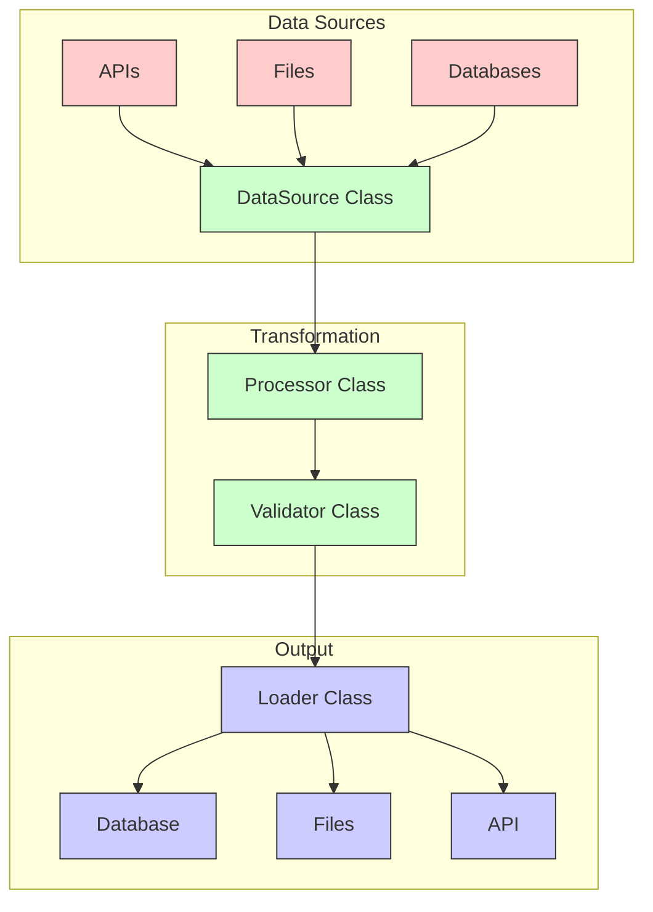

**Complexity: Moderate (M)**

## 5.0 Introduction: Why OOP Matters for Data Engineering

In previous chapters, we've written Python code to process data using functions and scripts. While this approach works for small tasks, professional data engineering requires more structure as projects grow in complexity. This is where Object-Oriented Programming (OOP) becomes essential.

Object-Oriented Programming allows us to organize code into reusable components that combine data (attributes) and functionality (methods). For data engineering, this means we can create modular, maintainable pipelines that are easier to extend and debug.

Let's visualize how OOP fits into a typical data engineering workflow:



In this chapter, we'll learn how to:

1. Create classes that represent data components
2. Design attributes and methods for data operations
3. Initialize objects with the right properties
4. Use inheritance to extend functionality
5. Apply OOP patterns to data processing pipelines

By the end of this chapter, you'll understand how to structure your data engineering code in a way that professional teams use in production environments.

## 5.1 Classes and Objects: Building Blocks for Data Components

At its core, object-oriented programming revolves around the concept of objects, which are instances of classes. A class serves as a blueprint that defines both data (attributes) and behavior (methods).

### 5.1.1 Defining Your First Class

Let's start by creating a simple class to represent a data record:

```python
# Define a simple class to represent a data record
class DataRecord:
    """A class representing a data record."""
    pass  # Empty class for now

# Create an instance of the class
record = DataRecord()
print(type(record))
# <class '__main__.DataRecord'>

# We can add attributes to the instance
record.id = 1001
record.name = "Temperature Sensor"
record.value = 23.5

print(f"Record ID: {record.id}")
print(f"Record Name: {record.name}")
print(f"Record Value: {record.value}")
# Record ID: 1001
# Record Name: Temperature Sensor
# Record Value: 23.5
```

While we can add attributes to an object after creating it, as shown above, this approach isn't ideal for data engineering. Let's define a more structured class.

### 5.1.2 Adding Attributes and Methods

Now, let's enhance our class with attributes (data) and methods (functions):

```python
class DataRecord:
    """A class representing a data record with attributes and methods."""

    # Class attribute (shared by all instances)
    record_type = "Sensor"

    # Instance method to initialize with attributes
    def __init__(self, id, name, value):
        # Instance attributes (unique to each instance)
        self.id = id
        self.name = name
        self.value = value
        self.timestamp = None  # Default value

    # Instance method to format the record as a string
    def to_string(self):
        return f"Record {self.id}: {self.name} = {self.value}"

    # Instance method to update the value
    def update_value(self, new_value):
        self.value = new_value
        print(f"Updated record {self.id} with value {self.value}")

# Create an instance using the initializer
record = DataRecord(1001, "Temperature Sensor", 23.5)

# Access attributes
print(f"Record ID: {record.id}")
print(f"Record Name: {record.name}")
print(f"Record Value: {record.value}")
print(f"Record Type: {record.record_type}")  # Class attribute
# Record ID: 1001
# Record Name: Temperature Sensor
# Record Value: 23.5
# Record Type: Sensor

# Call methods
print(record.to_string())
# Record 1001: Temperature Sensor = 23.5

record.update_value(24.2)
# Updated record 1001 with value 24.2

print(record.to_string())
# Record 1001: Temperature Sensor = 24.2
```

Let's break down the key components:

1. `__init__`: A special method (constructor) that initializes a new object with the given parameters
2. `self`: A reference to the current instance (always the first parameter of instance methods)
3. Instance attributes: Variables that belong to a specific instance (prefixed with `self.`)
4. Class attributes: Variables shared by all instances of a class (defined at the class level)
5. Instance methods: Functions that operate on instance data (always take `self` as first argument)

### 5.1.3 Creating Multiple Instances

One advantage of classes is the ability to create multiple instances, each with its own data:

```python
# Create multiple instances
temp_sensor = DataRecord(1001, "Temperature Sensor", 23.5)
humidity_sensor = DataRecord(1002, "Humidity Sensor", 45.2)
pressure_sensor = DataRecord(1003, "Pressure Sensor", 1013.2)

# List of sensor records
sensors = [temp_sensor, humidity_sensor, pressure_sensor]

# Process each sensor
print("Sensor readings:")
for sensor in sensors:
    print(sensor.to_string())
# Sensor readings:
# Record 1001: Temperature Sensor = 23.5
# Record 1002: Humidity Sensor = 45.2
# Record 1003: Pressure Sensor = 1013.2

# Update specific sensors
humidity_sensor.update_value(47.0)
# Updated record 1002 with value 47.0

# Print again to see the change
print("\nUpdated sensor readings:")
for sensor in sensors:
    print(sensor.to_string())
# Updated sensor readings:
# Record 1001: Temperature Sensor = 23.5
# Record 1002: Humidity Sensor = 47.0
# Record 1003: Pressure Sensor = 1013.2
```

## 5.2 Class Design for Data Engineering

Now that we understand the basics of classes, let's apply these concepts to data engineering tasks. We'll create a more sophisticated class for processing sensor data.

### 5.2.1 Creating a Data Processor Class

```python
class SensorDataProcessor:
    """A class for processing and validating sensor data."""

    def __init__(self, min_value, max_value):
        """Initialize with validation parameters."""
        self.min_value = min_value
        self.max_value = max_value
        self.processed_records = 0
        self.invalid_records = 0
        self.valid_records = []

    def process_record(self, record):
        """Process a single sensor record."""
        self.processed_records += 1

        # Validate the record
        if self.is_valid(record):
            # Only add valid records to our list
            self.valid_records.append(record)
            print(f"Processed valid record: {record.to_string()}")
            return True
        else:
            self.invalid_records += 1
            print(f"Invalid record detected: {record.to_string()}")
            return False

    def is_valid(self, record):
        """Check if a record's value is within acceptable range."""
        return self.min_value <= record.value <= self.max_value

    def process_batch(self, records):
        """Process a batch of records."""
        print(f"Processing batch of {len(records)} records...")

        for record in records:
            self.process_record(record)

        print(f"Batch processing complete. Processed: {self.processed_records}, "
              f"Valid: {len(self.valid_records)}, Invalid: {self.invalid_records}")

    def get_valid_records(self):
        """Return the list of valid records."""
        return self.valid_records

    def get_statistics(self):
        """Return processing statistics."""
        return {
            "processed": self.processed_records,
            "valid": len(self.valid_records),
            "invalid": self.invalid_records
        }

# Create sample sensor records
records = [
    DataRecord(1001, "Temperature", 23.5),
    DataRecord(1002, "Temperature", -10.2),  # Too cold
    DataRecord(1003, "Temperature", 18.7),
    DataRecord(1004, "Temperature", 45.0),   # Too hot
    DataRecord(1005, "Temperature", 22.3)
]

# Create a processor with valid range between 0 and 40 degrees
processor = SensorDataProcessor(0, 40)

# Process the batch of records
processor.process_batch(records)
# Processing batch of 5 records...
# Processed valid record: Record 1001: Temperature = 23.5
# Invalid record detected: Record 1002: Temperature = -10.2
# Processed valid record: Record 1003: Temperature = 18.7
# Invalid record detected: Record 1004: Temperature = 45.0
# Processed valid record: Record 1005: Temperature = 22.3
# Batch processing complete. Processed: 5, Valid: 3, Invalid: 2

# Get valid records
valid_records = processor.get_valid_records()
print(f"\nValid records count: {len(valid_records)}")
# Valid records count: 3

# Get processing statistics
stats = processor.get_statistics()
print("\nProcessing statistics:")
for key, value in stats.items():
    print(f"  {key.capitalize()}: {value}")
# Processing statistics:
#   Processed: 5
#   Valid: 3
#   Invalid: 2
```

This `SensorDataProcessor` class demonstrates several key OOP principles for data engineering:

1. **Encapsulation**: The class combines related data (attributes) and functionality (methods)
2. **State management**: It keeps track of processing statistics internally
3. **Validation logic**: It enforces data quality rules
4. **Batch processing**: It handles both individual records and batches

### 5.2.2 Adding More Functionality with Methods

Let's extend our processor to include data transformation capabilities:

```python
class EnhancedSensorProcessor(SensorDataProcessor):
    """An enhanced processor with data transformation capabilities."""

    def __init__(self, min_value, max_value, unit="C"):
        """Initialize with validation parameters and unit."""
        # Call the parent class initializer
        super().__init__(min_value, max_value)
        self.unit = unit
        self.transformations = 0

    def convert_to_fahrenheit(self, record):
        """Convert a Celsius temperature to Fahrenheit."""
        if self.unit == "C":
            converted_value = (record.value * 9/5) + 32
            print(f"Converting {record.value}°C to {converted_value:.1f}°F")
            record.value = converted_value
            record.name = f"{record.name} (F)"
            self.unit = "F"
            self.transformations += 1
        return record

    def convert_to_celsius(self, record):
        """Convert a Fahrenheit temperature to Celsius."""
        if self.unit == "F":
            converted_value = (record.value - 32) * 5/9
            print(f"Converting {record.value}°F to {converted_value:.1f}°C")
            record.value = converted_value
            record.name = f"{record.name} (C)"
            self.unit = "C"
            self.transformations += 1
        return record

    def get_statistics(self):
        """Return processing statistics, including transformations."""
        # Get basic statistics from parent class
        stats = super().get_statistics()
        # Add transformations count
        stats["transformations"] = self.transformations
        return stats

# Create sample records
temp_c = DataRecord(2001, "Temperature", 25.0)
temp_f = DataRecord(2002, "Temperature", 98.6)

# Create enhanced processors
celsius_processor = EnhancedSensorProcessor(0, 50, "C")
fahrenheit_processor = EnhancedSensorProcessor(32, 110, "F")

# Convert Celsius to Fahrenheit
converted = celsius_processor.convert_to_fahrenheit(temp_c)
print(f"Converted record: {converted.to_string()}")
# Converting 25.0°C to 77.0°F
# Converted record: Record 2001: Temperature (F) = 77.0

# Convert Fahrenheit to Celsius
converted = fahrenheit_processor.convert_to_celsius(temp_f)
print(f"Converted record: {converted.to_string()}")
# Converting 98.6°F to 37.0°C
# Converted record: Record 2002: Temperature (C) = 37.0

# Get enhanced statistics
stats = celsius_processor.get_statistics()
print("\nEnhanced processor statistics:")
for key, value in stats.items():
    print(f"  {key.capitalize()}: {value}")
# Enhanced processor statistics:
#   Processed: 0
#   Valid: 0
#   Invalid: 0
#   Transformations: 1
```

## 5.3 Inheritance: Extending Class Functionality

Inheritance is a key OOP concept that allows us to create new classes based on existing ones. This is particularly useful in data engineering for:

1. Creating specialized data processors for different data types
2. Extending functionality without modifying existing code
3. Building hierarchies of related components

### 5.3.1 Basic Inheritance

We've already seen inheritance in action with the `EnhancedSensorProcessor`. Let's explore inheritance more explicitly:

```python
# Base class for all data sources
class DataSource:
    """Base class for data sources."""

    def __init__(self, name):
        self.name = name
        self.connected = False

    def connect(self):
        """Connect to the data source."""
        print(f"Connecting to data source: {self.name}")
        self.connected = True
        return self.connected

    def disconnect(self):
        """Disconnect from the data source."""
        print(f"Disconnecting from data source: {self.name}")
        self.connected = False

    def fetch_data(self):
        """Fetch data from the source (to be implemented by subclasses)."""
        raise NotImplementedError("Subclasses must implement fetch_data method")

    def is_connected(self):
        """Check connection status."""
        return self.connected

# Derived class for file-based data sources
class FileDataSource(DataSource):
    """A class for file-based data sources."""

    def __init__(self, name, file_path):
        # Call the parent class initializer
        super().__init__(name)
        self.file_path = file_path

    def fetch_data(self):
        """Implement the fetch_data method for file sources."""
        if not self.connected:
            print(f"Error: Not connected to {self.name}")
            return None

        try:
            print(f"Reading data from file: {self.file_path}")
            # In a real implementation, we would read from the file
            # For this example, we'll simulate it
            data = [
                {"id": 1, "value": 10.5},
                {"id": 2, "value": 20.3},
                {"id": 3, "value": 15.7}
            ]
            return data
        except Exception as e:
            print(f"Error reading file: {e}")
            return None

# Derived class for API-based data sources
class APIDataSource(DataSource):
    """A class for API-based data sources."""

    def __init__(self, name, url, api_key=None):
        # Call the parent class initializer
        super().__init__(name)
        self.url = url
        self.api_key = api_key

    def connect(self):
        """Override connect to handle API authentication."""
        print(f"Connecting to API: {self.name} at {self.url}")
        if self.api_key:
            print("Using API key for authentication")
        self.connected = True
        return self.connected

    def fetch_data(self):
        """Implement the fetch_data method for API sources."""
        if not self.connected:
            print(f"Error: Not connected to {self.name}")
            return None

        try:
            print(f"Fetching data from API: {self.url}")
            # In a real implementation, we would make an HTTP request
            # For this example, we'll simulate it
            data = [
                {"id": 101, "temperature": 22.5, "humidity": 45.0},
                {"id": 102, "temperature": 23.1, "humidity": 44.2},
            ]
            return data
        except Exception as e:
            print(f"Error calling API: {e}")
            return None

# Create and use different data sources
file_source = FileDataSource("Sensor Log", "sensors.csv")
api_source = APIDataSource("Weather API", "https://api.weather.com/data", api_key="abc123")

# Use the file source
file_source.connect()
file_data = file_source.fetch_data()
print(f"File data: {file_data}")
file_source.disconnect()
# Connecting to data source: Sensor Log
# Reading data from file: sensors.csv
# File data: [{'id': 1, 'value': 10.5}, {'id': 2, 'value': 20.3}, {'id': 3, 'value': 15.7}]
# Disconnecting from data source: Sensor Log

# Use the API source
api_source.connect()
api_data = api_source.fetch_data()
print(f"API data: {api_data}")
api_source.disconnect()
# Connecting to API: Weather API at https://api.weather.com/data
# Using API key for authentication
# Fetching data from API: https://api.weather.com/data
# API data: [{'id': 101, 'temperature': 22.5, 'humidity': 45.0}, {'id': 102, 'temperature': 23.1, 'humidity': 44.2}]
# Disconnecting from data source: Weather API
```

In this example:

1. `DataSource` is the base class with common functionality for all data sources
2. `FileDataSource` and `APIDataSource` inherit from and extend `DataSource`
3. Each subclass:
   - Calls the parent's initializer with `super().__init__()`
   - Implements the required `fetch_data()` method differently
   - May override other methods as needed (like `connect()` in `APIDataSource`)

### 5.3.2 Method Overriding and Extension

As seen in the previous example, inheritance allows us to:

1. **Override methods**: Completely replace parent class behavior
2. **Extend methods**: Call the parent method and add additional functionality

Here's another example that focuses on data transformation:

```python
# Base transformer class
class DataTransformer:
    """Base class for data transformations."""

    def __init__(self, name):
        self.name = name
        self.transformation_count = 0

    def transform(self, data):
        """Transform the data (to be implemented by subclasses)."""
        self.transformation_count += 1
        print(f"Transformation {self.name} applied ({self.transformation_count} times)")
        return data  # Base implementation does nothing

    def get_stats(self):
        """Get transformation statistics."""
        return {
            "name": self.name,
            "count": self.transformation_count
        }

# Numeric scaling transformer
class ScalingTransformer(DataTransformer):
    """Scale numeric values by a factor."""

    def __init__(self, name, factor):
        super().__init__(name)
        self.factor = factor

    def transform(self, data):
        """Scale numeric values in the data."""
        # First call the parent method to log and count
        super().transform(data)

        # Then perform the specific transformation
        print(f"Scaling values by factor {self.factor}")

        if isinstance(data, list):
            for item in data:
                if isinstance(item, dict):
                    for key, value in item.items():
                        if isinstance(value, (int, float)):
                            item[key] = value * self.factor

        return data

# Filtering transformer
class FilteringTransformer(DataTransformer):
    """Filter data based on a condition."""

    def __init__(self, name, field, min_value=None, max_value=None):
        super().__init__(name)
        self.field = field
        self.min_value = min_value
        self.max_value = max_value
        self.filtered_count = 0

    def transform(self, data):
        """Filter items based on field value."""
        # First call the parent method to log and count
        super().transform(data)

        if not isinstance(data, list):
            return data

        # Define filter condition
        condition_desc = []
        if self.min_value is not None:
            condition_desc.append(f"{self.field} >= {self.min_value}")
        if self.max_value is not None:
            condition_desc.append(f"{self.field} <= {self.max_value}")

        print(f"Filtering where {' and '.join(condition_desc)}")

        # Apply filter
        result = []
        for item in data:
            if isinstance(item, dict) and self.field in item:
                value = item[self.field]

                # Check against min and max if specified
                include = True
                if self.min_value is not None and value < self.min_value:
                    include = False
                if self.max_value is not None and value > self.max_value:
                    include = False

                if include:
                    result.append(item)
                else:
                    self.filtered_count += 1

        print(f"Filtered out {self.filtered_count} items")
        return result

    def get_stats(self):
        """Extended stats with filtered count."""
        stats = super().get_stats()
        stats["filtered_out"] = self.filtered_count
        return stats

# Test data
data = [
    {"id": 1, "value": 5.0},
    {"id": 2, "value": 10.0},
    {"id": 3, "value": 15.0},
    {"id": 4, "value": 20.0},
    {"id": 5, "value": 25.0}
]

print("Original data:")
for item in data:
    print(f"  {item}")

# Apply scaling
scaler = ScalingTransformer("DoubleValues", 2.0)
scaled_data = scaler.transform(data)

print("\nScaled data:")
for item in scaled_data:
    print(f"  {item}")

# Apply filtering
filter_transformer = FilteringTransformer("KeepMidRange", "value", 15.0, 40.0)
filtered_data = filter_transformer.transform(scaled_data)

print("\nFiltered data:")
for item in filtered_data:
    print(f"  {item}")

# Get statistics
print("\nTransformation statistics:")
print(f"Scaler: {scaler.get_stats()}")
print(f"Filter: {filter_transformer.get_stats()}")

# Original data:
#   {'id': 1, 'value': 5.0}
#   {'id': 2, 'value': 10.0}
#   {'id': 3, 'value': 15.0}
#   {'id': 4, 'value': 20.0}
#   {'id': 5, 'value': 25.0}
# Transformation DoubleValues applied (1 times)
# Scaling values by factor 2.0
#
# Scaled data:
#   {'id': 2, 'value': 10.0}
#   {'id': 4, 'value': 20.0}
#   {'id': 6, 'value': 30.0}
#   {'id': 8, 'value': 40.0}
#   {'id': 10, 'value': 50.0}
# Transformation KeepMidRange applied (1 times)
# Filtering where value >= 15.0 and value <= 40.0
# Filtered out 2 items
#
# Filtered data:
#   {'id': 6, 'value': 30.0}
#   {'id': 8, 'value': 40.0}
#
# Transformation statistics:
# Scaler: {'name': 'DoubleValues', 'count': 1}
# Filter: {'name': 'KeepMidRange', 'count': 1, 'filtered_out': 2}
```

## 5.4 Advanced OOP Concepts for Data Engineering

Now let's explore more advanced OOP concepts that are particularly useful for data engineering.

### 5.4.1 Encapsulation and Private Attributes

In large data engineering systems, it's important to control access to class internals. Python uses a convention of prefixing attributes with an underscore to indicate they should not be accessed directly:

```python
class DataValidator:
    """A class for data validation with encapsulation."""

    def __init__(self, schema):
        self.schema = schema        # Public attribute
        self._valid_count = 0       # "Protected" attribute (convention)
        self._invalid_count = 0     # "Protected" attribute (convention)
        self._errors = []           # "Protected" attribute (convention)

    def validate(self, data):
        """Validate data against the schema."""
        is_valid = True

        # Check required fields
        for field in self.schema.get("required", []):
            if field not in data:
                self._add_error(f"Missing required field: {field}")
                is_valid = False

        # Check field types
        for field, expected_type in self.schema.get("types", {}).items():
            if field in data:
                actual_value = data[field]

                # Check if type matches
                if expected_type == "string" and not isinstance(actual_value, str):
                    self._add_error(f"Field '{field}' should be a string")
                    is_valid = False
                elif expected_type == "number" and not isinstance(actual_value, (int, float)):
                    self._add_error(f"Field '{field}' should be a number")
                    is_valid = False

        # Update counts
        if is_valid:
            self._valid_count += 1
        else:
            self._invalid_count += 1

        return is_valid

    def _add_error(self, message):
        """Add an error message (protected method)."""
        self._errors.append(message)

    def get_validation_stats(self):
        """Public method to access validation statistics."""
        return {
            "valid": self._valid_count,
            "invalid": self._invalid_count,
            "error_count": len(self._errors),
            "recent_errors": self._errors[-5:]  # Last 5 errors
        }

    def reset_stats(self):
        """Reset validation statistics."""
        self._valid_count = 0
        self._invalid_count = 0
        self._errors = []

# Define a validation schema
user_schema = {
    "required": ["id", "name", "email"],
    "types": {
        "id": "number",
        "name": "string",
        "email": "string",
        "age": "number"
    }
}

# Create a validator
validator = DataValidator(user_schema)

# Test with valid data
valid_user = {
    "id": 1,
    "name": "Alice Smith",
    "email": "alice@example.com",
    "age": 32
}

# Test with invalid data
invalid_user1 = {
    "id": "not-a-number",  # Wrong type
    "name": "Bob Johnson",
    "email": "bob@example.com"
}

invalid_user2 = {
    "id": 3,
    "name": 123,  # Wrong type
    # Missing email
}

# Validate each record
print(f"Valid user validation: {validator.validate(valid_user)}")
print(f"Invalid user 1 validation: {validator.validate(invalid_user1)}")
print(f"Invalid user 2 validation: {validator.validate(invalid_user2)}")

# Get validation statistics
stats = validator.get_validation_stats()
print("\nValidation statistics:")
for key, value in stats.items():
    print(f"  {key}: {value}")

# Reset statistics and validate again
validator.reset_stats()
print("\nStatistics after reset:", validator.get_validation_stats())

# Valid user validation: True
# Invalid user 1 validation: False
# Invalid user 2 validation: False
#
# Validation statistics:
#   valid: 1
#   invalid: 2
#   error_count: 3
#   recent_errors: ["Field 'id' should be a number", "Field 'name' should be a string", 'Missing required field: email']
#
# Statistics after reset: {'valid': 0, 'invalid': 0, 'error_count': 0, 'recent_errors': []}
```

By using the underscore convention, we communicate to other developers that certain attributes should only be accessed through public methods, not directly.

### 5.4.2 Class Methods and Static Methods

Python classes support different types of methods:

1. **Instance methods**: Operate on instance data (use `self`)
2. **Class methods**: Operate on class data (use `cls`)
3. **Static methods**: Don't access instance or class data

These are useful for different purposes in data engineering:

```python
class DataProcessor:
    """A class demonstrating different method types."""

    # Class attribute
    processor_types = ["cleaner", "transformer", "validator"]

    def __init__(self, name, processor_type):
        if processor_type not in self.processor_types:
            raise ValueError(f"Processor type must be one of: {self.processor_types}")
        self.name = name
        self.processor_type = processor_type
        self.processed_count = 0

    # Instance method - uses self
    def process(self, data):
        """Process data and update instance state."""
        print(f"Processing data with {self.name} ({self.processor_type})")
        self.processed_count += 1
        return data

    # Class method - uses cls, can access/modify class attributes
    @classmethod
    def register_processor_type(cls, new_type):
        """Add a new processor type to the class."""
        if new_type in cls.processor_types:
            print(f"Processor type '{new_type}' already exists")
        else:
            cls.processor_types.append(new_type)
            print(f"Added new processor type: {new_type}")

    # Static method - doesn't use self or cls
    @staticmethod
    def is_valid_data(data):
        """Validate data format (doesn't use instance or class state)."""
        if not isinstance(data, list):
            return False
        if not all(isinstance(item, dict) for item in data):
            return False
        return True

# Create an instance
processor = DataProcessor("MainProcessor", "transformer")
processor.process(["some", "data"])
# Processing data with MainProcessor (transformer)

# Use class method to add a new processor type
print(f"Before: {DataProcessor.processor_types}")
DataProcessor.register_processor_type("analyzer")
print(f"After: {DataProcessor.processor_types}")
# Before: ['cleaner', 'transformer', 'validator']
# Added new processor type: analyzer
# After: ['cleaner', 'transformer', 'validator', 'analyzer']

# Now we can create a processor with the new type
analyzer = DataProcessor("DataAnalyzer", "analyzer")
analyzer.process(["some", "data"])
# Processing data with DataAnalyzer (analyzer)

# Use static method
test_data = [{"id": 1, "value": 10}, {"id": 2, "value": 20}]
print(f"Is valid data? {DataProcessor.is_valid_data(test_data)}")
# Is valid data? True

invalid_data = "not a list"
print(f"Is valid data? {DataProcessor.is_valid_data(invalid_data)}")
# Is valid data? False
```

Each type of method serves a different purpose:

1. **Instance methods**: For operations that need access to instance attributes
2. **Class methods**: For operations that affect the class as a whole
3. **Static methods**: For utility functions related to the class but not dependent on state

### 5.4.3. Composition vs. Inheritance

While inheritance is powerful, composition (containing instances of other classes) is often more flexible. This is the "has-a" versus "is-a" relationship:

```python
# Components for composition
class DataReader:
    """Component for reading data."""

    def __init__(self, source):
        self.source = source

    def read(self):
        print(f"Reading data from {self.source}")
        # Simulate reading data
        return [{"id": 1, "value": 10}, {"id": 2, "value": 20}]

class DataWriter:
    """Component for writing data."""

    def __init__(self, destination):
        self.destination = destination

    def write(self, data):
        print(f"Writing {len(data)} records to {self.destination}")
        # Simulate writing data
        return True

class DataTransformer:
    """Component for transforming data."""

    def transform(self, data):
        print(f"Transforming {len(data)} records")
        # Simulate transformation
        for item in data:
            if "value" in item:
                item["value"] *= 2
        return data

# Composition-based data pipeline
class DataPipeline:
    """A data pipeline using composition of components."""

    def __init__(self, source, destination):
        # Create components
        self.reader = DataReader(source)
        self.transformer = DataTransformer()
        self.writer = DataWriter(destination)

    def run(self):
        """Run the complete pipeline."""
        print("Starting pipeline...")

        # Read data
        data = self.reader.read()
        print(f"Read {len(data)} records")

        # Transform data
        transformed_data = self.transformer.transform(data)
        print(f"Transformed data: {transformed_data}")

        # Write data
        self.writer.write(transformed_data)

        print("Pipeline complete")

# Create and run a pipeline
pipeline = DataPipeline("input.csv", "output.csv")
pipeline.run()
# Starting pipeline...
# Reading data from input.csv
# Read 2 records
# Transforming 2 records
# Transformed data: [{'id': 1, 'value': 20}, {'id': 2, 'value': 40}]
# Writing 2 records to output.csv
# Pipeline complete
```

Composition makes it easier to:

1. Swap out components independently
2. Reuse components in different contexts
3. Build complex systems from simple parts

## 5.5 Micro-Project: OOP Data Fetcher

Now let's apply these OOP concepts to create a more substantial project: a reusable data fetcher framework that can retrieve data from various sources.

### Project Requirements

1. Create a base `DataFetcher` class with standard methods for interacting with data sources
2. Implement a specific `WeatherDataFetcher` class that inherits from the base class
3. Add configuration options as class attributes, handling security for API keys
4. Implement appropriate error handling
5. Create a client script demonstrating the use of these classes

### Acceptance Criteria

- Base class implements generic methods for interacting with data sources
- Child class properly extends base functionality for weather-specific operations
- Classes use proper encapsulation (private/protected attributes where appropriate)
- Implementation includes at least one use of inheritance
- Error handling is implemented as class methods with appropriate logging
- Code follows OOP best practices
- Client code demonstrates how to instantiate and use the classes
- Classes are designed to be reusable for other API integrations
- Configuration handles security considerations (e.g., API keys)

### Common Pitfalls

Before providing the solution, let's discuss common pitfalls when implementing object-oriented code for data engineering:

1. **Overusing inheritance vs. composition**

   - **Problem**: Creating complex inheritance hierarchies that are hard to maintain
   - **Solution**: Consider "has-a" relationships (composition) instead of "is-a" (inheritance) when appropriate

2. **Poor encapsulation exposing implementation details**

   - **Problem**: Making all attributes public, leaking implementation details
   - **Solution**: Use protected attributes (with leading underscores) and provide property methods for controlled access

3. **Forgetting to initialize parent class in child classes**

   - **Problem**: Not calling `super().__init__()` in subclasses, leading to incomplete initialization
   - **Solution**: Always call parent initializers when extending classes

4. **Security issues with credential handling**
   - **Problem**: Hardcoding API keys or credentials in class definitions
   - **Solution**: Use environment variables or configuration files for sensitive data

### Production vs. Micro-Project Implementation

This educational micro-project differs from production-grade implementations in several ways:

1. **Error Handling**:

   - Production: Comprehensive error handling with specialized exceptions, retry mechanisms, and detailed logging
   - Micro-project: Basic error handling for educational purposes

2. **Configuration Management**:

   - Production: Sophisticated configuration management with environment variables, config files, and secrets management
   - Micro-project: Simplified configuration for learning purposes

3. **Testing**:

   - Production: Comprehensive test suite with unit tests, integration tests, and mocking
   - Micro-project: Basic manual testing

4. **Documentation**:
   - Production: Detailed API documentation, usage examples, and deployment guides
   - Micro-project: Focused educational comments

### Implementation

Let's implement the OOP Data Fetcher project:

```python
import os
import time
import json
from datetime import datetime

class DataFetcher:
    """
    Base class for fetching data from various sources.
    Provides a standard interface for data retrieval.
    """

    def __init__(self, name, timeout=30):
        """
        Initialize the data fetcher.

        Args:
            name: Name of the data fetcher
            timeout: Request timeout in seconds
        """
        self.name = name
        self._timeout = timeout  # Protected attribute
        self._last_fetch_time = None
        self._fetch_count = 0
        self._error_count = 0
        self._errors = []

    def fetch(self, query_params=None):
        """
        Fetch data from the source. Must be implemented by subclasses.

        Args:
            query_params: Optional parameters for the data query

        Returns:
            The fetched data
        """
        raise NotImplementedError("Subclasses must implement fetch method")

    def _handle_error(self, error_message, exception=None):
        """
        Handle and log an error during data fetching.

        Args:
            error_message: Description of the error
            exception: The exception that occurred, if any
        """
        timestamp = datetime.now().strftime("%Y-%m-%d %H:%M:%S")
        error_entry = {
            "timestamp": timestamp,
            "message": error_message
        }

        if exception:
            error_entry["exception"] = str(exception)

        self._errors.append(error_entry)
        self._error_count += 1

        print(f"ERROR [{timestamp}]: {error_message}")
        if exception:
            print(f"Exception details: {exception}")

    def get_stats(self):
        """
        Get statistics about the data fetcher's operations.

        Returns:
            Dictionary with statistics
        """
        return {
            "name": self.name,
            "fetch_count": self._fetch_count,
            "error_count": self._error_count,
            "last_fetch_time": self._last_fetch_time,
            "recent_errors": self._errors[-5:] if self._errors else []
        }

    def _record_fetch(self):
        """Record that a fetch operation was performed."""
        self._fetch_count += 1
        self._last_fetch_time = datetime.now().strftime("%Y-%m-%d %H:%M:%S")


class WeatherDataFetcher(DataFetcher):
    """
    Specialized data fetcher for weather data.
    Inherits basic fetching functionality from DataFetcher.
    """

    def __init__(self, name, api_key=None, units="metric"):
        """
        Initialize the weather data fetcher.

        Args:
            name: Name of the data fetcher
            api_key: API key for authentication (optional)
            units: Unit system to use (metric, imperial)
        """
        # Initialize the parent class
        super().__init__(name)

        # Initialize weather-specific attributes
        self._api_key = api_key or os.environ.get("WEATHER_API_KEY")
        self._units = units
        self._base_url = "https://api.weather.example.com/data"

    def fetch(self, query_params=None):
        """
        Fetch weather data with the provided parameters.

        Args:
            query_params: Dictionary with parameters like location, date, etc.

        Returns:
            Weather data as a dictionary, or None if an error occurs
        """
        # Record this fetch operation
        self._record_fetch()

        # Default parameters if none provided
        if query_params is None:
            query_params = {}

        location = query_params.get("location", "New York")
        date = query_params.get("date", "current")

        print(f"Fetching {date} weather data for {location}...")

        try:
            # In a real implementation, this would make an HTTP request
            # For this example, we'll simulate the API response

            # Simulate network delay
            time.sleep(0.5)

            # Check if we have an API key
            if not self._api_key:
                self._handle_error("No API key provided")
                return None

            # Simulate a successful API response
            weather_data = self._simulate_weather_data(location, date)

            print(f"Successfully fetched weather data for {location}")
            return weather_data

        except Exception as e:
            self._handle_error(f"Error fetching weather data for {location}", e)
            return None

    def _simulate_weather_data(self, location, date):
        """
        Simulate weather data for demonstration purposes.

        Args:
            location: The location to get weather for
            date: The date to get weather for

        Returns:
            Simulated weather data
        """
        # This is a simulation - in a real implementation, this would
        # parse the API response from an actual HTTP request

        is_metric = self._units == "metric"

        if date == "current":
            # Simulate current weather
            return {
                "location": location,
                "date": datetime.now().strftime("%Y-%m-%d"),
                "time": datetime.now().strftime("%H:%M"),
                "temperature": 22.5 if is_metric else 72.5,
                "humidity": 65,
                "conditions": "Partly Cloudy",
                "wind_speed": 15 if is_metric else 9.3,
                "units": self._units
            }
        else:
            # Simulate forecast
            return {
                "location": location,
                "date": date,
                "forecast": [
                    {
                        "time": "09:00",
                        "temperature": 20 if is_metric else 68,
                        "conditions": "Sunny"
                    },
                    {
                        "time": "15:00",
                        "temperature": 25 if is_metric else 77,
                        "conditions": "Partly Cloudy"
                    },
                    {
                        "time": "21:00",
                        "temperature": 18 if is_metric else 64.4,
                        "conditions": "Clear"
                    }
                ],
                "units": self._units
            }

    def convert_units(self, to_units):
        """
        Convert the units used by the fetcher.

        Args:
            to_units: Target unit system ('metric' or 'imperial')

        Returns:
            True if successful, False otherwise
        """
        if to_units not in ["metric", "imperial"]:
            self._handle_error(f"Invalid unit system: {to_units}")
            return False

        print(f"Converting units from {self._units} to {to_units}")
        self._units = to_units
        return True

    def get_forecast(self, location, days=5):
        """
        Get a weather forecast for multiple days.

        Args:
            location: The location to get forecast for
            days: Number of days to forecast

        Returns:
            Forecast data as a list
        """
        if days < 1 or days > 10:
            self._handle_error(f"Invalid forecast days: {days}. Must be between 1 and 10.")
            return None

        # Create a list of dates (in a real implementation, these would be actual dates)
        # For simplicity, we'll just use day numbers here
        forecasts = []

        for day in range(1, days + 1):
            date = f"day_{day}"
            # Fetch data for each day
            day_data = self.fetch({"location": location, "date": date})
            if day_data:
                forecasts.append(day_data)

        return forecasts


# Client code to demonstrate using the fetchers
def demo_weather_fetcher():
    """Demonstrate using the WeatherDataFetcher."""
    print("\n=== Weather Data Fetcher Demo ===\n")

    # Create a weather data fetcher
    weather_fetcher = WeatherDataFetcher("MyWeatherFetcher", api_key="demo_key")

    # Fetch current weather for a location
    ny_weather = weather_fetcher.fetch({"location": "New York"})
    if ny_weather:
        print("\nCurrent weather in New York:")
        for key, value in ny_weather.items():
            print(f"  {key}: {value}")

    # Convert units
    weather_fetcher.convert_units("imperial")

    # Fetch weather for another location
    sf_weather = weather_fetcher.fetch({"location": "San Francisco"})
    if sf_weather:
        print("\nCurrent weather in San Francisco:")
        for key, value in sf_weather.items():
            print(f"  {key}: {value}")

    # Try with an error case (remove API key)
    weather_fetcher._api_key = None
    error_result = weather_fetcher.fetch({"location": "Chicago"})

    # Get fetcher statistics
    stats = weather_fetcher.get_stats()
    print("\nWeather fetcher statistics:")
    for key, value in stats.items():
        if key == "recent_errors":
            print(f"  {key}:")
            for error in value:
                print(f"    - {error['message']}")
        else:
            print(f"  {key}: {value}")

# Run the demo
if __name__ == "__main__":
    demo_weather_fetcher()
```

### How to Run and Test

To run and test this solution:

1. Save the code to a file named `data_fetcher.py`
2. Run the script using Python: `python data_fetcher.py`
3. The demo function will show:
   - Creating a weather data fetcher
   - Fetching current weather for New York
   - Converting units from metric to imperial
   - Fetching weather for San Francisco with the new units
   - Demonstrating error handling when the API key is missing
   - Displaying fetcher statistics

To test with different scenarios, you can modify the `demo_weather_fetcher` function to:

- Fetch forecasts for different locations
- Simulate various error conditions
- Convert between different unit systems

To expand the solution, you could:

1. Create additional fetcher classes for other data sources
2. Implement a `CacheableDataFetcher` that stores and reuses recent results
3. Add more sophisticated error handling and retry logic

## 5.6 Practice Exercises

### Exercise 1: Basic Class Creation

Create a `DataRecord` class that can represent different types of data records with attributes and a method to convert the record to a string format.

### Exercise 2: Class Inheritance

Create a `DataProcessor` base class and two derived classes: `NumericProcessor` and `TextProcessor`, each with specialized processing methods.

### Exercise 3: Composition

Create a `DataPipeline` class that uses composition to incorporate separate reader, processor, and writer components.

### Exercise 4: Encapsulation

Modify your `DataProcessor` class to use proper encapsulation with protected attributes and methods that provide controlled access to internal state.

### Exercise 5: Class and Static Methods

Add a class method to your `DataProcessor` that counts the total number of records processed across all instances, and a static method that validates input data format.

## 5.7 Exercise Solutions

### Solution to Exercise 1: Basic Class Creation

```python
class DataRecord:
    """A class representing a data record."""

    def __init__(self, record_id, record_type, data):
        """Initialize the data record."""
        self.record_id = record_id
        self.record_type = record_type
        self.data = data
        self.created_at = datetime.now()

    def to_string(self):
        """Convert the record to a string representation."""
        data_str = ", ".join(f"{k}={v}" for k, v in self.data.items())
        return f"Record(id={self.record_id}, type={self.record_type}, data={{{data_str}}})"

    def update_data(self, key, value):
        """Update a specific data field."""
        self.data[key] = value
        print(f"Updated {key} to {value} in record {self.record_id}")

# Test the class
record1 = DataRecord(101, "sensor", {"temperature": 22.5, "humidity": 45.0})
record2 = DataRecord(102, "user", {"name": "Alice", "email": "alice@example.com"})

print(record1.to_string())
# Record(id=101, type=sensor, data={temperature=22.5, humidity=45.0})

print(record2.to_string())
# Record(id=102, type=user, data={name=Alice, email=alice@example.com})

record1.update_data("temperature", 23.1)
# Updated temperature to 23.1 in record 101

print(record1.to_string())
# Record(id=101, type=sensor, data={temperature=23.1, humidity=45.0})
```

### Solution to Exercise 2: Class Inheritance

```python
class DataProcessor:
    """Base class for data processors."""

    def __init__(self, name):
        """Initialize the processor."""
        self.name = name
        self.processed_count = 0

    def process(self, data):
        """Process data (to be implemented by subclasses)."""
        self.processed_count += 1
        print(f"Processing data with {self.name}")
        return data

    def get_stats(self):
        """Get processing statistics."""
        return {
            "name": self.name,
            "processed_count": self.processed_count
        }

class NumericProcessor(DataProcessor):
    """Processor for numeric data."""

    def __init__(self, name, precision=2):
        """Initialize with precision."""
        super().__init__(name)
        self.precision = precision

    def process(self, data):
        """Process numeric data."""
        # Call the parent method to log and count
        super().process(data)

        result = {}

        # Round numeric values
        for key, value in data.items():
            if isinstance(value, (int, float)):
                result[key] = round(value, self.precision)
            else:
                result[key] = value

        print(f"Rounded numeric values to {self.precision} decimal places")
        return result

class TextProcessor(DataProcessor):
    """Processor for text data."""

    def __init__(self, name, case="lower"):
        """Initialize with case preference."""
        super().__init__(name)
        self.case = case

    def process(self, data):
        """Process text data."""
        # Call the parent method to log and count
        super().process(data)

        result = {}

        # Convert text based on case preference
        for key, value in data.items():
            if isinstance(value, str):
                if self.case == "lower":
                    result[key] = value.lower()
                elif self.case == "upper":
                    result[key] = value.upper()
                else:
                    result[key] = value
            else:
                result[key] = value

        print(f"Converted text to {self.case}case")
        return result

# Test the processors
numeric_data = {"temperature": 22.5678, "humidity": 45.123, "id": 1001}
text_data = {"name": "Sample Text", "description": "This is a TEST", "id": 1002}

num_processor = NumericProcessor("NumberCruncher", precision=1)
processed_nums = num_processor.process(numeric_data)
print(f"Processed numeric data: {processed_nums}")
# Processing data with NumberCruncher
# Rounded numeric values to 1 decimal places
# Processed numeric data: {'temperature': 22.6, 'humidity': 45.1, 'id': 1001}

text_processor = TextProcessor("TextFormatter", case="upper")
processed_text = text_processor.process(text_data)
print(f"Processed text data: {processed_text}")
# Processing data with TextFormatter
# Converted text to uppercase
# Processed text data: {'name': 'SAMPLE TEXT', 'description': 'THIS IS A TEST', 'id': 1002}

# Check stats
print(f"Numeric processor stats: {num_processor.get_stats()}")
print(f"Text processor stats: {text_processor.get_stats()}")
# Numeric processor stats: {'name': 'NumberCruncher', 'processed_count': 1}
# Text processor stats: {'name': 'TextFormatter', 'processed_count': 1}
```

### Solution to Exercise 3: Composition

```python
class DataReader:
    """Component for reading data."""

    def __init__(self, source):
        """Initialize with a data source."""
        self.source = source

    def read(self):
        """Read data from the source."""
        print(f"Reading data from {self.source}")
        # Simulate reading different data based on source
        if "csv" in self.source:
            return [
                {"id": 1, "name": "Alice", "score": 85},
                {"id": 2, "name": "Bob", "score": 92},
                {"id": 3, "name": "Charlie", "score": 78}
            ]
        elif "json" in self.source:
            return [
                {"userId": 101, "userName": "Dave", "userScore": 88},
                {"userId": 102, "userName": "Eve", "userScore": 95}
            ]
        else:
            return [{"id": 999, "value": "Unknown source"}]

class DataWriter:
    """Component for writing data."""

    def __init__(self, destination):
        """Initialize with a data destination."""
        self.destination = destination

    def write(self, data):
        """Write data to the destination."""
        print(f"Writing {len(data)} records to {self.destination}")
        # In a real implementation, this would write to a file or database
        return True

class DataTransformer:
    """Component for transforming data."""

    def standardize_keys(self, data):
        """Standardize key names across different data sources."""
        print("Standardizing data keys...")

        result = []
        for item in data:
            standard_item = {}

            # Map various key names to standard names
            # id/userId -> id
            standard_item["id"] = item.get("id") or item.get("userId") or 0

            # name/userName -> name
            standard_item["name"] = item.get("name") or item.get("userName") or "Unknown"

            # score/userScore -> score
            standard_item["score"] = item.get("score") or item.get("userScore") or 0

            result.append(standard_item)

        return result

    def filter_by_score(self, data, min_score):
        """Filter records by minimum score."""
        print(f"Filtering records with score >= {min_score}...")

        return [item for item in data if item.get("score", 0) >= min_score]

class DataPipeline:
    """A data pipeline using composition of components."""

    def __init__(self, source, destination):
        """Initialize with source and destination."""
        # Create components using composition
        self.reader = DataReader(source)
        self.transformer = DataTransformer()
        self.writer = DataWriter(destination)

    def run(self, min_score=0):
        """Run the complete pipeline."""
        print(f"\nStarting pipeline from {self.reader.source} to {self.writer.destination}...")

        # Read data
        data = self.reader.read()
        print(f"Read {len(data)} records")

        # Transform data - standardize keys
        standardized_data = self.transformer.standardize_keys(data)

        # Transform data - filter by score
        if min_score > 0:
            filtered_data = self.transformer.filter_by_score(standardized_data, min_score)
        else:
            filtered_data = standardized_data

        print(f"Transformed data: {filtered_data}")

        # Write data
        self.writer.write(filtered_data)

        print("Pipeline complete")
        return filtered_data

# Test the pipeline with different sources
csv_pipeline = DataPipeline("students.csv", "results.json")
csv_results = csv_pipeline.run(min_score=80)
# Starting pipeline from students.csv to results.json...
# Reading data from students.csv
# Read 3 records
# Standardizing data keys...
# Filtering records with score >= 80...
# Transformed data: [{'id': 1, 'name': 'Alice', 'score': 85}, {'id': 2, 'name': 'Bob', 'score': 92}]
# Writing 2 records to results.json
# Pipeline complete

json_pipeline = DataPipeline("users.json", "filtered_users.csv")
json_results = json_pipeline.run(min_score=90)
# Starting pipeline from users.json to filtered_users.csv...
# Reading data from users.json
# Read 2 records
# Standardizing data keys...
# Filtering records with score >= 90...
# Transformed data: [{'id': 102, 'name': 'Eve', 'score': 95}]
# Writing 1 records to filtered_users.csv
# Pipeline complete
```

### Solution to Exercise 4: Encapsulation

```python
class EnhancedDataProcessor:
    """A data processor with proper encapsulation."""

    def __init__(self, name):
        """Initialize the processor."""
        self.name = name              # Public attribute
        self._processed_count = 0     # Protected attribute
        self._error_count = 0         # Protected attribute
        self._last_processed = None   # Protected attribute

    def process(self, data):
        """Process data and update internal state."""
        if not data:
            self._handle_error("Empty data provided")
            return None

        print(f"Processing data with {self.name}")
        self._processed_count += 1
        self._last_processed = datetime.now()

        # Simple transformation - just return the data
        return data

    def _handle_error(self, message):
        """Protected method to handle errors."""
        print(f"Error in {self.name}: {message}")
        self._error_count += 1

    def get_stats(self):
        """Public method to access processing statistics."""
        return {
            "name": self.name,
            "processed_count": self._processed_count,
            "error_count": self._error_count,
            "last_processed": self._last_processed
        }

    def reset_stats(self):
        """Reset processing statistics."""
        self._processed_count = 0
        self._error_count = 0
        self._last_processed = None
        print(f"Reset statistics for {self.name}")

# Test the encapsulated processor
processor = EnhancedDataProcessor("SecureProcessor")

# Process some data
data1 = [1, 2, 3, 4, 5]
result1 = processor.process(data1)
print(f"Processed result: {result1}")
# Processing data with SecureProcessor
# Processed result: [1, 2, 3, 4, 5]

# Try with invalid data
result2 = processor.process([])
# Error in SecureProcessor: Empty data provided

# Access statistics through the public method
stats = processor.get_stats()
print("\nProcessor statistics:")
for key, value in stats.items():
    print(f"  {key}: {value}")
# Processor statistics:
#   name: SecureProcessor
#   processed_count: 1
#   error_count: 1
#   last_processed: 2023-04-14 15:30:27.123456

# Reset statistics
processor.reset_stats()
# Reset statistics for SecureProcessor

# Check stats after reset
print(f"Stats after reset: {processor.get_stats()}")
# Stats after reset: {'name': 'SecureProcessor', 'processed_count': 0, 'error_count': 0, 'last_processed': None}
```

### Solution to Exercise 5: Class and Static Methods

```python
class AdvancedDataProcessor:
    """A data processor with class and static methods."""

    # Class variables to track all processors
    _total_processors = 0
    _total_records_processed = 0

    def __init__(self, name):
        """Initialize the processor."""
        self.name = name
        self._processed_count = 0

        # Update class counters
        AdvancedDataProcessor._total_processors += 1

    def process(self, data):
        """Process data and update counters."""
        if not AdvancedDataProcessor.is_valid_data(data):
            print(f"Invalid data format provided to {self.name}")
            return None

        print(f"Processing {len(data)} records with {self.name}")
        self._processed_count += len(data)
        AdvancedDataProcessor._total_records_processed += len(data)

        # Simple processing - just return the data
        return data

    def get_stats(self):
        """Get processor-specific statistics."""
        return {
            "name": self.name,
            "processed_count": self._processed_count
        }

    @classmethod
    def get_global_stats(cls):
        """Class method to get global processing statistics."""
        return {
            "total_processors": cls._total_processors,
            "total_records_processed": cls._total_records_processed,
            "average_per_processor": (
                cls._total_records_processed / cls._total_processors
                if cls._total_processors > 0 else 0
            )
        }

    @staticmethod
    def is_valid_data(data):
        """Static method to validate data format."""
        if not isinstance(data, list):
            return False
        if len(data) == 0:
            return False
        return True

# Create multiple processors
processor1 = AdvancedDataProcessor("Processor1")
processor2 = AdvancedDataProcessor("Processor2")
processor3 = AdvancedDataProcessor("Processor3")

# Process data with each
processor1.process([1, 2, 3])
# Processing 3 records with Processor1

processor2.process([4, 5, 6, 7])
# Processing 4 records with Processor2

processor3.process([8, 9])
# Processing 2 records with Processor3

# Try with invalid data
processor1.process("not a list")
# Invalid data format provided to Processor1

processor2.process([])
# Invalid data format provided to Processor2

# Get individual stats
print(f"Processor1 stats: {processor1.get_stats()}")
print(f"Processor2 stats: {processor2.get_stats()}")
print(f"Processor3 stats: {processor3.get_stats()}")
# Processor1 stats: {'name': 'Processor1', 'processed_count': 3}
# Processor2 stats: {'name': 'Processor2', 'processed_count': 4}
# Processor3 stats: {'name': 'Processor3', 'processed_count': 2}

# Get global stats using class method
global_stats = AdvancedDataProcessor.get_global_stats()
print("\nGlobal statistics:")
for key, value in global_stats.items():
    print(f"  {key}: {value}")
# Global statistics:
#   total_processors: 3
#   total_records_processed: 9
#   average_per_processor: 3.0

# Validate data using static method
valid_data = [1, 2, 3]
invalid_data1 = "not a list"
invalid_data2 = []

print(f"\nValidation results:")
print(f"  {valid_data}: {AdvancedDataProcessor.is_valid_data(valid_data)}")
print(f"  {invalid_data1}: {AdvancedDataProcessor.is_valid_data(invalid_data1)}")
print(f"  {invalid_data2}: {AdvancedDataProcessor.is_valid_data(invalid_data2)}")
# Validation results:
#   [1, 2, 3]: True
#   not a list: False
#   []: False
```

## 5.8 Chapter Summary

In this chapter, we've explored Object-Oriented Programming (OOP) for data engineering. We've learned:

1. How to create classes and objects to model data components
2. The importance of attributes and methods for encapsulating data and behavior
3. How to use inheritance to extend functionality in a structured way
4. Advanced OOP concepts including encapsulation, method types, and composition

These concepts are fundamental to building maintainable data engineering systems. By applying OOP principles, we can create modular, extensible, and reliable data pipelines.

### Connection to Chapter 6

In the next chapter, we'll build on these OOP concepts by adding static typing to our Python code. Static typing allows us to define explicit types for our variables, parameters, and return values, making our code more robust and self-documenting. With the foundation of OOP from this chapter, you'll be ready to create type-safe data engineering code that's easier to maintain and less prone to errors.

The data engineering classes we've created in this chapter will be enhanced with type annotations, allowing us to specify exactly what types of data they can process and return. This combination of OOP and static typing creates a powerful framework for building professional-grade data engineering solutions.
