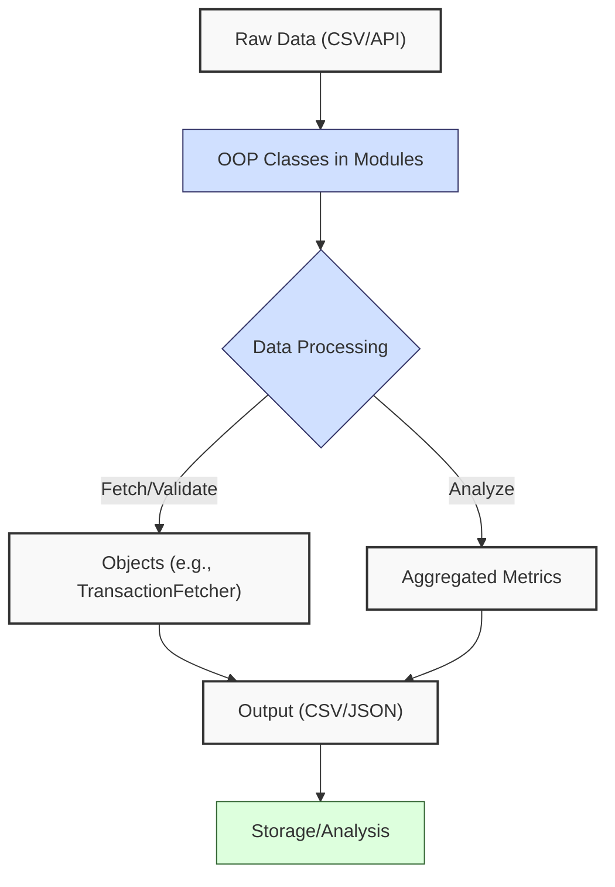
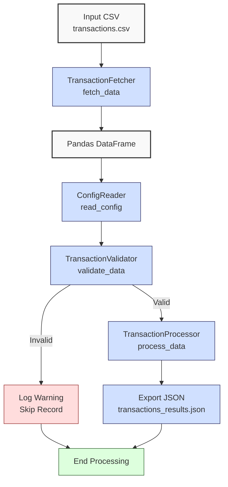
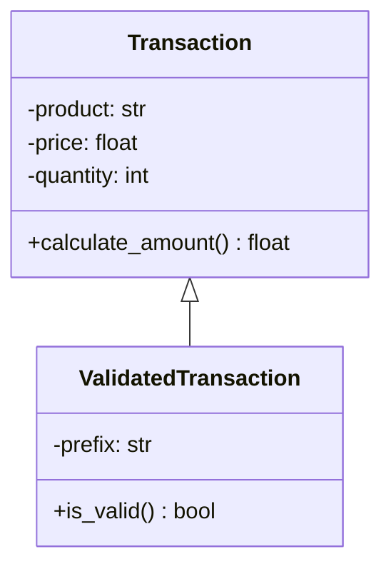

**Complexity: Moderate (M)**

## 5.0 Introduction: Why This Matters for Data Engineering

In data engineering, **Object-Oriented Programming (OOP)** is essential for creating modular, reusable, and maintainable code to handle complex data pipelines, such as those processing financial transaction data for Hijra Group’s Sharia-compliant fintech analytics. OOP organizes code into **classes** and **objects**, encapsulating data and behavior, which reduces code duplication and improves scalability. For example, a single class can manage transaction data fetching and validation, processing thousands of records daily with consistent logic. This chapter builds on Chapters 1–4, introducing OOP concepts like classes, inheritance, and SOLID principles, applied to a transaction data fetcher organized in Python modules. It avoids advanced topics like type annotations (Chapter 7), testing (Chapter 9), or error handling with try/except (Chapter 7), focusing on basic OOP for structuring data engineering tasks.

All code uses **PEP 8’s 4-space indentation**, preferring spaces over tabs to avoid `IndentationError` due to Python’s white-space sensitivity, ensuring compatibility with Hijra Group’s pipeline scripts. The micro-project processes `data/transactions.csv` (Appendix 1), extending Chapter 4’s API integration by encapsulating logic in classes within a `fetcher.py` module, preparing for type-safe OOP in Chapter 7 and web frameworks in Chapters 52–53.

### Data Engineering Workflow Context

This diagram illustrates how OOP fits into a data engineering pipeline:



### Building On and Preparing For

- **Building On**:
  - **Chapter 1**: Uses Python basics (lists, dictionaries, functions) to manage data, now encapsulated in classes.
  - **Chapter 2**: Leverages file handling and modules (`utils.py`) for reusable code, extended to class-based modules.
  - **Chapter 3**: Applies Pandas DataFrames for data processing, now managed by objects.
  - **Chapter 4**: Builds on API integration (`requests.get`), incorporating API fetching into classes.
- **Preparing For**:
  - **Chapter 7**: Lays groundwork for type-safe OOP with Pyright.
  - **Chapter 9**: Prepares for testing class methods.
  - **Chapter 52–53**: Enables modular code for Django/FastAPI applications.
  - **Chapter 68–71**: Supports capstone projects with extensible pipeline classes.

### What You’ll Learn

This chapter covers:

1. **OOP Fundamentals**: Classes, objects, attributes, and methods.
2. **Inheritance and Polymorphism**: Extending classes for reusable logic.
3. **SOLID Principles**: Designing maintainable code.
4. **Module Organization**: Structuring classes in `fetcher.py`.
5. **Data Processing with OOP**: Fetching and validating transaction data.

By the end, you’ll build a transaction data fetcher using classes in a `fetcher.py` module, processing `data/transactions.csv`, producing a JSON report, and logging steps with print statements, all with 4-space indentation per PEP 8. The micro-project simulates API data by reading CSVs, aligning with Chapter 4’s API integration.

**Follow-Along Tips**:

- Create `de-onboarding/data/` and populate with files from Appendix 1 (`transactions.csv`, `config.yaml`, `empty.csv`, `invalid.csv`, `malformed.csv`).
- Install libraries: `pip install pandas pyyaml`.
- Use **4-space indentation** per PEP 8. Run `python -tt script.py` or use VS Code’s Pylint to detect tab/space mixing.
- Use print statements (e.g., `print(df.head())`) to debug DataFrames.
- Verify file paths with `ls data/` (Unix/macOS) or `dir data\` (Windows).
- Use UTF-8 encoding for all files to avoid `UnicodeDecodeError`.

## 5.1 OOP Fundamentals

OOP organizes code into **classes** (blueprints) and **objects** (instances), encapsulating data (**attributes**) and behavior (**methods**). In data engineering, classes manage pipeline components, e.g., a `TransactionFetcher` class handles data fetching and validation.

### 5.1.1 Classes and Objects

Define a class with attributes and methods to process transactions.

```python
# File: de-onboarding/simple_class.py
class Transaction:  # Define Transaction class
    def __init__(self, product, price, quantity):  # Constructor
        self.product = product  # Instance attribute
        self.price = price  # Instance attribute
        self.quantity = quantity  # Instance attribute

    def calculate_amount(self):  # Method to compute amount
        return self.price * self.quantity  # Return price * quantity

# Create objects
sale1 = Transaction("Halal Laptop", 999.99, 2)  # Instantiate object
sale2 = Transaction("Halal Mouse", 24.99, 10)  # Instantiate object

# Access attributes and methods
print(f"Sale 1: {sale1.product}, Amount: ${sale1.calculate_amount()}")  # Debug
print(f"Sale 2: {sale2.product}, Amount: ${sale2.calculate_amount()}")  # Debug

# Expected Output:
# Sale 1: Halal Laptop, Amount: $1999.98
# Sale 2: Halal Mouse, Amount: $249.9
```

**Follow-Along Instructions**:

1. Ensure `de-onboarding/` exists from Chapter 4.
2. Save as `de-onboarding/simple_class.py`.
3. Configure editor for **4-space indentation** per PEP 8 (VS Code: “Editor: Tab Size” = 4, “Editor: Insert Spaces” = true, “Editor: Detect Indentation” = false).
4. Run: `python simple_class.py`.
5. Verify output matches comments.
6. **Common Errors**:
   - **AttributeError**: Ensure attributes are set in `__init__`. Print `vars(sale1)` to inspect.
   - **IndentationError**: Use 4 spaces (not tabs). Run `python -tt simple_class.py`.

**Key Points**:

- **White-Space Sensitivity and PEP 8**: Indentation (4 spaces per PEP 8) ensures readable code. Spaces are preferred over tabs to avoid `IndentationError`.
- **Class**: Blueprint defining attributes and methods.
- **Object**: Instance of a class, created with `ClassName()`.
- **Attributes**: Variables stored in objects (e.g., `self.product`).
- **Methods**: Functions defined in classes (e.g., `calculate_amount`).
- **Underlying Implementation**: Objects are stored as dictionaries in memory, with O(1) attribute access. Methods are bound to objects, adding minimal overhead.
- **Performance Considerations**:
  - **Time Complexity**: O(1) for attribute access, O(n) for method operations (e.g., calculations).
  - **Space Complexity**: O(1) per object for fixed attributes, O(n) for n objects.
  - **Implication**: Classes organize pipeline logic, e.g., transaction processing for Hijra Group.

### 5.1.2 Encapsulation and Modules

Encapsulate logic in a module (`fetcher.py`) for reusability.

```python
# File: de-onboarding/fetcher.py
class Transaction:  # Define Transaction class
    def __init__(self, product, price, quantity):  # Constructor
        self.product = product  # Instance attribute
        self.price = price  # Instance attribute
        self.quantity = quantity  # Instance attribute

    def calculate_amount(self):  # Method
        return self.price * self.quantity  # Return amount

# File: de-onboarding/main.py
import fetcher  # Import module

# Create and use objects
sale = fetcher.Transaction("Halal Laptop", 999.99, 2)  # Instantiate
print(f"Product: {sale.product}, Amount: ${sale.calculate_amount()}")  # Debug

# Expected Output:
# Product: Halal Laptop, Amount: $1999.98
```

**Follow-Along Instructions**:

1. Save `fetcher.py` and `main.py` in `de-onboarding/`.
2. Configure editor for 4-space indentation per PEP 8.
3. Run: `python main.py`.
4. Verify output matches comments.
5. **Common Errors**:
   - **ModuleNotFoundError**: Ensure `fetcher.py` is in `de-onboarding/`. Print `os.getcwd()` to verify directory.
   - **IndentationError**: Use 4 spaces (not tabs). Run `python -tt main.py`.

**Key Points**:

- **Encapsulation**: Bundles data and methods in classes, hiding implementation.
- **Modules**: `.py` files (e.g., `fetcher.py`) for reusable classes.
- **Time Complexity**: O(1) for module imports.
- **Space Complexity**: O(1) for module loading.
- **Implication**: Modules organize pipeline components, e.g., fetchers for Hijra Group.

## 5.2 Inheritance and Polymorphism

**Inheritance** allows a class to inherit attributes and methods from another, promoting code reuse. **Polymorphism** enables subclasses to override methods for specific behavior.

### 5.2.1 Inheritance

Create a base class and subclass for transaction processing.

```python
# File: de-onboarding/inheritance.py
class BaseTransaction:  # Base class
    def __init__(self, product, price, quantity):  # Constructor
        self.product = product  # Attribute
        self.price = price  # Attribute
        self.quantity = quantity  # Attribute

    def calculate_amount(self):  # Method
        return self.price * self.quantity  # Return amount

class ValidatedTransaction(BaseTransaction):  # Subclass
    def __init__(self, product, price, quantity, prefix):  # Constructor
        super().__init__(product, price, quantity)  # Call base constructor
        self.prefix = prefix  # Additional attribute

    def is_valid(self):  # New method
        return self.product.startswith(self.prefix) and self.price > 0 and self.quantity > 0

# Create objects
sale = ValidatedTransaction("Halal Laptop", 999.99, 2, "Halal")  # Instantiate
print(f"Valid: {sale.is_valid()}, Amount: ${sale.calculate_amount()}")  # Debug

# Expected Output:
# Valid: True, Amount: $1999.98
```

**Follow-Along Instructions**:

1. Save as `de-onboarding/inheritance.py`.
2. Configure editor for 4-space indentation per PEP 8.
3. Run: `python inheritance.py`.
4. Verify output matches comments.
5. **Common Errors**:
   - **AttributeError**: Ensure `super().__init__` is called. Print `vars(sale)`.
   - **IndentationError**: Use 4 spaces (not tabs). Run `python -tt inheritance.py`.

**Key Points**:

- **Inheritance**: Subclass inherits from base class using `class Subclass(BaseClass)`.
- `super()`: Calls base class methods.
- **Time Complexity**: O(1) for method calls.
- **Space Complexity**: O(1) per object for additional attributes.
- **Implication**: Inheritance reuses validation logic across pipeline components.

### 5.2.2 Polymorphism

Override methods in subclasses for specific behavior.

```python
# File: de-onboarding/polymorphism.py
class BaseTransaction:  # Base class
    def __init__(self, product, price, quantity):  # Constructor
        self.product = product  # Attribute
        self.price = price  # Attribute
        self.quantity = quantity  # Attribute

    def calculate_amount(self):  # Method
        return self.price * self.quantity  # Base implementation

class DiscountedTransaction(BaseTransaction):  # Subclass
    def __init__(self, product, price, quantity, discount):  # Constructor
        super().__init__(product, price, quantity)  # Call base
        self.discount = discount  # Additional attribute

    def calculate_amount(self):  # Override method
        base_amount = super().calculate_amount()  # Call base method
        return base_amount * (1 - self.discount)  # Apply discount

# Create objects
sale = DiscountedTransaction("Halal Laptop", 999.99, 2, 0.1)  # 10% discount
print(f"Discounted Amount: ${sale.calculate_amount()}")  # Debug

# Expected Output:
# Discounted Amount: $1799.982
```

**Follow-Along Instructions**:

1. Save as `de-onboarding/polymorphism.py`.
2. Configure editor for 4-space indentation per PEP 8.
3. Run: `python polymorphism.py`.
4. Verify output matches comments.
5. **Common Errors**:
   - **TypeError**: Ensure `super().calculate_amount()` returns numeric value. Print type.
   - **IndentationError**: Use 4 spaces (not tabs). Run `python -tt polymorphism.py`.

**Key Points**:

- **Polymorphism**: Subclasses override methods for specific behavior.
- **Time Complexity**: O(1) for method calls.
- **Space Complexity**: O(1) per object.
- **Implication**: Enables flexible pipeline logic, e.g., discounted transactions.

## 5.3 SOLID Principles

**SOLID principles** ensure maintainable, scalable code:

1. **Single Responsibility**: A class has one responsibility (e.g., `TransactionFetcher` fetches data).
2. **Open/Closed**: Classes are open for extension, closed for modification (e.g., inherit to add features).
3. **Liskov Substitution**: Subclasses can replace base classes without breaking code.
4. **Interface Segregation**: Classes only implement needed methods (less relevant in Python due to duck typing).
5. **Dependency Inversion**: Depend on abstractions, not implementations (e.g., use base classes).

### 5.3.1 Single Responsibility, Open/Closed, and Liskov Substitution

Apply Single Responsibility, Open/Closed, and Liskov Substitution principles.

```python
# File: de-onboarding/solid.py
class DataFetcher:  # Single responsibility: fetch data
    def fetch_data(self, source):  # Method
        print(f"Fetching from {source}")  # Debug
        return [{"product": "Halal Laptop", "price": 999.99, "quantity": 2}]

class ValidatedDataFetcher(DataFetcher):  # Liskov Substitution: extends fetcher
    def fetch_data(self, source):  # Override method
        data = super().fetch_data(source)  # Call base
        if all(item["product"].startswith("Halal") for item in data):  # Validate
            print("Validated data")  # Debug
            return data
        return []  # Return empty if invalid

class DataValidator:  # Single responsibility: validate data
    def validate(self, data, prefix):  # Method
        return all(item["product"].startswith(prefix) for item in data)

class Pipeline(DataFetcher):  # Open for extension
    def process(self, source, prefix):  # Method
        data = self.fetch_data(source)  # Fetch
        validator = DataValidator()  # Create validator
        if validator.validate(data, prefix):  # Validate
            print("Data valid")  # Debug
            return data
        print("Data invalid")  # Debug
        return []

# Create objects
pipeline = Pipeline()  # Instantiate Pipeline
result = pipeline.process("csv", "Halal")  # Call method
print(f"Pipeline Result: {result}")  # Debug

validated_fetcher = ValidatedDataFetcher()  # Instantiate ValidatedDataFetcher
result = validated_fetcher.fetch_data("csv")  # Call method (Liskov Substitution)
print(f"Validated Fetcher Result: {result}")  # Debug

# Expected Output:
# Fetching from csv
# Data valid
# Pipeline Result: [{'product': 'Halal Laptop', 'price': 999.99, 'quantity': 2}]
# Fetching from csv
# Validated data
# Validated Fetcher Result: [{'product': 'Halal Laptop', 'price': 999.99, 'quantity': 2}]
```

**Follow-Along Instructions**:

1. Save as `de-onboarding/solid.py`.
2. Configure editor for 4-space indentation per PEP 8.
3. Run: `python solid.py`.
4. Verify output matches comments.
5. **Common Errors**:
   - **AttributeError**: Ensure methods are defined. Print `dir(pipeline)`.
   - **IndentationError**: Use 4 spaces (not tabs). Run `python -tt solid.py`.

**Key Points**:

- **Single Responsibility**: `DataFetcher` fetches, `DataValidator` validates.
- **Open/Closed**: `Pipeline` extends `DataFetcher` without modifying it.
- **Liskov Substitution**: `ValidatedDataFetcher` can replace `DataFetcher` without breaking code, as shown by consistent `fetch_data` behavior.
- **Time Complexity**: O(n) for validation of n items.
- **Space Complexity**: O(n) for data storage.
- **Implication**: These principles ensure scalable pipelines.

### 5.3.2 Interface Segregation and Dependency Inversion

**Interface Segregation** is less relevant in Python due to duck typing, where classes implicitly define interfaces through methods. For example, any class with a `fetch_data` method can be used as a fetcher without formal interfaces. **Dependency Inversion** encourages depending on abstractions, as shown in a transaction-specific example with validation.

```python
# File: de-onboarding/solid_di.py
import pandas as pd  # For DataFrame operations
import yaml  # For YAML parsing
import json  # For JSON output

class AbstractFetcher:  # Abstraction for Dependency Inversion
    def fetch_data(self, source):  # Abstract method
        pass  # No implementation

class TransactionFetcher(AbstractFetcher):  # Concrete implementation
    def fetch_data(self, source):  # Method
        print(f"Fetching transactions from {source}")  # Debug
        df = pd.read_csv(source)  # Load CSV
        data = df[["product", "price", "quantity"]].to_dict(orient="records")  # Convert to list of dicts
        return data  # Return transaction data

class TransactionValidator:  # Single responsibility: validate data
    def __init__(self, config_path):  # Constructor
        with open(config_path, "r") as file:  # Open config
            self.config = yaml.safe_load(file)  # Load YAML
        print(f"Loaded config for validation: {self.config}")  # Debug

    def validate(self, data):  # Validate data
        prefix = self.config["product_prefix"]  # Get prefix
        return [item for item in data if item["product"] and item["product"].startswith(prefix)]  # Filter valid

class TransactionProcessor:  # Depends on abstraction
    def __init__(self, fetcher, validator):  # Constructor
        self.fetcher = fetcher  # Store fetcher (abstract)
        self.validator = validator  # Store validator

    def process(self, source):  # Method
        data = self.fetcher.fetch_data(source)  # Fetch data
        valid_data = self.validator.validate(data)  # Validate
        total_sales = sum(item["price"] * item["quantity"] for item in valid_data)  # Compute total
        result = {"total_sales": total_sales, "valid_records": len(valid_data)}  # Create result
        print(f"Processed data: {result}")  # Debug
        return result  # Return result

# Create objects
fetcher = TransactionFetcher()  # Instantiate fetcher
validator = TransactionValidator("data/config.yaml")  # Instantiate validator
processor = TransactionProcessor(fetcher, validator)  # Pass fetcher and validator
result = processor.process("data/transactions.csv")  # Call method
with open("data/processor_result.json", "w") as file:  # Save result
    json.dump(result, file, indent=2)  # Write JSON
print(f"Result: {result}")  # Debug

# Expected Output:
# Loaded config for validation: {'min_price': 10.0, 'max_quantity': 100, 'required_fields': ['product', 'price', 'quantity'], 'product_prefix': 'Halal', 'max_decimals': 2}
# Fetching transactions from data/transactions.csv
# Processed data: {'total_sales': 2499.83, 'valid_records': 3}
# Result: {'total_sales': 2499.83, 'valid_records': 3}
# (Creates data/processor_result.json with same result)
```

**Follow-Along Instructions**:

1. Ensure `data/transactions.csv` and `data/config.yaml` exist per Appendix 1.
2. Save as `de-onboarding/solid_di.py`.
3. Configure editor for 4-space indentation per PEP 8.
4. Run: `python solid_di.py`.
5. Verify output matches comments and `data/processor_result.json` is created.
6. **Common Errors**:
   - **FileNotFoundError**: Ensure `data/transactions.csv` and `data/config.yaml` exist. Print `source`.
   - **AttributeError**: Ensure `fetch_data` is defined in `fetcher`. Print `dir(fetcher)`.
   - **IndentationError**: Use 4 spaces (not tabs). Run `python -tt solid_di.py`.

**Key Points**:

- **Interface Segregation**: Python’s duck typing avoids rigid interfaces, allowing flexible method implementation.
- **Dependency Inversion**: `TransactionProcessor` depends on `AbstractFetcher`, enabling swapping of fetchers, with validation tied to `config.yaml`.
- **Time Complexity**: O(n) for processing and validating n records.
- **Space Complexity**: O(n) for data storage.
- **Implication**: Dependency Inversion supports extensible transaction pipelines.

## 5.4 Micro-Project: OOP-Based Transaction Data Fetcher

### Project Requirements

Build an OOP-based transaction data fetcher in `fetcher.py` to process `data/transactions.csv`, simulating API data for Hijra Group’s analytics. The fetcher encapsulates fetching, validation, and processing in classes, producing a JSON report, aligning with Islamic Financial Services Board (IFSB) standards for transaction validation. This ensures compliance with IFSB standards, which prohibit transactions involving non-Halal products and interest-based transactions, aligning with Hijra Group’s ethical fintech mission. Compliance reporting, such as generating audit logs for IFSB audits, will be covered in Chapter 66:

- Define classes in `fetcher.py` for fetching, validating, and processing.
- Load `data/transactions.csv` with `pandas.read_csv` and `config.yaml` with PyYAML.
- Validate records for Halal products, positive prices/quantities, and config rules.
- Compute total sales and top 3 products using Pandas.
- Export results to `data/transactions_results.json`.
- Log steps and invalid records using print statements.
- Use **4-space indentation** per PEP 8, preferring spaces over tabs.
- Test edge cases with `empty.csv`, `invalid.csv`, and `malformed.csv`.

### Sample Input Files

`data/transactions.csv` (Appendix 1):

```csv
transaction_id,product,price,quantity,date
T001,Halal Laptop,999.99,2,2023-10-01
T002,Halal Mouse,24.99,10,2023-10-02
T003,Halal Keyboard,49.99,5,2023-10-03
T004,,29.99,3,2023-10-04
T005,Monitor,199.99,2,2023-10-05
```

`data/config.yaml` (Appendix 1):

```yaml
min_price: 10.0
max_quantity: 100
required_fields:
  - product
  - price
  - quantity
product_prefix: 'Halal'
max_decimals: 2
```

### Data Processing Flow



### Acceptance Criteria

- **Go Criteria**:
  - Loads `transactions.csv` and `config.yaml` correctly.
  - Validates records for required fields, Halal prefix, numeric price/quantity, positive values, and config rules.
  - Computes total sales and top 3 products.
  - Exports results to `data/transactions_results.json`.
  - Logs steps and invalid records.
  - Uses classes in `fetcher.py` with 4-space indentation per PEP 8.
  - Passes edge case tests with `empty.csv`, `invalid.csv`, and `malformed.csv`.
- **No-Go Criteria**:
  - Fails to load files.
  - Incorrect validation or calculations.
  - Missing JSON export.
  - Uses try/except or type annotations.
  - Inconsistent indentation or tab/space mixing.

### Common Pitfalls to Avoid

1. **File Loading Issues**:
   - **Problem**: `pd.read_csv` fails due to missing file.
   - **Solution**: Print path with `print(csv_path)`. Ensure `data/transactions.csv` exists.
2. **Validation Errors**:
   - **Problem**: Missing values cause filtering issues.
   - **Solution**: Use `dropna()` and print `df.head()`.
3. **Type Mismatches**:
   - **Problem**: Non-numeric prices cause errors.
   - **Solution**: Validate with `utils.is_numeric_value`. Print `df.dtypes`.
4. **Class Misuse**:
   - **Problem**: Attributes not initialized.
   - **Solution**: Ensure `__init__` sets all attributes. Print `vars(obj)`.
5. **Module Import Errors**:
   - **Problem**: `ModuleNotFoundError` for `fetcher`.
   - **Solution**: Ensure `fetcher.py` is in `de-onboarding/`. Print `os.getcwd()`.
6. **IndentationError**:
   - **Problem**: Mixed spaces/tabs.
   - **Solution**: Use 4 spaces per PEP 8. Run `python -tt main.py`.
7. **Malformed YAML**:
   - **Problem**: Incorrect indentation in `config.yaml` causes `yaml.YAMLError`.
   - **Solution**: Validate with an online YAML linter or print file contents with `print(open(config_path).read())`.

### How This Differs from Production

In production, this solution would include:

- **Error Handling**: Try/except for robust errors (Chapter 7).
- **Type Safety**: Type annotations with Pyright (Chapter 7).
- **Testing**: Unit tests with `pytest` (Chapter 9).
- **Scalability**: Chunked processing for large CSVs (Chapter 40). For instance, processing 10,000 transaction rows in 1,000-row chunks reduces memory usage from 24MB to 2.4MB.
- **Logging**: File-based logging (Chapter 52).
- **APIs**: Real API calls with `requests` (Chapter 4).

### Implementation

```python
# File: de-onboarding/utils.py (from Chapter 3, partial)
def is_numeric(s, max_decimals=2):  # Check if string is a decimal number
    """Check if string is a decimal number with up to max_decimals."""
    parts = s.split(".")  # Split on decimal point
    if len(parts) != 2 or not parts[0].isdigit() or not parts[1].isdigit():
        return False  # Invalid format
    return len(parts[1]) <= max_decimals  # Check decimal places

def clean_string(s):  # Clean string
    """Strip whitespace from string."""
    return s.strip()

def is_numeric_value(x):  # Check if value is numeric
    """Check if value is an integer or float."""
    return isinstance(x, (int, float))  # Return True for numeric types

def has_valid_decimals(x, max_decimals):  # Check decimal places
    """Check if value has valid decimal places."""
    return is_numeric(str(x), max_decimals)  # Use is_numeric

def apply_valid_decimals(x, max_decimals):  # Apply decimal validation
    """Apply has_valid_decimals to a value."""
    return has_valid_decimals(x, max_decimals)

def is_integer(x):  # Check if value is an integer
    """Check if value is an integer when converted to string."""
    return str(x).isdigit()  # Return True for integer strings

# File: de-onboarding/fetcher.py
import pandas as pd  # For DataFrame operations
import yaml  # For YAML parsing
import utils  # Import utils module

class ConfigReader:  # Single responsibility: read config
    def __init__(self, config_path):  # Constructor
        self.config_path = config_path  # Store path
        self.config = self.read_config()  # Load config

    def read_config(self):  # Read YAML
        print(f"Opening config: {self.config_path}")  # Debug
        file = open(self.config_path, "r")  # Open file
        config = yaml.safe_load(file)  # Parse YAML
        file.close()  # Close file
        print(f"Loaded config: {config}")  # Debug
        return config  # Return config

class TransactionFetcher:  # Single responsibility: fetch data
    def fetch_data(self, csv_path):  # Simulate API fetch with CSV
        print(f"Fetching data from: {csv_path}")  # Debug
        df = pd.read_csv(csv_path)  # Load CSV
        print("Fetched DataFrame:")  # Debug
        print(df.head())  # Show first rows
        return df  # Return DataFrame

class TransactionValidator:  # Single responsibility: validate data
    def __init__(self, config):  # Constructor
        self.config = config  # Store config

    def validate_data(self, df):  # Validate DataFrame
        print("Validating data...")  # Debug
        required_fields = self.config["required_fields"]  # Get fields
        missing_fields = [f for f in required_fields if f not in df.columns]
        if missing_fields:  # Check columns
            print(f"Missing columns: {missing_fields}")  # Log
            return pd.DataFrame()  # Return empty

        # Filter valid records
        df = df.dropna(subset=["product"])  # Drop missing product
        df = df[df["product"].str.startswith(self.config["product_prefix"])]  # Filter Halal
        df = df[df["quantity"].apply(utils.is_integer)]  # Ensure integer quantity
        df["quantity"] = df["quantity"].astype(int)  # Convert to int
        df = df[df["quantity"] <= self.config["max_quantity"]]  # Filter quantity
        df = df[df["quantity"] > 0]  # Filter positive quantity
        df = df[df["price"].apply(utils.is_numeric_value)]  # Ensure numeric price
        df = df[df["price"] > 0]  # Filter positive price
        df = df[df["price"] >= self.config["min_price"]]  # Filter min price
        df = df[df["price"].apply(lambda x: utils.apply_valid_decimals(x, self.config["max_decimals"]))]  # Check decimals

        print("Validated DataFrame:")  # Debug
        print(df)  # Show filtered
        return df  # Return validated

class TransactionProcessor(TransactionFetcher):  # Inherits fetcher
    def __init__(self, config):  # Constructor
        self.config = config  # Store config
        self.validator = TransactionValidator(config)  # Create validator

    def process_data(self, csv_path):  # Process data
        df = self.fetch_data(csv_path)  # Fetch data
        df = self.validator.validate_data(df)  # Validate
        if df.empty:  # Check empty
            print("No valid data")  # Log
            return {"total_sales": 0.0, "unique_products": [], "top_products": {}}, 0

        # Compute metrics
        df["amount"] = df["price"] * df["quantity"]  # Compute amount
        total_sales = df["amount"].sum()  # Total sales
        unique_products = df["product"].unique().tolist()  # Unique products
        sales_by_product = df.groupby("product")["amount"].sum()  # Group
        top_products = sales_by_product.sort_values(ascending=False).head(3).to_dict()  # Top 3

        valid_sales = len(df)  # Count valid
        print(f"Valid sales: {valid_sales} records")  # Debug
        return {
            "total_sales": float(total_sales),  # Convert for JSON
            "unique_products": unique_products,  # Products
            "top_products": top_products  # Top products
        }, valid_sales  # Return results

# File: de-onboarding/main.py
import fetcher  # Import module
import json  # For JSON export
import os  # For file checks

def export_results(results, json_path):  # Export results
    """Export results to JSON."""
    print(f"Writing to: {json_path}")  # Debug
    print(f"Results: {results}")  # Debug
    file = open(json_path, "w")  # Open file
    json.dump(results, file, indent=2)  # Write JSON
    file.close()  # Close file
    print(f"Exported to {json_path}")  # Confirm

def main():  # Main function
    csv_path = "data/transactions.csv"  # CSV path
    config_path = "data/config.yaml"  # Config path
    json_path = "data/transactions_results.json"  # JSON path

    config_reader = fetcher.ConfigReader(config_path)  # Create reader
    config = config_reader.config  # Get config
    processor = fetcher.TransactionProcessor(config)  # Create processor
    results, valid_sales = processor.process_data(csv_path)  # Process
    total_records = valid_sales  # Total after filtering
    export_results(results, json_path)  # Export

    # Print report
    print("\nTransaction Report:")  # Header
    print(f"Total Records Processed: {total_records}")  # Total
    print(f"Valid Sales: {valid_sales}")  # Valid
    print(f"Invalid Sales: {total_records - valid_sales}")  # Invalid
    print(f"Total Sales: ${round(results['total_sales'], 2)}")  # Total sales
    print(f"Unique Products: {results['unique_products']}")  # Products
    print(f"Top Products: {results['top_products']}")  # Top products
    print("Processing completed")  # Confirm

if __name__ == "__main__":
    main()  # Run main
```

### Expected Outputs

`data/transactions_results.json`:

```json
{
  "total_sales": 2499.83,
  "unique_products": ["Halal Laptop", "Halal Mouse", "Halal Keyboard"],
  "top_products": {
    "Halal Laptop": 1999.98,
    "Halal Keyboard": 249.95,
    "Halal Mouse": 249.9
  }
}
```

**Console Output** (abridged):

```
Opening config: data/config.yaml
Loaded config: {'min_price': 10.0, 'max_quantity': 100, 'required_fields': ['product', 'price', 'quantity'], 'product_prefix': 'Halal', 'max_decimals': 2}
Fetching data from: data/transactions.csv
Fetched DataFrame:
  transaction_id      product   price  quantity        date
0          T001  Halal Laptop  999.99         2  2023-10-01
1          T002   Halal Mouse   24.99        10  2023-10-02
2          T003  Halal Keyboard   49.99         5  2023-10-03
3          T004           NaN   29.99         3  2023-10-04
4          T005      Monitor  199.99         2  2023-10-05
Validating data...
Validated DataFrame:
  transaction_id      product   price  quantity        date
0          T001  Halal Laptop  999.99         2  2023-10-01
1          T002   Halal Mouse   24.99        10  2023-10-02
2          T003  Halal Keyboard   49.99         5  2023-10-03
Valid sales: 3 records
Writing to: data/transactions_results.json
Exported to data/transactions_results.json

Transaction Report:
Total Records Processed: 3
Valid Sales: 3
Invalid Sales: 0
Total Sales: $2499.83
Unique Products: ['Halal Laptop', 'Halal Mouse', 'Halal Keyboard']
Top Products: {'Halal Laptop': 1999.98, 'Halal Keyboard': 249.95, 'Halal Mouse': 249.9}
Processing completed
```

### How to Run and Test

1. **Setup**:

   - **Setup Checklist**:
     - \[ \] Create `de-onboarding/data/` directory.
     - \[ \] Save `transactions.csv`, `config.yaml`, `empty.csv`, `invalid.csv`, `malformed.csv` per Appendix 1.
     - \[ \] Install libraries: `pip install pandas pyyaml`. If `pip install` fails, run `pip install --upgrade pip` to update pip.
     - \[ \] Verify library versions with `pip list` (e.g., `pandas>=1.5.0`, `pyyaml>=5.4.0`) to ensure compatibility.
     - \[ \] Create virtual environment: `python -m venv venv`, activate (Windows: `venv\Scripts\activate`, Unix: `source venv/bin/activate`).
     - \[ \] Verify Python 3.10+: `python --version`.
     - \[ \] Configure editor for 4-space indentation per PEP 8 (VS Code: “Editor: Tab Size” = 4, “Editor: Insert Spaces” = true, “Editor: Detect Indentation” = false).
     - \[ \] Save `utils.py`, `fetcher.py`, `main.py` in `de-onboarding/`.
   - **Troubleshooting**:
     - If `FileNotFoundError` or `PermissionError`, check paths with `print(csv_path)` and permissions with `ls -l data/` (Unix/macOS) or `dir data\` (Windows).
     - If `ModuleNotFoundError`, ensure `fetcher.py` exists. Print `os.getcwd()`.
     - If `IndentationError`, use 4 spaces (not tabs). Run `python -tt main.py`.
     - If `yaml.YAMLError`, print `print(open(config_path).read())` to check `config.yaml` syntax.

2. **Run**:

   - Open terminal in `de-onboarding/`.
   - Run: `python main.py`.
   - Outputs: `data/transactions_results.json`, console logs.

3. **Test Scenarios**:

   - **Valid Data**: Verify `transactions_results.json` shows `total_sales: 2499.83`, correct top products.

   - **Empty CSV**: Test with `empty.csv`:

     ```python
     processor = fetcher.TransactionProcessor(fetcher.ConfigReader("data/config.yaml").config)
     results, valid_sales = processor.process_data("data/empty.csv")
     print(results, valid_sales)
     # Expected: {'total_sales': 0.0, 'unique_products': [], 'top_products': {}}, 0
     ```

   - **Invalid Headers**: Test with `invalid.csv`:

     ```python
     processor = fetcher.TransactionProcessor(fetcher.ConfigReader("data/config.yaml").config)
     results, valid_sales = processor.process_data("data/invalid.csv")
     print(results)
     # Expected: {'total_sales': 0.0, 'unique_products': [], 'top_products': {}}
     # Debugging Tip: Print `df.columns` to identify missing columns (e.g., `name` instead of `product`).
     ```

     - **Note**: `invalid.csv` has `name` instead of `product`, causing validation to fail due to missing required fields.

   - **Malformed Data**: Test with `malformed.csv`:

     ```python
     processor = fetcher.TransactionProcessor(fetcher.ConfigReader("data/config.yaml").config)
     results, valid_sales = processor.process_data("data/malformed.csv")
     print(results)
     # Expected: {'total_sales': 249.9, 'unique_products': ['Halal Mouse'], 'top_products': {'Halal Mouse': 249.9}}
     # Note: `malformed.csv` has a non-integer quantity (`invalid`), filtered out by `utils.is_integer`, leaving only the `Halal Mouse` record.
     ```

## 5.5 Practice Exercises

### Exercise 1: Basic Transaction Class

Write a `Transaction` class to store product, price, quantity, and compute amount, with 4-space indentation per PEP 8.

**Sample Input**:

```python
sale = Transaction("Halal Laptop", 999.99, 2)
```

**Expected Output**:

```
Product: Halal Laptop, Amount: $1999.98
```

**Follow-Along Instructions**:

1. Save as `de-onboarding/ex1_transaction.py`.
2. Configure editor for 4-space indentation per PEP 8.
3. Run: `python ex1_transaction.py`.
4. **How to Test**:
   - Add: `sale = Transaction("Halal Laptop", 999.99, 2); print(f"Product: {sale.product}, Amount: ${sale.calculate_amount()}")`.
   - Verify output matches expected.
   - Test with negative price: Should compute normally (validation in micro-project).
   - **Common Errors**:
     - **AttributeError**: Print `vars(sale)` to check attributes.
     - **IndentationError**: Use 4 spaces (not tabs). Run `python -tt ex1_transaction.py`.

### Exercise 2: Inherited Validator Class

Write a `ValidatedTransaction` class inheriting from `Transaction`, adding prefix validation, with 4-space indentation per PEP 8.

**Sample Input**:

```python
sale = ValidatedTransaction("Halal Laptop", 999.99, 2, "Halal")
```

**Expected Output**:

```
Valid: True, Amount: $1999.98
```

**Follow-Along Instructions**:

1. Save as `de-onboarding/ex2_validator.py`.
2. Configure editor for 4-space indentation per PEP 8.
3. Run: `python ex2_validator.py`.
4. **How to Test**:
   - Add: `sale = ValidatedTransaction("Halal Laptop", 999.99, 2, "Halal"); print(f"Valid: {sale.is_valid()}, Amount: ${sale.calculate_amount()}")`.
   - Test with non-Halal product: Should return `False`.
   - **Common Errors**:
     - **AttributeError**: Ensure `super().__init__` is called. Print `vars(sale)`.
     - **IndentationError**: Use 4 spaces (not tabs). Run `python -tt ex2_validator.py`.

### Exercise 3: Polymorphic Discount Class

Write a `DiscountedTransaction` class inheriting from `Transaction`, applying a discount, with 4-space indentation per PEP 8.

**Sample Input**:

```python
sale = DiscountedTransaction("Halal Laptop", 999.99, 2, 0.1)
```

**Expected Output**:

```
Discounted Amount: $1799.982
```

**Follow-Along Instructions**:

1. Save as `de-onboarding/ex3_discount.py`.
2. Configure editor for 4-space indentation per PEP 8.
3. Run: `python ex3_discount.py`.
4. **How to Test**:
   - Add: `sale = DiscountedTransaction("Halal Laptop", 999.99, 2, 0.1); print(f"Discounted Amount: ${sale.calculate_amount()}")`.
   - Test with zero discount: Should match base amount.
   - **Common Errors**:
     - **TypeError**: Print `type(base_amount)` to check return value.
     - **IndentationError**: Use 4 spaces (not tabs). Run `python -tt ex3_discount.py`.

### Exercise 4: SOLID-Based Pipeline

Write a `DataPipeline` class inheriting from a `BaseFetcher`, applying SOLID principles, with 4-space indentation per PEP 8.

**Sample Input**:

```python
pipeline = DataPipeline()
result = pipeline.process("csv", "Halal")
```

**Expected Output**:

```
Fetching from csv
Data valid
Result: [{'product': 'Halal Laptop', 'price': 999.99, 'quantity': 2}]
```

**Follow-Along Instructions**:

1. Save as `de-onboarding/ex4_pipeline.py`.
2. Configure editor for 4-space indentation per PEP 8.
3. Run: `python ex4_pipeline.py`.
4. **How to Test**:
   - Add: `pipeline = DataPipeline(); print(pipeline.process("csv", "Halal"))`.
   - Test with invalid prefix: Should return empty list.
   - **Common Errors**:
     - **AttributeError**: Print `dir(pipeline)` to check methods.
     - **IndentationError**: Use 4 spaces (not tabs). Run `python -tt ex4_pipeline.py`.

### Exercise 5: Debug a Class Bug

Fix this buggy code where `ValidatedTransaction` doesn’t call the base constructor, causing attribute errors, with 4-space indentation per PEP 8.

**Buggy Code**:

```python
class Transaction:
    def __init__(self, product, price, quantity):
        self.product = product
        self.price = price
        self.quantity = quantity

class ValidatedTransaction(Transaction):
    def __init__(self, product, price, quantity, prefix):
        self.prefix = prefix  # Bug: Missing super().__init__

    def is_valid(self):
        return self.product.startswith(self.prefix)

sale = ValidatedTransaction("Halal Laptop", 999.99, 2, "Halal")
print(sale.is_valid())  # AttributeError
```

**Expected Output**:

```
True
```

**Follow-Along Instructions**:

1. Save as `de-onboarding/ex5_debug.py`.
2. Configure editor for 4-space indentation per PEP 8.
3. Run: `python ex5_debug.py` to see error.
4. Fix and re-run.
5. **How to Test**:
   - Verify output: `True`.
   - Test with non-Halal product: Should return `False`.
   - **Common Errors**:
     - **AttributeError**: Print `vars(sale)` to check attributes.
     - **IndentationError**: Use 4 spaces (not tabs). Run `python -tt ex5_debug.py`.

### Exercise 6: SOLID Principles Analysis and Class Diagram

Write an explanation comparing how Single Responsibility, Open/Closed, and Liskov Substitution principles improve scalability in a transaction data pipeline, saving it to `de-onboarding/ex6_concepts.txt`. Additionally, draw a Mermaid class diagram for `Transaction` and `ValidatedTransaction`, saving it to `de-onboarding/ex6_diagram.txt`, with 4-space indentation per PEP 8. Use Mermaid Live Editor (mermaid.live) or a Mermaid-compatible IDE (e.g., VS Code with Mermaid plugin) to visualize the diagram.

**Sample Input**:

```python
explain_solid_principles()
```

**Expected Output** (in `ex6_concepts.txt`):

```
Single Responsibility ensures each class, like TransactionFetcher, has one job (e.g., fetching data), making the pipeline easier to scale by isolating changes. Open/Closed allows extending classes, like adding a ValidatedTransactionFetcher, without modifying existing code, supporting new features. Liskov Substitution ensures ValidatedTransactionFetcher can replace TransactionFetcher without breaking the pipeline, enabling flexible scaling.
```

**Expected Output** (in `ex6_diagram.txt`):



**Follow-Along Instructions**:

1. Save as `de-onboarding/ex6_solid.py`.
2. Configure editor for 4-space indentation per PEP 8.
3. Run: `python ex6_solid.py`.
4. **How to Test**:
   - Add: `explain_solid_principles()`.
   - Verify `ex6_concepts.txt` contains the explanation and `ex6_diagram.txt` contains the Mermaid diagram.
   - Check explanation references micro-project classes (e.g., `TransactionFetcher`).
   - Open `ex6_diagram.txt` in Mermaid Live Editor (mermaid.live) or a Mermaid-compatible IDE to verify the diagram.
   - **Common Errors**:
     - **FileNotFoundError**: Check write permissions with `ls -l de-onboarding/` (Unix/macOS) or `dir de-onboarding\` (Windows).
     - **IndentationError**: Use 4 spaces (not tabs). Run `python -tt ex6_solid.py`.

## 5.6 Exercise Solutions

### Solution to Exercise 1: Basic Transaction Class

```python
class Transaction:  # Define class
    def __init__(self, product, price, quantity):  # Constructor
        self.product = product  # Attribute
        self.price = price  # Attribute
        self.quantity = quantity  # Attribute

    def calculate_amount(self):  # Method
        return self.price * self.quantity  # Return amount

# Test
sale = Transaction("Halal Laptop", 999.99, 2)  # Instantiate
print(f"Product: {sale.product}, Amount: ${sale.calculate_amount()}")  # Print

# Output:
# Product: Halal Laptop, Amount: $1999.98
```

### Solution to Exercise 2: Inherited Validator Class

```python
class Transaction:  # Base class
    def __init__(self, product, price, quantity):  # Constructor
        self.product = product  # Attribute
        self.price = price  # Attribute
        self.quantity = quantity  # Attribute

    def calculate_amount(self):  # Method
        return self.price * self.quantity  # Return amount

class ValidatedTransaction(Transaction):  # Subclass
    def __init__(self, product, price, quantity, prefix):  # Constructor
        super().__init__(product, price, quantity)  # Call base
        self.prefix = prefix  # Attribute

    def is_valid(self):  # Method
        return self.product.startswith(self.prefix)  # Validate

# Test
sale = ValidatedTransaction("Halal Laptop", 999.99, 2, "Halal")  # Instantiate
print(f"Valid: {sale.is_valid()}, Amount: ${sale.calculate_amount()}")  # Print

# Output:
# Valid: True, Amount: $1999.98
```

### Solution to Exercise 3: Polymorphic Discount Class

```python
class Transaction:  # Base class
    def __init__(self, product, price, quantity):  # Constructor
        self.product = product  # Attribute
        self.price = price  # Attribute
        self.quantity = quantity  # Attribute

    def calculate_amount(self):  # Method
        return self.price * self.quantity  # Return amount

class DiscountedTransaction(Transaction):  # Subclass
    def __init__(self, product, price, quantity, discount):  # Constructor
        super().__init__(product, price, quantity)  # Call base
        self.discount = discount  # Attribute

    def calculate_amount(self):  # Override method
        base_amount = super().calculate_amount()  # Call base
        return base_amount * (1 - self.discount)  # Apply discount

# Test
sale = DiscountedTransaction("Halal Laptop", 999.99, 2, 0.1)  # Instantiate
print(f"Discounted Amount: ${sale.calculate_amount()}")  # Print

# Output:
# Discounted Amount: $1799.982
```

### Solution to Exercise 4: SOLID-Based Pipeline

```python
class BaseFetcher:  # Base class
    def fetch_data(self, source):  # Method
        print(f"Fetching from {source}")  # Debug
        return [{"product": "Halal Laptop", "price": 999.99, "quantity": 2}]

class DataValidator:  # Validator class
    def validate(self, data, prefix):  # Method
        return all(item["product"].startswith(prefix) for item in data)

class DataPipeline(BaseFetcher):  # Pipeline class
    def process(self, source, prefix):  # Method
        data = self.fetch_data(source)  # Fetch
        validator = DataValidator()  # Create validator
        if validator.validate(data, prefix):  # Validate
            print("Data valid")  # Debug
            return data
        print("Data invalid")  # Debug
        return []  # Return empty

# Test
pipeline = DataPipeline()  # Instantiate
result = pipeline.process("csv", "Halal")  # Call
print(f"Result: {result}")  # Print

# Output:
# Fetching from csv
# Data valid
# Result: [{'product': 'Halal Laptop', 'price': 999.99, 'quantity': 2}]
```

### Solution to Exercise 5: Debug a Class Bug

```python
class Transaction:  # Base class
    def __init__(self, product, price, quantity):  # Constructor
        self.product = product  # Attribute
        self.price = price  # Attribute
        self.quantity = quantity  # Attribute

class ValidatedTransaction(Transaction):  # Subclass
    def __init__(self, product, price, quantity, prefix):  # Constructor
        super().__init__(product, price, quantity)  # Fix: Call base
        self.prefix = prefix  # Attribute

    def is_valid(self):  # Method
        return self.product.startswith(self.prefix)  # Validate

# Test
sale = ValidatedTransaction("Halal Laptop", 999.99, 2, "Halal")  # Instantiate
print(sale.is_valid())  # Print

# Output:
# True
```

**Explanation**:

- **Bug**: Missing `super().__init__` caused `product` to be undefined.
- **Fix**: Added `super().__init__` to initialize base attributes.

### Solution to Exercise 6: SOLID Principles Analysis and Class Diagram

```python
def explain_solid_principles():  # No parameters
    """Explain Single Responsibility, Open/Closed, and Liskov Substitution principles, draw class diagram."""
    # Explanation for ex6_concepts.txt
    explanation = (
        "Single Responsibility ensures each class, like TransactionFetcher, has one job "
        "(e.g., fetching data), making the pipeline easier to scale by isolating changes. "
        "Open/Closed allows extending classes, like adding a ValidatedTransactionFetcher, "
        "without modifying existing code, supporting new features. Liskov Substitution ensures "
        "ValidatedTransactionFetcher can replace TransactionFetcher without breaking the pipeline, "
        "enabling flexible scaling."
    )
    print("Writing explanation to ex6_concepts.txt")  # Debug
    with open("ex6_concepts.txt", "w") as file:  # Write to file
        file.write(explanation)  # Save explanation
    print(explanation)  # Print explanation

    # Class diagram for ex6_diagram.txt
    diagram = """
classDiagram
    class Transaction {
        -product: str
        -price: float
        -quantity: int
        +calculate_amount() float
    }
    class ValidatedTransaction {
        -prefix: str
        +is_valid() bool
    }
    Transaction <|-- ValidatedTransaction
"""
    print("Writing diagram to ex6_diagram.txt")  # Debug
    with open("ex6_diagram.txt", "w") as file:  # Write to file
        file.write(diagram)  # Save diagram
    print("Diagram saved. View in Mermaid Live Editor (mermaid.live) or a Mermaid-compatible IDE.")  # Confirm

# Test
explain_solid_principles()  # Call function

# Output (in ex6_concepts.txt):
# Single Responsibility ensures each class, like TransactionFetcher, has one job (e.g., fetching data), making the pipeline easier to scale by isolating changes. Open/Closed allows extending classes, like adding a ValidatedTransactionFetcher, without modifying existing code, supporting new features. Liskov Substitution ensures ValidatedTransactionFetcher can replace TransactionFetcher without breaking the pipeline, enabling flexible scaling.

# Output (in ex6_diagram.txt):
# classDiagram
#     class Transaction {
#         -product: str
#         -price: float
#         -quantity: int
#         +calculate_amount() float
#     }
#     class ValidatedTransaction {
#         -prefix: str
#         +is_valid() bool
#     }
#     Transaction <|-- ValidatedTransaction

# Console Output:
# Writing explanation to ex6_concepts.txt
# Single Responsibility ensures each class, like TransactionFetcher, has one job (e.g., fetching data), making the pipeline easier to scale by isolating changes. Open/Closed allows extending classes, like adding a ValidatedTransactionFetcher, without modifying existing code, supporting new features. Liskov Substitution ensures ValidatedTransactionFetcher can replace TransactionFetcher without breaking the pipeline, enabling flexible scaling.
# Writing diagram to ex6_diagram.txt
# Diagram saved. View in Mermaid Live Editor (mermaid.live) or a Mermaid-compatible IDE.
```

## 5.7 Chapter Summary and Connection to Chapter 6

In this chapter, you’ve mastered:

- **OOP Fundamentals**: Classes, objects, attributes, methods (O(1) attribute access).
- **Inheritance and Polymorphism**: Reusable and flexible code.
- **SOLID Principles**: Maintainable, scalable design across Single Responsibility, Open/Closed, Liskov Substitution, Interface Segregation, and Dependency Inversion.
- **Module Organization**: Classes in `fetcher.py` for reusability.
- **White-Space Sensitivity and PEP 8**: Using 4-space indentation, preferring spaces over tabs.

The micro-project built a transaction data fetcher using classes in `fetcher.py`, processing `data/transactions.csv`, producing a JSON report, and testing edge cases (`empty.csv`, `invalid.csv`, `malformed.csv`). This modular design prepares for Chapter 7’s type-safe OOP and Chapter 9’s class testing. Classes like `TransactionProcessor` will evolve into ETL components for data lakes and marts in Chapters 31–37 and capstone projects, enabling scalable pipelines. For example, `TransactionProcessor` could ingest transaction data into a Google Cloud Storage data lake in Chapter 31, forming the basis for capstone ETL pipelines. Additionally, `TransactionProcessor` could be orchestrated with Airflow in Chapter 56 to automate capstone ETL workflows.

### Connection to Chapter 6

Chapter 6, **Checkpoint 1: Python Foundations Review**, consolidates Chapters 1–5:

- **OOP**: Integrates classes from Chapter 5 with file processing (Chapter 2), Pandas (Chapter 3), and APIs (Chapter 4).
- **Data Processing**: Extends `transactions.csv` processing with combined techniques.
- **Modules**: Reuses `fetcher.py` and `utils.py` for modular pipelines.
- **Fintech Context**: Prepares for robust pipeline tools at Hijra Group, maintaining PEP 8’s 4-space indentation.
