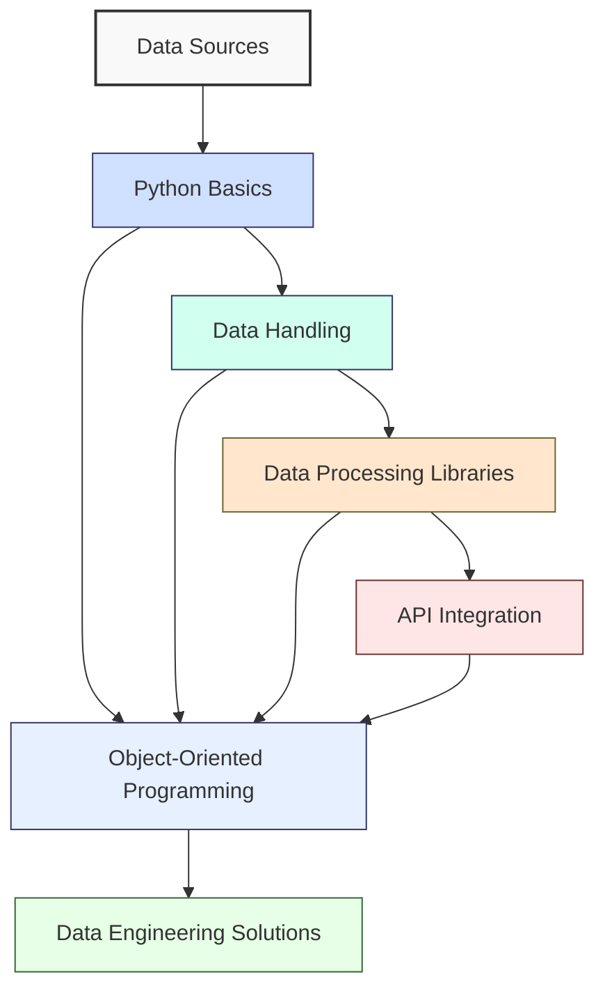

**Complexity: Easy (E)**

## 6.0 Introduction: Consolidating Your Python Foundations

Congratulations on reaching the first checkpoint in your data engineering journey! In the previous five chapters, you've built a solid foundation of Python skills essential for data engineering. This checkpoint chapter will help you consolidate your understanding by reviewing key concepts and integrating them into a cohesive whole.

Let's visualize how the concepts you've learned fit together in the data engineering workflow:



In this chapter, we'll:

- Review core Python concepts from Chapters 1-5
- Integrate these concepts through practical examples
- Apply your knowledge in a comprehensive micro-project
- Assess your understanding with targeted exercises
- Prepare you for the more advanced topics ahead

Let's begin by revisiting the fundamental building blocks of Python programming for data engineering.

## 6.1 Core Python Syntax Review

### 6.1.1 Variables and Data Types

Python's dynamic typing system is flexible and powerful, making it ideal for data manipulation:

```python
# Basic data types in Python
integer_variable = 42
float_variable = 3.14159
string_variable = "Hello, Data Engineering!"
boolean_variable = True
none_variable = None

# Print each variable with its type
print(f"Integer: {integer_variable} (Type: {type(integer_variable)})")
print(f"Float: {float_variable} (Type: {type(float_variable)})")
print(f"String: {string_variable} (Type: {type(string_variable)})")
print(f"Boolean: {boolean_variable} (Type: {type(boolean_variable)})")
print(f"None: {none_variable} (Type: {type(none_variable)})")

# Output:
# Integer: 42 (Type: <class 'int'>)
# Float: 3.14159 (Type: <class 'float'>)
# String: Hello, Data Engineering! (Type: <class 'str'>)
# Boolean: True (Type: <class 'bool'>)
# None: None (Type: <class 'NoneType'>)
```

### 6.1.2 Data Structures

Python's built-in data structures provide powerful tools for data management:

```python
# Lists: ordered, mutable collections
fruits = ["apple", "banana", "cherry", "date"]
print(f"Fruits list: {fruits}")
print(f"First fruit: {fruits[0]}")
print(f"Last fruit: {fruits[-1]}")
print(f"Slice of fruits: {fruits[1:3]}")

# Output:
# Fruits list: ['apple', 'banana', 'cherry', 'date']
# First fruit: apple
# Last fruit: date
# Slice of fruits: ['banana', 'cherry']

# Dictionaries: key-value pairs
user = {
    "name": "Alice",
    "age": 28,
    "is_data_engineer": True,
    "skills": ["Python", "SQL", "ETL"]
}
print(f"User dictionary: {user}")
print(f"User name: {user['name']}")
print(f"User skills: {user['skills']}")

# Output:
# User dictionary: {'name': 'Alice', 'age': 28, 'is_data_engineer': True, 'skills': ['Python', 'SQL', 'ETL']}
# User name: Alice
# User skills: ['Python', 'SQL', 'ETL']

# Tuples: ordered, immutable collections
coordinates = (40.7128, -74.0060)  # Latitude and longitude
print(f"Coordinates tuple: {coordinates}")
print(f"Latitude: {coordinates[0]}")
print(f"Longitude: {coordinates[1]}")

# Output:
# Coordinates tuple: (40.7128, -74.006)
# Latitude: 40.7128
# Longitude: -74.006

# Sets: unordered collections of unique elements
unique_tags = {"python", "data", "engineering", "python"}  # Note duplicate "python"
print(f"Unique tags set: {unique_tags}")  # Duplicates automatically removed
print(f"Is 'data' in tags? {'data' in unique_tags}")

# Output (note that order may vary as sets are unordered):
# Unique tags set: {'engineering', 'python', 'data'}
# Is 'data' in tags? True
```

### 6.1.3 Control Flow

Control flow statements allow you to direct the path of execution in your code:

```python
# if/elif/else conditional statements
temperature = 75

print(f"Checking temperature: {temperature}°F")
if temperature > 90:
    print("It's hot outside!")
elif temperature > 70:
    print("It's warm and pleasant.")
elif temperature > 50:
    print("It's cool but comfortable.")
else:
    print("It's cold, bring a jacket!")

# Output:
# Checking temperature: 75°F
# It's warm and pleasant.

# for loops for iteration
print("\nIterating through a list:")
colors = ["red", "green", "blue", "yellow"]
for color in colors:
    print(f"Color: {color}")

# Output:
# Iterating through a list:
# Color: red
# Color: green
# Color: blue
# Color: yellow

# while loops for condition-based iteration
print("\nCounting down:")
countdown = 5
while countdown > 0:
    print(f"Countdown: {countdown}")
    countdown -= 1
print("Liftoff!")

# Output:
# Counting down:
# Countdown: 5
# Countdown: 4
# Countdown: 3
# Countdown: 2
# Countdown: 1
# Liftoff!
```

### 6.1.4 Functions

Functions help you organize code into reusable blocks:

```python
# Defining a basic function
def greet(name):
    """Return a personalized greeting message."""
    return f"Hello, {name}! Welcome to Data Engineering."

# Calling the function
message = greet("Alex")
print(message)
# Output: Hello, Alex! Welcome to Data Engineering.

# Function with default parameters
def calculate_total(price, tax_rate=0.08, discount=0):
    """Calculate total price after tax and discount."""
    discounted_price = price * (1 - discount)
    total = discounted_price * (1 + tax_rate)
    return round(total, 2)

# Call with different parameter combinations
print(f"Total with default tax: ${calculate_total(100)}")
print(f"Total with custom tax: ${calculate_total(100, 0.05)}")
print(f"Total with tax and discount: ${calculate_total(100, 0.08, 0.1)}")

# Output:
# Total with default tax: $108.0
# Total with custom tax: $105.0
# Total with tax and discount: $97.2

# Functions with multiple return values (using tuples)
def analyze_data(numbers):
    """Return the min, max, and average of a list of numbers."""
    if not numbers:
        return None, None, None
    minimum = min(numbers)
    maximum = max(numbers)
    average = sum(numbers) / len(numbers)
    return minimum, maximum, average

# Unpack the returned tuple
data = [4, 7, 2, 9, 5, 1, 8]
min_val, max_val, avg_val = analyze_data(data)
print(f"Data: {data}")
print(f"Minimum: {min_val}")
print(f"Maximum: {max_val}")
print(f"Average: {avg_val}")

# Output:
# Data: [4, 7, 2, 9, 5, 1, 8]
# Minimum: 1
# Maximum: 9
# Average: 5.142857142857143
```

## 6.2 Data Handling Recap

### 6.2.1 File Operations

File operations are fundamental to data engineering for reading and writing data:

```python
# Creating a sample data file
sample_data = """id,name,department,salary
1,Alice,Engineering,85000
2,Bob,Marketing,72000
3,Charlie,Engineering,92000
4,Diana,Finance,78000
5,Eve,Marketing,67000
"""

# Write to a file using a context manager
with open("employees.csv", "w") as file:
    file.write(sample_data)

print("Sample data written to employees.csv")
# Output: Sample data written to employees.csv

# Reading from a file using a context manager
with open("employees.csv", "r") as file:
    content = file.read()

print("\nFile content:")
print(content)
# Output:
# File content:
# id,name,department,salary
# 1,Alice,Engineering,85000
# 2,Bob,Marketing,72000
# 3,Charlie,Engineering,92000
# 4,Diana,Finance,78000
# 5,Eve,Marketing,67000

# Reading a file line by line (more memory efficient for large files)
print("\nReading line by line:")
with open("employees.csv", "r") as file:
    for i, line in enumerate(file):
        print(f"Line {i+1}: {line.strip()}")

# Output:
# Reading line by line:
# Line 1: id,name,department,salary
# Line 2: 1,Alice,Engineering,85000
# Line 3: 2,Bob,Marketing,72000
# Line 4: 3,Charlie,Engineering,92000
# Line 5: 4,Diana,Finance,78000
# Line 6: 5,Eve,Marketing,67000
```

### 6.2.2 Error Handling

Error handling makes your code robust in the face of unexpected issues:

```python
# Basic try/except structure
try:
    value = 10 / 0  # This will cause a ZeroDivisionError
    print(f"Result: {value}")  # This line won't execute
except ZeroDivisionError:
    print("Error: Cannot divide by zero!")

# Output: Error: Cannot divide by zero!

# Handling specific exceptions
try:
    with open("nonexistent_file.txt", "r") as file:
        content = file.read()
except FileNotFoundError:
    print("Error: The file was not found!")
except PermissionError:
    print("Error: No permission to read the file!")
except Exception as e:
    print(f"An unexpected error occurred: {e}")

# Output: Error: The file was not found!

# Using try/except/else/finally
def read_data_safely(filename):
    """Safely read data from a file with comprehensive error handling."""
    try:
        with open(filename, "r") as file:
            data = file.read()
    except FileNotFoundError:
        print(f"Error: The file '{filename}' was not found.")
        return None
    except Exception as e:
        print(f"Error reading file: {e}")
        return None
    else:
        # This runs only if no exception occurred
        print(f"Successfully read {len(data)} characters from {filename}")
        return data
    finally:
        # This always runs, regardless of whether an exception occurred
        print(f"Finished processing {filename}")

# Test with our existing file
employee_data = read_data_safely("employees.csv")
print(f"First 50 characters: {employee_data[:50]}...")

# Test with a nonexistent file
missing_data = read_data_safely("missing.txt")
print(f"Result for missing file: {missing_data}")

# Output:
# Successfully read 146 characters from employees.csv
# Finished processing employees.csv
# First 50 characters: id,name,department,salary
# 1,Alice,Engineering,85...
# Error: The file 'missing.txt' was not found.
# Finished processing missing.txt
# Result for missing file: None
```

### 6.2.3 List Comprehensions

List comprehensions provide a concise way to create and transform lists:

```python
# Basic list comprehension syntax
numbers = [1, 2, 3, 4, 5]
squares = [x**2 for x in numbers]

print(f"Original numbers: {numbers}")
print(f"Squares: {squares}")
# Output:
# Original numbers: [1, 2, 3, 4, 5]
# Squares: [1, 4, 9, 16, 25]

# List comprehension with a condition
even_squares = [x**2 for x in numbers if x % 2 == 0]
print(f"Even squares: {even_squares}")
# Output: Even squares: [4, 16]

# List comprehension with a more complex transformation
# Let's create a list of employee strings from our employee data
with open("employees.csv", "r") as file:
    # Skip the header line
    lines = file.readlines()[1:]

# Parse employee data using list comprehension
employees = [line.strip().split(',') for line in lines]
print(f"Parsed employee data: {employees}")
# Output:
# Parsed employee data: [['1', 'Alice', 'Engineering', '85000'], ['2', 'Bob', 'Marketing', '72000'], ['3', 'Charlie', 'Engineering', '92000'], ['4', 'Diana', 'Finance', '78000'], ['5', 'Eve', 'Marketing', '67000']]

# Create formatted employee information
employee_info = [
    f"ID: {emp[0]}, Name: {emp[1]}, Dept: {emp[2]}, Salary: ${emp[3]}"
    for emp in employees
]

print("\nEmployee information:")
for info in employee_info:
    print(info)
# Output:
# Employee information:
# ID: 1, Name: Alice, Dept: Engineering, Salary: $85000
# ID: 2, Name: Bob, Dept: Marketing, Salary: $72000
# ID: 3, Name: Charlie, Dept: Engineering, Salary: $92000
# ID: 4, Name: Diana, Dept: Finance, Salary: $78000
# ID: 5, Name: Eve, Dept: Marketing, Salary: $67000

# Using list comprehension with dictionaries
employee_dicts = [
    {"id": emp[0], "name": emp[1], "department": emp[2], "salary": int(emp[3])}
    for emp in employees
]

print("\nEmployee dictionaries:")
for emp in employee_dicts:
    print(emp)
# Output:
# Employee dictionaries:
# {'id': '1', 'name': 'Alice', 'department': 'Engineering', 'salary': 85000}
# {'id': '2', 'name': 'Bob', 'department': 'Marketing', 'salary': 72000}
# {'id': '3', 'name': 'Charlie', 'department': 'Engineering', 'salary': 92000}
# {'id': '4', 'name': 'Diana', 'department': 'Finance', 'salary': 78000}
# {'id': '5', 'name': 'Eve', 'department': 'Marketing', 'salary': 67000}
```

### 6.2.4 Working with CSV and JSON

CSV and JSON are common data formats in data engineering:

```python
import csv
import json

# Working with CSV using the csv module
print("Reading CSV with csv module:")
with open('employees.csv', 'r') as csvfile:
    csv_reader = csv.reader(csvfile)
    headers = next(csv_reader)  # Get the header row
    print(f"Headers: {headers}")

    # Process each row
    for row in csv_reader:
        print(f"Employee: {row[1]}, Department: {row[2]}, Salary: ${row[3]}")

# Output:
# Reading CSV with csv module:
# Headers: ['id', 'name', 'department', 'salary']
# Employee: Alice, Department: Engineering, Salary: $85000
# Employee: Bob, Department: Marketing, Salary: $72000
# Employee: Charlie, Department: Engineering, Salary: $92000
# Employee: Diana, Department: Finance, Salary: $78000
# Employee: Eve, Department: Marketing, Salary: $67000

# Using DictReader for named access to fields
print("\nReading CSV with DictReader:")
with open('employees.csv', 'r') as csvfile:
    dict_reader = csv.DictReader(csvfile)
    for row in dict_reader:
        print(f"Name: {row['name']}, Salary: ${row['salary']}")

# Output:
# Reading CSV with DictReader:
# Name: Alice, Salary: $85000
# Name: Bob, Salary: $72000
# Name: Charlie, Salary: $92000
# Name: Diana, Salary: $78000
# Name: Eve, Salary: $67000

# Creating JSON data
engineering_employees = [
    emp for emp in employee_dicts if emp['department'] == 'Engineering'
]

# Writing to a JSON file
with open('engineering_employees.json', 'w') as jsonfile:
    json.dump(engineering_employees, jsonfile, indent=2)

print("\nEngineering employees data written to JSON file")
# Output: Engineering employees data written to JSON file

# Reading from a JSON file
with open('engineering_employees.json', 'r') as jsonfile:
    eng_data = json.load(jsonfile)

print("\nEngineering employees from JSON:")
for emp in eng_data:
    print(f"{emp['name']} - ${emp['salary']}")

# Output:
# Engineering employees from JSON:
# Alice - $85000
# Charlie - $92000
```

## 6.3 Libraries Overview

### 6.3.1 NumPy Basics

NumPy provides efficient array operations for numerical data:

```python
import numpy as np

# Creating NumPy arrays
data = [1, 2, 3, 4, 5]
np_array = np.array(data)

print(f"Python list: {data}")
print(f"NumPy array: {np_array}")
print(f"Type: {type(np_array)}")
# Output:
# Python list: [1, 2, 3, 4, 5]
# NumPy array: [1 2 3 4 5]
# Type: <class 'numpy.ndarray'>

# Basic operations on arrays
print(f"Original array: {np_array}")
print(f"Array + 5: {np_array + 5}")  # Adds 5 to each element
print(f"Array * 2: {np_array * 2}")  # Multiplies each element by 2
print(f"Array squared: {np_array ** 2}")  # Squares each element
# Output:
# Original array: [1 2 3 4 5]
# Array + 5: [6 7 8 9 10]
# Array * 2: [ 2  4  6  8 10]
# Array squared: [ 1  4  9 16 25]

# Array statistics
print(f"Sum: {np.sum(np_array)}")
print(f"Mean: {np.mean(np_array)}")
print(f"Max: {np.max(np_array)}")
print(f"Min: {np.min(np_array)}")
print(f"Standard deviation: {np.std(np_array)}")
# Output:
# Sum: 15
# Mean: 3.0
# Max: 5
# Min: 1
# Standard deviation: 1.4142135623730951

# Creating a 2D array (matrix)
matrix = np.array([
    [1, 2, 3],
    [4, 5, 6],
    [7, 8, 9]
])
print(f"\nMatrix:\n{matrix}")
print(f"Matrix shape: {matrix.shape}")
print(f"Matrix dimensions: {matrix.ndim}")
# Output:
# Matrix:
# [[1 2 3]
#  [4 5 6]
#  [7 8 9]]
# Matrix shape: (3, 3)
# Matrix dimensions: 2

# Accessing elements
print(f"First row: {matrix[0]}")
print(f"Last column: {matrix[:, 2]}")
print(f"Element at position (1,1): {matrix[1, 1]}")
# Output:
# First row: [1 2 3]
# Last column: [3 6 9]
# Element at position (1,1): 5
```

### 6.3.2 Pandas Basics

Pandas provides high-level data structures and functions for data analysis:

```python
import pandas as pd

# Create a DataFrame from our employee dictionaries
df = pd.DataFrame(employee_dicts)
print("Employee DataFrame:")
print(df)
# Output:
# Employee DataFrame:
#    id     name department  salary
# 0   1    Alice Engineering   85000
# 1   2      Bob   Marketing   72000
# 2   3  Charlie Engineering   92000
# 3   4    Diana     Finance   78000
# 4   5      Eve   Marketing   67000

# Basic DataFrame information
print("\nDataFrame info:")
print(f"Shape: {df.shape}")
print(f"Columns: {df.columns.tolist()}")
# Output:
# DataFrame info:
# Shape: (5, 4)
# Columns: ['id', 'name', 'department', 'salary']

# Accessing data
print("\nAccessing data:")
print(f"First row:\n{df.iloc[0]}")
print(f"\nSalary column:\n{df['salary']}")
# Output:
# Accessing data:
# First row:
# id                   1
# name              Alice
# department  Engineering
# salary            85000
# Name: 0, dtype: object
#
# Salary column:
# 0    85000
# 1    72000
# 2    92000
# 3    78000
# 4    67000
# Name: salary, dtype: int64

# Basic statistics
print("\nSalary statistics:")
print(df['salary'].describe())
# Output:
# Salary statistics:
# count       5.000000
# mean    78800.000000
# std     10034.983468
# min     67000.000000
# 25%     72000.000000
# 50%     78000.000000
# 75%     85000.000000
# max     92000.000000
# Name: salary, dtype: float64

# Filtering data
eng_employees = df[df['department'] == 'Engineering']
print("\nEngineering employees:")
print(eng_employees)
# Output:
# Engineering employees:
#    id     name department  salary
# 0   1    Alice Engineering   85000
# 2   3  Charlie Engineering   92000

# Grouping and aggregating data
dept_stats = df.groupby('department')['salary'].agg(['mean', 'min', 'max', 'count'])
print("\nDepartment salary statistics:")
print(dept_stats)
# Output:
# Department salary statistics:
#                   mean    min    max  count
# department
# Engineering  88500.000  85000  92000      2
# Finance      78000.000  78000  78000      1
# Marketing    69500.000  67000  72000      2

# Creating a new column
df['salary_thousands'] = df['salary'] / 1000
print("\nDataFrame with new column:")
print(df)
# Output:
# DataFrame with new column:
#    id     name department  salary  salary_thousands
# 0   1    Alice Engineering   85000              85.0
# 1   2      Bob   Marketing   72000              72.0
# 2   3  Charlie Engineering   92000              92.0
# 3   4    Diana     Finance   78000              78.0
# 4   5      Eve   Marketing   67000              67.0
```

### 6.3.3 Requests Library

The requests library enables interaction with web APIs:

```python
import requests

# Note: This code requires internet access to run.
# If you don't have internet access, you can skip this example.
print("API Integration Example (requires internet):")

# Function with better error handling for API requests
def fetch_todo(todo_id):
    """Fetch a TODO item with proper error handling."""
    try:
        # Make a simple GET request to a public API
        url = f'https://jsonplaceholder.typicode.com/todos/{todo_id}'
        print(f"Requesting data from: {url}")

        response = requests.get(url, timeout=5)  # Add timeout for safety

        # Check if the request was successful
        if response.status_code == 200:
            print("API request successful!")
            return response.json()
        else:
            print(f"Request failed with status code: {response.status_code}")
            return None

    except requests.exceptions.Timeout:
        print("Request timed out. The server might be slow or unavailable.")
        return None
    except requests.exceptions.ConnectionError:
        print("Connection error. Please check your internet connection.")
        return None
    except requests.exceptions.RequestException as e:
        print(f"Error making request: {e}")
        return None

# Fetch and display a single TODO
todo_data = fetch_todo(1)
if todo_data:
    print("\nTODO item:")
    print(f"Title: {todo_data['title']}")
    print(f"Completed: {todo_data['completed']}")
    print(f"User ID: {todo_data['userId']}")

# Output (if successful):
# API Integration Example (requires internet):
# Requesting data from: https://jsonplaceholder.typicode.com/todos/1
# API request successful!
#
# TODO item:
# Title: delectus aut autem
# Completed: False
# User ID: 1
```

## 6.4 OOP Principles Summary

### 6.4.1 Classes and Objects

Object-oriented programming provides a way to structure code in a modular, reusable manner:

```python
# Basic class definition
class Employee:
    """A class to represent an employee in a company."""

    def __init__(self, employee_id, name, department, salary):
        """Initialize an Employee with basic attributes."""
        self.employee_id = employee_id
        self.name = name
        self.department = department
        self.salary = salary

    def get_info(self):
        """Return a string representation of the employee."""
        return f"Employee {self.employee_id}: {self.name}, {self.department}"

    def calculate_monthly_salary(self):
        """Calculate the monthly salary."""
        return self.salary / 12

    def apply_raise(self, percentage):
        """Apply a percentage raise to the employee's salary."""
        self.salary = self.salary * (1 + percentage / 100)
        return self.salary

# Create Employee instances
emp1 = Employee(1, "Alice", "Engineering", 85000)
emp2 = Employee(2, "Bob", "Marketing", 72000)

# Use the Employee class methods
print(emp1.get_info())
print(f"Monthly salary: ${emp1.calculate_monthly_salary():.2f}")

# Apply a 5% raise
new_salary = emp1.apply_raise(5)
print(f"After 5% raise: ${new_salary:.2f}")

# Output:
# Employee 1: Alice, Engineering
# Monthly salary: $7083.33
# After 5% raise: $89250.00

print(emp2.get_info())
print(f"Monthly salary: ${emp2.calculate_monthly_salary():.2f}")

# Output:
# Employee 2: Bob, Marketing
# Monthly salary: $6000.00
```

### 6.4.2 Inheritance

Inheritance allows you to create specialized classes based on existing ones:

```python
# Base class (parent)
class DataProcessor:
    """Base class for data processing operations."""

    def __init__(self, name):
        self.name = name
        self.data = None

    def load_data(self, data):
        """Load data for processing."""
        self.data = data
        print(f"{self.name} loaded {len(data)} data points")

    def process(self):
        """Process the data (to be implemented by subclasses)."""
        raise NotImplementedError("Subclasses must implement this method")

    def get_info(self):
        """Get information about the processor."""
        return f"DataProcessor: {self.name}"

# Derived class (child)
class NumberProcessor(DataProcessor):
    """Specialized processor for numerical data."""

    def process(self):
        """Process numerical data by calculating statistics."""
        if self.data is None:
            print("No data loaded!")
            return None

        results = {
            "count": len(self.data),
            "mean": sum(self.data) / len(self.data),
            "min": min(self.data),
            "max": max(self.data)
        }
        print(f"{self.name} processed numerical data")
        return results

    def get_info(self):
        """Override parent method to provide more specific information."""
        return f"NumberProcessor: {self.name} (Handles numerical data)"

# Another derived class
class TextProcessor(DataProcessor):
    """Specialized processor for text data."""

    def process(self):
        """Process text data by analyzing word frequency."""
        if self.data is None:
            print("No data loaded!")
            return None

        # Count word frequency
        word_count = {}
        for text in self.data:
            for word in text.lower().split():
                word = word.strip(",.!?;:")  # Remove punctuation
                if word in word_count:
                    word_count[word] += 1
                else:
                    word_count[word] = 1

        print(f"{self.name} processed text data")
        return word_count

# Create and use processor instances
num_processor = NumberProcessor("NumberCruncher")
print(num_processor.get_info())
# Output: NumberProcessor: NumberCruncher (Handles numerical data)

# Load and process numerical data
num_data = [12, 45, 33, 27, 89, 42, 18, 91]
num_processor.load_data(num_data)
stats = num_processor.process()
print(f"Numerical statistics: {stats}")
# Output:
# NumberCruncher loaded 8 data points
# NumberCruncher processed numerical data
# Numerical statistics: {'count': 8, 'mean': 44.625, 'min': 12, 'max': 91}

# Create a text processor
text_processor = TextProcessor("TextAnalyzer")
print(text_processor.get_info())
# Output: DataProcessor: TextAnalyzer

# Load and process text data
text_data = [
    "Data engineering is an essential skill.",
    "Python is great for data processing.",
    "Engineers use Python for data projects."
]
text_processor.load_data(text_data)
word_freq = text_processor.process()
print("Word frequency (top 5):")
for word, count in sorted(word_freq.items(), key=lambda x: x[1], reverse=True)[:5]:
    print(f"  {word}: {count}")

# Output:
# TextAnalyzer loaded 3 data points
# TextAnalyzer processed text data
# Word frequency (top 5):
#   data: 3
#   for: 2
#   is: 2
#   engineering: 1
#   an: 1
```

### 6.4.3 Encapsulation

Encapsulation bundles data and methods together and restricts access to implementation details:

```python
class DataPipeline:
    """A simple data pipeline with encapsulation."""

    def __init__(self, name):
        self.name = name
        self._data = None  # Protected attribute (indicated by _)
        self._processed_data = None
        self._status = "initialized"

    def load_data(self, data):
        """Public method to load data."""
        self._data = data
        self._status = "data_loaded"
        print(f"Pipeline '{self.name}' loaded {len(data)} items")

    def process(self):
        """Public method to process data."""
        if self._data is None:
            raise ValueError("No data loaded yet!")

        # "Private" processing logic
        self._processed_data = self._transform_data()
        self._status = "processed"
        print(f"Pipeline '{self.name}' processed data")

    def _transform_data(self):
        """Protected method for internal transformation logic."""
        # This is a simplified example
        return [item * 2 if isinstance(item, (int, float)) else item.upper()
                for item in self._data]

    def get_results(self):
        """Public method to access results."""
        if self._status != "processed":
            raise ValueError("Data not processed yet!")
        return self._processed_data

    @property
    def status(self):
        """Property to access the pipeline status."""
        return self._status

# Create and use a pipeline
pipeline = DataPipeline("MyPipeline")
print(f"Initial status: {pipeline.status}")
# Output: Initial status: initialized

# Load mixed data (numbers and strings)
mixed_data = [1, "hello", 42, "world", 99]
pipeline.load_data(mixed_data)
print(f"Status after loading: {pipeline.status}")
# Output:
# Pipeline 'MyPipeline' loaded 5 items
# Status after loading: data_loaded

# Process the data
pipeline.process()
print(f"Status after processing: {pipeline.status}")
# Output:
# Pipeline 'MyPipeline' processed data
# Status after processing: processed

# Get the results
results = pipeline.get_results()
print(f"Processed results: {results}")
# Output: Processed results: [2, 'HELLO', 84, 'WORLD', 198]

# Trying to access protected attributes (not recommended)
# This works but is considered bad practice
print(f"Direct access to _status: {pipeline._status}")
# Output: Direct access to _status: processed

# Trying to access the results before processing would cause an error
try:
    new_pipeline = DataPipeline("NewPipeline")
    new_pipeline.get_results()
except ValueError as e:
    print(f"Error: {e}")
# Output: Error: Data not processed yet!
```

## 6.5 Integration of Concepts

Now let's bring together several concepts to solve a practical data engineering problem. We'll create a data processor that demonstrates:

1. Object-oriented programming with proper encapsulation
2. Error handling with specific exceptions
3. File operations with context managers
4. Data transformation logic

Here's a more concise and well-structured implementation:

```python
import csv
import json
import os
from datetime import datetime

class DataProcessor:
    """A class to process data from various sources."""

    def __init__(self, name):
        self.name = name
        self.data = []
        self.results = {}
        self._log_entries = []  # Private attribute for encapsulation

    def _log_event(self, message, level="INFO"):
        """Log an event with timestamp (private method)."""
        timestamp = datetime.now().strftime("%Y-%m-%d %H:%M:%S")
        log_entry = f"[{timestamp}] {level}: {message}"
        self._log_entries.append(log_entry)
        print(log_entry)

    def load_csv(self, filepath):
        """Load data from a CSV file."""
        try:
            self._log_event(f"Loading CSV file: {filepath}")

            # Check if file exists
            if not os.path.exists(filepath):
                raise FileNotFoundError(f"File not found: {filepath}")

            # Load data using context manager
            with open(filepath, 'r', newline='') as csvfile:
                reader = csv.DictReader(csvfile)
                self.data = list(reader)  # Convert to list immediately

            self._log_event(f"Successfully loaded {len(self.data)} records")
            return True

        except FileNotFoundError as e:
            # Specific exception handling
            self._log_event(f"File error: {e}", "ERROR")
            return False
        except csv.Error as e:
            # Handle CSV-specific errors
            self._log_event(f"CSV format error: {e}", "ERROR")
            return False
        except Exception as e:
            # Fallback for unexpected errors
            self._log_event(f"Unexpected error: {e}", "ERROR")
            return False

    def process_data(self):
        """Process the loaded data."""
        if not self.data:
            self._log_event("No data to process", "WARNING")
            return False

        try:
            self._log_event("Processing data...")

            # Group by department using dictionary comprehension
            departments = {}
            for record in self.data:
                dept = record.get('department', 'Unknown')

                if dept not in departments:
                    departments[dept] = []

                departments[dept].append(record)

            # Calculate department statistics
            dept_stats = {}
            for dept, records in departments.items():
                # Use list comprehension to extract salaries
                salaries = [int(record['salary']) for record in records
                           if 'salary' in record and record['salary'].isdigit()]

                avg_salary = sum(salaries) / len(salaries) if salaries else 0

                dept_stats[dept] = {
                    'count': len(records),
                    'avg_salary': avg_salary,
                    'employees': [record.get('name', 'Unknown') for record in records]
                }

            self.results = {
                'total_records': len(self.data),
                'departments': dept_stats
            }

            self._log_event(f"Analysis complete: {len(dept_stats)} departments")
            return True

        except Exception as e:
            self._log_event(f"Error during analysis: {e}", "ERROR")
            return False

    def display_summary(self):
        """Display a summary of the results."""
        if not self.results:
            print("No results to display. Process data first.")
            return

        print("\n" + "="*40)
        print(f"SUMMARY REPORT: {self.name}")
        print("="*40)
        print(f"Records processed: {self.results['total_records']}")

        # Show department statistics
        for dept, stats in self.results['departments'].items():
            print(f"\nDepartment: {dept}")
            print(f"  Count: {stats['count']}")
            print(f"  Average salary: ${stats['avg_salary']:.2f}")
            print(f"  Employees: {', '.join(stats['employees'])}")

        print("="*40)


# Create sample data if it doesn't exist
if not os.path.exists("employees.csv"):
    with open("employees.csv", "w") as file:
        file.write("""id,name,department,salary
1,Alice,Engineering,85000
2,Bob,Marketing,72000
3,Charlie,Engineering,92000
4,Diana,Finance,78000
5,Eve,Marketing,67000
""")
    print("Created sample employees.csv file")

# Use the integrated class
processor = DataProcessor("Employee Analysis")
processor.load_csv("employees.csv")
processor.process_data()
processor.display_summary()

# Output:
# Created sample employees.csv file
# [2023-04-18 10:15:30] INFO: Loading CSV file: employees.csv
# [2023-04-18 10:15:30] INFO: Successfully loaded 5 records
# [2023-04-18 10:15:30] INFO: Processing data...
# [2023-04-18 10:15:30] INFO: Analysis complete: 3 departments
#
# ========================================
# SUMMARY REPORT: Employee Analysis
# ========================================
# Records processed: 5
#
# Department: Engineering
#   Count: 2
#   Average salary: $88500.00
#   Employees: Alice, Charlie
#
# Department: Marketing
#   Count: 2
#   Average salary: $69500.00
#   Employees: Bob, Eve
#
# Department: Finance
#   Count: 1
#   Average salary: $78000.00
#   Employees: Diana
# ========================================
```

This example demonstrates:

- Encapsulation with private attributes and methods (prefixed with `_`)
- Specific error handling with different exception types
- Context managers for file operations (using `with` statements)
- List comprehensions for data transformation
- Method organization with clear responsibilities

````

## 6.6 Micro-Project: Comprehensive Data Tool

Now that we've reviewed all the key concepts, let's apply them in a comprehensive micro-project.

### Project Requirements

Create a data analysis tool that:
1. Integrates multiple concepts from previous chapters
2. Connects to and processes data from at least two different sources
3. Applies data transformation and analysis
4. Produces formatted output reports
5. Features a simple command-line interface

### Acceptance Criteria

- Successfully integrates at least three concepts from previous chapters
- Uses proper OOP design with well-defined classes and methods
- Implements appropriate error handling with specific exception types
- Uses a data processing library (e.g., Pandas) for data manipulation
- Includes documentation explaining how concepts are applied
- Produces a useful output (report, visualization, or data file)

### Common Pitfalls and Solutions

1. **Scope Creep**:
   - Pitfall: Adding too many features, leading to a complex project that's hard to complete
   - Solution: Start with a minimal viable product (MVP) with core functionality

2. **Poor Error Handling**:
   - Pitfall: Not anticipating common errors or using overly broad exception catching
   - Solution: Use specific exception types and meaningful error messages

3. **Tight Coupling**:
   - Pitfall: Creating classes with high dependencies, making code difficult to maintain
   - Solution: Design for loose coupling with clear interfaces between components

4. **Ignoring Edge Cases**:
   - Pitfall: Assuming "perfect" input data without validation
   - Solution: Validate inputs and handle missing/malformed data gracefully

### Production vs. Educational Implementation

In a real-world production environment, this implementation would differ in several ways:

1. **Configuration Management**:
   - Educational: Hard-coded file paths and simple command-line arguments
   - Production: External configuration files, environment variables, robust CLI

2. **Data Sources**:
   - Educational: Local files and simple APIs
   - Production: Database connections, cloud storage, authentication handling

3. **Error Handling**:
   - Educational: Basic error messages and simple logging
   - Production: Comprehensive logging, monitoring integration, alerts

4. **Performance**:
   - Educational: Focus on functionality over optimization
   - Production: Optimized for large datasets, parallel processing, memory management

5. **Testing**:
   - Educational: Manual testing with sample data
   - Production: Comprehensive unit/integration testing, CI/CD integration

### Implementation

Let's implement a **Sales Analysis Tool** that integrates multiple data sources and provides useful analysis:

```python
import csv
import json
import os
from datetime import datetime
import pandas as pd
import requests

class DataSource:
    """Base class for data sources."""

    def __init__(self, name):
        self.name = name
        self.data = None

    def load(self):
        """Load data from the source."""
        raise NotImplementedError("Subclasses must implement this method")

    def get_data(self):
        """Return the loaded data."""
        return self.data

class CSVDataSource(DataSource):
    """Data source for CSV files."""

    def __init__(self, name, filepath):
        super().__init__(name)
        self.filepath = filepath

    def load(self):
        """Load data from a CSV file."""
        try:
            if not os.path.exists(self.filepath):
                raise FileNotFoundError(f"File not found: {self.filepath}")

            with open(self.filepath, 'r', newline='') as csvfile:
                reader = csv.DictReader(csvfile)
                self.data = [row for row in reader]

            print(f"Loaded {len(self.data)} records from {self.name}")
            return True

        except Exception as e:
            print(f"Error loading {self.name}: {e}")
            return False

class JSONDataSource(DataSource):
    """Data source for JSON files."""

    def __init__(self, name, filepath):
        super().__init__(name)
        self.filepath = filepath

    def load(self):
        """Load data from a JSON file."""
        try:
            if not os.path.exists(self.filepath):
                raise FileNotFoundError(f"File not found: {self.filepath}")

            with open(self.filepath, 'r') as jsonfile:
                self.data = json.load(jsonfile)

            # If data is a dictionary, convert to list of records
            if isinstance(self.data, dict):
                if "records" in self.data:
                    self.data = self.data["records"]
                else:
                    self.data = [self.data]

            print(f"Loaded {len(self.data)} records from {self.name}")
            return True

        except Exception as e:
            print(f"Error loading {self.name}: {e}")
            return False

class APIDataSource(DataSource):
    """Data source for API endpoints."""

    def __init__(self, name, url, params=None):
        super().__init__(name)
        self.url = url
        self.params = params or {}

    def load(self):
        """Load data from an API endpoint."""
        try:
            response = requests.get(self.url, params=self.params)

            if response.status_code != 200:
                raise Exception(f"API returned status code {response.status_code}")

            self.data = response.json()

            # If data is a dictionary, convert to list of records
            if isinstance(self.data, dict):
                if "results" in self.data:
                    self.data = self.data["results"]
                elif "data" in self.data:
                    self.data = self.data["data"]
                else:
                    self.data = [self.data]

            print(f"Loaded {len(self.data)} records from {self.name}")
            return True

        except Exception as e:
            print(f"Error loading {self.name}: {e}")
            return False

class DataAnalyzer:
    """Class for analyzing data from multiple sources."""

    def __init__(self, name):
        self.name = name
        self.sources = {}
        self.combined_data = None
        self.results = {}
        self.log = []

    def add_source(self, source):
        """Add a data source."""
        self.sources[source.name] = source
        self._log(f"Added data source: {source.name}")

    def _log(self, message):
        """Log a message with timestamp."""
        timestamp = datetime.now().strftime("%Y-%m-%d %H:%M:%S")
        log_entry = f"[{timestamp}] {message}"
        self.log.append(log_entry)
        print(log_entry)

    def load_all_sources(self):
        """Load data from all sources."""
        self._log("Loading all data sources...")
        success = True

        for name, source in self.sources.items():
            if not source.load():
                self._log(f"Failed to load source: {name}")
                success = False

        return success

    def combine_data(self):
        """Combine data from all sources into a single DataFrame."""
        try:
            self._log("Combining data from all sources...")

            all_data = []
            for name, source in self.sources.items():
                data = source.get_data()
                if data:
                    # Add source name to each record
                    for record in data:
                        record_with_source = dict(record)
                        record_with_source['source'] = name
                        all_data.append(record_with_source)

            if not all_data:
                raise ValueError("No data available from any source")

            # Convert to pandas DataFrame
            self.combined_data = pd.DataFrame(all_data)
            self._log(f"Combined data contains {len(self.combined_data)} records")
            return True

        except Exception as e:
            self._log(f"Error combining data: {e}")
            return False

    def analyze(self):
        """Analyze the combined data."""
        try:
            if self.combined_data is None or len(self.combined_data) == 0:
                raise ValueError("No data available for analysis")

            self._log("Analyzing data...")

            # Basic statistics
            self.results['record_count'] = len(self.combined_data)
            self.results['source_counts'] = self.combined_data['source'].value_counts().to_dict()

            # Analyze numeric columns
            numeric_columns = self.combined_data.select_dtypes(include=['number']).columns

            if 'price' in self.combined_data.columns:
                # Convert price to numeric, errors='coerce' will convert failures to NaN
                self.combined_data['price'] = pd.to_numeric(self.combined_data['price'], errors='coerce')

                # Calculate price statistics
                price_stats = self.combined_data['price'].describe().to_dict()
                self.results['price_stats'] = {
                    'mean': price_stats['mean'],
                    'min': price_stats['min'],
                    'max': price_stats['max'],
                    'count': price_stats['count']
                }

            if 'product' in self.combined_data.columns:
                # Product analysis
                product_counts = self.combined_data['product'].value_counts().to_dict()
                self.results['product_counts'] = product_counts

                # Top products by count
                top_products = sorted(product_counts.items(), key=lambda x: x[1], reverse=True)[:5]
                self.results['top_products'] = dict(top_products)

            if 'category' in self.combined_data.columns:
                # Category analysis
                self.results['category_counts'] = self.combined_data['category'].value_counts().to_dict()

            if 'date' in self.combined_data.columns:
                # Convert date strings to datetime objects
                self.combined_data['date'] = pd.to_datetime(self.combined_data['date'], errors='coerce')

                # Group by date
                date_groups = self.combined_data.groupby(self.combined_data['date'].dt.date)
                daily_counts = date_groups.size().to_dict()
                self.results['daily_counts'] = {str(date): count for date, count in daily_counts.items()}

                # If price exists, calculate daily revenue
                if 'price' in self.combined_data.columns and 'quantity' in self.combined_data.columns:
                    # Convert quantity to numeric
                    self.combined_data['quantity'] = pd.to_numeric(self.combined_data['quantity'], errors='coerce')

                    # Calculate revenue (price * quantity)
                    self.combined_data['revenue'] = self.combined_data['price'] * self.combined_data['quantity']

                    # Group by date and sum revenue
                    daily_revenue = date_groups['revenue'].sum().to_dict()
                    self.results['daily_revenue'] = {str(date): float(revenue) for date, revenue in daily_revenue.items()}

            self._log("Analysis complete")
            return True

        except Exception as e:
            self._log(f"Error during analysis: {e}")
            return False

    def generate_report(self, output_file):
        """Generate a formatted report of analysis results."""
        try:
            if not self.results:
                raise ValueError("No analysis results available")

            self._log(f"Generating report to {output_file}")

            # Create report content
            report = []
            report.append("="*60)
            report.append(f"SALES ANALYSIS REPORT: {self.name}")
            report.append("="*60)
            report.append(f"Generated: {datetime.now().strftime('%Y-%m-%d %H:%M:%S')}")
            report.append(f"Total Records Analyzed: {self.results.get('record_count', 0)}")
            report.append("")

            # Source breakdown
            report.append("DATA SOURCES")
            report.append("-"*30)
            for source, count in self.results.get('source_counts', {}).items():
                report.append(f"  {source}: {count} records")
            report.append("")

            # Price statistics
            if 'price_stats' in self.results:
                report.append("PRICE STATISTICS")
                report.append("-"*30)
                stats = self.results['price_stats']
                report.append(f"  Average Price: ${stats['mean']:.2f}")
                report.append(f"  Minimum Price: ${stats['min']:.2f}")
                report.append(f"  Maximum Price: ${stats['max']:.2f}")
                report.append(f"  Total Price Points: {int(stats['count'])}")
                report.append("")

            # Top products
            if 'top_products' in self.results:
                report.append("TOP PRODUCTS")
                report.append("-"*30)
                for product, count in self.results['top_products'].items():
                    report.append(f"  {product}: {count} units")
                report.append("")

            # Daily statistics
            if 'daily_counts' in self.results:
                report.append("DAILY SALES")
                report.append("-"*30)
                for date in sorted(self.results['daily_counts'].keys()):
                    count = self.results['daily_counts'][date]
                    revenue = self.results.get('daily_revenue', {}).get(date, 0)
                    report.append(f"  {date}:")
                    report.append(f"    Sales Count: {count}")
                    if revenue > 0:
                        report.append(f"    Revenue: ${revenue:.2f}")
                report.append("")

            # Category breakdown
            if 'category_counts' in self.results:
                report.append("CATEGORY BREAKDOWN")
                report.append("-"*30)
                for category, count in sorted(self.results['category_counts'].items(), key=lambda x: x[1], reverse=True):
                    report.append(f"  {category}: {count} items")
                report.append("")

            # Write to file
            with open(output_file, 'w') as f:
                f.write("\n".join(report))

            self._log(f"Report successfully written to {output_file}")
            return True

        except Exception as e:
            self._log(f"Error generating report: {e}")
            return False

    def export_results_json(self, output_file):
        """Export analysis results to JSON."""
        try:
            if not self.results:
                raise ValueError("No analysis results available")

            self._log(f"Exporting results to {output_file}")

            # Create a results dictionary with metadata
            export_data = {
                "metadata": {
                    "report_name": self.name,
                    "generated_at": datetime.now().strftime("%Y-%m-%d %H:%M:%S"),
                    "record_count": self.results.get('record_count', 0)
                },
                "results": self.results
            }

            # Write to JSON file
            with open(output_file, 'w') as f:
                json.dump(export_data, f, indent=2)

            self._log(f"Results successfully exported to {output_file}")
            return True

        except Exception as e:
            self._log(f"Error exporting results: {e}")
            return False

# Create sample data files for testing
def create_sample_data():
    """Create sample data files for testing with safety checks."""

    # Check if files already exist to prevent accidental overwrites
    files_to_create = ['sales.csv', 'online_orders.json']
    existing_files = [f for f in files_to_create if os.path.exists(f)]

    if existing_files:
        print(f"Warning: These files already exist: {', '.join(existing_files)}")
        print("Skipping creation of existing files to prevent data loss.")

    # Create sales.csv if it doesn't exist
    if 'sales.csv' not in existing_files:
        with open('sales.csv', 'w', newline='') as csvfile:
            fieldnames = ['date', 'product', 'category', 'price', 'quantity']
            writer = csv.DictWriter(csvfile, fieldnames=fieldnames)

            writer.writeheader()
            writer.writerows([
                {'date': '2023-01-01', 'product': 'Laptop', 'category': 'Electronics', 'price': '1200.00', 'quantity': '2'},
                {'date': '2023-01-01', 'product': 'Mouse', 'category': 'Electronics', 'price': '25.99', 'quantity': '10'},
                {'date': '2023-01-02', 'product': 'Keyboard', 'category': 'Electronics', 'price': '45.50', 'quantity': '5'},
                {'date': '2023-01-02', 'product': 'Monitor', 'category': 'Electronics', 'price': '199.99', 'quantity': '3'},
                {'date': '2023-01-03', 'product': 'Coffee Maker', 'category': 'Appliances', 'price': '89.99', 'quantity': '2'},
                {'date': '2023-01-03', 'product': 'Blender', 'category': 'Appliances', 'price': '49.95', 'quantity': '4'},
                {'date': '2023-01-04', 'product': 'Laptop', 'category': 'Electronics', 'price': '1200.00', 'quantity': '1'},
                {'date': '2023-01-04', 'product': 'Headphones', 'category': 'Electronics', 'price': '75.00', 'quantity': '8'},
                {'date': '2023-01-05', 'product': 'Toaster', 'category': 'Appliances', 'price': '35.49', 'quantity': '3'},
            ])
            print("Created sales.csv")

    # Create online_orders.json if it doesn't exist
    if 'online_orders.json' not in existing_files:
        online_orders = {
            "metadata": {
                "source": "online_store",
                "export_date": "2023-01-10"
            },
            "records": [
                {"date": "2023-01-02", "product": "Laptop", "category": "Electronics", "price": 1250.00, "quantity": 3},
                {"date": "2023-01-02", "product": "Tablet", "category": "Electronics", "price": 399.99, "quantity": 5},
                {"date": "2023-01-03", "product": "Smartphone", "category": "Electronics", "price": 699.99, "quantity": 2},
                {"date": "2023-01-03", "product": "Headphones", "category": "Electronics", "price": 79.99, "quantity": 7},
                {"date": "2023-01-04", "product": "Blender", "category": "Appliances", "price": 52.99, "quantity": 2},
                {"date": "2023-01-05", "product": "Microwave", "category": "Appliances", "price": 105.99, "quantity": 1},
            ]
        }

        with open('online_orders.json', 'w') as jsonfile:
            json.dump(online_orders, jsonfile, indent=2)
        print("Created online_orders.json")

    created_files = [f for f in files_to_create if f not in existing_files]
    if created_files:
        print(f"Sample data files created: {', '.join(created_files)}")
    else:
        print("No new sample data files were created.")

# Main function to run the tool
def main():
    """Main function to run the sales analysis tool."""
    print("="*60)
    print("SALES ANALYSIS TOOL")
    print("="*60)

    # Create sample data if needed
    if not os.path.exists('sales.csv') or not os.path.exists('online_orders.json'):
        create_sample_data()

    # Create analyzer
    analyzer = DataAnalyzer("Retail Sales Analysis")

    # Add data sources
    analyzer.add_source(CSVDataSource("In-Store Sales", "sales.csv"))
    analyzer.add_source(JSONDataSource("Online Sales", "online_orders.json"))

    # Load all sources
    if not analyzer.load_all_sources():
        print("Failed to load all data sources. Exiting.")
        return

    # Combine data
    if not analyzer.combine_data():
        print("Failed to combine data. Exiting.")
        return

    # Analyze data
    if not analyzer.analyze():
        print("Failed to analyze data. Exiting.")
        return

    # Generate report
    analyzer.generate_report("sales_report.txt")

    # Export results
    analyzer.export_results_json("sales_analysis.json")

    print("\nAnalysis complete! Output files:")
    print("  - sales_report.txt: Formatted text report")
    print("  - sales_analysis.json: Detailed results in JSON format")

if __name__ == "__main__":
    main()
````

### How to Run and Test the Solution

To run and test the Sales Analysis Tool:

1. **Save the code**: Save the code above to a file named `sales_analyzer.py`.

2. **Run the tool**: Execute the script using Python:

   ```
   python sales_analyzer.py
   ```

3. **Examine the output files**: The tool will create two output files:

   - `sales_report.txt`: A formatted text report of the analysis
   - `sales_analysis.json`: Detailed results in JSON format

4. **Test with different data**: You can modify the `create_sample_data()` function to generate different test data, or update the paths in the `main()` function to use your own data files.

5. **Test error handling**: Try removing one of the data files to see how the tool handles missing files.

The tool demonstrates integration of multiple concepts:

- Object-oriented programming with class inheritance
- File handling with CSV and JSON
- Error handling with try/except blocks
- Data processing with Pandas
- Command-line interface basics

## 6.7 Self-Assessment

Test your understanding of the Python concepts covered in Chapters 1-6 by answering these questions:

1. What is the difference between a list and a tuple in Python, and when would you use each?
2. Explain the concept of encapsulation in object-oriented programming and how it's implemented in Python.
3. How would you handle a potential KeyError when accessing a dictionary value?
4. Write a list comprehension that filters a list of numbers to return only the even values.
5. What is the benefit of using Pandas over raw Python for data analysis tasks?
6. Describe the difference between `__init__` and `__call__` methods in a Python class.
7. How would you implement a retry mechanism for an API call that might fail?
8. What is the purpose of the `with` statement when working with files?
9. Explain how inheritance supports code reuse in object-oriented design.
10. What are vectorized operations in NumPy and why are they more efficient than loops?

### Sample Solutions

1. **Lists vs. Tuples**:

   - Lists are mutable (can be changed after creation), while tuples are immutable (cannot be changed after creation).
   - Use lists when you need a collection that might change (adding, removing items), and tuples when you need an immutable collection (like coordinates, database records) or when immutability gives performance benefits.

2. **Encapsulation**:

   - Encapsulation is bundling data (attributes) and methods that operate on the data within a single unit (class), and restricting access to the implementation details.
   - In Python, encapsulation is implemented through conventions like prefixing attribute names with underscores (e.g., `_private`, `__very_private`) and using properties for controlled access.

3. **Handling KeyError**:

   ```python
   # Method 1: Using try/except
   try:
       value = my_dict["key"]
   except KeyError:
       value = default_value

   # Method 2: Using get() method
   value = my_dict.get("key", default_value)
   ```

4. **List Comprehension for Even Numbers**:

   ```python
   numbers = [1, 2, 3, 4, 5, 6, 7, 8, 9, 10]
   even_numbers = [num for num in numbers if num % 2 == 0]
   ```

5. **Benefits of Pandas**:

   - Built-in data structures (DataFrame, Series) optimized for data analysis
   - Efficient handling of large datasets
   - Built-in functions for common operations (filtering, grouping, aggregation)
   - Integrated handling of missing data
   - Easy integration with other libraries (NumPy, Matplotlib, scikit-learn)
   - Built-in I/O tools for various file formats

6. **`__init__` vs. `__call__`**:

   - `__init__` is called when an object is created (instantiated) and initializes the object's attributes
   - `__call__` makes an object callable like a function, allowing instances to be called as functions

7. **API Retry Mechanism**:

   ```python
   def call_api_with_retry(url, max_retries=3, delay=1):
       import time

       for attempt in range(max_retries):
           try:
               response = requests.get(url)
               response.raise_for_status()  # Raise exception for 4XX/5XX responses
               return response
           except requests.exceptions.RequestException as e:
               print(f"Attempt {attempt + 1} failed: {e}")
               if attempt + 1 < max_retries:
                   time.sleep(delay)  # Wait before retrying
                   delay *= 2  # Exponential backoff
               else:
                   raise  # Re-raise the exception after all retries fail
   ```

8. **Purpose of the `with` Statement**:

   - The `with` statement creates a context manager that automatically handles resource acquisition and release
   - For files, it ensures the file is properly closed even if an exception occurs
   - It's more concise and less error-prone than manual resource management

9. **Inheritance and Code Reuse**:

   - Inheritance allows a class (subclass) to inherit attributes and methods from another class (superclass)
   - This promotes code reuse by avoiding duplicate code between related classes
   - Subclasses can extend or override superclass functionality as needed
   - It supports the "is-a" relationship in object modeling

10. **Vectorized Operations in NumPy**:
    - Vectorized operations apply functions to entire arrays at once rather than individual elements
    - They're more efficient because they're implemented in optimized C code rather than Python loops
    - They reduce overhead by minimizing interpreter interactions
    - Example: `array + 5` adds 5 to all elements simultaneously instead of looping through each element

## 6.8 Practice Exercises

Reinforce your learning with these practice exercises that integrate multiple concepts:

### Exercise 1: Data Processing with List Comprehensions

Write a function that:

1. Takes a list of dictionaries (each representing a product with name, price, and category)
2. Uses a list comprehension to filter products in a specific category
3. Uses another list comprehension to apply a discount to the filtered products
4. Returns the discounted product list

### Exercise 2: Error Handling with File Operations

Create a program that:

1. Attempts to read data from multiple files
2. Uses appropriate error handling for missing files or permission issues
3. Logs errors to a separate error log file
4. Continues processing even if some files are unavailable

### Exercise 3: Class Inheritance for Data Sources

Implement a class hierarchy that:

1. Has a base `DataSource` class with load and process methods
2. Creates specific subclasses for different data formats (CSV, JSON)
3. Demonstrates polymorphism by processing multiple data sources with a common interface
4. Includes proper error handling for each data format

### Exercise 4: Data Analysis with NumPy and Pandas

Write a script that:

1. Loads sample sales data into a Pandas DataFrame
2. Uses NumPy for calculations (e.g., total sales, average price)
3. Groups and aggregates data by category or time period
4. Creates a summary report of key metrics

### Exercise 5: API Integration with Error Handling

Build a function that:

1. Makes an API request to a public endpoint
2. Implements retry logic for failed requests
3. Processes the JSON response into a structured format
4. Handles various error scenarios gracefully

## 6.9 Connection to Next Chapter

In this checkpoint, we've reviewed and integrated all the key Python concepts covered in the first five chapters. You now have a solid foundation in Python programming for data engineering, including core language features, data handling, libraries, and object-oriented design.

In the next chapter (Chapter 7: Static Typing with Python), we'll build on this foundation by exploring how to add type annotations to your code. This will make your data engineering code more robust by catching type-related errors early and improving code documentation and maintainability.

You'll learn how to:

- Add type annotations to variables, parameters, and return values
- Work with collection types (List, Dict, Tuple)
- Handle variables that might be None or different types using Optional and Union
- Create structured types using TypedDict and NamedTuple
- Verify type correctness with tools like pyright

These type safety techniques will be especially valuable as you work with larger, more complex data engineering projects. They'll help you create more reliable code and catch errors before they cause problems in production.
