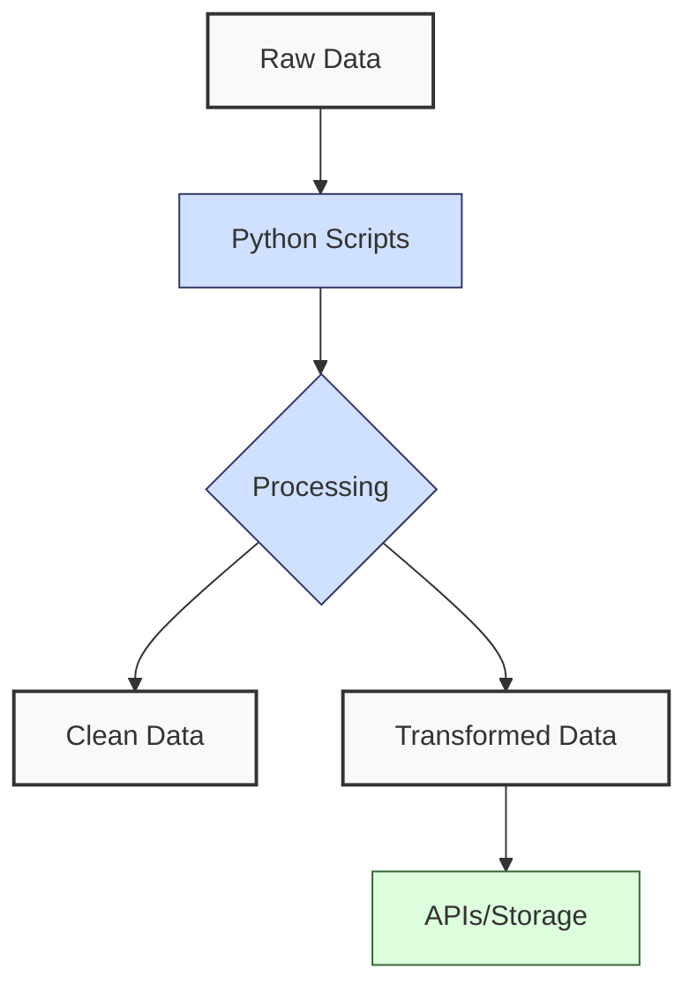

**Complexity: Easy (E)**

## 6.0 Introduction: Why This Matters for Data Engineering

This checkpoint consolidates Python skills from Chapters 1–5, ensuring readiness for advanced data engineering. Python powers data pipelines, from cleaning datasets to integrating APIs and databases. Reviewing these foundations strengthens your ability to build reliable, scalable pipelines.

### Data Engineering Workflow Context

These skills drive data pipeline stages:



### Building On and Preparing For

- **Building On**: Integrates Python fundamentals (Chapter 1), data handling/error management (Chapter 2), NumPy/Pandas (Chapter 3), web APIs (Chapter 4), and OOP (Chapter 5).
- **Preparing For**: Prepares for Chapter 7 (Static Typing) and database chapters (11–22).

### What You’ll Learn

Review:

1. Core Python syntax and data structures
2. File handling and error management
3. NumPy and Pandas basics
4. Web API integration
5. OOP for pipelines

You’ll build a tool integrating these skills.

## 6.1 Core Python Syntax Review

Python’s syntax and data structures are pipeline foundations.

```python
# Lists: O(1) indexing, O(n) iteration
sales = [19.99, 24.99, 49.99]
print(f"Total: ${sum(sales):.2f}")  # Total: $124.97

# Dictionaries: O(1) lookup
product = {"id": 1001, "name": "Laptop", "price": 999.99}
print(f"Name: {product['name']}")  # Name: Laptop

# Control flow
category = "Premium" if product["price"] > 500 else "Standard"
print(f"Category: {category}")  # Category: Premium
```

**Key Points**:

- Lists: Dynamic arrays for ordered data.
- Dictionaries: Hash tables for records.
- Use `if/else`, loops for logic.

## 6.2 Data Handling and Error Management

File I/O and error handling ensure reliability.

```python
import csv

# Read CSV: O(n) time, O(1) space streaming
try:
    with open("data.csv", "r") as file:
        data = [row for row in csv.DictReader(file)]
        print(f"Read {len(data)} records")
except FileNotFoundError:
    print("File not found")

# List comprehension
valid_prices = [float(row["price"]) for row in data if row["price"].replace(".", "").isdigit()]
print(f"Valid prices: {valid_prices}")
```

**Key Points**:

- `with` ensures file closure.
- Catch specific exceptions.
- List comprehensions: O(n) time.

## 6.3 Libraries: NumPy and Pandas Basics

NumPy and Pandas optimize analysis.

```python
import numpy as np
import pandas as pd

# NumPy: O(1) vectorized ops
prices = np.array([19.99, 24.99, 49.99])
print(f"Avg price: ${np.mean(prices):.2f}")  # Avg price: $31.66

# Pandas: O(n) DataFrame ops
df = pd.DataFrame({"product": ["Laptop", "Mouse"], "price": [999.99, 24.99]})
print(df.head())
#    product   price
# 0  Laptop  999.99
# 1   Mouse   24.99
```

**Key Points**:

- NumPy: Fast numerical operations.
- Pandas: DataFrames for tabular data.
- Use `head()` for inspection.

## 6.4 Web API Integration

APIs enable data ingestion.

```python
import json

# Mock API: O(n) parsing
mock_response = '[{"product": "Keyboard", "price": 49.99}]'
data = json.loads(mock_response)
print(f"Fetched {len(data)} records")  # Fetched 1 records
```

**Key Points**:

- Parse JSON into Python objects.
- JSON: O(n) time/space.

## 6.5 OOP Principles

OOP structures pipelines.

```python
class DataProcessor:
    def __init__(self, data):
        self.data = data

    def total_sales(self):
        return sum(float(item["price"]) for item in self.data)

# Usage
data = [{"product": "Laptop", "price": "999.99"}]
processor = DataProcessor(data)
print(f"Total: ${processor.total_sales():.2f}")  # Total: $999.99
```

**Key Points**:

- Classes encapsulate logic.
- O(1) method calls, O(n) processing.

## 6.6 Micro-Project: Comprehensive Data Tool

### Project Requirements

Create a script that reads sales data from CSV, processes it with Pandas, uses OOP, and exports a JSON report.

### Acceptance Criteria

- **Go Criteria**:
  - Reads CSV, validates data.
  - Uses Pandas for analysis (total sales, top product).
  - Two classes (`DataFetcher`, `DataAnalyzer`).
  - Handles errors.
  - Outputs JSON.
  - Brief documentation.
- **No-Go Criteria**:
  - Crashes on errors.
  - Incorrect analysis.
  - No OOP/error handling.
  - Missing output.

### Common Pitfalls

1. **Broad Exceptions**:
   - **Problem**: Catching `Exception` masks issues.
   - **Solution**: Use `FileNotFoundError`, `ValueError`.
2. **Pandas Loops**:
   - **Problem**: Slow row iteration.
   - **Solution**: Vectorized operations.
3. **Unclear Classes**:
   - **Problem**: Overlapping roles.
   - **Solution**: Single-purpose classes.

### Production Differences

- Logging to systems (Chapter 8).
- Unit tests (Chapter 9).
- Scalable processing (Chapter 32).
- Security: Encrypt sensitive data, restrict file permissions (Chapter 8).

### Implementation

```python
import csv
import json
import logging
import pandas as pd

# Configure logging
logging.basicConfig(filename="data_tool.log", level=logging.INFO)

class DataFetcher:
    """Fetches CSV data."""
    def __init__(self, csv_path):
        self.csv_path = csv_path

    def fetch(self):
        """Read CSV."""
        try:
            with open(self.csv_path, "r") as file:
                data = [row for row in csv.DictReader(file)]
                logging.info(f"Read {len(data)} records")
                return data
        except FileNotFoundError:
            logging.error(f"File not found: {self.csv_path}")
            return []

class DataAnalyzer:
    """Analyzes data with Pandas."""
    def __init__(self, data):
        self.df = pd.DataFrame(data)

    def analyze(self):
        """Clean and calculate metrics."""
        try:
            self.df["price"] = pd.to_numeric(self.df["price"], errors="coerce")
            self.df["quantity"] = pd.to_numeric(self.df["quantity"], errors="coerce")
            self.df = self.df.dropna().query("quantity > 0")
            total_sales = (self.df["price"] * self.df["quantity"]).sum()
            top_product = self.df.groupby("product")["quantity"].sum().idxmax()
            logging.info(f"Analyzed {len(self.df)} records")
            return {"total_sales": total_sales, "top_product": top_product}
        except (ValueError, KeyError) as e:
            logging.error(f"Analysis error: {e}")
            return {}

def main():
    fetcher = DataFetcher("sales_data.csv")
    analyzer = DataAnalyzer(fetcher.fetch())
    metrics = analyzer.analyze()

    try:
        with open("report.json", "w") as file:
            json.dump(metrics, file, indent=2)
        logging.info("Exported report.json")
    except IOError:
        logging.error("Export failed")

if __name__ == "__main__":
    main()
```

### Sample Input (`sales_data.csv`)

```csv
product,price,quantity
Laptop,999.99,2
Mouse,24.99,10
,49.99,5
Monitor,invalid,2
```

### Expected Output (`report.json`)

```json
{
  "total_sales": 2499.95,
  "top_product": "Mouse"
}
```

### How to Run and Test

#### Setup Instructions

1. Ensure Python 3.6+ is installed.
2. Install Pandas: `pip install pandas`.
3. Save `sales_data.csv` in the same directory as `data_tool.py`.

#### Run

- Execute: `python data_tool.py`.
- Outputs: `report.json`, `data_tool.log`.

#### Tests

- **Valid Data**: Verify `total_sales` ($2499.95), `top_product` (Mouse).
- **Missing File**: Rename CSV; check log for error.
- **Invalid Data**: Confirm invalid rows skipped.

## 6.7 Practice Exercises

1. **Category Counter for Inventory Pipeline**:

   - **Task**: Count products by category for an inventory pipeline using a dictionary. Handle missing categories with "Unknown".
   - **Sample Input**:
     ```python
     products = [
         {"product": "Laptop", "category": "Electronics"},
         {"product": "T-shirt", "category": "Clothing"},
         {"product": "Mouse"}
     ]
     ```

2. **CSV Reader**:

   - **Task**: Read CSV, handle `FileNotFoundError`, return empty list.
   - **Sample Input**: Create a file `test.csv`:
     ```csv
     product,price
     Laptop,999.99
     Mouse,24.99
     ```

3. **Pandas Average**:

   - **Task**: Calculate average price, handle non-numeric prices.
   - **Sample Input**:
     ```python
     data = [
         {"price": "19.99"},
         {"price": "invalid"},
         {"price": "24.99"}
     ]
     ```

4. **JSON Parser**:

   - **Task**: Parse mock JSON sales data into a list.
   - **Sample Input**:
     ```python
     json_data = '[{"product": "Laptop", "price": 999.99}, {"product": "Mouse", "price": 24.99}]'
     ```

5. **Basic Processor Class**:
   - **Task**: Create a `SalesProcessor` class to calculate total sales from a list of dictionaries.
   - **Sample Input**:
     ```python
     data = [
         {"product": "Laptop", "price": "999.99"},
         {"product": "Mouse", "price": "24.99"}
     ]
     ```

### Self-Assessment Prompt

Test your understanding:

- What is the difference between a list and a tuple in Python?
- How does error handling improve pipeline reliability?
- Why use Pandas over raw Python for data analysis?
  Review Chapters 1–5 if unsure, then proceed to Chapter 7.

## 6.8 Exercise Solutions

### Solution 1

```python
def count_categories(products):
    counts = {}
    for p in products:
        cat = p.get("category", "Unknown")
        counts[cat] = counts.get(cat, 0) + 1
    return counts

# Test with sample input
products = [
    {"product": "Laptop", "category": "Electronics"},
    {"product": "T-shirt", "category": "Clothing"},
    {"product": "Mouse"}
]
print(count_categories(products))  # {'Electronics': 1, 'Clothing': 1, 'Unknown': 1}
```

### Solution 2

```python
import csv

def read_csv(file_path):
    try:
        with open(file_path, "r") as file:
            return [row for row in csv.DictReader(file)]
    except FileNotFoundError:
        return []

# Test with test.csv
print(read_csv("test.csv"))  # [{'product': 'Laptop', 'price': '999.99'}, {'product': 'Mouse', 'price': '24.99'}]
```

### Solution 3

```python
import pandas as pd

def avg_price(data):
    df = pd.DataFrame(data)
    df["price"] = pd.to_numeric(df["price"], errors="coerce")
    return df["price"].mean()

# Test with sample input
data = [{"price": "19.99"}, {"price": "invalid"}, {"price": "24.99"}]
print(avg_price(data))  # 22.44
```

### Solution 4

```python
import json

def parse_json(json_data):
    return json.loads(json_data)

# Test with sample input
json_data = '[{"product": "Laptop", "price": 999.99}, {"product": "Mouse", "price": 24.99}]'
print(parse_json(json_data))  # [{'product': 'Laptop', 'price': 999.99}, {'product': 'Mouse', 'price': 24.99}]
```

### Solution 5

```python
class SalesProcessor:
    def __init__(self, data):
        self.data = data

    def total_sales(self):
        try:
            return sum(float(record["price"]) for record in self.data)
        except (KeyError, ValueError):
            return 0.0

# Test with sample input
data = [{"product": "Laptop", "price": "999.99"}, {"product": "Mouse", "price": "24.99"}]
processor = SalesProcessor(data)
print(processor.total_sales())  # 1024.98
```

## 6.9 Chapter Summary and Connection to Chapter 7

This chapter reviewed:

- **Core Python**: Data structures (O(1) lookups), control flow.
- **Data Handling**: File I/O, error handling (O(n) time).
- **Libraries**: NumPy (vectorized), Pandas (DataFrames).
- **APIs**: JSON parsing (O(n)).
- **OOP**: Classes for modularity.

The micro-project built a pipeline, preparing you for Chapter 7, where static typing enhances code reliability for database and advanced tasks.
