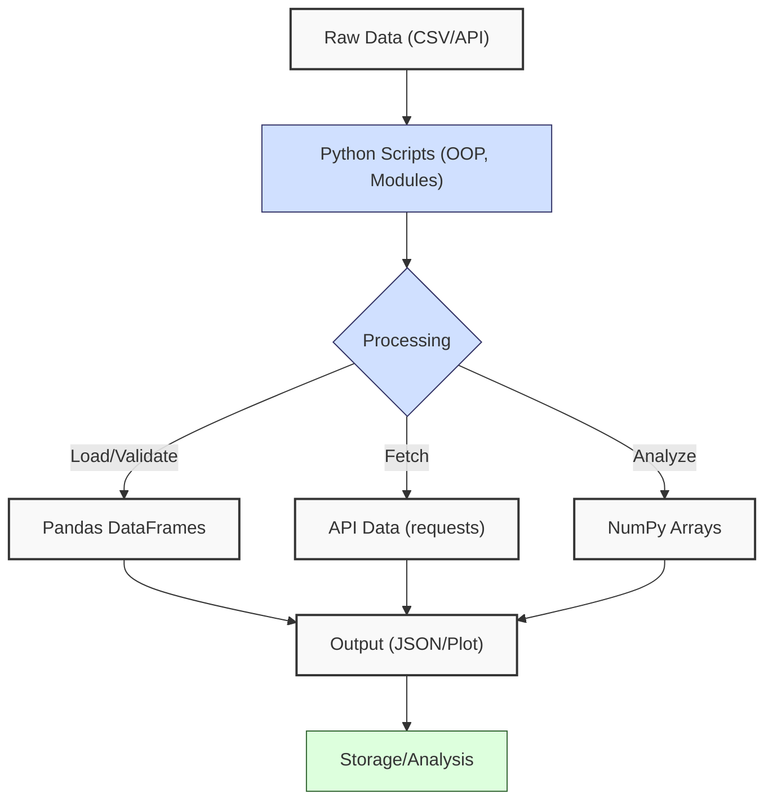
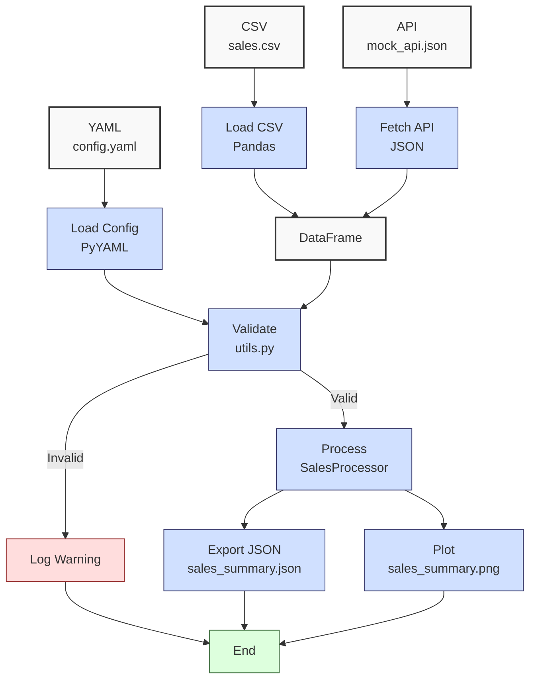

**Complexity: Easy (E)**

## 6.0 Introduction: Why This Matters for Data Engineering

This checkpoint consolidates Python skills from **Phase 1: Python Foundations (Chapters 1–5)**, ensuring proficiency in core concepts critical for Hijra Group’s data engineering pipelines. These skills—Python syntax, data handling, NumPy/Pandas, API integration, and OOP—form the foundation for processing financial transaction data, enabling scalable analytics. The micro-project integrates file processing, API fetching, Pandas DataFrames, and OOP to analyze sales data, preparing learners for **Phase 2: Python Code Quality** (Chapters 7–11), where type safety and testing enhance pipeline reliability. All code uses **PEP 8's 4-space indentation**, preferring spaces over tabs to avoid `IndentationError`, aligning with Hijra Group’s pipeline standards.

### Data Engineering Workflow Context

This diagram shows how Phase 1 skills integrate into a pipeline:



### Building On and Preparing For

- **Building On**:
  - **Chapter 1**: Python syntax, data structures, functions, and scope for basic data manipulation.
  - **Chapter 2**: File handling, CSV/YAML parsing, and modules (`utils.py`) for data processing.
  - **Chapter 3**: NumPy arrays and Pandas DataFrames for efficient data analysis and visualization.
  - **Chapter 4**: API integration with `requests` for fetching external data.
  - **Chapter 5**: OOP for modular code, organizing classes in modules.
- **Preparing For**:
  - **Chapter 7**: Type-safe programming with Pyright, building on Pandas/OOP.
  - **Chapter 9**: Testing with `unittest`/`pytest`, extending modular code.
  - **Chapter 13**: Database integration, leveraging file handling and Pandas.

### What You’ll Learn

This chapter reviews:

1. **Core Python**: Data structures, functions, and scope.
2. **File Handling**: CSV/YAML processing with modules.
3. **Data Analysis**: NumPy/Pandas for metrics and visualization.
4. **API Integration**: Fetching data with `requests`.
5. **OOP**: Classes for modular data processing.

The micro-project builds a sales data tool that processes `data/sales.csv`, fetches mock API data, and uses OOP, Pandas, and NumPy to generate a JSON report and plot, all with 4-space indentation per PEP 8. Exercises reinforce integration, ensuring readiness for advanced topics.

**Follow-Along Tips**:

- Create `de-onboarding/data/` with files from **Appendix 1** (`sales.csv`, `config.yaml`, `empty.csv`, `invalid.csv`, `malformed.csv`, `negative.csv`).
- Create `data/mock_api.json` as specified in the micro-project.
- Install libraries: `pip install numpy pandas matplotlib pyyaml requests`.
- Use **4-space indentation** per PEP 8. Run `python -tt script.py` to detect tab/space mixing.
- Debug with print statements (e.g., `print(df.head(3))` for DataFrames). Adjust print statements to limit output for clarity (e.g., show only first 3 rows).
- Save plots to `data/` (e.g., `sales_summary.png`) instead of `plt.show()`.
- Verify paths with `ls data/` (Unix/macOS) or `dir data\` (Windows).
- Use UTF-8 encoding to avoid `UnicodeDecodeError`.

## 6.1 Core Concepts Review

Phase 1 skills form a pipeline for processing sales data, with **time complexity** of O(n) for loading (`pd.read_csv`), filtering (`df[df["condition"]]`), aggregating (`np.sum`), and plotting (`plt.bar`) n rows, and **space complexity** of ~24MB for 1M DataFrame rows and ~8MB for 1M NumPy float arrays. These efficiencies enable Hijra Group’s analytics at scale.

### 6.1.1 Python Basics (Chapter 1)

- **Data Structures**: Lists, dictionaries, sets for sales data storage.
- **Functions**: Modular logic with parameters and return values.
- **Scope**: Local/global variables for data isolation.
- **Time/Space Complexity**:
  - List operations: O(1) access, O(n) append.
  - Dictionary: O(1) average-case lookup.
  - Set: O(1) membership testing.

```python
# Example: Compute unique products
products = ["Halal Laptop", "Halal Mouse", "Halal Laptop"]
unique_products = list(set(products))  # O(n) conversion
print(unique_products)  # ['Halal Laptop', 'Halal Mouse']
```

### 6.1.2 File Handling and Modules (Chapter 2)

- **CSV/YAML Parsing**: `csv.DictReader`, `yaml.safe_load` for data/config loading.
- **Modules**: `utils.py` for reusable validation functions.
- **Time/Space Complexity**:
  - File reading: O(n) for n rows.
  - Space: O(n) for storing data.

```python
import yaml
def load_config(path):  # O(n) file read
    with open(path, "r") as f:  # Context manager not introduced
        return yaml.safe_load(f)  # Parse YAML
config = load_config("data/config.yaml")  # Load config
print(config)  # Debug
```

### 6.1.3 NumPy/Pandas Basics (Chapter 3)

- **NumPy**: Arrays for numerical computations (O(n) vectorized operations, ~8MB for 1M floats).
- **Pandas**: DataFrames for structured data (O(n) loading, ~24MB for 1M rows).
- **Visualization**: Matplotlib for plots (O(n) for bar plots).

```python
import pandas as pd
import numpy as np
df = pd.read_csv("data/sales.csv")  # O(n) load
df = df[df["product"].str.startswith("Halal")]  # O(n) filter
total_sales = np.sum(df["price"] * df["quantity"])  # O(n) compute
print(total_sales)  # Debug
```

### 6.1.4 API Integration (Chapter 4)

- **Requests**: Fetch JSON data with `requests.get`.
- **Time/Space Complexity**:
  - HTTP request: O(1) for single call, network-dependent.
  - JSON parsing: O(n) for n items.

```python
import requests
response = requests.get("https://api.example.com/transactions")  # Mock API
data = response.json()  # O(n) parse
print(data[:2])  # Debug first 2 records
```

### 6.1.5 OOP and Modules (Chapter 5)

- **Classes**: Encapsulate data and logic.
- **Modules**: Organize classes in `.py` files.
- **Time/Space Complexity**:
  - Method calls: O(1) for simple operations.
  - Space: O(1) per object instance.

```python
class SalesProcessor:
    def __init__(self, data):  # O(1)
        self.data = data  # Store data
    def total_sales(self):  # O(n)
        return sum(float(row["price"]) * float(row["quantity"]) for row in self.data)
```

## 6.2 Micro-Project: Integrated Sales Data Tool

### Project Requirements

Build a modular sales data tool that:

- Loads `data/sales.csv` and `data/config.yaml` using Pandas and PyYAML.
- Fetches mock API data from `data/mock_api.json`, simulating an API response.
- Validates records using `utils.py` (Halal prefix, numeric price/quantity, positive prices, config rules).
- Computes total sales and top 3 products using Pandas/NumPy.
- Exports results to `data/sales_summary.json`.
- Generates a sales plot saved to `data/sales_summary.png`.
- Uses OOP to encapsulate logic in a `SalesProcessor` class within `processor.py`.
- Logs steps with print statements, limiting DataFrame output to first 3 rows.
- Uses **4-space indentation** per PEP 8, preferring spaces over tabs.
- Tests edge cases with `empty.csv`, `invalid.csv`, `malformed.csv`, `negative.csv`.

### Sample Input Files

`data/sales.csv` (Appendix 1):

```csv
product,price,quantity
Halal Laptop,999.99,2
Halal Mouse,24.99,10
Halal Keyboard,49.99,5
,29.99,3
Monitor,invalid,2
Headphones,5.00,150
```

`data/config.yaml` (Appendix 1):

```yaml
min_price: 10.0
max_quantity: 100
required_fields:
  - product
  - price
  - quantity
product_prefix: 'Halal'
max_decimals: 2
```

`data/mock_api.json` (create manually):

```json
[
  { "product": "Halal Monitor", "price": 199.99, "quantity": 3 },
  { "product": "Non-Halal Item", "price": 50.0, "quantity": 2 }
]
```

### Notes

- The `mock_api.json` file simulates an API response to focus on data integration, as real HTTP requests with `requests.get` are covered in Chapter 40 for scalability.
- The `mock_api.json` is structured to match `sales.csv` (same keys: `product`, `price`, `quantity`) for simplicity, with data consistency challenges addressed in Chapter 40.
- Plotting uses `dpi=100` to balance resolution and file size; higher DPI (e.g., 300) increases file size and is explored in Chapter 51 (BI tools).

### Data Processing Flow



### Acceptance Criteria

- **Go Criteria**:
  - Loads `sales.csv`, `config.yaml`, and `mock_api.json`.
  - Validates records (Halal prefix, numeric price/quantity, positive prices, config rules).
  - Computes total sales and top 3 products.
  - Exports to `data/sales_summary.json`.
  - Saves plot to `data/sales_summary.png`.
  - Uses `SalesProcessor` class in `processor.py`.
  - Logs steps, limiting DataFrame output to first 3 rows.
  - Uses 4-space indentation per PEP 8.
  - Passes edge case tests.
- **No-Go Criteria**:
  - Fails to load inputs.
  - Incorrect validation or calculations.
  - Missing JSON/plot outputs.
  - Uses try/except or type annotations.
  - Inconsistent indentation.

### Common Pitfalls to Avoid

1. **FileNotFoundError**:
   - **Problem**: Missing `sales.csv` or `mock_api.json`.
   - **Solution**: Print paths (`print(csv_path)`). Ensure files in `data/`.
2. **Validation Errors**:
   - **Problem**: Non-numeric prices break calculations.
   - **Solution**: Use `utils.is_numeric_value`. Print `df.dtypes`.
3. **Pandas Type Inference**:
   - **Problem**: `quantity` parsed as object (e.g., "invalid" in `malformed.csv`).
   - **Solution**: Use `utils.is_integer`, `astype(int)`. Print `df["quantity"].apply(type)` to debug.
4. **Plotting Issues**:
   - **Problem**: Plot not saved.
   - **Solution**: Check permissions. Print `os.path.exists(plot_path)`.
5. **IndentationError**:
   - **Problem**: Mixed spaces/tabs.
   - **Solution**: Use 4 spaces. Run `python -tt main.py`.

### How This Differs from Production

- **Production Enhancements**:
  - Error handling with try/except (Chapter 7).
  - Type annotations with Pyright (Chapter 7).
  - Unit tests with `pytest` (Chapter 9).
  - Logging to files (Chapter 52).
  - Scalable API fetching (Chapter 40).

### Implementation

```python
# File: de-onboarding/utils.py (from Chapter 3)
def is_numeric(s, max_decimals=2):  # Check if string is a decimal number
    """Check if string is a decimal number with up to max_decimals."""
    parts = s.split(".")  # Split on decimal point
    if len(parts) != 2 or not parts[0].isdigit() or not parts[1].isdigit():
        return False  # Invalid format
    return len(parts[1]) <= max_decimals  # Check decimal places

def clean_string(s):  # Clean string
    """Strip whitespace from string."""
    return s.strip()

def is_numeric_value(x):  # Check if value is numeric
    """Check if value is an integer or float."""
    return isinstance(x, (int, float))  # Return True for numeric types

def has_valid_decimals(x, max_decimals):  # Check decimal places
    """Check if value has valid decimal places."""
    return is_numeric(str(x), max_decimals)  # Use is_numeric for validation

def apply_valid_decimals(x, max_decimals):  # Apply decimal validation
    """Apply has_valid_decimals to a value."""
    return has_valid_decimals(x, max_decimals)

def is_integer(x):  # Check if value is an integer
    """Check if value is an integer when converted to string."""
    return str(x).isdigit()  # Return True for integer strings
```

```python
# File: de-onboarding/processor.py
import pandas as pd
import numpy as np

class SalesProcessor:
    """Class to process sales data."""
    def __init__(self, df, config):  # Initialize with DataFrame and config
        self.df = df  # Store DataFrame
        self.config = config  # Store config
        print("Initialized SalesProcessor")  # Debug

    def validate_data(self):  # Validate DataFrame
        """Validate sales data using config."""
        required_fields = self.config["required_fields"]
        missing_fields = [f for f in required_fields if f not in self.df.columns]
        if missing_fields:
            print(f"Missing columns: {missing_fields}")  # Log error
            return pd.DataFrame()  # Return empty DataFrame

        df = self.df.dropna(subset=["product"])  # Drop missing products
        df = df[df["product"].str.startswith(self.config["product_prefix"])]  # Halal filter
        df = df[df["quantity"].apply(is_integer)]  # Integer quantities
        df["quantity"] = df["quantity"].astype(int)  # Convert to int
        df = df[df["quantity"] <= self.config["max_quantity"]]  # Max quantity
        df = df[df["price"].apply(is_numeric_value)]  # Numeric prices
        df = df[df["price"] > 0]  # Positive prices
        df = df[df["price"] >= self.config["min_price"]]  # Min price
        df = df[df["price"].apply(lambda x: apply_valid_decimals(x, self.config["max_decimals"]))]  # Decimals
        print("Validated DataFrame (first 3 rows):")  # Debug
        print(df.head(3))  # Show first 3 rows
        self.df = df  # Update DataFrame
        return df

    def compute_metrics(self):  # Compute sales metrics
        """Compute total sales and top products."""
        if self.df.empty:
            print("No valid data")  # Log empty
            return {"total_sales": 0.0, "unique_products": [], "top_products": {}}

        self.df["amount"] = self.df["price"] * self.df["quantity"]  # Compute amount
        total_sales = np.sum(self.df["amount"].values)  # Total sales
        unique_products = self.df["product"].unique().tolist()  # Unique products
        sales_by_product = self.df.groupby("product")["amount"].sum()  # Group by product
        top_products = sales_by_product.sort_values(ascending=False).head(3).to_dict()  # Top 3
        print("Metrics computed")  # Debug
        return {
            "total_sales": float(total_sales),
            "unique_products": unique_products,
            "top_products": top_products
        }

    def plot_sales(self, plot_path):  # Generate plot
        """Generate sales plot."""
        import matplotlib.pyplot as plt
        if self.df.empty:
            print("No data to plot")  # Log empty
            return
        plt.figure(figsize=(8, 6))  # Set size
        plt.bar(self.df["product"], self.df["amount"])  # Bar plot
        plt.title("Sales Summary")  # Title
        plt.xlabel("Product")  # X-axis
        plt.ylabel("Sales Amount ($)")  # Y-axis
        plt.xticks(rotation=45)  # Rotate labels
        plt.grid(True)  # Add grid
        plt.tight_layout()  # Adjust layout
        plt.savefig(plot_path, dpi=100)  # Save plot
        plt.close()  # Close figure
        print(f"Plot saved to {plot_path}")  # Confirm
```

```python
# File: de-onboarding/main.py
import pandas as pd
import yaml
import json
import os
from processor import SalesProcessor
from utils import is_numeric_value, is_integer, apply_valid_decimals

def load_config(config_path):  # Load YAML
    """Load YAML configuration."""
    print(f"Loading config: {config_path}")  # Debug
    with open(config_path, "r") as f:
        config = yaml.safe_load(f)
    print(f"Config: {config}")  # Debug
    return config

def load_data(csv_path, json_path):  # Load CSV and JSON
    """Load sales CSV and mock API data."""
    print(f"Loading CSV: {csv_path}")  # Debug
    df_csv = pd.read_csv(csv_path)  # Load CSV
    print(f"Loading JSON: {json_path}")  # Debug
    with open(json_path, "r") as f:
        api_data = json.load(f)  # Load JSON
    df_api = pd.DataFrame(api_data)  # Convert to DataFrame
    df = pd.concat([df_csv, df_api], ignore_index=True)  # Combine
    print("Combined DataFrame (first 3 rows):")  # Debug
    print(df.head(3))  # Show first 3 rows
    return df

def export_results(results, json_path):  # Export JSON
    """Export results to JSON."""
    print(f"Writing to: {json_path}")  # Debug
    with open(json_path, "w") as f:
        json.dump(results, f, indent=2)
    print(f"Exported to {json_path}")  # Confirm

def main():  # Main function
    """Integrate sales data processing."""
    csv_path = "data/sales.csv"
    config_path = "data/config.yaml"
    json_path = "data/mock_api.json"
    output_json = "data/sales_summary.json"
    plot_path = "data/sales_summary.png"

    config = load_config(config_path)  # Load config
    df = load_data(csv_path, json_path)  # Load data
    processor = SalesProcessor(df, config)  # Initialize processor
    df_valid = processor.validate_data()  # Validate
    results = processor.compute_metrics()  # Compute metrics
    processor.plot_sales(plot_path)  # Plot
    export_results(results, output_json)  # Export

    # Print report
    print("\nSales Report:")
    print(f"Total Sales: ${round(results['total_sales'], 2)}")
    print(f"Unique Products: {results['unique_products']}")
    print(f"Top Products: {results['top_products']}")
    print("Processing completed")

if __name__ == "__main__":
    main()
```

### Expected Outputs

`data/sales_summary.json`:

```json
{
  "total_sales": 3099.8,
  "unique_products": [
    "Halal Laptop",
    "Halal Mouse",
    "Halal Keyboard",
    "Halal Monitor"
  ],
  "top_products": {
    "Halal Laptop": 1999.98,
    "Halal Monitor": 599.97,
    "Halal Keyboard": 249.95
  }
}
```

`data/sales_summary.png`: Bar plot of sales amounts for Halal products, saved with `dpi=100`.

**Console Output** (abridged):

```
Loading config: data/config.yaml
Config: {'min_price': 10.0, 'max_quantity': 100, ...}
Loading CSV: data/sales.csv
Loading JSON: data/mock_api.json
Combined DataFrame (first 3 rows):
          product   price  quantity
0   Halal Laptop  999.99         2
1    Halal Mouse   24.99        10
2  Halal Keyboard   49.99         5
Initialized SalesProcessor
Validated DataFrame (first 3 rows):
          product   price  quantity
0   Halal Laptop  999.99         2
1    Halal Mouse   24.99        10
2  Halal Keyboard   49.99         5
Metrics computed
Plot saved to data/sales_summary.png
Exported to data/sales_summary.json

Sales Report:
Total Sales: $3099.8
Unique Products: ['Halal Laptop', 'Halal Mouse', 'Halal Keyboard', 'Halal Monitor']
Top Products: {'Halal Laptop': 1999.98, 'Halal Monitor': 599.97, 'Halal Keyboard': 249.95}
Processing completed
```

### How to Run and Test

1. **Setup**:

   - Create `de-onboarding/data/` and populate with `sales.csv`, `config.yaml`, `empty.csv`, `invalid.csv`, `malformed.csv`, `negative.csv` per Appendix 1.
   - Create `data/mock_api.json` with provided content.
   - Install: `pip install numpy pandas matplotlib pyyaml requests`.
   - Save `utils.py`, `processor.py`, `main.py` in `de-onboarding/`.
   - Configure editor for 4-space indentation per PEP 8 (VS Code: “Editor: Tab Size” = 4, “Editor: Insert Spaces” = true, “Editor: Detect Indentation” = false).
   - Use virtual environment: `python -m venv venv`, activate (Windows: `venv\Scripts\activate`, Unix: `source venv/bin/activate`).

2. **Run**:

   - Open terminal in `de-onboarding/`.
   - Run: `python main.py`.
   - Verify outputs: `sales_summary.json`, `sales_summary.png`, console logs.

3. **Test Scenarios**:

   - **Note**: To simplify testing, create a separate script (`test_scenarios.py`) to run all test cases sequentially. Example template:

     ```python
     from main import load_config, load_data, SalesProcessor

     config = load_config("data/config.yaml")
     test_files = ["empty.csv", "invalid.csv", "malformed.csv", "negative.csv"]
     for csv_file in test_files:
         print(f"\nTesting {csv_file}")
         df = load_data(f"data/{csv_file}", "data/mock_api.json")
         processor = SalesProcessor(df, config)
         df_valid = processor.validate_data()
         results = processor.compute_metrics()
         print(f"Results: {results}")
     ```

   - **Empty CSV**: Replace `csv_path` with `data/empty.csv` in `main.py` or use `test_scenarios.py`. Note: `mock_api.json` data ensures non-zero output (`total_sales: 599.97`), as it includes valid Halal Monitor data.

     ```python
     config = load_config("data/config.yaml")
     df = load_data("data/empty.csv", "data/mock_api.json")
     processor = SalesProcessor(df, config)
     df_valid = processor.validate_data()
     results = processor.compute_metrics()
     print(results)  # Expect: {"total_sales": 599.97, ...}
     ```

   - **Invalid Headers**: Use `data/invalid.csv`:

     ```python
     config = load_config("data/config.yaml")
     df = load_data("data/invalid.csv", "data/mock_api.json")
     processor = SalesProcessor(df, config)
     df_valid = processor.validate_data()
     print(df_valid)  # Expect: DataFrame with only Halal Monitor row
     ```

   - **Malformed Data**: Use `data/malformed.csv`:

     ```python
     config = load_config("data/config.yaml")
     df = load_data("data/malformed.csv", "data/mock_api.json")
     processor = SalesProcessor(df, config)
     df_valid = processor.validate_data()
     print(df_valid)  # Expect: Only valid rows
     ```

   - **Negative Prices**: Use `data/negative.csv`:

     ```python
     config = load_config("data/config.yaml")
     df = load_data("data/negative.csv", "data/mock_api.json")
     processor = SalesProcessor(df, config)
     df_valid = processor.validate_data()
     print(df_valid)  # Expect: Only positive prices
     ```

## 6.3 Practice Exercises

### Exercise 1: Visualization with Mock API Data

Write a function to load `data/mock_api.json`, filter Halal products, and plot sales amounts, saving to `data/api_plot.png`, with 4-space indentation. Note: Plotting uses `dpi=100` to balance resolution and file size; higher DPI (e.g., 300) increases file size and is explored in Chapter 51.

**Sample Input** (`data/mock_api.json`):

```json
[
  { "product": "Halal Monitor", "price": 199.99, "quantity": 3 },
  { "product": "Non-Halal Item", "price": 50.0, "quantity": 2 }
]
```

**Expected Output**:

```
Plot saved to data/api_plot.png
```

**Follow-Along Instructions**:

1. Save as `de-onboarding/ex1_plot.py`.
2. Ensure `data/mock_api.json` exists.
3. Configure editor for 4-space indentation.
4. Run: `python ex1_plot.py`.
5. **How to Test**:
   - Add: `plot_api_sales("data/mock_api.json", "data/api_plot.png")`.
   - Verify `data/api_plot.png` shows a bar for Halal Monitor.
   - Test with empty JSON (`[]`): Should not generate plot.
   - **Common Errors**:
     - **FileNotFoundError**: Print `json_path`.
     - **Plot Sizing**: If labels are cut off, adjust `plt.tight_layout()` or print `plt.gcf().get_size_inches()` to check dimensions.
     - **IndentationError**: Use 4 spaces. Run `python -tt ex1_plot.py`.

### Exercise 2: Pandas with API Data

Write a function to load `data/mock_api.json` into a DataFrame and filter Halal products, with 4-space indentation.

**Expected Output**:

```
          product   price  quantity
0   Halal Monitor  199.99         3
```

**Follow-Along Instructions**:

1. Save as `de-onboarding/ex2_pandas.py`.
2. Ensure `data/mock_api.json` exists.
3. Configure editor for 4-space indentation.
4. Run: `python ex2_pandas.py`.
5. **How to Test**:
   - Add: `print(load_api_data("data/mock_api.json"))`.
   - Verify output matches expected.
   - Test with empty JSON: Should return empty DataFrame.
   - **Common Errors**:
     - **KeyError**: Print `df.columns`.
     - **IndentationError**: Use 4 spaces. Run `python -tt ex2_pandas.py`.

### Exercise 3: OOP Sales Calculator

Write a `SalesCalculator` class to compute total sales, with 4-space indentation.

**Sample Input**:

```python
data = [{"product": "Halal Laptop", "price": 999.99, "quantity": 2}]
```

**Expected Output**:

```
1999.98
```

**Follow-Along Instructions**:

1. Save as `de-onboarding/ex3_oop.py`.
2. Ensure `utils.py` is available for validation.
3. Configure editor for 4-space indentation.
4. Run: `python ex3_oop.py`.
5. **How to Test**:
   - Add: `calc = SalesCalculator([...]); print(calc.total_sales())`.
   - Verify output: `1999.98`.
   - Test with empty data: Should return `0.0`.
   - Test with invalid data (e.g., `{"price": "invalid"}`): Should handle gracefully.
   - **Common Errors**:
     - **TypeError**: Use `utils.is_numeric_value` and `utils.is_integer` for validation. Print `type(row["price"])` to check types.
     - **IndentationError**: Use 4 spaces. Run `python -tt ex3_oop.py`.

### Exercise 4: Debug a Pandas Bug

Fix this buggy code that fails to filter Halal products, with 4-space indentation.

**Buggy Code**:

```python
import pandas as pd
def filter_sales(csv_path):
    df = pd.read_csv(csv_path)
    df = df["product"].startswith("Halal")  # Bug: Incorrect filtering
    return df
```

**Sample Input** (`data/sales.csv`):

```csv
product,price,quantity
Halal Laptop,999.99,2
Halal Mouse,24.99,10
Halal Keyboard,49.99,5
,29.99,3
Monitor,invalid,2
Headphones,5.00,150
```

**Expected Output**:

```
          product   price  quantity
0   Halal Laptop  999.99         2
1    Halal Mouse   24.99        10
2  Halal Keyboard   49.99         5
```

**Follow-Along Instructions**:

1. Save as `de-onboarding/ex4_debug.py`.
2. Ensure `data/sales.csv` exists.
3. Configure editor for 4-space indentation.
4. Run: `python ex4_debug.py` to see error.
5. Fix and re-run.
6. **How to Test**:
   - Verify output matches expected.
   - Test with non-Halal products: Should exclude them.
   - **Common Errors**:
     - **KeyError**: Print `df.columns` to check column names.
     - **TypeError**: Print `df["product"].apply(type)` to check for non-string values.
     - **IndentationError**: Use 4 spaces. Run `python -tt ex4_debug.py`.

### Exercise 5: Data Structure Integration

Write a function to combine CSV and list data into a dictionary, with 4-space indentation.

**Sample Input**:

```python
csv_data = [{"product": "Halal Laptop", "price": "999.99", "quantity": "2"}]
list_data = ["Halal Mouse", "24.99", "10"]
```

**Expected Output**:

```
[{'product': 'Halal Laptop', 'price': '999.99', 'quantity': '2'}, {'product': 'Halal Mouse', 'price': '24.99', 'quantity': '10'}]
```

**Follow-Along Instructions**:

1. Save as `de-onboarding/ex5_data.py`.
2. Configure editor for 4-space indentation.
3. Run: `python ex5_data.py`.
4. **How to Test**:
   - Add: `print(combine_data([...], [...]))`.
   - Verify output matches expected.
   - Test with empty inputs: Should return empty list.
   - **Common Errors**:
     - **IndexError**: Print `len(list_data)` to check length.
     - **IndentationError**: Use 4 spaces. Run `python -tt ex5_data.py`.

### Exercise 6: Conceptual Analysis of NumPy vs. Pandas

Explain in a text file (`ex6_concepts.txt`) when to use NumPy vs. Pandas for sales data processing, limiting the explanation to 3 sentences, with 4-space indentation for any code snippets. The code snippet is for illustration, should be executable, but primarily supports the explanation.

**Sample Input**:

```python
prices = [999.99, 24.99]
quantities = [2, 10]
```

**Expected Output** (`ex6_concepts.txt`):

```
NumPy excels at fast numerical computations like summing sales due to its C-based, contiguous array operations. Pandas is ideal for structured data tasks like filtering Halal products or grouping sales by product. For Hijra Group’s pipelines, use NumPy for aggregations and Pandas for data cleaning.

Code Example:
import numpy as np
import pandas as pd
prices = np.array([999.99, 24.99])  # NumPy for calculations
quantities = np.array([2, 10])
total = np.sum(prices * quantities)  # O(n), fast
df = pd.DataFrame({"price": prices, "quantity": quantities})  # Pandas for structure
df = df[df["price"] > 10]  # O(n), column-based
```

**Follow-Along Instructions**:

1. Save code as `de-onboarding/ex6_concepts.py`.
2. Save explanation to `de-onboarding/ex6_concepts.txt`.
3. Configure editor for 4-space indentation.
4. Run: `python ex6_concepts.py` to generate text file.
5. **How to Test**:
   - Verify `ex6_concepts.txt` contains a 3-sentence explanation and code snippet.
   - Test code snippet: Should compute correct total.
   - **Common Errors**:
     - **ValueError**: Print `len(prices)`, `len(quantities)`.
     - **IndentationError**: Use 4 spaces. Run `python -tt ex6_concepts.py`.

## 6.4 Exercise Solutions

### Solution to Exercise 1: Visualization with Mock API Data

```python
import pandas as pd
import matplotlib.pyplot as plt
import json

def plot_api_sales(json_path, plot_path):  # Plot API sales
    """Load JSON, filter Halal products, and plot sales."""
    with open(json_path, "r") as f:
        data = json.load(f)
    df = pd.DataFrame(data)
    df = df[df["product"].str.startswith("Halal")]
    if df.empty:
        print("No data to plot")
        return
    df["amount"] = df["price"] * df["quantity"]
    plt.figure(figsize=(8, 6))
    plt.bar(df["product"], df["amount"])
    plt.title("API Sales Summary")
    plt.xlabel("Product")
    plt.ylabel("Sales Amount ($)")
    plt.xticks(rotation=45)
    plt.grid(True)
    plt.tight_layout()
    plt.savefig(plot_path, dpi=100)
    plt.close()
    print(f"Plot saved to {plot_path}")

# Test
plot_api_sales("data/mock_api.json", "data/api_plot.png")
```

### Solution to Exercise 2: Pandas with API Data

```python
import pandas as pd
import json

def load_api_data(json_path):  # Load and filter JSON
    """Load JSON and filter Halal products."""
    with open(json_path, "r") as f:
        data = json.load(f)
    df = pd.DataFrame(data)
    df = df[df["product"].str.startswith("Halal")]
    print(df)  # Debug
    return df

# Test
print(load_api_data("data/mock_api.json"))
```

### Solution to Exercise 3: OOP Sales Calculator

```python
from utils import is_numeric_value, is_integer

class SalesCalculator:
    def __init__(self, data):  # Initialize
        self.data = data
    def total_sales(self):  # Compute total
        """Compute total sales."""
        if not self.data:
            return 0.0
        total = 0.0
        for row in self.data:
            price = row["price"]
            quantity = row["quantity"]
            if not is_numeric_value(price):
                print(f"Invalid price: {price}")  # Specific error
                continue
            if not is_integer(quantity):
                print(f"Invalid quantity: {quantity}")  # Specific error
                continue
            total += float(price) * float(quantity)
        print(total)  # Debug
        return total

# Test
calc = SalesCalculator([{"product": "Halal Laptop", "price": 999.99, "quantity": 2}])
print(calc.total_sales())
```

### Solution to Exercise 4: Debug a Pandas Bug

```python
import pandas as pd
def filter_sales(csv_path):  # Filter Halal products
    """Filter sales for Halal products."""
    df = pd.read_csv(csv_path)
    df = df[df["product"].str.startswith("Halal")]  # Fix: Proper filtering
    print(df)  # Debug
    return df

# Test
print(filter_sales("data/sales.csv"))
```

### Solution to Exercise 5: Data Structure Integration

```python
def combine_data(csv_data, list_data):  # Combine data
    """Combine CSV and list data into a dictionary."""
    result = csv_data.copy()  # Copy CSV data
    new_record = {
        "product": list_data[0],
        "price": list_data[1],
        "quantity": list_data[2]
    }
    result.append(new_record)  # Append new record
    print(result)  # Debug
    return result

# Test
print(combine_data(
    [{"product": "Halal Laptop", "price": "999.99", "quantity": "2"}],
    ["Halal Mouse", "24.99", "10"]
))
```

### Solution to Exercise 6: Conceptual Analysis of NumPy vs. Pandas

```python
import numpy as np
import pandas as pd

def write_concepts(prices, quantities):  # Write NumPy vs. Pandas explanation
    """Write explanation of NumPy vs. Pandas usage."""
    explanation = """
NumPy excels at fast numerical computations like summing sales due to its C-based, contiguous array operations. Pandas is ideal for structured data tasks like filtering Halal products or grouping sales by product. For Hijra Group’s pipelines, use NumPy for aggregations and Pandas for data cleaning.

Code Example:
import numpy as np
import pandas as pd
prices = np.array([999.99, 24.99])  # NumPy for calculations
quantities = np.array([2, 10])
total = np.sum(prices * quantities)  # O(n), fast
df = pd.DataFrame({"price": prices, "quantity": quantities})  # Pandas for structure
df = df[df["price"] > 10]  # O(n), column-based
"""
    with open("ex6_concepts.txt", "w") as f:
        f.write(explanation)
    print("Explanation saved to ex6_concepts.txt")

# Test
write_concepts([999.99, 24.99], [2, 10])
```

## 6.5 Chapter Summary and Connection to Chapter 7

This checkpoint solidified **Phase 1** skills:

- **Python Basics**: Data structures, functions, scope (O(1)–O(n) operations).
- **File Handling**: CSV/YAML processing with modules (O(n) reading).
- **NumPy/Pandas**: Efficient data analysis (O(n) operations, ~24MB for 1M rows).
- **API Integration**: Fetching JSON data (O(n) parsing).
- **OOP**: Modular classes for scalable code.

The micro-project integrated these skills into a sales data tool, using `SalesProcessor` in `processor.py`, processing `sales.csv` and `mock_api.json`, and producing a JSON report and plot, all with 4-space indentation per PEP 8. It tested edge cases, ensuring robustness, with streamlined console output and clear debugging guidance. Exercises reinforced practical and conceptual skills, including visualization and NumPy vs. Pandas analysis.

### Connection to Chapter 7

**Chapter 7: Static Typing with Python** builds on this:

- **Type Safety**: Adds Pyright-verified type annotations to Pandas/OOP code, enhancing reliability.
- **Data Processing**: Extends `SalesProcessor` with typed methods, preparing for database integration (Chapter 13).
- **Modules**: Continues using `utils.py` and `processor.py`, adding type hints.
- **Fintech Context**: Prepares for type-safe pipelines at Hijra Group, maintaining 4-space indentation.
