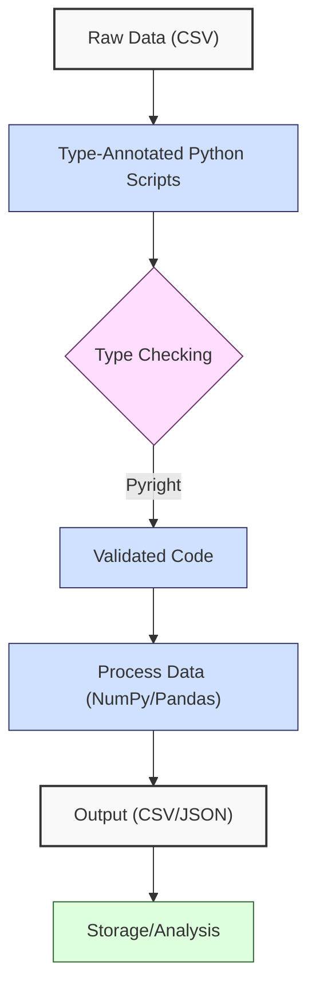
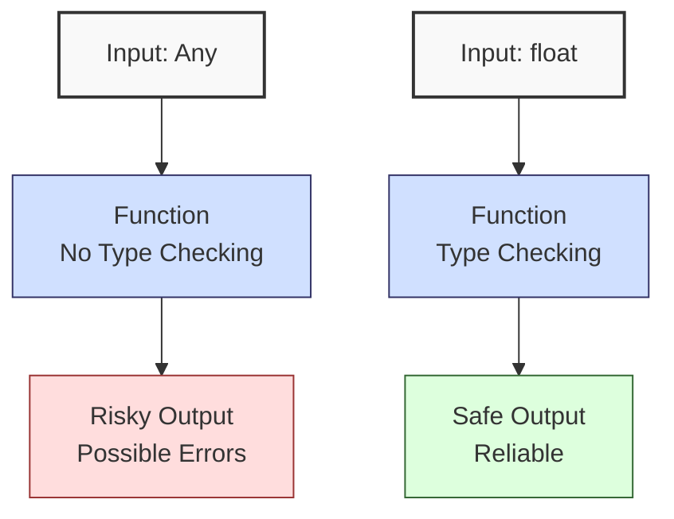
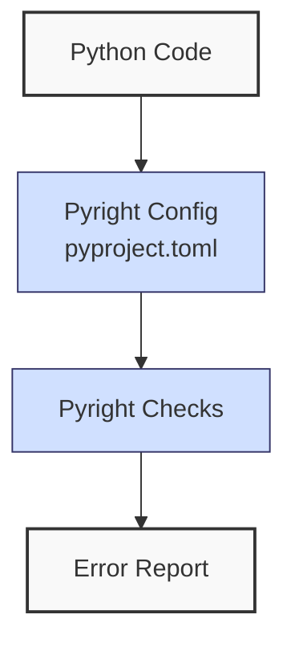
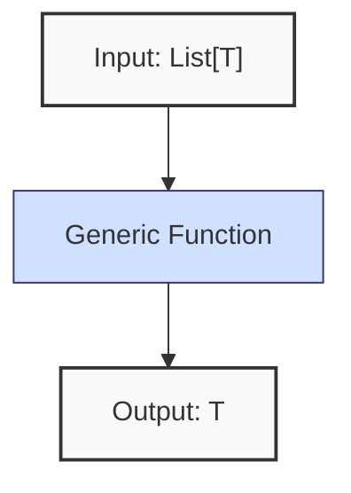
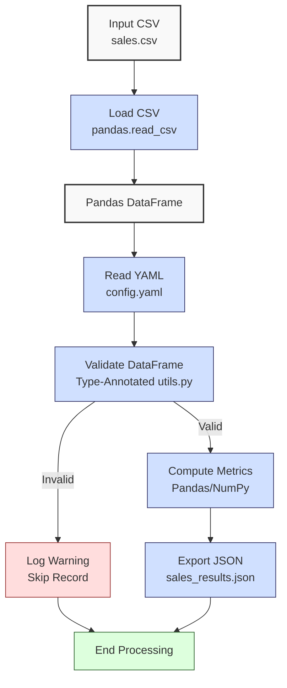

**Complexity: Moderate (M)**

## 7.0 Introduction: Why This Matters for Data Engineering

Static typing in Python enhances code reliability and maintainability, critical for Hijra Group’s Sharia-compliant fintech analytics, where data pipelines process millions of financial transactions. Think of static typing like a grocery list with specific items (e.g., ‘2 apples’) versus a vague note (‘some fruit’). Just as the list ensures you buy exactly what’s needed, type annotations ensure your code uses the right data types, preventing errors in Hijra Group’s financial pipelines. By enforcing type safety with tools like **Pyright**, errors like passing a string to a numeric function are caught before runtime, reducing bugs in production. For example, a pipeline handling `sales.csv` can ensure `price` is a `float`, preventing type-related failures. This chapter builds on Chapters 1–6 (Python basics, data handling, NumPy, Pandas, OOP) and introduces **type annotations**, **Pyright**, and **Generics**, ensuring robust pipelines. All Python code from this chapter onward includes type annotations verified by Pyright, per the curriculum’s guidelines, using **4-space indentation** per PEP 8 (spaces, not tabs) to avoid `IndentationError`.

### Data Engineering Workflow Context

Static typing fits into the pipeline as follows:



### Building On and Preparing For

- **Building On**:
  - Chapter 1: Extends Python syntax with type annotations for variables and functions.
  - Chapter 2: Enhances file handling and validation with typed inputs/outputs.
  - Chapter 3: Applies type safety to Pandas/NumPy operations on `sales.csv`.
  - Chapter 5: Uses OOP to structure typed classes for data processing.
  - Chapter 6: Integrates type annotations into consolidated Python skills.
- **Preparing For**:
  - Chapter 8: Adds annotations and decorators for logging/monitoring.
  - Chapter 9: Enables type-safe testing with `unittest`/`pytest`.
  - Chapter 13: Supports type-safe SQLite integration with Pydantic.
  - Chapter 41: Prepares for type-safe data processing with advanced Pydantic.

### What You’ll Learn

This chapter covers:

1. **Type Annotations**: Syntax for variables, functions, and classes, including the `Any` type.
2. **Pyright**: Setup and usage for type checking.
3. **Generics**: Flexible typing for reusable code.
4. **Basic Exception Handling**: Typed exception handling (introduced here, expanded in Chapter 8).
5. **Micro-Project**: A type-safe sales data processor with Pyright verification.

By the end, you’ll build a type-safe processor for `data/sales.csv`, validating data with type annotations, checking with Pyright, and handling basic exceptions, all with 4-space indentation per PEP 8. The project uses `sales.csv` and `config.yaml` from Appendix 1, preparing for advanced typing and testing.

**Follow-Along Tips**:

- Ensure `de-onboarding/data/` contains `sales.csv` and `config.yaml` per Appendix 1.
- Install libraries: `pip install numpy pandas pyyaml pyright`.
- Configure editor for **4-space indentation** (VS Code: “Editor: Tab Size” = 4, “Editor: Insert Spaces” = true, “Editor: Detect Indentation” = false).
- Run `python -tt script.py` to detect tab/space mixing.
- Use print statements (e.g., `print(df.dtypes)`) to debug DataFrames.
- Verify Pyright setup with `pyright --version`.
- Use UTF-8 encoding to avoid `UnicodeDecodeError`.

## 7.1 Type Annotations Basics

Type annotations, introduced in Python 3.5 via PEP 484, allow specifying variable, function, and class types, checked statically by tools like Pyright. They don’t affect runtime but catch errors during development, reducing bugs in data pipelines. For example, annotating `price: float` ensures a pipeline processes financial data correctly.

### 7.1.1 Variable and Function Annotations

Annotate variables and functions using `: type` and `-> return_type`. Common types include built-in (`int`, `float`, `str`) and `typing` module types (`List`, `Dict`, `Optional`).

```python
# File: de-onboarding/type_basics.py
from typing import List, Dict, Any, Optional  # Import typing module

# Variable annotations
price: float = 999.99  # Annotate price as float
quantity: int = 2  # Annotate quantity as integer
products: List[str] = ["Halal Laptop", "Halal Mouse"]  # List of strings
config: Dict[str, Any] = {"min_price": 10.0}  # Dictionary with string keys
# Optional[str] is useful for pipeline configs, e.g., optional file paths in data ingestion
config_path: Optional[str] = None  # Optional type allows None; covered fully in Chapter 13

# Function annotations
def calculate_total(prices: List[float], quantities: List[int]) -> float:
    """Calculate total sales with type annotations."""
    if len(prices) != len(quantities):  # Validate input lengths
        print("Error: Mismatched lengths")  # Debug
        return 0.0
    total: float = sum(p * q for p, q in zip(prices, quantities))  # Compute total
    print(f"Total: {total}")  # Debug
    return total

# Test function
result: float = calculate_total([999.99, 24.99], [2, 10])  # Call with valid types
print(f"Result: {result}")  # Print result

# Expected Output:
# Total: 2249.88
# Result: 2249.88
```

**The `Any` Type**

The `Any` type allows any value, offering flexibility when types are unknown, like in `config: Dict[str, Any]` for mixed YAML data. However, use it as a last resort, as it bypasses type checking, risking errors in pipelines. Using `Any` for transaction amounts could lead to errors, like treating a string as a number, disrupting Hijra Group’s analytics. Prefer specific types (e.g., `float`, `str`) for reliability.

```python
from typing import Any

risky: Any = "1000.00"  # Could be str, float, etc., risking misprocessing transactions
safe: float = 1000.00  # Enforces float, safer for financial calculations
```

This diagram shows how `Any` skips checks, risking errors, while `float` ensures safety:



**Follow-Along Instructions**:

1. Ensure `de-onboarding/` exists.
2. Save as `de-onboarding/type_basics.py`.
3. Configure editor for 4-space indentation per PEP 8.
4. Install Pyright: `pip install pyright`.
5. Run Pyright: `pyright type_basics.py`.
6. Run script: `python type_basics.py`.
7. Verify output matches comments.
8. **Common Errors**:
   - **Pyright Error**: If `reportGeneralTypeIssues`, ensure correct types (e.g., `List[float]` not `list[float]`). Check with `pyright --verbose`.
   - **ModuleNotFoundError**: Install `pyright` with `pip install pyright`.
   - **IndentationError**: Use 4 spaces. Run `python -tt type_basics.py`.

**Key Points**:

- **Syntax**: `: type` for variables/arguments, `-> type` for return values.
- **Types**: Built-in (`int`, `float`, `str`) and `typing` module (`List`, `Dict`, `Any`, `Optional`).
- **Any Type**: Use sparingly to avoid unchecked types; prefer specific types for pipeline safety.
- **Time Complexity**: Annotations are checked statically, adding no runtime cost (O(1)).
- **Space Complexity**: Minimal memory for type metadata during static analysis.
- **Implication**: Ensures type safety for pipeline inputs, e.g., `price` as `float` in sales data.

### 7.1.2 Class Annotations

Annotate class attributes and methods for structured data processing.

```python
# File: de-onboarding/class_types.py
from typing import List

class Sale:
    product: str  # Class attribute annotation
    price: float
    quantity: int

    def __init__(self, product: str, price: float, quantity: int) -> None:
        """Initialize Sale with type annotations."""
        self.product = product
        self.price = price
        self.quantity = quantity

    def get_amount(self) -> float:
        """Calculate sale amount."""
        amount: float = self.price * self.quantity
        print(f"Amount for {self.product}: {amount}")  # Debug
        return amount

# Test class
sale: Sale = Sale("Halal Laptop", 999.99, 2)  # Create instance
amount: float = sale.get_amount()  # Call method
print(f"Total Amount: {amount}")  # Print result

# Expected Output:
# Amount for Halal Laptop: 1999.98
# Total Amount: 1999.98
```

**Follow-Along Instructions**:

1. Save as `de-onboarding/class_types.py`.
2. Configure editor for 4-space indentation per PEP 8.
3. Run Pyright: `pyright class_types.py`.
4. Run script: `python class_types.py`.
5. Verify output matches comments.
6. **Common Errors**:
   - **Pyright Error**: Ensure method return types match (e.g., `-> float`). Check `pyright --verbose`.
   - **IndentationError**: Use 4 spaces. Run `python -tt class_types.py`.

**Key Points**:

- **Class Annotations**: Attributes use `: type` at class level or in `__init__`.
- **Methods**: Annotate arguments and return types like functions.
- **Implication**: Structures data for pipelines, e.g., `Sale` class for sales records.

## 7.2 Pyright Setup and Usage

Pyright is a static type checker that verifies annotations, catching errors like passing a `str` to a `float` parameter. It’s faster than mypy, as you explored in our April 19, 2025 discussion, and integrates with VS Code.

### 7.2.1 Setting Up Pyright

Pyright is like a spell-checker for types, scanning your code before it runs. Setting it up involves a configuration file to tell Pyright what to check.



```toml
# File: de-onboarding/pyproject.toml
[tool.pyright]
include = ["*.py"]  # Check all Python files
pythonVersion = "3.10"  # Specify Python version
reportMissingImports = true  # Report missing imports
reportGeneralTypeIssues = true  # Report type errors
```

**Follow-Along Instructions**:

1. Create `de-onboarding/pyproject.toml`.
2. Copy content above.
3. Install Pyright: `pip install pyright`.
4. Verify: `pyright --version`.
5. **Common Errors**:
   - **Pyright Not Found**: Install with `pip install pyright`.
   - **Config Error**: Ensure `pyproject.toml` is in `de-onboarding/`. Print `cat pyproject.toml` (Unix) or `type pyproject.toml` (Windows).

### 7.2.2 Running Pyright

Check a script with Pyright, demonstrating common type errors.

```python
# File: de-onboarding/pyright_example.py
from typing import List

def sum_sales(prices: List[float], quantities: List[int]) -> float:
    """Sum sales with type annotations."""
    total: float = sum(p * q for p, q in zip(prices, quantities))
    return total

# Example 1: Incorrect return type
result: int = sum_sales([999.99, 24.99], [2, 10])  # Error: int instead of float
print(result)

# Example 2: Incorrect input type (uncomment to test Pyright error)
# prices: List[str] = [999.99, 24.99]  # Error: List[str] instead of List[float]
# result: float = sum_sales(prices, [2, 10])
# print(result)

# Fix for Example 2 (comment out erroneous lines above and use this)
prices: List[float] = [999.99, 24.99]  # Correct type
result: float = sum_sales(prices, [2, 10])  # Correct return type
print(result)
```

**Follow-Along Instructions**:

1. Save as `de-onboarding/pyright_example.py`.
2. Configure editor for 4-space indentation per PEP 8.
3. Run Pyright: `pyright pyright_example.py`.
4. Expected Pyright Output for Example 1:
   ```
   /de-onboarding/pyright_example.py
     /de-onboarding/pyright_example.py:7:10 - error: Type of "result" is incompatible with declared type
       Expected: "int"
       Actual: "float" (reportGeneralTypeIssues)
   ```
5. Test Example 2 by uncommenting erroneous lines, running Pyright, and observing:
   ```
   /de-onboarding/pyright_example.py
     /de-onboarding/pyright_example.py:11:10 - error: Argument of type "List[str]" cannot be assigned to parameter "prices" of type "List[float]" (reportGeneralTypeIssues)
   ```
6. Fix by using the corrected lines, re-run Pyright to confirm no errors, and run script: `python pyright_example.py`.
7. Expected Output:
   ```
   2249.88
   ```
8. **Common Errors**:
   - **Pyright Error**: Fix type mismatches. Use `pyright --verbose` for details. If output is unclear, use `pyright --verbose | grep error` (Unix) or `pyright --verbose | findstr error` (Windows) to filter errors. These commands use basic command-line skills from prerequisites; review LinuxCommand.org if needed.
   - **IndentationError**: Use 4 spaces. Run `python -tt pyright_example.py`.

If Pyright errors confuse you, start by checking variable types with `print(type(var))` in your code. For example, if processing transaction prices, ensure `price` is `float` to avoid miscalculations in Hijra Group’s reports. This simple step helps debug financial data errors.

**Key Points**:

- **Pyright**: Checks types statically, reporting errors before runtime.
- **Time Complexity**: O(n) for checking n lines of code, typically fast (<1s for small projects).
- **Space Complexity**: O(n) for storing type metadata.
- **Implication**: Catches type errors in pipelines, e.g., ensuring `price` is `float`.

## 7.3 Generics for Reusable Code

Generics, from the `typing` module, allow flexible typing for reusable functions/classes, e.g., processing lists of any numeric type in financial transactions.



```python
# File: de-onboarding/generics_example.py
from typing import TypeVar, List

T = TypeVar("T", int, float)  # Define generic type for numbers

def sum_transactions(values: List[T]) -> T:
    """Sum transaction amounts with generics."""
    total: T = sum(values)  # Type-safe sum
    print(f"Total Transactions: {total}")  # Debug
    return total

# Test with different types
sales: float = sum_transactions([999.99, 24.99])  # Sales amounts
quantities: int = sum_transactions([2, 10])  # Quantities
print(f"Sales Sum: {sales}")  # Print sales sum
print(f"Quantities Sum: {quantities}")  # Print quantities sum

# Expected Output:
# Total Transactions: 1024.98
# Total Transactions: 12
# Sales Sum: 1024.98
# Quantities Sum: 12
```

**Follow-Along Instructions**:

1. Save as `de-onboarding/generics_example.py`.
2. Configure editor for 4-space indentation per PEP 8.
3. Run Pyright: `pyright generics_example.py`.
4. Run script: `python generics_example.py`.
5. Verify output matches comments.
6. **Common Errors**:
   - **Pyright Error**: Ensure `TypeVar` constraints match (e.g., `int`, `float`). Check `pyright --verbose`.
   - **IndentationError**: Use 4 spaces. Run `python -tt generics_example.py`.

**Key Points**:

- **TypeVar**: Defines generic types with constraints (e.g., `int`, `float`).
- **Beginner Tip**: Think of Generics as a template for functions, letting you sum sales (`float`) or quantities (`int`) with one function, saving time in pipeline coding.
- **Use Case**: Reusable functions for pipeline components, e.g., summing transaction amounts.
- **Time/Space Complexity**: No runtime impact; static analysis only. For large pipelines, Pyright’s static analysis may take O(n log n) for complex Generic types due to type inference, but this is negligible for typical projects.
- **Implication**: Enhances code flexibility for Hijra Group’s varied data types.

## 7.4 Basic Exception Handling with Types

Introduce basic exception handling with typed exceptions, expanded in Chapter 8. Avoid advanced constructs like context managers.

```python
# File: de-onboarding/exception_types.py
from typing import List

def divide_sales(total: float, count: int) -> float:
    """Divide total sales by count with typed exception."""
    try:
        result: float = total / count
        print(f"Result: {result}")  # Debug
        return result
    except ZeroDivisionError as e:  # Typed exception
        print(f"Error: {e}")  # Log error
        return 0.0

# Test
result: float = divide_sales(1000.0, 0)  # Test division by zero
print(f"Final Result: {result}")  # Print result

# Expected Output:
# Error: division by zero
# Final Result: 0.0
```

**Follow-Along Instructions**:

1. Save as `de-onboarding/exception_types.py`.
2. Configure editor for 4-space indentation per PEP 8.
3. Run Pyright: `pyright exception_types.py`.
4. Run script: `python exception_types.py`.
5. Verify output matches comments.
6. **Common Errors**:
   - **Pyright Error**: Ensure return type matches (e.g., `-> float`). Check `pyright --verbose`.
   - **IndentationError**: Use 4 spaces. Run `python -tt exception_types.py`.

**Key Points**:

- **Syntax**: `try/except` with specific exceptions (e.g., `ZeroDivisionError`).
- **Type Safety**: Annotate return types consistently, even in `except` blocks.
- **Time Complexity**: O(1) for exception handling (negligible unless frequent).
- **Space Complexity**: O(1) for exception objects.
- **Implication**: Prevents pipeline crashes, e.g., handling invalid sales counts.
- **Minimal Handling**: Minimal exception handling ensures simplicity for beginners, with comprehensive error management introduced in Chapter 8.

## 7.5 Micro-Project: Type-Safe Sales Data Processor

### Project Requirements

Build a type-safe sales data processor for `data/sales.csv`, enhancing Chapter 3’s processor with type annotations and Pyright verification. The processor validates sales data, computes metrics, and exports results, ensuring type safety for Hijra Group’s analytics pipelines.

- Load `data/sales.csv` with `pandas.read_csv`.
- Read `data/config.yaml` with PyYAML.
- Validate records using type-annotated functions and Pandas.
- Compute total sales and top 3 products using NumPy/Pandas.
- Export to `data/sales_results.json`.
- Log steps and invalid records with print statements.
- Use try/except for basic file and parsing errors.
- Use **4-space indentation** per PEP 8 (spaces, not tabs).
- Verify with Pyright to ensure type safety.

### Sample Input Files

`data/sales.csv` (from Appendix 1):

```csv
product,price,quantity
Halal Laptop,999.99,2
Halal Mouse,24.99,10
Halal Keyboard,49.99,5
,29.99,3
Monitor,invalid,2
Headphones,5.00,150
```

`data/config.yaml` (from Appendix 1):

```yaml
min_price: 10.0
max_quantity: 100
required_fields:
  - product
  - price
  - quantity
product_prefix: 'Halal'
max_decimals: 2
```

### Data Processing Flow



### Acceptance Criteria

- **Go Criteria**:
  - Loads `sales.csv` and `config.yaml` with type-annotated functions.
  - Validates records for required fields, Halal prefix, numeric price/quantity, positive prices, and config rules.
  - Computes total sales and top 3 products.
  - Exports to `data/sales_results.json`.
  - Logs steps and invalid records.
  - Uses try/except for file and YAML errors.
  - Passes Pyright checks with no type errors.
  - Uses 4-space indentation per PEP 8.
- **No-Go Criteria**:
  - Fails to load files or validate data.
  - Incorrect calculations or JSON export.
  - Fails Pyright checks.
  - Uses tabs or inconsistent indentation.

### Common Pitfalls to Avoid

1. **Pyright Type Errors**:
   - **Problem**: Incorrect annotations (e.g., `List[str]` instead of `list[str]` for Python 3.9+).
   - **Solution**: Use `pyright --verbose` to debug. Print variable types with `print(type(var))`.
2. **FileNotFoundError**:
   - **Problem**: Missing `sales.csv` or `config.yaml`.
   - **Solution**: Print paths with `print(csv_path)`. Ensure files exist per Appendix 1.
3. **YAML Parsing Errors**:
   - **Problem**: Invalid YAML syntax.
   - **Solution**: Print `open(config_path).read()` to inspect. Use YAML linter.
4. **Pandas Type Mismatches**:
   - **Problem**: Non-numeric `price` causes errors.
   - **Solution**: Validate with `is_numeric_value`. Print `df.dtypes`.
5. **Type Errors in Financial Data**:
   - **Problem**: Using `str` for `price` in calculations causes errors.
   - **Solution**: Ensure `float` with `is_numeric_value`. Print `df["price"].apply(type)`.
6. **Overusing `Any`**:
   - **Problem**: Using `Any` for `config` risks unchecked types in financial data.
   - **Solution**: Use specific types where known, and limit `Any` to mixed data like YAML.
7. **IndentationError**:
   - **Problem**: Mixed spaces/tabs.
   - **Solution**: Use 4 spaces. Run `python -tt sales_processor.py`.

### How This Differs from Production

In production, this solution would include:

- **Advanced Error Handling**: Context managers and custom exceptions (Chapter 8).
- **Testing**: Unit tests with `pytest` (Chapter 9).
- **Logging**: File-based logging (Chapter 52).
- **Scalability**: Chunked processing for large CSVs (Chapter 40).
- **CI/CD**: Pre-commit hooks with Pyright (Chapter 10).

### Implementation

```python
# File: de-onboarding/utils.py
from typing import Dict, Any, Union, List

def is_numeric(s: str, max_decimals: int = 2) -> bool:
    """Check if string is a decimal number with up to max_decimals."""
    parts: List[str] = s.split(".")  # Split on decimal point
    if len(parts) != 2 or not parts[0].isdigit() or not parts[1].isdigit():
        return False  # Invalid format
    return len(parts[1]) <= max_decimals  # Check decimal places

def clean_string(s: str) -> str:
    """Strip whitespace from string."""
    return s.strip()

def is_numeric_value(x: Any) -> bool:
    """Check if value is an integer or float."""
    return isinstance(x, (int, float))  # Return True for numeric types

def has_valid_decimals(x: Union[int, float], max_decimals: int) -> bool:
    """Check if value has valid decimal places."""
    return is_numeric(str(x), max_decimals)  # Use is_numeric for validation

def apply_valid_decimals(x: Union[int, float], max_decimals: int) -> bool:
    """Apply has_valid_decimals to a value."""
    return has_valid_decimals(x, max_decimals)

def is_integer(x: Any) -> bool:
    """Check if value is an integer when converted to string."""
    return str(x).isdigit()  # Return True for integer strings

def validate_sale(sale: Dict[str, str], config: Dict[str, Any]) -> bool:
    """
    Validate sale based on config rules.
    Note: Uses `Dict[str, str]` for CSV string parsing; advanced typing
    (e.g., `Union`) is covered in Chapter 13.
    """
    required_fields: List[str] = config["required_fields"]  # Get required fields
    min_price: float = config["min_price"]  # Get minimum price
    max_quantity: int = config["max_quantity"]  # Get maximum quantity
    prefix: str = config["product_prefix"]  # Get product prefix
    max_decimals: int = config["max_decimals"]  # Get max decimal places

    print(f"Validating sale: {sale}")  # Debug: print sale
    # Check for missing or empty fields
    for field in required_fields:  # Loop through required fields
        if not sale.get(field) or clean_string(sale[field]) == "":
            print(f"Invalid sale: missing {field}: {sale}")  # Log invalid
            return False

    # Validate product: non-empty and matches prefix
    product: str = clean_string(sale["product"])  # Clean product string
    if not product.startswith(prefix):  # Check prefix
        print(f"Invalid sale: product lacks '{prefix}' prefix: {sale}")  # Log invalid
        return False

    # Validate price: numeric, meets minimum, and positive
    price: str = clean_string(sale["price"])  # Clean price string
    if not is_numeric(price, max_decimals) or float(price) < min_price or float(price) <= 0:
        print(f"Invalid sale: invalid price: {sale}")  # Log invalid
        return False

    # Validate quantity: integer and within limit
    quantity: str = clean_string(sale["quantity"])  # Clean quantity string
    if not quantity.isdigit() or int(quantity) > max_quantity:
        print(f"Invalid sale: invalid quantity: {sale}")  # Log invalid
        return False

    return True  # Return True if all checks pass

# File: de-onboarding/sales_processor.py
import pandas as pd
import numpy as np
import yaml
import json
from typing import Dict, Any, Tuple, List, Optional
import utils
import os

# Uses `Any` for YAML flexibility; prefer specific types (e.g., `Dict[str, float]`) when possible to ensure type safety
def read_config(config_path: Optional[str]) -> Dict[str, Any]:
    """Read YAML configuration."""
    try:
        if config_path is None:
            raise ValueError("Config path cannot be None")
        print(f"Opening config: {config_path}")  # Debug
        with open(config_path, "r") as file:
            config: Dict[str, Any] = yaml.safe_load(file)
        print(f"Loaded config: {config}")  # Debug
        return config
    except (FileNotFoundError, yaml.YAMLError, ValueError) as e:
        # Other possible errors (e.g., PermissionError) are handled in Chapter 8
        print(f"Error loading config: {e}")  # Log error
        return {}

def load_and_validate_sales(csv_path: str, config: Dict[str, Any]) -> Tuple[pd.DataFrame, int, int]:
    """Load sales CSV and validate using Pandas."""
    try:
        print(f"Loading CSV: {csv_path}")  # Debug
        df: pd.DataFrame = pd.read_csv(csv_path)  # Load CSV
        print("Initial DataFrame:")  # Debug
        print(df.head())  # Show first 5 rows

        # Validate required fields
        required_fields: List[str] = config["required_fields"]
        missing_fields: List[str] = [f for f in required_fields if f not in df.columns]
        if missing_fields:
            print(f"Missing columns: {missing_fields}")  # Log error
            return pd.DataFrame(), 0, len(df)

        # Clean and filter DataFrame
        df = df.dropna(subset=["product"])  # Drop missing product
        df = df[df["product"].str.startswith(config["product_prefix"])]  # Filter Halal
        df = df[df["quantity"].apply(utils.is_integer)]  # Ensure integer quantity
        df["quantity"] = df["quantity"].astype(int)  # Convert to int
        df = df[df["quantity"] <= config["max_quantity"]]  # Filter quantity
        df = df[df["price"].apply(utils.is_numeric_value)]  # Ensure numeric price
        df = df[df["price"] > 0]  # Filter positive prices
        df = df[df["price"] >= config["min_price"]]  # Filter min price
        df = df[df["price"].apply(lambda x: utils.apply_valid_decimals(x, config["max_decimals"]))]  # Check decimals

        total_records: int = len(df)
        print("Validated DataFrame:")  # Debug
        print(df)
        return df, len(df), total_records
    except FileNotFoundError as e:
        # Other possible errors (e.g., PermissionError, TypeError) are handled in Chapter 8
        print(f"Error loading CSV: {e}")  # Log error
        return pd.DataFrame(), 0, 0

def process_sales(df: pd.DataFrame, config: Dict[str, Any]) -> Tuple[Dict[str, Any], int]:
    """Process sales: compute total and top products."""
    if df.empty:
        print("No valid sales data")  # Log empty
        return {"total_sales": 0.0, "unique_products": [], "top_products": {}}, 0

    # Compute amount
    df["amount"] = df["price"] * df["quantity"]  # Price * quantity
    print("DataFrame with Amount:")  # Debug
    print(df)

    # Compute metrics
    total_sales: float = float(np.sum(df["amount"].values))  # Total sales
    unique_products: List[str] = df["product"].unique().tolist()  # Unique products
    sales_by_product: pd.Series = df.groupby("product")["amount"].sum()  # Group by product
    top_products: Dict[str, float] = sales_by_product.sort_values(ascending=False).head(3).to_dict()

    valid_sales: int = len(df)
    print(f"Valid sales: {valid_sales} records")  # Log count

    return {
        "total_sales": total_sales,
        "unique_products": unique_products,
        "top_products": top_products
    }, valid_sales

def export_results(results: Dict[str, Any], json_path: str) -> None:
    """Export results to JSON."""
    try:
        print(f"Writing to: {json_path}")  # Debug
        print(f"Results: {results}")  # Debug
        with open(json_path, "w") as file:
            json.dump(results, file, indent=2)
        print(f"Exported results to {json_path}")  # Confirm
    except (FileNotFoundError, PermissionError) as e:
        # Other possible errors (e.g., TypeError) are handled in Chapter 8
        print(f"Error exporting JSON: {e}")  # Log error

def main() -> None:
    """Main function to process sales data."""
    csv_path: str = "data/sales.csv"
    config_path: str = "data/config.yaml"
    json_path: str = "data/sales_results.json"

    config: Dict[str, Any] = read_config(config_path)
    if not config:
        print("Failed to load config, exiting")
        return

    df: pd.DataFrame
    valid_sales: int
    total_records: int
    df, valid_sales, total_records = load_and_validate_sales(csv_path, config)

    results: Dict[str, Any]
    results, valid_sales = process_sales(df, config)

    export_results(results, json_path)

    # Output report
    print("\nSales Report:")
    print(f"Total Records Processed: {total_records}")
    print(f"Valid Sales: {valid_sales}")
    print(f"Invalid Sales: {total_records - valid_sales}")
    print(f"Total Sales: ${round(results['total_sales'], 2)}")
    print(f"Unique Products: {results['unique_products']}")
    print(f"Top Products: {results['top_products']}")
    print("Processing completed")

if __name__ == "__main__":
    main()
```

### Expected Outputs

`data/sales_results.json`:

```json
{
  "total_sales": 2499.83,
  "unique_products": ["Halal Laptop", "Halal Mouse", "Halal Keyboard"],
  "top_products": {
    "Halal Laptop": 1999.98,
    "Halal Mouse": 249.9,
    "Halal Keyboard": 249.95
  }
}
```

**Console Output** (abridged):

```
Opening config: data/config.yaml
Loaded config: {'min_price': 10.0, 'max_quantity': 100, 'required_fields': ['product', 'price', 'quantity'], 'product_prefix': 'Halal', 'max_decimals': 2}
Loading CSV: data/sales.csv
Initial DataFrame:
          product   price  quantity
0   Halal Laptop  999.99         2
1    Halal Mouse   24.99        10
2  Halal Keyboard   49.99         5
3            NaN   29.99         3
4       Monitor      NaN         2
Validated DataFrame:
          product   price  quantity
0   Halal Laptop  999.99         2
1    Halal Mouse   24.99        10
2  Halal Keyboard   49.99         5
DataFrame with Amount:
          product   price  quantity   amount
0   Halal Laptop  999.99         2  1999.98
1    Halal Mouse   24.99        10   249.90
2  Halal Keyboard   49.99         5   249.95
Valid sales: 3 records
Writing to: data/sales_results.json
Exported results to data/sales_results.json

Sales Report:
Total Records Processed: 3
Valid Sales: 3
Invalid Sales: 0
Total Sales: $2499.83
Unique Products: ['Halal Laptop', 'Halal Mouse', 'Halal Keyboard']
Top Products: {'Halal Laptop': 1999.98, 'Halal Mouse': 249.9, 'Halal Keyboard': 249.95}
Processing completed
```

### How to Run and Test

1. **Setup**:

   1. Create `de-onboarding/data/` and save `sales.csv`, `config.yaml` per Appendix 1.
   2. Install libraries: `pip install numpy pandas pyyaml pyright`.
   3. Create `pyproject.toml` in `de-onboarding/`.
   4. Save `utils.py` and `sales_processor.py`.
   5. Configure editor for 4-space indentation per PEP 8.

2. **Run**:

   - Run Pyright: `pyright sales_processor.py`.
   - Run script: `python sales_processor.py`.
   - Verify outputs: `sales_results.json` and console logs.
   - Verify JSON content: `cat data/sales_results.json` (Unix) or `type data\sales_results.json` (Windows).

3. **Test Scenarios**:
   - **Valid Data**: Check `sales_results.json` for correct metrics.
   - **Empty Config**: Modify `read_config` to return `{}` and verify graceful exit.
   - **Invalid CSV**: Test with non-existent CSV to trigger `FileNotFoundError`.
   - **Type Error**: Modify `process_sales` to annotate `total_sales: int` instead of `float`, run `pyright sales_processor.py`, verify error, and revert to `float`.
   - **Optional Type**: Call `read_config(None)` without modifying the function, run `python sales_processor.py`, and verify it raises a `ValueError`. Check Pyright to confirm - **Expected Output**: confirm `Optional[str]` allows `None` but the function rejects it.

## 7.6 Practice Exercises

### Exercise 1: Type-Annotated Sales Calculator

Write a type-annotated function to compute total sales, verified by Pyright.

**Sample Input**:

```python
prices: List[float] = [999.99, 24.99, 49.99]
quantities: List[int] = [2, 10, 5]
```

**Expected Output**:

```
2499.83
```

**Follow-Along Instructions**:

1. Save as `de-onboarding/ex1_sales.py`.
2. Configure editor for 4-space indentation per PEP 8.
3. Run Pyright: `pyright ex1_sales.py`.
4. Run: `python ex1_sales.py`.
5. **How to Test**:
   - Add: `print(calculate_sales([999.99, 24.99, 49.99], [2, 10, 5]))`.
   - Verify output: `2499.83`.
   - Test with mismatched lengths: Should return `0.0`.
   - Introduce a type error (e.g., `result: int`), run Pyright, and fix.

### Exercise 2: Type-Annotated Data Loader

Write a type-annotated function to load and filter `data/sample.csv` for Halal products.

**Sample Input** (`data/sample.csv`):

```csv
product,price,quantity
Halal Laptop,999.99,2
Halal Mouse,24.99,10
```

**Expected Output**:

```
          product   price  quantity
0   Halal Laptop  999.99         2
1    Halal Mouse   24.99        10
Count: 2
```

**Follow-Along Instructions**:

1. Save as `de-onboarding/ex2_loader.py`.
2. Ensure `data/sample.csv` exists per Appendix 1.
3. Configure editor for 4-space indentation per PEP 8.
4. Run Pyright: `pyright ex2_loader.py`.
5. Run: `python ex2_loader.py`.
6. **How to Test**:
   - Add: `df, count = load_halal_sales("data/sample.csv"); print(df); print(f"Count: {count}")`.
   - Verify output matches expected.
   - Test with non-existent CSV to trigger `FileNotFoundError`.

### Exercise 3: Generic Sum Function

Write a generic function to sum a list of numbers, verified by Pyright.

**Sample Input**:

```python
int_values: List[int] = [1, 2, 3]
float_values: List[float] = [1.5, 2.5, 3.5]
```

**Expected Output**:

```
Int Sum: 6
Float Sum: 7.5
```

**Follow-Along Instructions**:

1. Save as `de-onboarding/ex3_generic.py`.
2. Configure editor for 4-space indentation per PEP 8.
3. Run Pyright: `pyright ex3_generic.py`.
4. Run: `python ex3_generic.py`.
5. **How to Test**:
   - Add: `print(f"Int Sum: {sum_transactions([1, 2, 3])}"); print(f"Float Sum: {sum_transactions([1.5, 2.5, 3.5])}")`.
   - Verify output matches expected.
   - Test with incorrect type (e.g., `List[str]`) to trigger Pyright error.

### Exercise 4: Conceptual Analysis of Generics

Explain how Generics in the `sum_transactions` function (Section 7.3) enable code reuse across `int` and `float` lists, and why this benefits pipeline scalability. Write a 50–100 word explanation, addressing code reuse, type safety, and scalability, using bullet points. Save to `de-onboarding/ex4_concepts.txt`.

**Expected Output** (`ex4_concepts.txt`):

```
- Code Reuse: Generics in sum_transactions allow one function to process List[int] and List[float], reducing duplication.
- Type Safety: Pyright ensures correct types, preventing errors in pipelines.
- Scalability: Reusability supports diverse numeric data (e.g., sales, quantities) for Hijra Group’s analytics, minimizing maintenance and enabling modular pipeline design.
```

**Follow-Along Instructions**:

1. Write explanation in `de-onboarding/ex4_concepts.txt`.
2. Verify content addresses code reuse, type safety, and scalability within 50–100 words using bullet points.
3. **How to Test**:
   - Check `ex4_concepts.txt` matches expected themes.
   - Discuss with peers to ensure clarity.

### Exercise 5: Typed Exception Handling

Write a function to divide sales with typed exception handling.

**Sample Input**:

```python
total: float = 1000.0
count: int = 0
```

**Expected Output**:

```
Error: division by zero
Result: 0.0
```

**Follow-Along Instructions**:

1. Save as `de-onboarding/ex5_exception.py`.
2. Configure editor for 4-space indentation per PEP 8.
3. Run Pyright: `pyright ex5_exception.py`.
4. Run: `python ex5_exception.py`.
5. **How to Test**:
   - Add: `print(divide_sales(1000.0, 0))`.
   - Verify output matches expected.
   - Test with valid input (e.g., `count=2`) to ensure correct division.

### Exercise 6: Debug a Pyright Error

Fix this code with a Pyright type error.

**Buggy Code**:

```python
from typing import List

def sum_sales(prices: List[float], quantities: List[int]) -> float:
    """Sum sales with type annotations."""
    total: float = sum(p * q for p, q in zip(prices, quantities))
    return total

result: int = sum_sales([999.99, 24.99], [2, 10])  # Error: int instead of float
print(result)
```

**Expected Output**:

```
2249.88
```

**Follow-Along Instructions**:

1. Save as `de-onboarding/ex6_debug.py`.
2. Configure editor for 4-space indentation per PEP 8.
3. Run Pyright: `pyright ex6_debug.py` to see error.
4. Fix and re-run.
5. **How to Test**:
   - Verify output matches expected.
   - Test with additional inputs to ensure correct summation.

### Exercise 7: Refactor `Any` to Specific Types

Refactor a function using `Any` to use specific types, verified by Pyright. Given `def process_data(data: Any) -> Any`, which accepts any input and returns any output, refactor it to `def process_data(prices: List[float]) -> float` to sum sales prices. Write a 50-word explanation in `de-onboarding/ex7_explanation.txt` explaining why specific types are safer for analytics. Verify with Pyright.

**Sample Input**:

```python
data: Any = [999.99, 24.99]  # Unsafe
prices: List[float] = [999.99, 24.99]  # Safe
```

**Expected Output**:

```
1024.98
```

**Expected Explanation** (`ex7_explanation.txt`):

```
The refactored process_data uses List[float] and float, ensuring Pyright checks for correct types, preventing errors like passing strings. This type safety is crucial for Hijra Group’s analytics, reducing bugs in financial pipelines and ensuring reliable sales calculations compared to Any’s unchecked flexibility.
```

**Follow-Along Instructions**:

1. Save as `de-onboarding/ex7_refactor.py`.
2. Configure editor for 4-space indentation per PEP 8.
3. Run Pyright: `pyright ex7_refactor.py`.
4. Run: `python ex7_refactor.py`.
5. Save explanation in `de-onboarding/ex7_explanation.txt`.
6. **How to Test**:
   - Add: `print(process_data([999.99, 24.99]))`.
   - Verify output: `1024.98`.
   - Test with incorrect type (e.g., `List[str]`) to trigger Pyright error.
   - Check `ex7_explanation.txt` for 50-word explanation.

## 7.6 Exercise Solutions

### Solution to Exercise 1: Type-Annotated Sales Calculator

```python
from typing import List

def calculate_sales(prices: List[float], quantities: List[int]) -> float:
    """Compute total sales with type annotations."""
    if len(prices) != len(quantities):
        print("Error: Mismatched lengths")
        return 0.0
    total: float = sum(p * q for p, q in zip(prices, quantities))
    return total

# Test
result: float = calculate_sales([999.99, 24.99, 49.99], [2, 10, 5])
print(result)  # 2499.83
```

### Solution to Exercise 2: Type-Annotated Data Loader

```python
import pandas as pd
from typing import Tuple

def load_halal_sales(csv_path: str) -> Tuple[pd.DataFrame, int]:
    """Load and filter CSV for Halal products."""
    try:
        df: pd.DataFrame = pd.read_csv(csv_path)
        df = df[df["product"].str.startswith("Halal")]
        return df, len(df)
    except FileNotFoundError as e:
        print(f"Error: {e}")
        return pd.DataFrame(), 0

# Test
df, count = load_halal_sales("data/sample.csv")
print(df)
print(f"Count: {count}")
```

### Solution to Exercise 3: Generic Sum Function

```python
from typing import TypeVar, List

T = TypeVar("T", int, float)

def sum_transactions(values: List[T]) -> T:
    """Sum transaction amounts with generics."""
    return sum(values)

# Test
int_sum: int = sum_transactions([1, 2, 3])
float_sum: float = sum_transactions([1.5, 2.5, 3.5])
print(f"Int Sum: {int_sum}")
print(f"Float Sum: {float_sum}")
```

### Solution to Exercise 4: Conceptual Analysis of Generics

**File**: `de-onboarding/ex4_concepts.txt`

```
- Code Reuse: Generics in sum_transactions allow one function to process List[int] and List[float], reducing duplication.
- Type Safety: Pyright ensures correct types, preventing errors in pipelines.
- Scalability: Reusability supports diverse numeric data (e.g., sales, quantities) for Hijra Group’s analytics, minimizing maintenance and enabling modular pipeline design.
(56 words)
```

### Solution to Exercise 5: Typed Exception Handling

```python
def divide_sales(total: float, count: int) -> float:
    """Divide total sales by count with typed exception."""
    try:
        result: float = total / count
        return result
    except ZeroDivisionError as e:
        print(f"Error: {e}")
        return 0.0

# Test
result: float = divide_sales(1000.0, 0)
print(f"Result: {result}")
```

### Solution to Exercise 6: Debug a Pyright Error

```python
from typing import List

def sum_sales(prices: List[float], quantities: List[int]) -> float:
    """Sum sales with type annotations."""
    total: float = sum(p * q for p, q in zip(prices, quantities))
    return total

result: float = sum_sales([999.99, 24.99], [2, 10])  # Fixed: float
print(result)  # 2249.88
```

**Explanation**:

- **Bug**: `result: int` mismatches the `float` return type of `sum_sales`.
- **Fix**: Change to `result: float`.

### Solution to Exercise 7: Refactor `Any` to Specific Types

```python
from typing import List, Any

# Original function using Any (unsafe)
def process_data(data: Any) -> Any:
    """Sum sales prices (unsafe with Any)."""
    return sum(data)

# Refactored function with specific types
def process_data(prices: List[float]) -> float:
    """Sum sales prices with type safety."""
    return sum(prices)

# Test
result: float = process_data([999.99, 24.99])
print(result)  # 1024.98
```

**Explanation** (`ex7_explanation.txt`):

```
The refactored process_data uses List[float] and float, ensuring Pyright checks for correct types, preventing errors like passing strings. This type safety is crucial for Hijra Group’s analytics, reducing bugs in financial pipelines and ensuring reliable sales calculations compared to Any’s unchecked flexibility.
(49 words)
```

## 7.7 Chapter Summary and Connection to Chapter 8

You’ve mastered:

- **Type Annotations**: For variables, functions, and classes, including cautious use of `Any`.
- **Pyright**: Setup and type checking for pipeline reliability.
- **Generics**: Flexible typing for reusable code.
- **Exception Handling**: Basic typed try/except for robustness.
- **White-Space Sensitivity and PEP 8**: 4-space indentation, spaces over tabs.

The micro-project built a type-safe processor for `sales.csv`, verified by Pyright, ensuring robust data handling for Hijra Group’s analytics. This type-safe processor lays the foundation for capstone projects, where type safety ensures robust ETL pipelines for transaction data, such as validating Sharia-compliant sales amounts across millions of records. This prepares for Chapter 8, which adds **annotations and decorators** for logging and monitoring, enhancing pipeline observability while maintaining type safety.
