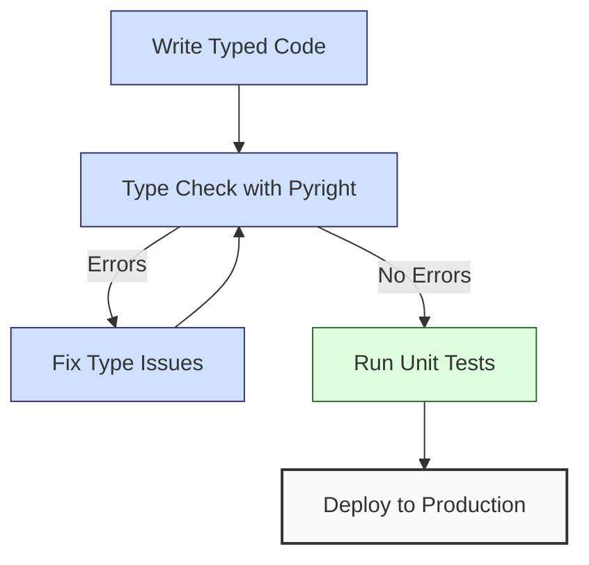

**Complexity: Moderate (M)**

## 7.0 Introduction: Why Static Typing Matters for Data Engineering

As data engineers, we build systems that process critical business information. Errors in these systems can lead to incorrect analyses, failed pipelines, and data integrity issues. Static typing helps us catch many of these errors before our code ever runs, making our systems more robust and easier to maintain.

Let's visualize how static typing fits into the data engineering workflow:



Python is traditionally a dynamically-typed language, where variable types are determined at runtime. With the introduction of type hints in Python 3.5+, we can now add optional static typing to gain several benefits:

1. **Catch Errors Earlier**: Find type-related bugs before running your code
2. **Improve Readability**: Make it clear what types functions expect and return
3. **Better IDE Support**: Get more accurate code completion and documentation
4. **Safer Refactoring**: Change code with confidence, knowing the type checker will catch issues
5. **Self-Documenting Code**: Make your intentions explicit through type annotations

**Important Note on Performance**: Type annotations have no impact on runtime performance because Python ignores them during execution. Type checking happens entirely during development, either in your IDE or when you run tools like pyright. Once your code runs, the type annotations are essentially just documentation. This means you can add comprehensive type safety without worrying about slowing down your data pipelines.

**Python Version Requirements:**

- Function type annotations: Python 3.5+
- Variable type annotations: Python 3.6+
- Advanced typing features: Various versions (we'll specify as we go)
- Type checking with pyright: Compatible with Python 3.5+

In this chapter, we'll explore how to add type annotations to your Python code and use the `pyright` tool to check for type correctness.

## 7.1 Type Annotation Syntax

Python's type annotations use a simple syntax to declare the expected types of variables, function parameters, and return values.

### 7.1.1 Variable Annotations

Variable annotations were introduced in **Python 3.6+**. Let's start with basic variable annotations:

```python
# Basic variable annotations (Python 3.6+)
name: str = "Alice"
age: int = 30
height: float = 5.9
is_active: bool = True

print(f"name is {name}, type: {type(name)}")
print(f"age is {age}, type: {type(age)}")
print(f"height is {height}, type: {type(height)}")
print(f"is_active is {is_active}, type: {type(is_active)}")

# Output:
# name is Alice, type: <class 'str'>
# age is 30, type: <class 'int'>
# height is 5.9, type: <class 'float'>
# is_active is True, type: <class 'bool'>
```

Notice that adding type annotations doesn't change how Python runs the code. The annotations are hints for tools and developers, not runtime checks.

### 7.1.2 Function Parameter and Return Types

Function annotations were introduced in **Python 3.5+** and specify the types of parameters and return values:

```python
# Function with parameter and return type annotations (Python 3.5+)
def calculate_total_price(quantity: int, price: float) -> float:
    """Calculate the total price for a purchase."""
    return quantity * price

total = calculate_total_price(5, 19.99)
print(f"Total price: ${total:.2f}")
# Output:
# Total price: $99.95

# We can see the type annotations using the __annotations__ attribute
print(f"Function annotations: {calculate_total_price.__annotations__}")
# Output:
# Function annotations: {'quantity': <class 'int'>, 'price': <class 'float'>, 'return': <class 'float'>}
```

### 7.1.3 Type Comments for Older Python Versions

If you're working with **Python 3.4 or older**, or need to maintain compatibility with those versions, you can use type comments instead:

```python
# Type comments (for Python 3.4 or older)
name = "Bob"  # type: str
age = 25  # type: int

def calculate_discount(price, percentage):
    # type: (float, float) -> float
    """Calculate the discount amount."""
    return price * (percentage / 100)

discount = calculate_discount(99.99, 20)
print(f"Discount amount: ${discount:.2f}")
# Output:
# Discount amount: $20.00
```

However, for most modern Python development, we recommend using the inline annotation syntax instead of comments when possible. Type checkers like pyright support both styles, but the inline syntax is more readable and better supported by IDEs.

## 7.2 Common Type Annotations

Now let's explore the most common type annotations you'll use in data engineering.

### 7.2.1 Basic Types

Python's typing module (introduced in **Python 3.5+**) provides access to many common types:

```python
# Import the typing module to access more types (Python 3.5+)
from typing import Any, List, Dict, Tuple, Set

# Basic type examples
user_id: int = 12345
username: str = "data_engineer"
temperature: float = 72.8
is_available: bool = False
generic_data: Any = "This could be any type"  # Any type was available since Python 3.5

print(f"User ID: {user_id}")
print(f"Username: {username}")
print(f"Temperature: {temperature}")
print(f"Available: {is_available}")
print(f"Generic data: {generic_data}")

# Output:
# User ID: 12345
# Username: data_engineer
# Temperature: 72.8
# Available: False
# Generic data: This could be any type
```

### 7.2.2 Collection Types

For collections like lists, dictionaries, and tuples, we specify the types of the elements (available since **Python 3.5+**):

```python
from typing import List, Dict, Tuple, Set  # Python 3.5+

# List of integers
numbers: List[int] = [1, 2, 3, 4, 5]

# Dictionary mapping strings to floats
prices: Dict[str, float] = {
    "apple": 0.99,
    "banana": 0.59,
    "orange": 1.29
}

# Tuple with specific types for each position
person: Tuple[str, int, float] = ("Alice", 30, 5.8)

# Set of strings
unique_tags: Set[str] = {"python", "data", "engineering"}

print(f"Numbers: {numbers}")
print(f"Prices: {prices}")
print(f"Person: {person}")
print(f"Unique tags: {unique_tags}")

# Output:
# Numbers: [1, 2, 3, 4, 5]
# Prices: {'apple': 0.99, 'banana': 0.59, 'orange': 1.29}
# Person: ('Alice', 30, 5.8)
# Unique tags: {'python', 'data', 'engineering'}
```

**Note:** In Python 3.9+, you can use the built-in collection types directly for annotations:

```python
# Python 3.9+ simplified syntax
numbers: list[int] = [1, 2, 3, 4, 5]
prices: dict[str, float] = {"apple": 0.99}
person: tuple[str, int, float] = ("Alice", 30, 5.8)
```

### 7.2.3 Nested Collection Types

Collection types can be nested to represent more complex data structures:

```python
from typing import List, Dict, Tuple, Any  # Python 3.5+

# List of dictionaries (common for data processing)
users: List[Dict[str, Any]] = [
    {"id": 1, "name": "Alice", "active": True},
    {"id": 2, "name": "Bob", "active": False}
]

# Dictionary with tuple keys and list values
coordinates_map: Dict[Tuple[int, int], List[str]] = {
    (0, 0): ["origin", "center"],
    (10, 10): ["top-right"],
    (-10, 10): ["top-left"]
}

print(f"Users: {users}")
print(f"Coordinates map: {coordinates_map}")

# Output:
# Users: [{'id': 1, 'name': 'Alice', 'active': True}, {'id': 2, 'name': 'Bob', 'active': False}]
# Coordinates map: {(0, 0): ['origin', 'center'], (10, 10): ['top-right'], (-10, 10): ['top-left']}
```

### 7.2.4 Function Types

We can also define types for functions themselves (available since **Python 3.5+**):

```python
from typing import Callable  # Python 3.5+

# Define a function type: takes two floats and returns a float
MathOperation = Callable[[float, float], float]

def apply_operation(x: float, y: float, operation: MathOperation) -> float:
    """Apply a mathematical operation to two numbers."""
    return operation(x, y)

def add(a: float, b: float) -> float:
    return a + b

def multiply(a: float, b: float) -> float:
    return a * b

result1 = apply_operation(5.0, 3.0, add)
result2 = apply_operation(5.0, 3.0, multiply)

print(f"5 + 3 = {result1}")
print(f"5 * 3 = {result2}")

# Output:
# 5 + 3 = 8.0
# 5 * 3 = 15.0
```

## 7.3 Optional and Union Types

In real-world data engineering, we often deal with data that might be missing or could be of different types.

### 7.3.1 Optional Types

The `Optional` type (available since **Python 3.5+**) indicates that a value could be of a specific type or `None`:

```python
from typing import Optional  # Python 3.5+

# A function that returns a string or None
def get_user_name(user_id: int) -> Optional[str]:
    """Get a user's name from their ID, or None if user doesn't exist."""
    user_database = {
        1: "Alice",
        2: "Bob",
        3: "Charlie"
    }
    return user_database.get(user_id)  # Returns None if key doesn't exist

# Test with existing and non-existing users
for user_id in [1, 4]:
    name = get_user_name(user_id)
    if name is None:
        print(f"User {user_id} not found")
    else:
        print(f"User {user_id}: {name}")

# Output:
# User 1: Alice
# User 4 not found
```

`Optional[str]` is actually a shorthand for `Union[str, None]`. It's a common pattern when a value might be missing.

### 7.3.2 Union Types

The `Union` type (available since **Python 3.5+**) indicates that a value could be one of several types:

```python
from typing import Union, List, Dict, Any  # Python 3.5+

# A value that can be either an int or a string
user_identifier: Union[int, str] = "user_abc"
print(f"User identifier: {user_identifier}")

# Later in the code, we might assign a different type to the same variable
user_identifier = 12345
print(f"User identifier (changed): {user_identifier}")

# Function that accepts different types of data
def process_data(data: Union[List[Dict[str, Any]], Dict[str, Any]]) -> int:
    """Process either a single record or a list of records."""
    if isinstance(data, list):
        # Process a list of records
        record_count = len(data)
        print(f"Processing {record_count} records")
        return record_count
    else:
        # Process a single record
        print("Processing a single record")
        return 1

# Try both types of input
single_record = {"id": 1, "name": "Alice"}
multiple_records = [
    {"id": 1, "name": "Alice"},
    {"id": 2, "name": "Bob"}
]

count1 = process_data(single_record)
count2 = process_data(multiple_records)

print(f"Processed records: {count1}")
print(f"Processed records: {count2}")

# Output:
# User identifier: user_abc
# User identifier (changed): 12345
# Processing a single record
# Processed records: 1
# Processing 2 records
# Processed records: 2
```

**Note:** In Python 3.10+, you can use the pipe operator for unions:

```python
# Python 3.10+ simplified union syntax
user_identifier: int | str = "user_abc"  # Instead of Union[int, str]
```

### If-Type Narrowing

Python's type checker is smart enough to narrow the type based on conditional checks (this feature works in all versions that support type checking):

```python
from typing import Union  # Python 3.5+

def display_length(value: Union[str, list]) -> None:
    """Display the length of a string or list."""
    # Type narrowing through isinstance check
    if isinstance(value, str):
        # Inside this block, the type checker knows value is a string
        print(f"String length: {len(value)}")
    else:
        # Inside this block, the type checker knows value is a list
        print(f"List length: {len(value)}")

# Test with different types
display_length("Hello, world!")
display_length([1, 2, 3, 4])

# Output:
# String length: 13
# List length: 4
```

## 7.4 Generics with TypeVar

In data engineering, we often need to write functions and classes that can operate on different types while maintaining type safety. Python's typing module provides generics through the `TypeVar` class to address this need.

### 7.4.1 Basic Generic Functions

Generic functions can work with multiple types while preserving type information. Here's a simple example using `TypeVar` (available since **Python 3.5+**):

```python
from typing import TypeVar, List, Dict, Any  # Python 3.5+

# Define a type variable
T = TypeVar('T')  # T can be any type

# A generic function that works with any type
def first_element(items: List[T]) -> T:
    """Return the first element from a list of any type."""
    if not items:
        raise ValueError("List is empty")
    return items[0]

# The function works with different types
numbers = [1, 2, 3, 4, 5]
names = ["Alice", "Bob", "Charlie"]
records = [{"id": 1, "name": "Alice"}, {"id": 2, "name": "Bob"}]

first_num = first_element(numbers)
first_name = first_element(names)
first_record = first_element(records)

print(f"First number: {first_num}")
print(f"First name: {first_name}")
print(f"First record: {first_record}")

# Output:
# First number: 1
# First name: Alice
# First record: {'id': 1, 'name': 'Alice'}
```

The key benefit here is that `first_element` preserves the type information. When you call it with a `List[int]`, the return type is correctly inferred as `int`.

### 7.4.2 Multiple Type Variables

You can use multiple type variables in a single function:

```python
from typing import TypeVar, Dict, List, Tuple  # Python 3.5+

K = TypeVar('K')  # Key type
V = TypeVar('V')  # Value type

def get_keys_and_values(data: Dict[K, V]) -> Tuple[List[K], List[V]]:
    """Extract keys and values from a dictionary."""
    keys = list(data.keys())
    values = list(data.values())
    return keys, values

# Use with different dictionary types
user_scores = {"Alice": 95, "Bob": 87, "Charlie": 92}
keys, values = get_keys_and_values(user_scores)

print(f"Keys: {keys}")
print(f"Values: {values}")

# Output:
# Keys: ['Alice', 'Bob', 'Charlie']
# Values: [95, 87, 92]
```

The type checker would infer that `keys` is a `List[str]` and `values` is a `List[int]` in this example.

### 7.4.3 Bounded Type Variables

Sometimes you may want to restrict the types that a generic function can accept. You can do this with bounded type variables:

```python
from typing import TypeVar, List, Callable  # Python 3.5+
from numbers import Number  # For numeric type constraint

# TypeVar with constraints
T = TypeVar('T', str, int)  # T can only be str or int

# TypeVar with bound
N = TypeVar('N', bound=Number)  # N can be any numeric type

def process_items(items: List[T]) -> List[T]:
    """Process a list of strings or integers."""
    return [item for item in items if item]  # Remove empty/zero values

def calculate_average(numbers: List[N]) -> N:
    """Calculate the average of a list of numbers."""
    if not numbers:
        raise ValueError("Empty list")
    total: N = numbers[0] * 0  # Initialize with zero of the same type
    for num in numbers:
        total += num
    return total / len(numbers)

# Test the constrained function
int_list = [1, 0, 3, 0, 5]
str_list = ["apple", "", "banana", "", "cherry"]
processed_ints = process_items(int_list)
processed_strs = process_items(str_list)

print(f"Processed integers: {processed_ints}")
print(f"Processed strings: {processed_strs}")

# Test the bounded function
float_list = [1.5, 2.5, 3.5, 4.5]
avg = calculate_average(float_list)
print(f"Average: {avg}")

# Output:
# Processed integers: [1, 3, 5]
# Processed strings: ['apple', 'banana', 'cherry']
# Average: 3.0
```

### 7.4.4 Generic Classes for Data Engineering

Generic classes are particularly useful in data engineering for creating reusable data structures:

```python
from typing import TypeVar, Generic, List, Dict, Any, Callable  # Python 3.5+

T = TypeVar('T')

class DataBatch(Generic[T]):
    """A batch of data items of a specific type."""

    def __init__(self, items: List[T]):
        self.items = items

    def size(self) -> int:
        """Get the number of items in the batch."""
        return len(self.items)

    def process(self, transform_fn: Callable[[T], T]) -> 'DataBatch[T]':
        """Apply a transformation to each item."""
        transformed = [transform_fn(item) for item in self.items]
        return DataBatch(transformed)

    def __str__(self) -> str:
        return f"DataBatch({self.items})"

# Example usage with different types
# A batch of numbers
number_batch = DataBatch([1, 2, 3, 4, 5])
doubled_batch = number_batch.process(lambda x: x * 2)
print(f"Original: {number_batch}")
print(f"Doubled: {doubled_batch}")

# A batch of records
record_batch = DataBatch([
    {"id": 1, "name": "Alice"},
    {"id": 2, "name": "Bob"}
])

def uppercase_name(record: Dict[str, Any]) -> Dict[str, Any]:
    """Transform a record by uppercasing the name."""
    return {**record, "name": record["name"].upper()}

uppercase_batch = record_batch.process(uppercase_name)
print(f"Records: {record_batch}")
print(f"Uppercase: {uppercase_batch}")

# Output:
# Original: DataBatch([1, 2, 3, 4, 5])
# Doubled: DataBatch([2, 4, 6, 8, 10])
# Records: DataBatch([{'id': 1, 'name': 'Alice'}, {'id': 2, 'name': 'Bob'}])
# Uppercase: DataBatch([{'id': 1, 'name': 'ALICE'}, {'id': 2, 'name': 'BOB'}])
```

Generics are powerful for creating reusable data processing components that maintain type safety. They're extensively used in real-world data engineering libraries and frameworks, and understanding them will help you both use these libraries effectively and write your own type-safe code.

## 7.5 Type Checking with Pyright

Pyright is a static type checker for Python that helps find type-related errors before you run your code. Let's explore how to use it with our type-annotated code.

### 7.5.1 Installing and Running Pyright

First, we need to install pyright:

```bash
# Install pyright using pip
pip install pyright
```

Now, let's create a simple file with some type issues to see how pyright identifies them:

```python
# Save this in a file named type_errors.py
from typing import List, Dict

def add_numbers(a: int, b: int) -> int:
    return a + b

def get_user_names(users: List[Dict[str, str]]) -> List[str]:
    return [user["name"] for user in users]

# Type error: passing a string instead of an int
result = add_numbers(5, "10")
print(f"Result: {result}")

# Type error: missing the 'name' key in one of the dictionaries
users = [
    {"name": "Alice", "email": "alice@example.com"},
    {"email": "bob@example.com"}  # Missing 'name' key
]
names = get_user_names(users)
print(f"Names: {names}")
```

Now let's run pyright to check for type errors:

```bash
# Run pyright on our file
pyright type_errors.py
```

The output should show the type errors:

```
type_errors.py:9:26 - error: Argument of type "str" cannot be assigned to parameter "b" of type "int" (parameter 2)
type_errors.py:16:17 - error: Element may not contain key "name"
```

### 7.5.2 Understanding and Fixing Type Errors

Let's fix the errors in our code:

```python
# Save this in a file named type_errors_fixed.py
from typing import List, Dict, Any

def add_numbers(a: int, b: int) -> int:
    return a + b

def get_user_names(users: List[Dict[str, Any]]) -> List[str]:
    return [user["name"] if "name" in user else "Unknown" for user in users]

# Fixed: convert string to int before passing
result = add_numbers(5, int("10"))
print(f"Result: {result}")

# Fixed: handle missing 'name' key
users = [
    {"name": "Alice", "email": "alice@example.com"},
    {"email": "bob@example.com"}  # Missing 'name' key
]
names = get_user_names(users)
print(f"Names: {names}")

# Output:
# Result: 15
# Names: ['Alice', 'Unknown']
```

Now when we run pyright again, it should pass without errors:

```bash
pyright type_errors_fixed.py
```

### 7.5.3 Configuring Pyright

For larger projects, you can configure pyright using a `pyrightconfig.json` file in your project root:

```json
{
  "include": ["src"],
  "exclude": ["**/node_modules", "**/__pycache__"],
  "ignore": ["src/legacy"],
  "reportMissingImports": true,
  "reportMissingTypeStubs": false,
  "pythonVersion": "3.9",
  "typeCheckingMode": "basic"
}
```

Some important configuration options:

- `include`: Directories to include in type checking
- `exclude`: Directories to exclude
- `ignore`: Files or directories to ignore
- `pythonVersion`: Target Python version
- `typeCheckingMode`: `"off"`, `"basic"`, or `"strict"`

### 7.5.4 Type Checking in Your Editor

Most modern Python editors support type checking through pyright or other tools:

- **VS Code**: Integrates with pyright through the Pylance extension
- **PyCharm**: Has built-in type checking
- **vim/Neovim**: Can use pyright through language server protocols

This gives you immediate feedback as you type, making type errors even easier to catch and fix.

## 7.6 Integrating with Existing Code

When working with data engineering systems, you'll often need to add type annotations to existing code incrementally.

### 7.6.1 Gradual Typing

Python's type system is designed for gradual typing, meaning you can add type annotations to your codebase incrementally:

```python
# Start by adding types to function signatures
def process_data(data):  # No types yet
    result = []
    for item in data:
        result.append(transform_item(item))
    return result

# Then gradually add more specific types
from typing import List, Dict, Any

def transform_item(item: Dict[str, Any]) -> Dict[str, Any]:
    """Transform a single data item."""
    return {
        "id": item.get("id", 0),
        "name": item.get("name", "").upper(),
        "processed": True
    }

def process_data(data: List[Dict[str, Any]]) -> List[Dict[str, Any]]:
    """Process a list of data items."""
    result = []
    for item in data:
        result.append(transform_item(item))
    return result

# Test with sample data
sample_data = [
    {"id": 1, "name": "Alice"},
    {"id": 2, "name": "Bob"}
]

processed = process_data(sample_data)
print(f"Processed data: {processed}")

# Output:
# Processed data: [{'id': 1, 'name': 'ALICE', 'processed': True}, {'id': 2, 'name': 'BOB', 'processed': True}]
```

### 7.6.2 Using Any for Flexibility

When you're not sure about types or need flexibility, you can use `Any`:

```python
from typing import Any, Dict, List

def parse_data(raw_data: Any) -> List[Dict[str, Any]]:
    """Parse data that could be in various formats."""
    if isinstance(raw_data, list):
        return raw_data  # Already a list
    elif isinstance(raw_data, dict):
        return [raw_data]  # Single dictionary
    elif isinstance(raw_data, str):
        try:
            import json
            parsed = json.loads(raw_data)
            return parse_data(parsed)  # Recursively handle the parsed data
        except json.JSONDecodeError:
            return [{"value": raw_data}]  # Treat as a single value
    else:
        return [{"value": str(raw_data)}]  # Convert to string

# Test with different input types
test_inputs = [
    [{"id": 1}, {"id": 2}],  # List of dictionaries
    {"id": 3},  # Single dictionary
    '{"id": 4}',  # JSON string
    "plain text",  # Plain string
    42  # Number
]

for input_data in test_inputs:
    result = parse_data(input_data)
    print(f"Input: {input_data} -> Result: {result}")

# Output:
# Input: [{'id': 1}, {'id': 2}] -> Result: [{'id': 1}, {'id': 2}]
# Input: {'id': 3} -> Result: [{'id': 3}]
# Input: {"id": 4} -> Result: [{'id': 4}]
# Input: plain text -> Result: [{'value': 'plain text'}]
# Input: 42 -> Result: [{'value': '42'}]
```

**Best Practice: Use `Any` as a Last Resort**

While `Any` is useful in certain situations, it effectively opts out of type checking for that value, undermining many of the benefits of static typing. Before using `Any`, consider these more type-safe alternatives:

1. **Generic types with TypeVar**: When your function works with multiple types in a consistent way

   ```python
   T = TypeVar('T')
   def first(items: List[T]) -> Optional[T]:
       return items[0] if items else None
   ```

2. **Union types**: When a value could be one of several specific types

   ```python
   # Better than: def process(data: Any) -> Dict[str, Any]:
   def process(data: Union[Dict[str, Any], List[Dict[str, Any]], str]) -> Dict[str, Any]:
   ```

3. **Type overloads**: When a function behaves differently based on parameter types

   ```python
   from typing import overload

   @overload
   def process(data: str) -> Dict[str, str]: ...

   @overload
   def process(data: Dict[str, Any]) -> Dict[str, Any]: ...

   def process(data):
       # Implementation...
   ```

Here's how we might refactor our `parse_data` function to use more specific types:

```python
from typing import Union, Dict, List, TypeVar, cast

T = TypeVar('T', Dict[str, Any], List[Dict[str, Any]])

def parse_data(raw_data: Union[T, str, int, float, bool]) -> List[Dict[str, Any]]:
    """Parse data that could be in various formats."""
    if isinstance(raw_data, list):
        return raw_data  # Already a list
    elif isinstance(raw_data, dict):
        return [raw_data]  # Single dictionary
    elif isinstance(raw_data, str):
        try:
            import json
            parsed = json.loads(raw_data)
            # We know this must be a dict or list of dicts if it parses properly
            if isinstance(parsed, (dict, list)):
                return parse_data(cast(T, parsed))
            else:
                return [{"value": parsed}]
        except json.JSONDecodeError:
            return [{"value": raw_data}]
    else:
        # Must be int, float, or bool at this point
        return [{"value": str(raw_data)}]
```

This version uses more specific types, providing better type safety while still handling the required flexibility.

### 7.6.3 Type Stubs for Third-Party Libraries

When working with third-party libraries that don't include type annotations, you might encounter issues with type checking. Python offers a solution called "stub files" (with a `.pyi` extension) that provide type information separately from the implementation:

```python
# example_stubs.pyi - A stub file for a library without type annotations
def connect_to_database(host: str, port: int) -> Connection: ...
class Connection:
    def execute(self, query: str) -> List[Dict[str, Any]]: ...
    def close(self) -> None: ...
```

For data engineering tasks, this can be particularly valuable when working with older data processing libraries, database connectors, or proprietary systems that don't yet support type annotations. You can:

1. Use existing stub packages: Many popular libraries have stub packages available on PyPI (often named `types-packagename`)
2. Create your own stub files: For internal or custom libraries you work with regularly
3. Use inline type ignores: For one-off cases where creating stubs isn't practical

Here's an example of using a hypothetical database connector with a stub file:

```python
# Your application code
from legacy_db_connector import connect_to_database  # Untyped library

def fetch_user_data(user_id: int) -> Dict[str, Any]:
    """Fetch user data from the database."""
    connection = connect_to_database("localhost", 5432)  # Type checker knows the types from stub
    results = connection.execute(f"SELECT * FROM users WHERE id = {user_id}")
    connection.close()
    return results[0] if results else {}
```

This approach lets you gain type safety even when working with libraries that weren't designed with type annotations in mind—a common scenario in data engineering where you might need to interact with a variety of systems.

## 7.7 Type Safety for Data Engineering

Now let's look at some data engineering specific examples of how type safety can help build more robust data pipelines.

### 7.7.1 Data Schema Definitions

In data engineering, we often work with schema definitions:

```python
from typing import Dict, List, Union, Optional, TypedDict  # Python 3.8+ for TypedDict

# For Python 3.5-3.7, use:
# from typing import Dict, List, Union, Optional
# from typing_extensions import TypedDict

# Define types for database schema
class ColumnSchema(TypedDict):
    name: str
    data_type: str
    nullable: bool
    description: Optional[str]

class TableSchema(TypedDict):
    name: str
    columns: List[ColumnSchema]
    primary_key: List[str]

# Create a sample table schema
user_table: TableSchema = {
    "name": "users",
    "columns": [
        {"name": "id", "data_type": "integer", "nullable": False, "description": "Unique user ID"},
        {"name": "username", "data_type": "varchar(50)", "nullable": False, "description": "User's login name"},
        {"name": "email", "data_type": "varchar(100)", "nullable": False, "description": "User's email address"},
        {"name": "active", "data_type": "boolean", "nullable": False, "description": "Whether the user account is active"}
    ],
    "primary_key": ["id"]
}

def generate_create_table_sql(schema: TableSchema) -> str:
    """Generate SQL CREATE TABLE statement from schema."""
    columns_sql = []

    for column in schema["columns"]:
        parts = [f"{column['name']} {column['data_type']}"]

        if not column["nullable"]:
            parts.append("NOT NULL")

        if "description" in column and column["description"]:
            # Escape single quotes in the description
            escaped_desc = column["description"].replace("'", "''")
            parts.append(f"COMMENT '{escaped_desc}'")

        columns_sql.append(" ".join(parts))

    primary_key = f"PRIMARY KEY ({', '.join(schema['primary_key'])})"
    columns_sql.append(primary_key)

    sql = f"CREATE TABLE {schema['name']} (\n  " + ",\n  ".join(columns_sql) + "\n);"
    return sql

# Generate and print the SQL
sql = generate_create_table_sql(user_table)
print(sql)

# Output:
# CREATE TABLE users (
#   id integer NOT NULL COMMENT 'Unique user ID',
#   username varchar(50) NOT NULL COMMENT 'User''s login name',
#   email varchar(100) NOT NULL COMMENT 'User''s email address',
#   active boolean NOT NULL COMMENT 'Whether the user account is active',
#   PRIMARY KEY (id)
# );
```

### 7.7.2 ETL Pipeline with Type Annotations

Here's a simple ETL (Extract, Transform, Load) example with type annotations (all features used are available since **Python 3.5+**):

```python
# Standard library imports (typing was added to stdlib in Python 3.5)
from typing import List, Dict, Any, Callable, Optional

# Define types for our ETL pipeline
RawData = List[Dict[str, Any]]
TransformedData = List[Dict[str, Any]]
Extractor = Callable[[], RawData]
Transformer = Callable[[RawData], TransformedData]
Loader = Callable[[TransformedData], None]

def create_etl_pipeline(
    extract: Extractor,
    transform: Transformer,
    load: Loader
) -> Callable[[], None]:
    """Create an ETL pipeline from extract, transform, and load functions."""
    def pipeline() -> None:
        """Execute the ETL pipeline."""
        print("Starting ETL pipeline")

        # Extract
        print("Extracting data...")
        raw_data = extract()
        print(f"Extracted {len(raw_data)} records")

        # Transform
        print("Transforming data...")
        transformed_data = transform(raw_data)
        print(f"Transformed data into {len(transformed_data)} records")

        # Load
        print("Loading data...")
        load(transformed_data)
        print("Loading complete")

        print("ETL pipeline complete")

    return pipeline

# Example implementation of extract, transform, and load functions
def extract_sample_data() -> RawData:
    """Extract sample data (in real life, this would come from a database or API)."""
    return [
        {"id": 1, "name": "alice", "age": "30"},
        {"id": 2, "name": "bob", "age": "25"},
        {"id": 3, "name": "charlie", "age": None}
    ]

def transform_sample_data(data: RawData) -> TransformedData:
    """Transform the data by standardizing types and formats."""
    result = []
    for record in data:
        transformed = {
            "user_id": record["id"],
            "full_name": record["name"].title(),
            "age": int(record["age"]) if record["age"] is not None else None,
            "is_adult": True if record["age"] is not None and int(record["age"]) >= 18 else False
        }
        result.append(transformed)
    return result

def load_to_console(data: TransformedData) -> None:
    """Load the data (in this case, just print it)."""
    for record in data:
        print(f"Loaded: {record}")

# Create and run our pipeline
etl_pipeline = create_etl_pipeline(
    extract_sample_data,
    transform_sample_data,
    load_to_console
)

etl_pipeline()

# Output:
# Starting ETL pipeline
# Extracting data...
# Extracted 3 records
# Transforming data...
# Transformed data into 3 records
# Loading data...
# Loaded: {'user_id': 1, 'full_name': 'Alice', 'age': 30, 'is_adult': True}
# Loaded: {'user_id': 2, 'full_name': 'Bob', 'age': 25, 'is_adult': True}
# Loaded: {'user_id': 3, 'full_name': 'Charlie', 'age': None, 'is_adult': False}
# Loading complete
# ETL pipeline complete
```

This pipeline structure makes it clear what types of data flow between each stage, making it easier to understand and maintain.

This pipeline structure makes it clear what types of data flow between each stage, making it easier to understand and maintain.

## 7.8 Micro-Project: Type-Safe Data Processor

### Project Requirements

For this micro-project, you'll add comprehensive static typing to a data processing script using Python's type annotation system and verify correctness with pyright.

**Objectives:**

1. Add complete type annotations to the provided data processor script
2. Include proper typing for variables, function parameters, and return values
3. Use complex types where appropriate (List, Dict, Optional, Union, etc.)
4. Create custom type definitions for domain-specific structures
5. Configure pyright for type checking
6. Fix any type issues identified during checking

### Acceptance Criteria

- All functions have properly annotated parameters and return types
- Variables are appropriately typed, especially in complex data processing functions
- You use appropriate collection types (List, Dict, Tuple, etc.) with their content types specified
- Code includes at least one custom type definition (TypedDict, NamedTuple, or dataclass)
- You use Optional or Union types where values might be None or of different types
- pyright runs with strict settings and reports no errors
- Type annotations don't change the runtime behavior of the application
- Documentation explains any cases where type annotations required code restructuring

### Common Pitfalls

1. **Type annotations becoming overly complex and hard to read**

   - Solution: Start with simpler types and gradually refine them as needed

2. **Using Any type too liberally, defeating the purpose of typing**

   - Solution: Be as specific as possible with types, even if it requires more effort

3. **Type checking errors that seem impossible to resolve**
   - Solution: Use Union and Optional types to handle edge cases, or use cast() when appropriate

### Production vs. Educational Differences

In a production environment, this project would differ in several ways:

1. **CI/CD Integration**: Type checking would be part of automated tests in CI/CD pipelines
2. **Typing Coverage**: Production code might have type coverage metrics and require minimum thresholds
3. **Performance Considerations**: Production systems might use type comments in performance-critical code
4. **Legacy Code Handling**: Production would have strategies for adding types to legacy code without breaking changes
5. **Team Standards**: There would be team-wide typing standards and conventions

Our educational version focuses on learning the core concepts without these production complexities.

### Implementation

Here's a simple data processor script without type annotations that we'll enhance:

```python
# data_processor.py - Before adding type annotations

def parse_csv_line(line):
    """Parse a CSV line into a list of values."""
    return line.strip().split(',')

def process_record(record):
    """Process a single data record."""
    if len(record) < 3:
        return None

    # Extract and transform fields
    try:
        id_value = int(record[0])
        name = record[1].strip()
        value = float(record[2])
        tags = record[3].split(';') if len(record) > 3 else []

        return {
            "id": id_value,
            "name": name,
            "value": value,
            "tags": tags,
            "is_valid": value > 0
        }
    except (ValueError, IndexError):
        return None

def process_data(data_lines):
    """Process multiple lines of data."""
    records = []
    error_count = 0

    for i, line in enumerate(data_lines):
        record_data = parse_csv_line(line)
        processed_record = process_record(record_data)

        if processed_record:
            records.append(processed_record)
        else:
            error_count += 1
            print(f"Error processing line {i+1}: {line.strip()}")

    return {
        "records": records,
        "record_count": len(records),
        "error_count": error_count
    }

def calculate_statistics(processed_data):
    """Calculate statistics from processed data."""
    records = processed_data["records"]

    if not records:
        return {
            "count": 0,
            "total": 0,
            "average": 0,
            "min": None,
            "max": None
        }

    values = [r["value"] for r in records]

    return {
        "count": len(values),
        "total": sum(values),
        "average": sum(values) / len(values),
        "min": min(values),
        "max": max(values)
    }

def generate_report(processed_data, statistics):
    """Generate a report from processed data and statistics."""
    report_lines = []

    report_lines.append("DATA PROCESSING REPORT")
    report_lines.append("=====================")
    report_lines.append(f"Processed {processed_data['record_count']} records with {processed_data['error_count']} errors")
    report_lines.append("")
    report_lines.append("STATISTICS:")
    report_lines.append(f"- Total: {statistics['total']:.2f}")
    report_lines.append(f"- Average: {statistics['average']:.2f}")
    report_lines.append(f"- Min: {statistics['min']}")
    report_lines.append(f"- Max: {statistics['max']}")
    report_lines.append("")
    report_lines.append("RECORDS:")

    for record in processed_data["records"]:
        tags = f" [Tags: {', '.join(record['tags'])}]" if record["tags"] else ""
        status = "VALID" if record["is_valid"] else "INVALID"
        report_lines.append(f"- {record['id']}: {record['name']} = {record['value']} ({status}){tags}")

    return "\n".join(report_lines)

def main():
    # Sample data for testing
    sample_data = [
        "1,Temperature,23.5,sensor;outdoor",
        "2,Humidity,45.2,sensor;indoor",
        "3,Pressure,-1.0,sensor",
        "4,Invalid,abc,test",
        "5,Partial",
        "6,Wind Speed,15.7"
    ]

    # Process the data
    processed_data = process_data(sample_data)
    statistics = calculate_statistics(processed_data)
    report = generate_report(processed_data, statistics)

    # Print the report
    print(report)

if __name__ == "__main__":
    main()
```

Now, let's add type annotations to this script:

```python
# data_processor_typed.py - With type annotations
from typing import List, Dict, Optional, Union, TypedDict, Any, Tuple

# Custom type definitions
class Record(TypedDict):
    """Structure for a processed data record."""
    id: int
    name: str
    value: float
    tags: List[str]
    is_valid: bool

class Statistics(TypedDict):
    """Structure for statistical calculations."""
    count: int
    total: float
    average: float
    min: Optional[float]
    max: Optional[float]

class ProcessedData(TypedDict):
    """Structure for the results of data processing."""
    records: List[Record]
    record_count: int
    error_count: int

def parse_csv_line(line: str) -> List[str]:
    """Parse a CSV line into a list of values."""
    return line.strip().split(',')

def process_record(record: List[str]) -> Optional[Record]:
    """Process a single data record."""
    if len(record) < 3:
        return None

    # Extract and transform fields
    try:
        id_value = int(record[0])
        name = record[1].strip()
        value = float(record[2])
        tags = record[3].split(';') if len(record) > 3 else []

        return {
            "id": id_value,
            "name": name,
            "value": value,
            "tags": tags,
            "is_valid": value > 0
        }
    except (ValueError, IndexError):
        return None

def process_data(data_lines: List[str]) -> ProcessedData:
    """Process multiple lines of data."""
    records: List[Record] = []
    error_count: int = 0

    for i, line in enumerate(data_lines):
        record_data = parse_csv_line(line)
        processed_record = process_record(record_data)

        if processed_record:
            records.append(processed_record)
        else:
            error_count += 1
            print(f"Error processing line {i+1}: {line.strip()}")

    return {
        "records": records,
        "record_count": len(records),
        "error_count": error_count
    }

def calculate_statistics(processed_data: ProcessedData) -> Statistics:
    """Calculate statistics from processed data."""
    records = processed_data["records"]

    if not records:
        return {
            "count": 0,
            "total": 0.0,
            "average": 0.0,
            "min": None,
            "max": None
        }

    values: List[float] = [r["value"] for r in records]

    return {
        "count": len(values),
        "total": sum(values),
        "average": sum(values) / len(values),
        "min": min(values),
        "max": max(values)
    }

def generate_report(processed_data: ProcessedData, statistics: Statistics) -> str:
    """Generate a report from processed data and statistics."""
    report_lines: List[str] = []

    report_lines.append("DATA PROCESSING REPORT")
    report_lines.append("=====================")
    report_lines.append(f"Processed {processed_data['record_count']} records with {processed_data['error_count']} errors")
    report_lines.append("")
    report_lines.append("STATISTICS:")
    report_lines.append(f"- Total: {statistics['total']:.2f}")
    report_lines.append(f"- Average: {statistics['average']:.2f}")
    report_lines.append(f"- Min: {statistics['min']}")
    report_lines.append(f"- Max: {statistics['max']}")
    report_lines.append("")
    report_lines.append("RECORDS:")

    for record in processed_data["records"]:
        tags = f" [Tags: {', '.join(record['tags'])}]" if record["tags"] else ""
        status = "VALID" if record["is_valid"] else "INVALID"
        report_lines.append(f"- {record['id']}: {record['name']} = {record['value']} ({status}){tags}")

    return "\n".join(report_lines)

def main() -> None:
    # Sample data for testing
    sample_data: List[str] = [
        "1,Temperature,23.5,sensor;outdoor",
        "2,Humidity,45.2,sensor;indoor",
        "3,Pressure,-1.0,sensor",
        "4,Invalid,abc,test",
        "5,Partial",
        "6,Wind Speed,15.7"
    ]

    # Process the data
    processed_data: ProcessedData = process_data(sample_data)
    statistics: Statistics = calculate_statistics(processed_data)
    report: str = generate_report(processed_data, statistics)

    # Print the report
    print(report)

if __name__ == "__main__":
    main()
```

### How to Run and Test the Solution

To run and test our type-safe data processor:

1. **Save the code** to a file named `data_processor_typed.py`

2. **Install pyright** if you haven't already:

   ```bash
   pip install pyright
   ```

3. **Run the script** to verify it works:

   ```bash
   python data_processor_typed.py
   ```

   You should see output like:

   ```
   Error processing line 4: 4,Invalid,abc,test
   Error processing line 5: 5,Partial
   DATA PROCESSING REPORT
   =====================
   Processed 3 records with 2 errors

   STATISTICS:
   - Total: 84.40
   - Average: 28.13
   - Min: 15.7
   - Max: 45.2

   RECORDS:
   - 1: Temperature = 23.5 (VALID) [Tags: sensor, outdoor]
   - 2: Humidity = 45.2 (VALID) [Tags: sensor, indoor]
   - 6: Wind Speed = 15.7 (VALID)
   ```

4. **Run pyright** to check for type errors:

   ```bash
   pyright data_processor_typed.py
   ```

   If everything is correct, you should see no errors.

5. **Try introducing a type error** to see how pyright catches it:
   For example, change line 91 from:

   ```python
   values: List[float] = [r["value"] for r in records]
   ```

   To:

   ```python
   values: List[int] = [r["value"] for r in records]
   ```

   Then run pyright again to see the error.

### Key Additions to the Code

1. **Custom Type Definitions**: We added `Record`, `Statistics`, and `ProcessedData` types using `TypedDict`
2. **Function Annotations**: All functions now have parameter and return type annotations
3. **Optional Types**: We used `Optional[Record]` to indicate the function might return `None`
4. **Variable Annotations**: Key variables have explicit type annotations
5. **Collection Types**: We specified the element types for lists and dictionaries

These annotations make it clear what data structures we expect throughout our code, helping catch errors before runtime.

## 7.9 Practice Exercises

To reinforce the concepts we've learned, here are some exercises to try:

### Exercise 1: Basic Type Annotations

Add type annotations to the following function:

```python
def calculate_discounted_price(price, discount_percentage, tax_rate):
    """Calculate the final price after discount and tax."""
    discounted_price = price * (1 - discount_percentage / 100)
    final_price = discounted_price * (1 + tax_rate / 100)
    return round(final_price, 2)
```

### Exercise 2: Collection Types

Add type annotations to the following function:

```python
def group_by_category(products):
    """Group products by their category."""
    result = {}
    for product in products:
        category = product.get("category", "Uncategorized")
        if category not in result:
            result[category] = []
        result[category].append(product)
    return result
```

### Exercise 3: Optional and Union Types

Add type annotations to the following function:

```python
def find_user(user_id=None, email=None):
    """Find a user by ID or email."""
    if user_id is None and email is None:
        return None

    # Simulated database
    users = [
        {"id": 1, "email": "user1@example.com", "name": "User One"},
        {"id": 2, "email": "user2@example.com", "name": "User Two"}
    ]

    if user_id is not None:
        for user in users:
            if user["id"] == user_id:
                return user

    if email is not None:
        for user in users:
            if user["email"] == email:
                return user

    return None
```

### Exercise 4: TypedDict

Create a `TypedDict` for representing a book and use it to annotate the following function:

```python
def format_book_citation(book):
    """Format a book for citation."""
    authors = ", ".join(book["authors"])
    return f"{authors}. ({book['year']}). {book['title']}. {book['publisher']}."
```

### Exercise 5: Function Types

Add type annotations to the following higher-order function:

```python
def create_data_validator(validation_rules):
    """Create a validator function based on rules."""
    def validator(data):
        """Validate data against rules."""
        errors = []
        for field, rule in validation_rules.items():
            if field not in data:
                errors.append(f"Missing field: {field}")
            elif not rule(data[field]):
                errors.append(f"Invalid value for {field}: {data[field]}")
        return errors

    return validator
```

## 7.10 Exercise Solutions

### Solution to Exercise 1: Basic Type Annotations

```python
def calculate_discounted_price(
    price: float,
    discount_percentage: float,
    tax_rate: float
) -> float:
    """Calculate the final price after discount and tax."""
    discounted_price = price * (1 - discount_percentage / 100)
    final_price = discounted_price * (1 + tax_rate / 100)
    return round(final_price, 2)

# Test the function
result = calculate_discounted_price(100.0, 20.0, 10.0)
print(f"Final price: ${result}")
# Output:
# Final price: $88.0
```

### Solution to Exercise 2: Collection Types

```python
from typing import List, Dict, Any

def group_by_category(products: List[Dict[str, Any]]) -> Dict[str, List[Dict[str, Any]]]:
    """Group products by their category."""
    result: Dict[str, List[Dict[str, Any]]] = {}
    for product in products:
        category = product.get("category", "Uncategorized")
        if category not in result:
            result[category] = []
        result[category].append(product)
    return result

# Test the function
sample_products = [
    {"id": 1, "name": "Laptop", "category": "Electronics"},
    {"id": 2, "name": "Mouse", "category": "Electronics"},
    {"id": 3, "name": "Coffee Mug", "category": "Kitchen"},
    {"id": 4, "name": "T-shirt", "category": "Clothing"}
]

grouped = group_by_category(sample_products)
print("Products grouped by category:")
for category, items in grouped.items():
    names = [item["name"] for item in items]
    print(f"- {category}: {', '.join(names)}")

# Output:
# Products grouped by category:
# - Electronics: Laptop, Mouse
# - Kitchen: Coffee Mug
# - Clothing: T-shirt
```

### Solution to Exercise 3: Optional and Union Types

```python
from typing import Dict, Optional, Any, Union

def find_user(
    user_id: Optional[int] = None,
    email: Optional[str] = None
) -> Optional[Dict[str, Union[int, str]]]:
    """Find a user by ID or email."""
    if user_id is None and email is None:
        return None

    # Simulated database
    users: List[Dict[str, Union[int, str]]] = [
        {"id": 1, "email": "user1@example.com", "name": "User One"},
        {"id": 2, "email": "user2@example.com", "name": "User Two"}
    ]

    if user_id is not None:
        for user in users:
            if user["id"] == user_id:
                return user

    if email is not None:
        for user in users:
            if user["email"] == email:
                return user

    return None

# Test the function
user1 = find_user(user_id=1)
user2 = find_user(email="user2@example.com")
nonexistent = find_user(user_id=999)

print(f"User 1: {user1}")
print(f"User 2: {user2}")
print(f"Nonexistent user: {nonexistent}")

# Output:
# User 1: {'id': 1, 'email': 'user1@example.com', 'name': 'User One'}
# User 2: {'id': 2, 'email': 'user2@example.com', 'name': 'User Two'}
# Nonexistent user: None
```

### Solution to Exercise 4: TypedDict

```python
from typing import List, TypedDict

class Book(TypedDict):
    """Structure for book information."""
    title: str
    authors: List[str]
    year: int
    publisher: str

def format_book_citation(book: Book) -> str:
    """Format a book for citation."""
    authors = ", ".join(book["authors"])
    return f"{authors}. ({book['year']}). {book['title']}. {book['publisher']}."

# Test the function
python_book: Book = {
    "title": "Python Programming: A Modern Approach",
    "authors": ["Smith, John", "Doe, Jane"],
    "year": 2023,
    "publisher": "Tech Books Publishing"
}

citation = format_book_citation(python_book)
print(f"Citation: {citation}")

# Output:
# Citation: Smith, John, Doe, Jane. (2023). Python Programming: A Modern Approach. Tech Books Publishing.
```

### Solution to Exercise 5: Function Types

```python
from typing import Dict, List, Callable, Any, TypeVar

T = TypeVar('T')  # Generic type for values

ValidationRule = Callable[[Any], bool]
Validator = Callable[[Dict[str, Any]], List[str]]

def create_data_validator(
    validation_rules: Dict[str, ValidationRule]
) -> Validator:
    """Create a validator function based on rules."""
    def validator(data: Dict[str, Any]) -> List[str]:
        """Validate data against rules."""
        errors: List[str] = []
        for field, rule in validation_rules.items():
            if field not in data:
                errors.append(f"Missing field: {field}")
            elif not rule(data[field]):
                errors.append(f"Invalid value for {field}: {data[field]}")
        return errors

    return validator

# Test the function
def is_positive_number(value: Any) -> bool:
    """Check if value is a positive number."""
    return isinstance(value, (int, float)) and value > 0

def is_valid_email(value: Any) -> bool:
    """Simple check if value looks like an email."""
    return isinstance(value, str) and "@" in value

# Create a validator for a user record
user_validator = create_data_validator({
    "id": is_positive_number,
    "email": is_valid_email
})

# Test with valid data
valid_user = {"id": 1, "email": "user@example.com"}
print(f"Valid user errors: {user_validator(valid_user)}")

# Test with invalid data
invalid_user = {"id": -1, "email": "not_an_email"}
print(f"Invalid user errors: {user_validator(invalid_user)}")

# Test with missing field
incomplete_user = {"id": 1}
print(f"Incomplete user errors: {user_validator(incomplete_user)}")

# Output:
# Valid user errors: []
# Invalid user errors: ['Invalid value for id: -1', 'Invalid value for email: not_an_email']
# Incomplete user errors: ['Missing field: email']
```

## 7.11 Chapter Summary and Connection to the Next Chapter

In this chapter, we've learned how to use Python's type annotations to improve code quality and catch errors early. We covered:

1. **Basic Type Annotation Syntax** - How to add types to variables, functions, and return values
2. **Collection Types** - How to specify types for lists, dictionaries, and other collections
3. **Optional and Union Types** - How to handle variables that might be None or of different types
4. **Generics with TypeVar** - How to create flexible, reusable typed components
5. **TypedDict and NamedTuple** - How to create structured types for dictionaries and tuples
6. **Type Checking with Pyright** - How to verify type correctness in our code
7. **Type Stubs** - How to work with third-party libraries that lack native type annotations

Adding static typing to our Python code provides several benefits for data engineering projects:

- It helps catch type-related errors before runtime
- It makes code more self-documenting and easier to understand
- It enables better IDE support with more accurate autocomplete
- It makes refactoring safer and more predictable
- It provides these benefits without any runtime performance impact

In the next chapter, we'll build on these concepts as we explore **Data Engineering Code Quality** in Chapter 8. We'll learn about tools and practices for maintaining high-quality, reliable, and secure data engineering code, including:

- Code formatting with black
- Linting with ruff
- Security considerations
- Pre-commit hooks
- Documentation standards
- Git best practices for data engineering

The type safety practices you've learned in this chapter will integrate perfectly with these code quality tools to create a comprehensive approach to writing robust, maintainable data engineering code.
