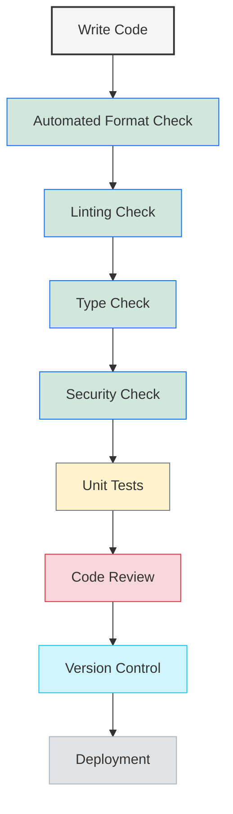

**Complexity: Moderate (M)**

## 8.0 Introduction: Why Code Quality Matters for Data Engineering

Data engineering code often forms the foundation of critical business processes - from ingesting data that drives business decisions to powering machine learning models that impact users. Poor quality code in these systems can lead to:

- Incorrect data that leads to bad business decisions
- Pipeline failures that disrupt operations
- Security vulnerabilities that expose sensitive data
- Maintenance nightmares that slow down the team

In this chapter, we'll explore tools and practices that help maintain high-quality, reliable, and secure data engineering code. These practices will help you build systems that are not only functionally correct but also maintainable, secure, and easy for others to understand.

Let's visualize where code quality fits into the data engineering workflow:



This chapter builds directly on what you've learned so far:

- Your Python knowledge from Chapters 1-6 gives you the programming foundation
- The static typing from Chapter 7 provides a first layer of code quality through type checking

By the end of this chapter, you'll have a complete workflow for writing high-quality data engineering code, including:

- Tools to automatically enforce coding standards
- Practices to improve security in your data pipelines
- Techniques for writing clear documentation
- Strategies for effective version control with Git

Let's get started by exploring some tools that can automate code quality checks!

## 8.1 Code Formatting with Black

### 8.1.1 Why Consistent Formatting Matters

Consistent code formatting makes your code:

- Easier to read and understand
- Simpler to maintain and debug
- Less prone to certain bugs
- More collaborative (no more formatting debates!)

Rather than maintaining a style guide and manually enforcing it, we can use tools like Black - "The Uncompromising Code Formatter" - to automatically format our code.

### 8.1.2 Getting Started with Black

First, let's install Black:

```python
# Usually installed with pip:
# pip install black

# Let's create a simple script with inconsistent formatting
from typing import List, Dict, Any
import os
import random

def process_data(data_files: List[str],output_dir:str="./output") -> Dict[str, Any]:
    """Process multiple data files and return statistics."""
    if not os.path.exists(output_dir):
          os.makedirs(output_dir)  # Extra indentation here

    results = {"processed_files": 0,"total_records":0, "errors": 0}

    for file in     data_files:
        try:
            with open(file, 'r') as f:
                lines = f.readlines()

                # Process each line
                for line in lines:
                    results["total_records"] += 1
                    # Imagine more processing here

            results["processed_files"] += 1
        except Exception as e:
            results[ "errors" ] += 1
            print(f"Error processing {file}: {e}")

    # Print results
    print(f"Processed {results['processed_files']} files with {results['errors']} errors")
    print(f"Total records: {results['total_records']}")

    return     results

# Example usage
sample_files = ["data1.txt", "data2.txt"]
stats = process_data(sample_files)
print(f"Stats: {stats}")

# Would print (assuming files don't exist):
# Error processing data1.txt: [Errno 2] No such file or directory: 'data1.txt'
# Error processing data2.txt: [Errno 2] No such file or directory: 'data2.txt'
# Processed 0 files with 2 errors
# Total records: 0
# Stats: {'processed_files': 0, 'total_records': 0, 'errors': 2}
```

The code above works, but the formatting is inconsistent. Here's how it would look after formatting with Black:

```python
from typing import List, Dict, TypedDict, Union, Optional
import os
import random


class ResultStats(TypedDict):
    """Type definition for the result statistics."""
    processed_files: int
    total_records: int
    errors: int


def process_data(data_files: List[str], output_dir: str = "./output") -> ResultStats:
    """Process multiple data files and return statistics."""
    if not os.path.exists(output_dir):
        os.makedirs(output_dir)  # Indentation fixed

    results: ResultStats = {"processed_files": 0, "total_records": 0, "errors": 0}

    for file in data_files:
        try:
            with open(file, "r") as f:
                lines = f.readlines()

                # Process each line
                for line in lines:
                    results["total_records"] += 1
                    # Imagine more processing here

            results["processed_files"] += 1
        except Exception as e:
            results["errors"] += 1
            print(f"Error processing {file}: {e}")

    # Print results
    print(f"Processed {results['processed_files']} files with {results['errors']} errors")
    print(f"Total records: {results['total_records']}")

    return results


# Example usage
sample_files = ["data1.txt", "data2.txt"]
stats = process_data(sample_files)
print(f"Stats: {stats}")

# Would print (assuming files don't exist):
# Error processing data1.txt: [Errno 2] No such file or directory: 'data1.txt'
# Error processing data2.txt: [Errno 2] No such file or directory: 'data2.txt'
# Processed 0 files with 2 errors
# Total records: 0
# Stats: {'processed_files': 0, 'total_records': 0, 'errors': 2}
```

Notice how Black has:

- Fixed inconsistent spacing
- Standardized indentation
- Normalized string quotes
- Added consistent spacing around operators
- Removed extra spaces

### 8.1.3 Running Black as Part of Your Workflow

You can integrate Black into your workflow by:

1. Running it manually before commits:

   ```bash
   black your_file.py
   ```

2. Running it on your entire project:

   ```bash
   black your_project_directory/
   ```

3. Setting up automatic running in your editor (most modern editors have Black integrations)

Black is "uncompromising" in that it doesn't have many configuration options, deliberately reducing the number of style decisions teams need to make.

## 8.2 Linting with Ruff

### 8.2.1 What is Linting?

While formatting is about style, linting is about detecting potential bugs, anti-patterns, and code smells. Ruff is a fast Python linter that combines functionality from many other tools.

Linting helps catch many common issues:

- Unused imports or variables
- Undefined variables
- Logical errors
- Complexity issues
- Potential security issues
- And many more...

### 8.2.2 Using Ruff to Find Code Issues

Let's create an example with some common issues that Ruff would catch:

```python
from typing import List, Dict, Any
import os
import sys
import json  # Unused import
import random

def read_data_file(filename: str) -> List[Dict[str, Any]]:
    """Read data from a JSON file."""
    with open(filename, 'r') as f:
        data = json.load(f)

    # Return without proper error handling
    return data

def analyze_data(data: List[Dict[str, Any]], min_value: int = 0) -> Dict[str, Any]:
    """Analyze the data and return statistics."""
    total = 0
    count = 0

    # Iterate through the data
    for item in data:
        value = item.get('value', 0)

        # Dead code - value is already treated as 0 if missing
        if 'value' not in item:
            value = 0

        if value > min_value:
            total += value
            count += 1

    # Potential division by zero
    average = total / count

    results = {
        'total': total,
        'count': count,
        'average': average
    }

    print(f"Analysis results: {results}")
    return results

# Create test data
test_data = [
    {"id": 1, "value": 10},
    {"id": 2, "value": 5},
    {"id": 3, "value": 15},
    {"id": 4}  # Missing value
]

# Write test data to a file
with open("test_data.json", "w") as f:
    json.dump(test_data, f)

# Read and analyze the data
data = read_data_file("test_data.json")
stats = analyze_data(data, min_value=6)
print(f"Final stats: {stats}")

# Would print:
# Analysis results: {'total': 25, 'count': 2, 'average': 12.5}
# Final stats: {'total': 25, 'count': 2, 'average': 12.5}
```

Ruff would identify several issues in this code, such as:

1. Unused import (`sys`)
2. Dead code (the `if 'value' not in item:` block)
3. Potential division by zero (if `count` is 0)
4. Missing error handling in file operations

Here's a corrected version addressing these issues:

```python
from typing import List, Dict, TypedDict, Optional, Union, Literal
import os
import json

class DataItem(TypedDict, total=False):
    """Type definition for an item in our dataset."""
    id: int
    value: Union[int, float]


def read_data_file(filename: str) -> Optional[List[DataItem]]:
    """Read data from a JSON file.

    Args:
        filename: Path to the JSON file

    Returns:
        List of data items or None if an error occurs
    """
    try:
        with open(filename, 'r') as f:
            data = json.load(f)
        return data
    except (IOError, json.JSONDecodeError) as e:
        print(f"Error reading file {filename}: {e}")
        return None


class AnalysisResult(TypedDict):
    """Type definition for analysis results."""
    total: int
    count: int
    average: float


def analyze_data(data: List[DataItem], min_value: int = 0) -> AnalysisResult:
    """Analyze the data and return statistics.

    Args:
        data: List of data items to analyze
        min_value: Minimum value threshold for inclusion

    Returns:
        Dictionary with analysis results
    """
    total = 0
    count = 0

    # Iterate through the data
    for item in data:
        value = item.get('value', 0)

        if value > min_value:
            total += value
            count += 1

    # Handle the case where no items meet the criteria
    results: AnalysisResult = {
        'total': total,
        'count': count,
        'average': total / count if count > 0 else 0
    }

    print(f"Analysis results: {results}")
    return results

# Create test data
test_data = [
    {"id": 1, "value": 10},
    {"id": 2, "value": 5},
    {"id": 3, "value": 15},
    {"id": 4}  # Missing value
]

# Write test data to a file
try:
    with open("test_data.json", "w") as f:
        json.dump(test_data, f)
    print("Test data written to test_data.json")
except IOError as e:
    print(f"Error writing test data: {e}")
    exit(1)

# Read and analyze the data
data = read_data_file("test_data.json")
if data is not None:
    stats = analyze_data(data, min_value=6)
    print(f"Final stats: {stats}")
else:
    print("Analysis failed: could not read data")

# Would print:
# Test data written to test_data.json
# Analysis results: {'total': 25, 'count': 2, 'average': 12.5}
# Final stats: {'total': 25, 'count': 2, 'average': 12.5}
```

### 8.2.3 Running Ruff

Just like Black, Ruff can be run from the command line:

```bash
# Install Ruff
# pip install ruff

# Run Ruff on a file
ruff check your_file.py

# Run Ruff on a directory
ruff check your_project_directory/
```

Ruff can also fix many issues automatically:

```bash
ruff check --fix your_file.py
```

## 8.3 Security Considerations in Data Engineering

Data engineering involves handling sensitive data and creating systems that could be vulnerable to attacks if not properly secured. Let's explore some basic security practices.

### 8.3.1 Managing Secrets and Credentials

One of the most common security issues is hardcoding secrets:

```python
from typing import Dict, Any
import requests

# BAD - hardcoded API key in your code
def get_data_from_api_insecure() -> Dict[str, Any]:
    """Retrieve data from an external API."""
    api_key = "sk_test_abcdef1234567890"  # SECURITY RISK!
    url = "https://api.example.com/data"

    response = requests.get(
        url,
        headers={"Authorization": f"Bearer {api_key}"}
    )

    print(f"API response status: {response.status_code}")
    return response.json()
```

A better approach is to use environment variables or a secure credentials manager:

```python
from typing import Dict, Union, Optional, TypedDict, Literal
import os
import requests


class WeatherResponse(TypedDict):
    """Type definition for weather API response."""
    temperature: float
    humidity: float
    conditions: str
    forecast: List[Dict[str, Union[str, float]]]  # Using Any here would be valid as external API response format may change


def get_data_from_api_secure() -> Optional[WeatherResponse]:
    """Retrieve data from an external API using securely stored credentials."""
    # Get API key from environment variable
    api_key = os.environ.get("API_KEY")

    if not api_key:
        print("Error: API_KEY environment variable not set")
        return None

    url = "https://api.example.com/data"

    try:
        response = requests.get(
            url,
            headers={"Authorization": f"Bearer {api_key}"}
        )
        response.raise_for_status()  # Raise exception for 4XX/5XX responses

        print(f"API response status: {response.status_code}")
        return response.json()
    except requests.exceptions.RequestException as e:
        print(f"API request failed: {e}")
        return None

# Usage (after setting environment variable):
# export API_KEY="your_api_key"
# data = get_data_from_api_secure()
# print(f"Retrieved data: {data}")
```

### 8.3.2 Input Validation and SQL Injection Prevention

Data engineering often involves database operations, which can be vulnerable to SQL injection:

```python
from typing import List, Dict, Any
import sqlite3

# BAD - vulnerable to SQL injection
def get_user_data_insecure(username: str) -> List[Dict[str, Any]]:
    """Retrieve user data based on username - VULNERABLE CODE."""
    conn = sqlite3.connect("users.db")
    cursor = conn.cursor()

    # DANGEROUS: Direct string interpolation in SQL
    query = f"SELECT * FROM users WHERE username = '{username}'"

    cursor.execute(query)
    rows = cursor.fetchall()

    # Convert rows to dictionaries
    columns = [desc[0] for desc in cursor.description]
    result = [dict(zip(columns, row)) for row in rows]

    conn.close()

    print(f"Retrieved {len(result)} user records")
    return result

# If called with username = "admin' OR '1'='1" this would return ALL users!
```

Safer version using parameterized queries:

```python
from typing import List, Dict, Optional, TypedDict, Union
import sqlite3


class UserRecord(TypedDict):
    """Type definition for user records from the database."""
    id: int
    username: str
    email: str
    created_at: str
    # Add other known fields here


def get_user_data_secure(username: str) -> Optional[List[UserRecord]]:
    """Retrieve user data based on username - SECURE CODE."""
    try:
        conn = sqlite3.connect("users.db")
        cursor = conn.cursor()

        # SECURE: Using parameterized query
        query = "SELECT * FROM users WHERE username = ?"

        cursor.execute(query, (username,))
        rows = cursor.fetchall()

        # Convert rows to dictionaries
        columns = [desc[0] for desc in cursor.description]
        result = []
        for row in rows:
            # Create a dictionary with proper typing
            user_dict = {}
            for i, col in enumerate(columns):
                user_dict[col] = row[i]
            result.append(user_dict)  # Type checker will validate this against UserRecord

        conn.close()

        print(f"Retrieved {len(result)} user records")
        return result
    except sqlite3.Error as e:
        print(f"Database error: {e}")
        return None

# Now safe from SQL injection
```

### 8.3.3 File Path Security

When working with files, always validate paths to prevent directory traversal:

```python
from typing import Optional
import os

def read_config_file_insecure(filename: str) -> Optional[str]:
    """Read a configuration file - INSECURE VERSION."""
    config_dir = "/app/configs/"

    # DANGEROUS: Path could be "../../../etc/passwd"
    file_path = os.path.join(config_dir, filename)

    try:
        with open(file_path, 'r') as f:
            content = f.read()

        print(f"Read configuration from {file_path}")
        return content
    except IOError as e:
        print(f"Error reading config: {e}")
        return None
```

A safer approach:

```python
from typing import Optional
import os

def read_config_file_secure(filename: str) -> Optional[str]:
    """Read a configuration file - SECURE VERSION."""
    config_dir = "/app/configs/"

    # Validate the filename to prevent directory traversal
    if not filename.isalnum() or not filename.endswith(".conf"):
        print(f"Invalid config filename: {filename}")
        return None

    file_path = os.path.join(config_dir, filename)

    # Further security: ensure the resolved path is within the config directory
    real_path = os.path.realpath(file_path)
    if not real_path.startswith(os.path.realpath(config_dir)):
        print(f"Security violation: attempted path traversal with {filename}")
        return None

    try:
        with open(file_path, 'r') as f:
            content = f.read()

        print(f"Read configuration from {file_path}")
        return content
    except IOError as e:
        print(f"Error reading config: {e}")
        return None
```

## 8.4 Pre-commit Hooks

Pre-commit hooks automate code quality checks, ensuring that code doesn't even get committed if it fails to meet quality standards.

### 8.4.1 Installing and Configuring Pre-commit

The `pre-commit` tool makes it easy to manage Git hooks:

```bash
# Install pre-commit
# pip install pre-commit

# Create a .pre-commit-config.yaml file
```

A simple `.pre-commit-config.yaml` configuration might look like:

```yaml
repos:
  - repo: https://github.com/pre-commit/pre-commit-hooks
    rev: v4.4.0
    hooks:
      - id: trailing-whitespace
      - id: end-of-file-fixer
      - id: check-yaml
      - id: check-added-large-files

  - repo: https://github.com/psf/black
    rev: 23.3.0
    hooks:
      - id: black

  - repo: https://github.com/charliermarsh/ruff-pre-commit
    rev: v0.0.262
    hooks:
      - id: ruff
        args: [--fix]

  - repo: https://github.com/RobertCraigie/pyright-python
    rev: v1.1.354
    hooks:
      - id: pyright
```

After creating this file, you would run:

```bash
# Install the hooks
pre-commit install
```

Now, when you try to commit code, these checks will run automatically:

```python
from typing import Dict, List, Any
import json

def load_config(config_file: str) -> Dict[str, Any]:
    """Load configuration from a JSON file."""
    with open(config_file, 'r') as f:
        return json.load(f)  # Pre-commit would ensure proper error handling here

# Example usage
config = load_config('config.json')
print(f"Loaded config: {config}")
```

If this code was committed, pre-commit would flag the missing error handling and prevent the commit.

### 8.4.2 Adding a Secret Detection Hook

We can also add hooks that scan for secrets like API keys and passwords:

```yaml
- repo: https://github.com/Yelp/detect-secrets
  rev: v1.4.0
  hooks:
    - id: detect-secrets
```

This will scan your code for patterns that look like secrets:

```python
from typing import Dict, Any
import requests

def get_weather_data(city: str) -> Dict[str, Any]:
    """Get weather data for a city."""
    # This will be detected as a potential secret!
    api_key = "11a2b3c4d5e6f7g8h9i0j"

    url = f"https://api.weather.com/data?city={city}&key={api_key}"
    response = requests.get(url)

    print(f"Weather API response status: {response.status_code}")
    return response.json()
```

When you try to commit this code, the detect-secrets hook would prevent the commit and alert you to the hardcoded API key.

## 8.5 Documentation Standards

Good documentation is crucial for maintainability, especially in data engineering projects that may involve complex data models and transformations.

### 8.5.1 Writing Clear Docstrings

Python has a standard docstring format called "Google style" that works well for data engineering code:

```python
from typing import Dict, List, TypedDict, Optional, Union, Literal
import json

# Define specific types for our transformation data
class RenameTransformation(TypedDict):
    type: Literal['rename_fields']
    mapping: Dict[str, str]

class FilterTransformation(TypedDict):
    type: Literal['filter_values']
    field: str
    value: Union[str, int, float, bool]

# Union type for all possible transformation types
TransformationRules = Union[RenameTransformation, FilterTransformation]

# Input and output data types
class DataItem(TypedDict, total=False):
    """Type definition for data items with flexible fields."""
    id: int
    first_name: str
    last_name: str
    given_name: str  # After renaming
    family_name: str  # After renaming
    age: int

def transform_data(
    input_data: List[DataItem],
    transformation_rules: TransformationRules
) -> Optional[List[DataItem]]:
    """Transform a dataset according to specified rules.

    This function applies a set of transformation rules to each item in the
    input dataset. Transformations can include field renaming, value conversion,
    filtering, and aggregation.

    Args:
        input_data: A list of dictionaries representing the dataset to transform
        transformation_rules: A dictionary specifying the transformation rules
            to apply to the dataset. Must contain at least a 'type' field.

    Returns:
        A list of transformed data items, or None if the transformation fails

    Raises:
        ValueError: If transformation_rules is invalid
        KeyError: If a required field is missing from an input item

    Example:
        >>> rules = {'type': 'rename_fields', 'mapping': {'old_name': 'new_name'}}
        >>> data = [{'old_name': 'value', 'id': 1}]
        >>> transform_data(data, rules)
        [{'new_name': 'value', 'id': 1}]
    """
    if 'type' not in transformation_rules:
        print("Error: Invalid transformation rules")
        return None

    result: List[DataItem] = []

    try:
        # Apply transformations based on the rule type
        if transformation_rules['type'] == 'rename_fields':
            # We know this is a RenameTransformation due to the type check
            rename_rules = transformation_rules  # Type narrowing
            field_mapping = rename_rules.get('mapping', {})

            for item in input_data:
                new_item = item.copy()

                for old_field, new_field in field_mapping.items():
                    if old_field in new_item:
                        # Copy the value and remove the old field
                        value = new_item[old_field]
                        del new_item[old_field]
                        new_item[new_field] = value

                result.append(new_item)

        elif transformation_rules['type'] == 'filter_values':
            # We know this is a FilterTransformation due to the type check
            filter_rules = transformation_rules  # Type narrowing
            field = filter_rules.get('field', '')
            value = filter_rules.get('value')

            if not field or value is None:
                raise ValueError("Filter requires field and value")

            result = [item for item in input_data if item.get(field) == value]

        else:
            # This shouldn't happen due to our type definitions
            print(f"Unknown transformation type: {transformation_rules['type']}")
            return None

    except Exception as e:
        print(f"Error during transformation: {e}")
        return None

    print(f"Transformed {len(input_data)} items into {len(result)} items")
    return result

# Example usage
data = [
    {"id": 1, "first_name": "Alice", "last_name": "Smith", "age": 30},
    {"id": 2, "first_name": "Bob", "last_name": "Jones", "age": 25},
    {"id": 3, "first_name": "Charlie", "last_name": "Brown", "age": 35}
]

# Rename fields
rename_rules = {
    "type": "rename_fields",
    "mapping": {
        "first_name": "given_name",
        "last_name": "family_name"
    }
}

transformed = transform_data(data, rename_rules)
print(f"After renaming: {json.dumps(transformed, indent=2)}")

# Filter values
filter_rules = {
    "type": "filter_values",
    "field": "age",
    "value": 30
}

filtered = transform_data(data, filter_rules)
print(f"After filtering: {json.dumps(filtered, indent=2)}")

# Would print:
# Transformed 3 items into 3 items
# After renaming: [
#   {
#     "id": 1,
#     "given_name": "Alice",
#     "family_name": "Smith",
#     "age": 30
#   },
#   {
#     "id": 2,
#     "given_name": "Bob",
#     "family_name": "Jones",
#     "age": 25
#   },
#   {
#     "id": 3,
#     "given_name": "Charlie",
#     "family_name": "Brown",
#     "age": 35
#   }
# ]
# Transformed 3 items into 1 items
# After filtering: [
#   {
#     "id": 1,
#     "first_name": "Alice",
#     "last_name": "Smith",
#     "age": 30
#   }
# ]
```

### 8.5.2 Project Documentation

Beyond code-level documentation, data engineering projects benefit from higher-level documentation:

1. **README.md** - Project overview and quick start instructions
2. **CONTRIBUTING.md** - Guidelines for contributing to the project
3. **docs/data_models.md** - Documentation of data schemas and models
4. **docs/architecture.md** - System architecture and component interactions
5. **docs/operations.md** - Operational procedures (deployment, monitoring, etc.)

A good README.md for a data engineering project might include:

```markdown
# Sales Data Pipeline

A data pipeline that processes daily sales data and loads it into our data warehouse.

## Overview

This pipeline extracts sales data from our POS system, transforms it to conform to our data warehouse schema, and loads it into BigQuery for analysis.

## Features

- Automated daily extraction from POS API
- Data validation and error handling
- Incremental loading to optimize performance
- Logging and monitoring integration

## Prerequisites

- Python 3.8+
- Google Cloud SDK
- Access to POS API

## Installation

1. Clone this repository
2. Install dependencies: `pip install -r requirements.txt`
3. Configure environment variables (see Configuration section)

## Configuration

Create a `.env` file with the following variables:
```

POS_API_KEY=your_api_key_here
GCP_PROJECT_ID=your_project_id

````

## Usage

Run the pipeline manually:

```bash
python -m sales_pipeline.main
````

## Development

See [CONTRIBUTING.md](CONTRIBUTING.md) for development guidelines.

## Data Model

See [docs/data_model.md](docs/data_model.md) for details on the data schema.

```

## 8.6 Git for Data Engineering

Version control is essential for data engineering projects, but it requires some special considerations when working with data and credentials.

### 8.6.1 Setting Up a .gitignore File

A good `.gitignore` file is crucial for data engineering projects:

```

# Python

**pycache**/
_.py[cod]
_$py.class
_.so
.Python
env/
build/
develop-eggs/
dist/
downloads/
eggs/
.eggs/
lib/
lib64/
parts/
sdist/
var/
_.egg-info/
.installed.cfg
\*.egg

# Environment variables and secrets

.env
.secrets
_.key
credentials.json
_.pem

# Data files

_.csv
_.parquet
_.avro
_.json
/data/

# Notebooks

.ipynb_checkpoints

# Logs

logs/
\*.log

# Local configuration

config.local.yaml

````

This ensures that sensitive data, credentials, and large datasets don't accidentally get committed.

### 8.6.2 Branching Strategy for Data Engineering

A common branching strategy for data engineering projects:

1. `main` - Stable production code
2. `development` - Integration branch for testing
3. Feature branches - For new features or changes
4. Pipeline-specific branches - For different data pipelines


2. **Use template config files**

Instead of committing actual config files, commit templates:

```python
from typing import Dict, Any, Optional
import json
import os

# Load config from a file
def load_config(config_path: str = "config.json") -> Optional[Dict[str, Any]]:
    """Load configuration from a JSON file."""
    try:
        with open(config_path, 'r') as f:
            config = json.load(f)
        print(f"Loaded configuration from {config_path}")
        return config
    except Exception as e:
        print(f"Error loading configuration: {e}")
        return None

# Create template config file
def create_config_template() -> None:
    """Create a template configuration file."""
    template = {
        "database": {
            "host": "localhost",
            "port": 5432,
            "name": "your_database_name",
            "user": "your_username",
            "password": "your_password"
        },
        "api": {
            "url": "https://api.example.com",
            "key": "your_api_key"
        }
    }

    with open("config.template.json", 'w') as f:
        json.dump(template, f, indent=2)

    print("Created configuration template at config.template.json")
    print("Copy to config.json and fill in your actual values.")

# Example usage
create_config_template()

# Would create a file named config.template.json:
# {
#   "database": {
#     "host": "localhost",
#     "port": 5432,
#     "name": "your_database_name",
#     "user": "your_username",
#     "password": "your_password"
#   },
#   "api": {
#     "url": "https://api.example.com",
#     "key": "your_api_key"
#   }
# }
```

3. **Clean Git history if secrets are accidentally committed**

If secrets do get committed, you'll need to:

- Change the compromised credentials immediately
- Consider using tools like `git filter-repo` to remove the sensitive data (but be aware this rewrites history)

## 8.7 Micro-Project: Quality-Focused Data Engineering Repository

Now let's apply everything we've learned to create a quality-focused repository for a data engineering project.

### Project Requirements

In this micro-project, you will:

1. Initialize a Git repository with appropriate `.gitignore` for data engineering
2. Set up pre-commit hooks for code quality enforcement
3. Configure code formatting and linting tools
4. Create documentation templates for data pipelines
5. Establish project standards and guidelines

### Acceptance Criteria

- Git repository is properly initialized with appropriate branching strategy
- `.gitignore` properly excludes data files, credentials, and environment-specific configs
- Pre-commit hooks successfully run black, ruff, and pyright before allowing commits
- Configuration files for each tool are present and properly configured
- Documentation templates include sections for data lineage, transformations, and schema
- README includes clear sections on project overview, setup, and contribution guidelines

### Common Pitfalls

1. **Pre-commit hooks that are too strict or slow**

   - Solution: Start with essential checks and gradually add more as you adapt

2. **Inconsistent enforcement of standards across team members**

   - Solution: Document the importance of each standard and automate enforcement

3. **Overly complex configuration that's hard to maintain**

   - Solution: Begin with default configurations and customize only as needed

4. **Accidentally committing secrets despite hooks**
   - Solution: Use environment variables and regularly audit commit history

### How This Differs from Production-Grade Solutions

In a real-world setting, a production-grade setup would likely include:

1. **CI/CD Integration**

   - Production: Integrated with Jenkins, GitHub Actions, or similar CI/CD tools
   - Micro-project: Local pre-commit hooks only

2. **Advanced Security Scanning**

   - Production: Comprehensive security scanning including dependency vulnerabilities
   - Micro-project: Basic secret detection

3. **Custom Linting Rules**

   - Production: Organization-specific linting rules enforcing business policies
   - Micro-project: Standard linting configurations

4. **Automated Documentation Generation**
   - Production: Tools like Sphinx to generate comprehensive documentation
   - Micro-project: Manual documentation templates

### Implementation

Let's walk through the implementation step by step:

#### 1. Initialize Git Repository

```bash
# Create a new directory for the project
mkdir data_quality_demo
cd data_quality_demo

# Initialize git repository
git init

# Create initial README
echo "# Data Quality Demo" > README.md
git add README.md
git commit -m "Initial commit"

# Create and switch to development branch
git checkout -b development
```

#### 2. Create .gitignore File

Create a file named `.gitignore` with the following content:

```
# Python files
__pycache__/
*.py[cod]
*$py.class
*.so
.Python
build/
develop-eggs/
dist/
downloads/
eggs/
.eggs/
lib/
lib64/
parts/
sdist/
var/
wheels/
*.egg-info/
.installed.cfg
*.egg

# Virtual environments
venv/
env/
ENV/

# Environment and config files
.env
*.env
config.json
credentials.json
*.key
*.pem

# Data files
data/
*.csv
*.parquet
*.avro
*.orc
*.json
*.jsonl
*.xlsx
*.db
*.sqlite

# Logs
logs/
*.log

# IDE files
.idea/
.vscode/
*.swp
*.swo

# OS files
.DS_Store
Thumbs.db
```

#### 3. Set Up Pre-commit Hooks

First, create a requirements file for development dependencies:

```bash
echo "black==23.3.0
ruff==0.0.262
pyright==1.1.354
pre-commit==3.3.1
detect-secrets==1.4.0" > requirements-dev.txt
```

Next, create a `.pre-commit-config.yaml` file:

```yaml
repos:
  - repo: https://github.com/pre-commit/pre-commit-hooks
    rev: v4.4.0
    hooks:
      - id: trailing-whitespace
      - id: end-of-file-fixer
      - id: check-yaml
      - id: check-added-large-files

  - repo: https://github.com/psf/black
    rev: 23.3.0
    hooks:
      - id: black

  - repo: https://github.com/charliermarsh/ruff-pre-commit
    rev: v0.0.262
    hooks:
      - id: ruff
        args: [--fix]

  - repo: https://github.com/pre-commit/mirrors-mypy
    rev: v1.3.0
    hooks:
      - id: mypy
        additional_dependencies: [types-requests]

  - repo: https://github.com/Yelp/detect-secrets
    rev: v1.4.0
    hooks:
      - id: detect-secrets
```

#### 4. Configure Linting and Formatting Tools

Create a `pyproject.toml` file for tool configuration:

```toml
[tool.black]
line-length = 88
target-version = ["py38"]
include = '\.pyi?$'

[tool.ruff]
line-length = 88
target-version = "py38"
select = [
    "E",  # pycodestyle errors
    "F",  # pyflakes
    "I",  # isort
    "N",  # pep8-naming
    "W",  # pycodestyle warnings
    "B",  # flake8-bugbear
    "S",  # flake8-bandit
]
ignore = []

[tool.pyright]
pythonVersion = "3.8"
typeCheckingMode = "strict"
reportMissingImports = true
reportMissingTypeStubs = false
```

#### 5. Create Documentation Templates

Create a `docs` directory and some template files:

```bash
mkdir -p docs/templates
```

Create `docs/templates/pipeline_template.md`:

```markdown
# Pipeline: [Pipeline Name]

## Overview

Brief description of the pipeline's purpose and functionality.

## Data Sources

- **Source 1**

  - Type: [Database, API, File, etc.]
  - Location: [URL, server, path, etc.]
  - Schema: [Link to schema documentation or brief description]
  - Update Frequency: [Real-time, daily, weekly, etc.]

- **Source 2**
  - ...

## Transformations

Describe the key data transformations that occur in this pipeline:

1. **Transformation 1**

   - Purpose: [Why this transformation occurs]
   - Logic: [Description or pseudocode of the transformation]
   - Dependencies: [Any dependencies or preconditions]

2. **Transformation 2**
   - ...

## Output

- **Destination**
  - Type: [Database, File, API, etc.]
  - Location: [URL, server, path, etc.]
  - Schema: [Link to schema documentation or brief description]

## Scheduling

- Frequency: [How often the pipeline runs]
- Trigger: [Event or time-based]
- Dependencies: [Any pipelines that must complete first]

## Monitoring

- Key metrics to monitor
- Alert thresholds
- Links to dashboards

## Failure Recovery

Steps to take in case of pipeline failure.
```

Create `docs/templates/schema_template.md`:

```markdown
# Schema: [Schema Name]

## Overview

Brief description of what this data represents and its purpose.

## Table/Collection Structure

### [Table/Collection Name]

| Field Name | Type      | Description                                       | Example                | Required? |
| ---------- | --------- | ------------------------------------------------- | ---------------------- | --------- |
| id         | int       | Unique identifier                                 | 12345                  | Yes       |
| name       | string    | User's full name                                  | "John Smith"           | Yes       |
| email      | string    | User's email address                              | "john@example.com"     | Yes       |
| created_at | timestamp | When the record was created                       | "2023-05-01T12:34:56Z" | Yes       |
| status     | enum      | Account status: "active", "inactive", "suspended" | "active"               | Yes       |

### [Another Table/Collection Name]

...

## Relationships

Describe relationships between tables/collections:

- Table A has a one-to-many relationship with Table B through the `table_a_id` field
- ...

## Constraints

List any constraints or business rules:

- Field X must be unique
- Field Y must be in range [0, 100]
- ...

## Versioning

Information about schema versioning and change management.
```

#### 6. Create Project Structure

Create a basic project structure:

```bash
mkdir -p src/data_quality_demo/pipeline
mkdir -p src/data_quality_demo/util
mkdir -p tests
mkdir -p config
```

#### 7. Create a Sample Python Module

Create `src/data_quality_demo/util/config.py`:

```python
from typing import Dict, TypedDict, Optional, Union, List
import os
import json

# Define a type for database configuration
class DatabaseConfig(TypedDict):
    host: str
    port: int
    database: str
    user: str
    password: str


class ConfigManager:
    """Manage configuration for data pipelines.

    This class handles loading and validating configuration from different sources,
    with environment variable overrides and secure credential handling.
    """

    def __init__(self, config_path: Optional[str] = None) -> None:
        """Initialize the configuration manager.

        Args:
            config_path: Optional path to a configuration file
        """
        self.config: Dict[str, Union[str, int, bool, Dict[str, Union[str, int, bool]]]] = {}
        # Using a somewhat complex type above because configuration could have varying
        # structures. In a real-world project, you might define more specific TypedDict
        # classes for each section of your configuration.

        if config_path:
            self._load_from_file(config_path)

        # Override with environment variables
        self._load_from_env()

        print(f"Configuration initialized with {len(self.config)} settings")

    def _load_from_file(self, config_path: str) -> None:
        """Load configuration from a JSON file.

        Args:
            config_path: Path to the configuration file
        """
        try:
            if not os.path.exists(config_path):
                print(f"Warning: Config file not found: {config_path}")
                return

            with open(config_path, 'r') as f:
                file_config = json.load(f)
                # Here we could use TypedDict validations if we had
                # more specific schema definitions
                self.config.update(file_config)

            print(f"Loaded configuration from {config_path}")
        except Exception as e:
            print(f"Error loading configuration from {config_path}: {e}")

    def _load_from_env(self) -> None:
        """Override configuration with environment variables.

        Environment variables that start with 'APP_' will be
        added to the configuration, with the 'APP_' prefix removed.
        """
        for key, value in os.environ.items():
            if key.startswith("APP_"):
                config_key = key[4:].lower()
                self.config[config_key] = value

    def get(self, key: str, default: Optional[Union[str, int, bool, Dict[str, Union[str, int, bool]]]] = None) -> Optional[Union[str, int, bool, Dict[str, Union[str, int, bool]]]]:
        """Get a configuration value.

        Args:
            key: The configuration key to look up
            default: Value to return if the key is not found

        Returns:
            The configuration value or the default
        """
        return self.config.get(key, default)

    def get_required(self, key: str) -> Union[str, int, bool, Dict[str, Union[str, int, bool]]]:
        """Get a required configuration value.

        Args:
            key: The configuration key to look up

        Returns:
            The configuration value

        Raises:
            KeyError: If the key is not found in the configuration
        """
        if key not in self.config:
            raise KeyError(f"Required configuration key not found: {key}")

        return self.config[key]

    def get_database_config(self) -> DatabaseConfig:
        """Get database configuration as a strongly-typed object.

        Returns:
            Database configuration

        Raises:
            KeyError: If database configuration is not complete
        """
        db_section = self.get('database', {})
        if not isinstance(db_section, dict):
            raise TypeError("Database configuration is not a dictionary")

        # Create a properly typed database config, with defaults for non-critical fields
        return {
            'host': db_section.get('host', 'localhost'),
            'port': int(db_section.get('port', 5432)),
            'database': db_section.get('name', ''),
            'user': db_section.get('user', ''),
            'password': db_section.get('password', '')
        }

# Example usage
if __name__ == "__main__":
    # Create a template config file for demonstration
    template_config = {
        "database": {
            "host": "localhost",
            "port": 5432,
            "name": "demo_db"
        },
        "api": {
            "url": "https://api.example.com",
            "timeout": 30
        },
        "logging": {
            "level": "INFO",
            "file": "logs/app.log"
        }
    }

    with open("config/config.template.json", 'w') as f:
        json.dump(template_config, f, indent=2)

    print("Created template configuration file")

    # Test the config manager
    config = ConfigManager("config/config.template.json")

    # Get configuration values
    db_host = config.get("database", {}).get("host", "")
    api_url = config.get("api", {}).get("url", "")

    print(f"Database host: {db_host}")
    print(f"API URL: {api_url}")
```

#### 8. Create a README.md

Update the `README.md` file:

```markdown
# Data Quality Demo

A demonstration project showing best practices for data engineering code quality.

## Overview

This project showcases tools and practices for maintaining high-quality, secure, and maintainable data engineering code. It includes:

- Code formatting with Black
- Linting with Ruff
- Static type checking with Pyright
- Security scanning with detect-secrets
- Pre-commit hooks for automatic quality checks
- Documentation templates for data pipelines

## Setup

### Prerequisites

- Python 3.8+
- Git

### Installation

1. Clone this repository
2. Create a virtual environment: `python -m venv venv`
3. Activate the virtual environment:
   - Windows: `venv\Scripts\activate`
   - macOS/Linux: `source venv/bin/activate`
4. Install development dependencies: `pip install -r requirements-dev.txt`
5. Install pre-commit hooks: `pre-commit install`

## Development

### Code Quality Standards

This project enforces the following standards:

- Code formatting using Black's default style
- Linting using Ruff with selected rule sets
- Static type checking with Pyright in strict mode
- Secret detection to prevent credential leakage

### Documentation

- All code should include docstrings following the Google style
- Data pipelines should be documented using the template in `docs/templates/pipeline_template.md`
- Data schemas should be documented using the template in `docs/templates/schema_template.md`

### Git Workflow

1. Create a feature branch from `development`
2. Make your changes, ensuring they pass all pre-commit checks
3. Submit a pull request to merge into `development`
4. After review and testing, changes will be merged to `main` for release

## Contributing

Please see [CONTRIBUTING.md](CONTRIBUTING.md) for details on our code of conduct and the process for submitting pull requests.
```

#### 9. Create a CONTRIBUTING.md file

```markdown
# Contributing Guidelines

Thank you for your interest in contributing to this project! This document outlines the process for contributing and the standards we follow.

## Code Quality

All code must pass our automated quality checks:

1. **Formatting**: We use Black for code formatting
2. **Linting**: We use Ruff to check for common issues
3. **Type Checking**: All code must be properly typed and pass Mypy checks
4. **Security**: Code must not contain hardcoded secrets or credentials

These checks are enforced through pre-commit hooks that run automatically when you commit code.

## Development Process

1. **Create an Issue**: For new features or bug fixes, start by creating an issue
2. **Fork and Branch**: Fork the repository and create a branch for your work
3. **Write Code**: Implement your changes, following our code quality standards
4. **Write Tests**: Add tests for your code to ensure it works as expected
5. **Document**: Update documentation to reflect your changes
6. **Submit PR**: Create a pull request with a clear description of your changes

## Documentation Standards

- All functions and classes must have docstrings following Google style
- Complex logic should include inline comments explaining the reasoning
- Update README and other documentation as needed for significant changes
- New data pipelines should include documentation using our templates

## Git Practices

- Keep commits focused on single logical changes
- Write clear commit messages that explain the "why" not just the "what"
- Rebase your branch on the latest development branch before submitting PR

Thank you for contributing!
```

### How to Run and Test the Solution

To run and test this micro-project:

1. Follow the setup instructions in the README:

   - Create and activate a Python virtual environment
   - Install the development dependencies
   - Install the pre-commit hooks

2. Create a sample Python file with some quality issues:

   ```python
   # sample.py
   def process_data(data):
       # Missing type annotations
       # No docstring
       # Poor formatting
       result={"processed":True,"count":len(data)}
       return result
   ```

3. Try to commit this file:

   ```bash
   git add sample.py
   git commit -m "Add sample file"
   ```

4. The pre-commit hooks should catch the issues and prevent the commit. Fix the issues:

   ```python
   # sample.py
   from typing import Dict, List, Any

   def process_data(data: List[Dict[str, Any]]) -> Dict[str, Any]:
       """Process a list of data items.

       Args:
           data: List of data items to process

       Returns:
           Dictionary with processing results
       """
       result = {"processed": True, "count": len(data)}
       return result
   ```

5. Try the commit again - it should succeed now.

6. Test the ConfigManager class by running:
   ```bash
   python src/data_quality_demo/util/config.py
   ```

This micro-project provides a foundation that you can extend with your own data engineering code, following the established quality practices.

## 8.8 Practice Exercises

Try these exercises to reinforce what you've learned in this chapter:

### Exercise 1: Black Formatting

Take the following poorly formatted code and manually format it according to Black's style guide:

```python
from typing import List,Dict,Any
import os
import  json

def load_data(  filename:str,
    required_fields:List[str]=[],
default_values:Dict[str,Any]={}  )->List[Dict[str,Any]]:
  """Load data from a JSON file."""
  if not os.path.exists(filename):
    return []
  with open(filename,'r') as f:
   data=json.load(f)

  # Ensure required fields and apply defaults
  result=[]
  for item in data:
    # Check required fields
    valid=True
    for field in required_fields:
        if field not in item:
            valid=False
            break
    if not valid:
      continue

    # Apply defaults
    for key,value in default_values.items():
      if key not in item:
          item[key]=value

    result.append(item)

  return     result
```

### Exercise 2: Identifying Linting Issues

Review the following code and identify at least 5 issues that a linter would flag:

```python
from typing import List, Dict, Any
import os
import json
import datetime
import requests

def fetch_and_save_data(api_url: str, output_file: str) -> None:
    # Fetch data from API
    response = requests.get(api_url)
    data = response.json()

    # Add timestamp
    current_time = datetime.datetime.now()
    data['timestamp'] = str(current_time)

    # Save to file
    with open(output_file, 'w') as f:
        f.write(json.dumps(data))

    print('Data saved to ' + output_file)

def process_items(items):
    results = []
    for i in range(len(items)):
        item = items[i]
        if item['status'] == 'active':
            value = item.get('value', 0) * 2
            results.append({'id': item['id'], 'processed_value': value})
        else:
            pass

    print(f"Processed {len(results)} items out of {len(items)}")
    return results

def main():
    # Hardcoded API key
    api_key = "ak_12345abcdef"

    # Construct URL
    url = "https://api.example.com/data?key=" + api_key

    fetch_and_save_data(url, 'data/output.json')

    # Open the file we just saved
    f = open('data/output.json', 'r')
    data = json.load(f)
    f.close()

    # Process items
    items = data.get('items', [])
    results = process_items(items)

    # Save results
    with open('data/results.json', 'w') as f:
        json.dump(results, f)

if __name__ == "__main__":
    main()
```

### Exercise 3: Secure Credential Handling

Rewrite the following code to handle credentials securely:

```python
from typing import Dict, Any
import requests
import json

def get_user_data(user_id: str) -> Dict[str, Any]:
    """Get user data from the API."""
    # API credentials (insecure)
    username = "admin"
    password = "s3cret_p@ssw0rd"

    # Construct auth header
    auth_header = f"Basic {username}:{password}"

    # Make API request
    response = requests.get(
        f"https://api.example.com/users/{user_id}",
        headers={"Authorization": auth_header}
    )

    return response.json()

def save_config(config: Dict[str, Any], filename: str) -> None:
    """Save configuration to a file."""
    # Configuration includes database credentials
    config["database"] = {
        "host": "db.example.com",
        "username": "db_user",
        "password": "db_p@ssw0rd"
    }

    # Save to file
    with open(filename, 'w') as f:
        json.dump(config, f, indent=2)

    print(f"Configuration saved to {filename}")

# Example usage
user_data = get_user_data("12345")
print(f"User data: {user_data}")

config = {"app_name": "MyApp", "version": "1.0.0"}
save_config(config, "config.json")
```

### Exercise 4: Writing Clear Docstrings

Improve the following function by adding a comprehensive docstring following the Google style:

```python
from typing import List, Dict, Any, Optional

def transform_dataset(
    data: List[Dict[str, Any]],
    date_field: str = "date",
    value_field: str = "value",
    group_by: Optional[str] = None,
    filter_field: Optional[str] = None,
    filter_value: Any = None
) -> Dict[str, Any]:
    # This function transforms a dataset by:
    # 1. Filtering rows based on filter_field and filter_value
    # 2. Grouping by the group_by field if provided
    # 3. Calculating statistics on the value_field

    # Apply filter if provided
    if filter_field and filter_value is not None:
        filtered_data = [item for item in data if item.get(filter_field) == filter_value]
    else:
        filtered_data = data

    # Group data if requested
    if group_by:
        groups = {}
        for item in filtered_data:
            key = item.get(group_by)
            if key not in groups:
                groups[key] = []
            groups[key].append(item)
    else:
        groups = {"all": filtered_data}

    # Calculate statistics for each group
    results = {}
    for group_key, group_items in groups.items():
        values = [item.get(value_field, 0) for item in group_items]

        if not values:
            continue

        results[group_key] = {
            "count": len(values),
            "sum": sum(values),
            "average": sum(values) / len(values) if values else 0,
            "min": min(values) if values else 0,
            "max": max(values) if values else 0,
        }

    return {
        "metadata": {
            "original_record_count": len(data),
            "filtered_record_count": len(filtered_data),
            "group_count": len(results)
        },
        "statistics": results
    }
```

### Exercise 5: Configuration Management

Create a new `ConfigValidator` class that can validate a configuration dictionary against a schema. It should:

1. Check that required fields are present
2. Validate field types
3. Ensure values are within acceptable ranges or match patterns
4. Provide helpful error messages for invalid configurations

## 8.9 Exercise Solutions

### Solution to Exercise 1: Black Formatting

```python
from typing import List, Dict, Any
import os
import json


def load_data(
    filename: str, required_fields: List[str] = [], default_values: Dict[str, Any] = {}
) -> List[Dict[str, Any]]:
    """Load data from a JSON file."""
    if not os.path.exists(filename):
        return []
    with open(filename, "r") as f:
        data = json.load(f)

    # Ensure required fields and apply defaults
    result = []
    for item in data:
        # Check required fields
        valid = True
        for field in required_fields:
            if field not in item:
                valid = False
                break
        if not valid:
            continue

        # Apply defaults
        for key, value in default_values.items():
            if key not in item:
                item[key] = value

        result.append(item)

    return result
```

### Solution to Exercise 2: Identifying Linting Issues

Issues a linter would flag:

1. Unused import `os`
2. Missing type annotation on `process_items` function parameter
3. Hardcoded API key (security issue)
4. Not using context manager (`with` statement) when opening the file
5. Empty `else: pass` statement (unnecessary)
6. String concatenation instead of f-strings
7. Accessing a key directly (`item['id']`) without checking if it exists
8. Implicit datetime to string conversion using `str(current_time)`
9. Unused variable `i` in the for loop
10. Missing docstrings on functions

### Solution to Exercise 3: Secure Credential Handling

```python
from typing import Dict, Any, Optional
import os
import requests
import json


def get_user_data(user_id: str) -> Optional[Dict[str, Any]]:
    """Get user data from the API.

    Args:
        user_id: The ID of the user to retrieve

    Returns:
        Dictionary with user data or None if the request fails

    Note:
        This function requires API_USERNAME and API_PASSWORD environment variables
    """
    # Get API credentials from environment variables
    username = os.environ.get("API_USERNAME")
    password = os.environ.get("API_PASSWORD")

    if not username or not password:
        print("Error: API credentials not found in environment variables")
        return None

    # Construct auth header
    auth_header = f"Basic {username}:{password}"

    try:
        # Make API request
        response = requests.get(
            f"https://api.example.com/users/{user_id}",
            headers={"Authorization": auth_header}
        )
        response.raise_for_status()

        return response.json()
    except requests.exceptions.RequestException as e:
        print(f"Error fetching user data: {e}")
        return None


def save_config(config: Dict[str, Any], filename: str) -> bool:
    """Save configuration to a file, excluding sensitive data.

    Args:
        config: Configuration dictionary to save
        filename: Path to the configuration file

    Returns:
        True if successful, False otherwise
    """
    # Create a safe copy of the config without sensitive data
    safe_config = config.copy()

    # Add database connection info without credentials
    safe_config["database"] = {
        "host": os.environ.get("DB_HOST", "localhost"),
        # Only include a placeholder for credentials
        "username": "{{ DB_USERNAME }}",
        "password": "{{ DB_PASSWORD }}"
    }

    try:
        # Save to file
        with open(filename, 'w') as f:
            json.dump(safe_config, f, indent=2)

        print(f"Configuration saved to {filename}")

        # Create a .env.template file with required environment variables
        with open(".env.template", 'w') as f:
            f.write("# Required environment variables\n")
            f.write("API_USERNAME=\n")
            f.write("API_PASSWORD=\n")
            f.write("DB_HOST=\n")
            f.write("DB_USERNAME=\n")
            f.write("DB_PASSWORD=\n")

        print("Environment variable template created in .env.template")
        return True
    except IOError as e:
        print(f"Error saving configuration: {e}")
        return False


# Example usage (assuming environment variables are set)
user_data = get_user_data("12345")
if user_data:
    print(f"Retrieved user data for ID 12345")

config = {"app_name": "MyApp", "version": "1.0.0"}
save_config(config, "config.template.json")
```

### Solution to Exercise 4: Writing Clear Docstrings

```python
from typing import List, Dict, Any, Optional


def transform_dataset(
    data: List[Dict[str, Any]],
    date_field: str = "date",
    value_field: str = "value",
    group_by: Optional[str] = None,
    filter_field: Optional[str] = None,
    filter_value: Any = None
) -> Dict[str, Any]:
    """Transform a dataset by filtering, grouping, and calculating statistics.

    This function processes a dataset (list of dictionaries) to:
    1. Filter rows based on a field/value combination (if provided)
    2. Group the data by a specified field (if provided)
    3. Calculate statistics (count, sum, average, min, max) on a value field

    Args:
        data: List of dictionaries containing the dataset to transform
        date_field: The field name containing date information (default: "date")
        value_field: The field name to use for statistical calculations (default: "value")
        group_by: Optional field name to group results by
        filter_field: Optional field name to filter on
        filter_value: Value to filter by when filter_field is specified

    Returns:
        Dictionary containing:
        - metadata: Information about the transformation process
          - original_record_count: Number of records in the input dataset
          - filtered_record_count: Number of records after filtering
          - group_count: Number of groups in the result
        - statistics: Dictionary with statistical calculations
          - If grouped: Each key is a group value, containing stat metrics
          - If not grouped: Single "all" key containing overall stats

    Examples:
        >>> data = [
        ...     {"id": 1, "category": "A", "value": 10, "date": "2023-01-01"},
        ...     {"id": 2, "category": "B", "value": 20, "date": "2023-01-01"},
        ...     {"id": 3, "category": "A", "value": 30, "date": "2023-01-02"}
        ... ]
        >>> result = transform_dataset(data, group_by="category")
        >>> result["statistics"]["A"]["average"]
        20.0
    """
    # Apply filter if provided
    if filter_field and filter_value is not None:
        filtered_data = [item for item in data if item.get(filter_field) == filter_value]
    else:
        filtered_data = data

    # Group data if requested
    if group_by:
        groups = {}
        for item in filtered_data:
            key = item.get(group_by)
            if key not in groups:
                groups[key] = []
            groups[key].append(item)
    else:
        groups = {"all": filtered_data}

    # Calculate statistics for each group
    results = {}
    for group_key, group_items in groups.items():
        values = [item.get(value_field, 0) for item in group_items]

        if not values:
            continue

        results[group_key] = {
            "count": len(values),
            "sum": sum(values),
            "average": sum(values) / len(values) if values else 0,
            "min": min(values) if values else 0,
            "max": max(values) if values else 0,
        }

    return {
        "metadata": {
            "original_record_count": len(data),
            "filtered_record_count": len(filtered_data),
            "group_count": len(results)
        },
        "statistics": results
    }
```

### Solution to Exercise 5: Configuration Management

```python
from typing import Dict, Any, List, Optional, Type, Union, Callable
import re


class ConfigValidator:
    """Validate configuration dictionaries against a schema.

    This class provides methods to validate configuration dictionaries
    against a defined schema, checking for required fields, correct types,
    and valid values based on specified constraints.
    """

    def __init__(self) -> None:
        """Initialize a new ConfigValidator."""
        self.errors: List[str] = []

    def validate(
        self, config: Dict[str, Any], schema: Dict[str, Dict[str, Any]]
    ) -> bool:
        """Validate a configuration against a schema.

        Args:
            config: The configuration dictionary to validate
            schema: A schema defining the expected configuration structure

        Returns:
            True if the configuration is valid, False otherwise

        Example schema:
        {
            "host": {
                "type": str,
                "required": True
            },
            "port": {
                "type": int,
                "required": True,
                "min": 1,
                "max": 65535
            },
            "debug": {
                "type": bool,
                "required": False,
                "default": False
            }
        }
        """
        self.errors = []

        # Apply defaults for missing optional fields
        for field, field_schema in schema.items():
            if not field_schema.get("required", False) and field not in config:
                if "default" in field_schema:
                    config[field] = field_schema["default"]

        # Check all fields in schema
        for field, field_schema in schema.items():
            if field_schema.get("required", False) and field not in config:
                self.errors.append(f"Missing required field: {field}")
                continue

            if field not in config:
                continue  # Skip validation for missing optional fields

            value = config[field]
            expected_type = field_schema.get("type")

            # Validate type
            if expected_type and not isinstance(value, expected_type):
                self.errors.append(
                    f"Invalid type for {field}: expected {expected_type.__name__}, "
                    f"got {type(value).__name__}"
                )
                continue

            # Value-specific validations
            if isinstance(value, (int, float)):
                # Number range validation
                min_val = field_schema.get("min")
                if min_val is not None and value < min_val:
                    self.errors.append(
                        f"Value {value} for {field} is below minimum {min_val}"
                    )

                max_val = field_schema.get("max")
                if max_val is not None and value > max_val:
                    self.errors.append(
                        f"Value {value} for {field} is above maximum {max_val}"
                    )

            elif isinstance(value, str):
                # String pattern validation
                pattern = field_schema.get("pattern")
                if pattern and not re.match(pattern, value):
                    self.errors.append(
                        f"Value for {field} does not match pattern {pattern}"
                    )

                # String length validation
                min_length = field_schema.get("min_length")
                if min_length is not None and len(value) < min_length:
                    self.errors.append(
                        f"Value for {field} is too short (min: {min_length})"
                    )

                max_length = field_schema.get("max_length")
                if max_length is not None and len(value) > max_length:
                    self.errors.append(
                        f"Value for {field} is too long (max: {max_length})"
                    )

            elif isinstance(value, list):
                # List validation
                min_items = field_schema.get("min_items")
                if min_items is not None and len(value) < min_items:
                    self.errors.append(
                        f"List {field} has too few items (min: {min_items})"
                    )

                max_items = field_schema.get("max_items")
                if max_items is not None and len(value) > max_items:
                    self.errors.append(
                        f"List {field} has too many items (max: {max_items})"
                    )

            # Custom validation function
            validator = field_schema.get("validator")
            if validator and callable(validator):
                if not validator(value):
                    self.errors.append(
                        f"Custom validation failed for {field}"
                    )

        # Check for unknown fields
        schema_fields = set(schema.keys())
        config_fields = set(config.keys())
        unknown_fields = config_fields - schema_fields

        if unknown_fields:
            self.errors.append(
                f"Unknown fields in configuration: {', '.join(unknown_fields)}"
            )

        return len(self.errors) == 0

    def get_errors(self) -> List[str]:
        """Get a list of validation errors.

        Returns:
            List of error messages from the last validation
        """
        return self.errors


# Example usage
if __name__ == "__main__":
    # Define a schema
    schema = {
        "host": {
            "type": str,
            "required": True,
            "pattern": r"^[a-zA-Z0-9\.\-]+$"
        },
        "port": {
            "type": int,
            "required": True,
            "min": 1,
            "max": 65535
        },
        "debug": {
            "type": bool,
            "required": False,
            "default": False
        },
        "max_connections": {
            "type": int,
            "required": False,
            "min": 1,
            "max": 1000,
            "default": 100
        },
        "allowed_origins": {
            "type": list,
            "required": False,
            "min_items": 0,
            "max_items": 10,
            "default": []
        }
    }

    # Test with valid config
    valid_config = {
        "host": "localhost",
        "port": 8080,
        "debug": True
    }

    validator = ConfigValidator()
    is_valid = validator.validate(valid_config, schema)

    print(f"Valid configuration is valid: {is_valid}")
    if not is_valid:
        print("Errors:", validator.get_errors())

    # Test with invalid config
    invalid_config = {
        "host": "localhost:8080",  # Contains invalid character
        "port": 100000,  # Port out of range
        "unknown_field": "test"  # Unknown field
    }

    is_valid = validator.validate(invalid_config, schema)

    print(f"Invalid configuration is valid: {is_valid}")
    if not is_valid:
        print("Errors:", validator.get_errors())

    # Would print:
    # Valid configuration is valid: True
    # Invalid configuration is valid: False
    # Errors: ['Value for host does not match pattern ^[a-zA-Z0-9\.\-]+$', 'Value 100000 for port is above maximum 65535', 'Unknown fields in configuration: unknown_field']
```

## 8.10 Chapter Summary and Connection to Chapter 9

In this chapter, we've covered essential tools and practices for ensuring code quality in data engineering:

- **Code Formatting (Black)**: Ensuring consistent and readable code style
- **Linting (Ruff)**: Catching errors and enforcing coding standards
- **Security Considerations**: Avoiding common security pitfalls in data engineering code
- **Pre-commit Hooks**: Automating quality checks before code is committed
- **Documentation Standards**: Creating clear documentation for data pipelines
- **Git for Data Engineering**: Version control best practices specific to data code

These practices form the foundation of professional data engineering work. By implementing them, you'll create code that is not only correct but also maintainable, secure, and easy for your team to understand.

In the next chapter, we'll build on these quality practices by focusing on testing for data engineering. You'll learn how to:

- Create unit tests for data transformation functions
- Test pipelines with synthetic datasets
- Use property-based testing to find edge cases
- Validate numerical accuracy in data computations
- Implement integration tests for data systems

The code quality practices from this chapter will make your code more testable, and the testing approaches in the next chapter will give you confidence that your code works correctly. Together, they form a powerful foundation for robust data engineering systems.
