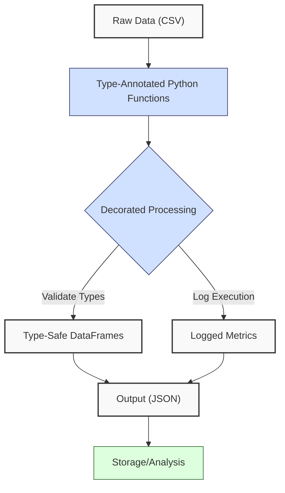
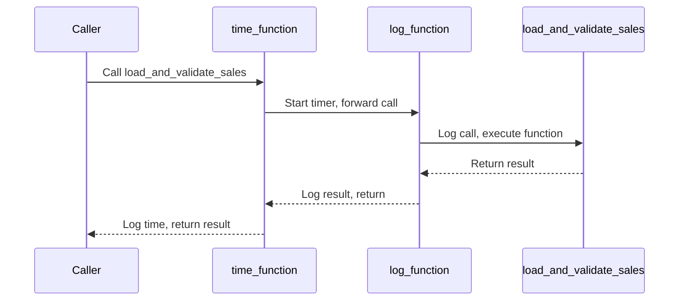
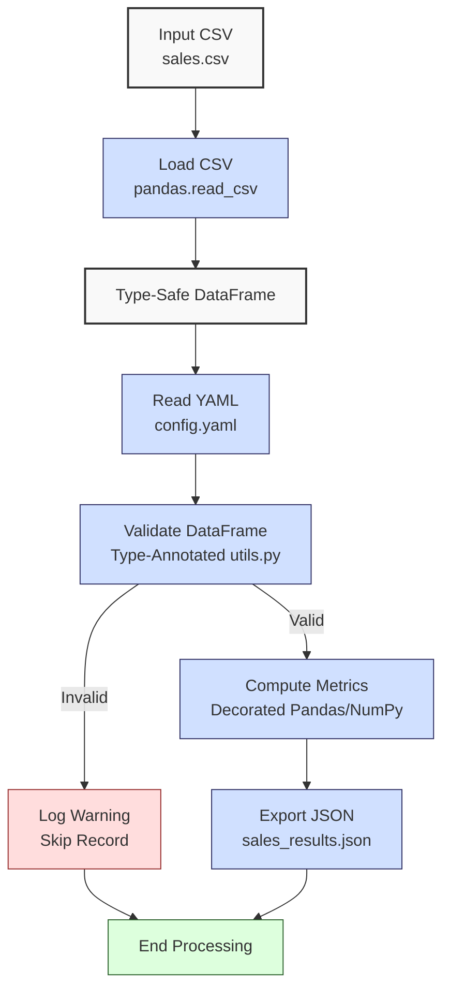

**Complexity: Moderate (M)**

## 8.0 Introduction: Why This Matters for Data Engineering

In data engineering, writing maintainable and robust code is critical for building scalable pipelines that process financial transaction data for Hijra Group's Sharia-compliant fintech analytics. **Type annotations**, verified by tools like Pyright, enhance code clarity and catch type-related errors early, reducing bugs in pipelines handling thousands of records daily. **Decorators** add reusable functionality, such as logging or validation, to pipeline functions, improving modularity and debugging. Together, they ensure type-safe, well-documented code that aligns with Hijra Group’s need for reliable analytics.

Building on **Chapter 7: Static Typing with Python**, which introduced Pyright and type safety, this chapter dives deeper into advanced type annotations (e.g., Union, Optional) and introduces decorators for logging and performance monitoring. It avoids concepts not yet covered, such as testing with `pytest` (Chapter 9) or concurrency (Chapter 40), and uses **PEP 8's 4-space indentation**, preferring spaces over tabs to avoid `IndentationError`. All code includes type annotations verified by Pyright, per the curriculum’s post-Chapter 7 requirement.

### Data Engineering Workflow Context

This diagram shows how annotations and decorators enhance a data pipeline:



### Building On and Preparing For

- **Building On**:
  - **Chapter 1**: Uses Python basics (functions, dictionaries) for data processing, now type-annotated.
  - **Chapter 2**: Leverages file handling and modules (`utils.py`), extended with decorators.
  - **Chapter 3**: Builds on Pandas/NumPy for data manipulation, now with type-safe operations.
  - **Chapter 7**: Extends Pyright-verified typing (Any, Generics) to Union and Optional types.
- **Preparing For**:
  - **Chapter 9**: Prepares for testing type-annotated code with `unittest` and `pytest`.
  - **Chapter 10**: Supports code quality with pre-commit hooks for type checking.
  - **Chapter 13**: Enables type-safe SQLite integration with Pydantic.
  - **Chapter 41**: Lays groundwork for type-safe data processing in pipelines.

### What You’ll Learn

This chapter covers:

1. **Advanced Type Annotations**: Using Union, Optional, and Callable for robust pipelines.
2. **Decorators**: Creating logging and timing decorators for pipeline functions.
3. **Type-Safe Data Processing**: Enhancing Chapter 7’s sales processor with annotations and decorators.
4. **Pyright Integration**: Configuring Pyright for type checking.

By the end, you’ll enhance Chapter 7’s sales processor with type annotations and a logging decorator, producing a type-safe JSON report for `data/sales.csv`, verified by Pyright, and using 4-space indentation per PEP 8. The micro-project tests edge cases with `empty.csv`, `invalid.csv`, `malformed.csv`, and `negative.csv` per **Appendix 1**.

**Follow-Along Tips**:

- Ensure `de-onboarding/data/` contains files from **Appendix 1** (`sales.csv`, `config.yaml`, `empty.csv`, `invalid.csv`, `malformed.csv`, `negative.csv`).
- Install libraries: `pip install numpy pandas pyyaml pyright`.
- Configure Pyright in `pyrightconfig.json` for type checking. For real-time feedback, enable Pyright in VS Code via the Pyright extension (https://marketplace.visualstudio.com/items?itemName=ms-pyright.pyright).
- Use **4 spaces** (not tabs) per PEP 8. Run `python -tt script.py` to detect tab/space mixing.
- Debug with print statements (e.g., `print(df.dtypes)` for DataFrames).
- Verify file paths with `ls data/` (Unix/macOS) or `dir data\` (Windows).
- Use UTF-8 encoding to avoid `UnicodeDecodeError`.

## 8.1 Advanced Type Annotations

Type annotations, introduced in **Chapter 7**, enhance code by specifying variable and function types, verified by Pyright. Advanced types like `Union`, `Optional`, and `Callable` handle complex data structures in pipelines. Pyright checks types statically, catching errors before runtime, reducing bugs in Hijra Group’s analytics.

### 8.1.1 Union and Optional Types

`Union` allows multiple types for a variable, while `Optional` indicates a type or `None`. These are useful for handling nullable or mixed-type data in CSVs.

```python
from typing import Union, Optional  # Import typing utilities
import pandas as pd  # Import Pandas

def get_price(price: Union[float, str]) -> float:  # Accepts float or string
    """Convert price to float."""
    if isinstance(price, str):  # Check if string
        return float(price.strip())  # Convert to float
    return price  # Return float

def find_product(df: pd.DataFrame, name: str) -> Optional[pd.Series]:  # Returns Series or None
    """Find product row in DataFrame."""
    result: pd.DataFrame = df[df["product"] == name]  # Filter DataFrame
    if result.empty:  # Check if empty
        return None  # Return None
    return result.iloc[0]  # Return first row as Series

# Example usage
price: Union[float, str] = "999.99"  # Union type
converted: float = get_price(price)  # Convert to float
print(f"Converted price: {converted}")  # Debug

df: pd.DataFrame = pd.read_csv("data/sales.csv")  # Load CSV
product: Optional[pd.Series] = find_product(df, "Halal Laptop")  # Find product
print(f"Product found: {product}")  # Debug

# Expected Output:
# Converted price: 999.99
# Product found: product    Halal Laptop
# price           999.99
# quantity             2
# Name: 0, dtype: object
```

**Follow-Along Instructions**:

1. Ensure `data/sales.csv` exists per **Appendix 1**.
2. Install Pandas: `pip install pandas`.
3. Save as `de-onboarding/annotations.py`.
4. Configure editor for **4-space indentation** per PEP 8 (VS Code: “Editor: Tab Size” = 4, “Editor: Insert Spaces” = true, “Editor: Detect Indentation” = false).
5. Run: `python annotations.py`.
6. Verify output matches comments.
7. **Common Errors**:
   - **FileNotFoundError**: Ensure `data/sales.csv` exists. Print path with `print("data/sales.csv")`.
   - **TypeError**: Print `type(price)` to verify input type.
   - **IndentationError**: Use 4 spaces (not tabs). Run `python -tt annotations.py`.

**Key Points**:

- `Union[float, str]`: Allows float or string inputs.
- `Optional[pd.Series]`: Indicates Series or None.
- **Time Complexity**: O(1) for type checks, O(n) for DataFrame filtering.
- **Space Complexity**: O(1) for scalars, O(n) for DataFrame slices.
- **Underlying Implementation**: Pyright uses static analysis to enforce type contracts, leveraging Python’s typing system (PEP 484). Annotations add no runtime overhead but improve IDE support and error detection.
- **Implication**: Ensures type-safe data handling in pipelines.

### 8.1.2 Callable Types

`Callable` specifies function signatures, useful for pipeline functions.

```python
from typing import Callable, Dict, Any  # Import typing utilities
import pandas as pd  # Import Pandas

def apply_function(df: pd.DataFrame, func: Callable[[float], float]) -> pd.DataFrame:  # Takes DataFrame and function
    """Apply function to price column."""
    df["price"] = df["price"].apply(func)  # Apply function
    return df  # Return modified DataFrame

def double_price(price: float) -> float:  # Function to double price
    """Double the price."""
    return price * 2  # Return doubled price

# Example usage
df: pd.DataFrame = pd.read_csv("data/sales.csv")  # Load CSV
df = df.dropna(subset=["price"])  # Drop missing prices
result: pd.DataFrame = apply_function(df, double_price)  # Apply function
print("Modified DataFrame:")  # Debug
print(result[["product", "price"]])  # Show product and price

# Expected Output:
# Modified DataFrame:
#          product    price
# 0   Halal Laptop  1999.98
# 1    Halal Mouse    49.98
# 2  Halal Keyboard    99.98
# 3            NaN    59.98
# 5     Headphones    10.00
```

**Follow-Along Instructions**:

1. Save as `de-onboarding/callable.py`.
2. Configure editor for 4-space indentation per PEP 8.
3. Run: `python callable.py`.
4. Verify output shows doubled prices.
5. **Common Errors**:
   - **TypeError**: Ensure `func` matches `Callable` signature. Print `type(df["price"].iloc[0])`.
   - **IndentationError**: Use 4 spaces (not tabs). Run `python -tt callable.py`.

**Key Points**:

- `Callable[[float], float]`: Specifies a function taking a float and returning a float.
- **Time Complexity**: O(n) for applying function to n rows.
- **Space Complexity**: O(n) for modified DataFrame.
- **Implication**: Enables flexible, type-safe function application in pipelines.

## 8.2 Decorators

Decorators are functions that wrap other functions to add functionality, such as logging or timing, without modifying their code. They are ideal for pipeline monitoring and debugging in Hijra Group’s analytics, where tracking function execution helps identify bottlenecks. Multiple decorators can be stacked to combine functionality, executing from innermost to outermost.

### 8.2.1 Creating a Logging Decorator

A logging decorator logs function calls and results, useful for debugging pipeline functions.

```python
from typing import Callable, Any  # Import typing utilities
from functools import wraps  # Preserve function metadata
import time  # For timestamps

def log_function(func: Callable[..., Any]) -> Callable[..., Any]:  # Decorator for any function
    """Log function calls and results."""
    @wraps(func)  # Preserve function metadata
    def wrapper(*args: Any, **kwargs: Any) -> Any:  # Wrapper accepts any arguments
        timestamp: str = time.strftime("%Y-%m-%d %H:%M:%S")  # Get timestamp
        verbose: bool = kwargs.get("verbose", True)  # Check verbose flag
        if verbose:
            print(f"{timestamp} - Calling {func.__name__} with args: {args}, kwargs: {kwargs}")  # Log call
        result: Any = func(*args, **kwargs)  # Call function
        print(f"{timestamp} - {func.__name__} returned: {result}")  # Log result
        return result  # Return result
    return wrapper  # Return wrapper

@log_function  # Apply decorator
def calculate_total(df: pd.DataFrame, **kwargs: Any) -> float:  # Type-annotated function
    """Calculate total sales."""
    df["amount"] = df["price"] * df["quantity"]  # Compute amount
    return float(df["amount"].sum())  # Return total

# Example usage
import pandas as pd  # Import Pandas
df: pd.DataFrame = pd.read_csv("data/sales.csv")  # Load CSV
df = df.dropna(subset=["price", "quantity"])  # Drop missing values
total: float = calculate_total(df, verbose=True)  # Call decorated function
print(f"Total sales: {total}")  # Debug

# Expected Output (timestamp varies):
# 2023-10-01 12:00:00 - Calling calculate_total with args: (   product   price  quantity
# 0   Halal Laptop  999.99         2
# 1    Halal Mouse   24.99        10
# 2  Halal Keyboard   49.99         5
# 3            NaN   29.99         3
# 5     Headphones    5.00       150), kwargs: {'verbose': True}
# 2023-10-01 12:00:00 - calculate_total returned: 3099.82
# Total sales: 3099.82
```

**Follow-Along Instructions**:

1. Save as `de-onboarding/decorator.py`.
2. Configure editor for 4-space indentation per PEP 8.
3. Run: `python decorator.py`.
4. Verify output shows logs and total.
5. **Common Errors**:
   - **AttributeError**: Ensure `@wraps(func)` is used to preserve metadata. Print `func.__name__`.
   - **IndentationError**: Use 4 spaces (not tabs). Run `python -tt decorator.py`.

**Key Points**:

- `@wraps(func)`: Preserves function metadata (e.g., `__name__`).
- **Time Complexity**: O(1) for decorator overhead, O(n) for wrapped function. Console logging adds ~1ms per call for small datasets (<1000 rows), increasing for larger datasets; optimization is covered in Chapter 40 (Concurrency in Python).
- **Space Complexity**: O(1) for logs.
- **Underlying Implementation**: Decorators use closures to retain function references, adding runtime hooks without altering source code.
- **Implication**: Enhances pipeline debugging for Hijra Group by logging function execution.

### 8.2.2 Timing Decorator

A timing decorator measures function execution time, ideal for optimizing pipeline functions like CSV validation. Multiple decorators can be stacked, as shown below, with execution flowing from innermost to outermost.



```python
from typing import Callable, Any, Dict, Tuple  # Import typing utilities
from functools import wraps  # Preserve function metadata
import time  # For timing
import pandas as pd  # Import Pandas

def time_function(func: Callable[..., Any]) -> Callable[..., Any]:  # Decorator for any function
    """Measure function execution time."""
    @wraps(func)  # Preserve function metadata
    def wrapper(*args: Any, **kwargs: Any) -> Any:  # Wrapper accepts any arguments
        start_time: float = time.time()  # Start timer
        result: Any = func(*args, **kwargs)  # Call function
        end_time: float = time.time()  # End timer
        print(f"{func.__name__} took {end_time - start_time:.4f} seconds")  # Log time
        return result  # Return result
    return wrapper  # Return wrapper

@time_function  # Apply timing decorator
@log_function  # Apply logging decorator
def load_and_validate_sales(csv_path: str, config: Dict[str, Any], **kwargs: Any) -> Tuple[pd.DataFrame, int, int]:  # Load and validate
    """Load sales CSV and validate using Pandas."""
    print(f"Loading CSV: {csv_path}")  # Debug: print path
    df: pd.DataFrame = pd.read_csv(csv_path)  # Load CSV into DataFrame
    required_fields: list[str] = config["required_fields"]  # Get required fields
    missing_fields: list[str] = [f for f in required_fields if f not in df.columns]
    if missing_fields:  # Check for missing columns
        print(f"Missing columns: {missing_fields}")  # Log error
        return pd.DataFrame(), 0, len(df)  # Return empty DataFrame
    df = df.dropna(subset=["product"])  # Drop rows with missing product
    df = df[df["product"].str.startswith(config["product_prefix"])]  # Filter Halal products
    total_records: int = len(df)  # Count total records
    return df, len(df), total_records  # Return DataFrame and counts

# Example usage
config: Dict[str, Any] = {
    "required_fields": ["product", "price", "quantity"],
    "product_prefix": "Halal"
}  # Sample config
result: Tuple[pd.DataFrame, int, int] = load_and_validate_sales("data/sales.csv", config, verbose=True)  # Call decorated function
print("Validated DataFrame:")  # Debug
print(result[0][["product"]])  # Show product column

# Expected Output (timestamp and time vary):
# 2023-10-01 12:00:00 - Calling load_and_validate_sales with args: ('data/sales.csv', {'required_fields': ['product', 'price', 'quantity'], 'product_prefix': 'Halal'}), kwargs: {'verbose': True}
# Loading CSV: data/sales.csv
# 2023-10-01 12:00:00 - load_and_validate_sales returned: (          product
# 0   Halal Laptop
# 1    Halal Mouse
# 2  Halal Keyboard, 3, 3)
# load_and_validate_sales took 0.0025 seconds
# Validated DataFrame:
#          product
# 0   Halal Laptop
# 1    Halal Mouse
# 2  Halal Keyboard
```

**Follow-Along Instructions**:

1. Save as `de-onboarding/timing.py`.
2. Ensure `data/sales.csv` exists per **Appendix 1**.
3. Configure editor for 4-space indentation per PEP 8.
4. Run: `python timing.py`.
5. Verify output shows execution time, logs, and DataFrame.
6. **Common Errors**:
   - **FileNotFoundError**: Ensure `data/sales.csv` exists. Print `csv_path`.
   - **TypeError**: Ensure DataFrame operations are valid. Print `df.dtypes`.
   - **IndentationError**: Use 4 spaces (not tabs). Run `python -tt timing.py`.

**Key Points**:

- Measures performance for optimizing pipeline functions like CSV loading.
- **Multiple Decorators**: Stacking `@time_function` and `@log_function` executes innermost first (`log_function`), then outermost (`time_function`), as shown in the diagram.
- **Time Complexity**: O(1) for timing, O(n) for wrapped function.
- **Space Complexity**: O(1) for timing variables.
- **Implication**: Identifies bottlenecks in pipeline functions, such as slow CSV validation.

## 8.3 Micro-Project: Type-Safe Sales Processor with Decorators

### Project Requirements

Enhance Chapter 7’s sales processor to use advanced type annotations (`Union`, `Optional`, `Callable`) and a logging decorator, processing `data/sales.csv` for Hijra Group’s analytics. The processor ensures Sharia-compliant product validation, adhering to Islamic Financial Services Board (IFSB) standards by validating products with a `Halal` prefix, and generates a type-safe JSON report, verified by Pyright, with 4-space indentation per PEP 8:

- Load `data/sales.csv` with `pandas.read_csv`.
- Read `data/config.yaml` with PyYAML.
- Validate records using type-annotated Pandas filtering and `utils.py`, ensuring Halal products, positive prices, and config rules.
- Compute total sales and top 3 products using Pandas/NumPy.
- Export results to `data/sales_results.json`.
- Log function calls with a decorator, supporting verbose and simplified modes.
- Test edge cases with `empty.csv`, `invalid.csv`, `malformed.csv`, and `negative.csv` per **Appendix 1**.
- Verify types with Pyright.

### Sample Input Files

`data/sales.csv` (from **Appendix 1**):

```csv
product,price,quantity
Halal Laptop,999.99,2
Halal Mouse,24.99,10
Halal Keyboard,49.99,5
,29.99,3
Monitor,invalid,2
Headphones,5.00,150
```

`data/config.yaml` (from **Appendix 1**):

```yaml
min_price: 10.0
max_quantity: 100
required_fields:
  - product
  - price
  - quantity
product_prefix: 'Halal'
max_decimals: 2
```

### Data Processing Flow



### Acceptance Criteria

- **Go Criteria**:
  - Loads `sales.csv` and `config.yaml` correctly.
  - Uses `Union`, `Optional`, and `Callable` for type safety.
  - Validates records for required fields, Halal prefix, numeric price/quantity, positive prices, and config rules.
  - Computes total sales and top 3 products.
  - Exports results to `data/sales_results.json`.
  - Logs function calls with a decorator, supporting verbose modes.
  - Uses 4-space indentation per PEP 8, preferring spaces over tabs.
  - Passes Pyright type checking.
  - Handles edge cases (`empty.csv`, `invalid.csv`, `malformed.csv`, `negative.csv`).
- **No-Go Criteria**:
  - Fails to load files or validate data.
  - Missing type annotations or decorator.
  - Fails Pyright checks.
  - Incorrect calculations or output.
  - Uses try/except or testing frameworks.
  - Inconsistent indentation or tab/space mixing.

### Common Pitfalls to Avoid

1. **Pyright Errors**:
   - **Problem**: Type mismatches, e.g., “Expected `float` but got `str`” in `get_price`.
   - **Solution**: Print `type(value)` and adjust annotations (e.g., add `int` to `Union[float, str, int]`). Run `pyright script.py` to debug. Example: `error: Expression of type "str" cannot be assigned to parameter "price" of type "float"` requires adding `str` to `Union`.
2. **Decorator Issues**:
   - **Problem**: Metadata loss without `@wraps`.
   - **Solution**: Use `@wraps(func)`. Print `func.__name__`.
3. **Type Inference**:
   - **Problem**: Pandas infers incorrect types (e.g., `quantity` as float).
   - **Solution**: Use `astype(int)`. Print `df.dtypes`.
4. **FileNotFoundError**:
   - **Problem**: Missing `sales.csv`.
   - **Solution**: Print path with `print(csv_path)`. Ensure files per **Appendix 1**.
5. **IndentationError**:
   - **Problem**: Mixed spaces/tabs.
   - **Solution**: Use 4 spaces per PEP 8. Run `python -tt sales_processor.py`.
6. **YAML Parsing**:
   - **Problem**: `yaml.YAMLError` due to syntax errors.
   - **Solution**: Print `open(config_path).read()` to inspect YAML.

### How This Differs from Production

In production, this solution would include:

- **Error Handling**: Try/except for robustness (Chapter 7).
- **Testing**: Unit tests with `pytest` (Chapter 9).
- **Logging**: File-based logging with `logging` (Chapter 52).
- **Scalability**: Chunked processing for large CSVs (Chapter 40).
- **Monitoring**: Advanced observability with Jaeger (Chapter 66).

### Implementation

```python
# File: de-onboarding/utils.py
from typing import Union, Dict, Any  # Import typing utilities

def is_numeric(s: str, max_decimals: int = 2) -> bool:  # Check if string is a decimal number
    """Check if string is a decimal number with up to max_decimals or an integer."""
    if s.isdigit():  # Handle integer prices
        return True
    parts: list[str] = s.split(".")  # Split on decimal point
    if len(parts) != 2 or not parts[0].isdigit() or not parts[1].isdigit():
        return False  # Invalid format
    return len(parts[1]) <= max_decimals  # Check decimal places

def clean_string(s: str) -> str:  # Clean string by stripping whitespace
    """Strip whitespace from string."""
    return s.strip()  # Return cleaned string

def is_numeric_value(x: Any) -> bool:  # Check if value is numeric
    """Check if value is an integer or float."""
    return isinstance(x, (int, float))  # Return True for numeric types

def has_valid_decimals(x: Union[int, float], max_decimals: int) -> bool:  # Check decimal places
    """Check if value has valid decimal places."""
    return is_numeric(str(x), max_decimals)  # Use is_numeric for validation

def apply_valid_decimals(x: Union[int, float], max_decimals: int) -> bool:  # Apply decimal validation
    """Apply has_valid_decimals to a value."""
    return has_valid_decimals(x, max_decimals)  # Return validation result

def is_integer(x: Any) -> bool:  # Check if value is an integer
    """Check if value is an integer when converted to string."""
    return str(x).isdigit()  # Return True for integer strings

# File: de-onboarding/sales_processor.py
from typing import Dict, Any, Optional, Callable  # Import typing utilities
from functools import wraps  # Preserve function metadata
import pandas as pd  # For DataFrame operations
import numpy as np  # For numerical computations
import yaml  # For YAML parsing
import json  # For JSON export
import time  # For logging timestamps
import utils  # Import custom utils module

def log_function(func: Callable[..., Any]) -> Callable[..., Any]:  # Decorator for any function
    """Log function calls and results."""
    @wraps(func)  # Preserve function metadata
    def wrapper(*args: Any, **kwargs: Any) -> Any:  # Wrapper accepts any arguments
        timestamp: str = time.strftime("%Y-%m-%d %H:%M:%S")  # Get timestamp
        verbose: bool = kwargs.get("verbose", True)  # Check verbose flag
        if verbose:
            print(f"{timestamp} - Calling {func.__name__} with args: {args}, kwargs: {kwargs}")  # Log call
        result: Any = func(*args, **kwargs)  # Call function
        print(f"{timestamp} - {func.__name__} returned: {result}")  # Log result
        return result  # Return result
    return wrapper  # Return wrapper

@log_function  # Apply logging decorator
def read_config(config_path: str, **kwargs: Any) -> Dict[str, Any]:  # Read YAML configuration
    """Read YAML configuration."""
    print(f"Opening config: {config_path}")  # Debug: print path
    file = open(config_path, "r")  # Open YAML
    config: Dict[str, Any] = yaml.safe_load(file)  # Parse YAML
    file.close()  # Close file
    print(f"Loaded config: {config}")  # Debug: print config
    return config  # Return config dictionary

@log_function  # Apply logging decorator
def load_and_validate_sales(csv_path: str, config: Dict[str, Any], **kwargs: Any) -> tuple[pd.DataFrame, int, int]:  # Load and validate sales
    """Load sales CSV and validate using Pandas."""
    print(f"Loading CSV: {csv_path}")  # Debug: print path
    df: pd.DataFrame = pd.read_csv(csv_path)  # Load CSV into DataFrame
    print("Initial DataFrame:")  # Debug
    print(df.head())  # Show first 5 rows

    # Validate required fields
    required_fields: list[str] = config["required_fields"]  # Get required fields
    missing_fields: list[str] = [f for f in required_fields if f not in df.columns]
    if missing_fields:  # Check for missing columns
        print(f"Missing columns: {missing_fields}")  # Log error
        return pd.DataFrame(), 0, len(df)  # Return empty DataFrame

    # Clean and filter DataFrame
    df = df.dropna(subset=["product"])  # Drop rows with missing product
    df = df[df["product"].str.startswith(config["product_prefix"])]  # Filter Halal products
    df = df[df["quantity"].apply(utils.is_integer)]  # Ensure quantity is integer
    df["quantity"] = df["quantity"].astype(int)  # Convert to int
    df = df[df["quantity"] <= config["max_quantity"]]  # Filter quantity <= max_quantity
    df = df[df["price"].apply(utils.is_numeric_value)]  # Ensure price is numeric
    df = df[df["price"] > 0]  # Filter positive prices
    df = df[df["price"] >= config["min_price"]]  # Filter price >= min_price
    df = df[df["price"].apply(lambda x: utils.apply_valid_decimals(x, config["max_decimals"]))]  # Check decimals

    total_records: int = len(df)  # Count total records after filtering
    print("Validated DataFrame:")  # Debug
    print(df)  # Show filtered DataFrame
    return df, len(df), total_records  # Return DataFrame and counts

@log_function  # Apply logging decorator
def process_sales(df: pd.DataFrame, config: Dict[str, Any], **kwargs: Any) -> tuple[Dict[str, Any], int]:  # Process sales data
    """Process sales: compute total and top products using Pandas/NumPy."""
    if df.empty:  # Check for empty DataFrame
        print("No valid sales data")  # Log empty
        return {"total_sales": 0.0, "unique_products": [], "top_products": {}}, 0

    # Compute amount
    df["amount"] = df["price"] * df["quantity"]  # Price * quantity
    print("DataFrame with Amount:")  # Debug
    print(df)  # Show DataFrame with amount

    # Compute metrics using NumPy
    total_sales: float = float(np.sum(df["amount"].values))  # Total sales
    unique_products: list[str] = df["product"].unique().tolist()  # Unique products
    sales_by_product: pd.Series = df.groupby("product")["amount"].sum()  # Group by product
    top_products: Dict[str, float] = sales_by_product.sort_values(ascending=False).head(3).to_dict()  # Top 3

    valid_sales: int = len(df)  # Count valid sales
    print(f"Valid sales: {valid_sales} records")  # Log valid count

    return {
        "total_sales": total_sales,  # Total sales
        "unique_products": unique_products,  # List of products
        "top_products": top_products  # Top 3 products
    }, valid_sales  # Return results and count

@log_function  # Apply logging decorator
def export_results(results: Dict[str, Any], json_path: str, **kwargs: Any) -> None:  # Export results
    """Export results to JSON."""
    print(f"Writing to: {json_path}")  # Debug: print path
    print(f"Results: {results}")  # Debug: print results
    file = open(json_path, "w")  # Open JSON file
    json.dump(results, file, indent=2)  # Write JSON
    file.close()  # Close file
    print(f"Exported results to {json_path}")  # Confirm export

def main() -> None:  # Main function
    """Main function to process sales data."""
    csv_path: str = "data/sales.csv"  # CSV path
    config_path: str = "data/config.yaml"  # YAML path
    json_path: str = "data/sales_results.json"  # JSON output path

    config: Dict[str, Any] = read_config(config_path, verbose=True)  # Read config
    df: pd.DataFrame
    valid_sales: int
    total_records: int
    df, valid_sales, total_records = load_and_validate_sales(csv_path, config, verbose=True)  # Load and validate
    results: Dict[str, Any]
    results, valid_sales = process_sales(df, config, verbose=True)  # Process
    export_results(results, json_path, verbose=True)  # Export results

    # Output report
    print("\nSales Report:")  # Print header
    print(f"Total Records Processed: {total_records}")  # Total records
    print(f"Valid Sales: {valid_sales}")  # Valid count
    print(f"Invalid Sales: {total_records - valid_sales}")  # Invalid count
    print(f"Total Sales: ${round(results['total_sales'], 2)}")  # Total sales
    print(f"Unique Products: {results['unique_products']}")  # Products
    print(f"Top Products: {results['top_products']}")  # Top products
    print("Processing completed")  # Confirm completion

if __name__ == "__main__":
    main()  # Run main function
```

### Pyright Configuration

Create `de-onboarding/pyrightconfig.json` to enable type checking:

```json
{
  "include": ["*.py"],
  "exclude": ["venv/**"],
  "pythonVersion": "3.10",
  "typeCheckingMode": "strict"
}
```

### Expected Outputs

`data/sales_results.json`:

```json
{
  "total_sales": 2499.83,
  "unique_products": ["Halal Laptop", "Halal Mouse", "Halal Keyboard"],
  "top_products": {
    "Halal Laptop": 1999.98,
    "Halal Mouse": 249.9,
    "Halal Keyboard": 249.95
  }
}
```

**Console Output** (abridged, timestamps vary):

```
2023-10-01 12:00:00 - Calling read_config with args: ('data/config.yaml',), kwargs: {'verbose': True}
Opening config: data/config.yaml
Loaded config: {'min_price': 10.0, 'max_quantity': 100, 'required_fields': ['product', 'price', 'quantity'], 'product_prefix': 'Halal', 'max_decimals': 2}
2023-10-01 12:00:00 - read_config returned: {'min_price': 10.0, 'max_quantity': 100, 'required_fields': ['product', 'price', 'quantity'], 'product_prefix': 'Halal', 'max_decimals': 2}
2023-10-01 12:00:00 - Calling load_and_validate_sales with args: ('data/sales.csv', {'min_price': 10.0, 'max_quantity': 100, 'required_fields': ['product', 'price', 'quantity'], 'product_prefix': 'Halal', 'max_decimals': 2}), kwargs: {'verbose': True}
Loading CSV: data/sales.csv
Initial DataFrame:
          product   price  quantity
0   Halal Laptop  999.99         2
1    Halal Mouse   24.99        10
2  Halal Keyboard   49.99         5
3            NaN   29.99         3
4       Monitor      NaN         2
Validated DataFrame:
          product   price  quantity
0   Halal Laptop  999.99         2
1    Halal Mouse   24.99        10
2  Halal Keyboard   49.99         5
2023-10-01 12:00:00 - load_and_validate_sales returned: (          product   price  quantity
0   Halal Laptop  999.99         2
1    Halal Mouse   24.99        10
2  Halal Keyboard   49.99         5, 3, 3)
2023-10-01 12:00:00 - Calling process_sales with args: (          product   price  quantity
0   Halal Laptop  999.99         2
1    Halal Mouse   24.99        10
2  Halal Keyboard   49.99         5, {'min_price': 10.0, 'max_quantity': 100, 'required_fields': ['product', 'price', 'quantity'], 'product_prefix': 'Halal', 'max_decimals': 2}), kwargs: {'verbose': True}
DataFrame with Amount:
          product   price  quantity   amount
0   Halal Laptop  999.99         2  1999.98
1    Halal Mouse   24.99        10   249.90
2  Halal Keyboard   49.99         5   249.95
Valid sales: 3 records
2023-10-01 12:00:00 - process_sales returned: ({'total_sales': 2499.83, 'unique_products': ['Halal Laptop', 'Halal Mouse', 'Halal Keyboard'], 'top_products': {'Halal Laptop': 1999.98, 'Halal Mouse': 249.9, 'Halal Keyboard': 249.95}}, 3)
2023-10-01 12:00:00 - Calling export_results with args: ({'total_sales': 2499.83, 'unique_products': ['Halal Laptop', 'Halal Mouse', 'Halal Keyboard'], 'top_products': {'Halal Laptop': 1999.98, 'Halal Mouse': 249.9, 'Halal Keyboard': 249.95}}, 'data/sales_results.json'), kwargs: {'verbose': True}
Writing to: data/sales_results.json
Results: {'total_sales': 2499.83, 'unique_products': ['Halal Laptop', 'Halal Mouse', 'Halal Keyboard'], 'top_products': {'Halal Laptop': 1999.98, 'Halal Mouse': 249.9, 'Halal Keyboard': 249.95}}
Exported results to data/sales_results.json
2023-10-01 12:00:00 - export_results returned: None

Sales Report:
Total Records Processed: 3
Valid Sales: 3
Invalid Sales: 0
Total Sales: $2499.83
Unique Products: ['Halal Laptop', 'Halal Mouse', 'Halal Keyboard']
Top Products: {'Halal Laptop': 1999.98, 'Halal Mouse': 249.9, 'Halal Keyboard': 249.95}
Processing completed
```

### How to Run and Test

1. **Setup**:

   - **Setup Checklist**:
     - [ ] Create `de-onboarding/data/` and populate with `sales.csv`, `config.yaml`, `empty.csv`, `invalid.csv`, `malformed.csv`, `negative.csv` per **Appendix 1**.
     - [ ] Install libraries: `pip install numpy pandas pyyaml pyright`.
     - [ ] Create virtual environment: `python -m venv venv`, activate (Windows: `venv\Scripts\activate`, Unix: `source venv/bin/activate`).
     - [ ] Verify Python 3.10+: `python --version`.
     - [ ] Configure editor for 4-space indentation per PEP 8 (VS Code: “Editor: Tab Size” = 4, “Editor: Insert Spaces” = true, “Editor: Detect Indentation” = false).
     - [ ] Save `utils.py`, `sales_processor.py`, and `pyrightconfig.json` in `de-onboarding/`.
   - **Troubleshooting**:
     - **FileNotFoundError**: Check permissions with `ls -l data/` (Unix) or `dir data\` (Windows).
     - **ModuleNotFoundError**: Install libraries or verify `utils.py` path.
     - **IndentationError**: Use 4 spaces. Run `python -tt sales_processor.py`.
     - **Pyright Errors**: Run `pyright sales_processor.py` and fix annotations.
     - **yaml.YAMLError**: Print `open(config_path).read()` to inspect YAML.

2. **Run**:

   - Open terminal in `de-onboarding/`.
   - Verify types: `pyright sales_processor.py`.
   - Run: `python sales_processor.py`.
   - Outputs: `data/sales_results.json`, console logs.

3. **Test Scenarios**:

   - **Valid Data**: Verify `sales_results.json` shows `total_sales: 2499.83` and correct top products.
   - **Empty CSV**:
     ```python
     config = read_config("data/config.yaml", verbose=True)
     df, valid_sales, total_records = load_and_validate_sales("data/empty.csv", config, verbose=True)
     results, valid_sales = process_sales(df, config, verbose=True)
     print(results, valid_sales, total_records)
     # Expected: {'total_sales': 0.0, 'unique_products': [], 'top_products': {}}, 0, 0
     ```
   - **Invalid Headers**:
     ```python
     config = read_config("data/config.yaml", verbose=True)
     df, valid_sales, total_records = load_and_validate_sales("data/invalid.csv", config, verbose=True)
     print(df)
     # Expected: Empty DataFrame
     ```
   - **Malformed Data**:
     ```python
     config = read_config("data/config.yaml", verbose=True)
     df, valid_sales, total_records = load_and_validate_sales("data/malformed.csv", config, verbose=True)
     print(df)
     # Expected: DataFrame with only Halal Mouse row
     ```
   - **Negative Prices**:
     ```python
     config = read_config("data/config.yaml", verbose=True)
     df, valid_sales, total_records = load_and_validate_sales("data/negative.csv", config, verbose=True)
     print(df)
     # Expected: DataFrame with only Halal Mouse row
     ```

## 8.4 Practice Exercises

### Exercise 1: Type-Annotated Price Converter

Write a type-annotated function to convert a price (`float` or `str`) to `float`, using `Union`, with 4-space indentation per PEP 8. Note: Returning `0.0` for invalid strings is a simplification due to the no-error-handling constraint; robust validation will be introduced in Chapter 9 (testing) and Chapter 13 (Pydantic).

**Sample Input**:

```python
price = "999.99"
```

**Expected Output**:

```
999.99
```

**Follow-Along Instructions**:

1. Save as `de-onboarding/ex1_converter.py`.
2. Configure editor for 4-space indentation per PEP 8.
3. Run: `python ex1_converter.py`.
4. **How to Test**:
   - Add: `print(convert_price("999.99"))`.
   - Verify output: `999.99`.
   - Test with float: `convert_price(24.99)` should return `24.99`.
   - Test with invalid string: `convert_price("invalid")` should return `0.0`.
   - Run: `pyright ex1_converter.py` to verify types.

### Exercise 2: Optional Product Finder

Write a type-annotated function to find a product in a DataFrame, returning `Optional[pd.Series]`, with 4-space indentation per PEP 8. Ensure the product has a `Halal` prefix to comply with Islamic Financial Services Board (IFSB) standards for Sharia-compliant analytics.

**Sample Input**:

```python
df = pd.read_csv("data/sample.csv")
name = "Halal Laptop"
```

**Expected Output**:

```
product    Halal Laptop
price           999.99
quantity             2
Name: 0, dtype: object
```

**Follow-Along Instructions**:

1. Save as `de-onboarding/ex2_finder.py`.
2. Ensure `data/sample.csv` exists per **Appendix 1**.
3. Run: `python ex2_finder.py`.
4. **How to Test**:
   - Add: `print(find_product(df, "Halal Laptop"))`.
   - Verify output matches expected.
   - Test with non-Halal product: `find_product(df, "Mouse")` should return `None`.
   - Test with missing product: `find_product(df, "Halal Nonexistent")` should return `None`.
   - Run: `pyright ex2_finder.py`.

### Exercise 3: Callable Data Transformer

Write a type-annotated function to apply a `Callable` to a DataFrame’s price column, with 4-space indentation per PEP 8. Ensure the function respects a minimum price threshold (e.g., `config["min_price"]`) to comply with IFSB standards for Sharia-compliant analytics.

**Sample Input**:

```python
df = pd.read_csv("data/sample.csv")
def double_price(price: float) -> float:
    return max(price * 2, 10.0)  # Ensure min_price of 10.0
```

**Expected Output**:

```
          product    price  quantity
0   Halal Laptop  1999.98         2
1    Halal Mouse    49.98        10
```

**Follow-Along Instructions**:

1. Save as `de-onboarding/ex3_transformer.py`.
2. Ensure `data/sample.csv` exists per **Appendix 1**.
3. Run: `python ex3_transformer.py`.
4. **How to Test**:
   - Add: `print(apply_transformer(df, double_price)[["product", "price"]])`.
   - Verify output shows transformed prices respecting min_price.
   - Test with different function: `lambda x: max(x + 10, 10.0)`.
   - Run: `pyright ex3_transformer.py`.

### Exercise 4: Logging Decorator

Write a logging decorator to log function calls and apply it to a sales total function, with 4-space indentation per PEP 8.

**Sample Input**:

```python
df = pd.read_csv("data/sample.csv")
```

**Expected Output** (timestamp varies):

```
2023-10-01 12:00:00 - Calling calculate_total with args: (...), kwargs: {}
2023-10-01 12:00:00 - calculate_total returned: 2249.88
2249.88
```

**Follow-Along Instructions**:

1. Save as `de-onboarding/ex4_logging.py`.
2. Ensure `data/sample.csv` exists per **Appendix 1**.
3. Run: `python ex4_logging.py`.
4. **How to Test**:
   - Add: `print(calculate_total(df))`.
   - Verify output shows logs and total.
   - Test with empty DataFrame: Should return `0.0`.
   - Run: `pyright ex4_logging.py`.

### Exercise 5: Debug a Type Annotation Bug

Fix this buggy code with incorrect type annotations, causing Pyright errors, ensuring 4-space indentation per PEP 8.

**Buggy Code**:

```python
import pandas as pd
from typing import Union

def get_total(df: pd.DataFrame) -> str:  # Bug: Incorrect return type
    """Calculate total sales."""
    df["amount"] = df["price"] * df["quantity"]
    return df["amount"].sum()

df = pd.read_csv("data/sample.csv")
print(get_total(df))
```

**Sample Input** (`data/sample.csv`):

```csv
product,price,quantity
Halal Laptop,999.99,2
Halal Mouse,24.99,10
```

**Expected Output**:

```
2249.88
```

**Follow-Along Instructions**:

1. Save as `de-onboarding/ex5_debug.py`.
2. Ensure `data/sample.csv` exists per **Appendix 1**.
3. Run: `pyright ex5_debug.py` to see errors.
4. Fix and re-run: `python ex5_debug.py`.
5. **How to Test**:
   - Verify output: `2249.88`.
   - Test with Pyright: `pyright ex5_debug.py` should pass.

### Exercise 6: Conceptual Analysis of Decorators

Explain how the `log_function` decorator uses closures and why `@wraps` is necessary by answering:

- What is a closure in the context of `log_function`?
- Why does `@wraps` prevent `wrapper` from appearing in debug logs?
  Save the answer to `de-onboarding/ex6_concepts.txt`, with 4-space indentation per PEP 8.

**Sample Input**:

```python
# Use log_function from Section 8.2.1
```

**Expected Output** (in `ex6_concepts.txt`):

```
- Closure: Wrapper retains func via closure.
- @wraps: Preserves func’s metadata, avoiding wrapper in logs.
```

**Follow-Along Instructions**:

1. Save explanation to `de-onboarding/ex6_concepts.txt`.
2. Review Section 8.2.1’s `log_function` code.
3. **How to Test**:
   - Verify `ex6_concepts.txt` contains the expected answers.
   - Test understanding by modifying `log_function` without `@wraps` and printing `calculate_total.__name__` (should show `wrapper` without `@wraps`).

### Exercise 7: Toggleable Logging Decorator (Optional)

Modify the `log_function` decorator to include a `verbose: bool` parameter, logging only the function name and result when `verbose=False`, and apply it to a sales total function, with 4-space indentation per PEP 8.

**Sample Input**:

```python
df = pd.read_csv("data/sample.csv")
```

**Expected Output** (timestamp varies, with `verbose=False`):

```
2023-10-01 12:00:00 - calculate_total returned: 2249.88
2249.88
```

**Follow-Along Instructions**:

1. Save as `de-onboarding/ex7_toggle_logging.py`.
2. Ensure `data/sample.csv` exists per **Appendix 1**.
3. Run: `python ex7_toggle_logging.py`.
4. **How to Test**:
   - Add: `print(calculate_total(df, verbose=False))`.
   - Verify output shows simplified logs and total.
   - Test with `verbose=True`: Should show full logs like Exercise 4.
   - Test with empty DataFrame: Should return `0.0`.
   - Run: `pyright ex7_toggle_logging.py`.

### Exercise 8: Debug Stacked Decorator Order (Optional)

Fix this buggy code with misordered stacked decorators, causing unexpected log output, ensuring 4-space indentation per PEP 8.

**Buggy Code**:

```python
from typing import Callable, Any
from functools import wraps
import pandas as pd
import time

def log_function(func: Callable[..., Any]) -> Callable[..., Any]:
    @wraps(func)
    def wrapper(*args: Any, **kwargs: Any) -> Any:
        timestamp = time.strftime("%Y-%m-%d %H:%M:%S")
        print(f"{timestamp} - Log: {func.__name__}")
        result = func(*args, **kwargs)
        return result
    return wrapper

def time_function(func: Callable[..., Any]) -> Callable[..., Any]:
    @wraps(func)
    def wrapper(*args: Any, **kwargs: Any) -> Any:
        start = time.time()
        result = func(*args, **kwargs)
        print(f"{func.__name__} took {time.time() - start:.4f} seconds")
        return result
    return wrapper

@log_function  # Bug: Wrong order
@time_function
def calculate_total(df: pd.DataFrame) -> float:
    """Calculate total sales."""
    df["amount"] = df["price"] * df["quantity"]
    return float(df["amount"].sum())

df = pd.read_csv("data/sample.csv")
print(calculate_total(df))
```

**Sample Input** (`data/sample.csv`):

```csv
product,price,quantity
Halal Laptop,999.99,2
Halal Mouse,24.99,10
```

**Expected Output** (timestamp varies, after fixing):

```
2023-10-01 12:00:00 - Log: calculate_total
calculate_total took 0.0020 seconds
2249.88
```

**Follow-Along Instructions**:

1. Save as `de-onboarding/ex8_debug.py`.
2. Ensure `data/sample.csv` exists per **Appendix 1**.
3. Run: `python ex8_debug.py` to see incorrect output (timing logged before function call).
4. Fix by swapping `@log_function` and `@time_function`, re-run.
5. **How to Test**:
   - Verify output shows logs in correct order (log, then time, then result).
   - Test with Pyright: `pyright ex8_debug.py` should pass.
   - Explain why the fix works in a comment.

## 8.5 Exercise Solutions

### Solution to Exercise 1: Type-Annotated Price Converter

```python
from typing import Union  # Import typing utilities

def convert_price(price: Union[float, str]) -> float:  # Convert price to float
    """Convert price to float."""
    if isinstance(price, str):  # Check if string
        if not price.replace(".", "").isdigit():  # Validate string
            print(f"Invalid price: {price}")  # Log error
            return 0.0  # Return 0 for invalid
        return float(price)  # Convert to float
    return price  # Return float

# Test
print(convert_price("999.99"))  # Call function

# Output:
# 999.99
```

### Solution to Exercise 2: Optional Product Finder

```python
from typing import Optional  # Import typing utilities
import pandas as pd  # Import Pandas

def find_product(df: pd.DataFrame, name: str) -> Optional[pd.Series]:  # Find product
    """Find product row in DataFrame, ensuring Halal prefix for IFSB compliance."""
    result: pd.DataFrame = df[df["product"] == name]  # Filter DataFrame
    if result.empty or not name.startswith("Halal"):  # Check if empty or non-Halal
        print(f"Product not found or non-Halal: {name}")  # Log error
        return None  # Return None
    return result.iloc[0]  # Return first row as Series

# Test
df: pd.DataFrame = pd.read_csv("data/sample.csv")  # Load CSV
print(find_product(df, "Halal Laptop"))  # Call function

# Output:
# product    Halal Laptop
# price           999.99
# quantity             2
# Name: 0, dtype: object
```

### Solution to Exercise 3: Callable Data Transformer

```python
from typing import Callable  # Import typing utilities
import pandas as pd  # Import Pandas

def apply_transformer(df: pd.DataFrame, func: Callable[[float], float]) -> pd.DataFrame:  # Apply function
    """Apply function to price column, ensuring IFSB-compliant min_price."""
    df["price"] = df["price"].apply(func)  # Apply function
    return df  # Return modified DataFrame

def double_price(price: float) -> float:  # Double price
    """Double the price, respecting min_price of 10.0."""
    return max(price * 2, 10.0)  # Ensure min_price

# Test
df: pd.DataFrame = pd.read_csv("data/sample.csv")  # Load CSV
print(apply_transformer(df, double_price)[["product", "price"]])  # Call function

# Output:
#          product    price
# 0   Halal Laptop  1999.98
# 1    Halal Mouse    49.98
```

### Solution to Exercise 4: Logging Decorator

```python
from typing import Callable, Any  # Import typing utilities
from functools import wraps  # Preserve function metadata
import pandas as pd  # Import Pandas
import time  # For timestamps

def log_function(func: Callable[..., Any]) -> Callable[..., Any]:  # Decorator
    """Log function calls and results."""
    @wraps(func)  # Preserve metadata
    def wrapper(*args: Any, **kwargs: Any) -> Any:  # Wrapper
        timestamp: str = time.strftime("%Y-%m-%d %H:%M:%S")  # Timestamp
        print(f"{timestamp} - Calling {func.__name__} with args: {args}, kwargs: {kwargs}")  # Log call
        result: Any = func(*args, **kwargs)  # Call function
        print(f"{timestamp} - {func.__name__} returned: {result}")  # Log result
        return result  # Return result
    return wrapper  # Return wrapper

@log_function  # Apply decorator
def calculate_total(df: pd.DataFrame) -> float:  # Calculate total
    """Calculate total sales."""
    if df.empty:  # Check empty
        return 0.0  # Return 0
    df["amount"] = df["price"] * df["quantity"]  # Compute amount
    return float(df["amount"].sum())  # Return total

# Test
df: pd.DataFrame = pd.read_csv("data/sample.csv")  # Load CSV
print(calculate_total(df))  # Call function

# Output (timestamp varies):
# 2023-10-01 12:00:00 - Calling calculate_total with args: (...), kwargs: {}
# 2023-10-01 12:00:00 - calculate_total returned: 2249.88
# 2249.88
```

### Solution to Exercise 5: Debug a Type Annotation Bug

```python
import pandas as pd  # Import Pandas
from typing import Union  # Import typing utilities

def get_total(df: pd.DataFrame) -> float:  # Fix: Correct return type
    """Calculate total sales."""
    df["amount"] = df["price"] * df["quantity"]  # Compute amount
    return float(df["amount"].sum())  # Return float

# Test
df: pd.DataFrame = pd.read_csv("data/sample.csv")  # Load CSV
print(get_total(df))  # Call function

# Output:
# 2249.88
```

**Explanation**:

- **Type Bug**: `str` was incorrect for `df["amount"].sum()`, which returns a `float`. Fixed to `float`.

### Solution to Exercise 6: Conceptual Analysis of Decorators

**Solution** (save to `de-onboarding/ex6_concepts.txt`):

```
- Closure: Wrapper retains func via closure.
- @wraps: Preserves func’s metadata, avoiding wrapper in logs.
```

### Solution to Exercise 7: Toggleable Logging Decorator (Optional)

```python
from typing import Callable, Any  # Import typing utilities
from functools import wraps  # Preserve function metadata
import pandas as pd  # Import Pandas
import time  # For timestamps

def log_function(func: Callable[..., Any]) -> Callable[..., Any]:  # Decorator
    """Log function calls and results with verbose toggle."""
    @wraps(func)  # Preserve metadata
    def wrapper(*args: Any, **kwargs: Any) -> Any:  # Wrapper
        timestamp: str = time.strftime("%Y-%m-%d %H:%M:%S")  # Timestamp
        verbose: bool = kwargs.get("verbose", True)  # Check verbose flag
        if verbose:
            print(f"{timestamp} - Calling {func.__name__} with args: {args}, kwargs: {kwargs}")  # Log call
        result: Any = func(*args, **kwargs)  # Call function
        print(f"{timestamp} - {func.__name__} returned: {result}")  # Log result
        return result  # Return result
    return wrapper  # Return wrapper

@log_function  # Apply decorator
def calculate_total(df: pd.DataFrame, **kwargs: Any) -> float:  # Calculate total
    """Calculate total sales."""
    if df.empty:  # Check empty
        return 0.0  # Return 0
    df["amount"] = df["price"] * df["quantity"]  # Compute amount
    return float(df["amount"].sum())  # Return total

# Test
df: pd.DataFrame = pd.read_csv("data/sample.csv")  # Load CSV
print(calculate_total(df, verbose=False))  # Call function with verbose=False

# Output (timestamp varies):
# 2023-10-01 12:00:00 - calculate_total returned: 2249.88
# 2249.88
```

### Solution to Exercise 8: Debug Stacked Decorator Order (Optional)

```python
from typing import Callable, Any  # Import typing utilities
from functools import wraps  # Preserve function metadata
import pandas as pd  # Import Pandas
import time  # For timestamps

def log_function(func: Callable[..., Any]) -> Callable[..., Any]:
    """Log function calls."""
    @wraps(func)
    def wrapper(*args: Any, **kwargs: Any) -> Any:
        timestamp = time.strftime("%Y-%m-%d %H:%M:%S")
        print(f"{timestamp} - Log: {func.__name__}")
        result = func(*args, **kwargs)
        return result
    return wrapper

def time_function(func: Callable[..., Any]) -> Callable[..., Any]:
    """Measure function execution time."""
    @wraps(func)
    def wrapper(*args: Any, **kwargs: Any) -> Any:
        start = time.time()
        result = func(*args, **kwargs)
        print(f"{func.__name__} took {time.time() - start:.4f} seconds")
        return result
    return wrapper

@time_function  # Fix: Correct order
@log_function
def calculate_total(df: pd.DataFrame) -> float:
    """Calculate total sales."""
    df["amount"] = df["price"] * df["quantity"]
    return float(df["amount"].sum())

# Test
df: pd.DataFrame = pd.read_csv("data/sample.csv")  # Load CSV
print(calculate_total(df))  # Call function

# Output (timestamp varies):
# 2023-10-01 12:00:00 - Log: calculate_total
# calculate_total took 0.0020 seconds
# 2249.88

# Explanation: Swapped @log_function and @time_function so log_function runs first, logging the function call before timing, ensuring logical output order.
```

## 8.6 Chapter Summary and Connection to Chapter 9

In this chapter, you’ve mastered:

- **Type Annotations**: `Union`, `Optional`, `Callable` for type-safe pipelines (O(1) type checks, O(n) for DataFrame operations).
- **Decorators**: Logging and timing decorators, including stacked and toggleable variants, for pipeline monitoring (O(1) overhead).
- **Pyright**: Static type checking for error prevention, enhanced with IDE integration.
- **White-Space Sensitivity and PEP 8**: Using 4-space indentation, preferring spaces over tabs.

The micro-project enhanced Chapter 7’s processor with type annotations and a toggleable logging decorator, producing a type-safe JSON report for Sharia-compliant sales data, verified by Pyright, and handling edge cases per **Appendix 1**. The type-safe functions, modular design (e.g., `utils.py`), and stacked decorators prepare for testing in **Chapter 9: Introduction to Testing in Python**, where you’ll use `unittest` and `pytest` to test annotated code, ensuring pipeline reliability. Chapter 10 will extend Pyright with pre-commit hooks for automated type checking, enhancing code quality. Decorators lay the groundwork for advanced logging in **Chapter 52: Introduction to Django**, supporting observability for Hijra Group’s analytics.

### Connection to Chapter 9

**Chapter 9** introduces testing with `unittest` and `pytest`, building on this chapter:

- **Type Safety**: Tests verify type-annotated functions from Chapter 8.
- **Decorators**: Logging decorators aid test debugging by tracking function execution.
- **Data Processing**: Tests validate sales processing logic using `data/sales.csv`.
- **Fintech Context**: Ensures robust pipelines for Hijra Group’s Sharia-compliant analytics, maintaining PEP 8’s 4-space indentation.
