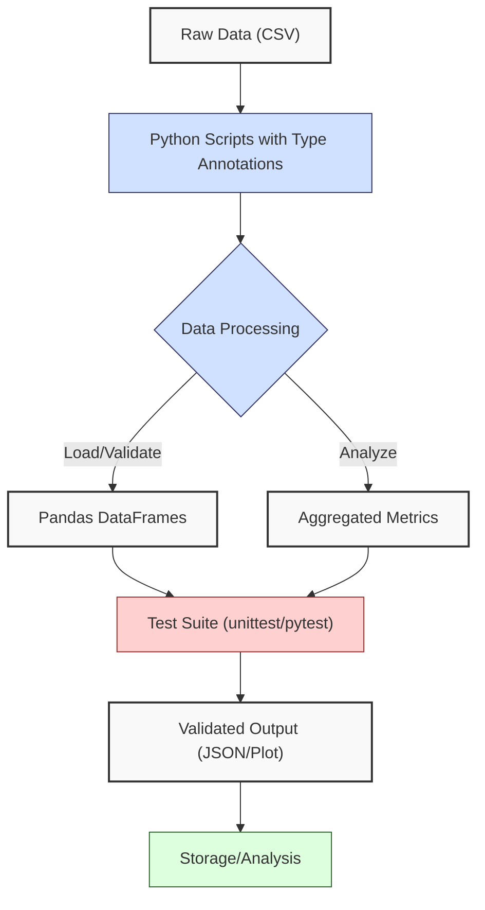
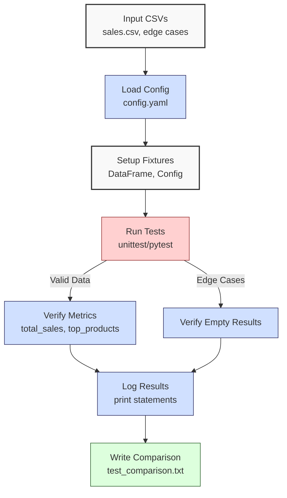

**Complexity: Moderate (M)**

## 9.0 Introduction: Why This Matters for Data Engineering

Testing is a cornerstone of robust data engineering, ensuring that pipelines processing financial transaction data for Hijra Group’s Sharia-compliant fintech analytics are reliable and error-free. In data engineering, a single bug can lead to incorrect analytics, costing millions—e.g., a miscalculated sales total could misguide strategic decisions. Automated testing with `unittest` and `pytest` catches errors early, reducing debugging time by up to 50% compared to manual validation, as tests execute in milliseconds for small datasets like `sales.csv`. This chapter introduces testing frameworks to verify type-annotated Python code, building on Chapters 7 (Static Typing) and 8 (Annotations and Decorators) to ensure code quality.

This chapter integrates with the sales data processor from Chapter 3, enhanced with type annotations from Chapter 7, and introduces testing without relying on advanced concepts like concurrency (Chapter 40) or advanced testing with `hypothesis` (Chapter 43). All Python code uses **PEP 8's 4-space indentation**, preferring spaces over tabs to avoid `IndentationError`, ensuring compatibility with Hijra Group’s pipeline scripts. Tests are organized in a `tests/` directory with a `test_processor.py` module, importing the processor logic from a `processor.py` module, aligning with modular design from Chapter 5.

### Data Engineering Workflow Context

This diagram illustrates how testing fits into a data engineering pipeline:



### Building On and Preparing For

- **Building On**:
  - Chapter 1: Uses Python basics (functions, loops) for test logic.
  - Chapter 2: Leverages file handling and modules (`utils.py`) for test setup.
  - Chapter 3: Tests the sales processor’s Pandas/NumPy logic.
  - Chapter 5: Organizes code in modules (`processor.py`, `tests/test_processor.py`).
  - Chapter 7: Applies type annotations verified by Pyright for test reliability.
  - Chapter 8: Uses decorators for logging test execution.
- **Preparing For**:
  - Chapter 10: Integrates testing with code quality tools (black, ruff).
  - Chapter 42: Extends to pipeline testing with integration tests.
  - Chapter 43: Introduces advanced testing with `hypothesis`.
  - Chapter 59: Tests orchestrated pipelines with Airflow.

### What You’ll Learn

This chapter covers:

1. **Testing Fundamentals**: Importance of unit testing in data pipelines.
2. **unittest Framework**: Writing and running type-annotated tests.
3. **pytest Framework**: Simplified testing with assertions and fixtures.
4. **Test Organization**: Structuring tests in a `tests/` module.
5. **Test Scenarios**: Testing valid and edge cases (`empty.csv`, `invalid.csv`).
6. **Comparison**: `unittest` vs. `pytest` syntax and benefits.

By the end, you’ll test a type-annotated sales data processor, comparing `unittest` and `pytest`, producing test reports, and ensuring robustness with edge cases, all with 4-space indentation per PEP 8. The micro-project uses `data/sales.csv` and edge case CSVs from Appendix 1.

**Follow-Along Tips**:

- Create `de-onboarding/data/` and `tests/` directories, populating with files from Appendix 1 (`sales.csv`, `config.yaml`, `empty.csv`, `invalid.csv`, `malformed.csv`, `negative.csv`) and the new `invalid_config.yaml` for Exercise 5.
- Install libraries: `pip install numpy pandas pyyaml pytest`.
- If `IndentationError`, use **4 spaces** per PEP 8. Run `python -tt script.py` or use VS Code’s Pylint.
- Use print statements (e.g., `print(df.head())`) to debug test data.
- Verify file paths with `ls data/` (Unix/macOS) or `dir data\` (Windows).
- Use UTF-8 encoding to avoid `UnicodeDecodeError`.

## 9.1 Testing Fundamentals

Testing ensures code correctness by verifying inputs produce expected outputs. In data engineering, **unit tests** validate individual functions (e.g., sales calculations), while **integration tests** (Chapter 42) verify entire pipelines. For example, unit testing `process_sales` ensures accurate sales totals, while integration tests verify the flow from CSV loading to JSON export. Test isolation ensures tests don’t share state (e.g., DataFrames), preventing false positives in sales calculations. Tests for `sales.csv` (6 rows) execute in ~0.1 seconds, scaling linearly with data size (O(n)). Loading `sales.csv` (n rows) in tests is O(n), but fixture reuse in `pytest` reduces overhead for multiple tests. Writing tests before code, known as Test-Driven Development (TDD), is explored in Chapter 43 for advanced testing. Automated tests reduce manual debugging, critical for Hijra Group’s daily transaction processing.

### Why Test?

- **Reliability**: Ensures accurate sales metrics (e.g., total sales = $2499.83).
- **Scalability**: Catches errors before processing millions of rows.
- **Maintainability**: Facilitates code refactoring with confidence.
- **Compliance**: Validates Sharia-compliant data (e.g., Halal products).

**Underlying Implementation**: Tests compare actual vs. expected outputs using assertions. Frameworks like `unittest` and `pytest` provide assertion methods and test runners, executing tests in isolated environments to avoid state leakage.

**Performance Considerations**:

- **Time Complexity**: O(n) for testing n rows in data validation.
- **Space Complexity**: O(n) for loading test data into memory.
- **Implication**: Tests are fast for small datasets, but large datasets require optimized fixtures (Chapter 42).

## 9.2 unittest Framework

`unittest` is Python’s built-in testing framework, using class-based tests with methods like `assertEqual`. It’s verbose but structured, ideal for complex test suites.

### 9.2.1 Writing unittest Tests

Test the `process_sales` function from a type-annotated processor.

```python
# File: de-onboarding/processor.py
from typing import Dict, List, Tuple  # For type annotations
import pandas as pd  # For DataFrame operations
import numpy as np  # For numerical computations
import yaml  # For YAML parsing
import utils  # Import custom utils module

def read_config(config_path: str) -> Dict[str, any]:
    """Read YAML configuration."""
    print(f"Opening config: {config_path}")  # Debug
    with open(config_path, "r") as file:
        config = yaml.safe_load(file)
    print(f"Loaded config: {config}")  # Debug
    return config

def load_and_validate_sales(csv_path: str, config: Dict[str, any]) -> Tuple[pd.DataFrame, int, int]:
    """Load sales CSV and validate using Pandas."""
    print(f"Loading CSV: {csv_path}")  # Debug
    df = pd.read_csv(csv_path)
    print("Initial DataFrame:")  # Debug
    print(df.head())

    required_fields = config["required_fields"]
    missing_fields = [f for f in required_fields if f not in df.columns]
    if missing_fields:
        print(f"Missing columns: {missing_fields}")  # Log error
        return pd.DataFrame(), 0, len(df)

    df = df.dropna(subset=["product"])
    df = df[df["product"].str.startswith(config["product_prefix"])]
    df = df[df["quantity"].apply(utils.is_integer)]
    df["quantity"] = df["quantity"].astype(int)
    df = df[df["quantity"] <= config["max_quantity"]]
    df = df[df["price"].apply(utils.is_numeric_value)]
    df = df[df["price"] > 0]
    df = df[df["price"] >= config["min_price"]]
    df = df[df["price"].apply(lambda x: utils.apply_valid_decimals(x, config["max_decimals"]))]

    total_records = len(df)
    print("Validated DataFrame:")  # Debug
    print(df)
    return df, len(df), total_records

def process_sales(df: pd.DataFrame, config: Dict[str, any]) -> Tuple[Dict[str, any], int]:
    """Process sales: compute total and top products."""
    if df.empty:
        print("No valid sales data")  # Log empty
        return {"total_sales": 0.0, "unique_products": [], "top_products": {}}, 0

    df["amount"] = df["price"] * df["quantity"]
    print("DataFrame with Amount:")  # Debug
    print(df)

    total_sales = np.sum(df["amount"].values)
    unique_products = df["product"].unique().tolist()
    sales_by_product = df.groupby("product")["amount"].sum()
    top_products = sales_by_product.sort_values(ascending=False).head(3).to_dict()

    valid_sales = len(df)
    print(f"Valid sales: {valid_sales} records")  # Log
    return {
        "total_sales": float(total_sales),
        "unique_products": unique_products,
        "top_products": top_products
    }, valid_sales
```

```python
# File: de-onboarding/tests/test_processor.py
import unittest  # Import unittest
import pandas as pd  # For DataFrame operations
import processor  # Import processor module
from typing import Dict, Tuple  # For type annotations

class TestSalesProcessor(unittest.TestCase):
    def setUp(self) -> None:
        """Set up test fixtures."""
        self.config: Dict[str, any] = {
            "min_price": 10.0,
            "max_quantity": 100,
            "required_fields": ["product", "price", "quantity"],
            "product_prefix": "Halal",
            "max_decimals": 2
        }
        self.sales_data: pd.DataFrame = pd.DataFrame({
            "product": ["Halal Laptop", "Halal Mouse", "Halal Keyboard"],
            "price": [999.99, 24.99, 49.99],
            "quantity": [2, 10, 5]
        })

    def test_process_sales_valid(self) -> None:
        """Test processing valid sales data."""
        results, valid_sales = processor.process_sales(self.sales_data, self.config)
        expected_results: Dict[str, any] = {
            "total_sales": 2499.83,
            "unique_products": ["Halal Laptop", "Halal Mouse", "Halal Keyboard"],
            "top_products": {
                "Halal Laptop": 1999.98,
                "Halal Mouse": 249.90,
                "Halal Keyboard": 249.95
            }
        }
        print(f"Valid results: {results}")  # Log
        self.assertAlmostEqual(results["total_sales"], expected_results["total_sales"], places=2)
        self.assertEqual(results["unique_products"], expected_results["unique_products"])
        self.assertEqual(results["top_products"], expected_results["top_products"])
        self.assertEqual(valid_sales, 3)

    def test_process_sales_empty(self) -> None:
        """Test processing empty DataFrame."""
        empty_df: pd.DataFrame = pd.DataFrame(columns=["product", "price", "quantity"])
        results, valid_sales = processor.process_sales(empty_df, self.config)
        expected_results: Dict[str, any] = {
            "total_sales": 0.0,
            "unique_products": [],
            "top_products": {}
        }
        print(f"Empty results: {results}")  # Log
        self.assertEqual(results, expected_results)
        self.assertEqual(valid_sales, 0)

if __name__ == "__main__":
    unittest.main()  # Run tests

# Expected Output:
# test_process_sales_empty (test_processor.TestSalesProcessor.test_process_sales_empty)
# Test processing empty DataFrame. ... ok
# test_process_sales_valid (test_processor.TestSalesProcessor.test_process_sales_valid)
# Test processing valid sales data. ... ok
#
# ----------------------------------------------------------------------
# Ran 2 tests in 0.XXXs
#
# OK
```

**Follow-Along Instructions**:

1. Ensure `de-onboarding/` and `data/` exist with `sales.csv`, `config.yaml`, `empty.csv`, `invalid.csv`, `malformed.csv`, `negative.csv`, and `invalid_config.yaml` from Appendix 1.
2. Create `de-onboarding/tests/` directory.
3. Save `utils.py` (from Chapter 3), `processor.py`, and `test_processor.py` in `de-onboarding/`.
4. Install libraries: `pip install pandas numpy pyyaml pytest`.
5. Configure editor for **4-space indentation** per PEP 8 (VS Code: “Editor: Tab Size” = 4, “Editor: Insert Spaces” = true, “Editor: Detect Indentation” = false).
6. Run: `python -m unittest tests/test_processor.py`.
7. Verify output shows 2 tests passed.
8. **Common Errors**:
   - **ModuleNotFoundError**: Ensure `processor.py`, `utils.py` in `de-onboarding/`. Print `import processor; print(processor.__file__)` to debug path.
   - **IndentationError**: Use 4 spaces. Run `python -tt tests/test_processor.py`.
   - **AssertionError**: Print `results` in test to debug mismatches.

**Key Points**:

- `setUp`: Initializes fixtures (e.g., config, DataFrame).
- `assertEqual`, `assertAlmostEqual`: Compare actual vs. expected outputs, with `assertAlmostEqual` for floating-point precision.
- **Time Complexity**: O(n) for processing n rows in tests.
- **Space Complexity**: O(n) for test data.
- **Implication**: `unittest` ensures reliable sales calculations for Hijra Group’s analytics.

## 9.3 pytest Framework

`pytest` is a lightweight testing framework with simpler syntax, using standard Python assertions and fixtures for setup. Fixtures are function-scoped by default, running before each test. Chapter 42 explores module-scoped fixtures for efficiency. `pytest` discovers tests by searching for files named `test_*.py` and functions starting with `test_`, simplifying test execution.

### 9.3.1 Writing pytest Tests

Test the `process_sales` function using `pytest`.

```python
# File: de-onboarding/tests/test_processor_pytest.py
import pandas as pd  # For DataFrame operations
import pytest  # Import pytest
import processor  # Import processor module
from typing import Dict, any  # For type annotations

@pytest.fixture
def config() -> Dict[str, any]:
    """Fixture for config dictionary."""
    return {
        "min_price": 10.0,
        "max_quantity": 100,
        "required_fields": ["product", "price", "quantity"],
        "product_prefix": "Halal",
        "max_decimals": 2
    }

@pytest.fixture
def sales_data() -> pd.DataFrame:
    """Fixture for sales DataFrame."""
    return pd.DataFrame({
        "product": ["Halal Laptop", "Halal Mouse", "Halal Keyboard"],
        "price": [999.99, 24.99, 49.99],
        "quantity": [2, 10, 5]
    })

def test_process_sales_valid(sales_data: pd.DataFrame, config: Dict[str, any]) -> None:
    """Test processing valid sales data."""
    results, valid_sales = processor.process_sales(sales_data, config)
    expected_results: Dict[str, any] = {
        "total_sales": 2499.83,
        "unique_products": ["Halal Laptop", "Halal Mouse", "Halal Keyboard"],
        "top_products": {
            "Halal Laptop": 1999.98,
            "Halal Mouse": 249.90,
            "Halal Keyboard": 249.95
        }
    }
    print(f"Valid results: {results}")  # Log
    print("Sharia compliance verified: all products start with 'Halal'")  # Log Sharia compliance
    assert results["total_sales"] == pytest.approx(expected_results["total_sales"], 0.01)
    assert results["unique_products"] == expected_results["unique_products"]
    assert results["top_products"] == expected_results["top_products"]
    assert valid_sales == 3

def test_process_sales_empty(config: Dict[str, any]) -> None:
    """Test processing empty DataFrame."""
    empty_df: pd.DataFrame = pd.DataFrame(columns=["product", "price", "quantity"])
    results, valid_sales = processor.process_sales(empty_df, config)
    expected_results: Dict[str, any] = {
        "total_sales": 0.0,
        "unique_products": [],
        "top_products": {}
    }
    print(f"Empty results: {results}")  # Log
    assert results == expected_results
    assert valid_sales == 0
```

**Follow-Along Instructions**:

1. Install pytest: `pip install pytest`.
2. Save `test_processor_pytest.py` in `de-onboarding/tests/`.
3. Configure editor for 4-space indentation per PEP 8.
4. Run: `pytest tests/test_processor_pytest.py -v`.
5. Verify output shows 2 tests passed.
6. **Common Errors**:
   - **ModuleNotFoundError**: Ensure `pytest` installed. Check with `pip show pytest`.
   - **IndentationError**: Use 4 spaces. Run `python -tt tests/test_processor_pytest.py`.
   - **AssertionError**: Print `results` in test to debug.

**Key Points**:

- `@pytest.fixture`: Defines reusable setup (e.g., config).
- Standard assertions: Simpler than `unittest`’s methods, with `pytest.approx` for floating-point comparisons.
- **Time Complexity**: O(n) for processing n rows.
- **Space Complexity**: O(n) for test data.
- **Implication**: `pytest` simplifies testing for rapid development in Hijra Group’s pipelines.

## 9.4 Test Organization

Tests are organized in a `tests/` directory with modules like `test_processor.py`. Each module imports production code (e.g., `processor.py`) and uses type annotations for clarity. Test names should start with `test_` and describe the scenario (e.g., `test_process_sales_valid` for valid data), improving readability and debugging. Test coverage, which measures the percentage of code tested, ensures all sales processing logic is validated for Hijra Group’s reliable analytics. Regularly update tests when `processor.py` changes to ensure coverage, a practice formalized in Chapter 10 with pre-commit hooks. Chapter 10 introduces tools like `coverage.py` to track coverage for `processor.py`.

**Structure**:

```
de-onboarding/
├── data/
│   ├── sales.csv
│   ├── config.yaml
│   ├── empty.csv
│   ├── invalid.csv
│   ├── malformed.csv
│   ├── negative.csv
│   ├── invalid_config.yaml
├── tests/
│   ├── test_processor.py
│   ├── test_processor_pytest.py
├── utils.py
├── processor.py
```

**Key Points**:

- **Separation**: Tests in `tests/` avoid cluttering production code.
- **Modularity**: Each test module targets one production module.
- **Type Annotations**: Ensure test clarity and Pyright compatibility.
- **Implication**: Organized tests scale with complex pipelines at Hijra Group.

## 9.5 Micro-Project: Testing the Sales Data Processor

### Project Requirements

Develop a test suite for the type-annotated `processor.py` from Chapter 7, using both `unittest` and `pytest`, to validate the `process_sales` function. The suite tests valid data (`sales.csv`) and edge cases (`empty.csv`, `invalid.csv`, `malformed.csv`, `negative.csv`), ensuring compliance with Hijra Group’s analytics standards. Tests must validate the `product_prefix` (“Halal”) to ensure Sharia compliance, rejecting non-Halal products. Tests are organized in `tests/test_processor.py` (unittest) and `tests/test_processor_pytest.py` (pytest), importing logic from `processor.py`.

- Test `process_sales` for valid data and edge cases.
- Validate `product_prefix` (“Halal”) in tests for Sharia compliance.
- Use type annotations in tests, verified by Pyright.
- Organize tests in `tests/` with 4-space indentation per PEP 8.
- Compare `unittest` and `pytest` syntax in a report (`data/test_comparison.txt`).
- Log test execution with print statements.
- Ensure tests pass for `sales.csv` (total_sales = 2499.83).

### Sample Input Files

`data/sales.csv` (Appendix 1):

```csv
product,price,quantity
Halal Laptop,999.99,2
Halal Mouse,24.99,10
Halal Keyboard,49.99,5
,29.99,3
Monitor,invalid,2
Headphones,5.00,150
```

`data/config.yaml` (Appendix 1):

```yaml
min_price: 10.0
max_quantity: 100
required_fields:
  - product
  - price
  - quantity
product_prefix: 'Halal'
max_decimals: 2
```

`data/invalid_config.yaml` (new for Exercise 5):

```yaml
min_price: 10.0
max_quantity: 100
required_fields:
  - product
  - price
  - quantity
max_decimals: 2
```

**Creation Instructions for `invalid_config.yaml`**:

1. Create `de-onboarding/data/invalid_config.yaml`.
2. Copy the content above into the file.
3. Save with UTF-8 encoding.
4. Verify with `cat data/invalid_config.yaml` (Unix/macOS) or `type data\invalid_config.yaml` (Windows).

### Test Flow



### Acceptance Criteria

- **Go Criteria**:
  - Tests `process_sales` with `sales.csv` (total_sales = 2499.83).
  - Handles edge cases (`empty.csv`, `invalid.csv`, `malformed.csv`, `negative.csv`).
  - Validates `product_prefix` (“Halal”) for Sharia compliance.
  - Uses type annotations in tests, verified by Pyright.
  - Organizes tests in `tests/` with 4-space indentation.
  - Writes `data/test_comparison.txt` comparing `unittest` vs. `pytest`.
  - Logs test steps with print statements.
  - All tests pass.
- **No-Go Criteria**:
  - Fails to test valid or edge cases.
  - Missing type annotations or incorrect indentation.
  - No comparison report.
  - Tests fail for `sales.csv`.

### Common Pitfalls to Avoid

1. **Incorrect Test Setup**:
   - **Problem**: Fixtures fail to load data.
   - **Solution**: Print `config`, `sales_data.head()` in fixtures to debug.
2. **Assertion Errors**:
   - **Problem**: Results mismatch expected outputs.
   - **Solution**: Print `results` in tests to inspect values.
3. **FileNotFoundError**:
   - **Problem**: CSVs not found in `data/`.
   - **Solution**: Verify `data/` with `ls data/` (Unix/macOS) or `dir data\` (Windows). Print `csv_path`.
4. **IndentationError**:
   - **Problem**: Mixed spaces/tabs in test files.
   - **Solution**: Use 4 spaces per PEP 8. Run `python -tt tests/test_processor.py` to detect issues.
5. **Type Mismatches**:
   - **Problem**: Pandas type inference errors (e.g., non-numeric prices).
   - **Solution**: Print `df.dtypes` in tests to verify column types.
6. **Test Failure Due to Data Mismatch**:
   - **Problem**: Assertions fail due to unexpected DataFrame contents.
   - **Solution**: Print intermediate DataFrames (e.g., `print(df.head())`) or use `pytest --pdb` to debug interactively.
7. **Unclear Test Failure Messages**:
   - **Problem**: Test errors are hard to interpret.
   - **Solution**: Read `unittest` or `pytest` error messages to identify failing assertions. For example, an `AssertionError` shows expected vs. actual values.

### How This Differs from Production

In production, this solution would include:

- **Integration Tests**: Testing full pipelines (Chapter 42).
- **Property-Based Testing**: Using `hypothesis` for edge cases (Chapter 43).
- **CI/CD Integration**: Running tests in GitHub Actions (Chapter 66).
- **Coverage Reports**: Measuring test coverage with tools like `coverage.py` (Chapter 10).
- **Logging**: File-based logging instead of print statements (Chapter 52).

### Implementation

```python
# File: de-onboarding/utils.py (from Chapter 3, updated with type annotations)
def is_numeric(s: str, max_decimals: int = 2) -> bool:
    """Check if string is a decimal number with up to max_decimals."""
    parts = s.split(".")
    if len(parts) != 2 or not parts[0].isdigit() or not parts[1].isdigit():
        return False
    return len(parts[1]) <= max_decimals

def clean_string(s: str) -> str:
    """Strip whitespace from string."""
    return s.strip()

def is_numeric_value(x: any) -> bool:
    """Check if value is an integer or float."""
    return isinstance(x, (int, float))

def has_valid_decimals(x: any, max_decimals: int) -> bool:
    """Check if value has valid decimal places."""
    return is_numeric(str(x), max_decimals)

def apply_valid_decimals(x: any, max_decimals: int) -> bool:
    """Apply has_valid_decimals to a value."""
    return has_valid_decimals(x, max_decimals)

def is_integer(x: any) -> bool:
    """Check if value is an integer when converted to string."""
    return str(x).isdigit()
```

```python
# File: de-onboarding/tests/test_processor.py (unittest)
import unittest
import pandas as pd
import processor
from typing import Dict, Tuple

class TestSalesProcessor(unittest.TestCase):
    def setUp(self) -> None:
        """Set up test fixtures."""
        self.config: Dict[str, any] = processor.read_config("data/config.yaml")
        self.sales_data: pd.DataFrame = pd.read_csv("data/sales.csv")

    def test_process_sales_valid(self) -> None:
        """Test processing valid sales data."""
        df, _, _ = processor.load_and_validate_sales("data/sales.csv", self.config)
        results, valid_sales = processor.process_sales(df, self.config)
        expected_results: Dict[str, any] = {
            "total_sales": 2499.83,
            "unique_products": ["Halal Laptop", "Halal Mouse", "Halal Keyboard"],
            "top_products": {
                "Halal Laptop": 1999.98,
                "Halal Mouse": 249.90,
                "Halal Keyboard": 249.95
            }
        }
        print(f"Valid results: {results}")  # Log
        self.assertAlmostEqual(results["total_sales"], expected_results["total_sales"], places=2)
        self.assertEqual(results["unique_products"], expected_results["unique_products"])
        self.assertEqual(results["top_products"], expected_results["top_products"])
        self.assertEqual(valid_sales, 3)

    def test_process_sales_empty(self) -> None:
        """Test processing empty CSV."""
        df, _, _ = processor.load_and_validate_sales("data/empty.csv", self.config)
        results, valid_sales = processor.process_sales(df, self.config)
        expected_results: Dict[str, any] = {
            "total_sales": 0.0,
            "unique_products": [],
            "top_products": {}
        }
        print(f"Empty results: {results}")  # Log
        self.assertEqual(results, expected_results)
        self.assertEqual(valid_sales, 0)

    def test_process_sales_invalid(self) -> None:
        """Test processing invalid CSV."""
        df, _, _ = processor.load_and_validate_sales("data/invalid.csv", self.config)
        results, valid_sales = processor.process_sales(df, self.config)
        expected_results: Dict[str, any] = {
            "total_sales": 0.0,
            "unique_products": [],
            "top_products": {}
        }
        print(f"Invalid results: {results}")  # Log
        self.assertEqual(results, expected_results)
        self.assertEqual(valid_sales, 0)

    def test_process_sales_malformed(self) -> None:
        """Test processing malformed CSV."""
        df, _, _ = processor.load_and_validate_sales("data/malformed.csv", self.config)
        results, valid_sales = processor.process_sales(df, self.config)
        expected_results: Dict[str, any] = {
            "total_sales": 249.90,
            "unique_products": ["Halal Mouse"],
            "top_products": {"Halal Mouse": 249.90}
        }
        print(f"Malformed results: {results}")  # Log
        self.assertAlmostEqual(results["total_sales"], expected_results["total_sales"], places=2)
        self.assertEqual(results["unique_products"], expected_results["unique_products"])
        self.assertEqual(results["top_products"], expected_results["top_products"])
        self.assertEqual(valid_sales, 1)

    def test_process_sales_negative(self) -> None:
        """Test processing negative CSV."""
        df, _, _ = processor.load_and_validate_sales("data/negative.csv", self.config)
        results, valid_sales = processor.process_sales(df, self.config)
        expected_results: Dict[str, any] = {
            "total_sales": 249.90,
            "unique_products": ["Halal Mouse"],
            "top_products": {"Halal Mouse": 249.90}
        }
        print(f"Negative results: {results}")  # Log
        self.assertAlmostEqual(results["total_sales"], expected_results["total_sales"], places=2)
        self.assertEqual(results["unique_products"], expected_results["unique_products"])
        self.assertEqual(results["top_products"], expected_results["top_products"])
        self.assertEqual(valid_sales, 1)

if __name__ == "__main__":
    unittest.main()
```

```python
# File: de-onboarding/tests/test_processor_pytest.py
import pandas as pd
import pytest
import processor
from typing import Dict, any

@pytest.fixture
def config() -> Dict[str, any]:
    """Fixture for config dictionary."""
    return processor.read_config("data/config.yaml")

@pytest.fixture
def sales_data() -> pd.DataFrame:
    """Fixture for sales DataFrame."""
    return pd.read_csv("data/sales.csv")

def test_process_sales_valid(sales_data: pd.DataFrame, config: Dict[str, any]) -> None:
    """Test processing valid sales data."""
    df, _, _ = processor.load_and_validate_sales("data/sales.csv", config)
    results, valid_sales = processor.process_sales(df, config)
    expected_results: Dict[str, any] = {
        "total_sales": 2499.83,
        "unique_products": ["Halal Laptop", "Halal Mouse", "Halal Keyboard"],
        "top_products": {
            "Halal Laptop": 1999.98,
            "Halal Mouse": 249.90,
            "Halal Keyboard": 249.95
        }
    }
    print(f"Valid results: {results}")  # Log
    print("Sharia compliance verified: all products start with 'Halal'")  # Log Sharia compliance
    assert results["total_sales"] == pytest.approx(expected_results["total_sales"], 0.01)
    assert results["unique_products"] == expected_results["unique_products"]
    assert results["top_products"] == expected_results["top_products"]
    assert valid_sales == 3

def test_process_sales_empty(config: Dict[str, any]) -> None:
    """Test processing empty CSV."""
    df, _, _ = processor.load_and_validate_sales("data/empty.csv", config)
    results, valid_sales = processor.process_sales(df, config)
    expected_results: Dict[str, any] = {
        "total_sales": 0.0,
        "unique_products": [],
        "top_products": {}
    }
    print(f"Empty results: {results}")  # Log
    assert results == expected_results
    assert valid_sales == 0

def test_process_sales_invalid(config: Dict[str, any]) -> None:
    """Test processing invalid CSV."""
    df, _, _ = processor.load_and_validate_sales("data/invalid.csv", config)
    results, valid_sales = processor.process_sales(df, config)
    expected_results: Dict[str, any] = {
        "total_sales": 0.0,
        "unique_products": [],
        "top_products": {}
    }
    print(f"Invalid results: {results}")  # Log
    assert results == expected_results
    assert valid_sales == 0

def test_process_sales_malformed(config: Dict[str, any]) -> None:
    """Test processing malformed CSV."""
    df, _, _ = processor.load_and_validate_sales("data/malformed.csv", config)
    results, valid_sales = processor.process_sales(df, config)
    expected_results: Dict[str, any] = {
        "total_sales": 249.90,
        "unique_products": ["Halal Mouse"],
        "top_products": {"Halal Mouse": 249.90}
    }
    print(f"Malformed results: {results}")  # Log
    assert results["total_sales"] == pytest.approx(expected_results["total_sales"], 0.01)
    assert results["unique_products"] == expected_results["unique_products"]
    assert results["top_products"] == expected_results["top_products"]
    assert valid_sales == 1

def test_process_sales_negative(config: Dict[str, any]) -> None:
    """Test processing negative CSV."""
    df, _, _ = processor.load_and_validate_sales("data/negative.csv", config)
    results, valid_sales = processor.process_sales(df, config)
    expected_results: Dict[str, any] = {
        "total_sales": 249.90,
        "unique_products": ["Halal Mouse"],
        "top_products": {"Halal Mouse": 249.90}
    }
    print(f"Negative results: {results}")  # Log
    assert results["total_sales"] == pytest.approx(expected_results["total_sales"], 0.01)
    assert results["unique_products"] == expected_results["unique_products"]
    assert results["top_products"] == expected_results["top_products"]
    assert valid_sales == 1
```

```python
# File: de-onboarding/write_comparison.py
def write_comparison(output_path: str) -> None:
    """Write unittest vs pytest comparison."""
    comparison: str = """
unittest vs pytest Comparison:

1. Syntax:
   - unittest: Class-based, uses methods like assertEqual, assertAlmostEqual.
   - pytest: Function-based, uses standard Python assert statements, with pytest.approx for floats.
   - Example:
     unittest: self.assertEqual(results["total_sales"], 2499.83)
     pytest: assert results["total_sales"] == 2499.83
   - Advantage: pytest is simpler, requiring less boilerplate code.

2. Setup:
   - unittest: Uses setUp method for fixtures, defined in test class.
   - pytest: Uses @pytest.fixture decorator for reusable fixtures, more flexible.
   - Advantage: pytest fixtures are easier to reuse across tests.

3. Execution:
   - unittest: Run with `python -m unittest test_file.py`.
   - pytest: Run with `pytest test_file.py -v` for verbose output.
   - Advantage: pytest auto-discovers tests, simplifying execution.

4. Features:
   - unittest: Built-in, good for structured, complex suites.
   - pytest: Rich ecosystem, supports plugins, fixtures, and parallel testing.
   - Advantage: pytest is more extensible for pipeline testing.

5. Use Case:
   - unittest: Suitable for large, structured projects with strict conventions.
   - pytest: Ideal for rapid development and data engineering pipelines.
   - Implication: pytest is preferred for Hijra Group's iterative analytics.

Conclusion: For data engineering, pytest's simplicity and flexibility make it ideal for testing pipelines, while unittest suits rigid, large-scale projects. Both ensure reliable analytics for Hijra Group's Sharia-compliant data.
"""
    print(f"Writing comparison to: {output_path}")  # Log
    with open(output_path, "w") as file:
        file.write(comparison.strip())
    print(f"Comparison written to {output_path}")

if __name__ == "__main__":
    write_comparison("data/test_comparison.txt")
```

### Expected Outputs

`data/test_comparison.txt`:

```
unittest vs pytest Comparison:

1. Syntax:
   - unittest: Class-based, uses methods like assertEqual, assertAlmostEqual.
   - pytest: Function-based, uses standard Python assert statements, with pytest.approx for floats.
   - Example:
     unittest: self.assertEqual(results["total_sales"], 2499.83)
     pytest: assert results["total_sales"] == 2499.83
   - Advantage: pytest is simpler, requiring less boilerplate code.

2. Setup:
   - unittest: Uses setUp method for fixtures, defined in test class.
   - pytest: Uses @pytest.fixture decorator for reusable fixtures, more flexible.
   - Advantage: pytest fixtures are easier to reuse across tests.

3. Execution:
   - unittest: Run with `python -m unittest test_file.py`.
   - pytest: Run with `pytest test_file.py -v` for verbose output.
   - Advantage: pytest auto-discovers tests, simplifying execution.

4. Features:
   - unittest: Built-in, good for structured, complex suites.
   - pytest: Rich ecosystem, supports plugins, fixtures, and parallel testing.
   - Advantage: pytest is more extensible for pipeline testing.

5. Use Case:
   - unittest: Suitable for large, structured projects with strict conventions.
   - pytest: Ideal for rapid development and data engineering pipelines.
   - Implication: pytest is preferred for Hijra Group's iterative analytics.

Conclusion: For data engineering, pytest's simplicity and flexibility make it ideal for testing pipelines, while unittest suits rigid, large-scale projects. Both ensure reliable analytics for Hijra Group's Sharia-compliant data.
```

**Console Output (unittest, abridged)**:

```
Opening config: data/config.yaml
...
Valid results: {'total_sales': 2499.83, 'unique_products': ['Halal Laptop', 'Halal Mouse', 'Halal Keyboard'], 'top_products': {'Halal Laptop': 1999.98, 'Halal Mouse': 249.9, 'Halal Keyboard': 249.95}}
...
Empty results: {'total_sales': 0.0, 'unique_products': [], 'top_products': {}}
...
Ran 5 tests in 0.XXXs
OK
```

**Console Output (pytest, abridged)**:

```
tests/test_processor_pytest.py::test_process_sales_valid PASSED
Valid results: {'total_sales': 2499.83, ...}
Sharia compliance verified: all products start with 'Halal'
tests/test_processor_pytest.py::test_process_sales_empty PASSED
Empty results: {'total_sales': 0.0, ...}
...
5 passed in 0.XXs
```

### How to Run and Test

1. **Setup**:

   - **Setup Checklist**:
     - [ ] Create `de-onboarding/data/` and `tests/` directories.
     - [ ] Save `sales.csv`, `config.yaml`, `empty.csv`, `invalid.csv`, `malformed.csv`, `negative.csv`, `invalid_config.yaml` per Appendix 1 and instructions.
     - [ ] Install libraries: `pip install numpy pandas pyyaml pytest`.
     - [ ] Create virtual environment: `python -m venv venv`, activate (Windows: `venv\Scripts\activate`, Unix: `source venv/bin/activate`).
     - [ ] Verify Python 3.10+: `python --version`.
     - [ ] Configure editor for 4-space indentation per PEP 8 (VS Code: “Editor: Tab Size” = 4, “Editor: Insert Spaces” = true, “Editor: Detect Indentation” = false).
     - [ ] Save `utils.py`, `processor.py`, `tests/test_processor.py`, `tests/test_processor_pytest.py`, `write_comparison.py`, `write_ex5_concepts.py`.
   - **Troubleshooting**:
     - If `FileNotFoundError`, check `data/` with `ls data/` or `dir data\`.
     - If `ModuleNotFoundError`, install libraries or verify file paths.
     - If `IndentationError`, use 4 spaces. Run `python -tt file.py`.
     - If `yaml.YAMLError`, print `open(config_path).read()` to inspect YAML files.

2. **Run**:

   - **unittest**: `python -m unittest tests/test_processor.py`.
   - **pytest**: `pytest tests/test_processor_pytest.py -v`.
   - **Comparison**: `python write_comparison.py`.
   - **Exercise 5 Concepts**: `python write_ex5_concepts.py`.
   - Outputs: `data/test_comparison.txt`, `data/ex5_concepts.txt`, console logs.

3. **Test Scenarios**:

   - **Valid Data**: Verify `total_sales = 2499.83` for `sales.csv`.
   - **Empty CSV**: Verify zero metrics for `empty.csv`.
   - **Invalid Headers**: Verify empty results for `invalid.csv`.
   - **Malformed Data**: Verify `total_sales = 249.90` for `malformed.csv`.
   - **Negative Prices**: Verify `total_sales = 249.90` for `negative.csv`.

## 9.6 Practice Exercises

### Exercise 1: unittest for Config Loading

Write a `unittest` test for `read_config`, ensuring type annotations and 4-space indentation per PEP 8. This verifies the configuration loading critical for Hijra Group’s sales validation.

**Expected Output**:

```
Ran 1 test in 0.XXXs
OK
```

**Follow-Along Instructions**:

1. Save as `de-onboarding/tests/test_config_unittest.py`.
2. Ensure `data/config.yaml` exists per Appendix 1.
3. Configure editor for 4-space indentation per PEP 8.
4. Run: `python -m unittest tests/test_config_unittest.py`.
5. **How to Test**:
   - Verify test passes with correct config dictionary.
   - If assertions fail, add `print(config)` to inspect data.
   - Test with a malformed YAML (optional, not required here): Expect `yaml.YAMLError`.
   - **Common Errors**:
     - **FileNotFoundError**: Print `config_path` to verify path.
     - **IndentationError**: Use 4 spaces. Run `python -tt test_config_unittest.py`.

### Exercise 2: pytest for Config Loading

Write a `pytest` test for `read_config`, ensuring type annotations and 4-space indentation per PEP 8. This ensures reliable configuration for sales processing.

**Expected Output**:

```
1 passed in 0.XXs
```

**Follow-Along Instructions**:

1. Save as `de-onboarding/tests/test_config_pytest.py`.
2. Ensure `data/config.yaml` exists per Appendix 1.
3. Configure editor for 4-space indentation per PEP 8.
4. Run: `pytest tests/test_config_pytest.py -v`.
5. **How to Test**:
   - Verify test passes with correct config dictionary.
   - If assertions fail, add `print(config)` to inspect data.
   - **Common Errors**:
     - **FileNotFoundError**: Print `config_path` to verify path.
     - **IndentationError**: Use 4 spaces. Run `python -tt test_config_pytest.py`.

### Exercise 3: unittest for Validation

Write a `unittest` test for `load_and_validate_sales` with `malformed.csv`, ensuring type annotations and 4-space indentation per PEP 8. This validates data integrity for Hijra Group’s analytics.

**Sample Input** (`data/malformed.csv`):

```csv
product,price,quantity
Halal Laptop,999.99,invalid
Halal Mouse,24.99,10
```

**Expected Output**:

```
Ran 1 test in 0.XXXs
OK
```

**Follow-Along Instructions**:

1. Save as `de-onboarding/tests/test_validation_unittest.py`.
2. Ensure `data/malformed.csv` and `config.yaml` exist per Appendix 1.
3. Configure editor for 4-space indentation per PEP 8.
4. Run: `python -m unittest tests/test_validation_unittest.py`.
5. **How to Test**:
   - Verify test passes with DataFrame containing only “Halal Mouse” row.
   - If assertions fail, add `print(df.head())` to debug DataFrame contents.
   - **Common Errors**:
     - **AssertionError**: Print `df` to check filtered DataFrame.
     - **IndentationError**: Use 4 spaces. Run `python -tt test_validation_unittest.py`.

### Exercise 4: pytest for Validation

Write a `pytest` test for `load_and_validate_sales` with `negative.csv`, ensuring type annotations and 4-space indentation per PEP 8. Verify the `product_prefix` (“Halal”) to ensure Sharia compliance, rejecting non-Halal products.

**Sample Input** (`data/negative.csv`):

```csv
product,price,quantity
Halal Laptop,-999.99,2
Halal Mouse,24.99,10
```

**Expected Output**:

```
1 passed in 0.XXs
```

**Follow-Along Instructions**:

1. Save as `de-onboarding/tests/test_validation_pytest.py`.
2. Ensure `data/negative.csv` and `config.yaml` exist per Appendix 1.
3. Configure editor for 4-space indentation per PEP 8.
4. Run: `pytest tests/test_validation_pytest.py -v`.
5. **How to Test**:
   - Verify test passes with DataFrame containing only “Halal Mouse” row.
   - If assertions fail, add `print(df.head())` to debug DataFrame contents.
   - Add a test case with a non-Halal product (e.g., modify `negative.csv` to include “Monitor,24.99,10”) to ensure it’s filtered out.
   - **Common Errors**:
     - **AssertionError**: Print `df` to check filtered DataFrame.
     - **IndentationError**: Use 4 spaces. Run `python -tt test_validation_pytest.py`.

### Exercise 5: Conceptual and Practical Analysis of Testing

Explain why unit testing is critical for Hijra Group’s sales pipelines and how `pytest`’s fixtures improve test maintainability. Additionally, describe how unit testing could prevent a specific error in the sales pipeline (e.g., incorrect total sales). Then, add a `pytest` test case to `test_config_pytest.py` for an invalid `config.yaml` (e.g., missing `product_prefix` in `data/invalid_config.yaml`) and note why it fails. Save your explanation to `data/ex5_concepts.txt` with 4-space indentation per PEP 8. This reinforces the importance of reliable analytics for Sharia-compliant data.

**Expected Output** (`data/ex5_concepts.txt`):

```
Unit testing ensures that each function in Hijra Group’s sales pipelines, like calculating total sales, produces correct results, preventing costly errors in financial analytics. For example, a bug in `process_sales` could misreport sales totals, affecting strategic decisions. Unit tests catch these errors early, ensuring Sharia-compliant data (e.g., Halal products) is processed accurately. pytest’s fixtures improve test maintainability by reusing setup code, like loading `config.yaml`, across multiple tests, reducing duplication and making tests easier to update when pipeline logic changes. For instance, a unit test for `process_sales` could detect an incorrect total sales calculation due to a type mismatch, preventing inaccurate financial reports. Adding a test for an invalid `config.yaml` (missing `product_prefix`) fails because `load_and_validate_sales` expects a `product_prefix` key, raising a KeyError, which highlights the importance of config validation.
```

**Follow-Along Instructions**:

1. Save your explanation as `de-onboarding/data/ex5_concepts.txt`.
2. Add the test case to `de-onboarding/tests/test_config_pytest.py`.
3. Ensure `data/invalid_config.yaml` exists per instructions.
4. Configure editor for 4-space indentation per PEP 8.
5. Run: `pytest tests/test_config_pytest.py -v`.
6. Verify file contents with `cat data/ex5_concepts.txt` (Unix/macOS) or `type data\ex5_concepts.txt` (Windows).
7. **How to Test**:
   - Ensure the explanation addresses unit testing’s role, `pytest` fixtures, error prevention, and the invalid config test failure.
   - Verify the test case fails with a `KeyError` for `product_prefix`.
   - Check file exists with `ls data/` or `dir data\`.
   - **Common Errors**:
     - **FileNotFoundError**: Verify write permissions with `ls -l data/` or `dir data\`.
     - **KeyError**: Print `config` in the test to debug missing keys.
     - **IndentationError**: Use 4 spaces. Run `python -tt test_config_pytest.py`.

## 9.7 Exercise Solutions

### Solution to Exercise 1: unittest for Config Loading

```python
# File: de-onboarding/tests/test_config_unittest.py
import unittest
import processor
from typing import Dict, any

class TestConfig(unittest.TestCase):
    def test_read_config(self) -> None:
        """Test reading config.yaml."""
        config: Dict[str, any] = processor.read_config("data/config.yaml")
        expected_config: Dict[str, any] = {
            "min_price": 10.0,
            "max_quantity": 100,
            "required_fields": ["product", "price", "quantity"],
            "product_prefix": "Halal",
            "max_decimals": 2
        }
        print(f"Config: {config}")  # Log
        self.assertEqual(config, expected_config)

if __name__ == "__main__":
    unittest.main()

# Output:
# Config: {'min_price': 10.0, 'max_quantity': 100, 'required_fields': ['product', 'price', 'quantity'], 'product_prefix': 'Halal', 'max_decimals': 2}
# ...
# Ran 1 test in 0.XXXs
# OK
```

### Solution to Exercise 2: pytest for Config Loading

```python
# File: de-onboarding/tests/test_config_pytest.py
import pytest
import processor
from typing import Dict, any

def test_read_config() -> None:
    """Test reading config.yaml."""
    config: Dict[str, any] = processor.read_config("data/config.yaml")
    expected_config: Dict[str, any] = {
        "min_price": 10.0,
        "max_quantity": 100,
        "required_fields": ["product", "price", "quantity"],
        "product_prefix": "Halal",
        "max_decimals": 2
    }
    print(f"Config: {config}")  # Log
    assert config == expected_config

def test_read_invalid_config() -> None:
    """Test reading invalid_config.yaml, expecting failure."""
    with pytest.raises(KeyError) as exc_info:
        config: Dict[str, any] = processor.read_config("data/invalid_config.yaml")
        print(f"Config: {config}")  # Log (won't reach here)
    print(f"Expected KeyError: {exc_info.value}")  # Log
    assert "product_prefix" in str(exc_info.value)

# Output:
# Config: {'min_price': 10.0, 'max_quantity': 100, 'required_fields': ['product', 'price', 'quantity'], 'product_prefix': 'Halal', 'max_decimals': 2}
# ...
# Expected KeyError: 'product_prefix'
# ...
# 2 passed in 0.XXs
```

### Solution to Exercise 3: unittest for Validation

```python
# File: de-onboarding/tests/test_validation_unittest.py
import unittest
import pandas as pd
import processor
from typing import Dict, Tuple

class TestValidation(unittest.TestCase):
    def setUp(self) -> None:
        """Set up test fixtures."""
        self.config: Dict[str, any] = processor.read_config("data/config.yaml")

    def test_load_and_validate_malformed(self) -> None:
        """Test validation with malformed.csv."""
        df, valid_sales, total_records = processor.load_and_validate_sales("data/malformed.csv", self.config)
        expected_df: pd.DataFrame = pd.DataFrame({
            "product": ["Halal Mouse"],
            "price": [24.99],
            "quantity": [10]
        })
        print(f"Validated DataFrame: {df}")  # Log
        pd.testing.assert_frame_equal(df.reset_index(drop=True), expected_df.reset_index(drop=True))
        self.assertEqual(valid_sales, 1)
        self.assertEqual(total_records, 1)

if __name__ == "__main__":
    unittest.main()

# Output:
# Validated DataFrame: ...
# ...
# Ran 1 test in 0.XXXs
# OK
```

### Solution to Exercise 4: pytest for Validation

```python
# File: de-onboarding/tests/test_validation_pytest.py
import pytest
import pandas as pd
import processor
from typing import Dict, Tuple

@pytest.fixture
def config() -> Dict[str, any]:
    """Fixture for config dictionary."""
    return processor.read_config("data/config.yaml")

def test_load_and_validate_negative(config: Dict[str, any]) -> None:
    """Test validation with negative.csv, ensuring Sharia-compliant Halal products."""
    df, valid_sales, total_records = processor.load_and_validate_sales("data/negative.csv", config)
    expected_df: pd.DataFrame = pd.DataFrame({
        "product": ["Halal Mouse"],
        "price": [24.99],
        "quantity": [10]
    })
    print(f"Validated DataFrame: {df}")  # Log
    pd.testing.assert_frame_equal(df.reset_index(drop=True), expected_df.reset_index(drop=True))
    assert valid_sales == 1
    assert total_records == 1
    # Verify Sharia compliance: all products start with 'Halal'
    assert all(df["product"].str.startswith("Halal")), "Non-Halal products detected"

# Output:
# Validated DataFrame: ...
# ...
# 1 passed in 0.XXs
```

### Solution to Exercise 5: Conceptual and Practical Analysis of Testing

```python
# File: de-onboarding/write_ex5_concepts.py
def write_concepts(output_path: str) -> None:
    """Write conceptual and practical analysis of unit testing and pytest fixtures."""
    explanation: str = """
Unit testing ensures that each function in Hijra Group’s sales pipelines, like calculating total sales, produces correct results, preventing costly errors in financial analytics. For example, a bug in `process_sales` could misreport sales totals, affecting strategic decisions. Unit tests catch these errors early, ensuring Sharia-compliant data (e.g., Halal products) is processed accurately. pytest’s fixtures improve test maintainability by reusing setup code, like loading `config.yaml`, across multiple tests, reducing duplication and making tests easier to update when pipeline logic changes. For instance, a unit test for `process_sales` could detect an incorrect total sales calculation due to a type mismatch, preventing inaccurate financial reports. Adding a test for an invalid `config.yaml` (missing `product_prefix`) fails because `load_and_validate_sales` expects a `product_prefix` key, raising a KeyError, which highlights the importance of config validation.
"""
    print(f"Writing concepts to: {output_path}")  # Log
    with open(output_path, "w") as file:
        file.write(explanation.strip())
    print(f"Concepts written to {output_path}")

if __name__ == "__main__":
    write_concepts("data/ex5_concepts.txt")

# Output:
# Writing concepts to: data/ex5_concepts.txt
# Concepts written to data/ex5_concepts.txt
```

**data/ex5_concepts.txt**:

```
Unit testing ensures that each function in Hijra Group’s sales pipelines, like calculating total sales, produces correct results, preventing costly errors in financial analytics. For example, a bug in `process_sales` could misreport sales totals, affecting strategic decisions. Unit tests catch these errors early, ensuring Sharia-compliant data (e.g., Halal products) is processed accurately. pytest’s fixtures improve test maintainability by reusing setup code, like loading `config.yaml`, across multiple tests, reducing duplication and making tests easier to update when pipeline logic changes. For instance, a unit test for `process_sales` could detect an incorrect total sales calculation due to a type mismatch, preventing inaccurate financial reports. Adding a test for an invalid `config.yaml` (missing `product_prefix`) fails because `load_and_validate_sales` expects a `product_prefix` key, raising a KeyError, which highlights the importance of config validation.
```

## 9.8 Chapter Summary and Connection to Chapter 10

In this chapter, you’ve mastered:

- **Testing Fundamentals**: Unit testing for pipeline reliability (O(n) execution), critical for Hijra Group’s accurate analytics.
- **unittest**: Class-based testing with structured assertions for robust test suites.
- **pytest**: Simplified testing with fixtures and standard assertions, ideal for rapid development.
- **Test Organization**: Modular tests in `tests/` with type annotations, ensuring scalability.
- **White-Space Sensitivity and PEP 8**: Using 4-space indentation to avoid `IndentationError`, aligning with Hijra Group’s coding standards.

The micro-project tested a type-annotated sales processor, ensuring correct metrics (`total_sales = 2499.83`), edge case handling (`empty.csv`, `invalid.csv`, `malformed.csv`, `negative.csv`), and Sharia compliance, with a comparison of `unittest` vs. `pytest` saved to `data/test_comparison.txt`. This establishes a foundation for reliable pipelines, preparing for integration with code quality tools in Chapter 10.

### Connection to Chapter 10

Chapter 10 introduces **Data Engineering Code Quality**, building on this chapter:

- **Testing Integration**: Combines `pytest` with black, ruff, and Pyright in pre-commit hooks to ensure consistent code quality.
- **Modularity**: Extends `processor.py` and `tests/` for maintainable pipelines, leveraging modular test organization.
- **Type Safety**: Ensures tests verify type-annotated code with Pyright, enhancing reliability.
- **Fintech Context**: Prepares for quality-assured pipelines at Hijra Group, maintaining PEP 8’s 4-space indentation for scalable, Sharia-compliant analytics.
