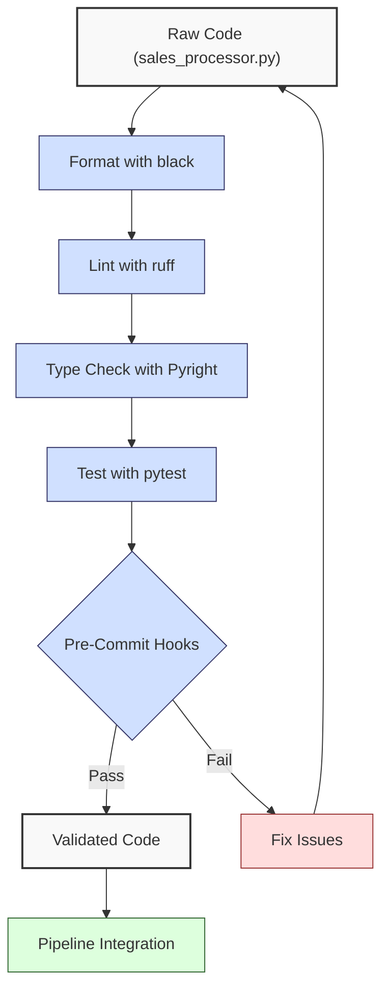
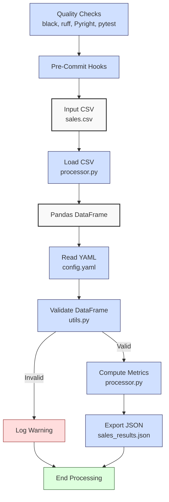
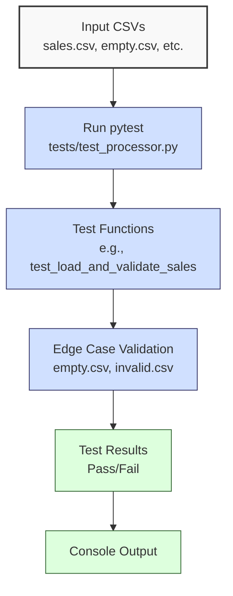

**Complexity: Moderate (M)**

## 10.0 Introduction: Why This Matters for Data Engineering

In data engineering, high-quality code ensures reliable, maintainable, and scalable data pipelines, critical for Hijra Group’s Sharia-compliant fintech analytics processing millions of transactions. Poor code quality leads to bugs, performance issues, and technical debt, costing organizations up to 15% of development time on maintenance (source: industry studies). Tools like **black** (formatting), **ruff** (linting), **Pyright** (type checking), and **pre-commit hooks** enforce consistency, catch errors early, and align with PEP 8 standards, ensuring readable code with **4-space indentation** (spaces, not tabs) to avoid `IndentationError`. This chapter builds on Chapters 7–9 (static typing, annotations, testing) to integrate code quality tools into a sales data processing pipeline, preparing for production-grade deployment in Phase 9 (Chapters 60–66).

### Data Engineering Workflow Context

This diagram illustrates how code quality tools fit into a data engineering pipeline:



### Building On and Preparing For

- **Building On**:
  - Chapter 7: Uses Pyright for type safety, extended with configuration for pipeline scripts.
  - Chapter 8: Leverages type annotations and decorators for logging, integrated with linting.
  - Chapter 9: Builds on `pytest` and `unittest` for testing, now enforced via pre-commit hooks.
  - Chapter 3: Reuses `sales_processor.py` and `utils.py` for sales data processing, now with quality tools.
- **Preparing For**:
  - Chapter 11: Consolidates code quality for Checkpoint 2.
  - Chapter 42: Prepares for advanced pipeline testing with quality checks.
  - Chapters 60–66: Ensures production-ready code for Docker, Kubernetes, and CI/CD.

### What You’ll Learn

This chapter covers:

1. **Code Formatting with black**: Enforces PEP 8 style (4-space indentation, spaces over tabs).
2. **Linting with ruff**: Detects style and logical errors.
3. **Type Checking with Pyright**: Ensures type safety for pipeline functions.
4. **Testing with pytest and unittest**: Validates functionality with unit tests.
5. **Pre-Commit Hooks**: Automates quality checks before commits.
6. **Modular Code Organization**: Structures code in `utils.py`, `processor.py`, and `tests/`.

The micro-project enhances Chapter 9’s sales processor with type annotations, quality tools, and a pre-commit pipeline, processing `data/sales.csv` and testing edge cases (`empty.csv`, `invalid.csv`, `malformed.csv`, `negative.csv`) per Appendix 1. All code uses **4-space indentation** per PEP 8, avoiding tabs to prevent `IndentationError`.

**Follow-Along Tips**:

- Create `de-onboarding/data/` and populate with files from Appendix 1 (`sales.csv`, `config.yaml`, `empty.csv`, `invalid.csv`, `malformed.csv`, `negative.csv`).
- Install libraries: `pip install black ruff pyright pytest pyyaml pandas numpy matplotlib pre-commit`. If `pip install` fails, ensure `pip` is updated (`pip install --upgrade pip`) and added to PATH. Verify with `pip --version`. For command not found errors, check Python’s Scripts directory (e.g., `venv\Scripts` on Windows).
- Configure editor for **4-space indentation** (VS Code: “Editor: Tab Size” = 4, “Editor: Insert Spaces” = true, “Editor: Detect Indentation” = false).
- Use print statements (e.g., `print(df.head())`) to debug DataFrames.
- Verify file paths with `ls data/` (Unix/macOS) or `dir data\` (Windows).
- Run `python -tt script.py` to detect tab/space mixing.
- Ensure UTF-8 encoding for all files to avoid `UnicodeDecodeError`.
- Initialize a Git repository (`git init`) in `de-onboarding/` before running `pre-commit install` to enable hooks. Verify with `git status`.

## 10.1 Code Formatting with black

**black** is an opinionated formatter enforcing PEP 8, using **4-space indentation** (spaces, not tabs) for consistency. It reformats code in O(n) time (n = lines), reducing manual styling effort. For a 1,000-line script, black takes ~0.1 seconds.

### 10.1.1 Using black

Format a script to align with PEP 8.

```python
# File: de-onboarding/unformatted.py
import pandas as pd
def process_sales(csv_path): # Poorly formatted
  df=pd.read_csv(csv_path)
      print(df.head()) # Inconsistent indentation
  return df

# Run black
# bash: black de-onboarding/unformatted.py
```

**Formatted Output**:

```python
# File: de-onboarding/unformatted.py
import pandas as pd


def process_sales(csv_path):  # Properly formatted
    df = pd.read_csv(csv_path)
    print(df.head())  # 4-space indentation
    return df
```

**Follow-Along Instructions**:

1. Save as `de-onboarding/unformatted.py`.
2. Install black: `pip install black`.
3. Run: `black de-onboarding/unformatted.py`.
4. Verify formatting with `cat de-onboarding/unformatted.py` (Unix/macOS) or `type de-onboarding\unformatted.py` (Windows).
5. **Common Errors**:
   - **CommandNotFound**: Install black or check PATH.
   - **IndentationError**: Black fixes tabs; re-run `python -tt unformatted.py`.

**Key Points**:

- **White-Space Sensitivity and PEP 8**: Black enforces **4-space indentation** (spaces), eliminating `IndentationError` risks.
- **Time Complexity**: O(n) for formatting n lines.
- **Space Complexity**: O(n) for storing formatted code.
- **Implication**: Ensures consistent, readable code for Hijra Group’s pipelines.

## 10.2 Linting with ruff

**ruff** is a fast linter detecting style (e.g., unused imports) and logical errors (e.g., undefined variables) in O(n) time. It’s 10–100x faster than Flake8, ideal for large codebases.

### 10.2.1 Using ruff

Lint a script to catch issues.

```python
# File: de-onboarding/lint_example.py
import os  # Unused import
def process_sales(csv_path):
    df = pd.read_csv(csv_path)  # Undefined pd
    x = 1  # Unused variable
    return Df  # Undefined variable
```

**Run ruff**:

```bash
ruff check de-onboarding/lint_example.py
```

**Output**:

```
de-onboarding/lint_example.py:1:1: F401 `os` imported but unused
de-onboarding/lint_example.py:3:10: F821 undefined name `pd`
de-onboarding/lint_example.py:4:5: F841 local variable `x` is assigned to but never used
de-onboarding/lint_example.py:5:12: F821 undefined name `Df`
```

**Fixed Code**:

```python
# File: de-onboarding/lint_example.py
import pandas as pd


def process_sales(csv_path):
    df = pd.read_csv(csv_path)
    return df
```

**Follow-Along Instructions**:

1. Save as `de-onboarding/lint_example.py`.
2. Install ruff: `pip install ruff`.
3. Run: `ruff check de-onboarding/lint_example.py`.
4. Fix issues and re-run.
5. **Common Errors**:
   - **ModuleNotFoundError**: Install `pandas` or fix imports.
   - **CommandNotFound**: Install ruff or check PATH.

**Key Points**:

- **Time Complexity**: O(n) for linting n lines.
- **Space Complexity**: O(1) for error reports.
- **Implication**: Catches errors early, improving pipeline reliability.

## 10.3 Type Checking with Pyright

**Pyright** ensures type safety for type-annotated code, catching type errors in O(n) time. It’s critical for Hijra Group’s pipelines to prevent runtime errors in data processing.

### 10.3.1 Using Pyright

Check types in a script.

```python
# File: de-onboarding/type_example.py
from typing import List


def process_sales(prices: List[int]) -> float:
    return sum(prices) * 1.5  # Type mismatch: int vs float
```

**Run Pyright**:

```bash
pyright de-onboarding/type_example.py
```

**Output**:

```
de-onboarding/type_example.py:5:16 - error: Argument of type "float" cannot be assigned to parameter of type "int" in function "sum" (reportGeneralTypeIssues)
```

**Fixed Code**:

```python
# File: de-onboarding/type_example.py
from typing import List


def process_sales(prices: List[float]) -> float:
    return sum(prices) * 1.5
```

**Follow-Along Instructions**:

1. Save as `de-onboarding/type_example.py`.
2. Install Pyright: `pip install pyright`.
3. Run: `pyright de-onboarding/type_example.py`.
4. Fix issues and re-run.
5. **Common Errors**:
   - **CommandNotFound**: Install Pyright or check PATH.
   - **Type Errors**: Print variable types with `print(type(x))`.

**Key Points**:

- **Time Complexity**: O(n) for checking n lines.
- **Space Complexity**: O(n) for type annotations.
- **Implication**: Ensures type-safe pipelines for Hijra Group.

## 10.4 Testing with pytest and unittest

**pytest** and **unittest** run unit tests to validate functionality, introduced in Chapter 9. Tests are organized in a `tests/` module, running in O(n) time for n tests. This section focuses on pytest, with a brief unittest example to show both frameworks supported by the curriculum.

### 10.4.1 Writing pytest Tests

Test a sales function using pytest.

```python
# File: de-onboarding/processor.py
from typing import Dict, Any


def calculate_sales(prices: List[float], quantities: List[int]) -> Dict[str, Any]:
    if len(prices) != len(quantities):
        return {"total": 0.0}
    amounts = [p * q for p, q in zip(prices, quantities)]
    return {"total": sum(amounts)}


# File: de-onboarding/tests/test_processor.py
from processor import calculate_sales


def test_calculate_sales():
    result = calculate_sales([999.99, 24.99], [2, 10])
    assert result["total"] == 2249.88
    result = calculate_sales([999.99], [2, 10])
    assert result["total"] == 0.0
```

**Run pytest**:

```bash
pytest de-onboarding/tests/test_processor.py -v
```

**Output**:

```
collected 1 item
de-onboarding/tests/test_processor.py::test_calculate_sales PASSED
```

**Follow-Along Instructions**:

1. Save files as shown.
2. Install pytest: `pip install pytest`.
3. Run: `pytest de-onboarding/tests/test_processor.py -v`.
4. Verify tests pass.
5. **Common Errors**:
   - **ImportError**: Ensure `processor.py` is in `de-onboarding/`.
   - **AssertionError**: Print `result` to debug.

### 10.4.2 Writing unittest Tests

Test the same sales function using unittest. The `unittest.TestCase` class leverages object-oriented principles from Chapter 5, organizing tests into reusable class structures.

```python
# File: de-onboarding/tests/test_processor_unittest.py
import unittest
from processor import calculate_sales


class TestCalculateSales(unittest.TestCase):
    def test_calculate_sales(self):
        result = calculate_sales([999.99, 24.99], [2, 10])
        self.assertEqual(result["total"], 2249.88)
        result = calculate_sales([999.99], [2, 10])
        self.assertEqual(result["total"], 0.0)


if __name__ == "__main__":
    unittest.main()
```

**Run unittest**:

```bash
python -m unittest de-onboarding/tests/test_processor_unittest.py -v
```

**Output**:

```
test_calculate_sales (test_processor_unittest.TestCalculateSales) ... ok
----------------------------------------------------------------------
Ran 1 test in 0.000s
OK
```

**Follow-Along Instructions**:

1. Save as `de-onboarding/tests/test_processor_unittest.py`.
2. Run: `python -m unittest de-onboarding/tests/test_processor_unittest.py -v`.
3. Verify tests pass.
4. **Common Errors**:
   - **ImportError**: Ensure `processor.py` is in `de-onboarding/`.
   - **AssertionError**: Print `result` to debug.

**Key Points**:

- **Time Complexity**: O(n) for n tests.
- **Space Complexity**: O(n) for test data.
- **Implication**: Validates pipeline logic for reliability. Pytest is preferred for its simplicity, but unittest is supported for structured test classes.

## 10.5 Pre-Commit Hooks

**pre-commit** automates quality checks before commits, running black, ruff, Pyright, and pytest in O(n) time total. Pre-commit’s O(n) runtime is fast for small projects but may slow commits in large codebases; optimization is covered in Chapter 66 for CI/CD. Tools like black and ruff can use configuration files (e.g., `pyproject.toml` for black, `ruff.toml` for ruff) to customize settings, such as line length or rule exclusions, which are explored in Chapter 66 for CI/CD setups. Example `pyproject.toml` for black:

```toml
[tool.black]
line-length = 88
```

### 10.5.1 Setting Up Pre-Commit

Create a configuration file.

```yaml
# File: de-onboarding/.pre-commit-config.yaml
repos:
  - repo: https://github.com/psf/black
    rev: 24.4.2
    hooks:
      - id: black
  - repo: https://github.com/charliermarsh/ruff-pre-commit
    rev: v0.5.0
    hooks:
      - id: ruff
  - repo: https://github.com/RobertCraigie/pyright-python
    rev: v1.1.350
    hooks:
      - id: pyright
  - repo: local
    hooks:
      - id: pytest
        name: pytest
        entry: pytest tests/
        language: system
        types: [python]
        pass_filenames: false
```

**Install and Run**:

```bash
pip install pre-commit
pre-commit install
git add .
git commit -m "Add sales processor"
```

**Output** (if issues):

```
black............................Failed
- hook id: black
- files were modified by this hook
ruff.............................Failed
- hook id: ruff
- exit code: 1
pyright..........................Passed
pytest...........................Passed
```

**Follow-Along Instructions**:

1. Save `.pre-commit-config.yaml` in `de-onboarding/`.
2. Install pre-commit: `pip install pre-commit`.
3. Run: `pre-commit install`.
4. Commit changes to trigger hooks.
5. Fix issues and re-commit.
6. **Common Errors**:
   - **Hook Failure**: Run `pre-commit run --all-files` to debug.
   - **CommandNotFound**: Install pre-commit or check PATH.

**Key Points**:

- **Time Complexity**: O(n) for all hooks.
- **Space Complexity**: O(n) for temporary files.
- **Implication**: Automates quality assurance for Hijra Group’s pipelines.

## 10.6 Micro-Project: Sales Data Processor with Quality Pipeline

### Project Requirements

Enhance Chapter 9’s sales processor to include type annotations, black formatting (version 24.4.2), ruff linting (version 0.5.0), Pyright type checking (version 1.1.350), pytest tests, and pre-commit hooks. Process `data/sales.csv` for Hijra Group’s analytics, ensuring compliance with Sharia standards. The pipeline validates sales data, computes metrics, and generates a JSON report, organized in modules (`utils.py`, `processor.py`, `tests/`).

- Load `data/sales.csv` and `config.yaml` with type-annotated functions.
- Validate records for Halal products, positive prices, and config rules.
- Compute total sales and top 3 products.
- Export to `data/sales_results.json`.
- Test edge cases (`empty.csv`, `invalid.csv`, `malformed.csv`, `negative.csv`).
- Use black, ruff, Pyright, and pytest via pre-commit hooks.
- Use **4-space indentation** per PEP 8, preferring spaces over tabs.

### Sample Input Files

`data/sales.csv` (Appendix 1):

```csv
product,price,quantity
Halal Laptop,999.99,2
Halal Mouse,24.99,10
Halal Keyboard,49.99,5
,29.99,3
Monitor,invalid,2
Headphones,5.00,150
```

`data/config.yaml` (Appendix 1):

```yaml
min_price: 10.0
max_quantity: 100
required_fields:
  - product
  - price
  - quantity
product_prefix: 'Halal'
max_decimals: 2
```

### Data Processing Flow



### Acceptance Criteria

- **Go Criteria**:
  - Loads `sales.csv` and `config.yaml` with type-annotated functions.
  - Validates records correctly.
  - Computes correct metrics.
  - Exports valid JSON.
  - Passes pytest tests for edge cases.
  - Passes black, ruff, Pyright, and pre-commit checks.
  - Uses 4-space indentation per PEP 8.
- **No-Go Criteria**:
  - Fails to load files or validate data.
  - Incorrect calculations or JSON output.
  - Fails any quality check.
  - Uses tabs or inconsistent indentation.

### Common Pitfalls to Avoid

1. **Black Formatting Issues**:
   - **Problem**: Code fails black check due to inconsistent formatting.
   - **Solution**: Run `black de-onboarding/` to format all files. Verify with:
     ```bash
     black --check de-onboarding/
     ```
2. **Ruff Linting Errors**:
   - **Problem**: Unused imports or undefined variables detected by ruff.
   - **Solution**: Run `ruff check de-onboarding/` to identify issues. For specific errors (e.g., unused imports), use:
     ```bash
     ruff check --select F401 de-onboarding/
     ```
3. **Pyright Type Errors**:
   - **Problem**: Incorrect type annotations cause Pyright failures.
   - **Solution**: Run `pyright de-onboarding/` to check types. For detailed output, use:
     ```bash
     pyright --verbose de-onboarding/
     ```
4. **Pytest Failures**:
   - **Problem**: Tests fail due to logic errors in processing.
   - **Solution**: Print intermediate results (e.g., `print(df.head())`) and run specific tests:
     ```bash
     pytest tests/test_processor.py::test_load_and_validate_sales -v
     ```
5. **Pre-Commit Hook Failures**:
   - **Problem**: Hooks fail during commit due to formatting, linting, or type issues.
   - **Solution**: Run `pre-commit run --all-files` to debug all hooks. Check specific hook output for errors.
6. **IndentationError**:
   - **Problem**: Mixed spaces/tabs in code.
   - **Solution**: Use 4 spaces per PEP 8. Run `python -tt processor.py` to detect tab/space mixing.
7. **Tool Version Conflicts**:
   - **Problem**: Pre-commit hooks fail if tool versions (e.g., black 24.4.2) conflict with installed versions.
   - **Solution**: Update tools and clear cache:
     ```bash
     pip install --upgrade black ruff pyright
     pre-commit clean
     ```

### How This Differs from Production

In production, this solution would include:

- **CI/CD Integration**: Use GitHub Actions to run pre-commit hooks on every push, ensuring continuous quality checks (Chapter 66).
- **Logging**: Replace `print` statements with `logging.info` to write structured logs to files for debugging and monitoring (Chapter 52).
- **Scalability**: Implement chunked processing for large CSVs (e.g., `pd.read_csv(chunksize=10000)`) to handle millions of rows efficiently (Chapter 40). For Hijra Group’s millions of transactions, production pipelines use distributed systems like Airflow on Kubernetes for scalability (Chapter 64).
- **Monitoring**: Add observability with Jaeger for tracing and Grafana for alerting on pipeline failures (Chapter 66).

### Implementation

The code is organized into modules (`utils.py`, `processor.py`, `tests/`) to enhance reusability and simplify testing, building on Chapter 5’s principles of modular design. Separating validation logic in `utils.py` from processing in `processor.py` allows for reusable functions across pipelines, while `tests/` isolates test logic for maintainability.

```python
# File: de-onboarding/utils.py
from typing import Dict, Any, Union
import pandas as pd


def is_numeric(s: str, max_decimals: int = 2) -> bool:
    """Check if string is a decimal number with up to max_decimals."""
    parts = s.split(".")
    if len(parts) != 2 or not parts[0].replace("-", "").isdigit() or not parts[1].isdigit():
        return False
    return len(parts[1]) <= max_decimals


def clean_string(s: Union[str, float, int]) -> str:
    """Strip whitespace from string."""
    return str(s).strip()


def is_numeric_value(x: Any) -> bool:
    """Check if value is numeric."""
    return isinstance(x, (int, float))


def has_valid_decimals(x: Union[float, str], max_decimals: int) -> bool:
    """Check if value has valid decimal places."""
    return is_numeric(str(x), max_decimals)


def is_integer(x: Any) -> bool:
    """Check if value is an integer when converted to string."""
    return str(x).isdigit()


def validate_sale(sale: Dict[str, str], config: Dict[str, Any]) -> bool:
    """Validate sale based on config rules."""
    required_fields = config["required_fields"]
    min_price = config["min_price"]
    max_quantity = config["max_quantity"]
    prefix = config["product_prefix"]
    max_decimals = config["max_decimals"]

    print(f"Validating sale: {sale}")
    for field in required_fields:
        if not sale[field] or sale[field].strip() == "":
            print(f"Invalid sale: missing {field}: {sale}")
            return False

    product = clean_string(sale["product"])
    if not product.startswith(prefix):
        print(f"Invalid sale: product lacks '{prefix}' prefix: {sale}")
        return False

    price = clean_string(sale["price"])
    if not is_numeric(price, max_decimals) or float(price) < min_price or float(price) <= 0:
        print(f"Invalid sale: invalid price: {sale}")
        return False

    quantity = clean_string(sale["quantity"])
    if not quantity.isdigit() or int(quantity) > max_quantity:
        print(f"Invalid sale: invalid quantity: {sale}")
        return False

    return True


# File: de-onboarding/processor.py
from typing import Dict, Any, Tuple
import pandas as pd
import numpy as np
import yaml
import json
import os
from utils import is_numeric_value, is_integer, clean_string, apply_valid_decimals


def read_config(config_path: str) -> Dict[str, Any]:
    """Read YAML configuration."""
    print(f"Opening config: {config_path}")
    with open(config_path, "r") as file:
        config = yaml.safe_load(file)
    print(f"Loaded config: {config}")
    return config


def load_and_validate_sales(csv_path: str, config: Dict[str, Any]) -> Tuple[pd.DataFrame, int, int]:
    """Load sales CSV and validate using Pandas."""
    print(f"Loading CSV: {csv_path}")
    df = pd.read_csv(csv_path)
    print("Initial DataFrame:")
    print(df.head())

    required_fields = config["required_fields"]
    missing_fields = [f for f in required_fields if f not in df.columns]
    if missing_fields:
        print(f"Missing columns: {missing_fields}")
        return pd.DataFrame(), 0, len(df)

    df = df.dropna(subset=["product"])
    df = df[df["product"].str.startswith(config["product_prefix"])]
    df = df[df["quantity"].apply(is_integer)]
    df["quantity"] = df["quantity"].astype(int)
    df = df[df["quantity"] <= config["max_quantity"]]
    df = df[df["price"].apply(is_numeric_value)]
    df = df[df["price"] > 0]
    df = df[df["price"] >= config["min_price"]]
    df = df[df["price"].apply(lambda x: apply_valid_decimals(x, config["max_decimals"]))]

    total_records = len(df)
    print("Validated DataFrame:")
    print(df)
    return df, len(df), total_records


def process_sales(df: pd.DataFrame, config: Dict[str, Any]) -> Tuple[Dict[str, Any], int]:
    """Process sales: compute total and top products."""
    if df.empty:
        print("No valid sales data")
        return {"total_sales": 0.0, "unique_products": [], "top_products": {}}, 0

    df["amount"] = df["price"] * df["quantity"]
    print("DataFrame with Amount:")
    print(df)

    total_sales = np.sum(df["amount"].values)
    unique_products = df["product"].unique().tolist()
    sales_by_product = df.groupby("product")["amount"].sum()
    top_products = sales_by_product.sort_values(ascending=False).head(3).to_dict()

    valid_sales = len(df)
    print(f"Valid sales: {valid_sales} records")

    return {
        "total_sales": float(total_sales),
        "unique_products": unique_products,
        "top_products": top_products,
    }, valid_sales


def export_results(results: Dict[str, Any], json_path: str) -> None:
    """Export results to JSON."""
    print(f"Writing to: {json_path}")
    print(f"Results: {results}")
    with open(json_path, "w") as file:
        json.dump(results, file, indent=2)
    print(f"Exported results to {json_path}")


def main() -> None:
    """Main function to process sales data."""
    csv_path = "data/sales.csv"
    config_path = "data/config.yaml"
    json_path = "data/sales_results.json"

    config = read_config(config_path)
    df, valid_sales, total_records = load_and_validate_sales(csv_path, config)
    results, valid_sales = process_sales(df, config)
    export_results(results, json_path)

    print("\nSales Report:")
    print(f"Total Records Processed: {total_records}")
    print(f"Valid Sales: {valid_sales}")
    print(f"Invalid Sales: {total_records - valid_sales}")
    print(f"Total Sales: ${round(results['total_sales'], 2)}")
    print(f"Unique Products: {results['unique_products']}")
    print(f"Top Products: {results['top_products']}")
    print("Processing completed")


if __name__ == "__main__":
    main()
```

```python
# File: de-onboarding/tests/test_processor.py
from typing import Dict, Any
import pandas as pd
import pytest
from processor import read_config, load_and_validate_sales, process_sales


@pytest.fixture
def config() -> Dict[str, Any]:
    """Fixture for config data."""
    return read_config("data/config.yaml")


def test_load_and_validate_sales(config: Dict[str, Any]) -> None:
    """Test loading and validating sales data."""
    df, valid_sales, total_records = load_and_validate_sales("data/sales.csv", config)
    assert valid_sales == 3
    assert total_records == 3
    assert len(df) == 3
    assert set(df["product"]) == {"Halal Laptop", "Halal Mouse", "Halal Keyboard"}


def test_empty_csv(config: Dict[str, Any]) -> None:
    """Test empty CSV handling."""
    df, valid_sales, total_records = load_and_validate_sales("data/empty.csv", config)
    assert df.empty
    assert valid_sales == 0
    assert total_records == 0


def test_invalid_csv(config: Dict[str, Any]) -> None:
    """Test invalid CSV headers."""
    df, valid_sales, total_records = load_and_validate_sales("data/invalid.csv", config)
    assert df.empty
    assert valid_sales == 0
    assert total_records == 2


def test_malformed_csv(config: Dict[str, Any]) -> None:
    """Test malformed CSV data."""
    df, valid_sales, total_records = load_and_validate_sales("data/malformed.csv", config)
    assert valid_sales == 1
    assert total_records == 1
    assert set(df["product"]) == {"Halal Mouse"}


def test_negative_csv(config: Dict[str, Any]) -> None:
    """Test negative prices CSV."""
    df, valid_sales, total_records = load_and_validate_sales("data/negative.csv", config)
    assert valid_sales == 1
    assert total_records == 1
    assert set(df["product"]) == {"Halal Mouse"}


def test_process_sales(config: Dict[str, Any]) -> None:
    """Test processing sales data."""
    df, _, _ = load_and_validate_sales("data/sales.csv", config)
    results, valid_sales = process_sales(df, config)
    assert valid_sales == 3
    assert results["total_sales"] == 2499.83
    assert set(results["unique_products"]) == {"Halal Laptop", "Halal Mouse", "Halal Keyboard"}
    assert results["top_products"] == {
        "Halal Laptop": 1999.98,
        "Halal Mouse": 249.9,
        "Halal Keyboard": 249.95,
    }
```

### Testing Flow

This diagram illustrates the testing workflow for the micro-project:



### Expected Outputs

`data/sales_results.json`:

```json
{
  "total_sales": 2499.83,
  "unique_products": ["Halal Laptop", "Halal Mouse", "Halal Keyboard"],
  "top_products": {
    "Halal Laptop": 1999.98,
    "Halal Mouse": 249.9,
    "Halal Keyboard": 249.95
  }
}
```

**Console Output** (abridged):

```
Opening config: data/config.yaml
Loaded config: {'min_price': 10.0, 'max_quantity': 100, ...}
Loading CSV: data/sales.csv
Initial DataFrame:
          product   price  quantity
0   Halal Laptop  999.99         2
1    Halal Mouse   24.99        10
...
Validated DataFrame:
          product   price  quantity
0   Halal Laptop  999.99         2
1    Halal Mouse   24.99        10
2  Halal Keyboard   49.99         5
...
Sales Report:
Total Records Processed: 3
Valid Sales: 3
Invalid Sales: 0
Total Sales: $2499.83
Unique Products: ['Halal Laptop', 'Halal Mouse', 'Halal Keyboard']
Top Products: {'Halal Laptop': 1999.98, 'Halal Mouse': 249.9, 'Halal Keyboard': 249.95}
Processing completed
```

### How to Run and Test

1. **Setup**:

   - **Checklist**:
     - [ ] Create `de-onboarding/data/` and populate per Appendix 1.
     - [ ] Verify dataset files (`sales.csv`, `config.yaml`, etc.) exist with `ls data/` (Unix/macOS) or `dir data\` (Windows) after creation per Appendix 1.
     - [ ] Install libraries: `pip install black ruff pyright pytest pyyaml pandas numpy matplotlib pre-commit`.
     - [ ] Create virtual environment: `python -m venv venv`, activate (Windows: `venv\Scripts\activate`, Unix: `source venv/bin/activate`).
     - [ ] Initialize Git repository: `git init` in `de-onboarding/`. Verify with `git status`.
     - [ ] Save `utils.py`, `processor.py`, `tests/test_processor.py`, `.pre-commit-config.yaml`.
     - [ ] Configure editor for 4-space indentation per PEP 8 (VS Code: “Editor: Tab Size” = 4, “Editor: Insert Spaces” = true, “Editor: Detect Indentation” = false).
   - **Troubleshooting**:
     - If `FileNotFoundError`, verify file paths with `ls data/`.
     - If `ModuleNotFoundError`, install libraries or check module paths.
     - If `IndentationError`, run `python -tt processor.py`.
     - If `yaml.YAMLError`, print `print(open(config_path).read())`.

2. **Run**:

   - Run: `python de-onboarding/processor.py`.
   - Outputs: `data/sales_results.json`, console logs.

3. **Test Scenarios**:

   - **Valid Data**: Verify JSON and console output match expected.
   - **Empty CSV**: Run tests with `pytest tests/test_processor.py -v`.
   - **Invalid Headers**: Verify empty DataFrame.
   - **Malformed Data**: Verify only valid rows processed.
   - **Negative Prices**: Verify negative prices filtered.
   - **Pre-Commit**: Run `pre-commit run --all-files` to verify hooks.

## 10.7 Practice Exercises

### Exercise 1: Format Code with black

Format a poorly formatted script using black (version 24.4.2).

**Sample Input** (`ex1_unformatted.py`):

```python
import pandas as pd
def load_data(csv_path):
  df=pd.read_csv(csv_path)
      print(df.head())
  return df
```

**Expected Output**:

```python
import pandas as pd


def load_data(csv_path):
    df = pd.read_csv(csv_path)
    print(df.head())
    return df
```

**Instructions**:

1. Save as `de-onboarding/ex1_unformatted.py`.
2. Run: `black de-onboarding/ex1_unformatted.py`.
3. Verify formatting.
4. **Test**: Run `python ex1_unformatted.py` with `data/sales.csv`.

### Exercise 2: Lint Code with ruff

Fix linting issues in a script using ruff (version 0.5.0).

**Sample Input** (`ex2_lint.py`):

```python
import os
def process_sales(csv_path):
    df = pd.read_csv(csv_path)
    x = 1
    return Df
```

**Expected Output**:

```python
import pandas as pd


def process_sales(csv_path):
    df = pd.read_csv(csv_path)
    return df
```

**Instructions**:

1. Save as `de-onboarding/ex2_lint.py`.
2. Run: `ruff check de-onboarding/ex2_lint.py`.
3. Fix issues and re-run.
4. **Test**: Run `python ex2_lint.py` with `data/sales.csv`.

### Exercise 3: Type Check with Pyright

Fix type errors in a script using Pyright (version 1.1.350).

**Sample Input** (`ex3_type.py`):

```python
from typing import List
def calculate_total(prices: List[int]) -> float:
    return sum(prices) * 1.5
```

**Expected Output**:

```python
from typing import List


def calculate_total(prices: List[float]) -> float:
    return sum(prices) * 1.5
```

**Instructions**:

1. Save as `de-onboarding/ex3_type.py`.
2. Run: `pyright de-onboarding/ex3_type.py`.
3. Fix issues and re-run.
4. **Test**: Call `calculate_total([999.99, 24.99])`.

### Exercise 4: Write pytest Tests

Write tests for a sales function.

**Sample Input** (`ex4_processor.py`):

```python
from typing import Dict, Any


def calculate_sales(prices: List[float], quantities: List[int]) -> Dict[str, Any]:
    if len(prices) != len(quantities):
        return {"total": 0.0}
    amounts = [p * q for p, q in zip(prices, quantities)]
    return {"total": sum(amounts)}
```

**Test File** (`tests/test_ex4.py`):

```python
from ex4_processor import calculate_sales


def test_calculate_sales():
    result = calculate_sales([999.99, 24.99], [2, 10])
    assert result["total"] == 2249.88
    result = calculate_sales([999.99], [2, 10])
    assert result["total"] == 0.0
```

**Instructions**:

1. Save files as shown.
2. Run: `pytest de-onboarding/tests/test_ex4.py -v`.
3. Verify tests pass.
4. **Test**: Add test for empty lists.

### Exercise 5: Debug IndentationError

Fix a script with mixed tabs and spaces causing `IndentationError`.

**Sample Input** (`ex5_indent.py`):

```python
import pandas as pd
def process_sales(csv_path):
    df = pd.read_csv(csv_path)
	print(df.head())  # Tab instead of spaces
    return df
```

**Expected Output**:

```python
import pandas as pd


def process_sales(csv_path):
    df = pd.read_csv(csv_path)
    print(df.head())  # 4-space indentation
    return df
```

**Instructions**:

1. Save as `de-onboarding/ex5_indent.py` (use a tab for the `print` line).
2. Run: `python -tt de-onboarding/ex5_indent.py` to detect tab/space mixing.
3. Fix using `black de-onboarding/ex5_indent.py`.
4. Re-run: `python de-onboarding/ex5_indent.py` with `data/sales.csv`.
5. **Test**: Verify no `IndentationError` and output shows DataFrame head.

### Exercise 6: Compare Code Quality Tools

Write a short explanation comparing black’s formatting with ruff’s linting or Pyright’s type checking with mypy, focusing on use cases and performance. Address: “Why might Hijra Group prefer Pyright over mypy for its fintech pipelines, considering performance and integration?” Save to `ex6_tradeoffs.txt`.

**Sample Input** (`ex6_sample.py`):

```python
import pandas as pd
def process_sales(csv_path):
    df = pd.read_csv(csv_path)  # Linting issue: undefined pd
    return df * 1.5  # Type issue: DataFrame vs float
```

**Sample Errors**:

- **Pyright**:
  ```
  de-onboarding/ex6_sample.py:3:10 - error: Name "pd" is not defined (reportUndefinedVariable)
  de-onboarding/ex6_sample.py:4:12 - error: Operator "*" not supported for types "DataFrame" and "float" (reportGeneralTypeIssues)
  ```
- **mypy**:
  ```
  de-onboarding/ex6_sample.py:3:10: error: Name "pd" is not defined
  de-onboarding/ex6_sample.py:4:12: error: Incompatible types in assignment (expression has type "float", variable has type "DataFrame")
  ```

**Expected Output** (`ex6_tradeoffs.txt`):

```
Pyright vs. mypy:
Pyright and mypy are type checkers ensuring type safety in Python code. Pyright, used in this curriculum, is faster and integrates with VS Code, catching type errors like the DataFrame vs. float mismatch in ex6_sample.py. mypy is slower but widely used in open-source projects, reporting similar errors with slightly different messaging. Both detect undefined variables like 'pd'. Hijra Group prefers Pyright for its fintech pipelines due to its superior performance in large codebases and seamless editor integration, enabling rapid development. Use Pyright for Hijra Group’s pipelines and mypy for broader community compatibility.
```

**Instructions**:

1. Save `ex6_sample.py` as `de-onboarding/ex6_sample.py`.
2. Write comparison and save as `de-onboarding/ex6_tradeoffs.txt`.
3. **Test**: Verify `ex6_tradeoffs.txt` exists and addresses use cases, performance, and Hijra Group’s preference. Run `ruff check ex6_sample.py` and `pyright ex6_sample.py` to identify issues mentioned in the comparison.

## 10.8 Chapter Summary and Connection to Chapter 11

You’ve mastered:

- **black** (version 24.4.2): Formatting for PEP 8 (4-space indentation, O(n)).
- **ruff** (version 0.5.0): Linting for error detection (O(n)).
- **Pyright** (version 1.1.350): Type checking for safety (O(n)).
- **pytest and unittest**: Testing for reliability (O(n)).
- **Pre-Commit**: Automating quality checks (O(n)).
- **White-Space Sensitivity and PEP 8**: Ensuring 4-space indentation with spaces.

The micro-project enhanced a sales processor with quality tools, producing a robust, type-safe pipeline. It prepares for Chapter 11’s Checkpoint 2, consolidating code quality skills for production deployment in Phase 9.

### Connection to Chapter 11

Chapter 11 reviews type safety, testing, and quality tools, building a comprehensive sales data tool with pre-commit hooks, preparing for database fundamentals in Phase 3A. It extends this chapter’s pipeline with additional validation and reporting, maintaining PEP 8’s 4-space indentation for maintainable code.
