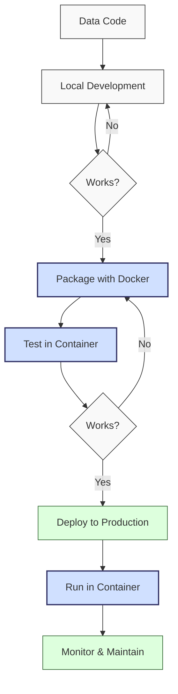
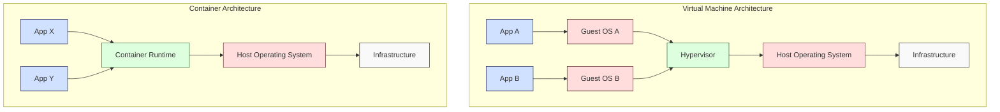

**Complexity: Advanced (A)**

## 10.0 Introduction: Why Docker Matters for Data Engineering

As a data engineer, you'll encounter a common frustration: code that works perfectly on your machine fails when deployed to another environment. This "it works on my machine" problem stems from differences in operating systems, installed libraries, environment variables, and many other factors.

Docker solves this problem by creating consistent, isolated environments that can run identically across different machines. This is particularly important for data engineering pipelines, which often involve complex dependencies and specific configurations.

Let's visualize where Docker fits in the data engineering workflow:



This chapter builds directly on your Python development skills from Chapters 1-9, addressing the challenge of creating reproducible environments for the code you've been writing. Instead of just writing Python scripts that run on your local machine, you'll learn to package them with their dependencies so they can run consistently anywhere.

By the end of this chapter, you'll be able to:

1. Create Docker containers for your data applications
2. Write Dockerfiles to define reproducible environments
3. Use Docker Compose to orchestrate multi-container applications
4. Implement volume mounting for data persistence
5. Apply Docker best practices for data engineering work

Let's begin by understanding the fundamental concepts of Docker.

## 10.1 Docker Concepts: Containers, Images, and Isolation

### 10.1.1 Containers vs. Virtual Machines

Before diving into Docker specifics, let's understand how containers differ from traditional virtual machines:



**Virtual Machines** include an entire operating system plus your application, making them more resource-intensive and slower to start.

**Containers** share the host's OS kernel and isolate only the application and its dependencies, making them lightweight and fast to start.

### 10.1.2 Core Docker Concepts

Let's explore the key Docker concepts:

**Container**: A running instance of an image that is isolated from the host system and other containers. Think of a container as a lightweight, standalone, executable package that includes everything needed to run a piece of software.

**Image**: A read-only template used to create containers. Images include the application code, runtime, libraries, and everything else needed. Images are composed of layers, which can be cached and reused.

**Registry**: A repository for Docker images. Docker Hub is the default public registry, but organizations often use private registries for proprietary code.

**Dockerfile**: A text file containing instructions to build a Docker image. It specifies the base image, application code, dependencies, and configuration.

**Docker Compose**: A tool for defining and running multi-container Docker applications using a YAML file.

**Volume**: A persistent data storage mechanism that exists outside containers, allowing data to persist when containers are destroyed and recreated.

### 10.1.3 Benefits of Docker for Data Engineering

Docker provides several specific benefits for data engineering workflows:

1. **Reproducibility**: Everyone works with the same environment, eliminating "it works on my machine" problems.
2. **Isolation**: Dependencies for different projects don't conflict with each other.
3. **Portability**: Applications can move easily between development, testing, and production environments.
4. **Scalability**: Containers can be easily scaled horizontally for distributed data processing.
5. **Version Control**: Container images can be versioned, ensuring consistent deployments.
6. **Security**: Properly configured containers provide isolation boundaries for security.

## 10.2 Docker Installation and Setup

Before we start using Docker, you'll need to install it on your system. The installation process varies by operating system:

> **Note**: Installation instructions are outside the scope of this hands-on tutorial. If you haven't installed Docker yet, visit the [official Docker installation guides](https://docs.docker.com/get-docker/) for your specific operating system.

Once Docker is installed, verify it's working correctly:

```bash
# Check Docker version
docker --version
# Docker version 24.0.5, build 24.0.5-0ubuntu1~22.04.1
```

Let's check if Docker is running properly by running a simple container:

```bash
docker run hello-world
```

You should see output similar to this:

```
Hello from Docker!
This message shows that your installation appears to be working correctly.
...
```

## 10.3 Basic Docker Commands

Let's explore the essential Docker commands you'll use regularly in data engineering work.

### 10.3.1 Running Containers

The most fundamental Docker command is `docker run`, which creates and starts a container from an image:

```bash
# Basic syntax: docker run [OPTIONS] IMAGE [COMMAND] [ARG...]
docker run python:3.9 python -c "print('Hello from Python container')"
# Hello from Python container
```

This command:

1. Pulls the `python:3.9` image from Docker Hub (if not already present locally)
2. Creates a new container
3. Runs the Python command that prints a message
4. Exits the container when the command completes

### 10.3.2 Running Interactive Containers

For development and debugging, you'll often want to interact with a container:

```bash
# Run an interactive Python container
docker run -it python:3.9 bash
```

Inside the container shell, you can run Python code:

```bash
python -c "print('Inside an interactive Python container')"
# Inside an interactive Python container
```

Type `exit` to leave the container shell.

### 10.3.3 Managing Containers

Let's look at commands for managing containers:

```bash
# List running containers
docker ps

# List all containers (including stopped ones)
docker ps -a

# Stop a running container
docker stop [CONTAINER_ID or NAME]

# Start a stopped container
docker start [CONTAINER_ID or NAME]

# Remove a container
docker rm [CONTAINER_ID or NAME]
```

### 10.3.4 Working with Images

You'll also need to manage Docker images:

```bash
# List available images
docker images

# Pull an image from Docker Hub
docker pull pandas

# Remove an image
docker rmi [IMAGE_ID or NAME]
```

### 10.3.5 Creating a Simple Python Data Container

Let's create a simple container to perform a data calculation:

```bash
# Create a temporary file with Python code
cat << EOF > data_script.py
import time

def calculate_statistics(numbers: list[int]) -> dict:
    """Calculate basic statistics for a list of numbers."""
    start_time = time.time()
    result = {
        "count": len(numbers),
        "sum": sum(numbers),
        "mean": sum(numbers) / len(numbers) if numbers else 0,
        "min": min(numbers) if numbers else None,
        "max": max(numbers) if numbers else None,
        "processing_time": 0
    }
    result["processing_time"] = time.time() - start_time
    return result

# Sample data
data = list(range(1, 1001))

# Calculate statistics
stats = calculate_statistics(data)

# Print results
print("Data Statistics:")
print(f"Count: {stats['count']}")
print(f"Sum: {stats['sum']}")
print(f"Mean: {stats['mean']}")
print(f"Min: {stats['min']}")
print(f"Max: {stats['max']}")
print(f"Processing time: {stats['processing_time']:.6f} seconds")
EOF

# Run the script in a Python container
docker run -v "$(pwd):/app" -w /app python:3.9 python data_script.py

# Data Statistics:
# Count: 1000
# Sum: 500500
# Mean: 500.5
# Min: 1
# Max: 1000
# Processing time: 0.000124 seconds
```

This example demonstrates:

1. Creating a Python script with a function to calculate statistics
2. Mounting the current directory (`$(pwd)`) to `/app` in the container
3. Setting the working directory to `/app`
4. Running the script in a Python 3.9 container

## 10.4 Dockerfile Basics: Creating Custom Images

While using existing images is convenient, data engineering often requires custom environments with specific dependencies and configurations. For this, we create a Dockerfile to build custom images.

### 10.4.1 Dockerfile Structure

A Dockerfile is a text file containing instructions for building a Docker image. Each instruction creates a layer in the image.

Let's create a simple Dockerfile for a Python data application:

```Dockerfile
# Use an official Python runtime as the base image
FROM python:3.9-slim

# Set the working directory in the container
WORKDIR /app

# Install dependencies
COPY requirements.txt .
RUN pip install --no-cache-dir -r requirements.txt

# Copy the current directory contents into the container
COPY . /app/

# Set environment variables
ENV PYTHONUNBUFFERED=1

# Run the application when the container launches
CMD ["python", "app.py"]
```

### 10.4.2 Common Dockerfile Instructions

The key instructions used in Dockerfiles include:

- **FROM**: Specifies the base image
- **WORKDIR**: Sets the working directory for subsequent instructions
- **COPY**: Copies files from the host to the container
- **ADD**: Similar to COPY but with additional features (URL support, tar extraction)
- **RUN**: Executes commands during the build
- **ENV**: Sets environment variables
- **EXPOSE**: Documents which ports the container listens on
- **CMD**: Specifies the default command to run when the container starts
- **ENTRYPOINT**: Configures the container to run as an executable

### 10.4.3 Building a Custom Image

Let's create a simple data analysis application and package it as a Docker image:

```bash
# Create a directory for our project
mkdir data_analysis_app
cd data_analysis_app

# Create requirements.txt
cat << EOF > requirements.txt
numpy==1.24.3
pandas==2.0.2
matplotlib==3.7.1
EOF

# Create a simple data analysis script (app.py)
cat << EOF > app.py
#!/usr/bin/env python3
from typing import List, Dict, Any, Union, Optional
import numpy as np
import pandas as pd
import matplotlib.pyplot as plt
import json
import os
from datetime import datetime

def generate_sample_data(n_rows: int = 100) -> pd.DataFrame:
    """Generate sample time series data."""
    np.random.seed(42)  # For reproducibility
    dates = pd.date_range(start='2023-01-01', periods=n_rows)
    data = pd.DataFrame({
        'date': dates,
        'value': np.random.normal(loc=100, scale=15, size=n_rows),
        'category': np.random.choice(['A', 'B', 'C'], size=n_rows)
    })
    return data

def analyze_data(df: pd.DataFrame) -> Dict[str, Any]:
    """Perform basic analysis on the dataframe."""
    results = {
        'summary': {
            'rows': len(df),
            'mean': df['value'].mean(),
            'median': df['value'].median(),
            'std': df['value'].std(),
            'min': df['value'].min(),
            'max': df['value'].max()
        },
        'by_category': {},
        'timestamp': datetime.now().isoformat()
    }

    # Calculate statistics by category
    for category in df['category'].unique():
        category_data = df[df['category'] == category]
        results['by_category'][category] = {
            'count': len(category_data),
            'mean': category_data['value'].mean(),
            'median': category_data['value'].median()
        }

    return results

def save_results(results: Dict[str, Any], output_dir: str = '/data') -> None:
    """Save analysis results to JSON file."""
    os.makedirs(output_dir, exist_ok=True)
    output_file = f"{output_dir}/analysis_results.json"

    with open(output_file, 'w') as f:
        json.dump(results, f, indent=2)

    print(f"Results saved to {output_file}")

def generate_plot(df: pd.DataFrame, output_dir: str = '/data') -> None:
    """Generate a simple plot from the data."""
    os.makedirs(output_dir, exist_ok=True)
    output_file = f"{output_dir}/time_series_plot.png"

    plt.figure(figsize=(10, 6))
    for category in df['category'].unique():
        category_data = df[df['category'] == category]
        plt.plot(category_data['date'], category_data['value'],
                 label=f'Category {category}')

    plt.title('Time Series by Category')
    plt.xlabel('Date')
    plt.ylabel('Value')
    plt.legend()
    plt.tight_layout()
    plt.savefig(output_file)

    print(f"Plot saved to {output_file}")

def main() -> None:
    """Main function to run the data analysis."""
    print("Starting data analysis...")

    # Determine the output directory
    output_dir = os.environ.get('OUTPUT_DIR', '/data')

    # Generate sample data
    print("Generating sample data...")
    df = generate_sample_data(n_rows=100)
    print(f"Generated {len(df)} rows of data.")

    # Analyze the data
    print("Analyzing data...")
    results = analyze_data(df)
    print(f"Analysis complete. Overall mean: {results['summary']['mean']:.2f}")

    # Save results
    save_results(results, output_dir)

    # Generate plot
    generate_plot(df, output_dir)

    print("Data analysis complete!")

if __name__ == "__main__":
    main()
EOF

# Create a Dockerfile
cat << EOF > Dockerfile
# Use an official Python runtime as the base image
FROM python:3.9-slim

# Set the working directory in the container
WORKDIR /app

# Install dependencies
COPY requirements.txt .
RUN pip install --no-cache-dir -r requirements.txt

# Copy the current directory contents into the container
COPY . /app/

# Make the output directory
RUN mkdir -p /data

# Set environment variables
ENV PYTHONUNBUFFERED=1
ENV OUTPUT_DIR=/data

# Run the application when the container launches
CMD ["python", "app.py"]
EOF

# Build the Docker image
docker build -t data-analysis-app .
```

After building the image, let's run it and mount a volume for persistent output:

```bash
# Create a directory for output data
mkdir -p ./output

# Run the container with a mounted volume
docker run -v "$(pwd)/output:/data" data-analysis-app

# Starting data analysis...
# Generating sample data...
# Generated 100 rows of data.
# Analyzing data...
# Analysis complete. Overall mean: 100.75
# Results saved to /data/analysis_results.json
# Plot saved to /data/time_series_plot.png
# Data analysis complete!
```

If you check your `./output` directory, you should see the analysis results and plot.

### 10.4.4 Image Optimization and Security

When building Docker images for data engineering, consider these best practices:

1. **Use specific tags** for base images (e.g., `python:3.9-slim` instead of `python:latest`)
2. **Minimize layers** by combining related RUN commands
3. **Use multi-stage builds** for smaller final images
4. **Avoid installing unnecessary packages**
5. **Run as non-root user** for improved security

Let's modify our Dockerfile to apply these best practices:

```Dockerfile
# Base image with specific tag
FROM python:3.9-slim

# Create a non-root user
RUN groupadd -r appuser && useradd -r -g appuser -m appuser

# Set the working directory
WORKDIR /app

# Install dependencies in a single layer to minimize image size
COPY requirements.txt .
RUN pip install --no-cache-dir -r requirements.txt && \
    apt-get update && \
    apt-get install -y --no-install-recommends gcc && \
    apt-get clean && \
    rm -rf /var/lib/apt/lists/*

# Copy application code
COPY . /app/

# Create output directory and set permissions
RUN mkdir -p /data && \
    chown -R appuser:appuser /data /app

# Set environment variables
ENV PYTHONUNBUFFERED=1
ENV OUTPUT_DIR=/data

# Switch to non-root user
USER appuser

# Run the application
CMD ["python", "app.py"]
```

### 10.4.5 Using .dockerignore

Create a `.dockerignore` file to prevent unnecessary files from being copied into your image:

```
# .dockerignore
__pycache__/
*.py[cod]
*$py.class
*.so
.env
.venv
env/
venv/
ENV/
output/
.git/
.gitignore
Dockerfile
.dockerignore
```

## 10.5 Docker Compose Fundamentals

For data engineering applications that involve multiple services (e.g., a Python application, a database, and a dashboard), Docker Compose simplifies container orchestration.

### 10.5.1 Docker Compose Overview

Docker Compose is a tool for defining and running multi-container Docker applications. It uses a YAML file to configure all the services, networks, and volumes.

### 10.5.2 Creating a Docker Compose File

Let's create a `docker-compose.yml` file for a basic data stack with a Python application and a PostgreSQL database:

```yaml
version: '3.8'

services:
  app:
    build: .
    volumes:
      - ./output:/data
    environment:
      - DATABASE_URL=postgresql://postgres:postgres@db:5432/datadb
      - OUTPUT_DIR=/data
    depends_on:
      - db

  db:
    image: postgres:14
    environment:
      - POSTGRES_USER=postgres
      - POSTGRES_PASSWORD=postgres
      - POSTGRES_DB=datadb
    volumes:
      - postgres-data:/var/lib/postgresql/data
    ports:
      - '5432:5432'

volumes:
  postgres-data:
```

This `docker-compose.yml` defines:

1. An `app` service built from our Dockerfile
2. A `db` service using the official PostgreSQL image
3. A named volume for persistent database storage
4. Environment variables for both services
5. A dependency relationship between the services

### 10.5.3 Using Docker Compose Commands

Here are the key Docker Compose commands:

```bash
# Start all services defined in docker-compose.yml
docker-compose up

# Start all services in detached mode (background)
docker-compose up -d

# Stop all services
docker-compose down

# Stop all services and remove volumes
docker-compose down -v

# View service logs
docker-compose logs

# Follow logs for a specific service
docker-compose logs -f app

# Execute a command in a running container
docker-compose exec app python -c "print('Hello from app container')"
```

### 10.5.4 Building a Data Processing Stack

Let's enhance our data processing application to work with PostgreSQL in a Docker Compose environment. First, let's update our `requirements.txt`:

```bash
# Update requirements.txt to include psycopg2
cat << EOF > requirements.txt
numpy==1.24.3
pandas==2.0.2
matplotlib==3.7.1
psycopg2-binary==2.9.6
EOF
```

Next, let's update our `app.py` to use PostgreSQL:

```bash
cat << EOF > app.py
#!/usr/bin/env python3
from typing import List, Dict, Any, Union, Optional, Tuple
import numpy as np
import pandas as pd
import matplotlib.pyplot as plt
import json
import os
import time
import psycopg2
from psycopg2.extras import execute_values
from datetime import datetime

def connect_to_database(max_retries: int = 5, retry_delay: int = 5) -> Optional[psycopg2.extensions.connection]:
    """
    Connect to PostgreSQL database with retry logic for container startup.
    """
    database_url = os.environ.get('DATABASE_URL', 'postgresql://postgres:postgres@db:5432/datadb')
    retries = 0

    while retries < max_retries:
        try:
            connection = psycopg2.connect(database_url)
            print(f"Successfully connected to database")
            return connection
        except psycopg2.OperationalError as e:
            retries += 1
            print(f"Database connection attempt {retries}/{max_retries} failed: {e}")
            if retries < max_retries:
                print(f"Waiting {retry_delay} seconds before retrying...")
                time.sleep(retry_delay)

    print("Failed to connect to database after maximum retries")
    return None

def initialize_database(conn: psycopg2.extensions.connection) -> None:
    """
    Create necessary tables in the database.
    """
    with conn.cursor() as cur:
        cur.execute("""
        CREATE TABLE IF NOT EXISTS time_series_data (
            id SERIAL PRIMARY KEY,
            date TIMESTAMP NOT NULL,
            value FLOAT NOT NULL,
            category VARCHAR(10) NOT NULL
        )
        """)

        cur.execute("""
        CREATE TABLE IF NOT EXISTS analysis_results (
            id SERIAL PRIMARY KEY,
            timestamp TIMESTAMP NOT NULL,
            mean FLOAT NOT NULL,
            median FLOAT NOT NULL,
            std FLOAT NOT NULL,
            min FLOAT NOT NULL,
            max FLOAT NOT NULL,
            analysis_data JSONB NOT NULL
        )
        """)

        conn.commit()
    print("Database tables initialized")

def generate_sample_data(n_rows: int = 100) -> pd.DataFrame:
    """Generate sample time series data."""
    np.random.seed(42)  # For reproducibility
    dates = pd.date_range(start='2023-01-01', periods=n_rows)
    data = pd.DataFrame({
        'date': dates,
        'value': np.random.normal(loc=100, scale=15, size=n_rows),
        'category': np.random.choice(['A', 'B', 'C'], size=n_rows)
    })
    return data

def save_data_to_db(conn: psycopg2.extensions.connection, df: pd.DataFrame) -> None:
    """
    Save DataFrame to PostgreSQL database.
    """
    with conn.cursor() as cur:
        # Convert DataFrame to list of tuples
        records = [
            (row.date, row.value, row.category)
            for _, row in df.iterrows()
        ]

        # Insert data using execute_values for better performance
        execute_values(cur,
                      "INSERT INTO time_series_data (date, value, category) VALUES %s",
                      records)

        conn.commit()

    print(f"Saved {len(df)} records to database")

def analyze_data(df: pd.DataFrame) -> Dict[str, Any]:
    """Perform basic analysis on the dataframe."""
    results = {
        'summary': {
            'rows': len(df),
            'mean': float(df['value'].mean()),
            'median': float(df['value'].median()),
            'std': float(df['value'].std()),
            'min': float(df['value'].min()),
            'max': float(df['value'].max())
        },
        'by_category': {},
        'timestamp': datetime.now().isoformat()
    }

    # Calculate statistics by category
    for category in df['category'].unique():
        category_data = df[df['category'] == category]
        results['by_category'][category] = {
            'count': int(len(category_data)),
            'mean': float(category_data['value'].mean()),
            'median': float(category_data['value'].median())
        }

    return results

def save_results_to_db(conn: psycopg2.extensions.connection, results: Dict[str, Any]) -> None:
    """
    Save analysis results to database.
    """
    with conn.cursor() as cur:
        cur.execute(
            """
            INSERT INTO analysis_results
            (timestamp, mean, median, std, min, max, analysis_data)
            VALUES (%s, %s, %s, %s, %s, %s, %s)
            """,
            (
                datetime.now(),
                results['summary']['mean'],
                results['summary']['median'],
                results['summary']['std'],
                results['summary']['min'],
                results['summary']['max'],
                json.dumps(results)
            )
        )

        conn.commit()

    print("Analysis results saved to database")

def save_results(results: Dict[str, Any], output_dir: str = '/data') -> None:
    """Save analysis results to JSON file."""
    os.makedirs(output_dir, exist_ok=True)
    output_file = f"{output_dir}/analysis_results.json"

    with open(output_file, 'w') as f:
        json.dump(results, f, indent=2)

    print(f"Results saved to {output_file}")

def generate_plot(df: pd.DataFrame, output_dir: str = '/data') -> None:
    """Generate a simple plot from the data."""
    os.makedirs(output_dir, exist_ok=True)
    output_file = f"{output_dir}/time_series_plot.png"

    plt.figure(figsize=(10, 6))
    for category in df['category'].unique():
        category_data = df[df['category'] == category]
        plt.plot(category_data['date'], category_data['value'],
                 label=f'Category {category}')

    plt.title('Time Series by Category')
    plt.xlabel('Date')
    plt.ylabel('Value')
    plt.legend()
    plt.tight_layout()
    plt.savefig(output_file)

    print(f"Plot saved to {output_file}")

def main() -> None:
    """Main function to run the data analysis."""
    print("Starting data analysis application...")

    # Determine the output directory
    output_dir = os.environ.get('OUTPUT_DIR', '/data')

    # Connect to database
    conn = connect_to_database()
    if not conn:
        print("Exiting due to database connection failure")
        return

    try:
        # Initialize database tables
        initialize_database(conn)

        # Generate sample data
        print("Generating sample data...")
        df = generate_sample_data(n_rows=100)
        print(f"Generated {len(df)} rows of data")

        # Save data to database
        save_data_to_db(conn, df)

        # Analyze the data
        print("Analyzing data...")
        results = analyze_data(df)
        print(f"Analysis complete. Overall mean: {results['summary']['mean']:.2f}")

        # Save results to database
        save_results_to_db(conn, results)

        # Save results to file
        save_results(results, output_dir)

        # Generate plot
        generate_plot(df, output_dir)

        print("Data analysis complete!")

    except Exception as e:
        print(f"Error in data analysis: {e}")
    finally:
        # Close database connection
        if conn:
            conn.close()
            print("Database connection closed")

if __name__ == "__main__":
    main()
EOF
```

Now, let's update our Dockerfile to include a wait script to wait for the database to be ready:

```bash
cat << EOF > Dockerfile
# Base image with specific tag
FROM python:3.9-slim

# Create a non-root user
RUN groupadd -r appuser && useradd -r -g appuser -m appuser

# Set the working directory
WORKDIR /app

# Install dependencies in a single layer
COPY requirements.txt .
RUN pip install --no-cache-dir -r requirements.txt && \
    apt-get update && \
    apt-get install -y --no-install-recommends gcc && \
    apt-get clean && \
    rm -rf /var/lib/apt/lists/*

# Copy application code
COPY . /app/

# Create output directory and set permissions
RUN mkdir -p /data && \
    chown -R appuser:appuser /data /app

# Set environment variables
ENV PYTHONUNBUFFERED=1
ENV OUTPUT_DIR=/data

# Switch to non-root user
USER appuser

# Run the application
CMD ["python", "app.py"]
EOF
```

Finally, let's add an extended Docker Compose file with healthchecks:

```bash
cat << EOF > docker-compose.yml
version: '3.8'

services:
  app:
    build: .
    volumes:
      - ./output:/data
    environment:
      - DATABASE_URL=postgresql://postgres:postgres@db:5432/datadb
      - OUTPUT_DIR=/data
    depends_on:
      db:
        condition: service_healthy
    restart: on-failure

  db:
    image: postgres:14
    environment:
      - POSTGRES_USER=postgres
      - POSTGRES_PASSWORD=postgres
      - POSTGRES_DB=datadb
    volumes:
      - postgres-data:/var/lib/postgresql/data
    ports:
      - "5432:5432"
    healthcheck:
      test: ["CMD-SHELL", "pg_isready -U postgres"]
      interval: 5s
      timeout: 5s
      retries: 5

volumes:
  postgres-data:
EOF
```

Now let's run our multi-container application:

```bash
# Start the containers
docker-compose up
```

After the containers start, you should see logs from both services indicating a successful data analysis process, data being stored in PostgreSQL, and the results saved to the output directory.

## 10.6 Volume Mounting for Persistence

Containers are ephemeral by design, meaning that when a container is deleted, all data inside it is lost. For data engineering, this poses a challenge since we often need to persist data. Docker volumes solve this problem.

### 10.6.1 Types of Docker Storage

Docker provides three types of storage:

1. **Volumes**: Managed by Docker in a part of the host filesystem
2. **Bind mounts**: Map a host directory directly into a container
3. **tmpfs mounts**: Stored in the host's memory only

### 10.6.2 Creating and Managing Volumes

Let's explore Docker volumes for data persistence:

```bash
# Create a named volume
docker volume create data-volume

# List volumes
docker volume ls

# Inspect volume details
docker volume inspect data-volume

# Remove a volume
docker volume rm data-volume
```

### 10.6.3 Using Volumes with Containers

You can mount volumes when running containers:

```bash
# Run a container with a named volume
docker run -v data-volume:/data python:3.9 python -c "import os; open('/data/test.txt', 'w').write('Hello from container'); print('File created in volume')"
# File created in volume

# Run another container to verify the data persists
docker run -v data-volume:/data python:3.9 python -c "import os; print('Volume contents:', os.listdir('/data')); print('File content:', open('/data/test.txt').read())"
# Volume contents: ['test.txt']
# File content: Hello from container
```

### 10.6.4 Bind Mounts for Development

Bind mounts are particularly useful during development:

```bash
# Create a test directory and file
mkdir -p test_mount
echo "Hello from host" > test_mount/host_file.txt

# Mount the directory to a container
docker run -v "$(pwd)/test_mount:/app" python:3.9 python -c "import os; print('Files in /app:', os.listdir('/app')); print('Content:', open('/app/host_file.txt').read())"
# Files in /app: ['host_file.txt']
# Content: Hello from host
```

### 10.6.5 Data Volume Patterns for Data Engineering

In data engineering, common volume patterns include:

1. **Input/Output Data**: Mount volumes for source data and processed outputs
2. **Database Storage**: Persist database files outside containers
3. **Model Storage**: Save trained models for later use
4. **Logging and Monitoring**: Store logs for later analysis

Let's create a more complex example with multiple volumes:

```bash
# Create directories for different data types
mkdir -p data/{input,output,models,logs}

# Add sample input data
echo "value1,value2,value3" > data/input/sample.csv

# Create a Docker Compose file with multiple volumes
cat << EOF > data-processing-compose.yml
version: '3.8'

services:
  processor:
    image: python:3.9
    volumes:
      - ./data/input:/data/input:ro  # Read-only
      - ./data/output:/data/output
      - ./data/models:/data/models
      - ./data/logs:/data/logs
    working_dir: /app
    command: >
      bash -c "
        echo 'Starting data processing...' &&
        echo 'Reading input: ' && cat /data/input/sample.csv &&
        echo 'Processing...' &&
        echo 'value1_processed,value2_processed,value3_processed' > /data/output/processed.csv &&
        echo 'model_data' > /data/models/model.pkl &&
        echo 'Processing completed at \$$(date)' > /data/logs/process.log &&
        echo 'Data processing complete!'
      "
EOF

# Run the Docker Compose file
docker-compose -f data-processing-compose.yml up

# Starting data processing...
# Reading input:
# value1,value2,value3
# Processing...
# Data processing complete!
```

After running this, check the contents of the data directories to see the generated output, model, and log files.

## 10.7 Micro-Project: Dockerized Data Processor

Now, let's apply what we've learned to create a complete Dockerized data processor that handles CSV files, processes them, and outputs both visualization files and a report.

### Project Requirements

Create a containerized environment for a Python data processing application that ensures consistent execution across different systems.

**Objectives:**

1. Create a Dockerfile for a Python data processing application
2. Install all required dependencies in the container
3. Configure appropriate working directories and file permissions
4. Set up environment variables for configuration
5. Run the container as a non-root user for better security
6. Create an entrypoint script that runs the data processor
7. Build and test the Docker image locally
8. Document the build and run process

### Acceptance Criteria

- Dockerfile follows best practices (minimal layers, proper base image, non-root user)
- Container includes only necessary dependencies
- Image builds successfully without errors
- Application runs correctly inside the container
- Container accepts input data via mounted volume
- Container writes output to a mounted volume
- Documentation includes build/run instructions, volume mounting guidance, and configuration options
- Container exits cleanly after processing is complete

### Common Pitfalls

1. **Permission issues with mounted volumes**

   - Problem: Files created by the container might be owned by the container's user ID, making them hard to manipulate outside the container
   - Solution: Ensure proper user ID mapping or use appropriate permissions in the container

2. **Large image sizes due to unnecessary packages**

   - Problem: Including development packages or temporary files makes containers bloated
   - Solution: Use multi-stage builds, .dockerignore files, and clean up package manager caches

3. **Hard-coded paths that don't work in containers**

   - Problem: Assuming specific directory structures that differ from the container environment
   - Solution: Use environment variables or configuration files for paths

4. **Running containers as root**
   - Problem: Security vulnerabilities from having excessive permissions
   - Solution: Always create and use a non-root user in your Dockerfile

### Production vs. Educational Differences

This micro-project simplifies several aspects compared to a production solution:

1. **Security**:

   - Production: Would include secrets management, network security, vulnerability scanning
   - Micro-project: Basic non-root user and minimal dependencies

2. **Error Handling**:

   - Production: Comprehensive logging, monitoring, automatic recovery, notifications
   - Micro-project: Basic error handling and exit codes

3. **Scalability**:

   - Production: Designed for distributed processing, horizontal scaling
   - Micro-project: Single-container processing

4. **CI/CD Integration**:
   - Production: Automated builds, testing, deployment in CI/CD pipeline
   - Micro-project: Manual local building and testing

### Implementation

Let's build our data processor:

```bash
# Create project directory
mkdir -p data_processor
cd data_processor

# Create sample input data
mkdir -p sample_data
cat << EOF > sample_data/sales_data.csv
date,product,category,quantity,price
2023-01-01,Widget A,Electronics,5,29.99
2023-01-01,Widget B,Home Goods,2,19.99
2023-01-02,Widget A,Electronics,3,29.99
2023-01-02,Widget C,Office Supplies,10,9.99
2023-01-03,Widget B,Home Goods,1,19.99
2023-01-03,Widget D,Electronics,2,49.99
2023-01-04,Widget C,Office Supplies,5,9.99
2023-01-04,Widget A,Electronics,2,29.99
2023-01-05,Widget E,Home Goods,3,39.99
2023-01-05,Widget D,Electronics,1,49.99
EOF

# Create requirements.txt
cat << EOF > requirements.txt
pandas==2.0.2
matplotlib==3.7.1
seaborn==0.12.2
jinja2==3.1.2
EOF

# Create the data processor script
cat << EOF > process_data.py
#!/usr/bin/env python3
from typing import Dict, List, Optional, Union, Any, Tuple
import os
import pandas as pd
import matplotlib.pyplot as plt
import seaborn as sns
import json
from datetime import datetime
import time
from jinja2 import Template

def load_data(filepath: str) -> pd.DataFrame:
    """
    Load data from a CSV file.

    Args:
        filepath: Path to the CSV file

    Returns:
        DataFrame containing the data
    """
    print(f"Loading data from {filepath}")

    try:
        # Check if file exists
        if not os.path.exists(filepath):
            raise FileNotFoundError(f"Input file not found: {filepath}")

        # Load data based on file extension
        if filepath.endswith('.csv'):
            df = pd.read_csv(filepath)
        else:
            raise ValueError(f"Unsupported file format: {filepath}")

        print(f"Successfully loaded {len(df)} records")
        return df

    except Exception as e:
        print(f"Error loading data: {e}")
        raise

def validate_data(df: pd.DataFrame) -> Tuple[pd.DataFrame, Dict[str, Any]]:
    """
    Validate and clean the data.

    Args:
        df: Input DataFrame

    Returns:
        Tuple of (cleaned DataFrame, validation report)
    """
    print("Validating and cleaning data...")
    validation_report = {
        "original_rows": len(df),
        "missing_values": {},
        "invalid_values": [],
        "cleaned_rows": 0
    }

    # Check for missing values
    for column in df.columns:
        missing = df[column].isna().sum()
        if missing > 0:
            validation_report["missing_values"][column] = int(missing)

    # Convert date column to datetime
    try:
        df['date'] = pd.to_datetime(df['date'])
    except Exception as e:
        validation_report["invalid_values"].append(f"Error converting dates: {e}")

    # Ensure numeric columns are numeric
    numeric_columns = ['quantity', 'price']
    for col in numeric_columns:
        if col in df.columns:
            try:
                # Convert and count invalid values
                invalid_mask = pd.to_numeric(df[col], errors='coerce').isna() & ~df[col].isna()
                invalid_count = invalid_mask.sum()

                if invalid_count > 0:
                    validation_report["invalid_values"].append(f"{invalid_count} invalid values in {col}")

                # Convert to numeric
                df[col] = pd.to_numeric(df[col], errors='coerce')

            except Exception as e:
                validation_report["invalid_values"].append(f"Error processing {col}: {e}")

    # Remove rows with missing values in critical columns
    critical_columns = ['date', 'product', 'quantity', 'price']
    original_len = len(df)
    df = df.dropna(subset=[col for col in critical_columns if col in df.columns])
    rows_removed = original_len - len(df)

    if rows_removed > 0:
        validation_report["invalid_values"].append(f"Removed {rows_removed} rows with missing critical data")

    validation_report["cleaned_rows"] = len(df)
    print(f"Validation complete. {len(df)} valid rows remaining.")

    return df, validation_report

def analyze_data(df: pd.DataFrame) -> Dict[str, Any]:
    """
    Perform analysis on the data.

    Args:
        df: Input DataFrame

    Returns:
        Dictionary of analysis results
    """
    print("Analyzing data...")
    results = {
        "summary": {
            "total_records": len(df),
            "date_range": {
                "start": df['date'].min().strftime('%Y-%m-%d'),
                "end": df['date'].max().strftime('%Y-%m-%d')
            },
            "total_sales": (df['quantity'] * df['price']).sum(),
            "total_quantity": df['quantity'].sum()
        },
        "by_category": {},
        "by_product": {},
        "by_date": {},
        "timestamp": datetime.now().isoformat()
    }

    # Calculate sales value
    df['sales_value'] = df['quantity'] * df['price']

    # Analysis by category
    category_stats = df.groupby('category').agg({
        'sales_value': 'sum',
        'quantity': 'sum'
    }).reset_index()

    for _, row in category_stats.iterrows():
        results["by_category"][row['category']] = {
            "sales": float(row['sales_value']),
            "quantity": int(row['quantity']),
            "percentage": float(row['sales_value'] / results["summary"]["total_sales"] * 100)
        }

    # Analysis by product
    product_stats = df.groupby('product').agg({
        'sales_value': 'sum',
        'quantity': 'sum',
        'price': 'mean'
    }).reset_index()

    for _, row in product_stats.iterrows():
        results["by_product"][row['product']] = {
            "sales": float(row['sales_value']),
            "quantity": int(row['quantity']),
            "avg_price": float(row['price'])
        }

    # Analysis by date
    date_stats = df.groupby(df['date'].dt.strftime('%Y-%m-%d')).agg({
        'sales_value': 'sum',
        'quantity': 'sum'
    }).reset_index()

    for _, row in date_stats.iterrows():
        results["by_date"][row['date']] = {
            "sales": float(row['sales_value']),
            "quantity": int(row['quantity'])
        }

    print("Analysis complete.")
    return results

def generate_visualizations(df: pd.DataFrame, output_dir: str) -> List[str]:
    """
    Generate visualizations from the data.

    Args:
        df: Input DataFrame
        output_dir: Directory to save visualizations

    Returns:
        List of generated visualization file paths
    """
    print("Generating visualizations...")
    os.makedirs(output_dir, exist_ok=True)
    generated_files = []

    # Calculate sales value
    if 'sales_value' not in df.columns:
        df['sales_value'] = df['quantity'] * df['price']

    # Set a consistent style
    sns.set(style="whitegrid")

    # 1. Sales by Category (Pie Chart)
    plt.figure(figsize=(10, 6))
    category_sales = df.groupby('category')['sales_value'].sum()
    plt.pie(category_sales, labels=category_sales.index, autopct='%1.1f%%',
            startangle=90, shadow=True)
    plt.title('Sales by Category')
    plt.axis('equal')

    category_file = os.path.join(output_dir, 'sales_by_category.png')
    plt.savefig(category_file)
    plt.close()
    generated_files.append(category_file)

    # 2. Sales by Product (Bar Chart)
    plt.figure(figsize=(12, 6))
    product_sales = df.groupby('product')['sales_value'].sum().sort_values(ascending=False)
    sns.barplot(x=product_sales.index, y=product_sales.values)
    plt.title('Sales by Product')
    plt.xlabel('Product')
    plt.ylabel('Sales Value')
    plt.xticks(rotation=45)
    plt.tight_layout()

    product_file = os.path.join(output_dir, 'sales_by_product.png')
    plt.savefig(product_file)
    plt.close()
    generated_files.append(product_file)

    # 3. Sales Trend by Date
    plt.figure(figsize=(12, 6))
    date_sales = df.groupby(df['date'].dt.strftime('%Y-%m-%d'))['sales_value'].sum()
    plt.plot(date_sales.index, date_sales.values, marker='o', linestyle='-')
    plt.title('Daily Sales Trend')
    plt.xlabel('Date')
    plt.ylabel('Sales Value')
    plt.xticks(rotation=45)
    plt.tight_layout()

    trend_file = os.path.join(output_dir, 'sales_trend.png')
    plt.savefig(trend_file)
    plt.close()
    generated_files.append(trend_file)

    print(f"Generated {len(generated_files)} visualizations")
    return generated_files

def generate_report(results: Dict[str, Any], validation_report: Dict[str, Any],
                   visualizations: List[str], output_dir: str) -> str:
    """
    Generate an HTML report from the analysis results.

    Args:
        results: Analysis results
        validation_report: Data validation report
        visualizations: List of visualization files
        output_dir: Directory to save the report

    Returns:
        Path to the generated report
    """
    print("Generating HTML report...")
    os.makedirs(output_dir, exist_ok=True)

    # Create a simple HTML template
    template_str = """
    <!DOCTYPE html>
    <html>
    <head>
        <title>Sales Data Analysis Report</title>
        <style>
            body { font-family: Arial, sans-serif; margin: 20px; }
            h1, h2, h3 { color: #333; }
            .container { max-width: 1000px; margin: 0 auto; }
            .summary { background-color: #f5f5f5; padding: 15px; border-radius: 5px; }
            .visualizations img { max-width: 100%; margin-bottom: 20px; }
            table { border-collapse: collapse; width: 100%; margin-bottom: 20px; }
            th, td { border: 1px solid #ddd; padding: 8px; text-align: left; }
            th { background-color: #f2f2f2; }
            tr:nth-child(even) { background-color: #f9f9f9; }
        </style>
    </head>
    <body>
        <div class="container">
            <h1>Sales Data Analysis Report</h1>
            <p>Generated on: {{ results.timestamp }}</p>

            <h2>Data Validation</h2>
            <div class="summary">
                <p>Original rows: {{ validation.original_rows }}</p>
                <p>Cleaned rows: {{ validation.cleaned_rows }}</p>

                
                <h3>Missing Values</h3>
                <ul>
                
                    <li>{{ column }}: {{ count }} missing values</li>
                
                </ul>
                

                
                <h3>Data Issues</h3>
                <ul>
                
                    <li>{{ issue }}</li>
                
                </ul>
                
            </div>

            <h2>Sales Summary</h2>
            <div class="summary">
                <p>Date Range: {{ results.summary.date_range.start }} to {{ results.summary.date_range.end }}</p>
                <p>Total Sales: ${{ "{:,.2f}".format(results.summary.total_sales) }}</p>
                <p>Total Quantity: {{ results.summary.total_quantity }}</p>
            </div>

            <h2>Category Analysis</h2>
            <table>
                <tr>
                    <th>Category</th>
                    <th>Sales</th>
                    <th>Quantity</th>
                    <th>Percentage</th>
                </tr>
                
                <tr>
                    <td>{{ category }}</td>
                    <td>${{ "{:,.2f}".format(data.sales) }}</td>
                    <td>{{ data.quantity }}</td>
                    <td>{{ "{:.1f}%".format(data.percentage) }}</td>
                </tr>
                
            </table>

            <h2>Product Analysis</h2>
            <table>
                <tr>
                    <th>Product</th>
                    <th>Sales</th>
                    <th>Quantity</th>
                    <th>Avg Price</th>
                </tr>
                
                <tr>
                    <td>{{ product }}</td>
                    <td>${{ "{:,.2f}".format(data.sales) }}</td>
                    <td>{{ data.quantity }}</td>
                    <td>${{ "{:.2f}".format(data.avg_price) }}</td>
                </tr>
                
            </table>

            <h2>Daily Sales</h2>
            <table>
                <tr>
                    <th>Date</th>
                    <th>Sales</th>
                    <th>Quantity</th>
                </tr>
                
                <tr>
                    <td>{{ date }}</td>
                    <td>${{ "{:,.2f}".format(data.sales) }}</td>
                    <td>{{ data.quantity }}</td>
                </tr>
                
            </table>

            <h2>Visualizations</h2>
            <div class="visualizations">
                
                    
                
            </div>
        </div>
    </body>
    </html>
    """

    # Render the template
    template = Template(template_str)
    html_content = template.render(
        results=results,
        validation=validation_report,
        visualizations=visualizations
    )

    # Write to file
    report_path = os.path.join(output_dir, "sales_report.html")
    with open(report_path, "w") as f:
        f.write(html_content)

    print(f"Report generated: {report_path}")
    return report_path

def process_data(input_file: str, output_dir: str) -> None:
    """
    Main function to process data from input file and generate outputs.

    Args:
        input_file: Path to the input data file
        output_dir: Directory to save outputs
    """
    print(f"Starting data processing at {datetime.now().isoformat()}")
    print(f"Input file: {input_file}")
    print(f"Output directory: {output_dir}")

    try:
        # Create output directory
        os.makedirs(output_dir, exist_ok=True)

        # Load data
        df = load_data(input_file)

        # Validate and clean data
        df, validation_report = validate_data(df)

        # If we have no valid data after cleaning, exit
        if len(df) == 0:
            raise ValueError("No valid data records after cleaning")

        # Analyze data
        results = analyze_data(df)

        # Save analysis results as JSON
        results_file = os.path.join(output_dir, "analysis_results.json")
        with open(results_file, "w") as f:
            json.dump(results, f, indent=2)
        print(f"Analysis results saved to {results_file}")

        # Generate visualizations
        viz_dir = os.path.join(output_dir, "visualizations")
        visualizations = generate_visualizations(df, viz_dir)

        # Generate report
        report_path = generate_report(results, validation_report, visualizations, output_dir)

        print(f"Data processing completed successfully at {datetime.now().isoformat()}")

    except Exception as e:
        print(f"Error during data processing: {e}")
        raise

def main() -> None:
    """Main entry point for the data processor."""
    # Get parameters from environment variables or use defaults
    input_file = os.environ.get("INPUT_FILE", "/data/input/sales_data.csv")
    output_dir = os.environ.get("OUTPUT_DIR", "/data/output")

    try:
        process_data(input_file, output_dir)
        print("Processing completed successfully")
    except Exception as e:
        print(f"Processing failed: {e}")
        exit(1)

if __name__ == "__main__":
    main()
EOF

# Create an entrypoint script
cat << EOF > entrypoint.sh
#!/bin/bash
set -e

# Print environment for debugging (excluding sensitive information)
echo "Data Processor Environment:"
echo "  Input File: \$INPUT_FILE"
echo "  Output Directory: \$OUTPUT_DIR"

# Run the processor
python /app/process_data.py

# Check the exit status
if [ \$? -eq 0 ]; then
  echo "Data processing completed successfully!"
  exit 0
else
  echo "Data processing failed!"
  exit 1
fi
EOF

# Make the entrypoint script executable
chmod +x entrypoint.sh

# Create a Dockerfile
cat << EOF > Dockerfile
# Use Python 3.9 slim as the base image
FROM python:3.9-slim

# Set metadata
LABEL maintainer="Data Engineer"
LABEL description="Data Processor Container"
LABEL version="1.0"

# Create a non-root user
RUN groupadd -r datauser && useradd -r -g datauser -m datauser

# Set working directory
WORKDIR /app

# Install dependencies first (for better caching)
COPY requirements.txt .
RUN pip install --no-cache-dir -r requirements.txt

# Copy application code
COPY process_data.py entrypoint.sh ./

# Make the entrypoint script executable
RUN chmod +x entrypoint.sh

# Create directories for data
RUN mkdir -p /data/input /data/output && \
    chown -R datauser:datauser /data /app

# Set environment variables
ENV PYTHONUNBUFFERED=1
ENV INPUT_FILE=/data/input/sales_data.csv
ENV OUTPUT_DIR=/data/output

# Switch to non-root user
USER datauser

# Set the entrypoint
ENTRYPOINT ["/app/entrypoint.sh"]
EOF

# Create .dockerignore
cat << EOF > .dockerignore
__pycache__/
*.py[cod]
*$py.class
*.so
.git/
.gitignore
sample_data/
Dockerfile
docker-compose.yml
.dockerignore
output/
EOF

# Create a docker-compose.yml file
cat << EOF > docker-compose.yml
version: '3.8'

services:
  processor:
    build: .
    volumes:
      - ./sample_data:/data/input:ro  # Read-only
      - ./output:/data/output
    environment:
      - INPUT_FILE=/data/input/sales_data.csv
      - OUTPUT_DIR=/data/output
EOF

# Create a README.md file with documentation
cat << EOF > README.md
# Data Processor Docker Container

This container processes sales data CSV files and generates analysis reports and visualizations.

## Build Instructions

Build the Docker image:

\`\`\`bash
docker build -t data-processor .
\`\`\`

## Running the Container

### Using Docker Run

\`\`\`bash
# Create output directory
mkdir -p output

# Run the container
docker run -v "\$(pwd)/sample_data:/data/input:ro" -v "\$(pwd)/output:/data/output" data-processor
\`\`\`

### Using Docker Compose

\`\`\`bash
docker-compose up
\`\`\`

## Configuration

The container can be configured with the following environment variables:

- \`INPUT_FILE\`: Path to the input CSV file (default: /data/input/sales_data.csv)
- \`OUTPUT_DIR\`: Directory to save output files (default: /data/output)

Example with custom configuration:

\`\`\`bash
docker run -v "\$(pwd)/sample_data:/data/input:ro" -v "\$(pwd)/output:/data/output" \\
  -e INPUT_FILE=/data/input/custom_file.csv -e OUTPUT_DIR=/data/output/custom \\
  data-processor
\`\`\`

## Input Data Format

The processor expects CSV files with the following columns:
- date: Date of the sale (YYYY-MM-DD)
- product: Product name
- category: Product category
- quantity: Number of items sold
- price: Price per item

## Outputs

The processor generates:
1. JSON analysis results
2. Visualization images (PNG)
3. HTML report

All outputs are saved to the specified output directory.

## Security Notes

- The container runs as a non-root user for improved security
- Input data is mounted as read-only to prevent modification
- No sensitive information is stored in the container
EOF
```

Now let's build and run the container:

```bash
# Build the Docker image
docker build -t data-processor .

# Run the container
docker run -v "$(pwd)/sample_data:/data/input:ro" -v "$(pwd)/output:/data/output" data-processor

# Data Processor Environment:
#   Input File: /data/input/sales_data.csv
#   Output Directory: /data/output
# Starting data processing at 2023-04-19T14:32:01.123456
# Input file: /data/input/sales_data.csv
# Output directory: /data/output
# Loading data from /data/input/sales_data.csv
# Successfully loaded 10 records
# Validating and cleaning data...
# Validation complete. 10 valid rows remaining.
# Analyzing data...
# Analysis complete.
# Analysis results saved to /data/output/analysis_results.json
# Generating visualizations...
# Generated 3 visualizations
# Generating HTML report...
# Report generated: /data/output/sales_report.html
# Data processing completed successfully at 2023-04-19T14:32:05.678901
# Processing completed successfully
# Data processing completed successfully!
```

### How to Run and Test the Solution

To build and run the data processor:

1. **Build the Docker image:**

   ```bash
   docker build -t data-processor .
   ```

2. **Run using Docker:**

   ```bash
   docker run -v "$(pwd)/sample_data:/data/input:ro" -v "$(pwd)/output:/data/output" data-processor
   ```

3. **Or run using Docker Compose:**

   ```bash
   docker-compose up
   ```

4. **Check the outputs:**
   After running, check the `output` directory for:

   - `analysis_results.json` - Analysis in JSON format
   - `sales_report.html` - HTML report with tables and visualizations
   - `visualizations/` directory containing PNG charts

5. **Test with different data:**

   - Create a new CSV file in the `sample_data` directory
   - Run the container with the new file:
     ```bash
     docker run -v "$(pwd)/sample_data:/data/input:ro" -v "$(pwd)/output:/data/output" -e INPUT_FILE=/data/input/new_file.csv data-processor
     ```

6. **Test error handling:**
   - Create an invalid CSV file to test how the container handles errors

## 10.8 Practice Exercises

To reinforce Docker concepts from this chapter, try these exercises:

### Exercise 1: Basic Container Interaction

Create a container that runs a Python script to generate a random dataset and print statistics. The script should:

1. Generate 100 random numbers
2. Calculate the mean, median, min, max, and standard deviation
3. Print the results

### Exercise 2: Dockerfile Creation

Create a Dockerfile for a Python application that:

1. Uses the `python:3.9-slim` base image
2. Installs `pandas` and `numpy`
3. Runs as a non-root user
4. Has appropriate labels for metadata

### Exercise 3: Volume Mounting

Write a Docker command to:

1. Run a PostgreSQL container
2. Mount a volume for persistent data
3. Set appropriate environment variables
4. Make the server accessible on the host machine

### Exercise 4: Docker Compose

Create a `docker-compose.yml` file for a data stack with:

1. A Python application service
2. A PostgreSQL database service
3. Appropriate volume configuration
4. Environment variables for configuration

### Exercise 5: Multi-stage Build

Create a multi-stage Dockerfile that:

1. Builds a Python application in one stage
2. Copies only the necessary files to a smaller final image
3. Results in a minimal production image

## 10.9 Exercise Solutions

### Solution to Exercise 1: Basic Container Interaction

```bash
# Create a Python script
cat << EOF > stats_generator.py
import numpy as np
from typing import List, Dict, Any

def generate_random_data(n: int = 100, seed: int = 42) -> List[float]:
    """Generate random numbers."""
    np.random.seed(seed)
    return np.random.normal(loc=50, scale=15, size=n).tolist()

def calculate_statistics(data: List[float]) -> Dict[str, Any]:
    """Calculate statistics for the data."""
    return {
        "count": len(data),
        "mean": np.mean(data),
        "median": np.median(data),
        "min": np.min(data),
        "max": np.max(data),
        "std": np.std(data)
    }

def main() -> None:
    """Main function."""
    print("Generating random dataset...")
    data = generate_random_data()
    print(f"Generated {len(data)} random numbers")

    print("\nCalculating statistics...")
    stats = calculate_statistics(data)

    print("\nResults:")
    for key, value in stats.items():
        print(f"  {key}: {value:.2f}")

if __name__ == "__main__":
    main()
EOF

# Run in a container
docker run -v "$(pwd):/app" -w /app python:3.9 python stats_generator.py

# Generating random dataset...
# Generated 100 random numbers
#
# Calculating statistics...
#
# Results:
#   count: 100.00
#   mean: 49.32
#   median: 48.70
#   min: 13.58
#   max: 86.74
#   std: 14.89
```

### Solution to Exercise 2: Dockerfile Creation

```bash
# Create a Dockerfile
cat << EOF > Dockerfile.exercise2
# Use Python 3.9 slim as the base image
FROM python:3.9-slim

# Add metadata labels
LABEL maintainer="Data Engineer"
LABEL description="Python Data Science Environment"
LABEL version="1.0"

# Install pandas and numpy
RUN pip install --no-cache-dir pandas numpy

# Create a non-root user
RUN groupadd -r appuser && useradd -r -g appuser -m appuser

# Create app directory and set ownership
RUN mkdir /app && chown appuser:appuser /app

# Set working directory
WORKDIR /app

# Switch to non-root user
USER appuser

# Default command
CMD ["python", "-c", "import pandas as pd; import numpy as np; print('Pandas version:', pd.__version__); print('NumPy version:', np.__version__)"]
EOF

# Build the image
docker build -t python-data-env -f Dockerfile.exercise2 .

# Run the container
docker run python-data-env

# Pandas version: 2.0.2
# NumPy version: 1.24.3
```

### Solution to Exercise 3: Volume Mounting

```bash
# Create a directory for PostgreSQL data
mkdir -p postgres_data

# Run PostgreSQL container with volume
docker run -d \
  --name postgres-db \
  -e POSTGRES_USER=datauser \
  -e POSTGRES_PASSWORD=datapass \
  -e POSTGRES_DB=datadb \
  -v "$(pwd)/postgres_data:/var/lib/postgresql/data" \
  -p 5432:5432 \
  postgres:14

# Verify the container is running
docker ps

# Test the connection (if you have psql installed)
# psql -h localhost -U datauser -d datadb
```

### Solution to Exercise 4: Docker Compose

```bash
# Create docker-compose.yml
cat << EOF > docker-compose.exercise4.yml
version: '3.8'

services:
  app:
    image: python:3.9-slim
    volumes:
      - ./app:/app
      - ./data:/data
    working_dir: /app
    environment:
      - DATABASE_URL=postgresql://datauser:datapass@db:5432/datadb
      - OUTPUT_DIR=/data
    command: >
      bash -c "
        echo 'Waiting for database...' &&
        sleep 5 &&
        echo 'Running application...' &&
        echo 'Connected to database at \$DATABASE_URL' &&
        echo 'Output will be saved to \$OUTPUT_DIR' &&
        echo 'Application completed'
      "
    depends_on:
      - db

  db:
    image: postgres:14
    environment:
      - POSTGRES_USER=datauser
      - POSTGRES_PASSWORD=datapass
      - POSTGRES_DB=datadb
    volumes:
      - postgres_data:/var/lib/postgresql/data
    ports:
      - "5432:5432"

volumes:
  postgres_data:
EOF

# Create required directories
mkdir -p app data

# Run the compose file
docker-compose -f docker-compose.exercise4.yml up

# Waiting for database...
# Running application...
# Connected to database at postgresql://datauser:datapass@db:5432/datadb
# Output will be saved to /data
# Application completed
```

### Solution to Exercise 5: Multi-stage Build

```bash
# Create a simple Python application
mkdir -p multistage_app
cd multistage_app

# Create requirements.txt
cat << EOF > requirements.txt
pandas==2.0.2
numpy==1.24.3
matplotlib==3.7.1
pytest==7.3.1
EOF

# Create a simple application
cat << EOF > app.py
from typing import List, Dict, Any
import pandas as pd
import numpy as np
import matplotlib.pyplot as plt
import os

def generate_data() -> pd.DataFrame:
    """Generate sample data."""
    np.random.seed(42)
    data = pd.DataFrame({
        'x': np.random.rand(100),
        'y': np.random.rand(100),
        'size': np.random.randint(10, 100, 100)
    })
    return data

def save_plot(df: pd.DataFrame, output_dir: str) -> str:
    """Save a scatter plot of the data."""
    os.makedirs(output_dir, exist_ok=True)
    output_file = os.path.join(output_dir, 'scatter_plot.png')

    plt.figure(figsize=(8, 6))
    plt.scatter(df['x'], df['y'], s=df['size'], alpha=0.6)
    plt.title('Random Scatter Plot')
    plt.xlabel('X Value')
    plt.ylabel('Y Value')
    plt.tight_layout()
    plt.savefig(output_file)
    plt.close()

    return output_file

def main() -> None:
    """Main function."""
    print("Generating data...")
    df = generate_data()

    output_dir = os.environ.get('OUTPUT_DIR', '/data')
    plot_file = save_plot(df, output_dir)

    print(f"Data shape: {df.shape}")
    print(f"Plot saved to: {plot_file}")

if __name__ == "__main__":
    main()
EOF

# Create a multi-stage Dockerfile
cat << EOF > Dockerfile.multistage
# Build stage
FROM python:3.9 AS builder

# Install dependencies
WORKDIR /build
COPY requirements.txt .
RUN pip install --no-cache-dir -r requirements.txt

# Production stage
FROM python:3.9-slim

# Create non-root user
RUN groupadd -r appuser && useradd -r -g appuser -m appuser

# Install only runtime dependencies (no dev packages)
RUN apt-get update && apt-get install -y --no-install-recommends \\
    libgomp1 \\
    && apt-get clean \\
    && rm -rf /var/lib/apt/lists/*

# Copy Python packages from builder
COPY --from=builder /usr/local/lib/python3.9/site-packages /usr/local/lib/python3.9/site-packages
COPY --from=builder /usr/local/bin /usr/local/bin

# Copy application code
WORKDIR /app
COPY app.py .

# Create data directory and set permissions
RUN mkdir -p /data && chown -R appuser:appuser /data /app

# Set environment variables
ENV PYTHONUNBUFFERED=1
ENV OUTPUT_DIR=/data

# Switch to non-root user
USER appuser

# Run the application
CMD ["python", "app.py"]
EOF

# Build the multi-stage image
docker build -t multistage-app -f Dockerfile.multistage .

# Create output directory
mkdir -p output

# Run the container
docker run -v "$(pwd)/output:/data" multistage-app

# Generating data...
# Data shape: (100, 3)
# Plot saved to: /data/scatter_plot.png
```

## 10.10 Chapter Summary and Connection to Next Chapter

In this chapter, we've learned the fundamentals of Docker for data engineering:

1. **Docker Concepts**: We explored containers, images, and the isolation they provide, understanding how they differ from virtual machines and why they're valuable for data engineering.

2. **Docker Commands**: We learned essential commands for running containers, managing images, and interacting with the Docker ecosystem.

3. **Dockerfiles**: We created Dockerfiles to define custom images with the dependencies and configurations needed for data applications.

4. **Docker Compose**: We used Docker Compose to orchestrate multi-container applications, which is essential for data stacks with multiple components.

5. **Volume Management**: We implemented volume mounting to persist data outside of containers, addressing the ephemeral nature of containers.

These concepts provide a solid foundation for containerizing data applications, ensuring they run consistently across different environments.

### Looking Ahead to Chapter 11

In Chapter 11, we'll build on this foundation by diving into SQL Fundamentals with a focus on SQLite. We'll learn:

- Core SQL concepts and terminology
- Creating database structures with Data Definition Language (DDL)
- Manipulating data with Data Manipulation Language (DML)
- Querying data with SELECT statements
- Filtering data with WHERE clauses

The Docker skills from this chapter will be valuable as we progress because:

1. We can run database systems in containers for consistent development environments
2. We can package our data applications with their database dependencies
3. We can create isolated test environments for database operations

By combining Docker containerization with SQL database skills, you'll be equipped to build robust, portable data engineering solutions that can process and store data reliably across different environments.
