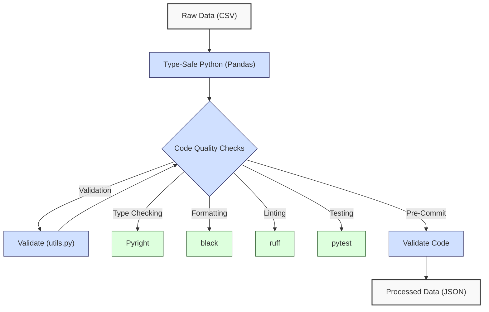
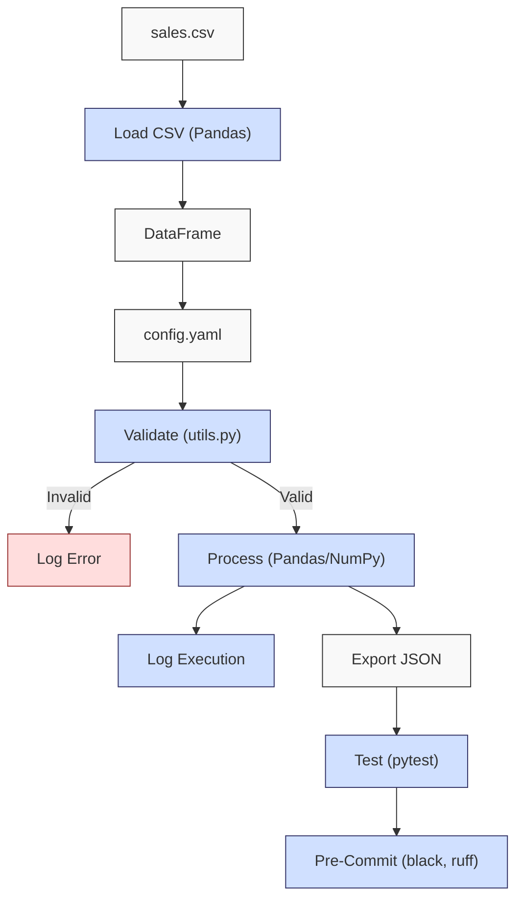

**Complexity: Easy (E)**

## 11.0 Introduction: Why This Matters for Data Engineering

In data engineering, high-quality code ensures reliable, maintainable, and scalable pipelines, critical for Hijra Group’s Sharia-compliant fintech analytics processing thousands of daily transactions. Validating Halal products aligns with Islamic Financial Services Board (IFSB) standards, ensuring compliance in financial data pipelines. This checkpoint consolidates skills from Chapters 7–10, focusing on **type safety** (Pyright), **annotations and decorators**, **testing** (`unittest`, `pytest`), and **code quality tools** (black, ruff, pre-commit). These practices reduce errors, enhance collaboration, and align with production standards, preparing for database fundamentals in Phase 3A. Building on Python foundations (Chapters 1–6), this chapter avoids advanced database or concurrency concepts (Chapters 12, 40), emphasizing modular, tested, and type-safe code with **4-space indentation** per PEP 8, preferring spaces over tabs to avoid `IndentationError`.

### Data Engineering Workflow Context



### Building On and Preparing For

- **Building On**:
  - Chapter 7: Static typing with Pyright for type-safe functions.
  - Chapter 8: Annotations and decorators for logging and modularity.
  - Chapter 9: Testing with `unittest` and `pytest` for robust code.
  - Chapter 10: Code quality with black, ruff, and pre-commit hooks.
- **Preparing For**:
  - Chapter 12: SQL with SQLite, using type-safe Python for data loading.
  - Chapter 13: Python-SQLite integration with tested pipelines.
  - Chapter 42: Advanced pipeline testing with type safety.

### What You’ll Learn

This chapter reviews:

1. **Type-Safe Processing**: Using Pyright-verified type annotations.
2. **Decorators**: Logging execution details.
3. **Testing**: Unit and integration tests with `pytest`.
4. **Code Quality**: Formatting (black), linting (ruff), and pre-commit hooks.
5. **Modular Design**: Organizing code in modules (`utils.py`, `processor.py`).

The micro-project builds a type-safe, tested sales data processor with a pre-commit pipeline, processing `data/sales.csv` and `config.yaml`, producing a JSON report with **4-space indentation** per PEP 8.

**Follow-Along Tips**:

- Create `de-onboarding/data/` with files from Appendix 1 (`sales.csv`, `config.yaml`, `empty.csv`, `invalid.csv`, `malformed.csv`, `negative.csv`).
- Install libraries: `pip install numpy pandas pyyaml pytest black ruff pre-commit pyright`.
- Use **4 spaces** (not tabs) per PEP 8. Run `python -tt script.py` to detect tab/space mixing.
- Debug with `print(df.head())` for DataFrames, `print(config)` for YAML.
- Use UTF-8 encoding to avoid `UnicodeDecodeError`.

## 11.1 Core Concepts

### 11.1.1 Type-Safe Processing

Type annotations with Pyright ensure type safety, reducing runtime errors. For example, annotating a function to process sales data:

```python
from typing import Dict, Any
def process_sales(df: pd.DataFrame, config: Dict[str, Any]) -> Dict[str, Any]:
    # Process sales with type-safe inputs
    pass
```

- **Implementation**: Pyright checks annotations, catching type mismatches (e.g., passing a string instead of a DataFrame).
- **Time Complexity**: O(1) for type checking (static analysis).
- **Space Complexity**: O(1) for type metadata.

### 11.1.2 Decorators for Logging

Decorators add logging to functions, improving debugging without altering logic.

```python
from functools import wraps
import logging

def log_execution(func):
    @wraps(func)
    def wrapper(*args, **kwargs):
        logging.info(f"Executing {func.__name__}")
        result = func(*args, **kwargs)
        logging.info(f"Completed {func.__name__}")
        return result
    return wrapper
```

- **Implementation**: Logs function execution, useful for pipeline monitoring.
- **Time Complexity**: O(1) for logging overhead.
- **Space Complexity**: O(1) for log entries.

### 11.1.3 Testing with pytest

`pytest` ensures code reliability through unit and integration tests, organized in modules (`tests/test_processor.py`).

```python
# File: tests/test_processor.py
import pytest
import pandas as pd
from processor import process_sales

def test_process_sales():
    df = pd.DataFrame({"product": ["Halal Laptop"], "price": [999.99], "quantity": [2]})
    config = {"min_price": 10.0, "max_quantity": 100, "product_prefix": "Halal"}
    result, _ = process_sales(df, config)
    assert result["total_sales"] == 1999.98
```

- **Implementation**: Tests validate outputs, catching logical errors.
- **Time Complexity**: O(n) for testing n rows.
- **Space Complexity**: O(n) for test data.

### 11.1.4 Code Quality Tools

- **black**: Formats code for consistency (O(n) for n lines).
- **ruff**: Lints for errors and style (O(n) for n lines).
- **pre-commit**: Runs checks before commits, ensuring quality.
- **Pyright**: Verifies type annotations (O(1) per check).

```bash
# .pre-commit-config.yaml
repos:
  - repo: https://github.com/psf/black
    rev: 24.8.0
    hooks:
      - id: black
  - repo: https://github.com/charliermarsh/ruff
    rev: 0.6.8
    hooks:
      - id: ruff
  - repo: https://github.com/pycqa/pyright
    rev: 1.1.382
    hooks:
      - id: pyright
```

## 11.2 Micro-Project: Type-Safe Sales Data Processor

### Project Requirements

Build a type-safe, tested sales data processor with a pre-commit pipeline, processing `data/sales.csv` and `config.yaml` to produce `data/sales_results.json`. The processor validates Halal products per IFSB standards, computes metrics (total sales, unique products, top 3 products), and logs execution, using **4-space indentation** per PEP 8. It ensures robust handling of edge cases (`empty.csv`, `invalid.csv`, `malformed.csv`, `negative.csv`) for Hijra Group’s transaction reporting.

### Sample Input Files

`data/sales.csv` (Appendix 1):

```csv
product,price,quantity
Halal Laptop,999.99,2
Halal Mouse,24.99,10
Halal Keyboard,49.99,5
,29.99,3
Monitor,invalid,2
Headphones,5.00,150
```

`data/config.yaml` (Appendix 1):

```yaml
min_price: 10.0
max_quantity: 100
required_fields:
  - product
  - price
  - quantity
product_prefix: 'Halal'
max_decimals: 2
```

### Data Processing Flow



### Acceptance Criteria

- **Go Criteria**:
  - Loads and validates `sales.csv`, `config.yaml` with type annotations, ensuring Halal products and edge cases (`empty.csv`, `invalid.csv`, `malformed.csv`, `negative.csv`) per IFSB standards.
  - Computes total sales, unique products, top 3 products.
  - Exports to `data/sales_results.json`.
  - Logs execution with decorator.
  - Passes `pytest` tests in `tests/test_processor.py`.
  - Uses pre-commit with black (24.8.0), ruff (0.6.8), Pyright (1.1.382).
- **No-Go Criteria**:
  - Fails to load files or validate data.
  - Incorrect metrics or missing JSON.
  - Fails tests or pre-commit checks.
  - Uses tabs or inconsistent indentation.

### Common Pitfalls

1. **Type Errors**:
   - **Problem**: Pyright flags incorrect types (e.g., `str` instead of `pd.DataFrame`).
   - **Solution**: Verify annotations with `print(type(df))`. Run `pyright processor.py`.
2. **Test Failures**:
   - **Problem**: `pytest` fails due to incorrect logic (e.g., `test_malformed_data` fails if non-integer quantities are present).
   - **Solution**: Print `result` in tests and `df.dtypes` to verify `quantity` is int. Run `pytest -v tests/test_processor.py`.
3. **Pre-Commit Errors**:
   - **Problem**: black or ruff fails.
   - **Solution**: Run `black .` and `ruff check .` manually.
4. **IndentationError**:
   - **Problem**: Mixed spaces/tabs.
   - **Solution**: Use **4 spaces**. Run `python -tt processor.py`.
5. **FileNotFoundError**:
   - **Problem**: Missing `sales.csv` or `config.yaml`.
   - **Solution**: Verify paths with `ls data/`. Print `csv_path`.

### Complexity Analysis

- **Loading CSV (`pd.read_csv`)**: O(n) time for n rows, O(n) space (~24MB for 1M rows, 3 columns, numeric types).
- **Validation (Pandas filtering)**: O(n) time for n rows, O(k) space for k valid rows.
- **Processing (NumPy sum, Pandas groupby)**: O(n) time for sum and grouping, O(k) space for k groups.
- **Exporting JSON**: O(n) time for n records, O(n) space for output.
- **Testing (pytest)**: O(n) time per test for n rows, O(n) space for test data.

**Implication**: Efficient for Hijra Group’s daily transaction datasets (thousands of rows), but production systems may require chunked processing for millions of rows (Chapter 40).

### Production Differences

In production:

- **Error Handling**: Robust try/except (Chapter 7).
- **Logging**: File-based with `logging` (Chapter 52).
- **Scalability**: Chunked processing for large CSVs (Chapter 40), critical for Hijra Group’s pipelines processing millions of transactions daily. For example, processing 10M transactions may require splitting CSVs into 1M-row chunks to avoid memory issues, as covered in Chapter 40.
- **CI/CD**: Automated pre-commit in GitHub Actions (Chapter 66).

### Implementation

```python
# File: de-onboarding/utils.py
from typing import Dict, Any, Union
import pandas as pd
import logging

def is_numeric(s: str, max_decimals: int = 2) -> bool:
    """Check if string is a decimal number with up to max_decimals."""
    parts = s.split(".")
    if len(parts) != 2 or not parts[0].replace("-", "").isdigit() or not parts[1].isdigit():
        return False
    return len(parts[1]) <= max_decimals

def clean_string(s: Union[str, float]) -> str:
    """Strip whitespace from string."""
    return str(s).strip()

def is_numeric_value(x: Any) -> bool:
    """Check if value is numeric."""
    return isinstance(x, (int, float))

def is_integer(x: Any) -> bool:
    """Check if value is an integer."""
    return isinstance(x, int) or (isinstance(x, str) and x.isdigit())

def validate_sale(sale: Dict[str, str], config: Dict[str, Any]) -> bool:
    """Validate sale based on config rules, ensuring IFSB-compliant Halal products."""
    required_fields = config["required_fields"]
    min_price = config["min_price"]
    max_quantity = config["max_quantity"]
    prefix = config["product_prefix"]
    max_decimals = config["max_decimals"]

    logging.debug(f"Validating sale: {sale}")
    for field in required_fields:
        if field not in sale or not sale[field] or clean_string(sale[field]) == "":
            logging.warning(f"Invalid sale: missing {field}: {sale}")
            return False

    product = clean_string(sale["product"])
    if not product.startswith(prefix):
        logging.warning(f"Invalid sale: product lacks '{prefix}' prefix: {sale}")
        return False

    price = clean_string(sale["price"])
    if not is_numeric(price, max_decimals) or float(price) < min_price or float(price) <= 0:
        logging.warning(f"Invalid sale: invalid price: {sale}")
        return False

    quantity = clean_string(sale["quantity"])
    if not is_integer(quantity) or int(quantity) > max_quantity:
        logging.warning(f"Invalid sale: invalid quantity: {sale}")
        return False

    return True

# File: de-onboarding/processor.py
from typing import Dict, Any, Tuple
import pandas as pd
import numpy as np
import yaml
import json
import logging
from functools import wraps
import utils

logging.basicConfig(level=logging.INFO, format="%(asctime)s - %(levelname)s - %(message)s")

def log_execution(func):
    """Decorator to log function execution."""
    @wraps(func)
    def wrapper(*args, **kwargs):
        logging.info(f"Executing {func.__name__}")
        result = func(*args, **kwargs)
        logging.info(f"Completed {func.__name__}")
        return result
    return wrapper

@log_execution
def read_config(config_path: str) -> Dict[str, Any]:
    """Read YAML configuration."""
    logging.info(f"Opening config: {config_path}")
    with open(config_path, "r") as file:
        config = yaml.safe_load(file)
    logging.debug(f"Loaded config: {config}")
    return config

@log_execution
def load_and_validate_sales(csv_path: str, config: Dict[str, Any]) -> Tuple[pd.DataFrame, int, int]:
    """Load and validate sales CSV."""
    logging.info(f"Loading CSV: {csv_path}")
    df = pd.read_csv(csv_path)
    logging.debug(f"Initial DataFrame:\n{df.head()}")

    required_fields = config["required_fields"]
    missing_fields = [f for f in required_fields if f not in df.columns]
    if missing_fields:
        logging.error(f"Missing columns: {missing_fields}")
        return pd.DataFrame(), 0, len(df)

    df = df.dropna(subset=["product"])
    df = df[df["product"].str.startswith(config["product_prefix"])]
    df = df[df["quantity"].apply(utils.is_integer)]
    df["quantity"] = df["quantity"].astype(int)
    df = df[df["quantity"] <= config["max_quantity"]]
    df = df[df["price"].apply(utils.is_numeric_value)]
    df = df[df["price"] > 0]
    df = df[df["price"] >= config["min_price"]]

    total_records = len(df)
    logging.debug(f"Validated DataFrame:\n{df}")
    return df, len(df), total_records

@log_execution
def process_sales(df: pd.DataFrame, config: Dict[str, Any]) -> Tuple[Dict[str, Any], int]:
    """Process sales data."""
    if df.empty:
        logging.warning("No valid sales data")
        return {"total_sales": 0.0, "unique_products": [], "top_products": {}}, 0

    df["amount"] = df["price"] * df["quantity"]
    logging.debug(f"DataFrame with Amount:\n{df}")

    total_sales = np.sum(df["amount"].values)
    unique_products = df["product"].unique().tolist()
    sales_by_product = df.groupby("product")["amount"].sum()
    top_products = sales_by_product.sort_values(ascending=False).head(3).to_dict()

    valid_sales = len(df)
    logging.info(f"Valid sales: {valid_sales} records")
    return {
        "total_sales": float(total_sales),
        "unique_products": unique_products,
        "top_products": top_products
    }, valid_sales

@log_execution
def export_results(results: Dict[str, Any], json_path: str) -> None:
    """Export results to JSON."""
    logging.info(f"Writing to: {json_path}")
    with open(json_path, "w") as file:
        json.dump(results, file, indent=2)
    logging.info(f"Exported results to {json_path}")

def main() -> None:
    """Main function."""
    csv_path = "data/sales.csv"
    config_path = "data/config.yaml"
    json_path = "data/sales_results.json"

    config = read_config(config_path)
    df, valid_sales, total_records = load_and_validate_sales(csv_path, config)
    results, valid_sales = process_sales(df, config)
    export_results(results, json_path)

    logging.info("\nSales Report:")
    logging.info(f"Total Records Processed: {total_records}")
    logging.info(f"Valid Sales: {valid_sales}")
    logging.info(f"Invalid Sales: {total_records - valid_sales}")
    logging.info(f"Total Sales: ${round(results['total_sales'], 2)}")
    logging.info(f"Unique Products: {results['unique_products']}")
    logging.info(f"Top Products: {results['top_products']}")

if __name__ == "__main__":
    main()

# File: tests/test_processor.py
import pytest
import pandas as pd
from processor import process_sales, load_and_validate_sales

@pytest.fixture
def sample_config():
    return {
        "min_price": 10.0,
        "max_quantity": 100,
        "required_fields": ["product", "price", "quantity"],
        "product_prefix": "Halal",
        "max_decimals": 2
    }

def test_process_sales(sample_config):
    df = pd.DataFrame({
        "product": ["Halal Laptop", "Halal Mouse"],
        "price": [999.99, 24.99],
        "quantity": [2, 10]
    })
    result, valid_sales = process_sales(df, sample_config)
    assert result["total_sales"] == 2249.88
    assert valid_sales == 2
    assert result["unique_products"] == ["Halal Laptop", "Halal Mouse"]
    assert result["top_products"] == {
        "Halal Laptop": 1999.98,
        "Halal Mouse": 249.9
    }

def test_empty_dataframe(sample_config):
    df = pd.DataFrame(columns=["product", "price", "quantity"])
    result, valid_sales = process_sales(df, sample_config)
    assert result["total_sales"] == 0.0
    assert valid_sales == 0
    assert result["unique_products"] == []
    assert result["top_products"] == {}

def test_invalid_columns(sample_config):
    df = pd.DataFrame({
        "name": ["Halal Laptop"],
        "price": [999.99],
        "quantity": [2]
    })
    df, valid_sales, total_records = load_and_validate_sales("data/invalid.csv", sample_config)
    assert df.empty
    assert valid_sales == 0
    assert total_records == 0

def test_malformed_data(sample_config):
    df, valid_sales, total_records = load_and_validate_sales("data/malformed.csv", sample_config)
    assert len(df) == 1
    assert valid_sales == 1
    assert total_records == 1
    assert df.iloc[0]["product"] == "Halal Mouse"
    assert df.iloc[0]["price"] == 24.99
    assert df.iloc[0]["quantity"] == 10

def test_negative_prices(sample_config):
    df, valid_sales, total_records = load_and_validate_sales("data/negative.csv", sample_config)
    assert len(df) == 1
    assert valid_sales == 1
    assert total_records == 1
    assert df.iloc[0]["product"] == "Halal Mouse"
    assert df.iloc[0]["price"] == 24.99
    assert df.iloc[0]["quantity"] == 10
```

### Expected Output

`data/sales_results.json`:

```json
{
  "total_sales": 2499.83,
  "unique_products": ["Halal Laptop", "Halal Mouse", "Halal Keyboard"],
  "top_products": {
    "Halal Laptop": 1999.98,
    "Halal Mouse": 249.9,
    "Halal Keyboard": 249.95
  }
}
```

**Console Output** (abridged):

```
2025-04-24 10:00:00,000 - INFO - Opening config: data/config.yaml
2025-04-24 10:00:00,001 - INFO - Executing read_config
2025-04-24 10:00:00,002 - INFO - Completed read_config
2025-04-24 10:00:00,003 - INFO - Loading CSV: data/sales.csv
2025-04-24 10:00:00,004 - INFO - Executing load_and_validate_sales
2025-04-24 10:00:00,005 - INFO - Valid sales: 3 records
2025-04-24 10:00:00,006 - INFO - Writing to: data/sales_results.json
2025-04-24 10:00:00,007 - INFO - Sales Report:
2025-04-24 10:00:00,008 - INFO - Total Records Processed: 3
2025-04-24 10:00:00,009 - INFO - Valid Sales: 3
2025-04-24 10:00:00,010 - INFO - Total Sales: $2499.83
```

### How to Run and Test

1. **Setup Checklist**:

   - [ ] Create `de-onboarding/data/` with `sales.csv`, `config.yaml`, `empty.csv`, `invalid.csv`, `malformed.csv`, `negative.csv` (Appendix 1).
   - [ ] Install: `pip install numpy pandas pyyaml pytest black==24.8.0 ruff==0.6.8 pre-commit pyright==1.1.382`.
   - [ ] Save `utils.py`, `processor.py`, `tests/test_processor.py`.
   - [ ] Create `.pre-commit-config.yaml` in `de-onboarding/` with the provided content.
   - [ ] Configure pre-commit: `pre-commit install`.
   - [ ] Configure editor for **4-space indentation** per PEP 8 (VS Code: “Editor: Tab Size” = 4, “Editor: Insert Spaces” = true, “Editor: Detect Indentation” = false).
   - [ ] Verify files: `ls data/` and check `sales.csv` has 6 rows with `wc -l data/sales.csv` (Unix/macOS) or `findstr /r /n "^" data\sales.csv | find /c ":"` (Windows).

2. **Run**:

   - Run: `python processor.py`.
   - Outputs: `data/sales_results.json`, console logs.

3. **Test**:
   - Run: `pytest tests/test_processor.py -v`.
   - Verify all tests pass.
   - **Debugging Tests**:
     - For all tests, debug with `print(df)`, `print(df.dtypes)`, `print(df.head())` to inspect data types and contents.
     - Debug `FileNotFoundError`: Print paths with `print(csv_path)` in `processor.py`.
   - **Edge Case Tests**:
     - **Empty CSV** (`empty.csv`):
       ```python
       config = read_config("data/config.yaml")
       df, valid_sales, total_records = load_and_validate_sales("data/empty.csv", config)
       print(df, valid_sales, total_records)
       # Expected: Empty DataFrame with columns ['product', 'price', 'quantity'], valid_sales=0, total_records=0
       ```
     - **Invalid Headers** (`invalid.csv`):
       ```python
       config = read_config("data/config.yaml")
       df, valid_sales, total_records = load_and_validate_sales("data/invalid.csv", config)
       print(df, valid_sales, total_records)
       # Expected: Empty DataFrame with no columns, valid_sales=0, total_records=0
       ```
     - **Malformed Data** (`malformed.csv`):
       ```python
       config = read_config("data/config.yaml")
       df, valid_sales, total_records = load_and_validate_sales("data/malformed.csv", config)
       print(df)
       # Expected: DataFrame with 1 row: product='Halal Mouse', price=24.99, quantity=10
       ```
     - **Negative Prices** (`negative.csv`):
       ```python
       config = read_config("data/config.yaml")
       df, valid_sales, total_records = load_and_validate_sales("data/negative.csv", config)
       print(df)
       # Expected: DataFrame with 1 row: product='Halal Mouse', price=24.99, quantity=10
       ```

## 11.3 Practice Exercises

### Exercise 1: Type-Safe Halal Validation

Write a type-safe function to validate a sale’s Halal product prefix per IFSB standards, using **4-space indentation**.

```python
from typing import Dict, Any
import logging

def validate_halal_sale(sale: Dict[str, str], config: Dict[str, Any]) -> bool:
    """Validate sale’s product prefix for IFSB-compliant Halal products."""
    prefix = config["product_prefix"]
    product = sale.get("product", "")
    logging.debug(f"Validating product: {product}")
    if not product.startswith(prefix):
        logging.warning(f"Invalid product: lacks '{prefix}' prefix")
        return False
    return True
```

**Test**:

- Save as `de-onboarding/ex1_validate.py`.
- Verify: `validate_halal_sale({"product": "Halal Laptop"}, {"product_prefix": "Halal"})` returns `True`.
- Debug: Print `sale["product"]` if `False`.
- Run: `python ex1_validate.py`.

### Exercise 2: Logging Decorator

Write a decorator to log function inputs, using **4-space indentation**.

```python
from functools import wraps
import logging

def log_inputs(func):
    """Log function inputs."""
    @wraps(func)
    def wrapper(*args, **kwargs):
        logging.info(f"Inputs for {func.__name__}: args={args}, kwargs={kwargs}")
        return func(*args, **kwargs)
    return wrapper
```

**Test**:

- Save as `de-onboarding/ex2_decorator.py`.
- Apply to a function (e.g., `validate_sale`) and verify logs show inputs.
- Debug: Check `logging.basicConfig` setup with `print(logging.getLogger().level)`.
- Run: `python ex2_decorator.py`.

### Exercise 3: pytest Test Case

Write a `pytest` test for `process_sales`, using **4-space indentation**.

```python
import pytest
import pandas as pd
from processor import process_sales

def test_process_sales():
    df = pd.DataFrame({"product": ["Halal Mouse"], "price": [24.99], "quantity": [10]})
    config = {"min_price": 10.0, "max_quantity": 100, "product_prefix": "Halal"}
    result, valid_sales = process_sales(df, config)
    assert result["total_sales"] == 249.9
```

**Test**:

- Save as `de-onboarding/ex3_test.py`.
- Run: `pytest ex3_test.py`.
- Verify: Test passes.
- Debug: Print `result` if fails.

### Exercise 4: Conceptual Pipeline Integration

Explain why type safety is important for Hijra Group’s data pipelines and, optionally for advanced learners, how the sales processor could integrate with automated scheduling or web endpoints. Save the explanation to `ex4_concepts.txt`, using **4-space indentation** in any code snippets. This prepares for pipeline orchestration in Chapter 56 and API development in Chapter 53, critical for capstone projects in Chapters 68–71.

**Template**:

- Type Safety: [Why is type safety important for pipelines?]
- (Optional) Scheduling: [How to automate the processor’s execution]
- (Optional) Web Endpoint: [How to expose the processor’s results online]

**Example Phrases**:

- Type Safety: “Type safety prevents errors by ensuring data types match expected formats…”
- Scheduling: “Automate daily runs to process transactions consistently…”
- Web Endpoint: “Provide a URL to view sales metrics securely…”

**Expected Output** (`ex4_concepts.txt`, 50–100 words):

```
Type Safety: Type safety prevents errors in Hijra Group’s pipelines by ensuring data types match expected formats, reducing runtime issues in transaction processing. It improves code reliability and maintainability, critical for Sharia-compliant analytics.
(Optional) Scheduling: The processor could be automated to run daily, ensuring consistent transaction processing without manual intervention.
(Optional) Web Endpoint: The processor’s results could be exposed through a web service, allowing stakeholders to access sales metrics like total sales via a secure URL.
```

**Test**:

- Save as `de-onboarding/ex4_concepts.py` with code to write to `ex4_concepts.txt`.
- Run: `python ex4_concepts.py`.
- Verify: `ex4_concepts.txt` exists with 50–100 words (check with `wc -w ex4_concepts.txt` on Unix/macOS).
- Debug: Print file contents with `print(open("ex4_concepts.txt").read())`.

### Exercise 5: Debug a Buggy Processor

Fix this buggy `process_sales` function that groups by the wrong column, causing incorrect totals, using **4-space indentation**. The input contains only Halal products.

**Buggy Code**:

```python
import pandas as pd
from typing import Dict, Any, Tuple

def process_sales(df: pd.DataFrame, config: Dict[str, Any]) -> Tuple[Dict[str, Any], int]:
    """Process sales data."""
    df["amount"] = df["price"] * df["quantity"]
    total_sales = df["amount"].sum()
    unique_products = df["product"].unique().tolist()
    sales_by_product = df.groupby("price")["amount"].sum()  # Bug: Wrong column
    top_products = sales_by_product.sort_values(ascending=False).head(3).to_dict()
    valid_sales = len(df)
    return {
        "total_sales": float(total_sales),
        "unique_products": unique_products,
        "top_products": top_products
    }, valid_sales
```

**Sample Input** (`data/sample.csv`):

```csv
product,price,quantity
Halal Laptop,999.99,2
Halal Mouse,24.99,10
```

**Expected Output**:

```python
{
    'total_sales': 2249.88,
    'unique_products': ['Halal Laptop', 'Halal Mouse'],
    'top_products': {'Halal Laptop': 1999.98, 'Halal Mouse': 249.9}
}, 2
```

**Test**:

- Save as `de-onboarding/ex5_debug.py`.
- Run buggy code: `python ex5_debug.py` to see incorrect output.
- Fix by changing `groupby("price")` to `groupby("product")`.
- Re-run and verify output matches expected.
- Debug: Print `df.groupby("price").size()` vs. `df.groupby("product").size()` to inspect grouping. Use `print(df.head())` to inspect data, `print(df.dtypes)` to check column types.

## 11.4 Chapter Summary and Connection to Chapter 12

This chapter solidified type safety, decorators, testing, and code quality, producing a robust sales processor with pre-commit checks, validated against IFSB-compliant Halal products. The modular design (`utils.py`, `processor.py`), **4-space indentation** per PEP 8, and comprehensive edge case testing (`empty.csv`, `malformed.csv`, `negative.csv`) ensure reliable pipelines. The complexity analysis (O(n) for processing, ~24MB for 1M rows) prepares for scalability discussions in Chapter 40. **Chapter 12: SQL Fundamentals with SQLite** builds on this by introducing SQL queries, using type-safe Python to load data from `sales.db`, maintaining code quality for Hijra Group’s transaction analytics.
