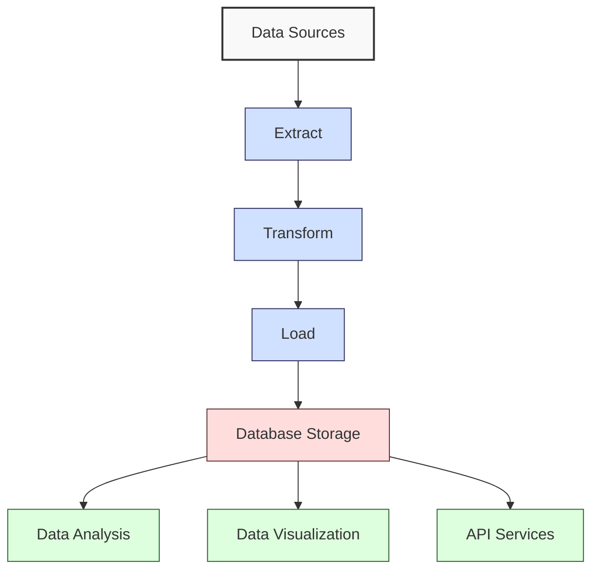
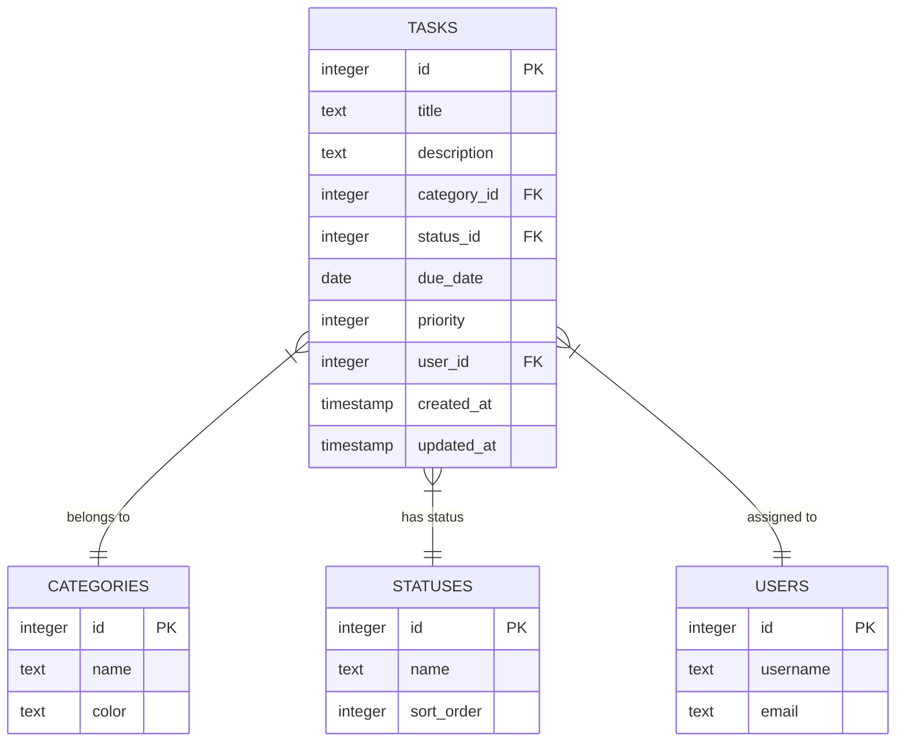

**Complexity: Easy (E)**

## 11.0 Introduction: Why Databases Matter for Data Engineering

As a data engineer, you'll spend much of your time working with structured data stored in databases. Databases are the backbone of data engineering - they provide reliable, organized storage with mechanisms for data integrity, efficient retrieval, and concurrent access.

SQL (Structured Query Language) is the standard language for interacting with relational databases and has been for decades. Even in the era of "big data" and NoSQL systems, SQL remains essential knowledge for any data professional.

Let's visualize how databases fit into a typical data engineering workflow:



In this chapter, we'll use SQLite as our database engine. SQLite is perfect for learning because:

1. It requires zero configuration
2. It's serverless (no separate database server to install)
3. The entire database is contained in a single file
4. Despite its simplicity, it follows SQL standards and handles most common operations

This chapter introduces core SQL concepts that you'll use throughout your data engineering career:

1. **Database fundamentals** - Understanding relational database concepts
2. **Data Definition Language (DDL)** - Creating and modifying database structures
3. **Data Manipulation Language (DML)** - Adding, modifying, and removing data
4. **Basic Queries** - Retrieving and filtering data

By the end of this chapter, you'll be able to design simple database schemas, create tables, insert data, and write queries to extract exactly the information you need.

## 11.1 Database and SQL Fundamentals

### 11.1.1 What is a Relational Database?

A relational database organizes data into tables with rows and columns, similar to spreadsheets. The "relational" part comes from the ability to establish relationships between these tables.

Key concepts in relational databases:

- **Tables**: Collections of data organized in rows and columns
- **Rows**: Individual records in a table (also called tuples)
- **Columns**: Attributes or fields that define the data being stored
- **Primary Keys**: Unique identifiers for each row
- **Foreign Keys**: Fields that refer to primary keys in other tables, creating relationships
- **Schemas**: The overall structure of the database

### 11.1.2 Getting Started with SQLite

Let's set up a simple environment to work with SQLite through Python. We'll use the built-in `sqlite3` module:

```python
import sqlite3
import os
from typing import List, Dict, Any, Optional, Tuple

# Function to create a new SQLite database
def create_database(db_name: str) -> sqlite3.Connection:
    """Create a new SQLite database or connect to it if it exists."""
    # Connect to the database (this creates it if it doesn't exist)
    connection = sqlite3.connect(db_name)

    print(f"Database created/connected: {db_name}")
    return connection

# Let's create a test database
db_connection = create_database("mydatabase.db")

# Don't forget to close the connection when done
db_connection.close()
print("Connection closed")

# Database created/connected: mydatabase.db
# Connection closed
```

### 11.1.3 SQLite Data Types

SQLite has a more flexible type system than most databases. It supports these basic storage classes:

- `NULL`: Represents missing data
- `INTEGER`: Whole numbers
- `REAL`: Floating-point numbers
- `TEXT`: Text strings
- `BLOB`: Binary data

Unlike other databases where column types are strictly enforced, SQLite uses "type affinity" - it attempts to convert data to the declared type but will store data as-is if conversion fails.

## 11.2 Data Definition Language (DDL)

Data Definition Language (DDL) commands are used to define and manage database structures like tables. The main DDL commands are:

- `CREATE`: Make new database objects (tables, views, indexes)
- `ALTER`: Modify existing database objects
- `DROP`: Remove database objects

### 11.2.1 Creating Tables

Let's create a simple table to store information about books:

```python
import sqlite3
from typing import Optional

def create_books_table(connection: sqlite3.Connection) -> None:
    """Create a table to store book information."""
    # Create a cursor object to execute SQL commands
    cursor = connection.cursor()

    # Define our SQL command
    create_table_sql = """
    CREATE TABLE IF NOT EXISTS books (
        id INTEGER PRIMARY KEY,
        title TEXT NOT NULL,
        author TEXT NOT NULL,
        published_year INTEGER,
        genre TEXT,
        price REAL
    );
    """

    # Execute the SQL command
    cursor.execute(create_table_sql)

    # Commit the changes
    connection.commit()

    print("Books table created successfully")

# Connect to our database
db_connection = sqlite3.connect("library.db")

# Create the books table
create_books_table(db_connection)

# Close the connection
db_connection.close()
print("Database connection closed")

# Books table created successfully
# Database connection closed
```

Let's break down the table creation command:

- `CREATE TABLE IF NOT EXISTS books`: Create a table named "books" if it doesn't already exist
- `id INTEGER PRIMARY KEY`: A unique identifier for each book that auto-increments
- `title TEXT NOT NULL`: The book title, which cannot be NULL
- `author TEXT NOT NULL`: The book author, which cannot be NULL
- `published_year INTEGER`: The year the book was published
- `genre TEXT`: The book's genre
- `price REAL`: The book's price as a decimal number

### 11.2.2 Understanding Primary Keys

A primary key uniquely identifies each record in a table. In our books table, `id` is the primary key. Rules for primary keys:

1. They must be unique across all rows
2. They cannot be NULL
3. A table should have only one primary key (though it can consist of multiple columns)

In SQLite, when you define a column as `INTEGER PRIMARY KEY`, it automatically becomes an alias for the `rowid` column, which auto-increments when you insert new records.

### 11.2.3 Creating Multiple Tables with Relationships

Let's expand our library database by adding an "authors" table and modifying the books table to reference authors:

```python
import sqlite3
from typing import Optional

def create_library_schema(connection: sqlite3.Connection) -> None:
    """Create a complete library schema with related tables."""
    cursor = connection.cursor()

    # Create authors table
    create_authors_sql = """
    CREATE TABLE IF NOT EXISTS authors (
        id INTEGER PRIMARY KEY,
        name TEXT NOT NULL,
        birth_year INTEGER,
        country TEXT
    );
    """
    cursor.execute(create_authors_sql)

    # Create books table with a foreign key to authors
    create_books_sql = """
    CREATE TABLE IF NOT EXISTS books (
        id INTEGER PRIMARY KEY,
        title TEXT NOT NULL,
        author_id INTEGER NOT NULL,
        published_year INTEGER,
        genre TEXT,
        price REAL,
        FOREIGN KEY (author_id) REFERENCES authors (id)
    );
    """
    cursor.execute(create_books_sql)

    # Commit the changes
    connection.commit()

    print("Library schema created successfully")

# Connect to our database
db_connection = sqlite3.connect("library.db")

# Enable foreign key support (important in SQLite)
db_connection.execute("PRAGMA foreign_keys = ON")

# Create the schema
create_library_schema(db_connection)

# Close the connection
db_connection.close()
print("Database connection closed")

# Library schema created successfully
# Database connection closed
```

Notice the `FOREIGN KEY` constraint in the books table. This establishes a relationship between the books and authors tables, ensuring that every book's `author_id` references a valid author in the authors table.

### 11.2.4 Modifying Tables with ALTER TABLE

The `ALTER TABLE` command allows you to modify existing tables. In SQLite, the ALTER TABLE functionality is limited compared to other database systems, but you can:

- Add new columns
- Rename a table
- Rename a column (in newer SQLite versions)

Let's add a new column to our books table:

```python
import sqlite3
from typing import Optional

def add_column_to_table(connection: sqlite3.Connection) -> None:
    """Add a new column to the books table."""
    cursor = connection.cursor()

    # Define the SQL command to add a column
    alter_table_sql = """
    ALTER TABLE books
    ADD COLUMN page_count INTEGER;
    """

    try:
        # Execute the SQL command
        cursor.execute(alter_table_sql)

        # Commit the changes
        connection.commit()
        print("Column 'page_count' added to books table")
    except sqlite3.Error as e:
        print(f"Error modifying table: {e}")

# Connect to our database
db_connection = sqlite3.connect("library.db")

# Add the new column
add_column_to_table(db_connection)

# Close the connection
db_connection.close()
print("Database connection closed")

# Column 'page_count' added to books table
# Database connection closed
```

### 11.2.5 Dropping Tables

The `DROP TABLE` command removes a table and all its data from the database:

```python
import sqlite3
from typing import Optional

def drop_table(connection: sqlite3.Connection, table_name: str) -> None:
    """Drop a table from the database."""
    cursor = connection.cursor()

    # Define the SQL command
    drop_table_sql = f"DROP TABLE IF EXISTS {table_name};"

    try:
        # Execute the SQL command
        cursor.execute(drop_table_sql)

        # Commit the changes
        connection.commit()
        print(f"Table '{table_name}' dropped successfully")
    except sqlite3.Error as e:
        print(f"Error dropping table: {e}")

# For demonstration purposes only, let's create a temporary table and then drop it

# Connect to our database
db_connection = sqlite3.connect("library.db")

# Create a temporary table
cursor = db_connection.cursor()
cursor.execute("CREATE TABLE temp_table (id INTEGER, name TEXT);")
print("Temporary table created")

# Now drop it
drop_table(db_connection, "temp_table")

# Close the connection
db_connection.close()
print("Database connection closed")

# Temporary table created
# Table 'temp_table' dropped successfully
# Database connection closed
```

## 11.3 Data Manipulation Language (DML)

Data Manipulation Language (DML) commands are used to manage data within database objects. The main DML commands are:

- `INSERT`: Add new records
- `UPDATE`: Modify existing records
- `DELETE`: Remove records

### 11.3.1 Inserting Data

Let's insert some data into our authors and books tables:

```python
import sqlite3
from typing import List, Dict, Any, Tuple

def insert_authors(connection: sqlite3.Connection, authors: List[Tuple[str, Optional[int], Optional[str]]]) -> None:
    """Insert multiple authors into the authors table."""
    cursor = connection.cursor()

    # Define the SQL command
    insert_sql = """
    INSERT INTO authors (name, birth_year, country)
    VALUES (?, ?, ?);
    """

    # Execute the command for each author
    for author in authors:
        cursor.execute(insert_sql, author)

    # Commit the changes
    connection.commit()
    print(f"Inserted {len(authors)} authors into the database")

def insert_books(connection: sqlite3.Connection, books: List[Tuple[str, int, Optional[int], Optional[str], Optional[float], Optional[int]]]) -> None:
    """Insert multiple books into the books table."""
    cursor = connection.cursor()

    # Define the SQL command
    insert_sql = """
    INSERT INTO books (title, author_id, published_year, genre, price, page_count)
    VALUES (?, ?, ?, ?, ?, ?);
    """

    # Execute the command for each book
    for book in books:
        cursor.execute(insert_sql, book)

    # Commit the changes
    connection.commit()
    print(f"Inserted {len(books)} books into the database")

# Let's insert some data
db_connection = sqlite3.connect("library.db")

# Sample authors: (name, birth_year, country)
author_data = [
    ("J.K. Rowling", 1965, "United Kingdom"),
    ("George Orwell", 1903, "United Kingdom"),
    ("Harper Lee", 1926, "United States"),
    ("Jane Austen", 1775, "United Kingdom")
]
insert_authors(db_connection, author_data)

# Let's query the authors to get their IDs for the books
cursor = db_connection.cursor()
cursor.execute("SELECT id, name FROM authors;")
authors = cursor.fetchall()
print("Authors in the database:")
for author in authors:
    print(f"ID: {author[0]}, Name: {author[1]}")

# Now use these IDs to insert books
# Sample books: (title, author_id, published_year, genre, price, page_count)
# Note: You might have different author IDs, adjust accordingly
book_data = [
    ("Harry Potter and the Philosopher's Stone", 1, 1997, "Fantasy", 19.99, 320),
    ("1984", 2, 1949, "Dystopian", 12.50, 328),
    ("To Kill a Mockingbird", 3, 1960, "Fiction", 15.75, 281),
    ("Pride and Prejudice", 4, 1813, "Romance", 9.99, 432),
    ("Harry Potter and the Chamber of Secrets", 1, 1998, "Fantasy", 19.99, 352)
]
insert_books(db_connection, book_data)

# Close the connection
db_connection.close()
print("Database connection closed")

# Inserted 4 authors into the database
# Authors in the database:
# ID: 1, Name: J.K. Rowling
# ID: 2, Name: George Orwell
# ID: 3, Name: Harper Lee
# ID: 4, Name: Jane Austen
# Inserted 5 books into the database
# Database connection closed
```

In the above example, we:

1. Define functions to insert authors and books
2. Insert sample authors into the database
3. Query the authors to get their IDs
4. Use those IDs to insert related books

Notice the use of placeholder `?` in the SQL commands. This is crucial for:

- Security: Prevents SQL injection attacks
- Data integrity: Handles different data types correctly

### 11.3.2 Updating Data

The `UPDATE` command modifies existing records:

```python
import sqlite3
from typing import Optional

def update_book_price(connection: sqlite3.Connection, book_id: int, new_price: float) -> None:
    """Update the price of a book."""
    cursor = connection.cursor()

    # Define the SQL command
    update_sql = """
    UPDATE books
    SET price = ?
    WHERE id = ?;
    """

    # Execute the command
    cursor.execute(update_sql, (new_price, book_id))

    # Check if any rows were affected
    rows_affected = cursor.rowcount

    # Commit the changes
    connection.commit()

    if rows_affected > 0:
        print(f"Updated price of book ID {book_id} to ${new_price}")
    else:
        print(f"No book found with ID {book_id}")

# Connect to our database
db_connection = sqlite3.connect("library.db")

# Update the price of a book (let's say book ID 1)
update_book_price(db_connection, 1, 24.99)

# Try to update a book that doesn't exist
update_book_price(db_connection, 999, 9.99)

# Close the connection
db_connection.close()
print("Database connection closed")

# Updated price of book ID 1 to $24.99
# No book found with ID 999
# Database connection closed
```

### 11.3.3 Deleting Data

The `DELETE` command removes records from a table:

```python
import sqlite3
from typing import Optional

def delete_book(connection: sqlite3.Connection, book_id: int) -> None:
    """Delete a book from the database."""
    cursor = connection.cursor()

    # Define the SQL command
    delete_sql = """
    DELETE FROM books
    WHERE id = ?;
    """

    # Execute the command
    cursor.execute(delete_sql, (book_id,))

    # Check if any rows were affected
    rows_affected = cursor.rowcount

    # Commit the changes
    connection.commit()

    if rows_affected > 0:
        print(f"Deleted book with ID {book_id}")
    else:
        print(f"No book found with ID {book_id}")

# Let's add a book specifically to delete
def add_book_to_delete(connection: sqlite3.Connection) -> int:
    """Add a book to the database and return its ID."""
    cursor = connection.cursor()

    # Insert a book
    cursor.execute(
        "INSERT INTO books (title, author_id, published_year, genre, price) VALUES (?, ?, ?, ?, ?);",
        ("Book to Delete", 1, 2020, "Test", 9.99)
    )

    # Get the ID of the inserted book
    book_id = cursor.lastrowid

    # Commit the changes
    connection.commit()

    print(f"Added book with ID {book_id} for deletion test")
    return book_id

# Connect to our database
db_connection = sqlite3.connect("library.db")

# Add a book to delete
book_id = add_book_to_delete(db_connection)

# Delete the book
delete_book(db_connection, book_id)

# Try to delete it again (should not find it)
delete_book(db_connection, book_id)

# Close the connection
db_connection.close()
print("Database connection closed")

# Added book with ID 6 for deletion test
# Deleted book with ID 6
# No book found with ID 6
# Database connection closed
```

## 11.4 Querying Data with SELECT

The `SELECT` statement is used to retrieve data from one or more tables. It's the most commonly used SQL command and has many variations.

### 11.4.1 Basic SELECT Statements

Let's start with simple queries:

```python
import sqlite3
from typing import List, Dict, Any, Optional

def execute_query(connection: sqlite3.Connection, query: str, parameters: Optional[tuple] = None) -> List[tuple]:
    """Execute a query and return all results."""
    cursor = connection.cursor()

    if parameters:
        cursor.execute(query, parameters)
    else:
        cursor.execute(query)

    # Fetch all results
    results = cursor.fetchall()

    return results

# Connect to our database
db_connection = sqlite3.connect("library.db")

# 1. Query all books
query = "SELECT * FROM books;"
books = execute_query(db_connection, query)

print("All books in the database:")
for book in books:
    print(book)

# 2. Query specific columns
query = "SELECT title, published_year FROM books;"
book_titles = execute_query(db_connection, query)

print("\nBook titles and publication years:")
for book in book_titles:
    print(f"Title: {book[0]}, Year: {book[1]}")

# 3. Ordering results
query = "SELECT title, price FROM books ORDER BY price DESC;"
books_by_price = execute_query(db_connection, query)

print("\nBooks ordered by price (highest first):")
for book in books_by_price:
    print(f"Title: {book[0]}, Price: ${book[1]}")

# Close the connection
db_connection.close()
print("\nDatabase connection closed")

# All books in the database:
# (1, "Harry Potter and the Philosopher's Stone", 1, 1997, 'Fantasy', 24.99, 320)
# (2, '1984', 2, 1949, 'Dystopian', 12.5, 328)
# (3, 'To Kill a Mockingbird', 3, 1960, 'Fiction', 15.75, 281)
# (4, 'Pride and Prejudice', 4, 1813, 'Romance', 9.99, 432)
# (5, 'Harry Potter and the Chamber of Secrets', 1, 1998, 'Fantasy', 19.99, 352)
#
# Book titles and publication years:
# Title: Harry Potter and the Philosopher's Stone, Year: 1997
# Title: 1984, Year: 1949
# Title: To Kill a Mockingbird, Year: 1960
# Title: Pride and Prejudice, Year: 1813
# Title: Harry Potter and the Chamber of Secrets, Year: 1998
#
# Books ordered by price (highest first):
# Title: Harry Potter and the Philosopher's Stone, Price: $24.99
# Title: Harry Potter and the Chamber of Secrets, Price: $19.99
# Title: To Kill a Mockingbird, Price: $15.75
# Title: 1984, Price: $12.5
# Title: Pride and Prejudice, Price: $9.99
#
# Database connection closed
```

Let's break down what we did:

1. Created a utility function to execute queries
2. Queried all columns and rows from the books table
3. Selected only specific columns (title and published_year)
4. Ordered results by price in descending order

### 11.4.2 Filtering Data with WHERE

The `WHERE` clause filters the results based on specific conditions:

```python
import sqlite3
from typing import List, Optional, Tuple

# Connect to our database
db_connection = sqlite3.connect("library.db")
cursor = db_connection.cursor()

# 1. Simple equality condition
query = """
SELECT title, price
FROM books
WHERE price > 15;
"""
cursor.execute(query)
expensive_books = cursor.fetchall()

print("Books with price over $15:")
for book in expensive_books:
    print(f"Title: {book[0]}, Price: ${book[1]}")

# 2. Multiple conditions with AND
query = """
SELECT title, published_year
FROM books
WHERE published_year >= 1950 AND published_year < 2000;
"""
cursor.execute(query)
modern_books = cursor.fetchall()

print("\nBooks published between 1950 and 1999:")
for book in modern_books:
    print(f"Title: {book[0]}, Year: {book[1]}")

# 3. Using OR for alternative conditions
query = """
SELECT title, genre
FROM books
WHERE genre = 'Fantasy' OR genre = 'Fiction';
"""
cursor.execute(query)
fiction_books = cursor.fetchall()

print("\nFantasy or Fiction books:")
for book in fiction_books:
    print(f"Title: {book[0]}, Genre: {book[1]}")

# 4. Using LIKE for pattern matching
query = """
SELECT title
FROM books
WHERE title LIKE 'Harry%';
"""
cursor.execute(query)
harry_books = cursor.fetchall()

print("\nBooks with titles starting with 'Harry':")
for book in harry_books:
    print(f"Title: {book[0]}")

# Close the connection
db_connection.close()
print("\nDatabase connection closed")

# Books with price over $15:
# Title: Harry Potter and the Philosopher's Stone, Price: $24.99
# Title: Harry Potter and the Chamber of Secrets, Price: $19.99
# Title: To Kill a Mockingbird, Price: $15.75
#
# Books published between 1950 and 1999:
# Title: Harry Potter and the Philosopher's Stone, Year: 1997
# Title: To Kill a Mockingbird, Year: 1960
# Title: Harry Potter and the Chamber of Secrets, Year: 1998
#
# Fantasy or Fiction books:
# Title: Harry Potter and the Philosopher's Stone, Genre: Fantasy
# Title: To Kill a Mockingbird, Genre: Fiction
# Title: Harry Potter and the Chamber of Secrets, Genre: Fantasy
#
# Books with titles starting with 'Harry':
# Title: Harry Potter and the Philosopher's Stone
# Title: Harry Potter and the Chamber of Secrets
#
# Database connection closed
```

Here we demonstrated several types of WHERE conditions:

1. Numeric comparison (`price > 15`)
2. Multiple conditions with `AND`
3. Alternative conditions with `OR`
4. Pattern matching with `LIKE` and the `%` wildcard

### 11.4.3 Joining Tables

One of the most powerful aspects of relational databases is the ability to join related tables:

```python
import sqlite3
from typing import List, Dict, Tuple, Any

# Connect to our database
db_connection = sqlite3.connect("library.db")
cursor = db_connection.cursor()

# Inner join to get book titles with their author names
query = """
SELECT books.title, authors.name
FROM books
INNER JOIN authors ON books.author_id = authors.id;
"""
cursor.execute(query)
book_authors = cursor.fetchall()

print("Books with their authors:")
for item in book_authors:
    print(f"Book: {item[0]}, Author: {item[1]}")

# Join with additional columns and filters
query = """
SELECT books.title, authors.name, books.published_year, books.price
FROM books
INNER JOIN authors ON books.author_id = authors.id
WHERE authors.country = 'United Kingdom'
ORDER BY books.published_year;
"""
cursor.execute(query)
uk_books = cursor.fetchall()

print("\nBooks by UK authors (ordered by year):")
for item in uk_books:
    print(f"Book: {item[0]}, Author: {item[1]}, Year: {item[2]}, Price: ${item[3]}")

# Count books by each author
query = """
SELECT authors.name, COUNT(books.id) as book_count
FROM authors
LEFT JOIN books ON authors.id = books.author_id
GROUP BY authors.id;
"""
cursor.execute(query)
author_book_counts = cursor.fetchall()

print("\nNumber of books by each author:")
for item in author_book_counts:
    print(f"Author: {item[0]}, Books: {item[1]}")

# Close the connection
db_connection.close()
print("\nDatabase connection closed")

# Books with their authors:
# Book: Harry Potter and the Philosopher's Stone, Author: J.K. Rowling
# Book: 1984, Author: George Orwell
# Book: To Kill a Mockingbird, Author: Harper Lee
# Book: Pride and Prejudice, Author: Jane Austen
# Book: Harry Potter and the Chamber of Secrets, Author: J.K. Rowling
#
# Books by UK authors (ordered by year):
# Book: Pride and Prejudice, Author: Jane Austen, Year: 1813, Price: $9.99
# Book: 1984, Author: George Orwell, Year: 1949, Price: $12.5
# Book: Harry Potter and the Philosopher's Stone, Author: J.K. Rowling, Year: 1997, Price: $24.99
# Book: Harry Potter and the Chamber of Secrets, Author: J.K. Rowling, Year: 1998, Price: $19.99
#
# Number of books by each author:
# Author: J.K. Rowling, Books: 2
# Author: George Orwell, Books: 1
# Author: Harper Lee, Books: 1
# Author: Jane Austen, Books: 1
#
# Database connection closed
```

In these examples:

1. We used an `INNER JOIN` to combine book data with author data
2. We added a `WHERE` clause to filter joined data
3. We used a `LEFT JOIN` to ensure all authors are included even if they have no books
4. We introduced `COUNT()` and `GROUP BY` to count books by each author

## 11.5 Micro-Project: Task Tracker Database

Now let's put everything together in a more substantial project. We'll create a task tracker database with multiple related tables.

### 11.5.1 Project Requirements

Create a normalized database schema for a task management system with:

- Tables for tasks, categories, and status tracking
- Appropriate primary and foreign keys
- Basic constraints (NOT NULL, unique constraints)
- Sample data
- SQL queries demonstrating the database's functionality

### 11.5.2 Acceptance Criteria

**Go Criteria:**

- Schema includes at least 3 properly related tables
- Primary and foreign keys are correctly defined
- Appropriate data types are used for each column
- Schema enforces basic data integrity constraints
- Sample data is inserted successfully using INSERT statements
- Sample queries demonstrate at least:
  - Filtering tasks by status
  - Joining tables to get tasks with their categories
  - Aggregating tasks by category or status
- Documentation includes schema visualization
- Scripts are provided to create the database from scratch

**No-Go Criteria:**

- Tables without primary keys
- Missing relationships between tables
- Improper data types for columns
- No constraints for data integrity
- Inability to insert sample data
- Queries that don't work as expected
- Missing documentation of schema design
- Poorly normalized database design (redundancy)

### 11.5.3 Common Pitfalls and Solutions

**Pitfall 1: Denormalized tables with redundant data**  
_Problem:_ Creating a single table with repeated information, like storing full category details with every task.  
_Solution:_ Split data into related tables with appropriate keys.

**Pitfall 2: Incorrect data types leading to unexpected query results**  
_Problem:_ Using TEXT for date fields or not accounting for NULL values.  
_Solution:_ Choose appropriate data types for each column based on its content.

**Pitfall 3: Foreign key constraints not working**  
_Problem:_ Foreign keys not being enforced.  
_Solution:_ Enable foreign key support in SQLite with `PRAGMA foreign_keys = ON;`

### 11.5.4 How This Differs from Production-Grade Solutions

In a production environment, you would typically see:

1. **More robust database systems** like PostgreSQL or MySQL instead of SQLite
2. **User authentication and authorization** with role-based access control
3. **Backup and recovery procedures** to prevent data loss
4. **Database migrations** for schema updates
5. **Advanced indexing** for performance optimization
6. **Transaction management** for multi-user concurrency
7. **Audit logs** to track changes
8. **Data validation** at multiple levels

### 11.5.5 Task Tracker Schema Design

Let's first visualize our schema:



### 11.5.6 Implementation

Let's implement the task tracker database:

```python
import sqlite3
import datetime
from typing import Dict, List, Tuple, Any, Optional

class TaskTrackerDB:
    def __init__(self, db_name: str = "task_tracker.db"):
        """Initialize the task tracker database."""
        self.db_name = db_name
        self.connection = sqlite3.connect(db_name)

        # Enable foreign key support
        self.connection.execute("PRAGMA foreign_keys = ON")

        print(f"Connected to database: {db_name}")

    def create_schema(self) -> None:
        """Create the database schema with tables and relationships."""
        cursor = self.connection.cursor()

        # Create users table
        cursor.execute("""
        CREATE TABLE IF NOT EXISTS users (
            id INTEGER PRIMARY KEY,
            username TEXT NOT NULL UNIQUE,
            email TEXT UNIQUE,
            created_at TIMESTAMP DEFAULT CURRENT_TIMESTAMP
        );
        """)

        # Create categories table
        cursor.execute("""
        CREATE TABLE IF NOT EXISTS categories (
            id INTEGER PRIMARY KEY,
            name TEXT NOT NULL UNIQUE,
            color TEXT DEFAULT 'blue'
        );
        """)

        # Create statuses table
        cursor.execute("""
        CREATE TABLE IF NOT EXISTS statuses (
            id INTEGER PRIMARY KEY,
            name TEXT NOT NULL UNIQUE,
            sort_order INTEGER NOT NULL
        );
        """)

        # Create tasks table with relationships
        cursor.execute("""
        CREATE TABLE IF NOT EXISTS tasks (
            id INTEGER PRIMARY KEY,
            title TEXT NOT NULL,
            description TEXT,
            category_id INTEGER NOT NULL,
            status_id INTEGER NOT NULL,
            due_date DATE,
            priority INTEGER DEFAULT 1,
            user_id INTEGER,
            created_at TIMESTAMP DEFAULT CURRENT_TIMESTAMP,
            updated_at TIMESTAMP DEFAULT CURRENT_TIMESTAMP,
            FOREIGN KEY (category_id) REFERENCES categories (id),
            FOREIGN KEY (status_id) REFERENCES statuses (id),
            FOREIGN KEY (user_id) REFERENCES users (id)
        );
        """)

        self.connection.commit()
        print("Schema created successfully")

    def insert_sample_data(self) -> None:
        """Insert sample data into all tables."""
        cursor = self.connection.cursor()

        # Insert users
        users = [
            ("john_doe", "john@example.com"),
            ("jane_smith", "jane@example.com"),
            ("bob_jones", "bob@example.com")
        ]
        cursor.executemany(
            "INSERT OR IGNORE INTO users (username, email) VALUES (?, ?)",
            users
        )

        # Insert categories
        categories = [
            ("Work", "red"),
            ("Personal", "green"),
            ("Study", "blue"),
            ("Home", "orange")
        ]
        cursor.executemany(
            "INSERT OR IGNORE INTO categories (name, color) VALUES (?, ?)",
            categories
        )

        # Insert statuses
        statuses = [
            ("To Do", 1),
            ("In Progress", 2),
            ("On Hold", 3),
            ("Completed", 4),
            ("Cancelled", 5)
        ]
        cursor.executemany(
            "INSERT OR IGNORE INTO statuses (name, sort_order) VALUES (?, ?)",
            statuses
        )

        # Insert tasks
        # First, get the IDs of inserted records
        cursor.execute("SELECT id, username FROM users")
        users = {username: user_id for user_id, username in cursor.fetchall()}

        cursor.execute("SELECT id, name FROM categories")
        categories = {name: cat_id for cat_id, name in cursor.fetchall()}

        cursor.execute("SELECT id, name FROM statuses")
        statuses = {name: status_id for status_id, name in cursor.fetchall()}

        # Now insert tasks with proper foreign keys
        tasks = [
            ("Complete project proposal", "Draft and submit the Q3 project proposal",
             categories["Work"], statuses["In Progress"], "2023-07-15", 3, users["john_doe"]),

            ("Buy groceries", "Milk, eggs, bread, fruits",
             categories["Personal"], statuses["To Do"], "2023-07-10", 2, users["jane_smith"]),

            ("Study SQL", "Complete Chapter 11 exercises",
             categories["Study"], statuses["In Progress"], "2023-07-20", 2, users["bob_jones"]),

            ("Fix kitchen sink", "Call plumber if can't fix",
             categories["Home"], statuses["On Hold"], "2023-07-25", 1, users["john_doe"]),

            ("Prepare presentation", "Create slides for team meeting",
             categories["Work"], statuses["To Do"], "2023-07-12", 3, users["jane_smith"]),

            ("Complete online course", "Finish all modules and take the exam",
             categories["Study"], statuses["In Progress"], "2023-07-30", 2, users["bob_jones"]),

            ("Return library books", "Books are due soon",
             categories["Personal"], statuses["Completed"], "2023-07-05", 1, users["jane_smith"]),
        ]

        cursor.executemany(
            """
            INSERT INTO tasks
            (title, description, category_id, status_id, due_date, priority, user_id)
            VALUES (?, ?, ?, ?, ?, ?, ?)
            """,
            tasks
        )

        self.connection.commit()
        print(f"Inserted sample data: {len(users)} users, {len(categories)} categories, "
              f"{len(statuses)} statuses, {len(tasks)} tasks")

    def run_demo_queries(self) -> None:
        """Run demonstration queries on the database."""
        cursor = self.connection.cursor()

        print("\n--- Tasks by Status ---")
        cursor.execute("""
        SELECT s.name as status, COUNT(t.id) as task_count
        FROM tasks t
        JOIN statuses s ON t.status_id = s.id
        GROUP BY s.name
        ORDER BY s.sort_order
        """)
        for status, count in cursor.fetchall():
            print(f"{status}: {count} tasks")

        print("\n--- Tasks with Their Categories and Statuses ---")
        cursor.execute("""
        SELECT t.title, c.name as category, s.name as status, u.username as assigned_to
        FROM tasks t
        JOIN categories c ON t.category_id = c.id
        JOIN statuses s ON t.status_id = s.id
        LEFT JOIN users u ON t.user_id = u.id
        ORDER BY t.due_date
        """)
        for title, category, status, username in cursor.fetchall():
            print(f"Task: {title} | Category: {category} | Status: {status} | Assigned to: {username}")

        print("\n--- High Priority Tasks ---")
        cursor.execute("""
        SELECT t.title, c.name as category, s.name as status, t.due_date
        FROM tasks t
        JOIN categories c ON t.category_id = c.id
        JOIN statuses s ON t.status_id = s.id
        WHERE t.priority >= 3
        ORDER BY t.due_date
        """)
        for title, category, status, due_date in cursor.fetchall():
            print(f"Task: {title} | Category: {category} | Status: {status} | Due: {due_date}")

        print("\n--- Tasks by Category ---")
        cursor.execute("""
        SELECT c.name as category, COUNT(t.id) as task_count
        FROM categories c
        LEFT JOIN tasks t ON c.id = t.category_id
        GROUP BY c.name
        ORDER BY task_count DESC
        """)
        for category, count in cursor.fetchall():
            print(f"{category}: {count} tasks")

        print("\n--- Upcoming Tasks (Next 7 Days) ---")
        today = datetime.date.today().isoformat()
        seven_days_later = (datetime.date.today() + datetime.timedelta(days=7)).isoformat()

        cursor.execute("""
        SELECT t.title, t.due_date, s.name as status
        FROM tasks t
        JOIN statuses s ON t.status_id = s.id
        WHERE t.due_date BETWEEN ? AND ?
        AND s.name != 'Completed' AND s.name != 'Cancelled'
        ORDER BY t.due_date
        """, (today, seven_days_later))

        results = cursor.fetchall()
        if results:
            for title, due_date, status in results:
                print(f"Task: {title} | Due: {due_date} | Status: {status}")
        else:
            print("No upcoming tasks in the next 7 days")

    def close(self) -> None:
        """Close the database connection."""
        if self.connection:
            self.connection.close()
            print(f"Connection to {self.db_name} closed")

# Run the complete demonstration
def run_task_tracker_demo():
    """Run a complete demonstration of the task tracker database."""
    # Create and set up the database
    db = TaskTrackerDB()

    # Create the schema
    db.create_schema()

    # Insert sample data
    db.insert_sample_data()

    # Run demonstration queries
    db.run_demo_queries()

    # Close the connection
    db.close()

# Run the demonstration
run_task_tracker_demo()

# Connected to database: task_tracker.db
# Schema created successfully
# Inserted sample data: 3 users, 4 categories, 5 statuses, 7 tasks
#
# --- Tasks by Status ---
# To Do: 2 tasks
# In Progress: 3 tasks
# On Hold: 1 tasks
# Completed: 1 tasks
#
# --- Tasks with Their Categories and Statuses ---
# Task: Return library books | Category: Personal | Status: Completed | Assigned to: jane_smith
# Task: Buy groceries | Category: Personal | Status: To Do | Assigned to: jane_smith
# Task: Prepare presentation | Category: Work | Status: To Do | Assigned to: jane_smith
# Task: Complete project proposal | Category: Work | Status: In Progress | Assigned to: john_doe
# Task: Study SQL | Category: Study | Status: In Progress | Assigned to: bob_jones
# Task: Fix kitchen sink | Category: Home | Status: On Hold | Assigned to: john_doe
# Task: Complete online course | Category: Study | Status: In Progress | Assigned to: bob_jones
#
# --- High Priority Tasks ---
# Task: Prepare presentation | Category: Work | Status: To Do | Due: 2023-07-12
# Task: Complete project proposal | Category: Work | Status: In Progress | Due: 2023-07-15
#
# --- Tasks by Category ---
# Work: 2 tasks
# Study: 2 tasks
# Personal: 2 tasks
# Home: 1 tasks
#
# --- Upcoming Tasks (Next 7 Days) ---
# No upcoming tasks in the next 7 days
#
# Connection to task_tracker.db closed
```

### 11.5.7 How to Run and Test the Solution

To run and test this solution:

1. **Save the code** to a file (e.g., `task_tracker.py`)
2. **Run the script**: `python task_tracker.py`
3. **Examine the database**: You can use the SQLite command-line tool or a GUI tool like DB Browser for SQLite to open the `task_tracker.db` file
4. **Modify the queries**: Try adding your own custom queries to the `run_demo_queries` method
5. **Test with different data**: Add more records or modify existing ones
6. **Validate constraints**: Try inserting invalid data (e.g., a task with a non-existent category_id) to verify constraints
7. **Test app logic**: Add functions to manage tasks, like adding, updating, or completing tasks

The script will create the database, set up the schema, insert sample data, and run demonstration queries that show various ways to interact with the data.

## 11.6 Practice Exercises

Reinforce your understanding of SQL fundamentals with these exercises:

### Exercise 1: Basic Table Creation and Queries

Create a simple "movies" table with columns for title, director, release_year, and rating. Insert 5 movies and write queries to:

1. Show all movies
2. Find movies from a specific director
3. List movies released after 2000
4. Find the highest-rated movie

### Exercise 2: Multiple Related Tables

Create tables for "customers" and "orders" with a one-to-many relationship. Write queries to:

1. List all customers and their orders
2. Find customers with no orders
3. Find the customer who has placed the most orders
4. Calculate the total value of orders for each customer

### Exercise 3: Data Manipulation

Using the task tracker database:

1. Write a query to mark a specific task as "Completed"
2. Change the due date of all "To Do" tasks to be 7 days from today
3. Increase the priority of all "Work" category tasks by 1
4. Delete all "Cancelled" tasks

### Exercise 4: Advanced Queries

Write queries to:

1. Find users who have tasks in multiple categories
2. Calculate the average number of tasks per user
3. List categories that have no tasks
4. Find tasks that are past their due date but not completed

### Exercise 5: Schema Modification

Enhance the task tracker database by:

1. Adding a "comments" table related to tasks
2. Adding a "start_date" column to the tasks table
3. Creating an index on the due_date column
4. Adding a "completed_at" timestamp column

## 11.7 Connection to Next Chapter

In this chapter, we've established a strong foundation in SQL and learned how to create and interact with SQLite databases. We've covered:

- Creating database schemas with tables and relationships
- Defining primary and foreign keys for data integrity
- Inserting, updating, and deleting data
- Writing basic SELECT queries
- Filtering data with WHERE conditions
- Joining related tables

In the next chapter, we'll build on these fundamentals with more advanced SQL techniques:

- Sorting results with ORDER BY
- Aggregation functions (COUNT, SUM, AVG, MIN, MAX)
- Grouping data with GROUP BY
- More complex joins (LEFT, RIGHT, FULL)
- Using indexes for performance optimization

These advanced SQL capabilities will allow you to perform more sophisticated data analysis and build more powerful data applications. You'll learn how to extract meaningful insights from your data and optimize your queries for better performance.
