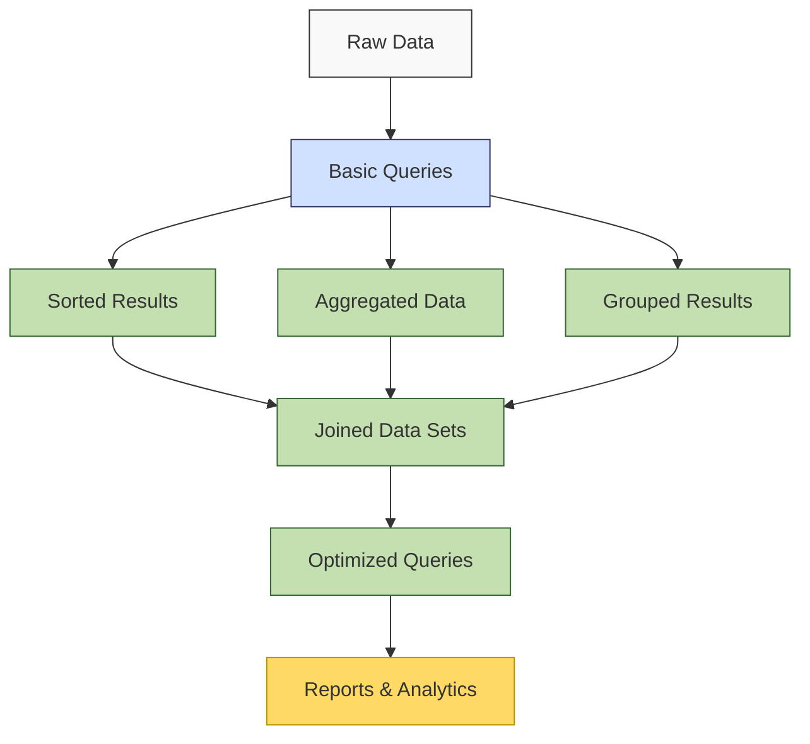

**Complexity: Easy (E)**

## 12.0 Introduction: Advancing Your SQL Knowledge

In Chapter 11, we learned the fundamentals of SQL and created a basic database schema. Now we'll build on those foundations to explore more powerful SQL capabilities that let us organize, summarize, and combine data in ways that reveal deeper insights.

As a data engineer, these advanced query capabilities are essential for creating reports, building analytical dashboards, and transforming raw data into actionable information. They form the bridge between basic data storage and sophisticated data analysis.

Let's visualize how these concepts fit into the data engineering workflow:



This chapter introduces five critical capabilities that will significantly expand your SQL toolkit:

1. **Sorting results** with ORDER BY to organize data logically
2. **Aggregation functions** like COUNT, SUM and AVG to summarize data
3. **Grouping data** with GROUP BY to segment and analyze subsets
4. **Joining tables** to combine related data from different sources
5. **Indexing** to improve query performance

By the end of this chapter, you'll be able to write SQL queries that not only retrieve data but transform and analyze it to answer complex business questions.

## 12.1 Sorting Results with ORDER BY

When querying data, the order of results matters. ORDER BY lets you control how your results are sorted, making reports more readable and allowing for ranking-style queries.

### 12.1.1 Basic Sorting

Let's start by creating some sample data to work with:

```sql
-- Create a tasks table if it doesn't exist (already done in Chapter 11)
CREATE TABLE IF NOT EXISTS tasks (
  task_id INTEGER PRIMARY KEY,
  title TEXT NOT NULL,
  priority INTEGER DEFAULT 3,
  status TEXT DEFAULT 'Not Started',
  due_date TEXT,
  created_at TEXT DEFAULT CURRENT_TIMESTAMP
);

-- Insert some sample tasks
INSERT INTO tasks (task_id, title, priority, status, due_date)
VALUES
  (1, 'Complete project proposal', 1, 'In Progress', '2023-05-15'),
  (2, 'Review marketing materials', 2, 'Not Started', '2023-05-20'),
  (3, 'Fix login page bug', 1, 'In Progress', '2023-05-10'),
  (4, 'Update documentation', 3, 'Not Started', '2023-05-30'),
  (5, 'Prepare monthly report', 2, 'Not Started', '2023-05-31');

-- Let's see the data we've created
SELECT * FROM tasks;
```

Output:

```
task_id | title                   | priority | status      | due_date   | created_at
--------|-------------------------|----------|-------------|------------|-------------------
1       | Complete project proposal | 1      | In Progress | 2023-05-15 | 2023-05-01 10:00:00
2       | Review marketing materials | 2    | Not Started | 2023-05-20 | 2023-05-01 10:00:00
3       | Fix login page bug      | 1        | In Progress | 2023-05-10 | 2023-05-01 10:00:00
4       | Update documentation    | 3        | Not Started | 2023-05-30 | 2023-05-01 10:00:00
5       | Prepare monthly report  | 2        | Not Started | 2023-05-31 | 2023-05-01 10:00:00
```

Now, let's sort the tasks by their due dates:

```sql
-- Sort tasks by due date (earliest first)
SELECT task_id, title, due_date
FROM tasks
ORDER BY due_date;
```

Output:

```
task_id | title                   | due_date
--------|-------------------------|------------
3       | Fix login page bug      | 2023-05-10
1       | Complete project proposal | 2023-05-15
2       | Review marketing materials | 2023-05-20
4       | Update documentation    | 2023-05-30
5       | Prepare monthly report  | 2023-05-31
```

### 12.1.2 Sorting in Descending Order

By default, ORDER BY sorts in ascending order (A to Z, low to high). You can reverse this with DESC:

```sql
-- Sort tasks by priority (highest priority first)
SELECT task_id, title, priority
FROM tasks
ORDER BY priority DESC;
```

Output:

```
task_id | title                   | priority
--------|-------------------------|----------
4       | Update documentation    | 3
2       | Review marketing materials | 2
5       | Prepare monthly report  | 2
1       | Complete project proposal | 1
3       | Fix login page bug      | 1
```

### 12.1.3 Sorting by Multiple Columns

You can sort by multiple columns, creating a hierarchical order:

```sql
-- Sort by status (alphabetically) and then by priority (highest first)
SELECT task_id, title, status, priority
FROM tasks
ORDER BY status, priority DESC;
```

Output:

```
task_id | title                   | status      | priority
--------|-------------------------|-------------|----------
1       | Complete project proposal | In Progress | 1
3       | Fix login page bug      | In Progress | 1
4       | Update documentation    | Not Started | 3
2       | Review marketing materials | Not Started | 2
5       | Prepare monthly report  | Not Started | 2
```

### 12.1.4 Practical Application: Finding Urgent Tasks

Let's create a query to identify the most urgent tasks:

```sql
-- Find urgent tasks: high priority + closest due date
SELECT task_id, title, priority, due_date
FROM tasks
WHERE status != 'Completed'
ORDER BY priority, due_date;
```

Output:

```
task_id | title                   | priority | due_date
--------|-------------------------|----------|------------
3       | Fix login page bug      | 1        | 2023-05-10
1       | Complete project proposal | 1      | 2023-05-15
2       | Review marketing materials | 2    | 2023-05-20
5       | Prepare monthly report  | 2        | 2023-05-31
4       | Update documentation    | 3        | 2023-05-30
```

## 12.2 Aggregation Functions

Aggregation functions allow you to perform calculations on sets of rows, reducing many values to a single summary value. These are essential for data analysis and reporting.

### 12.2.1 COUNT: Counting Rows

The COUNT function counts the number of rows that match your query:

```sql
-- Count all tasks
SELECT COUNT(*) AS total_tasks FROM tasks;
```

Output:

```
total_tasks
-----------
5
```

Counting with conditions:

```sql
-- Count tasks by status
SELECT status, COUNT(*) AS task_count
FROM tasks
GROUP BY status;
```

Output:

```
status      | task_count
------------|------------
In Progress | 2
Not Started | 3
```

### 12.2.2 SUM: Adding Values

The SUM function adds up numeric values:

```sql
-- Let's add a completed_tasks table for more interesting examples
CREATE TABLE IF NOT EXISTS completed_tasks (
  task_id INTEGER PRIMARY KEY,
  title TEXT NOT NULL,
  hours_spent REAL,
  completion_date TEXT DEFAULT CURRENT_TIMESTAMP
);

-- Insert some completed tasks
INSERT INTO completed_tasks (task_id, title, hours_spent, completion_date)
VALUES
  (101, 'Database design', 4.5, '2023-04-28'),
  (102, 'API implementation', 12.0, '2023-04-29'),
  (103, 'User testing', 6.5, '2023-04-30'),
  (104, 'Bug fixes iteration 1', 3.0, '2023-05-01'),
  (105, 'Documentation update', 2.0, '2023-05-01');

-- Calculate total hours spent
SELECT SUM(hours_spent) AS total_hours
FROM completed_tasks;
```

Output:

```
total_hours
-----------
28.0
```

### 12.2.3 AVG: Calculating Averages

The AVG function calculates the mean value:

```sql
-- Calculate average hours spent per task
SELECT AVG(hours_spent) AS avg_hours_per_task
FROM completed_tasks;
```

Output:

```
avg_hours_per_task
------------------
5.6
```

### 12.2.4 MIN and MAX: Finding Extreme Values

The MIN and MAX functions find the smallest and largest values:

```sql
-- Find earliest and latest completion dates
SELECT
  MIN(completion_date) AS earliest_completion,
  MAX(completion_date) AS latest_completion
FROM completed_tasks;
```

Output:

```
earliest_completion | latest_completion
--------------------|------------------
2023-04-28          | 2023-05-01
```

### 12.2.5 Combining Multiple Aggregations

You can use multiple aggregation functions in the same query:

```sql
-- Get a comprehensive summary of completed tasks
SELECT
  COUNT(*) AS total_tasks,
  SUM(hours_spent) AS total_hours,
  AVG(hours_spent) AS avg_hours,
  MIN(hours_spent) AS min_hours,
  MAX(hours_spent) AS max_hours
FROM completed_tasks;
```

Output:

```
total_tasks | total_hours | avg_hours | min_hours | max_hours
------------|-------------|-----------|-----------|----------
5           | 28.0        | 5.6       | 2.0       | 12.0
```

## 12.3 Grouping Data with GROUP BY

The GROUP BY clause segments your data into groups based on column values, allowing you to perform aggregations on each group separately.

### 12.3.1 Basic Grouping

Let's see how to group data:

```sql
-- Let's create a tasks_with_categories table for better examples
CREATE TABLE IF NOT EXISTS tasks_with_categories (
  task_id INTEGER PRIMARY KEY,
  title TEXT NOT NULL,
  category TEXT,
  status TEXT,
  hours_spent REAL
);

-- Insert sample tasks with categories
INSERT INTO tasks_with_categories (task_id, title, category, status, hours_spent)
VALUES
  (1, 'Design database schema', 'Backend', 'Completed', 3.5),
  (2, 'Implement login API', 'Backend', 'Completed', 5.0),
  (3, 'Create homepage mockup', 'Frontend', 'Completed', 4.0),
  (4, 'Implement user dashboard', 'Frontend', 'In Progress', 6.0),
  (5, 'Setup CI/CD pipeline', 'DevOps', 'In Progress', 4.5),
  (6, 'Configure production server', 'DevOps', 'Not Started', 0.0),
  (7, 'Security audit', 'Security', 'Not Started', 0.0),
  (8, 'Database indexing', 'Backend', 'Not Started', 0.0);

-- Group tasks by category and count
SELECT
  category,
  COUNT(*) AS task_count
FROM tasks_with_categories
GROUP BY category;
```

Output:

```
category  | task_count
----------|------------
Backend   | 3
DevOps    | 2
Frontend  | 2
Security  | 1
```

### 12.3.2 Grouping with Aggregations

Grouping truly shines when combined with aggregation functions:

```sql
-- Calculate hours spent by category
SELECT
  category,
  SUM(hours_spent) AS total_hours,
  AVG(hours_spent) AS avg_hours_per_task
FROM tasks_with_categories
GROUP BY category;
```

Output:

```
category  | total_hours | avg_hours_per_task
----------|-------------|-------------------
Backend   | 8.5         | 2.83
DevOps    | 4.5         | 2.25
Frontend  | 10.0        | 5.0
Security  | 0.0         | 0.0
```

### 12.3.3 Filtering Groups with HAVING

While WHERE filters rows before grouping, HAVING filters the groups themselves:

```sql
-- Find categories with more than 2 tasks
SELECT
  category,
  COUNT(*) AS task_count
FROM tasks_with_categories
GROUP BY category
HAVING COUNT(*) > 2;
```

Output:

```
category  | task_count
----------|------------
Backend   | 3
```

### 12.3.4 Complex Grouping Example

Let's combine grouping with other clauses for a more complex analysis:

```sql
-- Analyze task completion by category
SELECT
  category,
  status,
  COUNT(*) AS task_count,
  SUM(hours_spent) AS total_hours
FROM tasks_with_categories
GROUP BY category, status
ORDER BY category,
  CASE
    WHEN status = 'Completed' THEN 1
    WHEN status = 'In Progress' THEN 2
    ELSE 3
  END;
```

Output:

```
category  | status      | task_count | total_hours
----------|-------------|------------|------------
Backend   | Completed   | 2          | 8.5
Backend   | Not Started | 1          | 0.0
DevOps    | In Progress | 1          | 4.5
DevOps    | Not Started | 1          | 0.0
Frontend  | Completed   | 1          | 4.0
Frontend  | In Progress | 1          | 6.0
Security  | Not Started | 1          | 0.0
```

## 12.4 Basic Joins

Joins allow you to combine data from multiple tables based on related columns. This is a fundamental concept in relational databases.

### 12.4.1 Setting Up Related Tables

Let's create some related tables to demonstrate joins:

```sql
-- Create users table
CREATE TABLE IF NOT EXISTS users (
  user_id INTEGER PRIMARY KEY,
  username TEXT NOT NULL,
  email TEXT,
  department TEXT
);

-- Create assignments table (linking users and tasks)
CREATE TABLE IF NOT EXISTS assignments (
  assignment_id INTEGER PRIMARY KEY,
  task_id INTEGER,
  user_id INTEGER,
  assigned_date TEXT DEFAULT CURRENT_TIMESTAMP,
  FOREIGN KEY (task_id) REFERENCES tasks(task_id),
  FOREIGN KEY (user_id) REFERENCES users(user_id)
);

-- Insert sample users
INSERT INTO users (user_id, username, email, department)
VALUES
  (1, 'alice', 'alice@example.com', 'Engineering'),
  (2, 'bob', 'bob@example.com', 'Product'),
  (3, 'charlie', 'charlie@example.com', 'Engineering'),
  (4, 'diana', 'diana@example.com', 'Marketing');

-- Insert task assignments
INSERT INTO assignments (assignment_id, task_id, user_id, assigned_date)
VALUES
  (1, 1, 1, '2023-05-01'),  -- Alice assigned to task 1
  (2, 2, 4, '2023-05-01'),  -- Diana assigned to task 2
  (3, 3, 3, '2023-05-02'),  -- Charlie assigned to task 3
  (4, 4, 2, '2023-05-02'),  -- Bob assigned to task 4
  (5, 5, 1, '2023-05-03');  -- Alice assigned to task 5
```

### 12.4.2 INNER JOIN: Matching Rows in Both Tables

An INNER JOIN returns only the rows where there's a match in both tables:

```sql
-- Find which users are assigned to which tasks
SELECT
  t.task_id,
  t.title,
  u.username,
  u.department
FROM tasks t
INNER JOIN assignments a ON t.task_id = a.task_id
INNER JOIN users u ON a.user_id = u.user_id;
```

Output:

```
task_id | title                   | username | department
--------|-------------------------|----------|------------
1       | Complete project proposal | alice  | Engineering
2       | Review marketing materials | diana | Marketing
3       | Fix login page bug      | charlie | Engineering
4       | Update documentation    | bob     | Product
5       | Prepare monthly report  | alice   | Engineering
```

### 12.4.3 LEFT JOIN: Including All Rows from the Left Table

A LEFT JOIN includes all rows from the left table, even if there's no match in the right table:

```sql
-- Add a task without an assignment
INSERT INTO tasks (task_id, title, priority, status, due_date)
VALUES (6, 'Plan team event', 3, 'Not Started', '2023-06-15');

-- Find all tasks and their assignees (if any)
SELECT
  t.task_id,
  t.title,
  COALESCE(u.username, 'Unassigned') AS assignee
FROM tasks t
LEFT JOIN assignments a ON t.task_id = a.task_id
LEFT JOIN users u ON a.user_id = u.user_id;
```

Output:

```
task_id | title                   | assignee
--------|-------------------------|----------
1       | Complete project proposal | alice
2       | Review marketing materials | diana
3       | Fix login page bug      | charlie
4       | Update documentation    | bob
5       | Prepare monthly report  | alice
6       | Plan team event         | Unassigned
```

### 12.4.4 Joining with Aggregations

Joins can be combined with aggregations for powerful analysis:

```sql
-- Find number of tasks assigned to each user
SELECT
  u.username,
  COUNT(a.task_id) AS assigned_tasks
FROM users u
LEFT JOIN assignments a ON u.user_id = a.user_id
GROUP BY u.username
ORDER BY assigned_tasks DESC;
```

Output:

```
username | assigned_tasks
---------|---------------
alice    | 2
bob      | 1
charlie  | 1
diana    | 1
```

### 12.4.5 Self Joins: Joining a Table to Itself

Self joins are useful for hierarchical data:

```sql
-- Create employees table with manager relationships
CREATE TABLE IF NOT EXISTS employees (
  employee_id INTEGER PRIMARY KEY,
  name TEXT NOT NULL,
  manager_id INTEGER,
  FOREIGN KEY (manager_id) REFERENCES employees(employee_id)
);

-- Insert sample employee data
INSERT INTO employees (employee_id, name, manager_id)
VALUES
  (1, 'John (CEO)', NULL),       -- CEO has no manager
  (2, 'Sarah (CTO)', 1),         -- Sarah reports to John
  (3, 'Michael (CFO)', 1),       -- Michael reports to John
  (4, 'Emily (Engineering)', 2),  -- Emily reports to Sarah
  (5, 'David (Design)', 2),      -- David reports to Sarah
  (6, 'Maria (Finance)', 3);     -- Maria reports to Michael

-- Find employees and their managers using a self join
SELECT
  e.name AS employee,
  COALESCE(m.name, 'No Manager') AS manager
FROM employees e
LEFT JOIN employees m ON e.manager_id = m.employee_id;
```

Output:

```
employee           | manager
-------------------|----------
John (CEO)         | No Manager
Sarah (CTO)        | John (CEO)
Michael (CFO)      | John (CEO)
Emily (Engineering) | Sarah (CTO)
David (Design)     | Sarah (CTO)
Maria (Finance)    | Michael (CFO)
```

## 12.5 Basic Indexing Concepts

Indexes improve query performance by creating efficient lookup structures, similar to a book's index.

### 12.5.1 Understanding Indexes

```sql
-- Let's create a larger table to demonstrate indexing
CREATE TABLE IF NOT EXISTS logs (
  log_id INTEGER PRIMARY KEY,
  timestamp TEXT,
  level TEXT,
  message TEXT
);

-- Generate sample log data
-- For demonstration, we'll insert fewer rows than in production
INSERT INTO logs (timestamp, level, message)
SELECT
  datetime('2023-05-01', '+' || rowid || ' minutes'),
  CASE (rowid % 4)
    WHEN 0 THEN 'ERROR'
    WHEN 1 THEN 'WARNING'
    WHEN 2 THEN 'INFO'
    ELSE 'DEBUG'
  END,
  'Log message #' || rowid
FROM (SELECT rowid FROM sqlite_master UNION SELECT 1 UNION SELECT 2 ORDER BY 1 LIMIT 100);

-- Check our log data
SELECT * FROM logs LIMIT 5;
```

Output:

```
log_id | timestamp           | level   | message
-------|---------------------|---------|-------------
1      | 2023-05-01 00:01:00 | WARNING | Log message #1
2      | 2023-05-01 00:02:00 | INFO    | Log message #2
3      | 2023-05-01 00:03:00 | DEBUG   | Log message #3
4      | 2023-05-01 00:04:00 | ERROR   | Log message #4
5      | 2023-05-01 00:05:00 | WARNING | Log message #5
```

### 12.5.2 Creating an Index

Let's create an index on the level column to speed up filtering:

```sql
-- Create an index on the level column
CREATE INDEX idx_logs_level ON logs(level);

-- This query will now use the index
SELECT COUNT(*)
FROM logs
WHERE level = 'ERROR';
```

Output:

```
COUNT(*)
--------
25
```

### 12.5.3 When to Use Indexes

Indexes are most beneficial:

1. On columns used frequently in WHERE clauses
2. On columns used in JOIN conditions
3. On columns used in ORDER BY and GROUP BY

However, indexes come with trade-offs:

1. They increase storage space
2. They slow down INSERT, UPDATE, and DELETE operations
3. They need to be maintained as data changes

### 12.5.4 Examining Index Use

In SQLite, you can see if a query uses an index with the EXPLAIN QUERY PLAN command:

```sql
-- See if the index is being used
EXPLAIN QUERY PLAN
SELECT *
FROM logs
WHERE level = 'ERROR';
```

Output:

```
QUERY PLAN
-------------------------------------------------
SEARCH TABLE logs USING INDEX idx_logs_level (level=?)
```

### 12.5.5 Composite Indexes for Multiple Columns

Indexes can span multiple columns for queries that filter on multiple conditions:

```sql
-- Create a composite index on level and timestamp
CREATE INDEX idx_logs_level_timestamp ON logs(level, timestamp);

-- This query can now use the composite index
EXPLAIN QUERY PLAN
SELECT *
FROM logs
WHERE level = 'ERROR'
AND timestamp > '2023-05-01 12:00:00';
```

Output:

```
QUERY PLAN
-----------------------------------------------------------------
SEARCH TABLE logs USING INDEX idx_logs_level_timestamp (level=? AND timestamp>?)
```

## 12.6 Micro-Project: Task Analytics Database

Now that we've learned these advanced SQL concepts, let's apply them to a more comprehensive project. We'll extend our task tracking database with additional tables and implement more sophisticated queries.

### Project Requirements

In this micro-project, you will:

1. Extend the task tracker database with additional tables (users, tags, time tracking)
2. Add columns for priority levels, due dates, and time estimates
3. Create views for common query patterns
4. Write advanced SQL queries using joins, aggregations, and filtering
5. Implement queries that answer specific business questions
6. Add appropriate indexes to support efficient querying

### Acceptance Criteria

- Schema is extended with at least 2 new tables with proper relationships
- At least 5 advanced SQL queries are implemented, including:
  - A query using multiple joins across at least 3 tables
  - An aggregation query with GROUP BY and HAVING clauses
  - A query that uses subqueries or common table expressions
  - A query that incorporates date/time functions
  - A query that demonstrates advanced filtering conditions
- Each query answers a specific, practical business question (documented)
- At least 1 view is created to simplify a complex query
- Appropriate indexes are added to optimize query performance
- Documentation explains the purpose of each query and expected results

### Common Pitfalls to Avoid

1. **Incorrectly implemented joins**:

   - Problem: Creating Cartesian products by forgetting join conditions
   - Solution: Always specify the join condition with ON clauses

2. **GROUP BY errors**:

   - Problem: Missing columns in GROUP BY that appear in SELECT
   - Solution: Include all non-aggregated columns from SELECT in GROUP BY

3. **Inefficient indexing**:

   - Problem: Creating indexes without considering query patterns
   - Solution: Only index columns used in WHERE, JOIN, ORDER BY, and GROUP BY

4. **Poor query performance**:
   - Problem: Writing complex queries without considering execution plan
   - Solution: Use EXPLAIN QUERY PLAN to understand how queries are executed

### Implementation

Let's implement our extended task analytics database:

```sql
-- Create the extended schema

-- 1. Tasks table (extended from previous version)
CREATE TABLE IF NOT EXISTS tasks (
  task_id INTEGER PRIMARY KEY,
  title TEXT NOT NULL,
  description TEXT,
  priority INTEGER CHECK(priority BETWEEN 1 AND 5) DEFAULT 3,
  status TEXT DEFAULT 'Not Started',
  due_date TEXT,
  estimated_hours REAL,
  created_at TEXT DEFAULT CURRENT_TIMESTAMP
);

-- 2. Users table
CREATE TABLE IF NOT EXISTS users (
  user_id INTEGER PRIMARY KEY,
  username TEXT NOT NULL,
  email TEXT UNIQUE,
  department TEXT,
  joined_date TEXT DEFAULT CURRENT_TIMESTAMP
);

-- 3. Tags table
CREATE TABLE IF NOT EXISTS tags (
  tag_id INTEGER PRIMARY KEY,
  name TEXT NOT NULL UNIQUE
);

-- 4. Task-Tag relationship (many-to-many)
CREATE TABLE IF NOT EXISTS task_tags (
  task_id INTEGER,
  tag_id INTEGER,
  PRIMARY KEY (task_id, tag_id),
  FOREIGN KEY (task_id) REFERENCES tasks(task_id),
  FOREIGN KEY (tag_id) REFERENCES tags(tag_id)
);

-- 5. Assignments table (linking users and tasks)
CREATE TABLE IF NOT EXISTS assignments (
  assignment_id INTEGER PRIMARY KEY,
  task_id INTEGER,
  user_id INTEGER,
  assigned_date TEXT DEFAULT CURRENT_TIMESTAMP,
  FOREIGN KEY (task_id) REFERENCES tasks(task_id),
  FOREIGN KEY (user_id) REFERENCES users(user_id)
);

-- 6. Time tracking table
CREATE TABLE IF NOT EXISTS time_entries (
  entry_id INTEGER PRIMARY KEY,
  task_id INTEGER,
  user_id INTEGER,
  hours_spent REAL CHECK(hours_spent > 0),
  work_date TEXT,
  notes TEXT,
  FOREIGN KEY (task_id) REFERENCES tasks(task_id),
  FOREIGN KEY (user_id) REFERENCES users(user_id)
);

-- Insert sample data

-- Users
INSERT INTO users (user_id, username, email, department, joined_date)
VALUES
  (1, 'alice', 'alice@example.com', 'Engineering', '2022-01-15'),
  (2, 'bob', 'bob@example.com', 'Product', '2022-02-20'),
  (3, 'charlie', 'charlie@example.com', 'Engineering', '2022-03-10'),
  (4, 'diana', 'diana@example.com', 'Marketing', '2022-04-05'),
  (5, 'edward', 'edward@example.com', 'Engineering', '2022-05-12');

-- Tasks
INSERT INTO tasks (task_id, title, description, priority, status, due_date, estimated_hours)
VALUES
  (1, 'Implement login page', 'Create user authentication flow', 2, 'In Progress', '2023-05-15', 8.0),
  (2, 'Design database schema', 'Create ERD and SQL scripts', 1, 'Completed', '2023-05-10', 4.0),
  (3, 'Quarterly marketing report', 'Analyze Q1 campaign performance', 2, 'Not Started', '2023-05-20', 6.0),
  (4, 'API documentation', 'Document REST API endpoints', 3, 'Not Started', '2023-05-25', 5.0),
  (5, 'Fix payment bug', 'Address checkout issues', 1, 'In Progress', '2023-05-12', 3.0),
  (6, 'User research interviews', 'Conduct 5 user interviews', 2, 'Not Started', '2023-05-30', 10.0),
  (7, 'Security audit', 'Review security protocols', 1, 'Not Started', '2023-06-15', 12.0),
  (8, 'Performance optimization', 'Improve dashboard loading time', 2, 'Not Started', '2023-06-01', 6.0);

-- Tags
INSERT INTO tags (tag_id, name)
VALUES
  (1, 'Frontend'),
  (2, 'Backend'),
  (3, 'Documentation'),
  (4, 'Bug'),
  (5, 'Feature'),
  (6, 'Research'),
  (7, 'Security'),
  (8, 'Performance');

-- Task-Tag relationships
INSERT INTO task_tags (task_id, tag_id)
VALUES
  (1, 1), (1, 5),  -- Login page: Frontend, Feature
  (2, 2),          -- Database schema: Backend
  (3, 6),          -- Marketing report: Research
  (4, 3),          -- API documentation: Documentation
  (5, 2), (5, 4),  -- Payment bug: Backend, Bug
  (6, 6),          -- User interviews: Research
  (7, 7),          -- Security audit: Security
  (8, 2), (8, 8);  -- Performance optimization: Backend, Performance

-- Assignments
INSERT INTO assignments (assignment_id, task_id, user_id, assigned_date)
VALUES
  (1, 1, 1, '2023-05-01'),  -- Alice: Login page
  (2, 2, 3, '2023-05-01'),  -- Charlie: Database schema
  (3, 3, 4, '2023-05-02'),  -- Diana: Marketing report
  (4, 4, 2, '2023-05-02'),  -- Bob: API documentation
  (5, 5, 3, '2023-05-03'),  -- Charlie: Payment bug
  (6, 6, 4, '2023-05-05'),  -- Diana: User interviews
  (7, 7, 5, '2023-05-07'),  -- Edward: Security audit
  (8, 8, 1, '2023-05-08');  -- Alice: Performance optimization

-- Time entries
INSERT INTO time_entries (entry_id, task_id, user_id, hours_spent, work_date, notes)
VALUES
  (1, 1, 1, 3.5, '2023-05-02', 'Started UI implementation'),
  (2, 1, 1, 2.0, '2023-05-03', 'Continued frontend work'),
  (3, 2, 3, 4.0, '2023-05-01', 'Completed database design'),
  (4, 3, 4, 1.5, '2023-05-03', 'Collected data for report'),
  (5, 4, 2, 2.0, '2023-05-04', 'Documented GET endpoints'),
  (6, 5, 3, 1.0, '2023-05-03', 'Investigated bug cause'),
  (7, 5, 3, 1.5, '2023-05-04', 'Fixed payment processing issue'),
  (8, 1, 1, 1.5, '2023-05-04', 'Added form validation');

-- Add appropriate indexes
CREATE INDEX idx_tasks_status ON tasks(status);
CREATE INDEX idx_tasks_priority ON tasks(priority);
CREATE INDEX idx_tasks_due_date ON tasks(due_date);
CREATE INDEX idx_time_entries_task_user ON time_entries(task_id, user_id);
CREATE INDEX idx_task_tags_tag_id ON task_tags(tag_id);
CREATE INDEX idx_assignments_user_id ON assignments(user_id);

-- Let's verify our data
SELECT 'Tasks:', COUNT(*) FROM tasks
UNION ALL
SELECT 'Users:', COUNT(*) FROM users
UNION ALL
SELECT 'Tags:', COUNT(*) FROM tags
UNION ALL
SELECT 'Task-Tag Links:', COUNT(*) FROM task_tags
UNION ALL
SELECT 'Assignments:', COUNT(*) FROM assignments
UNION ALL
SELECT 'Time Entries:', COUNT(*) FROM time_entries;
```

Output:

```
?column? | COUNT(*)
---------|----------
Tasks:   | 8
Users:   | 5
Tags:    | 8
Task-Tag Links: | 10
Assignments: | 8
Time Entries: | 8
```

Now let's implement some advanced queries:

### Query 1: Task Overview with Tags and Assignees

```sql
-- Create a view for common task information
CREATE VIEW task_details AS
SELECT
  t.task_id,
  t.title,
  t.status,
  t.priority,
  t.due_date,
  t.estimated_hours,
  u.username AS assigned_to,
  u.department,
  GROUP_CONCAT(DISTINCT tg.name) AS tags
FROM tasks t
LEFT JOIN assignments a ON t.task_id = a.task_id
LEFT JOIN users u ON a.user_id = u.user_id
LEFT JOIN task_tags tt ON t.task_id = tt.task_id
LEFT JOIN tags tg ON tt.tag_id = tg.tag_id
GROUP BY t.task_id;

-- Query the view
SELECT * FROM task_details;
```

Output:

```
task_id | title               | status      | priority | due_date   | estimated_hours | assigned_to | department  | tags
--------|---------------------|-------------|----------|------------|-----------------|-------------|-------------|----------------
1       | Implement login page | In Progress | 2        | 2023-05-15 | 8.0            | alice       | Engineering | Frontend,Feature
2       | Design database schema | Completed | 1       | 2023-05-10 | 4.0            | charlie     | Engineering | Backend
3       | Quarterly marketing report | Not Started | 2 | 2023-05-20 | 6.0          | diana       | Marketing   | Research
4       | API documentation   | Not Started | 3        | 2023-05-25 | 5.0            | bob         | Product     | Documentation
5       | Fix payment bug     | In Progress | 1        | 2023-05-12 | 3.0            | charlie     | Engineering | Backend,Bug
6       | User research interviews | Not Started | 2   | 2023-05-30 | 10.0           | diana       | Marketing   | Research
7       | Security audit      | Not Started | 1        | 2023-06-15 | 12.0           | edward      | Engineering | Security
8       | Performance optimization | Not Started | 2  | 2023-06-01 | 6.0            | alice       | Engineering | Backend,Performance
```

### Query 2: Workload Analysis by Department

```sql
-- Analyze workload distribution across departments
SELECT
  u.department,
  COUNT(DISTINCT a.task_id) AS assigned_tasks,
  SUM(t.estimated_hours) AS total_estimated_hours,
  ROUND(AVG(t.priority), 1) AS avg_priority,
  COUNT(DISTINCT CASE WHEN t.status = 'Completed' THEN t.task_id END) AS completed_tasks,
  COUNT(DISTINCT CASE WHEN t.status = 'In Progress' THEN t.task_id END) AS in_progress_tasks,
  COUNT(DISTINCT CASE WHEN t.status = 'Not Started' THEN t.task_id END) AS not_started_tasks
FROM users u
LEFT JOIN assignments a ON u.user_id = a.user_id
LEFT JOIN tasks t ON a.task_id = t.task_id
GROUP BY u.department
HAVING assigned_tasks > 0
ORDER BY total_estimated_hours DESC;
```

Output:

```
department  | assigned_tasks | total_estimated_hours | avg_priority | completed_tasks | in_progress_tasks | not_started_tasks
------------|----------------|----------------------|--------------|-----------------|-------------------|------------------
Engineering | 4              | 21.0                 | 1.5          | 1               | 2                 | 1
Marketing   | 2              | 16.0                 | 2.0          | 0               | 0                 | 2
Product     | 1              | 5.0                  | 3.0          | 0               | 0                 | 1
```

### Query 3: Identifying Upcoming Critical Tasks

```sql
-- Find critical tasks due in the next week
SELECT
  td.task_id,
  td.title,
  td.status,
  td.due_date,
  td.assigned_to,
  td.priority,
  td.tags
FROM task_details td
WHERE td.status != 'Completed'
AND td.due_date <= date('now', '+7 days')
AND td.priority <= 2
ORDER BY td.priority, td.due_date;
```

Output (assuming today is 2023-05-08):

```
task_id | title           | status      | due_date   | assigned_to | priority | tags
--------|-----------------|-------------|------------|-------------|----------|---------------
5       | Fix payment bug | In Progress | 2023-05-12 | charlie     | 1        | Backend,Bug
1       | Implement login page | In Progress | 2023-05-15 | alice    | 2        | Frontend,Feature
```

### Query 4: Progress Tracking with Time Spent Analysis

```sql
-- Compare estimated vs. actual hours for tasks
WITH task_time_summary AS (
  SELECT
    t.task_id,
    t.title,
    t.estimated_hours,
    COALESCE(SUM(te.hours_spent), 0) AS actual_hours_spent,
    COUNT(DISTINCT te.entry_id) AS time_entries
  FROM tasks t
  LEFT JOIN time_entries te ON t.task_id = te.task_id
  GROUP BY t.task_id
)

SELECT
  tts.task_id,
  tts.title,
  tts.estimated_hours,
  tts.actual_hours_spent,
  ROUND(tts.actual_hours_spent / NULLIF(tts.estimated_hours, 0) * 100, 1) AS percentage_complete,
  tts.time_entries,
  CASE
    WHEN tts.actual_hours_spent > tts.estimated_hours THEN 'Over estimate'
    WHEN tts.actual_hours_spent = tts.estimated_hours THEN 'On target'
    WHEN tts.actual_hours_spent >= 0.8 * tts.estimated_hours THEN 'Near completion'
    WHEN tts.actual_hours_spent > 0 THEN 'In progress'
    ELSE 'Not started'
  END AS progress_status
FROM task_time_summary tts
ORDER BY percentage_complete DESC NULLS LAST;
```

Output:

```
task_id | title               | estimated_hours | actual_hours_spent | percentage_complete | time_entries | progress_status
--------|---------------------|-----------------|--------------------|--------------------|--------------|----------------
2       | Design database schema | 4.0          | 4.0                | 100.0              | 1            | On target
5       | Fix payment bug     | 3.0             | 2.5                | 83.3               | 2            | Near completion
1       | Implement login page | 8.0            | 7.0                | 87.5               | 3            | Near completion
3       | Quarterly marketing report | 6.0      | 1.5                | 25.0               | 1            | In progress
4       | API documentation   | 5.0             | 2.0                | 40.0               | 1            | In progress
6       | User research interviews | 10.0       | 0.0                | 0.0                | 0            | Not started
7       | Security audit      | 12.0            | 0.0                | 0.0                | 0            | Not started
8       | Performance optimization | 6.0        | 0.0                | 0.0                | 0            | Not started
```

### Query 5: Tag-Based Task Analysis

```sql
-- Analyze which types of tasks take the most time
SELECT
  tg.name AS tag,
  COUNT(DISTINCT tt.task_id) AS task_count,
  AVG(t.estimated_hours) AS avg_estimated_hours,
  COALESCE(SUM(te.hours_spent), 0) AS total_actual_hours,
  COUNT(DISTINCT te.entry_id) AS time_entries
FROM tags tg
LEFT JOIN task_tags tt ON tg.tag_id = tt.tag_id
LEFT JOIN tasks t ON tt.task_id = t.task_id
LEFT JOIN time_entries te ON t.task_id = te.task_id
GROUP BY tg.name
HAVING task_count > 0
ORDER BY total_actual_hours DESC;
```

Output:

```
tag          | task_count | avg_estimated_hours | total_actual_hours | time_entries
-------------|------------|---------------------|-------------------|-------------
Frontend     | 1          | 8.0                 | 7.0               | 3
Backend      | 3          | 4.33                | 6.5               | 3
Feature      | 1          | 8.0                 | 7.0               | 3
Bug          | 1          | 3.0                 | 2.5               | 2
Research     | 2          | 8.0                 | 1.5               | 1
Documentation| 1          | 5.0                 | 2.0               | 1
Security     | 1          | 12.0                | 0.0               | 0
Performance  | 1          | 6.0                 | 0.0               | 0
```

### How to Run and Test

To run and test this solution:

1. **Setup a SQLite database**:

   ```bash
   sqlite3 task_analytics.db
   ```

2. **Copy and paste the SQL commands**:
   Copy all SQL commands from the implementation section into the SQLite prompt. You can also save them in a file (e.g., `task_analytics.sql`) and run:

   ```bash
   sqlite3 task_analytics.db < task_analytics.sql
   ```

3. **Verify the schema**:

   ```sql
   .schema
   ```

4. **Execute and test each query**:

   ```sql
   -- Run the queries one by one
   SELECT * FROM task_details;
   ```

5. **Export results for reporting**:
   ```sql
   .mode csv
   .output department_workload.csv
   -- Run the department workload query
   .output stdout
   ```

For more advanced testing:

- Add more sample data to test edge cases
- Modify query parameters (like date ranges) to see different results
- Use EXPLAIN QUERY PLAN to check if your indexes are being used

## 12.7 Practice Exercises

To reinforce your understanding of the concepts in this chapter, try these exercises:

### Exercise 1: Sorting and Filtering

Write a query that finds all tasks due in the next 2 weeks, sorted by priority (highest first) and then due date (earliest first).

### Exercise 2: Aggregation

Calculate the average estimated hours per task for each priority level, and include a count of tasks at each priority level.

### Exercise 3: Grouping Data

Find the total estimated hours of work assigned to each user, broken down by task status (Completed, In Progress, Not Started).

### Exercise 4: Joins

Write a query that lists all tags, the number of tasks associated with each tag, and the username of the person assigned to the most tasks with that tag.

### Exercise 5: Advanced Query

Create a query that identifies "blocked users" - users who have been assigned tasks where all their tasks are still in "Not Started" status and at least one is past its due date.

## 12.8 Exercise Solutions

Here are the solutions to the practice exercises:

### Solution to Exercise 1: Sorting and Filtering

```sql
-- Find tasks due in the next 2 weeks, sorted by priority and due date
SELECT
  task_id,
  title,
  priority,
  due_date,
  status
FROM tasks
WHERE due_date BETWEEN date('now') AND date('now', '+14 days')
ORDER BY priority, due_date;
```

Sample Output:

```
task_id | title               | priority | due_date   | status
--------|---------------------|----------|------------|------------
5       | Fix payment bug     | 1        | 2023-05-12 | In Progress
1       | Implement login page | 2       | 2023-05-15 | In Progress
3       | Quarterly marketing report | 2  | 2023-05-20 | Not Started
4       | API documentation   | 3        | 2023-05-25 | Not Started
```

### Solution to Exercise 2: Aggregation

```sql
-- Calculate average estimated hours by priority level
SELECT
  priority,
  COUNT(*) AS task_count,
  ROUND(AVG(estimated_hours), 1) AS avg_estimated_hours,
  MIN(estimated_hours) AS min_hours,
  MAX(estimated_hours) AS max_hours
FROM tasks
GROUP BY priority
ORDER BY priority;
```

Sample Output:

```
priority | task_count | avg_estimated_hours | min_hours | max_hours
---------|------------|---------------------|-----------|----------
1        | 3          | 6.3                 | 3.0       | 12.0
2        | 4          | 7.5                 | 6.0       | 10.0
3        | 1          | 5.0                 | 5.0       | 5.0
```

### Solution to Exercise 3: Grouping Data

```sql
-- Find total estimated hours per user by task status
SELECT
  u.username,
  t.status,
  COUNT(a.task_id) AS task_count,
  SUM(t.estimated_hours) AS total_estimated_hours
FROM users u
JOIN assignments a ON u.user_id = a.user_id
JOIN tasks t ON a.task_id = t.task_id
GROUP BY u.username, t.status
ORDER BY u.username,
  CASE
    WHEN t.status = 'Completed' THEN 1
    WHEN t.status = 'In Progress' THEN 2
    ELSE 3
  END;
```

Sample Output:

```
username | status      | task_count | total_estimated_hours
---------|-------------|------------|----------------------
alice    | In Progress | 1          | 8.0
alice    | Not Started | 1          | 6.0
bob      | Not Started | 1          | 5.0
charlie  | Completed   | 1          | 4.0
charlie  | In Progress | 1          | 3.0
diana    | Not Started | 2          | 16.0
edward   | Not Started | 1          | 12.0
```

### Solution to Exercise 4: Joins

```sql
-- List tags with task counts and most frequent assignee
WITH tag_user_counts AS (
  SELECT
    tg.tag_id,
    tg.name AS tag_name,
    u.user_id,
    u.username,
    COUNT(*) AS assignment_count,
    RANK() OVER (PARTITION BY tg.tag_id ORDER BY COUNT(*) DESC) AS user_rank
  FROM tags tg
  JOIN task_tags tt ON tg.tag_id = tt.tag_id
  JOIN assignments a ON tt.task_id = a.task_id
  JOIN users u ON a.user_id = u.user_id
  GROUP BY tg.tag_id, u.user_id
)

SELECT
  tg.name AS tag,
  COUNT(tt.task_id) AS tagged_tasks,
  tuc.username AS top_assignee,
  tuc.assignment_count AS assignee_tasks
FROM tags tg
LEFT JOIN task_tags tt ON tg.tag_id = tt.tag_id
LEFT JOIN tag_user_counts tuc ON tg.tag_id = tuc.tag_id AND tuc.user_rank = 1
GROUP BY tg.tag_id
HAVING tagged_tasks > 0
ORDER BY tagged_tasks DESC;
```

Sample Output:

```
tag          | tagged_tasks | top_assignee | assignee_tasks
-------------|--------------|--------------|---------------
Backend      | 3            | charlie      | 2
Feature      | 1            | alice        | 1
Frontend     | 1            | alice        | 1
Bug          | 1            | charlie      | 1
Documentation| 1            | bob          | 1
Research     | 2            | diana        | 2
Security     | 1            | edward       | 1
Performance  | 1            | alice        | 1
```

### Solution to Exercise 5: Advanced Query

```sql
-- Find blocked users (all tasks not started, at least one past due)
WITH user_task_status AS (
  SELECT
    u.user_id,
    u.username,
    COUNT(a.task_id) AS total_tasks,
    COUNT(CASE WHEN t.status = 'Not Started' THEN 1 END) AS not_started_tasks,
    COUNT(CASE WHEN t.status = 'Not Started' AND t.due_date < date('now') THEN 1 END) AS overdue_tasks
  FROM users u
  JOIN assignments a ON u.user_id = a.user_id
  JOIN tasks t ON a.task_id = t.task_id
  GROUP BY u.user_id
)

SELECT
  username,
  total_tasks,
  overdue_tasks
FROM user_task_status
WHERE total_tasks = not_started_tasks  -- All tasks not started
AND overdue_tasks > 0                  -- At least one is overdue
ORDER BY overdue_tasks DESC;
```

Sample Output (assuming today is after May 20, 2023):

```
username | total_tasks | overdue_tasks
---------|-------------|---------------
diana    | 2           | 1
bob      | 1           | 1
```

## 12.9 Chapter Summary and Connection to Chapter 13

In this chapter, we've expanded our SQL skills by learning:

- How to **sort results** with ORDER BY to organize data meaningfully
- Using **aggregation functions** like COUNT, SUM, and AVG to summarize data
- **Grouping data** with GROUP BY to segment results for analysis
- Creating **joins** to combine data from multiple tables
- Implementing **basic indexes** to improve query performance

These advanced query capabilities transform SQL from a simple data retrieval tool into a powerful analysis platform. With these skills, you can now answer complex business questions directly in your database queries.

The core concepts of data organization, aggregation, and relationships we've explored are foundational to data engineering. They allow you to build efficient data models that support both operational needs and analytical insights.

### Looking Forward to Chapter 13

In Chapter 13, we'll connect our SQL knowledge with Python, giving us programmatic control over our database operations. You'll learn:

- How to connect Python applications to SQLite databases
- Ways to execute SQL queries from Python code
- Techniques for safely handling user inputs with parameterized queries
- Methods for processing query results in Python

The SQL skills you've built in Chapters 11 and 12 will now become even more powerful as we integrate them with Python's programming capabilities, creating a complete toolkit for data engineering.

By combining SQL's data manipulation strengths with Python's flexibility and control structures, you'll be able to build robust data pipelines that can extract, transform, and load data between systems.
