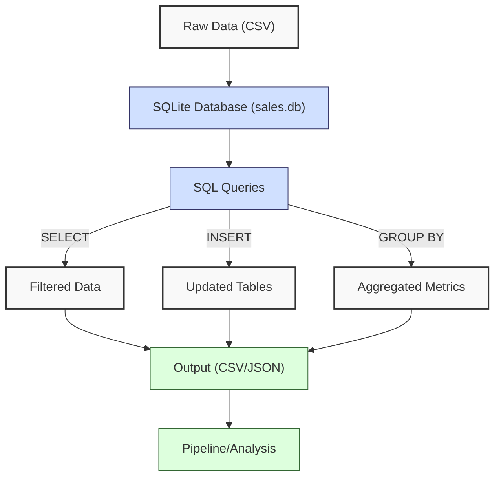
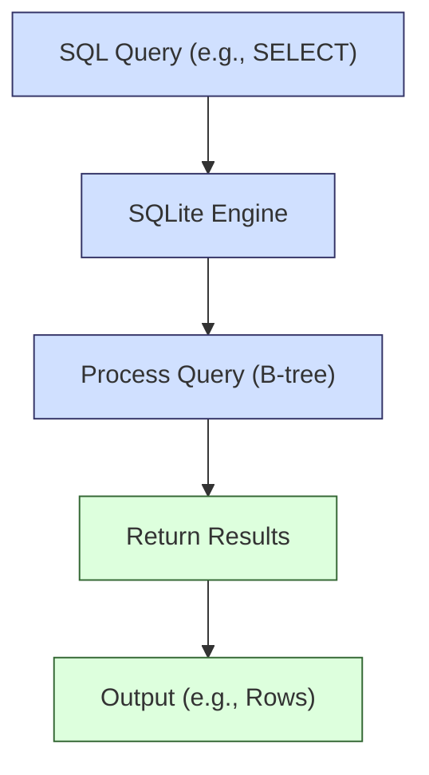
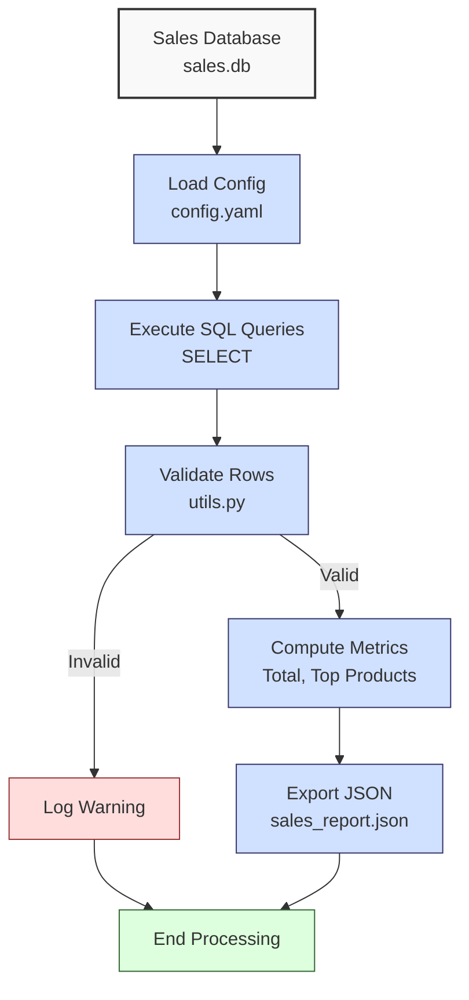

**Complexity: Easy (E)**

## 12.0 Introduction: Why This Matters for Data Engineering

Structured Query Language (SQL) is the cornerstone of data management in data engineering, enabling efficient querying and manipulation of financial transaction data for Hijra Group’s Sharia-compliant fintech analytics. For example, SQL queries enable Hijra Group to generate daily sales reports for Sharia compliance audits, supporting reviews by Sharia boards to ensure transactions meet IFSB standards by filtering product categories (e.g., Halal products) to ensure compliance in financial analytics, avoiding riba (interest). SQLite, a lightweight, serverless database, is ideal for learning SQL fundamentals due to its simplicity and zero-configuration setup, storing data in a single file (e.g., `sales.db`, ~4KB for small datasets like in Appendix 1). SQL queries offer O(log n) performance with indexes for lookups on n rows, compared to O(n) for Python loops, making it critical for scalable pipelines. This chapter builds on Chapters 1–11 (Python basics, Pandas, type safety, and testing) and introduces SQL for querying `data/sales.db`, preparing for Python-SQLite integration in Chapter 13 and PostgreSQL in Chapter 16.

This chapter avoids advanced concepts like type annotations (used from Chapter 7), Python-SQLite integration (Chapter 13), or complex joins (covered in Chapter 19) to focus on foundational skills. All code uses **PEP 8's 4-space indentation**, preferring spaces over tabs to avoid `IndentationError`, ensuring compatibility with Hijra Group’s pipeline scripts. SQLite commands are executed via the `sqlite3` command-line tool or Python’s `sqlite3` module for testing, with queries written in uppercase per SQL convention for readability.

### Data Engineering Workflow Context

This diagram illustrates SQL’s role in a data engineering pipeline:



### Building On and Preparing For

- **Building On**:
  - Chapter 1: Uses Python loops and lists to process data, now replaced with SQL queries for efficiency.
  - Chapter 3: Leverages Pandas DataFrame filtering and grouping, now performed with SQL `WHERE` and `GROUP BY`.
  - Chapter 9: Applies testing concepts for query validation, though without `pytest` (introduced later).
  - Chapter 11: Ensures code quality with modular scripts, reused for SQL execution.
- **Preparing For**:
  - Chapter 13: Prepares for Python-SQLite integration using `sqlite3` module.
  - Chapter 14: Lays groundwork for advanced SQLite operations (transactions, views).
  - Chapter 15: Enables type-safe database programming.
  - Chapter 19: Supports advanced SQL querying (joins, subqueries).

### What You’ll Learn

This chapter covers:

1. **SQLite Basics**: Database setup and table creation.
2. **SQL Queries**: SELECT, INSERT, UPDATE, DELETE for data manipulation.
3. **Filtering**: WHERE clause for conditional queries.
4. **Aggregation**: GROUP BY and COUNT for metrics.
5. **Testing Queries**: Validating results with Python scripts.
6. **Micro-Project**: A SQL tool to query `data/sales.db` for sales analytics.

By the end, you’ll build a tested SQL tool to query `data/sales.db`, producing a JSON report of sales metrics, using 4-space indentation per PEP 8. The micro-project leverages `sales.db` (Appendix 1) and tests edge cases, ensuring robust data retrieval for Hijra Group’s analytics.

**Follow-Along Tips**:

- Create `de-onboarding/data/` and populate with `sales.db` per Appendix 1.
- Install SQLite: Verify with `sqlite3 --version`.
- Install libraries: `pip install pyyaml` (for config parsing).
- Use `sqlite3` command-line tool or Python’s `sqlite3` module for queries.
- If `IndentationError`, use **4 spaces** per PEP 8. Run `python -tt script.py`.
- Use print statements (e.g., `print(rows)`) to debug query results.
- Save outputs to `data/` (e.g., `sales_report.json`).
- Verify file paths with `ls data/` (Unix/macOS) or `dir data\` (Windows).
- Use UTF-8 encoding for all files to avoid `UnicodeDecodeError`.

## 12.1 SQLite Basics

SQLite is a serverless, file-based relational database, storing data in tables with rows and columns. The `sales.db` (Appendix 1) contains a `sales` table with columns `product` (TEXT), `price` (REAL), `quantity` (INTEGER), using ~4KB for 3 rows. SQLite supports O(log n) lookups with indexes and O(1) row inserts without constraints.

### 12.1.1 Setting Up SQLite

Create and inspect `sales.db` using the `sqlite3` command-line tool.

```bash
# Navigate to de-onboarding/
cd de-onboarding

# Create sales.db (if not already created per Appendix 1)
sqlite3 data/sales.db

# Inside sqlite3 prompt
sqlite> CREATE TABLE IF NOT EXISTS sales (
   ...>     product TEXT,
   ...>     price REAL,
   ...>     quantity INTEGER
   ...> );
sqlite> INSERT INTO sales (product, price, quantity) VALUES
   ...>     ('Halal Laptop', 999.99, 2),
   ...>     ('Halal Mouse', 24.99, 10),
   ...>     ('Halal Keyboard', 49.99, 5);
sqlite> .tables
sales
sqlite> .schema sales
CREATE TABLE sales (
    product TEXT,
    price REAL,
    quantity INTEGER
);
sqlite> SELECT * FROM sales;
Halal Laptop|999.99|2
Halal Mouse|24.99|10
Halal Keyboard|49.99|5
sqlite> .exit
```

**Follow-Along Instructions**:

1. Ensure `de-onboarding/data/` exists.
2. Install SQLite: `sqlite3 --version` (pre-installed on most systems).
3. Run commands above in terminal.
4. Verify table has 3 rows with `SELECT COUNT(*) FROM sales;`.
5. **Common Errors**:
   - **sqlite3: not found**: Install SQLite (e.g., `sudo apt install sqlite3` on Ubuntu).
   - **Database locked**: Close other SQLite connections. Check with `lsof data/sales.db`.
   - **Syntax error**: Ensure SQL commands end with `;`. Print query to debug.

**Key Points**:

- **Table Creation**: `CREATE TABLE` defines schema with data types (TEXT, REAL, INTEGER).
- **Data Insertion**: `INSERT INTO` adds rows.
- **Inspection**: `.tables` lists tables, `.schema` shows structure.
- **Underlying Implementation**: SQLite stores data in a B-tree, enabling O(log n) lookups with indexes (Chapter 20). Tables are stored in a single file (`sales.db`), with minimal overhead (~4KB for small datasets).
- **Performance Considerations**:
  - **Time Complexity**: O(1) for inserts (no indexes), O(n) for full scans.
  - **Space Complexity**: O(n) for n rows (~4KB for 3 rows with TEXT/REAL/INTEGER).
  - **Implication**: SQLite is ideal for small-scale analytics in Hijra Group’s pipelines.

## 12.2 SQL Queries

SQL queries manipulate data using `SELECT`, `INSERT`, `UPDATE`, and `DELETE`.

- Note: Transactions (Chapter 14) ensure data consistency for `INSERT`/`UPDATE` operations but are excluded here to focus on single-query operations.
- Note: Subqueries (Chapter 19) enable nested queries but are excluded here to focus on basic operations.

This diagram illustrates the flow of a `SELECT` query:



### 12.2.1 SELECT Syntax

Retrieve data with `SELECT`.

```sql
-- Select all columns
SELECT * FROM sales;

-- Select specific columns
SELECT product, price FROM sales;

-- Expected Output (in sqlite3):
-- Halal Laptop|999.99
-- Halal Mouse|24.99
-- Halal Keyboard|49.99
```

**Follow-Along Instructions**:

1. Open `sqlite3 data/sales.db`.
2. Run queries above.
3. Verify output matches expected.
4. **Common Errors**:
   - **no such column**: Check column names with `.schema sales`.
   - **syntax error**: Ensure commas between columns and semicolon at end.

**Key Points**:

- `SELECT *`: Retrieves all columns.
- `SELECT column1, column2`: Retrieves specific columns.
- **Time Complexity**: O(n) for full table scan.
- **Space Complexity**: O(k) for k returned rows.
- **Implication**: Efficient for retrieving sales data for reports.

### 12.2.2 INSERT Syntax

Add data with `INSERT`.

```sql
-- Insert a single row
INSERT INTO sales (product, price, quantity) VALUES ('Halal Monitor', 199.99, 3);

-- Verify insertion
SELECT * FROM sales WHERE product = 'Halal Monitor';

-- Expected Output:
-- Halal Monitor|199.99|3
```

**Follow-Along Instructions**:

1. Open `sqlite3 data/sales.db`.
2. Run `INSERT` and `SELECT` queries.
3. Verify new row appears.
4. **Common Errors**:
   - **datatype mismatch**: Ensure `price` is REAL (float), `quantity` is INTEGER. Print `.schema sales`.
   - **syntax error**: Check parentheses and commas.

**Key Points**:

- `INSERT INTO`: Adds rows with specified values.
- **Time Complexity**: O(1) for inserts (no indexes).
- **Space Complexity**: O(1) per row.
- **Implication**: Useful for adding new sales records.

### 12.2.3 UPDATE Syntax

Modify data with `UPDATE`.

```sql
-- Update price for Halal Mouse
UPDATE sales SET price = 29.99 WHERE product = 'Halal Mouse';

-- Verify update
SELECT * FROM sales WHERE product = 'Halal Mouse';

-- Expected Output:
-- Halal Mouse|29.99|10
```

**Follow-Along Instructions**:

1. Open `sqlite3 data/sales.db`.
2. Run `UPDATE` and `SELECT` queries.
3. Verify price is updated.
4. **Common Errors**:
   - **no rows affected**: Ensure `WHERE` condition matches rows. Run `SELECT * FROM sales` to check.
   - **syntax error**: Check `SET` syntax and semicolon.

**Key Points**:

- `UPDATE`: Modifies existing rows based on `WHERE`.
- **Time Complexity**: O(n) for scan, O(log n) with indexes.
- **Space Complexity**: O(1) for updates.
- **Implication**: Corrects pricing errors in sales data.

### 12.2.4 DELETE Syntax

Remove data with `DELETE`.

```sql
-- Delete rows with quantity > 5
DELETE FROM sales WHERE quantity > 5;

-- Verify deletion
SELECT * FROM sales;

-- Expected Output:
-- Halal Laptop|999.99|2
-- Halal Keyboard|49.99|5
```

**Follow-Along Instructions**:

1. Open `sqlite3 data/sales.db`.
2. Run `DELETE` and `SELECT` queries.
3. Verify `Halal Mouse` (quantity 10) is removed.
4. **Common Errors**:
   - **no rows affected**: Check `WHERE` condition. Run `SELECT quantity FROM sales`.
   - **syntax error**: Ensure `WHERE` clause is correct.

**Key Points**:

- `DELETE`: Removes rows based on `WHERE`.
- **Time Complexity**: O(n) for scan, O(log n) with indexes.
- **Space Complexity**: O(1) for deletions.
- **Implication**: Removes invalid sales records.

## 12.3 Filtering with WHERE

Filter data using `WHERE` for conditions.

```sql
-- Filter high-value sales
SELECT product, price, quantity
FROM sales
WHERE price > 100;

-- Expected Output:
-- Halal Laptop|999.99|2
```

**Follow-Along Instructions**:

1. Open `sqlite3 data/sales.db`.
2. Run query above.
3. Verify output shows only `Halal Laptop`.
4. **Common Errors**:
   - **no rows returned**: Check condition. Run `SELECT price FROM sales`.
   - **syntax error**: Ensure `WHERE` syntax (e.g., no quotes for numbers).

**Key Points**:

- `WHERE`: Filters rows based on conditions (e.g., `price > 100`, `product = 'Halal Laptop'`).
- Operators: `=`, `>`, `<`, `>=`, `<=`, `!=`, `LIKE`, `IN`.
- Note: Indexes (Chapter 20) can reduce WHERE’s time complexity to O(log n), but are excluded here to focus on basic filtering.
- **Time Complexity**: O(n) for scan, O(log n) with indexes.
- **Space Complexity**: O(k) for k matching rows.
- **Implication**: Filters Sharia-compliant products for analytics.

## 12.4 Aggregation with GROUP BY

Aggregate data using `GROUP BY` and functions like `COUNT`, `SUM`.

```sql
-- Count sales by product
SELECT product, COUNT(*) AS sale_count
FROM sales
GROUP BY product;

-- Expected Output:
-- Halal Laptop|1
-- Halal Mouse|1
-- Halal Keyboard|1
```

**Follow-Along Instructions**:

1. Open `sqlite3 data/sales.db`.
2. Run query above.
3. Verify output shows counts per product.
4. Optional: Visualize GROUP BY results as a text-based bar chart (e.g., Halal Laptop: \*_\*\* for sale_count=4) using asterisks. Print asterisks proportional to counts (e.g., sale_count _ 2 asterisks) for exploration, ensuring it fits the session.
5. **Common Errors**:
   - **non-aggregated column**: Ensure non-grouped columns are aggregated. Check query syntax.
   - **syntax error**: Verify `GROUP BY` column exists.

**Key Points**:

- `GROUP BY`: Groups rows by column values.
- `COUNT(*)`: Counts rows per group.
- `SUM(column)`: Sums column values (e.g., `SUM(quantity)`).
- **Time Complexity**: O(n) for grouping n rows.
- **Space Complexity**: O(k) for k groups.
- **Implication**: Summarizes sales metrics for reports.

## 12.5 Testing Queries

Validate queries using Python’s `sqlite3` module (no type annotations or `pytest`).

```python
# File: de-onboarding/test_queries.py
import sqlite3  # For SQLite access

# Connect to database
conn = sqlite3.connect("data/sales.db")  # Open database
cursor = conn.cursor()  # Create cursor

# Test SELECT query
cursor.execute("SELECT product, price FROM sales WHERE price > 100")  # Run query
rows = cursor.fetchall()  # Fetch results
print("High-value sales:", rows)  # Debug
if len(rows) == 1 and rows[0][0] == "Halal Laptop":  # Validate
    print("SELECT test passed")  # Confirm
else:
    print("SELECT test failed")  # Report failure

# Close connection
conn.close()  # Close database

# Expected Output:
# High-value sales: [('Halal Laptop', 999.99)]
# SELECT test passed
```

**Follow-Along Instructions**:

1. Save as `de-onboarding/test_queries.py`.
2. Ensure `data/sales.db` exists per Appendix 1.
3. Configure editor for 4-space indentation per PEP 8.
4. Run: `python test_queries.py`.
5. Verify output confirms test passed.
6. Optional: Use `EXPLAIN QUERY PLAN` (e.g., `EXPLAIN QUERY PLAN SELECT * FROM sales WHERE price > 100;`) in `sqlite3` to debug query performance, preparing for Chapter 20’s optimization.
7. Optional: Run `sqlite3 data/sales.db .dump` in terminal to inspect sales.db’s schema and data, aiding debugging without requiring code changes.
8. Note: Manual validation (e.g., checking `len(rows)`) will transition to automated `pytest` tests in Chapter 9, enhancing testing scalability.
9. Note: pytest (Chapter 9) is avoided to maintain simplicity of manual validation, focusing on basic sqlite3 usage.
10. Note: Type annotations (Chapter 7) are avoided to maintain simplicity, focusing on basic Python and sqlite3 usage.
11. **Common Errors**:
    - **OperationalError**: Check database path. Print `data/sales.db`.
    - **IndentationError**: Use 4 spaces. Run `python -tt test_queries.py`.

**Key Points**:

- `sqlite3.connect()`: Opens database.
- `cursor.execute()`: Runs SQL queries.
- `fetchall()`: Retrieves results as list of tuples.
- **Time Complexity**: O(n) for query execution.
- **Space Complexity**: O(k) for k returned rows.
- **Implication**: Validates query accuracy for pipeline reliability.

## 12.5.1 Summary of SQL Fundamentals

This section summarized SQLite setup (database and table creation), basic SQL queries (`SELECT`, `INSERT`, `UPDATE`, `DELETE`), filtering with `WHERE`, aggregation with `GROUP BY`, and query testing with Python’s `sqlite3` module. These skills enable efficient data manipulation for Hijra Group’s analytics, preparing for programmatic integration in Chapter 13.

## 12.6 Micro-Project: Sales Database Query Tool

### Project Requirements

Build a SQL-based tool to query `data/sales.db` for Hijra Group’s sales analytics, producing a JSON report with total sales, unique products, and top products. The tool supports Hijra Group’s transaction reporting, ensuring compliance with IFSB standards by filtering Halal products:

- Query `sales` table for valid records (price > 10, quantity ≤ 100, product starts with “Halal”).
- Compute total sales (`price * quantity`), unique products, and top 3 products by sales.
- Export results to `data/sales_report.json`.
- Log steps and invalid records using print statements.
- Use Python’s `sqlite3` module for query execution (no type annotations).
- Use `utils.py` from Chapter 3 for validation.
- Use 4-space indentation per PEP 8, preferring spaces over tabs.
- Test edge cases (e.g., empty table, invalid data).

### Sample Input

`data/sales.db` (from Appendix 1):

```sql
-- Schema
CREATE TABLE sales (
    product TEXT,
    price REAL,
    quantity INTEGER
);

-- Data
INSERT INTO sales (product, price, quantity) VALUES
    ('Halal Laptop', 999.99, 2),
    ('Halal Mouse', 24.99, 10),
    ('Halal Keyboard', 49.99, 5);
```

`data/config.yaml` (from Appendix 1):

```yaml
min_price: 10.0
max_quantity: 100
required_fields:
  - product
  - price
  - quantity
product_prefix: 'Halal'
max_decimals: 2
```

### Data Processing Flow



### Acceptance Criteria

- **Go Criteria**:
  - Connects to `sales.db` and reads `config.yaml`.
  - Queries valid records (price > 10, quantity ≤ 100, Halal products).
  - Computes total sales, unique products, and top 3 products.
  - Exports results to `data/sales_report.json`.
  - Logs steps and invalid records.
  - Uses 4-space indentation per PEP 8.
  - Passes edge case tests (empty table, invalid data).
- **No-Go Criteria**:
  - Fails to connect to `sales.db` or read `config.yaml`.
  - Incorrect query results or calculations.
  - Missing JSON export.
  - Uses type annotations or try/except.
  - Inconsistent indentation.

### Common Pitfalls to Avoid

1. **Database Connection Failure**:
   - **Problem**: `OperationalError` due to missing `sales.db`.
   - **Solution**: Ensure `data/sales.db` exists. Print path with `print(db_path)`.
2. **Query Syntax Errors**:
   - **Problem**: `sqlite3.OperationalError` from incorrect SQL.
   - **Solution**: Print query with `print(query)`. Validate with `sqlite3 data/sales.db`.
3. **Validation Errors**:
   - **Problem**: Invalid rows not filtered.
   - **Solution**: Use `utils.validate_sale`. Print rows before filtering.
4. **JSON Export Failure**:
   - **Problem**: `PermissionError` when writing `sales_report.json`.
   - **Solution**: Check write permissions with `ls -l data/`. Print `json_path`.
5. **IndentationError**:
   - **Problem**: Mixed spaces/tabs.
   - **Solution**: Use 4 spaces per PEP 8. Run `python -tt sales_query.py`.
6. **Empty Query Results**:
   - **Problem**: `fetchall()` returns `[]` if no rows match.
   - **Solution**: Run `SELECT COUNT(*) FROM sales` in `sqlite3` to verify data presence. Print `rows` before validation.

### How This Differs from Production

In production, this solution would include:

- **Error Handling**: Avoids try/except (introduced in Chapter 7) to maintain simplicity, using basic conditionals instead.
- **Resource Management**: Avoids context managers (with statements, introduced in Chapter 13) for file and database handling, using manual open/close instead.
- **Type Safety**: Type annotations with Pyright (Chapter 15).
- **Testing**: Unit tests with `pytest` (Chapter 9).
- **Pipeline Testing**: Manual validation in `test_queries.py` will be extended by automated data pipeline testing (Chapter 42) for production-grade reliability.
- **Scalability**: SQLite’s single-file storage is limited for large datasets; PostgreSQL’s client-server model (Chapter 16) supports enterprise-scale analytics. Indexes for large datasets (Chapter 20).
- **Deployment**: Kubernetes (Chapter 61) will enable scalable SQLite deployments, supporting production-grade analytics.
- **Logging**: File-based logging (Chapter 52).
- **Integration**: Python-SQLite integration for automation (Chapter 13).

### Implementation

```python
# File: de-onboarding/utils.py (from Chapter 3, reused)
def is_numeric(s, max_decimals=2):  # Check if string is a decimal number
    """Check if string is a decimal number with up to max_decimals."""
    parts = s.split(".")  # Split on decimal point
    if len(parts) != 2 or not parts[0].isdigit() or not parts[1].isdigit():
        return False  # Invalid format
    return len(parts[1]) <= max_decimals  # Check decimal places

def clean_string(s):  # Clean string by stripping whitespace
    """Strip whitespace from string."""
    return s.strip()

def is_numeric_value(x):  # Check if value is numeric
    """Check if value is an integer or float."""
    return isinstance(x, (int, float))  # Return True for numeric types

def has_valid_decimals(x, max_decimals):  # Check decimal places
    """Check if value has valid decimal places."""
    return is_numeric(str(x), max_decimals)  # Use is_numeric for validation

def apply_valid_decimals(x, max_decimals):  # Apply decimal validation
    """Apply has_valid_decimals to a value."""
    return has_valid_decimals(x, max_decimals)

def is_integer(x):  # Check if value is an integer
    """Check if value is an integer when converted to string."""
    return str(x).isdigit()  # Return True for integer strings

# Note: Converts price/quantity to strings for consistency with Chapter 3’s string-based validation. In production, numeric validation could use SQLite’s type system (e.g., isinstance(row[1], float)).
def validate_sale(sale, config):  # Validate a sale dictionary
    """Validate sale based on config rules."""
    required_fields = config["required_fields"]  # Get required fields
    min_price = config["min_price"]  # Get minimum price
    max_quantity = config["max_quantity"]  # Get maximum quantity
    prefix = config["product_prefix"]  # Get product prefix
    max_decimals = config["max_decimals"]  # Get max decimal places

    print(f"Validating sale: {sale}")  # Debug: print sale
    # Empty string checks are sufficient for sales.db; in production, None checks (e.g., sale[field] is None) could enhance robustness.
    for field in required_fields:  # Loop through required fields
        if not sale[field] or sale[field].strip() == "":  # Check if field is empty
            print(f"Invalid sale: missing {field}: {sale}")  # Log invalid
            return False

    # Validate product: non-empty and matches prefix
    product = clean_string(sale["product"])  # Clean product string
    if not product.startswith(prefix):  # Check prefix
        print(f"Invalid sale: product lacks '{prefix}' prefix: {sale}")  # Log invalid
        return False

    # Validate price: numeric, meets minimum, and positive
    price = str(sale["price"])  # Convert to string
    if not is_numeric(price, max_decimals) or float(price) < min_price or float(price) <= 0:  # Check format, value
        print(f"Invalid sale: invalid price: {sale}")  # Log invalid
        return False

    # Validate quantity: integer and within limit
    quantity = str(sale["quantity"])  # Convert to string
    if not quantity.isdigit() or int(quantity) > max_quantity:  # Check format and limit
        print(f"Invalid sale: invalid quantity: {sale}")  # Log invalid
        return False

    return True  # Return True if all checks pass

# File: de-onboarding/sales_query.py
import sqlite3  # For SQLite access
import yaml  # For YAML parsing
import json  # For JSON export
import utils  # Import utils module

# Define function to read YAML configuration
def read_config(config_path):  # Takes config file path
    """Read YAML configuration."""
    print(f"Opening config: {config_path}")  # Debug: print path
    file = open(config_path, "r")  # Open YAML
    # Assumes valid YAML; debug malformed config.yaml by printing file contents (e.g., print(open(config_path).read())).
    config = yaml.safe_load(file)  # Parse YAML
    file.close()  # Close file
    print(f"Loaded config: {config}")  # Debug: print config
    return config  # Return config dictionary

# Define function to query sales data
def query_sales(db_path, config):  # Takes database path and config
    """Query sales data and validate."""
    # Modular design prepares for integration with FastAPI endpoints (Chapter 53).
    print(f"Connecting to database: {db_path}")  # Debug
    conn = sqlite3.connect(db_path)  # Open database
    cursor = conn.cursor()  # Create cursor

    # Query all sales
    query = """
    SELECT product, price, quantity
    FROM sales
    WHERE price > ? AND quantity <= ? AND product LIKE ?
    """
    cursor.execute(query, (config["min_price"], config["max_quantity"], config["product_prefix"] + "%"))  # Run query
    rows = cursor.fetchall()  # Fetch results
    print("Raw query results:", rows)  # Debug

    # Validate rows
    valid_sales = []  # Store valid sales
    total_records = len(rows)  # Count total records
    for row in rows:  # Loop through rows
        sale = {
            "product": row[0],
            "price": str(row[1]),  # Convert to string for validation
            "quantity": str(row[2])  # Convert to string for validation
        }
        if utils.validate_sale(sale, config):  # Validate sale
            valid_sales.append({
                "product": row[0],
                "price": float(row[1]),  # Convert back to float
                "quantity": int(row[2]),  # Convert back to int
                "amount": float(row[1]) * int(row[2])  # Compute amount
            })

    conn.close()  # Close database
    print("Valid sales:", valid_sales)  # Debug
    return valid_sales, total_records  # Return valid sales and count

# Define function to process sales data
def process_sales(sales, config):  # Takes sales list and config
    """Process sales: compute total and top products."""
    if not sales:  # Check for empty sales
        print("No valid sales data")  # Debug
        return {"total_sales": 0.0, "unique_products": [], "top_products": {}}, 0

    # Compute metrics
    total_sales = 0.0  # Initialize total
    products = set()  # Store unique products
    product_sales = {}  # Store sales by product
    for sale in sales:  # Loop through sales
        amount = sale["amount"]  # Get amount
        total_sales += amount  # Add to total
        products.add(sale["product"])  # Add product
        product_sales[sale["product"]] = product_sales.get(sale["product"], 0) + amount  # Sum sales

    # Get top 3 products
    top_products = dict(sorted(product_sales.items(), key=lambda x: x[1], reverse=True)[:3])

    valid_sales_count = len(sales)  # Count valid sales
    print(f"Valid sales: {valid_sales_count} records")  # Debug
    return {
        "total_sales": total_sales,
        "unique_products": list(products),
        "top_products": top_products
    }, valid_sales_count  # Return results and count

# Define function to export results
def export_results(results, json_path):  # Takes results and file path
    """Export results to JSON."""
    print(f"Writing to: {json_path}")  # Debug: print path
    print(f"Results: {results}")  # Debug: print results
    file = open(json_path, "w")  # Open JSON file
    json.dump(results, file, indent=2)  # Write JSON
    file.close()  # Close file
    print(f"Exported results to {json_path}")  # Confirm export

# Define main function
def main():  # No parameters
    """Main function to query sales data."""
    db_path = "data/sales.db"  # Database path
    config_path = "data/config.yaml"  # YAML path
    json_path = "data/sales_report.json"  # JSON output path

    config = read_config(config_path)  # Read config
    sales, total_records = query_sales(db_path, config)  # Query sales
    results, valid_sales = process_sales(sales, config)  # Process
    export_results(results, json_path)  # Export results

    # Print ASCII table for visual clarity; no external libraries used
    # Fixed width (20 chars) may truncate long product names, but sufficient for sales.db’s data (e.g., "Halal Laptop"). Rounding to 2 decimals ensures consistent display; production may adjust precision.
    print("\nSales Report (Table):")
    print("-" * 40)
    print(f"{'Product':<20} {'Sales ($)':>15}")
    print("-" * 40)
    for product, amount in results["top_products"].items():
        print(f"{product:<20} {round(amount, 2):>15}")
    print("-" * 40)

    # Output report
    print("\nSales Report (Details):")  # Print header
    print(f"Total Records Processed: {total_records}")  # Total records
    print(f"Valid Sales: {valid_sales}")  # Valid count
    print(f"Invalid Sales: {total_records - valid_sales}")  # Invalid count
    print(f"Total Sales: ${round(results['total_sales'], 2)}")  # Total sales
    print(f"Unique Products: {results['unique_products']}")  # Products
    print(f"Top Products: {results['top_products']}")  # Top products
    print("Processing completed")  # Confirm completion

if __name__ == "__main__":
    main()  # Run main function
```

### Expected Outputs

`data/sales_report.json`:

```json
{
  "total_sales": 2499.83,
  "unique_products": ["Halal Laptop", "Halal Mouse", "Halal Keyboard"],
  "top_products": {
    "Halal Laptop": 1999.98,
    "Halal Mouse": 249.9,
    "Halal Keyboard": 249.95
  }
}
```

**Console Output (abridged)**:

```
Opening config: data/config.yaml
Loaded config: {'min_price': 10.0, 'max_quantity': 100, 'required_fields': ['product', 'price', 'quantity'], 'product_prefix': 'Halal', 'max_decimals': 2}
Connecting to database: data/sales.db
Raw query results: [('Halal Laptop', 999.99, 2), ('Halal Mouse', 24.99, 10), ('Halal Keyboard', 49.99, 5)]
Validating sale: {'product': 'Halal Laptop', 'price': '999.99', 'quantity': '2'}
Validating sale: {'product': 'Halal Mouse', 'price': '24.99', 'quantity': '10'}
Validating sale: {'product': 'Halal Keyboard', 'price': '49.99', 'quantity': '5'}
Valid sales: [{'product': 'Halal Laptop', 'price': 999.99, 'quantity': 2, 'amount': 1999.98}, ...]
Valid sales: 3 records
Writing to: data/sales_report.json
Exported results to data/sales_report.json

Sales Report (Table):
----------------------------------------
Product                 Sales ($)
----------------------------------------
Halal Laptop             1999.98
Halal Mouse               249.90
Halal Keyboard            249.95
----------------------------------------

Sales Report (Details):
Total Records Processed: 3
Valid Sales: 3
Invalid Sales: 0
Total Sales: $2499.83
Unique Products: ['Halal Laptop', 'Halal Mouse', 'Halal Keyboard']
Top Products: {'Halal Laptop': 1999.98, 'Halal Mouse': 249.9, 'Halal Keyboard': 249.95}
Processing completed
```

### How to Run and Test

#### Setup Instructions

- **Setup Checklist**:
  - [ ] Create `de-onboarding/data/` directory.
  - [ ] Save `sales.db` and `config.yaml` per Appendix 1.
  - [ ] Install libraries: `pip install pyyaml`.
  - [ ] Verify SQLite version supports LIKE and parameterized queries: `sqlite3 --version` (requires SQLite 3.5.0+, typically pre-installed; newer versions like 3.40.0 may offer minor performance improvements).
  - [ ] Create virtual environment: `python -m venv venv`, activate (Windows: `venv\Scripts\activate`, Unix: `source venv/bin/activate`).
  - [ ] Verify Python 3.10+: `python --version`.
  - [ ] Configure editor for 4-space indentation per PEP 8.
  - [ ] Save `utils.py` and `sales_query.py` in `de-onboarding/`.
- **Troubleshooting**:
  - If `OperationalError`, check `sales.db` path with `print(db_path)`.
  - If `ModuleNotFoundError`, install `pyyaml` or check `utils.py`.
  - If `IndentationError`, use 4 spaces. Run `python -tt sales_query.py`.
  - If `UnicodeDecodeError`, ensure UTF-8 encoding for `config.yaml`.
  - If `yaml.YAMLError`, print `print(open(config_path).read())` to inspect YAML.

#### Execution Steps

- Open terminal in `de-onboarding/`.
- Run: `python sales_query.py`.
- Outputs: `data/sales_report.json`, console output with ASCII table.

#### Test Scenarios

1. **Valid Data**: Verify `sales_report.json` shows `total_sales: 2499.83`, correct top products. Check ASCII table displays correctly.
2. **Empty Table**:
   ```python
   conn = sqlite3.connect("data/sales.db")
   cursor = conn.cursor()
   cursor.execute("DELETE FROM sales")  # Clear table
   conn.commit()
   conn.close()
   main()  # Run main
   # Expected: {'total_sales': 0.0, 'unique_products': [], 'top_products': {}}, 0
   ```
3. **Invalid Data**:
   ```python
   conn = sqlite3.connect("data/sales.db")
   cursor = conn.cursor()
   cursor.execute("INSERT INTO sales (product, price, quantity) VALUES (?, ?, ?)",
                  ("Non-Halal", 5.00, 150))
   conn.commit()
   conn.close()
   main()  # Run main
   # Expected: Excludes Non-Halal row
   ```

## 12.7 Practice Exercises

- **Optional Peer Review**: After completing Exercise 6, exchange answers with a peer to discuss SQL vs. Python efficiency, fostering collaborative learning. Ensure discussions fit within the session.

### Exercise 1: SELECT Query

Write a SQL query to select products with quantity > 5 from `sales.db`.

**Expected Output** (in `sqlite3`):

```
Halal Mouse|24.99|10
```

**Follow-Along Instructions**:

1. Open `sqlite3 data/sales.db`.
2. Run: `SELECT * FROM sales WHERE quantity > 5;`.
3. Verify output matches expected.
4. **How to Test**:
   - Check row count: `SELECT COUNT(*) FROM sales WHERE quantity > 5;`.
5. **Common Errors**:
   - **syntax error**: Ensure semicolon at end of query. Run query in `sqlite3` to verify.
   - **no rows returned**: Check condition with `SELECT quantity FROM sales`.

### Exercise 2: INSERT Query

Write a SQL query to insert a new sale into `sales.db`.

**Sample Input**:

```sql
INSERT INTO sales (product, price, quantity) VALUES ('Halal Monitor', 199.99, 3);
```

**Expected Output** (in `sqlite3`):

```
Halal Monitor|199.99|3
```

**Follow-Along Instructions**:

1. Open `sqlite3 data/sales.db`.
2. Run `INSERT` and `SELECT * FROM sales WHERE product = 'Halal Monitor';`.
3. Verify new row appears.
4. **How to Test**:
   - Check insertion: `SELECT COUNT(*) FROM sales;`.
5. **Common Errors**:
   - **datatype mismatch**: Ensure `price` is REAL (float), `quantity` is INTEGER. Print `.schema sales`.
   - **syntax error**: Check parentheses and commas in `INSERT`.

### Exercise 3: UPDATE Query

Write a SQL query to update prices < 30 to 30.00 in `sales.db`.

**Expected Output** (in `sqlite3`):

```
Halal Mouse|30.00|10
```

**Follow-Along Instructions**:

1. Open `sqlite3 data/sales.db`.
2. Run: `UPDATE sales SET price = 30.00 WHERE price < 30;`.
3. Verify with `SELECT * FROM sales WHERE product = 'Halal Mouse';`.
4. **How to Test**:
   - Check updates: `SELECT COUNT(*) FROM sales WHERE price = 30.00;`.
5. **Common Errors**:
   - **no rows affected**: Ensure `WHERE` condition matches rows. Run `SELECT * FROM sales`.
   - **syntax error**: Check `SET` syntax and semicolon.

### Exercise 4: GROUP BY Query

Write a SQL query to count sales by product in `sales.db`.

**Expected Output** (in `sqlite3`):

```
Halal Laptop|1
Halal Mouse|1
Halal Keyboard|1
```

**Follow-Along Instructions**:

1. Open `sqlite3 data/sales.db`.
2. Run: `SELECT product, COUNT(*) AS sale_count FROM sales GROUP BY product;`.
3. Verify output matches expected.
4. **How to Test**:
   - Check groups: `SELECT DISTINCT product FROM sales;`.
5. **Common Errors**:
   - **non-aggregated column**: Ensure non-grouped columns are aggregated. Check query syntax.
   - **syntax error**: Verify `GROUP BY` column exists with `.schema sales`.

### Exercise 5: Debug a SQL Query Bug

Fix this buggy query that returns incorrect counts.

**Buggy Query**:

```sql
SELECT product, COUNT(price) AS sale_count
FROM sales
GROUP BY product;
```

**Expected Output** (in `sqlite3`):

```
Halal Laptop|1
Halal Mouse|1
Halal Keyboard|1
```

**Follow-Along Instructions**:

1. Open `sqlite3 data/sales.db`.
2. Run buggy query and note results.
3. Fix to `SELECT product, COUNT(*) AS sale_count FROM sales GROUP BY product;`.
4. Verify output matches expected.
5. **How to Test**:
   - Compare counts with `SELECT product FROM sales;`.
6. **Common Errors**:
   - **non-aggregated column**: Use `COUNT(*)` to count all rows, not `COUNT(price)`.
   - **syntax error**: Ensure `GROUP BY` syntax is correct.

### Exercise 6: Conceptual Analysis of SQL vs. Python Filtering

Explain why SQL’s `WHERE` clause is faster than Python loops for filtering large datasets, referencing B-tree indexing.

**Expected Output** (written explanation):

```
SQL’s WHERE clause uses B-tree indexing (O(log n) for lookups with indexes, covered in Chapter 20) compared to Python loops (O(n) for linear scans), making it faster for large datasets like Hijra Group’s transaction data.
```

**Follow-Along Instructions**:

1. Write the explanation in a text file (e.g., `de-onboarding/ex6_concepts.txt`).
2. Verify it addresses B-tree indexing and performance.
3. **Hint**: Reference the B-tree explanation in 12.1’s “Underlying Implementation” for indexing details.
4. **How to Test**:
   - Compare with sample answer in solutions.
5. **Common Errors**:
   - **Incomplete explanation**: Ensure both SQL (B-tree) and Python (linear scan) are compared.
   - **Incorrect complexity**: Verify O(log n) for indexed lookups, O(n) for loops.

### Exercise 7: Debug a WHERE Clause Bug

Fix this buggy query that returns no rows due to an incorrect `WHERE` condition.

**Buggy Query**:

```sql
SELECT * FROM sales WHERE price > 1000;
```

**Expected Output** (in `sqlite3`):

```
Halal Laptop|999.99|2
```

**Follow-Along Instructions**:

1. Open `sqlite3 data/sales.db`.
2. Run buggy query and note no rows are returned.
3. Fix to `SELECT * FROM sales WHERE price > 100;`.
4. Verify output matches expected.
5. **Hint**: Check `sales.db`’s price range with `SELECT MAX(price) FROM sales` to diagnose the `WHERE` condition.
6. **How to Test**:
   - Check rows returned: `SELECT COUNT(*) FROM sales WHERE price > 100;`.
7. **Common Errors**:
   - **no rows returned**: Verify price range with `SELECT MAX(price) FROM sales`.
   - **syntax error**: Ensure `WHERE` condition syntax is correct.

### 12.7.1 Exercise Summary

These exercises reinforced SQL querying (`SELECT`, `INSERT`, `UPDATE`, `DELETE`), filtering (`WHERE`), aggregation (`GROUP BY`), debugging, and conceptual analysis of SQL’s efficiency, preparing for Python-SQLite integration in Chapter 13.

## 12.8 Exercise Solutions

### Solution to Exercise 1: SELECT Query

```sql
SELECT * FROM sales WHERE quantity > 5;
```

**Explanation**:

- Filters rows with `quantity > 5`, returning `Halal Mouse`.

### Solution to Exercise 2: INSERT Query

```sql
INSERT INTO sales (product, price, quantity) VALUES ('Halal Monitor', 199.99, 3);
SELECT * FROM sales WHERE product = 'Halal Monitor';
```

**Explanation**:

- Inserts new row and verifies with `SELECT`.

### Solution to Exercise 3: UPDATE Query

```sql
UPDATE sales SET price = 30.00 WHERE price < 30;
SELECT * FROM sales WHERE product = 'Halal Mouse';
```

**Explanation**:

- Updates `price` to 30.00 for rows with `price < 30`.

### Solution to Exercise 4: GROUP BY Query

```sql
SELECT product, COUNT(*) AS sale_count
FROM sales
GROUP BY product;
```

**Explanation**:

- Groups by `product` and counts rows per group.

### Solution to Exercise 5: Debug a SQL Query Bug

```sql
SELECT product, COUNT(*) AS sale_count
FROM sales
GROUP BY product;
```

**Explanation**:

- **Bug**: `COUNT(price)` counts non-null `price` values, which may exclude nulls. Fixed to `COUNT(*)` to count all rows.

### Solution to Exercise 6: Conceptual Analysis of SQL vs. Python Filtering

**Explanation** (save to `de-onboarding/ex6_concepts.txt`):

```
SQL’s WHERE clause uses B-tree indexing (O(log n) for lookups with indexes, covered in Chapter 20) compared to Python loops (O(n) for linear scans), making it faster for large datasets like Hijra Group’s transaction data.
```

### Solution to Exercise 7: Debug a WHERE Clause Bug

```sql
SELECT * FROM sales WHERE price > 100;
```

**Explanation**:

- **Bug**: `price > 1000` is too restrictive, as `sales.db`’s maximum price is 999.99 (verify with `SELECT MAX(price) FROM sales`). Fixed to `price > 100` to return high-value sales.

## 12.9 Chapter Summary and Connection to Chapter 13

In this chapter, you’ve mastered:

- **SQLite Basics**: Setting up databases and tables (O(1) inserts, ~4KB for small datasets).
- **SQL Queries**: `SELECT`, `INSERT`, `UPDATE`, `DELETE` (O(n) scans, O(log n) with indexes).
- **Filtering**: `WHERE` for conditional queries (O(n) scans).
- **Aggregation**: `GROUP BY` for metrics (O(n) grouping).
- **White-Space Sensitivity and PEP 8**: Using 4-space indentation in Python scripts, preferring spaces over tabs.

The micro-project built a SQL tool to query `data/sales.db`, producing a JSON report with sales metrics, tested for edge cases, and aligned with Hijra Group’s analytics needs. The modular functions (e.g., `query_sales`) prepare for Python-SQLite integration in Chapter 13, where `sqlite3` will automate query execution. For example, the `query_sales` function will be refactored into a Python class in Chapter 13, enhancing modularity for complex pipelines. Chapter 13’s Python-SQLite integration will enable batch processing of sales data, supporting Hijra Group’s real-time analytics needs. SQLite’s single-user limitation will be addressed by PostgreSQL’s multi-user support in Chapter 16, enabling enterprise-scale analytics. These skills will also support data mart creation in Chapter 32, enabling targeted analytics, BI dashboard creation in Chapter 51, enabling stakeholder reporting, dbt transformations in Chapter 54, enabling data transformation workflows, and will be orchestrated with Airflow in Chapter 56, enabling automated pipeline workflows for Hijra Group’s analytics.

- **Reflective Question**: How does SQL’s efficiency (e.g., O(log n) with indexes) compare to Pandas’ boolean indexing (e.g., `df[df["price"] > 100]`) from Chapter 3 for large datasets? Consider writing a brief answer in `de-onboarding/reflection.txt`.

### Connection to Chapter 13

Chapter 13 introduces **Python and SQLite Integration**, building on this chapter:

- **SQL Queries**: Extends `SELECT` to programmatic execution with `sqlite3` module, using `data/sales.csv` and `sales.db` per Appendix 1.
- **Data Validation**: Reuses `utils.py` for validation, integrating with Python logic.
- **Automation**: Automates query execution, preparing for type-safe programming in Chapter 15.
- **Fintech Context**: Supports dynamic data loading for real-time analytics, maintaining PEP 8’s 4-space indentation.
