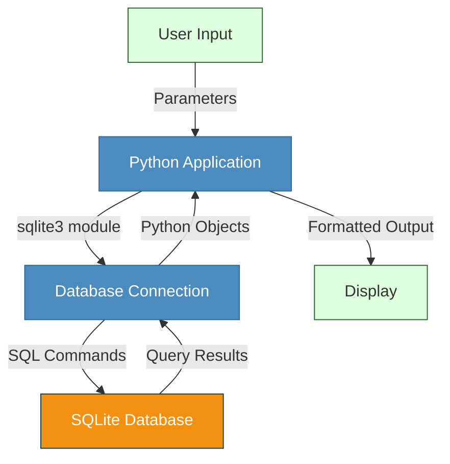

**Complexity: Easy (E)**

## 13.0 Introduction: Connecting Python to Databases

As a data engineer, much of your work involves moving data between different systems. While we've learned to work with files and APIs in previous chapters, most enterprise data is stored in databases. In this chapter, we'll take our first step into database integration by connecting Python to SQLite.

Let's see how this chapter's content fits into the data engineering workflow:



By the end of this chapter, you'll be able to:

- Connect Python applications to SQLite databases
- Execute SQL commands and process results
- Implement secure database interactions
- Build a simple data application with persistent storage

This chapter builds directly on your knowledge of SQL fundamentals from Chapters 11 and 12, combining them with your Python programming skills to create interactive database applications.

## 13.1 SQLite Characteristics and Python Integration

### 13.1.1 Why SQLite is Ideal for Learning

SQLite is a lightweight, file-based relational database that requires no separate server process. It's perfect for learning database integration because:

1. **Zero Configuration**: No server setup or administration required
2. **Self-Contained**: The entire database is stored in a single file
3. **Standard SQL**: Supports most standard SQL features
4. **Built-in Python Support**: Native integration through the `sqlite3` module
5. **Portability**: Database files can be easily shared and moved

```python
# SQLite databases are just files that can be created anywhere
database_path = "my_first_database.db"
print(f"Our SQLite database will be stored at: {database_path}")
# Our SQLite database will be stored at: my_first_database.db

# We don't need to worry about:
# - Server installation
# - User credentials
# - Network configuration
# - Port settings
# - Database server startup
```

### 13.1.2 When to Use SQLite (and When Not To)

SQLite is ideal for:

- Learning database concepts
- Application prototyping
- Small to medium applications
- Single-user scenarios
- Mobile applications
- Data analysis on local datasets

SQLite might not be suitable for:

- High-volume websites
- High-concurrency applications
- Large datasets (multi-gigabyte)
- Applications requiring advanced database features

```python
# SQLite can handle reasonably-sized datasets
print("SQLite practical limits:")
print("- Database size: Up to several terabytes (theoretical)")
print("- Practical database size: Usually < 100GB")
print("- Concurrent users: Best for 1-5")
print("- Transactions per second: Up to hundreds, not thousands")
# SQLite practical limits:
# - Database size: Up to several terabytes (theoretical)
# - Practical database size: Usually < 100GB
# - Concurrent users: Best for 1-5
# - Transactions per second: Up to hundreds, not thousands
```

## 13.2 Using the sqlite3 Module

The `sqlite3` module is part of Python's standard library, so no additional installation is needed.

### 13.2.1 Importing the Module

```python
import sqlite3

print(f"SQLite version: {sqlite3.version}")
print(f"SQLite library version: {sqlite3.sqlite_version}")
# SQLite version: 2.6.0
# SQLite library version: 3.39.5
```

### 13.2.2 Creating a Connection

The first step is to establish a connection to the database:

```python
# Connect to a database (creates the file if it doesn't exist)
connection = sqlite3.connect("example.db")
print(f"Connection established: {connection}")
# Connection established: <sqlite3.Connection object at 0x7f8a2b5f9d30>

# Don't forget to close the connection when done
connection.close()
print("Connection closed")
# Connection closed
```

### 13.2.3 Creating Tables

Let's create a simple table to store information about books:

```python
# Connect to the database
connection = sqlite3.connect("library.db")

# Create a cursor object to execute SQL commands
cursor = connection.cursor()
print(f"Cursor created: {cursor}")
# Cursor created: <sqlite3.Cursor object at 0x7f8a2b5f9e40>

# Create a table to store books
cursor.execute('''
CREATE TABLE IF NOT EXISTS books (
    id INTEGER PRIMARY KEY,
    title TEXT NOT NULL,
    author TEXT NOT NULL,
    year INTEGER,
    isbn TEXT
)
''')

# Commit the changes to the database
connection.commit()
print("Table 'books' created successfully")
# Table 'books' created successfully

# Close the connection
connection.close()
```

## 13.3 Connection Management

### 13.3.1 Understanding Connection Lifecycle

Proper connection management is crucial for database applications:

```python
# Bad practice: Not closing the connection
connection = sqlite3.connect("library.db")
cursor = connection.cursor()
cursor.execute("SELECT 1")
print("Query executed, but connection not closed!")
# Query executed, but connection not closed!

# This can lead to:
# - Resource leaks
# - Locked database files
# - Data not being saved (if no commit)
```

### 13.3.2 Using Context Managers for Connections

The recommended approach is to use Python's context manager (with statement):

```python
# Good practice: Using a context manager
with sqlite3.connect("library.db") as connection:
    cursor = connection.cursor()
    cursor.execute("SELECT sqlite_version()")
    version = cursor.fetchone()
    print(f"SQLite version from query: {version[0]}")
    # Connection will automatically close when the block exits
# SQLite version from query: 3.39.5

print("Outside the context manager, connection is closed automatically")
# Outside the context manager, connection is closed automatically
```

### 13.3.3 Connection Configuration Options

SQLite connections can be configured with various options:

```python
# Connect with additional options
with sqlite3.connect("library.db",
                     timeout=5.0,  # Wait up to 5 seconds if database is locked
                     isolation_level="DEFERRED",  # Default transaction isolation level
                     detect_types=sqlite3.PARSE_DECLTYPES  # Auto-convert data types
                     ) as connection:
    print("Connection established with custom settings")

    # Enable foreign key constraints (off by default in SQLite)
    connection.execute("PRAGMA foreign_keys = ON")
    print("Foreign key constraints enabled")
# Connection established with custom settings
# Foreign key constraints enabled
```

## 13.4 Basic Query Execution

Now let's learn how to execute different types of SQL queries from Python.

### 13.4.1 Inserting Data

```python
# Insert a single book
with sqlite3.connect("library.db") as connection:
    cursor = connection.cursor()

    # Insert one book
    cursor.execute('''
    INSERT INTO books (title, author, year, isbn)
    VALUES (?, ?, ?, ?)
    ''', ('Python Crash Course', 'Eric Matthes', 2019, '1593279280'))

    print(f"Book inserted with ID: {cursor.lastrowid}")
    connection.commit()  # Don't forget to commit changes!
# Book inserted with ID: 1
```

### 13.4.2 Inserting Multiple Records

```python
# Insert multiple books at once
with sqlite3.connect("library.db") as connection:
    cursor = connection.cursor()

    # Batch insert using executemany
    books_to_add = [
        ('Clean Code', 'Robert C. Martin', 2008, '9780132350884'),
        ('Data Science from Scratch', 'Joel Grus', 2019, '9781492041139'),
        ('Fluent Python', 'Luciano Ramalho', 2015, '9781491946008')
    ]

    cursor.executemany('''
    INSERT INTO books (title, author, year, isbn)
    VALUES (?, ?, ?, ?)
    ''', books_to_add)

    print(f"Inserted {cursor.rowcount} books")
    connection.commit()
# Inserted 3 books
```

### 13.4.3 Querying Data

```python
# Basic SELECT query
with sqlite3.connect("library.db") as connection:
    cursor = connection.cursor()

    # Execute a simple query
    cursor.execute("SELECT * FROM books")

    # Fetch all results
    books = cursor.fetchall()

    print(f"Found {len(books)} books:")
    for book in books:
        print(f"  ID: {book[0]}, Title: {book[1]}, Author: {book[2]}, Year: {book[3]}")
# Found 4 books:
#   ID: 1, Title: Python Crash Course, Author: Eric Matthes, Year: 2019
#   ID: 2, Title: Clean Code, Author: Robert C. Martin, Year: 2008
#   ID: 3, Title: Data Science from Scratch, Author: Joel Grus, Year: 2019
#   ID: 4, Title: Fluent Python, Author: Luciano Ramalho, Year: 2015
```

### 13.4.4 Working with Query Results

SQLite provides multiple ways to retrieve query results:

```python
with sqlite3.connect("library.db") as connection:
    cursor = connection.cursor()

    # Query with filtering
    cursor.execute("SELECT title, author FROM books WHERE year >= 2015")

    # Method 1: fetchone() - get one row at a time
    print("Using fetchone():")
    first_book = cursor.fetchone()
    print(f"  First book: {first_book}")

    second_book = cursor.fetchone()
    print(f"  Second book: {second_book}")

    # Method 2: fetchmany() - get a specific number of rows
    cursor.execute("SELECT title, author FROM books ORDER BY year")
    print("\nUsing fetchmany(2):")
    two_books = cursor.fetchmany(2)
    for book in two_books:
        print(f"  {book[0]} by {book[1]}")

    # Method 3: fetchall() - get all remaining rows
    print("\nUsing fetchall() for remaining books:")
    remaining_books = cursor.fetchall()
    for book in remaining_books:
        print(f"  {book[0]} by {book[1]}")
# Using fetchone():
#   First book: ('Python Crash Course', 'Eric Matthes')
#   Second book: ('Data Science from Scratch', 'Joel Grus')
#
# Using fetchmany(2):
#   Clean Code by Robert C. Martin
#   Fluent Python by Luciano Ramalho
#
# Using fetchall() for remaining books:
#   Data Science from Scratch by Joel Grus
#   Python Crash Course by Eric Matthes
```

### 13.4.5 Updating Data

```python
# Update a record
with sqlite3.connect("library.db") as connection:
    cursor = connection.cursor()

    # Update a book's publication year
    cursor.execute('''
    UPDATE books
    SET year = ?
    WHERE title = ?
    ''', (2021, 'Python Crash Course'))

    print(f"Updated {cursor.rowcount} book(s)")
    connection.commit()

    # Verify the update
    cursor.execute("SELECT title, year FROM books WHERE title = 'Python Crash Course'")
    book = cursor.fetchone()
    print(f"Updated book: {book[0]}, Year: {book[1]}")
# Updated 1 book(s)
# Updated book: Python Crash Course, Year: 2021
```

### 13.4.6 Deleting Data

```python
# Delete a record
with sqlite3.connect("library.db") as connection:
    cursor = connection.cursor()

    # Let's add a book we'll delete
    cursor.execute('''
    INSERT INTO books (title, author, year, isbn)
    VALUES (?, ?, ?, ?)
    ''', ('Book to Delete', 'Test Author', 2020, '1234567890'))
    print(f"Added book with ID: {cursor.lastrowid}")

    # Now delete the book
    cursor.execute('''
    DELETE FROM books
    WHERE title = ?
    ''', ('Book to Delete',))

    print(f"Deleted {cursor.rowcount} book(s)")
    connection.commit()
# Added book with ID: 5
# Deleted 1 book(s)
```

## 13.5 Parameterized Queries

### 13.5.1 Understanding SQL Injection Risks

SQL injection is a critical security vulnerability where malicious SQL code is inserted into application queries.

```python
# NEVER DO THIS - VULNERABLE TO SQL INJECTION!
def unsafe_search(user_input):
    with sqlite3.connect("library.db") as connection:
        cursor = connection.cursor()

        # Bad practice: Constructing SQL with string concatenation
        query = f"SELECT * FROM books WHERE title LIKE '%{user_input}%'"
        print(f"Executing unsafe query: {query}")

        cursor.execute(query)
        return cursor.fetchall()

# This might look innocent...
normal_search = "Python"
print(f"Searching for: {normal_search}")
results = unsafe_search(normal_search)
print(f"Found {len(results)} results")

# But what if a user enters this?
malicious_input = "' OR '1'='1"
print(f"\nMalicious input: {malicious_input}")
print("This could return ALL books in the database!")
# Executing unsafe query: SELECT * FROM books WHERE title LIKE '%Python%'
# Searching for: Python
# Found 1 results
#
# Malicious input: ' OR '1'='1
# This could return ALL books in the database!
```

### 13.5.2 Using Parameterized Queries

The safe approach is to use parameterized queries, where the database handles parameter substitution:

```python
# SAFE approach using parameterized queries
def safe_search(user_input):
    with sqlite3.connect("library.db") as connection:
        cursor = connection.cursor()

        # Good practice: Using parameterized queries
        query = "SELECT * FROM books WHERE title LIKE ?"
        # The % wildcards go in the parameter, not the query string
        search_pattern = f"%{user_input}%"

        print(f"Executing safe query: {query} with parameter: {search_pattern}")
        cursor.execute(query, (search_pattern,))
        return cursor.fetchall()

# Search with normal input
normal_search = "Python"
print(f"Safely searching for: {normal_search}")
results = safe_search(normal_search)
print(f"Found {len(results)} results: {results}")

# Even with malicious input, the query is safe
malicious_input = "' OR '1'='1"
print(f"\nSafely handling malicious input: {malicious_input}")
results = safe_search(malicious_input)
print(f"Found {len(results)} results - no SQL injection possible!")
# Executing safe query: SELECT * FROM books WHERE title LIKE ? with parameter: %Python%
# Safely searching for: Python
# Found 1 results: [(1, 'Python Crash Course', 'Eric Matthes', 2021, '1593279280')]
#
# Safely handling malicious input: ' OR '1'='1
# Executing safe query: SELECT * FROM books WHERE title LIKE ? with parameter: %' OR '1'='1%
# Found 0 results - no SQL injection possible!
```

### 13.5.3 Different Parameter Styles

SQLite supports different parameter styles:

```python
with sqlite3.connect("library.db") as connection:
    cursor = connection.cursor()

    # Style 1: Question mark style (most common)
    cursor.execute("SELECT * FROM books WHERE year = ?", (2021,))
    print("Question mark style results:", cursor.fetchall())

    # Style 2: Named parameters style
    cursor.execute("SELECT * FROM books WHERE year = :year", {"year": 2019})
    print("Named parameters style results:", cursor.fetchall())

    # Style 3: Named parameters with : prefix
    cursor.execute("SELECT * FROM books WHERE author = :author", {"author": "Joel Grus"})
    print("Named parameter with : prefix results:", cursor.fetchall())
# Question mark style results: [(1, 'Python Crash Course', 'Eric Matthes', 2021, '1593279280')]
# Named parameters style results: [(3, 'Data Science from Scratch', 'Joel Grus', 2019, '9781492041139')]
# Named parameter with : prefix results: [(3, 'Data Science from Scratch', 'Joel Grus', 2019, '9781492041139')]
```

### 13.5.4 Security Best Practices

Here are key security practices when working with databases:

```python
# Database security best practices

# 1. Always use parameterized queries
def insert_book(title, author, year, isbn):
    with sqlite3.connect("library.db") as connection:
        cursor = connection.cursor()
        cursor.execute(
            "INSERT INTO books (title, author, year, isbn) VALUES (?, ?, ?, ?)",
            (title, author, year, isbn)
        )
        connection.commit()
    print("Book inserted safely using parameterized query")

# 2. Validate input before using in queries
def search_books_by_year(year_str):
    # Validate that input is a valid year
    try:
        year = int(year_str)
        if year < 0 or year > 3000:  # Reasonable range check
            print("Invalid year value")
            return []
    except ValueError:
        print("Year must be a number")
        return []

    # Proceed with validated input
    with sqlite3.connect("library.db") as connection:
        cursor = connection.cursor()
        cursor.execute("SELECT * FROM books WHERE year = ?", (year,))
        return cursor.fetchall()

# 3. Use the principle of least privilege
print("Security best practice: Connect with read-only access when only reading")
with sqlite3.connect("library.db", uri=True) as connection:
    # The "?mode=ro" parameter makes the connection read-only
    # Note: This requires including uri=True in the connect function
    print("Connected in read-only mode - prevents accidental writes")
# Book inserted safely using parameterized query
# Security best practice: Connect with read-only access when only reading
# Connected in read-only mode - prevents accidental writes
```

## 13.6 Processing Query Results

Let's explore different ways to process query results.

### 13.6.1 Row Factory for Named Columns

By default, SQLite returns results as tuples, which requires remembering column positions. The Row factory allows accessing columns by name:

```python
with sqlite3.connect("library.db") as connection:
    # Set the row_factory to use the Row class
    connection.row_factory = sqlite3.Row
    cursor = connection.cursor()

    cursor.execute("SELECT * FROM books")
    books = cursor.fetchall()

    print("Accessing results using column names:")
    for book in books:
        print(f"  {book['title']} by {book['author']} ({book['year']})")
# Accessing results using column names:
#   Python Crash Course by Eric Matthes (2021)
#   Clean Code by Robert C. Martin (2008)
#   Data Science from Scratch by Joel Grus (2019)
#   Fluent Python by Luciano Ramalho (2015)
```

### 13.6.2 Converting Results to Dictionaries

Sometimes you may want to convert results to Python dictionaries:

```python
with sqlite3.connect("library.db") as connection:
    cursor = connection.cursor()

    cursor.execute("SELECT id, title, author, year FROM books")

    # Get column names from cursor description
    columns = [column[0] for column in cursor.description]
    print(f"Columns: {columns}")

    # Convert results to a list of dictionaries
    books = []
    for row in cursor.fetchall():
        # Create a dictionary mapping column names to values
        book = dict(zip(columns, row))
        books.append(book)

    print("\nBooks as dictionaries:")
    for book in books:
        print(f"  {book}")
# Columns: ['id', 'title', 'author', 'year']
#
# Books as dictionaries:
#   {'id': 1, 'title': 'Python Crash Course', 'author': 'Eric Matthes', 'year': 2021}
#   {'id': 2, 'title': 'Clean Code', 'author': 'Robert C. Martin', 'year': 2008}
#   {'id': 3, 'title': 'Data Science from Scratch', 'author': 'Joel Grus', 'year': 2019}
#   {'id': 4, 'title': 'Fluent Python', 'author': 'Luciano Ramalho', 'year': 2015}
```

### 13.6.3 Processing Large Result Sets

For large datasets, it's more memory-efficient to process rows one at a time:

```python
with sqlite3.connect("library.db") as connection:
    cursor = connection.cursor()

    print("Processing results one at a time (memory efficient):")
    cursor.execute("SELECT title, author FROM books")

    # Process rows one at a time in a loop
    count = 0
    for row in cursor:  # Cursor is an iterator
        count += 1
        print(f"  Processing row {count}: {row[0]} by {row[1]}")
# Processing results one at a time (memory efficient):
#   Processing row 1: Python Crash Course by Eric Matthes
#   Processing row 2: Clean Code by Robert C. Martin
#   Processing row 3: Data Science from Scratch by Joel Grus
#   Processing row 4: Fluent Python by Luciano Ramalho
```

## 13.7 Handling Database Errors

When working with databases, various errors can occur. Let's handle them properly:

```python
def execute_query_with_error_handling(query, parameters=()):
    try:
        with sqlite3.connect("library.db") as connection:
            cursor = connection.cursor()
            cursor.execute(query, parameters)
            connection.commit()
            return cursor.fetchall()
    except sqlite3.OperationalError as e:
        print(f"Database operational error: {e}")
        # For example: table doesn't exist, database is locked
    except sqlite3.IntegrityError as e:
        print(f"Database integrity error: {e}")
        # For example: unique constraint failed, not null constraint failed
    except Exception as e:
        print(f"Unexpected error: {e}")
    return None

# Test with good query
results = execute_query_with_error_handling(
    "SELECT * FROM books WHERE year > ?",
    (2010,)
)
print(f"Query results: {results}\n")

# Test with operational error (table doesn't exist)
results = execute_query_with_error_handling(
    "SELECT * FROM nonexistent_table"
)
print(f"Results after error: {results}\n")

# Test with integrity error (duplicate unique value)
results = execute_query_with_error_handling(
    "CREATE TABLE IF NOT EXISTS test_unique (id INTEGER PRIMARY KEY, name TEXT UNIQUE)"
)
results = execute_query_with_error_handling(
    "INSERT INTO test_unique (name) VALUES (?)",
    ("test_name",)
)
# Try to insert duplicate
results = execute_query_with_error_handling(
    "INSERT INTO test_unique (name) VALUES (?)",
    ("test_name",)
)
print(f"Results after integrity error: {results}")
# Query results: [(1, 'Python Crash Course', 'Eric Matthes', 2021, '1593279280'), (3, 'Data Science from Scratch', 'Joel Grus', 2019, '9781492041139'), (4, 'Fluent Python', 'Luciano Ramalho', 2015, '9781491946008')]
#
# Database operational error: no such table: nonexistent_table
# Results after error: None
#
# Database integrity error: UNIQUE constraint failed: test_unique.name
# Results after integrity error: None
```

## 13.8 Micro-Project: Python Task Manager

Now let's apply what we've learned to create a task manager application. This will demonstrate database interaction with a complete CRUD application.

### 13.8.1 Project Description

We'll build a task manager with these features:

- Store tasks in an SQLite database
- Support creating, reading, updating, and deleting tasks
- Implement a simple command-line interface
- Handle database errors gracefully
- Use proper connection management

### 13.8.2 Acceptance Criteria

Before we dive into the solution, let's understand the acceptance criteria:

1. Application successfully connects to the SQLite database
2. Implements at least 2 functions for each CRUD operation (total of 8+ functions)
3. Uses parameterized queries for all database operations
4. Properly manages database connections using context managers
5. Handles database errors gracefully
6. Command-line interface allows basic task management
7. Results displayed in a readable, formatted manner
8. Code includes comments explaining the database interaction

### 13.8.3 Common Pitfalls

Here are some common pitfalls when building database applications:

1. **Connection Management**: Not closing database connections can lead to resource leaks and database locking.

   - Solution: Always use context managers (with statements)

2. **SQL Injection**: Using string concatenation for queries poses serious security risks.

   - Solution: Use parameterized queries for all user input

3. **Error Handling**: Inadequate error handling can make applications crash unexpectedly.

   - Solution: Use try/except blocks to catch database-specific exceptions

4. **Large Results**: Loading large datasets into memory at once can cause performance issues.
   - Solution: Use cursor iteration or fetchmany() with appropriate batch sizes

### 13.8.4 Production vs. Educational Implementation

Our micro-project implementation will differ from production systems in several ways:

1. **Authentication**: Real systems would have user authentication and authorization
2. **Data Validation**: Production apps would have more robust input validation
3. **Connection Pooling**: Production systems would use connection pools for efficiency
4. **Error Logging**: Real systems would log errors to files or monitoring services
5. **Unit Tests**: Production code would include comprehensive test coverage
6. **User Interface**: Real applications would have more polished interfaces (web/GUI)

### 13.8.5 Task Manager Implementation

Let's implement our task manager:

```python
import sqlite3
import datetime
from typing import List, Dict, Tuple, Optional, Any, Union

class TaskManager:
    def __init__(self, db_path: str = "tasks.db"):
        """Initialize the TaskManager with a database path."""
        self.db_path = db_path
        self._create_tables()

    def _create_tables(self) -> None:
        """Create the necessary tables if they don't exist."""
        try:
            with sqlite3.connect(self.db_path) as connection:
                cursor = connection.cursor()

                # Create tasks table
                cursor.execute('''
                CREATE TABLE IF NOT EXISTS tasks (
                    id INTEGER PRIMARY KEY,
                    title TEXT NOT NULL,
                    description TEXT,
                    status TEXT DEFAULT 'pending',
                    priority TEXT DEFAULT 'medium',
                    due_date TEXT,
                    created_at TEXT NOT NULL
                )
                ''')

                # Create tags table
                cursor.execute('''
                CREATE TABLE IF NOT EXISTS tags (
                    id INTEGER PRIMARY KEY,
                    name TEXT UNIQUE NOT NULL
                )
                ''')

                # Create task_tags relationship table
                cursor.execute('''
                CREATE TABLE IF NOT EXISTS task_tags (
                    task_id INTEGER,
                    tag_id INTEGER,
                    PRIMARY KEY (task_id, tag_id),
                    FOREIGN KEY (task_id) REFERENCES tasks (id) ON DELETE CASCADE,
                    FOREIGN KEY (tag_id) REFERENCES tags (id) ON DELETE CASCADE
                )
                ''')

                connection.commit()
                print("Database tables created successfully")
        except sqlite3.Error as e:
            print(f"Database error during table creation: {e}")

    # CREATE operations
    def add_task(self, title: str, description: str = "",
                 status: str = "pending", priority: str = "medium",
                 due_date: Optional[str] = None) -> int:
        """
        Add a new task to the database.

        Returns:
            int: The ID of the newly created task, or -1 if an error occurred
        """
        try:
            current_time = datetime.datetime.now().strftime("%Y-%m-%d %H:%M:%S")

            with sqlite3.connect(self.db_path) as connection:
                cursor = connection.cursor()

                cursor.execute('''
                INSERT INTO tasks (title, description, status, priority, due_date, created_at)
                VALUES (?, ?, ?, ?, ?, ?)
                ''', (title, description, status, priority, due_date, current_time))

                connection.commit()
                task_id = cursor.lastrowid
                print(f"Task created with ID: {task_id}")
                return task_id
        except sqlite3.Error as e:
            print(f"Error adding task: {e}")
            return -1

    def add_tag(self, name: str) -> int:
        """
        Add a new tag to the database.

        Returns:
            int: The ID of the newly created tag, or -1 if an error occurred
        """
        try:
            with sqlite3.connect(self.db_path) as connection:
                cursor = connection.cursor()

                # Try to insert the tag
                cursor.execute("INSERT OR IGNORE INTO tags (name) VALUES (?)", (name,))
                connection.commit()

                # Get the tag ID (whether it was just inserted or already existed)
                cursor.execute("SELECT id FROM tags WHERE name = ?", (name,))
                tag_id = cursor.fetchone()[0]

                print(f"Tag '{name}' created or retrieved with ID: {tag_id}")
                return tag_id
        except sqlite3.Error as e:
            print(f"Error adding tag: {e}")
            return -1

    def add_tag_to_task(self, task_id: int, tag_name: str) -> bool:
        """
        Add a tag to a task.

        Returns:
            bool: True if successful, False otherwise
        """
        try:
            with sqlite3.connect(self.db_path) as connection:
                cursor = connection.cursor()

                # First, make sure the tag exists or create it
                cursor.execute("INSERT OR IGNORE INTO tags (name) VALUES (?)", (tag_name,))

                # Get the tag ID
                cursor.execute("SELECT id FROM tags WHERE name = ?", (tag_name,))
                tag_result = cursor.fetchone()
                if not tag_result:
                    print(f"Error: Tag '{tag_name}' not found")
                    return False

                tag_id = tag_result[0]

                # Add the relationship
                cursor.execute('''
                INSERT OR IGNORE INTO task_tags (task_id, tag_id)
                VALUES (?, ?)
                ''', (task_id, tag_id))

                connection.commit()
                print(f"Tag '{tag_name}' added to task {task_id}")
                return True
        except sqlite3.Error as e:
            print(f"Error adding tag to task: {e}")
            return False

    # READ operations
    def get_task_by_id(self, task_id: int) -> Optional[Dict[str, Any]]:
        """Get a task by its ID."""
        try:
            with sqlite3.connect(self.db_path) as connection:
                connection.row_factory = sqlite3.Row
                cursor = connection.cursor()

                cursor.execute('''
                SELECT * FROM tasks WHERE id = ?
                ''', (task_id,))

                task = cursor.fetchone()

                if task:
                    # Convert to dictionary
                    task_dict = dict(task)

                    # Get tags for this task
                    cursor.execute('''
                    SELECT t.name FROM tags t
                    JOIN task_tags tt ON t.id = tt.tag_id
                    WHERE tt.task_id = ?
                    ''', (task_id,))

                    tags = [row[0] for row in cursor.fetchall()]
                    task_dict['tags'] = tags

                    return task_dict
                else:
                    print(f"No task found with ID: {task_id}")
                    return None
        except sqlite3.Error as e:
            print(f"Error getting task: {e}")
            return None

    def get_all_tasks(self) -> List[Dict[str, Any]]:
        """Get all tasks from the database."""
        try:
            with sqlite3.connect(self.db_path) as connection:
                connection.row_factory = sqlite3.Row
                cursor = connection.cursor()

                cursor.execute("SELECT * FROM tasks ORDER BY created_at DESC")
                tasks = [dict(row) for row in cursor.fetchall()]

                # For each task, get its tags
                for task in tasks:
                    cursor.execute('''
                    SELECT t.name FROM tags t
                    JOIN task_tags tt ON t.id = tt.tag_id
                    WHERE tt.task_id = ?
                    ''', (task['id'],))

                    tags = [row[0] for row in cursor.fetchall()]
                    task['tags'] = tags

                return tasks
        except sqlite3.Error as e:
            print(f"Error getting tasks: {e}")
            return []

    def find_tasks_by_status(self, status: str) -> List[Dict[str, Any]]:
        """Find tasks with the specified status."""
        try:
            with sqlite3.connect(self.db_path) as connection:
                connection.row_factory = sqlite3.Row
                cursor = connection.cursor()

                cursor.execute('''
                SELECT * FROM tasks WHERE status = ? ORDER BY created_at DESC
                ''', (status,))

                return [dict(row) for row in cursor.fetchall()]
        except sqlite3.Error as e:
            print(f"Error finding tasks by status: {e}")
            return []

    def find_tasks_by_tag(self, tag_name: str) -> List[Dict[str, Any]]:
        """Find tasks with the specified tag."""
        try:
            with sqlite3.connect(self.db_path) as connection:
                connection.row_factory = sqlite3.Row
                cursor = connection.cursor()

                cursor.execute('''
                SELECT t.* FROM tasks t
                JOIN task_tags tt ON t.id = tt.task_id
                JOIN tags tag ON tt.tag_id = tag.id
                WHERE tag.name = ?
                ORDER BY t.created_at DESC
                ''', (tag_name,))

                return [dict(row) for row in cursor.fetchall()]
        except sqlite3.Error as e:
            print(f"Error finding tasks by tag: {e}")
            return []

    # UPDATE operations
    def update_task(self, task_id: int, **kwargs) -> bool:
        """
        Update a task with the provided fields.

        Args:
            task_id: The ID of the task to update
            **kwargs: Fields to update (title, description, status, priority, due_date)

        Returns:
            bool: True if successful, False otherwise
        """
        allowed_fields = {'title', 'description', 'status', 'priority', 'due_date'}
        update_fields = {k: v for k, v in kwargs.items() if k in allowed_fields}

        if not update_fields:
            print("No valid fields to update")
            return False

        try:
            with sqlite3.connect(self.db_path) as connection:
                cursor = connection.cursor()

                # Build the dynamic part of the query
                set_clause = ", ".join([f"{field} = ?" for field in update_fields])
                values = list(update_fields.values())
                values.append(task_id)  # For the WHERE clause

                query = f"UPDATE tasks SET {set_clause} WHERE id = ?"
                cursor.execute(query, values)

                if cursor.rowcount == 0:
                    print(f"No task found with ID: {task_id}")
                    return False

                connection.commit()
                print(f"Task {task_id} updated successfully")
                return True
        except sqlite3.Error as e:
            print(f"Error updating task: {e}")
            return False

    def update_task_status(self, task_id: int, new_status: str) -> bool:
        """
        Update a task's status.

        Returns:
            bool: True if successful, False otherwise
        """
        valid_statuses = {'pending', 'in_progress', 'completed', 'deferred', 'cancelled'}

        if new_status not in valid_statuses:
            print(f"Invalid status: {new_status}")
            print(f"Valid statuses are: {', '.join(valid_statuses)}")
            return False

        return self.update_task(task_id, status=new_status)

    # DELETE operations
    def delete_task(self, task_id: int) -> bool:
        """
        Delete a task by ID.

        Returns:
            bool: True if successful, False otherwise
        """
        try:
            with sqlite3.connect(self.db_path) as connection:
                cursor = connection.cursor()

                # Delete task (cascade will handle task_tags)
                cursor.execute("DELETE FROM tasks WHERE id = ?", (task_id,))

                if cursor.rowcount == 0:
                    print(f"No task found with ID: {task_id}")
                    return False

                connection.commit()
                print(f"Task {task_id} deleted successfully")
                return True
        except sqlite3.Error as e:
            print(f"Error deleting task: {e}")
            return False

    def delete_tag(self, tag_name: str) -> bool:
        """
        Delete a tag by name.

        Returns:
            bool: True if successful, False otherwise
        """
        try:
            with sqlite3.connect(self.db_path) as connection:
                cursor = connection.cursor()

                # Get tag ID first
                cursor.execute("SELECT id FROM tags WHERE name = ?", (tag_name,))
                result = cursor.fetchone()

                if not result:
                    print(f"No tag found with name: {tag_name}")
                    return False

                tag_id = result[0]

                # Delete tag (cascade will handle task_tags)
                cursor.execute("DELETE FROM tags WHERE id = ?", (tag_id,))
                connection.commit()

                print(f"Tag '{tag_name}' deleted successfully")
                return True
        except sqlite3.Error as e:
            print(f"Error deleting tag: {e}")
            return False

    def remove_tag_from_task(self, task_id: int, tag_name: str) -> bool:
        """
        Remove a tag from a task.

        Returns:
            bool: True if successful, False otherwise
        """
        try:
            with sqlite3.connect(self.db_path) as connection:
                cursor = connection.cursor()

                # Get tag ID first
                cursor.execute("SELECT id FROM tags WHERE name = ?", (tag_name,))
                result = cursor.fetchone()

                if not result:
                    print(f"No tag found with name: {tag_name}")
                    return False

                tag_id = result[0]

                # Remove the relationship
                cursor.execute('''
                DELETE FROM task_tags
                WHERE task_id = ? AND tag_id = ?
                ''', (task_id, tag_id))

                if cursor.rowcount == 0:
                    print(f"Task {task_id} did not have tag '{tag_name}'")
                    return False

                connection.commit()
                print(f"Tag '{tag_name}' removed from task {task_id}")
                return True
        except sqlite3.Error as e:
            print(f"Error removing tag from task: {e}")
            return False

def display_task(task: Dict[str, Any]) -> None:
    """Display a task in a formatted way."""
    print(f"\n{'=' * 40}")
    print(f"Task ID: {task['id']}")
    print(f"Title: {task['title']}")
    print(f"Status: {task['status']}")
    print(f"Priority: {task['priority']}")
    if task['due_date']:
        print(f"Due Date: {task['due_date']}")
    print(f"Created: {task['created_at']}")
    if task['description']:
        print(f"\nDescription:\n{task['description']}")
    if task.get('tags'):
        print(f"\nTags: {', '.join(task['tags'])}")
    print(f"{'=' * 40}")

def display_task_list(tasks: List[Dict[str, Any]], title: str) -> None:
    """Display a list of tasks in a formatted table."""
    if not tasks:
        print(f"\n{title}: No tasks found")
        return

    print(f"\n{title} ({len(tasks)} tasks):")
    print(f"{'ID':<5} {'Title':<30} {'Status':<12} {'Priority':<10} {'Due Date':<12}")
    print("-" * 70)

    for task in tasks:
        due_date = task['due_date'] if task['due_date'] else 'N/A'
        print(f"{task['id']:<5} {task['title'][:30]:<30} {task['status']:<12} "
              f"{task['priority']:<10} {due_date:<12}")

def run_cli(task_manager: TaskManager) -> None:
    """Run the command line interface for the task manager."""
    print("\nWelcome to the SQLite Task Manager!")
    print("Type 'help' for a list of commands.")

    while True:
        command = input("\nEnter command: ").strip().lower()

        if command == 'exit':
            print("Goodbye!")
            break

        elif command == 'help':
            print("\nAvailable commands:")
            print("  add         - Add a new task")
            print("  list        - List all tasks")
            print("  view <id>   - View task details")
            print("  update <id> - Update a task")
            print("  delete <id> - Delete a task")
            print("  tag <id>    - Add a tag to a task")
            print("  untag <id>  - Remove a tag from a task")
            print("  find-status - Find tasks by status")
            print("  find-tag    - Find tasks by tag")
            print("  exit        - Exit the program")

        elif command == 'add':
            title = input("Task title: ")
            description = input("Description (optional): ")
            priority = input("Priority (high/medium/low, default=medium): ").lower()
            if priority not in ['high', 'medium', 'low']:
                priority = 'medium'
            due_date = input("Due date (YYYY-MM-DD, optional): ")

            task_id = task_manager.add_task(title, description, priority=priority, due_date=due_date)
            if task_id > 0:
                print(f"Task added with ID: {task_id}")

        elif command == 'list':
            tasks = task_manager.get_all_tasks()
            display_task_list(tasks, "All Tasks")

        elif command.startswith('view '):
            try:
                task_id = int(command.split(' ')[1])
                task = task_manager.get_task_by_id(task_id)
                if task:
                    display_task(task)
            except (ValueError, IndexError):
                print("Invalid task ID. Usage: view <id>")

        elif command.startswith('update '):
            try:
                task_id = int(command.split(' ')[1])
                task = task_manager.get_task_by_id(task_id)
                if task:
                    display_task(task)
                    print("\nEnter new values (leave blank to keep current):")

                    title = input(f"Title [{task['title']}]: ")
                    description = input(f"Description [{task['description']}]: ")
                    status = input(f"Status [{task['status']}]: ")
                    priority = input(f"Priority [{task['priority']}]: ")
                    due_date = input(f"Due date [{task['due_date']}]: ")

                    # Only update fields with new values
                    updates = {}
                    if title: updates['title'] = title
                    if description: updates['description'] = description
                    if status: updates['status'] = status
                    if priority: updates['priority'] = priority
                    if due_date: updates['due_date'] = due_date

                    if updates:
                        task_manager.update_task(task_id, **updates)
                    else:
                        print("No changes made")
            except (ValueError, IndexError):
                print("Invalid task ID. Usage: update <id>")

        elif command.startswith('delete '):
            try:
                task_id = int(command.split(' ')[1])
                task = task_manager.get_task_by_id(task_id)
                if task:
                    display_task(task)
                    confirm = input("Are you sure you want to delete this task? (y/n): ").lower()
                    if confirm == 'y':
                        task_manager.delete_task(task_id)
            except (ValueError, IndexError):
                print("Invalid task ID. Usage: delete <id>")

        elif command.startswith('tag '):
            try:
                task_id = int(command.split(' ')[1])
                task = task_manager.get_task_by_id(task_id)
                if task:
                    display_task(task)
                    tag_name = input("Enter tag name: ")
                    if tag_name:
                        task_manager.add_tag_to_task(task_id, tag_name)
            except (ValueError, IndexError):
                print("Invalid task ID. Usage: tag <id>")

        elif command.startswith('untag '):
            try:
                task_id = int(command.split(' ')[1])
                task = task_manager.get_task_by_id(task_id)
                if task:
                    display_task(task)
                    tag_name = input("Enter tag name to remove: ")
                    if tag_name:
                        task_manager.remove_tag_from_task(task_id, tag_name)
            except (ValueError, IndexError):
                print("Invalid task ID. Usage: untag <id>")

        elif command == 'find-status':
            status = input("Enter status to find: ")
            if status:
                tasks = task_manager.find_tasks_by_status(status)
                display_task_list(tasks, f"Tasks with status '{status}'")

        elif command == 'find-tag':
            tag_name = input("Enter tag name to find: ")
            if tag_name:
                tasks = task_manager.find_tasks_by_tag(tag_name)
                display_task_list(tasks, f"Tasks with tag '{tag_name}'")

        else:
            print("Unknown command. Type 'help' for a list of commands.")

if __name__ == "__main__":
    # Create the task manager
    manager = TaskManager()

    # Add some example tasks if the database is empty
    tasks = manager.get_all_tasks()
    if not tasks:
        print("Adding sample tasks...")
        task1 = manager.add_task(
            "Complete Python SQLite tutorial",
            "Work through Chapter 13 of the DE onboarding in lunches curriculum.",
            priority="high",
            due_date="2023-05-15"
        )
        manager.add_tag_to_task(task1, "learning")
        manager.add_tag_to_task(task1, "python")

        task2 = manager.add_task(
            "Build a data pipeline",
            "Create a simple ETL pipeline using Python and SQLite.",
            status="pending",
            priority="medium",
            due_date="2023-05-20"
        )
        manager.add_tag_to_task(task2, "project")
        manager.add_tag_to_task(task2, "data")

        task3 = manager.add_task(
            "Review SQL basics",
            "Go through SQL fundamentals to reinforce knowledge.",
            status="completed",
            priority="low"
        )
        manager.add_tag_to_task(task3, "learning")
        manager.add_tag_to_task(task3, "sql")

    # Run the CLI
    try:
        run_cli(manager)
    except KeyboardInterrupt:
        print("\nProgram terminated by user")
```

### 13.8.6 How to Run and Test the Task Manager

To run the task manager:

1. Save the code to a file named `task_manager.py`
2. Run the script: `python task_manager.py`
3. Follow the on-screen prompts to interact with the task manager

The program provides a command-line interface with these commands:

- `add` - Add a new task
- `list` - List all tasks
- `view <id>` - View task details
- `update <id>` - Update a task
- `delete <id>` - Delete a task
- `tag <id>` - Add a tag to a task
- `untag <id>` - Remove a tag from a task
- `find-status` - Find tasks by status
- `find-tag` - Find tasks by tag
- `help` - Show available commands
- `exit` - Exit the program

To test different scenarios:

1. Add several tasks with different priorities and statuses
2. Test filtering tasks by status and tags
3. Try updating task information
4. Delete a task and confirm it's removed
5. Try adding and removing tags

## 13.9 Practice Exercises

To reinforce your understanding of the concepts covered in this chapter, try these exercises:

### Exercise 1: Basic Database Connection

Write a function that connects to an SQLite database, creates a simple "users" table with fields for id, name, and email, and inserts a few sample records.

### Exercise 2: Parameterized Queries

Write a function that safely searches for users by name pattern using parameterized queries. The function should take a search pattern and return all matching users.

### Exercise 3: Error Handling

Enhance your function from Exercise 2 to properly handle database errors, including the case where the table doesn't exist yet.

### Exercise 4: Result Processing

Write a function that queries the database for all users and returns the results as a list of dictionaries, with each dictionary representing one user.

### Exercise 5: Full CRUD Implementation

Create a complete set of CRUD functions for the users table (create, read, update, delete).

## 13.10 Exercise Solutions

Here are solutions to the practice exercises:

### Solution to Exercise 1: Basic Database Connection

```python
import sqlite3
from typing import List, Dict, Any

def setup_users_database(db_path: str = "users.db") -> None:
    """
    Set up a users database with sample data.

    Args:
        db_path: Path to the SQLite database file
    """
    try:
        # Connect to the database (creates it if it doesn't exist)
        with sqlite3.connect(db_path) as connection:
            cursor = connection.cursor()

            # Create the users table
            cursor.execute('''
            CREATE TABLE IF NOT EXISTS users (
                id INTEGER PRIMARY KEY,
                name TEXT NOT NULL,
                email TEXT UNIQUE NOT NULL
            )
            ''')

            # Insert sample data
            sample_users = [
                ('Alice Johnson', 'alice@example.com'),
                ('Bob Smith', 'bob@example.com'),
                ('Charlie Brown', 'charlie@example.com'),
            ]

            # Use try/except to handle case where users already exist
            try:
                cursor.executemany('''
                INSERT INTO users (name, email) VALUES (?, ?)
                ''', sample_users)

                print(f"Added {cursor.rowcount} sample users to the database")
            except sqlite3.IntegrityError:
                print("Sample users already exist in the database")

            # Commit the changes
            connection.commit()

            # Verify the setup by counting users
            cursor.execute("SELECT COUNT(*) FROM users")
            count = cursor.fetchone()[0]
            print(f"Users table has {count} records")

        print(f"Database setup complete at {db_path}")
    except sqlite3.Error as e:
        print(f"Database error: {e}")

# Test the function
setup_users_database()
# Database setup complete at users.db
# Users table has 3 records
```

### Solution to Exercise 2: Parameterized Queries

```python
import sqlite3
from typing import List, Dict, Any, Optional

def search_users_by_name(search_pattern: str, db_path: str = "users.db") -> List[Dict[str, Any]]:
    """
    Search for users by name pattern using parameterized queries.

    Args:
        search_pattern: The pattern to search for in user names
        db_path: Path to the SQLite database file

    Returns:
        A list of dictionaries, each containing user data
    """
    results = []

    # Prepare the search pattern with wildcards
    search_pattern_with_wildcards = f"%{search_pattern}%"

    with sqlite3.connect(db_path) as connection:
        # Configure connection to return rows as dictionaries
        connection.row_factory = sqlite3.Row
        cursor = connection.cursor()

        # Execute search with parameterized query
        cursor.execute('''
        SELECT id, name, email
        FROM users
        WHERE name LIKE ?
        ''', (search_pattern_with_wildcards,))

        # Fetch and process results
        for row in cursor.fetchall():
            results.append(dict(row))  # Convert Row object to dictionary

    print(f"Found {len(results)} users matching '{search_pattern}'")
    return results

# Test the function
users = search_users_by_name("Smith")
for user in users:
    print(f"ID: {user['id']}, Name: {user['name']}, Email: {user['email']}")
# Found 1 users matching 'Smith'
# ID: 2, Name: Bob Smith, Email: bob@example.com
```

### Solution to Exercise 3: Error Handling

```python
import sqlite3
from typing import List, Dict, Any, Optional

def search_users_with_error_handling(search_pattern: str, db_path: str = "users.db") -> List[Dict[str, Any]]:
    """
    Search for users by name pattern with comprehensive error handling.

    Args:
        search_pattern: The pattern to search for in user names
        db_path: Path to the SQLite database file

    Returns:
        A list of dictionaries, each containing user data
    """
    results = []

    # Prepare the search pattern with wildcards
    search_pattern_with_wildcards = f"%{search_pattern}%"

    try:
        with sqlite3.connect(db_path) as connection:
            try:
                # Configure connection to return rows as dictionaries
                connection.row_factory = sqlite3.Row
                cursor = connection.cursor()

                # Execute search with parameterized query
                cursor.execute('''
                SELECT id, name, email
                FROM users
                WHERE name LIKE ?
                ''', (search_pattern_with_wildcards,))

                # Fetch and process results
                for row in cursor.fetchall():
                    results.append(dict(row))

                print(f"Found {len(results)} users matching '{search_pattern}'")

            except sqlite3.OperationalError as e:
                if "no such table" in str(e):
                    print("The users table does not exist yet. Please set up the database first.")
                else:
                    print(f"Database operational error: {e}")

            except Exception as e:
                print(f"Error executing query: {e}")

    except sqlite3.Error as e:
        print(f"Database connection error: {e}")

    return results

# Test with existing database
print("Testing with existing database:")
users = search_users_with_error_handling("Alice")
for user in users:
    print(f"ID: {user['id']}, Name: {user['name']}, Email: {user['email']}")

# Test with non-existent database
print("\nTesting with non-existent database:")
users = search_users_with_error_handling("Alice", "nonexistent.db")
print(f"Results: {users}")

# Testing with existing database:
# Found 1 users matching 'Alice'
# ID: 1, Name: Alice Johnson, Email: alice@example.com
#
# Testing with non-existent database:
# Found 0 users matching 'Alice'
# Results: []
```

### Solution to Exercise 4: Result Processing

```python
import sqlite3
from typing import List, Dict, Any, Optional

def get_all_users(db_path: str = "users.db") -> List[Dict[str, Any]]:
    """
    Get all users from the database as a list of dictionaries.

    Args:
        db_path: Path to the SQLite database file

    Returns:
        A list of dictionaries, each containing user data
    """
    try:
        with sqlite3.connect(db_path) as connection:
            cursor = connection.cursor()

            # Execute query to get all users
            cursor.execute("SELECT id, name, email FROM users")

            # Get column names from cursor description
            columns = [column[0] for column in cursor.description]

            # Convert results to list of dictionaries
            results = []
            for row in cursor.fetchall():
                # Create a dictionary mapping column names to values
                user_dict = dict(zip(columns, row))
                results.append(user_dict)

            print(f"Retrieved {len(results)} users from database")
            return results

    except sqlite3.Error as e:
        print(f"Error retrieving users: {e}")
        return []

# Test the function
users = get_all_users()
print("\nAll users:")
for user in users:
    print(f"ID: {user['id']}, Name: {user['name']}, Email: {user['email']}")
# Retrieved 3 users from database
#
# All users:
# ID: 1, Name: Alice Johnson, Email: alice@example.com
# ID: 2, Name: Bob Smith, Email: bob@example.com
# ID: 3, Name: Charlie Brown, Email: charlie@example.com
```

### Solution to Exercise 5: Full CRUD Implementation

```python
import sqlite3
from typing import List, Dict, Any, Optional, Tuple, Union

class UserManager:
    """A class to manage CRUD operations for users in SQLite database."""

    def __init__(self, db_path: str = "users.db"):
        """Initialize the UserManager with a database path."""
        self.db_path = db_path
        self._ensure_table_exists()

    def _ensure_table_exists(self) -> None:
        """Ensure that the users table exists in the database."""
        try:
            with sqlite3.connect(self.db_path) as connection:
                cursor = connection.cursor()

                cursor.execute('''
                CREATE TABLE IF NOT EXISTS users (
                    id INTEGER PRIMARY KEY,
                    name TEXT NOT NULL,
                    email TEXT UNIQUE NOT NULL
                )
                ''')

                connection.commit()
                print("Users table is ready")
        except sqlite3.Error as e:
            print(f"Error ensuring table exists: {e}")

    # CREATE operation
    def create_user(self, name: str, email: str) -> int:
        """
        Create a new user in the database.

        Returns:
            int: The ID of the newly created user, or -1 if an error occurred
        """
        try:
            with sqlite3.connect(self.db_path) as connection:
                cursor = connection.cursor()

                cursor.execute('''
                INSERT INTO users (name, email) VALUES (?, ?)
                ''', (name, email))

                connection.commit()

                # Get the ID of the newly inserted row
                user_id = cursor.lastrowid
                print(f"Created user with ID: {user_id}")
                return user_id

        except sqlite3.IntegrityError as e:
            if "UNIQUE constraint failed" in str(e):
                print(f"Error: A user with email '{email}' already exists")
            else:
                print(f"Integrity error: {e}")
            return -1
        except sqlite3.Error as e:
            print(f"Error creating user: {e}")
            return -1

    # READ operations
    def get_user_by_id(self, user_id: int) -> Optional[Dict[str, Any]]:
        """Get a user by their ID."""
        try:
            with sqlite3.connect(self.db_path) as connection:
                connection.row_factory = sqlite3.Row
                cursor = connection.cursor()

                cursor.execute('''
                SELECT id, name, email FROM users WHERE id = ?
                ''', (user_id,))

                user = cursor.fetchone()

                if user:
                    return dict(user)
                else:
                    print(f"No user found with ID: {user_id}")
                    return None

        except sqlite3.Error as e:
            print(f"Error getting user: {e}")
            return None

    def get_user_by_email(self, email: str) -> Optional[Dict[str, Any]]:
        """Get a user by their email address."""
        try:
            with sqlite3.connect(self.db_path) as connection:
                connection.row_factory = sqlite3.Row
                cursor = connection.cursor()

                cursor.execute('''
                SELECT id, name, email FROM users WHERE email = ?
                ''', (email,))

                user = cursor.fetchone()

                if user:
                    return dict(user)
                else:
                    print(f"No user found with email: {email}")
                    return None

        except sqlite3.Error as e:
            print(f"Error getting user: {e}")
            return None

    def get_all_users(self) -> List[Dict[str, Any]]:
        """Get all users from the database."""
        try:
            with sqlite3.connect(self.db_path) as connection:
                connection.row_factory = sqlite3.Row
                cursor = connection.cursor()

                cursor.execute("SELECT id, name, email FROM users")
                return [dict(row) for row in cursor.fetchall()]

        except sqlite3.Error as e:
            print(f"Error getting users: {e}")
            return []

    # UPDATE operation
    def update_user(self, user_id: int, name: Optional[str] = None, email: Optional[str] = None) -> bool:
        """
        Update a user's information.

        Args:
            user_id: The ID of the user to update
            name: New name (or None to keep current)
            email: New email (or None to keep current)

        Returns:
            bool: True if successful, False otherwise
        """
        if name is None and email is None:
            print("Nothing to update")
            return False

        try:
            with sqlite3.connect(self.db_path) as connection:
                cursor = connection.cursor()

                # Build the update query based on which fields are provided
                updates = []
                params = []

                if name is not None:
                    updates.append("name = ?")
                    params.append(name)

                if email is not None:
                    updates.append("email = ?")
                    params.append(email)

                # Add the user_id parameter for the WHERE clause
                params.append(user_id)

                # Construct and execute the query
                query = f"UPDATE users SET {', '.join(updates)} WHERE id = ?"
                cursor.execute(query, params)

                if cursor.rowcount == 0:
                    print(f"No user found with ID: {user_id}")
                    return False

                connection.commit()
                print(f"User {user_id} updated successfully")
                return True

        except sqlite3.IntegrityError as e:
            if email is not None and "UNIQUE constraint failed" in str(e):
                print(f"Error: Email '{email}' is already in use")
            else:
                print(f"Integrity error: {e}")
            return False
        except sqlite3.Error as e:
            print(f"Error updating user: {e}")
            return False

    # DELETE operation
    def delete_user(self, user_id: int) -> bool:
        """
        Delete a user by their ID.

        Returns:
            bool: True if successful, False otherwise
        """
        try:
            with sqlite3.connect(self.db_path) as connection:
                cursor = connection.cursor()

                cursor.execute("DELETE FROM users WHERE id = ?", (user_id,))

                if cursor.rowcount == 0:
                    print(f"No user found with ID: {user_id}")
                    return False

                connection.commit()
                print(f"User {user_id} deleted successfully")
                return True

        except sqlite3.Error as e:
            print(f"Error deleting user: {e}")
            return False

# Test the UserManager class
def test_user_manager():
    """Test all CRUD operations of the UserManager class."""
    manager = UserManager()

    print("\n=== CREATE OPERATIONS ===")
    # Create some users
    user1_id = manager.create_user("David Garcia", "david@example.com")
    user2_id = manager.create_user("Emma Wilson", "emma@example.com")

    # Try to create a user with duplicate email
    duplicate_id = manager.create_user("Duplicate User", "david@example.com")

    print("\n=== READ OPERATIONS ===")
    # Get users by ID
    user1 = manager.get_user_by_id(user1_id)
    if user1:
        print(f"Retrieved user by ID: {user1['name']} ({user1['email']})")

    # Get user by email
    user_by_email = manager.get_user_by_email("emma@example.com")
    if user_by_email:
        print(f"Retrieved user by email: {user_by_email['name']} (ID: {user_by_email['id']})")

    # Get all users
    all_users = manager.get_all_users()
    print(f"\nAll users ({len(all_users)}):")
    for user in all_users:
        print(f"  ID: {user['id']}, Name: {user['name']}, Email: {user['email']}")

    print("\n=== UPDATE OPERATIONS ===")
    # Update a user
    if user1_id > 0:
        update_success = manager.update_user(user1_id, name="David Garcia Jr.")
        if update_success:
            updated_user = manager.get_user_by_id(user1_id)
            print(f"Updated user: {updated_user['name']} ({updated_user['email']})")

    print("\n=== DELETE OPERATIONS ===")
    # Delete a user
    if user2_id > 0:
        delete_success = manager.delete_user(user2_id)

        # Verify deletion
        remaining_users = manager.get_all_users()
        print(f"Remaining users after deletion: {len(remaining_users)}")

# Run the test
test_user_manager()
# Users table is ready
#
# === CREATE OPERATIONS ===
# Created user with ID: 4
# Created user with ID: 5
# Error: A user with email 'david@example.com' already exists
#
# === READ OPERATIONS ===
# Retrieved user by ID: David Garcia (david@example.com)
# Retrieved user by email: Emma Wilson (ID: 5)
#
# All users (5):
#   ID: 1, Name: Alice Johnson, Email: alice@example.com
#   ID: 2, Name: Bob Smith, Email: bob@example.com
#   ID: 3, Name: Charlie Brown, Email: charlie@example.com
#   ID: 4, Name: David Garcia, Email: david@example.com
#   ID: 5, Name: Emma Wilson, Email: emma@example.com
#
# === UPDATE OPERATIONS ===
# User 4 updated successfully
# Updated user: David Garcia Jr. (david@example.com)
#
# === DELETE OPERATIONS ===
# User 5 deleted successfully
# Remaining users after deletion: 4
```

## 13.11 Summary and Connection to Next Chapter

In this chapter, we've learned how to integrate Python with SQLite databases. We covered:

1. SQLite characteristics and why it's ideal for learning database integration
2. Using the sqlite3 module to connect to databases
3. Proper connection management with context managers
4. Executing SQL queries from Python code
5. Using parameterized queries for security
6. Processing query results into Python data structures
7. Handling database errors gracefully

These skills provide the foundation for working with databases in Python applications. We've seen how to implement a complete set of CRUD operations (Create, Read, Update, Delete) and build a simple task management application.

In the next chapter (Chapter 14: Advanced Database Operations in Python), we'll build on these fundamentals by exploring more sophisticated database interactions, including:

- Working with large result sets efficiently
- Managing database transactions
- Implementing bulk operations for performance
- Using more advanced error handling techniques
- Creating context managers for database connections

The concepts you've learned here will be directly applicable as we move to more complex database operations and eventually to other database systems like PostgreSQL (Chapter 16) and BigQuery (Chapter 24).
