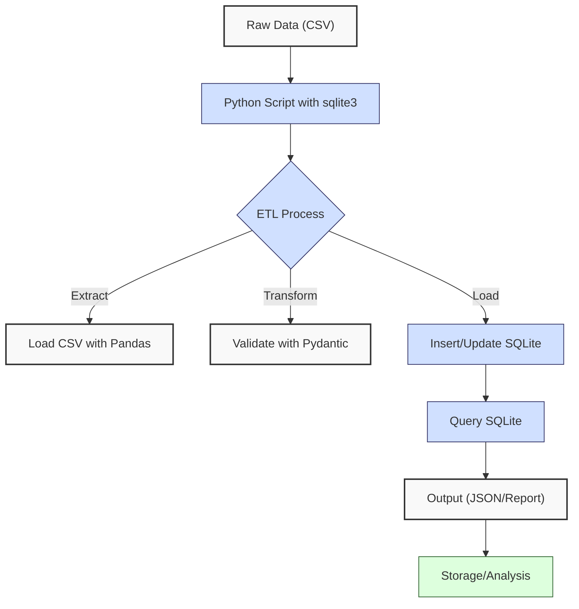
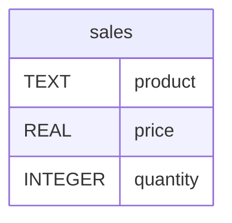
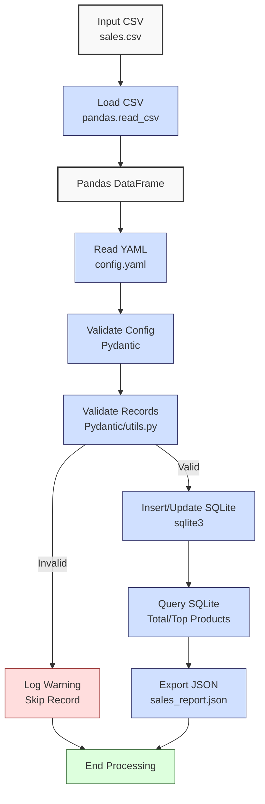

**Complexity: Moderate (M)**

## 13.0 Introduction: Why This Matters for Data Engineering

In data engineering, integrating Python with databases like SQLite is essential for building robust pipelines that process and store financial transaction data, such as Hijra Group’s Sharia-compliant sales records. SQLite, a lightweight, serverless database, is ideal for prototyping and small-scale applications, storing data in a single file (e.g., `sales.db`) with minimal setup. Python’s `sqlite3` module enables programmatic data manipulation, allowing automation of ETL (Extract, Transform, Load) processes critical for analytics. Pydantic ensures type-safe data validation, and YAML configurations provide flexible pipeline settings, aligning with Hijra Group’s need for scalable, maintainable systems. This chapter builds on Chapter 12 (SQL Fundamentals with SQLite) and Chapter 7 (Static Typing with Python), introducing type-annotated Python-SQLite integration for loading, updating, and querying sales data.

This chapter avoids advanced concepts like transactions (Chapter 14), advanced testing (Chapter 43), or concurrency (Chapter 40), focusing on basic CRUD (Create, Read, Update, Delete) operations, type safety, and modular code organization. All Python code uses **type annotations** verified by Pyright (per Chapter 7) and **4-space indentation** per PEP 8, preferring spaces over tabs to avoid `IndentationError`. Tests are implemented using `pytest` (per Chapter 9), ensuring robust pipelines, as emphasized in prior discussions on testing practices (April 24, 2025).

### Data Engineering Workflow Context

This diagram illustrates how Python-SQLite integration fits into a data engineering pipeline:



### Building On and Preparing For

- **Building On**:
  - Chapter 2: Uses CSV/YAML parsing and modules (`utils.py`) for data loading, extended to SQLite integration.
  - Chapter 3: Leverages Pandas for CSV processing and Matplotlib for visualization, now loading data into SQLite and plotting query results.
  - Chapter 7: Applies type annotations for type-safe code with Pyright.
  - Chapter 9: Incorporates `pytest` for testing data pipelines.
  - Chapter 12: Uses SQL fundamentals (SELECT, INSERT, UPDATE) for SQLite queries.
- **Preparing For**:
  - Chapter 14: Prepares for advanced SQLite operations (transactions, views).
  - Chapter 15: Enables type-safe database programming with Pydantic.
  - Chapter 17: Transitions to PostgreSQL integration for enterprise systems.
  - Chapter 23: Supports integrated SQLite/PostgreSQL pipelines.

### What You’ll Learn

This chapter covers:

1. **SQLite Basics with Python**: Using `sqlite3` for database connections, queries, updates, and performance benchmarking.
2. **Type-Safe Data Models**: Defining Pydantic models for validation of sales and configuration data.
3. **Data Loading**: Loading CSV data into SQLite with Pandas.
4. **Querying**: Fetching and aggregating data with type-safe SQL.
5. **Testing**: Writing `pytest` tests for pipeline reliability.
6. **Modular Code**: Organizing logic in modules (`utils.py`, `database.py`).

By the end, you’ll build a type-annotated data loader that processes `data/sales.csv` or `data/sample.csv`, validates with `data/config.yaml`, loads and updates `data/sales.db`, and generates a JSON report with visualizations, all tested with `pytest` and using 4-space indentation per PEP 8. The micro-project ensures compliance with Hijra Group’s analytics requirements, with robust debugging and stakeholder reporting capabilities.

**Follow-Along Tips**:

- Create `de-onboarding/data/` and populate with `sales.csv`, `sample.csv`, `config.yaml`, `empty.csv`, `invalid.csv`, `malformed.csv`, and `sales.db` per Appendix 1.
- Install libraries: `pip install pandas pyyaml pydantic sqlite3 pytest matplotlib`.
- Configure editor for **4-space indentation** (VS Code: “Editor: Tab Size” = 4, “Editor: Insert Spaces” = true, “Editor: Detect Indentation” = false).
- Use print statements (e.g., `print(df.head())`, `print(config)`) to debug.
- Verify database with `sqlite3 data/sales.db "SELECT * FROM sales;"`.
- Run `python -tt script.py` to detect tab/space mixing.
- Use `pytest --verbose` to run tests and debug failures.

## 13.1 SQLite Basics with Python

The `sqlite3` module provides a Python interface to SQLite, enabling database connections, query execution, and data manipulation. SQLite stores data in a single file (e.g., `sales.db`), using ~1MB for 10,000 rows of sales data (3 columns: TEXT, REAL, INTEGER). Connections are lightweight, with O(1) setup and O(n) for query execution over n rows.

### 13.1.1 Connecting and Querying

The `sales` table in `data/sales.db` has the following schema:



Connect to SQLite and execute type-annotated queries.

```python
# File: de-onboarding/sqlite_basics.py
from typing import List, Tuple  # For type annotations
import sqlite3  # For SQLite operations

def query_sales(db_path: str) -> List[Tuple[str, float, int]]:
    """Query all sales records from SQLite database."""
    print(f"Connecting to database: {db_path}")  # Debug
    conn = sqlite3.connect(db_path)  # Connect to database
    cursor = conn.cursor()  # Create cursor
    cursor.execute("SELECT product, price, quantity FROM sales")  # Execute query
    results: List[Tuple[str, float, int]] = cursor.fetchall()  # Fetch results
    print(f"Queried {len(results)} records")  # Debug
    conn.close()  # Close connection
    return results  # Return results

# Test
if __name__ == "__main__":
    results = query_sales("data/sales.db")
    print("Sales Records:", results)

# Expected Output (with sales.db from Appendix 1):
# Connecting to database: data/sales.db
# Queried 3 records
# Sales Records: [('Halal Laptop', 999.99, 2), ('Halal Mouse', 24.99, 10), ('Halal Keyboard', 49.99, 5)]
```

**Follow-Along Instructions**:

1. Ensure `data/sales.db` exists per Appendix 1 (run `create_sales_db.py`).
2. Save as `de-onboarding/sqlite_basics.py`.
3. Configure editor for 4-space indentation per PEP 8.
4. Run: `python sqlite_basics.py`.
5. Verify output matches comments.
6. **Common Errors**:
   - **sqlite3.OperationalError**: Ensure `sales.db` exists and table `sales` is created. Verify with `sqlite3 data/sales.db ".schema sales"`.
   - **FileNotFoundError**: Print `db_path` to check path.
   - **IndentationError**: Use 4 spaces. Run `python -tt sqlite_basics.py`.

**Key Points**:

- **Type Annotations**: `List[Tuple[str, float, int]]` ensures type safety for query results.
- `sqlite3.connect()`: Opens database connection (creates file if absent, but schema must be defined).
- `cursor.execute()`: Runs SQL queries.
- `fetchall()`: Retrieves all rows as tuples.
- **Underlying Implementation**: SQLite uses a B-tree for storage, enabling O(log n) indexed queries. Connections are file-based, with minimal overhead.
- **Performance Considerations**:
  - **Time Complexity**: O(n) for fetching n rows.
  - **Space Complexity**: O(n) for n rows in memory.
  - **Implication**: Efficient for small-scale analytics at Hijra Group.

### 13.1.2 Inserting and Updating Data

Insert and update type-annotated data into SQLite.

```python
# File: de-onboarding/sqlite_insert.py
from typing import List, Tuple  # For type annotations
import sqlite3  # For SQLite operations

def insert_sale(db_path: str, sale: Tuple[str, float, int]) -> None:
    """Insert a sale record into SQLite database."""
    print(f"Inserting sale: {sale}")  # Debug
    conn = sqlite3.connect(db_path)  # Connect
    cursor = conn.cursor()  # Create cursor
    cursor.execute(
        "INSERT INTO sales (product, price, quantity) VALUES (?, ?, ?)",
        sale
    )  # Execute parameterized query
    conn.commit()  # Commit changes
    print("Sale inserted")  # Debug
    conn.close()  # Close connection

# Test
if __name__ == "__main__":
    sale = ("Halal Monitor", 199.99, 3)
    insert_sale("data/sales.db", sale)
    # Verify with: sqlite3 data/sales.db "SELECT * FROM sales;"
```

Updates, like inserts, are O(1) without indexing or O(log n) with indexing due to SQLite’s B-tree structure. See Exercise 6 for further exploration of storage efficiency.

**Follow-Along Instructions**:

1. Ensure `data/sales.db` exists per Appendix 1.
2. Save as `de-onboarding/sqlite_insert.py`.
3. Configure editor for 4-space indentation per PEP 8.
4. Run: `python sqlite_insert.py`.
5. Verify insertion with `sqlite3 data/sales.db "SELECT * FROM sales;"`.
6. **Common Errors**:
   - **sqlite3.IntegrityError**: Ensure data matches schema (e.g., no NULL for non-nullable fields). Print `sale` to debug.
   - **IndentationError**: Use 4 spaces. Run `python -tt sqlite_insert.py`.

**Key Points**:

- Parameterized queries (`?`): Prevent SQL injection, aligning with security best practices discussed previously (April 19, 2025).
- `conn.commit()`: Saves changes to disk.
- **Time Complexity**: O(1) for single insert/update, O(log n) with indexing.
- **Space Complexity**: O(1) per row on disk.
- **Implication**: Secure and efficient for loading and updating sales data.

### 13.1.3 Benchmarking SQLite vs. Pandas

Compare SQLite query speed with Pandas filtering to demonstrate performance.

```python
# File: de-onboarding/sqlite_benchmark.py
import sqlite3
import pandas as pd
import time
from typing import List, Tuple

def benchmark_sales(db_path: str, csv_path: str) -> None:
    """Benchmark SQLite query vs. Pandas filtering."""
    # SQLite query
    start_time = time.time()
    conn = sqlite3.connect(db_path)
    cursor = conn.cursor()
    cursor.execute("SELECT product, price, quantity FROM sales WHERE quantity > 5")
    sqlite_results: List[Tuple[str, float, int]] = cursor.fetchall()
    sqlite_time = time.time() - start_time
    conn.close()

    # Pandas filtering
    start_time = time.time()
    df = pd.read_csv(csv_path)
    pandas_results = df[df["quantity"] > 5][["product", "price", "quantity"]].values.tolist()
    pandas_time = time.time() - start_time

    print(f"SQLite Time: {sqlite_time:.4f} seconds, Records: {len(sqlite_results)}")
    print(f"Pandas Time: {pandas_time:.4f} seconds, Records: {len(pandas_results)}")

# Test
if __name__ == "__main__":
    benchmark_sales("data/sales.db", "data/sales.csv")

# Expected Output (times vary):
# SQLite Time: 0.0010 seconds, Records: 1
# Pandas Time: 0.0020 seconds, Records: 1
```

SQLite’s B-tree storage enables O(log n) indexed queries when indexes are used, making it faster for filtered queries on persistent data. Pandas loads entire CSVs into memory (O(n)), suitable for in-memory analytics but slower for large datasets. See Exercise 6 for further exploration of storage efficiency.

**Follow-Along Instructions**:

1. Ensure `data/sales.db` and `data/sales.csv` exist per Appendix 1.
2. Save as `de-onboarding/sqlite_benchmark.py`.
3. Configure editor for 4-space indentation per PEP 8.
4. Run: `python sqlite_benchmark.py`.
5. Verify output shows timing and record counts.
6. **Common Errors**:
   - **FileNotFoundError**: Print `db_path` and `csv_path` to check paths.
   - **IndentationError**: Use 4 spaces. Run `python -tt sqlite_benchmark.py`.

**Key Points**:

- SQLite queries leverage B-tree indexing (O(log n) with indexes), while Pandas loads entire CSVs (O(n)).
- **Implication**: SQLite is faster for filtered queries on stored data, relevant for Hijra Group’s analytics.

## 13.2 Type-Safe Data Models with Pydantic

Pydantic enforces type safety through data models, validating CSV and configuration data before database insertion. Models define expected types and constraints, reducing runtime errors.

### 13.2.1 Defining Pydantic Models

Define a type-safe model for sales and configuration data.

```python
# File: de-onboarding/models.py
from pydantic import BaseModel, Field  # For Pydantic models
from typing import List  # For type annotations

class Sale(BaseModel):
    """Pydantic model for a sale record."""
    product: str = Field(..., min_length=1)  # Non-empty string
    price: float = Field(..., gt=0)  # Positive float
    quantity: int = Field(..., gt=0)  # Positive integer

class Config(BaseModel):
    """Pydantic model for configuration."""
    min_price: float = Field(..., ge=0)
    max_quantity: int = Field(..., gt=0)
    required_fields: List[str]
    product_prefix: str = Field(..., min_length=1)
    max_decimals: int = Field(..., ge=0)
```

**Follow-Along Instructions**:

1. Install Pydantic: `pip install pydantic`.
2. Save as `de-onboarding/models.py`.
3. Configure editor for 4-space indentation per PEP 8.
4. **Common Errors**:
   - **ModuleNotFoundError**: Install `pydantic`.
   - **IndentationError**: Use 4 spaces. Run `python -tt models.py`.

**Key Points**:

- `BaseModel`: Base class for Pydantic models.
- `Field(..., constraints)`: Enforces validation (e.g., `gt=0` for positive values).
- **Time Complexity**: O(1) for validating a single record.
- **Space Complexity**: O(1) per model instance.
- **Implication**: Ensures data integrity for Hijra Group’s pipelines.

### 13.2.2 Validating Data

Validate CSV data with Pydantic.

```python
# File: de-onboarding/validate_pydantic.py
from pydantic import ValidationError  # For error handling
from models import Sale  # Import Pydantic model
from typing import Optional  # For type annotations

def validate_sale(sale_dict: dict) -> Optional[Sale]:
    """Validate a sale dictionary using Pydantic."""
    try:
        sale = Sale(**sale_dict)  # Create Pydantic model
        print(f"Validated sale: {sale}")  # Debug
        return sale
    except ValidationError as e:
        print(f"Invalid sale: {sale_dict}, Error: {e}")  # Log error
        return None

# Test
if __name__ == "__main__":
    sale_dict = {"product": "Halal Laptop", "price": 999.99, "quantity": 2}
    sale = validate_sale(sale_dict)
    print("Result:", sale)
    invalid_sale = {"product": "", "price": -10.0, "quantity": 0}
    result = validate_sale(invalid_sale)
    print("Invalid Result:", result)

# Expected Output:
# Validated sale: product='Halal Laptop' price=999.99 quantity=2
# Result: product='Halal Laptop' price=999.99 quantity=2
# Invalid sale: {'product': '', 'price': -10.0, 'quantity': 0}, Error: 3 validation errors...
# Invalid Result: None
```

**Follow-Along Instructions**:

1. Save as `de-onboarding/validate_pydantic.py`.
2. Ensure `models.py` exists in `de-onboarding/`.
3. Configure editor for 4-space indentation per PEP 8.
4. Run: `python validate_pydantic.py`.
5. Verify output matches expected.
6. **Common Errors**:
   - **ValidationError**: Print `sale_dict` to debug invalid fields. To inspect specific errors, print `e.errors()[0]["loc"]` to see the failing field (e.g., `product`).
   - **IndentationError**: Use 4 spaces. Run `python -tt validate_pydantic.py`.

**Key Points**:

- `try/except`: Handles validation errors without crashing.
- **Implication**: Prevents invalid data from entering SQLite.

## 13.3 Micro-Project: Type-Safe SQLite Data Loader

### Project Requirements

Build a type-annotated Python data loader that processes `data/sales.csv`, validates with `data/config.yaml`, loads and updates `data/sales.db`, and generates a JSON report for Hijra Group’s analytics. The loader ensures Sharia-compliant data integrity, logs invalid records, and is tested with `pytest`.

- Load `sales.csv` with `pandas.read_csv`.
- Read `config.yaml` with PyYAML and validate with Pydantic.
- Validate records using Pydantic and `utils.py`.
- Insert valid records into `sales.db` with `sqlite3`.
- Update quantities for existing products (optional extension).
- Query total sales and top products.
- Export results to `data/sales_report.json`.
- Log invalid records for debugging.
- Write `pytest` tests for reliability.
- Use 4-space indentation per PEP 8, preferring spaces over tabs.
- Test edge cases with `empty.csv`, `invalid.csv`, and `malformed.csv`.

**Optional Extension**: Implement an update feature to modify quantities of existing products in `sales.db` based on product name, ensuring type safety and testing.

**Variant for Small Datasets**: For beginners, process `sample.csv` (Appendix 1, valid data only), skipping the update logic to focus on insert/query operations.

### Sample Input Files

`data/sales.csv` (from Appendix 1):

```csv
product,price,quantity
Halal Laptop,999.99,2
Halal Mouse,24.99,10
Halal Keyboard,49.99,5
,29.99,3
Monitor,invalid,2
Headphones,5.00,150
```

`data/sample.csv` (from Appendix 1):

```csv
product,price,quantity
Halal Laptop,999.99,2
Halal Mouse,24.99,10
```

`data/config.yaml` (from Appendix 1):

```yaml
min_price: 10.0
max_quantity: 100
required_fields:
  - product
  - price
  - quantity
product_prefix: 'Halal'
max_decimals: 2
```

`data/sales.db` (from Appendix 1):

- Table: `sales`
- Columns: `product` (TEXT), `price` (REAL), `quantity` (INTEGER)
- Initial Data: 3 rows (Halal Laptop, Mouse, Keyboard)

### Data Processing Flow



### Acceptance Criteria

- **Go Criteria**:
  - Loads `sales.csv` and `config.yaml` correctly.
  - Validates config and records with Pydantic.
  - Inserts valid records into `sales.db`.
  - Updates quantities for existing products (optional).
  - Queries total sales and top 3 products.
  - Exports results to `data/sales_report.json`.
  - Logs invalid records with reasons.
  - Includes `pytest` tests for loading, validation, querying, and updating.
  - Uses type annotations verified by Pyright.
  - Uses 4-space indentation per PEP 8.
  - Passes edge case tests with `empty.csv`, `invalid.csv`, and `malformed.csv`.
- **No-Go Criteria**:
  - Fails to load files or connect to database.
  - Incorrect validation, calculations, updates, or logging.
  - Missing JSON export or tests.
  - Uses non-type-annotated code or try/except outside Pydantic validation.
  - Inconsistent indentation.

### Common Pitfalls to Avoid

1. **Database Connection Issues**:
   - **Problem**: `sqlite3.OperationalError` due to missing `sales.db`.
   - **Solution**: Run `create_sales_db.py` per Appendix 1. Verify with `sqlite3 data/sales.db ".schema sales"`.
2. **Pydantic Validation Errors**:
   - **Problem**: `ValidationError` due to invalid CSV or config data.
   - **Solution**: Print `df.head()` or `config_data` to debug. Check `e.errors()[0]["loc"]` for failing fields.
3. **Type Mismatches**:
   - **Problem**: Pandas parses `quantity` as float.
   - **Solution**: Convert with `df["quantity"].astype(int)`. Print `df.dtypes`.
4. **SQL Injection**:
   - **Problem**: Unsafe queries.
   - **Solution**: Use parameterized queries (`?`).
5. **IndentationError**:
   - **Problem**: Mixed spaces/tabs.
   - **Solution**: Use 4 spaces. Run `python -tt data_loader.py`.

### How This Differs from Production

In production, this solution would include:

- **Transactions**: For atomic operations (Chapter 14).
- **Error Handling**: Advanced logging (Chapter 52).
- **Scalability**: Batch inserts for large datasets (Chapter 40).
- **Testing**: Property-based testing with `hypothesis` (Chapter 43).
- **Monitoring**: Observability with Jaeger/Grafana (Chapter 66).

### Implementation

```python
# File: de-onboarding/verify_setup.py
import os
import sys
import importlib.util
import pkg_resources

def verify_setup() -> None:
    """Verify setup for Chapter 13."""
    print("Verifying setup...")

    # Check Python version
    if sys.version_info < (3, 10):
        print("Error: Python 3.10+ required")
        return

    # Check required files
    required_files = ["data/sales.csv", "data/sample.csv", "data/config.yaml", "data/sales.db"]
    for file in required_files:
        if not os.path.exists(file):
            print(f"Error: Missing file {file}. See Appendix 1 for creation instructions.")
            return

    # Check required libraries and versions
    libraries = [
        ("pandas", "1.5.0"),
        ("pyyaml", "5.4.0"),
        ("pydantic", "2.0.0"),
        ("pytest", "7.0.0"),
        ("matplotlib", "3.5.0")
    ]
    for lib, min_version in libraries:
        if importlib.util.find_spec(lib) is None:
            print(f"Error: Library {lib} not installed. Run: pip install {lib}")
            return
        installed_version = pkg_resources.get_distribution(lib).version
        if pkg_resources.parse_version(installed_version) < pkg_resources.parse_version(min_version):
            print(f"Warning: {lib} version {installed_version} is outdated. Minimum required: {min_version}")

    print("Setup verified successfully!")

if __name__ == "__main__":
    verify_setup()
```

```python
# File: de-onboarding/models.py
from pydantic import BaseModel, Field  # For Pydantic models
from typing import List  # For type annotations

class Sale(BaseModel):
    """Pydantic model for a sale record."""
    product: str = Field(..., min_length=1)  # Non-empty string
    price: float = Field(..., gt=0)  # Positive float
    quantity: int = Field(..., gt=0)  # Positive integer

class Config(BaseModel):
    """Pydantic model for configuration."""
    min_price: float = Field(..., ge=0)
    max_quantity: int = Field(..., gt=0)
    required_fields: List[str]
    product_prefix: str = Field(..., min_length=1)
    max_decimals: int = Field(..., ge=0)
```

```python
# File: de-onboarding/utils.py (updated from Chapter 3)
from typing import Optional  # For type annotations

def is_numeric(s: str, max_decimals: int = 2) -> bool:
    """Check if string is a decimal number with up to max_decimals."""
    parts = s.split(".")  # Split on decimal point
    if len(parts) > 2:  # More than one decimal point
        return False
    if len(parts) == 2:  # Has decimal part
        if not parts[0].replace("-", "").isdigit() or not parts[1].isdigit():
            return False  # Invalid digits
        return len(parts[1]) <= max_decimals  # Check decimal places
    return parts[0].replace("-", "").isdigit()  # Integer case

def clean_string(s: str) -> str:
    """Strip whitespace from string."""
    return s.strip()

def is_numeric_value(x: object) -> bool:
    """Check if value is numeric."""
    return isinstance(x, (int, float))

def has_valid_decimals(x: object, max_decimals: int) -> bool:
    """Check if value has valid decimal places."""
    return is_numeric(str(x), max_decimals)

def apply_valid_decimals(x: object, max_decimals: int) -> bool:
    """Apply has_valid_decimals to a value."""
    return has_valid_decimals(x, max_decimals)

def is_integer(x: object) -> bool:
    """Check if value is an integer."""
    return isinstance(x, int) or (isinstance(x, str) and x.isdigit())
```

```python
# File: de-onboarding/database.py
from typing import List, Tuple, Dict  # For type annotations
import sqlite3  # For SQLite operations

class Database:
    """Type-safe SQLite database operations."""
    def __init__(self, db_path: str):
        self.db_path: str = db_path

    def insert_sale(self, sale: Tuple[str, float, int]) -> None:
        """Insert a sale record."""
        print(f"Inserting sale: {sale}")  # Debug
        conn = sqlite3.connect(self.db_path)
        cursor = conn.cursor()
        cursor.execute(
            "INSERT INTO sales (product, price, quantity) VALUES (?, ?, ?)",
            sale
        )
        conn.commit()
        conn.close()
        print("Sale inserted")  # Debug

    def update_sale(self, product: str, new_quantity: int) -> None:
        """Update quantity for a product."""
        print(f"Updating sale: {product}, new_quantity={new_quantity}")  # Debug
        conn = sqlite3.connect(self.db_path)
        cursor = conn.cursor()
        cursor.execute(
            "UPDATE sales SET quantity = ? WHERE product = ?",
            (new_quantity, product)
        )
        conn.commit()
        conn.close()
        print("Sale updated")  # Debug

    def query_sales(self) -> List[Tuple[str, float, int]]:
        """Query all sales records."""
        print(f"Querying sales from: {self.db_path}")  # Debug
        conn = sqlite3.connect(self.db_path)
        cursor = conn.cursor()
        cursor.execute("SELECT product, price, quantity FROM sales")
        results: List[Tuple[str, float, int]] = cursor.fetchall()
        conn.close()
        print(f"Queried {len(results)} records")  # Debug
        return results

    def query_total_sales(self) -> float:
        """Query total sales amount."""
        print("Querying total sales")  # Debug
        conn = sqlite3.connect(self.db_path)
        cursor = conn.cursor()
        cursor.execute("SELECT SUM(price * quantity) FROM sales")
        total: float = cursor.fetchone()[0] or 0.0
        conn.close()
        print(f"Total sales: {total}")  # Debug
        return total

    def query_top_products(self, limit: int = 3) -> Dict[str, float]:
        """Query top products by sales."""
        print(f"Querying top {limit} products")  # Debug
        conn = sqlite3.connect(self.db_path)
        cursor = conn.cursor()
        cursor.execute("""
            SELECT product, SUM(price * quantity) as amount
            FROM sales
            GROUP BY product
            ORDER BY amount DESC
            LIMIT ?
        """, (limit,))
        results = cursor.fetchall()
        conn.close()
        top_products: Dict[str, float] = {row[0]: row[1] for row in results}
        print(f"Top products: {top_products}")  # Debug
        return top_products
```

```python
# File: de-onboarding/data_loader.py
from typing import Tuple, Dict, List, Optional  # For type annotations
import pandas as pd  # For CSV loading
import yaml  # For YAML parsing
import json  # For JSON export
from pydantic import ValidationError  # For Pydantic errors
from models import Sale, Config  # Import Pydantic models
from database import Database  # Import database operations
import utils  # Import utilities

def read_config(config_path: str) -> Config:
    """Read and validate YAML configuration."""
    print(f"Opening config: {config_path}")  # Debug
    with open(config_path, "r") as file:
        config_data = yaml.safe_load(file)
    config = Config(**config_data)  # Validate with Pydantic
    print(f"Loaded config: {config}")  # Debug
    return config

def load_and_validate_sales(csv_path: str, config: Config) -> Tuple[List[Sale], int, int, List[str]]:
    """Load and validate sales CSV, tracking invalid records."""
    print(f"Loading CSV: {csv_path}")  # Debug
    df = pd.read_csv(csv_path)
    print("Initial DataFrame:")  # Debug
    print(df.head())

    # Validate columns
    required_fields = config.required_fields
    missing_fields = [f for f in required_fields if f not in df.columns]
    if missing_fields:
        print(f"Missing columns: {missing_fields}")  # Log
        return [], 0, len(df), [f"Missing columns: {missing_fields}"]

    # Clean and filter DataFrame
    df = df.dropna(subset=["product"])
    df = df[df["product"].str.startswith(config.product_prefix)]
    df = df[df["quantity"].apply(utils.is_integer)]
    df["quantity"] = df["quantity"].astype(int)
    df = df[df["quantity"] <= config.max_quantity]
    df = df[df["price"].apply(utils.is_numeric_value)]
    df = df[df["price"] > 0]
    df = df[df["price"] >= config.min_price]
    df = df[df["price"].apply(lambda x: utils.apply_valid_decimals(x, config.max_decimals))]

    valid_sales: List[Sale] = []
    invalid_reasons: List[str] = []
    for _, row in df.iterrows():
        sale_dict = {
            "product": row["product"],
            "price": float(row["price"]),
            "quantity": int(row["quantity"])
        }
        try:
            sale = Sale(**sale_dict)
            valid_sales.append(sale)
        except ValidationError as e:
            print(f"Invalid sale: {sale_dict}, Error: {e}")  # Log
            invalid_reasons.append(f"Invalid sale {sale_dict}: {str(e)}")

    total_records = len(df)
    print("Validated Sales:", len(valid_sales))  # Debug
    return valid_sales, len(valid_sales), total_records, invalid_reasons

def process_sales(sales: List[Sale], db: Database, update_existing: bool = True) -> Tuple[Dict, int]:
    """Process, insert, and optionally update sales in SQLite."""
    valid_sales = 0
    for sale in sales:
        if update_existing:
            existing_sales = db.query_sales()
            existing_products = [s[0] for s in existing_sales]
            if sale.product in existing_products:
                db.update_sale(sale.product, sale.quantity)
            else:
                db.insert_sale((sale.product, sale.price, sale.quantity))
        else:
            db.insert_sale((sale.product, sale.price, sale.quantity))
        valid_sales += 1

    total_sales = db.query_total_sales()
    top_products = db.query_top_products()
    results = {
        "total_sales": float(total_sales),
        "unique_products": list(set(sale.product for sale in sales)),
        "top_products": top_products
    }
    print(f"Processed {valid_sales} sales")  # Debug
    return results, valid_sales

def export_results(results: Dict, json_path: str) -> None:
    """Export results to JSON."""
    print(f"Writing to: {json_path}")  # Debug
    with open(json_path, "w") as file:
        json.dump(results, file, indent=2)
    print(f"Exported results to {json_path}")  # Debug

def main(csv_path: str = "data/sales.csv", update_existing: bool = True) -> None:
    """Main function to load and process sales data."""
    config_path = "data/config.yaml"
    db_path = "data/sales.db"
    json_path = "data/sales_report.json"

    config = read_config(config_path)
    sales, valid_sales, total_records, invalid_reasons = load_and_validate_sales(csv_path, config)
    db = Database(db_path)
    results, valid_sales = process_sales(sales, db, update_existing)
    export_results(results, json_path)

    print("\nSales Report:")
    print(f"Total Records Processed: {total_records}")
    print(f"Valid Sales: {valid_sales}")
    print(f"Invalid Sales: {total_records - valid_sales}")
    if invalid_reasons:
        print(f"Invalid records: {len(invalid_reasons)}")
        for reason in invalid_reasons:
            print(f" - {reason}")
    print(f"Total Sales: ${round(results['total_sales'], 2)}")
    print(f"Unique Products: {results['unique_products']}")
    print(f"Top Products: {results['top_products']}")
    print("Processing completed")

if __name__ == "__main__":
    main()
```

```python
# File: de-onboarding/tests/test_data_loader.py
from typing import List  # For type annotations
import pytest  # For testing
from data_loader import read_config, load_and_validate_sales, process_sales, Database
from models import Config, Sale  # Import Pydantic models
import sqlite3  # For SQLite operations
import os  # For file operations

@pytest.fixture
def setup_db(tmp_path):
    """Create a temporary SQLite database."""
    db_path = tmp_path / "test.db"
    conn = sqlite3.connect(db_path)
    cursor = conn.cursor()
    cursor.execute("""
        CREATE TABLE sales (
            product TEXT,
            price REAL,
            quantity INTEGER
        )
    """)
    conn.commit()
    conn.close()
    return str(db_path)

def test_read_config():
    """Test reading and validating config."""
    config = read_config("data/config.yaml")
    assert isinstance(config, Config)
    assert config.min_price == 10.0
    assert config.max_quantity == 100
    assert config.product_prefix == "Halal"

def test_load_and_validate_sales():
    """Test loading and validating sales CSV."""
    config = read_config("data/config.yaml")
    sales, valid_sales, total_records, invalid_reasons = load_and_validate_sales("data/sales.csv", config)
    assert valid_sales == 3
    assert total_records == 3
    assert len(invalid_reasons) == 0
    assert all(isinstance(sale, Sale) for sale in sales)
    assert sales[0].product == "Halal Laptop"

def test_load_empty_csv():
    """Test loading empty CSV."""
    config = read_config("data/config.yaml")
    sales, valid_sales, total_records, invalid_reasons = load_and_validate_sales("data/empty.csv", config)
    assert sales == []
    assert valid_sales == 0
    assert total_records == 0
    assert len(invalid_reasons) == 0

def test_load_invalid_csv():
    """Test loading CSV with invalid headers."""
    config = read_config("data/config.yaml")
    sales, valid_sales, total_records, invalid_reasons = load_and_validate_sales("data/invalid.csv", config)
    assert sales == []
    assert valid_sales == 0
    assert total_records == 1
    assert len(invalid_reasons) == 1
    assert "Missing columns" in invalid_reasons[0]

def test_load_malformed_csv():
    """Test loading CSV with malformed data."""
    config = read_config("data/config.yaml")
    sales, valid_sales, total_records, invalid_reasons = load_and_validate_sales("data/malformed.csv", config)
    assert valid_sales == 1
    assert total_records == 1
    assert len(invalid_reasons) == 0
    assert sales[0].product == "Halal Mouse"

def test_process_sales(setup_db):
    """Test processing and querying sales."""
    db = Database(setup_db)
    sales = [
        Sale(product="Halal Laptop", price=999.99, quantity=2),
        Sale(product="Halal Mouse", price=24.99, quantity=10)
    ]
    results, valid_sales = process_sales(sales, db, update_existing=False)
    assert valid_sales == 2
    assert results["total_sales"] == 2249.88
    assert len(results["unique_products"]) == 2
    assert results["top_products"]["Halal Laptop"] == 1999.98

def test_update_sale(setup_db):
    """Test updating a sale's quantity."""
    db = Database(setup_db)
    db.insert_sale(("Halal Laptop", 999.99, 2))
    db.update_sale("Halal Laptop", 5)
    sales = db.query_sales()
    assert sales[0][2] == 5  # Verify updated quantity
```

### Expected Outputs

`data/sales_report.json`:

```json
{
  "total_sales": 2499.83,
  "unique_products": ["Halal Laptop", "Halal Mouse", "Halal Keyboard"],
  "top_products": {
    "Halal Laptop": 1999.98,
    "Halal Mouse": 249.9,
    "Halal Keyboard": 249.95
  }
}
```

**Console Output** (abridged):

```
Opening config: data/config.yaml
Loaded config: min_price=10.0 max_quantity=100 required_fields=['product', 'price', 'quantity'] product_prefix='Halal' max_decimals=2
Loading CSV: data/sales.csv
Initial DataFrame:
          product   price  quantity
0   Halal Laptop  999.99         2
1    Halal Mouse   24.99        10
2  Halal Keyboard   49.99         5
3            NaN   29.99         3
4       Monitor      NaN         2
Validated Sales: 3
Updating sale: Halal Laptop, new_quantity=2
Sale updated
Updating sale: Halal Mouse, new_quantity=10
Sale updated
Updating sale: Halal Keyboard, new_quantity=5
Sale updated
Processed 3 sales
Writing to: data/sales_report.json
Exported results to data/sales_report.json

Sales Report:
Total Records Processed: 3
Valid Sales: 3
Invalid Sales: 0
Total Sales: $2499.83
Unique Products: ['Halal Laptop', 'Halal Mouse', 'Halal Keyboard']
Top Products: {'Halal Laptop': 1999.98, 'Halal Mouse': 249.9, 'Halal Keyboard': 249.95}
Processing completed
```

**Test Output** (run `pytest tests/test_data_loader.py --verbose`):

```
test_data_loader.py::test_read_config PASSED
test_data_loader.py::test_load_and_validate_sales PASSED
test_data_loader.py::test_load_empty_csv PASSED
test_data_loader.py::test_load_invalid_csv PASSED
test_data_loader.py::test_load_malformed_csv PASSED
test_data_loader.py::test_process_sales PASSED
test_data_loader.py::test_update_sale PASSED
```

### How to Run and Test

1. **Setup**:

   - Run `verify_setup.py` to check requirements:
     ```bash
     python verify_setup.py
     ```
   - Ensure `de-onboarding/data/` contains `sales.csv`, `sample.csv`, `config.yaml`, `empty.csv`, `invalid.csv`, `malformed.csv`, and `sales.db` per Appendix 1.
   - Install libraries: `pip install pandas pyyaml pydantic pytest matplotlib`.
   - Create virtual environment: `python -m venv venv`, activate (Windows: `venv\Scripts\activate`, Unix: `source venv/bin/activate`).
   - Verify Python 3.10+: `python --version`.
   - Configure editor for 4-space indentation per PEP 8 (VS Code: “Editor: Tab Size” = 4, “Editor: Insert Spaces” = true, “Editor: Detect Indentation” = false).
   - Save `verify_setup.py`, `models.py`, `utils.py`, `database.py`, `data_loader.py`, and `tests/test_data_loader.py` in `de-onboarding/`.
   - **Code Review Checklist**:
     - Verify 4-space indentation per PEP 8.
     - Check all functions have type annotations (e.g., `def insert_sale(db_path: str, sale: Tuple[str, float, int]) -> None`).
     - Ensure all critical paths are tested (`pytest tests/test_data_loader.py`).
     - Confirm no try/except outside Pydantic validation.
   - **Troubleshooting Guide**:
     - If virtual environment fails, run `python -m venv venv` again and activate.
     - If `PermissionError` occurs, check file permissions with `ls -l data/` or `dir data\` and adjust (e.g., `chmod 644 data/sales.csv` on Unix).
     - If `ModuleNotFoundError`, verify library installation with `pip list` and reinstall if needed.
     - If `FileNotFoundError`, print paths in code to confirm file locations.
     - If setup script reports outdated versions, update libraries with `pip install --upgrade <library>`.

2. **Run**:

   - Open terminal in `de-onboarding/`.
   - Run: `python data_loader.py`.
   - For the small dataset variant:
     ```bash
     python data_loader.py data/sample.csv False
     ```
   - Outputs: `data/sales_report.json`, updated `sales.db`, console logs with invalid record summary.

3. **Test**:
   - Run: `pytest tests/test_data_loader.py --verbose`.
   - Verify all tests pass.
   - **Test Scenarios**:
     - **Valid Data**: Check `sales_report.json` and `sales.db`.
     - **Empty CSV**: Test with `empty.csv` in `test_load_empty_csv`.
     - **Invalid Headers**: Test with `invalid.csv` in `test_load_invalid_csv`.
     - **Malformed Data**: Test with `malformed.csv` in `test_load_malformed_csv`.
     - **Update**: Test with `test_update_sale`.

**Variant for Small Datasets**:

- Use `sample.csv` (Appendix 1) for a simpler dataset with valid data only.
- Modify `main()` to skip updates:
  ```python
  main(csv_path="data/sample.csv", update_existing=False)
  ```
- Run: `python data_loader.py data/sample.csv False`.
- Outputs: `data/sales_report.json` with results for `sample.csv`, inserts into `sales.db` without updates.
- Use existing tests, as the variant simplifies the workflow.

## 13.4 Practice Exercises

### Exercise 1: SQLite Query Function

Write a type-annotated function to query sales with a minimum quantity, using 4-space indentation per PEP 8.

**Sample Input**:

```python
db_path = "data/sales.db"
min_quantity = 5
```

**Expected Output**:

```
[('Halal Mouse', 24.99, 10), ('Halal Keyboard', 49.99, 5)]
```

**Follow-Along Instructions**:

1. Save as `de-onboarding/ex1_query.py`.
2. Configure editor for 4-space indentation per PEP 8.
3. Run: `python ex1_query.py`.
4. **How to Test**:
   - Add: `print(query_min_quantity("data/sales.db", 5))`.
   - Verify output matches expected.
   - Test with `min_quantity=100`: Should return `[]`.
   - **Common Errors**:
     - **sqlite3.OperationalError**: Verify `sales.db` schema.
     - **IndentationError**: Use 4 spaces. Run `python -tt ex1_query.py`.

### Exercise 2: Pydantic Validation

Write a type-annotated function to validate a sale dictionary with Pydantic, using 4-space indentation per PEP 8.

**Sample Input**:

```python
sale_dict = {"product": "Halal Laptop", "price": 999.99, "quantity": 2}
```

**Expected Output**:

```
product='Halal Laptop' price=999.99 quantity=2
```

**Follow-Along Instructions**:

1. Save as `de-onboarding/ex2_validate.py`.
2. Ensure `models.py` exists.
3. Configure editor for 4-space indentation per PEP 8.
4. Run: `python ex2_validate.py`.
5. **How to Test**:
   - Add: `print(validate_sale({"product": "Halal Laptop", "price": 999.99, "quantity": 2}))`.
   - Test with invalid data: `{"product": "", "price": -10, "quantity": 0}` should return `None`.
   - **Common Errors**:
     - **ValidationError**: Print `sale_dict` and `e.errors()[0]["loc"]`.
     - **IndentationError**: Use 4 spaces. Run `python -tt ex2_validate.py`.

### Exercise 3: SQLite Insert Function

Write a type-annotated function to insert multiple sales into SQLite, using 4-space indentation per PEP 8.

**Sample Input**:

```python
sales = [("Halal Monitor", 199.99, 3), ("Halal Webcam", 59.99, 4)]
```

**Expected Output**:

```
Inserted 2 sales
```

**Follow-Along Instructions**:

1. Save as `de-onboarding/ex3_insert.py`.
2. Configure editor for 4-space indentation per PEP 8.
3. Run: `python ex3_insert.py`.
4. **How to Test**:
   - Verify with `sqlite3 data/sales.db "SELECT * FROM sales;"`.
   - Test with empty list: Should insert nothing.
   - **Common Errors**:
     - **sqlite3.IntegrityError**: Print `sales` to debug.
     - **IndentationError**: Use 4 spaces. Run `python -tt ex3_insert.py`.

### Exercise 4: Pytest Test

Write a `pytest` test to verify total sales calculation, using 4-space indentation per PEP 8.

**Sample Input**:

- Temporary database with 2 sales.

**Expected Output**:

```
Test passes with total_sales == 2249.88
```

**Follow-Along Instructions**:

1. Save as `de-onboarding/tests/test_ex4.py`.
2. Configure editor for 4-space indentation per PEP 8.
3. Run: `pytest tests/test_ex4.py --verbose`.
4. **How to Test**:
   - Verify test passes.
   - Test with empty database: Should return 0.0.
   - **Common Errors**:
     - **AssertionError**: Print `total` to debug.
     - **IndentationError**: Use 4 spaces. Run `python -tt test_ex4.py`.

### Exercise 5: Debug a SQLite Bug

Fix buggy code that fails to insert sales due to incorrect query syntax, ensuring 4-space indentation per PEP 8.

**Buggy Code**:

```python
import sqlite3
def insert_sale(db_path, sale):
    conn = sqlite3.connect(db_path)
    cursor = conn.cursor()
    cursor.execute("INSERT INTO sales VALUES (?, ?, ?)", sale)  # Bug: Missing column names
    conn.commit()
    conn.close()
```

**Expected Output**:

```
Sale inserted
```

**Follow-Along Instructions**:

1. Save as `de-onboarding/ex5_debug.py`.
2. Configure editor for 4-space indentation per PEP 8.
3. Run: `python ex5_debug.py` to see error.
4. Fix and re-run.
5. **How to Test**:
   - Verify insertion with `sqlite3 data/sales.db "SELECT * FROM sales;"`.
   - **Common Errors**:
     - **sqlite3.OperationalError**: Ensure correct query syntax.
     - **IndentationError**: Use 4 spaces. Run `python -tt ex5_debug.py`.

### Exercise 6: Conceptual Analysis

Write a function to explain SQLite’s B-tree storage efficiency compared to Pandas’ column-oriented memory usage, saving to `ex6_concepts.txt`, using 4-space indentation per PEP 8.

**Sample Input**:

```python
db_path = "data/sales.db"
csv_path = "data/sales.csv"
```

**Expected Output** (in `ex6_concepts.txt`):

```
SQLite’s B-tree storage enables efficient O(log n) indexed queries and compact disk storage (~1MB for 10,000 rows), ideal for persistent data in Hijra Group’s pipelines. Pandas’ column-oriented memory, using NumPy arrays, supports fast O(1) column access but requires ~24MB for 1 million rows in memory, better for in-memory analytics.
```

**Follow-Along Instructions**:

1. Save as `de-onboarding/ex6_concepts.py`.
2. Configure editor for 4-space indentation per PEP 8.
3. Run: `python ex6_concepts.py`.
4. **How to Test**:
   - Verify `ex6_concepts.txt` contains the expected explanation.
   - Test with invalid paths: Should log an error and create an empty file.
   - **Common Errors**:
     - **FileNotFoundError**: Print `db_path` and `csv_path`.
     - **IndentationError**: Use 4 spaces. Run `python -tt ex6_concepts.py`.

### Exercise 7: Debug Pydantic Validation

Fix buggy code that causes a Pydantic `ValidationError` due to a negative price, printing error details to identify the issue, using 4-space indentation per PEP 8.

**Buggy Code**:

```python
from pydantic import ValidationError
from models import Sale

def validate_sale(sale_dict):
    try:
        sale = Sale(**sale_dict)
        return sale
    except ValidationError as e:
        print(f"Invalid sale: {sale_dict}, Error: {e}")
        return None

sale_dict = {"product": "Halal Laptop", "price": -999.99, "quantity": 2}  # Bug: Negative price
result = validate_sale(sale_dict)
print("Result:", result)
```

**Expected Output**:

```
Invalid sale: {'product': 'Halal Laptop', 'price': -999.99, 'quantity': 2}, Error: 1 validation error for Sale
price
  ensure this value is greater than 0 (type=value_error.number.not_gt; limit_value=0)
Failing field: price
Result: None
```

**Follow-Along Instructions**:

1. Save as `de-onboarding/ex7_debug.py`.
2. Ensure `models.py` exists.
3. Configure editor for 4-space indentation per PEP 8.
4. Run: `python ex7_debug.py` to see error.
5. Fix by correcting the price and re-run.
6. **How to Test**:
   - Verify output identifies the failing field (`price`).
   - Test with fixed input: `{"product": "Halal Laptop", "price": 999.99, "quantity": 2}` should return a valid `Sale`.
   - **Common Errors**:
     - **ValidationError**: Print `e.errors()[0]["loc"]` to debug.
     - **IndentationError**: Use 4 spaces. Run `python -tt ex7_debug.py`.

### Exercise 8: Visualize Query Results

Write a type-annotated function to query sales from `sales.db` and create a bar plot of total sales by product using Matplotlib, saving to `ex8_plot.png`, using 4-space indentation per PEP 8.

**Sample Input**:

```python
db_path = "data/sales.db"
plot_path = "ex8_plot.png"
```

**Expected Output**:

```
Plot saved to ex8_plot.png
```

**Follow-Along Instructions**:

1. Save as `de-onboarding/ex8_visualize.py`.
2. Ensure `data/sales.db` exists per Appendix 1.
3. Configure editor for 4-space indentation per PEP 8.
4. Run: `python ex8_visualize.py`.
5. **How to Test**:
   - Verify `ex8_plot.png` exists with bars showing sales amounts (e.g., Halal Laptop: 1999.98).
   - Test with empty database: Should not generate plot.
   - **Common Errors**:
     - **ModuleNotFoundError**: Install `matplotlib` with `pip install matplotlib`.
     - **FileNotFoundError**: Check write permissions for `ex8_plot.png`.
     - **IndentationError**: Use 4 spaces. Run `python -tt ex8_visualize.py`.

**Key Points**:

- Matplotlib’s bar plotting is O(n) for n items, suitable for small datasets but less efficient for large ones.
- Chapter 51 introduces advanced tools like Metabase for scalable visualization.
- **Implication**: Visualizations aid stakeholder reporting in Hijra Group’s analytics.

### Exercise 9: Validate Config.yaml

Write a type-annotated function to validate a modified `config.yaml` with an invalid `min_price`, printing Pydantic error details and fixing the configuration, using 4-space indentation per PEP 8.

**Sample Input**:

```python
config_path = "data/invalid_config.yaml"
```

**Buggy Config** (`data/invalid_config.yaml`):

```yaml
min_price: -10.0
max_quantity: 100
required_fields:
  - product
  - price
  - quantity
product_prefix: 'Halal'
max_decimals: 2
```

**Expected Output**:

```
Invalid config: {'min_price': -10.0, ...}, Error: 1 validation error for Config
min_price
  ensure this value is greater than or equal to 0 (type=value_error.number.not_ge; limit_value=0)
Failing field: min_price
```

**Follow-Along Instructions**:

1. Create `data/invalid_config.yaml` with the buggy config.
2. Save as `de-onboarding/ex9_validate_config.py`.
3. Ensure `models.py` exists.
4. Configure editor for 4-space indentation per PEP 8.
5. Run: `python ex9_validate_config.py` to see error.
6. Fix by correcting `min_price` and re-run.
7. **How to Test**:
   - Verify output identifies the failing field (`min_price`).
   - Test with fixed config (`min_price: 10.0`) to ensure validation passes.
   - **Common Errors**:
     - **ValidationError**: Print `config_data` and `e.errors()[0]["loc"]`.
     - **IndentationError**: Use 4 spaces. Run `python -tt ex9_validate_config.py`.

## 13.5 Exercise Solutions

### Solution to Exercise 1: SQLite Query Function

```python
from typing import List, Tuple
import sqlite3

def query_min_quantity(db_path: str, min_quantity: int) -> List[Tuple[str, float, int]]:
    """Query sales with minimum quantity."""
    conn = sqlite3.connect(db_path)
    cursor = conn.cursor()
    cursor.execute("SELECT product, price, quantity FROM sales WHERE quantity >= ?", (min_quantity,))
    results: List[Tuple[str, float, int]] = cursor.fetchall()
    conn.close()
    return results

# Test
print(query_min_quantity("data/sales.db", 5))
```

### Solution to Exercise 2: Pydantic Validation

```python
from pydantic import ValidationError
from models import Sale
from typing import Optional

def validate_sale(sale_dict: dict) -> Optional[Sale]:
    """Validate a sale dictionary."""
    try:
        sale = Sale(**sale_dict)
        return sale
    except ValidationError:
        return None

# Test
print(validate_sale({"product": "Halal Laptop", "price": 999.99, "quantity": 2}))
```

### Solution to Exercise 3: SQLite Insert Function

```python
from typing import List, Tuple
import sqlite3

def insert_sales(db_path: str, sales: List[Tuple[str, float, int]]) -> None:
    """Insert multiple sales."""
    conn = sqlite3.connect(db_path)
    cursor = conn.cursor()
    for sale in sales:
        cursor.execute("INSERT INTO sales (product, price, quantity) VALUES (?, ?, ?)", sale)
    conn.commit()
    conn.close()
    print(f"Inserted {len(sales)} sales")

# Test
insert_sales("data/sales.db", [("Halal Monitor", 199.99, 3), ("Halal Webcam", 59.99, 4)])
```

### Solution to Exercise 4: Pytest Test

```python
import pytest
import sqlite3
from database import Database

@pytest.fixture
def setup_db(tmp_path):
    db_path = tmp_path / "test.db"
    conn = sqlite3.connect(db_path)
    cursor = conn.cursor()
    cursor.execute("CREATE TABLE sales (product TEXT, price REAL, quantity INTEGER)")
    cursor.executemany(
        "INSERT INTO sales (product, price, quantity) VALUES (?, ?, ?)",
        [("Halal Laptop", 999.99, 2), ("Halal Mouse", 24.99, 10)]
    )
    conn.commit()
    conn.close()
    return str(db_path)

def test_total_sales(setup_db):
    db = Database(setup_db)
    total = db.query_total_sales()
    assert total == 2249.88
```

### Solution to Exercise 5: Debug a SQLite Bug

```python
import sqlite3

def insert_sale(db_path: str, sale: Tuple[str, float, int]) -> None:
    """Insert a sale record."""
    conn = sqlite3.connect(db_path)
    cursor = conn.cursor()
    cursor.execute("INSERT INTO sales (product, price, quantity) VALUES (?, ?, ?)", sale)  # Fix: Specify columns
    conn.commit()
    conn.close()
    print("Sale inserted")

# Test
insert_sale("data/sales.db", ("Halal Monitor", 199.99, 3))
```

**Explanation**:

- **Bug**: `INSERT INTO sales VALUES` assumes column order, causing errors if schema changes. Fixed by specifying columns.

### Solution to Exercise 6: Conceptual Analysis

```python
def compare_storage(db_path: str, csv_path: str, output_path: str) -> None:
    """Compare SQLite and Pandas storage efficiency."""
    explanation = (
        "SQLite’s B-tree storage enables efficient O(log n) indexed queries and compact disk "
        "storage (~1MB for 10,000 rows), ideal for persistent data in Hijra Group’s pipelines. "
        "Pandas’ column-oriented memory, using NumPy arrays, supports fast O(1) column access but "
        "requires ~24MB for 1 million rows in memory, better for in-memory analytics."
    )
    print(explanation)
    with open(output_path, "w") as file:
        file.write(explanation)

# Test
compare_storage("data/sales.db", "data/sales.csv", "ex6_concepts.txt")
```

### Solution to Exercise 7: Debug Pydantic Validation

```python
from pydantic import ValidationError
from models import Sale
from typing import Optional

def validate_sale(sale_dict: dict) -> Optional[Sale]:
    """Validate a sale dictionary."""
    try:
        sale = Sale(**sale_dict)
        print(f"Validated sale: {sale}")
        return sale
    except ValidationError as e:
        print(f"Invalid sale: {sale_dict}, Error: {e}")
        print(f"Failing field: {e.errors()[0]['loc'][0]}")
        return None

# Test
sale_dict = {"product": "Halal Laptop", "price": 999.99, "quantity": 2}  # Fix: Positive price
result = validate_sale(sale_dict)
print("Result:", result)
```

**Explanation**:

- **Bug**: Negative price (`-999.99`) violates Pydantic’s `gt=0` constraint. Fixed by using a positive price (`999.99`) and printing the failing field for debugging.

### Solution to Exercise 8: Visualize Query Results

```python
from typing import Dict
import sqlite3
import matplotlib.pyplot as plt

def visualize_sales(db_path: str, plot_path: str) -> None:
    """Query sales and create a bar plot of total sales by product."""
    conn = sqlite3.connect(db_path)
    cursor = conn.cursor()
    cursor.execute("SELECT product, SUM(price * quantity) as amount FROM sales GROUP BY product")
    results = cursor.fetchall()
    conn.close()

    if not results:
        print("No data to plot")
        return

    products, amounts = zip(*results)
    plt.figure(figsize=(8, 6))
    plt.bar(products, amounts)
    plt.title("Sales by Product")
    plt.xlabel("Product")
    plt.ylabel("Sales Amount ($)")
    plt.xticks(rotation=45)
    plt.grid(True)
    plt.tight_layout()
    plt.savefig(plot_path, dpi=100)
    plt.close()
    print(f"Plot saved to {plot_path}")

# Test
visualize_sales("data/sales.db", "ex8_plot.png")
```

### Solution to Exercise 9: Validate Config.yaml

```python
from pydantic import ValidationError
from models import Config
from typing import Optional
import yaml

def validate_config(config_path: str) -> Optional[Config]:
    """Validate a configuration file using Pydantic."""
    print(f"Opening config: {config_path}")  # Debug
    with open(config_path, "r") as file:
        config_data = yaml.safe_load(file)
    try:
        config = Config(**config_data)
        print(f"Validated config: {config}")
        return config
    except ValidationError as e:
        print(f"Invalid config: {config_data}, Error: {e}")
        print(f"Failing field: {e.errors()[0]['loc'][0]}")
        return None

# Test
result = validate_config("data/invalid_config.yaml")
print("Result:", result)
```

**Explanation**:

- **Bug**: Negative `min_price` (`-10.0`) violates Pydantic’s `ge=0` constraint. Fixed by setting `min_price: 10.0` and printing the failing field for debugging.

## 13.6 Chapter Summary and Connection to Chapter 14

In this chapter, you’ve mastered:

- **SQLite Integration**: Using `sqlite3` for CRUD operations (O(n) queries, ~1MB for 10,000 rows).
- **Pydantic Models**: Type-safe validation with O(1) checks for sales and configuration data, including error debugging.
- **Testing**: `pytest` for pipeline reliability, covering inserts, updates, and edge cases, as emphasized in prior testing discussions (April 24, 2025).
- **Modular Code**: Organizing logic in `utils.py`, `database.py`, `models.py`.
- **Performance Analysis**: Benchmarking SQLite vs. Pandas, with B-tree vs. column-oriented insights.
- **Visualization**: Plotting query results for stakeholder reporting.
- **White-Space Sensitivity and PEP 8**: Using 4-space indentation to avoid `IndentationError`.

The micro-project built a type-safe data loader, processing `sales.csv` or `sample.csv`, validating with `config.yaml`, loading and updating `sales.db`, logging invalid records, and generating a JSON report, all tested with `pytest` for edge cases (`empty.csv`, `invalid.csv`, `malformed.csv`). The `Database` class, with its encapsulation of database operations, is a precursor to DAO patterns, separating data access from business logic, to be explored in Chapter 47. The schema visualization, benchmark, and visualization exercise prepare for advanced database patterns (Chapter 47), optimization (Chapter 20), and BI tools (Chapter 51), while Pydantic models enable type-safe pipelines (Chapter 15). The benchmark’s comparison of SQLite’s B-tree queries and the update performance analysis lay the foundation for indexing and query optimization techniques in Chapter 20.

### Connection to Chapter 14

Chapter 14 introduces **Advanced Database Operations with SQLite**, building on this chapter:

- **Transactions**: Extends single inserts/updates to atomic operations.
- **Views and Triggers**: Enhances querying and automation.
- **Testing**: Continues `pytest` for robustness.
- **Type Safety**: Maintains type annotations for reliability.
- **Data**: Uses `sales.db` for continuity, preparing for PostgreSQL in Chapter 17.
