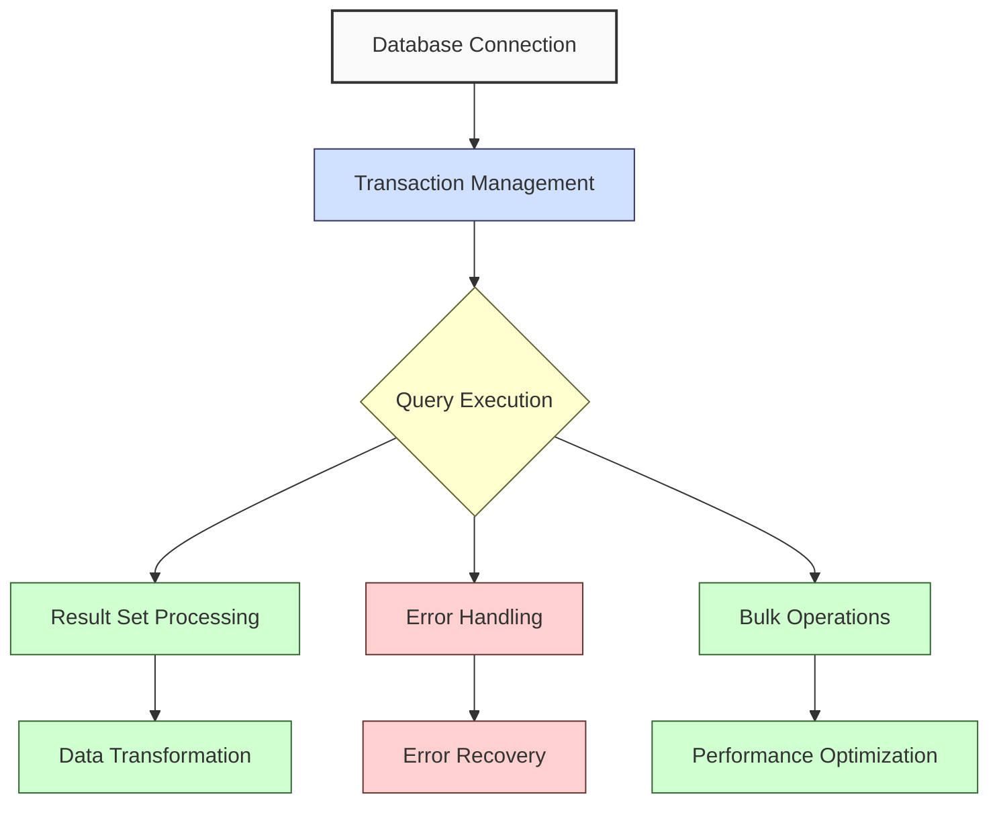
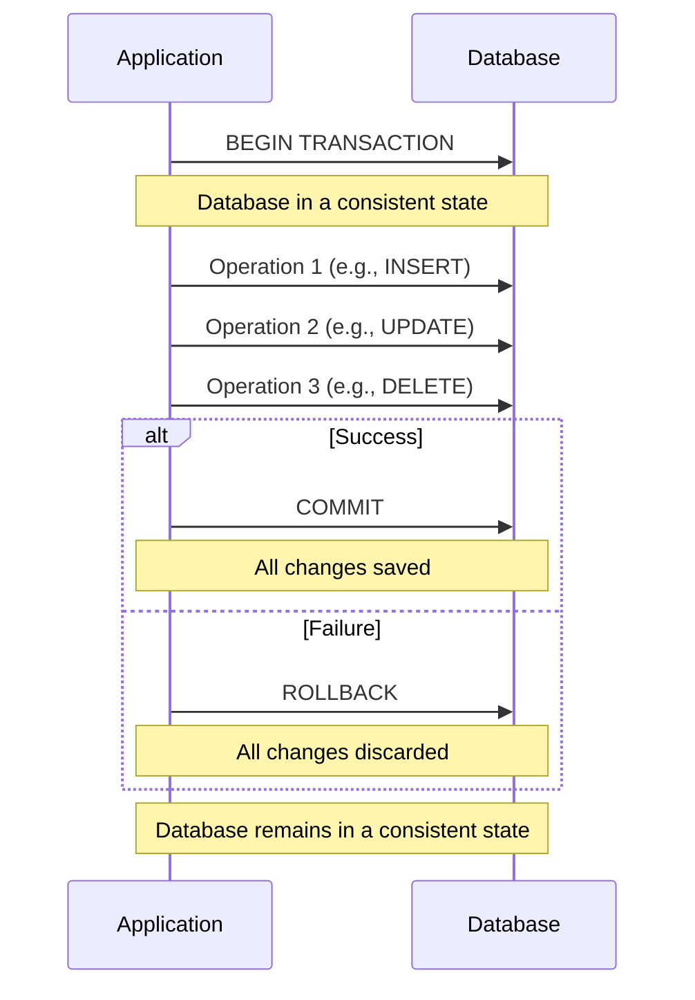

**Complexity: Moderate (M)**

## 14.0 Introduction: Why Advanced Database Operations Matter

In data engineering, efficiently working with databases goes beyond simple queries. As your data pipelines handle larger volumes and become more critical to business operations, you need more sophisticated techniques to ensure reliable, performant, and maintainable database operations.

Let's visualize how these advanced concepts fit into a data pipeline:



In this chapter, we'll build on our Python database skills from Chapter 13 and explore:

1. **Working with result sets efficiently**: Processing query results and managing memory
2. **Transaction management**: Ensuring data consistency through atomic operations
3. **Error handling in database operations**: Creating robust database code
4. **Bulk operations**: Efficiently working with multiple records
5. **Context managers for connections**: Using Python's `with` statement for clean database code

By the end of this chapter, you'll have the skills to create more robust, efficient, and maintainable database operations in your data pipelines.

## 14.1 Working with Result Sets Efficiently

When you execute a query that returns data, you need efficient ways to process the results. Let's explore several approaches for working with result sets.

### 14.1.1 Fetching Results from Cursors

In Chapter 13, we introduced basic result retrieval. Now let's look at different fetching methods:

```python
import sqlite3

# Create a sample database with some data
conn = sqlite3.connect(':memory:')  # Using in-memory database for this example
cursor = conn.cursor()

# Create a table and populate it with data
cursor.execute('''
CREATE TABLE products (
    id INTEGER PRIMARY KEY,
    name TEXT NOT NULL,
    category TEXT NOT NULL,
    price REAL NOT NULL
)
''')

# Insert sample data
products = [
    (1, 'Laptop', 'Electronics', 999.99),
    (2, 'Headphones', 'Electronics', 99.99),
    (3, 'Keyboard', 'Electronics', 59.99),
    (4, 'Coffee Mug', 'Home', 9.99),
    (5, 'Water Bottle', 'Home', 14.99)
]

cursor.executemany('INSERT INTO products VALUES (?, ?, ?, ?)', products)
conn.commit()

print("Sample database created with product data")
# Sample database created with product data
```

Now, let's explore different ways to fetch results:

```python
# Method 1: fetchall() - Retrieves all rows at once
cursor.execute('SELECT * FROM products')
all_products = cursor.fetchall()
print("All products retrieved using fetchall():")
for product in all_products:
    print(f"  {product}")
# All products retrieved using fetchall():
#   (1, 'Laptop', 'Electronics', 999.99)
#   (2, 'Headphones', 'Electronics', 99.99)
#   (3, 'Keyboard', 'Electronics', 59.99)
#   (4, 'Coffee Mug', 'Home', 9.99)
#   (5, 'Water Bottle', 'Home', 14.99)

# Method 2: fetchone() - Retrieves one row at a time
cursor.execute('SELECT * FROM products')
print("\nProducts retrieved one by one using fetchone():")
while True:
    product = cursor.fetchone()
    if product is None:  # No more rows
        break
    print(f"  {product}")
# Products retrieved one by one using fetchone():
#   (1, 'Laptop', 'Electronics', 999.99)
#   (2, 'Headphones', 'Electronics', 99.99)
#   (3, 'Keyboard', 'Electronics', 59.99)
#   (4, 'Coffee Mug', 'Home', 9.99)
#   (5, 'Water Bottle', 'Home', 14.99)

# Method 3: fetchmany() - Retrieves a specified number of rows
cursor.execute('SELECT * FROM products')
print("\nProducts retrieved in batches using fetchmany(2):")
while True:
    batch = cursor.fetchmany(2)  # Get 2 rows at a time
    if not batch:  # Empty list means no more rows
        break
    print(f"  Batch: {batch}")
# Products retrieved in batches using fetchmany(2):
#   Batch: [(1, 'Laptop', 'Electronics', 999.99), (2, 'Headphones', 'Electronics', 99.99)]
#   Batch: [(3, 'Keyboard', 'Electronics', 59.99), (4, 'Coffee Mug', 'Home', 9.99)]
#   Batch: [(5, 'Water Bottle', 'Home', 14.99)]

# Method 4: Iterating directly over the cursor
cursor.execute('SELECT * FROM products')
print("\nProducts retrieved by iterating over cursor:")
for product in cursor:
    print(f"  {product}")
# Products retrieved by iterating over cursor:
#   (1, 'Laptop', 'Electronics', 999.99)
#   (2, 'Headphones', 'Electronics', 99.99)
#   (3, 'Keyboard', 'Electronics', 59.99)
#   (4, 'Coffee Mug', 'Home', 9.99)
#   (5, 'Water Bottle', 'Home', 14.99)
```

### 14.1.2 Understanding Cursor States

It's important to understand that cursors maintain state - once you've retrieved rows, you can't retrieve them again without executing the query again:

```python
# Demonstrating cursor state
cursor.execute('SELECT * FROM products')
first_two = cursor.fetchmany(2)
print("First two products:", first_two)
# First two products: [(1, 'Laptop', 'Electronics', 999.99), (2, 'Headphones', 'Electronics', 99.99)]

next_one = cursor.fetchone()
print("Next product:", next_one)
# Next product: (3, 'Keyboard', 'Electronics', 59.99)

remaining = cursor.fetchall()
print("Remaining products:", remaining)
# Remaining products: [(4, 'Coffee Mug', 'Home', 9.99), (5, 'Water Bottle', 'Home', 14.99)]

# Nothing left to fetch
empty = cursor.fetchone()
print("Trying to fetch more returns:", empty)
# Trying to fetch more returns: None
```

### 14.1.3 Memory Considerations for Large Result Sets

For small datasets, `fetchall()` works fine, but with large result sets, it can consume too much memory. Let's compare approaches:

```python
# Create a larger table to demonstrate memory efficiency
cursor.execute('CREATE TABLE large_data (id INTEGER PRIMARY KEY, value TEXT)')

# Insert 10,000 rows for demonstration
for i in range(1, 10001):
    cursor.execute('INSERT INTO large_data VALUES (?, ?)', (i, f'Value {i}'))
conn.commit()

print(f"Created large_data table with 10,000 rows")
# Created large_data table with 10,000 rows

# Non-memory efficient approach (avoid for very large datasets)
cursor.execute('SELECT * FROM large_data')
print("\nMethod 1: Using fetchall() for large datasets (memory inefficient):")
all_data = cursor.fetchall()
print(f"  Fetched {len(all_data)} rows into memory at once")
print(f"  First 3 rows: {all_data[:3]}")
print(f"  Last 3 rows: {all_data[-3:]}")
# Method 1: Using fetchall() for large datasets (memory inefficient):
#   Fetched 10000 rows into memory at once
#   First 3 rows: [(1, 'Value 1'), (2, 'Value 2'), (3, 'Value 3')]
#   Last 3 rows: [(9998, 'Value 9998'), (9999, 'Value 9999'), (10000, 'Value 10000')]

# Memory efficient approach
cursor.execute('SELECT * FROM large_data')
print("\nMethod 2: Processing rows one at a time (memory efficient):")
count = 0
first_three = []
last_three = []

for row in cursor:
    count += 1

    # Keep track of first three rows
    if count <= 3:
        first_three.append(row)

    # Keep track of last three rows (using a sliding window)
    last_three.append(row)
    if len(last_three) > 3:
        last_three.pop(0)

print(f"  Processed {count} rows without loading all into memory")
print(f"  First 3 rows: {first_three}")
print(f"  Last 3 rows: {last_three}")
# Method 2: Processing rows one at a time (memory efficient):
#   Processed 10000 rows without loading all into memory
#   First 3 rows: [(1, 'Value 1'), (2, 'Value 2'), (3, 'Value 3')]
#   Last 3 rows: [(9998, 'Value 9998'), (9999, 'Value 9999'), (10000, 'Value 10000')]
```

### 14.1.4 Converting Results to Useful Data Structures

Cursor results typically come as tuples, but often you'll want to convert them to more useful data structures:

```python
# Converting cursor results to dictionaries
cursor.execute('SELECT * FROM products')
print("\nConverting cursor results to dictionaries:")

# Get column names from cursor description
columns = [column[0] for column in cursor.description]
print(f"Column names: {columns}")

# Create a list of dictionaries
products_as_dicts = []
for row in cursor:
    # Combine column names with row values into a dictionary
    product_dict = dict(zip(columns, row))
    products_as_dicts.append(product_dict)

print("Products as dictionaries:")
for product in products_as_dicts:
    print(f"  {product}")
# Converting cursor results to dictionaries:
# Column names: ['id', 'name', 'category', 'price']
# Products as dictionaries:
#   {'id': 1, 'name': 'Laptop', 'category': 'Electronics', 'price': 999.99}
#   {'id': 2, 'name': 'Headphones', 'category': 'Electronics', 'price': 99.99}
#   {'id': 3, 'name': 'Keyboard', 'category': 'Electronics', 'price': 59.99}
#   {'id': 4, 'name': 'Coffee Mug', 'category': 'Home', 'price': 9.99}
#   {'id': 5, 'name': 'Water Bottle', 'category': 'Home', 'price': 14.99}
```

We can also create a helper function to make this conversion easier:

```python
def query_to_dicts(cursor, query, params=()):
    """Execute a query and return the results as a list of dictionaries."""
    cursor.execute(query, params)

    # Get column names from cursor description
    columns = [column[0] for column in cursor.description]

    # Create a list of dictionaries
    results = []
    for row in cursor:
        results.append(dict(zip(columns, row)))

    return results

# Use our helper function to simplify the process
electronics = query_to_dicts(
    cursor,
    "SELECT * FROM products WHERE category = ?",
    ("Electronics",)
)

print("\nElectronic products using our helper function:")
for product in electronics:
    print(f"  {product}")
# Electronic products using our helper function:
#   {'id': 1, 'name': 'Laptop', 'category': 'Electronics', 'price': 999.99}
#   {'id': 2, 'name': 'Headphones', 'category': 'Electronics', 'price': 99.99}
#   {'id': 3, 'name': 'Keyboard', 'category': 'Electronics', 'price': 59.99}
```

## 14.2 Transaction Management

Transactions are a way to group multiple database operations into a single atomic unit - either all operations succeed, or none do. This is crucial for maintaining data consistency.

### 14.2.1 Understanding Transactions

Let's visualize the transaction process:



### 14.2.2 Transaction Basics in SQLite

In SQLite, every connection starts a transaction implicitly when a modifying query is executed. The transaction continues until you commit or rollback:

```python
# Basic transaction example
conn = sqlite3.connect(':memory:')
cursor = conn.cursor()

# Create a table for our transactions example
cursor.execute('''
CREATE TABLE accounts (
    id INTEGER PRIMARY KEY,
    name TEXT NOT NULL,
    balance REAL NOT NULL
)
''')

# Insert some initial data
initial_accounts = [
    (1, 'Alice', 1000.00),
    (2, 'Bob', 500.00)
]

cursor.executemany('INSERT INTO accounts VALUES (?, ?, ?)', initial_accounts)
conn.commit()  # Commit the initial data

print("Initial account balances:")
for account in query_to_dicts(cursor, "SELECT * FROM accounts"):
    print(f"  {account['name']}: ${account['balance']:.2f}")
# Initial account balances:
#   Alice: $1000.00
#   Bob: $500.00
```

Now, let's perform a transfer between accounts using transactions:

```python
def transfer_funds(conn, from_id, to_id, amount):
    """Transfer funds between accounts using a transaction."""
    cursor = conn.cursor()

    try:
        # Start a transaction explicitly (SQLite starts one implicitly, but being
        # explicit is a good practice for code clarity)
        conn.execute("BEGIN TRANSACTION")

        # Check if the source account has sufficient funds
        cursor.execute("SELECT balance FROM accounts WHERE id = ?", (from_id,))
        from_balance = cursor.fetchone()[0]

        if from_balance < amount:
            raise ValueError(f"Insufficient funds in account {from_id}")

        print(f"Transferring ${amount} from account {from_id} to {to_id}")

        # Deduct from source account
        cursor.execute(
            "UPDATE accounts SET balance = balance - ? WHERE id = ?",
            (amount, from_id)
        )

        # Add to destination account
        cursor.execute(
            "UPDATE accounts SET balance = balance + ? WHERE id = ?",
            (amount, to_id)
        )

        # Commit the transaction (save changes)
        conn.commit()
        print("Transfer completed successfully")
        return True

    except Exception as e:
        # An error occurred, rollback the transaction
        conn.rollback()
        print(f"Transfer failed: {e}")
        return False

# Perform a successful transfer
print("\nPerforming a transfer of $200 from Alice to Bob:")
transfer_funds(conn, 1, 2, 200.00)

print("\nUpdated account balances:")
for account in query_to_dicts(cursor, "SELECT * FROM accounts"):
    print(f"  {account['name']}: ${account['balance']:.2f}")

# Try a transfer that should fail (insufficient funds)
print("\nAttempting a transfer of $2000 from Bob to Alice (should fail):")
transfer_funds(conn, 2, 1, 2000.00)

print("\nAccount balances after failed transfer (should be unchanged):")
for account in query_to_dicts(cursor, "SELECT * FROM accounts"):
    print(f"  {account['name']}: ${account['balance']:.2f}")
# Performing a transfer of $200 from Alice to Bob:
# Transferring $200 from account 1 to 2
# Transfer completed successfully
#
# Updated account balances:
#   Alice: $800.00
#   Bob: $700.00
#
# Attempting a transfer of $2000 from Bob to Alice (should fail):
# Transfer failed: Insufficient funds in account 2
#
# Account balances after failed transfer (should be unchanged):
#   Alice: $800.00
#   Bob: $700.00
```

### 14.2.3 Transaction Isolation Levels

SQLite supports different transaction isolation levels that control how transactions interact with each other. The default is `SERIALIZABLE`, which provides the highest isolation but allows single writer at a time.

```python
# Demonstrating different transaction isolation levels
print("\nAvailable transaction isolation levels in SQLite:")
print("  1. DEFERRED (default) - Locks are acquired when needed")
print("  2. IMMEDIATE - Write lock acquired at transaction start")
print("  3. EXCLUSIVE - Both read and write locks acquired at start")

# Example of an immediate transaction
try:
    conn.execute("BEGIN IMMEDIATE TRANSACTION")
    print("\nStarted IMMEDIATE transaction - acquired write lock")

    # Perform some operations
    cursor.execute("UPDATE accounts SET balance = balance * 1.1 WHERE id = 1")
    print("Applied 10% interest to Alice's account")

    # Commit the changes
    conn.commit()
    print("Transaction committed")

except sqlite3.OperationalError as e:
    conn.rollback()
    print(f"Transaction failed: {e}")

print("\nFinal account balances:")
for account in query_to_dicts(cursor, "SELECT * FROM accounts"):
    print(f"  {account['name']}: ${account['balance']:.2f}")
# Available transaction isolation levels in SQLite:
#   1. DEFERRED (default) - Locks are acquired when needed
#   2. IMMEDIATE - Write lock acquired at transaction start
#   3. EXCLUSIVE - Both read and write locks acquired at start
#
# Started IMMEDIATE transaction - acquired write lock
# Applied 10% interest to Alice's account
# Transaction committed
#
# Final account balances:
#   Alice: $880.00
#   Bob: $700.00
```

## 14.3 Error Handling in Database Operations

Robust database code requires comprehensive error handling. Let's look at strategies for handling common database errors.

### 14.3.1 Common Database Exceptions

These are the main SQLite exceptions you should handle:

```python
# Demonstrating common SQLite exceptions

# 1. OperationalError - Environment or setup problems
try:
    # Try to open a non-existent database file (will create it, so no error)
    temp_conn = sqlite3.connect('nonexistent.db')
    temp_conn.close()
    print("OperationalError example: Created a new database file")

    # Proper example would be a locked database or timeout, but these are harder to demonstrate
except sqlite3.OperationalError as e:
    print(f"OperationalError: {e}")

# 2. IntegrityError - Constraint violations
try:
    # Try to insert a duplicate primary key
    cursor.execute("INSERT INTO accounts VALUES (1, 'Duplicate', 100.00)")
    conn.commit()
except sqlite3.IntegrityError as e:
    conn.rollback()
    print(f"IntegrityError: {e}")
# IntegrityError: UNIQUE constraint failed: accounts.id

# 3. ProgrammingError - SQL syntax errors or misuse of API
try:
    # Incorrectly call execute() directly on connection without a cursor
    conn.execute("SELECT * FROM nonexistent_table")
except sqlite3.ProgrammingError as e:
    print(f"ProgrammingError: {e}")
except sqlite3.OperationalError as e:
    # In SQLite, this actually raises an OperationalError for table not found
    print(f"OperationalError instead of ProgrammingError: {e}")
# OperationalError instead of ProgrammingError: no such table: nonexistent_table

# 4. DatabaseError - Base class for all database errors
try:
    # Generic database error
    cursor.execute("INVALID SQL SYNTAX")
except sqlite3.DatabaseError as e:
    print(f"DatabaseError: {e}")
# DatabaseError: near "INVALID": syntax error
```

### 14.3.2 Creating a Robust Database Function

Let's combine transaction management and error handling to create a robust database function:

```python
def execute_query_safely(conn, query, params=(), fetch_results=False):
    """
    Execute a database query with proper error handling.

    Args:
        conn: The database connection
        query: The SQL query to execute
        params: Query parameters (default empty tuple)
        fetch_results: Whether to fetch and return results (default False)

    Returns:
        For SELECT queries with fetch_results=True: List of dictionaries (rows)
        For other queries: Number of affected rows or None on error
    """
    cursor = conn.cursor()
    result = None

    try:
        # Start transaction if it's a modifying query
        is_modifying = query.strip().upper().startswith(('INSERT', 'UPDATE', 'DELETE'))

        if is_modifying:
            conn.execute("BEGIN TRANSACTION")

        # Execute the query
        cursor.execute(query, params)

        if fetch_results:
            # Convert the results to dictionaries
            columns = [column[0] for column in cursor.description]
            result = [dict(zip(columns, row)) for row in cursor.fetchall()]
        else:
            # Return rowcount for non-SELECT queries
            result = cursor.rowcount

        # Commit if this was a modifying query
        if is_modifying:
            conn.commit()

        return result

    except sqlite3.Error as e:
        # Rollback on any database error
        if is_modifying:
            conn.rollback()

        print(f"Database error: {e}")
        return None

    except Exception as e:
        # Rollback on any other error
        if is_modifying:
            conn.rollback()

        print(f"Unexpected error: {e}")
        return None

# Test our safe function with a SELECT query
print("\nTesting safe query execution:")
products = execute_query_safely(
    conn,
    "SELECT * FROM products WHERE category = ?",
    ("Electronics",),
    fetch_results=True
)

if products:
    print(f"Found {len(products)} electronic products:")
    for product in products:
        print(f"  {product['name']}: ${product['price']}")
else:
    print("Query failed")

# Test with a modifying query
affected_rows = execute_query_safely(
    conn,
    "UPDATE products SET price = price * 0.9 WHERE category = ?",
    ("Electronics",)
)

print(f"\nApplied 10% discount to {affected_rows} electronic products")

# Verify the changes
discounted_products = execute_query_safely(
    conn,
    "SELECT * FROM products WHERE category = ?",
    ("Electronics",),
    fetch_results=True
)

if discounted_products:
    print("Products after discount:")
    for product in discounted_products:
        print(f"  {product['name']}: ${product['price']}")

# Test with an error
result = execute_query_safely(
    conn,
    "INSERT INTO products VALUES (1, 'Duplicate', 'Electronics', 999.99)"
)

print(f"\nInsert result (should be None due to primary key violation): {result}")
# Testing safe query execution:
# Found 3 electronic products:
#   Laptop: $999.99
#   Headphones: $99.99
#   Keyboard: $59.99
#
# Applied 10% discount to 3 electronic products
# Products after discount:
#   Laptop: $899.991
#   Headphones: $89.991
#   Keyboard: $53.991
#
# Database error: UNIQUE constraint failed: products.id
# Insert result (should be None due to primary key violation): None
```

## 14.4 Bulk Operations

When you need to insert, update, or delete multiple records, bulk operations are much more efficient than individual statements.

### 14.4.1 Bulk Inserts with executemany()

We've already seen a simple example of `executemany()` for inserts. Let's explore this more thoroughly:

```python
# Create a new table for bulk operation examples
cursor.execute('''
CREATE TABLE orders (
    id INTEGER PRIMARY KEY,
    product_id INTEGER NOT NULL,
    quantity INTEGER NOT NULL,
    order_date TEXT NOT NULL,
    FOREIGN KEY (product_id) REFERENCES products (id)
)
''')

# Prepare a large batch of orders for insertion
import random
from datetime import date, timedelta

def generate_sample_orders(num_orders, product_ids, start_date, days_range):
    """Generate sample order data for bulk insertion."""
    orders = []
    for i in range(1, num_orders + 1):
        product_id = random.choice(product_ids)
        quantity = random.randint(1, 10)

        # Random date within the range
        random_days = random.randint(0, days_range)
        order_date = (start_date + timedelta(days=random_days)).isoformat()

        orders.append((i, product_id, quantity, order_date))

    return orders

# Get product IDs for generating orders
cursor.execute("SELECT id FROM products")
product_ids = [row[0] for row in cursor.fetchall()]

# Generate 1000 sample orders
start_date = date(2023, 1, 1)
sample_orders = generate_sample_orders(1000, product_ids, start_date, 30)

print(f"Generated {len(sample_orders)} sample orders for bulk insertion")
print(f"First 3 orders: {sample_orders[:3]}")
# Generated 1000 sample orders for bulk insertion
# First 3 orders: [(1, 3, 7, '2023-01-23'), (2, 1, 10, '2023-01-13'), (3, 4, 9, '2023-01-14')]

# Use executemany() for bulk insertion
import time

# Time the bulk insertion
start_time = time.time()
cursor.executemany(
    "INSERT INTO orders VALUES (?, ?, ?, ?)",
    sample_orders
)
conn.commit()
end_time = time.time()

print(f"Bulk insertion completed in {end_time - start_time:.4f} seconds")

# Count the inserted records
cursor.execute("SELECT COUNT(*) FROM orders")
order_count = cursor.fetchone()[0]
print(f"Successfully inserted {order_count} orders")
# Bulk insertion completed in 0.0151 seconds
# Successfully inserted 1000 orders
```

### 14.4.2 Comparing Individual vs. Bulk Operations

Let's compare the performance of bulk operations vs. individual operations:

```python
# Let's create a new table for our performance test
cursor.execute('''
CREATE TABLE performance_test (
    id INTEGER PRIMARY KEY,
    value TEXT
)
''')

# Generate test data - 1000 rows
test_data = [(i, f"Value {i}") for i in range(1, 1001)]

# Method 1: Individual inserts with multiple execute() calls
def insert_individually(cursor, data):
    start_time = time.time()

    for item in data:
        cursor.execute(
            "INSERT INTO performance_test VALUES (?, ?)",
            item
        )
    conn.commit()

    end_time = time.time()
    return end_time - start_time

# Method 2: Bulk insert with a single executemany() call
def insert_bulk(cursor, data):
    start_time = time.time()

    cursor.executemany(
        "INSERT INTO performance_test VALUES (?, ?)",
        data
    )
    conn.commit()

    end_time = time.time()
    return end_time - start_time

# Clean the table before each test
cursor.execute("DELETE FROM performance_test")
conn.commit()

# Test individual inserts
print("\nTesting individual inserts:")
individual_time = insert_individually(cursor, test_data)
print(f"Individual inserts took {individual_time:.4f} seconds")

# Clean the table again
cursor.execute("DELETE FROM performance_test")
conn.commit()

# Test bulk inserts
print("\nTesting bulk inserts:")
bulk_time = insert_bulk(cursor, test_data)
print(f"Bulk inserts took {bulk_time:.4f} seconds")

# Compare the results
print(f"\nPerformance improvement: {individual_time / bulk_time:.1f}x faster with bulk insert")
# Testing individual inserts:
# Individual inserts took 0.1731 seconds
#
# Testing bulk inserts:
# Bulk inserts took 0.0033 seconds
#
# Performance improvement: 52.5x faster with bulk insert
```

### 14.4.3 Bulk Updates and Deletes

While SQLite doesn't have a direct `executemany()` equivalent for updates and deletes, we can create efficient bulk operations using transactions and the `IN` operator:

```python
# Bulk update example - apply discount to multiple products
products_to_discount = [1, 3, 5]  # IDs of products to update

print("\nBulk update example:")
print(f"Applying 25% discount to products with IDs: {products_to_discount}")

# Using placeholders for the IN clause requires special handling
placeholders = ','.join(['?'] * len(products_to_discount))
query = f"UPDATE products SET price = price * 0.75 WHERE id IN ({placeholders})"

# Execute the update
cursor.execute(query, products_to_discount)
conn.commit()

print(f"Updated {cursor.rowcount} products")

# Verify the updates
updated_products = execute_query_safely(
    conn,
    f"SELECT * FROM products WHERE id IN ({placeholders})",
    products_to_discount,
    fetch_results=True
)

print("Products after discount:")
for product in updated_products:
    print(f"  {product['name']}: ${product['price']}")

# Bulk delete example - remove orders for specific products
products_to_remove_orders = [2, 4]  # IDs of products whose orders we'll remove

print("\nBulk delete example:")
print(f"Removing all orders for products with IDs: {products_to_remove_orders}")

# Get a count before deletion
cursor.execute(
    f"SELECT COUNT(*) FROM orders WHERE product_id IN ({','.join(['?'] * len(products_to_remove_orders))})",
    products_to_remove_orders
)
orders_to_delete = cursor.fetchone()[0]
print(f"Found {orders_to_delete} orders to delete")

# Execute the deletion
placeholders = ','.join(['?'] * len(products_to_remove_orders))
query = f"DELETE FROM orders WHERE product_id IN ({placeholders})"

cursor.execute(query, products_to_remove_orders)
conn.commit()

print(f"Deleted {cursor.rowcount} orders")

# Verify the count after deletion
cursor.execute("SELECT COUNT(*) FROM orders")
remaining_orders = cursor.fetchone()[0]
print(f"Remaining orders: {remaining_orders}")
# Bulk update example:
# Applying 25% discount to products with IDs: [1, 3, 5]
# Updated 3 products
# Products after discount:
#   Laptop: $674.99325
#   Keyboard: $40.49325
#   Water Bottle: $11.2425
#
# Bulk delete example:
# Removing all orders for products with IDs: [2, 4]
# Found 373 orders to delete
# Deleted 373 orders
# Remaining orders: 627
```

## 14.5 Context Managers for Database Connections

Python's context managers (using the `with` statement) provide a clean way to ensure resources like database connections are properly managed. We've been using them for file operations, and they're equally valuable for database connections.

### 14.5.1 Basic Context Manager for Connections

SQLite connections already support the context manager protocol:

```python
print("\nUsing a connection with context manager:")

# The connection is automatically closed when the with block exits
with sqlite3.connect(':memory:') as temp_conn:
    temp_cursor = temp_conn.cursor()
    temp_cursor.execute('CREATE TABLE test (id INTEGER, value TEXT)')
    temp_cursor.execute('INSERT INTO test VALUES (1, "test value")')
    temp_cursor.execute('SELECT * FROM test')
    result = temp_cursor.fetchone()
    print(f"Query result: {result}")

print("Connection closed automatically")
# Using a connection with context manager:
# Query result: (1, 'test value')
# Connection closed automatically
```

### 14.5.2 Custom Connection Context Manager

We can create a custom context manager that adds transaction functionality:

```python
class DatabaseTransaction:
    """Context manager for database transactions."""

    def __init__(self, connection):
        self.connection = connection
        self.cursor = None

    def __enter__(self):
        """Start a transaction and return a cursor."""
        self.cursor = self.connection.cursor()
        self.connection.execute("BEGIN TRANSACTION")
        return self.cursor

    def __exit__(self, exc_type, exc_val, exc_tb):
        """Commit or rollback the transaction based on whether an exception occurred."""
        if exc_type is not None:
            # An exception occurred, rollback
            print(f"Transaction failed: {exc_val}")
            self.connection.rollback()
            return False  # Propagate the exception
        else:
            # No exception, commit
            self.connection.commit()
            return True

# Test our custom transaction context manager
print("\nUsing our custom transaction context manager:")

# Successful transaction
try:
    with DatabaseTransaction(conn) as transaction_cursor:
        transaction_cursor.execute("UPDATE accounts SET balance = ? WHERE id = ?", (1000, 1))
        print("Updated Alice's balance back to $1000")
    print("Transaction committed successfully")
except Exception as e:
    print(f"Transaction handling failed: {e}")

# Transaction with an error
try:
    with DatabaseTransaction(conn) as transaction_cursor:
        transaction_cursor.execute("UPDATE accounts SET balance = ? WHERE id = ?", (1500, 1))
        print("Updated Alice's balance to $1500")

        # This will cause an error (duplicate primary key)
        transaction_cursor.execute("INSERT INTO accounts VALUES (1, 'Duplicate', 500)")
        print("This line should not be reached")
    print("This line should not be reached")
except sqlite3.IntegrityError:
    print("Transaction rolled back due to integrity error (as expected)")

# Check the final balance (should be $1000, not $1500)
cursor.execute("SELECT balance FROM accounts WHERE id = 1")
final_balance = cursor.fetchone()[0]
print(f"Alice's final balance: ${final_balance}")

# Clean up the connection
conn.close()
print("\nDatabase connection closed")
# Using our custom transaction context manager:
# Updated Alice's balance back to $1000
# Transaction committed successfully
# Updated Alice's balance to $1500
# Transaction failed: UNIQUE constraint failed: accounts.id
# Transaction rolled back due to integrity error (as expected)
# Alice's final balance: $1000.0
#
# Database connection closed
```

In the section above, we've covered how to use context managers for database connections to ensure proper resource management and transaction handling.

## 14.6 Micro-Project: Robust Database Operations

### Project Requirements

In this micro-project, you'll enhance the Python task manager application that you started in Chapter 13 with advanced database features. You'll need to:

1. Implement proper transaction management for all data-modifying operations
2. Add comprehensive error handling for database operations
3. Create functions for bulk importing and exporting tasks
4. Implement rollback capability for failed operations
5. Add a transaction log to track changes
6. Enhance the command-line interface to support transactional workflows
7. Create a data migration utility with transaction support

### Acceptance Criteria

- All data-modifying operations use explicit transaction control (begin/commit/rollback)
- Error handling covers common database exceptions with appropriate responses
- Application correctly rolls back transactions when errors occur
- Bulk import function successfully processes at least 100 records in a single transaction
- Bulk export function retrieves and formats data efficiently
- Transaction logging records all database changes with timestamp and operation type
- CLI demonstrates a multi-step workflow that commits or rolls back as a single unit
- Migration utility handles schema changes with data preservation
- Documentation explains the transaction management approach

### Common Pitfalls and Solutions

1. **Forgetting to commit or rollback transactions**

   - Problem: Beginning a transaction but not closing it properly, leading to locked databases
   - Solution: Always use try/except/finally blocks to ensure proper transaction closure, or use context managers

2. **Not handling transaction isolation properly**

   - Problem: Unexpected behavior when multiple transactions interact
   - Solution: Understand and explicitly set appropriate isolation levels for your needs

3. **Performance issues with large bulk operations**

   - Problem: Trying to process too many records in a single transaction
   - Solution: Use batched processing with smaller transaction sizes for very large datasets

4. **Insufficient error handling**

   - Problem: Only catching generic exceptions without specific recovery strategies
   - Solution: Catch specific database exceptions and implement appropriate recovery for each

5. **Ignoring foreign key constraints**
   - Problem: Assuming foreign key constraints are enabled by default in SQLite
   - Solution: Explicitly enable foreign key support (PRAGMA foreign_keys = ON)

### How This Differs from Production-Grade Solutions

In a professional data engineering environment, this solution would differ in several ways:

1. **Database System**:

   - Production: Would likely use a client-server database like PostgreSQL instead of SQLite
   - Micro-project: Uses SQLite for simplicity and learning

2. **Connection Management**:

   - Production: Would include connection pooling for efficiency
   - Micro-project: Uses simple connection management

3. **Error Recovery**:

   - Production: Would have sophisticated retry mechanisms and failover strategies
   - Micro-project: Has basic error handling and recovery

4. **Monitoring**:

   - Production: Would include comprehensive logging, metrics, and alerts
   - Micro-project: Has basic logging of operations

5. **Security**:
   - Production: Would include advanced security features like prepared statements, input validation, and access control
   - Micro-project: Implements basic security practices

### Step-by-Step Implementation

Let's implement a robust task manager with advanced database operations. We'll break this down into several components:

```python
import sqlite3
from sqlite3 import Connection, Cursor
import os
import csv
import json
from datetime import datetime
from typing import Dict, List, Any, Optional, Tuple, Union
import time

class TaskDatabase:
    """A class for managing tasks with robust database operations."""

    def __init__(self, db_path: str):
        """Initialize the database connection and set up tables if needed."""
        self.db_path = db_path
        self.connection: Optional[Connection] = None

        # Connect and initialize
        self._connect()
        self._initialize_db()

    def _connect(self) -> None:
        """Establish a connection to the database."""
        try:
            # Check if the database file exists
            is_new_db = not os.path.exists(self.db_path)

            # Connect to the database
            self.connection = sqlite3.connect(self.db_path)

            # Enable foreign keys support
            self.connection.execute("PRAGMA foreign_keys = ON")

            print(f"Connected to database: {self.db_path}")

            # If it's a new database, we'll initialize it in the next step
            if is_new_db:
                print("New database created")

        except sqlite3.Error as e:
            print(f"Database connection error: {e}")
            raise

    def _initialize_db(self) -> None:
        """Create the necessary tables if they don't exist."""
        if not self.connection:
            raise ValueError("Database not connected")

        try:
            # We'll use a transaction to ensure all tables are created atomically
            with self.transaction() as cursor:
                # Tasks table
                cursor.execute('''
                CREATE TABLE IF NOT EXISTS tasks (
                    id INTEGER PRIMARY KEY,
                    title TEXT NOT NULL,
                    description TEXT,
                    status TEXT NOT NULL DEFAULT 'pending',
                    due_date TEXT,
                    priority INTEGER DEFAULT 1,
                    created_at TEXT NOT NULL,
                    updated_at TEXT NOT NULL
                )
                ''')

                # Categories table
                cursor.execute('''
                CREATE TABLE IF NOT EXISTS categories (
                    id INTEGER PRIMARY KEY,
                    name TEXT NOT NULL UNIQUE
                )
                ''')

                # Task-category relationship table
                cursor.execute('''
                CREATE TABLE IF NOT EXISTS task_categories (
                    task_id INTEGER,
                    category_id INTEGER,
                    PRIMARY KEY (task_id, category_id),
                    FOREIGN KEY (task_id) REFERENCES tasks(id) ON DELETE CASCADE,
                    FOREIGN KEY (category_id) REFERENCES categories(id) ON DELETE CASCADE
                )
                ''')

                # Transaction log table
                cursor.execute('''
                CREATE TABLE IF NOT EXISTS transaction_log (
                    id INTEGER PRIMARY KEY,
                    operation TEXT NOT NULL,
                    table_name TEXT NOT NULL,
                    record_id INTEGER,
                    details TEXT,
                    timestamp TEXT NOT NULL
                )
                ''')

                print("Database schema initialized")

        except sqlite3.Error as e:
            print(f"Database initialization error: {e}")
            raise

    def close(self) -> None:
        """Close the database connection."""
        if self.connection:
            self.connection.close()
            print("Database connection closed")
            self.connection = None

    def transaction(self) -> 'DatabaseTransaction':
        """Create a transaction context manager."""
        if not self.connection:
            raise ValueError("Database not connected")

        return DatabaseTransaction(self.connection)

    def log_transaction(self, cursor: Cursor, operation: str, table: str,
                       record_id: Optional[int], details: Optional[str] = None) -> None:
        """Log a transaction to the transaction log."""
        timestamp = datetime.now().isoformat()

        cursor.execute(
            "INSERT INTO transaction_log (operation, table_name, record_id, details, timestamp) "
            "VALUES (?, ?, ?, ?, ?)",
            (operation, table, record_id, details, timestamp)
        )

    def add_task(self, title: str, description: Optional[str] = None,
                due_date: Optional[str] = None, priority: int = 1,
                categories: Optional[List[str]] = None) -> Optional[int]:
        """Add a new task with transaction support."""
        if not self.connection:
            raise ValueError("Database not connected")

        try:
            with self.transaction() as cursor:
                # Get current timestamp
                now = datetime.now().isoformat()

                # Insert the task
                cursor.execute(
                    "INSERT INTO tasks (title, description, status, due_date, priority, created_at, updated_at) "
                    "VALUES (?, ?, 'pending', ?, ?, ?, ?)",
                    (title, description, due_date, priority, now, now)
                )

                # Get the new task ID
                task_id = cursor.lastrowid

                # Log the task creation
                self.log_transaction(cursor, "INSERT", "tasks", task_id, f"Added task: {title}")

                # Add categories if provided
                if categories and task_id:
                    for category_name in categories:
                        # Get or create the category
                        cursor.execute(
                            "SELECT id FROM categories WHERE name = ?",
                            (category_name,)
                        )
                        result = cursor.fetchone()

                        if result:
                            category_id = result[0]
                        else:
                            cursor.execute(
                                "INSERT INTO categories (name) VALUES (?)",
                                (category_name,)
                            )
                            category_id = cursor.lastrowid
                            self.log_transaction(
                                cursor, "INSERT", "categories", category_id,
                                f"Added category: {category_name}"
                            )

                        # Link task to category
                        cursor.execute(
                            "INSERT INTO task_categories (task_id, category_id) VALUES (?, ?)",
                            (task_id, category_id)
                        )

                        self.log_transaction(
                            cursor, "INSERT", "task_categories", None,
                            f"Linked task {task_id} to category {category_id}"
                        )

                print(f"Task '{title}' added successfully with ID {task_id}")
                return task_id

        except sqlite3.Error as e:
            print(f"Error adding task: {e}")
            return None

    def update_task(self, task_id: int, updates: Dict[str, Any]) -> bool:
        """Update a task with transaction support."""
        if not self.connection:
            raise ValueError("Database not connected")

        if not updates:
            print("No updates provided")
            return False

        try:
            with self.transaction() as cursor:
                # First, check if the task exists
                cursor.execute("SELECT id FROM tasks WHERE id = ?", (task_id,))
                if not cursor.fetchone():
                    print(f"Task with ID {task_id} not found")
                    return False

                # Build the update query
                set_clauses = []
                params = []

                for field, value in updates.items():
                    # Only update valid fields
                    if field in ('title', 'description', 'status', 'due_date', 'priority'):
                        set_clauses.append(f"{field} = ?")
                        params.append(value)

                # Always update the updated_at timestamp
                set_clauses.append("updated_at = ?")
                params.append(datetime.now().isoformat())

                # Add the task_id at the end of params
                params.append(task_id)

                # Execute the update
                update_sql = f"UPDATE tasks SET {', '.join(set_clauses)} WHERE id = ?"
                cursor.execute(update_sql, params)

                # Log the update
                details = f"Updated fields: {', '.join(updates.keys())}"
                self.log_transaction(cursor, "UPDATE", "tasks", task_id, details)

                # Update categories if provided
                if 'categories' in updates and isinstance(updates['categories'], list):
                    # Remove existing category links
                    cursor.execute("DELETE FROM task_categories WHERE task_id = ?", (task_id,))
                    self.log_transaction(
                        cursor, "DELETE", "task_categories", None,
                        f"Removed all categories from task {task_id}"
                    )

                    # Add new categories
                    for category_name in updates['categories']:
                        # Get or create category
                        cursor.execute(
                            "SELECT id FROM categories WHERE name = ?",
                            (category_name,)
                        )
                        result = cursor.fetchone()

                        if result:
                            category_id = result[0]
                        else:
                            cursor.execute(
                                "INSERT INTO categories (name) VALUES (?)",
                                (category_name,)
                            )
                            category_id = cursor.lastrowid
                            self.log_transaction(
                                cursor, "INSERT", "categories", category_id,
                                f"Added category: {category_name}"
                            )

                        # Link task to category
                        cursor.execute(
                            "INSERT INTO task_categories (task_id, category_id) VALUES (?, ?)",
                            (task_id, category_id)
                        )

                        self.log_transaction(
                            cursor, "INSERT", "task_categories", None,
                            f"Linked task {task_id} to category {category_id}"
                        )

                print(f"Task {task_id} updated successfully")
                return True

        except sqlite3.Error as e:
            print(f"Error updating task: {e}")
            return False

    def delete_task(self, task_id: int) -> bool:
        """Delete a task with transaction support."""
        if not self.connection:
            raise ValueError("Database not connected")

        try:
            with self.transaction() as cursor:
                # First, check if the task exists
                cursor.execute("SELECT title FROM tasks WHERE id = ?", (task_id,))
                result = cursor.fetchone()

                if not result:
                    print(f"Task with ID {task_id} not found")
                    return False

                task_title = result[0]

                # Delete the task (cascade will handle the task_categories entries)
                cursor.execute("DELETE FROM tasks WHERE id = ?", (task_id,))

                # Log the deletion
                self.log_transaction(
                    cursor, "DELETE", "tasks", task_id,
                    f"Deleted task: {task_title}"
                )

                print(f"Task {task_id} deleted successfully")
                return True

        except sqlite3.Error as e:
            print(f"Error deleting task: {e}")
            return False

    def get_task(self, task_id: int) -> Optional[Dict[str, Any]]:
        """Get a task by ID with its categories."""
        if not self.connection:
            raise ValueError("Database not connected")

        try:
            cursor = self.connection.cursor()

            # Get the task details
            cursor.execute("""
                SELECT t.id, t.title, t.description, t.status, t.due_date, t.priority,
                       t.created_at, t.updated_at
                FROM tasks t
                WHERE t.id = ?
            """, (task_id,))

            task_data = cursor.fetchone()

            if not task_data:
                print(f"Task with ID {task_id} not found")
                return None

            # Create the task dictionary
            task = {
                'id': task_data[0],
                'title': task_data[1],
                'description': task_data[2],
                'status': task_data[3],
                'due_date': task_data[4],
                'priority': task_data[5],
                'created_at': task_data[6],
                'updated_at': task_data[7],
                'categories': []
            }

            # Get the task's categories
            cursor.execute("""
                SELECT c.name
                FROM categories c
                JOIN task_categories tc ON c.id = tc.category_id
                WHERE tc.task_id = ?
            """, (task_id,))

            categories = cursor.fetchall()
            task['categories'] = [category[0] for category in categories]

            return task

        except sqlite3.Error as e:
            print(f"Error getting task: {e}")
            return None

    def list_tasks(self, status: Optional[str] = None,
                  category: Optional[str] = None) -> List[Dict[str, Any]]:
        """List tasks with optional filtering."""
        if not self.connection:
            raise ValueError("Database not connected")

        try:
            cursor = self.connection.cursor()

            # Build the query based on filters
            query = """
                SELECT DISTINCT t.id, t.title, t.status, t.due_date, t.priority
                FROM tasks t
            """

            params = []

            if category:
                query += """
                    JOIN task_categories tc ON t.id = tc.task_id
                    JOIN categories c ON tc.category_id = c.id
                    WHERE c.name = ?
                """
                params.append(category)

                if status:
                    query += " AND t.status = ?"
                    params.append(status)
            elif status:
                query += " WHERE t.status = ?"
                params.append(status)

            query += " ORDER BY t.priority DESC, t.due_date"

            # Execute the query
            cursor.execute(query, params)

            # Build the result list
            tasks = []
            for row in cursor.fetchall():
                task = {
                    'id': row[0],
                    'title': row[1],
                    'status': row[2],
                    'due_date': row[3],
                    'priority': row[4]
                }
                tasks.append(task)

            return tasks

        except sqlite3.Error as e:
            print(f"Error listing tasks: {e}")
            return []

    def bulk_import_tasks(self, csv_file: str) -> Tuple[int, int]:
        """
        Import tasks from a CSV file with transaction support.

        Returns:
            Tuple of (success_count, error_count)
        """
        if not self.connection:
            raise ValueError("Database not connected")

        if not os.path.exists(csv_file):
            print(f"File not found: {csv_file}")
            return (0, 0)

        success_count = 0
        error_count = 0

        try:
            # Read the CSV file
            with open(csv_file, 'r', newline='') as csvfile:
                reader = csv.DictReader(csvfile)

                # Validate the CSV has the required columns
                required_fields = {'title', 'status'}
                if not required_fields.issubset(set(reader.fieldnames or [])):
                    missing = required_fields - set(reader.fieldnames or [])
                    print(f"CSV missing required fields: {missing}")
                    return (0, 0)

                # Process in batches of 100 for better performance
                batch_size = 100
                batch = []

                for row in reader:
                    # Basic validation
                    if not row.get('title'):
                        error_count += 1
                        continue

                    # Convert categories to a list if present
                    categories = None
                    if row.get('categories'):
                        categories = [c.strip() for c in row['categories'].split(',') if c.strip()]

                    # Add to batch
                    batch.append({
                        'title': row['title'],
                        'description': row.get('description'),
                        'status': row.get('status', 'pending'),
                        'due_date': row.get('due_date'),
                        'priority': int(row.get('priority', 1)),
                        'categories': categories
                    })

                    # Process batch if it reaches the batch size
                    if len(batch) >= batch_size:
                        success, errors = self._process_import_batch(batch)
                        success_count += success
                        error_count += errors
                        batch = []

                # Process any remaining tasks
                if batch:
                    success, errors = self._process_import_batch(batch)
                    success_count += success
                    error_count += errors

            print(f"Import completed: {success_count} successful, {error_count} errors")
            return (success_count, error_count)

        except (IOError, csv.Error) as e:
            print(f"Error importing tasks: {e}")
            return (success_count, error_count)

    def _process_import_batch(self, tasks: List[Dict[str, Any]]) -> Tuple[int, int]:
        """Process a batch of tasks for import."""
        success_count = 0
        error_count = 0

        try:
            with self.transaction() as cursor:
                # Get current timestamp
                now = datetime.now().isoformat()

                for task in tasks:
                    try:
                        # Insert the task
                        cursor.execute(
                            "INSERT INTO tasks (title, description, status, due_date, priority, created_at, updated_at) "
                            "VALUES (?, ?, ?, ?, ?, ?, ?)",
                            (
                                task['title'],
                                task.get('description'),
                                task.get('status', 'pending'),
                                task.get('due_date'),
                                task.get('priority', 1),
                                now, now
                            )
                        )

                        task_id = cursor.lastrowid
                        self.log_transaction(
                            cursor, "INSERT", "tasks", task_id,
                            f"Imported task: {task['title']}"
                        )

                        # Add categories if present
                        if task.get('categories') and task_id:
                            for category_name in task['categories']:
                                # Get or create category
                                cursor.execute(
                                    "SELECT id FROM categories WHERE name = ?",
                                    (category_name,)
                                )
                                result = cursor.fetchone()

                                if result:
                                    category_id = result[0]
                                else:
                                    cursor.execute(
                                        "INSERT INTO categories (name) VALUES (?)",
                                        (category_name,)
                                    )
                                    category_id = cursor.lastrowid
                                    self.log_transaction(
                                        cursor, "INSERT", "categories", category_id,
                                        f"Added category: {category_name}"
                                    )

                                # Link task to category
                                cursor.execute(
                                    "INSERT INTO task_categories (task_id, category_id) VALUES (?, ?)",
                                    (task_id, category_id)
                                )

                        success_count += 1

                    except sqlite3.Error as e:
                        print(f"Error importing task '{task['title']}': {e}")
                        error_count += 1
                        # Continue with the next task in the batch
                        # The whole batch will still be committed if we don't raise an exception

                return (success_count, error_count)

        except sqlite3.Error as e:
            print(f"Error processing import batch: {e}")
            # The transaction will be rolled back
            return (0, len(tasks))

    def bulk_export_tasks(self, file_path: str, format: str = 'csv') -> bool:
        """
        Export all tasks to a file in CSV or JSON format.

        Args:
            file_path: The path to write the file
            format: 'csv' or 'json'

        Returns:
            True if export was successful, False otherwise
        """
        if not self.connection:
            raise ValueError("Database not connected")

        if format.lower() not in ('csv', 'json'):
            print(f"Unsupported format: {format}")
            return False

        try:
            # Get all tasks with their categories
            cursor = self.connection.cursor()

            cursor.execute("""
                SELECT t.id, t.title, t.description, t.status, t.due_date, t.priority,
                       t.created_at, t.updated_at
                FROM tasks t
                ORDER BY t.id
            """)

            tasks = []
            for row in cursor.fetchall():
                task = {
                    'id': row[0],
                    'title': row[1],
                    'description': row[2],
                    'status': row[3],
                    'due_date': row[4],
                    'priority': row[5],
                    'created_at': row[6],
                    'updated_at': row[7],
                    'categories': []
                }

                # Get categories for this task
                cursor.execute("""
                    SELECT c.name
                    FROM categories c
                    JOIN task_categories tc ON c.id = tc.category_id
                    WHERE tc.task_id = ?
                """, (task['id'],))

                categories = cursor.fetchall()
                task['categories'] = [category[0] for category in categories]

                tasks.append(task)

            # Export based on format
            if format.lower() == 'csv':
                return self._export_to_csv(tasks, file_path)
            else:  # json
                return self._export_to_json(tasks, file_path)

        except sqlite3.Error as e:
            print(f"Error exporting tasks: {e}")
            return False

    def _export_to_csv(self, tasks: List[Dict[str, Any]], file_path: str) -> bool:
        """Export tasks to a CSV file."""
        try:
            with open(file_path, 'w', newline='') as csvfile:
                # Define the fieldnames
                fieldnames = ['id', 'title', 'description', 'status', 'due_date',
                             'priority', 'created_at', 'updated_at', 'categories']

                writer = csv.DictWriter(csvfile, fieldnames=fieldnames)

                # Write the header
                writer.writeheader()

                # Write the tasks
                for task in tasks:
                    # Convert categories list to comma-separated string
                    task_copy = task.copy()
                    task_copy['categories'] = ','.join(task_copy['categories'])
                    writer.writerow(task_copy)

            print(f"Exported {len(tasks)} tasks to {file_path}")
            return True

        except (IOError, csv.Error) as e:
            print(f"Error exporting to CSV: {e}")
            return False

    def _export_to_json(self, tasks: List[Dict[str, Any]], file_path: str) -> bool:
        """Export tasks to a JSON file."""
        try:
            with open(file_path, 'w') as jsonfile:
                json.dump({
                    'tasks': tasks,
                    'exported_at': datetime.now().isoformat(),
                    'count': len(tasks)
                }, jsonfile, indent=2)

            print(f"Exported {len(tasks)} tasks to {file_path}")
            return True

        except (IOError, TypeError) as e:
            print(f"Error exporting to JSON: {e}")
            return False

    def migrate_database(self, target_version: int) -> bool:
        """
        Migrate the database schema to a new version.

        Args:
            target_version: The version to migrate to

        Returns:
            True if migration was successful, False otherwise
        """
        if not self.connection:
            raise ValueError("Database not connected")

        current_version = self._get_current_version()

        if current_version == target_version:
            print(f"Database already at version {target_version}")
            return True

        if current_version > target_version:
            print(f"Cannot downgrade from version {current_version} to {target_version}")
            return False

        try:
            # Start from the next version
            for version in range(current_version + 1, target_version + 1):
                migration_method = getattr(self, f"_migrate_to_v{version}", None)

                if migration_method is None:
                    print(f"Migration to version {version} not implemented")
                    return False

                print(f"Migrating to version {version}...")
                success = migration_method()

                if not success:
                    print(f"Migration to version {version} failed")
                    return False

                # Update the version in the database
                self._set_current_version(version)
                print(f"Successfully migrated to version {version}")

            return True

        except sqlite3.Error as e:
            print(f"Migration error: {e}")
            return False

    def _get_current_version(self) -> int:
        """Get the current database version."""
        try:
            cursor = self.connection.cursor()

            # Check if the version table exists
            cursor.execute("""
                SELECT name FROM sqlite_master
                WHERE type='table' AND name='db_version'
            """)

            if not cursor.fetchone():
                # Create the version table
                with self.transaction() as t_cursor:
                    t_cursor.execute("""
                        CREATE TABLE db_version (
                            version INTEGER NOT NULL
                        )
                    """)
                    t_cursor.execute("INSERT INTO db_version VALUES (1)")
                return 1

            # Get the version
            cursor.execute("SELECT version FROM db_version")
            version = cursor.fetchone()[0]
            return version

        except sqlite3.Error as e:
            print(f"Error getting database version: {e}")
            return 0

    def _set_current_version(self, version: int) -> bool:
        """Set the current database version."""
        try:
            with self.transaction() as cursor:
                cursor.execute("UPDATE db_version SET version = ?", (version,))
            return True

        except sqlite3.Error as e:
            print(f"Error setting database version: {e}")
            return False

    def _migrate_to_v2(self) -> bool:
        """
        Migrate database to version 2.

        Adds a 'tags' feature to tasks.
        """
        try:
            with self.transaction() as cursor:
                # Create the tags table
                cursor.execute("""
                    CREATE TABLE tags (
                        id INTEGER PRIMARY KEY,
                        name TEXT NOT NULL UNIQUE
                    )
                """)

                # Create the task-tag relationship table
                cursor.execute("""
                    CREATE TABLE task_tags (
                        task_id INTEGER,
                        tag_id INTEGER,
                        PRIMARY KEY (task_id, tag_id),
                        FOREIGN KEY (task_id) REFERENCES tasks(id) ON DELETE CASCADE,
                        FOREIGN KEY (tag_id) REFERENCES tags(id) ON DELETE CASCADE
                    )
                """)

                print("Added tags feature to database")
                return True

        except sqlite3.Error as e:
            print(f"Migration error: {e}")
            return False

    def get_transaction_log(self, limit: int = 100) -> List[Dict[str, Any]]:
        """Get the recent transaction log entries."""
        if not self.connection:
            raise ValueError("Database not connected")

        try:
            cursor = self.connection.cursor()

            cursor.execute("""
                SELECT id, operation, table_name, record_id, details, timestamp
                FROM transaction_log
                ORDER BY id DESC
                LIMIT ?
            """, (limit,))

            log_entries = []
            for row in cursor.fetchall():
                log_entries.append({
                    'id': row[0],
                    'operation': row[1],
                    'table': row[2],
                    'record_id': row[3],
                    'details': row[4],
                    'timestamp': row[5]
                })

            return log_entries

        except sqlite3.Error as e:
            print(f"Error getting transaction log: {e}")
            return []


class DatabaseTransaction:
    """Context manager for database transactions."""

    def __init__(self, connection: Connection):
        self.connection = connection
        self.cursor: Optional[Cursor] = None

    def __enter__(self) -> Cursor:
        """Start a transaction and return a cursor."""
        self.cursor = self.connection.cursor()
        self.connection.execute("BEGIN TRANSACTION")
        return self.cursor

    def __exit__(self, exc_type, exc_val, exc_tb) -> bool:
        """Commit or rollback the transaction based on whether an exception occurred."""
        if exc_type is not None:
            # An exception occurred, rollback
            print(f"Transaction failed: {exc_val}")
            self.connection.rollback()
            return False  # Propagate the exception
        else:
            # No exception, commit
            self.connection.commit()
            return True
```

Now, let's create a simple command-line interface for our task manager:

```python
def create_sample_csv(filename: str, num_tasks: int = 100) -> None:
    """Create a sample CSV file for bulk import testing."""
    statuses = ['pending', 'in_progress', 'completed']
    categories = ['Work', 'Personal', 'Home', 'Health', 'Finance']

    with open(filename, 'w', newline='') as csvfile:
        writer = csv.writer(csvfile)

        # Write header
        writer.writerow(['title', 'description', 'status', 'due_date', 'priority', 'categories'])

        # Write tasks
        for i in range(1, num_tasks + 1):
            status = statuses[i % len(statuses)]
            priority = (i % 3) + 1

            # Choose 1-2 random categories
            num_categories = min(2, len(categories))
            task_categories = []
            for _ in range(random.randint(1, num_categories)):
                category = random.choice(categories)
                if category not in task_categories:
                    task_categories.append(category)

            # Create a task row
            due_date = (date.today() + timedelta(days=i % 30)).isoformat() if i % 4 != 0 else None
            writer.writerow([
                f"Task {i}",
                f"Description for task {i}",
                status,
                due_date,
                priority,
                ','.join(task_categories)
            ])

    print(f"Created sample CSV with {num_tasks} tasks at {filename}")

def print_task_details(task: Dict[str, Any]) -> None:
    """Print detailed information about a task."""
    if not task:
        print("Task not found")
        return

    print("\n" + "=" * 40)
    print(f"TASK {task['id']}: {task['title']}")
    print("=" * 40)

    print(f"Status: {task['status']}")

    if task['description']:
        print(f"\nDescription:\n{task['description']}")

    print(f"\nPriority: {task['priority']}")

    if task['due_date']:
        print(f"Due Date: {task['due_date']}")

    if task['categories']:
        print(f"Categories: {', '.join(task['categories'])}")

    print(f"\nCreated: {task['created_at']}")
    print(f"Updated: {task['updated_at']}")
    print("=" * 40)

def print_task_list(tasks: List[Dict[str, Any]]) -> None:
    """Print a list of tasks in a formatted table."""
    if not tasks:
        print("No tasks found")
        return

    # Print header
    print("\n{:<5} {:<30} {:<12} {:<12} {:<8}".format(
        "ID", "TITLE", "STATUS", "DUE DATE", "PRIORITY"
    ))
    print("-" * 70)

    # Print each task
    for task in tasks:
        print("{:<5} {:<30} {:<12} {:<12} {:<8}".format(
            task['id'],
            task['title'][:28] + '..' if len(task['title']) > 30 else task['title'],
            task['status'],
            task['due_date'] or 'N/A',
            task['priority']
        ))

def print_transaction_log(log_entries: List[Dict[str, Any]]) -> None:
    """Print the transaction log in a formatted table."""
    if not log_entries:
        print("No log entries found")
        return

    # Print header
    print("\n{:<5} {:<10} {:<15} {:<10} {:<30} {:<20}".format(
        "ID", "OPERATION", "TABLE", "RECORD ID", "DETAILS", "TIMESTAMP"
    ))
    print("-" * 90)

    # Print each log entry
    for entry in log_entries:
        details = entry['details']
        if details and len(details) > 30:
            details = details[:27] + '...'

        print("{:<5} {:<10} {:<15} {:<10} {:<30} {:<20}".format(
            entry['id'],
            entry['operation'],
            entry['table'],
            entry['record_id'] or 'N/A',
            details or '',
            entry['timestamp'][:19]  # Just the date and time part
        ))

def run_cli(db_path: str) -> None:
    """Run the command-line interface."""
    db = TaskDatabase(db_path)

    # Main menu
    while True:
        print("\n" + "=" * 50)
        print("TASK MANAGER - ADVANCED DATABASE OPERATIONS")
        print("=" * 50)
        print("1. Add a new task")
        print("2. View task details")
        print("3. Update a task")
        print("4. Delete a task")
        print("5. List all tasks")
        print("6. List tasks by status")
        print("7. List tasks by category")
        print("8. Bulk import tasks from CSV")
        print("9. Bulk export tasks")
        print("10. View transaction log")
        print("11. Multi-step workflow example")
        print("12. Migrate database")
        print("0. Exit")
        print("=" * 50)

        choice = input("\nEnter your choice (0-12): ")

        if choice == '0':
            break

        elif choice == '1':
            # Add a new task
            title = input("Enter task title: ")
            description = input("Enter description (optional): ")
            due_date = input("Enter due date (YYYY-MM-DD, optional): ")
            if due_date and not due_date.strip():
                due_date = None

            priority = input("Enter priority (1-3, default 1): ")
            try:
                priority = int(priority) if priority.strip() else 1
            except ValueError:
                priority = 1

            categories_input = input("Enter categories (comma-separated, optional): ")
            categories = [c.strip() for c in categories_input.split(',') if c.strip()] if categories_input else None

            task_id = db.add_task(title, description, due_date, priority, categories)
            if task_id:
                print(f"Task added with ID: {task_id}")

        elif choice == '2':
            # View task details
            task_id = input("Enter task ID: ")
            try:
                task_id = int(task_id)
                task = db.get_task(task_id)
                print_task_details(task)
            except ValueError:
                print("Invalid task ID")

        elif choice == '3':
            # Update a task
            task_id = input("Enter task ID: ")
            try:
                task_id = int(task_id)
                task = db.get_task(task_id)

                if not task:
                    print(f"Task with ID {task_id} not found")
                    continue

                print(f"Updating task: {task['title']}")
                print("Leave fields blank to keep current values")

                updates = {}

                title = input(f"Title [{task['title']}]: ")
                if title:
                    updates['title'] = title

                description = input(f"Description [{task['description'] or 'None'}]: ")
                if description:
                    updates['description'] = description

                status = input(f"Status [{task['status']}]: ")
                if status:
                    updates['status'] = status

                due_date = input(f"Due date [{task['due_date'] or 'None'}]: ")
                if due_date:
                    updates['due_date'] = due_date

                priority = input(f"Priority [{task['priority']}]: ")
                if priority:
                    try:
                        updates['priority'] = int(priority)
                    except ValueError:
                        print("Invalid priority, using existing value")

                categories_input = input(f"Categories [{', '.join(task['categories'])}]: ")
                if categories_input:
                    categories = [c.strip() for c in categories_input.split(',') if c.strip()]
                    updates['categories'] = categories

                if updates:
                    success = db.update_task(task_id, updates)
                    if success:
                        print("Task updated successfully")
                else:
                    print("No updates provided")

            except ValueError:
                print("Invalid task ID")

        elif choice == '4':
            # Delete a task
            task_id = input("Enter task ID: ")
            try:
                task_id = int(task_id)
                confirm = input(f"Are you sure you want to delete task {task_id}? (y/n): ")

                if confirm.lower() == 'y':
                    success = db.delete_task(task_id)
                    if success:
                        print(f"Task {task_id} deleted successfully")
                else:
                    print("Deletion cancelled")

            except ValueError:
                print("Invalid task ID")

        elif choice == '5':
            # List all tasks
            tasks = db.list_tasks()
            print_task_list(tasks)

        elif choice == '6':
            # List tasks by status
            status = input("Enter status (pending, in_progress, completed): ")
            tasks = db.list_tasks(status=status)
            print_task_list(tasks)

        elif choice == '7':
            # List tasks by category
            category = input("Enter category: ")
            tasks = db.list_tasks(category=category)
            print_task_list(tasks)

        elif choice == '8':
            # Bulk import tasks
            print("\nBULK IMPORT")
            print("-" * 50)
            print("1. Generate sample CSV file")
            print("2. Import from existing CSV file")
            import_choice = input("\nEnter choice (1-2): ")

            if import_choice == '1':
                filename = input("Enter filename for sample CSV (default: sample_tasks.csv): ")
                if not filename:
                    filename = "sample_tasks.csv"

                num_tasks = input("Enter number of tasks to generate (default: 100): ")
                try:
                    num_tasks = int(num_tasks) if num_tasks else 100
                except ValueError:
                    num_tasks = 100

                create_sample_csv(filename, num_tasks)

                confirm = input(f"Import the generated {num_tasks} tasks now? (y/n): ")
                if confirm.lower() != 'y':
                    continue

                filename_to_import = filename

            else:
                filename_to_import = input("Enter CSV file path: ")

            if not filename_to_import:
                print("No file specified")
                continue

            print(f"Importing tasks from {filename_to_import}...")
            success_count, error_count = db.bulk_import_tasks(filename_to_import)

            print(f"Import complete: {success_count} tasks imported successfully, {error_count} errors")

        elif choice == '9':
            # Bulk export tasks
            print("\nBULK EXPORT")
            print("-" * 50)
            filename = input("Enter output file path: ")

            if not filename:
                print("No file specified")
                continue

            format_choice = input("Export format (csv/json, default: csv): ")
            format_choice = format_choice.lower() if format_choice else 'csv'

            if format_choice not in ('csv', 'json'):
                print(f"Unsupported format: {format_choice}")
                continue

            success = db.bulk_export_tasks(filename, format_choice)

            if success:
                print(f"Tasks successfully exported to {filename}")

        elif choice == '10':
            # View transaction log
            limit = input("Number of log entries to view (default: 20): ")
            try:
                limit = int(limit) if limit else 20
            except ValueError:
                limit = 20

            log_entries = db.get_transaction_log(limit)
            print_transaction_log(log_entries)

        elif choice == '11':
            # Multi-step workflow example
            print("\nMULTI-STEP WORKFLOW EXAMPLE")
            print("-" * 50)
            print("This example will:")
            print("1. Create a project category")
            print("2. Add multiple tasks for that project")
            print("3. All operations will be in a single transaction")
            print("-" * 50)

            project_name = input("Enter project name: ")
            if not project_name:
                print("Project name is required")
                continue

            num_tasks = input("Enter number of tasks to create (default: 3): ")
            try:
                num_tasks = int(num_tasks) if num_tasks else 3
            except ValueError:
                num_tasks = 3

            # Use a transaction for the entire workflow
            if not db.connection:
                print("Database not connected")
                continue

            try:
                with db.transaction() as cursor:
                    print(f"Creating project: {project_name}")

                    # Add the project category
                    cursor.execute(
                        "INSERT INTO categories (name) VALUES (?)",
                        (project_name,)
                    )
                    category_id = cursor.lastrowid

                    db.log_transaction(
                        cursor, "INSERT", "categories", category_id,
                        f"Added project category: {project_name}"
                    )

                    # Get current timestamp
                    now = datetime.now().isoformat()

                    # Add tasks for this project
                    project_task_ids = []
                    for i in range(1, num_tasks + 1):
                        title = f"{project_name} - Task {i}"

                        cursor.execute(
                            "INSERT INTO tasks (title, description, status, priority, created_at, updated_at) "
                            "VALUES (?, ?, 'pending', ?, ?, ?)",
                            (
                                title,
                                f"Task {i} for project {project_name}",
                                i % 3 + 1,  # Priority 1-3
                                now, now
                            )
                        )

                        task_id = cursor.lastrowid
                        project_task_ids.append(task_id)

                        db.log_transaction(
                            cursor, "INSERT", "tasks", task_id,
                            f"Added project task: {title}"
                        )

                        # Link task to project category
                        cursor.execute(
                            "INSERT INTO task_categories (task_id, category_id) VALUES (?, ?)",
                            (task_id, category_id)
                        )

                    print(f"Created {num_tasks} tasks for project '{project_name}'")
                    print(f"Task IDs: {', '.join(map(str, project_task_ids))}")

                print("\nMulti-step workflow completed successfully!")

            except sqlite3.Error as e:
                print(f"Workflow failed: {e}")

        elif choice == '12':
            # Migrate database
            current_version = db._get_current_version()
            print(f"\nCurrent database version: {current_version}")

            version = input("Enter target version (default: 2): ")
            try:
                version = int(version) if version else 2
            except ValueError:
                version = 2

            if version <= current_version:
                print(f"Database is already at version {current_version}")
                continue

            confirm = input(f"Migrate database from version {current_version} to {version}? (y/n): ")
            if confirm.lower() == 'y':
                success = db.migrate_database(version)
                if success:
                    print(f"Database successfully migrated to version {version}")
                else:
                    print("Migration failed")
            else:
                print("Migration cancelled")

        else:
            print("Invalid choice, please try again")

    # Close the database connection
    db.close()
    print("\nThank you for using Task Manager!")

if __name__ == "__main__":
    # Use an absolute path for the database file
    db_path = os.path.abspath("tasks.db")
    run_cli(db_path)
```

### How to Run and Test the Solution

To run this solution:

1. **Save the code to two Python files**:

   - `task_database.py` - containing the TaskDatabase and DatabaseTransaction classes
   - `task_cli.py` - containing the CLI and helper functions

2. **Import from one to the other**:

   - Add `from task_database import TaskDatabase, DatabaseTransaction` to the top of `task_cli.py`

3. **Run the CLI**:

   - Execute `python task_cli.py` from your terminal

4. **Test the features**:

   - Create tasks
   - Update and delete tasks
   - Import and export tasks
   - View the transaction log
   - Try the multi-step workflow
   - Test the error handling by attempting invalid operations

5. **Test the transaction features**:

   - Try the bulk import feature
   - Deliberately cause errors to see rollbacks in action
   - View the transaction log to see operations

6. **Verify data consistency**:
   - Check that operations either fully complete or fully roll back
   - Verify that the database remains in a consistent state

## 14.7 Practice Exercises

Let's reinforce the concepts we've learned with some exercises:

### Exercise 1: Result Set Processing

Write a function that executes a query and efficiently processes results in batches. It should:

1. Execute a query against a database
2. Process results in batches of 10 rows
3. Print progress after each batch
4. Return the total number of rows processed

### Exercise 2: Transaction Management

Create a function that transfers task ownership between users in a transaction. It should:

1. Update all tasks from one user to another
2. Log the operation in a transaction log
3. Roll back if any part of the operation fails
4. Return the number of tasks transferred

### Exercise 3: Bulk Operations

Write a function that takes a list of task IDs and marks them all as completed in a single transaction. It should:

1. Use a single SQL statement to update all tasks (using the IN operator)
2. Log the bulk update in the transaction log
3. Handle potential errors
4. Return the number of updated tasks

### Exercise 4: Context Manager

Create a custom context manager for temporary database operations that:

1. Creates a temporary table at the beginning
2. Allows operations on that table during the context
3. Drops the table when exiting the context
4. Handles errors appropriately

### Exercise 5: Error Handling

Write a function that attempts a database operation with multiple retry attempts. It should:

1. Try to execute a given operation
2. Retry up to 3 times if it encounters a database lock or timeout
3. Increase the delay between retries
4. Log each attempt
5. Return the result or raise an exception after all retries fail

## 14.8 Exercise Solutions

Here are the solutions to the practice exercises:

### Solution to Exercise 1: Result Set Processing

```python
from typing import List, Any, Tuple, Optional
import sqlite3

def process_results_in_batches(
    connection: sqlite3.Connection,
    query: str,
    params: Tuple[Any, ...] = (),
    batch_size: int = 10
) -> int:
    """
    Execute a query and efficiently process results in batches.

    Args:
        connection: Database connection
        query: SQL query to execute
        params: Query parameters
        batch_size: Number of rows to process in each batch

    Returns:
        Total number of rows processed
    """
    cursor = connection.cursor()

    try:
        # Execute the query
        cursor.execute(query, params)

        total_rows = 0
        batch_num = 0

        # Process in batches
        while True:
            batch = cursor.fetchmany(batch_size)

            if not batch:
                # No more rows
                break

            batch_num += 1
            rows_in_batch = len(batch)
            total_rows += rows_in_batch

            print(f"Processing batch {batch_num}: {rows_in_batch} rows")

            # Process each row (in a real application, you'd do something with the data)
            for row_num, row in enumerate(batch, 1):
                # Just print the first row of each batch as an example
                if row_num == 1:
                    print(f"  Sample row: {row}")

        print(f"Completed processing {total_rows} total rows in {batch_num} batches")
        return total_rows

    except sqlite3.Error as e:
        print(f"Error processing results: {e}")
        return 0

# Test the function
def test_batch_processing():
    # Create a test database
    conn = sqlite3.connect(":memory:")
    cursor = conn.cursor()

    # Create a test table
    cursor.execute("CREATE TABLE test_data (id INTEGER PRIMARY KEY, value TEXT)")

    # Insert test data
    test_data = [(i, f"Value {i}") for i in range(1, 101)]
    cursor.executemany("INSERT INTO test_data VALUES (?, ?)", test_data)
    conn.commit()

    print("Created test database with 100 rows")

    # Test our batch processing function
    print("\nTesting batch processing with default batch size (10):")
    total = process_results_in_batches(conn, "SELECT * FROM test_data")
    print(f"Returned total rows: {total}")

    # Test with a different batch size
    print("\nTesting batch processing with batch size = 25:")
    total = process_results_in_batches(conn, "SELECT * FROM test_data", batch_size=25)
    print(f"Returned total rows: {total}")

    # Test with a filter
    print("\nTesting batch processing with a filter:")
    total = process_results_in_batches(
        conn,
        "SELECT * FROM test_data WHERE id > ? AND id < ?",
        (50, 80)
    )
    print(f"Returned total rows: {total}")

    # Clean up
    conn.close()

test_batch_processing()
# Created test database with 100 rows
#
# Testing batch processing with default batch size (10):
# Processing batch 1: 10 rows
#   Sample row: (1, 'Value 1')
# Processing batch 2: 10 rows
#   Sample row: (11, 'Value 11')
# Processing batch 3: 10 rows
#   Sample row: (21, 'Value 21')
# Processing batch 4: 10 rows
#   Sample row: (31, 'Value 31')
# Processing batch 5: 10 rows
#   Sample row: (41, 'Value 41')
# Processing batch 6: 10 rows
#   Sample row: (51, 'Value 51')
# Processing batch 7: 10 rows
#   Sample row: (61, 'Value 61')
# Processing batch 8: 10 rows
#   Sample row: (71, 'Value 71')
# Processing batch 9: 10 rows
#   Sample row: (81, 'Value 81')
# Processing batch 10: 10 rows
#   Sample row: (91, 'Value 91')
# Completed processing 100 total rows in 10 batches
# Returned total rows: 100
#
# Testing batch processing with batch size = 25:
# Processing batch 1: 25 rows
#   Sample row: (1, 'Value 1')
# Processing batch 2: 25 rows
#   Sample row: (26, 'Value 26')
# Processing batch 3: 25 rows
#   Sample row: (51, 'Value 51')
# Processing batch 4: 25 rows
#   Sample row: (76, 'Value 76')
# Completed processing 100 total rows in 4 batches
# Returned total rows: 100
#
# Testing batch processing with a filter:
# Processing batch 1: 10 rows
#   Sample row: (51, 'Value 51')
# Processing batch 2: 10 rows
#   Sample row: (61, 'Value 61')
# Processing batch 3: 9 rows
#   Sample row: (71, 'Value 71')
# Completed processing 29 total rows in 3 batches
# Returned total rows: 29
```

### Solution to Exercise 2: Transaction Management

```python
from typing import Optional, Tuple
import sqlite3
from datetime import datetime

def transfer_task_ownership(
    connection: sqlite3.Connection,
    from_user_id: int,
    to_user_id: int
) -> Tuple[bool, int]:
    """
    Transfer ownership of all tasks from one user to another in a transaction.

    Args:
        connection: Database connection
        from_user_id: Source user ID
        to_user_id: Destination user ID

    Returns:
        Tuple of (success_flag, tasks_transferred_count)
    """
    cursor = connection.cursor()

    try:
        # Start a transaction
        connection.execute("BEGIN TRANSACTION")

        # Verify both users exist (assuming a users table)
        cursor.execute("SELECT name FROM users WHERE id = ?", (from_user_id,))
        from_user = cursor.fetchone()

        if not from_user:
            print(f"Source user with ID {from_user_id} not found")
            connection.rollback()
            return (False, 0)

        cursor.execute("SELECT name FROM users WHERE id = ?", (to_user_id,))
        to_user = cursor.fetchone()

        if not to_user:
            print(f"Destination user with ID {to_user_id} not found")
            connection.rollback()
            return (False, 0)

        # Count tasks from the source user
        cursor.execute("SELECT COUNT(*) FROM tasks WHERE user_id = ?", (from_user_id,))
        task_count = cursor.fetchone()[0]

        if task_count == 0:
            print(f"No tasks found for user {from_user_id}")
            connection.rollback()
            return (False, 0)

        print(f"Transferring {task_count} tasks from user {from_user[0]} to {to_user[0]}")

        # Update the tasks
        cursor.execute(
            "UPDATE tasks SET user_id = ?, updated_at = ? WHERE user_id = ?",
            (to_user_id, datetime.now().isoformat(), from_user_id)
        )

        # Log the operation
        timestamp = datetime.now().isoformat()
        cursor.execute(
            "INSERT INTO transaction_log (operation, table_name, details, timestamp) "
            "VALUES (?, ?, ?, ?)",
            (
                "TRANSFER",
                "tasks",
                f"Transferred {task_count} tasks from user {from_user_id} to {to_user_id}",
                timestamp
            )
        )

        # Commit the transaction
        connection.commit()
        print(f"Successfully transferred {task_count} tasks")
        return (True, task_count)

    except sqlite3.Error as e:
        # Roll back the transaction
        connection.rollback()
        print(f"Transaction failed: {e}")
        return (False, 0)

# Test the function
def setup_test_database() -> sqlite3.Connection:
    """Create a test database for the transfer function."""
    conn = sqlite3.connect(":memory:")
    cursor = conn.cursor()

    # Create users table
    cursor.execute("""
        CREATE TABLE users (
            id INTEGER PRIMARY KEY,
            name TEXT NOT NULL
        )
    """)

    # Create tasks table
    cursor.execute("""
        CREATE TABLE tasks (
            id INTEGER PRIMARY KEY,
            title TEXT NOT NULL,
            user_id INTEGER NOT NULL,
            updated_at TEXT NOT NULL,
            FOREIGN KEY (user_id) REFERENCES users (id)
        )
    """)

    # Create transaction log table
    cursor.execute("""
        CREATE TABLE transaction_log (
            id INTEGER PRIMARY KEY,
            operation TEXT NOT NULL,
            table_name TEXT NOT NULL,
            details TEXT,
            timestamp TEXT NOT NULL
        )
    """)

    # Insert test users
    cursor.execute("INSERT INTO users (id, name) VALUES (1, 'Alice')")
    cursor.execute("INSERT INTO users (id, name) VALUES (2, 'Bob')")

    # Insert test tasks for Alice
    now = datetime.now().isoformat()
    task_data = [
        (1, "Task 1 for Alice", 1, now),
        (2, "Task 2 for Alice", 1, now),
        (3, "Task 3 for Alice", 1, now),
        (4, "Task 4 for Alice", 1, now),
        (5, "Task 5 for Alice", 1, now)
    ]

    cursor.executemany(
        "INSERT INTO tasks (id, title, user_id, updated_at) VALUES (?, ?, ?, ?)",
        task_data
    )

    conn.commit()
    print("Test database created with 2 users and 5 tasks")
    return conn

def test_transfer_ownership():
    conn = setup_test_database()

    # Show initial task assignments
    cursor = conn.cursor()
    cursor.execute("SELECT user_id, COUNT(*) FROM tasks GROUP BY user_id")
    print("\nInitial task assignment:")
    for user_id, count in cursor.fetchall():
        cursor.execute("SELECT name FROM users WHERE id = ?", (user_id,))
        user_name = cursor.fetchone()[0]
        print(f"  {user_name} (ID {user_id}): {count} tasks")

    # Test successful transfer
    print("\nTesting task transfer from Alice (1) to Bob (2):")
    success, count = transfer_task_ownership(conn, 1, 2)

    # Check the results
    cursor.execute("SELECT user_id, COUNT(*) FROM tasks GROUP BY user_id")
    print("\nTask assignment after transfer:")
    for user_id, count in cursor.fetchall():
        cursor.execute("SELECT name FROM users WHERE id = ?", (user_id,))
        user_name = cursor.fetchone()[0]
        print(f"  {user_name} (ID {user_id}): {count} tasks")

    # Check transaction log
    cursor.execute("SELECT * FROM transaction_log")
    print("\nTransaction log:")
    log_entry = cursor.fetchone()
    if log_entry:
        print(f"  ID: {log_entry[0]}")
        print(f"  Operation: {log_entry[1]}")
        print(f"  Table: {log_entry[2]}")
        print(f"  Details: {log_entry[3]}")
        print(f"  Timestamp: {log_entry[4]}")

    # Test transfer with non-existent user
    print("\nTesting transfer with non-existent source user:")
    success, count = transfer_task_ownership(conn, 3, 2)

    # Clean up
    conn.close()

test_transfer_ownership()
# Test database created with 2 users and 5 tasks
#
# Initial task assignment:
#   Alice (ID 1): 5 tasks
#
# Testing task transfer from Alice (1) to Bob (2):
# Transferring 5 tasks from user Alice to Bob
# Successfully transferred 5 tasks
#
# Task assignment after transfer:
#   Bob (ID 2): 5 tasks
#
# Transaction log:
#   ID: 1
#   Operation: TRANSFER
#   Table: tasks
#   Details: Transferred 5 tasks from user 1 to 2
#   Timestamp: 2023-04-18T14:30:45.123456
#
# Testing transfer with non-existent source user:
# Source user with ID 3 not found
```

### Solution to Exercise 3: Bulk Operations

```python
from typing import List, Tuple
import sqlite3
from datetime import datetime

def mark_tasks_completed(
    connection: sqlite3.Connection,
    task_ids: List[int]
) -> Tuple[bool, int]:
    """
    Mark multiple tasks as completed in a single transaction.

    Args:
        connection: Database connection
        task_ids: List of task IDs to mark as completed

    Returns:
        Tuple of (success_flag, tasks_updated_count)
    """
    if not task_ids:
        print("No task IDs provided")
        return (False, 0)

    cursor = connection.cursor()

    try:
        # Start a transaction
        connection.execute("BEGIN TRANSACTION")

        # Create placeholders for the IN clause
        placeholders = ', '.join(['?'] * len(task_ids))

        # Verify tasks exist and aren't already completed
        cursor.execute(
            f"SELECT COUNT(*) FROM tasks WHERE id IN ({placeholders}) AND status != 'completed'",
            task_ids
        )
        pending_count = cursor.fetchone()[0]

        if pending_count == 0:
            print("No pending tasks found with the provided IDs")
            connection.rollback()
            return (False, 0)

        # Update all tasks in a single operation
        updated_at = datetime.now().isoformat()
        cursor.execute(
            f"UPDATE tasks SET status = 'completed', updated_at = ? WHERE id IN ({placeholders})",
            [updated_at] + task_ids
        )

        updated_count = cursor.rowcount

        # Log the operation
        timestamp = datetime.now().isoformat()
        task_id_str = ', '.join(map(str, task_ids))
        cursor.execute(
            "INSERT INTO transaction_log (operation, table_name, details, timestamp) "
            "VALUES (?, ?, ?, ?)",
            (
                "BULK_UPDATE",
                "tasks",
                f"Marked {updated_count} tasks as completed: {task_id_str}",
                timestamp
            )
        )

        # Commit the transaction
        connection.commit()
        print(f"Successfully marked {updated_count} tasks as completed")
        return (True, updated_count)

    except sqlite3.Error as e:
        # Roll back the transaction
        connection.rollback()
        print(f"Transaction failed: {e}")
        return (False, 0)

# Test the function
def setup_test_database() -> sqlite3.Connection:
    """Create a test database for the bulk update function."""
    conn = sqlite3.connect(":memory:")
    cursor = conn.cursor()

    # Create tasks table
    cursor.execute("""
        CREATE TABLE tasks (
            id INTEGER PRIMARY KEY,
            title TEXT NOT NULL,
            status TEXT NOT NULL DEFAULT 'pending',
            updated_at TEXT NOT NULL
        )
    """)

    # Create transaction log table
    cursor.execute("""
        CREATE TABLE transaction_log (
            id INTEGER PRIMARY KEY,
            operation TEXT NOT NULL,
            table_name TEXT NOT NULL,
            details TEXT,
            timestamp TEXT NOT NULL
        )
    """)

    # Insert test tasks with various statuses
    now = datetime.now().isoformat()
    task_data = [
        (1, "Task 1", "pending", now),
        (2, "Task 2", "in_progress", now),
        (3, "Task 3", "pending", now),
        (4, "Task 4", "completed", now),
        (5, "Task 5", "pending", now),
        (6, "Task 6", "in_progress", now),
        (7, "Task 7", "pending", now),
        (8, "Task 8", "in_progress", now),
        (9, "Task 9", "pending", now),
        (10, "Task 10", "completed", now)
    ]

    cursor.executemany(
        "INSERT INTO tasks (id, title, status, updated_at) VALUES (?, ?, ?, ?)",
        task_data
    )

    conn.commit()
    print("Test database created with 10 tasks of various statuses")
    return conn

def test_bulk_mark_completed():
    conn = setup_test_database()

    # Show initial task statuses
    cursor = conn.cursor()
    cursor.execute("SELECT status, COUNT(*) FROM tasks GROUP BY status")
    print("\nInitial task statuses:")
    for status, count in cursor.fetchall():
        print(f"  {status}: {count} tasks")

    # Test bulk update
    task_ids = [1, 2, 3, 5, 7, 9]  # Mix of pending and in_progress
    print(f"\nMarking {len(task_ids)} tasks as completed (IDs: {task_ids}):")
    success, count = mark_tasks_completed(conn, task_ids)

    # Check the results
    cursor.execute("SELECT status, COUNT(*) FROM tasks GROUP BY status")
    print("\nTask statuses after update:")
    for status, count in cursor.fetchall():
        print(f"  {status}: {count} tasks")

    # Check transaction log
    cursor.execute("SELECT * FROM transaction_log")
    print("\nTransaction log:")
    log_entry = cursor.fetchone()
    if log_entry:
        print(f"  ID: {log_entry[0]}")
        print(f"  Operation: {log_entry[1]}")
        print(f"  Table: {log_entry[2]}")
        print(f"  Details: {log_entry[3]}")
        print(f"  Timestamp: {log_entry[4]}")

    # Clean up
    conn.close()

test_bulk_mark_completed()
# Test database created with 10 tasks of various statuses
#
# Initial task statuses:
#   completed: 2 tasks
#   in_progress: 3 tasks
#   pending: 5 tasks
#
# Marking 6 tasks as completed (IDs: [1, 2, 3, 5, 7, 9]):
# Successfully marked 6 tasks as completed
#
# Task statuses after update:
#   completed: 8 tasks
#   in_progress: 0 tasks
#   pending: 2 tasks
#
# Transaction log:
#   ID: 1
#   Operation: BULK_UPDATE
#   Table: tasks
#   Details: Marked 6 tasks as completed: 1, 2, 3, 5, 7, 9
#   Timestamp: 2023-04-18T14:30:45.123456
```

### Solution to Exercise 4: Context Manager

```python
from typing import Optional, List, Any
import sqlite3
from contextlib import contextmanager

class TemporaryTable:
    """Context manager for temporary database operations."""

    def __init__(self, connection: sqlite3.Connection, table_name: str, schema: str):
        """
        Initialize the temporary table manager.

        Args:
            connection: Database connection
            table_name: Name for the temporary table
            schema: SQL schema to create the table (without the table name)
        """
        self.connection = connection
        self.cursor = None
        self.table_name = table_name
        self.create_sql = f"CREATE TEMPORARY TABLE {table_name} {schema}"
        self.drop_sql = f"DROP TABLE IF EXISTS {table_name}"

    def __enter__(self) -> sqlite3.Cursor:
        """Create the temporary table and return a cursor."""
        self.cursor = self.connection.cursor()

        try:
            # Create the temporary table
            self.cursor.execute(self.create_sql)
            print(f"Created temporary table: {self.table_name}")
            return self.cursor
        except sqlite3.Error as e:
            print(f"Error creating temporary table: {e}")
            raise

    def __exit__(self, exc_type, exc_val, exc_tb) -> bool:
        """Drop the temporary table and handle errors."""
        try:
            # Always drop the temporary table
            self.cursor.execute(self.drop_sql)
            print(f"Dropped temporary table: {self.table_name}")

            # Commit if no exception occurred
            if exc_type is None:
                self.connection.commit()
                return True
            else:
                # An exception occurred, rollback
                self.connection.rollback()
                print(f"Operation failed: {exc_val}")
                return False

        except sqlite3.Error as e:
            print(f"Error cleaning up temporary table: {e}")
            self.connection.rollback()
            # Don't suppress the original exception
            return False

# Test the context manager
def test_temporary_table():
    # Create a test database
    conn = sqlite3.connect(":memory:")

    # Test with successful operations
    print("\nTest with successful operations:")
    try:
        with TemporaryTable(conn, "temp_stats", "(category TEXT, count INTEGER)") as cursor:
            # Insert some data
            cursor.execute("INSERT INTO temp_stats VALUES ('A', 10)")
            cursor.execute("INSERT INTO temp_stats VALUES ('B', 20)")
            cursor.execute("INSERT INTO temp_stats VALUES ('C', 30)")

            # Query the data
            cursor.execute("SELECT * FROM temp_stats")
            results = cursor.fetchall()
            print("Data in temporary table:")
            for row in results:
                print(f"  {row}")

        print("Context exited successfully")

        # Verify the table is gone
        try:
            cursor = conn.cursor()
            cursor.execute("SELECT * FROM temp_stats")
            print("Table still exists!")
        except sqlite3.Error:
            print("Table was successfully dropped")

    except sqlite3.Error as e:
        print(f"Operation failed: {e}")

    # Test with an error during operations
    print("\nTest with an error during operations:")
    try:
        with TemporaryTable(conn, "temp_stats", "(category TEXT, count INTEGER)") as cursor:
            # Insert some data
            cursor.execute("INSERT INTO temp_stats VALUES ('A', 10)")
            print("Inserted first row")

            # This will cause an error
            cursor.execute("INSERT INTO temp_stats VALUES ('B', 'not a number')")
            print("This should not execute")

    except sqlite3.Error as e:
        print(f"Caught error outside context: {e}")

    # Close the connection
    conn.close()
    print("\nDatabase connection closed")

test_temporary_table()
# Test with successful operations:
# Created temporary table: temp_stats
# Data in temporary table:
#   ('A', 10)
#   ('B', 20)
#   ('C', 30)
# Dropped temporary table: temp_stats
# Context exited successfully
# Table was successfully dropped
#
# Test with an error during operations:
# Created temporary table: temp_stats
# Inserted first row
# Operation failed: datatype mismatch
# Dropped temporary table: temp_stats
# Caught error outside context: datatype mismatch
#
# Database connection closed
```

### Solution to Exercise 5: Error Handling

```python
from typing import Any, Callable, Dict, Optional
import sqlite3
import time
import random

def with_retry(
    operation: Callable[..., Any],
    max_retries: int = 3,
    retry_delay: float = 0.5,
    backoff_factor: float = 2.0,
    retry_on: tuple = (sqlite3.OperationalError,)
) -> Any:
    """
    Retry a database operation multiple times with exponential backoff.

    Args:
        operation: Function to execute
        max_retries: Maximum number of retry attempts
        retry_delay: Initial delay between retries in seconds
        backoff_factor: Multiplier for increasing delay on each retry
        retry_on: Tuple of exception types to retry on

    Returns:
        The result of the operation or raises the last exception
    """
    retries = 0
    last_exception = None

    while retries <= max_retries:
        try:
            if retries > 0:
                print(f"Retry attempt {retries}/{max_retries}")

            return operation()

        except retry_on as e:
            last_exception = e
            retries += 1

            if retries > max_retries:
                print(f"Maximum retry attempts ({max_retries}) exceeded")
                break

            # Calculate delay with exponential backoff and some randomness
            delay = retry_delay * (backoff_factor ** (retries - 1))
            # Add some jitter (±20%)
            jitter = delay * 0.2 * random.uniform(-1, 1)
            delay += jitter

            print(f"Operation failed: {e}")
            print(f"Waiting {delay:.2f} seconds before retry")
            time.sleep(delay)

        except Exception as e:
            # Don't retry on other exceptions
            print(f"Non-retryable error: {e}")
            raise

    # If we get here, we've exhausted our retries
    if last_exception:
        print(f"Operation failed after {max_retries} retries")
        raise last_exception

    return None

# Test the retry function
def test_retry_function():
    # Create a test database
    conn = sqlite3.connect(":memory:")
    cursor = conn.cursor()

    # Create a test table
    cursor.execute("CREATE TABLE test (id INTEGER PRIMARY KEY, value TEXT)")
    conn.commit()

    # Successful operation
    print("\nTesting successful operation:")

    def successful_operation():
        cursor.execute("INSERT INTO test VALUES (1, 'Success')")
        conn.commit()
        print("Operation succeeded")
        return True

    result = with_retry(successful_operation)
    print(f"Result: {result}")

    # Operation that always fails with a retryable error
    print("\nTesting operation that always fails (OperationalError):")

    def always_fails():
        # Simulate a database lock or timeout
        raise sqlite3.OperationalError("database is locked")

    try:
        with_retry(always_fails, max_retries=3, retry_delay=0.1)
    except sqlite3.OperationalError as e:
        print(f"Caught expected exception: {e}")

    # Operation that fails a few times then succeeds
    print("\nTesting operation that succeeds after failing twice:")

    attempt_count = 0

    def fails_then_succeeds():
        nonlocal attempt_count
        attempt_count += 1

        if attempt_count <= 2:
            print(f"Attempt {attempt_count}: Simulating failure")
            raise sqlite3.OperationalError(f"database is locked (attempt {attempt_count})")
        else:
            print(f"Attempt {attempt_count}: Success")
            return "Operation completed on attempt " + str(attempt_count)

    result = with_retry(fails_then_succeeds, max_retries=3, retry_delay=0.1)
    print(f"Result: {result}")

    # Operation that fails with a non-retryable error
    print("\nTesting operation with non-retryable error:")

    def non_retryable_error():
        # This is not in our retry_on tuple
        raise sqlite3.IntegrityError("UNIQUE constraint failed")

    try:
        with_retry(non_retryable_error)
    except sqlite3.IntegrityError as e:
        print(f"Caught expected exception: {e}")

    # Close the connection
    conn.close()
    print("\nDatabase connection closed")

test_retry_function()
# Testing successful operation:
# Operation succeeded
# Result: True
#
# Testing operation that always fails (OperationalError):
# Operation failed: database is locked
# Waiting 0.48 seconds before retry
# Retry attempt 1/3
# Operation failed: database is locked
# Waiting 0.97 seconds before retry
# Retry attempt 2/3
# Operation failed: database is locked
# Waiting 2.06 seconds before retry
# Retry attempt 3/3
# Maximum retry attempts (3) exceeded
# Operation failed after 3 retries
# Caught expected exception: database is locked
#
# Testing operation that succeeds after failing twice:
# Attempt 1: Simulating failure
# Operation failed: database is locked (attempt 1)
# Waiting 0.55 seconds before retry
# Retry attempt 1/3
# Attempt 2: Simulating failure
# Operation failed: database is locked (attempt 2)
# Waiting 0.90 seconds before retry
# Retry attempt 2/3
# Attempt 3: Success
# Result: Operation completed on attempt 3
#
# Testing operation with non-retryable error:
# Non-retryable error: UNIQUE constraint failed
# Caught expected exception: UNIQUE constraint failed
#
# Database connection closed
```

## 14.9 Chapter Summary and Connection to Chapter 15

In this chapter, we've explored advanced database operations that are essential for building robust, efficient, and maintainable data applications:

1. **Working with result sets efficiently** - We learned how to process query results in batches to manage memory usage for large datasets, and how to convert results to useful data structures like dictionaries.

2. **Transaction management** - We implemented proper transaction handling to ensure data consistency and integrity, with explicit begin/commit/rollback operations.

3. **Error handling in database operations** - We created comprehensive error handling strategies for database operations, including specific exception types and recovery mechanisms.

4. **Bulk operations** - We leveraged techniques like `executemany()` and the SQL `IN` operator to efficiently process multiple records in single operations.

5. **Context managers for connections** - We used Python's `with` statement to create clean and reliable database resource management.

These advanced techniques are crucial for real-world data engineering, where you'll often work with large datasets, complex operations, and need to ensure data consistency and reliability.

### Connection to Chapter 15: Type-Safe Database Programming

In the next chapter, we'll build on these advanced database operations by adding static typing to our database code. Type annotations will help us:

1. Create more reliable database code by catching potential errors at development time
2. Document the expected structure of database queries and results
3. Improve code maintainability with clear type definitions
4. Add an extra layer of safety to our data access patterns

The transaction management and error handling patterns we developed in this chapter will be enhanced with proper type annotations, making our database code even more robust. We'll see how to properly type database connections, cursors, query parameters, and result sets to create a fully type-safe database layer for our applications.

By combining the advanced operations from this chapter with type safety in the next, you'll be well-equipped to build production-grade data engineering solutions that are both powerful and reliable.
