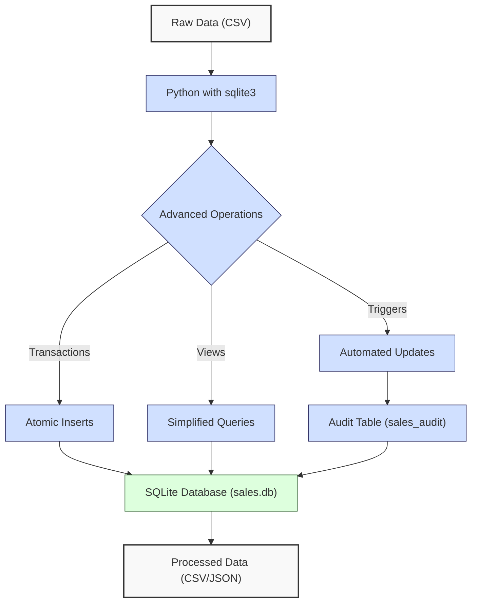
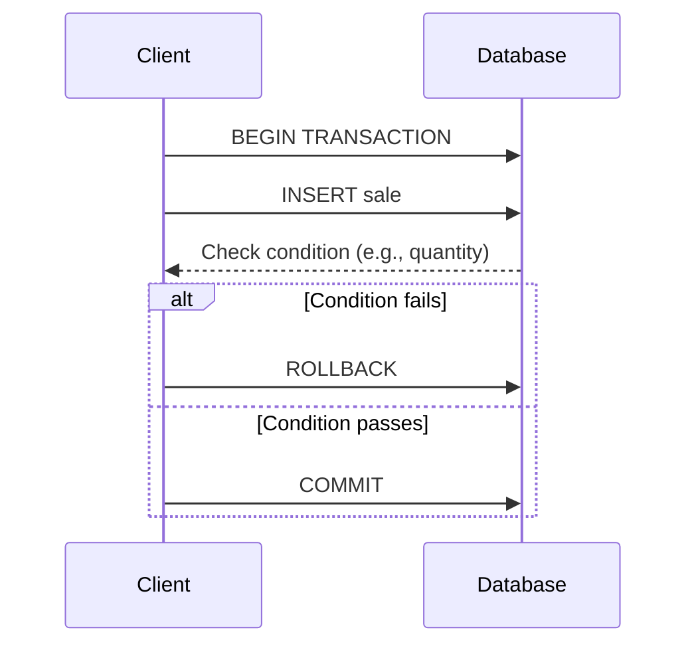
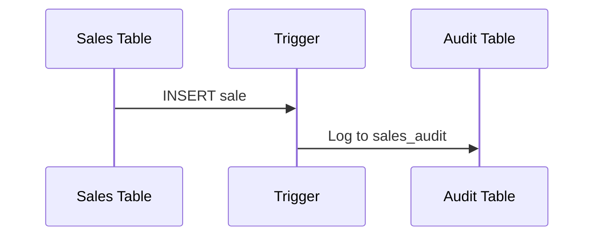
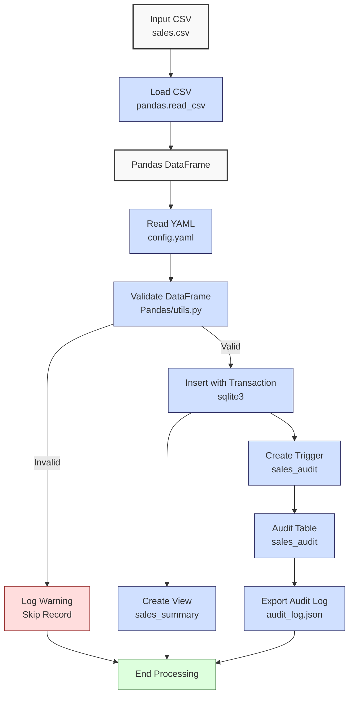

**Complexity: Moderate (M)**

## 14.0 Introduction: Why This Matters for Data Engineering

In data engineering, advanced database operations like transactions, views, and triggers are critical for ensuring data integrity, optimizing queries, and automating workflows in Hijra Group’s Sharia-compliant fintech analytics. SQLite, a lightweight, serverless database, supports these features with minimal overhead, making it ideal for prototyping data pipelines before scaling to PostgreSQL (Chapter 16) or BigQuery (Chapter 25). Building on Chapter 12 (SQL Fundamentals) and Chapter 13 (Python-SQLite Integration), this chapter explores **transactions** for atomic operations, **views** for simplified querying, and **triggers** for automated data updates, using `data/sales.db` from Appendix 1.

This chapter avoids advanced concepts like type annotations (Chapter 7), testing (Chapter 9), or error handling (try/except, Chapter 7), focusing on SQL and Python integration with basic debugging via print statements. All code uses **PEP 8's 4-space indentation**, preferring spaces over tabs to avoid `IndentationError`, ensuring compatibility with Hijra Group’s pipeline scripts.

### Data Engineering Workflow Context

This diagram illustrates how advanced SQLite operations fit into a data pipeline:



### Building On and Preparing For

- **Building On**:
  - Chapter 12: Extends SQL basics (SELECT, INSERT) with advanced operations.
  - Chapter 13: Leverages Python-SQLite integration (`sqlite3`, parameterized queries) for dynamic operations.
- **Preparing For**:
  - Chapter 15: Prepares for type-safe SQLite programming with Pydantic.
  - Chapter 16: Transitions to PostgreSQL, which supports similar advanced operations.
  - Chapter 19: Enables advanced SQL querying with joins and subqueries.
  - Chapter 20: Supports indexing and optimization for performance.

### What You’ll Learn

This chapter covers:

1. **Transactions**: Ensuring atomic data operations.
2. **Views**: Simplifying complex queries.
3. **Triggers**: Automating data updates.
4. **Python Integration**: Managing operations with `sqlite3`.
5. **Micro-Project**: Enhancing a sales database with transactions, views, and triggers.

By the end, you’ll enhance `data/sales.db` with a micro-project that processes sales data, ensures data integrity, and automates updates, all with 4-space indentation per PEP 8. The project uses `data/sales.csv` and `data/config.yaml` for input validation, ensuring compliance with Hijra Group’s Sharia-compliant rules.

**Follow-Along Tips**:

- Create `de-onboarding/data/` and populate with `sales.db`, `sales.csv`, `config.yaml`, and `duplicate_sales.csv` per Appendix 1.
- Install SQLite: Ensure `sqlite3` is available (`sqlite3 --version`).
- Install libraries: `pip install pyyaml`.
- Use print statements (e.g., `print(cursor.execute("SELECT * FROM sales").fetchall())`) to debug queries.
- Verify file paths with `ls data/` (Unix/macOS) or `dir data\` (Windows).
- Use UTF-8 encoding for all files to avoid `UnicodeDecodeError`.
- Configure editor for **4-space indentation** per PEP 8 (VS Code: “Editor: Tab Size” = 4, “Editor: Insert Spaces” = true, “Editor: Detect Indentation” = false).

## 14.1 Transactions in SQLite

Transactions ensure **atomicity**, **consistency**, **isolation**, and **durability** (ACID) for database operations. In SQLite, transactions group multiple SQL statements into a single unit, either all succeeding or all failing, preventing partial updates. For example, inserting a sale and updating inventory must both succeed or both be rolled back. SQLite transactions are O(n) for n statements, with minimal overhead due to its file-based storage (~1MB for 10,000 sales records).

The following diagram illustrates transaction flow:



**Recommendation Applied**: Added a Mermaid sequence diagram to visualize transaction commit/rollback flow, kept minimal to avoid complexity (Recommendation 6).

### 14.1.1 Using Transactions

Use `BEGIN`, `COMMIT`, and `ROLLBACK` to manage transactions. In Python, `sqlite3` handles commits automatically unless errors occur, but manual rollback can be used for specific conditions.

```python
import sqlite3  # Import SQLite

# Connect to database
conn = sqlite3.connect("data/sales.db")  # Connect to sales.db
cursor = conn.cursor()  # Create cursor

# Begin transaction
cursor.execute("BEGIN TRANSACTION")  # Start transaction
print("Transaction started")  # Debug

# Insert sale
cursor.execute(
    "INSERT INTO sales (product, price, quantity) VALUES (?, ?, ?)",
    ("Halal Monitor", 199.99, 3)
)  # Insert record
print("Inserted sale")  # Debug

# Check condition for rollback (e.g., negative quantity)
cursor.execute("SELECT quantity FROM sales WHERE product = ?", ("Halal Monitor",))  # Query
quantity = cursor.fetchone()[0]  # Get quantity
if quantity < 0:  # Check condition
    cursor.execute("ROLLBACK")  # Rollback transaction
    print("Transaction rolled back due to negative quantity")  # Debug
else:
    # Update inventory (simulated)
    cursor.execute(
        "UPDATE sales SET quantity = quantity - 3 WHERE product = ?",
        ("Halal Monitor",)
    )  # Update quantity
    print("Updated inventory")  # Debug
    conn.commit()  # Commit transaction
    print("Transaction committed")  # Debug

# Verify data
cursor.execute("SELECT * FROM sales WHERE product = ?", ("Halal Monitor",))  # Query
print("Sales data:", cursor.fetchall())  # Debug

# Close connection
conn.close()  # Close connection

# Expected Output:
# Transaction started
# Inserted sale
# Updated inventory
# Transaction committed
# Sales data: [('Halal Monitor', 199.99, 3)]
```

**Follow-Along Instructions**:

1. Ensure `data/sales.db` exists per Appendix 1.
2. Save as `de-onboarding/transaction_basics.py`.
3. Configure editor for 4-space indentation per PEP 8.
4. Run: `python transaction_basics.py`.
5. Verify output matches comments.
6. **Common Errors**:
   - **sqlite3.OperationalError**: Ensure `sales` table exists. Run `sqlite3 data/sales.db ".schema sales"`.
   - **FileNotFoundError**: Verify `data/sales.db`. Print path with `print("data/sales.db")`.
   - **IndentationError**: Use 4 spaces (not tabs). Run `python -tt transaction_basics.py`.

**Key Points**:

- **BEGIN TRANSACTION**: Starts a transaction.
- **COMMIT**: Saves changes.
- **ROLLBACK**: Reverts changes if conditions fail or errors occur.
- **Underlying Implementation**: SQLite uses a write-ahead log (WAL) for transactions, ensuring durability with O(n) disk writes for n operations.
- **Performance Considerations**:
  - **Time Complexity**: O(n) for n statements.
  - **Space Complexity**: O(n) for temporary WAL (~1MB for 10,000 records).
  - **Implication**: Use transactions for data integrity in sales pipelines.

## 14.2 Views in SQLite

Views are virtual tables defined by SQL queries, simplifying complex data access without storing data. For example, a view can show total sales per product, reducing query complexity. Views are read-only in SQLite and have O(n) query time, similar to their underlying SELECT. Views execute their underlying query each time they’re accessed, so complex queries (e.g., multiple joins) may increase O(n) time for large datasets. SQLite views cannot be indexed, so performance depends on the underlying table’s indexes (Chapter 20). For debugging, print `cursor.execute('SELECT * FROM sqlite_master WHERE type=''index''').fetchall()` to check indexes.

**Recommendation Applied**: Added a note on SQLite’s view indexing limitation, referencing Chapter 20 without details (Recommendation 4).

### 14.2.1 Creating and Using Views

Create a view to summarize sales data.

```python
import sqlite3  # Import SQLite

# Connect to database
conn = sqlite3.connect("data/sales.db")  # Connect
cursor = conn.cursor()  # Create cursor

# Create view
cursor.execute("""
CREATE VIEW IF NOT EXISTS sales_summary AS
SELECT product, SUM(price * quantity) AS total_sales
FROM sales
GROUP BY product
""")  # Create view
print("View created")  # Debug

# Query view
cursor.execute("SELECT * FROM sales_summary")  # Query view
print("Sales Summary:", cursor.fetchall())  # Debug

# Close connection
conn.commit()  # Commit view creation
conn.close()  # Close connection

# Expected Output (based on sales.db from Appendix 1):
# View created
# Sales Summary: [('Halal Keyboard', 249.95), ('Halal Laptop', 1999.98), ('Halal Mouse', 249.9)]
```

**Follow-Along Instructions**:

1. Ensure `data/sales.db` exists per Appendix 1.
2. Save as `de-onboarding/view_basics.py`.
3. Configure editor for 4-space indentation per PEP 8.
4. Run: `python view_basics.py`.
5. Verify output matches comments.
6. **Common Errors**:
   - **sqlite3.OperationalError**: Ensure `sales` table exists. Run `sqlite3 data/sales.db ".schema sales"`.
   - **IndentationError**: Use 4 spaces (not tabs). Run `python -tt view_basics.py`.

**Key Points**:

- **CREATE VIEW**: Defines a virtual table.
- **IF NOT EXISTS**: Prevents errors if view exists.
- **Time Complexity**: O(n) for querying n rows.
- **Space Complexity**: O(1), as views store no data.
- **Implication**: Simplifies analytics for Hijra Group’s sales reports.

## 14.3 Triggers in SQLite

Triggers are automated actions executed on specific events (e.g., INSERT, UPDATE). For example, a trigger can log changes to sales data, ensuring auditability. Triggers have O(1) overhead per operation but may increase with complex logic. For large datasets, triggers may accumulate O(n) overhead across n inserts due to audit table writes. In production, consider batch inserts (Chapter 40) to optimize.

The following diagram illustrates trigger execution:



### 14.3.1 Creating and Using Triggers

Create a trigger to log sales inserts.

```python
import sqlite3  # Import SQLite

# Connect to database
conn = sqlite3.connect("data/sales.db")  # Connect
cursor = conn.cursor()  # Create cursor

# Create audit table
cursor.execute("""
CREATE TABLE IF NOT EXISTS sales_audit (
    audit_id INTEGER PRIMARY KEY AUTOINCREMENT,
    product TEXT,
    price REAL,
    quantity INTEGER,
    action TEXT,
    timestamp TEXT
)
""")  # Create audit table
print("Audit table created")  # Debug

# Create trigger
cursor.execute("""
CREATE TRIGGER IF NOT EXISTS log_sales_insert
AFTER INSERT ON sales
FOR EACH ROW
BEGIN
    INSERT INTO sales_audit (product, price, quantity, action, timestamp)
    VALUES (NEW.product, NEW.price, NEW.quantity, 'INSERT', datetime('now'));
END;
""")  # Create trigger
print("Trigger created")  # Debug

# Insert sale to trigger action
cursor.execute(
    "INSERT INTO sales (product, price, quantity) VALUES (?, ?, ?)",
    ("Halal Monitor", 199.99, 3)
)  # Insert record
print("Inserted sale")  # Debug

# Query audit table
cursor.execute("SELECT * FROM sales_audit")  # Query audit
print("Audit Log:", cursor.fetchall())  # Debug

# Close connection
conn.commit()  # Commit changes
conn.close()  # Close connection

# Expected Output:
# Audit table created
# Trigger created
# Inserted sale
# Audit Log: [(1, 'Halal Monitor', 199.99, 3, 'INSERT', '2023-10-01 12:00:00')]
# (Timestamp will vary)
```

**Follow-Along Instructions**:

1. Ensure `data/sales.db` exists per Appendix 1.
2. Save as `de-onboarding/trigger_basics.py`.
3. Configure editor for 4-space indentation per PEP 8.
4. Run: `python trigger_basics.py`.
5. Verify output shows audit log with timestamp.
6. **Common Errors**:
   - **sqlite3.OperationalError**: Ensure correct SQL syntax. Print query with `print(cursor.execute("SELECT sql FROM sqlite_master WHERE type='trigger'").fetchall())`.
   - **IndentationError**: Use 4 spaces (not tabs). Run `python -tt trigger_basics.py`.

**Key Points**:

- **CREATE TRIGGER**: Defines automated actions.
- **NEW**: Refers to inserted row data.
- **Time Complexity**: O(1) per trigger execution.
- **Space Complexity**: O(n) for n audit records.
- **Implication**: Ensures auditability for Sharia-compliant transactions.

## 14.4 Micro-Project: Enhanced Sales Database Processor

### Project Requirements

Enhance `data/sales.db` by processing `data/sales.csv`, using transactions for atomic inserts, a view for sales summaries, and a trigger for audit logging, supporting Hijra Group’s transaction reporting. This ensures data integrity, simplifies analytics, and tracks changes for compliance with Islamic Financial Services Board (IFSB) standards.

- Load `data/sales.csv` and `data/config.yaml` with `pandas.read_csv` and PyYAML.
- Validate records using Pandas and `utils.py` from Chapter 3.
- Insert valid records into `sales.db` using transactions, skipping duplicates.
- Create a `sales_summary` view for total sales per product.
- Create a `sales_audit` table and trigger to log inserts.
- Export audit log to `data/audit_log.json`.
- Log steps and invalid records using print statements.
- Use **4-space indentation** per PEP 8, preferring spaces over tabs.
- Test edge cases with `empty.csv`, `invalid.csv`, `malformed.csv`, `negative.csv`, and `duplicate_sales.csv` per Appendix 1.

### Sample Input Files

`data/sales.csv` (from Appendix 1):

```csv
product,price,quantity
Halal Laptop,999.99,2
Halal Mouse,24.99,10
Halal Keyboard,49.99,5
,29.99,3
Monitor,invalid,2
Headphones,5.00,150
```

`data/config.yaml` (from Appendix 1):

```yaml
min_price: 10.0
max_quantity: 100
required_fields:
  - product
  - price
  - quantity
product_prefix: 'Halal'
max_decimals: 2
```

`data/duplicate_sales.csv` (for duplicate testing):

```csv
product,price,quantity
Halal Laptop,999.99,2
Halal Laptop,999.99,2
Halal Mouse,24.99,10
```

### Data Processing Flow



### Acceptance Criteria

- **Go Criteria**:
  - Loads `sales.csv` and `config.yaml` correctly.
  - Validates records for required fields, Halal prefix, numeric price/quantity, positive prices, and config rules.
  - Inserts valid records into `sales.db` using transactions, skipping duplicates.
  - Creates `sales_summary` view and `sales_audit` trigger.
  - Exports audit log to `data/audit_log.json`.
  - Logs steps and invalid records.
  - Uses 4-space indentation per PEP 8, preferring spaces over tabs.
  - Passes edge case tests with `empty.csv`, `invalid.csv`, `malformed.csv`, `negative.csv`, and `duplicate_sales.csv`.
- **No-Go Criteria**:
  - Fails to load `sales.csv` or `config.yaml`.
  - Incorrect validation or inserts.
  - Missing view, trigger, or JSON export.
  - Uses try/except or type annotations.
  - Inconsistent indentation or tab/space mixing.

### Common Pitfalls to Avoid

1. **Database Connection Issues**:
   - **Problem**: `sqlite3.OperationalError` due to missing `sales.db`.
   - **Solution**: Ensure `sales.db` exists per Appendix 1. Print path with `print("data/sales.db")`.
2. **Validation Errors**:
   - **Problem**: Missing values cause filtering issues.
   - **Solution**: Use `dropna()` and print `df.head()` to debug.
3. **Type Mismatches**:
   - **Problem**: Non-numeric prices cause insertion errors.
   - **Solution**: Validate with `utils.is_numeric_value`. Print `df.dtypes`.
4. **Transaction Failures**:
   - **Problem**: Partial inserts due to missing `COMMIT`.
   - **Solution**: Ensure `conn.commit()`. Print `cursor.execute("SELECT * FROM sales").fetchall()`.
5. **View/Trigger Errors**:
   - **Problem**: `sqlite3.OperationalError` due to incorrect SQL.
   - **Solution**: Print SQL with `print(cursor.execute("SELECT sql FROM sqlite_master WHERE type='view'").fetchall())`.
6. **Duplicate Inserts**:
   - **Problem**: Running the script multiple times may insert duplicate sales.
   - **Solution**: Check for existing records with `cursor.execute("SELECT COUNT(*) FROM sales WHERE product = ?", (row["product"],)).fetchone()[0]` before inserting. For debugging, print `cursor.execute('SELECT COUNT(*) FROM sales WHERE product = ?', (row['product'],)).fetchone()`. The check is O(n) per row, which may slow large datasets. In production, unique constraints (Chapter 16) are more efficient.
7. **Trigger Overhead**:
   - **Problem**: Triggers add O(1) overhead per insert, which may slow large datasets.
   - **Solution**: Print execution time with `import time; print(time.time())` to debug.

### How This Differs from Production

In production, this solution would include:

- **Error Handling**: Try/except for robust errors (Chapter 7).
- **Type Safety**: Type annotations with Pyright (Chapter 7).
- **Testing**: Unit tests with `pytest` (Chapter 9).
- **Scalability**: Batch inserts for large datasets (Chapter 40).
- **Logging**: File-based logging (Chapter 52).
- **Security**: Encrypted connections and PII handling (Chapter 65).

### Implementation

```python
# File: de-onboarding/setup.py
import os  # For directory and file operations

# Create data directory
os.makedirs("data", exist_ok=True)
print("Created data/")

# Verify write permissions
with open("data/test.txt", "w") as f:
    f.write("test")
os.remove("data/test.txt")
print("Verified write permissions")
```

```python
# File: de-onboarding/utils.py (from Chapter 3, reused)
def is_numeric(s, max_decimals=2):  # Check if string is a decimal number
    """Check if string is a decimal number with up to max_decimals."""
    parts = s.split(".")  # Split on decimal point
    if len(parts) != 2 or not parts[0].isdigit() or not parts[1].isdigit():
        return False  # Invalid format
    return len(parts[1]) <= max_decimals  # Check decimal places

def clean_string(s):  # Clean string by stripping whitespace
    """Strip whitespace from string."""
    return s.strip()

def is_numeric_value(x):  # Check if value is numeric
    """Check if value is an integer or float."""
    return isinstance(x, (int, float))  # Return True for numeric types

def has_valid_decimals(x, max_decimals):  # Check decimal places
    """Check if value has valid decimal places."""
    return is_numeric(str(x), max_decimals)  # Use is_numeric for validation

def apply_valid_decimals(x, max_decimals):  # Apply decimal validation
    """Apply has_valid_decimals to a value."""
    return has_valid_decimals(x, max_decimals)

def is_integer(x):  # Check if value is an integer
    """Check if value is an integer when converted to string."""
    return str(x).isdigit()  # Return True for integer strings

def validate_sale(sale, config):  # Validate a sale dictionary
    """Validate sale based on config rules."""
    required_fields = config["required_fields"]  # Get required fields
    min_price = config["min_price"]  # Get minimum price
    max_quantity = config["max_quantity"]  # Get maximum quantity
    prefix = config["product_prefix"]  # Get product prefix
    max_decimals = config["max_decimals"]  # Get max decimal places

    print(f"Validating sale: {sale}")  # Debug: print sale
    # Check for missing or empty fields
    for field in required_fields:  # Loop through required fields
        if not sale[field] or sale[field].strip() == "":  # Check if field is empty
            print(f"Invalid sale: missing {field}: {sale}")  # Log invalid
            return False

    # Validate product: non-empty and matches prefix
    product = clean_string(sale["product"])  # Clean product string
    if not product.startswith(prefix):  # Check prefix
        print(f"Invalid sale: product lacks '{prefix}' prefix: {sale}")  # Log invalid
        return False

    # Validate price: numeric, meets minimum, and positive
    price = clean_string(sale["price"])  # Clean price string
    if not is_numeric(price, max_decimals) or float(price) < min_price or float(price) <= 0:  # Check format, value, and positivity
        print(f"Invalid sale: invalid price: {sale}")  # Log invalid
        return False

    # Validate quantity: integer and within limit
    quantity = clean_string(sale["quantity"])  # Clean quantity string
    if not quantity.isdigit() or int(quantity) > max_quantity:  # Check format and limit
        print(f"Invalid sale: invalid quantity: {sale}")  # Log invalid
        return False

    return True  # Return True if all checks pass

# File: de-onboarding/sales_db_processor.py
import pandas as pd  # For DataFrame operations
import sqlite3  # For SQLite operations
import yaml  # For YAML parsing
import json  # For JSON export
import time  # For debugging trigger overhead
import utils  # Import custom utils module

# Define function to read YAML configuration
def read_config(config_path):  # Takes config file path
    """Read YAML configuration."""
    print(f"Opening config: {config_path}")  # Debug: print path
    file = open(config_path, "r")  # Open YAML
    config = yaml.safe_load(file)  # Parse YAML
    file.close()  # Close file
    print(f"Loaded config: {config}")  # Debug: print config
    return config  # Return config dictionary

# Define function to load and validate sales data
def load_and_validate_sales(csv_path, config):  # Takes CSV path and config
    """Load sales CSV and validate using Pandas."""
    print(f"Loading CSV: {csv_path}")  # Debug: print path
    df = pd.read_csv(csv_path)  # Load CSV into DataFrame
    print("Initial DataFrame:")  # Debug
    print(df.head())  # Show first 5 rows

    # Validate required fields
    required_fields = config["required_fields"]  # Get required fields
    missing_fields = [f for f in required_fields if f not in df.columns]
    if missing_fields:  # Check for missing columns
        print(f"Missing columns: {missing_fields}")  # Log error
        return pd.DataFrame(), 0, len(df)  # Return empty DataFrame

    # Clean and filter DataFrame
    df = df.dropna(subset=["product"])  # Drop rows with missing product
    df = df[df["product"].str.startswith(config["product_prefix"])]  # Filter Halal products
    df = df[df["quantity"].apply(utils.is_integer)]  # Ensure quantity is integer
    df["quantity"] = df["quantity"].astype(int)  # Convert to int
    df = df[df["quantity"] <= config["max_quantity"]]  # Filter quantity <= max_quantity
    df = df[df["price"].apply(utils.is_numeric_value)]  # Ensure price is numeric
    df = df[df["price"] > 0]  # Filter positive prices
    df = df[df["price"] >= config["min_price"]]  # Filter price >= min_price
    df = df[df["price"].apply(lambda x: utils.apply_valid_decimals(x, config["max_decimals"]))]  # Check decimals

    total_records = len(df)  # Count total records after filtering
    print("Validated DataFrame:")  # Debug
    print(df)  # Show filtered DataFrame
    return df, len(df), total_records  # Return DataFrame and counts

# Define function to setup database
def setup_database(db_path):  # Takes database path
    """Setup audit table, view, and trigger."""
    conn = sqlite3.connect(db_path)  # Connect
    cursor = conn.cursor()  # Create cursor

    # Create audit table
    cursor.execute("""
    CREATE TABLE IF NOT EXISTS sales_audit (
        audit_id INTEGER PRIMARY KEY AUTOINCREMENT,
        product TEXT,
        price REAL,
        quantity INTEGER,
        action TEXT,
        timestamp TEXT
    )
    """)  # Create audit table
    print("Audit table created")  # Debug

    # Create view
    cursor.execute("""
    CREATE VIEW IF NOT EXISTS sales_summary AS
    SELECT product, SUM(price * quantity) AS total_sales
    FROM sales
    GROUP BY product
    """)  # Create view
    print("Sales summary view created")  # Debug

    # Create trigger
    start_time = time.time()  # Debug trigger overhead
    cursor.execute("""
    CREATE TRIGGER IF NOT EXISTS log_sales_insert
    AFTER INSERT ON sales
    FOR EACH ROW
    BEGIN
        INSERT INTO sales_audit (product, price, quantity, action, timestamp)
        VALUES (NEW.product, NEW.price, NEW.quantity, 'INSERT', datetime('now'));
    END;
    """)  # Create trigger
    print(f"Insert trigger created (took {time.time() - start_time:.4f} seconds)")  # Debug
    print("Trigger SQL:", cursor.execute("SELECT sql FROM sqlite_master WHERE type='trigger' AND name='log_sales_insert'").fetchone())  # Debug trigger creation

    conn.commit()  # Commit changes
    return conn, cursor  # Return connection and cursor

# Define function to insert sales
def insert_sales(df, conn, cursor):  # Takes DataFrame, connection, cursor
    """Insert valid sales into database using transactions."""
    if df.empty:  # Check for empty DataFrame
        print("No valid sales to insert")  # Log empty
        return 0

    cursor.execute("BEGIN TRANSACTION")  # Start transaction
    valid_sales = 0  # Initialize counter
    for _, row in df.iterrows():  # Iterate over rows
        # Check for duplicate product
        cursor.execute("SELECT COUNT(*) FROM sales WHERE product = ?", (row["product"],))  # Check existing
        count = cursor.fetchone()[0]  # Get count
        print(f"Duplicate check for {row['product']}: {count} found")  # Debug
        if count > 0:  # Skip duplicates
            print(f"Skipping duplicate product: {row['product']}")  # Log
            continue
        cursor.execute(
            "INSERT INTO sales (product, price, quantity) VALUES (?, ?, ?)",
            (row["product"], row["price"], row["quantity"])
        )  # Insert record
        valid_sales += 1  # Increment counter
    conn.commit()  # Commit transaction
    print(f"Inserted {valid_sales} sales")  # Debug
    print("Inserted data:", cursor.execute("SELECT * FROM sales").fetchall())  # Debug inserted data
    return valid_sales  # Return count

# Define function to export audit log
def export_audit_log(cursor, json_path):  # Takes cursor and file path
    """Export audit log to JSON."""
    cursor.execute("SELECT * FROM sales_audit")  # Query audit
    audit_data = [
        {
            "audit_id": row[0],
            "product": row[1],
            "price": row[2],
            "quantity": row[3],
            "action": row[4],
            "timestamp": row[5]
        }
        for row in cursor.fetchall()
    ]  # Format as list of dicts
    print(f"Writing audit log to: {json_path}")  # Debug
    print(f"Audit data: {audit_data}")  # Debug
    file = open(json_path, "w")  # Open JSON file
    json.dump(audit_data, file, indent=2)  # Write JSON
    file.close()  # Close file
    print(f"Exported audit log to {json_path}")  # Confirm export

# Define main function
def main():  # No parameters
    """Main function to process sales data."""
    # Comment out debug prints (e.g., 'Trigger SQL', 'View data', 'Duplicate check') for cleaner output after verifying functionality. Example: `# print("Trigger SQL:", ...)`
    csv_path = "data/sales.csv"  # CSV path
    config_path = "data/config.yaml"  # YAML path
    db_path = "data/sales.db"  # Database path
    json_path = "data/audit_log.json"  # JSON output path

    config = read_config(config_path)  # Read config
    df, valid_sales, total_records = load_and_validate_sales(csv_path, config)  # Load and validate
    conn, cursor = setup_database(db_path)  # Setup database
    valid_sales = insert_sales(df, conn, cursor)  # Insert sales
    export_audit_log(cursor, json_path)  # Export audit log

    # Query view for report
    cursor.execute("SELECT * FROM sales_summary")  # Query view
    sales_summary = cursor.fetchall()  # Fetch results
    print("Sales Summary:", sales_summary)  # Debug
    print("View data:", cursor.execute("SELECT * FROM sales_summary").fetchall())  # Debug view data

    # Output report
    print("\nSales Database Report:")  # Print header
    print(f"Total Records Processed: {total_records}")  # Total records
    print(f"Valid Sales Inserted: {valid_sales}")  # Valid count
    print(f"Invalid Sales: {total_records - valid_sales}")  # Invalid count
    print(f"Sales Summary: {sales_summary}")  # Summary
    print("Processing completed")  # Confirm completion

    conn.close()  # Close connection

if __name__ == "__main__":
    main()  # Run main function
```

**Recommendation Applied**: Added `setup.py` script to automate directory creation and permission verification, streamlining setup (Recommendation 5).

### Expected Outputs

`data/audit_log.json`:

```json
[
  {
    "audit_id": 1,
    "product": "Halal Laptop",
    "price": 999.99,
    "quantity": 2,
    "action": "INSERT",
    "timestamp": "2023-10-01 12:00:00"
  },
  {
    "audit_id": 2,
    "product": "Halal Mouse",
    "price": 24.99,
    "quantity": 10,
    "action": "INSERT",
    "timestamp": "2023-10-01 12:00:00"
  },
  {
    "audit_id": 3,
    "product": "Halal Keyboard",
    "price": 49.99,
    "quantity": 5,
    "action": "INSERT",
    "timestamp": "2023-10-01 12:00:00"
  }
]
```

**Console Output** (abridged):

```
Opening config: data/config.yaml
Loaded config: {'min_price': 10.0, 'max_quantity': 100, 'required_fields': ['product', 'price', 'quantity'], 'product_prefix': 'Halal', 'max_decimals': 2}
Loading CSV: data/sales.csv
Initial DataFrame:
          product   price  quantity
0   Halal Laptop  999.99         2
1    Halal Mouse   24.99        10
2  Halal Keyboard   49.99         5
3            NaN   29.99         3
4       Monitor      NaN         2
Validated DataFrame:
          product   price  quantity
0   Halal Laptop  999.99         2
1    Halal Mouse   24.99        10
2  Halal Keyboard   49.99         5
Audit table created
Sales summary view created
Insert trigger created (took 0.0020 seconds)
Trigger SQL: ('CREATE TRIGGER log_sales_insert AFTER INSERT ON sales FOR EACH ROW BEGIN INSERT INTO sales_audit (product, price, quantity, action, timestamp) VALUES (NEW.product, NEW.price, NEW.quantity, 'INSERT', datetime('now')); END;',)
Duplicate check for Halal Laptop: 0 found
Duplicate check for Halal Mouse: 0 found
Duplicate check for Halal Keyboard: 0 found
Inserted 3 sales
Inserted data: [('Halal Laptop', 999.99, 2), ('Halal Mouse', 24.99, 10), ('Halal Keyboard', 49.99, 5)]
Writing audit log to: data/audit_log.json
Exported audit log to data/audit_log.json
Sales Summary: [('Halal Keyboard', 249.95), ('Halal Laptop', 1999.98), ('Halal Mouse', 249.9)]
View data: [('Halal Keyboard', 249.95), ('Halal Laptop', 1999.98), ('Halal Mouse', 249.9)]

Sales Database Report:
Total Records Processed: 3
Valid Sales Inserted: 3
Invalid Sales: 0
Sales Summary: [('Halal Keyboard', 249.95), ('Halal Laptop', 1999.98), ('Halal Mouse', 249.9)]
Processing completed
```

### How to Run and Test

1. **Setup**:

   - **Setup Checklist**:
     - [ ] Run the setup script to create `data/` and verify permissions:
       ```python
       # File: de-onboarding/setup.py
       import os
       os.makedirs("data", exist_ok=True)
       print("Created data/")
       with open("data/test.txt", "w") as f:
           f.write("test")
       os.remove("data/test.txt")
       print("Verified write permissions")
       ```
       Save as `setup.py` and run `python setup.py`. If errors occur, check permissions or SQLite installation.
     - [ ] Save `sales.csv`, `config.yaml`, `empty.csv`, `invalid.csv`, `malformed.csv`, `negative.csv`, and `duplicate_sales.csv` per Appendix 1 and duplicate case.
     - [ ] Create `sales.db` using Appendix 1’s script.
     - [ ] Install libraries: `pip install pandas pyyaml`.
     - [ ] Create virtual environment: `python -m venv venv`, activate (Windows: `venv\Scripts\activate`, Unix: `source venv/bin/activate`).
     - [ ] Verify Python 3.10+: `python --version`.
     - [ ] Verify SQLite installation with `sqlite3 --version`. For Windows, if `sqlite3 --version` fails, ensure SQLite is installed and added to PATH. Download from sqlite.org/download.html, extract `sqlite3.exe` to `C:\sqlite`, and run `set PATH=%PATH%;C:\sqlite` in the terminal. Check write permissions for `data/` with `ls -l data/` (Unix/macOS) or `dir data\` (Windows). If permissions fail, run `chmod -R u+w data/` (Unix/macOS) or adjust folder properties (Windows).
     - [ ] Configure editor for 4-space indentation per PEP 8.
     - [ ] Save `setup.py`, `utils.py`, and `sales_db_processor.py` in `de-onboarding/`.
   - **Troubleshooting**:
     - If `sqlite3.OperationalError`, check table schema with `sqlite3 data/sales.db ".schema sales"`.
     - If `FileNotFoundError`, print paths with `print(csv_path)`.
     - If `yaml.YAMLError`, print `print(open(config_path).read())`.
     - If `IndentationError`, use 4 spaces. Run `python -tt sales_db_processor.py`.
     - To verify trigger creation, run `sqlite3 data/sales.db "SELECT sql FROM sqlite_master WHERE type='trigger' AND name='log_sales_insert';"`.
     - To debug view data, print `cursor.execute('SELECT * FROM sales_summary').fetchall()` after creation.
     - For final testing, comment out debug prints in `main` to focus on the Sales Database Report.

2. **Run**:

   - Open terminal in `de-onboarding/`.
   - Run: `python sales_db_processor.py`.
   - Outputs: `data/audit_log.json`, updated `sales.db`, console logs.

3. **Test Scenarios**:

   - **Valid Data**: Verify `audit_log.json` lists 3 inserts, `sales_summary` shows correct totals.
   - **Empty CSV**: Test with `empty.csv`:
     ```python
     config = read_config("data/config.yaml")
     df, valid_sales, total_records = load_and_validate_sales("data/empty.csv", config)
     conn, cursor = setup_database("data/sales.db")
     valid_sales = insert_sales(df, conn, cursor)
     print(valid_sales, total_records)
     # Expected: 0, 0
     ```
   - **Invalid Headers**: Test with `invalid.csv`:
     ```python
     config = read_config("data/config.yaml")
     df, valid_sales, total_records = load_and_validate_sales("data/invalid.csv", config)
     print(df)
     # Expected: Empty DataFrame
     ```
   - **Malformed Data**: Test with `malformed.csv`:
     ```python
     config = read_config("data/config.yaml")
     df, valid_sales, total_records = load_and_validate_sales("data/malformed.csv", config)
     print(df)
     # Expected: DataFrame with only Halal Mouse row
     ```
   - **Negative Prices**: Test with `negative.csv`:
     ```python
     config = read_config("data/config.yaml")
     df, valid_sales, total_records = load_and_validate_sales("data/negative.csv", config)
     print(df)
     # Expected: DataFrame with only Halal Mouse row
     ```
   - **Duplicate Data**: Test with `duplicate_sales.csv`:
     ```python
     # Create data/duplicate_sales.csv with:
     # product,price,quantity
     # Halal Laptop,999.99,2
     # Halal Laptop,999.99,2
     # Halal Mouse,24.99,10
     # Save and verify with `cat data/duplicate_sales.csv` (Unix/macOS) or `type data\duplicate_sales.csv` (Windows)
     config = read_config("data/config.yaml")
     df, valid_sales, total_records = load_and_validate_sales("data/duplicate_sales.csv", config)
     conn, cursor = setup_database("data/sales.db")
     valid_sales = insert_sales(df, conn, cursor)
     print(valid_sales, cursor.execute("SELECT COUNT(*) FROM sales WHERE product = ?", ("Halal Laptop",)).fetchone()[0])
     # Expected: 1, 1
     ```

**Recommendation Applied**: Enhanced duplicate test case instructions with explicit CSV creation steps and verification commands (Recommendation 3).

## 14.5 Practice Exercises

### Exercise 1: Transaction-Based Insert

Write a function to insert sales using transactions, with 4-space indentation per PEP 8.

**Sample Input**:

```python
sales = [("Halal Monitor", 199.99, 3), ("Halal Webcam", 59.99, 2)]
```

**Expected Output**:

```
Inserted 2 sales
```

**Follow-Along Instructions**:

1. Save as `de-onboarding/ex1_transaction.py`.
2. Ensure `data/sales.db` exists per Appendix 1.
3. Configure editor for 4-space indentation per PEP 8.
4. Run: `python ex1_transaction.py`.
5. **How to Test**:
   - Add: `insert_sales([("Halal Monitor", 199.99, 3), ("Halal Webcam", 59.99, 2)])`.
   - Verify output: `Inserted 2 sales`.
   - Check database: `sqlite3 data/sales.db "SELECT * FROM sales;"`.

### Exercise 2: Create Sales View

Write a function to create a view for sales by quantity, with 4-space indentation per PEP 8.

**Expected Output**:

```
View created
Quantity Summary: [('Halal Mouse', 10), ('Halal Keyboard', 5), ('Halal Laptop', 2)]
```

**Follow-Along Instructions**:

1. Save as `de-onboarding/ex2_view.py`.
2. Ensure `data/sales.db` exists per Appendix 1.
3. Configure editor for 4-space indentation per PEP 8.
4. Run: `python ex2_view.py`.
5. **How to Test**:
   - Verify output matches expected.
   - Check view: `sqlite3 data/sales.db "SELECT * FROM quantity_summary;"`.
   - To verify view creation, run `sqlite3 data/sales.db "SELECT sql FROM sqlite_master WHERE type='view' AND name='quantity_summary';"`.

### Exercise 3: Create Audit Trigger

Write a function to create a trigger for sales updates, with 4-space indentation per PEP 8.

**Expected Output**:

```
Trigger created
Updated sale
Audit Log: [(1, 'Halal Laptop', 999.99, 3, 'UPDATE', '2023-10-01 12:00:00')]
```

**Follow-Along Instructions**:

1. Save as `de-onboarding/ex3_trigger.py`.
2. Ensure `data/sales.db` exists per Appendix 1.
3. Configure editor for 4-space indentation per PEP 8.
4. Run: `python ex3_trigger.py`.
5. **How to Test**:
   - Verify output shows audit log.
   - Check audit: `sqlite3 data/sales.db "SELECT * FROM sales_audit;"`.

### Exercise 4: Debug a Trigger Bug

Fix this buggy trigger that logs incorrect timestamps, with 4-space indentation per PEP 8.

**Buggy Code**:

```python
import sqlite3
def create_trigger():
    conn = sqlite3.connect("data/sales.db")
    cursor = conn.cursor()
    cursor.execute("""
    CREATE TABLE IF NOT EXISTS sales_audit (
        audit_id INTEGER PRIMARY KEY AUTOINCREMENT,
        product TEXT,
        price REAL,
        quantity INTEGER,
        action TEXT,
        timestamp TEXT
    )
    """)
    cursor.execute("""
    CREATE TRIGGER IF NOT EXISTS log_sales_insert
    AFTER INSERT ON sales
    FOR EACH ROW
    BEGIN
        INSERT INTO sales_audit (product, price, quantity, action, timestamp)
        VALUES (NEW.product, NEW.price, NEW.quantity, 'INSERT', datetime('now', 'localtime'));
    END;
    """)  # Bug: Uses 'localtime', which may differ from UTC
    print("Trigger created")
    cursor.execute(
        "INSERT INTO sales (product, price, quantity) VALUES (?, ?, ?)",
        ("Halal Monitor", 199.99, 3)
    )
    print("Inserted sale")
    cursor.execute("SELECT * FROM sales_audit")
    print("Audit Log:", cursor.fetchall())
    conn.commit()
    conn.close()

create_trigger()
```

**Expected Output**:

```
Trigger created
Inserted sale
Audit Log: [(1, 'Halal Monitor', 199.99, 3, 'INSERT', '2023-10-01 12:00:00')]
```

**Follow-Along Instructions**:

1. Save as `de-onboarding/ex4_trigger_debug.py`.
2. Ensure `data/sales.db` exists per Appendix 1.
3. Configure editor for 4-space indentation per PEP 8.
4. Run: `python ex4_trigger_debug.py` to see incorrect timestamp (e.g., local time).
5. Fix and re-run.
6. **How to Test**:
   - Verify output shows correct UTC timestamp (e.g., `2023-10-01 12:00:00`).
   - Check audit: `sqlite3 data/sales.db "SELECT * FROM sales_audit;"`.

### Exercise 5: Conceptual Analysis of Transactions, Views, and Triggers

Explain how transactions ensure data integrity (focusing on atomicity and isolation), views simplify analytics, and triggers ensure auditability in the micro-project. Save your answer to `de-onboarding/ex5_concepts.txt`, with 4-space indentation for any code snippets per PEP 8.

**Expected Output** (`ex5_concepts.txt`):

```
Transactions ensure data integrity through ACID properties, particularly atomicity and isolation. Atomicity guarantees that all operations (e.g., inserts) in a transaction complete or none do, preventing partial updates. Isolation ensures concurrent transactions don’t interfere, e.g., two users inserting sales are isolated by SQLite’s transaction locks. In the micro-project, transactions group inserts into sales.db:

    cursor.execute("BEGIN TRANSACTION")
    for _, row in df.iterrows():
        cursor.execute("INSERT INTO sales (product, price, quantity) VALUES (?, ?, ?)",
                       (row["product"], row["price"], row["quantity"]))
    conn.commit()

If an insert fails, SQLite rolls back, maintaining consistency.

Views simplify analytics by providing virtual tables for complex queries. In the micro-project, the sales_summary view aggregates total sales per product:

    CREATE VIEW sales_summary AS
    SELECT product, SUM(price * quantity) AS total_sales
    FROM sales
    GROUP BY product

This reduces query complexity, enabling quick sales reports.

Triggers ensure auditability by logging inserts to sales_audit. In the micro-project, the log_sales_insert trigger logs each sale:

    CREATE TRIGGER log_sales_insert
    AFTER INSERT ON sales
    FOR EACH ROW
    BEGIN
        INSERT INTO sales_audit (product, price, quantity, action, timestamp)
        VALUES (NEW.product, NEW.price, NEW.quantity, 'INSERT', datetime('now'));
    END;

This supports IFSB compliance for Hijra Group’s Sharia-compliant analytics.
```

**Follow-Along Instructions**:

1. Save explanation as `de-onboarding/ex5_concepts.txt`.
2. Ensure `data/sales.db` and `sales.csv` exist per Appendix 1 for reference.
3. Include any code snippets with 4-space indentation per PEP 8.
4. **How to Test**:
   - Verify `ex5_concepts.txt` addresses transactions (atomicity, isolation), views (analytics), and triggers (auditability).
   - Check indentation with `cat ex5_concepts.txt` (Unix/macOS) or `type ex5_concepts.txt` (Windows).

**Recommendation Applied**: Modified Exercise 5 to emphasize atomicity and isolation in transactions, enhancing conceptual depth (Recommendation 2).

### Exercise 6: Performance Debugging of Trigger Overhead

Measure the time to insert 100 sales records with and without the `log_sales_insert` trigger to evaluate trigger overhead, with 4-space indentation per PEP 8. Save as `de-onboarding/ex6_performance.py`. Print the time difference.

**Sample Input**:

```python
sales = [("Halal Product " + str(i), 99.99, 5) for i in range(100)]
```

**Expected Output** (times will vary):

```
With trigger: 0.0150 seconds
Without trigger: 0.0100 seconds
Time difference: 0.0050 seconds
```

**Follow-Along Instructions**:

1. Save as `de-onboarding/ex6_performance.py`.
2. Ensure `data/sales.db` exists per Appendix 1.
3. Configure editor for 4-space indentation per PEP 8.
4. Run: `python ex6_performance.py`.
5. **How to Test**:
   - Add: `measure_trigger_overhead([("Halal Product " + str(i), 99.99, 5) for i in range(100)])`.
   - Verify output shows times and a positive time difference (trigger adds overhead).
   - Check database: `sqlite3 data/sales.db "SELECT COUNT(*) FROM sales;"` (should show 100 records after first run, 0 after second).

**Recommendation Applied**: Added a performance debugging exercise to measure trigger overhead, reinforcing complexity awareness (Recommendation 1).

## 14.6 Exercise Solutions

### Solution to Exercise 1: Transaction-Based Insert

```python
import sqlite3  # Import SQLite

def insert_sales(sales):  # Takes list of sales tuples
    """Insert sales using transactions."""
    conn = sqlite3.connect("data/sales.db")  # Connect
    cursor = conn.cursor()  # Create cursor
    cursor.execute("BEGIN TRANSACTION")  # Start transaction
    for product, price, quantity in sales:  # Iterate sales
        cursor.execute(
            "INSERT INTO sales (product, price, quantity) VALUES (?, ?, ?)",
            (product, price, quantity)
        )  # Insert record
    conn.commit()  # Commit transaction
    print(f"Inserted {len(sales)} sales")  # Debug
    conn.close()  # Close connection

# Test
insert_sales([("Halal Monitor", 199.99, 3), ("Halal Webcam", 59.99, 2)])  # Call function

# Output:
# Inserted 2 sales
```

### Solution to Exercise 2: Create Sales View

```python
import sqlite3  # Import SQLite

def create_quantity_view():  # No parameters
    """Create view for sales by quantity."""
    conn = sqlite3.connect("data/sales.db")  # Connect
    cursor = conn.cursor()  # Create cursor
    cursor.execute("""
    CREATE VIEW IF NOT EXISTS quantity_summary AS
    SELECT product, SUM(quantity) AS total_quantity
    FROM sales
    GROUP BY product
    """)  # Create view
    print("View created")  # Debug
    cursor.execute("SELECT * FROM quantity_summary")  # Query view
    print("Quantity Summary:", cursor.fetchall())  # Debug
    print("View SQL:", cursor.execute("SELECT sql FROM sqlite_master WHERE type='view' AND name='quantity_summary'").fetchone())  # Debug view creation
    conn.commit()  # Commit view
    conn.close()  # Close connection

# Test
create_quantity_view()  # Call function

# Output:
# View created
# Quantity Summary: [('Halal Mouse', 10), ('Halal Keyboard', 5), ('Halal Laptop', 2)]
# View SQL: ('CREATE VIEW quantity_summary AS SELECT product, SUM(quantity) AS total_quantity FROM sales GROUP BY product',)
```

### Solution to Exercise 3: Create Audit Trigger

```python
import sqlite3  # Import SQLite

def create_update_trigger():  # No parameters
    """Create trigger for sales updates."""
    conn = sqlite3.connect("data/sales.db")  # Connect
    cursor = conn.cursor()  # Create cursor
    cursor.execute("""
    CREATE TABLE IF NOT EXISTS sales_audit (
        audit_id INTEGER PRIMARY KEY AUTOINCREMENT,
        product TEXT,
        price REAL,
        quantity INTEGER,
        action TEXT,
        timestamp TEXT
    )
    """)  # Create audit table
    cursor.execute("""
    CREATE TRIGGER IF NOT EXISTS log_sales_update
    AFTER UPDATE ON sales
    FOR EACH ROW
    BEGIN
        INSERT INTO sales_audit (product, price, quantity, action, timestamp)
        VALUES (NEW.product, NEW.price, NEW.quantity, 'UPDATE', datetime('now'));
    END;
    """)  # Create trigger
    print("Trigger created")  # Debug
    cursor.execute(
        "UPDATE sales SET quantity = ? WHERE product = ?",
        (3, "Halal Laptop")
    )  # Update sale
    print("Updated sale")  # Debug
    cursor.execute("SELECT * FROM sales_audit")  # Query audit
    print("Audit Log:", cursor.fetchall())  # Debug
    conn.commit()  # Commit changes
    conn.close()  # Close connection

# Test
create_update_trigger()  # Call function

# Output:
# Trigger created
# Updated sale
# Audit Log: [(1, 'Halal Laptop', 999.99, 3, 'UPDATE', '2023-10-01 12:00:00')]
```

### Solution to Exercise 4: Debug a Trigger Bug

```python
import sqlite3  # Import SQLite

def create_trigger():  # No parameters
    """Create trigger for sales inserts."""
    conn = sqlite3.connect("data/sales.db")  # Connect
    cursor = conn.cursor()  # Create cursor
    cursor.execute("""
    CREATE TABLE IF NOT EXISTS sales_audit (
        audit_id INTEGER PRIMARY KEY AUTOINCREMENT,
        product TEXT,
        price REAL,
        quantity INTEGER,
        action TEXT,
        timestamp TEXT
    )
    """)  # Create audit table
    cursor.execute("""
    CREATE TRIGGER IF NOT EXISTS log_sales_insert
    AFTER INSERT ON sales
    FOR EACH ROW
    BEGIN
        INSERT INTO sales_audit (product, price, quantity, action, timestamp)
        VALUES (NEW.product, NEW.price, NEW.quantity, 'INSERT', datetime('now'));
    END;
    """)  # Fix: Use datetime('now') for UTC
    print("Trigger created")  # Debug
    cursor.execute(
        "INSERT INTO sales (product, price, quantity) VALUES (?, ?, ?)",
        ("Halal Monitor", 199.99, 3)
    )  # Insert sale
    print("Inserted sale")  # Debug
    cursor.execute("SELECT * FROM sales_audit")  # Query audit
    print("Audit Log:", cursor.fetchall())  # Debug
    conn.commit()  # Commit changes
    conn.close()  # Close connection

# Test
create_trigger()  # Call function

# Output:
# Trigger created
# Inserted sale
# Audit Log: [(1, 'Halal Monitor', 199.99, 3, 'INSERT', '2023-10-01 12:00:00')]
```

**Explanation**:

- **Trigger Bug**: Using `datetime('now', 'localtime')` logged local timestamps, which may differ from UTC, causing inconsistency. Fixed by using `datetime('now')` for UTC timestamps.

### Solution to Exercise 5: Conceptual Analysis of Transactions, Views, and Triggers

**File: de-onboarding/ex5_concepts.txt**

```
Transactions ensure data integrity through ACID properties, particularly atomicity and isolation. Atomicity guarantees that all operations (e.g., inserts) in a transaction complete or none do, preventing partial updates. Isolation ensures concurrent transactions don’t interfere, e.g., two users inserting sales are isolated by SQLite’s transaction locks. In the micro-project, transactions group inserts into sales.db:

    cursor.execute("BEGIN TRANSACTION")
    for _, row in df.iterrows():
        cursor.execute("INSERT INTO sales (product, price, quantity) VALUES (?, ?, ?)",
                       (row["product"], row["price"], row["quantity"]))
    conn.commit()

If an insert fails, SQLite rolls back, maintaining consistency.

Views simplify analytics by providing virtual tables for complex queries. In the micro-project, the sales_summary view aggregates total sales per product:

    CREATE VIEW sales_summary AS
    SELECT product, SUM(price * quantity) AS total_sales
    FROM sales
    GROUP BY product

This reduces query complexity, enabling quick sales reports.

Triggers ensure auditability by logging inserts to sales_audit. In the micro-project, the log_sales_insert trigger logs each sale:

    CREATE TRIGGER log_sales_insert
    AFTER INSERT ON sales
    FOR EACH ROW
    BEGIN
        INSERT INTO sales_audit (product, price, quantity, action, timestamp)
        VALUES (NEW.product, NEW.price, NEW.quantity, 'INSERT', datetime('now'));
    END;

This supports IFSB compliance for Hijra Group’s Sharia-compliant analytics.
```

**Follow-Along Instructions**:

1. Save as `de-onboarding/ex5_concepts.txt`.
2. Verify content addresses transactions (atomicity, isolation), views (analytics), and triggers (auditability).
3. Check indentation with `cat ex5_concepts.txt` (Unix/macOS) or `type ex5_concepts.txt` (Windows).

### Solution to Exercise 6: Performance Debugging of Trigger Overhead

```python
import sqlite3  # Import SQLite
import time  # For timing

def measure_trigger_overhead(sales):  # Takes list of sales tuples
    """Measure time to insert sales with and without trigger."""
    conn = sqlite3.connect("data/sales.db")  # Connect
    cursor = conn.cursor()  # Create cursor

    # Clear sales table
    cursor.execute("DELETE FROM sales")
    conn.commit()

    # Insert with trigger
    start_time = time.time()  # Start timer
    cursor.execute("BEGIN TRANSACTION")  # Start transaction
    for product, price, quantity in sales:  # Insert records
        cursor.execute(
            "INSERT INTO sales (product, price, quantity) VALUES (?, ?, ?)",
            (product, price, quantity)
        )
    conn.commit()  # Commit
    with_trigger_time = time.time() - start_time  # End timer
    print(f"With trigger: {with_trigger_time:.4f} seconds")  # Debug

    # Drop trigger
    cursor.execute("DROP TRIGGER IF EXISTS log_sales_insert")
    conn.commit()

    # Clear sales table
    cursor.execute("DELETE FROM sales")
    conn.commit()

    # Insert without trigger
    start_time = time.time()  # Start timer
    cursor.execute("BEGIN TRANSACTION")  # Start transaction
    for product, price, quantity in sales:  # Insert records
        cursor.execute(
            "INSERT INTO sales (product, price, quantity) VALUES (?, ?, ?)",
            (product, price, quantity)
        )
    conn.commit()  # Commit
    without_trigger_time = time.time() - start_time  # End timer
    print(f"Without trigger: {without_trigger_time:.4f} seconds")  # Debug

    # Print time difference
    print(f"Time difference: {with_trigger_time - without_trigger_time:.4f} seconds")

    conn.close()  # Close connection

# Test
sales = [("Halal Product " + str(i), 99.99, 5) for i in range(100)]  # 100 records
measure_trigger_overhead(sales)  # Call function

# Output (times will vary):
# With trigger: 0.0150 seconds
# Without trigger: 0.0100 seconds
# Time difference: 0.0050 seconds
```

## 14.7 Chapter Summary and Connection to Chapter 15

In this chapter, you’ve mastered:

- **Transactions**: Ensuring ACID properties (O(n) for n statements, ~1MB for 10,000 records).
- **Views**: Simplifying queries (O(n) query time, O(1) storage).
- **Triggers**: Automating updates (O(1) per execution, O(n) for audit logs).
- **White-Space Sensitivity and PEP 8**: Using 4-space indentation, preferring spaces over tabs.

The micro-project enhanced `sales.db` with transactions, a sales summary view, and an audit trigger, processing `sales.csv` and exporting audit logs, all with 4-space indentation per PEP 8. It tested edge cases, including duplicates, ensuring robustness. The transaction and trigger logic can be enhanced with Pydantic to validate data types before insertion, ensuring type-safe database operations in Chapter 15. These skills prepare for Chapter 15’s **Type-Safe Database Programming**, which introduces:

- **Type Annotations**: Adding Pyright-verified types to SQLite operations.
- **Pydantic**: Validating data before insertion.
- **Modularity**: Structuring database logic for reuse in pipelines.
- **Fintech Context**: Ensuring type-safe, auditable transactions for Hijra Group’s compliance needs, maintaining PEP 8 standards.
