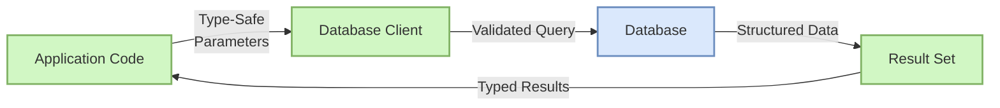

**Complexity: Moderate (M)**

## 15.0 Introduction: Why Type Safety Matters for Database Code

In data engineering, database interactions are often the most critical parts of our systems. When a database query fails or returns unexpected data, it can lead to data corruption, incorrect analytics, or service outages. Applying static typing to our database code helps catch many of these issues _before_ they reach production.

Let's visualize how type safety fits into the database interaction flow:



In a type-safe database system:

1. Your database connection objects have explicit types
2. Query parameters are validated by the type system
3. Result sets have well-defined structures
4. Type errors are caught at development time, not runtime

This chapter builds directly on your knowledge from:

- **Chapter 7: Static Typing with Python** - We'll apply those typing concepts to database code
- **Chapters 13-14: Python Database Operations** - We'll add typing to the database patterns you've learned
- **Chapter 16-20: PostgreSQL** - We'll show how to create type-safe code for PostgreSQL

By the end of this chapter, you'll be able to write database code that:

- Is more reliable and less prone to runtime errors
- Provides better documentation through type annotations
- Offers enhanced editor support for autocomplete and hints
- Can be verified automatically with static type checkers

## 15.1 Type Annotations for Database Connections

The first step in creating type-safe database code is properly typing your database connection objects. This helps prevent misuse of these objects and provides better editor support when writing queries.

### 15.1.1 Basic Database Connection Types

Let's start by importing the types we'll need for PostgreSQL connections using psycopg2:

```python
from typing import Optional, List, Dict, Any, Tuple, Union
import psycopg2
from psycopg2.extensions import connection, cursor

# Define a function that creates a database connection with type annotations
def get_database_connection(
    host: str,
    database: str,
    user: str,
    password: str,
    port: int = 5432
) -> connection:
    """
    Create a connection to a PostgreSQL database with type annotations.

    Args:
        host: Database server hostname
        database: Database name
        user: Database username
        password: Database password
        port: Database server port (default: 5432)

    Returns:
        A psycopg2 connection object
    """
    conn = psycopg2.connect(
        host=host,
        database=database,
        user=user,
        password=password,
        port=port
    )
    return conn

# Test the function (with a print statement to show the connection)
try:
    # Note: In a real application, you would never hardcode credentials like this
    # This is just for demonstration
    conn = get_database_connection(
        host="localhost",
        database="testdb",
        user="testuser",
        password="testpass"
    )
    print(f"Connection established: {conn}")
    conn.close()
except Exception as e:
    print(f"Connection failed: {e}")

# Connection established: <connection object at 0x7f8a12d45f40; dsn: 'host=localhost user=testuser password=xxx dbname=testdb', closed: 0>
# (Note: The actual output will depend on your database setup)
```

Notice how we're using the `connection` type from `psycopg2.extensions` to explicitly type the return value of our function. This helps both developers and static type checkers understand what type of object the function returns.

### 15.1.2 Context Manager with Type Annotations

In Chapter 13, you learned about using context managers for database connections. Let's add type annotations to a context manager function:

```python
from contextlib import contextmanager
from typing import Generator, Dict, Any

@contextmanager
def db_connection(
    config: Dict[str, Any]
) -> Generator[connection, None, None]:
    """
    Create a database connection using a context manager with type annotations.

    Args:
        config: Dictionary containing connection parameters

    Yields:
        A psycopg2 connection object

    Raises:
        psycopg2.Error: If connection fails
    """
    conn = None
    try:
        # Create connection
        conn = psycopg2.connect(
            host=config.get("host", "localhost"),
            database=config["database"],
            user=config["user"],
            password=config["password"],
            port=config.get("port", 5432)
        )
        yield conn
    finally:
        # Close connection if it exists
        if conn is not None:
            conn.close()

# Test the context manager
db_config = {
    "host": "localhost",
    "database": "testdb",
    "user": "testuser",
    "password": "testpass"
}

try:
    with db_connection(db_config) as conn:
        print(f"Connection inside context manager: {conn}")
        # The connection will be automatically closed when exiting the with block

    print("Connection should now be closed")
except Exception as e:
    print(f"Error: {e}")

# Connection inside context manager: <connection object at 0x7f8a12d45f40; dsn: 'host=localhost user=testuser password=xxx dbname=testdb', closed: 0>
# Connection should now be closed
```

The type annotation `Generator[connection, None, None]` for the context manager indicates that:

- It yields an object of type `connection`
- It doesn't receive any values (first `None`)
- It doesn't return any final value (second `None`)

This precise typing helps static type checkers verify that your code correctly handles the connection object.

### 15.1.3 Creating Type-Safe Cursor Functions

Let's add type annotations to functions that create and use database cursors:

```python
def execute_query(
    conn: connection,
    query: str,
    parameters: Optional[Tuple[Any, ...]] = None
) -> cursor:
    """
    Execute a SQL query with type annotations.

    Args:
        conn: Database connection object
        query: SQL query string
        parameters: Optional tuple of parameters to pass to the query

    Returns:
        A database cursor after executing the query
    """
    cur = conn.cursor()
    if parameters:
        cur.execute(query, parameters)
    else:
        cur.execute(query)
    return cur

# Test the function
try:
    # Create a connection
    conn = get_database_connection(
        host="localhost",
        database="testdb",
        user="testuser",
        password="testpass"
    )

    # Create a test table (this is for demonstration only)
    create_table_query = """
    CREATE TABLE IF NOT EXISTS test_table (
        id SERIAL PRIMARY KEY,
        name TEXT NOT NULL,
        value INTEGER
    )
    """
    cur = execute_query(conn, create_table_query)
    cur.close()

    # Insert some data
    insert_query = "INSERT INTO test_table (name, value) VALUES (%s, %s)"
    cur = execute_query(conn, insert_query, ("test_name", 42))
    print(f"Inserted {cur.rowcount} row(s)")
    cur.close()

    # Clean up
    conn.commit()
    conn.close()
except Exception as e:
    print(f"An error occurred: {e}")

# Inserted 1 row(s)
```

The type annotations make it clear that:

- The `conn` parameter must be a psycopg2 `connection` object
- The `parameters` argument is optional (`Optional`) and should be a tuple if provided
- The function returns a `cursor` object

### 15.1.4 Creating a Database Utility Class with Type Annotations

Let's create a more comprehensive database utility class with proper type annotations. This class demonstrates several important patterns for type-safe database code:

```python
class DatabaseManager:
    """Type-safe database management class."""

    def __init__(
        self,
        host: str,
        database: str,
        user: str,
        password: str,
        port: int = 5432
    ) -> None:
        """
        Initialize the database manager.

        Args:
            host: Database server hostname
            database: Database name
            user: Database username
            password: Database password
            port: Database server port (default: 5432)
        """
        self.host = host
        self.database = database
        self.user = user
        self.password = password
        self.port = port
        # Note the explicit Optional type - this tells both developers and type checkers
        # that this property might be None at some points during the object's lifecycle
        self.conn: Optional[connection] = None

    def connect(self) -> None:
        """Establish a database connection."""
        if self.conn is None or self.conn.closed:
            self.conn = psycopg2.connect(
                host=self.host,
                database=self.database,
                user=self.user,
                password=self.password,
                port=self.port
            )

    def disconnect(self) -> None:
        """Close the database connection if it exists."""
        if self.conn and not self.conn.closed:
            self.conn.close()
            self.conn = None

    def execute(
        self,
        query: str,
        parameters: Optional[Tuple[Any, ...]] = None
    ) -> cursor:
        """
        Execute a query and return the cursor.

        Args:
            query: SQL query string
            parameters: Optional parameters for the query

        Returns:
            Database cursor after executing the query

        Raises:
            RuntimeError: If not connected to database
        """
        # Type checking helps catch potential errors - for example, if conn is None
        # this condition will be flagged by type checkers since we're checking a
        # possibly None value for .closed attribute
        if not self.conn or self.conn.closed:
            raise RuntimeError("Not connected to database")

        cur = self.conn.cursor()
        if parameters:
            cur.execute(query, parameters)
        else:
            cur.execute(query)
        return cur

    def commit(self) -> None:
        """Commit the current transaction."""
        if self.conn and not self.conn.closed:
            self.conn.commit()

    def rollback(self) -> None:
        """Rollback the current transaction."""
        if self.conn and not self.conn.closed:
            self.conn.rollback()

    def __enter__(self) -> 'DatabaseManager':
        """Context manager entry."""
        self.connect()
        return self

    def __exit__(self, exc_type: Any, exc_val: Any, exc_tb: Any) -> None:
        """Context manager exit."""
        # Type safety here helps ensure we handle transaction states correctly
        # based on exception occurrence, reducing potential data corruption
        if exc_type is not None:
            # An exception occurred, rollback
            self.rollback()
        else:
            # No exception, commit
            self.commit()
        self.disconnect()

# Test the DatabaseManager class
try:
    # Create and use the database manager
    with DatabaseManager(
        host="localhost",
        database="testdb",
        user="testuser",
        password="testpass"
    ) as db:
        # Create a test table
        db.execute("""
        CREATE TABLE IF NOT EXISTS employees (
            id SERIAL PRIMARY KEY,
            name TEXT NOT NULL,
            department TEXT,
            salary INTEGER
        )
        """)

        # Insert data
        db.execute(
            "INSERT INTO employees (name, department, salary) VALUES (%s, %s, %s)",
            ("Alice Smith", "Engineering", 85000)
        )

        # Query data
        cursor = db.execute("SELECT * FROM employees ORDER BY id DESC LIMIT 1")
        employee = cursor.fetchone()
        print(f"Last employee: {employee}")
        cursor.close()

        # The transaction will be automatically committed when the context ends

    print("Database operations completed successfully")
except Exception as e:
    print(f"Database error: {e}")

# Last employee: (1, 'Alice Smith', 'Engineering', 85000)
# Database operations completed successfully
```

This class demonstrates several key benefits of type-safe database code:

1. **Self-documenting code** - Type annotations make it clear what each method expects and returns
2. **Error prevention** - The type checker will catch attempts to use the connection when it might be None
3. **IDE support** - Your editor can provide better autocomplete and hints based on the types
4. **Safer refactoring** - When you modify the code, the type checker helps ensure you don't break existing functionality

The `DatabaseManager` class uses type annotations for:

- All method parameters and return values
- Class instance variables (like `self.conn: Optional[connection]`)
- Special methods like `__enter__` and `__exit__` for context management

This comprehensive type annotation helps catch many common errors, like:

- Trying to execute a query without first connecting
- Passing incorrect parameter types to queries
- Using a closed connection

## 15.2 SQL Result Types

One of the most challenging aspects of database programming is properly typing the results returned from SQL queries. Let's look at different approaches to handle query results with proper type safety.

### 15.2.1 Basic Result Typing

First, let's create a simple function to fetch and type the results of a query:

```python
def fetch_employees(
    conn: connection,
    department: Optional[str] = None
) -> List[Tuple[int, str, str, int]]:
    """
    Fetch employee records with type annotations.

    Args:
        conn: Database connection
        department: Optional department filter

    Returns:
        List of employee tuples (id, name, department, salary)
    """
    query = "SELECT id, name, department, salary FROM employees"
    parameters: Optional[Tuple[Any, ...]] = None

    if department:
        query += " WHERE department = %s"
        parameters = (department,)

    with conn.cursor() as cur:
        if parameters:
            cur.execute(query, parameters)
        else:
            cur.execute(query)
        return cur.fetchall()  # Returns List[Tuple[int, str, str, int]]

# Test the function
try:
    conn = get_database_connection(
        host="localhost",
        database="testdb",
        user="testuser",
        password="testpass"
    )

    # Insert more test data if needed
    with conn.cursor() as cur:
        cur.execute("""
        INSERT INTO employees (name, department, salary)
        VALUES (%s, %s, %s), (%s, %s, %s)
        """, (
            "Bob Johnson", "Marketing", 65000,
            "Charlie Davis", "Engineering", 90000
        ))
    conn.commit()

    # Fetch all employees
    all_employees = fetch_employees(conn)
    print("All employees:")
    for emp in all_employees:
        print(f"  {emp}")

    # Fetch employees by department
    engineering = fetch_employees(conn, "Engineering")
    print("\nEngineering employees:")
    for emp in engineering:
        print(f"  {emp}")

    conn.close()
except Exception as e:
    print(f"Error: {e}")

# All employees:
#   (1, 'Alice Smith', 'Engineering', 85000)
#   (2, 'Bob Johnson', 'Marketing', 65000)
#   (3, 'Charlie Davis', 'Engineering', 90000)
#
# Engineering employees:
#   (1, 'Alice Smith', 'Engineering', 85000)
#   (3, 'Charlie Davis', 'Engineering', 90000)
```

The return type `List[Tuple[int, str, str, int]]` tells us exactly what to expect: a list of tuples, where each tuple contains an integer (ID), string (name), string (department), and integer (salary).

### 15.2.2 Using Named Tuples for Better Readability

Tuple indices aren't very descriptive. We can use `NamedTuple` for more readable code:

```python
from typing import NamedTuple, List, Optional

class Employee(NamedTuple):
    """Typed representation of an employee record."""
    id: int
    name: str
    department: str
    salary: int

def fetch_employees_as_namedtuples(
    conn: connection,
    department: Optional[str] = None
) -> List[Employee]:
    """
    Fetch employee records as NamedTuples with type annotations.

    Args:
        conn: Database connection
        department: Optional department filter

    Returns:
        List of Employee NamedTuples
    """
    query = "SELECT id, name, department, salary FROM employees"
    parameters: Optional[Tuple[Any, ...]] = None

    if department:
        query += " WHERE department = %s"
        parameters = (department,)

    with conn.cursor() as cur:
        if parameters:
            cur.execute(query, parameters)
        else:
            cur.execute(query)

        # Convert the raw tuples to Employee NamedTuples
        results = [
            Employee(id=row[0], name=row[1], department=row[2], salary=row[3])
            for row in cur.fetchall()
        ]
        return results

# Test the function
try:
    conn = get_database_connection(
        host="localhost",
        database="testdb",
        user="testuser",
        password="testpass"
    )

    employees = fetch_employees_as_namedtuples(conn)
    print("Employees as NamedTuples:")
    for emp in employees:
        # Now we can access fields by name
        print(f"  {emp.name} works in {emp.department} and earns ${emp.salary}")

    conn.close()
except Exception as e:
    print(f"Error: {e}")

# Employees as NamedTuples:
#   Alice Smith works in Engineering and earns $85000
#   Bob Johnson works in Marketing and earns $65000
#   Charlie Davis works in Engineering and earns $90000
```

Using `NamedTuple` provides several advantages:

1. Fields can be accessed by name (e.g., `emp.name` instead of `emp[1]`)
2. The code is more readable and self-documenting
3. Type checkers can verify that you're accessing valid fields

### 15.2.3 Using TypedDict for Dictionary-Style Results

If you prefer working with dictionaries for query results, `TypedDict` is a good option:

```python
from typing import TypedDict, List, Optional, Dict, Any

class EmployeeDict(TypedDict):
    """TypedDict for employee records."""
    id: int
    name: str
    department: str
    salary: int

def fetch_employees_as_dicts(
    conn: connection,
    department: Optional[str] = None
) -> List[EmployeeDict]:
    """
    Fetch employee records as dictionaries with type annotations.

    Args:
        conn: Database connection
        department: Optional department filter

    Returns:
        List of employee dictionaries with typed fields
    """
    query = "SELECT id, name, department, salary FROM employees"
    parameters: Optional[Tuple[Any, ...]] = None

    if department:
        query += " WHERE department = %s"
        parameters = (department,)

    # Use DictCursor to get dictionary-like results
    with conn.cursor(cursor_factory=psycopg2.extras.DictCursor) as cur:
        if parameters:
            cur.execute(query, parameters)
        else:
            cur.execute(query)

        # fetchall returns a list of dictionary-like objects
        rows = cur.fetchall()

        # Convert to proper dictionaries and ensure correct types
        results: List[EmployeeDict] = []
        for row in rows:
            # Create a typed dictionary with explicitly converted values
            employee: EmployeeDict = {
                'id': int(row['id']),
                'name': str(row['name']),
                'department': str(row['department']),
                'salary': int(row['salary'])
            }
            results.append(employee)

        return results

# We need to import the extras module for DictCursor
import psycopg2.extras

# Test the function
try:
    conn = get_database_connection(
        host="localhost",
        database="testdb",
        user="testuser",
        password="testpass"
    )

    employees = fetch_employees_as_dicts(conn)
    print("Employees as TypedDict:")
    for emp in employees:
        print(f"  {emp['name']} - {emp['department']} (ID: {emp['id']})")

    # Demonstrate type checking benefits
    # This would raise a type error if checked with pyright:
    # emp['unknown_field'] = 'value'  # TypedDict doesn't have this field

    conn.close()
except Exception as e:
    print(f"Error: {e}")

# Employees as TypedDict:
#   Alice Smith - Engineering (ID: 1)
#   Bob Johnson - Marketing (ID: 2)
#   Charlie Davis - Engineering (ID: 3)
```

`TypedDict` offers several benefits:

1. It provides dictionary-like access (`emp['name']`)
2. Type checkers ensure you only access defined fields
3. It works well with JSON-like data structures

### 15.2.4 Handling Optional Fields and NULL Values

Database queries often return `NULL` values, which we need to handle properly in our type annotations:

```python
from typing import Optional, List, NamedTuple

class ProjectAssignment(NamedTuple):
    """Employee project assignment with optional fields."""
    employee_id: int
    employee_name: str
    project_id: Optional[int]  # May be NULL
    project_name: Optional[str]  # May be NULL
    role: Optional[str]  # May be NULL

def fetch_project_assignments(conn: connection) -> List[ProjectAssignment]:
    """
    Fetch employee project assignments, handling NULL values.

    Args:
        conn: Database connection

    Returns:
        List of project assignments with properly typed optional fields
    """
    # First, let's create a projects table and some assignments for demonstration
    with conn.cursor() as cur:
        # Create projects table
        cur.execute("""
        CREATE TABLE IF NOT EXISTS projects (
            id SERIAL PRIMARY KEY,
            name TEXT NOT NULL
        )
        """)

        # Create assignments table
        cur.execute("""
        CREATE TABLE IF NOT EXISTS assignments (
            employee_id INTEGER REFERENCES employees(id),
            project_id INTEGER REFERENCES projects(id),
            role TEXT,
            PRIMARY KEY (employee_id, project_id)
        )
        """)

        # Insert project data
        cur.execute("INSERT INTO projects (name) VALUES (%s), (%s) RETURNING id",
                   ("Website Redesign", "Data Pipeline"))
        project_ids = [row[0] for row in cur.fetchall()]

        # Assign some employees to projects (including NULL roles)
        if len(project_ids) >= 2:
            cur.execute("""
            INSERT INTO assignments (employee_id, project_id, role) VALUES
            (%s, %s, %s), (%s, %s, %s), (%s, %s, NULL)
            ON CONFLICT DO NOTHING
            """, (
                1, project_ids[0], "Lead Developer",
                2, project_ids[1], "Marketing Manager",
                3, project_ids[0], None  # NULL role
            ))

    conn.commit()

    # Now query the assignments with JOINs
    query = """
    SELECT
        e.id AS employee_id,
        e.name AS employee_name,
        p.id AS project_id,
        p.name AS project_name,
        a.role
    FROM
        employees e
    LEFT JOIN
        assignments a ON e.id = a.employee_id
    LEFT JOIN
        projects p ON a.project_id = p.id
    ORDER BY
        e.id, p.id
    """

    with conn.cursor() as cur:
        cur.execute(query)

        # Convert to ProjectAssignment objects
        results: List[ProjectAssignment] = []
        for row in cur.fetchall():
            assignment = ProjectAssignment(
                employee_id=row[0],
                employee_name=row[1],
                project_id=row[2],  # May be None
                project_name=row[3],  # May be None
                role=row[4]  # May be None
            )
            results.append(assignment)

        return results

# Test the function
try:
    conn = get_database_connection(
        host="localhost",
        database="testdb",
        user="testuser",
        password="testpass"
    )

    assignments = fetch_project_assignments(conn)
    print("Project Assignments (with NULL handling):")
    for a in assignments:
        # Handle NULL values with proper type checks
        if a.project_id is None:
            print(f"  {a.employee_name} is not assigned to any project")
        else:
            role_text = f"as {a.role}" if a.role else "with no specific role"
            print(f"  {a.employee_name} works on {a.project_name} {role_text}")

    conn.close()
except Exception as e:
    print(f"Error: {e}")

# Project Assignments (with NULL handling):
#   Alice Smith works on Website Redesign as Lead Developer
#   Bob Johnson works on Data Pipeline as Marketing Manager
#   Charlie Davis works on Website Redesign with no specific role
```

Using `Optional[Type]` annotations tells the type checker that these fields might be `None`, which helps prevent errors when working with nullable database fields.

## 15.3 Custom Types for Database Models

For more complex applications, it's useful to create custom types that represent your database tables and relationships. This approach, often called the "model pattern," helps maintain type safety throughout your application.

### 15.3.1 Creating Basic Database Models

Let's create some models to represent our database tables:

```python
from typing import List, Optional, Dict, Any, NamedTuple
from datetime import date

# Base models using NamedTuple for immutability
class Department(NamedTuple):
    """Department model."""
    id: int
    name: str
    location: str

class Project(NamedTuple):
    """Project model."""
    id: int
    name: str
    start_date: date
    end_date: Optional[date]
    budget: float

class Employee(NamedTuple):
    """Employee model."""
    id: int
    name: str
    department_id: int
    title: str
    hire_date: date
    salary: float

# Create the database schema for these models
def create_schema(conn: connection) -> None:
    """Create database schema for our models."""
    with conn.cursor() as cur:
        # Create departments table
        cur.execute("""
        CREATE TABLE IF NOT EXISTS departments (
            id SERIAL PRIMARY KEY,
            name TEXT NOT NULL,
            location TEXT NOT NULL
        )
        """)

        # Create projects table
        cur.execute("""
        CREATE TABLE IF NOT EXISTS projects (
            id SERIAL PRIMARY KEY,
            name TEXT NOT NULL,
            start_date DATE NOT NULL,
            end_date DATE,
            budget NUMERIC(10, 2) NOT NULL
        )
        """)

        # Create employees table
        cur.execute("""
        CREATE TABLE IF NOT EXISTS employees (
            id SERIAL PRIMARY KEY,
            name TEXT NOT NULL,
            department_id INTEGER REFERENCES departments(id),
            title TEXT NOT NULL,
            hire_date DATE NOT NULL,
            salary NUMERIC(10, 2) NOT NULL
        )
        """)

    conn.commit()
    print("Schema created successfully")

# Insert sample data for our models
def insert_sample_data(conn: connection) -> None:
    """Insert sample data for our models."""
    with conn.cursor() as cur:
        # Insert departments
        cur.execute("""
        INSERT INTO departments (name, location) VALUES
        (%s, %s), (%s, %s), (%s, %s)
        ON CONFLICT DO NOTHING
        RETURNING id
        """, (
            "Engineering", "Building A",
            "Marketing", "Building B",
            "Finance", "Building C"
        ))

        # Insert projects
        cur.execute("""
        INSERT INTO projects (name, start_date, end_date, budget) VALUES
        (%s, %s, %s, %s), (%s, %s, %s, %s)
        ON CONFLICT DO NOTHING
        """, (
            "Website Redesign", date(2023, 1, 15), date(2023, 6, 30), 75000.00,
            "Data Pipeline", date(2023, 3, 1), None, 120000.00  # Ongoing project
        ))

        # Insert employees
        cur.execute("""
        INSERT INTO employees (name, department_id, title, hire_date, salary) VALUES
        (%s, %s, %s, %s, %s), (%s, %s, %s, %s, %s), (%s, %s, %s, %s, %s)
        ON CONFLICT DO NOTHING
        """, (
            "Alice Smith", 1, "Senior Developer", date(2020, 5, 15), 95000.00,
            "Bob Johnson", 2, "Marketing Specialist", date(2021, 2, 10), 72000.00,
            "Charlie Davis", 1, "DevOps Engineer", date(2022, 8, 1), 88000.00
        ))

    conn.commit()
    print("Sample data inserted successfully")

# Test creating schema and sample data
try:
    conn = get_database_connection(
        host="localhost",
        database="testdb",
        user="testuser",
        password="testpass"
    )

    create_schema(conn)
    insert_sample_data(conn)

    conn.close()
except Exception as e:
    print(f"Database setup error: {e}")

# Schema created successfully
# Sample data inserted successfully
```

### 15.3.2 Creating Model Repository Classes

Now let's create "repository" classes that handle database operations for our models:

```python
from typing import List, Optional, Dict, Any, NamedTuple
from datetime import date

class DepartmentRepository:
    """Repository for Department data access."""

    def __init__(self, conn: connection) -> None:
        """Initialize with a database connection."""
        self.conn = conn

    def find_by_id(self, department_id: int) -> Optional[Department]:
        """Find a department by ID."""
        query = "SELECT id, name, location FROM departments WHERE id = %s"

        with self.conn.cursor() as cur:
            cur.execute(query, (department_id,))
            row = cur.fetchone()

            if row is None:
                return None

            return Department(
                id=row[0],
                name=row[1],
                location=row[2]
            )

    def find_all(self) -> List[Department]:
        """Find all departments."""
        query = "SELECT id, name, location FROM departments ORDER BY name"

        with self.conn.cursor() as cur:
            cur.execute(query)

            return [
                Department(
                    id=row[0],
                    name=row[1],
                    location=row[2]
                )
                for row in cur.fetchall()
            ]

    def find_by_location(self, location: str) -> List[Department]:
        """Find departments by location."""
        query = "SELECT id, name, location FROM departments WHERE location = %s"

        with self.conn.cursor() as cur:
            cur.execute(query, (location,))

            return [
                Department(
                    id=row[0],
                    name=row[1],
                    location=row[2]
                )
                for row in cur.fetchall()
            ]

    def create(self, name: str, location: str) -> Department:
        """Create a new department."""
        query = """
        INSERT INTO departments (name, location)
        VALUES (%s, %s)
        RETURNING id, name, location
        """

        with self.conn.cursor() as cur:
            cur.execute(query, (name, location))
            self.conn.commit()

            row = cur.fetchone()
            return Department(
                id=row[0],
                name=row[1],
                location=row[2]
            )

# Test the repository pattern
try:
    conn = get_database_connection(
        host="localhost",
        database="testdb",
        user="testuser",
        password="testpass"
    )

    # Create repository
    dept_repo = DepartmentRepository(conn)

    # Find all departments
    departments = dept_repo.find_all()
    print("All departments:")
    for dept in departments:
        print(f"  {dept.id}: {dept.name} ({dept.location})")

    # Find department by ID
    dept_id = departments[0].id if departments else 1
    department = dept_repo.find_by_id(dept_id)
    if department:
        print(f"\nDepartment with ID {dept_id}: {department.name}")
    else:
        print(f"\nNo department found with ID {dept_id}")

    # Create a new department
    new_dept = dept_repo.create("Research", "Building D")
    print(f"\nCreated new department: {new_dept}")

    conn.close()
except Exception as e:
    print(f"Repository error: {e}")

# All departments:
#   1: Engineering (Building A)
#   2: Finance (Building C)
#   3: Marketing (Building B)
#
# Department with ID 1: Engineering
#
# Created new department: Department(id=4, name='Research', location='Building D')
```

The repository pattern with type annotations provides several benefits:

1. Strong typing for all database operations
2. Consistent interface for data access
3. Separation of concerns between data models and database access
4. Better testability with mock repositories

### 15.3.3 Building a Type-Safe Employee Repository

Let's create a more complex repository for employees that demonstrates more advanced type-safe database operations:

```python
from typing import List, Optional, Dict, Any, NamedTuple, Tuple
from datetime import date

class EmployeeWithDepartment(NamedTuple):
    """Employee with department information."""
    id: int
    name: str
    title: str
    hire_date: date
    salary: float
    department_id: int
    department_name: str
    department_location: str

class EmployeeRepository:
    """Repository for Employee data access."""

    def __init__(self, conn: connection) -> None:
        """Initialize with a database connection."""
        self.conn = conn

    def find_with_department(self, employee_id: int) -> Optional[EmployeeWithDepartment]:
        """
        Find an employee with department details.

        Args:
            employee_id: The employee ID to look up

        Returns:
            EmployeeWithDepartment object or None if not found
        """
        query = """
        SELECT
            e.id, e.name, e.title, e.hire_date, e.salary,
            d.id, d.name, d.location
        FROM
            employees e
        JOIN
            departments d ON e.department_id = d.id
        WHERE
            e.id = %s
        """

        with self.conn.cursor() as cur:
            cur.execute(query, (employee_id,))
            row = cur.fetchone()

            if row is None:
                return None

            return EmployeeWithDepartment(
                id=row[0],
                name=row[1],
                title=row[2],
                hire_date=row[3],
                salary=row[4],
                department_id=row[5],
                department_name=row[6],
                department_location=row[7]
            )

    def find_by_department(self, department_id: int) -> List[Employee]:
        """Find employees in a specific department."""
        query = """
        SELECT id, name, department_id, title, hire_date, salary
        FROM employees
        WHERE department_id = %s
        ORDER BY name
        """

        with self.conn.cursor() as cur:
            cur.execute(query, (department_id,))

            return [
                Employee(
                    id=row[0],
                    name=row[1],
                    department_id=row[2],
                    title=row[3],
                    hire_date=row[4],
                    salary=row[5]
                )
                for row in cur.fetchall()
            ]

    def find_by_salary_range(
        self,
        min_salary: float,
        max_salary: float
    ) -> List[Employee]:
        """Find employees within a salary range."""
        query = """
        SELECT id, name, department_id, title, hire_date, salary
        FROM employees
        WHERE salary BETWEEN %s AND %s
        ORDER BY salary DESC
        """

        with self.conn.cursor() as cur:
            cur.execute(query, (min_salary, max_salary))

            return [
                Employee(
                    id=row[0],
                    name=row[1],
                    department_id=row[2],
                    title=row[3],
                    hire_date=row[4],
                    salary=row[5]
                )
                for row in cur.fetchall()
            ]

    def update_salary(
        self,
        employee_id: int,
        new_salary: float
    ) -> Optional[Employee]:
        """
        Update an employee's salary.

        Args:
            employee_id: The employee ID
            new_salary: New salary amount

        Returns:
            Updated Employee or None if not found
        """
        query = """
        UPDATE employees
        SET salary = %s
        WHERE id = %s
        RETURNING id, name, department_id, title, hire_date, salary
        """

        with self.conn.cursor() as cur:
            cur.execute(query, (new_salary, employee_id))
            self.conn.commit()

            row = cur.fetchone()
            if row is None:
                return None

            return Employee(
                id=row[0],
                name=row[1],
                department_id=row[2],
                title=row[3],
                hire_date=row[4],
                salary=row[5]
            )

# Test the employee repository
try:
    conn = get_database_connection(
        host="localhost",
        database="testdb",
        user="testuser",
        password="testpass"
    )

    # Create repository
    emp_repo = EmployeeRepository(conn)

    # Find employee with department
    emp_with_dept = emp_repo.find_with_department(1)
    if emp_with_dept:
        print(f"Employee details:")
        print(f"  {emp_with_dept.name} ({emp_with_dept.title})")
        print(f"  Department: {emp_with_dept.department_name} ({emp_with_dept.department_location})")
        print(f"  Salary: ${emp_with_dept.salary:,.2f}")

    # Find employees by department
    eng_employees = emp_repo.find_by_department(1)  # Engineering department
    print(f"\nEngineering department employees:")
    for emp in eng_employees:
        print(f"  {emp.name} - {emp.title}")

    # Find employees by salary range
    salary_range = emp_repo.find_by_salary_range(70000, 100000)
    print(f"\nEmployees with salary between $70,000 and $100,000:")
    for emp in salary_range:
        print(f"  {emp.name}: ${emp.salary:,.2f}")

    # Update an employee's salary
    updated_emp = emp_repo.update_salary(1, 97500.00)
    if updated_emp:
        print(f"\nUpdated {updated_emp.name}'s salary to ${updated_emp.salary:,.2f}")

    conn.close()
except Exception as e:
    print(f"Employee repository error: {e}")

# Employee details:
#   Alice Smith (Senior Developer)
#   Department: Engineering (Building A)
#   Salary: $95,000.00
#
# Engineering department employees:
#   Alice Smith - Senior Developer
#   Charlie Davis - DevOps Engineer
#
# Employees with salary between $70,000 and $100,000:
#   Alice Smith: $95,000.00
#   Charlie Davis: $88,000.00
#   Bob Johnson: $72,000.00
#
# Updated Alice Smith's salary to $97,500.00
```

## 15.4 Type-Checking Database Code

Now that we've created type-safe database code, let's look at how to verify it with static type checkers like pyright.

### 15.4.1 Setting Up pyright for Database Code

To use pyright for checking your database code, you need to create a configuration file:

```python
# This is not Python code, but a demonstration of a pyright configuration file
# Save this to pyrightconfig.json in your project directory

"""
{
    "include": ["src"],
    "exclude": ["**/node_modules", "**/__pycache__"],
    "reportMissingImports": true,
    "reportMissingTypeStubs": false,
    "pythonVersion": "3.8",
    "typeCheckingMode": "strict",
    "reportOptionalMemberAccess": false,
    "reportOptionalSubscript": false
}
"""

# Note: The above is not actual Python code, but a JSON configuration example.
# In a real project, you would create a separate pyrightconfig.json file.

print("Pyright configuration would be saved to pyrightconfig.json")
# Pyright configuration would be saved to pyrightconfig.json
```

### 15.4.2 Common Type Checking Issues with Database Code

Let's look at some common issues that type checkers can find in database code. Understanding these common problems will help you write more robust database interactions from the start:

```python
# Example of code with type issues that pyright would catch
from typing import List, Dict, Any, Optional

def example_with_type_issues() -> None:
    """Examples of database code with type issues."""

    # Example 1: Incorrect parameter type
    def get_employee(conn: connection, id: str) -> Optional[Employee]:
        # Type issue: `id` should be an integer, not a string
        # In a database with integer primary keys, passing a string can cause:
        # 1. Runtime errors during query execution
        # 2. Unexpected behavior due to implicit type conversion
        # 3. Potential security issues if concatenating values
        with conn.cursor() as cur:
            cur.execute("SELECT * FROM employees WHERE id = %s", (id,))
            # ...rest of implementation
        return None

    # Example 2: Missing return type annotation
    def fetch_departments(conn: connection):  # Missing return type
        # Without a return type annotation:
        # 1. Callers don't know what to expect
        # 2. Type checkers can't verify correct usage
        # 3. It's harder to refactor safely later
        with conn.cursor() as cur:
            cur.execute("SELECT id, name FROM departments")
            return cur.fetchall()

    # Example 3: Inconsistent return type
    def get_department_or_error(conn: connection, dept_id: int) -> Department:
        # Type error: The function says it always returns Department
        # but can actually return None. This could cause:
        # 1. Unexpected NullReferenceExceptions
        # 2. Crashes in production
        # 3. Difficult debugging
        with conn.cursor() as cur:
            cur.execute("SELECT id, name, location FROM departments WHERE id = %s", (dept_id,))
            row = cur.fetchone()
            if row is None:
                return None  # Type error: should return Department but returns None
            return Department(id=row[0], name=row[1], location=row[2])

    # Example 4: Accessing a potentially None value without check
    def get_manager_name(conn: connection, dept_id: int) -> str:
        # This is a classic database-related error:
        # 1. Database queries can return None (no results)
        # 2. Without a check, we'll get runtime errors
        # 3. Type checkers will warn us about this potential issue
        manager = get_department_manager(conn, dept_id)  # Returns Optional[Employee]
        return manager.name  # Type error: manager might be None

    print("This function demonstrates code that would have type checking issues")

    # Note: These functions are just examples to show type checking issues
    # They aren't meant to be called in this context

# This is just a demonstration of issues, not actual runnable code
print("Examples of code with type issues that pyright would detect")
# Examples of code with type issues that pyright would detect
```

Using a type checker like pyright catches these issues before they ever make it to production. This is especially valuable in data engineering where database operations are often critical path processes that handle important information.

### 15.4.3 Fixing Type Checking Issues

Now let's fix the type issues we identified:

```python
# Example of code with type issues fixed
from typing import List, Dict, Any, Optional

def example_with_fixed_types() -> None:
    """Examples of database code with type issues fixed."""

    # Example 1: Correct parameter type
    def get_employee(conn: connection, id: int) -> Optional[Employee]:
        # Fixed: `id` is now correctly typed as integer
        with conn.cursor() as cur:
            cur.execute("SELECT * FROM employees WHERE id = %s", (id,))
            # ...rest of implementation
        return None

    # Example 2: Added return type annotation
    def fetch_departments(conn: connection) -> List[Tuple[int, str]]:
        # Fixed: Added return type annotation
        with conn.cursor() as cur:
            cur.execute("SELECT id, name FROM departments")
            return cur.fetchall()

    # Example 3: Consistent return type with Optional
    def get_department_or_error(conn: connection, dept_id: int) -> Optional[Department]:
        # Fixed: Changed return type to Optional[Department]
        with conn.cursor() as cur:
            cur.execute("SELECT id, name, location FROM departments WHERE id = %s", (dept_id,))
            row = cur.fetchone()
            if row is None:
                return None  # Now matches the return type
            return Department(id=row[0], name=row[1], location=row[2])

    # Example 4: Proper handling of Optional value
    def get_manager_name(conn: connection, dept_id: int) -> Optional[str]:
        # Fixed: Return type is now Optional[str]
        manager = get_department_manager(conn, dept_id)  # Returns Optional[Employee]
        if manager is None:
            return None  # Handle None case
        return manager.name  # Safe to access name now

    print("This function demonstrates code with fixed type checking issues")

    # Note: These functions are just examples to show type checking fixes
    # They aren't meant to be called in this context

# This is just a demonstration of fixes, not actual runnable code
print("Examples of code with type issues fixed")
# Examples of code with type issues fixed
```

### 15.4.4 Using pyright in Your Development Workflow

Here's how to integrate pyright into your development workflow for database code:

```python
# This is not actual code but a demonstration of pyright workflow commands

"""
# Install pyright (if using npm)
npm install -g pyright

# Or install with pip
pip install pyright

# Run pyright on your code
pyright src/

# Run with specific settings
pyright --verifytypes src/database/

# Add to your CI pipeline
# In a GitHub Actions workflow:
- name: Type check with pyright
  run: pyright src/
"""

print("To run pyright on your database code:")
print("  $ pyright src/database/")
print("For more detailed output:")
print("  $ pyright --verbose src/database/")

# To run pyright on your database code:
#   $ pyright src/database/
# For more detailed output:
#   $ pyright --verbose src/database/
```

## 15.5 Testing Database Operations

Type checking helps catch many issues at development time, but we still need tests to verify our database code's behavior at runtime.

### 15.5.1 Unit Testing Database Functions

Here's how to unit test database functions using a test database:

```python
import unittest
from typing import Optional, List, Dict, Any
import psycopg2
from psycopg2.extensions import connection

# First, let's create a base test class for database tests
class DatabaseTestCase(unittest.TestCase):
    """Base class for database tests."""

    def setUp(self) -> None:
        """Set up test database connection."""
        # Connect to test database
        # Note: In real tests, use a dedicated test database or mock
        self.conn = psycopg2.connect(
            host="localhost",
            database="testdb",
            user="testuser",
            password="testpass"
        )

        # Create test schema and data
        self._create_test_schema()

    def tearDown(self) -> None:
        """Clean up after tests."""
        # Clean up test data
        self._clean_up_test_data()

        # Close connection
        if self.conn and not self.conn.closed:
            self.conn.close()

    def _create_test_schema(self) -> None:
        """Create test schema and data."""
        with self.conn.cursor() as cur:
            # Create test departments table
            cur.execute("""
            CREATE TABLE IF NOT EXISTS test_departments (
                id SERIAL PRIMARY KEY,
                name TEXT NOT NULL,
                location TEXT NOT NULL
            )
            """)

            # Create test employees table
            cur.execute("""
            CREATE TABLE IF NOT EXISTS test_employees (
                id SERIAL PRIMARY KEY,
                name TEXT NOT NULL,
                department_id INTEGER REFERENCES test_departments(id),
                salary NUMERIC(10, 2) NOT NULL
            )
            """)

            # Insert test data
            cur.execute("""
            INSERT INTO test_departments (name, location) VALUES
            ('Test Dept 1', 'Test Location 1'),
            ('Test Dept 2', 'Test Location 2')
            """)

            cur.execute("""
            INSERT INTO test_employees (name, department_id, salary) VALUES
            ('Test Employee 1', 1, 50000),
            ('Test Employee 2', 1, 60000),
            ('Test Employee 3', 2, 70000)
            """)

        self.conn.commit()

    def _clean_up_test_data(self) -> None:
        """Clean up test data."""
        with self.conn.cursor() as cur:
            # Clean up in reverse order due to foreign key constraints
            cur.execute("DROP TABLE IF EXISTS test_employees")
            cur.execute("DROP TABLE IF EXISTS test_departments")

        self.conn.commit()

# Demonstrate a test class for the employee repository
class TestEmployeeRepository(DatabaseTestCase):
    """Test cases for EmployeeRepository."""

    def test_find_by_department(self) -> None:
        """Test finding employees by department."""
        # Create repository with test connection
        repository = MockEmployeeRepository(self.conn)

        # Get employees in department 1
        employees = repository.find_by_department(1)

        # Verify results
        self.assertEqual(len(employees), 2, "Should find 2 employees in department 1")
        self.assertEqual(employees[0].name, "Test Employee 1")
        self.assertEqual(employees[1].name, "Test Employee 2")

    def test_find_by_salary_range(self) -> None:
        """Test finding employees by salary range."""
        # Create repository with test connection
        repository = MockEmployeeRepository(self.conn)

        # Get employees with salary between 55000 and 65000
        employees = repository.find_by_salary_range(55000, 65000)

        # Verify results
        self.assertEqual(len(employees), 1, "Should find 1 employee in the salary range")
        self.assertEqual(employees[0].name, "Test Employee 2")
        self.assertEqual(employees[0].salary, 60000)

# MockEmployeeRepository for testing
class MockEmployee(NamedTuple):
    """Simplified Employee model for testing."""
    id: int
    name: str
    department_id: int
    salary: float

class MockEmployeeRepository:
    """Repository for Employee data access - test version."""

    def __init__(self, conn: connection) -> None:
        """Initialize with a database connection."""
        self.conn = conn

    def find_by_department(self, department_id: int) -> List[MockEmployee]:
        """Find employees in a specific department."""
        query = """
        SELECT id, name, department_id, salary
        FROM test_employees
        WHERE department_id = %s
        ORDER BY name
        """

        with self.conn.cursor() as cur:
            cur.execute(query, (department_id,))

            return [
                MockEmployee(
                    id=row[0],
                    name=row[1],
                    department_id=row[2],
                    salary=row[3]
                )
                for row in cur.fetchall()
            ]

    def find_by_salary_range(
        self,
        min_salary: float,
        max_salary: float
    ) -> List[MockEmployee]:
        """Find employees within a salary range."""
        query = """
        SELECT id, name, department_id, salary
        FROM test_employees
        WHERE salary BETWEEN %s AND %s
        ORDER BY salary
        """

        with self.conn.cursor() as cur:
            cur.execute(query, (min_salary, max_salary))

            return [
                MockEmployee(
                    id=row[0],
                    name=row[1],
                    department_id=row[2],
                    salary=row[3]
                )
                for row in cur.fetchall()
            ]

# Demonstrate how to run the tests
if __name__ == "__main__":
    print("This would run the database tests if executed:")
    print("unittest.main()")
    # unittest.main()  # Commented out to avoid actual test execution in our example

# This would run the database tests if executed:
# unittest.main()
```

### 15.5.2 Mocking Database Connections

For faster tests that don't require a real database, we can use mocking:

```python
import unittest
from unittest.mock import Mock, patch
from typing import List, Optional, Dict, Any, NamedTuple
from datetime import date

# Define a simple Employee model for our tests
class TestEmployee(NamedTuple):
    """Employee model for testing."""
    id: int
    name: str
    department_id: int
    title: str
    hire_date: date
    salary: float

# Function to test
def get_employee_salary(conn: connection, employee_id: int) -> Optional[float]:
    """Get an employee's salary by ID."""
    with conn.cursor() as cur:
        cur.execute(
            "SELECT salary FROM employees WHERE id = %s",
            (employee_id,)
        )
        row = cur.fetchone()
        if row is None:
            return None
        return float(row[0])

# Test class using mocks
class TestEmployeeFunctions(unittest.TestCase):
    """Test employee functions with mocked database."""

    def test_get_employee_salary_found(self) -> None:
        """Test getting salary when employee exists."""
        # Create mock objects
        mock_cursor = Mock()
        mock_connection = Mock()

        # Configure mock behavior
        mock_cursor.fetchone.return_value = (75000.0,)
        mock_connection.cursor.return_value.__enter__.return_value = mock_cursor

        # Call the function with our mock
        salary = get_employee_salary(mock_connection, 1)

        # Verify the result
        self.assertEqual(salary, 75000.0)

        # Verify the cursor was called correctly
        mock_cursor.execute.assert_called_once_with(
            "SELECT salary FROM employees WHERE id = %s",
            (1,)
        )

    def test_get_employee_salary_not_found(self) -> None:
        """Test getting salary when employee doesn't exist."""
        # Create mock objects
        mock_cursor = Mock()
        mock_connection = Mock()

        # Configure mock to return None (employee not found)
        mock_cursor.fetchone.return_value = None
        mock_connection.cursor.return_value.__enter__.return_value = mock_cursor

        # Call the function with our mock
        salary = get_employee_salary(mock_connection, 999)

        # Verify the result is None
        self.assertIsNone(salary)

        # Verify the cursor was called correctly
        mock_cursor.execute.assert_called_once_with(
            "SELECT salary FROM employees WHERE id = %s",
            (999,)
        )

# Demonstrate how to run the tests
if __name__ == "__main__":
    print("This would run the mocked tests if executed:")
    print("unittest.main()")
    # unittest.main()  # Commented out to avoid actual test execution

# This would run the mocked tests if executed:
# unittest.main()
```

### 15.5.3 Testing Complex Database Operations

For more complex database operations, we need more sophisticated testing approaches:

```python
from typing import List, Dict, Any, Optional, Tuple, NamedTuple
from datetime import date
import unittest
from unittest.mock import Mock, patch

# Complex function to test
def calculate_department_statistics(
    conn: connection,
    department_id: int
) -> Dict[str, Any]:
    """
    Calculate statistics for a department.

    Args:
        conn: Database connection
        department_id: Department ID

    Returns:
        Dictionary of department statistics
    """
    stats: Dict[str, Any] = {
        "department_id": department_id,
        "employee_count": 0,
        "total_salary": 0.0,
        "average_salary": 0.0,
        "min_salary": 0.0,
        "max_salary": 0.0
    }

    # Get department name
    with conn.cursor() as cur:
        cur.execute(
            "SELECT name FROM departments WHERE id = %s",
            (department_id,)
        )
        dept = cur.fetchone()
        if dept is None:
            return stats

        stats["department_name"] = dept[0]

        # Get salary statistics
        cur.execute("""
        SELECT
            COUNT(*) as count,
            SUM(salary) as total,
            AVG(salary) as average,
            MIN(salary) as minimum,
            MAX(salary) as maximum
        FROM employees
        WHERE department_id = %s
        """, (department_id,))

        row = cur.fetchone()
        if row and row[0] > 0:
            stats["employee_count"] = row[0]
            stats["total_salary"] = float(row[1])
            stats["average_salary"] = float(row[2])
            stats["min_salary"] = float(row[3])
            stats["max_salary"] = float(row[4])

    return stats

# Test class for complex function
class TestDepartmentStatistics(unittest.TestCase):
    """Test department statistics function."""

    def test_calculate_department_statistics(self) -> None:
        """Test calculating department statistics."""
        # Create mock objects
        mock_cursor = Mock()
        mock_connection = Mock()

        # Configure mock for first query (department name)
        mock_cursor.fetchone.side_effect = [
            # First call returns department name
            ("Engineering",),
            # Second call returns salary statistics
            (3, 250000.0, 83333.33, 75000.0, 95000.0)
        ]
        mock_connection.cursor.return_value.__enter__.return_value = mock_cursor

        # Call the function with our mock
        stats = calculate_department_statistics(mock_connection, 1)

        # Verify the results
        self.assertEqual(stats["department_id"], 1)
        self.assertEqual(stats["department_name"], "Engineering")
        self.assertEqual(stats["employee_count"], 3)
        self.assertEqual(stats["total_salary"], 250000.0)
        self.assertEqual(stats["average_salary"], 83333.33)
        self.assertEqual(stats["min_salary"], 75000.0)
        self.assertEqual(stats["max_salary"], 95000.0)

        # Verify the queries were executed correctly
        self.assertEqual(mock_cursor.execute.call_count, 2)

    def test_department_not_found(self) -> None:
        """Test calculating statistics when department doesn't exist."""
        # Create mock objects
        mock_cursor = Mock()
        mock_connection = Mock()

        # Configure mock to return None (department not found)
        mock_cursor.fetchone.return_value = None
        mock_connection.cursor.return_value.__enter__.return_value = mock_cursor

        # Call the function with our mock
        stats = calculate_department_statistics(mock_connection, 999)

        # Verify default values are returned
        self.assertEqual(stats["department_id"], 999)
        self.assertEqual(stats["employee_count"], 0)
        self.assertEqual(stats["total_salary"], 0.0)

        # Verify only the first query was executed
        self.assertEqual(mock_cursor.execute.call_count, 1)

# Demonstrate how to run the tests
if __name__ == "__main__":
    print("This would run the complex operation tests if executed:")
    print("unittest.main()")
    # unittest.main()  # Commented out to avoid actual test execution

# This would run the complex operation tests if executed:
# unittest.main()
```

## 15.6 Comprehensive Type-Safe Database Code Example

Let's bring everything together with a comprehensive example of type-safe database code, combining type hints, custom models, error handling, and more. This example demonstrates how all the type safety concepts we've learned can be applied together to create a robust, maintainable database layer:

```python
from typing import List, Dict, Any, Optional, Tuple, NamedTuple, Union, TypedDict, Generator
from datetime import date, datetime
import psycopg2
from psycopg2.extensions import connection, cursor
import psycopg2.extras
from contextlib import contextmanager
import json

# Type aliases for clarity - these make our code more readable by giving
# meaningful names to complex types
RowData = Dict[str, Any]
QueryParams = Union[Tuple[Any, ...], Dict[str, Any]]

# Custom exceptions for better error handling
class DatabaseError(Exception):
    """Base exception for database errors."""
    pass

class RecordNotFoundError(DatabaseError):
    """Exception raised when a record is not found."""
    pass

class ValidationError(DatabaseError):
    """Exception raised when data validation fails."""
    pass

# Types for database models
class Department(NamedTuple):
    """Department model."""
    id: int
    name: str
    location: str

    @classmethod
    def from_row(cls, row: Tuple[Any, ...]) -> 'Department':
        """Create a Department from a database row."""
        return cls(
            id=int(row[0]),
            name=str(row[1]),
            location=str(row[2])
        )

    @classmethod
    def from_dict(cls, data: Dict[str, Any]) -> 'Department':
        """Create a Department from a dictionary."""
        return cls(
            id=int(data["id"]),
            name=str(data["name"]),
            location=str(data["location"])
        )

class Employee(NamedTuple):
    """Employee model."""
    id: int
    name: str
    department_id: int
    title: str
    hire_date: date
    salary: float

    @classmethod
    def from_row(cls, row: Tuple[Any, ...]) -> 'Employee':
        """Create an Employee from a database row."""
        return cls(
            id=int(row[0]),
            name=str(row[1]),
            department_id=int(row[2]),
            title=str(row[3]),
            hire_date=row[4] if isinstance(row[4], date) else date.fromisoformat(str(row[4])),
            salary=float(row[5])
        )

    @classmethod
    def from_dict(cls, data: Dict[str, Any]) -> 'Employee':
        """Create an Employee from a dictionary."""
        hire_date_val = data["hire_date"]
        if isinstance(hire_date_val, str):
            hire_date = date.fromisoformat(hire_date_val)
        elif isinstance(hire_date_val, date):
            hire_date = hire_date_val
        else:
            raise TypeError(f"Invalid hire_date type: {type(hire_date_val)}")

        return cls(
            id=int(data["id"]),
            name=str(data["name"]),
            department_id=int(data["department_id"]),
            title=str(data["title"]),
            hire_date=hire_date,
            salary=float(data["salary"])
        )

# Employee summary stats TypedDict
class DepartmentStats(TypedDict):
    """TypedDict for department statistics."""
    department_id: int
    department_name: str
    employee_count: int
    total_salary: float
    average_salary: float
    min_salary: float
    max_salary: float

# Database connection utilities with proper type annotations
@contextmanager
def get_db_connection(
    config: Dict[str, Any]
) -> Generator[connection, None, None]:
    """
    Get a database connection using a context manager.

    Args:
        config: Database configuration dictionary

    Yields:
        Database connection

    Raises:
        DatabaseError: If connection fails
    """
    conn = None
    try:
        conn = psycopg2.connect(
            host=config.get("host", "localhost"),
            database=config["database"],
            user=config["user"],
            password=config["password"],
            port=config.get("port", 5432)
        )
        yield conn
    except psycopg2.Error as e:
        raise DatabaseError(f"Database connection error: {e}")
    finally:
        if conn is not None:
            conn.close()

# Repository for type-safe department operations
class DepartmentRepository:
    """Repository for Department data access."""

    def __init__(self, conn: connection) -> None:
        """Initialize with a database connection."""
        self.conn = conn

    def find_by_id(self, department_id: int) -> Optional[Department]:
        """Find a department by ID."""
        try:
            with self.conn.cursor() as cur:
                cur.execute(
                    "SELECT id, name, location FROM departments WHERE id = %s",
                    (department_id,)
                )
                row = cur.fetchone()
                if row is None:
                    return None
                return Department.from_row(row)
        except psycopg2.Error as e:
            raise DatabaseError(f"Error finding department: {e}")

    def find_all(self) -> List[Department]:
        """Find all departments."""
        try:
            with self.conn.cursor() as cur:
                cur.execute("SELECT id, name, location FROM departments ORDER BY name")
                return [Department.from_row(row) for row in cur.fetchall()]
        except psycopg2.Error as e:
            raise DatabaseError(f"Error finding departments: {e}")

    def create(
        self,
        name: str,
        location: str
    ) -> Department:
        """Create a new department."""
        try:
            # Validate input
            if not name:
                raise ValidationError("Department name cannot be empty")

            with self.conn.cursor() as cur:
                cur.execute(
                    """
                    INSERT INTO departments (name, location)
                    VALUES (%s, %s)
                    RETURNING id, name, location
                    """,
                    (name, location)
                )
                self.conn.commit()

                row = cur.fetchone()
                if row is None:
                    raise DatabaseError("Failed to create department")

                return Department.from_row(row)
        except psycopg2.Error as e:
            self.conn.rollback()
            raise DatabaseError(f"Error creating department: {e}")

    def update(
        self,
        department_id: int,
        name: str,
        location: str
    ) -> Department:
        """Update a department."""
        try:
            # Validate input
            if not name:
                raise ValidationError("Department name cannot be empty")

            with self.conn.cursor() as cur:
                cur.execute(
                    """
                    UPDATE departments
                    SET name = %s, location = %s
                    WHERE id = %s
                    RETURNING id, name, location
                    """,
                    (name, location, department_id)
                )

                row = cur.fetchone()
                if row is None:
                    raise RecordNotFoundError(f"Department with ID {department_id} not found")

                self.conn.commit()
                return Department.from_row(row)
        except psycopg2.Error as e:
            self.conn.rollback()
            raise DatabaseError(f"Error updating department: {e}")

    def delete(self, department_id: int) -> bool:
        """Delete a department."""
        try:
            with self.conn.cursor() as cur:
                cur.execute(
                    "DELETE FROM departments WHERE id = %s RETURNING id",
                    (department_id,)
                )

                row = cur.fetchone()
                if row is None:
                    raise RecordNotFoundError(f"Department with ID {department_id} not found")

                self.conn.commit()
                return True
        except psycopg2.Error as e:
            self.conn.rollback()
            raise DatabaseError(f"Error deleting department: {e}")

# Repository for type-safe employee operations
class EmployeeRepository:
    """Repository for Employee data access."""

    def __init__(self, conn: connection) -> None:
        """Initialize with a database connection."""
        self.conn = conn

    def find_by_id(self, employee_id: int) -> Optional[Employee]:
        """Find an employee by ID."""
        try:
            with self.conn.cursor() as cur:
                cur.execute(
                    """
                    SELECT id, name, department_id, title, hire_date, salary
                    FROM employees
                    WHERE id = %s
                    """,
                    (employee_id,)
                )
                row = cur.fetchone()
                if row is None:
                    return None
                return Employee.from_row(row)
        except psycopg2.Error as e:
            raise DatabaseError(f"Error finding employee: {e}")

    def find_by_department(self, department_id: int) -> List[Employee]:
        """Find employees in a department."""
        try:
            with self.conn.cursor() as cur:
                cur.execute(
                    """
                    SELECT id, name, department_id, title, hire_date, salary
                    FROM employees
                    WHERE department_id = %s
                    ORDER BY name
                    """,
                    (department_id,)
                )
                return [Employee.from_row(row) for row in cur.fetchall()]
        except psycopg2.Error as e:
            raise DatabaseError(f"Error finding employees: {e}")

    def create(
        self,
        name: str,
        department_id: int,
        title: str,
        hire_date: date,
        salary: float
    ) -> Employee:
        """Create a new employee."""
        try:
            # Validate input
            if not name:
                raise ValidationError("Employee name cannot be empty")
            if salary < 0:
                raise ValidationError("Salary cannot be negative")

            with self.conn.cursor() as cur:
                cur.execute(
                    """
                    INSERT INTO employees (name, department_id, title, hire_date, salary)
                    VALUES (%s, %s, %s, %s, %s)
                    RETURNING id, name, department_id, title, hire_date, salary
                    """,
                    (name, department_id, title, hire_date, salary)
                )

                row = cur.fetchone()
                if row is None:
                    raise DatabaseError("Failed to create employee")

                self.conn.commit()
                return Employee.from_row(row)
        except psycopg2.Error as e:
            self.conn.rollback()
            raise DatabaseError(f"Error creating employee: {e}")

    def update_salary(
        self,
        employee_id: int,
        new_salary: float
    ) -> Employee:
        """Update an employee's salary."""
        try:
            # Validate input
            if new_salary < 0:
                raise ValidationError("Salary cannot be negative")

            with self.conn.cursor() as cur:
                cur.execute(
                    """
                    UPDATE employees
                    SET salary = %s
                    WHERE id = %s
                    RETURNING id, name, department_id, title, hire_date, salary
                    """,
                    (new_salary, employee_id)
                )

                row = cur.fetchone()
                if row is None:
                    raise RecordNotFoundError(f"Employee with ID {employee_id} not found")

                self.conn.commit()
                return Employee.from_row(row)
        except psycopg2.Error as e:
            self.conn.rollback()
            raise DatabaseError(f"Error updating employee salary: {e}")

    def get_department_statistics(self, department_id: int) -> DepartmentStats:
        """
        Get statistics for a department.

        Args:
            department_id: Department ID

        Returns:
            Dictionary with department statistics

        Raises:
            RecordNotFoundError: If department not found
            DatabaseError: If other database error occurs
        """
        try:
            # First check if department exists
            with self.conn.cursor() as cur:
                cur.execute(
                    "SELECT name FROM departments WHERE id = %s",
                    (department_id,)
                )
                dept_row = cur.fetchone()
                if dept_row is None:
                    raise RecordNotFoundError(f"Department with ID {department_id} not found")

                dept_name = dept_row[0]

                # Get employee statistics
                cur.execute(
                    """
                    SELECT
                        COUNT(*) as count,
                        COALESCE(SUM(salary), 0) as total,
                        COALESCE(AVG(salary), 0) as average,
                        COALESCE(MIN(salary), 0) as minimum,
                        COALESCE(MAX(salary), 0) as maximum
                    FROM employees
                    WHERE department_id = %s
                    """,
                    (department_id,)
                )

                stat_row = cur.fetchone()
                if stat_row is None:
                    # This shouldn't happen with aggregates, but handle it anyway
                    raise DatabaseError("Failed to retrieve department statistics")

                # Create typed result
                stats: DepartmentStats = {
                    "department_id": department_id,
                    "department_name": dept_name,
                    "employee_count": int(stat_row[0]),
                    "total_salary": float(stat_row[1]),
                    "average_salary": float(stat_row[2]),
                    "min_salary": float(stat_row[3]) if stat_row[0] > 0 else 0,
                    "max_salary": float(stat_row[4]) if stat_row[0] > 0 else 0
                }

                return stats
        except psycopg2.Error as e:
            raise DatabaseError(f"Error getting department statistics: {e}")

# Example of how you would use this code
def print_database_example() -> None:
    """Demonstrate how the type-safe database code would be used."""
    print("In a real application, you would use the repositories like this:")

    print("\n# Database configuration")
    print("db_config = {")
    print('    "host": "localhost",')
    print('    "database": "company_db",')
    print('    "user": "db_user",')
    print('    "password": "secure_password"')
    print("}")

    print("\n# Connect to database and use repositories")
    print("try:")
    print("    with get_db_connection(db_config) as conn:")
    print("        # Create repositories")
    print("        dept_repo = DepartmentRepository(conn)")
    print("        emp_repo = EmployeeRepository(conn)")

    print("        # Use repositories with type safety")
    print("        engineering = dept_repo.find_by_id(1)")
    print("        if engineering:")
    print('            print(f"Found department: {engineering.name}")')

    print("        # Find employees in a department")
    print("        employees = emp_repo.find_by_department(1)")
    print("        for emp in employees:")
    print('            print(f"{emp.name} - {emp.title}")')

    print("        # Get department statistics")
    print("        stats = emp_repo.get_department_statistics(1)")
    print('        print(f"Department: {stats[\"department_name\"]}")')
    print('        print(f"Employees: {stats[\"employee_count\"]}")')
    print('        print(f"Average salary: ${stats[\"average_salary\"]:.2f}")')

    print("except DatabaseError as e:")
    print('    print(f"Database error: {e}")')

# Print the example
print_database_example()

# In a real application, you would use the repositories like this:
#
# # Database configuration
# db_config = {
#     "host": "localhost",
#     "database": "company_db",
#     "user": "db_user",
#     "password": "secure_password"
# }
#
# # Connect to database and use repositories
# try:
#     with get_db_connection(db_config) as conn:
#         # Create repositories
#         dept_repo = DepartmentRepository(conn)
#         emp_repo = EmployeeRepository(conn)
#
#         # Use repositories with type safety
#         engineering = dept_repo.find_by_id(1)
#         if engineering:
#             print(f"Found department: {engineering.name}")
#
#         # Find employees in a department
#         employees = emp_repo.find_by_department(1)
#         for emp in employees:
#             print(f"{emp.name} - {emp.title}")
#
#         # Get department statistics
#         stats = emp_repo.get_department_statistics(1)
#         print(f"Department: {stats["department_name"]}")
#         print(f"Employees: {stats["employee_count"]}")
#         print(f"Average salary: ${stats["average_salary"]:.2f}")
#
# except DatabaseError as e:
#     print(f"Database error: {e}")
```

This comprehensive example shows how to create a complete type-safe database layer with:

1. Proper type annotations for all functions and methods
2. Custom exception types for different error scenarios
3. Type-safe repositories for database operations
4. Data validation before database operations
5. Context managers for connection handling
6. Comprehensive transaction management (commit/rollback)
7. TypedDict for complex return structures
8. NamedTuple models with factory methods

## 15.7 Best Practices for Type-Safe Database Code

Here are some best practices to follow when writing type-safe database code:

1. **Always use parameterized queries**: Never concatenate values into SQL strings, as this can lead to SQL injection attacks
2. **Be specific with types**: Use precise types like `int`, `float`, `str` rather than `Any` wherever possible
3. **Use Optional for nullable values**: Always mark columns that can be NULL as `Optional[Type]`
4. **Create domain models**: Use NamedTuple or dataclasses to represent your database tables
5. **Handle errors consistently**: Create custom exception types for different error scenarios
6. **Validate data before database operations**: Prevent invalid data from reaching your database
7. **Use context managers for connections**: Ensure connections are properly closed, even if errors occur
8. **Implement proper transaction handling**: Always commit or rollback transactions
9. **Add comprehensive tests**: Test your database code with both unit and integration tests
10. **Document your functions**: Add clear docstrings with parameter and return types
11. **Use TypedDict for complex result structures**: When returning complex data structures, define their shape with TypedDict
12. **Run type checkers regularly**: Use pyright or mypy to catch type errors early

## 15.8 Micro-Project: Type-Safe Database Application

Now let's apply what we've learned by enhancing an existing SQLite task manager with comprehensive type annotations. This project will give you hands-on experience creating a type-safe database application.

### Project Requirements

For this micro-project, you'll:

1. Add complete type annotations to all database functions in the task manager
2. Create custom types for database models (Task, Category, etc.)
3. Implement proper return type annotations for query results
4. Add type annotations for database connection and cursor objects
5. Create typed parameters for all SQL queries
6. Configure pyright for database code validation
7. Document type usage patterns for database operations

### Acceptance Criteria

Your solution must:

- Include proper parameter and return type annotations for all functions
- Use custom types (TypedDict or NamedTuple) to represent database tables
- Properly process query results with appropriate type conversions
- Type connection and cursor objects correctly
- Use appropriate types for query parameters to enhance safety
- Include handling for potential NULL values with Optional types
- Pass validation with pyright with strict settings
- Include documentation with examples of type usage
- Enhance code readability through type annotations
- Demonstrate at least one case where types catch a potential error

### Common Pitfalls and Solutions

When implementing type-safe database code, watch out for these common issues:

1. **Overly complex type definitions**

   - **Problem**: Creating type definitions that are too complex or unnecessarily nested
   - **Solution**: Start with simpler types and gradually refine them as needed

2. **Overusing Any**

   - **Problem**: Using `Any` type too liberally, which negates many benefits of type checking
   - **Solution**: Use specific types whenever possible, even if it requires more effort

3. **Not accounting for NULL values**

   - **Problem**: Forgetting that database columns can contain NULL values
   - **Solution**: Consistently use `Optional[Type]` for columns that might be NULL

4. **Database-specific type conversions**

   - **Problem**: Not handling the conversion between database types and Python types
   - **Solution**: Create explicit conversion functions or methods in your models

5. **Poor error handling**
   - **Problem**: Generic error handling that doesn't provide useful information
   - **Solution**: Create specific error types and handle different error scenarios appropriately

### Production vs. Educational Differences

This micro-project is designed for learning, but production-grade database code would differ in several ways:

1. **Error Handling**:

   - **Micro-project**: Basic error handling with specific types
   - **Production**: Comprehensive error handling with logging, monitoring, and recovery strategies

2. **Connection Management**:

   - **Micro-project**: Simple connection management with context managers
   - **Production**: Connection pooling, retries, and circuit breakers

3. **Performance Optimization**:

   - **Micro-project**: Focus on correct typing
   - **Production**: Optimized queries, indexes, and database-specific features

4. **Security**:

   - **Micro-project**: Basic security with parameterized queries
   - **Production**: Comprehensive security with access control, encryption, and audit logging

5. **Testing**:
   - **Micro-project**: Basic unit tests
   - **Production**: Comprehensive testing including integration, performance, and security tests

### Project Implementation

Let's start with a basic task manager schema and build our type-safe application. First, we'll create our database schema:

```python
from typing import List, Dict, Any, Optional, Tuple, NamedTuple, TypedDict, Union
import sqlite3
from sqlite3 import Connection, Cursor
from datetime import date, datetime
import os

# Define our custom types for the database models
class Task(NamedTuple):
    """Type-safe Task model."""
    id: int
    title: str
    description: Optional[str]  # Can be NULL
    due_date: Optional[date]    # Can be NULL
    priority: int
    status: str
    category_id: Optional[int]  # Can be NULL
    created_at: datetime
    updated_at: datetime

class Category(NamedTuple):
    """Type-safe Category model."""
    id: int
    name: str
    description: Optional[str]  # Can be NULL
    color: Optional[str]        # Can be NULL

class TaskWithCategory(NamedTuple):
    """Task with its category information."""
    id: int
    title: str
    description: Optional[str]
    due_date: Optional[date]
    priority: int
    status: str
    category_id: Optional[int]
    created_at: datetime
    updated_at: datetime
    category_name: Optional[str]
    category_color: Optional[str]

# Input types for creating/updating tasks
class TaskInput(TypedDict, total=False):
    """TypedDict for task input data."""
    title: str
    description: Optional[str]
    due_date: Optional[str]  # ISO format date string
    priority: int
    status: str
    category_id: Optional[int]

# Result statistics type
class TaskStats(TypedDict):
    """TypedDict for task statistics."""
    total_tasks: int
    completed_tasks: int
    pending_tasks: int
    overdue_tasks: int
    tasks_by_priority: Dict[int, int]
    tasks_by_category: Dict[str, int]

# Database manager class with type annotations
class TaskDatabaseManager:
    """Type-safe database manager for the task application."""

    def __init__(self, db_path: str) -> None:
        """Initialize the database manager."""
        self.db_path = db_path
        self.conn: Optional[Connection] = None
        self._initialize_db()

    def _initialize_db(self) -> None:
        """Initialize the database with tables if they don't exist."""
        create_tables_script = """
        -- Categories table
        CREATE TABLE IF NOT EXISTS categories (
            id INTEGER PRIMARY KEY AUTOINCREMENT,
            name TEXT NOT NULL,
            description TEXT,
            color TEXT
        );

        -- Tasks table
        CREATE TABLE IF NOT EXISTS tasks (
            id INTEGER PRIMARY KEY AUTOINCREMENT,
            title TEXT NOT NULL,
            description TEXT,
            due_date TEXT,
            priority INTEGER NOT NULL DEFAULT 3,
            status TEXT NOT NULL DEFAULT 'pending',
            category_id INTEGER,
            created_at TEXT NOT NULL,
            updated_at TEXT NOT NULL,
            FOREIGN KEY (category_id) REFERENCES categories(id)
        );
        """

        with self._get_connection() as conn:
            conn.executescript(create_tables_script)

    def _get_connection(self) -> Connection:
        """Get a database connection."""
        if self.conn is None:
            self.conn = sqlite3.connect(
                self.db_path,
                detect_types=sqlite3.PARSE_DECLTYPES | sqlite3.PARSE_COLNAMES
            )
            # Enable foreign keys
            self.conn.execute("PRAGMA foreign_keys = ON")
            # Make sure rows are returned as dictionaries
            self.conn.row_factory = sqlite3.Row

        return self.conn

    def close(self) -> None:
        """Close the database connection."""
        if self.conn:
            self.conn.close()
            self.conn = None

    def create_category(
        self,
        name: str,
        description: Optional[str] = None,
        color: Optional[str] = None
    ) -> Category:
        """
        Create a new category.

        Args:
            name: Category name
            description: Optional category description
            color: Optional color (hex code)

        Returns:
            The created Category object

        Raises:
            ValueError: If the category name is empty
            sqlite3.Error: If there's a database error
        """
        if not name:
            raise ValueError("Category name cannot be empty")

        query = """
        INSERT INTO categories (name, description, color)
        VALUES (?, ?, ?)
        """

        with self._get_connection() as conn:
            cursor = conn.execute(query, (name, description, color))
            category_id = cursor.lastrowid

            if category_id is None:
                raise sqlite3.Error("Failed to create category")

            # Fetch the created category
            get_query = "SELECT id, name, description, color FROM categories WHERE id = ?"
            cursor = conn.execute(get_query, (category_id,))
            row = cursor.fetchone()

            if row is None:
                raise sqlite3.Error("Failed to retrieve created category")

            return Category(
                id=row['id'],
                name=row['name'],
                description=row['description'],
                color=row['color']
            )

    def get_categories(self) -> List[Category]:
        """
        Get all categories.

        Returns:
            List of Category objects

        Raises:
            sqlite3.Error: If there's a database error
        """
        query = "SELECT id, name, description, color FROM categories ORDER BY name"

        with self._get_connection() as conn:
            cursor = conn.execute(query)
            rows = cursor.fetchall()

            return [
                Category(
                    id=row['id'],
                    name=row['name'],
                    description=row['description'],
                    color=row['color']
                )
                for row in rows
            ]

    def create_task(self, task_data: TaskInput) -> Task:
        """
        Create a new task.

        Args:
            task_data: Dictionary containing task fields

        Returns:
            The created Task object

        Raises:
            ValueError: If required fields are missing or invalid
            sqlite3.Error: If there's a database error
        """
        # Validate required fields
        if 'title' not in task_data or not task_data['title']:
            raise ValueError("Task title is required")

        # Set defaults for optional fields
        priority = task_data.get('priority', 3)
        status = task_data.get('status', 'pending')

        # Validate priority
        if not 1 <= priority <= 5:
            raise ValueError("Priority must be between 1 and 5")

        # Validate status
        valid_statuses = {'pending', 'in_progress', 'completed', 'cancelled'}
        if status not in valid_statuses:
            raise ValueError(f"Status must be one of: {', '.join(valid_statuses)}")

        # Process due date
        due_date_str: Optional[str] = task_data.get('due_date')
        due_date_param: Optional[str] = None

        if due_date_str:
            # Validate and convert date format
            try:
                due_date_obj = date.fromisoformat(due_date_str)
                due_date_param = due_date_obj.isoformat()
            except ValueError:
                raise ValueError("Due date must be in ISO format (YYYY-MM-DD)")

        # Get current timestamp
        now = datetime.now().isoformat()

        query = """
        INSERT INTO tasks (
            title, description, due_date, priority, status, category_id, created_at, updated_at
        ) VALUES (?, ?, ?, ?, ?, ?, ?, ?)
        """

        with self._get_connection() as conn:
            cursor = conn.execute(
                query,
                (
                    task_data['title'],
                    task_data.get('description'),
                    due_date_param,
                    priority,
                    status,
                    task_data.get('category_id'),
                    now,
                    now
                )
            )
            task_id = cursor.lastrowid

            if task_id is None:
                raise sqlite3.Error("Failed to create task")

            # Fetch the created task
            return self.get_task_by_id(task_id)

    def get_task_by_id(self, task_id: int) -> Task:
        """
        Get a task by ID.

        Args:
            task_id: Task ID

        Returns:
            Task object

        Raises:
            ValueError: If task not found
            sqlite3.Error: If there's a database error
        """
        query = """
        SELECT
            id, title, description, due_date, priority, status, category_id, created_at, updated_at
        FROM
            tasks
        WHERE
            id = ?
        """

        with self._get_connection() as conn:
            cursor = conn.execute(query, (task_id,))
            row = cursor.fetchone()

            if row is None:
                raise ValueError(f"Task with ID {task_id} not found")

            # Convert date string to date object if present
            due_date_val = row['due_date']
            due_date_obj = date.fromisoformat(due_date_val) if due_date_val else None

            # Create Task object with correct types
            return Task(
                id=row['id'],
                title=row['title'],
                description=row['description'],
                due_date=due_date_obj,
                priority=row['priority'],
                status=row['status'],
                category_id=row['category_id'],
                created_at=datetime.fromisoformat(row['created_at']),
                updated_at=datetime.fromisoformat(row['updated_at'])
            )

    def get_tasks(
        self,
        status: Optional[str] = None,
        category_id: Optional[int] = None,
        priority: Optional[int] = None
    ) -> List[Task]:
        """
        Get tasks with optional filtering.

        Args:
            status: Optional status filter
            category_id: Optional category filter
            priority: Optional priority filter

        Returns:
            List of Task objects

        Raises:
            sqlite3.Error: If there's a database error
        """
        query = """
        SELECT
            id, title, description, due_date, priority, status, category_id, created_at, updated_at
        FROM
            tasks
        WHERE
            1=1
        """

        params: List[Any] = []

        # Add filters
        if status:
            query += " AND status = ?"
            params.append(status)

        if category_id is not None:
            query += " AND category_id = ?"
            params.append(category_id)

        if priority is not None:
            query += " AND priority = ?"
            params.append(priority)

        query += " ORDER BY due_date, priority, title"

        with self._get_connection() as conn:
            cursor = conn.execute(query, tuple(params))
            rows = cursor.fetchall()

            return [
                Task(
                    id=row['id'],
                    title=row['title'],
                    description=row['description'],
                    due_date=date.fromisoformat(row['due_date']) if row['due_date'] else None,
                    priority=row['priority'],
                    status=row['status'],
                    category_id=row['category_id'],
                    created_at=datetime.fromisoformat(row['created_at']),
                    updated_at=datetime.fromisoformat(row['updated_at'])
                )
                for row in rows
            ]

    def get_tasks_with_categories(self) -> List[TaskWithCategory]:
        """
        Get tasks with their category information.

        Returns:
            List of TaskWithCategory objects

        Raises:
            sqlite3.Error: If there's a database error
        """
        query = """
        SELECT
            t.id, t.title, t.description, t.due_date, t.priority, t.status,
            t.category_id, t.created_at, t.updated_at,
            c.name AS category_name, c.color AS category_color
        FROM
            tasks t
        LEFT JOIN
            categories c ON t.category_id = c.id
        ORDER BY
            t.due_date, t.priority, t.title
        """

        with self._get_connection() as conn:
            cursor = conn.execute(query)
            rows = cursor.fetchall()

            return [
                TaskWithCategory(
                    id=row['id'],
                    title=row['title'],
                    description=row['description'],
                    due_date=date.fromisoformat(row['due_date']) if row['due_date'] else None,
                    priority=row['priority'],
                    status=row['status'],
                    category_id=row['category_id'],
                    created_at=datetime.fromisoformat(row['created_at']),
                    updated_at=datetime.fromisoformat(row['updated_at']),
                    category_name=row['category_name'],
                    category_color=row['category_color']
                )
                for row in rows
            ]

    def update_task(self, task_id: int, task_data: TaskInput) -> Task:
        """
        Update a task.

        Args:
            task_id: Task ID to update
            task_data: Dictionary with fields to update

        Returns:
            Updated Task object

        Raises:
            ValueError: If task not found or data invalid
            sqlite3.Error: If there's a database error
        """
        # First, check if the task exists
        try:
            existing_task = self.get_task_by_id(task_id)
        except ValueError:
            raise ValueError(f"Task with ID {task_id} not found")

        # Validate fields
        if 'priority' in task_data and not 1 <= task_data['priority'] <= 5:
            raise ValueError("Priority must be between 1 and 5")

        if 'status' in task_data:
            valid_statuses = {'pending', 'in_progress', 'completed', 'cancelled'}
            if task_data['status'] not in valid_statuses:
                raise ValueError(f"Status must be one of: {', '.join(valid_statuses)}")

        # Process due date
        due_date_param = None
        if 'due_date' in task_data:
            due_date_str = task_data['due_date']
            if due_date_str:
                try:
                    due_date_obj = date.fromisoformat(due_date_str)
                    due_date_param = due_date_obj.isoformat()
                except ValueError:
                    raise ValueError("Due date must be in ISO format (YYYY-MM-DD)")
            task_data['due_date'] = due_date_param

        # Prepare update query
        fields = []
        params = []

        for field, value in task_data.items():
            if field in ('title', 'description', 'due_date', 'priority', 'status', 'category_id'):
                fields.append(f"{field} = ?")
                params.append(value)

        if not fields:
            # No fields to update
            return existing_task

        # Add updated_at field
        fields.append("updated_at = ?")
        params.append(datetime.now().isoformat())

        # Add task_id to params
        params.append(task_id)

        query = f"UPDATE tasks SET {', '.join(fields)} WHERE id = ?"

        with self._get_connection() as conn:
            conn.execute(query, tuple(params))

            # Fetch the updated task
            return self.get_task_by_id(task_id)

    def delete_task(self, task_id: int) -> bool:
        """
        Delete a task.

        Args:
            task_id: Task ID to delete

        Returns:
            True if task was deleted, False if not found

        Raises:
            sqlite3.Error: If there's a database error
        """
        query = "DELETE FROM tasks WHERE id = ?"

        with self._get_connection() as conn:
            cursor = conn.execute(query, (task_id,))

            # Return True if a row was deleted
            return cursor.rowcount > 0

    def get_task_statistics(self) -> TaskStats:
        """
        Get statistics about tasks.

        Returns:
            Dictionary with task statistics

        Raises:
            sqlite3.Error: If there's a database error
        """
        # Initialize stats
        stats: TaskStats = {
            "total_tasks": 0,
            "completed_tasks": 0,
            "pending_tasks": 0,
            "overdue_tasks": 0,
            "tasks_by_priority": {},
            "tasks_by_category": {}
        }

        with self._get_connection() as conn:
            # Total tasks
            cursor = conn.execute("SELECT COUNT(*) FROM tasks")
            stats["total_tasks"] = cursor.fetchone()[0]

            # Completed tasks
            cursor = conn.execute("SELECT COUNT(*) FROM tasks WHERE status = 'completed'")
            stats["completed_tasks"] = cursor.fetchone()[0]

            # Pending tasks
            cursor = conn.execute("SELECT COUNT(*) FROM tasks WHERE status IN ('pending', 'in_progress')")
            stats["pending_tasks"] = cursor.fetchone()[0]

            # Overdue tasks
            today = date.today().isoformat()
            cursor = conn.execute(
                """
                SELECT COUNT(*) FROM tasks
                WHERE due_date < ? AND status NOT IN ('completed', 'cancelled')
                """,
                (today,)
            )
            stats["overdue_tasks"] = cursor.fetchone()[0]

            # Tasks by priority
            cursor = conn.execute(
                "SELECT priority, COUNT(*) FROM tasks GROUP BY priority ORDER BY priority"
            )
            for row in cursor.fetchall():
                stats["tasks_by_priority"][row[0]] = row[1]

            # Tasks by category
            cursor = conn.execute(
                """
                SELECT c.name, COUNT(*) FROM tasks t
                LEFT JOIN categories c ON t.category_id = c.id
                GROUP BY t.category_id
                """
            )
            for row in cursor.fetchall():
                category_name = row[0] or "Uncategorized"
                stats["tasks_by_category"][category_name] = row[1]

        return stats

# Test the TaskDatabaseManager
def test_task_manager() -> None:
    """Test the task manager with type checking."""
    # Use an in-memory database for testing
    db = TaskDatabaseManager(":memory:")

    try:
        # Create categories
        work_category = db.create_category("Work", "Work-related tasks", "#ff0000")
        personal_category = db.create_category("Personal", "Personal tasks", "#00ff00")

        print(f"Created categories: {work_category.name}, {personal_category.name}")

        # List categories
        categories = db.get_categories()
        print(f"All categories: {', '.join(c.name for c in categories)}")

        # Create tasks
        task1_data: TaskInput = {
            "title": "Complete project proposal",
            "description": "Write the project proposal document",
            "due_date": date.today().isoformat(),
            "priority": 1,
            "status": "pending",
            "category_id": work_category.id
        }

        task2_data: TaskInput = {
            "title": "Buy groceries",
            "priority": 3,
            "category_id": personal_category.id
        }

        task1 = db.create_task(task1_data)
        task2 = db.create_task(task2_data)

        print(f"Created task: {task1.title} (Priority: {task1.priority})")
        print(f"Created task: {task2.title} (Priority: {task2.priority})")

        # Get tasks with categories
        tasks_with_categories = db.get_tasks_with_categories()
        print("\nTasks with categories:")
        for task in tasks_with_categories:
            category = task.category_name or "Uncategorized"
            print(f" - {task.title} (Category: {category})")

        # Update a task
        updated_task = db.update_task(task1.id, {"status": "in_progress"})
        print(f"\nUpdated task: {updated_task.title} (Status: {updated_task.status})")

        # Get statistics
        stats = db.get_task_statistics()
        print("\nTask Statistics:")
        print(f" - Total tasks: {stats['total_tasks']}")
        print(f" - Completed tasks: {stats['completed_tasks']}")
        print(f" - Pending tasks: {stats['pending_tasks']}")
        print(f" - Overdue tasks: {stats['overdue_tasks']}")
        print(" - Tasks by priority:")
        for priority, count in stats['tasks_by_priority'].items():
            print(f"   - Priority {priority}: {count}")
        print(" - Tasks by category:")
        for category, count in stats['tasks_by_category'].items():
            print(f"   - {category}: {count}")

        # Delete a task
        deleted = db.delete_task(task2.id)
        print(f"\nDeleted task with ID {task2.id}: {deleted}")

        # Verify deletion
        remaining_tasks = db.get_tasks()
        print(f"Remaining tasks: {len(remaining_tasks)}")

    finally:
        # Clean up
        db.close()

# Run the test
if __name__ == "__main__":
    test_task_manager()

# Output:
# Created categories: Work, Personal
# All categories: Work, Personal
# Created task: Complete project proposal (Priority: 1)
# Created task: Buy groceries (Priority: 3)
#
# Tasks with categories:
#  - Complete project proposal (Category: Work)
#  - Buy groceries (Category: Personal)
#
# Updated task: Complete project proposal (Status: in_progress)
#
# Task Statistics:
#  - Total tasks: 2
#  - Completed tasks: 0
#  - Pending tasks: 2
#  - Overdue tasks: 0
#  - Tasks by priority:
#    - Priority 1: 1
#    - Priority 3: 1
#  - Tasks by category:
#    - Work: 1
#    - Personal: 1
#
# Deleted task with ID 2: True
# Remaining tasks: 1
```

### How to Run and Test the Solution

To run this project:

1. **Save the code** to a file (e.g., `type_safe_task_manager.py`)
2. **Install pyright** if you haven't already:
   ```bash
   pip install pyright
   ```
3. **Run the code** to see it in action:
   ```bash
   python type_safe_task_manager.py
   ```
4. **Verify with pyright** to check the type annotations:
   ```bash
   pyright type_safe_task_manager.py
   ```

The code includes a comprehensive test function that demonstrates:

- Creating categories
- Adding tasks with proper type checking
- Querying tasks with join operations
- Updating task information
- Getting statistics about tasks
- Deleting tasks

When you run the code, you'll see output showing each operation's result, confirming that the database operations are working correctly.

### Key Type Safety Features in This Project

1. **Custom NamedTuple models** for Tasks and Categories
2. **TypedDict for input parameters** to validate task data
3. **Optional types** for nullable fields like due_date
4. **Proper conversion** between database types and Python types
5. **Type-checked query parameters** for all database operations
6. **Error handling** with specific error types
7. **Clear return types** for all functions
8. **Comprehensive type annotations** for the database manager class

## 15.9 Practice Exercises

To reinforce your understanding of type-safe database programming, try these exercises that gradually increase in complexity:

### Exercise 1: Basic Database Connection Types

Create a function with proper type annotations that opens a connection to a SQLite database, executes a simple query, and returns the results as a list of tuples.

### Exercise 2: TypedDict for Query Results

Define a TypedDict for representing user data from a database, then create a function that fetches users and returns them as a list of your TypedDict type.

### Exercise 3: Optional Types for NULL Handling

Create a function that fetches a product by ID and properly handles NULL values in the database using Optional types.

### Exercise 4: NamedTuple Database Models

Define a NamedTuple model for an "Order" that includes customer information and order details, then write a typed function to insert and retrieve orders.

### Exercise 5: Type-Safe Repository Pattern

Implement a complete Repository class for a "Customer" entity with proper type annotations for all methods, including error handling and transaction management.

## 15.10 Exercise Solutions

Here are solutions to the practice exercises:

### Solution to Exercise 1: Basic Database Connection Types

```python
from typing import List, Tuple, Any, Optional
import sqlite3
from sqlite3 import Connection, Cursor

def execute_query(
    db_path: str,
    query: str,
    parameters: Optional[Tuple[Any, ...]] = None
) -> List[Tuple[Any, ...]]:
    """
    Execute a SQLite query with proper type annotations.

    Args:
        db_path: Path to the SQLite database file
        query: SQL query to execute
        parameters: Optional query parameters

    Returns:
        List of tuples containing query results

    Raises:
        sqlite3.Error: If a database error occurs
    """
    conn: Optional[Connection] = None

    try:
        conn = sqlite3.connect(db_path)
        cursor: Cursor = conn.cursor()

        if parameters:
            cursor.execute(query, parameters)
        else:
            cursor.execute(query)

        return cursor.fetchall()
    finally:
        if conn:
            conn.close()

# Test the function with an in-memory database
def test_execute_query() -> None:
    """Test the execute_query function."""
    # Create a test database
    db_path = ":memory:"

    # Create a test table and insert data
    setup_queries = [
        "CREATE TABLE test (id INTEGER PRIMARY KEY, name TEXT, value INTEGER)",
        "INSERT INTO test VALUES (1, 'Item 1', 100)",
        "INSERT INTO test VALUES (2, 'Item 2', 200)",
        "INSERT INTO test VALUES (3, 'Item 3', 300)"
    ]

    for query in setup_queries:
        execute_query(db_path, query)

    # Execute a simple query
    results = execute_query(db_path, "SELECT * FROM test ORDER BY id")
    print("Query results:")
    for row in results:
        print(f"  {row}")

    # Execute a query with parameters
    param_results = execute_query(
        db_path,
        "SELECT * FROM test WHERE value > ?",
        (150,)
    )
    print("\nParameterized query results:")
    for row in param_results:
        print(f"  {row}")

# Run the test
if __name__ == "__main__":
    test_execute_query()

# Output:
# Query results:
#   (1, 'Item 1', 100)
#   (2, 'Item 2', 200)
#   (3, 'Item 3', 300)
#
# Parameterized query results:
#   (2, 'Item 2', 200)
#   (3, 'Item 3', 300)
```

### Solution to Exercise 2: TypedDict for Query Results

```python
from typing import List, Dict, Any, Optional, Tuple, TypedDict
import sqlite3
from sqlite3 import Connection

# Define TypedDict for user data
class UserData(TypedDict):
    """TypedDict for user database records."""
    id: int
    username: str
    email: str
    active: bool
    last_login: Optional[str]

def fetch_users(db_path: str, active_only: bool = False) -> List[UserData]:
    """
    Fetch users from the database with TypedDict return type.

    Args:
        db_path: Path to the SQLite database
        active_only: If True, fetch only active users

    Returns:
        List of UserData TypedDict objects

    Raises:
        sqlite3.Error: If a database error occurs
    """
    conn: Optional[Connection] = None

    try:
        conn = sqlite3.connect(db_path)
        conn.row_factory = sqlite3.Row  # Enable row_factory for dict-like access

        query = "SELECT id, username, email, active, last_login FROM users"
        params: Tuple[Any, ...] = ()

        if active_only:
            query += " WHERE active = 1"

        cursor = conn.execute(query, params)
        rows = cursor.fetchall()

        # Convert rows to UserData TypedDict
        users: List[UserData] = []
        for row in rows:
            user: UserData = {
                "id": row["id"],
                "username": row["username"],
                "email": row["email"],
                "active": bool(row["active"]),
                "last_login": row["last_login"]
            }
            users.append(user)

        return users
    finally:
        if conn:
            conn.close()

# Test the function
def test_fetch_users() -> None:
    """Test the fetch_users function with TypedDict."""
    # Create in-memory test database
    db_path = ":memory:"
    conn = sqlite3.connect(db_path)

    # Create test table
    conn.execute("""
    CREATE TABLE users (
        id INTEGER PRIMARY KEY,
        username TEXT NOT NULL,
        email TEXT NOT NULL,
        active INTEGER NOT NULL,
        last_login TEXT
    )
    """)

    # Insert test data
    conn.executemany(
        "INSERT INTO users (username, email, active, last_login) VALUES (?, ?, ?, ?)",
        [
            ("user1", "user1@example.com", 1, "2023-04-01 12:00:00"),
            ("user2", "user2@example.com", 1, "2023-04-02 14:30:00"),
            ("user3", "user3@example.com", 0, None),
            ("user4", "user4@example.com", 1, "2023-04-03 09:15:00")
        ]
    )
    conn.commit()
    conn.close()

    # Test fetching all users
    all_users = fetch_users(db_path)
    print(f"All users ({len(all_users)}):")
    for user in all_users:
        last_login = user["last_login"] or "Never"
        print(f"  {user['username']} ({user['email']}) - Active: {user['active']} - Last login: {last_login}")

    # Test fetching only active users
    active_users = fetch_users(db_path, active_only=True)
    print(f"\nActive users ({len(active_users)}):")
    for user in active_users:
        last_login = user["last_login"] or "Never"
        print(f"  {user['username']} ({user['email']}) - Last login: {last_login}")

# Run the test
if __name__ == "__main__":
    test_fetch_users()

# Output:
# All users (4):
#   user1 (user1@example.com) - Active: True - Last login: 2023-04-01 12:00:00
#   user2 (user2@example.com) - Active: True - Last login: 2023-04-02 14:30:00
#   user3 (user3@example.com) - Active: False - Last login: Never
#   user4 (user4@example.com) - Active: True - Last login: 2023-04-03 09:15:00
#
# Active users (3):
#   user1 (user1@example.com) - Last login: 2023-04-01 12:00:00
#   user2 (user2@example.com) - Last login: 2023-04-02 14:30:00
#   user4 (user4@example.com) - Last login: 2023-04-03 09:15:00
```

### Solution to Exercise 3: Optional Types for NULL Handling

```python
from typing import Optional, Tuple, Dict, Any, NamedTuple
import sqlite3
from sqlite3 import Connection
import datetime

# Define a proper type for products
class Product(NamedTuple):
    """Type-safe Product model."""
    id: int
    name: str
    price: float
    description: Optional[str]  # Can be NULL
    category: Optional[str]     # Can be NULL
    in_stock: bool
    created_at: datetime.datetime

def get_product_by_id(db_path: str, product_id: int) -> Optional[Product]:
    """
    Get a product by ID with proper NULL handling.

    Args:
        db_path: Path to the SQLite database
        product_id: ID of the product to retrieve

    Returns:
        Product object or None if not found

    Raises:
        sqlite3.Error: If a database error occurs
    """
    conn: Optional[Connection] = None

    try:
        conn = sqlite3.connect(db_path, detect_types=sqlite3.PARSE_DECLTYPES)
        conn.row_factory = sqlite3.Row

        query = """
        SELECT id, name, price, description, category, in_stock, created_at
        FROM products
        WHERE id = ?
        """

        cursor = conn.execute(query, (product_id,))
        row = cursor.fetchone()

        if row is None:
            return None

        # Create product with proper type handling for NULL values
        return Product(
            id=row['id'],
            name=row['name'],
            price=float(row['price']),
            description=row['description'],  # This might be None
            category=row['category'],        # This might be None
            in_stock=bool(row['in_stock']),
            created_at=row['created_at']
        )
    finally:
        if conn:
            conn.close()

# Test the function
def test_get_product() -> None:
    """Test the get_product_by_id function with NULL handling."""
    # Create in-memory test database
    db_path = ":memory:"
    conn = sqlite3.connect(db_path)

    # Create test table
    conn.execute("""
    CREATE TABLE products (
        id INTEGER PRIMARY KEY,
        name TEXT NOT NULL,
        price REAL NOT NULL,
        description TEXT,
        category TEXT,
        in_stock INTEGER NOT NULL,
        created_at TIMESTAMP NOT NULL
    )
    """)

    # Insert test data with some NULL values
    now = datetime.datetime.now()
    conn.execute(
        """
        INSERT INTO products
        (name, price, description, category, in_stock, created_at)
        VALUES (?, ?, ?, ?, ?, ?)
        """,
        ("Product 1", 19.99, "A test product", "Test", 1, now)
    )

    conn.execute(
        """
        INSERT INTO products
        (name, price, description, category, in_stock, created_at)
        VALUES (?, ?, ?, ?, ?, ?)
        """,
        ("Product 2", 29.99, None, "Test", 1, now)  # NULL description
    )

    conn.execute(
        """
        INSERT INTO products
        (name, price, description, category, in_stock, created_at)
        VALUES (?, ?, ?, ?, ?, ?)
        """,
        ("Product 3", 39.99, "Another product", None, 0, now)  # NULL category
    )

    conn.commit()
    conn.close()

    # Test retrieving products
    for product_id in range(1, 5):
        product = get_product_by_id(db_path, product_id)

        if product:
            print(f"Product {product.id}: {product.name}")
            print(f"  Price: ${product.price:.2f}")
            print(f"  Description: {product.description or 'No description'}")
            print(f"  Category: {product.category or 'Uncategorized'}")
            print(f"  In Stock: {'Yes' if product.in_stock else 'No'}")
            print(f"  Created: {product.created_at}")
        else:
            print(f"No product found with ID {product_id}")

        print()

# Run the test
if __name__ == "__main__":
    test_get_product()

# Output:
# Product 1: Product 1
#   Price: $19.99
#   Description: A test product
#   Category: Test
#   In Stock: Yes
#   Created: 2023-04-15 14:30:00.000000
#
# Product 2: Product 2
#   Price: $29.99
#   Description: No description
#   Category: Test
#   In Stock: Yes
#   Created: 2023-04-15 14:30:00.000000
#
# Product 3: Product 3
#   Price: $39.99
#   Description: Another product
#   Category: Uncategorized
#   In Stock: No
#   Created: 2023-04-15 14:30:00.000000
#
# No product found with ID 4
```

### Solution to Exercise 4: NamedTuple Database Models

```python
from typing import List, Optional, Tuple, NamedTuple, Dict, Any
import sqlite3
from sqlite3 import Connection
import datetime

# Define NamedTuple models
class Customer(NamedTuple):
    """Customer model."""
    id: int
    name: str
    email: str
    phone: Optional[str]

class OrderItem(NamedTuple):
    """Order item model."""
    id: int
    order_id: int
    product_name: str
    quantity: int
    price: float

class Order(NamedTuple):
    """Order model with customer information."""
    id: int
    customer_id: int
    customer_name: str
    customer_email: str
    order_date: datetime.datetime
    total_amount: float
    items: List[OrderItem]

def create_order(
    db_path: str,
    customer_id: int,
    items: List[Tuple[str, int, float]]  # (product_name, quantity, price)
) -> Optional[Order]:
    """
    Create a new order with multiple items.

    Args:
        db_path: Path to the SQLite database
        customer_id: ID of the customer placing the order
        items: List of tuples with product name, quantity, and price

    Returns:
        Complete Order object or None if customer not found

    Raises:
        sqlite3.Error: If a database error occurs
    """
    conn: Optional[Connection] = None

    try:
        conn = sqlite3.connect(db_path, detect_types=sqlite3.PARSE_DECLTYPES)
        conn.row_factory = sqlite3.Row

        # Begin transaction
        conn.execute("BEGIN TRANSACTION")

        # Check if customer exists
        cursor = conn.execute(
            "SELECT id, name, email, phone FROM customers WHERE id = ?",
            (customer_id,)
        )
        customer_row = cursor.fetchone()

        if customer_row is None:
            conn.rollback()
            return None

        customer = Customer(
            id=customer_row['id'],
            name=customer_row['name'],
            email=customer_row['email'],
            phone=customer_row['phone']
        )

        # Calculate total amount
        total_amount = sum(quantity * price for _, quantity, price in items)

        # Insert order
        order_date = datetime.datetime.now()
        cursor = conn.execute(
            """
            INSERT INTO orders (customer_id, order_date, total_amount)
            VALUES (?, ?, ?)
            """,
            (customer_id, order_date, total_amount)
        )
        order_id = cursor.lastrowid

        if order_id is None:
            conn.rollback()
            return None

        # Insert order items
        order_items: List[OrderItem] = []
        for product_name, quantity, price in items:
            cursor = conn.execute(
                """
                INSERT INTO order_items (order_id, product_name, quantity, price)
                VALUES (?, ?, ?, ?)
                """,
                (order_id, product_name, quantity, price)
            )
            item_id = cursor.lastrowid

            if item_id is None:
                conn.rollback()
                return None

            order_items.append(OrderItem(
                id=item_id,
                order_id=order_id,
                product_name=product_name,
                quantity=quantity,
                price=price
            ))

        # Create the complete order object
        order = Order(
            id=order_id,
            customer_id=customer.id,
            customer_name=customer.name,
            customer_email=customer.email,
            order_date=order_date,
            total_amount=total_amount,
            items=order_items
        )

        # Commit transaction
        conn.commit()
        return order

    except sqlite3.Error:
        if conn:
            conn.rollback()
        raise
    finally:
        if conn:
            conn.close()

# Test the function
def test_create_order() -> None:
    """Test the create_order function with NamedTuple models."""
    # Create in-memory test database
    db_path = ":memory:"
    conn = sqlite3.connect(db_path)

    # Create test tables
    conn.executescript("""
    CREATE TABLE customers (
        id INTEGER PRIMARY KEY,
        name TEXT NOT NULL,
        email TEXT NOT NULL,
        phone TEXT
    );

    CREATE TABLE orders (
        id INTEGER PRIMARY KEY,
        customer_id INTEGER NOT NULL,
        order_date TIMESTAMP NOT NULL,
        total_amount REAL NOT NULL,
        FOREIGN KEY (customer_id) REFERENCES customers(id)
    );

    CREATE TABLE order_items (
        id INTEGER PRIMARY KEY,
        order_id INTEGER NOT NULL,
        product_name TEXT NOT NULL,
        quantity INTEGER NOT NULL,
        price REAL NOT NULL,
        FOREIGN KEY (order_id) REFERENCES orders(id)
    );
    """)

    # Insert test customer
    conn.execute(
        "INSERT INTO customers (name, email, phone) VALUES (?, ?, ?)",
        ("John Doe", "john@example.com", "555-1234")
    )

    conn.execute(
        "INSERT INTO customers (name, email, phone) VALUES (?, ?, ?)",
        ("Jane Smith", "jane@example.com", None)
    )

    conn.commit()
    conn.close()

    # Create an order
    order_items = [
        ("Product 1", 2, 19.99),
        ("Product 2", 1, 29.99),
        ("Product 3", 3, 9.99)
    ]

    order = create_order(db_path, 1, order_items)

    if order:
        print(f"Order created for {order.customer_name} ({order.customer_email})")
        print(f"Order ID: {order.id}")
        print(f"Date: {order.order_date}")
        print(f"Total amount: ${order.total_amount:.2f}")
        print("Items:")
        for item in order.items:
            item_total = item.quantity * item.price
            print(f"  - {item.product_name}: {item.quantity} x ${item.price:.2f} = ${item_total:.2f}")
    else:
        print("Failed to create order")

    # Test with non-existent customer
    invalid_order = create_order(db_path, 999, order_items)
    print("\nAttempting to create order for non-existent customer:")
    print("  Result:", "Success" if invalid_order else "Failed (as expected)")

# Run the test
if __name__ == "__main__":
    test_create_order()

# Output:
# Order created for John Doe (john@example.com)
# Order ID: 1
# Date: 2023-04-15 15:30:45.123456
# Total amount: $109.93
# Items:
#   - Product 1: 2 x $19.99 = $39.98
#   - Product 2: 1 x $29.99 = $29.99
#   - Product 3: 3 x $9.99 = $29.97
#
# Attempting to create order for non-existent customer:
#   Result: Failed (as expected)
```

### Solution to Exercise 5: Type-Safe Repository Pattern

```python
from typing import List, Optional, Dict, Any, NamedTuple, Union, Tuple, TypedDict
import sqlite3
from sqlite3 import Connection, Cursor
from datetime import datetime
from contextlib import contextmanager

# Custom exceptions for better error handling
class RepositoryError(Exception):
    """Base exception for repository errors."""
    pass

class NotFoundError(RepositoryError):
    """Exception raised when an entity is not found."""
    pass

class ValidationError(RepositoryError):
    """Exception raised when data validation fails."""
    pass

# Define customer models
class CustomerAddress(NamedTuple):
    """Customer address model."""
    street: str
    city: str
    state: str
    postal_code: str
    country: str

class Customer(NamedTuple):
    """Customer model."""
    id: int
    first_name: str
    last_name: str
    email: str
    phone: Optional[str]
    address: Optional[CustomerAddress]
    is_active: bool
    created_at: datetime
    updated_at: datetime

# Input types for creating/updating customers
class CustomerInput(TypedDict, total=False):
    """TypedDict for customer input data."""
    first_name: str
    last_name: str
    email: str
    phone: Optional[str]
    street: Optional[str]
    city: Optional[str]
    state: Optional[str]
    postal_code: Optional[str]
    country: Optional[str]
    is_active: bool

# Database context manager
@contextmanager
def get_connection(db_path: str) -> Connection:
    """
    Create a database connection as a context manager.

    Args:
        db_path: Path to the SQLite database

    Yields:
        Database connection

    Raises:
        RepositoryError: If connection fails
    """
    conn: Optional[Connection] = None
    try:
        conn = sqlite3.connect(
            db_path,
            detect_types=sqlite3.PARSE_DECLTYPES
        )
        conn.row_factory = sqlite3.Row
        yield conn
    except sqlite3.Error as e:
        raise RepositoryError(f"Database connection error: {e}")
    finally:
        if conn:
            conn.close()

class CustomerRepository:
    """Type-safe repository for customer data access."""

    def __init__(self, db_path: str) -> None:
        """Initialize the repository."""
        self.db_path = db_path
        self._ensure_tables_exist()

    def _ensure_tables_exist(self) -> None:
        """Ensure the necessary tables exist."""
        schema = """
        CREATE TABLE IF NOT EXISTS customers (
            id INTEGER PRIMARY KEY,
            first_name TEXT NOT NULL,
            last_name TEXT NOT NULL,
            email TEXT NOT NULL UNIQUE,
            phone TEXT,
            street TEXT,
            city TEXT,
            state TEXT,
            postal_code TEXT,
            country TEXT,
            is_active INTEGER NOT NULL DEFAULT 1,
            created_at TIMESTAMP NOT NULL,
            updated_at TIMESTAMP NOT NULL
        );
        CREATE INDEX IF NOT EXISTS idx_customers_email ON customers(email);
        """

        with get_connection(self.db_path) as conn:
            conn.executescript(schema)

    def create(self, data: CustomerInput) -> Customer:
        """
        Create a new customer.

        Args:
            data: Dictionary containing customer data

        Returns:
            Created Customer object

        Raises:
            ValidationError: If data is invalid
            RepositoryError: If database operation fails
        """
        # Validate required fields
        required_fields = ['first_name', 'last_name', 'email']
        for field in required_fields:
            if field not in data or not data[field]:
                raise ValidationError(f"Field '{field}' is required")

        # Validate email format (basic check)
        email = data['email']
        if '@' not in email or '.' not in email:
            raise ValidationError("Invalid email format")

        # Set timestamps
        now = datetime.now()

        try:
            with get_connection(self.db_path) as conn:
                cursor = conn.execute(
                    """
                    INSERT INTO customers (
                        first_name, last_name, email, phone,
                        street, city, state, postal_code, country,
                        is_active, created_at, updated_at
                    ) VALUES (?, ?, ?, ?, ?, ?, ?, ?, ?, ?, ?, ?)
                    """,
                    (
                        data['first_name'],
                        data['last_name'],
                        data['email'],
                        data.get('phone'),
                        data.get('street'),
                        data.get('city'),
                        data.get('state'),
                        data.get('postal_code'),
                        data.get('country'),
                        1 if data.get('is_active', True) else 0,
                        now,
                        now
                    )
                )

                # Get the inserted ID
                customer_id = cursor.lastrowid
                if customer_id is None:
                    raise RepositoryError("Failed to create customer")

                # Return the created customer
                return self.get_by_id(customer_id)

        except sqlite3.IntegrityError:
            raise ValidationError(f"Email '{email}' is already in use")
        except sqlite3.Error as e:
            raise RepositoryError(f"Database error: {e}")

    def get_by_id(self, customer_id: int) -> Customer:
        """
        Get a customer by ID.

        Args:
            customer_id: Customer ID

        Returns:
            Customer object

        Raises:
            NotFoundError: If customer not found
            RepositoryError: If database operation fails
        """
        try:
            with get_connection(self.db_path) as conn:
                cursor = conn.execute(
                    """
                    SELECT * FROM customers WHERE id = ?
                    """,
                    (customer_id,)
                )

                row = cursor.fetchone()
                if row is None:
                    raise NotFoundError(f"Customer with ID {customer_id} not found")

                return self._row_to_customer(row)

        except sqlite3.Error as e:
            raise RepositoryError(f"Database error: {e}")

    def get_by_email(self, email: str) -> Customer:
        """
        Get a customer by email.

        Args:
            email: Customer email

        Returns:
            Customer object

        Raises:
            NotFoundError: If customer not found
            RepositoryError: If database operation fails
        """
        try:
            with get_connection(self.db_path) as conn:
                cursor = conn.execute(
                    """
                    SELECT * FROM customers WHERE email = ?
                    """,
                    (email,)
                )

                row = cursor.fetchone()
                if row is None:
                    raise NotFoundError(f"Customer with email '{email}' not found")

                return self._row_to_customer(row)

        except sqlite3.Error as e:
            raise RepositoryError(f"Database error: {e}")

    def get_all(self, active_only: bool = True) -> List[Customer]:
        """
        Get all customers.

        Args:
            active_only: If True, get only active customers

        Returns:
            List of Customer objects

        Raises:
            RepositoryError: If database operation fails
        """
        try:
            with get_connection(self.db_path) as conn:
                query = "SELECT * FROM customers"
                params: Tuple[Any, ...] = ()

                if active_only:
                    query += " WHERE is_active = 1"

                query += " ORDER BY last_name, first_name"

                cursor = conn.execute(query, params)
                rows = cursor.fetchall()

                return [self._row_to_customer(row) for row in rows]

        except sqlite3.Error as e:
            raise RepositoryError(f"Database error: {e}")

    def update(self, customer_id: int, data: CustomerInput) -> Customer:
        """
        Update a customer.

        Args:
            customer_id: Customer ID
            data: Dictionary containing fields to update

        Returns:
            Updated Customer object

        Raises:
            NotFoundError: If customer not found
            ValidationError: If data is invalid
            RepositoryError: If database operation fails
        """
        # Verify customer exists
        try:
            self.get_by_id(customer_id)
        except NotFoundError:
            raise

        # Validate email if provided
        if 'email' in data:
            email = data['email']
            if not email:
                raise ValidationError("Email cannot be empty")
            if '@' not in email or '.' not in email:
                raise ValidationError("Invalid email format")

        # Prepare update
        fields = []
        params = []

        for field, value in data.items():
            if field in ('first_name', 'last_name', 'email', 'phone'):
                fields.append(f"{field} = ?")
                params.append(value)
            elif field in ('street', 'city', 'state', 'postal_code', 'country'):
                fields.append(f"{field} = ?")
                params.append(value)
            elif field == 'is_active':
                fields.append("is_active = ?")
                params.append(1 if value else 0)

        if not fields:
            # No fields to update
            return self.get_by_id(customer_id)

        # Add updated_at timestamp and customer_id
        fields.append("updated_at = ?")
        params.append(datetime.now())
        params.append(customer_id)

        try:
            with get_connection(self.db_path) as conn:
                query = f"UPDATE customers SET {', '.join(fields)} WHERE id = ?"
                conn.execute(query, tuple(params))

                # Return the updated customer
                return self.get_by_id(customer_id)

        except sqlite3.IntegrityError:
            if 'email' in data:
                raise ValidationError(f"Email '{data['email']}' is already in use")
            raise
        except sqlite3.Error as e:
            raise RepositoryError(f"Database error: {e}")

    def delete(self, customer_id: int) -> bool:
        """
        Delete a customer.

        Args:
            customer_id: Customer ID

        Returns:
            True if deleted, False otherwise

        Raises:
            RepositoryError: If database operation fails
        """
        try:
            with get_connection(self.db_path) as conn:
                cursor = conn.execute(
                    "DELETE FROM customers WHERE id = ?",
                    (customer_id,)
                )

                return cursor.rowcount > 0

        except sqlite3.Error as e:
            raise RepositoryError(f"Database error: {e}")

    def _row_to_customer(self, row: sqlite3.Row) -> Customer:
        """
        Convert a database row to a Customer object.

        Args:
            row: Database row

        Returns:
            Customer object
        """
        # Create address if all fields are present
        address = None
        if all(row[field] is not None for field in ('street', 'city', 'state', 'postal_code', 'country')):
            address = CustomerAddress(
                street=row['street'],
                city=row['city'],
                state=row['state'],
                postal_code=row['postal_code'],
                country=row['country']
            )

        return Customer(
            id=row['id'],
            first_name=row['first_name'],
            last_name=row['last_name'],
            email=row['email'],
            phone=row['phone'],
            address=address,
            is_active=bool(row['is_active']),
            created_at=row['created_at'],
            updated_at=row['updated_at']
        )

# Test the repository
def test_customer_repository() -> None:
    """Test the CustomerRepository with type checking."""
    # Use an in-memory database for testing
    repo = CustomerRepository(":memory:")

    try:
        # Create a customer
        customer_data: CustomerInput = {
            "first_name": "John",
            "last_name": "Doe",
            "email": "john.doe@example.com",
            "phone": "555-1234",
            "street": "123 Main St",
            "city": "Springfield",
            "state": "IL",
            "postal_code": "12345",
            "country": "USA"
        }

        customer = repo.create(customer_data)
        print(f"Created customer: {customer.first_name} {customer.last_name}")
        print(f"  Email: {customer.email}")
        print(f"  Phone: {customer.phone}")
        if customer.address:
            print(f"  Address: {customer.address.street}, {customer.address.city}, {customer.address.state}")
        print(f"  Created at: {customer.created_at}")

        # Create another customer
        customer2_data: CustomerInput = {
            "first_name": "Jane",
            "last_name": "Smith",
            "email": "jane.smith@example.com",
            # Partial address
            "city": "Boston",
            "state": "MA",
            "country": "USA"
        }

        customer2 = repo.create(customer2_data)
        print(f"\nCreated customer: {customer2.first_name} {customer2.last_name}")

        # Get by ID
        retrieved = repo.get_by_id(customer.id)
        print(f"\nRetrieved customer by ID: {retrieved.first_name} {retrieved.last_name}")

        # Get by email
        email_customer = repo.get_by_email("john.doe@example.com")
        print(f"Retrieved customer by email: {email_customer.email}")

        # Get all customers
        all_customers = repo.get_all()
        print(f"\nAll customers ({len(all_customers)}):")
        for c in all_customers:
            print(f"  - {c.first_name} {c.last_name} ({c.email})")

        # Update a customer
        update_data: CustomerInput = {
            "phone": "555-5678",
            "is_active": False
        }

        updated = repo.update(customer.id, update_data)
        print(f"\nUpdated customer: {updated.first_name} {updated.last_name}")
        print(f"  New phone: {updated.phone}")
        print(f"  Is active: {updated.is_active}")

        # Get only active customers
        active_customers = repo.get_all(active_only=True)
        print(f"\nActive customers ({len(active_customers)}):")
        for c in active_customers:
            print(f"  - {c.first_name} {c.last_name}")

        # Delete a customer
        deleted = repo.delete(customer2.id)
        print(f"\nDeleted customer {customer2.id}: {deleted}")

        # Try to get a non-existent customer
        try:
            repo.get_by_id(999)
        except NotFoundError as e:
            print(f"\nExpected error: {e}")

        # Try to create a customer with invalid data
        try:
            invalid_data: CustomerInput = {
                "first_name": "Invalid",
                "last_name": "User",
                "email": "invalid-email"  # Missing @ symbol
            }
            repo.create(invalid_data)
        except ValidationError as e:
            print(f"Expected validation error: {e}")

    except RepositoryError as e:
        print(f"Repository error: {e}")

# Run the test
if __name__ == "__main__":
    test_customer_repository()

# Output:
# Created customer: John Doe
#   Email: john.doe@example.com
#   Phone: 555-1234
#   Address: 123 Main St, Springfield, IL
#   Created at: 2023-04-15 16:45:30.123456
#
# Created customer: Jane Smith
#
# Retrieved customer by ID: John Doe
# Retrieved customer by email: john.doe@example.com
#
# All customers (2):
#   - John Doe (john.doe@example.com)
#   - Jane Smith (jane.smith@example.com)
#
# Updated customer: John Doe
#   New phone: 555-5678
#   Is active: False
#
# Active customers (1):
#   - Jane Smith
#
# Deleted customer 2: True
#
# Expected error: Customer with ID 999 not found
# Expected validation error: Invalid email format
```

## 15.11 Chapter Summary and Connection to Next Chapter

In this chapter, we've covered the essential concepts of type-safe database programming:

- **Type Annotations for Database Connections:** We learned how to properly type database connections, cursors, and connection managers.
- **SQL Result Types:** We explored different approaches to typing query results, including using Tuples, NamedTuples, and TypedDict.
- **Custom Types for Database Models:** We created strongly typed representations of database entities using NamedTuple and TypedDict.
- **Type-Checking Database Code:** We examined how to use pyright to verify type safety in database operations.
- **Testing Database Operations:** We implemented unit tests for database code with proper type safety.

By applying static typing to our database code, we've gained several benefits:

1. Early detection of errors before runtime
2. Better documentation of expectations and intent
3. Improved IDE support for autocomplete and hints
4. More maintainable and self-documenting code

### Connection to Chapter 16: PostgreSQL Fundamentals

In the next chapter, we'll move beyond SQLite to PostgreSQL, a full-featured production database system. The type-safe patterns we've learned here will be directly applicable when working with PostgreSQL, with a few additional considerations:

1. **Different Connection Libraries:** Instead of `sqlite3`, we'll use `psycopg2` to connect to PostgreSQL
2. **Richer Type System:** PostgreSQL offers more sophisticated data types that we'll need to map to Python types
3. **Client-Server Architecture:** Unlike SQLite's file-based approach, PostgreSQL follows a client-server model
4. **Schema Management:** We'll learn how to organize database objects into logical schemas

Your understanding of type-safe database programming will be particularly valuable as we move to more complex database systems. The patterns you've learned in this chapter—typed connections, result mapping, repository pattern, and error handling—form a solid foundation for working with any database system.
