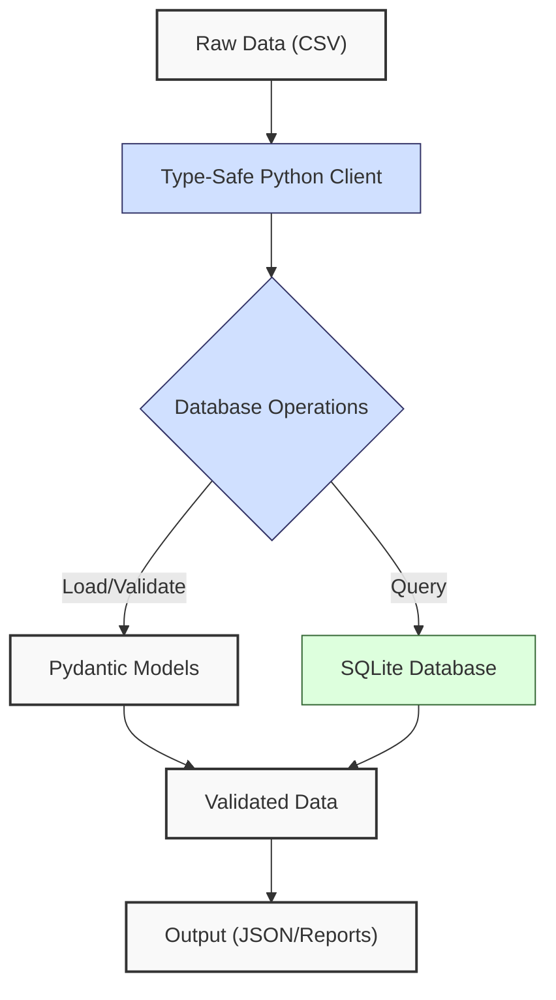
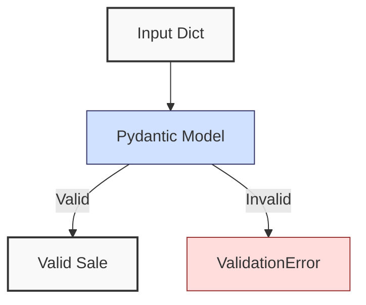
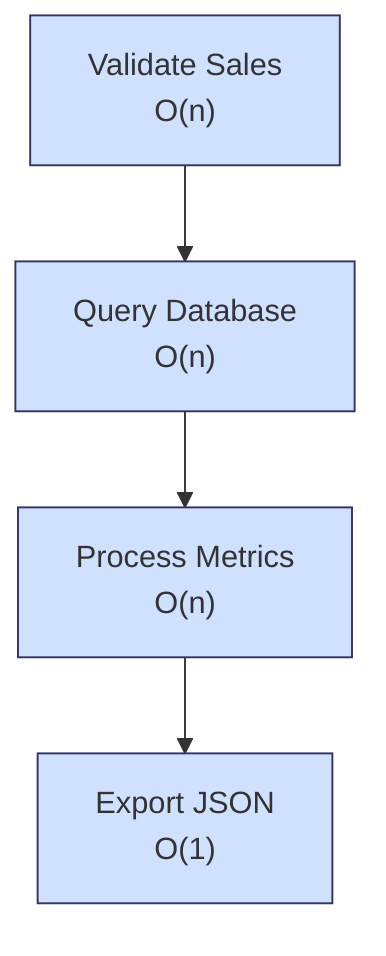
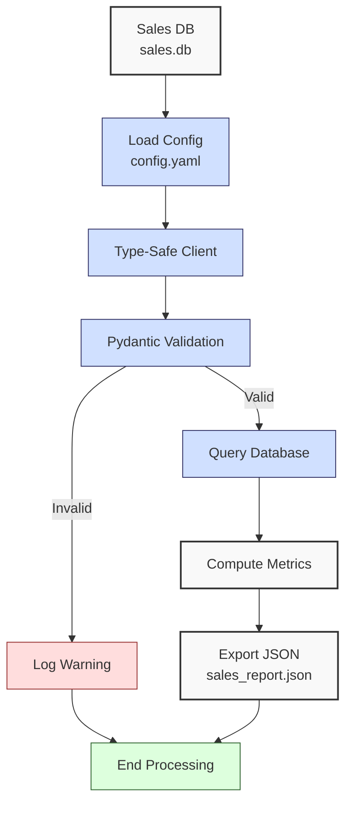

**Complexity: Moderate (M)**

## 15.0 Introduction: Why This Matters for Data Engineering

In data engineering, ensuring robust and reliable database interactions is critical for Hijra Group’s Sharia-compliant fintech analytics, where data integrity directly impacts financial reporting and compliance with Islamic Financial Services Board (IFSB) standards. Type-safe programming with Python, using tools like **Pyright**, **Pydantic**, and **sqlite3**, minimizes runtime errors by enforcing strict type checks at development time, reducing issues like `TypeError` or `AttributeError` in database operations. For example, type annotations ensure that a `price` field is always a `float` and not mistakenly a `str`, which could corrupt financial calculations. Building on prior chapters, this chapter integrates type-safe Python with SQLite, leveraging concepts from **Chapter 7 (Static Typing)**, **Chapter 9 (Testing)**, **Chapter 12 (SQL Fundamentals)**, **Chapter 13 (Python-SQLite Integration)**, and **Chapter 14 (Advanced SQLite Operations)** to create reliable, testable database pipelines.

This chapter focuses on using **Pydantic** for data validation, **Pyright** for type checking, and **pytest** for testing, ensuring that database interactions are robust and maintainable. All code uses **4-space indentation** per PEP 8, preferring spaces over tabs to avoid `IndentationError`, aligning with Hijra Group’s pipeline scripts. The micro-project builds a type-safe SQLite client to process sales data, preparing for **PostgreSQL integration (Chapter 17)** and **FastAPI development (Chapter 53)**.

### Data Engineering Workflow Context

This diagram illustrates how type-safe database programming fits into a data engineering pipeline:



### Building On and Preparing For

- **Building On**:
  - **Chapter 7**: Uses Pyright for static typing, extended here with Generics and Pydantic for database operations.
  - **Chapter 9**: Applies `pytest` for testing type-safe functions, ensuring robust database interactions.
  - **Chapter 12**: Leverages SQL basics for SQLite queries.
  - **Chapter 13**: Builds on Python-SQLite integration with `sqlite3` and YAML configs.
  - **Chapter 14**: Uses advanced SQLite operations (e.g., transactions) for efficient data handling.
- **Preparing For**:
  - **Chapter 17**: Prepares for type-safe PostgreSQL integration with `psycopg2`.
  - **Chapter 23**: Extends to integrated SQLite/PostgreSQL pipelines.
  - **Chapter 53**: Lays groundwork for type-safe FastAPI endpoints for database access.
  - **Chapter 65**: Supports secure database interactions with PII protection.

### What You’ll Learn

This chapter covers:

1. **Type Annotations for Database Operations**: Using `Union`, `List`, and Generics with Pyright.
2. **Pydantic for Validation**: Creating models to validate sales data.
3. **Type-Safe SQLite Interactions**: Safe queries and data loading with `sqlite3`.
4. **Testing with pytest**: Unit and integration tests for database operations.
5. **Performance Considerations**: Time/space complexity of database operations.

By the end, you’ll build a type-safe SQLite client that loads, validates, and queries sales data from `data/sales.db`, exports results to JSON, and includes comprehensive tests, all with 4-space indentation per PEP 8. The micro-project uses `data/sales.csv` and `data/config.yaml` for seeding and validation, per **Appendix 1**.

**Follow-Along Tips**:

- Create `de-onboarding/data/` and populate with files from **Appendix 1** (`sales.csv`, `config.yaml`, `sales.db`).
- Install libraries: `pip install pyyaml pydantic sqlite3 pytest pyright`.
- Ensure Pyright is installed globally (`pip install pyright --user`) or in your virtual environment. If Pyright fails, verify Python 3.10+ with `python --version`.
- Configure editor for **4-space indentation** per PEP 8 (VS Code: “Editor: Tab Size” = 4, “Editor: Insert Spaces” = true, “Editor: Detect Indentation” = false).
- Use print statements (e.g., `print(model.dict())`) to debug Pydantic models.
- Verify file paths with `ls data/` (Unix/macOS) or `dir data\` (Windows).
- Use UTF-8 encoding for all files to avoid `UnicodeDecodeError`.
- Run `pyright script.py` to check types before execution.

## 15.1 Type Annotations for Database Operations

Type annotations, enforced by **Pyright**, ensure that database operations use correct data types, reducing errors in pipelines. For example, annotating a function to return `List[Dict[str, Any]]` ensures query results are properly structured. This section introduces **Generics** and **Union** types for flexible, type-safe database interactions.

### 15.1.1 Using Generics and Union Types

Generics allow reusable type-safe code, while `Union` supports multiple possible types (e.g., `float | str` for prices before validation). While `Dict[str, Any]` is flexible for query results, prefer specific types (e.g., `Dict[str, Union[str, float, int]]`) when possible to enhance type safety, as explored in Chapter 23.

```python
# File: de-onboarding/type_example.py
from typing import List, Dict, Any, Union  # Import typing utilities
import sqlite3  # For database operations

def fetch_sales(db_path: str) -> List[Dict[str, Any]]:
    """Fetch sales records from SQLite with type annotations."""
    conn: sqlite3.Connection = sqlite3.connect(db_path)  # Connect with type hint
    cursor: sqlite3.Cursor = conn.cursor()  # Create cursor with type hint
    cursor.execute("SELECT product, price, quantity FROM sales")  # Query
    results: List[Dict[str, Any]] = [
        {"product": row[0], "price": row[1], "quantity": row[2]}
        for row in cursor.fetchall()
    ]  # Fetch and structure results
    print(f"Fetched {len(results)} records")  # Debug
    conn.close()  # Close connection
    return results  # Return typed results

# Test
if __name__ == "__main__":
    sales: List[Dict[str, Any]] = fetch_sales("data/sales.db")
    print(sales)

# Expected Output:
# Fetched 3 records
# [{'product': 'Halal Laptop', 'price': 999.99, 'quantity': 2},
#  {'product': 'Halal Mouse', 'price': 24.99, 'quantity': 10},
#  {'product': 'Halal Keyboard', 'price': 49.99, 'quantity': 5}]
```

**Follow-Along Instructions**:

1. Ensure `data/sales.db` exists per **Appendix 1**.
2. Save as `de-onboarding/type_example.py`.
3. Configure editor for 4-space indentation per PEP 8.
4. Install Pyright: `pip install pyright`.
5. Run: `pyright type_example.py` to check types, then `python type_example.py`.
6. Verify output matches expected.
7. **Common Errors**:
   - **DatabaseError**: Ensure `sales.db` has `sales` table. Run `sqlite3 data/sales.db "SELECT * FROM sales;"`.
   - **TypeError**: Run `pyright type_example.py` to catch type mismatches.
   - **IndentationError**: Use 4 spaces (not tabs). Run `python -tt type_example.py`.

**Key Points**:

- **Type Annotations**: `str`, `List[Dict[str, Any]]`, `sqlite3.Connection` ensure type safety.
- **Generics**: `List[Dict[str, Any]]` allows flexible query results.
- **Time Complexity**: O(n) for querying n rows.
- **Space Complexity**: O(n) for n rows in results.
- **Implication**: Type-safe queries prevent errors in Hijra Group’s financial data pipelines.

## 15.2 Pydantic for Validation

**Pydantic** provides runtime data validation through models, ensuring data conforms to expected types and rules (e.g., `price` is a positive `float`). Pydantic validates data at runtime (when the code runs), while Pyright checks types statically (before running), ensuring both development-time and runtime reliability. Pydantic integrates with Pyright for static type checking, enhancing reliability. Pydantic’s runtime validation adds slight overhead compared to manual checks but ensures robust type safety, critical for financial data.

### 15.2.1 Creating Pydantic Models

Define a `Sale` model to validate sales data. The following diagram illustrates the Pydantic validation flow:



```python
# File: de-onboarding/pydantic_example.py
from pydantic import BaseModel, PositiveFloat, PositiveInt  # Import Pydantic
from typing import List  # For type annotations

class Sale(BaseModel):  # Define Sale model
    product: str  # Product name
    price: PositiveFloat  # Positive float for price
    quantity: PositiveInt  # Positive integer for quantity

def validate_sales(sales: List[dict]) -> List[Sale]:
    """Validate sales data using Pydantic."""
    valid_sales: List[Sale] = []
    for sale in sales:
        try:
            valid_sale: Sale = Sale(**sale)  # Validate with Pydantic
            valid_sales.append(valid_sale)
            print(f"Validated: {valid_sale.dict()}")  # Debug
        except ValueError as e:
            print(f"Invalid sale: {sale}, Error: {e}")  # Log invalid
    return valid_sales

# Test
if __name__ == "__main__":
    sales_data: List[dict] = [
        {"product": "Halal Laptop", "price": 999.99, "quantity": 2},
        {"product": "Halal Mouse", "price": -24.99, "quantity": 10},  # Invalid price
        {"product": "Halal Keyboard", "price": 49.99, "quantity": 5}
    ]
    valid_sales: List[Sale] = validate_sales(sales_data)
    print([sale.dict() for sale in valid_sales])

# Expected Output:
# Validated: {'product': 'Halal Laptop', 'price': 999.99, 'quantity': 2}
# Invalid sale: {'product': 'Halal Mouse', 'price': -24.99, 'quantity': 10}, Error: ...
# Validated: {'product': 'Halal Keyboard', 'price': 49.99, 'quantity': 5}
# [{'product': 'Halal Laptop', 'price': 999.99, 'quantity': 2},
#  {'product': 'Halal Keyboard', 'price': 49.99, 'quantity': 5}]
```

**Follow-Along Instructions**:

1. Install Pydantic: `pip install pydantic`.
2. Save as `de-onboarding/pydantic_example.py`.
3. Configure editor for 4-space indentation per PEP 8.
4. Run: `pyright pydantic_example.py`, then `python pydantic_example.py`.
5. Verify output shows only valid sales.
6. **Common Errors**:
   - **ValidationError**: Print `sale` and check `type(sale['price'])` to debug invalid data.
   - **TypeError**: Run `pyright pydantic_example.py` to catch type issues.
   - **IndentationError**: Use 4 spaces (not tabs). Run `python -tt pydantic_example.py`.

**Key Points**:

- **Pydantic Models**: Enforce types and constraints (e.g., `PositiveFloat`).
- **Validation**: Catches invalid data at runtime.
- **Time Complexity**: O(n) for validating n sales.
- **Space Complexity**: O(n) for n valid sales.
- **Implication**: Ensures data integrity for financial reporting.

## 15.3 Type-Safe SQLite Interactions

Combine type annotations, Pydantic, and `sqlite3` for safe database operations, ensuring queries and data loading are robust.

### 15.3.1 Type-Safe Query Execution

Execute queries with type-safe parameters. SQLite is ideal for small-scale applications but supports only single-user access, unlike PostgreSQL’s multi-user capabilities (Chapter 16).

```python
# File: de-onboarding/sqlite_example.py
from typing import List, Dict, Any
import sqlite3

def query_sales(db_path: str, min_price: float) -> List[Dict[str, Any]]:
    """Query sales with type-safe parameters."""
    conn: sqlite3.Connection = sqlite3.connect(db_path)
    cursor: sqlite3.Cursor = conn.cursor()
    cursor.execute(
        "SELECT product, price, quantity FROM sales WHERE price >= ?",
        (min_price,)  # Type-safe parameter
    )
    results: List[Dict[str, Any]] = [
        {"product": row[0], "price": row[1], "quantity": row[2]}
        for row in cursor.fetchall()
    ]
    print(f"Queried {len(results)} sales with price >= {min_price}")  # Debug
    conn.close()
    return results

# Test
if __name__ == "__main__":
    sales: List[Dict[str, Any]] = query_sales("data/sales.db", 50.0)
    print(sales)

# Expected Output:
# Queried 1 sales with price >= 50.0
# [{'product': 'Halal Laptop', 'price': 999.99, 'quantity': 2}]
```

**Follow-Along Instructions**:

1. Ensure `data/sales.db` exists per **Appendix 1**.
2. Save as `de-onboarding/sqlite_example.py`.
3. Run: `pyright sqlite_example.py`, then `python sqlite_example.py`.
4. Verify output shows sales with price >= 50.0.
5. **Common Errors**:
   - **DatabaseError**: Verify table schema with `sqlite3 data/sales.db ".schema sales"`.
   - **TypeError**: Run `pyright sqlite_example.py`.

**Key Points**:

- **Parameterized Queries**: Prevent SQL injection.
- **Type Safety**: Annotations ensure correct parameter types.
- **Time Complexity**: O(n) for querying n rows.
- **Space Complexity**: O(n) for n rows.
- **Implication**: Safe queries ensure reliable analytics.

## 15.4 Testing with pytest

Use **pytest** to test type-safe database operations, ensuring reliability through unit and integration tests. The following diagram illustrates the complexity of key operations in the micro-project:



### 15.4.1 Unit and Integration Tests

Test a database client with `pytest`.

```python
# File: de-onboarding/test_db_client.py
from typing import List, Dict, Any
import sqlite3
import pytest
from pydantic_example import Sale, validate_sales  # Import from earlier

def setup_test_db(db_path: str) -> None:
    """Setup test database."""
    conn: sqlite3.Connection = sqlite3.connect(db_path)
    cursor: sqlite3.Cursor = conn.cursor()
    cursor.execute("CREATE TABLE sales (product TEXT, price REAL, quantity INTEGER)")
    cursor.executemany(
        "INSERT INTO sales (product, price, quantity) VALUES (?, ?, ?)",
        [("Halal Laptop", 999.99, 2), ("Halal Mouse", 24.99, 10)]
    )
    conn.commit()
    conn.close()

def test_validate_sales() -> None:
    """Test sales validation."""
    sales_data: List[Dict[str, Any]] = [
        {"product": "Halal Laptop", "price": 999.99, "quantity": 2},
        {"product": "Invalid", "price": -24.99, "quantity": 10}
    ]
    valid_sales: List[Sale] = validate_sales(sales_data)
    assert len(valid_sales) == 1
    assert valid_sales[0].product == "Halal Laptop"

@pytest.fixture
def test_db(tmp_path) -> str:
    """Create temporary test database."""
    db_path: str = str(tmp_path / "test.db")
    setup_test_db(db_path)
    return db_path

def test_query_sales(test_db: str) -> None:
    """Test querying sales."""
    sales: List[Dict[str, Any]] = query_sales(test_db, 50.0)
    assert len(sales) == 1
    assert sales[0]["product"] == "Halal Laptop"

# Run with: pytest test_db_client.py -v
```

**Follow-Along Instructions**:

1. Install pytest: `pip install pytest`.
2. Save as `de-onboarding/test_db_client.py`.
3. Ensure `pydantic_example.py` and `sqlite_example.py` are in `de-onboarding/`.
4. Run: `pytest test_db_client.py -v`.
5. Verify all tests pass.
6. **Common Errors**:
   - **FixtureError**: Ensure pytest is installed (`pip install pytest`) and the test file is in the correct directory. Run `pytest --version` to verify. Print `tmp_path` to debug.
   - **DatabaseError**: Print `db_path` to debug.

**Key Points**:

- **Unit Tests**: Test validation logic.
- **Integration Tests**: Test database queries.
- **Time Complexity**: O(1) for small test datasets.
- **Space Complexity**: O(1) for test data.
- **Implication**: Ensures pipeline reliability.

## 15.5 Micro-Project: Type-Safe SQLite Client

### Project Requirements

Build a type-safe SQLite client to process sales data from `data/sales.db`, validate with Pydantic, and export results to `data/sales_report.json`. The client supports Hijra Group’s transaction reporting, ensuring data integrity for IFSB compliance. Type-safe programming prevents errors like passing a string price (e.g., ‘999.99’) to financial calculations, which could misreport revenue and violate IFSB standards.

- Load `data/config.yaml` with PyYAML.
- Validate sales data using Pydantic models.
- Query `data/sales.db` with type-safe `sqlite3` operations.
- Compute total sales and top products.
- Export results to `data/sales_report.json`.
- Include pytest tests for validation and queries.
- Use 4-space indentation per PEP 8, preferring spaces over tabs.
- Test edge cases (e.g., empty database).

### Sample Input Files

`data/sales.db` (from **Appendix 1**):

```sql
CREATE TABLE sales (product TEXT, price REAL, quantity INTEGER);
INSERT INTO sales (product, price, quantity) VALUES
('Halal Laptop', 999.99, 2),
('Halal Mouse', 24.99, 10),
('Halal Keyboard', 49.99, 5);
```

`data/config.yaml` (from **Appendix 1**):

```yaml
min_price: 10.0
max_quantity: 100
required_fields:
  - product
  - price
  - quantity
product_prefix: 'Halal'
max_decimals: 2
```

### Data Processing Flow



### Acceptance Criteria

- **Go Criteria**:
  - Loads `config.yaml` and queries `sales.db` correctly.
  - Validates data with Pydantic (Halal prefix, positive price/quantity).
  - Computes total sales and top 3 products.
  - Exports to `data/sales_report.json`.
  - Includes pytest tests (unit, integration).
  - Uses type annotations verified by Pyright.
  - Uses 4-space indentation per PEP 8.
  - Handles edge cases (e.g., empty database).
- **No-Go Criteria**:
  - Fails to load config or database.
  - Incorrect validation or calculations.
  - Missing JSON export or tests.
  - Type errors detected by Pyright.
  - Inconsistent indentation.

### Common Pitfalls to Avoid

1. **Database Connection Issues**:
   - **Problem**: `DatabaseError` due to missing `sales.db`.
   - **Solution**: Verify with `sqlite3 data/sales.db "SELECT * FROM sales;"`.
   - **Debug**: Run `ls data/sales.db` (Unix/macOS) or `dir data\sales.db` (Windows) to check file existence.
2. **Pydantic Validation Errors**:
   - **Problem**: `ValidationError` for invalid data. For example, a `ValidationError` may report: `price: Value error, value must be > 0` if a negative price is provided.
   - **Solution**: Print `sale` and check `type(sale['price'])` to debug.
   - **Debug**: Add `print(sale)` before `Sale(**sale)` in `validate_sales`.
3. **Type Mismatches**:
   - **Problem**: Pyright detects incorrect types. For example, Pyright may report: `Expected List[Dict[str, Any]] but got List[str]` if the return type is incorrect.
   - **Solution**: Run `pyright db_client.py`.
   - **Debug**: Check `pyright` output for specific type errors (e.g., `List[str]` vs. `List[Dict[str, Any]]`).
4. **IndentationError**:
   - **Problem**: Mixed spaces/tabs.
   - **Solution**: Use 4 spaces. Run `python -tt db_client.py`.
   - **Debug**: Use VS Code’s “Show Whitespace” to inspect indentation.
5. **Test Failures**:
   - **Problem**: Tests fail due to schema mismatches.
   - **Solution**: Print `cursor.execute('.schema sales')` in `setup_test_db`.
   - **Debug**: Verify test database schema with `sqlite3 test.db ".schema sales"`.
6. **YAML Parsing Errors**:
   - **Problem**: `yaml.YAMLError` due to incorrect `config.yaml` syntax.
   - **Solution**: Verify YAML with `python -c "import yaml; yaml.safe_load(open('data/config.yaml'))"`.
   - **Debug**: Print `open(config_path).read()` to inspect syntax.

### How This Differs from Production

In production, this solution would include:

- **Error Handling**: Robust try/except (Chapter 17).
- **Connection Pooling**: For scalability (Chapter 63).
- **Security**: Encrypted connections and PII masking (Chapter 65).
- **Monitoring**: Logging and observability (Chapter 66).
- **CI/CD**: Automated tests with GitHub Actions (Chapter 66).

### Implementation

```python
# File: de-onboarding/db_client.py
from typing import List, Dict, Any, Tuple
import sqlite3
import yaml
import json
from pydantic import BaseModel, PositiveFloat, PositiveInt, validator
import os

class Sale(BaseModel):
    """Pydantic model for sale data."""
    product: str
    price: PositiveFloat
    quantity: PositiveInt

    @validator("product")
    def check_product_prefix(cls, value: str) -> str:
        """Validate product starts with Halal."""
        if not value.startswith("Halal"):
            raise ValueError("Product must start with 'Halal'")
        return value

def read_config(config_path: str) -> Dict[str, Any]:
    """Read YAML configuration."""
    print(f"Opening config: {config_path}")
    with open(config_path, "r") as file:
        config: Dict[str, Any] = yaml.safe_load(file)
    print(f"Loaded config: {config}")
    return config

def validate_sales(sales: List[Dict[str, Any]], config: Dict[str, Any]) -> Tuple[List[Sale], List[Dict[str, Any]]]:
    """Validate sales data with Pydantic."""
    valid_sales: List[Sale] = []
    invalid_sales: List[Dict[str, Any]] = []
    max_decimals: int = config["max_decimals"]

    for sale in sales:
        try:
            # Check decimal places
            price_str: str = str(sale["price"])
            if len(price_str.split(".")[1]) > max_decimals:
                raise ValueError(f"Price exceeds {max_decimals} decimals")
            valid_sale: Sale = Sale(**sale)
            valid_sales.append(valid_sale)
            print(f"Validated: {valid_sale.dict()}")
        except (ValueError, TypeError) as e:
            print(f"Invalid sale: {sale}, Error: {e}")
            invalid_sales.append(sale)
    return valid_sales, invalid_sales

def query_sales(db_path: str, min_price: float) -> List[Dict[str, Any]]:
    """Query sales from SQLite."""
    conn: sqlite3.Connection = sqlite3.connect(db_path)
    cursor: sqlite3.Cursor = conn.cursor()
    cursor.execute(
        "SELECT product, price, quantity FROM sales WHERE price >= ?",
        (min_price,)
    )
    results: List[Dict[str, Any]] = [
        {"product": row[0], "price": row[1], "quantity": row[2]}
        for row in cursor.fetchall()
    ]
    print(f"Queried {len(results)} sales with price >= {min_price}")
    conn.close()
    return results

def process_sales(sales: List[Sale]) -> Dict[str, Any]:
    """Process validated sales."""
    if not sales:
        print("No valid sales data")
        return {"total_sales": 0.0, "unique_products": [], "top_products": {}}

    amounts: List[float] = [sale.price * sale.quantity for sale in sales]
    total_sales: float = sum(amounts)
    unique_products: List[str] = list({sale.product for sale in sales})

    # Group by product
    product_sums: Dict[str, float] = {}
    for sale in sales:
        amount: float = sale.price * sale.quantity
        product_sums[sale.product] = product_sums.get(sale.product, 0.0) + amount

    top_products: Dict[str, float] = dict(
        sorted(product_sums.items(), key=lambda x: x[1], reverse=True)[:3]
    )

    return {
        "total_sales": total_sales,
        "unique_products": unique_products,
        "top_products": top_products
    }

def export_results(results: Dict[str, Any], json_path: str) -> None:
    """Export results to JSON."""
    print(f"Writing to: {json_path}")
    with open(json_path, "w") as file:
        json.dump(results, file, indent=2)
    print(f"Exported to {json_path}")

def main() -> None:
    """Main function."""
    config_path: str = "data/config.yaml"
    db_path: str = "data/sales.db"
    json_path: str = "data/sales_report.json"

    config: Dict[str, Any] = read_config(config_path)
    sales_data: List[Dict[str, Any]] = query_sales(db_path, config["min_price"])
    valid_sales, invalid_sales = validate_sales(sales_data, config)
    results: Dict[str, Any] = process_sales(valid_sales)
    export_results(results, json_path)

    print("\nSales Report:")
    print(f"Total Records: {len(sales_data)}")
    print(f"Valid Sales: {len(valid_sales)}")
    print(f"Invalid Sales: {len(invalid_sales)}")
    print(f"Total Sales: ${round(results['total_sales'], 2)}")
    print(f"Unique Products: {results['unique_products']}")
    print(f"Top Products: {results['top_products']}")

if __name__ == "__main__":
    main()
```

```python
# File: de-onboarding/test_db_client.py
from typing import List, Dict, Any
import sqlite3
import pytest
from db_client import Sale, validate_sales, query_sales, process_sales

def setup_test_db(db_path: str) -> None:
    """Setup test database."""
    conn: sqlite3.Connection = sqlite3.connect(db_path)
    cursor: sqlite3.Cursor = conn.cursor()
    cursor.execute("CREATE TABLE sales (product TEXT, price REAL, quantity INTEGER)")
    cursor.executemany(
        "INSERT INTO sales (product, price, quantity) VALUES (?, ?, ?)",
        [
            ("Halal Laptop", 999.99, 2),
            ("Halal Mouse", 24.99, 10),
            ("Non-Halal Item", 49.99, 5)
        ]
    )
    conn.commit()
    conn.close()

@pytest.fixture
def test_db(tmp_path) -> str:
    """Create temporary test database."""
    db_path: str = str(tmp_path / "test.db")
    setup_test_db(db_path)
    return db_path

@pytest.fixture
def config() -> Dict[str, Any]:
    """Sample config."""
    return {
        "min_price": 10.0,
        "max_quantity": 100,
        "required_fields": ["product", "price", "quantity"],
        "product_prefix": "Halal",
        "max_decimals": 2
    }

def test_validate_sales(config: Dict[str, Any]) -> None:
    """Test sales validation."""
    sales_data: List[Dict[str, Any]] = [
        {"product": "Halal Laptop", "price": 999.99, "quantity": 2},
        {"product": "Non-Halal Item", "price": 49.99, "quantity": 5},
        {"product": "Halal Mouse", "price": 24.999, "quantity": 10}  # Too many decimals
    ]
    valid_sales, invalid_sales = validate_sales(sales_data, config)
    assert len(valid_sales) == 1
    assert valid_sales[0].product == "Halal Laptop"
    assert len(invalid_sales) == 2

def test_query_sales(test_db: str) -> None:
    """Test querying sales."""
    sales: List[Dict[str, Any]] = query_sales(test_db, 50.0)
    assert len(sales) == 1
    assert sales[0]["product"] == "Halal Laptop"

def test_process_sales() -> None:
    """Test processing sales."""
    sales: List[Sale] = [
        Sale(product="Halal Laptop", price=999.99, quantity=2),
        Sale(product="Halal Mouse", price=24.99, quantity=10)
    ]
    results: Dict[str, Any] = process_sales(sales)
    assert results["total_sales"] == 2249.88
    assert len(results["unique_products"]) == 2
    assert results["top_products"]["Halal Laptop"] == 1999.98

def test_empty_db(tmp_path) -> None:
    """Test empty database."""
    db_path: str = str(tmp_path / "empty.db")
    conn: sqlite3.Connection = sqlite3.connect(db_path)
    conn.execute("CREATE TABLE sales (product TEXT, price REAL, quantity INTEGER)")
    conn.close()
    sales: List[Dict[str, Any]] = query_sales(db_path, 10.0)
    assert len(sales) == 0
```

### Expected Outputs

`data/sales_report.json`:

```json
{
  "total_sales": 2499.83,
  "unique_products": ["Halal Laptop", "Halal Mouse", "Halal Keyboard"],
  "top_products": {
    "Halal Laptop": 1999.98,
    "Halal Mouse": 249.9,
    "Halal Keyboard": 249.95
  }
}
```

**Console Output** (abridged):

```
Opening config: data/config.yaml
Loaded config: {'min_price': 10.0, 'max_quantity': 100, ...}
Queried 3 sales with price >= 10.0
Validated: {'product': 'Halal Laptop', 'price': 999.99, 'quantity': 2}
Validated: {'product': 'Halal Mouse', 'price': 24.99, 'quantity': 10}
Validated: {'product': 'Halal Keyboard', 'price': 49.99, 'quantity': 5}
Writing to: data/sales_report.json
Exported to data/sales_report.json

Sales Report:
Total Records: 3
Valid Sales: 3
Invalid Sales: 0
Total Sales: $2499.83
Unique Products: ['Halal Laptop', 'Halal Mouse', 'Halal Keyboard']
Top Products: {'Halal Laptop': 1999.98, 'Halal Mouse': 249.9, 'Halal Keyboard': 249.95}
```

**Test Output**:

```
collected 4 items
test_db_client.py::test_validate_sales PASSED
test_db_client.py::test_query_sales PASSED
test_db_client.py::test_process_sales PASSED
test_db_client.py::test_empty_db PASSED
```

### How to Run and Test

1. **Setup**:

   - Create `de-onboarding/data/` and populate with `sales.db`, `config.yaml` per **Appendix 1**.
   - Install libraries: `pip install pyyaml pydantic pytest pyright sqlite3`.
   - Configure editor for 4-space indentation per PEP 8.
   - Save `db_client.py` and `test_db_client.py`.

2. **Run**:

   - Run: `pyright db_client.py`, then `python db_client.py`.
   - Outputs: `data/sales_report.json`, console logs.

3. **Test**:
   - Run: `pytest test_db_client.py -v`.
   - Verify all tests pass.
   - Test empty database by modifying `setup_test_db` to insert no data.

## 15.6 Practice Exercises

**Exercise Setup Checklist**:

- [ ] Ensure `data/sales.db` exists per **Appendix 1**.
- [ ] Install `pydantic`, `pytest`, `pyright` (`pip install pydantic pytest pyright`).
- [ ] Verify 4-space indentation in your editor.

### Exercise 1: Type-Safe Query Function

Write a type-safe function to query sales by quantity, with 4-space indentation per PEP 8.

**Expected Output**:

```
[{'product': 'Halal Mouse', 'price': 24.99, 'quantity': 10}]
```

**Follow-Along Instructions**:

1. Save as `de-onboarding/ex1_query.py`.
2. Run: `pyright ex1_query.py`, then `python ex1_query.py`.
3. **How to Test**:
   - Add: `print(query_by_quantity("data/sales.db", 10))`.
   - Verify output matches expected.
   - Test with `min_quantity=100`: Should return empty list.
   - Test with `min_quantity=-1`: Should return empty list, as negative quantities are invalid.
   - **Common Errors**:
     - **DatabaseError**: Run `sqlite3 data/sales.db "SELECT * FROM sales;"`.
     - **IndentationError**: Use 4 spaces (not tabs). Run `python -tt ex1_query.py`.

### Exercise 2: Pydantic Model with Custom Validation

Create a Pydantic model with validators for decimal places and the `Halal` prefix, ensuring compliance with Hijra Group’s Sharia rules, with 4-space indentation per PEP 8.

**Sample Input**:

```python
sales_data = [
    {"product": "Halal Laptop", "price": 999.99, "quantity": 2},
    {"product": "Non-Halal Mouse", "price": 24.999, "quantity": 10}
]
```

**Expected Output**:

```
[{'product': 'Halal Laptop', 'price': 999.99, 'quantity': 2}]
```

**Follow-Along Instructions**:

1. Save as `de-onboarding/ex2_pydantic.py`.
2. Run: `pyright ex2_pydantic.py`, then `python ex2_pydantic.py`.
3. **How to Test**:
   - Add: `print([sale.dict() for sale in validate_sales(sales_data)])`.
   - Verify output matches expected.
   - Test with valid prices and prefixes: Should include all valid sales.
   - **Common Errors**:
     - **ValidationError**: Print `sale` and `type(sale['price'])`.
     - **IndentationError**: Use 4 spaces (not tabs). Run `python -tt ex2_pydantic.py`.

### Exercise 3: Pytest for Database Query

Write a pytest test for a query function, with 4-space indentation per PEP 8. The `test_db` fixture creates a temporary database for testing, ensuring isolation from `sales.db`. Print `test_db` to inspect its path.

**Expected Output**:

```
test_query_by_quantity PASSED
```

**Follow-Along Instructions**:

1. Save as `de-onboarding/ex3_test.py`.
2. Ensure `ex1_query.py` is in `de-onboarding/`.
3. Run: `pytest ex3_test.py -v`.
4. **How to Test**:
   - Verify test passes.
   - Test with `min_quantity=100`: Should pass with empty results.
   - **Common Errors**:
     - **FixtureError**: Print `test_db` to debug.
     - **IndentationError**: Use 4 spaces (not tabs). Run `python -tt ex3_test.py`.

### Exercise 4: Debug Type Mismatch

Fix a type mismatch in a query function, with 4-space indentation per PEP 8.

**Buggy Code**:

```python
def query_sales(db_path: str) -> List[str]:
    conn = sqlite3.connect(db_path)
    cursor = conn.cursor()
    cursor.execute("SELECT product, price, quantity FROM sales")
    results = [{"product": row[0], "price": row[1], "quantity": row[2]} for row in cursor.fetchall()]
    conn.close()
    return results
```

**Expected Output**:

```
[{'product': 'Halal Laptop', 'price': 999.99, 'quantity': 2}, ...]
```

**Follow-Along Instructions**:

1. Save as `de-onboarding/ex4_debug.py`.
2. Run: `pyright ex4_debug.py` to identify error, fix, and re-run.
3. **How to Test**:
   - Add: `print(query_sales("data/sales.db"))`.
   - Verify output matches expected.
   - **Common Errors**:
     - **TypeError**: Check `pyright` output for type mismatch.
     - **IndentationError**: Use 4 spaces (not tabs). Run `python -tt ex4_debug.py`.

### Exercise 5: Conceptual Analysis of Pydantic Benefits

Explain the benefits of Pydantic vs. manual validation in a Hijra Group pipeline processing sales data, considering revenue misreporting and performance trade-offs (e.g., Pydantic’s runtime overhead). Save the answer to `de-onboarding/ex5_concepts.txt`, with 4-space indentation per PEP 8.

**Expected Output** (in `ex5_concepts.txt`):

```
Pydantic simplifies validation in Hijra Group’s sales data pipeline by enforcing type constraints (e.g., PositiveFloat for prices), preventing errors like passing a string price (‘999.99’) that could misreport revenue and violate IFSB standards. Unlike manual validation, which requires extensive if-statements and is error-prone, Pydantic catches invalid data at runtime. Its integration with Pyright ensures static type checking, enhancing pipeline reliability. Pydantic’s runtime overhead is higher than manual checks but ensures robust validation.
```

**Follow-Along Instructions**:

1. Save as `de-onboarding/ex5_concepts.py`.
2. Run: `python ex5_concepts.py`.
3. **How to Test**:
   - Verify `ex5_concepts.txt` contains the expected text.
   - Check file with `cat ex5_concepts.txt` (Unix/macOS) or `type ex5_concepts.txt` (Windows).
   - **Common Errors**:
     - **FileNotFoundError**: Ensure write permissions in `de-onboarding/`.
     - **IndentationError**: Use 4 spaces (not tabs). Run `python -tt ex5_concepts.py`.

## 15.7 Exercise Solutions

### Solution to Exercise 1

```python
from typing import List, Dict, Any
import sqlite3

def query_by_quantity(db_path: str, min_quantity: int) -> List[Dict[str, Any]]:
    """Query sales by minimum quantity."""
    conn: sqlite3.Connection = sqlite3.connect(db_path)
    cursor: sqlite3.Cursor = conn.cursor()
    cursor.execute(
        "SELECT product, price, quantity FROM sales WHERE quantity >= ?",
        (min_quantity,)
    )
    results: List[Dict[str, Any]] = [
        {"product": row[0], "price": row[1], "quantity": row[2]}
        for row in cursor.fetchall()
    ]
    conn.close()
    return results

if __name__ == "__main__":
    print(query_by_quantity("data/sales.db", 10))  # Valid case
    print(query_by_quantity("data/sales.db", 100))  # Edge case: no results
    print(query_by_quantity("data/sales.db", -1))  # Edge case: invalid quantity

# Output:
# [{'product': 'Halal Mouse', 'price': 24.99, 'quantity': 10}]
# []
# []
```

### Solution to Exercise 2

```python
from pydantic import BaseModel, PositiveFloat, PositiveInt, validator
from typing import List

class Sale(BaseModel):
    product: str
    price: PositiveFloat
    quantity: PositiveInt

    @validator("price")
    def check_decimals(cls, value: float) -> float:
        if len(str(value).split(".")[1]) > 2:
            raise ValueError("Price must have <= 2 decimals")
        return value

    @validator("product")
    def check_product_prefix(cls, value: str) -> str:
        if not value.startswith("Halal"):
            raise ValueError("Product must start with 'Halal'")
        return value

def validate_sales(sales: List[dict]) -> List[Sale]:
    valid_sales: List[Sale] = []
    for sale in sales:
        try:
            valid_sale: Sale = Sale(**sale)
            valid_sales.append(valid_sale)
        except ValueError as e:
            print(f"Invalid: {sale}, Error: {e}")
    return valid_sales

if __name__ == "__main__":
    sales_data: List[dict] = [
        {"product": "Halal Laptop", "price": 999.99, "quantity": 2},
        {"product": "Non-Halal Mouse", "price": 24.999, "quantity": 10}
    ]
    print([sale.dict() for sale in validate_sales(sales_data)])

# Output:
# [{'product': 'Halal Laptop', 'price': 999.99, 'quantity': 2}]
```

### Solution to Exercise 3

```python
import pytest
from typing import List, Dict, Any
import sqlite3
from ex1_query import query_by_quantity

@pytest.fixture
def test_db(tmp_path) -> str:
    db_path: str = str(tmp_path / "test.db")
    conn: sqlite3.Connection = sqlite3.connect(db_path)
    cursor: sqlite3.Cursor = conn.cursor()
    cursor.execute("CREATE TABLE sales (product TEXT, price REAL, quantity INTEGER)")
    cursor.execute("INSERT INTO sales VALUES ('Halal Mouse', 24.99, 10)")
    conn.commit()
    conn.close()
    return db_path

def test_query_by_quantity(test_db: str) -> None:
    sales: List[Dict[str, Any]] = query_by_quantity(test_db, 10)
    assert len(sales) == 1
    assert sales[0]["product"] == "Halal Mouse"

# Run with: pytest ex3_test.py -v
```

### Solution to Exercise 4

```python
from typing import List, Dict, Any
import sqlite3

def query_sales(db_path: str) -> List[Dict[str, Any]]:
    """Query sales with correct type annotation."""
    conn: sqlite3.Connection = sqlite3.connect(db_path)
    cursor: sqlite3.Cursor = conn.cursor()
    cursor.execute("SELECT product, price, quantity FROM sales")
    results: List[Dict[str, Any]] = [
        {"product": row[0], "price": row[1], "quantity": row[2]}
        for row in cursor.fetchall()
    ]
    conn.close()
    return results

if __name__ == "__main__":
    print(query_sales("data/sales.db"))

# Output:
# [{'product': 'Halal Laptop', 'price': 999.99, 'quantity': 2}, ...]
```

### Solution to Exercise 5

```python
def explain_pydantic_benefits() -> None:
    """Explain Pydantic vs. manual validation benefits."""
    explanation: str = (
        "Pydantic simplifies validation in Hijra Group’s sales data pipeline by "
        "enforcing type constraints (e.g., PositiveFloat for prices), preventing "
        "errors like passing a string price (‘999.99’) that could misreport revenue "
        "and violate IFSB standards. Unlike manual validation, which requires extensive "
        "if-statements and is error-prone, Pydantic catches invalid data at runtime. "
        "Its integration with Pyright ensures static type checking, enhancing pipeline "
        "reliability. Pydantic’s runtime overhead is higher than manual checks but ensures "
        "robust validation."
    )
    with open("ex5_concepts.txt", "w") as file:
        file.write(explanation)
    print("Explanation saved to ex5_concepts.txt")

if __name__ == "__main__":
    explain_pydantic_benefits()

# Output:
# Explanation saved to ex5_concepts.txt
# (Creates ex5_concepts.txt with explanation)
```

## 15.8 Chapter Summary and Connection to Chapter 16

You’ve mastered:

- **Type Annotations**: Using Generics and Union for database operations, with best practices for specific types.
- **Pydantic**: Validating data with models, ensuring runtime and static reliability.
- **SQLite**: Type-safe queries with `sqlite3`, suitable for small-scale applications.
- **Testing**: Unit and integration tests with pytest, with robust debugging for fixtures.
- **Performance**: O(n) time/space complexity for queries and validation, visualized for clarity.

The micro-project built a type-safe SQLite client, ensuring robust data handling for Hijra Group’s analytics by preventing errors like incorrect price types that could violate IFSB standards. With comprehensive tests and 4-space indentation per PEP 8, it prepares for **Chapter 16: PostgreSQL Fundamentals**, which transitions to production-grade databases using `psycopg2`, building on type-safe principles and extending to enterprise-scale analytics with multi-user support.
