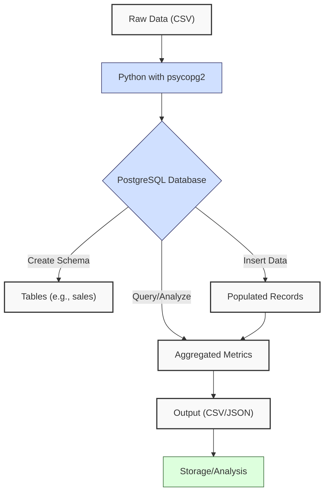
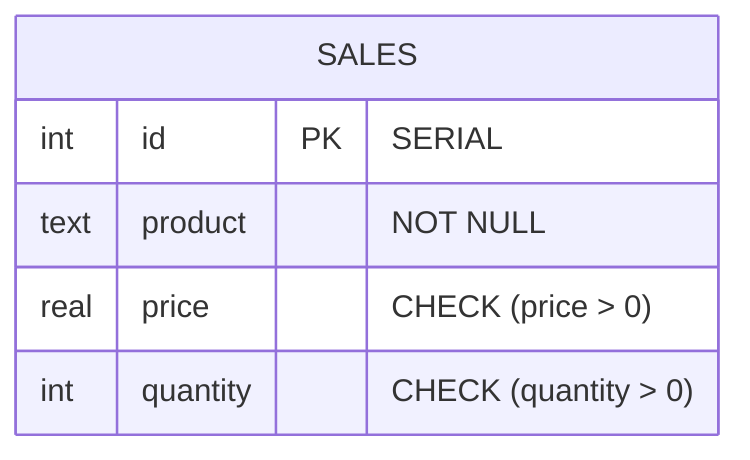
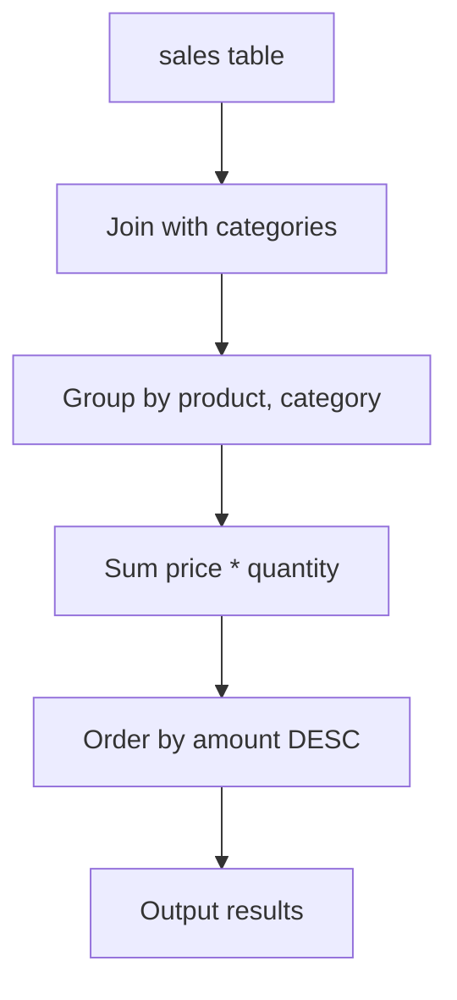
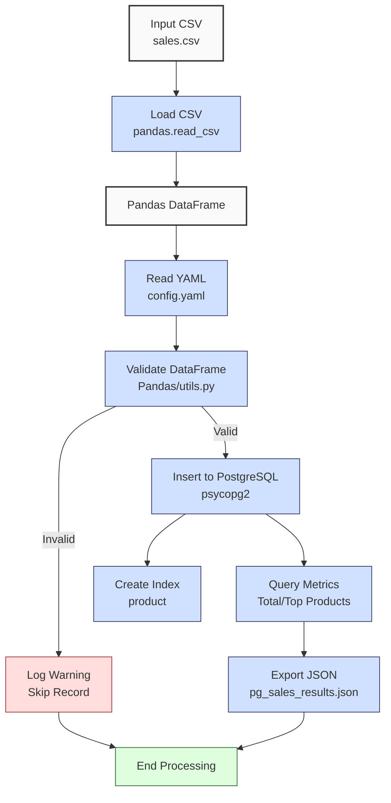

**Complexity: Moderate (M)**

## 16.0 Introduction: Why This Matters for Data Engineering

PostgreSQL is a robust, open-source relational database widely used in production environments, offering advanced features like ACID compliance, full-text search, and JSONB support. At Hijra Group, PostgreSQL powers scalable data storage for Sharia-compliant financial transactions, handling millions of records with high reliability. Unlike SQLite (Chapters 12–15), PostgreSQL supports concurrent users, complex queries, and enterprise-grade scalability, making it ideal for data engineering pipelines. This chapter introduces PostgreSQL basics—schema creation, data insertion, querying, and indexing—using the `psycopg2` library in Python, building on SQLite skills and preparing for Python integration in Chapter 17.

**PostgreSQL vs. SQLite**:

| Feature     | SQLite (Ch. 12–15) | PostgreSQL (Ch. 16–17) |
| ----------- | ------------------ | ---------------------- |
| Storage     | File-based         | Client-server          |
| Concurrency | Limited            | Full support           |
| Scalability | Small datasets     | Enterprise-grade       |
| Use Case    | Local prototyping  | Production pipelines   |

This chapter avoids advanced topics like type annotations (Chapter 7), testing (Chapter 9), or try/except error handling (Chapter 7), focusing on fundamental operations. All code uses **PEP 8's 4-space indentation**, preferring spaces over tabs to avoid `IndentationError`, ensuring compatibility with Hijra Group’s pipeline scripts. The micro-project creates a sales database, aligning with Hijra Group’s transaction analytics, using `data/sales.csv` from Appendix 1.

### Data Engineering Workflow Context

This diagram illustrates PostgreSQL’s role in a data engineering pipeline:



### Building On and Preparing For

- **Building On**:
  - Chapter 12: Extends SQL fundamentals (SELECT, INSERT) from SQLite to PostgreSQL.
  - Chapter 13: Applies Python-SQLite integration concepts to `psycopg2`.
  - Chapter 14: Builds on basic database operations like transactions.
  - Chapter 15: Prepares for type-safe database programming (introduced later).
- **Preparing For**:
  - Chapter 17: Enables Python-PostgreSQL integration with `psycopg2`.
  - Chapter 18: Supports schema design with entity-relationship diagrams.
  - Chapter 21: Prepares for advanced querying (CTEs, window functions).
  - Chapter 22: Lays groundwork for indexing and optimization.
  - Chapter 23: Facilitates type-safe database integration.

### What You’ll Learn

This chapter covers:

1. **PostgreSQL Setup**: Installing and configuring PostgreSQL.
2. **Schema Creation**: Defining tables with constraints.
3. **Data Insertion**: Loading data from CSVs using `psycopg2`.
4. **Basic Querying**: SELECT, JOIN, and aggregations.
5. **Indexing Basics**: Creating indexes to improve query performance.
6. **Python Integration**: Connecting to PostgreSQL with `psycopg2`.

By the end, you’ll build a PostgreSQL sales database, load data from `data/sales.csv`, query metrics, and create an index, all with 4-space indentation per PEP 8. The micro-project ensures compliance with Hijra Group’s analytics needs, producing a JSON report of sales metrics.

**Follow-Along Tips**:

- Install PostgreSQL and `psycopg2-binary`: `pip install psycopg2-binary`.
- Create `de-onboarding/data/` and populate with `sales.csv` from Appendix 1.
- Use **4-space indentation** per PEP 8. Run `python -tt script.py` to detect tab/space mixing.
- Debug with print statements (e.g., `print(cursor.fetchall())` for query results).
- Verify database connections with `psql -U postgres` (Unix/macOS) or `psql -U postgres -h localhost` (Windows).
- Use UTF-8 encoding for all files to avoid `UnicodeDecodeError`.

## 16.1 PostgreSQL Setup and Connection

PostgreSQL requires a running server and a Python connector (`psycopg2`). Unlike SQLite’s file-based databases (Chapter 12), PostgreSQL uses a client-server model, supporting concurrent access and scalability. A single table with 1 million rows (3 columns: TEXT, REAL, INTEGER) uses ~100MB, with indexes adding ~20–50MB depending on column cardinality.

### 16.1.1 Installing PostgreSQL

Install PostgreSQL on your system:

- **Ubuntu**: `sudo apt-get install postgresql postgresql-contrib`
- **macOS**: `brew install postgresql`
- **Windows**: Download installer from [postgresql.org](https://www.postgresql.org/download/windows/)

Start the server:

- **Ubuntu/macOS**: `sudo service postgresql start` or `pg_ctl -D /usr/local/var/postgres start`
- **Windows**: Start via Services or `pg_ctl -D "C:\Program Files\PostgreSQL\<version>\data" start`

Create a database user and database:

```bash
# Access PostgreSQL as postgres user
psql -U postgres

# Create user and database
CREATE USER de_user WITH PASSWORD 'de_password';
CREATE DATABASE de_onboarding;
GRANT ALL PRIVILEGES ON DATABASE de_onboarding TO de_user;
\q
```

**Follow-Along Instructions**:

1. Install PostgreSQL and verify: `psql --version`.
2. Start the server and create `de_user` and `de_onboarding` as shown.
3. Test connection: `psql -U de_user -d de_onboarding -h localhost -W` (enter `de_password`).
4. To reset the database, drop tables: `psql -U de_user -d de_onboarding -c 'DROP TABLE IF EXISTS sales, categories CASCADE;'`.
5. For production, configure `postgresql.conf` (e.g., `max_connections`) to optimize performance, covered in Chapter 22.
6. **Common Errors**:
   - **Connection Refused**: Ensure server is running (`pg_ctl status`) and listening on `localhost:5432` (`netstat -an | grep 5432` on Unix/macOS).
   - **Role Does Not Exist**: Verify user creation with `psql -U postgres -c "\du"`.

### 16.1.2 Connecting with psycopg2

Use `psycopg2` to connect to PostgreSQL from Python.

```python
import psycopg2  # Import psycopg2

# Connect to database
conn = psycopg2.connect(
    dbname="de_onboarding",
    user="de_user",
    password="de_password",
    host="localhost",
    port="5432"
)
cursor = conn.cursor()  # Create cursor

# Test query
cursor.execute("SELECT version();")  # Get PostgreSQL version
version = cursor.fetchone()  # Fetch result
print("PostgreSQL Version:", version)  # Debug: print version

# Close connection
cursor.close()  # Close cursor
conn.close()  # Close connection

# Expected Output:
# PostgreSQL Version: ('PostgreSQL 15.3 ...',)
```

**Follow-Along Instructions**:

1. Install: `pip install psycopg2-binary`.
2. Save as `de-onboarding/pg_connect.py`.
3. Configure editor for **4-space indentation** per PEP 8 (VS Code: “Editor: Tab Size” = 4, “Editor: Insert Spaces” = true, “Editor: Detect Indentation” = false).
4. Run: `python pg_connect.py`.
5. Verify output shows PostgreSQL version.
6. **Common Errors**:
   - **ModuleNotFoundError**: Install `psycopg2-binary`.
   - **OperationalError**: Check server status, user/password, and `host=localhost`. Print connection parameters: `print(dbname, user, host, port)`.
   - **IndentationError**: Use 4 spaces (not tabs). Run `python -tt pg_connect.py`.

**Key Points**:

- `psycopg2.connect()`: Establishes a connection with database credentials.
- Closing connections releases database resources, preventing memory leaks and connection limits, crucial for scalable pipelines.
- **Underlying Implementation**: `psycopg2` uses a C-based driver for efficient communication with PostgreSQL, supporting parameterized queries to prevent SQL injection.
- **Performance Considerations**:
  - **Time Complexity**: O(1) for connection setup.
  - **Space Complexity**: O(1) for connection object.
  - **Implication**: Essential for programmatic access in Hijra Group’s pipelines.

## 16.2 Schema Creation

Create tables with appropriate data types and constraints to ensure data integrity. The following diagram visualizes the `sales` table structure:



```python
import psycopg2  # Import psycopg2

# Connect to database
conn = psycopg2.connect(
    dbname="de_onboarding",
    user="de_user",
    password="de_password",
    host="localhost",
    port="5432"
)
cursor = conn.cursor()  # Create cursor

# Create sales table
cursor.execute("""
    CREATE TABLE IF NOT EXISTS sales (
        id SERIAL PRIMARY KEY,
        product TEXT NOT NULL,
        price REAL CHECK (price > 0),
        quantity INTEGER CHECK (quantity > 0)
    );
""")
conn.commit()  # Commit changes
print("Created sales table")  # Debug: confirm creation

# Example of constraint violation
cursor.execute("INSERT INTO sales (product, price, quantity) VALUES ('Invalid', -1.0, 0);")
print("Insertion fails due to CHECK constraints")  # Note: This will fail due to CHECK constraints (price > 0, quantity > 0)
conn.rollback()  # Rollback to prevent error state

# Verify table
cursor.execute("SELECT table_name FROM information_schema.tables WHERE table_schema = 'public';")
tables = cursor.fetchall()  # Fetch table names
print("Tables:", tables)  # Debug: print tables

# Close connection
cursor.close()  # Close cursor
conn.close()  # Close connection

# Expected Output:
# Created sales table
# Insertion fails due to CHECK constraints
# Tables: [('sales',)]
```

**Follow-Along Instructions**:

1. Save as `de-onboarding/pg_schema.py`.
2. Configure editor for 4-space indentation per PEP 8.
3. Run: `python pg_schema.py`.
4. Verify output shows `sales` table and constraint failure message.
5. **Common Errors**:
   - **SyntaxError in SQL**: Check SQL syntax with `psql -U de_user -d de_onboarding -c "CREATE TABLE ...;"`.
   - **Permission Denied**: Ensure `de_user` has privileges (`GRANT ALL ON DATABASE de_onboarding TO de_user;`).
   - **IndentationError**: Use 4 spaces (not tabs). Run `python -tt pg_schema.py`.

**Key Points**:

- **SERIAL**: Auto-incrementing primary key.
- **NOT NULL**: Ensures non-empty fields.
- **CHECK**: Enforces positive values.
- **Underlying Implementation**: PostgreSQL stores tables as heap files, with constraints validated during insertion (O(1) per row for constraint checks).
- **Performance Considerations**:
  - **Time Complexity**: O(1) for table creation.
  - **Space Complexity**: O(1) for table metadata (~100MB for 1M rows with data).
  - **Implication**: Ensures data integrity for sales records.

## 16.3 Data Insertion

Load data from `data/sales.csv` into the `sales` table, filtering valid records. The validation logic uses functions from `utils.py` (full version in `de-onboarding/utils.py`). Below is a simplified example of key functions:

```python
# Sample utils.py functions (full version in de-onboarding/utils.py)
def is_numeric_value(x):
    """Check if value is numeric."""
    return isinstance(x, (int, float))

def is_integer(x):
    """Check if value is an integer."""
    return str(x).isdigit()
```

```python
import psycopg2  # Import psycopg2
import pandas as pd  # Import Pandas for CSV loading
import yaml  # For YAML parsing
import utils  # Import utils from Chapter 3

# Load configuration
config_path = "data/config.yaml"
with open(config_path, "r") as file:
    config = yaml.safe_load(file)
print("Config:", config)  # Debug: print config

# Connect to database
conn = psycopg2.connect(
    dbname="de_onboarding",
    user="de_user",
    password="de_password",
    host="localhost",
    port="5432"
)
cursor = conn.cursor()  # Create cursor

# Load and validate CSV
df = pd.read_csv("data/sales.csv")  # Load CSV
df = df.dropna(subset=["product"])  # Drop missing products
df = df[df["product"].str.startswith(config["product_prefix"])]  # Filter Halal
df = df[df["price"].apply(utils.is_numeric_value)]  # Ensure numeric price
df = df[df["price"] > 0]  # Positive price
df = df[df["price"] >= config["min_price"]]  # Minimum price
df = df[df["quantity"].apply(utils.is_integer)]  # Integer quantity
df["quantity"] = df["quantity"].astype(int)  # Convert to int
df = df[df["quantity"] <= config["max_quantity"]]  # Max quantity
print("Validated DataFrame:")  # Debug
print(df)  # Show filtered DataFrame

# Insert valid records
for _, row in df.iterrows():
    cursor.execute(
        "INSERT INTO sales (product, price, quantity) VALUES (%s, %s, %s);",
        (row["product"], row["price"], row["quantity"])
    )
    print(f"Inserted: {row['product']}")  # Debug: confirm insertion
conn.commit()  # Commit changes

# Verify insertion
cursor.execute("SELECT COUNT(*) FROM sales;")
count = cursor.fetchone()[0]
print("Inserted Records:", count)  # Debug: print count

# Close connection
cursor.close()  # Close cursor
conn.close()  # Close connection

# Expected Output:
# Config: {'min_price': 10.0, 'max_quantity': 100, ...}
# Validated DataFrame:
#          product   price  quantity
# 0   Halal Laptop  999.99         2
# 1    Halal Mouse   24.99        10
# 2  Halal Keyboard   49.99         5
# Inserted: Halal Laptop
# Inserted: Halal Mouse
# Inserted: Halal Keyboard
# Inserted Records: 3
```

**Follow-Along Instructions**:

1. Ensure `data/sales.csv` and `utils.py` exist per Appendix 1 and Chapter 3.
2. Save as `de-onboarding/pg_insert.py`.
3. Configure editor for 4-space indentation per PEP 8.
4. Run: `python pg_insert.py`.
5. Verify output shows 3 inserted records.
6. If insertion fails, check constraint violations: `cursor.execute('SELECT * FROM sales WHERE price <= 0 OR quantity <= 0;'); print(cursor.fetchall())`.
7. **Common Errors**:
   - **FileNotFoundError**: Check `data/sales.csv` path. Print `print("data/sales.csv")`.
   - **DataError**: Validate data types (e.g., `print(df.dtypes)`). Ensure `price` is float, `quantity` is int.
   - **IndentationError**: Use 4 spaces (not tabs). Run `python -tt pg_insert.py`.

**Key Points**:

- Parameterized queries (`%s`): Prevent SQL injection.
- WAL logs changes before committing them to the database, ensuring data consistency even during crashes, critical for Hijra Group’s transaction reliability.
- **Underlying Implementation**: PostgreSQL writes to heap files, with WAL (Write-Ahead Logging) ensuring ACID compliance (O(1) per row insertion).
- **Performance Considerations**:
  - **Time Complexity**: O(n) for inserting n rows.
  - **Space Complexity**: O(n) for n rows (~100MB for 1M rows).
  - **Implication**: Efficient for loading transaction data.

## 16.4 Basic Querying

Execute SELECT queries to retrieve and aggregate data, including a simple JOIN to demonstrate relational queries. The following diagram illustrates the query flow:



```python
import psycopg2  # Import psycopg2

# Connect to database
conn = psycopg2.connect(
    dbname="de_onboarding",
    user="de_user",
    password="de_password",
    host="localhost",
    port="5432"
)
cursor = conn.cursor()  # Create cursor

# Create categories table for JOIN example
cursor.execute("""
    CREATE TABLE IF NOT EXISTS categories (
        product TEXT PRIMARY KEY,
        category TEXT
    );
    INSERT INTO categories (product, category) VALUES
        ('Halal Laptop', 'Electronics'),
        ('Halal Mouse', 'Accessories'),
        ('Halal Keyboard', 'Accessories')
    ON CONFLICT (product) DO NOTHING;  -- Prevents duplicate product errors if script runs multiple times
""")
conn.commit()  # Commit changes
print("Created categories table")  # Debug: confirm creation

# Query total sales
cursor.execute("""
    SELECT SUM(price * quantity) AS total_sales
    FROM sales;
""")
total_sales = cursor.fetchone()[0] or 0.0
print("Total Sales:", total_sales)  # Debug: print total

# Query sales by product
cursor.execute("""
    SELECT product, SUM(price * quantity) AS amount
    FROM sales
    GROUP BY product
    ORDER BY amount DESC
    LIMIT 3;
""")
top_products = cursor.fetchall()
print("Top Products:", top_products)  # Debug: print top products

# Query with JOIN to include categories
cursor.execute("""
    SELECT s.product, c.category, SUM(s.price * s.quantity) AS amount
    FROM sales s
    LEFT JOIN categories c ON s.product = c.product
    GROUP BY s.product, c.category
    ORDER BY amount DESC;
""")
joined_results = cursor.fetchall()
print("Sales by Product and Category:", joined_results)  # Debug: print joined results

# Close connection
cursor.close()  # Close cursor
conn.close()  # Close connection

# Expected Output:
# Created categories table
# Total Sales: 2499.83
# Top Products: [('Halal Laptop', 1999.98), ('Halal Mouse', 249.9), ('Halal Keyboard', 249.95)]
# Sales by Product and Category: [('Halal Laptop', 'Electronics', 1999.98), ('Halal Mouse', 'Accessories', 249.9), ('Halal Keyboard', 'Accessories', 249.95)]
```

**Follow-Along Instructions**:

1. Save as `de-onboarding/pg_query.py`.
2. Configure editor for 4-space indentation per PEP 8.
3. Run after `pg_insert.py`: `python pg_query.py`.
4. Verify output matches expected, including joined results.
5. **Common Errors**:
   - **ProgrammingError**: Check SQL syntax in `psql`. Print query string.
   - **Empty Result**: Ensure data is inserted (`SELECT COUNT(*) FROM sales;`).
   - **JOIN Issues**: If results are incomplete, print table contents: `cursor.execute('SELECT * FROM sales;'); print(cursor.fetchall())` and `cursor.execute('SELECT * FROM categories;'); print(cursor.fetchall())`.
   - **IndentationError**: Use 4 spaces (not tabs). Run `python -tt pg_query.py`.

**Key Points**:

- **SELECT/GROUP BY**: Aggregates data (O(n) for scanning n rows).
- **JOIN**: Combines tables based on keys (O(n) for small tables with sequential scans).
- PostgreSQL’s transaction isolation ensures queries see consistent data, even with concurrent updates, vital for Hijra Group’s transaction accuracy.
- PostgreSQL’s MVCC creates row versions to handle concurrent queries, ensuring data consistency without locks, critical for Hijra Group’s high-transaction systems.
- **Underlying Implementation**: PostgreSQL uses a query planner to optimize scans, with sequential scans for small tables (O(n)).
- **Performance Considerations**:
  - **Time Complexity**: O(n) for sequential scan and aggregation.
  - **Space Complexity**: O(k) for k grouped results.
  - **Implication**: Enables sales analytics for reporting.

## 16.5 Indexing Basics

Create indexes to improve query performance on frequently queried columns, with an example showing query plan improvement.

```python
import psycopg2  # Import psycopg2

# Connect to database
conn = psycopg2.connect(
    dbname="de_onboarding",
    user="de_user",
    password="de_password",
    host="localhost",
    port="5432"
)
cursor = conn.cursor()  # Create cursor

# Show query plan before index
cursor.execute("EXPLAIN SELECT * FROM sales WHERE product = 'Halal Laptop';")
plan_before = cursor.fetchall()
print("Query Plan Before Index:", plan_before)  # Debug: show plan

# Create index on product
cursor.execute("CREATE INDEX IF NOT EXISTS idx_sales_product ON sales (product);")
conn.commit()  # Commit changes
print("Created index idx_sales_product")  # Debug: confirm creation

# Show query plan after index
cursor.execute("EXPLAIN SELECT * FROM sales WHERE product = 'Halal Laptop';")
plan_after = cursor.fetchall()
print("Query Plan After Index:", plan_after)  # Debug: show plan
print("The plan shifts from 'Seq Scan' (scanning all rows, O(n)) to 'Index Scan' (using the index, O(log n)), improving performance for product-based queries.")  # Explain plan

# Verify index
cursor.execute("SELECT indexname FROM pg_indexes WHERE tablename = 'sales';")
indexes = cursor.fetchall()
print("Indexes:", indexes)  # Debug: print indexes

# Close connection
cursor.close()  # Close cursor
conn.close()  # Close connection

# Expected Output:
# Query Plan Before Index: [('Seq Scan on sales ...',)]
# Created index idx_sales_product
# Query Plan After Index: [('Index Scan using idx_sales_product ...',)]
# The plan shifts from 'Seq Scan' (scanning all rows, O(n)) to 'Index Scan' (using the index, O(log n)), improving performance for product-based queries.
# Indexes: [('idx_sales_product',)]
```

**Follow-Along Instructions**:

1. Save as `de-onboarding/pg_index.py`.
2. Configure editor for 4-space indentation per PEP 8.
3. Run after `pg_insert.py`: `python pg_index.py`.
4. Verify output shows `idx_sales_product` and query plan changes.
5. To confirm the index is used, run `psql -U de_user -d de_onboarding -c 'EXPLAIN SELECT * FROM sales WHERE product = ''Halal Laptop'';'` and check for ‘Index Scan’.
6. **Common Errors**:
   - **Permission Denied**: Ensure `de_user` has index privileges (`GRANT CREATE ON SCHEMA public TO de_user;`).
   - **IndentationError**: Use 4 spaces (not tabs). Run `python -tt pg_index.py`.

**Key Points**:

- **CREATE INDEX**: Builds a B-tree index (O(n log n) creation time).
- **EXPLAIN**: Shows query execution plans, highlighting index usage.
- Indexes speed up queries but slightly slow inserts due to index updates, a trade-off to consider in high-write pipelines.
- **Underlying Implementation**: B-tree indexes enable O(log n) lookups for equality queries.
- **Performance Considerations**:
  - **Time Complexity**: O(n log n) to create, O(log n) for indexed queries.
  - **Space Complexity**: O(n) for index (~20–50MB for 1M rows).
  - **Implication**: Improves performance for frequent product-based queries.

## 16.6 Micro-Project: PostgreSQL Sales Database

### Project Requirements

Build a PostgreSQL sales database for Hijra Group’s analytics, using `data/sales.csv` and `data/config.yaml`. The database supports transaction reporting, ensuring compliance with Islamic Financial Services Board (IFSB) standards by validating Halal products:

- Create a `sales` table with constraints.
- Load and validate data from `data/sales.csv` using `psycopg2` and `utils.py`.
- Compute total sales and top 3 products.
- Create an index on `product`.
- Export results to `data/pg_sales_results.json`.
- Log steps and invalid records using print statements.
- Use **4-space indentation** per PEP 8, preferring spaces over tabs.

### Sample Input Files

`data/sales.csv` (from Appendix 1):

```csv
product,price,quantity
Halal Laptop,999.99,2
Halal Mouse,24.99,10
Halal Keyboard,49.99,5
,29.99,3
Monitor,invalid,2
Headphones,5.00,150
```

`data/config.yaml` (from Appendix 1):

```yaml
min_price: 10.0
max_quantity: 100
required_fields:
  - product
  - price
  - quantity
product_prefix: 'Halal'
max_decimals: 2
```

### Data Processing Flow



### Acceptance Criteria

- **Go Criteria**:
  - Creates `sales` table with PRIMARY KEY, NOT NULL, and CHECK constraints.
  - Loads and validates `sales.csv` for Halal products, positive prices, and config rules.
  - Inserts valid records into PostgreSQL.
  - Creates index on `product`.
  - Computes total sales and top 3 products.
  - Exports results to `data/pg_sales_results.json`.
  - Logs steps and invalid records.
  - Uses 4-space indentation per PEP 8.
- **No-Go Criteria**:
  - Fails to create table or load data.
  - Incorrect validation or calculations.
  - Missing JSON export.
  - Uses try/except or type annotations.
  - Inconsistent indentation or tab/space mixing.

### Common Pitfalls to Avoid

1. **Connection Issues**:
   - **Problem**: `OperationalError` due to wrong credentials or server not running.
   - **Solution**: Verify `dbname`, `user`, `password`. Print connection parameters: `print(dbname, user, host, port)`. Test connection with `psql -U de_user -d de_onboarding -h localhost -W`.
2. **Table Creation Errors**:
   - **Problem**: Syntax errors in SQL.
   - **Solution**: Test SQL in `psql -U de_user -d de_onboarding -c "CREATE TABLE ...;"`. Print SQL statement: `print("CREATE TABLE ...")`.
3. **Data Validation Errors**:
   - **Problem**: Non-numeric prices cause insertion failures.
   - **Solution**: Use `utils.is_numeric_value`. Print data types: `print(df[['product', 'price', 'quantity']].head())`.
4. **Index Creation Failure**:
   - **Problem**: Permission issues.
   - **Solution**: Grant privileges to `de_user`: `psql -U postgres -c "GRANT CREATE ON SCHEMA public TO de_user;"`. Check privileges: `psql -U postgres -c "\dp sales"`.
5. **Query Errors**:
   - **Problem**: Empty results.
   - **Solution**: Verify data insertion: `psql -U de_user -d de_onboarding -c "SELECT COUNT(*) FROM sales;"`. Print query results: `print(cursor.fetchall())`.
6. **IndentationError**:
   - **Problem**: Mixed spaces/tabs.
   - **Solution**: Use 4 spaces per PEP 8. Run `python -tt pg_sales_processor.py`.

### How This Differs from Production

In production, this solution would include:

- **Error Handling**: Try/except for robust errors (Chapter 7).
- **Type Safety**: Type annotations with Pyright (Chapter 7).
- **Testing**: Unit tests with `pytest` (Chapter 9).
- **Scalability**: Bulk inserts with `COPY` (Chapter 22).
- **Logging**: File-based logging (Chapter 52).
- **Security**: Encrypted connections and role-based access (Chapter 65).
- **Connection Pooling**: Use `psycopg2.pool` for managing multiple connections (Chapter 17).
- **Schema Migrations**: Use tools like Flyway or Alembic for versioned schemas (Chapter 23).

### Implementation

```python
# File: de-onboarding/pg_sales_processor.py
import psycopg2  # For PostgreSQL connection
import pandas as pd  # For CSV loading
import yaml  # For YAML parsing
import json  # For JSON export
import utils  # Import utils from Chapter 3

# Define function to read YAML configuration
def read_config(config_path):  # Takes config file path
    """Read YAML configuration."""
    print(f"Opening config: {config_path}")  # Debug: print path
    with open(config_path, "r") as file:  # Open YAML
        config = yaml.safe_load(file)  # Parse YAML
    print(f"Loaded config: {config}")  # Debug: print config
    return config  # Return config dictionary

# Define function to create sales table
def create_sales_table(conn, cursor):  # Takes connection and cursor
    """Create sales table in PostgreSQL."""
    cursor.execute("""
        CREATE TABLE IF NOT EXISTS sales (
            id SERIAL PRIMARY KEY,
            product TEXT NOT NULL,
            price REAL CHECK (price > 0),
            quantity INTEGER CHECK (quantity > 0)
        );
    """)
    conn.commit()  # Commit changes
    print("Created sales table")  # Debug: confirm creation

# Define function to load and validate sales data
def load_and_validate_sales(csv_path, config):  # Takes CSV path and config
    """Load sales CSV and validate using Pandas."""
    print(f"Loading CSV: {csv_path}")  # Debug: print path
    df = pd.read_csv(csv_path)  # Load CSV into DataFrame
    print("Initial DataFrame:")  # Debug
    print(df.head())  # Show first 5 rows

    # Validate required fields
    required_fields = config["required_fields"]  # Get required fields
    missing_fields = [f for f in required_fields if f not in df.columns]
    if missing_fields:  # Check for missing columns
        print(f"Missing columns: {missing_fields}")  # Log error
        return pd.DataFrame()  # Return empty DataFrame

    # Clean and filter DataFrame
    df = df.dropna(subset=["product"])  # Drop rows with missing product
    df = df[df["product"].str.startswith(config["product_prefix"])]  # Filter Halal products
    df = df[df["quantity"].apply(utils.is_integer)]  # Ensure quantity is integer
    df["quantity"] = df["quantity"].astype(int)  # Convert to int
    df = df[df["quantity"] <= config["max_quantity"]]  # Filter quantity <= max_quantity
    df = df[df["price"].apply(utils.is_numeric_value)]  # Ensure price is numeric
    df = df[df["price"] > 0]  # Filter positive prices
    df = df[df["price"] >= config["min_price"]]  # Filter price >= min_price
    df = df[df["price"].apply(lambda x: utils.apply_valid_decimals(x, config["max_decimals"]))]  # Check decimals

    print("Validated DataFrame:")  # Debug
    print(df)  # Show filtered DataFrame
    return df  # Return validated DataFrame

# Define function to insert sales data
def insert_sales(df, conn, cursor):  # Takes DataFrame, connection, and cursor
    """Insert valid sales data into PostgreSQL."""
    if df.empty:  # Check for empty DataFrame
        print("No valid sales data to insert")  # Log empty
        return 0

    valid_sales = 0  # Initialize counter
    for _, row in df.iterrows():  # Iterate over rows
        cursor.execute(
            "INSERT INTO sales (product, price, quantity) VALUES (%s, %s, %s);",
            (row["product"], row["price"], row["quantity"])
        )
        valid_sales += 1  # Increment counter
        print(f"Inserted: {row['product']}")  # Debug: confirm insertion
    conn.commit()  # Commit changes
    return valid_sales  # Return count of inserted records

# Define function to query sales metrics
def query_sales(conn, cursor):  # Takes connection and cursor
    """Query total sales and top products."""
    # Query total sales
    cursor.execute("""
        SELECT SUM(price * quantity) AS total_sales
        FROM sales;
    """)
    total_sales = cursor.fetchone()[0] or 0.0
    print("Total Sales:", total_sales)  # Debug: print total

    # Query top 3 products
    cursor.execute("""
        SELECT product, SUM(price * quantity) AS amount
        FROM sales
        GROUP BY product
        ORDER BY amount DESC
        LIMIT 3;
    """)
    top_products = {row[0]: float(row[1]) for row in cursor.fetchall()}  # Convert to dict
    print("Top Products:", top_products)  # Debug: print top products

    return {
        "total_sales": float(total_sales),  # Convert to float for JSON
        "top_products": top_products  # Top 3 products
    }  # Return results

# Define function to create index
def create_index(conn, cursor):  # Takes connection and cursor
    """Create index on product column."""
    cursor.execute("CREATE INDEX IF NOT EXISTS idx_sales_product ON sales (product);")
    conn.commit()  # Commit changes
    print("Created index idx_sales_product")  # Debug: confirm creation

# Define function to export results
def export_results(results, json_path):  # Takes results and file path
    """Export results to JSON."""
    print(f"Writing to: {json_path}")  # Debug: print path
    print(f"Results: {results}")  # Debug: print results
    with open(json_path, "w") as file:  # Open JSON file
        json.dump(results, file, indent=2)  # Write JSON
    print(f"Exported results to {json_path}")  # Confirm export

# Define main function
def main():  # No parameters
    """Main function to process sales data in PostgreSQL."""
    csv_path = "data/sales.csv"  # CSV path
    config_path = "data/config.yaml"  # YAML path
    json_path = "data/pg_sales_results.json"  # JSON output path

    # Read config
    config = read_config(config_path)  # Read config

    # Connect to PostgreSQL
    conn = psycopg2.connect(
        dbname="de_onboarding",
        user="de_user",
        password="de_password",
        host="localhost",
        port="5432"
    )
    cursor = conn.cursor()  # Create cursor

    # Create table
    create_sales_table(conn, cursor)  # Create sales table

    # Load and validate data
    df = load_and_validate_sales(csv_path, config)  # Load and validate
    valid_sales = insert_sales(df, conn, cursor)  # Insert data

    # Create index
    create_index(conn, cursor)  # Create index

    # Query metrics
    results = query_sales(conn, cursor)  # Query metrics

    # Export results
    export_results(results, json_path)  # Export to JSON

    # Output report
    print("\nSales Report:")  # Print header
    print(f"Valid Sales Inserted: {valid_sales}")  # Valid count
    print(f"Total Sales: ${round(results['total_sales'], 2)}")  # Total sales
    print(f"Top Products: {results['top_products']}")  # Top products
    print("Processing completed")  # Confirm completion

    # Close connection
    cursor.close()  # Close cursor
    conn.close()  # Close connection

if __name__ == "__main__":
    main()  # Run main function
```

### Expected Outputs

`data/pg_sales_results.json`:

```json
{
  "total_sales": 2499.83,
  "top_products": {
    "Halal Laptop": 1999.98,
    "Halal Mouse": 249.9,
    "Halal Keyboard": 249.95
  }
}
```

**Console Output** (abridged):

```
Opening config: data/config.yaml
Loaded config: {'min_price': 10.0, 'max_quantity': 100, ...}
Loading CSV: data/sales.csv
Initial DataFrame:
          product   price  quantity
0   Halal Laptop  999.99         2
1    Halal Mouse   24.99        10
2  Halal Keyboard   49.99         5
3            NaN   29.99         3
4       Monitor      NaN         2
Validated DataFrame:
          product   price  quantity
0   Halal Laptop  999.99         2
1    Halal Mouse   24.99        10
2  Halal Keyboard   49.99         5
Created sales table
Inserted: Halal Laptop
Inserted: Halal Mouse
Inserted: Halal Keyboard
Created index idx_sales_product
Total Sales: 2499.83
Top Products: {'Halal Laptop': 1999.98, 'Halal Mouse': 249.9, 'Halal Keyboard': 249.95}
Writing to: data/pg_sales_results.json
Exported results to data/pg_sales_results.json

Sales Report:
Valid Sales Inserted: 3
Total Sales: $2499.83
Top Products: {'Halal Laptop': 1999.98, 'Halal Mouse': 249.9, 'Halal Keyboard': 249.95}
Processing completed
```

### How to Run and Test

1. **Setup**:

   - **Setup Checklist**:
     - [ ] Install PostgreSQL and verify: `psql --version`.
     - [ ] Start PostgreSQL server: `sudo service postgresql start` (Unix/macOS) or via Services (Windows).
     - [ ] Create `de_user` and `de_onboarding` database via `psql -U postgres`.
     - [ ] Create `de-onboarding/data/` and save `sales.csv`, `config.yaml`, `sample.csv` per Appendix 1.
     - [ ] Install libraries: `pip install psycopg2-binary pandas pyyaml`.
     - [ ] Verify library installations: `pip show psycopg2-binary pandas pyyaml` to confirm all dependencies are installed.
     - [ ] Create virtual environment: `python -m venv venv`, activate (Windows: `venv\Scripts\activate`, Unix: `source venv/bin/activate`).
     - [ ] Verify Python 3.10+: `python --version`.
     - [ ] Configure editor for 4-space indentation per PEP 8.
     - [ ] Save `utils.py` (from Chapter 3) and `pg_sales_processor.py` in `de-onboarding/`.
   - **Troubleshooting**:
     - If `OperationalError`, check server status (`pg_ctl status`) and credentials. Print connection parameters: `print(dbname, user, host, port)`. Test connection: `psql -U de_user -d de_onboarding -h localhost -W`.
     - If `FileNotFoundError`, verify `data/sales.csv` path. Print `print(csv_path)`.
     - If `yaml.YAMLError`, print `print(open(config_path).read())` to check syntax.
     - If `IndentationError`, use 4 spaces. Run `python -tt pg_sales_processor.py`.

2. **Run**:

   - Open terminal in `de-onboarding/`.
   - Run: `python pg_sales_processor.py`.
   - Outputs: `data/pg_sales_results.json`, console logs.

3. **Test Scenarios**:

   - **Valid Data**: Verify `pg_sales_results.json` shows `total_sales: 2499.83` and correct top products. Check database: `psql -U de_user -d de_onboarding -c "SELECT * FROM sales;"`.
   - **Empty CSV**: Modify `load_and_validate_sales` to test with `data/empty.csv`:
     ```python
     df = load_and_validate_sales("data/empty.csv", config)
     print(df)  # Expected: Empty DataFrame
     valid_sales = insert_sales(df, conn, cursor)
     print(valid_sales)  # Expected: 0
     ```
   - **Invalid Headers**: Test with `data/invalid.csv`:
     ```python
     df = load_and_validate_sales("data/invalid.csv", config)
     print(df)  # Expected: Empty DataFrame
     ```
   - **Categories JOIN**: Verify the `categories` table JOIN:
     ```python
     cursor.execute("""
         SELECT s.product, c.category
         FROM sales s
         LEFT JOIN categories c ON s.product = c.product;
     """)
     print(cursor.fetchall())  # Expected: [('Halal Laptop', 'Electronics'), ('Halal Mouse', 'Accessories'), ('Halal Keyboard', 'Accessories')]
     ```
   - **Invalid Data**: Test validation with negative prices:
     ```python
     df = pd.DataFrame({"product": ["Halal Laptop"], "price": [-999.99], "quantity": [2]})
     valid_sales = insert_sales(df, conn, cursor)
     print(valid_sales)  # Expected: 0 (filtered by validation)
     ```

## 16.7 Practice Exercises

### Exercise 1: Create a PostgreSQL Table

Write a function to create a `products` table with columns `id` (SERIAL PRIMARY KEY), `name` (TEXT NOT NULL), and `category` (TEXT), with 4-space indentation per PEP 8.

**Expected Output**:

```
Created products table
```

**Follow-Along Instructions**:

1. Save as `de-onboarding/ex1_create_table.py`.
2. Configure editor for 4-space indentation per PEP 8.
3. Run: `python ex1_create_table.py`.
4. **How to Test**:
   - Verify table: `psql -U de_user -d de_onboarding -c "SELECT table_name FROM information_schema.tables WHERE table_schema = 'public';"`.
   - **Common Errors**:
     - **SyntaxError**: Test SQL in `psql -U de_user -d de_onboarding -c "CREATE TABLE ...;"`. Print SQL: `print("CREATE TABLE ...")`.
     - **IndentationError**: Use 4 spaces. Run `python -tt ex1_create_table.py`.

### Exercise 2: Insert Data from CSV

Write a function to insert valid records from `data/sample.csv` into the `sales` table, validating for Halal products, positive prices, and integer quantities, with 4-space indentation per PEP 8.

**Sample Input** (`data/sample.csv`):

```csv
product,price,quantity
Halal Laptop,999.99,2
Halal Mouse,24.99,10
```

**Expected Output**:

```
Inserted: Halal Laptop
Inserted: Halal Mouse
Inserted Records: 2
```

**Follow-Along Instructions**:

1. Save as `de-onboarding/ex2_insert.py`.
2. Ensure `data/sample.csv` exists per Appendix 1.
3. Configure editor for 4-space indentation per PEP 8.
4. Run after creating `sales` table: `python ex2_insert.py`.
5. **How to Test**:
   - Verify: `psql -U de_user -d de_onboarding -c "SELECT * FROM sales;"`.
   - Test with empty CSV: Should insert 0 records.

### Exercise 3: Query Sales Metrics

Write a function to query total sales for records with quantity >= `min_quantity` and the top product from the `sales` table, with 4-space indentation per PEP 8.

**Sample Input**:

```python
min_quantity = 5
```

**Expected Output**:

```
Total Sales for quantity >= 5: 499.85
Top Product: ('Halal Mouse', 249.9)
```

**Follow-Along Instructions**:

1. Save as `de-onboarding/ex3_query.py`.
2. Configure editor for 4-space indentation per PEP 8.
3. Run after inserting data: `python ex3_query.py`.
4. **How to Test**:
   - Verify: `psql -U de_user -d de_onboarding -c "SELECT SUM(price * quantity) FROM sales WHERE quantity >= 5;"`.
   - Test with `min_quantity=100`: Should return `0.0` and `None`.

### Exercise 4: Create an Index

Write a function to create an index on the `quantity` column of the `sales` table, with 4-space indentation per PEP 8.

**Expected Output**:

```
Created index idx_sales_quantity
```

**Follow-Along Instructions**:

1. Save as `de-onboarding/ex4_index.py`.
2. Configure editor for 4-space indentation per PEP 8.
3. Run after creating `sales` table: `python ex4_index.py`.
4. **How to Test**:
   - Verify: `psql -U de_user -d de_onboarding -c "SELECT indexname FROM pg_indexes WHERE tablename = 'sales';"`.
   - **Common Errors**:
     - **Permission Denied**: Grant privileges: `psql -U postgres -c "GRANT CREATE ON SCHEMA public TO de_user;"`.

### Exercise 5: Debug a Query Bug

Fix this buggy code that uses incorrect SQL syntax, causing a `ProgrammingError`, ensuring 4-space indentation per PEP 8.

**Buggy Code**:

```python
import psycopg2
def query_sales():
    conn = psycopg2.connect(dbname="de_onboarding", user="de_user", password="de_password", host="localhost", port="5432")
    cursor = conn.cursor()
    cursor.execute("SELECT SUM(price * quantity) AS total FROM sales WHERE quantity > 0;")  # Bug: Works
    total = cursor.fetchone()[0] or 0.0
    cursor.execute("SELECT product, SUM(price * quantity) FROM sales GROUP product ORDER amount DESC LIMIT 1;")  # Bug: Syntax errors
    top = cursor.fetchone()
    print("Total Sales:", total)
    print("Top Product:", top)
    cursor.close()
    conn.close()

query_sales()
```

**Expected Output**:

```
Total Sales: 2499.83
Top Product: ('Halal Laptop', 1999.98)
```

**Follow-Along Instructions**:

1. Save as `de-onboarding/ex5_debug.py`.
2. Configure editor for 4-space indentation per PEP 8.
3. Run: `python ex5_debug.py` to see error.
4. Fix and re-run.
5. **How to Test**:
   - Verify output matches expected.
   - **Common Errors**:
     - **ProgrammingError**: Print SQL query: `print("SELECT product, SUM...")`.

### Exercise 6: Explore Sales Data

Write a function to count total rows and distinct products in the `sales` table, filtering products by a prefix (e.g., ‘Halal’), with 4-space indentation per PEP 8.

**Sample Input**:

```python
product_prefix = "Halal"
```

**Expected Output**:

```
Total Rows for prefix 'Halal': 3
Distinct Products for prefix 'Halal': 3
```

**Follow-Along Instructions**:

1. Save as `de-onboarding/ex6_explore.py`.
2. Configure editor for 4-space indentation per PEP 8.
3. Run after inserting data: `python ex6_explore.py`.
4. **How to Test**:
   - Verify: `psql -U de_user -d de_onboarding -c "SELECT COUNT(*) FROM sales WHERE product LIKE 'Halal%';"` and `psql -U de_user -d de_onboarding -c "SELECT COUNT(DISTINCT product) FROM sales WHERE product LIKE 'Halal%';"`.
   - Test with `product_prefix="NonHalal"`: Should return `0` for both counts.

## 16.8 Exercise Solutions

### Solution to Exercise 1: Create a PostgreSQL Table

```python
import psycopg2  # Import psycopg2

def create_products_table():  # No parameters
    """Create products table in PostgreSQL."""
    conn = psycopg2.connect(
        dbname="de_onboarding",
        user="de_user",
        password="de_password",
        host="localhost",
        port="5432"
    )
    cursor = conn.cursor()  # Create cursor
    cursor.execute("""
        CREATE TABLE IF NOT EXISTS products (
            id SERIAL PRIMARY KEY,
            name TEXT NOT NULL,
            category TEXT
        );
    """)
    conn.commit()  # Commit changes
    print("Created products table")  # Debug: confirm creation
    cursor.close()  # Close cursor
    conn.close()  # Close connection

# Test
create_products_table()  # Call function

# Output:
# Created products table
```

### Solution to Exercise 2: Insert Data from CSV

```python
import psycopg2  # Import psycopg2
import pandas as pd  # Import Pandas
import utils  # Import utils from Chapter 3

def insert_sales(csv_path):  # Takes CSV path
    """Insert valid sales data from CSV."""
    conn = psycopg2.connect(
        dbname="de_onboarding",
        user="de_user",
        password="de_password",
        host="localhost",
        port="5432"
    )
    cursor = conn.cursor()  # Create cursor
    df = pd.read_csv(csv_path)  # Load CSV
    df = df[df["product"].str.startswith("Halal")]  # Filter Halal products
    df = df[df["price"] > 0]  # Positive price
    df = df[df["quantity"].apply(utils.is_integer)]  # Integer quantity
    df["quantity"] = df["quantity"].astype(int)  # Convert to int
    valid_sales = 0  # Initialize counter
    for _, row in df.iterrows():  # Iterate rows
        cursor.execute(
            "INSERT INTO sales (product, price, quantity) VALUES (%s, %s, %s);",
            (row["product"], row["price"], row["quantity"])
        )
        valid_sales += 1  # Increment counter
        print(f"Inserted: {row['product']}")  # Debug: confirm insertion
    conn.commit()  # Commit changes
    print("Inserted Records:", valid_sales)  # Debug: print count
    cursor.close()  # Close cursor
    conn.close()  # Close connection

# Test
insert_sales("data/sample.csv")  # Call function

# Output:
# Inserted: Halal Laptop
# Inserted: Halal Mouse
# Inserted Records: 2
```

### Solution to Exercise 3: Query Sales Metrics

```python
import psycopg2  # Import psycopg2

def query_sales(min_quantity):  # Takes minimum quantity
    """Query total sales and top product for quantity >= min_quantity."""
    conn = psycopg2.connect(
        dbname="de_onboarding",
        user="de_user",
        password="de_password",
        host="localhost",
        port="5432"
    )
    cursor = conn.cursor()  # Create cursor
    cursor.execute("""
        SELECT SUM(price * quantity) AS total_sales
        FROM sales
        WHERE quantity >= %s;
    """, (min_quantity,))
    total_sales = cursor.fetchone()[0] or 0.0
    cursor.execute("""
        SELECT product, SUM(price * quantity) AS amount
        FROM sales
        GROUP BY product
        ORDER BY amount DESC
        LIMIT 1;
    """)
    top_product = cursor.fetchone()
    print(f"Total Sales for quantity >= {min_quantity}: {total_sales}")  # Debug: print total
    print("Top Product:", top_product)  # Debug: print top
    cursor.close()  # Close cursor
    conn.close()  # Close connection

# Test
query_sales(5)  # Call function with min_quantity=5

# Output:
# Total Sales for quantity >= 5: 499.85
# Top Product: ('Halal Mouse', 249.9)
```

### Solution to Exercise 4: Create an Index

```python
import psycopg2  # Import psycopg2

def create_quantity_index():  # No parameters
    """Create index on quantity column."""
    conn = psycopg2.connect(
        dbname="de_onboarding",
        user="de_user",
        password="de_password",
        host="localhost",
        port="5432"
    )
    cursor = conn.cursor()  # Create cursor
    cursor.execute("CREATE INDEX IF NOT EXISTS idx_sales_quantity ON sales (quantity);")
    conn.commit()  # Commit changes
    print("Created index idx_sales_quantity")  # Debug: confirm creation
    cursor.close()  # Close cursor
    conn.close()  # Close connection

# Test
create_quantity_index()  # Call function

# Output:
# Created index idx_sales_quantity
```

### Solution to Exercise 5: Debug a Query Bug

```python
import psycopg2  # Import psycopg2

def query_sales():  # No parameters
    """Query total sales and top product."""
    conn = psycopg2.connect(
        dbname="de_onboarding",
        user="de_user",
        password="de_password",
        host="localhost",
        port="5432"
    )
    cursor = conn.cursor()  # Create cursor
    cursor.execute("""
        SELECT SUM(price * quantity) AS total
        FROM sales
        WHERE quantity > 0;
    """)
    total = cursor.fetchone()[0] or 0.0
    cursor.execute("""
        SELECT product, SUM(price * quantity) AS amount
        FROM sales
        GROUP BY product
        ORDER BY amount DESC
        LIMIT 1;
    """)  # Fix: Correct GROUP BY and ORDER BY syntax
    top = cursor.fetchone()
    print("Total Sales:", total)  # Debug: print total
    print("Top Product:", top)  # Debug: print top
    cursor.close()  # Close cursor
    conn.close()  # Close connection

# Test
query_sales()  # Call function

# Output:
# Total Sales: 2499.83
# Top Product: ('Halal Laptop', 1999.98)
```

**Explanation**:

- **Syntax Bug**: `GROUP product` and `ORDER amount` were incorrect. Fixed to `GROUP BY product` and `ORDER BY amount`.

### Solution to Exercise 6: Explore Sales Data

```python
import psycopg2  # Import psycopg2

def explore_sales(product_prefix):  # Takes product prefix
    """Count total rows and distinct products with given prefix."""
    conn = psycopg2.connect(
        dbname="de_onboarding",
        user="de_user",
        password="de_password",
        host="localhost",
        port="5432"
    )
    cursor = conn.cursor()  # Create cursor
    cursor.execute("SELECT COUNT(*) FROM sales WHERE product LIKE %s;", (product_prefix + '%',))
    total_rows = cursor.fetchone()[0]
    cursor.execute("SELECT COUNT(DISTINCT product) FROM sales WHERE product LIKE %s;", (product_prefix + '%',))
    distinct_products = cursor.fetchone()[0]
    print(f"Total Rows for prefix '{product_prefix}': {total_rows}")  # Debug: print total
    print(f"Distinct Products for prefix '{product_prefix}': {distinct_products}")  # Debug: print distinct
    cursor.close()  # Close cursor
    conn.close()  # Close connection

# Test
explore_sales("Halal")  # Call function with prefix="Halal"

# Output:
# Total Rows for prefix 'Halal': 3
# Distinct Products for prefix 'Halal': 3
```

## 16.9 Chapter Summary and Connection to Chapter 17

In this chapter, you’ve mastered:

- **PostgreSQL Setup**: Installing and connecting with `psycopg2` (O(1) connection time).
- **Schema Creation**: Defining tables with constraints (O(1) creation, ~100MB for 1M rows).
- **Data Insertion**: Loading validated CSV data (O(n) for n rows).
- **Querying**: Aggregating metrics with SELECT and JOIN (O(n) for scans).
- **Indexing**: Creating B-tree indexes (O(n log n) creation, O(log n) lookups).
- **White-Space Sensitivity and PEP 8**: Using 4-space indentation, preferring spaces over tabs.

The micro-project built a PostgreSQL sales database, loading `data/sales.csv`, querying metrics, and indexing `product`, producing a JSON report with 4-space indentation per PEP 8. It ensured robustness for Hijra Group’s analytics, aligning with IFSB standards. The modular functions (e.g., `create_sales_table`, `insert_sales`) prepare for encapsulation in classes in Chapter 23’s type-safe integration.

### Connection to Chapter 17

Chapter 17 introduces **Python and PostgreSQL Integration**, building on this chapter:

- **Connection Management**: Extends `psycopg2` usage with connection pooling.
- **Data Loading**: Integrates YAML configs for validation, using `config.yaml`.
- **Modularity**: Reuses `utils.py` and prepares for OOP in Chapter 23.
- **Fintech Context**: Enhances transaction data pipelines, maintaining PEP 8’s 4-space indentation for maintainable scripts.
