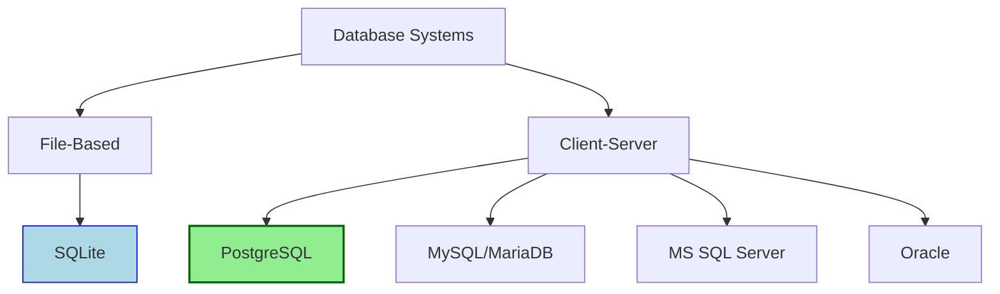
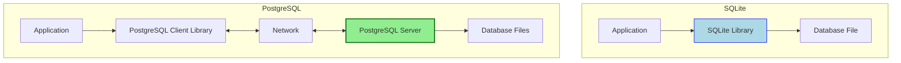

**Complexity: Moderate (M)**

## 16.0 Introduction: Moving to Production-Grade Databases

In previous chapters, we've worked with SQLite, a file-based database that's perfect for learning SQL and building simple applications. However, real-world data engineering requires more robust, scalable database systems. PostgreSQL is one of the most powerful and reliable open-source relational database systems in the industry.

Let's visualize how PostgreSQL fits into the database landscape:



This chapter marks an important transition in our data engineering journey. We're moving from:

- Simple file-based databases (SQLite) to client-server architecture (PostgreSQL)
- Local development to containerized development with Docker
- Basic data types to PostgreSQL's rich type system
- Single-file databases to organized schemas

By the end of this chapter, you'll understand the fundamentals of PostgreSQL and be able to set it up in a containerized environment, which is a common pattern in modern data engineering.

## 16.1 PostgreSQL vs SQLite: Understanding the Architectural Differences

SQLite and PostgreSQL have fundamentally different architectures that affect how we interact with them, deploy them, and use them in applications.

### 16.1.1 Architecture Comparison



Let's break down the key differences:

```python
import sqlite3
from typing import Dict, List, Any

# SQLite example - all happens within the process
def sqlite_example() -> None:
    # Connect directly to a file
    conn = sqlite3.connect('example.db')
    cursor = conn.cursor()

    # Execute a query
    cursor.execute("SELECT sqlite_version()")
    version = cursor.fetchone()

    print(f"SQLite version: {version[0]}")
    conn.close()

sqlite_example()
# SQLite version: 3.36.0 (or whatever version you have)
```

For PostgreSQL, we need to connect to a server:

```python
import psycopg2
from typing import Dict, List, Any

# PostgreSQL example - client-server architecture
def postgres_example() -> None:
    try:
        # Connect to the server with connection parameters
        conn = psycopg2.connect(
            host="localhost",      # Server address
            port="5432",           # Default PostgreSQL port
            database="postgres",   # Database name
            user="postgres",       # Username
            password="password"    # Password
        )

        cursor = conn.cursor()

        # Execute a query
        cursor.execute("SELECT version()")
        version = cursor.fetchone()

        print(f"PostgreSQL version: {version[0]}")
        conn.close()

    except Exception as e:
        print(f"Error connecting to PostgreSQL: {e}")

# Not running this yet - we need PostgreSQL set up first!
# postgres_example()
# PostgreSQL version: PostgreSQL 14.5 on x86_64-pc-linux-gnu...
```

### 16.1.2 Key Architectural Differences

| Feature       | SQLite                      | PostgreSQL                |
| ------------- | --------------------------- | ------------------------- |
| Architecture  | Embedded, file-based        | Client-server             |
| Concurrency   | Limited (file locking)      | Advanced (MVCC)           |
| Networking    | None (local file access)    | TCP/IP                    |
| Process Model | Part of application process | Separate server process   |
| Admin Needs   | Minimal                     | Server setup, maintenance |
| Scalability   | Limited by filesystem       | Highly scalable           |

This architectural shift introduces new considerations:

```python
from typing import Dict, List, Any

def client_server_considerations() -> Dict[str, List[str]]:
    """Return considerations when moving to client-server databases."""
    considerations = {
        "connection_management": [
            "Need to handle connection pools",
            "Must handle network failures",
            "Timeouts become important"
        ],
        "authentication": [
            "Username/password credentials",
            "Role-based access control",
            "SSL certificates for security"
        ],
        "performance": [
            "Network latency impacts query speed",
            "Connection establishment overhead",
            "Server resource limitations"
        ]
    }

    # Print the considerations
    print("Client-server database considerations:")
    for category, items in considerations.items():
        print(f"\n{category.replace('_', ' ').title()}:")
        for item in items:
            print(f"- {item}")

    return considerations

client_server_considerations()
# Client-server database considerations:
#
# Connection Management:
# - Need to handle connection pools
# - Must handle network failures
# - Timeouts become important
#
# Authentication:
# - Username/password credentials
# - Role-based access control
# - SSL certificates for security
#
# Performance:
# - Network latency impacts query speed
# - Connection establishment overhead
# - Server resource limitations
```

## 16.2 PostgreSQL in Docker: Containerization for Databases

Docker provides an isolated, consistent environment for running PostgreSQL. This approach has become standard in modern data engineering.

### 16.2.1 Why Docker for PostgreSQL?

Docker offers several advantages for database development:

```python
from typing import Dict, List

def docker_benefits() -> Dict[str, str]:
    """Return benefits of using Docker for PostgreSQL."""
    benefits = {
        "consistency": "Same database environment across development, testing, and production",
        "isolation": "PostgreSQL runs in its own container without affecting host system",
        "version_control": "Easily switch between PostgreSQL versions for testing",
        "dependencies": "All dependencies bundled in the container",
        "cleanup": "Easy to reset to a clean state by removing containers"
    }

    # Print the benefits
    print("Benefits of using Docker for PostgreSQL:")
    for key, value in benefits.items():
        print(f"- {key.replace('_', ' ').title()}: {value}")

    return benefits

docker_benefits()
# Benefits of using Docker for PostgreSQL:
# - Consistency: Same database environment across development, testing, and production
# - Isolation: PostgreSQL runs in its own container without affecting host system
# - Version Control: Easily switch between PostgreSQL versions for testing
# - Dependencies: All dependencies bundled in the container
# - Cleanup: Easy to reset to a clean state by removing containers
```

### 16.2.2 Basic PostgreSQL Docker Setup

To run PostgreSQL in Docker, we use the official PostgreSQL image:

```bash
# Pull the PostgreSQL image
docker pull postgres:14

# Run PostgreSQL container
docker run --name postgres-db -e POSTGRES_PASSWORD=mysecretpassword -p 5432:5432 -d postgres:14

# Check if container is running
docker ps
```

This creates a PostgreSQL server accessible on port 5432. Let's see how we could connect to it:

```python
import psycopg2
from typing import Optional, Dict, Any

def connect_to_docker_postgres() -> Optional[Dict[str, Any]]:
    """Connect to PostgreSQL running in Docker."""
    try:
        # Connect to the PostgreSQL server in Docker
        conn = psycopg2.connect(
            host="localhost",
            port="5432",
            database="postgres",
            user="postgres",
            password="mysecretpassword"
        )

        # Create a cursor
        cursor = conn.cursor()

        # Get PostgreSQL version
        cursor.execute("SELECT version()")
        version = cursor.fetchone()[0]

        # Get database size
        cursor.execute("SELECT pg_size_pretty(pg_database_size('postgres'))")
        db_size = cursor.fetchone()[0]

        # Close the connection
        conn.close()

        # Return information
        info = {
            "version": version,
            "database_size": db_size,
            "status": "connected successfully"
        }

        print(f"Connected to PostgreSQL in Docker:")
        print(f"- Version: {version.split(',')[0]}")
        print(f"- Database Size: {db_size}")
        print(f"- Status: Connected successfully")

        return info

    except Exception as e:
        print(f"Error connecting to PostgreSQL in Docker: {e}")
        return None

# Not running this yet - we would need a Docker container running
# connect_to_docker_postgres()
# Connected to PostgreSQL in Docker:
# - Version: PostgreSQL 14.5
# - Database Size: 8192 kB
# - Status: Connected successfully
```

## 16.3 Docker Compose for PostgreSQL: Multi-Container Setup

While a single Docker container works for basic use cases, Docker Compose provides a more manageable way to set up PostgreSQL along with its configuration.

### 16.3.1 Creating a Docker Compose Configuration

Let's create a `docker-compose.yml` file for PostgreSQL:

```yaml
version: '3.8'

services:
  postgres:
    image: postgres:14
    container_name: postgres-db
    environment:
      POSTGRES_USER: postgres
      POSTGRES_PASSWORD: mysecretpassword
      POSTGRES_DB: taskmanager
    ports:
      - '5432:5432'
    volumes:
      - postgres_data:/var/lib/postgresql/data
      - ./init-scripts:/docker-entrypoint-initdb.d
    restart: unless-stopped

volumes:
  postgres_data:
```

This configuration:

1. Creates a PostgreSQL service using version 14
2. Sets environment variables for user, password, and default database
3. Maps port 5432 from the container to the host
4. Creates a persistent volume for data storage
5. Mounts an init-scripts directory for initialization scripts
6. Sets the container to restart unless explicitly stopped

### 16.3.2 Connecting to the Compose-Managed PostgreSQL

With Docker Compose, starting PostgreSQL is simple:

```bash
# Start the PostgreSQL container
docker-compose up -d

# Check logs
docker-compose logs -f postgres
```

Let's see how we would create a function to check the status of our PostgreSQL container:

```python
import subprocess
from typing import Dict, List, Any, Optional

def check_postgres_container() -> Dict[str, Any]:
    """Check the status of the PostgreSQL container."""
    status = {
        "running": False,
        "container_id": "",
        "image": "",
        "ports": "",
        "status_text": ""
    }

    try:
        # Run docker ps command to check if container is running
        result = subprocess.run(
            ["docker", "ps", "--filter", "name=postgres-db", "--format", "{{.ID}}|{{.Image}}|{{.Ports}}|{{.Status}}"],
            capture_output=True,
            text=True,
            check=True
        )

        output = result.stdout.strip()

        if output:
            # Container is running
            parts = output.split('|')
            if len(parts) >= 4:
                status["running"] = True
                status["container_id"] = parts[0]
                status["image"] = parts[1]
                status["ports"] = parts[2]
                status["status_text"] = parts[3]

        # Print status information
        if status["running"]:
            print("PostgreSQL container is running:")
            print(f"- Container ID: {status['container_id']}")
            print(f"- Image: {status['image']}")
            print(f"- Ports: {status['ports']}")
            print(f"- Status: {status['status_text']}")
        else:
            print("PostgreSQL container is not running.")

        return status

    except subprocess.CalledProcessError as e:
        print(f"Error checking container status: {e}")
        return status

# Not running this yet as we need Docker set up
# check_postgres_container()
# PostgreSQL container is running:
# - Container ID: a1b2c3d4e5f6
# - Image: postgres:14
# - Ports: 0.0.0.0:5432->5432/tcp
# - Status: Up 2 hours
```

### 16.3.3 Secure Configuration in Docker Compose

An important aspect of setting up PostgreSQL (or any database) is handling credentials securely. Let's look at how to use environment variables and .env files for secure configuration:

```python
from typing import Dict, List, Any
import os

def explain_secure_credentials() -> Dict[str, List[str]]:
    """Explain secure credential handling with Docker Compose."""
    methods = {
        "environment_variables": [
            "Set environment variables on the host",
            "Reference them in docker-compose.yml with ${VAR_NAME}",
            "Avoids hardcoding credentials in files",
        ],
        "env_file": [
            "Create a .env file with VAR_NAME=value format",
            "Add .env to .gitignore to keep it out of version control",
            "Docker Compose automatically loads variables from .env",
        ],
        "secrets_management": [
            "For production, consider Docker Swarm secrets or Kubernetes secrets",
            "Use a dedicated secrets management solution for larger deployments",
            "Rotate credentials periodically for security"
        ]
    }

    print("Secure credential handling with Docker Compose:")
    for method, details in methods.items():
        print(f"\n{method.replace('_', ' ').title()}:")
        for detail in details:
            print(f"- {detail}")

    # Example .env file content
    print("\nExample .env file (should not be committed to Git):")
    print("POSTGRES_USER=postgres")
    print("POSTGRES_PASSWORD=mysecretpassword")
    print("POSTGRES_DB=taskmanager")

    # Example docker-compose.yml environment section
    print("\nExample docker-compose.yml environment section:")
    print("environment:")
    print("  POSTGRES_USER: ${POSTGRES_USER}")
    print("  POSTGRES_PASSWORD: ${POSTGRES_PASSWORD}")
    print("  POSTGRES_DB: ${POSTGRES_DB}")

    return methods

explain_secure_credentials()
# Secure credential handling with Docker Compose:
#
# Environment Variables:
# - Set environment variables on the host
# - Reference them in docker-compose.yml with ${VAR_NAME}
# - Avoids hardcoding credentials in files
#
# Env File:
# - Create a .env file with VAR_NAME=value format
# - Add .env to .gitignore to keep it out of version control
# - Docker Compose automatically loads variables from .env
#
# Secrets Management:
# - For production, consider Docker Swarm secrets or Kubernetes secrets
# - Use a dedicated secrets management solution for larger deployments
# - Rotate credentials periodically for security
#
# Example .env file (should not be committed to Git):
# POSTGRES_USER=postgres
# POSTGRES_PASSWORD=mysecretpassword
# POSTGRES_DB=taskmanager
#
# Example docker-compose.yml environment section:
# environment:
#   POSTGRES_USER: ${POSTGRES_USER}
#   POSTGRES_PASSWORD: ${POSTGRES_PASSWORD}
#   POSTGRES_DB: ${POSTGRES_DB}
```

## 16.4 PostgreSQL Data Types: Rich Type System

One of PostgreSQL's strengths is its rich set of data types that go beyond what SQLite offers.

### 16.4.1 Comparing SQLite and PostgreSQL Data Types

Let's look at the key data type differences:

```python
from typing import Dict, List, Any

def compare_data_types() -> Dict[str, Dict[str, str]]:
    """Compare data types between SQLite and PostgreSQL."""
    type_comparison = {
        "numeric_types": {
            "sqlite": "INTEGER, REAL",
            "postgresql": "SMALLINT, INTEGER, BIGINT, DECIMAL, NUMERIC, REAL, DOUBLE PRECISION, SERIAL"
        },
        "text_types": {
            "sqlite": "TEXT",
            "postgresql": "CHAR, VARCHAR, TEXT"
        },
        "binary_types": {
            "sqlite": "BLOB",
            "postgresql": "BYTEA"
        },
        "boolean_type": {
            "sqlite": "INTEGER (0=false, 1=true)",
            "postgresql": "BOOLEAN"
        },
        "date_time_types": {
            "sqlite": "TEXT, INTEGER (unix time)",
            "postgresql": "DATE, TIME, TIMESTAMP, INTERVAL"
        },
        "special_types": {
            "sqlite": "None",
            "postgresql": "UUID, XML, JSON, JSONB, Arrays, Geometric types, Network addresses"
        }
    }

    print("Data Type Comparison: SQLite vs PostgreSQL")
    for category, types in type_comparison.items():
        print(f"\n{category.replace('_', ' ').title()}:")
        print(f"- SQLite: {types['sqlite']}")
        print(f"- PostgreSQL: {types['postgresql']}")

    return type_comparison

compare_data_types()
# Data Type Comparison: SQLite vs PostgreSQL
#
# Numeric Types:
# - SQLite: INTEGER, REAL
# - PostgreSQL: SMALLINT, INTEGER, BIGINT, DECIMAL, NUMERIC, REAL, DOUBLE PRECISION, SERIAL
#
# Text Types:
# - SQLite: TEXT
# - PostgreSQL: CHAR, VARCHAR, TEXT
#
# Binary Types:
# - SQLite: BLOB
# - PostgreSQL: BYTEA
#
# Boolean Type:
# - SQLite: INTEGER (0=false, 1=true)
# - PostgreSQL: BOOLEAN
#
# Date Time Types:
# - SQLite: TEXT, INTEGER (unix time)
# - PostgreSQL: DATE, TIME, TIMESTAMP, INTERVAL
#
# Special Types:
# - SQLite: None
# - PostgreSQL: UUID, XML, JSON, JSONB, Arrays, Geometric types, Network addresses
```

### 16.4.2 PostgreSQL-Specific Data Types

Let's explore some of the PostgreSQL-specific data types with examples of how they'd be used in a schema:

```sql
-- Example PostgreSQL schema with special data types
CREATE TABLE advanced_users (
    id SERIAL PRIMARY KEY,              -- Auto-incrementing integer
    uuid UUID UNIQUE,                   -- Universal unique identifier
    username VARCHAR(50) NOT NULL,      -- Variable-length string with limit
    active BOOLEAN DEFAULT TRUE,        -- Boolean type
    last_login TIMESTAMP WITH TIME ZONE, -- Timestamp with timezone
    login_history TIMESTAMP[],          -- Array of timestamps
    settings JSONB,                     -- Binary JSON data
    search_vector TSVECTOR              -- Full-text search data type
);
```

Let's look at how we would use these data types in an actual PostgreSQL database:

```python
import psycopg2
import json
import uuid
from typing import Dict, Any, Optional

def create_advanced_table(conn_params: Dict[str, str]) -> None:
    """Create a table with PostgreSQL-specific data types."""
    try:
        # Connect to PostgreSQL
        conn = psycopg2.connect(**conn_params)
        cursor = conn.cursor()

        # Create table with advanced data types
        cursor.execute("""
        CREATE TABLE IF NOT EXISTS advanced_users (
            id SERIAL PRIMARY KEY,
            uuid UUID UNIQUE,
            username VARCHAR(50) NOT NULL,
            active BOOLEAN DEFAULT TRUE,
            last_login TIMESTAMP WITH TIME ZONE,
            login_history TIMESTAMP[] DEFAULT '{}',
            settings JSONB,
            search_vector TSVECTOR
        );
        """)

        # Insert a sample record
        cursor.execute("""
        INSERT INTO advanced_users (
            uuid, username, active, last_login, settings
        ) VALUES (
            %s, %s, %s, NOW(), %s
        ) RETURNING id;
        """, (
            uuid.uuid4(),
            'advanced_user',
            True,
            json.dumps({"theme": "dark", "notifications": True})
        ))

        user_id = cursor.fetchone()[0]

        # Commit the transaction
        conn.commit()

        # Retrieve and display the inserted record
        cursor.execute("""
        SELECT id, uuid, username, active, last_login, settings
        FROM advanced_users
        WHERE id = %s;
        """, (user_id,))

        user = cursor.fetchone()

        print("Created advanced_users table and inserted record:")
        print(f"- ID: {user[0]}")
        print(f"- UUID: {user[1]}")
        print(f"- Username: {user[2]}")
        print(f"- Active: {user[3]}")
        print(f"- Last Login: {user[4]}")
        print(f"- Settings: {user[5]}")

        # Close the connection
        cursor.close()
        conn.close()

    except Exception as e:
        print(f"Error creating advanced table: {e}")

# Example connection parameters
# Not running this function as we need an actual PostgreSQL connection
conn_params = {
    "host": "localhost",
    "port": "5432",
    "database": "taskmanager",
    "user": "postgres",
    "password": "mysecretpassword"
}

# create_advanced_table(conn_params)
# Created advanced_users table and inserted record:
# - ID: 1
# - UUID: 550e8400-e29b-41d4-a716-446655440000
# - Username: advanced_user
# - Active: True
# - Last Login: 2023-04-15 14:30:45.123456+00:00
# - Settings: {"theme": "dark", "notifications": true}
```

## 16.5 Schema Management: Organizing Database Objects

PostgreSQL allows you to organize your database objects (tables, views, functions) into schemas. This is a powerful feature for organizing complex databases.

### 16.5.1 Introduction to PostgreSQL Schemas

```python
from typing import Dict, List, Any

def explain_schemas() -> Dict[str, List[str]]:
    """Explain the concept of PostgreSQL schemas."""
    schema_info = {
        "definition": [
            "A namespace that contains named database objects like tables, views, functions",
            "Similar to directories in a file system",
            "PostgreSQL databases come with a default schema named 'public'"
        ],
        "benefits": [
            "Organize database objects logically",
            "Allow multiple users to use the same database without interference",
            "Enable the same object name to be used in different contexts",
            "Apply permissions at the schema level"
        ],
        "common_schemas": [
            "public - default schema where objects are created",
            "pg_catalog - system catalog tables",
            "information_schema - ANSI-standard metadata",
            "custom schemas for specific applications or modules"
        ]
    }

    print("PostgreSQL Schemas:")
    for category, items in schema_info.items():
        print(f"\n{category.title()}:")
        for item in items:
            print(f"- {item}")

    return schema_info

explain_schemas()
# PostgreSQL Schemas:
#
# Definition:
# - A namespace that contains named database objects like tables, views, functions
# - Similar to directories in a file system
# - PostgreSQL databases come with a default schema named 'public'
#
# Benefits:
# - Organize database objects logically
# - Allow multiple users to use the same database without interference
# - Enable the same object name to be used in different contexts
# - Apply permissions at the schema level
#
# Common Schemas:
# - public - default schema where objects are created
# - pg_catalog - system catalog tables
# - information_schema - ANSI-standard metadata
# - custom schemas for specific applications or modules
```

### 16.5.2 Creating and Using Schemas

Let's see how to create and use schemas in PostgreSQL:

```python
import psycopg2
from typing import Dict, Any, List, Optional

def demonstrate_schemas(conn_params: Dict[str, str]) -> None:
    """Demonstrate creating and using PostgreSQL schemas."""
    try:
        # Connect to PostgreSQL
        conn = psycopg2.connect(**conn_params)
        cursor = conn.cursor()

        # Create schemas for different parts of our application
        cursor.execute("CREATE SCHEMA IF NOT EXISTS core;")
        cursor.execute("CREATE SCHEMA IF NOT EXISTS analytics;")

        # Create tables in different schemas
        cursor.execute("""
        CREATE TABLE IF NOT EXISTS core.tasks (
            id SERIAL PRIMARY KEY,
            title VARCHAR(100) NOT NULL,
            description TEXT,
            created_at TIMESTAMP WITH TIME ZONE DEFAULT NOW()
        );
        """)

        cursor.execute("""
        CREATE TABLE IF NOT EXISTS analytics.task_metrics (
            id SERIAL PRIMARY KEY,
            task_id INTEGER REFERENCES core.tasks(id),
            completed_at TIMESTAMP WITH TIME ZONE,
            duration INTERVAL
        );
        """)

        # Insert data into core.tasks
        cursor.execute("""
        INSERT INTO core.tasks (title, description)
        VALUES (%s, %s)
        RETURNING id;
        """, ("Complete PostgreSQL chapter", "Learn about schemas and data types"))

        task_id = cursor.fetchone()[0]

        # Insert data into analytics.task_metrics
        cursor.execute("""
        INSERT INTO analytics.task_metrics (task_id, completed_at, duration)
        VALUES (%s, NOW(), '2 hours'::INTERVAL);
        """, (task_id,))

        # Commit the transaction
        conn.commit()

        # Query data from both schemas
        cursor.execute("""
        SELECT t.id, t.title, tm.completed_at, tm.duration
        FROM core.tasks t
        JOIN analytics.task_metrics tm ON t.id = tm.task_id;
        """)

        result = cursor.fetchone()

        print("Schema demonstration:")
        print(f"- Task ID: {result[0]}")
        print(f"- Title: {result[1]}")
        print(f"- Completed At: {result[2]}")
        print(f"- Duration: {result[3]}")

        # List all schemas in the database
        cursor.execute("""
        SELECT schema_name
        FROM information_schema.schemata
        WHERE schema_name NOT LIKE 'pg_%' AND schema_name != 'information_schema';
        """)

        schemas = [row[0] for row in cursor.fetchall()]

        print("\nAvailable schemas:")
        for schema in schemas:
            print(f"- {schema}")

        # Close the connection
        cursor.close()
        conn.close()

    except Exception as e:
        print(f"Error demonstrating schemas: {e}")

# Not running this function as we need an actual PostgreSQL connection
# demonstrate_schemas(conn_params)
# Schema demonstration:
# - Task ID: 1
# - Title: Complete PostgreSQL chapter
# - Completed At: 2023-04-15 16:45:30.123456+00:00
# - Duration: 2:00:00
#
# Available schemas:
# - public
# - core
# - analytics
```

### 16.5.3 Schema Search Path

PostgreSQL uses a search path to determine which schema to look in when an object is referenced without a schema prefix:

```python
from typing import Dict, Any, List

def explain_search_path() -> Dict[str, Any]:
    """Explain PostgreSQL schema search path."""
    search_path_info = {
        "definition": "Ordered list of schemas PostgreSQL searches when an object is referenced without schema prefix",
        "default": "The default search path is usually '$user, public'",
        "importance": "Critical for multi-schema databases to ensure correct objects are accessed",
        "examples": [
            "SET search_path TO app, public;",
            "SET search_path TO \"$user\", public, core;",
            "SHOW search_path;"
        ]
    }

    print("PostgreSQL Schema Search Path:")
    print(f"- Definition: {search_path_info['definition']}")
    print(f"- Default: {search_path_info['default']}")
    print(f"- Importance: {search_path_info['importance']}")
    print("\nExample commands:")
    for example in search_path_info['examples']:
        print(f"- {example}")

    # How search path impacts object resolution
    print("\nHow search path works:")
    print("1. Reference: SELECT * FROM tasks;")
    print("2. With search_path = 'core, public'")
    print("   PostgreSQL first looks for core.tasks")
    print("   If not found, looks for public.tasks")
    print("3. With explicit schema: SELECT * FROM core.tasks;")
    print("   PostgreSQL directly accesses core.tasks")

    return search_path_info

explain_search_path()
# PostgreSQL Schema Search Path:
# - Definition: Ordered list of schemas PostgreSQL searches when an object is referenced without schema prefix
# - Default: The default search path is usually '$user, public'
# - Importance: Critical for multi-schema databases to ensure correct objects are accessed
#
# Example commands:
# - SET search_path TO app, public;
# - SET search_path TO "$user", public, core;
# - SHOW search_path;
#
# How search path works:
# 1. Reference: SELECT * FROM tasks;
# 2. With search_path = 'core, public'
#    PostgreSQL first looks for core.tasks
#    If not found, looks for public.tasks
# 3. With explicit schema: SELECT * FROM core.tasks;
#    PostgreSQL directly accesses core.tasks
```

## 16.6 Micro-Project: Dockerized PostgreSQL Migration

Now let's apply what we've learned by setting up a PostgreSQL database in Docker and migrating our existing task management schema from SQLite.

### Project Description

You'll create a Docker Compose configuration for PostgreSQL, then write a script to migrate your existing SQLite task management database schema and data to PostgreSQL.

### Acceptance Criteria

- Docker Compose file successfully creates a PostgreSQL container
- Database data persists across container restarts (volume correctly configured)
- Secure credential management is used (environment variables loaded from .env file excluded from Git)
- Migration script successfully creates all tables, constraints, and indexes
- All data is transferred correctly from SQLite to PostgreSQL
- Primary keys, foreign keys, and constraints are properly implemented
- PostgreSQL-specific data types are used where appropriate (e.g., SERIAL for IDs)
- Data validation confirms complete and accurate migration
- Container configuration includes:
  - Appropriate port mappings
  - Environment variables for configuration
  - Health check configuration
- Documentation includes instructions for starting the database securely and running migrations

### Common Pitfalls and Solutions

Before we begin the implementation, let's discuss some common challenges:

1. **Data type mismatches between SQLite and PostgreSQL**:

   - **Pitfall**: SQLite's simplified type system doesn't map directly to PostgreSQL's rich types.
   - **Solution**: Create a mapping dictionary to translate between SQLite and PostgreSQL types.

2. **Permission issues with Docker volumes**:

   - **Pitfall**: Data volume permissions can prevent PostgreSQL from starting properly.
   - **Solution**: Pay attention to file ownership and permissions when configuring volumes.

3. **Connection issues between containers**:

   - **Pitfall**: Network configuration issues can prevent services from communicating.
   - **Solution**: Ensure proper network configuration in Docker Compose.

4. **Hardcoding credentials in Docker Compose file**:
   - **Pitfall**: Including sensitive data in files that might be committed to version control.
   - **Solution**: Use environment files (.env) excluded from version control to pass sensitive variables.

### Educational vs. Production Implementation

In a real-world production environment, this implementation would differ in several ways:

1. **Security**:

   - **Educational**: Simple passwords, basic configurations
   - **Production**: Complex passwords, SSL connections, network isolation, regular security audits

2. **High Availability**:

   - **Educational**: Single PostgreSQL instance
   - **Production**: Primary-replica setup, automated failover

3. **Backup Strategy**:

   - **Educational**: Basic database dumps
   - **Production**: Point-in-time recovery, automated backups, offsite storage

4. **Monitoring**:

   - **Educational**: Manual checks
   - **Production**: Comprehensive monitoring of performance, connections, storage

5. **Migration Strategy**:
   - **Educational**: Simple script with downtime
   - **Production**: Zero-downtime migrations, blue-green deployments

### Implementation

Let's implement our solution step by step:

#### Step 1: Create Docker Compose Configuration

First, we'll create a `docker-compose.yml` file for PostgreSQL:

```yaml
version: '3.8'

services:
  postgres:
    image: postgres:14
    container_name: postgres-taskmanager
    environment:
      POSTGRES_USER: ${POSTGRES_USER:-postgres}
      POSTGRES_PASSWORD: ${POSTGRES_PASSWORD:-changeme}
      POSTGRES_DB: ${POSTGRES_DB:-taskmanager}
    ports:
      - '${POSTGRES_PORT:-5432}:5432'
    volumes:
      - postgres_data:/var/lib/postgresql/data
      - ./init-scripts:/docker-entrypoint-initdb.d
    healthcheck:
      test: ['CMD-SHELL', 'pg_isready -U postgres']
      interval: 10s
      timeout: 5s
      retries: 5
    restart: unless-stopped

volumes:
  postgres_data:
```

Next, create a `.env` file with environment variables (add to .gitignore):

```
POSTGRES_USER=postgres
POSTGRES_PASSWORD=secure_password
POSTGRES_DB=taskmanager
POSTGRES_PORT=5432
```

#### Step 2: Create a Migration Script

Now, let's create a Python script to migrate from SQLite to PostgreSQL:

```python
import sqlite3
import psycopg2
import os
from typing import Dict, List, Any, Tuple, Optional
import time
import dotenv

def migrate_sqlite_to_postgres() -> None:
    """Migrate SQLite database to PostgreSQL."""
    # Start timing
    start_time = time.time()

    # Load environment variables from .env file
    dotenv.load_dotenv()

    # Connection parameters
    sqlite_db = 'task_manager.db'
    pg_params = {
        'host': 'localhost',
        'port': os.getenv('POSTGRES_PORT', '5432'),
        'database': os.getenv('POSTGRES_DB', 'taskmanager'),
        'user': os.getenv('POSTGRES_USER', 'postgres'),
        'password': os.getenv('POSTGRES_PASSWORD', 'changeme')
    }

    print("Starting migration from SQLite to PostgreSQL...")
    print(f"Source: {sqlite_db}")
    print(f"Destination: PostgreSQL on {pg_params['host']}:{pg_params['port']}, "
          f"database: {pg_params['database']}")

    # Ensure SQLite database exists
    if not os.path.exists(sqlite_db):
        print(f"Error: SQLite database {sqlite_db} not found.")
        return

    # Define type mapping from SQLite to PostgreSQL
    type_mapping = {
        'INTEGER': 'INTEGER',
        'REAL': 'DOUBLE PRECISION',
        'TEXT': 'TEXT',
        'BLOB': 'BYTEA',
        'NULL': 'NULL',
        '': 'TEXT',  # Default for unknown types
        # Add mappings for SQLite columns with specific names
        'id': 'SERIAL',
        'created_at': 'TIMESTAMP WITH TIME ZONE',
        'updated_at': 'TIMESTAMP WITH TIME ZONE',
        'due_date': 'DATE',
        'is_complete': 'BOOLEAN'
    }

    try:
        # Connect to SQLite
        sqlite_conn = sqlite3.connect(sqlite_db)
        sqlite_conn.row_factory = sqlite3.Row
        sqlite_cursor = sqlite_conn.cursor()

        # Connect to PostgreSQL
        pg_conn = psycopg2.connect(**pg_params)
        pg_cursor = pg_conn.cursor()

        # Get list of tables from SQLite
        sqlite_cursor.execute("SELECT name FROM sqlite_master WHERE type='table';")
        tables = [row[0] for row in sqlite_cursor.fetchall()
                  if row[0] != 'sqlite_sequence']  # Skip SQLite internal tables

        print(f"\nFound {len(tables)} tables in SQLite: {', '.join(tables)}")

        # Process each table
        for table in tables:
            print(f"\nProcessing table: {table}")

            # Get table schema from SQLite
            sqlite_cursor.execute(f"PRAGMA table_info({table});")
            columns = sqlite_cursor.fetchall()

            # Create table in PostgreSQL
            create_table_sql = f"CREATE TABLE IF NOT EXISTS {table} (\n"

            # Process columns
            column_defs = []
            primary_key_cols = []

            for col in columns:
                col_name = col[1]
                col_type = col[2]
                not_null = "NOT NULL" if col[3] == 1 else ""
                is_pk = col[5] == 1

                # Determine PostgreSQL type
                if col_name.lower() in type_mapping:
                    pg_type = type_mapping[col_name.lower()]
                else:
                    pg_type = type_mapping.get(col_type.upper(), 'TEXT')

                # Add to column definitions
                column_def = f"    {col_name} {pg_type} {not_null}"
                column_defs.append(column_def)

                # Track primary key columns
                if is_pk:
                    primary_key_cols.append(col_name)

            # Add primary key constraint if needed
            if primary_key_cols:
                column_defs.append(f"    PRIMARY KEY ({', '.join(primary_key_cols)})")

            # Finalize create table SQL
            create_table_sql += ",\n".join(column_defs) + "\n);"

            print(f"Creating table in PostgreSQL:")
            print(create_table_sql)

            # Execute create table in PostgreSQL
            pg_cursor.execute(create_table_sql)

            # Get data from SQLite
            sqlite_cursor.execute(f"SELECT * FROM {table};")
            rows = sqlite_cursor.fetchall()

            if not rows:
                print(f"No data found in table {table}")
                continue

            print(f"Migrating {len(rows)} rows of data...")

            # Prepare column list for inserts
            col_names = [col[1] for col in columns]

            # Prepare placeholders for PostgreSQL parameterized query
            placeholders = ', '.join(['%s'] * len(col_names))

            # Create insert statement
            insert_sql = f"INSERT INTO {table} ({', '.join(col_names)}) VALUES ({placeholders})"

            # Insert data in batches
            batch_size = 100
            for i in range(0, len(rows), batch_size):
                batch = rows[i:i+batch_size]
                batch_values = [tuple(row) for row in batch]
                pg_cursor.executemany(insert_sql, batch_values)
                print(f"Inserted rows {i+1} to {min(i+batch_size, len(rows))}")

            print(f"Table {table} migration complete!")

        # Commit PostgreSQL changes
        pg_conn.commit()

        # Verify migration
        print("\nVerifying migration...")
        for table in tables:
            sqlite_cursor.execute(f"SELECT COUNT(*) FROM {table};")
            sqlite_count = sqlite_cursor.fetchone()[0]

            pg_cursor.execute(f"SELECT COUNT(*) FROM {table};")
            pg_count = pg_cursor.fetchone()[0]

            if sqlite_count == pg_count:
                print(f"Table {table}: OK ({pg_count} rows)")
            else:
                print(f"Table {table}: MISMATCH (SQLite: {sqlite_count}, PostgreSQL: {pg_count})")

        # Close connections
        sqlite_cursor.close()
        sqlite_conn.close()
        pg_cursor.close()
        pg_conn.close()

        elapsed_time = time.time() - start_time
        print(f"\nMigration completed in {elapsed_time:.2f} seconds.")

    except sqlite3.Error as e:
        print(f"SQLite error: {e}")
    except psycopg2.Error as e:
        print(f"PostgreSQL error: {e}")
    except Exception as e:
        print(f"Error during migration: {e}")

# For demonstration purposes, we'll create a sample SQLite database first
def create_sample_sqlite_db(db_path: str) -> None:
    """Create a sample SQLite database for task management."""
    print(f"Creating sample SQLite database at {db_path}...")

    # Delete existing database if it exists
    if os.path.exists(db_path):
        os.remove(db_path)

    conn = sqlite3.connect(db_path)
    cursor = conn.cursor()

    # Create tasks table
    cursor.execute('''
    CREATE TABLE tasks (
        id INTEGER PRIMARY KEY AUTOINCREMENT,
        title TEXT NOT NULL,
        description TEXT,
        due_date TEXT,
        priority INTEGER DEFAULT 1,
        is_complete INTEGER DEFAULT 0,
        created_at TEXT DEFAULT CURRENT_TIMESTAMP
    );
    ''')

    # Create categories table
    cursor.execute('''
    CREATE TABLE categories (
        id INTEGER PRIMARY KEY AUTOINCREMENT,
        name TEXT NOT NULL UNIQUE,
        color TEXT DEFAULT 'blue'
    );
    ''')

    # Create task_categories junction table
    cursor.execute('''
    CREATE TABLE task_categories (
        task_id INTEGER,
        category_id INTEGER,
        PRIMARY KEY (task_id, category_id),
        FOREIGN KEY (task_id) REFERENCES tasks(id),
        FOREIGN KEY (category_id) REFERENCES categories(id)
    );
    ''')

    # Insert sample data
    # Sample categories
    categories = [
        ('Work', 'blue'),
        ('Personal', 'green'),
        ('Study', 'purple'),
        ('Health', 'red')
    ]
    cursor.executemany("INSERT INTO categories (name, color) VALUES (?, ?)", categories)

    # Sample tasks
    tasks = [
        ('Complete PostgreSQL migration', 'Migrate from SQLite to PostgreSQL', '2023-05-01', 3, 0),
        ('Buy groceries', 'Get milk, eggs, and bread', '2023-04-20', 2, 1),
        ('Study Docker', 'Learn Docker networking', '2023-04-25', 2, 0),
        ('Doctor appointment', 'Annual checkup', '2023-05-10', 3, 0),
        ('Gym workout', 'Leg day', '2023-04-19', 1, 0)
    ]
    cursor.executemany(
        "INSERT INTO tasks (title, description, due_date, priority, is_complete) VALUES (?, ?, ?, ?, ?)",
        tasks
    )

    # Assign categories to tasks
    task_categories = [
        (1, 3),  # PostgreSQL migration -> Study
        (2, 2),  # Buy groceries -> Personal
        (3, 3),  # Study Docker -> Study
        (4, 4),  # Doctor appointment -> Health
        (5, 4),  # Gym workout -> Health
        (1, 1)   # PostgreSQL migration -> Work (also)
    ]
    cursor.executemany("INSERT INTO task_categories (task_id, category_id) VALUES (?, ?)", task_categories)

    # Commit and close
    conn.commit()
    conn.close()

    print(f"Sample SQLite database created with tables: tasks, categories, task_categories")
    print(f"Added 5 sample tasks and 4 categories")

# Create sample SQLite database and run migration
create_sample_sqlite_db('task_manager.db')
# Now you would run the migration function
# migrate_sqlite_to_postgres()
# This would output the migration steps and verification
```

### How to Run and Test the Solution

Follow these steps to run and test the migration:

1. **Install required packages**:

   ```bash
   pip install psycopg2-binary python-dotenv
   ```

2. **Set up your environment**:

   - Create the `docker-compose.yml` file as shown above
   - Create a `.env` file with your PostgreSQL credentials

3. **Start PostgreSQL container**:

   ```bash
   docker-compose up -d
   ```

4. **Create the sample SQLite database** (if you don't have one):

   ```python
   create_sample_sqlite_db('task_manager.db')
   ```

5. **Run the migration script**:

   ```python
   migrate_sqlite_to_postgres()
   ```

6. **Verify the migration**:

   - Connect to PostgreSQL and check the tables/data:

   ```bash
   docker exec -it postgres-taskmanager psql -U postgres -d taskmanager
   ```

   - In PostgreSQL shell:

   ```sql
   \dt                           -- List tables
   SELECT COUNT(*) FROM tasks;   -- Count tasks
   SELECT * FROM tasks LIMIT 3;  -- View first 3 tasks
   ```

7. **Test persistence** (to verify volume configuration):
   ```bash
   docker-compose down
   docker-compose up -d
   # Then connect and check if data is still there
   ```

## 16.7 Practice Exercises

To reinforce your understanding of PostgreSQL fundamentals, try these exercises:

### Exercise 1: PostgreSQL Schema Design

Design a PostgreSQL schema for a library management system with:

- Books (with appropriate data types for ISBN, publication dates, etc.)
- Authors
- Publishers
- Borrowers
- Loans (tracking when books are checked out/returned)

Use PostgreSQL-specific data types where appropriate, and organize the tables into logical schemas.

### Exercise 2: Docker Volume Management

Create a Docker Compose configuration that:

- Runs PostgreSQL with a named volume for data
- Sets up a basic backup system using a second container that runs a cron job to perform pg_dump
- Mounts a host directory to store the backups
- Uses environment variables for configuration

### Exercise 3: PostgreSQL Data Type Exploration

Write a Python script that:

- Connects to PostgreSQL
- Creates a table using at least 5 different PostgreSQL-specific data types
- Inserts sample data showcasing each data type
- Retrieves and displays the data with proper formatting
- Includes proper error handling

### Exercise 4: Migration Tool Enhancement

Extend the migration script from the micro-project to:

- Handle foreign key relationships properly
- Add indexes based on query patterns
- Include a dry-run option to see what would be migrated without making changes
- Generate a report of the migration results

## 16.8 Summary and Connection to Next Chapter

In this chapter, we've explored the fundamentals of PostgreSQL and how it differs from SQLite. We've:

- Learned about the client-server architecture of PostgreSQL vs. the file-based nature of SQLite
- Set up PostgreSQL in Docker containers using Docker Compose
- Explored PostgreSQL's rich data type system and schema management capabilities
- Created a migration script to move from SQLite to PostgreSQL

This knowledge serves as the foundation for more advanced PostgreSQL operations we'll cover in upcoming chapters. In Chapter 17, we'll dive deeper into PostgreSQL, exploring advanced features like server-side functions, triggers, and more sophisticated data types. We'll also look at how to optimize PostgreSQL for performance using indexes and query planning.

PostgreSQL's robust features and production-grade capabilities make it a cornerstone of modern data engineering. The skills you've learned in this chapter will serve as a foundation for building scalable, resilient data systems.
