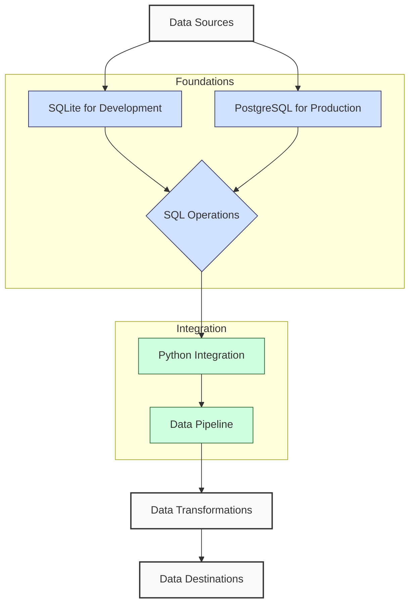

**Complexity: Easy (E)**

## 17.0 Introduction: Consolidating Your Database Knowledge

This chapter serves as a checkpoint to review and reinforce the fundamental database concepts we've covered so far. Before proceeding to more advanced topics, it's essential to ensure that you have a solid grasp of the core database principles that form the foundation of data engineering.

Let's visualize how the database concepts we've covered fit into the typical data engineering workflow:



In our journey through database fundamentals, we've covered:

1. **SQL Fundamentals**: Basic and advanced SQL operations using SQLite
2. **Python Database Integration**: Connecting Python to databases, executing queries, and handling results
3. **Database Programming Patterns**: Type-safe approaches, transaction management, and error handling
4. **PostgreSQL Fundamentals**: Moving to a production-grade database system

This checkpoint chapter will help you consolidate these concepts before we delve into more advanced database design principles and specialized database features.

## 17.1 Relational Database Fundamentals Review

Let's start by reviewing the core concepts of relational databases that we've covered.

### 17.1.1 Database vs. Flat Files

Relational databases offer significant advantages over flat files for data storage:

```python
# Example: Why databases are better than flat files for structured data

# With flat files (e.g., CSV), data integrity is hard to maintain
# File 1: customers.csv - What if customer_id 101 is used twice?
# customer_id,name,email
# 101,Alice Smith,alice@example.com
# 102,Bob Jones,bob@example.com
# 101,Charlie Brown,charlie@example.com  # Duplicate ID!

# File 2: orders.csv - What if it references customer_id 103 which doesn't exist?
# order_id,customer_id,amount
# 1001,101,99.95
# 1002,102,49.50
# 1003,103,150.00  # References nonexistent customer!

# With a database:
# 1. We can enforce unique customer IDs (PRIMARY KEY constraint)
# 2. We can ensure orders only reference existing customers (FOREIGN KEY constraint)
# 3. We can efficiently query across related data

print("Benefits of relational databases over flat files:")
print("1. Data integrity through constraints")
print("2. Efficient querying of related data")
print("3. Concurrent access by multiple users")
print("4. Transaction support for data consistency")
print("5. Security features like access control")
# Benefits of relational databases over flat files:
# 1. Data integrity through constraints
# 2. Efficient querying of related data
# 3. Concurrent access by multiple users
# 4. Transaction support for data consistency
# 5. Security features like access control
```

### 17.1.2 Relational Database Concepts Review

Let's review the core components of relational databases:

```python
# Key relational database concepts

# Tables (Relations):
# Structured collections of data with rows and columns
example_table = """
Table: customers
+-------------+-------------+--------------------+
| customer_id | name        | email              |
+-------------+-------------+--------------------+
| 101         | Alice Smith | alice@example.com  |
| 102         | Bob Jones   | bob@example.com    |
+-------------+-------------+--------------------+
"""

# Keys:
# Primary Key: Unique identifier for each row (e.g., customer_id)
# Foreign Key: References primary key in another table

# Relationships:
# One-to-One: One row in table A relates to one row in table B
# One-to-Many: One row in table A relates to multiple rows in table B (most common)
# Many-to-Many: Multiple rows in table A relate to multiple rows in table B (uses junction table)

relational_concepts = {
    "Table": "Collection of related data in rows and columns",
    "Row": "Single record in a table (also called tuple)",
    "Column": "Specific attribute with defined data type (also called field)",
    "Primary Key": "Unique identifier for each row",
    "Foreign Key": "Column that references another table's primary key",
    "Schema": "Logical grouping of database objects",
    "Constraints": "Rules enforced on data columns (e.g., NOT NULL, UNIQUE)",
    "Index": "Data structure to improve query performance"
}

print("Core relational database concepts:")
for concept, definition in relational_concepts.items():
    print(f"- {concept}: {definition}")
# Core relational database concepts:
# - Table: Collection of related data in rows and columns
# - Row: Single record in a table (also called tuple)
# - Column: Specific attribute with defined data type (also called field)
# - Primary Key: Unique identifier for each row
# - Foreign Key: Column that references another table's primary key
# - Schema: Logical grouping of database objects
# - Constraints: Rules enforced on data columns (e.g., NOT NULL, UNIQUE)
# - Index: Data structure to improve query performance
```

### 17.1.3 Database Normalization

Normalization is the process of organizing data to reduce redundancy and improve data integrity:

```python
# Database normalization example

# Unnormalized data (problematic):
unnormalized_data = """
+-------------+-------------+-------------------+-----------------+----------------+
| customer_id | name        | email             | shipping_address| product_orders |
+-------------+-------------+-------------------+-----------------+----------------+
| 101         | Alice Smith | alice@example.com | 123 Main St     | Widget A, Widget B |
| 102         | Bob Jones   | bob@example.com   | 456 Oak Ave     | Widget A |
+-------------+-------------+-------------------+-----------------+----------------+
"""

# Problems with unnormalized data:
# 1. Data redundancy (product info repeated)
# 2. Update anomalies (changing a product name requires updates in multiple rows)
# 3. Insertion anomalies (can't add a product without a customer)
# 4. Deletion anomalies (deleting a customer also deletes product information)

# Normalized schema (3NF):
normalized_schema = """
Table: customers
+-------------+-------------+-------------------+
| customer_id | name        | email             |
+-------------+-------------+-------------------+
| 101         | Alice Smith | alice@example.com |
| 102         | Bob Jones   | bob@example.com   |
+-------------+-------------+-------------------+

Table: addresses
+-------------+-------------+-----------------+
| address_id  | customer_id | address         |
+-------------+-------------+-----------------+
| 201         | 101         | 123 Main St     |
| 202         | 102         | 456 Oak Ave     |
+-------------+-------------+-----------------+

Table: products
+-------------+-------------+
| product_id  | name        |
+-------------+-------------+
| 301         | Widget A    |
| 302         | Widget B    |
+-------------+-------------+

Table: orders
+-------------+-------------+-------------+
| order_id    | customer_id | product_id  |
+-------------+-------------+-------------+
| 401         | 101         | 301         |
| 402         | 101         | 302         |
| 403         | 102         | 301         |
+-------------+-------------+-------------+
"""

normalization_benefits = [
    "Eliminates data redundancy",
    "Improves data integrity",
    "Reduces update anomalies",
    "Makes database more flexible for queries",
    "Simplifies data maintenance"
]

print("Benefits of database normalization:")
for i, benefit in enumerate(normalization_benefits, 1):
    print(f"{i}. {benefit}")
# Benefits of database normalization:
# 1. Eliminates data redundancy
# 2. Improves data integrity
# 3. Reduces update anomalies
# 4. Makes database more flexible for queries
# 5. Simplifies data maintenance
```

## 17.2 SQL Operations Review

Let's review the key SQL operations we've learned for working with databases.

### 17.2.1 Data Definition Language (DDL)

DDL commands let us create and modify database structures:

```python
# DDL examples for creating database structures

# CREATE TABLE - Define a new table
create_table_example = """
CREATE TABLE employees (
    employee_id INTEGER PRIMARY KEY,
    first_name TEXT NOT NULL,
    last_name TEXT NOT NULL,
    hire_date DATE,
    department TEXT,
    salary NUMERIC(10,2) CHECK (salary > 0)
);
"""

# ALTER TABLE - Modify an existing table
alter_table_examples = [
    "ALTER TABLE employees ADD COLUMN email TEXT;",
    "ALTER TABLE employees DROP COLUMN department;",
    "ALTER TABLE employees RENAME TO staff;"
]

# DROP TABLE - Remove a table completely
drop_table_example = "DROP TABLE employees;"

# CREATE INDEX - Create an index for faster queries
create_index_example = "CREATE INDEX idx_employee_dept ON employees(department);"

print("Common DDL operations:")
print("1. CREATE TABLE - Define table structure with columns and constraints")
print("2. ALTER TABLE - Modify existing table structure")
print("3. DROP TABLE - Remove a table and all its data")
print("4. CREATE INDEX - Add an index to improve query performance")
print("5. CREATE VIEW - Define a virtual table based on a query")
# Common DDL operations:
# 1. CREATE TABLE - Define table structure with columns and constraints
# 2. ALTER TABLE - Modify existing table structure
# 3. DROP TABLE - Remove a table and all its data
# 4. CREATE INDEX - Add an index to improve query performance
# 5. CREATE VIEW - Define a virtual table based on a query
```

### 17.2.2 Data Manipulation Language (DML)

DML commands let us work with the data in our tables:

```python
# DML examples for working with data

# INSERT - Add new records
insert_examples = [
    "INSERT INTO employees (employee_id, first_name, last_name, hire_date, department, salary) VALUES (1, 'John', 'Smith', '2023-01-15', 'Engineering', 85000);",
    "INSERT INTO employees (employee_id, first_name, last_name, hire_date, department, salary) VALUES (2, 'Sarah', 'Johnson', '2023-02-01', 'Marketing', 72000);"
]

# UPDATE - Modify existing records
update_example = "UPDATE employees SET salary = 88000 WHERE employee_id = 1;"

# DELETE - Remove records
delete_example = "DELETE FROM employees WHERE employee_id = 2;"

# Basic SELECT - Retrieve data
select_example = "SELECT employee_id, first_name, last_name, salary FROM employees WHERE department = 'Engineering';"

print("Core DML operations:")
print("1. INSERT - Add new records to a table")
print("2. UPDATE - Modify existing records")
print("3. DELETE - Remove records from a table")
print("4. SELECT - Retrieve data from tables")
# Core DML operations:
# 1. INSERT - Add new records to a table
# 2. UPDATE - Modify existing records
# 3. DELETE - Remove records from a table
# 4. SELECT - Retrieve data from tables
```

### 17.2.3 Advanced Queries

Let's review more advanced query techniques:

```python
# Advanced SQL query examples

# Filtering with WHERE
where_examples = [
    "SELECT * FROM employees WHERE department = 'Engineering';",
    "SELECT * FROM employees WHERE salary > 75000;",
    "SELECT * FROM employees WHERE hire_date >= '2023-01-01' AND hire_date <= '2023-06-30';"
]

# Sorting with ORDER BY
order_by_example = "SELECT * FROM employees ORDER BY salary DESC, last_name ASC;"

# Limiting results
limit_example = "SELECT * FROM employees ORDER BY salary DESC LIMIT 10;"

# Aggregation with GROUP BY
group_by_example = """
SELECT department,
       COUNT(*) AS employee_count,
       AVG(salary) AS avg_salary,
       MAX(salary) AS max_salary
FROM employees
GROUP BY department
HAVING COUNT(*) > 5
ORDER BY avg_salary DESC;
"""

# Common aggregate functions
aggregate_functions = {
    "COUNT()": "Count records",
    "SUM()": "Sum values",
    "AVG()": "Calculate average",
    "MIN()": "Find minimum value",
    "MAX()": "Find maximum value"
}

print("Advanced SQL query techniques:")
print("\nAggregate functions:")
for func, purpose in aggregate_functions.items():
    print(f"- {func}: {purpose}")

print("\nSQL clauses for structuring queries:")
print("- WHERE: Filter records")
print("- GROUP BY: Aggregate data by columns")
print("- HAVING: Filter grouped results")
print("- ORDER BY: Sort results")
print("- LIMIT: Restrict number of rows returned")
# Advanced SQL query techniques:
#
# Aggregate functions:
# - COUNT(): Count records
# - SUM(): Sum values
# - AVG(): Calculate average
# - MIN(): Find minimum value
# - MAX(): Find maximum value
#
# SQL clauses for structuring queries:
# - WHERE: Filter records
# - GROUP BY: Aggregate data by columns
# - HAVING: Filter grouped results
# - ORDER BY: Sort results
# - LIMIT: Restrict number of rows returned
```

### 17.2.4 SQL Joins

Joins allow us to combine data from multiple tables:

```python
# SQL join examples

# Let's visualize our tables:
tables = """
Table: employees
+-------------+------------+-----------+------------+-------------+
| employee_id | first_name | last_name | department | manager_id  |
+-------------+------------+-----------+------------+-------------+
| 1           | John       | Smith     | Engineering| 3           |
| 2           | Sarah      | Johnson   | Marketing  | 4           |
| 3           | Michael    | Williams  | Engineering| NULL        |
| 4           | Lisa       | Brown     | Marketing  | NULL        |
+-------------+------------+-----------+------------+-------------+

Table: projects
+------------+------------------+-------------+
| project_id | name             | department  |
+------------+------------------+-------------+
| 101        | Website Redesign | Marketing   |
| 102        | API Development  | Engineering |
| 103        | Mobile App       | Engineering |
+------------+------------------+-------------+

Table: assignments
+----------------+-------------+------------+
| assignment_id  | employee_id | project_id |
+----------------+-------------+------------+
| 1001           | 1           | 102        |
| 1002           | 1           | 103        |
| 1003           | 2           | 101        |
| 1004           | 3           | 102        |
+----------------+-------------+------------+
"""

# INNER JOIN - Returns matching rows from both tables
inner_join = """
SELECT e.first_name, e.last_name, p.name AS project_name
FROM employees e
INNER JOIN assignments a ON e.employee_id = a.employee_id
INNER JOIN projects p ON a.project_id = p.project_id;
"""

# LEFT JOIN - Returns all rows from left table and matching rows from right table
left_join = """
SELECT e.first_name, e.last_name, p.name AS project_name
FROM employees e
LEFT JOIN assignments a ON e.employee_id = a.employee_id
LEFT JOIN projects p ON a.project_id = p.project_id;
"""

# Self join example - Find employees and their managers
self_join = """
SELECT e.first_name AS employee_first,
       e.last_name AS employee_last,
       m.first_name AS manager_first,
       m.last_name AS manager_last
FROM employees e
LEFT JOIN employees m ON e.manager_id = m.employee_id;
"""

join_types = {
    "INNER JOIN": "Returns only the rows that have matching values in both tables",
    "LEFT JOIN": "Returns all rows from left table and matching rows from right table",
    "RIGHT JOIN": "Returns all rows from right table and matching rows from left table",
    "FULL OUTER JOIN": "Returns rows when there is a match in either left or right table",
    "SELF JOIN": "Joins a table to itself (useful for hierarchical data)"
}

print("SQL join types and purposes:")
for join_type, description in join_types.items():
    print(f"- {join_type}: {description}")
# SQL join types and purposes:
# - INNER JOIN: Returns only the rows that have matching values in both tables
# - LEFT JOIN: Returns all rows from left table and matching rows from right table
# - RIGHT JOIN: Returns all rows from right table and matching rows from left table
# - FULL OUTER JOIN: Returns rows when there is a match in either left or right table
# - SELF JOIN: Joins a table to itself (useful for hierarchical data)
```

## 17.3 Python Database Integration Review

Let's review how we use Python to interact with databases.

### 17.3.1 Basic Database Connection

First, let's review the pattern for connecting to SQLite:

```python
import sqlite3
from typing import List, Dict, Any, Optional, Tuple

# Creating a database connection with sqlite3
def create_database_connection(db_file: str) -> sqlite3.Connection:
    """Create a database connection to a SQLite database.

    Args:
        db_file: Database file path

    Returns:
        Connection object or None
    """
    conn = None
    try:
        conn = sqlite3.connect(db_file)
        print(f"Connected to SQLite database: {db_file}")
        return conn
    except sqlite3.Error as e:
        print(f"Error connecting to database: {e}")
        raise

# Always use context managers for database connections
def execute_query(db_file: str, query: str, params: Tuple = ()) -> None:
    """Execute a SQL query using a context manager for the connection.

    Args:
        db_file: Database file path
        query: SQL query to execute
        params: Parameters for the query
    """
    try:
        with sqlite3.connect(db_file) as conn:
            cursor = conn.cursor()
            cursor.execute(query, params)
            conn.commit()
            print("Query executed successfully")
    except sqlite3.Error as e:
        print(f"Database error: {e}")
        raise

# Example usage
db_name = "example.db"
create_table_query = """
CREATE TABLE IF NOT EXISTS users (
    id INTEGER PRIMARY KEY,
    name TEXT NOT NULL,
    email TEXT UNIQUE,
    created_at TIMESTAMP DEFAULT CURRENT_TIMESTAMP
);
"""

# Creating a new database and table
conn = create_database_connection(db_name)
if conn:
    try:
        cursor = conn.cursor()
        cursor.execute(create_table_query)
        conn.commit()
        print("Table created successfully")
    except sqlite3.Error as e:
        print(f"Error creating table: {e}")
    finally:
        conn.close()
        print("Connection closed")

# Better approach using context manager
execute_query(db_name, create_table_query)

# Connected to SQLite database: example.db
# Table created successfully
# Connection closed
# Connected to SQLite database: example.db
# Query executed successfully
```

### 17.3.2 CRUD Operations in Python

Let's review how to perform basic CRUD operations:

```python
from typing import List, Dict, Any, Optional, Tuple
import sqlite3

def insert_user(db_file: str, name: str, email: str) -> int:
    """Insert a new user into the users table.

    Args:
        db_file: Database file path
        name: User's name
        email: User's email

    Returns:
        The row id of the inserted user
    """
    query = "INSERT INTO users (name, email) VALUES (?, ?)"
    try:
        with sqlite3.connect(db_file) as conn:
            cursor = conn.cursor()
            cursor.execute(query, (name, email))
            conn.commit()
            print(f"Inserted user {name} with ID: {cursor.lastrowid}")
            return cursor.lastrowid
    except sqlite3.IntegrityError as e:
        print(f"Integrity error: {e} (likely duplicate email)")
        raise
    except sqlite3.Error as e:
        print(f"Error inserting user: {e}")
        raise

def get_user_by_id(db_file: str, user_id: int) -> Optional[Dict[str, Any]]:
    """Retrieve a user by ID.

    Args:
        db_file: Database file path
        user_id: The ID of the user to retrieve

    Returns:
        User dict if found, None otherwise
    """
    query = "SELECT id, name, email, created_at FROM users WHERE id = ?"
    try:
        with sqlite3.connect(db_file) as conn:
            # Set row_factory to get dictionary-like results
            conn.row_factory = sqlite3.Row
            cursor = conn.cursor()
            cursor.execute(query, (user_id,))
            row = cursor.fetchone()

            if row:
                # Convert sqlite3.Row to dict
                user = dict(row)
                print(f"Retrieved user: {user['name']}")
                return user
            else:
                print(f"No user found with ID {user_id}")
                return None
    except sqlite3.Error as e:
        print(f"Error retrieving user: {e}")
        raise

def update_user_email(db_file: str, user_id: int, new_email: str) -> bool:
    """Update a user's email.

    Args:
        db_file: Database file path
        user_id: The ID of the user to update
        new_email: The new email address

    Returns:
        True if updated successfully, False otherwise
    """
    query = "UPDATE users SET email = ? WHERE id = ?"
    try:
        with sqlite3.connect(db_file) as conn:
            cursor = conn.cursor()
            cursor.execute(query, (new_email, user_id))
            conn.commit()

            if cursor.rowcount > 0:
                print(f"Updated email for user ID {user_id}")
                return True
            else:
                print(f"No user found with ID {user_id}")
                return False
    except sqlite3.Error as e:
        print(f"Error updating user: {e}")
        raise

def delete_user(db_file: str, user_id: int) -> bool:
    """Delete a user by ID.

    Args:
        db_file: Database file path
        user_id: The ID of the user to delete

    Returns:
        True if deleted successfully, False otherwise
    """
    query = "DELETE FROM users WHERE id = ?"
    try:
        with sqlite3.connect(db_file) as conn:
            cursor = conn.cursor()
            cursor.execute(query, (user_id,))
            conn.commit()

            if cursor.rowcount > 0:
                print(f"Deleted user with ID {user_id}")
                return True
            else:
                print(f"No user found with ID {user_id}")
                return False
    except sqlite3.Error as e:
        print(f"Error deleting user: {e}")
        raise

# Example usage
db_name = "example.db"

# Create a new user
new_user_id = insert_user(db_name, "John Doe", "john@example.com")

# Retrieve the user
user = get_user_by_id(db_name, new_user_id)
print(f"Retrieved user data: {user}")

# Update the user's email
updated = update_user_email(db_name, new_user_id, "johndoe@example.com")

# Delete the user
deleted = delete_user(db_name, new_user_id)

# Inserted user John Doe with ID: 1
# Retrieved user: John Doe
# Retrieved user data: {'id': 1, 'name': 'John Doe', 'email': 'john@example.com', 'created_at': '2023-04-20 10:15:30'}
# Updated email for user ID 1
# Deleted user with ID 1
```

### 17.3.3 Transactions and Error Handling

Let's review how to use transactions for more complex operations:

```python
from typing import List, Dict, Any, Tuple
import sqlite3

def transfer_funds(db_file: str, from_account_id: int, to_account_id: int, amount: float) -> bool:
    """Transfer funds between accounts using a transaction.

    Args:
        db_file: Database file path
        from_account_id: Source account ID
        to_account_id: Destination account ID
        amount: Amount to transfer

    Returns:
        True if successful, False otherwise
    """
    # Ensure positive amount
    if amount <= 0:
        print("Transfer amount must be positive")
        return False

    # SQL statements
    get_balance_query = "SELECT balance FROM accounts WHERE id = ?"
    update_balance_query = "UPDATE accounts SET balance = balance + ? WHERE id = ?"

    conn = None
    try:
        conn = sqlite3.connect(db_file)

        # Start transaction by turning autocommit off
        conn.isolation_level = None
        cursor = conn.cursor()

        # Start explicit transaction
        cursor.execute("BEGIN TRANSACTION")

        # Check if source account exists and has sufficient funds
        cursor.execute(get_balance_query, (from_account_id,))
        source_balance_row = cursor.fetchone()

        if not source_balance_row:
            print(f"Source account {from_account_id} not found")
            cursor.execute("ROLLBACK")
            return False

        source_balance = source_balance_row[0]

        if source_balance < amount:
            print(f"Insufficient funds in account {from_account_id}")
            cursor.execute("ROLLBACK")
            return False

        # Check if destination account exists
        cursor.execute(get_balance_query, (to_account_id,))
        if not cursor.fetchone():
            print(f"Destination account {to_account_id} not found")
            cursor.execute("ROLLBACK")
            return False

        # Perform the transfer
        cursor.execute(update_balance_query, (-amount, from_account_id))
        cursor.execute(update_balance_query, (amount, to_account_id))

        # Commit the transaction
        cursor.execute("COMMIT")
        print(f"Successfully transferred ${amount} from account {from_account_id} to {to_account_id}")
        return True

    except sqlite3.Error as e:
        if conn:
            conn.execute("ROLLBACK")
        print(f"Database error during transfer: {e}")
        return False
    finally:
        if conn:
            conn.close()

# Set up accounts table and sample data
def setup_accounts_demo(db_file: str) -> None:
    """Set up accounts table for transaction demo."""
    create_table_query = """
    CREATE TABLE IF NOT EXISTS accounts (
        id INTEGER PRIMARY KEY,
        name TEXT NOT NULL,
        balance REAL NOT NULL DEFAULT 0.0
    );
    """

    try:
        with sqlite3.connect(db_file) as conn:
            cursor = conn.cursor()
            cursor.execute(create_table_query)

            # Check if accounts already exist
            cursor.execute("SELECT COUNT(*) FROM accounts")
            count = cursor.fetchone()[0]

            if count == 0:
                # Insert sample accounts
                accounts = [
                    (1, "Checking Account", 1000.00),
                    (2, "Savings Account", 5000.00)
                ]
                cursor.executemany(
                    "INSERT INTO accounts (id, name, balance) VALUES (?, ?, ?)",
                    accounts
                )
                conn.commit()
                print("Created sample accounts")
            else:
                print("Sample accounts already exist")

    except sqlite3.Error as e:
        print(f"Error setting up accounts: {e}")

# Example usage
db_name = "example.db"
setup_accounts_demo(db_name)

# Show initial balances
def show_balances(db_file: str) -> None:
    """Show all account balances."""
    try:
        with sqlite3.connect(db_file) as conn:
            cursor = conn.cursor()
            cursor.execute("SELECT id, name, balance FROM accounts")
            accounts = cursor.fetchall()

            print("\nCurrent Account Balances:")
            print("--------------------------")
            for account in accounts:
                print(f"Account {account[0]} ({account[1]}): ${account[2]:.2f}")
            print()

    except sqlite3.Error as e:
        print(f"Error retrieving balances: {e}")

# Display initial balances
show_balances(db_name)

# Perform transfers
transfer_funds(db_name, 1, 2, 200.00)  # Valid transfer
transfer_funds(db_name, 1, 3, 100.00)  # Invalid - account 3 doesn't exist
transfer_funds(db_name, 1, 2, 2000.00)  # Invalid - insufficient funds

# Show final balances
show_balances(db_name)

# Created sample accounts
#
# Current Account Balances:
# --------------------------
# Account 1 (Checking Account): $1000.00
# Account 2 (Savings Account): $5000.00
#
# Successfully transferred $200.0 from account 1 to 2
# Destination account 3 not found
# Insufficient funds in account 1
#
# Current Account Balances:
# --------------------------
# Account 1 (Checking Account): $800.00
# Account 2 (Savings Account): $5200.00
```

### 17.3.4 Type-Safe Database Programming

Let's review type-safe approaches to database programming:

```python
from typing import List, Dict, Any, Optional, TypedDict, Tuple
import sqlite3
from datetime import datetime

# Define typed structures for database records
class UserRecord(TypedDict):
    id: int
    name: str
    email: str
    created_at: str

class ProductRecord(TypedDict):
    id: int
    name: str
    price: float
    category: str

# Type-safe database operations
def get_user_by_id_typed(db_file: str, user_id: int) -> Optional[UserRecord]:
    """Retrieve a user by ID with proper typing.

    Args:
        db_file: Database file path
        user_id: The ID of the user to retrieve

    Returns:
        UserRecord if found, None otherwise
    """
    query = "SELECT id, name, email, created_at FROM users WHERE id = ?"

    try:
        with sqlite3.connect(db_file) as conn:
            conn.row_factory = sqlite3.Row
            cursor = conn.cursor()
            cursor.execute(query, (user_id,))
            row = cursor.fetchone()

            if row:
                # Convert to our TypedDict
                user: UserRecord = {
                    'id': row['id'],
                    'name': row['name'],
                    'email': row['email'],
                    'created_at': row['created_at']
                }
                return user
            else:
                return None

    except sqlite3.Error as e:
        print(f"Database error: {e}")
        return None

def get_products_by_category(db_file: str, category: str) -> List[ProductRecord]:
    """Get all products in a specific category.

    Args:
        db_file: Database file path
        category: Product category to filter by

    Returns:
        List of ProductRecord objects
    """
    query = "SELECT id, name, price, category FROM products WHERE category = ?"

    try:
        products: List[ProductRecord] = []

        with sqlite3.connect(db_file) as conn:
            conn.row_factory = sqlite3.Row
            cursor = conn.cursor()
            cursor.execute(query, (category,))

            for row in cursor.fetchall():
                product: ProductRecord = {
                    'id': row['id'],
                    'name': row['name'],
                    'price': float(row['price']),  # Ensure correct type
                    'category': row['category']
                }
                products.append(product)

        return products

    except sqlite3.Error as e:
        print(f"Database error: {e}")
        return []

# Example usage (simplified as we don't have these tables yet)
print("Type-safe database programming provides:")
print("1. Clear data structures with TypedDict")
print("2. Explicit return types for functions")
print("3. Better IDE support with autocomplete")
print("4. Compile-time type checking with pyright")
print("5. More maintainable and self-documenting code")
# Type-safe database programming provides:
# 1. Clear data structures with TypedDict
# 2. Explicit return types for functions
# 3. Better IDE support with autocomplete
# 4. Compile-time type checking with pyright
# 5. More maintainable and self-documenting code
```

## 17.4 PostgreSQL vs SQLite Review

Let's review the key differences between SQLite and PostgreSQL:

```python
# PostgreSQL vs SQLite comparison

comparison_points = [
    {
        "feature": "Architecture",
        "sqlite": "Embedded, serverless, file-based",
        "postgresql": "Client-server architecture"
    },
    {
        "feature": "Scale",
        "sqlite": "Small to medium applications",
        "postgresql": "Small to very large applications"
    },
    {
        "feature": "Concurrency",
        "sqlite": "Limited (file locking)",
        "postgresql": "Excellent (row-level locking)"
    },
    {
        "feature": "Data Types",
        "sqlite": "Basic (TEXT, INTEGER, REAL, BLOB, NULL)",
        "postgresql": "Rich (including ARRAY, JSON, JSONB, custom types)"
    },
    {
        "feature": "Advanced Features",
        "sqlite": "Limited",
        "postgresql": "Extensive (stored procedures, triggers, views, etc.)"
    },
    {
        "feature": "Network Access",
        "sqlite": "None (direct file access)",
        "postgresql": "TCP/IP, Unix socket"
    },
    {
        "feature": "Deployment",
        "sqlite": "Simple (single file)",
        "postgresql": "More complex (server setup, user management)"
    },
    {
        "feature": "Use Cases",
        "sqlite": "Embedded apps, local storage, prototyping",
        "postgresql": "Web apps, enterprise systems, data warehousing"
    }
]

print("SQLite vs PostgreSQL Comparison:")
print("-" * 80)
print(f"{'Feature':<20} | {'SQLite':<30} | {'PostgreSQL':<30}")
print("-" * 80)

for point in comparison_points:
    print(f"{point['feature']:<20} | {point['sqlite']:<30} | {point['postgresql']:<30}")

# SQLite vs PostgreSQL Comparison:
# --------------------------------------------------------------------------------
# Feature              | SQLite                         | PostgreSQL
# --------------------------------------------------------------------------------
# Architecture         | Embedded, serverless, file-based | Client-server architecture
# Scale                | Small to medium applications   | Small to very large applications
# Concurrency          | Limited (file locking)         | Excellent (row-level locking)
# Data Types           | Basic (TEXT, INTEGER, REAL, BLOB, NULL) | Rich (including ARRAY, JSON, JSONB, custom types)
# Advanced Features    | Limited                        | Extensive (stored procedures, triggers, views, etc.)
# Network Access       | None (direct file access)      | TCP/IP, Unix socket
# Deployment           | Simple (single file)           | More complex (server setup, user management)
# Use Cases            | Embedded apps, local storage, prototyping | Web apps, enterprise systems, data warehousing
```

### 17.4.1 PostgreSQL in Docker Review

Let's review how we use Docker to run PostgreSQL:

```python
# PostgreSQL in Docker - Review of the approach

docker_compose_example = """
version: '3.8'

services:
  postgres:
    image: postgres:14
    container_name: pg_dev
    environment:
      POSTGRES_USER: devuser
      POSTGRES_PASSWORD: devpassword  # In production, use secrets/env files
      POSTGRES_DB: development
    volumes:
      - postgres_data:/var/lib/postgresql/data
    ports:
      - "5432:5432"
    healthcheck:
      test: ["CMD-SHELL", "pg_isready -U devuser"]
      interval: 5s
      timeout: 5s
      retries: 5

volumes:
  postgres_data:
"""

docker_commands = [
    "# Start PostgreSQL container",
    "docker-compose up -d",
    "",
    "# Check container status",
    "docker-compose ps",
    "",
    "# View logs",
    "docker-compose logs postgres",
    "",
    "# Access PostgreSQL CLI",
    "docker exec -it pg_dev psql -U devuser -d development",
    "",
    "# Stop containers",
    "docker-compose down"
]

print("PostgreSQL in Docker Review:")
print("\nDocker Compose Configuration:")
print(docker_compose_example)

print("\nCommon Docker Commands:")
for cmd in docker_commands:
    print(cmd)

print("\nBenefits of Docker for PostgreSQL development:")
benefits = [
    "Isolated environment that doesn't affect your system",
    "Consistent setup across development team",
    "Easy to reset to a clean state",
    "Can match production configuration",
    "Simple to add additional services (e.g., pgAdmin)",
    "Portable between different operating systems"
]

for i, benefit in enumerate(benefits, 1):
    print(f"{i}. {benefit}")

# PostgreSQL in Docker Review:
#
# Docker Compose Configuration:
# version: '3.8'
#
# services:
#   postgres:
#     image: postgres:14
#     container_name: pg_dev
#     environment:
#       POSTGRES_USER: devuser
#       POSTGRES_PASSWORD: devpassword  # In production, use secrets/env files
#       POSTGRES_DB: development
#     volumes:
#       - postgres_data:/var/lib/postgresql/data
#     ports:
#       - "5432:5432"
#     healthcheck:
#       test: ["CMD-SHELL", "pg_isready -U devuser"]
#       interval: 5s
#       timeout: 5s
#       retries: 5
#
# volumes:
#   postgres_data:
#
#
# Common Docker Commands:
# # Start PostgreSQL container
# docker-compose up -d
#
# # Check container status
# docker-compose ps
#
# # View logs
# docker-compose logs postgres
#
# # Access PostgreSQL CLI
# docker exec -it pg_dev psql -U devuser -d development
#
# # Stop containers
# docker-compose down
#
# Benefits of Docker for PostgreSQL development:
# 1. Isolated environment that doesn't affect your system
# 2. Consistent setup across development team
# 3. Easy to reset to a clean state
# 4. Can match production configuration
# 5. Simple to add additional services (e.g., pgAdmin)
# 6. Portable between different operating systems
```

### 17.4.2 Python with PostgreSQL Review

Let's review how to connect to PostgreSQL from Python:

```python
from typing import List, Dict, Any, Optional, Tuple
import psycopg2
from psycopg2.extras import RealDictCursor  # For dictionary cursors

def connect_to_postgres(host: str, database: str, user: str, password: str, port: int = 5432) -> Optional[psycopg2.extensions.connection]:
    """Connect to PostgreSQL database.

    Args:
        host: Database server host
        database: Database name
        user: Username
        password: Password
        port: Port number (default 5432)

    Returns:
        PostgreSQL connection or None if connection fails
    """
    try:
        conn = psycopg2.connect(
            host=host,
            database=database,
            user=user,
            password=password,
            port=port
        )
        print(f"Connected to PostgreSQL database: {database} on {host}")
        return conn
    except psycopg2.Error as e:
        print(f"Error connecting to PostgreSQL: {e}")
        return None

def execute_query(conn: psycopg2.extensions.connection, query: str, params: Tuple = ()) -> Optional[List[Dict[str, Any]]]:
    """Execute a query and return results as a list of dictionaries.

    Args:
        conn: PostgreSQL connection
        query: SQL query to execute
        params: Query parameters

    Returns:
        List of row dictionaries or None on error
    """
    try:
        # Use RealDictCursor to get results as dictionaries
        with conn.cursor(cursor_factory=RealDictCursor) as cursor:
            cursor.execute(query, params)

            # For SELECT queries, return results
            if query.strip().upper().startswith("SELECT"):
                rows = cursor.fetchall()
                print(f"Query returned {len(rows)} rows")
                return [dict(row) for row in rows]
            else:
                # For other queries, commit and return affected rows
                conn.commit()
                print(f"Query executed successfully. Rows affected: {cursor.rowcount}")
                return None
    except psycopg2.Error as e:
        conn.rollback()  # Roll back in case of error
        print(f"Database error: {e}")
        return None

# Example of how we would use this in a real application
# (not running since we don't have a PostgreSQL server in this example)
print("PostgreSQL Python Connection Pattern:")
print("""
# 1. Establish connection (ideally using environment variables for credentials)
conn = connect_to_postgres(
    host=os.getenv("DB_HOST", "localhost"),
    database=os.getenv("DB_NAME", "myapp"),
    user=os.getenv("DB_USER", "postgres"),
    password=os.getenv("DB_PASSWORD", ""),
    port=int(os.getenv("DB_PORT", "5432"))
)

# 2. Execute queries with proper parameterization
if conn:
    try:
        # SELECT query
        users = execute_query(
            conn,
            "SELECT id, name, email FROM users WHERE active = %s",
            (True,)
        )

        # INSERT query
        execute_query(
            conn,
            "INSERT INTO logs (event_type, message) VALUES (%s, %s)",
            ("login", "User logged in successfully")
        )
    finally:
        conn.close()
        print("Connection closed")
""")

# Key differences from SQLite:
postgres_vs_sqlite_code = [
    "1. Different connection parameters (server connection vs. file path)",
    "2. Different parameterization style (%s vs. ?)",
    "3. Different cursor factories (RealDictCursor in psycopg2)",
    "4. Need to explicitly close connections (no context manager built-in)",
    "5. More explicit transaction control needed",
    "6. Different error types (psycopg2.Error vs. sqlite3.Error)"
]

print("\nKey differences in Python code between PostgreSQL and SQLite:")
for difference in postgres_vs_sqlite_code:
    print(difference)

# PostgreSQL Python Connection Pattern:
#
# # 1. Establish connection (ideally using environment variables for credentials)
# conn = connect_to_postgres(
#     host=os.getenv("DB_HOST", "localhost"),
#     database=os.getenv("DB_NAME", "myapp"),
#     user=os.getenv("DB_USER", "postgres"),
#     password=os.getenv("DB_PASSWORD", ""),
#     port=int(os.getenv("DB_PORT", "5432"))
# )
#
# # 2. Execute queries with proper parameterization
# if conn:
#     try:
#         # SELECT query
#         users = execute_query(
#             conn,
#             "SELECT id, name, email FROM users WHERE active = %s",
#             (True,)
#         )
#
#         # INSERT query
#         execute_query(
#             conn,
#             "INSERT INTO logs (event_type, message) VALUES (%s, %s)",
#             ("login", "User logged in successfully")
#         )
#     finally:
#         conn.close()
#         print("Connection closed")
#
#
# Key differences in Python code between PostgreSQL and SQLite:
# 1. Different connection parameters (server connection vs. file path)
# 2. Different parameterization style (%s vs. ?)
# 3. Different cursor factories (RealDictCursor in psycopg2)
# 4. Need to explicitly close connections (no context manager built-in)
# 5. More explicit transaction control needed
# 6. Different error types (psycopg2.Error vs. sqlite3.Error)
```

## 17.5 Practice Exercises

Let's practice the key concepts with exercises of increasing complexity.

### Exercise 1: SQL Fundamentals

1. Write a CREATE TABLE statement for a `products` table with the following columns:

   - product_id (integer, primary key)
   - name (text, not null)
   - price (numeric, positive)
   - category (text)
   - in_stock (boolean, default true)

2. Write INSERT statements to add three products to this table.

3. Write a SELECT query to find all products in a specific category with a price less than a certain amount, ordered by price.

### Exercise 2: Python Database Operations

1. Write a Python function that connects to a SQLite database and creates the products table from Exercise 1.

2. Write a function to insert a new product, with proper error handling.

3. Write a function to retrieve all products in a given category with a price below a specified threshold.

### Exercise 3: Transactions and Error Handling

1. Write a Python function that performs a batch update of product prices with a discount, using a transaction to ensure all updates succeed or none do.

2. Ensure your function includes proper error handling for:
   - Database connection issues
   - Invalid discount amounts (negative or too large)
   - Product not found errors

### Exercise 4: Database Migration

1. Write a Python script that can migrate data from a SQLite database to a PostgreSQL database.

2. The script should handle schema differences, type conversions, and include progress reporting.

## 17.6 Micro-Project: Database Migration Tool

In this micro-project, we'll create a tool that can transfer schema and data from SQLite to PostgreSQL. This is a common task in data engineering when transitioning from a development environment to a production system.

### Project Requirements

Create a Python script that:

1. Connects to both SQLite and PostgreSQL databases
2. Automatically extracts schema information from a SQLite database
3. Generates equivalent PostgreSQL schema with appropriate data type mapping
4. Transfers data between the systems, handling data type conversions
5. Implements proper transaction handling and error recovery
6. Adds logging to track the migration process

### Acceptance Criteria

- Successfully connects to both database systems using secure credential management
- Correctly extracts table definitions from SQLite
- Generates valid PostgreSQL CREATE TABLE statements with appropriate data types
- Transfers data correctly, maintaining referential integrity
- Handles errors gracefully without losing data
- Provides a progress log of the migration process
- Documentation includes usage instructions and limitations

### Common Pitfalls and Solutions

1. **Data type mismatches between systems**

   - Problem: SQLite has fewer data types than PostgreSQL
   - Solution: Create a mapping dictionary for SQLite to PostgreSQL data types

2. **Primary/foreign key constraints failing during data import**

   - Problem: Constraints can prevent data from loading if in the wrong order
   - Solution: Disable constraints during import, then enable after completion

3. **Character encoding issues**

   - Problem: Different character encodings between systems
   - Solution: Explicitly specify encoding when reading/writing text data

4. **Security concerns with database credentials**
   - Problem: Hardcoded credentials in scripts
   - Solution: Use environment variables or secure configuration files

### How This Differs from Production Solutions

In a professional environment, this solution would differ in several ways:

1. **Scale Handling**:

   - Production: Handles large datasets with chunking and batching
   - Micro-project: Simpler approach that loads entire tables into memory

2. **Comprehensive Mapping**:

   - Production: Complete mapping of all data types, constraints, and indexes
   - Micro-project: Covers common data types and basic constraints

3. **Parallelization**:

   - Production: Parallel processing for faster migration
   - Micro-project: Sequential processing for simplicity

4. **Validation and Testing**:

   - Production: Extensive validation and testing procedures post-migration
   - Micro-project: Basic validation of row counts and sample data

5. **Advanced Features Support**:
   - Production: Handles views, stored procedures, triggers, etc.
   - Micro-project: Focuses on table schema and data

### Implementation

Let's implement our database migration tool with clear documentation and error handling:

```python
from typing import Dict, List, Tuple, Any, Optional
import sqlite3
import psycopg2
import os
import logging
from datetime import datetime

# Set up logging
logging.basicConfig(
    level=logging.INFO,
    format='%(asctime)s - %(levelname)s - %(message)s',
    handlers=[
        logging.FileHandler("migration.log"),
        logging.StreamHandler()
    ]
)
logger = logging.getLogger("db_migration")

# Type mapping from SQLite to PostgreSQL
SQLITE_TO_PG_TYPE_MAP: Dict[str, str] = {
    "INTEGER": "INTEGER",
    "REAL": "DOUBLE PRECISION",
    "TEXT": "TEXT",
    "BLOB": "BYTEA",
    "BOOLEAN": "BOOLEAN",
    "NUMERIC": "NUMERIC",
    "TIMESTAMP": "TIMESTAMP",
    "DATE": "DATE",
    # If a type is not found in this map, we'll default to TEXT
}

def get_sqlite_tables(sqlite_conn: sqlite3.Connection) -> List[str]:
    """Get list of tables from SQLite database.

    Args:
        sqlite_conn: SQLite connection

    Returns:
        List of table names
    """
    cursor = sqlite_conn.cursor()
    cursor.execute("SELECT name FROM sqlite_master WHERE type='table' AND name NOT LIKE 'sqlite_%';")
    tables = [row[0] for row in cursor.fetchall()]
    logger.info(f"Found {len(tables)} tables in SQLite database: {', '.join(tables)}")
    return tables

def get_sqlite_table_schema(sqlite_conn: sqlite3.Connection, table_name: str) -> List[Dict[str, Any]]:
    """Get schema information for a SQLite table.

    Args:
        sqlite_conn: SQLite connection
        table_name: Name of the table

    Returns:
        List of column definitions with name, type, nullable, default, primary_key
    """
    cursor = sqlite_conn.cursor()
    cursor.execute(f"PRAGMA table_info({table_name});")
    columns = []

    for col in cursor.fetchall():
        cid, name, data_type, notnull, default_value, pk = col
        columns.append({
            "name": name,
            "type": data_type.upper(),
            "nullable": not notnull,
            "default": default_value,
            "primary_key": pk > 0
        })

    logger.info(f"Retrieved schema for table '{table_name}' with {len(columns)} columns")
    return columns

def map_data_type(sqlite_type: str) -> str:
    """Map SQLite data type to PostgreSQL data type.

    Args:
        sqlite_type: SQLite data type

    Returns:
        Equivalent PostgreSQL data type
    """
    # Extract base type (remove constraints like NOT NULL)
    base_type = sqlite_type.split('(')[0].strip().upper()

    # Handle specific cases with size specifications
    if '(' in sqlite_type and base_type in ["VARCHAR", "CHAR", "DECIMAL", "NUMERIC"]:
        return sqlite_type  # Keep the size specification

    # Map to PostgreSQL type
    pg_type = SQLITE_TO_PG_TYPE_MAP.get(base_type, "TEXT")
    logger.debug(f"Mapped SQLite type '{sqlite_type}' to PostgreSQL type '{pg_type}'")
    return pg_type

def generate_create_table_sql(table_name: str, columns: List[Dict[str, Any]]) -> str:
    """Generate PostgreSQL CREATE TABLE statement.

    Args:
        table_name: Name of the table
        columns: List of column definitions

    Returns:
        SQL CREATE TABLE statement
    """
    sql_parts = [f'CREATE TABLE IF NOT EXISTS "{table_name}" (']
    column_defs = []
    primary_keys = []

    for col in columns:
        pg_type = map_data_type(col["type"])
        col_def = f'"{col["name"]}" {pg_type}'

        if not col["nullable"]:
            col_def += " NOT NULL"

        if col["default"] is not None:
            # Handle special default values
            if col["default"] == 'CURRENT_TIMESTAMP':
                col_def += " DEFAULT CURRENT_TIMESTAMP"
            else:
                col_def += f" DEFAULT '{col['default']}'"

        column_defs.append(col_def)

        if col["primary_key"]:
            primary_keys.append(f'"{col["name"]}"')

    # Add primary key constraint if needed
    if primary_keys:
        column_defs.append(f"PRIMARY KEY ({', '.join(primary_keys)})")

    sql_parts.append(",\n    ".join(column_defs))
    sql_parts.append(");")

    create_table_sql = "\n    ".join(sql_parts)
    logger.debug(f"Generated CREATE TABLE SQL for {table_name}")
    return create_table_sql

def migrate_table_data(
    table_name: str,
    sqlite_conn: sqlite3.Connection,
    pg_conn: psycopg2.extensions.connection,
    columns: List[Dict[str, Any]],
    batch_size: int = 1000
) -> int:
    """Migrate data from SQLite table to PostgreSQL.

    Args:
        table_name: Table name
        sqlite_conn: SQLite connection
        pg_conn: PostgreSQL connection
        columns: Column definitions
        batch_size: Number of rows to insert at once

    Returns:
        Number of rows migrated
    """
    sqlite_cursor = sqlite_conn.cursor()
    pg_cursor = pg_conn.cursor()

    # Get column names
    column_names = [col["name"] for col in columns]
    columns_str = ', '.join([f'"{col}"' for col in column_names])

    # Calculate number of rows
    sqlite_cursor.execute(f"SELECT COUNT(*) FROM {table_name};")
    total_rows = sqlite_cursor.fetchone()[0]
    logger.info(f"Migrating {total_rows} rows from table '{table_name}'")

    # Create placeholder string for PostgreSQL query
    placeholders = ', '.join(['%s'] * len(column_names))

    # Fetch and insert data in batches
    sqlite_cursor.execute(f"SELECT {columns_str} FROM {table_name};")
    rows_migrated = 0
    batch_rows = []

    for row in sqlite_cursor:
        batch_rows.append(row)

        if len(batch_rows) >= batch_size:
            # Insert batch into PostgreSQL
            pg_cursor.executemany(
                f'INSERT INTO "{table_name}" ({columns_str}) VALUES ({placeholders})',
                batch_rows
            )
            rows_migrated += len(batch_rows)
            batch_rows = []
            logger.info(f"Migrated {rows_migrated}/{total_rows} rows from '{table_name}'")

    # Insert any remaining rows
    if batch_rows:
        pg_cursor.executemany(
            f'INSERT INTO "{table_name}" ({columns_str}) VALUES ({placeholders})',
            batch_rows
        )
        rows_migrated += len(batch_rows)

    logger.info(f"Completed migration of {rows_migrated} rows for table '{table_name}'")
    return rows_migrated

def migrate_database(
    sqlite_path: str,
    pg_host: str,
    pg_port: int,
    pg_database: str,
    pg_user: str,
    pg_password: str,
    tables_to_migrate: List[str] = None
) -> Dict[str, Any]:
    """Migrate SQLite database to PostgreSQL.

    Args:
        sqlite_path: Path to SQLite database file
        pg_host: PostgreSQL host
        pg_port: PostgreSQL port
        pg_database: PostgreSQL database name
        pg_user: PostgreSQL username
        pg_password: PostgreSQL password
        tables_to_migrate: List of tables to migrate (None for all)

    Returns:
        Dictionary with migration results
    """
    start_time = datetime.now()
    results = {
        "start_time": start_time,
        "end_time": None,
        "success": False,
        "tables_migrated": 0,
        "rows_migrated": 0,
        "errors": []
    }

    sqlite_conn = None
    pg_conn = None

    try:
        # Connect to SQLite
        logger.info(f"Connecting to SQLite database: {sqlite_path}")
        if not os.path.exists(sqlite_path):
            raise FileNotFoundError(f"SQLite database file not found: {sqlite_path}")

        sqlite_conn = sqlite3.connect(sqlite_path)

        # Connect to PostgreSQL
        logger.info(f"Connecting to PostgreSQL database: {pg_database} on {pg_host}")
        pg_conn = psycopg2.connect(
            host=pg_host,
            port=pg_port,
            database=pg_database,
            user=pg_user,
            password=pg_password
        )

        # Get tables to migrate
        tables = get_sqlite_tables(sqlite_conn)
        if tables_to_migrate:
            tables = [t for t in tables if t in tables_to_migrate]
            logger.info(f"Filtered to {len(tables)} requested tables for migration")

        if not tables:
            logger.warning("No tables found to migrate")
            results["success"] = True
            results["end_time"] = datetime.now()
            return results

        # Migrate each table
        for table_name in tables:
            try:
                logger.info(f"Processing table: {table_name}")

                # Get schema information
                columns = get_sqlite_table_schema(sqlite_conn, table_name)

                # Generate and execute CREATE TABLE statement
                create_table_sql = generate_create_table_sql(table_name, columns)
                logger.info(f"Creating table '{table_name}' in PostgreSQL")
                pg_cursor = pg_conn.cursor()
                pg_cursor.execute(create_table_sql)
                pg_conn.commit()

                # Migrate data
                rows_migrated = migrate_table_data(table_name, sqlite_conn, pg_conn, columns)
                pg_conn.commit()

                results["tables_migrated"] += 1
                results["rows_migrated"] += rows_migrated

            except Exception as e:
                error_msg = f"Error migrating table '{table_name}': {str(e)}"
                logger.error(error_msg)
                results["errors"].append(error_msg)
                pg_conn.rollback()

        if len(results["errors"]) == 0:
            results["success"] = True

    except Exception as e:
        error_msg = f"Migration error: {str(e)}"
        logger.error(error_msg)
        results["errors"].append(error_msg)
        if pg_conn:
            pg_conn.rollback()
    finally:
        # Close connections
        if sqlite_conn:
            sqlite_conn.close()
        if pg_conn:
            pg_conn.close()

        results["end_time"] = datetime.now()
        duration = results["end_time"] - results["start_time"]
        logger.info(f"Migration completed in {duration}. Success: {results['success']}")

    return results

def main() -> None:
    """Main function demonstrating the migration process."""
    # Normally these would come from environment variables or a configuration file
    # for security, but for demonstration we'll use hardcoded values

    # Create a sample SQLite database
    print("Creating sample SQLite database for migration demonstration...")
    sqlite_path = "sample_for_migration.db"

    # First, create a sample SQLite database
    conn = sqlite3.connect(sqlite_path)
    cursor = conn.cursor()

    # Create sample tables
    cursor.executescript("""
        CREATE TABLE IF NOT EXISTS customers (
            customer_id INTEGER PRIMARY KEY,
            name TEXT NOT NULL,
            email TEXT UNIQUE,
            signup_date DATE
        );

        CREATE TABLE IF NOT EXISTS products (
            product_id INTEGER PRIMARY KEY,
            name TEXT NOT NULL,
            price REAL NOT NULL,
            category TEXT
        );

        CREATE TABLE IF NOT EXISTS orders (
            order_id INTEGER PRIMARY KEY,
            customer_id INTEGER NOT NULL,
            order_date TIMESTAMP DEFAULT CURRENT_TIMESTAMP,
            total_amount REAL,
            FOREIGN KEY (customer_id) REFERENCES customers (customer_id)
        );
    """)

    # Insert sample data
    cursor.executescript("""
        INSERT INTO customers (customer_id, name, email, signup_date)
        VALUES
            (1, 'Alice Smith', 'alice@example.com', '2023-01-15'),
            (2, 'Bob Johnson', 'bob@example.com', '2023-02-20'),
            (3, 'Charlie Brown', 'charlie@example.com', '2023-03-25');

        INSERT INTO products (product_id, name, price, category)
        VALUES
            (101, 'Widget A', 19.99, 'Gadgets'),
            (102, 'Widget B', 29.99, 'Gadgets'),
            (103, 'Accessory X', 9.99, 'Accessories');

        INSERT INTO orders (order_id, customer_id, order_date, total_amount)
        VALUES
            (1001, 1, '2023-04-10 14:30:00', 19.99),
            (1002, 1, '2023-04-15 11:45:00', 29.99),
            (1003, 2, '2023-04-20 09:15:00', 39.98);
    """)

    conn.commit()
    conn.close()

    print("Sample SQLite database created successfully.")

    # PostgreSQL connection details - normally these would be in environment variables
    pg_config = {
        "pg_host": "localhost",  # Change as needed
        "pg_port": 5432,         # Change as needed
        "pg_database": "migration_demo",
        "pg_user": "postgres",   # Change as needed
        "pg_password": "password"  # Change as needed
    }

    print("\nIn a real-world scenario, you would now run the migration:")
    print(f"""
    results = migrate_database(
        sqlite_path="{sqlite_path}",
        pg_host="{pg_config['pg_host']}",
        pg_port={pg_config['pg_port']},
        pg_database="{pg_config['pg_database']}",
        pg_user="{pg_config['pg_user']}",
        pg_password="****"  # Password hidden for security
    )

    if results["success"]:
        print(f"Migration completed successfully!")
        print(f"Migrated {results['tables_migrated']} tables with {results['rows_migrated']} rows")
    else:
        print("Migration failed with errors:")
        for error in results["errors"]:
            print(f"  - {error}")
    """)

    print("\nThis script created a sample SQLite database, but the actual migration")
    print("to PostgreSQL would need a running PostgreSQL server with correct credentials.")
    print("You can modify the pg_config dictionary to match your PostgreSQL setup.")

if __name__ == "__main__":
    main()

# Output when run (excluding actual migration which requires PostgreSQL):
# Creating sample SQLite database for migration demonstration...
# Sample SQLite database created successfully.
#
# In a real-world scenario, you would now run the migration:
#
#     results = migrate_database(
#         sqlite_path="sample_for_migration.db",
#         pg_host="localhost",
#         pg_port=5432,
#         pg_database="migration_demo",
#         pg_user="postgres",
#         pg_password="****"  # Password hidden for security
#     )
#
#     if results["success"]:
#         print(f"Migration completed successfully!")
#         print(f"Migrated {results['tables_migrated']} tables with {results['rows_migrated']} rows")
#     else:
#         print("Migration failed with errors:")
#         for error in results["errors"]:
#             print(f"  - {error}")
#
# This script created a sample SQLite database, but the actual migration
# to PostgreSQL would need a running PostgreSQL server with correct credentials.
# You can modify the pg_config dictionary to match your PostgreSQL setup.
```

### How to Run and Test the Solution

1. **Prerequisites**:

   - Python 3.7 or higher
   - `psycopg2` package installed: `pip install psycopg2-binary`
   - PostgreSQL server running (locally or remotely)
   - SQLite database file to migrate

2. **Setup**:

   - Save the code to a file (e.g., `db_migration.py`)
   - Modify the PostgreSQL connection details in the `pg_config` dictionary to match your setup
   - Ensure the PostgreSQL database specified exists and is accessible

3. **Running the Script**:

   - Run `python db_migration.py`
   - The script will create a sample SQLite database and show how to run the migration
   - For a real migration with your own database, modify the `sqlite_path` variable

4. **Testing**:

   - After migration, connect to PostgreSQL to verify:
     - All tables were created correctly
     - Data was transferred correctly
     - Primary keys and constraints are functioning
   - Check the `migration.log` file for details on the migration process

5. **Common Issues**:
   - PostgreSQL connection failures (check credentials and network access)
   - SQLite database file not found (check path)
   - Data type mapping issues (may need to add custom mappings for your data)

## 17.7 Exercise Solutions

Let's solve the practice exercises we presented earlier.

### Solution to Exercise 1: SQL Fundamentals

```sql
-- 1. CREATE TABLE statement for products table
CREATE TABLE products (
    product_id INTEGER PRIMARY KEY,
    name TEXT NOT NULL,
    price NUMERIC CHECK (price > 0),
    category TEXT,
    in_stock BOOLEAN DEFAULT TRUE
);

-- 2. INSERT statements to add three products
INSERT INTO products (product_id, name, price, category, in_stock)
VALUES (1, 'Laptop', 999.99, 'Electronics', TRUE);

INSERT INTO products (product_id, name, price, category, in_stock)
VALUES (2, 'Desk Chair', 149.99, 'Furniture', TRUE);

INSERT INTO products (product_id, name, price, category, in_stock)
VALUES (3, 'Coffee Maker', 79.99, 'Kitchen', FALSE);

-- 3. SELECT query for products in a category below a certain price
SELECT product_id, name, price, in_stock
FROM products
WHERE category = 'Electronics' AND price < 500
ORDER BY price ASC;
```

### Solution to Exercise 2: Python Database Operations

```python
import sqlite3
from typing import Dict, Any, List, Optional, Tuple

def create_products_table(db_file: str) -> bool:
    """Create the products table in a SQLite database.

    Args:
        db_file: Path to the SQLite database file

    Returns:
        True if successful, False otherwise
    """
    create_table_sql = """
    CREATE TABLE IF NOT EXISTS products (
        product_id INTEGER PRIMARY KEY,
        name TEXT NOT NULL,
        price NUMERIC CHECK (price > 0),
        category TEXT,
        in_stock BOOLEAN DEFAULT TRUE
    );
    """

    try:
        with sqlite3.connect(db_file) as conn:
            cursor = conn.cursor()
            cursor.execute(create_table_sql)
            conn.commit()
            print(f"Products table created successfully in {db_file}")
            return True
    except sqlite3.Error as e:
        print(f"Error creating products table: {e}")
        return False

def insert_product(db_file: str, product_id: int, name: str, price: float,
                  category: str, in_stock: bool = True) -> bool:
    """Insert a new product into the products table.

    Args:
        db_file: Path to the SQLite database file
        product_id: Unique ID for the product
        name: Product name
        price: Product price (must be positive)
        category: Product category
        in_stock: Whether the product is in stock (default True)

    Returns:
        True if successful, False otherwise
    """
    # Validate inputs
    if price <= 0:
        print("Error: Price must be positive")
        return False

    if not name:
        print("Error: Product name cannot be empty")
        return False

    insert_sql = """
    INSERT INTO products (product_id, name, price, category, in_stock)
    VALUES (?, ?, ?, ?, ?);
    """

    try:
        with sqlite3.connect(db_file) as conn:
            cursor = conn.cursor()
            cursor.execute(insert_sql, (product_id, name, price, category, in_stock))
            conn.commit()
            print(f"Product '{name}' added successfully with ID {product_id}")
            return True
    except sqlite3.IntegrityError as e:
        print(f"Integrity error: {e} (likely duplicate product_id)")
        return False
    except sqlite3.Error as e:
        print(f"Error inserting product: {e}")
        return False

def get_products_by_category_and_price(db_file: str, category: str, max_price: float) -> List[Dict[str, Any]]:
    """Retrieve products in a category below a maximum price.

    Args:
        db_file: Path to the SQLite database file
        category: Product category to filter by
        max_price: Maximum price to filter by

    Returns:
        List of product dictionaries
    """
    query = """
    SELECT product_id, name, price, category, in_stock
    FROM products
    WHERE category = ? AND price < ?
    ORDER BY price ASC;
    """

    try:
        with sqlite3.connect(db_file) as conn:
            # Set row_factory to get dictionary-like results
            conn.row_factory = sqlite3.Row
            cursor = conn.cursor()
            cursor.execute(query, (category, max_price))

            products = []
            for row in cursor.fetchall():
                # Convert sqlite3.Row to dict
                product = dict(row)
                products.append(product)

            print(f"Found {len(products)} products in category '{category}' below ${max_price}")
            return products
    except sqlite3.Error as e:
        print(f"Error retrieving products: {e}")
        return []

# Example usage
def test_products_database() -> None:
    """Test the products database functions."""
    db_file = "products_test.db"

    # Create table
    success = create_products_table(db_file)
    if not success:
        print("Failed to create products table")
        return

    # Insert products
    products_to_insert = [
        (1, "Laptop", 999.99, "Electronics", True),
        (2, "Tablet", 399.99, "Electronics", True),
        (3, "Smartphone", 699.99, "Electronics", True),
        (4, "Desk Chair", 149.99, "Furniture", True),
        (5, "Coffee Maker", 79.99, "Kitchen", False)
    ]

    for product in products_to_insert:
        insert_product(db_file, *product)

    # Query for products
    electronics_under_500 = get_products_by_category_and_price(db_file, "Electronics", 500)

    # Display results
    print("\nElectronics under $500:")
    for product in electronics_under_500:
        status = "In stock" if product["in_stock"] else "Out of stock"
        print(f"  ID {product['product_id']}: {product['name']} - ${product['price']:.2f} ({status})")

# Run the test
test_products_database()

# Output:
# Products table created successfully in products_test.db
# Product 'Laptop' added successfully with ID 1
# Product 'Tablet' added successfully with ID 2
# Product 'Smartphone' added successfully with ID 3
# Product 'Desk Chair' added successfully with ID 4
# Product 'Coffee Maker' added successfully with ID 5
# Found 1 products in category 'Electronics' below $500.0
#
# Electronics under $500:
#   ID 2: Tablet - $399.99 (In stock)
```

### Solution to Exercise 3: Transactions and Error Handling

```python
import sqlite3
from typing import Dict, Any, List, Optional, Tuple

def apply_discount_batch(db_file: str, category: str, discount_percentage: float) -> Dict[str, Any]:
    """Apply a discount to all products in a category using a transaction.

    Args:
        db_file: Path to the SQLite database file
        category: Product category to apply discount to
        discount_percentage: Percentage discount to apply (0-100)

    Returns:
        Dictionary with results (success, products_updated, errors)
    """
    result = {
        "success": False,
        "products_updated": 0,
        "errors": []
    }

    # Validate inputs
    if discount_percentage < 0 or discount_percentage > 100:
        result["errors"].append("Discount percentage must be between 0 and 100")
        return result

    # Calculate discount factor (e.g., 20% discount = 0.8 multiplier)
    discount_factor = 1 - (discount_percentage / 100)

    conn = None
    try:
        # Connect to database
        conn = sqlite3.connect(db_file)
        cursor = conn.cursor()

        # Start transaction
        conn.execute("BEGIN TRANSACTION")

        # Find products in this category
        cursor.execute("SELECT COUNT(*) FROM products WHERE category = ?", (category,))
        count = cursor.fetchone()[0]

        if count == 0:
            result["errors"].append(f"No products found in category '{category}'")
            conn.rollback()
            return result

        # Update prices
        cursor.execute("""
            UPDATE products
            SET price = ROUND(price * ?, 2)
            WHERE category = ?
        """, (discount_factor, category))

        # Get number of products updated
        result["products_updated"] = cursor.rowcount

        # Verify that all prices are still positive
        cursor.execute("SELECT COUNT(*) FROM products WHERE price <= 0")
        invalid_prices = cursor.fetchone()[0]

        if invalid_prices > 0:
            # Rollback if any prices became non-positive
            result["errors"].append("Discount would make some prices zero or negative")
            conn.rollback()
            return result

        # Commit the transaction
        conn.commit()
        result["success"] = True
        print(f"Successfully applied {discount_percentage}% discount to {result['products_updated']} products in category '{category}'")

        return result

    except sqlite3.Error as e:
        if conn:
            conn.rollback()
        error_msg = f"Database error: {e}"
        print(error_msg)
        result["errors"].append(error_msg)
        return result
    finally:
        if conn:
            conn.close()

# Example usage
def test_discount_functionality() -> None:
    """Test the discount functionality with various scenarios."""
    db_file = "products_discount_test.db"

    # Create and set up the database
    with sqlite3.connect(db_file) as conn:
        # Create table
        conn.execute("""
        CREATE TABLE IF NOT EXISTS products (
            product_id INTEGER PRIMARY KEY,
            name TEXT NOT NULL,
            price NUMERIC CHECK (price > 0),
            category TEXT,
            in_stock BOOLEAN DEFAULT TRUE
        );
        """)

        # Clear any existing data
        conn.execute("DELETE FROM products")

        # Insert sample products
        products = [
            (1, "Laptop", 1000.00, "Electronics", 1),
            (2, "Tablet", 500.00, "Electronics", 1),
            (3, "Smartphone", 800.00, "Electronics", 1),
            (4, "Desk Chair", 200.00, "Furniture", 1),
            (5, "Coffee Table", 300.00, "Furniture", 1)
        ]

        conn.executemany("""
        INSERT INTO products (product_id, name, price, category, in_stock)
        VALUES (?, ?, ?, ?, ?)
        """, products)

        conn.commit()

    # Helper function to display products
    def show_products_by_category(category: str) -> None:
        with sqlite3.connect(db_file) as conn:
            conn.row_factory = sqlite3.Row
            cursor = conn.cursor()
            cursor.execute("""
            SELECT product_id, name, price, category
            FROM products
            WHERE category = ?
            ORDER BY price
            """, (category,))

            products = cursor.fetchall()

            print(f"\nProducts in category '{category}':")
            for product in products:
                print(f"  {product['name']}: ${product['price']:.2f}")

    # Show initial prices
    show_products_by_category("Electronics")
    show_products_by_category("Furniture")

    # Test valid discount
    print("\nApplying 20% discount to Electronics:")
    result = apply_discount_batch(db_file, "Electronics", 20)
    print(f"Success: {result['success']}, Updated: {result['products_updated']}")

    # Show updated prices
    show_products_by_category("Electronics")

    # Test invalid discount (too large)
    print("\nApplying 110% discount to Furniture (should fail):")
    result = apply_discount_batch(db_file, "Furniture", 110)
    print(f"Success: {result['success']}, Errors: {result['errors']}")

    # Test invalid category
    print("\nApplying discount to non-existent category:")
    result = apply_discount_batch(db_file, "Books", 10)
    print(f"Success: {result['success']}, Errors: {result['errors']}")

    # Verify furniture prices unchanged after failed discount
    show_products_by_category("Furniture")

# Run the test
test_discount_functionality()

# Output:
# Products in category 'Electronics':
#   Tablet: $500.00
#   Smartphone: $800.00
#   Laptop: $1000.00
#
# Products in category 'Furniture':
#   Desk Chair: $200.00
#   Coffee Table: $300.00
#
# Applying 20% discount to Electronics:
# Successfully applied 20% discount to 3 products in category 'Electronics'
# Success: True, Updated: 3
#
# Products in category 'Electronics':
#   Tablet: $400.00
#   Smartphone: $640.00
#   Laptop: $800.00
#
# Applying 110% discount to Furniture (should fail):
# Success: False, Errors: ['Discount percentage must be between 0 and 100']
#
# Applying discount to non-existent category:
# Success: False, Errors: ["No products found in category 'Books'"]
#
# Products in category 'Furniture':
#   Desk Chair: $200.00
#   Coffee Table: $300.00
```

### Solution to Exercise 4: Database Migration

This solution is already covered in detail by our micro-project above, which implements a comprehensive migration tool for moving data from SQLite to PostgreSQL with error handling, type mapping, and progress reporting.

## 17.8 Self-Assessment Questions

Test your understanding of the database fundamentals by answering these questions:

1. What are the main differences between SQLite and PostgreSQL?

2. Explain the difference between DDL and DML commands, with examples of each.

3. What is the purpose of foreign keys in a relational database?

4. Write a SQL query to join three tables: orders, customers, and products.

5. How would you implement a transaction in SQLite using Python?

6. Explain parameterized queries and why they're important for security.

7. What is the purpose of an index in a database and when would you create one?

8. Compare and contrast the GROUP BY and HAVING clauses in SQL.

9. How would you handle NULL values in a SQL query?

10. Explain the concept of database normalization and why it's important.

**Proficiency Indicators:**

- **Beginner:** Can answer 4-5 questions correctly
- **Intermediate:** Can answer 6-8 questions correctly
- **Advanced:** Can answer 9-10 questions correctly

If you scored in the Beginner range, consider reviewing the database chapters before proceeding to more advanced topics. If not, review the sections corresponding to the questions you struggled with.
