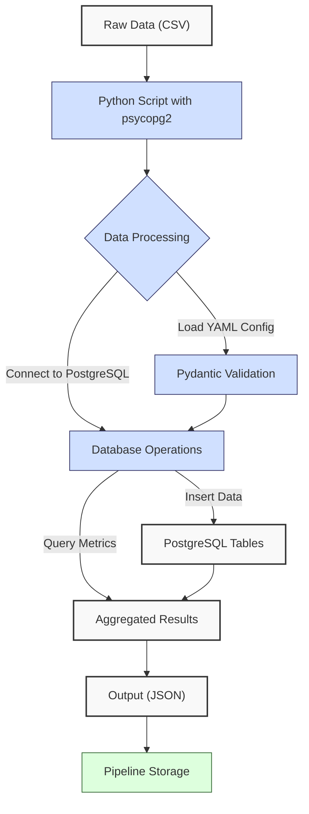
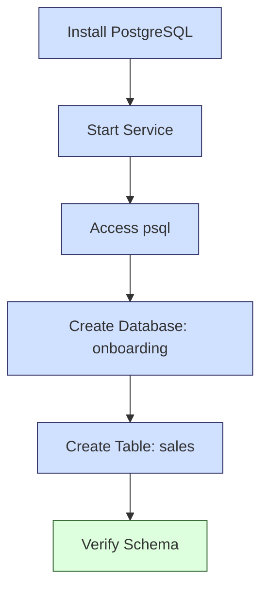
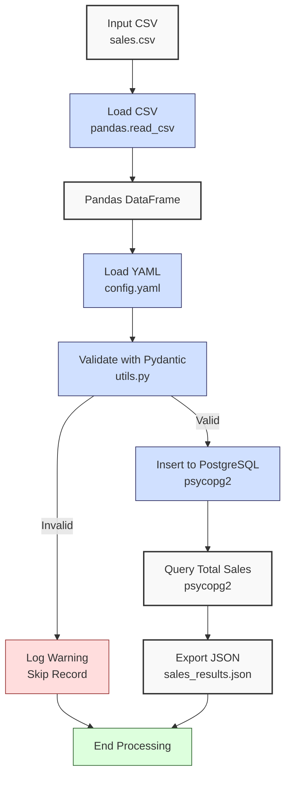

**Complexity: Moderate (M)**

## 17.0 Introduction: Why This Matters for Data Engineering

Integrating Python with PostgreSQL is a cornerstone of data engineering at Hijra Group, enabling programmatic access to production-grade databases for scalable, Sharia-compliant financial transaction analytics. PostgreSQL, a robust open-source RDBMS, handles complex queries and large datasets, while Python’s `psycopg2` library facilitates secure, efficient database interactions. This integration supports dynamic data pipelines, automating tasks like loading sales data, running analytics, and exporting results. Building on Chapter 16 (PostgreSQL Fundamentals), this chapter introduces type-annotated Python code with `psycopg2`, YAML configurations, and Pydantic for validation, ensuring robust, testable pipelines aligned with Hijra Group’s needs.

This chapter uses **type annotations** (introduced in Chapter 7) verified by Pyright, and all code includes **pytest tests** (Chapter 9) for reliability. Error handling with try/except (Chapter 7) is used minimally to manage database connections, focusing on basic operations to avoid complexity not yet covered (e.g., advanced transactions in Chapter 22). All code adheres to **PEP 8’s 4-space indentation**, preferring spaces over tabs to prevent `IndentationError`, ensuring compatibility with Hijra Group’s pipeline scripts. The micro-project builds a type-safe sales data pipeline, loading `data/sales.csv` into a PostgreSQL database, querying metrics, and exporting results, preparing for schema design in Chapter 18.

### Data Engineering Workflow Context

The following diagram illustrates the Python-PostgreSQL integration workflow:



### Building On and Preparing For

- **Building On**:
  - Chapter 1: Uses Python basics (dictionaries, functions) for data handling, extended to database operations.
  - Chapter 2: Leverages YAML parsing (`PyYAML`) and modules (`utils.py`) for configuration and validation.
  - Chapter 3: Uses Pandas for CSV loading, now integrated with PostgreSQL inserts.
  - Chapter 7: Applies type annotations for type-safe code with Pyright.
  - Chapter 9: Incorporates pytest for testing database functions.
  - Chapter 13: Builds on Python-SQLite integration, transitioning to PostgreSQL’s enterprise features.
  - Chapter 16: Uses PostgreSQL basics (schema creation, queries) for table setup.
- **Preparing For**:
  - Chapter 18: Prepares for schema design with entity-relationship diagrams.
  - Chapter 21: Enables advanced PostgreSQL querying (CTEs, window functions).
  - Chapter 23: Supports type-safe database integration with SQLite and PostgreSQL.
  - Chapter 52: Lays groundwork for Django-based web applications with PostgreSQL.

### What You’ll Learn

This chapter covers:

1. **PostgreSQL Setup**: Configuring a local PostgreSQL database.
2. **Psycopg2 Basics**: Connecting to PostgreSQL with type-annotated Python.
3. **Pydantic Validation**: Validating data with type-safe models.
4. **Data Loading**: Inserting CSV data into PostgreSQL tables.
5. **Querying**: Fetching metrics with parameterized queries.
6. **Testing**: Writing pytest tests for database operations.
7. **White-Space Sensitivity and PEP 8**: Using 4-space indentation, preferring spaces over tabs.

By the end, you’ll build a type-safe sales data pipeline that loads `data/sales.csv`, validates with `data/config.yaml`, inserts into a PostgreSQL `sales` table, queries total sales, and exports to JSON, all with comprehensive pytest tests and 4-space indentation per PEP 8. The pipeline uses `data/sales.csv` and `config.yaml` from Appendix 1, ensuring consistency with prior chapters.

**Follow-Along Tips**:

- Install PostgreSQL 15+ and verify: `psql --version`.
- Create `de-onboarding/data/` and populate with `sales.csv`, `config.yaml`, and `sales.db` per Appendix 1.
- Install libraries: `pip install psycopg2-binary pandas pyyaml pydantic pytest pyright`.
- Configure editor for **4-space indentation** per PEP 8 (VS Code: “Editor: Tab Size” = 4, “Editor: Insert Spaces” = true, “Editor: Detect Indentation” = false).
- Use print statements (e.g., `print(df.head())`) to debug DataFrames and `print(cursor.fetchall())` for query results.
- Verify file paths with `ls data/` (Unix/macOS) or `dir data\` (Windows).
- Use UTF-8 encoding to avoid `UnicodeDecodeError`.
- Run `python -tt script.py` to detect tab/space mixing.

## 17.1 PostgreSQL Setup

Set up a local PostgreSQL database to store sales data, creating a `sales` table aligned with `data/sales.csv`. PostgreSQL uses a client-server model, supporting concurrent connections and ACID transactions, ideal for Hijra Group’s transactional analytics.

The following diagram illustrates the setup process:



### 17.1.1 Database Creation

Create a database and table using `psql`.

```bash
# Start PostgreSQL service (example for Ubuntu)
sudo service postgresql start

# Access psql as postgres user
psql -U postgres

# Create database
CREATE DATABASE onboarding;

# Connect to database
\c onboarding

# Create sales table
CREATE TABLE sales (
    id SERIAL PRIMARY KEY,
    product VARCHAR(255) NOT NULL,
    price DECIMAL(10, 2) NOT NULL CHECK (price > 0),
    quantity INTEGER NOT NULL CHECK (quantity > 0)
);

# Verify table creation
\dt
# Expected: Lists "sales" table

# Exit psql
\q
```

**Follow-Along Instructions**:

1. Install PostgreSQL 15+: Follow platform-specific instructions (e.g., `sudo apt install postgresql` on Ubuntu, Homebrew on macOS, or Windows installer).
2. Start PostgreSQL: Verify with `sudo service postgresql status` or equivalent.
3. Run commands in `psql` as shown.
4. **Follow-Along Tip**: Check `psql` configuration with `psql -U postgres -c "SHOW port;"` to verify the port (default: 5432). Update `host` or `port` in scripts if non-standard.
5. **Common Errors**:
   - **psql: command not found**: Ensure PostgreSQL is installed and added to PATH.
   - **FATAL: role "postgres" does not exist**: Create role with `sudo -u postgres createuser --superuser $USER`.
   - **Connection refused**: Verify PostgreSQL is running and `port 5432` is open.
   - **FATAL: database "onboarding" does not exist**: Check permissions with `psql -U postgres -c "\l"`. Grant privileges if needed: `GRANT ALL ON DATABASE onboarding TO user;` or create a new role: `CREATE ROLE user WITH LOGIN PASSWORD 'password';`.

**Key Points**:

- **Schema**: `id` (auto-incrementing primary key), `product` (string), `price` (decimal with 2 places), `quantity` (integer).
- **Constraints**: `NOT NULL` and `CHECK` ensure data integrity.
- **Performance**: `SERIAL` uses a sequence (O(1) for inserts), and `DECIMAL(10, 2)` supports precise financial calculations.

## 17.2 Psycopg2 Basics

`psycopg2` is Python’s PostgreSQL adapter, enabling type-safe database connections and queries. It uses a connection-cursor model, with connections managing transactions and cursors executing SQL.

### 17.2.1 Connecting to PostgreSQL

Connect to the `onboarding` database with type annotations, ensuring an active connection.

```python
from typing import Optional  # For type hints
import psycopg2  # PostgreSQL adapter

def connect_db(dbname: str, user: str, password: str, host: str, port: str) -> Optional[psycopg2.extensions.connection]:
    """Connect to PostgreSQL database."""
    print(f"Connecting to database: {dbname}")  # Debug
    try:
        conn = psycopg2.connect(
            dbname=dbname,
            user=user,
            password=password,
            host=host,
            port=port
        )
        if conn.closed == 0:  # Verify connection is active
            print("Connected successfully")  # Debug
            return conn
        else:
            print("Connection is closed")  # Debug
            conn.close()
            return None
    except psycopg2.OperationalError as e:
        print(f"Connection failed: {e}")  # Log error
        return None
    # Note: Checking conn.closed ensures the connection is active, critical for reliable database operations.
```

**Follow-Along Instructions**:

1. Install `psycopg2`: `pip install psycopg2-binary`.
2. Save as `de-onboarding/db_connect.py`.
3. Configure editor for 4-space indentation per PEP 8.
4. Update `password` if set in PostgreSQL.
5. Run: `python db_connect.py`.
6. **Common Errors**:
   - **ModuleNotFoundError**: Install `psycopg2-binary`.
   - **OperationalError**: Verify database name, user, password, host, port. Print connection parameters. For timeouts, check network connectivity or set `connect_timeout=10` in `psycopg2.connect`.
   - **IndentationError**: Use 4 spaces (not tabs). Run `python -tt db_connect.py`.

**Key Points**:

- **Type Annotations**: `Optional[psycopg2.extensions.connection]` indicates possible `None` return.
- **Connection**: Uses TCP/IP (default `localhost:5432`).
- **Performance**:
  - **Time Complexity**: O(1) for connection setup.
  - **Space Complexity**: O(1) for connection object.
- **Implication**: Secure connections are critical for Hijra Group’s data pipelines.

### 17.2.2 Executing Queries

Use cursors for parameterized queries to prevent SQL injection.

```python
from typing import List, Tuple  # For type hints
import psycopg2  # PostgreSQL adapter

def fetch_sales(conn: psycopg2.extensions.connection) -> List[Tuple[int, str, float, int]]:
    """Fetch all sales records."""
    cursor = conn.cursor()  # Create cursor
    cursor.execute("SELECT id, product, price, quantity FROM sales")  # Execute query
    results = cursor.fetchall()  # Fetch results
    cursor.close()  # Close cursor
    print(f"Fetched {len(results)} records")  # Debug
    return results  # Return list of tuples

# Example usage
if __name__ == "__main__":
    try:
        conn = connect_db("onboarding", "postgres", "", "localhost", "5432")
        if conn:
            sales = fetch_sales(conn)
            print("Sales:", sales)  # Debug
            conn.close()
    except psycopg2.Error as e:
        print(f"Query error: {e}")  # Debug
    # Note: This example simplifies error handling for clarity; production code (e.g., micro-project) includes robust try/except.
```

**Follow-Along Instructions**:

1. Save as `de-onboarding/db_query.py`.
2. Configure editor for 4-space indentation per PEP 8.
3. Run: `python db_query.py`.
4. **Common Errors**:
   - **ProgrammingError**: Verify table exists with `psql -U postgres -d onboarding -c "\dt"`.
   - **IndentationError**: Use 4 spaces (not tabs).

**Key Points**:

- **Parameterized Queries**: Use `%s` placeholders for safety (e.g., `cursor.execute("SELECT * FROM sales WHERE product = %s", (product,))`).
- **Type Annotations**: `List[Tuple[int, str, float, int]]` matches query schema.
- **Performance**:
  - **Time Complexity**: O(n) for fetching n rows.
  - **Space Complexity**: O(n) for result list.
  - **Note**: Query performance depends on table size and indexing (Chapter 22). Run `EXPLAIN SELECT SUM(price * quantity) FROM sales` in `psql` to inspect query plans.

## 17.3 Pydantic Validation

Pydantic ensures type-safe data validation, critical for pipeline reliability. It validates data against models, catching errors early. Pydantic handles type and constraint validation (e.g., positive numbers), while manual checks in the pipeline enforce config-specific rules (e.g., Halal prefix, maximum decimals).

**Follow-Along Tips**:

- To debug validation errors, print the model’s data with `pydantic_model.dict()` and schema with `pydantic_model.__fields__` to inspect field types and constraints.
- To verify type annotations, install `pyright` (`pip install pyright`) and run `pyright pydantic_model.py` to check for type errors.

### 17.3.1 Defining a Sales Model

Create a Pydantic model for sales data.

```python
from pydantic import BaseModel, PositiveFloat, PositiveInt  # Pydantic types
from typing import Optional  # For optional fields

class Sale(BaseModel):
    """Pydantic model for sales data."""
    product: str
    price: PositiveFloat
    quantity: PositiveInt
    id: Optional[int] = None  # Optional for database ID

# Example usage
if __name__ == "__main__":
    sale = Sale(product="Halal Laptop", price=999.99, quantity=2)
    print("Valid sale:", sale)  # Debug
    # Invalid example
    try:
        Sale(product="Halal Mouse", price=-24.99, quantity=10)
    except ValueError as e:
        print("Validation error:", e)  # Debug
```

**Follow-Along Instructions**:

1. Install Pydantic: `pip install pydantic`.
2. Save as `de-onboarding/pydantic_model.py`.
3. Configure editor for 4-space indentation per PEP 8.
4. Run: `python pydantic_model.py`.
5. **Common Errors**:
   - **ModuleNotFoundError**: Install `pydantic`.
   - **ValidationError**: Print input data to debug.

**Key Points**:

- **Validation**: `PositiveFloat` and `PositiveInt` enforce constraints.
- **Type Safety**: Integrates with Pyright for static checking.
- **Performance**:
  - **Time Complexity**: O(1) per record validation.
  - **Space Complexity**: O(1) per model instance.

## 17.4 Micro-Project: Type-Safe Sales Data Pipeline

### Project Requirements

Build a type-safe Python pipeline to process `data/sales.csv`, validate with `data/config.yaml`, load into a PostgreSQL `sales` table, query total sales, and export to `data/sales_results.json`. The pipeline supports Hijra Group’s transaction analytics, ensuring data integrity with Pydantic and testing with pytest. The Halal prefix validation ensures Sharia compliance per Islamic Financial Services Board (IFSB) standards, critical for Hijra Group’s fintech operations.

- **Load**: Read `sales.csv` with Pandas and `config.yaml` with PyYAML.
- **Validate**: Use Pydantic and `utils.py` to enforce Halal prefix, positive price/quantity, and config rules.
- **Insert**: Load valid records into PostgreSQL `sales` table.
- **Query**: Compute total sales (price \* quantity).
- **Export**: Save results to `data/sales_results.json`.
- **Test**: Write pytest tests for database operations.
- **Indentation**: Use 4-space indentation per PEP 8, preferring spaces over tabs.

### Sample Input Files

`data/sales.csv` (from Appendix 1):

```csv
product,price,quantity
Halal Laptop,999.99,2
Halal Mouse,24.99,10
Halal Keyboard,49.99,5
,29.99,3
Monitor,invalid,2
Headphones,5.00,150
```

`data/config.yaml` (from Appendix 1):

```yaml
min_price: 10.0
max_quantity: 100
required_fields:
  - product
  - price
  - quantity
product_prefix: 'Halal'
max_decimals: 2
```

`data/invalid.csv` (from Appendix 1, for testing):

```csv
name,price,quantity
Halal Laptop,999.99,2
```

### Data Processing Flow



### Acceptance Criteria

- **Go Criteria**:
  - Loads `sales.csv` and `config.yaml` correctly.
  - Validates records with Pydantic for Halal prefix, positive price/quantity, and config rules.
  - Inserts valid records into PostgreSQL `sales` table.
  - Queries total sales correctly.
  - Exports results to `data/sales_results.json`.
  - Includes pytest tests for database operations.
  - Uses type annotations verified by Pyright.
  - Uses 4-space indentation per PEP 8, preferring spaces over tabs.
- **No-Go Criteria**:
  - Fails to connect to PostgreSQL or load files.
  - Incorrect validation or calculations.
  - Missing JSON export or tests.
  - Inconsistent indentation or tab/space mixing.

### Common Pitfalls to Avoid

1. **Connection Errors**:
   - **Problem**: `OperationalError` due to wrong credentials.
   - **Solution**: Verify `dbname`, `user`, `password`, `host`, `port`. Print connection parameters.
2. **Validation Errors**:
   - **Problem**: Pydantic rejects valid data.
   - **Solution**: Print input data and model schema.
3. **SQL Injection**:
   - **Problem**: Unsafe queries.
   - **Solution**: Use parameterized queries with `%s`.
4. **Type Mismatches**:
   - **Problem**: Non-numeric prices cause errors.
   - **Solution**: Use `utils.is_numeric_value`. Print `df.dtypes`.
5. **IndentationError**:
   - **Problem**: Mixed spaces/tabs.
   - **Solution**: Use 4 spaces per PEP 8. Run `python -tt sales_pipeline.py`.
6. **Table Not Found**:
   - **Problem**: `ProgrammingError` due to missing `sales` table.
   - **Solution**: Verify table with `psql -U postgres -d onboarding -c "\dt"`.
7. **Negative Price Validation**:
   - **Problem**: Negative prices pass initial checks in `utils.is_numeric`.
   - **Solution**: Ensure `is_numeric` rejects negative numbers, and rely on Pydantic’s `PositiveFloat` for final validation. Print `row["price"]` to debug.
8. **Transaction Management**:
   - **Problem**: Partial inserts occur if `conn.commit()` is missed.
   - **Solution**: Always call `conn.commit()` after inserts or `conn.rollback()` on failure. Print `conn.get_transaction_status()` to debug (e.g., `0` for idle, `1` for active).

### How This Differs from Production

In production, this pipeline would include:

- **Connection Pooling**: Use `psycopg2.pool` for scalability (Chapter 23), reducing overhead in high-concurrency scenarios where multiple clients access the database simultaneously.
- **Error Handling**: Comprehensive try/except with logging (Chapter 52).
- **Testing**: Integration tests with Hypothesis (Chapter 43).
- **Security**: Encrypted credentials and PII masking (Chapter 65).
- **Scalability**: Batch inserts for large datasets (Chapter 40).

### Implementation

```python
# File: de-onboarding/utils.py (updated from Chapter 3)
def is_numeric(s: str, max_decimals: int = 2) -> bool:  # Check if string is a decimal number
    """Check if string is a decimal number with up to max_decimals."""
    parts = s.split(".")  # Split on decimal point
    if len(parts) != 2 or not parts[0].isdigit() or not parts[1].isdigit():
        return False  # Invalid format (rejects negative numbers)
    return len(parts[1]) <= max_decimals  # Check decimal places

def clean_string(s: str) -> str:  # Clean string by stripping whitespace
    """Strip whitespace from string."""
    return s.strip()

def is_numeric_value(x: object) -> bool:  # Check if value is numeric
    """Check if value is an integer or float."""
    return isinstance(x, (int, float))  # Return True for numeric types

def has_valid_decimals(x: float, max_decimals: int) -> bool:  # Check decimal places
    """Check if value has valid decimal places."""
    return is_numeric(str(x), max_decimals)  # Use is_numeric for validation

def apply_valid_decimals(x: float, max_decimals: int) -> bool:  # Apply decimal validation
    """Apply has_valid_decimals to a value."""
    return has_valid_decimals(x, max_decimals)

def is_integer(x: object) -> bool:  # Check if value is an integer
    """Check if value is an integer when converted to string."""
    return str(x).isdigit()  # Return True for integer strings
```

```python
# File: de-onboarding/sales_pipeline.py
from typing import Dict, List, Optional, Tuple  # For type hints
import pandas as pd  # For DataFrame operations
import yaml  # For YAML parsing
import json  # For JSON export
import psycopg2  # PostgreSQL adapter
from pydantic import BaseModel, PositiveFloat, PositiveInt  # Pydantic validation
import utils  # Custom utilities

# Pydantic model for sales data
class Sale(BaseModel):
    """Pydantic model for sales data."""
    product: str
    price: PositiveFloat
    quantity: PositiveInt
    id: Optional[int] = None  # Optional for database ID

# Read YAML configuration
def read_config(config_path: str) -> Dict:
    """Read YAML configuration."""
    print(f"Opening config: {config_path}")  # Debug
    with open(config_path, "r") as file:
        config = yaml.safe_load(file)
    print(f"Loaded config: {config}")  # Debug
    return config

# Connect to PostgreSQL
def connect_db(dbname: str, user: str, password: str, host: str, port: str) -> Optional[psycopg2.extensions.connection]:
    """Connect to PostgreSQL database."""
    print(f"Connecting to database: {dbname}")  # Debug
    try:
        conn = psycopg2.connect(
            dbname=dbname,
            user=user,
            password=password,
            host=host,
            port=port
        )
        if conn.closed == 0:  # Verify connection is active
            print("Connected successfully")  # Debug
            return conn
        else:
            print("Connection is closed")  # Debug
            conn.close()
            return None
    except psycopg2.OperationalError as e:
        print(f"Connection failed: {e}")  # Log error
        return None

# Load and validate sales data
def load_and_validate_sales(csv_path: str, config: Dict) -> Tuple[List[Sale], int, int]:
    """Load sales CSV and validate with Pydantic."""
    print(f"Loading CSV: {csv_path}")  # Debug
    df = pd.read_csv(csv_path)  # Load CSV
    print("Initial DataFrame:")  # Debug
    print(df.head())

    required_fields = config["required_fields"]
    missing_fields = [f for f in required_fields if f not in df.columns]
    if missing_fields:
        print(f"Missing columns: {missing_fields}")  # Log error
        return [], 0, len(df)

    valid_sales: List[Sale] = []
    for _, row in df.iterrows():
        try:
            # Clean and validate data
            product = str(row["product"]) if pd.notna(row["product"]) else ""
            price = float(row["price"]) if pd.notna(row["price"]) else 0.0
            quantity = int(row["quantity"]) if pd.notna(row["quantity"]) and utils.is_integer(row["quantity"]) else 0

            if not product.startswith(config["product_prefix"]):
                print(f"Invalid sale: product lacks '{config['product_prefix']}' prefix: {row.to_dict()}")  # Log
                continue
            if price < config["min_price"] or price <= 0:
                print(f"Invalid sale: price too low or negative: {row.to_dict()}")  # Log
                continue
            if quantity > config["max_quantity"]:
                print(f"Invalid sale: quantity too high: {row.to_dict()}")  # Log
                continue
            if not utils.apply_valid_decimals(price, config["max_decimals"]):
                print(f"Invalid sale: too many decimals: {row.to_dict()}")  # Log
                continue

            sale = Sale(product=product, price=price, quantity=quantity)
            valid_sales.append(sale)
        except (ValueError, TypeError) as e:
            print(f"Invalid sale: {row.to_dict()}, error: {e}")  # Log
            continue

    total_records = len(df)
    print(f"Validated {len(valid_sales)} sales")  # Debug
    return valid_sales, len(valid_sales), total_records

# Insert sales into PostgreSQL
def insert_sales(conn: psycopg2.extensions.connection, sales: List[Sale]) -> int:
    """Insert valid sales into PostgreSQL."""
    if not sales:
        print("No sales to insert")  # Log
        return 0

    cursor = conn.cursor()
    inserted = 0
    for sale in sales:
        try:
            cursor.execute(
                "INSERT INTO sales (product, price, quantity) VALUES (%s, %s, %s) RETURNING id",
                (sale.product, sale.price, sale.quantity)
            )
            sale.id = cursor.fetchone()[0]  # Update ID
            inserted += 1
        except psycopg2.Error as e:
            print(f"Insert failed: {sale}, error: {e}")  # Log
            conn.rollback()
            continue
    conn.commit()
    cursor.close()
    print(f"Inserted {inserted} sales")  # Debug
    return inserted

# Query total sales
def query_total_sales(conn: psycopg2.extensions.connection) -> float:
    """Query total sales amount."""
    cursor = conn.cursor()
    cursor.execute("SELECT SUM(price * quantity) FROM sales")
    total = cursor.fetchone()[0] or 0.0
    cursor.close()
    print(f"Total sales: {total}")  # Debug
    return float(total)

# Export results
def export_results(results: Dict, json_path: str) -> None:
    """Export results to JSON."""
    print(f"Writing to: {json_path}")  # Debug
    with open(json_path, "w") as file:
        json.dump(results, file, indent=2)
    print(f"Exported results to {json_path}")  # Confirm

# Main function
def main() -> None:
    """Main function to process sales data."""
    csv_path = "data/sales.csv"
    config_path = "data/config.yaml"
    json_path = "data/sales_results.json"

    config = read_config(config_path)
    sales, valid_sales, total_records = load_and_validate_sales(csv_path, config)

    conn = connect_db("onboarding", "postgres", "", "localhost", "5432")
    if not conn:
        print("Exiting due to connection failure")
        return

    try:
        inserted = insert_sales(conn, sales)
        total_sales = query_total_sales(conn)
        results = {
            "total_sales": total_sales,
            "valid_sales": valid_sales,
            "invalid_sales": total_records - valid_sales,
            "inserted_sales": inserted
        }
        export_results(results, json_path)

        print("\nSales Report:")
        print(f"Total Records Processed: {total_records}")
        print(f"Valid Sales: {valid_sales}")
        print(f"Invalid Sales: {total_records - valid_sales}")
        print(f"Inserted Sales: {inserted}")
        print(f"Total Sales: ${round(total_sales, 2)}")
        print("Processing completed")
    finally:
        conn.close()
        print("Connection closed")

if __name__ == "__main__":
    main()
```

```python
# File: de-onboarding/test_sales_pipeline.py
from typing import List
import pytest
import psycopg2
from sales_pipeline import connect_db, insert_sales, query_total_sales, load_and_validate_sales, Sale

@pytest.fixture
def db_conn():
    """Fixture for database connection."""
    conn = connect_db("onboarding", "postgres", "", "localhost", "5432")
    yield conn
    if conn:
        cursor = conn.cursor()
        cursor.execute("DELETE FROM sales")  # Clean up; commit ensures changes persist
        conn.commit()
        cursor.close()
        conn.close()

def test_insert_and_query_sales(db_conn):
    """Test inserting and querying sales."""
    sales = [
        Sale(product="Halal Laptop", price=999.99, quantity=2),
        Sale(product="Halal Mouse", price=24.99, quantity=10)
    ]
    inserted = insert_sales(db_conn, sales)
    assert inserted == 2, f"Expected 2 inserted, got {inserted}"

    total_sales = query_total_sales(db_conn)
    expected = 999.99 * 2 + 24.99 * 10
    assert abs(total_sales - expected) < 0.01, f"Expected {expected}, got {total_sales}"

def test_empty_sales(db_conn):
    """Test inserting empty sales list."""
    inserted = insert_sales(db_conn, [])
    assert inserted == 0, f"Expected 0 inserted, got {inserted}"
    total_sales = query_total_sales(db_conn)
    assert total_sales == 0.0, f"Expected 0.0, got {total_sales}"

def test_missing_table():
    """Test inserting with missing table."""
    conn = connect_db("onboarding", "postgres", "", "localhost", "5432")
    if not conn:
        pytest.skip("No database connection")
    cursor = conn.cursor()
    cursor.execute("DROP TABLE IF EXISTS sales")
    conn.commit()
    sales = [Sale(product="Halal Laptop", price=999.99, quantity=2)]
    with pytest.raises(psycopg2.ProgrammingError, match="relation \"sales\" does not exist"):
        insert_sales(conn, sales)
    conn.close()

def test_invalid_data():
    """Test validation of invalid sales data from file."""
    config = {
        "min_price": 10.0,
        "max_quantity": 100,
        "required_fields": ["product", "price", "quantity"],
        "product_prefix": "Halal",
        "max_decimals": 2
    }
    sales, valid_sales, total_records = load_and_validate_sales("data/invalid.csv", config)
    assert valid_sales == 1, f"Expected 1 valid sale, got {valid_sales}"
    assert total_records == 2, f"Expected 2 total records, got {total_records}"
```

### Expected Outputs

`data/sales_results.json`:

```json
{
  "total_sales": 2499.83,
  "valid_sales": 3,
  "invalid_sales": 3,
  "inserted_sales": 3
}
```

**Console Output** (abridged):

```
Opening config: data/config.yaml
Loaded config: {'min_price': 10.0, 'max_quantity': 100, 'required_fields': ['product', 'price', 'quantity'], 'product_prefix': 'Halal', 'max_decimals': 2}
Loading CSV: data/sales.csv
Initial DataFrame:
          product   price  quantity
0   Halal Laptop  999.99         2
1    Halal Mouse   24.99        10
2  Halal Keyboard   49.99         5
3            NaN   29.99         3
4       Monitor      NaN         2
Invalid sale: product lacks 'Halal' prefix: {'product': nan, 'price': 29.99, 'quantity': 3}
Invalid sale: {'product': 'Monitor', 'price': nan, 'quantity': 2}, error: value is not a valid float
Invalid sale: quantity too high: {'product': 'Headphones', 'price': 5.0, 'quantity': 150}
Validated 3 sales
Connecting to database: onboarding
Connected successfully
Inserted 3 sales
Total sales: 2499.83
Writing to: data/sales_results.json
Exported results to data/sales_results.json

Sales Report:
Total Records Processed: 6
Valid Sales: 3
Invalid Sales: 3
Inserted Sales: 3
Total Sales: $2499.83
Processing completed
Connection closed
```

**Test Output**:

```
pytest test_sales_pipeline.py -v
# Expected: 4 passed tests
```

### How to Run and Test

1. **Setup**:

   - **Checklist**:
     - [ ] Install PostgreSQL 15+ and verify: `psql --version`.
     - [ ] Create `onboarding` database and `sales` table per Section 17.1.1.
     - [ ] Create `de-onboarding/data/` and populate with `sales.csv`, `config.yaml`, `sales.db`, and `invalid.csv` per Appendix 1.
     - [ ] Install libraries: `pip install psycopg2-binary pandas pyyaml pydantic pytest pyright`.
     - [ ] Create virtual environment: `python -m venv venv`, activate (Windows: `venv\Scripts\activate`, Unix: `source venv/bin/activate`).
     - [ ] Verify Python 3.10+: `python --version`.
     - [ ] Configure editor for 4-space indentation per PEP 8.
     - [ ] Save `utils.py`, `sales_pipeline.py`, and `test_sales_pipeline.py` in `de-onboarding/`.
   - **Tips**:
     - To activate the virtual environment, run `source venv/bin/activate` (Unix/macOS) or `venv\Scripts\activate` (Windows). If `pip` fails, upgrade it: `python -m pip install --upgrade pip`.
   - **Troubleshooting**:
     - **FileNotFoundError**: Ensure `sales.csv`, `config.yaml`, `sales.db`, and `invalid.csv` exist. Print paths.
     - **OperationalError**: Verify PostgreSQL credentials and table existence.
     - **yaml.YAMLError**: Print `open(config_path).read()` to check syntax.
     - **IndentationError**: Use 4 spaces. Run `python -tt sales_pipeline.py`.

2. **Run**:

   - Open terminal in `de-onboarding/`.
   - Run: `python sales_pipeline.py`.
   - Outputs: `data/sales_results.json`, console logs.

3. **Test**:

   - Run: `pytest test_sales_pipeline.py -v`.
   - Verify 4 tests pass.
   - **Test Scenarios**:
     - **Valid Data**: Inserts 2 sales, queries correct total.
     - **Empty Data**: Handles empty list with zero inserted and total.
     - **Missing Table**: Raises `ProgrammingError` for robustness.
     - **Invalid Data**: Validates Pydantic rejects invalid data from `invalid.csv`.

## 17.5 Practice Exercises

### Exercise 1: Database Connection

Write a type-annotated function to connect to PostgreSQL and return a connection object, with 4-space indentation per PEP 8.

**Expected Output**:

```
Connected to onboarding
Connection object created
```

**Follow-Along Instructions**:

1. Save as `de-onboarding/ex1_connect.py`.
2. Configure editor for 4-space indentation.
3. Run: `python ex1_connect.py`.
4. **How to Test**:
   - Verify connection object is not None.
   - Test with invalid credentials: Should return None.

### Exercise 2: Insert Sales

Write a type-annotated function to insert a list of Pydantic `Sale` objects into the `sales` table, with 4-space indentation.

**Sample Input**:

```python
sales = [Sale(product="Halal Laptop", price=999.99, quantity=2)]
```

**Expected Output**:

```
Inserted 1 sales
```

**Follow-Along Instructions**:

1. Save as `de-onboarding/ex2_insert.py`.
2. Configure editor for 4-space indentation.
3. Run: `python ex2_insert.py`.
4. **How to Test**:
   - Verify 1 sale inserted.
   - Test with empty list: Should return 0.

### Exercise 3: Query Average Price

Write a type-annotated function to query the average price of sales, with 4-space indentation.

**Expected Output** (after inserting sample data):

```
Average price: 358.3233333333333
```

**Follow-Along Instructions**:

1. Save as `de-onboarding/ex3_query.py`.
2. Configure editor for 4-space indentation.
3. Run: `python ex3_query.py`.
4. **How to Test**:
   - Verify correct average after inserting data.
   - Test with empty table: Should return 0.0.

### Exercise 4: Pydantic Validation

Write a function to validate sales data with Pydantic and log invalid records, with 4-space indentation.

**Sample Input**:

```python
data = [
    {"product": "Halal Mouse", "price": 24.99, "quantity": 10},
    {"product": "Monitor", "price": 199.99, "quantity": 2}
]
```

**Expected Output**:

```
Valid sales: 1
Invalid sale: product lacks 'Halal' prefix: {'product': 'Monitor', 'price': 199.99, 'quantity': 2}
```

**Follow-Along Instructions**:

1. Save as `de-onboarding/ex4_validate.py`.
2. Configure editor for 4-space indentation.
3. Run: `python ex4_validate.py`.
4. **How to Test**:
   - Verify 1 valid sale.
   - Test with invalid data: Should log errors.

### Exercise 5: Debug a Connection Bug

Fix this buggy code that fails to close the connection, causing resource leaks, with 4-space indentation.

**Buggy Code**:

```python
import psycopg2
def connect_and_query():
    conn = psycopg2.connect(dbname="onboarding", user="postgres", password="", host="localhost", port="5432")
    cursor = conn.cursor()
    cursor.execute("SELECT COUNT(*) FROM sales")
    count = cursor.fetchone()[0]
    cursor.close()
    return count
```

**Expected Output**:

```
Sales count: 0
Connection closed
```

**Follow-Along Instructions**:

1. Save as `de-onboarding/ex5_debug.py`.
2. Configure editor for 4-space indentation.
3. Run: `python ex5_debug.py` to see issue.
4. Fix and re-run.
5. **How to Test**:
   - Verify connection closes.
   - Test with multiple runs: Should not leak connections.

### Exercise 6: SQLite vs. PostgreSQL Performance Analysis

Write a function to insert a sale into PostgreSQL, query total sales and grouped sales from both SQLite (`data/sales.db`) and PostgreSQL, compare execution times, handle connection errors, and explain why PostgreSQL is preferred for Hijra Group’s analytics, saving results to `ex6_concepts.txt`, with 4-space indentation.

**Sample Input**:

```python
sale = Sale(product="Halal Keyboard", price=49.99, quantity=5)
```

**Expected Output**:

```
Inserted sale: Halal Keyboard
PostgreSQL total query time: 0.002s
SQLite total query time: 0.001s
PostgreSQL grouped query time: 0.003s
SQLite grouped query time: 0.002s
Results saved to ex6_concepts.txt
```

**File Output** (`ex6_concepts.txt`):

```
PostgreSQL total query time: 0.002s
SQLite total query time: 0.001s
PostgreSQL grouped query time: 0.003s
SQLite grouped query time: 0.002s
Explanation: PostgreSQL is preferred over SQLite for Hijra Group’s analytics because it supports concurrent connections, advanced querying (e.g., CTEs), and enterprise features like replication, making it scalable for large transaction datasets. SQLite, while simple, is limited to single-user access and lacks these features. Grouped queries benefit from PostgreSQL’s optimization for complex analytics.
```

**Follow-Along Instructions**:

1. Save as `de-onboarding/ex6_analysis.py`.
2. Ensure `data/sales.db` exists per Appendix 1.
3. Configure editor for 4-space indentation.
4. Run: `python ex6_analysis.py`.
5. **How to Test**:
   - Verify sale is inserted, queries execute, and `ex6_concepts.txt` contains times and explanation.
   - Test with invalid sale: Should log validation error.
   - Test with missing `sales.db`: Should log “SQLite connection failed” to `ex6_concepts.txt`.

## 17.6 Exercise Solutions

### Solution to Exercise 1: Database Connection

```python
from typing import Optional
import psycopg2

def connect_db(dbname: str, user: str, password: str, host: str, port: str) -> Optional[psycopg2.extensions.connection]:
    """Connect to PostgreSQL database."""
    print(f"Connecting to database: {dbname}")
    try:
        conn = psycopg2.connect(dbname=dbname, user=user, password=password, host=host, port=port)
        if conn.closed == 0:
            print("Connection object created")
            return conn
        else:
            print("Connection is closed")
            conn.close()
            return None
    except psycopg2.OperationalError as e:
        print(f"Connection failed: {e}")
        return None

# Test
if __name__ == "__main__":
    try:
        conn = connect_db("onboarding", "postgres", "", "localhost", "5432")
        if conn:
            conn.close()
    except psycopg2.Error as e:
        print(f"Connection error: {e}")
```

### Solution to Exercise 2: Insert Sales

```python
from typing import List
import psycopg2
from pydantic import BaseModel, PositiveFloat, PositiveInt

class Sale(BaseModel):
    product: str
    price: PositiveFloat
    quantity: PositiveInt

def insert_sales(conn: psycopg2.extensions.connection, sales: List[Sale]) -> int:
    """Insert sales into PostgreSQL."""
    cursor = conn.cursor()
    inserted = 0
    for sale in sales:
        cursor.execute(
            "INSERT INTO sales (product, price, quantity) VALUES (%s, %s, %s)",
            (sale.product, sale.price, sale.quantity)
        )
        inserted += 1
    conn.commit()
    cursor.close()
    print(f"Inserted {inserted} sales")
    return inserted

# Test
if __name__ == "__main__":
    conn = connect_db("onboarding", "postgres", "", "localhost", "5432")
    sales = [Sale(product="Halal Laptop", price=999.99, quantity=2)]
    insert_sales(conn, sales)
    conn.close()
```

### Solution to Exercise 3: Query Average Price

```python
import psycopg2

def query_avg_price(conn: psycopg2.extensions.connection) -> float:
    """Query average price of sales."""
    cursor = conn.cursor()
    cursor.execute("SELECT AVG(price) FROM sales")
    avg_price = cursor.fetchone()[0] or 0.0
    cursor.close()
    print(f"Average price: {avg_price}")
    return float(avg_price)

# Test
if __name__ == "__main__":
    conn = connect_db("onboarding", "postgres", "", "localhost", "5432")
    avg_price = query_avg_price(conn)
    conn.close()
```

### Solution to Exercise 4: Pydantic Validation

```python
from typing import List, Dict
from pydantic import BaseModel, PositiveFloat, PositiveInt, ValidationError

class Sale(BaseModel):
    product: str
    price: PositiveFloat
    quantity: PositiveInt

def validate_sales(data: List[Dict], prefix: str) -> List[Sale]:
    """Validate sales data with Pydantic."""
    valid_sales = []
    for item in data:
        try:
            if not item["product"].startswith(prefix):
                print(f"Invalid sale: product lacks '{prefix}' prefix: {item}")
                continue
            sale = Sale(**item)
            valid_sales.append(sale)
        except ValidationError as e:
            print(f"Invalid sale: {item}, error: {e}")
            continue
    print(f"Valid sales: {len(valid_sales)}")
    return valid_sales

# Test
if __name__ == "__main__":
    data = [
        {"product": "Halal Mouse", "price": 24.99, "quantity": 10},
        {"product": "Monitor", "price": 199.99, "quantity": 2}
    ]
    valid_sales = validate_sales(data, "Halal")
```

### Solution to Exercise 5: Debug a Connection Bug

```python
import psycopg2

def connect_and_query() -> int:
    """Query sales count and close connection."""
    conn = psycopg2.connect(dbname="onboarding", user="postgres", password="", host="localhost", port="5432")
    try:
        cursor = conn.cursor()
        cursor.execute("SELECT COUNT(*) FROM sales")
        count = cursor.fetchone()[0]
        cursor.close()
        print(f"Sales count: {count}")
        return count
    finally:
        conn.close()
        print("Connection closed")

# Test
if __name__ == "__main__":
    count = connect_and_query()
```

**Explanation**:

- **Bug**: Missing `conn.close()` caused resource leaks.
- **Fix**: Added `try-finally` to ensure connection closure.

### Solution to Exercise 6: SQLite vs. PostgreSQL Performance Analysis

```python
import psycopg2
import sqlite3
import time
from pydantic import BaseModel, PositiveFloat, PositiveInt

class Sale(BaseModel):
    product: str
    price: PositiveFloat
    quantity: PositiveInt

def compare_db_performance(pg_conn: psycopg2.extensions.connection, sqlite_db: str, sale: Sale, output_path: str) -> None:
    """Insert sale into PostgreSQL, compare query performance, and save analysis."""
    results = []

    # Insert into PostgreSQL
    try:
        cursor = pg_conn.cursor()
        cursor.execute(
            "INSERT INTO sales (product, price, quantity) VALUES (%s, %s, %s)",
            (sale.product, sale.price, sale.quantity)
        )
        pg_conn.commit()
        cursor.close()
        results.append(f"Inserted sale: {sale.product}")
    except psycopg2.Error as e:
        results.append(f"PostgreSQL insert failed: {e}")
        with open(output_path, "w") as file:
            file.write("\n".join(results))
        return

    # Query PostgreSQL: Total sales
    pg_total_time = 0.0
    try:
        start_time = time.time()
        cursor = pg_conn.cursor()
        cursor.execute("SELECT SUM(price * quantity) FROM sales")
        pg_total = cursor.fetchone()[0] or 0.0
        pg_total_time = time.time() - start_time
        cursor.close()
        results.append(f"PostgreSQL total query time: {pg_total_time:.3f}s")
    except psycopg2.Error as e:
        results.append(f"PostgreSQL total query failed: {e}")

    # Query PostgreSQL: Grouped sales
    pg_grouped_time = 0.0
    try:
        start_time = time.time()
        cursor = pg_conn.cursor()
        cursor.execute("SELECT product, SUM(price * quantity) FROM sales GROUP BY product")
        pg_grouped = cursor.fetchall()
        pg_grouped_time = time.time() - start_time
        cursor.close()
        results.append(f"PostgreSQL grouped query time: {pg_grouped_time:.3f}s")
    except psycopg2.Error as e:
        results.append(f"PostgreSQL grouped query failed: {e}")

    # Query SQLite: Total sales
    sqlite_total_time = 0.0
    try:
        sqlite_conn = sqlite3.connect(sqlite_db)
        start_time = time.time()
        cursor = sqlite_conn.cursor()
        cursor.execute("SELECT SUM(price * quantity) FROM sales")
        sqlite_total = cursor.fetchone()[0] or 0.0
        sqlite_total_time = time.time() - start_time
        cursor.close()
        results.append(f"SQLite total query time: {sqlite_total_time:.3f}s")
    except sqlite3.Error as e:
        results.append(f"SQLite connection failed: {e}")

    # Query SQLite: Grouped sales
    sqlite_grouped_time = 0.0
    try:
        start_time = time.time()
        cursor = sqlite_conn.cursor()
        cursor.execute("SELECT product, SUM(price * quantity) FROM sales GROUP BY product")
        sqlite_grouped = cursor.fetchall()
        sqlite_grouped_time = time.time() - start_time
        cursor.close()
        results.append(f"SQLite grouped query time: {sqlite_grouped_time:.3f}s")
    except sqlite3.Error as e:
        results.append(f"SQLite grouped query failed: {e}")
    finally:
        sqlite_conn.close()

    # Save results
    explanation = (
        "\nExplanation: PostgreSQL is preferred over SQLite for Hijra Group’s analytics because it supports "
        "concurrent connections, advanced querying (e.g., CTEs), and enterprise features like replication, "
        "making it scalable for large transaction datasets. SQLite, while simple, is limited to single-user "
        "access and lacks these features. Grouped queries benefit from PostgreSQL’s optimization for complex analytics."
    )
    with open(output_path, "w") as file:
        file.write("\n".join(results) + explanation)
    for line in results:
        print(line)
    print(f"Results saved to {output_path}")

# Test
if __name__ == "__main__":
    pg_conn = connect_db("onboarding", "postgres", "", "localhost", "5432")
    sale = Sale(product="Halal Keyboard", price=49.99, quantity=5)
    compare_db_performance(pg_conn, "data/sales.db", sale, "ex6_concepts.txt")
    pg_conn.close()
```

## 17.7 Chapter Summary and Connection to Chapter 18

In this chapter, you’ve mastered:

- **PostgreSQL Setup**: Creating databases and tables for sales data, with proper configuration.
- **Psycopg2**: Type-safe connections and parameterized queries (O(n) for n rows), with robust error handling.
- **Pydantic**: Type-safe validation for pipeline reliability, verified with Pyright.
- **Pipeline**: Loading, validating, inserting, querying, and exporting sales data, ensuring Sharia compliance.
- **Testing**: Pytest for database operations, including edge cases like missing tables and invalid data.
- **White-Space Sensitivity and PEP 8**: Using 4-space indentation, preferring spaces over tabs.

The micro-project built a type-safe pipeline that processes `data/sales.csv`, validates with Pydantic for Sharia compliance, loads into PostgreSQL, queries total sales, and exports to JSON, with pytest tests ensuring reliability. The modular design (e.g., `insert_sales`, `query_total_sales`) prepares for schema design in Chapter 18, where functions can be adapted to handle normalized tables. The `sales` table’s `SERIAL PRIMARY KEY` creates an implicit index, laying groundwork for indexing concepts in Chapter 22.

### Connection to Chapter 18

Chapter 18 (Checkpoint 3A: Database Fundamentals I Review) consolidates SQL, SQLite, PostgreSQL, and type-safe programming:

- **Schema Design**: Extends `sales` table to normalized schemas with entity-relationship diagrams.
- **Data Loading**: Builds on CSV-to-PostgreSQL loading for multi-table pipelines.
- **Type Safety**: Reinforces Pydantic and Pyright for robust integration.
- **Testing**: Expands pytest tests for schema validation, maintaining 4-space indentation per PEP 8.
