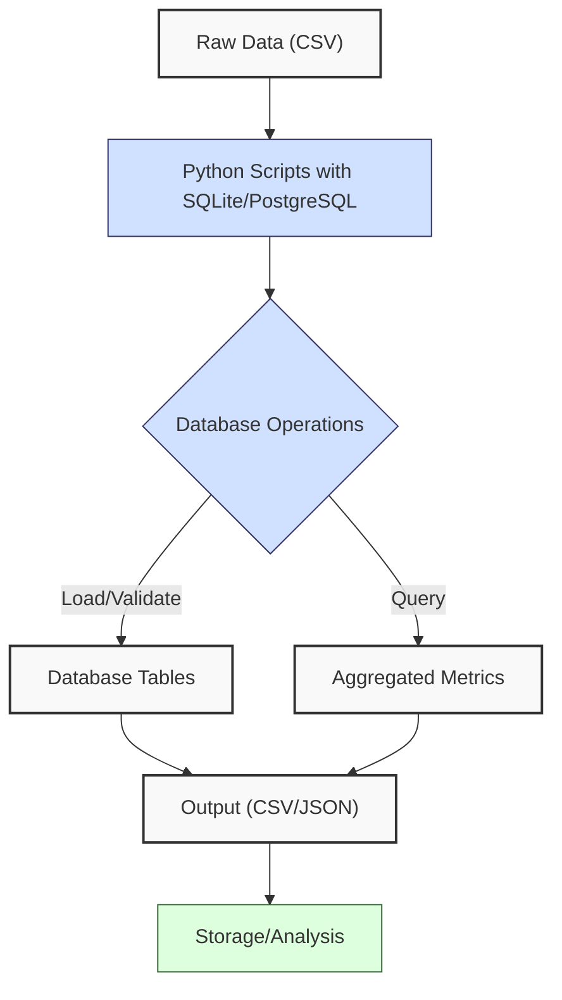
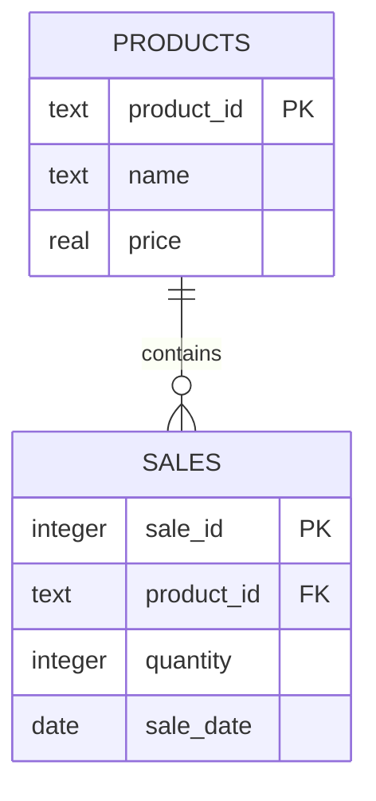
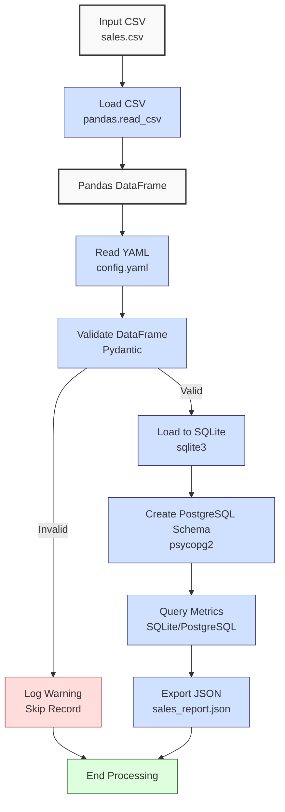

**Complexity: Easy (E)**

## 18.0 Introduction: Why This Matters for Data Engineering

In data engineering, robust database skills are essential for managing and querying financial transaction data to support Hijra Group’s Sharia-compliant fintech analytics. This chapter consolidates foundational database concepts from Chapters 12–17, focusing on SQL with SQLite, Python-SQLite integration, PostgreSQL basics, schema design, and type-safe programming. By mastering these skills, you ensure data integrity and efficient querying, critical for building scalable pipelines. For example, a well-designed sales database enables rapid retrieval of transaction metrics, supporting real-time analytics for Hijra Group’s stakeholders.

This checkpoint reviews SQL querying, database integration, and schema design using `data/sales.db` and `data/sales.csv` from Appendix 1, ensuring you can create normalized schemas, query data, and integrate databases with Python. All code uses **PEP 8's 4-space indentation**, preferring spaces over tabs to avoid `IndentationError`, and avoids advanced concepts like window functions (Chapter 21) or concurrency (Chapter 40). The micro-project builds a type-annotated database tool integrating SQLite and PostgreSQL, preparing you for advanced querying and optimization in Phase 3B.

### Data Engineering Workflow Context

This diagram illustrates how database skills fit into a data engineering pipeline:



### Building On and Preparing For

- **Building On**:
  - **Chapter 12**: SQL fundamentals with SQLite for querying `sales.db`.
  - **Chapter 13**: Python-SQLite integration with `sqlite3` and `PyYAML`.
  - **Chapter 14**: Advanced SQLite operations like transactions and views.
  - **Chapter 15**: Type-safe SQLite programming with Pydantic.
  - **Chapter 16**: PostgreSQL fundamentals with `psycopg2`.
  - **Chapter 17**: Python-PostgreSQL integration with type annotations.
- **Preparing For**:
  - **Chapter 19**: Advanced SQL querying for complex analytics.
  - **Chapter 20**: SQLite indexing and optimization for performance.
  - **Chapter 23**: Type-safe integration of SQLite and PostgreSQL.
  - **Chapter 24**: Consolidates database skills for cloud analytics.

### What You’ll Learn

This chapter covers:

1. **SQL Querying**: Writing SQL queries for SQLite and PostgreSQL.
2. **Schema Design**: Creating normalized schemas with entity-relationship (ER) diagrams.
3. **Python Integration**: Loading and querying data with `sqlite3` and `psycopg2`.
4. **Type Safety**: Using Pydantic for validation and type annotations.
5. **Testing**: Writing `pytest` tests for database operations.

By the end, you’ll build a type-annotated database tool that integrates SQLite and PostgreSQL, processes `data/sales.csv`, and queries `data/sales.db`, producing a JSON report and ensuring data integrity. All code adheres to **4-space indentation** per PEP 8.

**Follow-Along Tips**:

- Create `de-onboarding/data/` and populate with `sales.csv`, `config.yaml`, and `sales.db` per Appendix 1.
- Install libraries: `pip install pyyaml sqlite3 psycopg2-binary pydantic pytest`.
- Configure editor for **4-space indentation** (VS Code: “Editor: Tab Size” = 4, “Editor: Insert Spaces” = true, “Editor: Detect Indentation” = false).
- Use print statements (e.g., `print(cursor.fetchall())`) to debug queries.
- Verify file paths with `ls data/` (Unix/macOS) or `dir data\` (Windows).
- Use UTF-8 encoding to avoid `UnicodeDecodeError`.

## 18.1 Core Concepts: Database Fundamentals Review

### 18.1.1 SQL Querying with SQLite and PostgreSQL

SQL enables efficient data retrieval from relational databases. SQLite (lightweight, file-based) and PostgreSQL (enterprise-grade, server-based) support CRUD operations (Create, Read, Update, Delete). For example, querying sales data involves:

```sql
SELECT product, SUM(price * quantity) AS total_sales
FROM sales
WHERE product LIKE 'Halal%'
GROUP BY product;
```

**Key Points**:

- **Time Complexity**: O(n) for scanning n rows; indexing (Chapter 20) reduces to O(log n).
- **Space Complexity**: O(k) for k result rows.
- **Implementation**: SQLite stores data in a single file (`sales.db`), while PostgreSQL uses a client-server model.

### 18.1.2 Schema Design and Normalization

Normalization reduces data redundancy using entity-relationship (ER) diagrams. For sales data, a normalized schema separates products and sales:



**Key Points**:

- **1NF**: No repeating groups (e.g., one row per sale).
- **2NF**: No partial dependencies (e.g., product details in `PRODUCTS`).
- **3NF**: No transitive dependencies (e.g., price tied to product).
- **Time Complexity**: O(1) for normalized lookups with indexes; O(1) for creating tables, as it involves fixed DDL statements.
- **Space Complexity**: O(n + m) for n products and m sales; O(1) for schema metadata, excluding data.
- **Performance Implication**: Normalized schemas reduce storage but may slow real-time queries due to joins. For Hijra Group’s high-volume transactions, indexing (Chapter 20) mitigates this.
- **Debugging Tip**: Use tools like DBeaver or pgAdmin to visualize the ER diagram for `sales.db`. To set up DBeaver, install it (dbeaver.io), connect to `sales.db` via SQLite driver, and use the ER Diagram view to visualize `PRODUCTS` and `SALES` relationships. Visualizing in DBeaver shows `PRODUCTS` with a one-to-many relationship to `SALES`, confirming the foreign key (see [DBeaver Documentation](https://dbeaver.io/docs/)).

### 18.1.3 Python Integration

Python integrates with databases using `sqlite3` (built-in) and `psycopg2` (PostgreSQL). Example for SQLite:

```python
import sqlite3

conn = sqlite3.connect("data/sales.db")
cursor = conn.cursor()
cursor.execute("SELECT * FROM sales WHERE quantity > 5")
results = cursor.fetchall()
print(results)  # Debug
conn.close()
```

**Key Points**:

- **Time Complexity**: O(n) for querying n rows.
- **Space Complexity**: O(k) for k result rows.
- **Implementation**: `sqlite3` uses file-based connections; `psycopg2` connects to a PostgreSQL server.

### 18.1.4 Type-Safe Programming

Pydantic ensures type safety for database inputs. Example:

```python
from pydantic import BaseModel

class Sale(BaseModel):
    product: str
    price: float
    quantity: int

sale = Sale(product="Halal Laptop", price=999.99, quantity=2)
print(sale)  # Debug
```

**Key Points**:

- Validates types at runtime, preventing invalid data.
- **Time Complexity**: O(1) for validation.
- **Space Complexity**: O(1) per object.

## 18.2 Micro-Project: Type-Safe Database Tool

### Project Requirements

Build a type-annotated database tool that integrates SQLite and PostgreSQL, processing `data/sales.csv` and querying `data/sales.db` for Hijra Group’s analytics. The tool must handle Hijra Group’s high transaction volumes, ensuring data integrity through normalization and type-safe validation, preparing for scalability in Chapter 40. It creates a normalized schema, loads data, queries metrics, and exports results to `data/sales_report.json`, with `pytest` tests for reliability.

- Load `data/sales.csv` and `config.yaml`.
- Create a normalized SQLite schema in `data/sales.db`.
- Load data into SQLite with type-safe validation.
- Query total sales and top products in SQLite.
- Replicate schema in PostgreSQL and query.
- Export results to `data/sales_report.json`.
- Write `pytest` tests for database operations.
- Use **4-space indentation** per PEP 8.
- Test edge cases with `empty.csv`, `invalid.csv`, `malformed.csv`, `negative.csv`.

### Sample Input Files

`data/sales.csv` (Appendix 1):

```csv
product,price,quantity
Halal Laptop,999.99,2
Halal Mouse,24.99,10
Halal Keyboard,49.99,5
,29.99,3
Monitor,invalid,2
Headphones,5.00,150
```

`data/config.yaml` (Appendix 1):

```yaml
min_price: 10.0
max_quantity: 100
required_fields:
  - product
  - price
  - quantity
product_prefix: 'Halal'
max_decimals: 2
```

`data/sales.db` (Appendix 1):

```sql
CREATE TABLE sales (
    product TEXT,
    price REAL,
    quantity INTEGER
);
INSERT INTO sales (product, price, quantity) VALUES
('Halal Laptop', 999.99, 2),
('Halal Mouse', 24.99, 10),
('Halal Keyboard', 49.99, 5);
```

### Data Processing Flow



### Acceptance Criteria

- **Go Criteria**:
  - Loads `sales.csv` and `config.yaml` correctly.
  - Creates normalized SQLite schema with `PRODUCTS` and `SALES` tables.
  - Validates and loads data with Pydantic.
  - Queries total sales and top products in SQLite and PostgreSQL.
  - Exports results to `data/sales_report.json`.
  - Includes `pytest` tests for schema, data loading, and queries.
  - Uses 4-space indentation per PEP 8.
  - Passes edge case tests with `empty.csv`, `invalid.csv`, `malformed.csv`, `negative.csv`.
- **No-Go Criteria**:
  - Fails to load files or create schema.
  - Incorrect validation or query results.
  - Missing JSON export or tests.
  - Inconsistent indentation or tab/space mixing.

### Common Pitfalls to Avoid

1. **Database Connection Errors**:
   - **Problem**: `sqlite3.OperationalError` or `psycopg2.OperationalError` due to missing `sales.db` or PostgreSQL server not running.
   - **Solution**: Verify `sales.db` exists with `ls data/sales.db`. For PostgreSQL, print connection parameters with `print(conn_params)` and ensure the server is running (`pg_ctl status`).
2. **Schema Mismatches**:
   - **Problem**: `KeyError` due to missing columns in `sales.csv`.
   - **Solution**: Print schema with `sqlite3 data/sales.db ".schema"` or `psql sales_db -c "\d products"`. Check CSV columns with `print(df.columns)`.
3. **Type Validation Errors**:
   - **Problem**: Pydantic raises `ValidationError` for non-numeric prices or quantities.
   - **Solution**: Print `df.dtypes` and inspect invalid rows with `print(row.to_dict())` before validation. Ensure `utils.is_numeric_value` is applied correctly.
4. **Query Errors**:
   - **Problem**: Incorrect query results due to join mismatches.
   - **Solution**: Print query results with `print(cursor.fetchall())`. Verify table data with `SELECT * FROM products LIMIT 5`.
5. **IndentationError**:
   - **Problem**: Mixed spaces/tabs in Python code.
   - **Solution**: Use 4 spaces per PEP 8. Run `python -tt database_tool.py` to detect issues. Configure editor to replace tabs with spaces.

### How This Differs from Production

In production, this solution would include:

- **Error Handling**: Try/except for robust errors (Chapter 7).
- **Scalability**: Chunked loading for large datasets (Chapter 40).
- **Security**: Encrypted connections and PII masking (Chapter 65).
- **Monitoring**: Logging and observability (Chapter 66).

### Implementation

```python
# File: de-onboarding/utils.py
from pydantic import BaseModel, ValidationError, validator

def is_numeric(s, max_decimals=2):
    """Check if string is a decimal number with up to max_decimals."""
    parts = s.split(".")
    if len(parts) != 2 or not parts[0].replace("-", "").isdigit() or not parts[1].isdigit():
        return False
    return len(parts[1]) <= max_decimals

def clean_string(s):
    """Strip whitespace from string."""
    return s.strip() if isinstance(s, str) else s

def is_numeric_value(x):
    """Check if value is numeric."""
    return isinstance(x, (int, float))

def is_integer(x):
    """Check if value is an integer."""
    return isinstance(x, int) or (isinstance(x, str) and x.isdigit())

def apply_valid_decimals(x, max_decimals):
    """Apply decimal validation."""
    return is_numeric(str(x), max_decimals)

class Sale(BaseModel):
    product: str
    price: float
    quantity: int

    @validator("product")
    def check_prefix(cls, v):
        if not v.startswith("Halal"):
            raise ValueError("Product must start with 'Halal'")
        return v

def validate_sale(sale: dict, config: dict) -> bool:
    """Validate sale based on config rules."""
    required_fields = config["required_fields"]
    min_price = config["min_price"]
    max_quantity = config["max_quantity"]
    prefix = config["product_prefix"]
    max_decimals = config["max_decimals"]

    print(f"Validating sale: {sale}")
    for field in required_fields:
        if field not in sale or not sale[field]:
            print(f"Invalid sale: missing {field}: {sale}")
            return False

    try:
        validated_sale = Sale(**sale)
        if validated_sale.price < min_price or validated_sale.price <= 0:
            print(f"Invalid sale: invalid price: {sale}")
            return False
        if validated_sale.quantity > max_quantity:
            print(f"Invalid sale: invalid quantity: {sale}")
            return False
        if not apply_valid_decimals(validated_sale.price, max_decimals):
            print(f"Invalid sale: too many decimals: {sale}")
            return False
        return True
    except ValidationError as e:
        print(f"Invalid sale: validation error: {e}")
        return False
```

```python
# File: de-onboarding/database_tool.py
from typing import Dict, List, Tuple
import pandas as pd
import yaml
import json
import sqlite3
import psycopg2
from pydantic import ValidationError
import utils

def read_config(config_path: str) -> Dict:
    """Read YAML configuration."""
    print(f"Opening config: {config_path}")
    with open(config_path, "r") as file:
        config = yaml.safe_load(file)
    print(f"Loaded config: {config}")
    return config

def create_sqlite_schema(db_path: str) -> sqlite3.Connection:
    """Create normalized SQLite schema."""
    conn = sqlite3.connect(db_path)
    cursor = conn.cursor()
    cursor.executescript("""
        DROP TABLE IF EXISTS products;
        DROP TABLE IF EXISTS sales;
        CREATE TABLE products (
            product_id TEXT PRIMARY KEY,
            name TEXT NOT NULL,
            price REAL NOT NULL
        );
        CREATE TABLE sales (
            sale_id INTEGER PRIMARY KEY AUTOINCREMENT,
            product_id TEXT,
            quantity INTEGER NOT NULL,
            sale_date TEXT DEFAULT (date('now')),
            FOREIGN KEY (product_id) REFERENCES products (product_id)
        );
    """)
    conn.commit()
    print("Created SQLite schema")
    return conn

def create_postgresql_schema(conn_params: Dict) -> psycopg2.extensions.connection:
    """Create normalized PostgreSQL schema."""
    conn = psycopg2.connect(**conn_params)
    cursor = conn.cursor()
    cursor.execute("""
        DROP TABLE IF EXISTS sales;
        DROP TABLE IF EXISTS products;
        CREATE TABLE products (
            product_id TEXT PRIMARY KEY,
            name TEXT NOT NULL,
            price REAL NOT NULL
        );
        CREATE TABLE sales (
            sale_id SERIAL PRIMARY KEY,
            product_id TEXT,
            quantity INTEGER NOT NULL,
            sale_date DATE DEFAULT CURRENT_DATE,
            FOREIGN KEY (product_id) REFERENCES products (product_id)
        );
    """)
    conn.commit()
    print("Created PostgreSQL schema")
    return conn

def load_and_validate_sales(csv_path: str, config: Dict) -> Tuple[pd.DataFrame, int, int]:
    """Load and validate sales CSV."""
    print(f"Loading CSV: {csv_path}")
    try:
        df = pd.read_csv(csv_path)
    except FileNotFoundError:
        print(f"File not found: {csv_path}")
        return pd.DataFrame(), 0, 0

    print("Initial DataFrame:")
    print(df.head())

    required_fields = config["required_fields"]
    missing_fields = [f for f in required_fields if f not in df.columns]
    if missing_fields:
        print(f"Missing columns: {missing_fields}")
        return pd.DataFrame(), 0, len(df)

    valid_rows = []
    for _, row in df.iterrows():
        sale = {k: utils.clean_string(v) for k, v in row.to_dict().items()}
        if utils.validate_sale(sale, config):
            valid_rows.append(sale)

    valid_df = pd.DataFrame(valid_rows)
    total_records = len(df)
    valid_sales = len(valid_df)
    print("Validated DataFrame:")
    print(valid_df)
    return valid_df, valid_sales, total_records

def load_to_sqlite(df: pd.DataFrame, conn: sqlite3.Connection) -> None:
    """Load validated data to SQLite."""
    if df.empty:
        print("No valid data to load")
        return

    cursor = conn.cursor()
    for _, row in df.iterrows():
        product_id = row["product"].replace(" ", "_").lower()
        cursor.execute(
            "INSERT OR IGNORE INTO products (product_id, name, price) VALUES (?, ?, ?)",
            (product_id, row["product"], row["price"])
        )
        cursor.execute(
            "INSERT INTO sales (product_id, quantity) VALUES (?, ?)",
            (product_id, row["quantity"])
        )
    conn.commit()
    print("Loaded data to SQLite")

def load_to_postgresql(df: pd.DataFrame, conn: psycopg2.extensions.connection) -> None:
    """Load validated data to PostgreSQL."""
    if df.empty:
        print("No valid data to load")
        return

    cursor = conn.cursor()
    for _, row in df.iterrows():
        product_id = row["product"].replace(" ", "_").lower()
        cursor.execute(
            "INSERT INTO products (product_id, name, price) VALUES (%s, %s, %s) ON CONFLICT DO NOTHING",
            (product_id, row["product"], row["price"])
        )
        cursor.execute(
            "INSERT INTO sales (product_id, quantity) VALUES (%s, %s)",
            (product_id, row["quantity"])
        )
    conn.commit()
    print("Loaded data to PostgreSQL")

def query_sales_metrics(conn: sqlite3.Connection | psycopg2.extensions.connection, is_sqlite: bool = True) -> Dict:
    """Query total sales and top products."""
    cursor = conn.cursor()
    query = """
        SELECT p.name, SUM(p.price * s.quantity) AS total_sales
        FROM products p
        JOIN sales s ON p.product_id = s.product_id
        GROUP BY p.name
        ORDER BY total_sales DESC
    """
    cursor.execute(query)
    results = cursor.fetchall()
    print("Query Results:", results)

    total_sales = sum(row[1] for row in results)
    top_products = {row[0]: float(row[1]) for row in results[:3]}
    unique_products = [row[0] for row in results]

    return {
        "total_sales": float(total_sales),
        "unique_products": unique_products,
        "top_products": top_products
    }

def export_results(results: Dict, json_path: str) -> None:
    """Export results to JSON."""
    print(f"Writing to: {json_path}")
    with open(json_path, "w") as file:
        json.dump(results, file, indent=2)
    print(f"Exported results to {json_path}")

def main() -> None:
    """Main function to process sales data."""
    csv_path = "data/sales.csv"
    config_path = "data/config.yaml"
    db_path = "data/sales.db"
    json_path = "data/sales_report.json"
    pg_conn_params = {
        "dbname": "sales_db",
        "user": "postgres",
        "password": "password",
        "host": "localhost",
        "port": "5432"
    }

    config = read_config(config_path)
    df, valid_sales, total_records = load_and_validate_sales(csv_path, config)

    sqlite_conn = create_sqlite_schema(db_path)
    load_to_sqlite(df, sqlite_conn)
    sqlite_results = query_sales_metrics(sqlite_conn, is_sqlite=True)
    sqlite_conn.close()

    pg_conn = create_postgresql_schema(pg_conn_params)
    load_to_postgresql(df, pg_conn)
    pg_results = query_sales_metrics(pg_conn, is_sqlite=False)
    pg_conn.close()

    combined_results = {
        "sqlite_results": sqlite_results,
        "postgresql_results": pg_results,
        "valid_sales": valid_sales,
        "total_records": total_records,
        "invalid_sales": total_records - valid_sales
    }
    export_results(combined_results, json_path)

    print("\nSales Report:")
    print(f"Total Records Processed: {total_records}")
    print(f"Valid Sales: {valid_sales}")
    print(f"Invalid Sales: {total_records - valid_sales}")
    print(f"SQLite Total Sales: ${round(sqlite_results['total_sales'], 2)}")
    print(f"PostgreSQL Total Sales: ${round(pg_results['total_sales'], 2)}")
    print(f"Unique Products: {sqlite_results['unique_products']}")
    print(f"Top Products: {sqlite_results['top_products']}")
    print("Processing completed")

if __name__ == "__main__":
    main()
```

```python
# File: de-onboarding/test_database_tool.py
import pytest
import sqlite3
import psycopg2
import pandas as pd
from database_tool import (
    read_config, create_sqlite_schema, create_postgresql_schema,
    load_and_validate_sales, load_to_sqlite, load_to_postgresql,
    query_sales_metrics, export_results
)

@pytest.fixture
def config():
    return read_config("data/config.yaml")

@pytest.fixture
def sqlite_conn():
    conn = sqlite3.connect(":memory:")
    yield conn
    conn.close()

@pytest.fixture
def pg_conn():
    conn = psycopg2.connect(
        dbname="sales_db", user="postgres", password="password",
        host="localhost", port="5432"
    )
    yield conn
    conn.close()

def test_create_sqlite_schema(sqlite_conn):
    conn = create_sqlite_schema(":memory:")
    cursor = conn.cursor()
    cursor.execute("SELECT name FROM sqlite_master WHERE type='table';")
    tables = [row[0] for row in cursor.fetchall()]
    assert "products" in tables
    assert "sales" in tables
    conn.close()

def test_load_and_validate_sales(config):
    df, valid_sales, total_records = load_and_validate_sales("data/sales.csv", config)
    assert valid_sales == 3
    assert total_records == 6
    assert len(df) == 3
    assert all(df["product"].str.startswith("Halal"))

def test_load_to_sqlite(sqlite_conn, config):
    df, _, _ = load_and_validate_sales("data/sales.csv", config)
    load_to_sqlite(df, sqlite_conn)
    cursor = sqlite_conn.cursor()
    cursor.execute("SELECT COUNT(*) FROM products")
    assert cursor.fetchone()[0] == 3
    cursor.execute("SELECT COUNT(*) FROM sales")
    assert cursor.fetchone()[0] == 3

def test_load_to_postgresql(pg_conn, config):
    df, _, _ = load_and_validate_sales("data/sales.csv", config)
    load_to_postgresql(df, pg_conn)
    cursor = pg_conn.cursor()
    cursor.execute("SELECT COUNT(*) FROM products")
    assert cursor.fetchone()[0] == 3
    cursor.execute("SELECT COUNT(*) FROM sales")
    assert cursor.fetchone()[0] == 3
    results = query_sales_metrics(pg_conn, is_sqlite=False)
    assert results["total_sales"] == 2499.83
    assert len(results["unique_products"]) == 3
    assert results["top_products"]["Halal Laptop"] == 1999.98

def test_query_sales_metrics(sqlite_conn, config):
    df, _, _ = load_and_validate_sales("data/sales.csv", config)
    load_to_sqlite(df, sqlite_conn)
    results = query_sales_metrics(sqlite_conn, is_sqlite=True)
    assert results["total_sales"] == 2499.83
    assert len(results["unique_products"]) == 3
    assert results["top_products"]["Halal Laptop"] == 1999.98

def test_empty_csv(config):
    df, valid_sales, total_records = load_and_validate_sales("data/empty.csv", config)
    assert df.empty
    assert valid_sales == 0
    assert total_records == 0
```

### Expected Outputs

`data/sales_report.json`:

```json
{
  "sqlite_results": {
    "total_sales": 2499.83,
    "unique_products": ["Halal Laptop", "Halal Mouse", "Halal Keyboard"],
    "top_products": {
      "Halal Laptop": 1999.98,
      "Halal Mouse": 249.9,
      "Halal Keyboard": 249.95
    }
  },
  "postgresql_results": {
    "total_sales": 2499.83,
    "unique_products": ["Halal Laptop", "Halal Mouse", "Halal Keyboard"],
    "top_products": {
      "Halal Laptop": 1999.98,
      "Halal Mouse": 249.9,
      "Halal Keyboard": 249.95
    }
  },
  "valid_sales": 3,
  "total_records": 6,
  "invalid_sales": 3
}
```

**Console Output** (abridged):

```
Opening config: data/config.yaml
Loaded config: {'min_price': 10.0, 'max_quantity': 100, ...}
Loading CSV: data/sales.csv
Initial DataFrame:
          product   price  quantity
0   Halal Laptop  999.99         2
...
Validated DataFrame:
          product   price  quantity
0   Halal Laptop  999.99         2
1    Halal Mouse   24.99        10
2  Halal Keyboard   49.99         5
Created SQLite schema
Loaded data to SQLite
Created PostgreSQL schema
Loaded data to PostgreSQL
Query Results: [('Halal Laptop', 1999.98), ('Halal Mouse', 249.9), ('Halal Keyboard', 249.95)]
Writing to: data/sales_report.json
Exported results to data/sales_report.json

Sales Report:
Total Records Processed: 6
Valid Sales: 3
Invalid Sales: 3
SQLite Total Sales: $2499.83
PostgreSQL Total Sales: $2499.83
Unique Products: ['Halal Laptop', 'Halal Mouse', 'Halal Keyboard']
Top Products: {'Halal Laptop': 1999.98, 'Halal Mouse': 249.9, 'Halal Keyboard': 249.95}
Processing completed
```

### How to Run and Test

1. **Setup**:

   - **Setup Checklist**:
     - [ ] Create `de-onboarding/data/` directory and populate with `sales.csv`, `config.yaml`, `sales.db`, `empty.csv`, `invalid.csv`, `malformed.csv`, `negative.csv` per Appendix 1.
     - [ ] Install libraries: `pip install pyyaml sqlite3 psycopg2-binary pydantic pytest`.
     - [ ] Set up PostgreSQL server:
       - Install PostgreSQL (e.g., `brew install postgresql` on macOS, `sudo apt-get install postgresql` on Ubuntu; see [PostgreSQL Installation Guide](https://www.postgresql.org/docs/current/tutorial-install.html)).
       - Start server: `pg_ctl start` or `sudo service postgresql start`.
       - Create database: `createdb sales_db`.
       - Set up user: `psql -c "CREATE USER postgres WITH PASSWORD 'password';"`.
       - Verify: `psql -d sales_db -U postgres -c "SELECT 1;"`.
     - [ ] Create virtual environment: `python -m venv venv`, activate (Windows: `venv\Scripts\activate`, Unix: `source venv/bin/activate`).
     - [ ] Verify Python 3.10+: `python --version`.
     - [ ] Configure editor for 4-space indentation per PEP 8 (VS Code: “Editor: Tab Size” = 4, “Editor: Insert Spaces” = true, “Editor: Detect Indentation” = false).
     - [ ] Save `utils.py`, `database_tool.py`, and `test_database_tool.py` in `de-onboarding/`.
   - **Troubleshooting**:
     - If `FileNotFoundError` or `PermissionError` occurs, check paths with `ls data/` (Unix/macOS) or `dir data\` (Windows).
     - If `psycopg2.OperationalError`, print `print(pg_conn_params)` and verify PostgreSQL server with `pg_ctl status`.
     - If `IndentationError`, use 4 spaces (not tabs). Run `python -tt database_tool.py`.
     - If `UnicodeDecodeError`, ensure UTF-8 encoding for all files.
     - If `yaml.YAMLError`, check for missing colons, e.g., `min_price 10.0` instead of `min_price: 10.0`, or incorrect indentation, e.g., `min_price:  10.0` with extra spaces. Print `print(open(config_path).read())` to inspect. Use an online YAML linter (e.g., yamllint.com) to validate.

2. **Run**:

   - Open terminal in `de-onboarding/`.
   - Run: `python database_tool.py`.
   - Outputs: `data/sales_report.json`, console logs.

3. **Test Scenarios**:

   - **Valid Data**:
     ```python
     config = read_config("data/config.yaml")
     df, valid_sales, total_records = load_and_validate_sales("data/sales.csv", config)
     sqlite_conn = create_sqlite_schema("data/sales.db")
     load_to_sqlite(df, sqlite_conn)
     results = query_sales_metrics(sqlite_conn, is_sqlite=True)
     print(results)
     # Expected: {'total_sales': 2499.83, 'unique_products': ['Halal Laptop', 'Halal Mouse', 'Halal Keyboard'], 'top_products': {'Halal Laptop': 1999.98, 'Halal Mouse': 249.9, 'Halal Keyboard': 249.95}}
     sqlite_conn.close()
     ```
   - **Empty CSV**:
     ```python
     config = read_config("data/config.yaml")
     df, valid_sales, total_records = load_and_validate_sales("data/empty.csv", config)
     print(df, valid_sales, total_records)
     # Expected: Empty DataFrame, 0, 0
     ```
   - **Invalid Headers**:
     ```python
     config = read_config("data/config.yaml")
     df, valid_sales, total_records = load_and_validate_sales("data/invalid.csv", config)
     print(df, valid_sales, total_records)
     # Expected: Empty DataFrame, 0, 2
     ```
   - **Malformed Data**:
     ```python
     config = read_config("data/config.yaml")
     df, valid_sales, total_records = load_and_validate_sales("data/malformed.csv", config)
     print(df)
     # Expected: DataFrame with only Halal Mouse row (price: 24.99, quantity: 10)
     ```
   - **Negative Prices**:
     ```python
     config = read_config("data/config.yaml")
     df, valid_sales, total_records = load_and_validate_sales("data/negative.csv", config)
     print(df)
     # Expected: DataFrame with only Halal Mouse row (price: 24.99, quantity: 10)
     ```
   - **Run Tests**:
     - Run: `pytest test_database_tool.py -v`.
     - Verify all tests pass.
     - If `test_query_sales_metrics` fails, check the error message, e.g., `AssertionError: 2499.83 != 5000.0`, and print `results` to debug query output. To debug, add `print(results)` in `test_query_sales_metrics` to inspect the query output, e.g., `{'total_sales': 5000.0, ...}`. Compare with expected values.

## 18.3 Practice Exercises

### Exercise 1: SQLite Schema Creation

Write a function to create a normalized SQLite schema, with 4-space indentation per PEP 8.

**Expected Output**:

```
Created tables: ['products', 'sales']
```

**Follow-Along Instructions**:

1. Save as `de-onboarding/ex1_sqlite_schema.py`.
2. Configure editor for 4-space indentation per PEP 8.
3. Run: `python ex1_sqlite_schema.py`.
4. **How to Test**:
   - Add: `create_schema(":memory:")`.
   - Verify output: `Created tables: ['products', 'sales']`.
   - Check tables with: `sqlite3 :memory: ".tables"`.
   - **Common Errors**:
     - **OperationalError**: Print `db_path` to verify database path.
     - **IndentationError**: Use 4 spaces (not tabs). Run `python -tt ex1_sqlite_schema.py`.

### Exercise 2: PostgreSQL Query

Write a function to query total sales in PostgreSQL, with 4-space indentation per PEP 8.

**Sample Input**:

- PostgreSQL database `sales_db` with populated `products` and `sales` tables.

**Expected Output**:

```
Total Sales: 2499.83
```

**Follow-Along Instructions**:

1. Save as `de-onboarding/ex2_pg_query.py`.
2. Ensure PostgreSQL server is running with `sales_db`.
3. Configure editor for 4-space indentation per PEP 8.
4. Run: `python ex2_pg_query.py`.
5. **How to Test**:
   - Add: `print(query_total_sales(pg_conn_params))`.
   - Verify output: `Total Sales: 2499.83`.
   - Test with empty tables: Should return `0.0`.
   - **Common Errors**:
     - **OperationalError**: Print `conn_params` to check credentials.
     - **IndentationError**: Use 4 spaces (not tabs). Run `python -tt ex2_pg_query.py`.

### Exercise 3: Type-Safe Validation

Write a function to validate sales data with Pydantic, ensuring products start with “Halal,” with 4-space indentation per PEP 8.

**Sample Input**:

```python
sale = {"product": "Halal Laptop", "price": 999.99, "quantity": 2}
```

**Expected Output**:

```
Validated sale: {'product': 'Halal Laptop', 'price': 999.99, 'quantity': 2}
```

**Follow-Along Instructions**:

1. Save as `de-onboarding/ex3_validation.py`.
2. Configure editor for 4-space indentation per PEP 8.
3. Run: `python ex3_validation.py`.
4. **How to Test**:
   - Add: `print(validate_sale({"product": "Halal Laptop", "price": 999.99, "quantity": 2}))`.
   - Verify output matches expected.
   - Test with non-Halal product: Should return `False`.
   - **Common Errors**:
     - **ValidationError**: Print `sale` to inspect input data.
     - **IndentationError**: Use 4 spaces (not tabs). Run `python -tt ex3_validation.py`.

### Exercise 4: Debug SQL Query Error

Fix this buggy SQL query that produces incorrect sales totals due to a missing JOIN condition, ensuring 4-space indentation per PEP 8. The buggy query produces inflated totals due to a Cartesian product. Run `print(cursor.fetchall())` to see incorrect results (e.g., duplicated rows with inflated sums like `[('Halal Laptop', 9999.98), ...]`). Focus on fixing the JOIN condition. If schema errors occur, verify tables with `sqlite3 data/sales.db '.schema'`.

**Buggy Code**:

```python
import sqlite3

def query_sales_metrics(conn):
    cursor = conn.cursor()
    cursor.execute("""
        SELECT p.name, SUM(p.price * s.quantity) AS total_sales
        FROM products p, sales s  # Bug: Missing JOIN condition
        GROUP BY p.name
        ORDER BY total_sales DESC
    """)
    results = cursor.fetchall()
    total_sales = sum(row[1] for row in results)
    return {"total_sales": total_sales}

conn = sqlite3.connect("data/sales.db")
print(query_sales_metrics(conn))
conn.close()
```

**Sample Input**:

- SQLite database `sales.db` with populated `products` and `sales` tables.

**Expected Output**:

```
{'total_sales': 2499.83}
```

**Follow-Along Instructions**:

1. Save as `de-onboarding/ex4_debug_query.py`.
2. Ensure `data/sales.db` exists per Appendix 1.
3. Configure editor for 4-space indentation per PEP 8.
4. Run: `python ex4_debug_query.py` to see incorrect output.
5. Fix and re-run.
6. **How to Test**:
   - Verify output matches expected.
   - Test with additional products to ensure correct totals.
   - **Common Errors**:
     - **OperationalError**: Print `cursor.fetchall()` to debug query results.
     - **IndentationError**: Use 4 spaces (not tabs). Run `python -tt ex4_debug_query.py`.

### Exercise 5: Normalization and Database Choice Trade-offs (Conceptual)

Compare normalized vs. denormalized schemas and SQLite vs. PostgreSQL for Hijra Group’s real-time sales analytics, considering transaction volume, reporting speed, and database scalability. Save your answer to `de-onboarding/ex5_concepts.txt`.

**Expected Output** (in `ex5_concepts.txt`):

```
Normalized Schema:
- Pros: Reduces redundancy, ensures data integrity (e.g., single price per product), supports efficient updates for high transaction volumes.
- Cons: Requires joins (O(n) complexity), slower for complex real-time queries.
Denormalized Schema:
- Pros: Faster queries (O(n) without joins), simpler for real-time analytics (e.g., total sales for dashboards).
- Cons: Increases redundancy, risks inconsistencies (e.g., mismatched prices), harder to update in high-volume systems.
SQLite:
- Pros: Lightweight, file-based, ideal for small-scale testing or prototyping (e.g., local sales analytics).
- Cons: Limited concurrency, not suited for high-volume production systems.
PostgreSQL:
- Pros: Enterprise-grade, supports high concurrency and complex queries, suitable for production analytics.
- Cons: Requires server setup, higher resource usage.
For Hijra Group’s real-time analytics, normalization and PostgreSQL are preferred for data integrity and scalability in high-volume transaction processing, but denormalization and SQLite may be used for faster reporting in data marts (Chapter 32) or testing.
```

**Follow-Along Instructions**:

1. Create `de-onboarding/ex5_concepts.txt`.
2. Write your comparison, addressing schemas and databases for Hijra Group’s context.
3. **How to Test**:
   - Verify file exists with `cat de-onboarding/ex5_concepts.txt` (Unix/macOS) or `type de-onboarding\ex5_concepts.txt` (Windows).
   - Check content covers normalization, denormalization, SQLite, PostgreSQL, and fintech context.
   - **Common Errors**:
     - **FileNotFoundError**: Ensure correct path. Print `os.path.exists("de-onboarding/ex5_concepts.txt")`.

## 18.4 Exercise Solutions

### Solution to Exercise 1: SQLite Schema Creation

```python
import sqlite3

def create_schema(db_path: str) -> None:
    """Create normalized SQLite schema."""
    conn = sqlite3.connect(db_path)
    cursor = conn.cursor()
    cursor.executescript("""
        CREATE TABLE products (
            product_id TEXT PRIMARY KEY,
            name TEXT NOT NULL,
            price REAL NOT NULL
        );
        CREATE TABLE sales (
            sale_id INTEGER PRIMARY KEY AUTOINCREMENT,
            product_id TEXT,
            quantity INTEGER NOT NULL,
            FOREIGN KEY (product_id) REFERENCES products (product_id)
        );
    """)
    conn.commit()
    cursor.execute("SELECT name FROM sqlite_master WHERE type='table';")
    tables = [row[0] for row in cursor.fetchall()]
    print(f"Created tables: {tables}")
    conn.close()

create_schema(":memory:")
```

### Solution to Exercise 2: PostgreSQL Query

```python
from typing import float
import psycopg2

def query_total_sales(conn_params: dict) -> float:
    """Query total sales in PostgreSQL."""
    conn = psycopg2.connect(**conn_params)
    cursor = conn.cursor()
    cursor.execute("""
        SELECT SUM(p.price * s.quantity)
        FROM products p
        JOIN sales s ON p.product_id = s.product_id
    """)
    total = cursor.fetchone()[0] or 0.0
    print(f"Total Sales: {total}")
    conn.close()
    return total

conn_params = {
    "dbname": "sales_db",
    "user": "postgres",
    "password": "password",
    "host": "localhost",
    "port": "5432"
}
print(query_total_sales(conn_params))
```

### Solution to Exercise 3: Type-Safe Validation

```python
from pydantic import BaseModel, ValidationError, validator
from typing import Dict

class Sale(BaseModel):
    product: str
    price: float
    quantity: int

    @validator("product")
    def check_prefix(cls, v):
        if not v.startswith("Halal"):
            raise ValueError("Product must start with 'Halal'")
        return v

def validate_sale(sale: Dict) -> bool:
    """Validate sale with Pydantic."""
    try:
        validated_sale = Sale(**sale)
        print(f"Validated sale: {validated_sale.dict()}")
        return True
    except ValidationError as e:
        print(f"Validation error: {e}")
        return False

sale = {"product": "Halal Laptop", "price": 999.99, "quantity": 2}
validate_sale(sale)
```

### Solution to Exercise 4: Debug SQL Query Error

```python
import sqlite3

def query_sales_metrics(conn):
    """Query total sales with corrected JOIN."""
    cursor = conn.cursor()
    cursor.execute("""
        SELECT p.name, SUM(p.price * s.quantity) AS total_sales
        FROM products p
        JOIN sales s ON p.product_id = s.product_id  # Fix: Added JOIN condition
        GROUP BY p.name
        ORDER BY total_sales DESC
    """)
    results = cursor.fetchall()
    total_sales = sum(row[1] for row in results)
    return {"total_sales": total_sales}

conn = sqlite3.connect("data/sales.db")
print(query_sales_metrics(conn))
conn.close()
```

**Explanation**:

- **Bug**: The original query used a Cartesian product (`FROM products p, sales s`) without a JOIN condition, causing incorrect totals due to cross-joining all rows.
- **Fix**: Added `JOIN sales s ON p.product_id = s.product_id` to match products with sales correctly.

### Solution to Exercise 5: Normalization and Database Choice Trade-offs (Conceptual)

**File**: `de-onboarding/ex5_concepts.txt`

```
Normalized Schema:
- Pros: Reduces redundancy, ensures data integrity (e.g., single price per product), supports efficient updates for high transaction volumes.
- Cons: Requires joins (O(n) complexity), slower for complex real-time queries.
Denormalized Schema:
- Pros: Faster queries (O(n) without joins), simpler for real-time analytics (e.g., total sales for dashboards).
- Cons: Increases redundancy, risks inconsistencies (e.g., mismatched prices), harder to update in high-volume systems.
SQLite:
- Pros: Lightweight, file-based, ideal for small-scale testing or prototyping (e.g., local sales analytics).
- Cons: Limited concurrency, not suited for high-volume production systems.
PostgreSQL:
- Pros: Enterprise-grade, supports high concurrency and complex queries, suitable for production analytics.
- Cons: Requires server setup, higher resource usage.
For Hijra Group’s real-time analytics, normalization and PostgreSQL are preferred for data integrity and scalability in high-volume transaction processing, but denormalization and SQLite may be used for faster reporting in data marts (Chapter 32) or testing.
```

## 18.5 Chapter Summary and Connection to Chapter 19

In this chapter, you’ve mastered:

- **SQL Querying**: Efficient data retrieval with SQLite and PostgreSQL, including debugging query errors.
- **Schema Design**: Normalized schemas with ER diagrams, validated visually with tools like DBeaver, optimized for Hijra Group’s high-volume transactions.
- **Python Integration**: Database operations with `sqlite3` and `psycopg2`.
- **Type Safety**: Pydantic for validated data loading, including Sharia-compliant Halal prefix checks.
- **Testing**: `pytest` for reliable database operations, covering both SQLite and PostgreSQL.
- **Database Selection**: Understanding trade-offs between normalized/denormalized schemas and SQLite/PostgreSQL for analytics.

The micro-project built a type-annotated database tool integrating SQLite and PostgreSQL, processing `data/sales.csv`, and querying `data/sales.db`, with `pytest` tests ensuring reliability. The normalized schema, type-safe validation, and database trade-offs support Hijra Group’s transaction analytics, preparing you for advanced SQL querying in Chapter 19, which introduces joins, subqueries, and aggregations for complex analytics, building on this chapter’s foundational skills.
