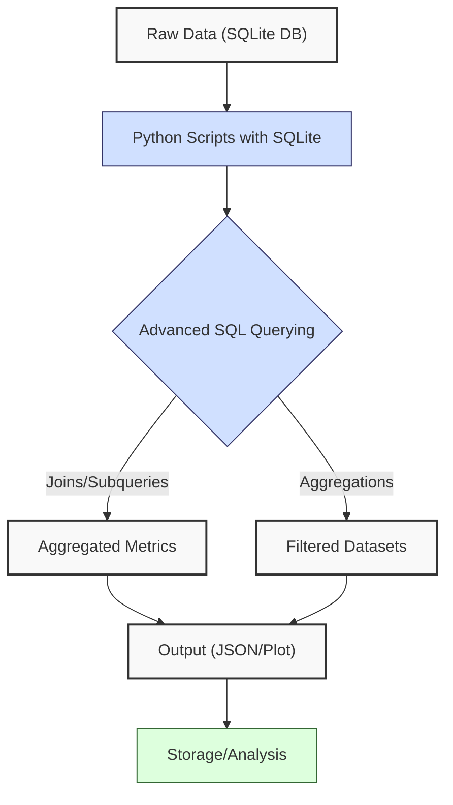
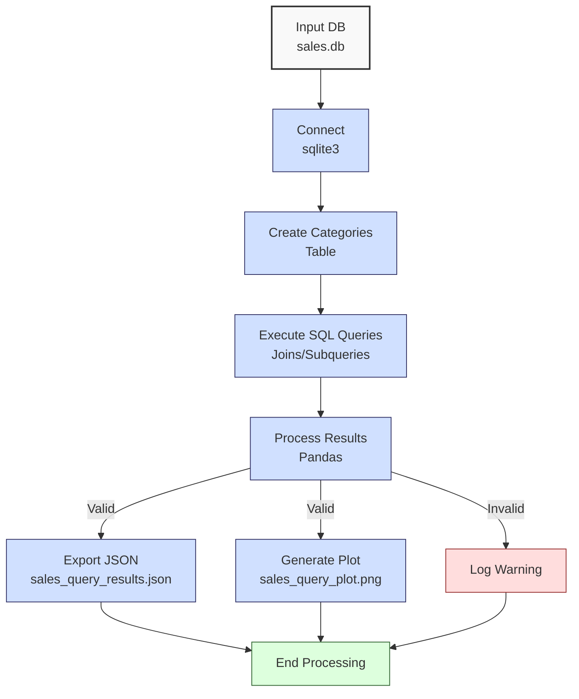

**Complexity: Moderate (M)**

## 19.0 Introduction: Why This Matters for Data Engineering

In data engineering, advanced SQL querying is essential for extracting meaningful insights from large datasets, enabling Hijra Group to analyze Sharia-compliant financial transactions efficiently. SQLite, as a lightweight, serverless database, supports complex queries like joins, subqueries, and aggregations, making it ideal for prototyping pipelines before scaling to PostgreSQL (Chapter 21) or BigQuery (Chapter 25). Building on Chapters 12–18, which introduced SQL basics, Python-SQLite integration, and schema design, this chapter focuses on advanced querying techniques to handle sales data, preparing for optimization (Chapter 20) and production-grade databases.

This chapter avoids concepts not yet introduced, such as type annotations (Chapter 7), testing (Chapter 9), or advanced indexing (Chapter 20). All Python code uses **4-space indentation** per PEP 8, preferring spaces over tabs to avoid `IndentationError`, ensuring compatibility with Hijra Group’s pipeline scripts. The micro-project uses `data/sales.db` from Appendix 1, testing queries for sales analytics and visualizing results with Matplotlib.

### Data Engineering Workflow Context

This diagram illustrates how advanced SQL querying fits into a data engineering pipeline:



### Building On and Preparing For

- **Building On**:
  - Chapter 12: SQL basics (SELECT, INSERT, WHERE) for querying `sales.db`.
  - Chapter 13: Python-SQLite integration with `sqlite3` for programmatic access.
  - Chapter 14: Transactions and views for managing data operations.
  - Chapter 15: Type-safe database programming (avoided here due to no type annotations).
  - Chapter 18: Schema design and entity-relationship (ER) diagrams for normalized tables.
- **Preparing For**:
  - Chapter 20: Indexing and optimization for query performance.
  - Chapter 21: Advanced PostgreSQL querying with CTEs and window functions.
  - Chapter 23: Type-safe database integration for robust pipelines.
  - Chapter 24: Comprehensive database review for cloud analytics.

### What You’ll Learn

This chapter covers:

1. **Advanced SQL Techniques**: Joins, subqueries, and aggregations for complex analytics.
2. **Query Design**: Structuring queries for readability and efficiency.
3. **Python Integration**: Executing queries with `sqlite3` and processing results with Pandas.
4. **Visualization**: Plotting query results with Matplotlib for stakeholder reporting.
5. **Performance Considerations**: Understanding query complexity (e.g., O(n) for table scans).

By the end, you’ll build a query tool to analyze sales data, producing a JSON report and a sales plot, all with 4-space indentation per PEP 8. The micro-project uses `data/sales.db` and validates queries against expected metrics.

**Follow-Along Tips**:

- Create `de-onboarding/data/` and populate with `sales.db` per Appendix 1.
- Install libraries: `pip install pandas matplotlib sqlite3`.
- If `IndentationError`, use **4 spaces** (not tabs) per PEP 8. Run `python -tt script.py` to detect tab/space mixing.
- Use print statements (e.g., `print(pd.DataFrame(rows))`) to debug query results.
- Save plots to `data/` (e.g., `sales_query_plot.png`) instead of using `plt.show()`.
- Verify file paths with `ls data/` (Unix/macOS) or `dir data\` (Windows).
- Use UTF-8 encoding for all files to avoid `UnicodeDecodeError`.

## 19.1 Advanced SQL Querying Techniques

Advanced SQL queries enable complex data analysis, such as joining tables, nesting subqueries, and aggregating metrics. SQLite supports these operations efficiently for small to medium datasets (e.g., <1GB), with O(n) complexity for table scans and O(n log n) for joins with indexes (covered in Chapter 20). Format SQL queries with consistent indentation (e.g., align `FROM`, `JOIN`, `WHERE`) and use uppercase for keywords (e.g., `SELECT`, `GROUP BY`) to enhance readability. Break long queries across lines and align clauses for clarity, improving maintainability in pipeline scripts.

### 19.1.1 Joins

Joins combine data from multiple tables based on related columns. SQLite supports INNER, LEFT, and CROSS joins, with INNER JOIN being the most common for matching records.

```python
import sqlite3  # Import SQLite

# Connect to database
conn = sqlite3.connect("data/sales.db")
cursor = conn.cursor()

# Create a temporary categories table
cursor.execute("""
CREATE TABLE IF NOT EXISTS categories (
    product TEXT,
    category TEXT
)
""")
cursor.executemany(
    "INSERT INTO categories (product, category) VALUES (?, ?)",
    [
        ("Halal Laptop", "Electronics"),
        ("Halal Mouse", "Accessories"),
        ("Halal Keyboard", "Accessories"),
    ]
)
conn.commit()

# INNER JOIN to combine sales and categories
cursor.execute("""
    SELECT s.product, s.price, s.quantity, c.category
    FROM sales s
    INNER JOIN categories c
        ON s.product = c.product
""")
rows = cursor.fetchall()

# Print results
print("Join Results:")  # Debug
for row in rows:
    print(row)  # Show joined rows

# Close connection
conn.close()

# Expected Output:
# Join Results:
# ('Halal Laptop', 999.99, 2, 'Electronics')
# ('Halal Mouse', 24.99, 10, 'Accessories')
# ('Halal Keyboard', 49.99, 5, 'Accessories')
```

**Follow-Along Instructions**:

1. Ensure `data/sales.db` exists per Appendix 1.
2. Save as `de-onboarding/sql_joins.py`.
3. Configure editor for 4-space indentation per PEP 8.
4. Run: `python sql_joins.py`.
5. Verify output matches comments.
6. **Common Errors**:
   - **sqlite3.OperationalError**: Ensure `sales.db` exists. Print `os.path.exists("data/sales.db")`.
   - **IndentationError**: Use 4 spaces (not tabs). Run `python -tt sql_joins.py`.

**Key Points**:

- **INNER JOIN**: Matches rows where the condition (e.g., `s.product = c.product`) is true.
- **Time Complexity**: O(n \* m) for unindexed joins (n, m rows in tables), improved with indexes (Chapter 20).
- **Space Complexity**: O(k) for k result rows.
- **Implication**: Joins enable combining sales data with metadata, e.g., product categories for Hijra Group’s analytics.

### 19.1.2 Subqueries

Subqueries are nested queries that return intermediate results for the outer query, useful for filtering or aggregating.

```python
import sqlite3  # Import SQLite

# Connect to database
conn = sqlite3.connect("data/sales.db")
cursor = conn.cursor()

# Subquery to find products with above-average price
cursor.execute("""
    SELECT product, price, quantity
    FROM sales
    WHERE price > (
        SELECT AVG(price)
        FROM sales
    )
""")
rows = cursor.fetchall()

# Print results
print("Subquery Results:")  # Debug
for row in rows:
    print(row)  # Show filtered rows

# Close connection
conn.close()

# Expected Output:
# Subquery Results:
# ('Halal Laptop', 999.99, 2)
```

**Follow-Along Instructions**:

1. Save as `de-onboarding/sql_subqueries.py`.
2. Configure editor for 4-space indentation per PEP 8.
3. Run: `python sql_subqueries.py`.
4. Verify output shows high-priced products.
5. **Common Errors**:
   - **sqlite3.OperationalError**: Check query syntax. Print the query string.
   - **IndentationError**: Use 4 spaces (not tabs). Run `python -tt sql_subqueries.py`.

**Key Points**:

- **Subquery**: Executes first, providing a value (e.g., average price) for the outer query.
- **Time Complexity**: O(n) for subquery scan, O(n) for outer query scan.
- **Space Complexity**: O(1) for scalar subqueries.
- **Implication**: Useful for dynamic filtering, e.g., identifying premium products.

### 19.1.3 Aggregations

Aggregations compute summary metrics (e.g., SUM, COUNT) across groups, often with GROUP BY.

```python
import sqlite3  # Import SQLite

# Connect to database
conn = sqlite3.connect("data/sales.db")
cursor = conn.cursor()

# Aggregate total sales by product
cursor.execute("""
    SELECT product, SUM(price * quantity) AS total_sales
    FROM sales
    GROUP BY product
""")
rows = cursor.fetchall()

# Print results
print("Aggregation Results:")  # Debug
for row in rows:
    print(row)  # Show grouped totals

# Close connection
conn.close()

# Expected Output:
# Aggregation Results:
# ('Halal Keyboard', 249.95)
# ('Halal Laptop', 1999.98)
# ('Halal Mouse', 249.9)
```

**Follow-Along Instructions**:

1. Save as `de-onboarding/sql_aggregations.py`.
2. Configure editor for 4-space indentation per PEP 8.
3. Run: `python sql_aggregations.py`.
4. Verify output matches comments.
5. **Common Errors**:
   - **sqlite3.OperationalError**: Ensure `price * quantity` is valid. Print query results.
   - **IndentationError**: Use 4 spaces (not tabs). Run `python -tt sql_aggregations.py`.

**Key Points**:

- **GROUP BY**: Groups rows by column (e.g., `product`).
- **SUM**: Aggregates values within groups.
- **Time Complexity**: O(n) for scanning and grouping.
- **Space Complexity**: O(k) for k groups.
- **Implication**: Essential for summarizing sales metrics.

## 19.2 Micro-Project: Sales Data Query Tool

### Project Requirements

Build a query tool to analyze sales data in `data/sales.db`, producing a JSON report and a sales plot for Hijra Group’s analytics. Ensure `sales.db` is created per Appendix 1 before running the project. The tool uses advanced SQL queries (joins, subqueries, aggregations) to compute metrics, integrating with Python and Pandas for processing and Matplotlib for visualization. Queries ensure Sharia-compliant product analytics by focusing on Halal products, aligning with Islamic Financial Services Board (IFSB) standards for transaction reporting.

- Connect to `data/sales.db` with `sqlite3`.
- Create a `categories` table for joins.
- Execute queries for total sales, top products, and high-value sales.
- Export results to `data/sales_query_results.json`.
- Generate a sales plot saved to `data/sales_query_plot.png`.
- Log steps using print statements.
- Use **4-space indentation** per PEP 8, preferring spaces over tabs.
- Test edge cases (e.g., empty database).

### Sample Input File

`data/sales.db` (from Appendix 1):

- **Table**: `sales`
- **Columns**: `product` (TEXT), `price` (REAL), `quantity` (INTEGER)
- **Data**:
  ```sql
  ('Halal Laptop', 999.99, 2)
  ('Halal Mouse', 24.99, 10)
  ('Halal Keyboard', 49.99, 5)
  ```

Optionally, save the `categories` table creation as `create_categories.py` for reuse in exercises. Run before exercises if the `categories` table is missing.

### Data Processing Flow



### Acceptance Criteria

- **Go Criteria**:
  - Connects to `sales.db` and creates `categories` table.
  - Executes queries for total sales, top products, and high-value sales.
  - Exports results to `data/sales_query_results.json`.
  - Saves plot to `data/sales_query_plot.png`, confirming file existence.
  - Logs steps and invalid cases.
  - Uses 4-space indentation per PEP 8, preferring spaces over tabs.
  - Handles edge cases (e.g., empty database).
- **No-Go Criteria**:
  - Fails to connect to `sales.db`.
  - Incorrect query results or calculations.
  - Missing JSON export or plot.
  - Uses try/except or type annotations.
  - Inconsistent indentation or tab/space mixing.

### Common Pitfalls to Avoid

1. **Database Connection Issues**:
   - **Problem**: `sqlite3.OperationalError` due to missing `sales.db`.
   - **Solution**: Ensure `sales.db` exists per Appendix 1. Print `os.path.exists("data/sales.db")`.
2. **Query Syntax Errors**:
   - **Problem**: Invalid SQL syntax causes errors.
   - **Solution**: Test queries in SQLite CLI with `sqlite3 data/sales.db` and run the query directly (e.g., `SELECT * FROM sales;`). If errors persist, print the query string with `print(query)` before `cursor.execute`.
3. **Empty Results**:
   - **Problem**: Queries return no rows for empty tables.
   - **Solution**: Check row counts with `SELECT COUNT(*)`. Print results.
4. **Plotting Issues**:
   - **Problem**: Plot not saved.
   - **Solution**: Use `plt.savefig()` and check permissions. Print `os.path.exists(plot_path)`.
5. **IndentationError**:
   - **Problem**: Mixed spaces/tabs.
   - **Solution**: Use 4 spaces per PEP 8. Run `python -tt query_tool.py`.

### How This Differs from Production

In production, this solution would include:

- **Error Handling**: Try/except for robust errors (Chapter 7).
- **Type Safety**: Type annotations with Pyright (Chapter 7).
- **Testing**: Unit tests with `pytest` (Chapter 9).
- **Optimization**: Indexes for faster joins (Chapter 20).
- **Logging**: File-based logging (Chapter 52).
- **Scalability**: Distributed queries with PostgreSQL/BigQuery (Chapters 21, 25).

### Implementation

```python
# File: de-onboarding/query_tool.py
import sqlite3  # For database operations
import pandas as pd  # For data processing
import matplotlib.pyplot as plt  # For plotting
import json  # For JSON export
import os  # For file existence check

# Define function to setup database
def setup_database(db_path):  # Takes database path
    """Setup database with categories table."""
    print(f"Connecting to: {db_path}")  # Debug: print path
    conn = sqlite3.connect(db_path)  # Connect to database
    cursor = conn.cursor()

    # Create categories table
    cursor.execute("""
    CREATE TABLE IF NOT EXISTS categories (
        product TEXT,
        category TEXT
    )
    """)

    # Insert category data
    cursor.executemany(
        "INSERT OR IGNORE INTO categories (product, category) VALUES (?, ?)",
        [
            ("Halal Laptop", "Electronics"),
            ("Halal Mouse", "Accessories"),
            ("Halal Keyboard", "Accessories"),
        ]
    )
    conn.commit()
    print("Categories table created")  # Debug
    return conn, cursor  # Return connection and cursor

# Define function to execute queries
def execute_queries(conn, cursor):  # Takes connection and cursor
    """Execute advanced SQL queries."""
    results = {}  # Store query results

    # Query 1: Total sales by category (JOIN)
    query = """
        SELECT c.category, SUM(s.price * s.quantity) AS total_sales
        FROM sales s
        INNER JOIN categories c
            ON s.product = c.product
        GROUP BY c.category
    """
    print("Executing query:", query)  # Debug: print query
    cursor.execute(query)
    rows = cursor.fetchall()
    if not rows:  # Check for empty results
        print("No data for category sales")  # Log empty
        results["category_sales"] = {}
    else:
        results["category_sales"] = {row[0]: row[1] for row in rows}
    print("Category Sales:", results["category_sales"])  # Debug

    # Query 2: Top 2 products by sales (Aggregation)
    query = """
        SELECT product, SUM(price * quantity) AS total_sales
        FROM sales
        GROUP BY product
        ORDER BY total_sales DESC
        LIMIT 2
    """
    print("Executing query:", query)  # Debug: print query
    cursor.execute(query)
    rows = cursor.fetchall()
    if not rows:  # Check for empty results
        print("No data for top products")  # Log empty
        results["top_products"] = {}
    else:
        results["top_products"] = {row[0]: row[1] for row in rows}
    print("Top Products:", results["top_products"])  # Debug

    # Query 3: High-value sales (Subquery)
    query = """
        SELECT product, price, quantity
        FROM sales
        WHERE price > (
            SELECT AVG(price)
            FROM sales
        )
    """
    print("Executing query:", query)  # Debug: print query
    cursor.execute(query)
    rows = cursor.fetchall()
    if not rows:  # Check for empty results
        print("No high-value sales")  # Log empty
        results["high_value_sales"] = []
    else:
        results["high_value_sales"] = [{"product": r[0], "price": r[1], "quantity": r[2]} for r in rows]
    print("High-Value Sales:", results["high_value_sales"])  # Debug

    return results  # Return results dictionary

# Define function to export results
def export_results(results, json_path):  # Takes results and file path
    """Export query results to JSON."""
    print(f"Writing to: {json_path}")  # Debug: print path
    file = open(json_path, "w")  # Open JSON file
    json.dump(results, file, indent=2)  # Write JSON
    file.close()  # Close file
    print(f"Exported results to {json_path}")  # Confirm export

# Define function to plot sales
def plot_sales(results, plot_path):  # Takes results and plot path
    """Generate sales by category plot."""
    if not results["category_sales"]:  # Check for empty data
        print("No data to plot")  # Log empty
        return

    # Prepare data for plotting
    categories = list(results["category_sales"].keys())
    sales = list(results["category_sales"].values())

    plt.figure(figsize=(8, 6))  # Set figure size
    plt.bar(categories, sales)  # Bar plot
    plt.title("Sales by Category")  # Title
    plt.xlabel("Category")  # X-axis label
    plt.ylabel("Sales Amount ($)")  # Y-axis label
    plt.grid(True)  # Add grid
    plt.tight_layout()  # Adjust layout
    plt.savefig(plot_path, dpi=100)  # Save plot with high resolution
    plt.close()  # Close figure
    print(f"Plot saved to {plot_path}")  # Confirm save
    print(f"File exists: {os.path.exists(plot_path)}")  # Confirm file creation

# Define main function
def main():  # No parameters
    """Main function to run query tool."""
    db_path = "data/sales.db"  # Database path
    json_path = "data/sales_query_results.json"  # JSON output path
    plot_path = "data/sales_query_plot.png"  # Plot output path

    # Setup database
    conn, cursor = setup_database(db_path)

    # Execute queries
    results = execute_queries(conn, cursor)

    # Export and plot
    export_results(results, json_path)
    plot_sales(results, plot_path)

    # Close connection
    conn.close()
    print("Processing completed")  # Confirm completion

if __name__ == "__main__":
    main()  # Run main function
```

### Expected Outputs

`data/sales_query_results.json`:

```json
{
  "category_sales": {
    "Electronics": 1999.98,
    "Accessories": 499.85
  },
  "top_products": {
    "Halal Laptop": 1999.98,
    "Halal Mouse": 249.9
  },
  "high_value_sales": [
    {
      "product": "Halal Laptop",
      "price": 999.99,
      "quantity": 2
    }
  ]
}
```

`data/sales_query_plot.png`: Bar plot showing sales by category (Electronics, Accessories), saved with `dpi=100`.

**Console Output** (abridged):

```
Connecting to: data/sales.db
Categories table created
Executing query:
        SELECT c.category, SUM(s.price * s.quantity) AS total_sales
        FROM sales s
        INNER JOIN categories c
            ON s.product = c.product
        GROUP BY c.category

Category Sales: {'Electronics': 1999.98, 'Accessories': 499.85}
Executing query:
        SELECT product, SUM(price * quantity) AS total_sales
        FROM sales
        GROUP BY product
        ORDER BY total_sales DESC
        LIMIT 2

Top Products: {'Halal Laptop': 1999.98, 'Halal Mouse': 249.9}
Executing query:
        SELECT product, price, quantity
        FROM sales
        WHERE price > (
            SELECT AVG(price)
            FROM sales
        )

High-Value Sales: [{'product': 'Halal Laptop', 'price': 999.99, 'quantity': 2}]
Writing to: data/sales_query_results.json
Exported results to data/sales_query_results.json
Plot saved to data/sales_query_plot.png
File exists: True
Processing completed
```

### How to Run and Test

1. **Setup**:

   - **Setup Checklist**:

     - [ ] Create `de-onboarding/data/` directory.
     - [ ] Run `python create_sales_db.py` from Appendix 1 to create `sales.db` if not already present.
     - [ ] Save `sales.db` per Appendix 1 (run `create_sales_db.py`).
     - [ ] Install libraries: `pip install pandas matplotlib sqlite3`.
     - [ ] Create virtual environment: `python -m venv venv`, activate (Windows: `venv\Scripts\activate`, Unix: `source venv/bin/activate`).
     - [ ] Verify Python 3.10+: `python --version`.
     - [ ] Configure editor for 4-space indentation per PEP 8 (VS Code: “Editor: Tab Size” = 4, “Editor: Insert Spaces” = true, “Editor: Detect Indentation” = false).
     - [ ] Save `query_tool.py` in `de-onboarding/`.
     - [ ] Optionally, create `create_categories.py` for exercise reuse:

       ```python
       # File: de-onboarding/create_categories.py
       import sqlite3

       conn = sqlite3.connect("data/sales.db")
       cursor = conn.cursor()
       cursor.execute("""
       CREATE TABLE IF NOT EXISTS categories (
           product TEXT,
           category TEXT
       )
       """)
       cursor.executemany(
           "INSERT OR IGNORE INTO categories (product, category) VALUES (?, ?)",
           [
               ("Halal Laptop", "Electronics"),
               ("Halal Mouse", "Accessories"),
               ("Halal Keyboard", "Accessories"),
           ]
       )
       conn.commit()
       conn.close()
       print("Categories table created")
       ```

       Run: `python create_categories.py` before exercises requiring `categories`.

   - **Troubleshooting**:
     - If `sqlite3.OperationalError`, check `sales.db` existence and query syntax.
     - If `PermissionError` for JSON/plot, check `data/` permissions with `ls -l data/`.
     - If `IndentationError`, use 4 spaces (not tabs). Run `python -tt query_tool.py`.

2. **Run**:

   - Open terminal in `de-onboarding/`.
   - Run: `python query_tool.py`.
   - Outputs: `data/sales_query_results.json`, `data/sales_query_plot.png`, console logs.

3. **Test Scenarios**:

   - **Valid Data**: Verify JSON matches expected metrics and plot shows category sales.
   - **Empty Database**: Test with empty `sales` table:
     ```python
     conn = sqlite3.connect("data/sales.db")
     cursor = conn.cursor()
     cursor.execute("DELETE FROM sales")
     conn.commit()
     results = execute_queries(conn, cursor)
     print(results)
     # Expected: {'category_sales': {}, 'top_products': {}, 'high_value_sales': []}
     conn.close()
     ```

## 19.3 Practice Exercises

### Exercise 1: Join Query

Write a function to join `sales` and `categories` tables, returning products and categories, with 4-space indentation per PEP 8.

**Expected Output**:

```
[('Halal Laptop', 'Electronics'), ('Halal Mouse', 'Accessories'), ('Halal Keyboard', 'Accessories')]
```

**Follow-Along Instructions**:

1. Save as `de-onboarding/ex1_join.py`.
2. Run `create_categories.py` to ensure `categories` table exists.
3. Configure editor for 4-space indentation per PEP 8.
4. Run: `python ex1_join.py`.
5. **How to Test**:
   - Add: `print(join_sales_categories("data/sales.db"))`.
   - Verify output matches expected.
   - Test with empty `categories` table: Should return empty list.

### Exercise 2: Subquery

Write a function to find sales with above-average quantities, with 4-space indentation per PEP 8.

**Expected Output**:

```
[('Halal Mouse', 24.99, 10)]
```

**Follow-Along Instructions**:

1. Save as `de-onboarding/ex2_subquery.py`.
2. Configure editor for 4-space indentation per PEP 8.
3. Run: `python ex2_subquery.py`.
4. **How to Test**:
   - Add: `print(high_quantity_sales("data/sales.db"))`.
   - Verify output matches expected.
   - Test with empty `sales` table: Should return empty list.

### Exercise 3: Aggregation

Write a function to compute total sales by product, with 4-space indentation per PEP 8.

**Expected Output**:

```
[('Halal Keyboard', 249.95), ('Halal Laptop', 1999.98), ('Halal Mouse', 249.9)]
```

**Follow-Along Instructions**:

1. Save as `de-onboarding/ex3_aggregation.py`.
2. Configure editor for 4-space indentation per PEP 8.
3. Run: `python ex3_aggregation.py`.
4. **How to Test**:
   - Add: `print(total_sales_by_product("data/sales.db"))`.
   - Verify output matches expected.
   - Test with empty `sales` table: Should return empty list.

### Exercise 4: Visualization

Write a function to plot total sales by category, saving to `data/category_plot.png`, with 4-space indentation per PEP 8.

**Expected Output**:

```
Plot saved to data/category_plot.png
```

**Follow-Along Instructions**:

1. Save as `de-onboarding/ex4_plot.py`.
2. Run `create_categories.py` to ensure `categories` table exists.
3. Configure editor for 4-space indentation per PEP 8.
4. Run: `python ex4_plot.py`.
5. **How to Test**:
   - Verify `data/category_plot.png` exists with correct bars.
   - Test with empty `sales` table: Should not generate plot.

### Exercise 5: Debug a Subquery Bug

Fix this buggy code that uses incorrect subquery syntax, causing no results, ensuring 4-space indentation per PEP 8.

**Buggy Code**:

```python
import sqlite3
def high_price_sales(db_path):
    conn = sqlite3.connect(db_path)
    cursor = conn.cursor()
    cursor.execute("""
    SELECT product, price, quantity
    FROM sales
    WHERE price > (SELECT price FROM sales)  # Bug: Invalid subquery
    """)
    rows = cursor.fetchall()
    conn.close()
    return rows

print(high_price_sales("data/sales.db"))
```

**Expected Output**:

```
[('Halal Laptop', 999.99, 2)]
```

**Follow-Along Instructions**:

1. Save as `de-onboarding/ex5_debug.py`.
2. Configure editor for 4-space indentation per PEP 8.
3. Run: `python ex5_debug.py` to see incorrect output.
4. Fix and re-run.
5. **How to Test**:
   - Verify output matches expected.
   - Test with empty `sales` table: Should return empty list.

### Exercise 6: Conceptual Analysis of Joins vs. Subqueries

Explain when to use a JOIN versus a subquery for filtering sales data, considering performance and readability. Write a 100-word explanation and save it to `de-onboarding/ex6_concepts.txt`, using 4-space indentation per PEP 8 for any code references.

**Expected Output**:

```
Explanation saved to de-onboarding/ex6_concepts.txt
```

**Follow-Along Instructions**:

1. Save as `de-onboarding/ex6_concepts.py`.
2. Configure editor for 4-space indentation per PEP 8.
3. Run: `python ex6_concepts.py`.
4. **How to Test**:
   - Verify `ex6_concepts.txt` exists with a ~100-word explanation.
   - Check content for clarity and relevance to joins vs. subqueries.
   - Test with a shorter explanation (<50 words): Should prompt for 100 words.

## 19.4 Exercise Solutions

### Solution to Exercise 1: Join Query

```python
import sqlite3  # Import SQLite

def join_sales_categories(db_path):  # Takes database path
    """Join sales and categories tables."""
    conn = sqlite3.connect(db_path)  # Connect
    cursor = conn.cursor()

    # Execute join query
    query = """
        SELECT s.product, c.category
        FROM sales s
        INNER JOIN categories c
            ON s.product = c.product
    """
    print("Executing query:", query)  # Debug
    cursor.execute(query)
    rows = cursor.fetchall()
    print("Join Results:", rows)  # Debug
    conn.close()
    return rows  # Return results

# Test
print(join_sales_categories("data/sales.db"))

# Output:
# Executing query:
#         SELECT s.product, c.category
#         FROM sales s
#         INNER JOIN categories c
#             ON s.product = c.product
# Join Results: [('Halal Laptop', 'Electronics'), ('Halal Mouse', 'Accessories'), ('Halal Keyboard', 'Accessories')]
# [('Halal Laptop', 'Electronics'), ('Halal Mouse', 'Accessories'), ('Halal Keyboard', 'Accessories')]
```

### Solution to Exercise 2: Subquery

```python
import sqlite3  # Import SQLite

def high_quantity_sales(db_path):  # Takes database path
    """Find sales with above-average quantities."""
    conn = sqlite3.connect(db_path)  # Connect
    cursor = conn.cursor()

    # Execute subquery
    query = """
        SELECT product, price, quantity
        FROM sales
        WHERE quantity > (
            SELECT AVG(quantity)
            FROM sales
        )
    """
    print("Executing query:", query)  # Debug
    cursor.execute(query)
    rows = cursor.fetchall()
    print("High Quantity Sales:", rows)  # Debug
    conn.close()
    return rows  # Return results

# Test
print(high_quantity_sales("data/sales.db"))

# Output:
# Executing query:
#         SELECT product, price, quantity
#         FROM sales
#         WHERE quantity > (
#             SELECT AVG(quantity)
#             FROM sales
#         )
# High Quantity Sales: [('Halal Mouse', 24.99, 10)]
# [('Halal Mouse', 24.99, 10)]
```

### Solution to Exercise 3: Aggregation

```python
import sqlite3  # Import SQLite

def total_sales_by_product(db_path):  # Takes database path
    """Compute total sales by product."""
    conn = sqlite3.connect(db_path)  # Connect
    cursor = conn.cursor()

    # Execute aggregation query
    query = """
        SELECT product, SUM(price * quantity) AS total_sales
        FROM sales
        GROUP BY product
    """
    print("Executing query:", query)  # Debug
    cursor.execute(query)
    rows = cursor.fetchall()
    print("Total Sales by Product:", rows)  # Debug
    conn.close()
    return rows  # Return results

# Test
print(total_sales_by_product("data/sales.db"))

# Output:
# Executing query:
#         SELECT product, SUM(price * quantity) AS total_sales
#         FROM sales
#         GROUP BY product
# Total Sales by Product: [('Halal Keyboard', 249.95), ('Halal Laptop', 1999.98), ('Halal Mouse', 249.9)]
# [('Halal Keyboard', 249.95), ('Halal Laptop', 1999.98), ('Halal Mouse', 249.9)]
```

### Solution to Exercise 4: Visualization

```python
import sqlite3  # Import SQLite
import pandas as pd  # Import Pandas
import matplotlib.pyplot as plt  # Import Matplotlib

def plot_category_sales(db_path, plot_path):  # Takes database and plot paths
    """Plot total sales by category."""
    conn = sqlite3.connect(db_path)  # Connect
    cursor = conn.cursor()

    # Execute query
    query = """
        SELECT c.category, SUM(s.price * s.quantity) AS total_sales
        FROM sales s
        INNER JOIN categories c
            ON s.product = c.product
        GROUP BY c.category
    """
    print("Executing query:", query)  # Debug
    cursor.execute(query)
    rows = cursor.fetchall()
    conn.close()

    if not rows:  # Check for empty results
        print("No data to plot")  # Log empty
        return

    # Convert to DataFrame
    df = pd.DataFrame(rows, columns=["category", "total_sales"])

    # Plot
    plt.figure(figsize=(8, 6))  # Set figure size
    plt.bar(df["category"], df["total_sales"])  # Bar plot
    plt.title("Sales by Category")  # Title
    plt.xlabel("Category")  # X-axis label
    plt.ylabel("Sales Amount ($)")  # Y-axis label
    plt.grid(True)  # Add grid
    plt.tight_layout()  # Adjust layout
    plt.savefig(plot_path, dpi=100)  # Save plot
    plt.close()  # Close figure
    print(f"Plot saved to {plot_path}")  # Confirm save

# Test
plot_category_sales("data/sales.db", "data/category_plot.png")

# Output:
# Executing query:
#         SELECT c.category, SUM(s.price * s.quantity) AS total_sales
#         FROM sales s
#         INNER JOIN categories c
#             ON s.product = c.product
#         GROUP BY c.category
# Plot saved to data/category_plot.png
```

### Solution to Exercise 5: Debug a Subquery Bug

```python
import sqlite3  # Import SQLite

def high_price_sales(db_path):  # Takes database path
    """Find sales with above-average prices."""
    conn = sqlite3.connect(db_path)  # Connect
    cursor = conn.cursor()
    query = """
        SELECT product, price, quantity
        FROM sales
        WHERE price > (
            SELECT AVG(price)
            FROM sales
        )
    """
    print("Executing query:", query)  # Debug
    cursor.execute(query)
    rows = cursor.fetchall()
    conn.close()
    return rows

# Test
print(high_price_sales("data/sales.db"))

# Output:
# Executing query:
#         SELECT product, price, quantity
#         FROM sales
#         WHERE price > (
#             SELECT AVG(price)
#             FROM sales
#         )
# [('Halal Laptop', 999.99, 2)]
```

**Explanation**:

- **Subquery Bug**: The subquery `SELECT price FROM sales` returned multiple rows, causing an error. Fixed by using `AVG(price)` to return a single value.

### Solution to Exercise 6: Conceptual Analysis of Joins vs. Subqueries

```python
def explain_join_vs_subquery(output_path):  # Takes output file path
    """Explain JOIN vs. subquery for filtering sales data."""
    explanation = (
        "Use a JOIN to combine sales and categories tables when retrieving related data, "
        "e.g., product categories, as it’s readable and efficient for matching records (O(n * m) unindexed). "
        "Subqueries are better for dynamic filtering, e.g., finding sales above average price, "
        "but can be less readable and slower (O(n) per scan) for complex conditions. "
        "For Hijra Group’s analytics, prefer JOINs for reporting with metadata and subqueries for ad-hoc filters. "
        "Format queries for clarity, e.g., `SELECT s.product FROM sales s JOIN categories c ON s.product = c.product`."
    )
    if len(explanation.split()) < 90:  # Check word count
        print("Explanation too short (<90 words)")  # Log error
        return
    with open(output_path, "w") as file:
        file.write(explanation)
    print(f"Explanation saved to {output_path}")  # Confirm save

# Test
explain_join_vs_subquery("de-onboarding/ex6_concepts.txt")

# Output:
# Explanation saved to de-onboarding/ex6_concepts.txt
```

**Explanation** (saved to `ex6_concepts.txt`):

```
Use a JOIN to combine sales and categories tables when retrieving related data, e.g., product categories, as it’s readable and efficient for matching records (O(n * m) unindexed). Subqueries are better for dynamic filtering, e.g., finding sales above average price, but can be less readable and slower (O(n) per scan) for complex conditions. For Hijra Group’s analytics, prefer JOINs for reporting with metadata and subqueries for ad-hoc filters. Format queries for clarity, e.g., `SELECT s.product FROM sales s JOIN categories c ON s.product = c.product`.
```

## 19.5 Chapter Summary and Connection to Chapter 20

In this chapter, you’ve mastered:

- **Advanced SQL**: Joins (O(n \* m) unindexed), subqueries (O(n)), and aggregations (O(n)) for complex analytics.
- **Python Integration**: Using `sqlite3` and Pandas for query execution and processing.
- **Visualization**: Matplotlib plots for stakeholder reporting (O(n) for bar plots).
- **Query Design**: Formatting queries with indentation and uppercase keywords for readability.
- **White-Space Sensitivity and PEP 8**: Using 4-space indentation, preferring spaces over tabs.

The micro-project built a query tool for `sales.db`, using joins, subqueries, and aggregations to produce a JSON report and a high-resolution plot, tested for edge cases. The modular functions and formatted queries prepare for optimization in Chapter 20, where indexing will reduce join complexity.

### Connection to Chapter 20

Chapter 20 introduces **SQLite Indexing and Optimization**, building on this chapter:

- **Query Performance**: Optimizes joins and subqueries with indexes, reducing complexity from O(n \* m) to O(n log n).
- **Data Structures**: Uses `sales.db` for indexing experiments.
- **Modules**: Reuses query logic for performance testing.
- **Fintech Context**: Prepares for efficient analytics in Hijra Group’s pipelines, maintaining PEP 8’s 4-space indentation.
