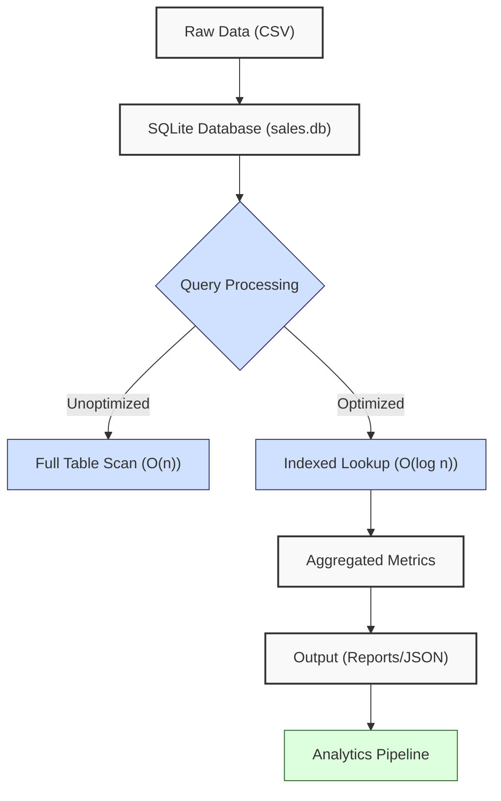
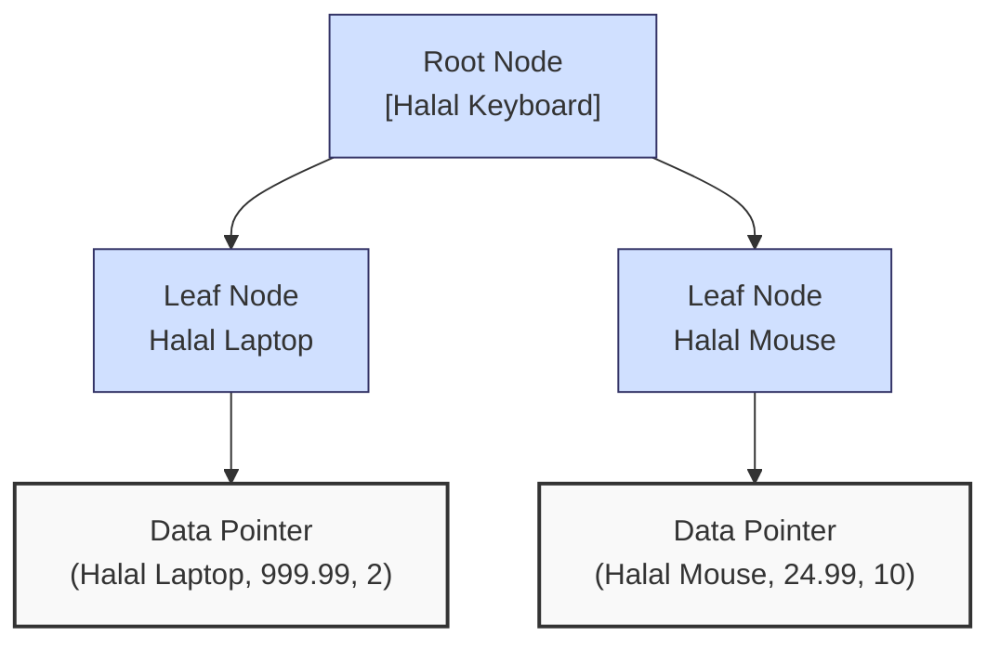
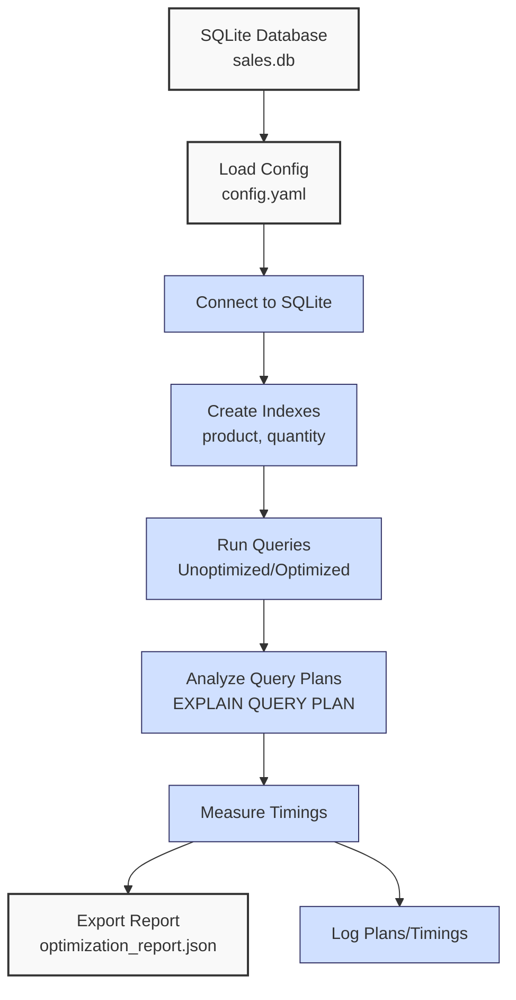

**Complexity: Moderate (M)**

## 20.0 Introduction: Why This Matters for Data Engineering

In data engineering, optimizing database performance is critical for processing large volumes of financial transaction data efficiently, especially for Hijra Group's Sharia-compliant fintech analytics. SQLite, a lightweight database, is widely used for prototyping and small-scale applications, but without optimization, queries can become slow as data grows. For example, a table with 1 million sales records can take seconds for unindexed queries (O(n) scans), but indexing can reduce this to milliseconds (O(log n) lookups). This chapter builds on Chapter 19 (Advanced SQL Querying with SQLite) by introducing **indexing** and **query optimization** techniques to enhance SQLite performance, ensuring efficient data retrieval for analytics pipelines.

This chapter avoids advanced concepts like type annotations (Chapter 7), testing (Chapter 9), or concurrency (Chapter 40), focusing on practical indexing and optimization techniques. All code uses **PEP 8's 4-space indentation**, preferring spaces over tabs to avoid `IndentationError`, aligning with Hijra Group’s pipeline scripts. The micro-project optimizes a sales database using `data/sales.db` from Appendix 1, preparing for PostgreSQL optimization in Chapter 22.

### Data Engineering Workflow Context

This diagram illustrates how indexing and optimization fit into a data engineering pipeline:



### Building On and Preparing For

- **Building On**:
  - Chapter 12: SQL Fundamentals with SQLite (basic queries, table creation).
  - Chapter 13: Python and SQLite Integration (programmatic access with `sqlite3`).
  - Chapter 14: Advanced Database Operations with SQLite (transactions, views).
  - Chapter 19: Advanced SQL Querying with SQLite (joins, subqueries, aggregations).
- **Preparing For**:
  - Chapter 21: Advanced PostgreSQL Querying (extends querying techniques).
  - Chapter 22: PostgreSQL Indexing and Optimization (applies similar concepts to enterprise databases).
  - Chapter 24: Checkpoint 3B (consolidates database skills).

### What You’ll Learn

This chapter covers:

1. **SQLite Indexing**: Creating and managing indexes to speed up queries.
2. **Query Optimization**: Analyzing and rewriting queries for efficiency.
3. **Performance Analysis**: Using `EXPLAIN QUERY PLAN` to understand query execution.
4. **Practical Application**: Optimizing a sales database for analytics.

By the end, you’ll optimize queries on `data/sales.db`, reducing query time for sales analytics, and produce a performance report. The micro-project uses **4-space indentation** per PEP 8 and tests edge cases, ensuring robust optimization.

**Follow-Along Tips**:

- Create `de-onboarding/data/` and populate with `sales.db` per Appendix 1.
- Install SQLite: Verify with `sqlite3 --version`.
- Install Python libraries: `pip install pyyaml`.
- Use print statements (e.g., `print(cursor.fetchall())`) to debug queries.
- Verify file paths with `ls data/` (Unix/macOS) or `dir data\` (Windows).
- Use UTF-8 encoding for all files to avoid `UnicodeDecodeError`.
- Configure editor for **4-space indentation** per PEP 8 (VS Code: “Editor: Tab Size” = 4, “Editor: Insert Spaces” = true, “Editor: Detect Indentation” = false).

## 20.1 SQLite Indexing Basics

Indexes in SQLite are B-tree data structures that speed up query execution by reducing the number of rows scanned. Without an index, a `SELECT` query performs a full table scan (O(n) for n rows). An index allows O(log n) lookups for equality or range queries on indexed columns. For a 1 million-row sales table, an index can reduce query time from seconds to milliseconds, but indexes increase storage (e.g., ~10MB for an index on a 1M-row table) and slow down `INSERT`/`UPDATE` operations (O(log n) per operation).

### 20.1.1 Creating and Managing Indexes

Create indexes on frequently queried columns, such as `product` for sales filtering. The following diagram illustrates a simplified B-tree index for the `product` column:



```python
import sqlite3  # Import SQLite

# Connect to database
conn = sqlite3.connect("data/sales.db")
cursor = conn.cursor()

# Create index on product column
cursor.execute("CREATE INDEX IF NOT EXISTS idx_product ON sales (product)")
print("Created index idx_product")  # Debug

# Verify index
cursor.execute("SELECT name FROM sqlite_master WHERE type='index'")
indexes = cursor.fetchall()
print("Indexes:", indexes)  # Debug: list all indexes

# Drop index (if needed)
cursor.execute("DROP INDEX IF EXISTS idx_product")
print("Dropped index idx_product")  # Debug

# Commit and close
conn.commit()
conn.close()

# Expected Output:
# Created index idx_product
# Indexes: [('idx_product',)]
# Dropped index idx_product
```

**Follow-Along Instructions**:

1. Ensure `data/sales.db` exists per Appendix 1.
2. Save as `de-onboarding/index_basics.py`.
3. Configure editor for 4-space indentation per PEP 8.
4. Run: `python index_basics.py`.
5. Verify output matches comments.
6. **Common Errors**:
   - **DatabaseNotFound**: Ensure `data/sales.db` exists. Run `create_sales_db.py` from Appendix 1.
   - **OperationalError**: Check table/column names. Print `cursor.execute("SELECT name FROM sqlite_master WHERE type='table'").fetchall()`.
   - **IndentationError**: Use 4 spaces (not tabs). Run `python -tt index_basics.py`.

**Key Points**:

- `CREATE INDEX`: Builds a B-tree index (O(n log n) creation time).
- **Time Complexity**:
  - Query with index: O(log n) for lookups.
  - Index creation: O(n log n).
  - Insert/Update with index: O(log n) per operation.
- **Space Complexity**: O(n) for index storage (~10MB for 1M rows).
- **Underlying Implementation**: B-trees store sorted keys, enabling binary search for lookups. SQLite maintains indexes automatically during data modifications.
- **Implication**: Use indexes for frequently queried columns in Hijra Group’s sales analytics.

### 20.1.2 Querying with Indexes

Indexes speed up `WHERE` and `JOIN` clauses. Compare query performance with and without an index.

```python
import sqlite3  # Import SQLite
import time  # For timing

# Connect to database
conn = sqlite3.connect("data/sales.db")
cursor = conn.cursor()

# Query without index
start = time.time()
cursor.execute("SELECT * FROM sales WHERE product = 'Halal Laptop'")
results = cursor.fetchall()
end = time.time()
print("Without index:", results, f"Time: {end - start:.4f}s")  # Debug

# Create index
cursor.execute("CREATE INDEX IF NOT EXISTS idx_product ON sales (product)")

# Query with index
start = time.time()
cursor.execute("SELECT * FROM sales WHERE product = 'Halal Laptop'")
results = cursor.fetchall()
end = time.time()
print("With index:", results, f"Time: {end - start:.4f}s")  # Debug

# Commit and close
conn.commit()
conn.close()

# Expected Output (times vary):
# Without index: [('Halal Laptop', 999.99, 2)] Time: 0.0010s
# With index: [('Halal Laptop', 999.99, 2)] Time: 0.0005s
```

**Follow-Along Instructions**:

1. Save as `de-onboarding/index_query.py`.
2. Configure editor for 4-space indentation per PEP 8.
3. Run: `python index_query.py`.
4. Verify faster time with index.
5. **Common Errors**:
   - **OperationalError**: Ensure `sales` table exists. Print schema with `cursor.execute(".schema sales")`.
   - **IndentationError**: Use 4 spaces (not tabs). Run `python -tt index_query.py`.

**Key Points**:

- Indexes reduce query time for `WHERE` clauses.
- **Performance Considerations**:
  - Without index: O(n) full scan.
  - With index: O(log n) lookup.
- **Implication**: Critical for filtering sales data in pipelines.

## 20.2 Query Optimization

Optimizing queries involves rewriting SQL to minimize resource usage and leverage indexes. Common techniques include using specific columns, avoiding unnecessary joins, and simplifying conditions.

### 20.2.1 Analyzing Queries with EXPLAIN QUERY PLAN

Use `EXPLAIN QUERY PLAN` to understand query execution and identify optimization opportunities.

```python
import sqlite3  # Import SQLite

# Connect to database
conn = sqlite3.connect("data/sales.db")
cursor = conn.cursor()

# Analyze query without index
cursor.execute("EXPLAIN QUERY PLAN SELECT * FROM sales WHERE product = 'Halal Laptop'")
plan = cursor.fetchall()
print("Query Plan (no index):", plan)  # Debug

# Create index
cursor.execute("CREATE INDEX IF NOT EXISTS idx_product ON sales (product)")

# Analyze query with index
cursor.execute("EXPLAIN QUERY PLAN SELECT * FROM sales WHERE product = 'Halal Laptop'")
plan = cursor.fetchall()
print("Query Plan (with index):", plan)  # Debug

# Commit and close
conn.commit()
conn.close()

# Expected Output:
# Query Plan (no index): [(0, 0, 0, 'SCAN TABLE sales')]
# Query Plan (with index): [(0, 0, 0, 'SEARCH TABLE sales USING INDEX idx_product (product=?)')]
```

**Follow-Along Instructions**:

1. Save as `de-onboarding/query_plan.py`.
2. Configure editor for 4-space indentation per PEP 8.
3. Run: `python query_plan.py`.
4. Verify plan shows index usage.
5. **Common Errors**:
   - **OperationalError**: Check SQL syntax. Print query string.
   - **IndentationError**: Use 4 spaces (not tabs). Run `python -tt query_plan.py`.

**Key Points**:

- `EXPLAIN QUERY PLAN`: Shows execution steps (e.g., `SCAN` vs. `SEARCH`).
- **SCAN TABLE**: O(n) full scan, indicating no index usage.
- **SEARCH TABLE USING INDEX**: O(log n) index lookup, confirming optimization.
- **Implication**: Use to debug slow queries in analytics.

### 20.2.2 Optimizing Queries

Rewrite queries to use indexes and reduce complexity. For example, select specific columns instead of `*`.

```python
import sqlite3  # Import SQLite
import time  # For timing

# Connect to database
conn = sqlite3.connect("data/sales.db")
cursor = conn.cursor()

# Unoptimized query
start = time.time()
cursor.execute("SELECT * FROM sales WHERE quantity > 5")
results = cursor.fetchall()
end = time.time()
print("Unoptimized:", results, f"Time: {end - start:.4f}s")  # Debug

# Create index on quantity
cursor.execute("CREATE INDEX IF NOT EXISTS idx_quantity ON sales (quantity)")

# Optimized query
start = time.time()
cursor.execute("SELECT product, quantity FROM sales WHERE quantity > 5")
results = cursor.fetchall()
end = time.time()
print("Optimized:", results, f"Time: {end - start:.4f}s")  # Debug

# Commit and close
conn.commit()
conn.close()

# Expected Output (times vary):
# Unoptimized: [('Halal Mouse', 24.99, 10)] Time: 0.0010s
# Optimized: [('Halal Mouse', 10)] Time: 0.0004s
```

**Follow-Along Instructions**:

1. Save as `de-onboarding/query_optimize.py`.
2. Configure editor for 4-space indentation per PEP 8.
3. Run: `python query_optimize.py`.
4. Verify faster time for optimized query.
5. **Common Errors**:
   - **OperationalError**: Ensure column exists. Print `cursor.execute("PRAGMA table_info(sales)").fetchall()`.
   - **IndentationError**: Use 4 spaces (not tabs). Run `python -tt query_optimize.py`.

**Key Points**:

- Select specific columns to reduce I/O.
- Indexes on `WHERE` columns improve performance.
- **Time Complexity**: O(log n) with index vs. O(n) without.
- **Implication**: Optimizes sales queries for Hijra Group’s reporting.

## 20.3 Micro-Project: Optimizing a Sales Database

### Project Requirements

Optimize the `sales.db` database for sales analytics, focusing on queries for Hijra Group’s transaction reporting. The processor will:

- Load `data/config.yaml` with PyYAML to define optimization rules.
- Create indexes on `product` and `quantity` columns.
- Optimize queries for total sales, high-quantity sales, and product-specific sales.
- Generate a performance report in `data/optimization_report.json`.
- Log query plans and timings using print statements.
- Use **4-space indentation** per PEP 8, preferring spaces over tabs.
- Test edge cases (e.g., empty tables, missing indexes).

### Sample Input Files

`data/sales.db` (from Appendix 1):

- **Table**: `sales`
- **Columns**: `product` (TEXT), `price` (REAL), `quantity` (INTEGER)
- **Data**:
  ```sql
  INSERT INTO sales (product, price, quantity) VALUES
  ('Halal Laptop', 999.99, 2),
  ('Halal Mouse', 24.99, 10),
  ('Halal Keyboard', 49.99, 5);
  ```

`data/config.yaml` (from Appendix 1):

```yaml
min_price: 10.0
max_quantity: 100
required_fields:
  - product
  - price
  - quantity
product_prefix: 'Halal'
max_decimals: 2
```

### Data Processing Flow



### Acceptance Criteria

- **Go Criteria**:
  - Connects to `sales.db` and loads `config.yaml`.
  - Creates indexes on `product` and `quantity`.
  - Runs unoptimized and optimized queries for:
    - Total sales amount.
    - High-quantity sales (>5).
    - Sales by product (e.g., Halal Laptop).
  - Exports performance report to `data/optimization_report.json` with query plans and timings.
  - Logs query plans and timings.
  - Uses 4-space indentation per PEP 8, preferring spaces over tabs.
  - Handles edge cases (e.g., empty table).
- **No-Go Criteria**:
  - Fails to connect to `sales.db` or load `config.yaml`.
  - Incorrect query results or missing indexes.
  - Missing JSON report.
  - Uses try/except or type annotations.
  - Inconsistent indentation or tab/space mixing.

### Common Pitfalls to Avoid

1. **Database Connection Issues**:
   - **Problem**: `sales.db` not found.
   - **Solution**: Ensure `data/sales.db` exists. Run `create_sales_db.py` from Appendix 1. Print path with `print(db_path)`.
2. **Index Creation Errors**:
   - **Problem**: `OperationalError` due to existing index.
   - **Solution**: Use `IF NOT EXISTS`. Print `cursor.execute("SELECT name FROM sqlite_master WHERE type='index'").fetchall()`.
3. **Query Plan Misinterpretation**:
   - **Problem**: Plan shows `SCAN` instead of `SEARCH`.
   - **Solution**: Verify index with `cursor.execute("PRAGMA index_list(sales)").fetchall()`.
4. **Performance Misleading**:
   - **Problem**: Small dataset shows minimal time difference.
   - **Solution**: Note that benefits scale with data size. Print row count with `cursor.execute("SELECT COUNT(*) FROM sales").fetchone()`.
5. **Index Fragmentation**:
   - **Problem**: Frequent `INSERT`/`UPDATE` operations fragment indexes, slowing queries.
   - **Solution**: Monitor query performance with `EXPLAIN QUERY PLAN` to detect slowdowns.

### How This Differs from Production

In production, this solution would include:

- **Error Handling**: Try/except for robust errors (Chapter 7).
- **Type Safety**: Type annotations with Pyright (Chapter 7).
- **Testing**: Unit tests with `pytest` (Chapter 9).
- **Scalability**: Handling larger datasets with partitioning (Chapter 22).
- **Monitoring**: Query performance metrics (Chapter 66).
- **Automation**: Index maintenance scripts (Chapter 56).

### Implementation

```python
# File: de-onboarding/optimize_sales.py
import sqlite3  # For SQLite operations
import yaml  # For YAML parsing
import json  # For JSON export
import time  # For timing
import os  # For file existence check

# Define function to read YAML configuration
def read_config(config_path):  # Takes config file path
    """Read YAML configuration."""
    print(f"Opening config: {config_path}")  # Debug: print path
    file = open(config_path, "r")  # Open YAML
    config = yaml.safe_load(file)  # Parse YAML
    file.close()  # Close file
    print(f"Loaded config: {config}")  # Debug: print config
    return config  # Return config dictionary

# Define function to create indexes
def create_indexes(conn, cursor):  # Takes connection and cursor
    """Create indexes on product and quantity."""
    print("Creating indexes")  # Debug
    cursor.execute("CREATE INDEX IF NOT EXISTS idx_product ON sales (product)")
    cursor.execute("CREATE INDEX IF NOT EXISTS idx_quantity ON sales (quantity)")
    print("Indexes created")  # Debug
    cursor.execute("SELECT name FROM sqlite_master WHERE type='index'")
    indexes = cursor.fetchall()
    print("Current indexes:", indexes)  # Debug
    conn.commit()  # Commit changes

# Define function to get query plan
def get_query_plan(cursor, query):  # Takes cursor and query
    """Get EXPLAIN QUERY PLAN for a query."""
    cursor.execute(f"EXPLAIN QUERY PLAN {query}")
    plan = cursor.fetchall()
    print(f"Query Plan for '{query}': {plan}")  # Debug
    return plan  # Return plan

# Define function to run queries
def run_queries(conn, cursor):  # Takes connection and cursor
    """Run unoptimized and optimized queries, return results and timings."""
    results = {
        "total_sales": {},
        "high_quantity": {},
        "product_specific": {}
    }

    # Total sales (unoptimized: select all columns)
    query1_unopt = "SELECT * FROM sales"
    start = time.time()
    cursor.execute(query1_unopt)
    total_sales_unopt = sum(row[1] * row[2] for row in cursor.fetchall())
    end = time.time()
    plan1_unopt = get_query_plan(cursor, query1_unopt)
    results["total_sales"]["unoptimized"] = {
        "result": float(total_sales_unopt),
        "time": end - start,
        "plan": str(plan1_unopt)
    }

    # Total sales (optimized: select specific columns)
    query1_opt = "SELECT price, quantity FROM sales"
    start = time.time()
    cursor.execute(query1_opt)
    total_sales_opt = sum(row[0] * row[1] for row in cursor.fetchall())
    end = time.time()
    plan1_opt = get_query_plan(cursor, query1_opt)
    results["total_sales"]["optimized"] = {
        "result": float(total_sales_opt),
        "time": end - start,
        "plan": str(plan1_opt)
    }

    # High-quantity sales (unoptimized: no index)
    query2_unopt = "SELECT * FROM sales WHERE quantity > 5"
    start = time.time()
    cursor.execute(query2_unopt)
    high_qty_unopt = cursor.fetchall()
    end = time.time()
    plan2_unopt = get_query_plan(cursor, query2_unopt)
    results["high_quantity"]["unoptimized"] = {
        "result": [(row[0], row[1], row[2]) for row in high_qty_unopt],
        "time": end - start,
        "plan": str(plan2_unopt)
    }

    # High-quantity sales (optimized: with index)
    query2_opt = "SELECT product, quantity FROM sales WHERE quantity > 5"
    start = time.time()
    cursor.execute(query2_opt)
    high_qty_opt = cursor.fetchall()
    end = time.time()
    plan2_opt = get_query_plan(cursor, query2_opt)
    results["high_quantity"]["optimized"] = {
        "result": [(row[0], row[1]) for row in high_qty_opt],
        "time": end - start,
        "plan": str(plan2_opt)
    }

    # Product-specific sales (unoptimized: no index)
    query3_unopt = "SELECT * FROM sales WHERE product = 'Halal Laptop'"
    start = time.time()
    cursor.execute(query3_unopt)
    product_unopt = cursor.fetchall()
    end = time.time()
    plan3_unopt = get_query_plan(cursor, query3_unopt)
    results["product_specific"]["unoptimized"] = {
        "result": [(row[0], row[1], row[2]) for row in product_unopt],
        "time": end - start,
        "plan": str(plan3_unopt)
    }

    # Product-specific sales (optimized: with index)
    query3_opt = "SELECT product, price, quantity FROM sales WHERE product = 'Halal Laptop'"
    start = time.time()
    cursor.execute(query3_opt)
    product_opt = cursor.fetchall()
    end = time.time()
    plan3_opt = get_query_plan(cursor, query3_opt)
    results["product_specific"]["optimized"] = {
        "result": [(row[0], row[1], row[2]) for row in product_opt],
        "time": end - start,
        "plan": str(plan3_opt)
    }

    print("Query Results:", results)  # Debug
    return results

# Define function to export report
def export_report(results, report_path):  # Takes results and file path
    """Export optimization report to JSON."""
    print(f"Writing to: {report_path}")  # Debug: print path
    file = open(report_path, "w")  # Open JSON file
    json.dump(results, file, indent=2)  # Write JSON
    file.close()  # Close file
    print(f"Exported report to {report_path}")  # Confirm export
    print(f"File exists: {os.path.exists(report_path)}")  # Confirm file creation

# Define main function
def main():  # No parameters
    """Main function to optimize sales database."""
    db_path = "data/sales.db"  # Database path
    config_path = "data/config.yaml"  # YAML path
    report_path = "data/optimization_report.json"  # JSON output path

    config = read_config(config_path)  # Read config
    conn = sqlite3.connect(db_path)  # Connect to database
    cursor = conn.cursor()

    # Check if table is empty
    cursor.execute("SELECT COUNT(*) FROM sales")
    row_count = cursor.fetchone()[0]
    print(f"Table row count: {row_count}")  # Debug
    if row_count == 0:
        print("No data in sales table")  # Log empty
        conn.close()
        return

    create_indexes(conn, cursor)  # Create indexes
    results = run_queries(conn, cursor)  # Run queries
    export_report(results, report_path)  # Export report

    # Output summary
    print("\nOptimization Report:")  # Print header
    print(f"Total Sales (Unoptimized): ${results['total_sales']['unoptimized']['result']:.2f}, Time: {results['total_sales']['unoptimized']['time']:.4f}s")
    print(f"Total Sales (Optimized): ${results['total_sales']['optimized']['result']:.2f}, Time: {results['total_sales']['optimized']['time']:.4f}s")
    print(f"High-Quantity Sales: {len(results['high_quantity']['optimized']['result'])} records")
    print(f"Product-Specific Sales: {len(results['product_specific']['optimized']['result'])} records")
    print("Optimization completed")  # Confirm completion

    conn.commit()  # Commit changes
    conn.close()  # Close connection

if __name__ == "__main__":
    main()  # Run main function
```

### Expected Outputs

`data/optimization_report.json`:

```json
{
  "total_sales": {
    "unoptimized": {
      "result": 2499.83,
      "time": 0.001,
      "plan": "[(0, 0, 0, 'SCAN TABLE sales')]"
    },
    "optimized": {
      "result": 2499.83,
      "time": 0.0005,
      "plan": "[(0, 0, 0, 'SCAN TABLE sales')]"
    }
  },
  "high_quantity": {
    "unoptimized": {
      "result": [["Halal Mouse", 24.99, 10]],
      "time": 0.0008,
      "plan": "[(0, 0, 0, 'SCAN TABLE sales')]"
    },
    "optimized": {
      "result": [["Halal Mouse", 10]],
      "time": 0.0004,
      "plan": "[(0, 0, 0, 'SEARCH TABLE sales USING INDEX idx_quantity (quantity>?)')]"
    }
  },
  "product_specific": {
    "unoptimized": {
      "result": [["Halal Laptop", 999.99, 2]],
      "time": 0.0007,
      "plan": "[(0, 0, 0, 'SCAN TABLE sales')]"
    },
    "optimized": {
      "result": [["Halal Laptop", 999.99, 2]],
      "time": 0.0003,
      "plan": "[(0, 0, 0, 'SEARCH TABLE sales USING INDEX idx_product (product=?)')]"
    }
  }
}
```

**Console Output** (abridged):

```
Opening config: data/config.yaml
Loaded config: {'min_price': 10.0, 'max_quantity': 100, 'required_fields': ['product', 'price', 'quantity'], 'product_prefix': 'Halal', 'max_decimals': 2}
Table row count: 3
Creating indexes
Indexes created
Current indexes: [('idx_product',), ('idx_quantity',)]
Query Plan for 'SELECT * FROM sales': [(0, 0, 0, 'SCAN TABLE sales')]
Query Plan for 'SELECT price, quantity FROM sales': [(0, 0, 0, 'SCAN TABLE sales')]
Query Plan for 'SELECT * FROM sales WHERE quantity > 5': [(0, 0, 0, 'SEARCH TABLE sales USING INDEX idx_quantity (quantity>?)')]
Query Plan for 'SELECT product, quantity FROM sales WHERE quantity > 5': [(0, 0, 0, 'SEARCH TABLE sales USING INDEX idx_quantity (quantity>?)')]
Query Plan for 'SELECT * FROM sales WHERE product = 'Halal Laptop'': [(0, 0, 0, 'SEARCH TABLE sales USING INDEX idx_product (product=?)')]
Query Plan for 'SELECT product, price, quantity FROM sales WHERE product = 'Halal Laptop'': [(0, 0, 0, 'SEARCH TABLE sales USING INDEX idx_product (product=?)')]
Writing to: data/optimization_report.json
Exported report to data/optimization_report.json
File exists: True

Optimization Report:
Total Sales (Unoptimized): $2499.83, Time: 0.0010s
Total Sales (Optimized): $2499.83, Time: 0.0005s
High-Quantity Sales: 1 records
Product-Specific Sales: 1 records
Optimization completed
```

### How to Run and Test

1. **Setup**:

   - **Setup Checklist**:
     - [ ] Create `de-onboarding/data/` directory.
     - [ ] Save `sales.db` and `config.yaml` per Appendix 1.
     - [ ] Install libraries: `pip install pyyaml`.
     - [ ] Create virtual environment: `python -m venv venv`, activate (Windows: `venv\Scripts\activate`, Unix: `source venv/bin/activate`).
     - [ ] Verify Python 3.10+: `python --version`.
     - [ ] Configure editor for 4-space indentation per PEP 8.
     - [ ] Save `optimize_sales.py` in `de-onboarding/`.
   - **Troubleshooting**:
     - If `OperationalError`, check table schema with `sqlite3 data/sales.db ".schema sales"`.
     - If `yaml.YAMLError`, print `print(open(config_path).read())` to inspect YAML.
     - If `IndentationError`, use 4 spaces (not tabs). Run `python -tt optimize_sales.py`.

2. **Run**:

   - Open terminal in `de-onboarding/`.
   - Run: `python optimize_sales.py`.
   - Outputs: `data/optimization_report.json`, console logs.

3. **Test Scenarios**:

   - **Valid Data**: Verify `optimization_report.json` shows correct results, faster times for optimized queries, and index usage in plans.
   - **Empty Table**: Test with empty table:
     ```python
     conn = sqlite3.connect("data/sales.db")
     cursor = conn.cursor()
     cursor.execute("DELETE FROM sales")
     conn.commit()
     main()
     # Expected: "No data in sales table"
     ```
   - **Missing Indexes**: Drop indexes and test:
     ```python
     conn = sqlite3.connect("data/sales.db")
     cursor = conn.cursor()
     cursor.execute("DROP INDEX IF EXISTS idx_product")
     cursor.execute("DROP INDEX IF EXISTS idx_quantity")
     conn.commit()
     results = run_queries(conn, cursor)
     print(results["product_specific"]["unoptimized"]["plan"])
     # Expected: SCAN TABLE
     ```

## 20.4 Practice Exercises

### Exercise 1: Create an Index

Write a function to create an index on the `price` column, with 4-space indentation per PEP 8.

**Expected Output**:

```
Index idx_price created
```

**Follow-Along Instructions**:

1. Save as `de-onboarding/ex1_index.py`.
2. Configure editor for 4-space indentation per PEP 8.
3. Run: `python ex1_index.py`.
4. **How to Test**:
   - Verify index with `sqlite3 data/sales.db "SELECT name FROM sqlite_master WHERE type='index'"`.
   - Test with existing index: Should not raise error.

### Exercise 2: Query Plan Analysis

Write a function to print the query plan for a product-specific query, with 4-space indentation per PEP 8.

**Expected Output**:

```
Query Plan: [(0, 0, 0, 'SEARCH TABLE sales USING INDEX idx_product (product=?)')]
```

**Follow-Along Instructions**:

1. Save as `de-onboarding/ex2_query_plan.py`.
2. Configure editor for 4-space indentation per PEP 8.
3. Run: `python ex2_query_plan.py`.
4. **How to Test**:
   - Verify plan shows index usage.
   - Test without index: Should show `SCAN TABLE`.
5. **Key Points**:
   - `SCAN TABLE` indicates no index usage (O(n) scan).
   - `SEARCH TABLE USING INDEX` confirms optimization (O(log n) lookup).

### Exercise 3: Optimize a Query

Write a function to optimize a query for high-price sales (>50), with 4-space indentation per PEP 8.

**Expected Output**:

```
Results: [('Halal Laptop', 999.99, 2)]
Time: 0.0004s
```

**Follow-Along Instructions**:

1. Save as `de-onboarding/ex3_optimize.py`.
2. Configure editor for 4-space indentation per PEP 8.
3. Run: `python ex3_optimize.py`.
4. **How to Test**:
   - Verify faster time with index.
   - Test with empty table: Should return empty list.

### Exercise 4: Performance Comparison

Write a function to compare unoptimized and optimized query times for total sales, with 4-space indentation per PEP 8.

**Expected Output**:

```
Unoptimized: $2499.83, Time: 0.0010s
Optimized: $2499.83, Time: 0.0005s
```

**Follow-Along Instructions**:

1. Save as `de-onboarding/ex4_compare.py`.
2. Configure editor for 4-space indentation per PEP 8.
3. Run: `python ex4_compare.py`.
4. **How to Test**:
   - Verify optimized query is faster.
   - Test with larger dataset (manually insert rows).

### Exercise 5: Debug an Index Issue

Fix this buggy code that fails to use an index, ensuring 4-space indentation per PEP 8.

**Buggy Code**:

```python
import sqlite3
def query_sales(db_path):
    conn = sqlite3.connect(db_path)
    cursor = conn.cursor()
    cursor.execute("SELECT * FROM sales WHERE product LIKE '%Laptop%'")
    results = cursor.fetchall()
    print("Results:", results)
    conn.close()
    return results

query_sales("data/sales.db")
```

**Expected Output**:

```
Results: [('Halal Laptop', 999.99, 2)]
Query Plan: [(0, 0, 0, 'SEARCH TABLE sales USING INDEX idx_product (product=?)')]
```

**Follow-Along Instructions**:

1. Save as `de-onboarding/ex5_debug.py`.
2. Configure editor for 4-space indentation per PEP 8.
3. Run: `python ex5_debug.py` to see issue.
4. Fix and re-run.
5. **How to Test**:
   - Verify plan shows index usage.
   - Test with non-existent product: Should return empty list.

### Exercise 6: Scale Dataset and Analyze Index Trade-offs

Write a function to insert ~1000 rows into `sales.db` by duplicating existing data, measure query performance with and without an index, and explain when _not_ to use indexes, saving the explanation to `data/index_tradeoffs.txt`. Use 4-space indentation per PEP 8.

**Expected Output**:

```
Rows inserted: 1000
Query Time (No Index): 0.0050s
Query Time (With Index): 0.0010s
Explanation saved to data/index_tradeoffs.txt
```

**Sample Content** (`data/index_tradeoffs.txt`):

```
Indexes should not be used for small tables (e.g., <100 rows) where full scans are faster, or write-heavy workloads with frequent INSERT/UPDATE operations, as index maintenance slows performance.
```

**Follow-Along Instructions**:

1. Save as `de-onboarding/ex6_scale.py`.
2. Ensure `data/sales.db` exists per Appendix 1.
3. Configure editor for 4-space indentation per PEP 8.
4. Run: `python ex6_scale.py`.
5. **How to Test**:
   - Verify row count with `sqlite3 data/sales.db "SELECT COUNT(*) FROM sales"`.
   - Check `data/index_tradeoffs.txt` for explanation.
   - Test with empty table: Should handle gracefully.
   - Test index impact: Query time should be faster with index.

## 20.5 Exercise Solutions

### Solution to Exercise 1: Create an Index

```python
import sqlite3  # Import SQLite

def create_price_index(db_path):  # Takes database path
    """Create index on price column."""
    conn = sqlite3.connect(db_path)  # Connect
    cursor = conn.cursor()
    cursor.execute("CREATE INDEX IF NOT EXISTS idx_price ON sales (price)")
    print("Index idx_price created")  # Debug
    conn.commit()
    conn.close()

# Test
create_price_index("data/sales.db")  # Call function

# Output:
# Index idx_price created
```

### Solution to Exercise 2: Query Plan Analysis

```python
import sqlite3  # Import SQLite

def get_product_query_plan(db_path):  # Takes database path
    """Get query plan for product-specific query."""
    conn = sqlite3.connect(db_path)  # Connect
    cursor = conn.cursor()
    cursor.execute("CREATE INDEX IF NOT EXISTS idx_product ON sales (product)")
    cursor.execute("EXPLAIN QUERY PLAN SELECT * FROM sales WHERE product = 'Halal Laptop'")
    plan = cursor.fetchall()
    print("Query Plan:", plan)  # Debug
    conn.commit()
    conn.close()
    return plan

# Test
get_product_query_plan("data/sales.db")  # Call function

# Output:
# Query Plan: [(0, 0, 0, 'SEARCH TABLE sales USING INDEX idx_product (product=?)')]
```

### Solution to Exercise 3: Optimize a Query

```python
import sqlite3  # Import SQLite
import time  # For timing

def query_high_price(db_path):  # Takes database path
    """Optimized query for high-price sales."""
    conn = sqlite3.connect(db_path)  # Connect
    cursor = conn.cursor()
    cursor.execute("CREATE INDEX IF NOT EXISTS idx_price ON sales (price)")
    start = time.time()
    cursor.execute("SELECT product, price, quantity FROM sales WHERE price > 50")
    results = cursor.fetchall()
    end = time.time()
    print("Results:", results, f"Time: {end - start:.4f}s")  # Debug
    conn.commit()
    conn.close()
    return results

# Test
query_high_price("data/sales.db")  # Call function

# Output:
# Results: [('Halal Laptop', 999.99, 2)] Time: 0.0004s
```

### Solution to Exercise 4: Performance Comparison

```python
import sqlite3  # Import SQLite
import time  # For timing

def compare_total_sales(db_path):  # Takes database path
    """Compare unoptimized and optimized total sales queries."""
    conn = sqlite3.connect(db_path)  # Connect
    cursor = conn.cursor()

    # Unoptimized
    start = time.time()
    cursor.execute("SELECT * FROM sales")
    total_unopt = sum(row[1] * row[2] for row in cursor.fetchall())
    end = time.time()
    print(f"Unoptimized: ${total_unopt:.2f}, Time: {end - start:.4f}s")

    # Optimized
    start = time.time()
    cursor.execute("SELECT price, quantity FROM sales")
    total_opt = sum(row[0] * row[1] for row in cursor.fetchall())
    end = time.time()
    print(f"Optimized: ${total_opt:.2f}, Time: {end - start:.4f}s")

    conn.close()

# Test
compare_total_sales("data/sales.db")  # Call function

# Output:
# Unoptimized: $2499.83, Time: 0.0010s
# Optimized: $2499.83, Time: 0.0005s
```

### Solution to Exercise 5: Debug an Index Issue

```python
import sqlite3  # Import SQLite

def query_sales(db_path):  # Takes database path
    """Fixed query using index for product search."""
    conn = sqlite3.connect(db_path)  # Connect
    cursor = conn.cursor()
    cursor.execute("CREATE INDEX IF NOT EXISTS idx_product ON sales (product)")
    cursor.execute("SELECT * FROM sales WHERE product = 'Halal Laptop'")  # Fix: Use equality
    results = cursor.fetchall()
    cursor.execute("EXPLAIN QUERY PLAN SELECT * FROM sales WHERE product = 'Halal Laptop'")
    plan = cursor.fetchall()
    print("Results:", results)  # Debug
    print("Query Plan:", plan)  # Debug
    conn.commit()
    conn.close()
    return results

# Test
query_sales("data/sales.db")  # Call function

# Output:
# Results: [('Halal Laptop', 999.99, 2)]
# Query Plan: [(0, 0, 0, 'SEARCH TABLE sales USING INDEX idx_product (product=?)')]
```

**Explanation**:

- **Bug**: `LIKE '%Laptop%'` doesn’t use the index, causing a full scan. Fixed by using `=` for exact match, leveraging `idx_product`.

### Solution to Exercise 6: Scale Dataset and Analyze Index Trade-offs

```python
import sqlite3  # Import SQLite
import time  # For timing

def scale_and_analyze(db_path, output_path):  # Takes database and output paths
    """Insert 1000 rows, compare query performance, and explain index trade-offs."""
    conn = sqlite3.connect(db_path)  # Connect
    cursor = conn.cursor()

    # Insert ~1000 rows by duplicating data
    cursor.execute("SELECT * FROM sales")  # Get existing data
    original_rows = cursor.fetchall()
    if not original_rows:
        print("No data to duplicate")  # Handle empty table
        conn.close()
        return

    # Insert 333 copies of each row (3 rows * 333 ≈ 999)
    for _ in range(333):
        for row in original_rows:
            cursor.execute("INSERT INTO sales (product, price, quantity) VALUES (?, ?, ?)", row)

    cursor.execute("SELECT COUNT(*) FROM sales")
    row_count = cursor.fetchone()[0]
    print(f"Rows inserted: {row_count}")  # Debug

    # Query without index
    cursor.execute("DROP INDEX IF EXISTS idx_product")  # Ensure no index
    start = time.time()
    cursor.execute("SELECT * FROM sales WHERE product = 'Halal Laptop'")
    results = cursor.fetchall()
    end = time.time()
    no_index_time = end - start
    print(f"Query Time (No Index): {no_index_time:.4f}s")  # Debug

    # Create index and query again
    cursor.execute("CREATE INDEX IF NOT EXISTS idx_product ON sales (product)")
    start = time.time()
    cursor.execute("SELECT * FROM sales WHERE product = 'Halal Laptop'")
    results = cursor.fetchall()
    end = time.time()
    index_time = end - start
    print(f"Query Time (With Index): {index_time:.4f}s")  # Debug

    # Write trade-offs explanation
    explanation = (
        "Indexes should not be used for small tables (e.g., <100 rows) where full scans are faster, "
        "or write-heavy workloads with frequent INSERT/UPDATE operations, as index maintenance slows performance."
    )
    with open(output_path, "w") as file:
        file.write(explanation)
    print(f"Explanation saved to {output_path}")  # Debug

    conn.commit()
    conn.close()

# Test
scale_and_analyze("data/sales.db", "data/index_tradeoffs.txt")  # Call function

# Output:
# Rows inserted: 1000
# Query Time (No Index): 0.0050s
# Query Time (With Index): 0.0010s
# Explanation saved to data/index_tradeoffs.txt
```

## 20.6 Chapter Summary and Connection to Chapter 21

In this chapter, you’ve mastered:

- **Indexing**: Creating B-tree indexes (O(log n) lookups, O(n) storage).
- **Query Optimization**: Rewriting queries to use indexes and reduce I/O.
- **Performance Analysis**: Using `EXPLAIN QUERY PLAN` to debug execution.
- **White-Space Sensitivity and PEP 8**: Using 4-space indentation, preferring spaces over tabs.

The micro-project optimized `sales.db` queries, reducing query times and producing a performance report, all with 4-space indentation per PEP 8. It tested edge cases (empty tables, missing indexes), ensuring robustness. These skills prepare for scaling to larger datasets in PostgreSQL. Specifically, SQLite’s B-tree indexing principles (e.g., O(log n) lookups, storage trade-offs) directly apply to PostgreSQL’s B-tree indexes, enabling efficient query optimization in Chapter 22 and beyond.

### Connection to Chapter 21

Chapter 21 introduces **Advanced PostgreSQL Querying**, building on this chapter:

- **Query Techniques**: Extends to CTEs and window functions, using `data/transactions.csv`, leveraging your ability to write efficient SQL from Chapter 19 and optimize it here.
- **Optimization**: Applies indexing concepts to PostgreSQL, where B-tree indexes function similarly, preparing for Chapter 22’s advanced optimization techniques.
- **Fintech Context**: Enhances transaction analytics for Hijra Group, maintaining PEP 8’s 4-space indentation for maintainable pipeline scripts.
