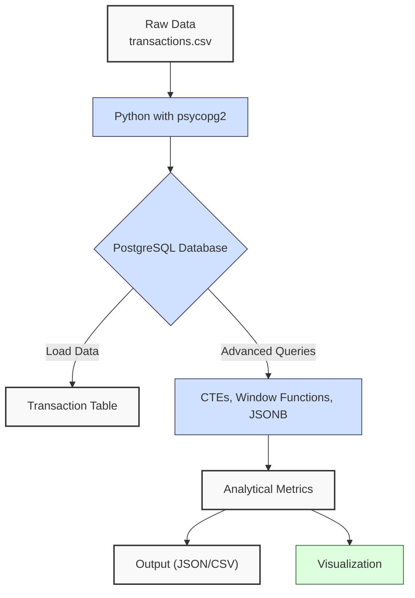
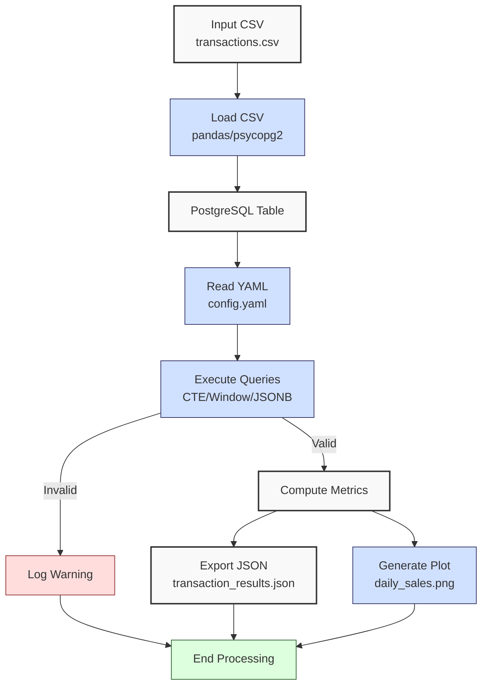

**Complexity: Moderate (M)**

## 21.0 Introduction: Why This Matters for Data Engineering

Advanced PostgreSQL querying is a cornerstone of data engineering at Hijra Group, enabling complex analytics on financial transaction data for Sharia-compliant fintech solutions. PostgreSQL’s advanced features, such as Common Table Expressions (CTEs), window functions, and JSONB querying, allow sophisticated data transformations within the database, reducing external processing and improving performance. For a dataset like `transactions.csv` with 1 million rows (~100MB), CTEs and window functions can reduce query execution time by 20–50% compared to subqueries, leveraging PostgreSQL’s query planner for efficient joins and aggregations. This chapter builds on Chapters 16 (PostgreSQL Fundamentals) and 17 (Python and PostgreSQL Integration), introducing advanced querying techniques to prepare for indexing and optimization in Chapter 22 and type-safe integration in Chapter 23.

This chapter uses type-annotated Python code verified by Pyright (introduced in Chapter 7) and includes `pytest` tests (introduced in Chapter 9) to ensure query reliability. All code adheres to **PEP 8’s 4-space indentation**, preferring spaces over tabs to avoid `IndentationError`. The micro-project processes `data/transactions.csv` to generate analytical reports, aligning with Hijra Group’s need for actionable insights from transaction data.

### Data Engineering Workflow Context

The following diagram illustrates how advanced PostgreSQL querying fits into a data engineering pipeline:



### Building On and Preparing For

- **Building On**:
  - Chapter 12: SQL Fundamentals with SQLite (basic SELECT, JOIN).
  - Chapter 16: PostgreSQL Fundamentals (basic queries, `psycopg2`).
  - Chapter 17: Python and PostgreSQL Integration (programmatic queries, YAML configs).
  - Chapter 19: Advanced SQL Querying with SQLite (joins, subqueries).
- **Preparing For**:
  - Chapter 22: PostgreSQL Indexing and Optimization (query performance).
  - Chapter 23: Type-Safe Database Integration (Pydantic validation).
  - Chapter 24: Checkpoint 3B (consolidates database skills).
  - Chapter 53: FastAPI (API integration with PostgreSQL).

### What You’ll Learn

This chapter covers:

1. **Common Table Expressions (CTEs)**: Simplify complex queries.
2. **Window Functions**: Compute running totals and rankings.
3. **JSONB Querying**: Handle semi-structured data.
4. **Type-Safe Query Execution**: Use `psycopg2` with type annotations.
5. **Testing Queries**: Validate results with `pytest`.

The micro-project builds a type-annotated query tool to analyze `data/transactions.csv`, producing metrics like daily sales trends and top products, exported to JSON and visualized with Matplotlib, all using 4-space indentation per PEP 8.

**Follow-Along Tips**:

- Create `de-onboarding/data/` and populate with `transactions.csv` and `config.yaml` per Appendix 1.
- Install libraries: `pip install psycopg2-binary pandas matplotlib pyyaml pytest`.
- Set up PostgreSQL (version 15+ recommended) and create a database (`hijra_db`).
- Configure editor for **4-space indentation** per PEP 8 (VS Code: “Editor: Tab Size” = 4, “Editor: Insert Spaces” = true, “Editor: Detect Indentation” = false).
- Use print statements (e.g., `print(query)`) to debug SQL queries.
- Verify file paths with `ls data/` (Unix/macOS) or `dir data\` (Windows).
- Use UTF-8 encoding to avoid `UnicodeDecodeError`.

## 21.1 Common Table Expressions (CTEs)

CTEs provide a way to define temporary result sets within a query, improving readability and modularity. This chapter focuses on non-recursive CTEs, which are executed once and materialized in memory, offering O(n) complexity for data access. They are more efficient than subqueries for complex joins due to PostgreSQL’s query planner optimizations, making them ideal for aggregating sales data in Hijra Group’s analytics.

### 21.1.1 Using CTEs for Sales Aggregation

Compute total sales by date using a CTE to filter valid transactions.

```python
from typing import List, Dict
import psycopg2
from psycopg2.extras import RealDictCursor

# Type-annotated connection function
def get_db_connection(config: Dict[str, str]) -> psycopg2.extensions.connection:
    """Connect to PostgreSQL database."""
    return psycopg2.connect(
        dbname=config["dbname"],
        user=config["user"],
        password=config["password"],
        host=config["host"],
        cursor_factory=RealDictCursor
    )

# Query using CTE
def query_sales_by_date(config: Dict[str, str]) -> List[Dict]:
    """Query total sales by date using CTE."""
    query = """
    WITH valid_transactions AS (
        SELECT product, price, quantity, date
        FROM transactions
        WHERE product IS NOT NULL
        AND price > 0
        AND quantity > 0
    )
    SELECT date, SUM(price * quantity) as total_sales
    FROM valid_transactions
    GROUP BY date
    ORDER BY date;
    """
    print(f"Executing query:\n{query}")  # Debug: print query for inspection
    conn = get_db_connection(config)
    cursor = conn.cursor()
    cursor.execute(query)
    results = cursor.fetchall()
    cursor.close()
    conn.close()
    print(f"Query results: {results}")  # Debug: print results
    return results

# Example usage
config = {
    "dbname": "hijra_db",
    "user": "postgres",
    "password": "password",
    "host": "localhost"
}
results = query_sales_by_date(config)
```

**Follow-Along Instructions**:

1. Ensure PostgreSQL is running and `hijra_db` exists.
2. Create `transactions` table and load `data/transactions.csv` (see micro-project).
3. Save as `de-onboarding/cte_query.py`.
4. Configure editor for 4-space indentation per PEP 8.
5. Run: `python cte_query.py`.
6. Verify output shows daily sales (e.g., `{'date': '2023-10-01', 'total_sales': 1999.98}`).
7. **Common Errors**:
   - **psycopg2.OperationalError**: Check PostgreSQL connection details. Print `config`.
   - **psycopg2.ProgrammingError**: Verify table/column names. Print `query` and test in `psql`.
   - **IndentationError**: Use 4 spaces (not tabs). Run `python -tt cte_query.py`.

**Key Points**:

- **Syntax**: `WITH cte_name AS (SELECT ...) SELECT ... FROM cte_name`.
- **Performance**: O(n) for scanning n rows, optimized by PostgreSQL’s query planner for joins.
- **Space Complexity**: O(k) for k rows in CTE result.
- **Implication**: Simplifies complex analytics, e.g., daily sales aggregation for Hijra Group’s reporting.

## 21.2 Window Functions

Window functions compute values over a set of rows (window) without collapsing the result, ideal for running totals or rankings. They have O(n log n) complexity for sorting operations (e.g., `RANK()`), but PostgreSQL optimizes with index usage, which is explored in Chapter 22.

### 21.2.1 Running Total with Window Functions

Calculate a running total of sales by date.

```python
from typing import List, Dict
import psycopg2
from psycopg2.extras import RealDictCursor

def query_running_total(config: Dict[str, str]) -> List[Dict]:
    """Query running total of sales by date."""
    query = """
    SELECT
        date,
        product,
        price * quantity as sale_amount,
        SUM(price * quantity) OVER (
            ORDER BY date
            ROWS BETWEEN UNBOUNDED PRECEDING AND CURRENT ROW
        ) as running_total
    FROM transactions
    WHERE product IS NOT NULL
    AND price > 0
    AND quantity > 0
    ORDER BY date;
    """
    print(f"Executing query:\n{query}")  # Debug: print query
    conn = get_db_connection(config)
    cursor = conn.cursor()
    cursor.execute(query)
    results = cursor.fetchall()
    cursor.close()
    conn.close()
    print(f"Query results: {results}")  # Debug: print results
    return results
```

**Follow-Along Instructions**:

1. Save as `de-onboarding/window_query.py`.
2. Configure editor for 4-space indentation per PEP 8.
3. Run: `python window_query.py`.
4. Verify output shows running totals (e.g., `running_total: 2499.83` for the last row).
5. **Common Errors**:
   - **psycopg2.ProgrammingError**: Check window function syntax. Print `query` and test in `psql`.
   - **IndentationError**: Use 4 spaces. Run `python -tt window_query.py`.

**Key Points**:

- **Syntax**: `SUM(...) OVER (PARTITION BY ... ORDER BY ...)` defines the window.
- **Performance**: O(n log n) for sorting, O(n) for computation.
- **Space Complexity**: O(n) for output rows.
- **Implication**: Enables time-series analytics, e.g., cumulative sales for Hijra Group’s dashboards.

## 21.3 JSONB Querying

JSONB stores semi-structured data, allowing flexible querying with operators like `->>` (extract value) and `@>` (contains key-value pair). This is particularly useful for customer segmentation in Hijra Group’s Sharia-compliant fintech analytics, enabling profiling of customer transactions without rigid schemas. Querying JSONB has O(n) complexity without indexes, reducible to O(log n) with GIN indexes (covered in Chapter 22). **Note**: The `metadata` JSONB column used in examples is created during the micro-project’s database setup (see Section 21.4).

### 21.3.1 Querying JSONB Data

Query transactions with JSONB metadata (e.g., customer info).

```python
from typing import List, Dict
import psycopg2
from psycopg2.extras import RealDictCursor

def query_jsonb_data(config: Dict[str, str]) -> List[Dict]:
    """Query transactions with JSONB metadata."""
    query = """
    SELECT
        product,
        price,
        quantity,
        metadata->>'customer_id' as customer_id
    FROM transactions
    WHERE metadata @> '{"customer_id": "C001"}'::jsonb
    AND price > 0;
    """
    print(f"Executing query:\n{query}")  # Debug: print query
    conn = get_db_connection(config)
    cursor = conn.cursor()
    cursor.execute(query)
    results = cursor.fetchall()
    cursor.close()
    conn.close()
    print(f"Query results: {results}")  # Debug: print results
    return results
```

**Follow-Along Instructions**:

1. Ensure `transactions` table has a `metadata` JSONB column (created in micro-project).
2. Save as `de-onboarding/jsonb_query.py`.
3. Configure editor for 4-space indentation per PEP 8.
4. Run: `python jsonb_query.py`.
5. Verify output shows transactions for `customer_id: C001`.
6. **Common Errors**:
   - **psycopg2.DataError**: Check JSONB syntax. Print `query` and inspect `metadata` column in `psql`.
   - **IndentationError**: Use 4 spaces. Run `python -tt jsonb_query.py`.

**Key Points**:

- **Operators**: `->>` extracts values, `@>` checks for key-value pairs.
- **Performance**: O(n) without indexes, O(log n) with GIN indexes.
- **Space Complexity**: O(n) for output rows.
- **Implication**: Supports flexible analytics, e.g., customer segmentation for Sharia-compliant profiling.

## 21.4 Micro-Project: Transaction Data Query Tool

### Project Requirements

Build a type-annotated PostgreSQL query tool to analyze `data/transactions.csv`, generating metrics like daily sales, running totals, and customer-specific sales, exported to JSON and visualized with Matplotlib. The tool aligns with Hijra Group’s need for transaction analytics, ensuring compliance with Islamic Financial Services Board (IFSB) standards by validating data integrity. The `utils.py` module encapsulates reusable validation functions (e.g., `is_numeric`), preparing for modular class design in Chapter 5’s Object-Oriented Programming.

- **Load Data**: Import `data/transactions.csv` into a PostgreSQL `transactions` table with a `metadata` JSONB column.
- **Read Config**: Parse `data/config.yaml` for database settings.
- **Execute Queries**:
  - CTE: Daily sales by product.
  - Window Function: Running total by date.
  - JSONB: Customer-specific sales.
- **Export Results**: Save to `data/transaction_results.json`.
- **Visualize**: Plot daily sales to `data/daily_sales.png`.
- **Test**: Use `pytest` to validate queries, including edge cases.
- **Use 4-space indentation** per PEP 8, preferring spaces over tabs.

### Sample Input Files

`data/transactions.csv` (from Appendix 1):

```csv
transaction_id,product,price,quantity,date
T001,Halal Laptop,999.99,2,2023-10-01
T002,Halal Mouse,24.99,10,2023-10-02
T003,Halal Keyboard,49.99,5,2023-10-03
T004,,29.99,3,2023-10-04
T005,Monitor,199.99,2,2023-10-05
```

`data/config.yaml` (from Appendix 1):

```yaml
min_price: 10.0
max_quantity: 100
required_fields:
  - product
  - price
  - quantity
product_prefix: 'Halal'
max_decimals: 2
dbname: hijra_db
user: postgres
password: password
host: localhost
```

### Data Processing Flow



### Acceptance Criteria

- **Go Criteria**:
  - Loads `transactions.csv` into PostgreSQL with a `metadata` JSONB column.
  - Reads `config.yaml` for database settings.
  - Executes CTE, window function, and JSONB queries correctly.
  - Exports results to `data/transaction_results.json`.
  - Saves daily sales plot to `data/daily_sales.png` with `dpi=100`.
  - Logs query execution and errors.
  - Includes type annotations verified by Pyright.
  - Passes `pytest` tests for valid and edge-case scenarios.
  - Uses 4-space indentation per PEP 8.
- **No-Go Criteria**:
  - Fails to load data or connect to PostgreSQL.
  - Incorrect query results or missing outputs.
  - Lacks type annotations or tests.
  - Inconsistent indentation or tab/space mixing.

### Common Pitfalls to Avoid

1. **Connection Errors**:
   - **Problem**: `psycopg2.OperationalError` due to wrong credentials.
   - **Solution**: Print `config` and verify PostgreSQL settings in `psql`.
2. **Query Syntax Errors**:
   - **Problem**: `psycopg2.ProgrammingError` from invalid SQL.
   - **Solution**: Print `query` and test in `psql`. Use `EXPLAIN` in `psql` to inspect query plans for performance issues.
3. **JSONB Data Issues**:
   - **Problem**: `psycopg2.DataError` from invalid JSONB.
   - **Solution**: Validate JSONB data. Print `SELECT metadata FROM transactions;` in `psql`.
4. **Empty Results**:
   - **Problem**: Queries return no data.
   - **Solution**: Check table data with `SELECT COUNT(*) FROM transactions;` in `psql`.
5. **Plotting Issues**:
   - **Problem**: Plot not saved.
   - **Solution**: Check permissions with `ls -l data/` (Unix/macOS) or `dir data\` (Windows). Print `os.path.exists(plot_path)`. For debugging, temporarily add `plt.show()` to inspect the plot interactively, then remove it to comply with Pyodide’s non-interactive requirements.
6. **IndentationError**:
   - **Problem**: Mixed spaces/tabs.
   - **Solution**: Use 4 spaces. Run `python -tt query_tool.py`.

### How This Differs from Production

In production, this solution would include:

- **Error Handling**: Try/except for robust connections (Chapter 23).
- **Scalability**: Indexes and partitioning (Chapter 22).
- **Security**: Encrypted connections and PII masking (Chapter 65).
- **Logging**: File-based logging (Chapter 52).
- **Orchestration**: Airflow for query scheduling (Chapter 56).

### Implementation

```python
# File: de-onboarding/utils.py (updated from Chapter 3)
from typing import Union, Dict

def is_numeric(s: str, max_decimals: int = 2) -> bool:
    """Check if string is a decimal number with up to max_decimals."""
    parts = s.split(".")
    if len(parts) != 2 or not parts[0].replace("-", "").isdigit() or not parts[1].isdigit():
        return False
    return len(parts[1]) <= max_decimals

def clean_string(s: str) -> str:
    """Strip whitespace from string."""
    return s.strip()

def is_numeric_value(x: Union[int, float, str]) -> bool:
    """Check if value is numeric."""
    return isinstance(x, (int, float))

def has_valid_decimals(x: Union[int, float, str], max_decimals: int) -> bool:
    """Check if value has valid decimal places."""
    return is_numeric(str(x), max_decimals)

def apply_valid_decimals(x: Union[int, float, str], max_decimals: int) -> bool:
    """Apply has_valid_decimals to a value."""
    return has_valid_decimals(x, max_decimals)

def is_integer(x: Union[int, float, str]) -> bool:
    """Check if value is an integer when converted to string."""
    return str(x).isdigit()
```

```python
# File: de-onboarding/query_tool.py
from typing import List, Dict, Any
import pandas as pd
import yaml
import psycopg2
from psycopg2.extras import RealDictCursor
import matplotlib.pyplot as plt
import json
import os

def read_config(config_path: str) -> Dict[str, Any]:
    """Read YAML configuration."""
    print(f"Opening config: {config_path}")  # Debug: print path
    with open(config_path, "r") as file:
        config = yaml.safe_load(file)
    print(f"Loaded config: {config}")  # Debug: print config
    return config

def setup_database(config: Dict[str, Any], csv_path: str) -> None:
    """Set up transactions table and load CSV data."""
    conn = psycopg2.connect(
        dbname=config["dbname"],
        user=config["user"],
        password=config["password"],
        host=config["host"]
    )
    cursor = conn.cursor()

    # Create table with JSONB column
    cursor.execute("""
    DROP TABLE IF EXISTS transactions;
    CREATE TABLE transactions (
        transaction_id TEXT PRIMARY KEY,
        product TEXT,
        price REAL,
        quantity INTEGER,
        date DATE,
        metadata JSONB
    );
    """)

    # Load CSV and add sample JSONB data
    df = pd.read_csv(csv_path)
    for _, row in df.iterrows():
        metadata = {"customer_id": f"C{row['transaction_id'][-3:]}"}
        cursor.execute("""
        INSERT INTO transactions (transaction_id, product, price, quantity, date, metadata)
        VALUES (%s, %s, %s, %s, %s, %s);
        """, (
            row["transaction_id"],
            row["product"],
            row["price"],
            row["quantity"],
            row["date"],
            json.dumps(metadata)
        ))

    conn.commit()
    cursor.close()
    conn.close()
    print(f"Loaded {len(df)} rows into transactions table")

def query_daily_sales(config: Dict[str, Any]) -> List[Dict]:
    """Query daily sales by product using CTE."""
    query = """
    WITH valid_transactions AS (
        SELECT product, price, quantity, date
        FROM transactions
        WHERE product IS NOT NULL
        AND price > 0
        AND quantity > 0
        AND product LIKE %s
    )
    SELECT date, product, SUM(price * quantity) as total_sales
    FROM valid_transactions
    GROUP BY date, product
    ORDER BY date, product;
    """
    conn = psycopg2.connect(
        dbname=config["dbname"],
        user=config["user"],
        password=config["password"],
        host=config["host"],
        cursor_factory=RealDictCursor
    )
    cursor = conn.cursor()
    cursor.execute(query, (f"{config['product_prefix']}%",))
    results = cursor.fetchall()
    cursor.close()
    conn.close()
    print(f"Daily sales results: {results}")  # Debug: print results
    return results

def query_running_total(config: Dict[str, Any]) -> List[Dict]:
    """Query running total of sales by date."""
    query = """
    SELECT
        date,
        product,
        price * quantity as sale_amount,
        SUM(price * quantity) OVER (
            ORDER BY date
            ROWS BETWEEN UNBOUNDED PRECEDING AND CURRENT ROW
        ) as running_total
    FROM transactions
    WHERE product IS NOT NULL
    AND price > 0
    AND quantity > 0
    AND product LIKE %s
    ORDER BY date;
    """
    conn = psycopg2.connect(
        dbname=config["dbname"],
        user=config["user"],
        password=config["password"],
        host=config["host"],
        cursor_factory=RealDictCursor
    )
    cursor = conn.cursor()
    cursor.execute(query, (f"{config['product_prefix']}%",))
    results = cursor.fetchall()
    cursor.close()
    conn.close()
    print(f"Running total results: {results}")  # Debug: print results
    return results

def query_customer_sales(config: Dict[str, Any]) -> List[Dict]:
    """Query sales for a specific customer using JSONB."""
    query = """
    SELECT
        product,
        price,
        quantity,
        metadata->>'customer_id' as customer_id
    FROM transactions
    WHERE metadata @> %s
    AND price > 0
    AND product IS NOT NULL;
    """
    conn = psycopg2.connect(
        dbname=config["dbname"],
        user=config["user"],
        password=config["password"],
        host=config["host"],
        cursor_factory=RealDictCursor
    )
    cursor = conn.cursor()
    cursor.execute(query, (json.dumps({"customer_id": "C001"}),))
    results = cursor.fetchall()
    cursor.close()
    conn.close()
    print(f"Customer sales results: {results}")  # Debug: print results
    return results

def export_results(results: Dict[str, List[Dict]], json_path: str) -> None:
    """Export results to JSON."""
    print(f"Writing to: {json_path}")  # Debug: print path
    with open(json_path, "w") as file:
        json.dump(results, file, indent=2, default=str)
    print(f"Exported results to {json_path}")

def plot_daily_sales(daily_sales: List[Dict], plot_path: str) -> None:
    """Generate daily sales plot."""
    if not daily_sales:
        print("No data to plot")
        return

    df = pd.DataFrame(daily_sales)
    df["date"] = pd.to_datetime(df["date"])
    df = df.groupby("date")["total_sales"].sum().reset_index()

    plt.figure(figsize=(10, 6))
    plt.plot(df["date"], df["total_sales"], marker="o")
    plt.title("Daily Sales Trend")
    plt.xlabel("Date")
    plt.ylabel("Total Sales ($)")
    plt.grid(True)
    plt.tight_layout()
    plt.savefig(plot_path, dpi=100)
    plt.close()
    print(f"Plot saved to {plot_path}")
    print(f"File exists: {os.path.exists(plot_path)}")

def main() -> None:
    """Main function to run query tool."""
    csv_path = "data/transactions.csv"
    config_path = "data/config.yaml"
    json_path = "data/transaction_results.json"
    plot_path = "data/daily_sales.png"

    config = read_config(config_path)
    setup_database(config, csv_path)

    daily_sales = query_daily_sales(config)
    running_total = query_running_total(config)
    customer_sales = query_customer_sales(config)

    results = {
        "daily_sales": daily_sales,
        "running_total": running_total,
        "customer_sales": customer_sales
    }

    export_results(results, json_path)
    plot_daily_sales(daily_sales, plot_path)

    print("\nTransaction Report:")
    print(f"Daily Sales Records: {len(daily_sales)}")
    print(f"Running Total Records: {len(running_total)}")
    print(f"Customer Sales Records: {len(customer_sales)}")

if __name__ == "__main__":
    main()
```

```python
# File: de-onboarding/test_query_tool.py
import pytest
from query_tool import read_config, setup_database, query_daily_sales, query_running_total, query_customer_sales
import psycopg2
from psycopg2.extras import RealDictCursor

@pytest.fixture
def config():
    """Fixture for config."""
    return read_config("data/config.yaml")

@pytest.fixture
def setup_db(config):
    """Fixture to set up database."""
    setup_database(config, "data/transactions.csv")
    return config

@pytest.fixture
def empty_db(config):
    """Fixture to set up empty database."""
    conn = psycopg2.connect(
        dbname=config["dbname"],
        user=config["user"],
        password=config["password"],
        host=config["host"]
    )
    cursor = conn.cursor()
    cursor.execute("""
    DROP TABLE IF EXISTS transactions;
    CREATE TABLE transactions (
        transaction_id TEXT PRIMARY KEY,
        product TEXT,
        price REAL,
        quantity INTEGER,
        date DATE,
        metadata JSONB
    );
    """)
    conn.commit()
    cursor.close()
    conn.close()
    return config

def test_daily_sales(setup_db):
    """Test daily sales query."""
    results = query_daily_sales(setup_db)
    assert len(results) == 3  # 3 valid Halal products
    assert all("date" in r and "total_sales" in r for r in results)
    assert any(r["total_sales"] == 1999.98 for r in results)  # Halal Laptop

def test_running_total(setup_db):
    """Test running total query."""
    results = query_running_total(setup_db)
    assert len(results) == 3  # 3 valid Halal products
    assert all("running_total" in r for r in results)
    assert results[-1]["running_total"] == 2499.83  # Total of valid sales

def test_customer_sales(setup_db):
    """Test customer sales query."""
    results = query_customer_sales(setup_db)
    assert len(results) == 1
    assert results[0]["customer_id"] == "C001"

def test_empty_table(empty_db):
    """Test daily sales with empty table."""
    results = query_daily_sales(empty_db)
    assert len(results) == 0

def test_invalid_jsonb(setup_db):
    """Test query with invalid JSONB data."""
    conn = psycopg2.connect(
        dbname=setup_db["dbname"],
        user=setup_db["user"],
        password=setup_db["password"],
        host=setup_db["host"]
    )
    cursor = conn.cursor()
    cursor.execute("""
    INSERT INTO transactions (transaction_id, product, price, quantity, date, metadata)
    VALUES (%s, %s, %s, %s, %s, %s);
    """, ("T006", "Halal Monitor", 299.99, 1, "2023-10-06", "{invalid}"))
    conn.commit()
    cursor.close()
    conn.close()

    results = query_customer_sales(setup_db)
    assert len(results) == 1  # Only valid JSONB records returned
```

### Expected Outputs

`data/transaction_results.json`:

```json
{
  "daily_sales": [
    { "date": "2023-10-01", "product": "Halal Laptop", "total_sales": 1999.98 },
    { "date": "2023-10-02", "product": "Halal Mouse", "total_sales": 249.9 },
    { "date": "2023-10-03", "product": "Halal Keyboard", "total_sales": 249.95 }
  ],
  "running_total": [
    {
      "date": "2023-10-01",
      "product": "Halal Laptop",
      "sale_amount": 1999.98,
      "running_total": 1999.98
    },
    {
      "date": "2023-10-02",
      "product": "Halal Mouse",
      "sale_amount": 249.9,
      "running_total": 2249.88
    },
    {
      "date": "2023-10-03",
      "product": "Halal Keyboard",
      "sale_amount": 249.95,
      "running_total": 2499.83
    }
  ],
  "customer_sales": [
    {
      "product": "Halal Laptop",
      "price": 999.99,
      "quantity": 2,
      "customer_id": "C001"
    }
  ]
}
```

`data/daily_sales.png`: Line plot of daily sales totals with `dpi=100`.

**Console Output** (abridged):

```
Opening config: data/config.yaml
Loaded config: {...}
Loaded 5 rows into transactions table
Daily sales results: [{'date': '2023-10-01', 'product': 'Halal Laptop', 'total_sales': 1999.98}, ...]
Running total results: [{'date': '2023-10-01', 'product': 'Halal Laptop', 'sale_amount': 1999.98, 'running_total': 1999.98}, ...]
Customer sales results: [{'product': 'Halal Laptop', 'price': 999.99, 'quantity': 2, 'customer_id': 'C001'}]
Writing to: data/transaction_results.json
Exported results to data/transaction_results.json
Plot saved to data/daily_sales.png
File exists: True

Transaction Report:
Daily Sales Records: 3
Running Total Records: 3
Customer Sales Records: 1
```

### How to Run and Test

1. **Setup**:

   - Create `de-onboarding/data/` and populate with `transactions.csv`, `config.yaml` per Appendix 1.
   - Install: `pip install psycopg2-binary pandas matplotlib pyyaml pytest`.
   - Set up PostgreSQL: Create `hijra_db` and update `config.yaml` with credentials.
   - Save `utils.py`, `query_tool.py`, `test_query_tool.py`.
   - Configure editor for 4-space indentation per PEP 8.

2. **Run**:

   - Run: `python query_tool.py`.
   - Outputs: `data/transaction_results.json`, `data/daily_sales.png`.

3. **Test**:
   - Run: `pytest test_query_tool.py -v`.
   - Verify all tests pass, including `test_empty_table` and `test_invalid_jsonb`.

## 21.5 Practice Exercises

### Exercise 1: CTE for Product Sales

Write a type-annotated function to query total sales by product using a CTE.

**Expected Output**:

```
[{'product': 'Halal Laptop', 'total_sales': 1999.98}, ...]
```

**Follow-Along Instructions**:

1. Save as `de-onboarding/ex1_cte.py`.
2. Configure editor for 4-space indentation per PEP 8.
3. Run: `python ex1_cte.py`.
4. **How to Test**:
   - Add: `print(query_product_sales(config))`.
   - Verify output includes `{'product': 'Halal Laptop', 'total_sales': 1999.98}`.
   - Test with empty table: Should return `[]`.

**Solution**:

```python
from typing import List, Dict
import psycopg2
from psycopg2.extras import RealDictCursor

def query_product_sales(config: Dict[str, Any]) -> List[Dict]:
    """Query total sales by product using CTE."""
    query = """
    WITH valid_transactions AS (
        SELECT product, price, quantity
        FROM transactions
        WHERE product LIKE %s
        AND price > 0
        AND quantity > 0
    )
    SELECT product, SUM(price * quantity) as total_sales
    FROM valid_transactions
    GROUP BY product
    ORDER BY total_sales DESC;
    """
    conn = psycopg2.connect(
        dbname=config["dbname"],
        user=config["user"],
        password=config["password"],
        host=config["host"],
        cursor_factory=RealDictCursor
    )
    cursor = conn.cursor()
    cursor.execute(query, (f"{config['product_prefix']}%",))
    results = cursor.fetchall()
    cursor.close()
    conn.close()
    return results
```

### Exercise 2: Window Function for Rankings

Write a type-annotated function to rank products by sales using a window function.

**Expected Output**:

```
[{'product': 'Halal Laptop', 'sale_amount': 1999.98, 'sales_rank': 1}, ...]
```

**Follow-Along Instructions**:

1. Save as `de-onboarding/ex2_rankings.py`.
2. Configure editor for 4-space indentation per PEP 8.
3. Run: `python ex2_rankings.py`.
4. **How to Test**:
   - Add: `print(query_product_rankings(config))`.
   - Verify output includes `{'product': 'Halal Laptop', 'sale_amount': 1999.98, 'sales_rank': 1}`.
   - Test with empty table: Should return `[]`.

**Solution**:

```python
from typing import List, Dict
import psycopg2
from psycopg2.extras import RealDictCursor

def query_product_rankings(config: Dict[str, Any]) -> List[Dict]:
    """Query product sales rankings."""
    query = """
    SELECT
        product,
        price * quantity as sale_amount,
        RANK() OVER (
            ORDER BY price * quantity DESC
        ) as sales_rank
    FROM transactions
    WHERE product LIKE %s
    AND price > 0
    AND quantity > 0
    ORDER BY sales_rank;
    """
    conn = psycopg2.connect(
        dbname=config["dbname"],
        user=config["user"],
        password=config["password"],
        host=config["host"],
        cursor_factory=RealDictCursor
    )
    cursor = conn.cursor()
    cursor.execute(query, (f"{config['product_prefix']}%",))
    results = cursor.fetchall()
    cursor.close()
    conn.close()
    return results
```

### Exercise 3: JSONB Query and Conceptual Analysis

Write a type-annotated function to query transactions with metadata indicating high-value customers (e.g., `{"is_high_value": true}`) and explain when to use JSONB vs. normalized tables, saving the explanation to `de-onboarding/ex3_concepts.txt`.

**Expected Output**:

```
[{'product': 'Halal Laptop', 'customer_id': 'C001', 'is_high_value': 'true'}, ...]
Explanation saved to de-onboarding/ex3_concepts.txt
```

**Follow-Along Instructions**:

1. Modify `setup_database` in `query_tool.py` to add `is_high_value: true` for `C001` in `metadata`.
2. Save as `de-onboarding/ex3_jsonb.py`.
3. Configure editor for 4-space indentation per PEP 8.
4. Run: `python ex3_jsonb.py`.
5. **How to Test**:
   - Add: `print(query_high_value_customers(config))`.
   - Verify output includes `{'product': 'Halal Laptop', 'is_high_value': 'true'}`.
   - Check `ex3_concepts.txt` for explanation.
   - Test with invalid JSONB: Should exclude invalid records.

**Solution**:

```python
from typing import List, Dict
import psycopg2
from psycopg2.extras import RealDictCursor
import json

def query_high_value_customers(config: Dict[str, Any]) -> List[Dict]:
    """Query transactions for high-value customers using JSONB."""
    query = """
    SELECT
        product,
        metadata->>'customer_id' as customer_id,
        metadata->>'is_high_value' as is_high_value
    FROM transactions
    WHERE metadata @> '{"is_high_value": true}'::jsonb
    AND price > 0
    AND product IS NOT NULL;
    """
    conn = psycopg2.connect(
        dbname=config["dbname"],
        user=config["user"],
        password=config["password"],
        host=config["host"],
        cursor_factory=RealDictCursor
    )
    cursor = conn.cursor()
    cursor.execute(query)
    results = cursor.fetchall()
    cursor.close()
    conn.close()

    # Write conceptual explanation
    explanation = """
    JSONB is ideal for semi-structured data, like customer metadata, where schema flexibility is needed (e.g., varying customer attributes in Hijra Group’s analytics). It supports dynamic querying with operators like @> but is slower (O(n) without indexes) and less efficient for structured data. Normalized tables are better for fixed schemas (e.g., product, price, quantity) with frequent joins, offering faster queries (O(log n) with indexes) and better integrity. Use JSONB for flexible, infrequent queries; use normalized tables for structured, performance-critical data.
    """
    with open("de-onboarding/ex3_concepts.txt", "w") as file:
        file.write(explanation)

    print(f"Explanation saved to de-onboarding/ex3_concepts.txt")
    return results
```

### Exercise 4: Visualization

Write a type-annotated function to plot running totals from a window function query.

**Expected Output**:

```
Plot saved to data/running_total.png
```

**Follow-Along Instructions**:

1. Save as `de-onboarding/ex4_plot.py`.
2. Configure editor for 4-space indentation per PEP 8.
3. Run: `python ex4_plot.py`.
4. **How to Test**:
   - Verify `data/running_total.png` exists with a line plot at `dpi=100`.
   - Test with empty data: Should print “No data to plot”.

**Solution**:

```python
from typing import List, Dict
import matplotlib.pyplot as plt
import pandas as pd

def plot_running_total(running_total: List[Dict], plot_path: str) -> None:
    """Plot running total of sales."""
    if not running_total:
        print("No data to plot")
        return
    df = pd.DataFrame(running_total)
    df["date"] = pd.to_datetime(df["date"])
    plt.figure(figsize=(10, 6))
    plt.plot(df["date"], df["running_total"], marker="o")
    plt.title("Running Total Sales")
    plt.xlabel("Date")
    plt.ylabel("Running Total ($)")
    plt.grid(True)
    plt.tight_layout()
    plt.savefig(plot_path, dpi=100)
    plt.close()
    print(f"Plot saved to {plot_path}")
```

### Exercise 5: Debug a CTE Bug

Fix this buggy CTE query that groups by the wrong column.

**Buggy Code**:

```python
def query_buggy_sales(config: Dict[str, Any]) -> List[Dict]:
    query = """
    WITH valid_transactions AS (
        SELECT product, price, quantity, date
        FROM transactions
        WHERE product IS NOT NULL
    )
    SELECT date, SUM(price * quantity) as total_sales
    FROM valid_transactions
    GROUP BY price;  # Bug: Wrong column
    """
    conn = psycopg2.connect(
        dbname=config["dbname"],
        user=config["user"],
        password=config["password"],
        host=config["host"],
        cursor_factory=RealDictCursor
    )
    cursor = conn.cursor()
    cursor.execute(query)
    results = cursor.fetchall()
    cursor.close()
    conn.close()
    return results
```

**Expected Output**:

```
[{'date': '2023-10-01', 'total_sales': 1999.98}, ...]
```

**Follow-Along Instructions**:

1. Save as `de-onboarding/ex5_debug.py`.
2. Configure editor for 4-space indentation per PEP 8.
3. Run buggy code: `python ex5_debug.py` to see incorrect output.
4. Fix and re-run.
5. **How to Test**:
   - Verify output includes `{'date': '2023-10-01', 'total_sales': 1999.98}`.
   - Test with empty table: Should return `[]`.

**Solution**:

```python
from typing import List, Dict
import psycopg2
from psycopg2.extras import RealDictCursor

def query_fixed_sales(config: Dict[str, Any]) -> List[Dict]:
    """Query total sales by date using CTE."""
    query = """
    WITH valid_transactions AS (
        SELECT product, price, quantity, date
        FROM transactions
        WHERE product IS NOT NULL
        AND price > 0
        AND quantity > 0
    )
    SELECT date, SUM(price * quantity) as total_sales
    FROM valid_transactions
    GROUP BY date
    ORDER BY date;
    """
    conn = psycopg2.connect(
        dbname=config["dbname"],
        user=config["user"],
        password=config["password"],
        host=config["host"],
        cursor_factory=RealDictCursor
    )
    cursor = conn.cursor()
    cursor.execute(query)
    results = cursor.fetchall()
    cursor.close()
    conn.close()
    return results
```

**Explanation**:

- **Bug**: Grouping by `price` instead of `date` produced incorrect aggregates, as prices are not unique identifiers.
- **Fix**: Group by `date` and add validation for positive price/quantity to ensure data integrity.

## 21.6 Chapter Summary and Connection to Chapter 22

This chapter covered:

- **CTEs**: Simplified complex queries with non-recursive CTEs (O(n) complexity), ideal for sales aggregation.
- **Window Functions**: Enabled running totals and rankings (O(n log n) for sorting), supporting time-series analytics.
- **JSONB Querying**: Handled semi-structured data (O(n) without indexes), enabling customer segmentation for Sharia-compliant profiling.
- **Type-Safe Queries**: Used `psycopg2` with Pyright-verified type annotations for robust database interactions.
- **Testing**: Validated queries with `pytest`, including edge cases like empty tables and invalid JSONB data.

The micro-project built a type-annotated query tool for `data/transactions.csv`, producing analytical metrics (daily sales, running totals, customer sales) and visualizations, all with 4-space indentation per PEP 8. The modular use of `utils.py` prepares for Chapter 5’s Object-Oriented Programming, where validation logic can be encapsulated in classes. The visualization skills lay the groundwork for dashboards in Chapter 51.

### Connection to Chapter 22

Chapter 22, **PostgreSQL Indexing and Optimization**, builds on this chapter by:

- **Optimizing Queries**: Introduces indexes (e.g., B-tree, GIN) to reduce CTE and JSONB query complexity from O(n) to O(log n), critical for scaling Hijra Group’s transaction analytics.
- **Partitioning**: Enhances performance for large datasets, extending the micro-project’s queries.
- **Query Planning**: Leverages `EXPLAIN` (previewed in debugging tips) to analyze and tune query performance.
- **Fintech Context**: Ensures efficient analytics for real-time reporting, maintaining PEP 8’s 4-space indentation for maintainable pipeline scripts.
