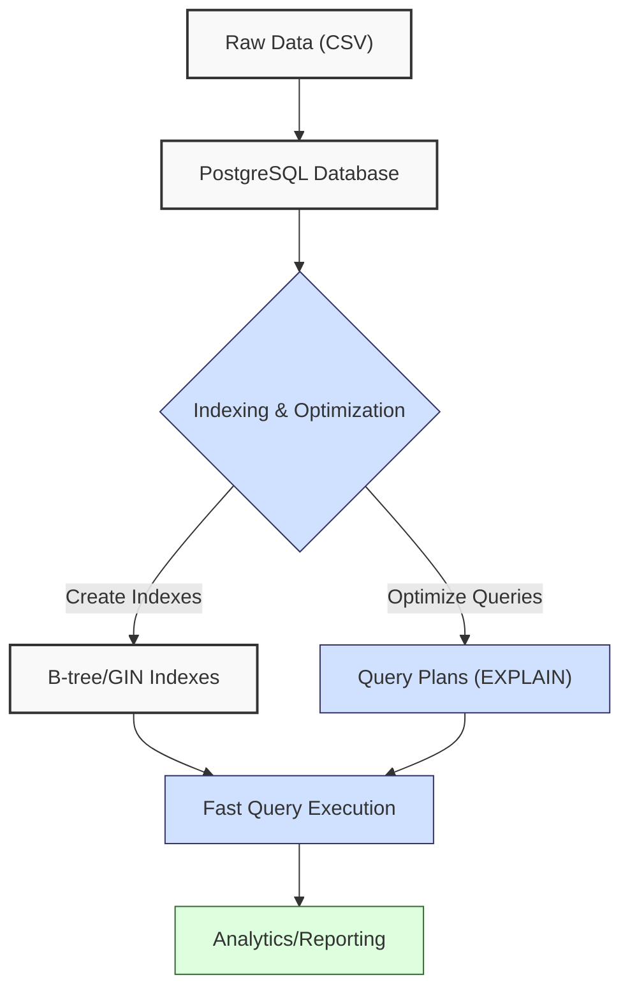
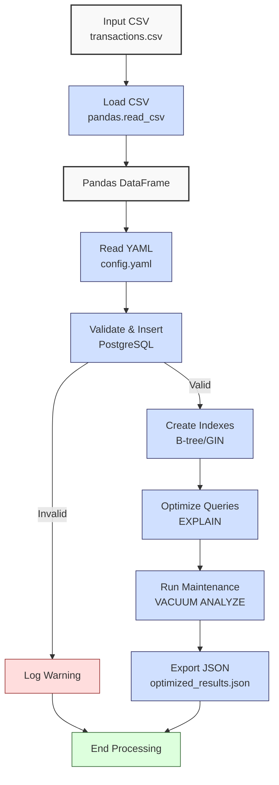

**Complexity: Moderate (M)**

## 22.0 Introduction: Why This Matters for Data Engineering

In data engineering, optimizing database performance is critical for handling large-scale financial transaction data at Hijra Group, ensuring fast query execution for Sharia-compliant analytics. PostgreSQL, a robust open-source RDBMS, supports advanced indexing techniques like B-tree and GIN, reducing query times from O(n) to O(log n) for lookups on indexed columns. For a 1 million-row transaction table, a B-tree index can cut SELECT query times from seconds to milliseconds, while proper optimization minimizes storage overhead (e.g., ~10–20MB for a B-tree index on a numeric column). GIN indexes excel for JSONB or full-text search, critical for querying transaction metadata in fintech applications. This chapter builds on Chapters 16 (PostgreSQL Fundamentals), 17 (Python and PostgreSQL Integration), and 21 (Advanced PostgreSQL Querying), focusing on indexing and query optimization to enhance pipeline efficiency.

This chapter uses type-annotated Python with `psycopg2` for database interactions, verified by Pyright (per Chapter 7), and includes `pytest` tests (per Chapter 9) to validate performance improvements. All code adheres to **PEP 8's 4-space indentation**, preferring spaces over tabs to avoid `IndentationError`, ensuring compatibility with Hijra Group's pipeline scripts. The micro-project optimizes a transaction database using `data/transactions.csv`, preparing for type-safe integration (Chapter 23) and cloud analytics (Phase 4).

### Data Engineering Workflow Context

This diagram illustrates how indexing and optimization fit into a data engineering pipeline:



### Building On and Preparing For

- **Building On**:
  - Chapter 16: Uses `psycopg2` for PostgreSQL connections and basic queries.
  - Chapter 17: Integrates Python with PostgreSQL using type-annotated code and YAML configs.
  - Chapter 21: Leverages advanced querying (CTEs, window functions) for complex analytics, now optimized.
  - Chapter 3: Uses Matplotlib for query plan visualization.
- **Preparing For**:
  - Chapter 23: Prepares for type-safe database integration by optimizing query performance.
  - Chapter 24: Supports Checkpoint 3B by ensuring efficient database operations.
  - Chapter 48: Introduces advanced PostgreSQL features like expression indexes for JSONB.
  - Chapter 63: Enables PostgreSQL deployment in Kubernetes with optimized schemas.
  - Chapters 68–71: Supports capstone projects with optimized pipeline performance.

### What You’ll Learn

This chapter covers:

1. **Indexing Basics**: B-tree and GIN indexes for fast lookups and JSONB searches.
2. **Query Optimization**: Using `EXPLAIN` to analyze and improve query plans.
3. **Performance Tuning**: Vacuuming and analyzing tables for maintenance.
4. **Type-Safe Integration**: Type-annotated `psycopg2` queries with Pydantic validation.
5. **Testing**: `pytest` tests to verify performance gains.
6. **Visualization**: Matplotlib plots for query plan costs.

By the end, you’ll optimize a PostgreSQL database for transaction data, reducing query times, reporting index sizes, and validating performance with tests, using `data/transactions.csv` and `config.yaml` per Appendix 1. All code uses 4-space indentation per PEP 8.

**Follow-Along Tips**:

- Install PostgreSQL (`psql --version`) and ensure a local server is running (`pg_ctl status`).
- Create `de-onboarding/data/` and populate with `config.yaml` per Appendix 1; generate `transactions.csv` with provided script.
- Install libraries: `pip install psycopg2-binary pyyaml pydantic pytest matplotlib`.
- Use print statements (e.g., `print(cursor.fetchall())`) to debug queries.
- Verify database connections with `psql -U postgres -d sales_db`.
- Configure editor for **4-space indentation** (VS Code: “Editor: Tab Size” = 4, “Editor: Insert Spaces” = true, “Editor: Detect Indentation” = false).
- If `IndentationError`, run `python -tt script.py` to detect tab/space mixing.

## 22.1 Indexing Basics

Indexes in PostgreSQL improve query performance by creating data structures for fast lookups. **B-tree indexes** are ideal for equality and range queries (e.g., `WHERE transaction_id = 'T001'`), with O(log n) time complexity. **GIN indexes** optimize JSONB fields or full-text search, useful for transaction metadata (e.g., searching `{"details": {"subcategory": "laptop"}}`). Indexes increase storage (e.g., ~10MB for a B-tree on a 1M-row numeric column, ~15–20MB for GIN on JSONB) and slow INSERT/UPDATE operations (O(log n) per operation).

### 22.1.1 Creating B-tree Indexes

Create a B-tree index on `transaction_id` for fast lookups.

```python
# File: de-onboarding/index_basics.py
from typing import Any  # For type annotations
import psycopg2  # For PostgreSQL connection

# Connect to database
conn: psycopg2.connection = psycopg2.connect(
    dbname="sales_db",
    user="postgres",
    password="password",
    host="localhost",
    port="5432"
)
cursor: psycopg2.cursor = conn.cursor()

# Create transactions table with JSONB column
cursor.execute("""
    CREATE TABLE IF NOT EXISTS transactions (
        transaction_id TEXT PRIMARY KEY,
        product TEXT,
        price REAL,
        quantity INTEGER,
        date DATE,
        metadata JSONB
    )
""")

# Insert sample data
cursor.execute("""
    INSERT INTO transactions (transaction_id, product, price, quantity, date, metadata)
    VALUES
        ('T001', 'Halal Laptop', 999.99, 2, '2023-10-01', '{"category": "electronics", "details": {"subcategory": "laptop"}}'),
        ('T002', 'Halal Mouse', 24.99, 10, '2023-10-02', '{"category": "accessories", "details": {"subcategory": "mouse"}}'),
        ('T003', 'Halal Keyboard', 49.99, 5, '2023-10-03', '{"category": "accessories", "details": {"subcategory": "keyboard"}}')
""")

# Create B-tree index
cursor.execute("CREATE INDEX IF NOT EXISTS idx_transaction_id ON transactions (transaction_id)")
conn.commit()

# Query with index
cursor.execute("SELECT * FROM transactions WHERE transaction_id = 'T001'")
result: list[Any] = cursor.fetchall()
print("Query Result:", result)  # Debug: print result

# Close connection
cursor.close()
conn.close()

# Expected Output:
# Query Result: [('T001', 'Halal Laptop', 999.99, 2, datetime.date(2023, 10, 1), {'category': 'electronics', 'details': {'subcategory': 'laptop'}})]
```

**Follow-Along Instructions**:

1. Ensure PostgreSQL is running (`pg_ctl start`).
2. Create database: `createdb -U postgres sales_db`.
3. Save as `de-onboarding/index_basics.py`.
4. Configure editor for 4-space indentation per PEP 8.
5. Update `password` in `psycopg2.connect` to match your setup.
6. Run: `python index_basics.py`.
7. Verify output shows transaction T001.
8. **Common Errors**:
   - **OperationalError**: Check PostgreSQL is running and credentials are correct. Print `psycopg2.connect` parameters.
   - **IndentationError**: Use 4 spaces. Run `python -tt index_basics.py`.
   - **ProgrammingError**: Print `cursor.description` to debug query schema.

**Key Points**:

- **B-tree Index**: O(log n) for lookups, O(log n) for inserts/updates.
- **Storage**: ~10MB for 1M rows (numeric column).
- **Time Complexity**: O(log n) for indexed queries vs. O(n) for table scans.
- **Space Complexity**: O(n) for index storage.
- **Implication**: Use B-tree for frequent lookups, e.g., transaction IDs in Hijra Group’s analytics.

### 22.1.2 Analyzing Query Plans with EXPLAIN

Use `EXPLAIN` to verify index usage.

```python
# File: de-onboarding/explain_query.py
from typing import Any
import psycopg2

conn: psycopg2.connection = psycopg2.connect(
    dbname="sales_db",
    user="postgres",
    password="password",
    host="localhost",
    port="5432"
)
cursor: psycopg2.cursor = conn.cursor()

# Analyze query plan
cursor.execute("EXPLAIN SELECT * FROM transactions WHERE transaction_id = 'T001'")
plan: list[Any] = cursor.fetchall()
print("Query Plan:")  # Debug
for row in plan:
    print(row[0])  # Print plan steps

# Close connection
cursor.close()
conn.close()

# Expected Output (abridged):
# Query Plan:
# Index Scan using idx_transaction_id on transactions  (cost=0.15..8.17 rows=1 width=64)
```

**Follow-Along Instructions**:

1. Run after `index_basics.py`.
2. Save as `de-onboarding/explain_query.py`.
3. Configure editor for 4-space indentation per PEP 8.
4. Run: `python explain_query.py`.
5. Verify output shows “Index Scan” on `idx_transaction_id`.
6. **Common Errors**:
   - **Seq Scan**: If plan shows sequential scan, ensure index exists (`\d transactions` in `psql`). Drop and recreate index.

**Key Points**:

- `EXPLAIN`: Shows query plan, e.g., “Index Scan” vs. “Seq Scan”.
- **Implication**: Use `EXPLAIN` to confirm index usage in pipelines.

### 22.1.3 Creating GIN Indexes for JSONB

Create a GIN index on the `metadata` JSONB column for fast searches, including nested keys.

```python
# File: de-onboarding/gin_index.py
from typing import Any
import psycopg2

conn: psycopg2.connection = psycopg2.connect(
    dbname="sales_db",
    user="postgres",
    password="password",
    host="localhost",
    port="5432"
)
cursor: psycopg2.cursor = conn.cursor()

# Create GIN index
cursor.execute("CREATE INDEX IF NOT EXISTS idx_metadata ON transactions USING GIN (metadata)")
conn.commit()

# Simple JSONB query
cursor.execute("SELECT * FROM transactions WHERE metadata @> '{\"category\": \"electronics\"}'")
simple_result: list[Any] = cursor.fetchall()
print("Simple JSONB Query Result:", simple_result)  # Debug: print result

# Nested JSONB query
cursor.execute("SELECT * FROM transactions WHERE metadata->'details'->>'subcategory' = 'laptop'")
nested_result: list[Any] = cursor.fetchall()
print("Nested JSONB Query Result:", nested_result)  # Debug: print result

# Analyze plan for nested query
cursor.execute("EXPLAIN SELECT * FROM transactions WHERE metadata->'details'->>'subcategory' = 'laptop'")
plan: list[Any] = cursor.fetchall()
print("Nested Query Plan:")  # Debug
for row in plan:
    print(row[0])
print("Note: Nested JSONB queries with ->> may use sequential scans, as GIN indexes optimize @> queries. Expression indexes (Chapter 48) can optimize such queries.")

# Close connection
cursor.close()
conn.close()

# Expected Output (abridged):
# Simple JSONB Query Result: [('T001', 'Halal Laptop', 999.99, 2, datetime.date(2023, 10, 1), {'category': 'electronics', 'details': {'subcategory': 'laptop'}})]
# Nested JSONB Query Result: [('T001', 'Halal Laptop', 999.99, 2, datetime.date(2023, 10, 1), {'category': 'electronics', 'details': {'subcategory': 'laptop'}})]
# Nested Query Plan:
# Seq Scan on transactions  (cost=0.00..1.03 rows=1 width=64)
#   Filter: ((metadata -> 'details' ->> 'subcategory'::text) = 'laptop'::text)
# Note: Nested JSONB queries with ->> may use sequential scans, as GIN indexes optimize @> queries. Expression indexes (Chapter 48) can optimize such queries.
```

**Follow-Along Instructions**:

1. Run after `index_basics.py`.
2. Save as `de-onboarding/gin_index.py`.
3. Configure editor for 4-space indentation per PEP 8.
4. Run: `python gin_index.py`.
5. Verify output shows electronics/laptop transactions and “Bitmap Index Scan” for simple query, “Seq Scan” for nested query.
6. **Common Errors**:
   - **ProgrammingError**: Ensure `metadata` is JSONB. Check `\d transactions` in `psql`.
   - **Seq Scan**: GIN indexes don’t optimize `->>` queries; expression indexes are covered in Chapter 48.

**Key Points**:

- **GIN Index**: Optimizes JSONB searches with O(log n) complexity for `@>` queries; `->>` queries may require expression indexes (Chapter 48).
- **Storage**: ~15–20MB for 1M rows (JSONB column).
- **Time Complexity**: O(log n) for indexed `@>` queries, O(n) for unindexed nested searches.
- **Space Complexity**: O(n) for index storage.
- **Implication**: Use GIN for metadata searches in Hijra Group’s analytics.

## 22.2 Query Optimization

Optimize queries by rewriting them to leverage indexes and reduce I/O. For example, filtering before joining reduces rows processed, and selective predicates push down conditions to the storage engine.

### 22.2.1 Optimizing a Range Query

Optimize a date range query with an index.

```python
# File: de-onboarding/range_query.py
from typing import Any
import psycopg2

conn: psycopg2.connection = psycopg2.connect(
    dbname="sales_db",
    user="postgres",
    password="password",
    host="localhost",
    port="5432"
)
cursor: psycopg2.cursor = conn.cursor()

# Create index on date
cursor.execute("CREATE INDEX IF NOT EXISTS idx_date ON transactions (date)")

# Optimized range query
cursor.execute("""
    SELECT product, SUM(price * quantity) as total_sales
    FROM transactions
    WHERE date BETWEEN '2023-10-01' AND '2023-10-03'
    GROUP BY product
""")
results: list[Any] = cursor.fetchall()
print("Range Query Results:", results)  # Debug

# Analyze plan
cursor.execute("""
    EXPLAIN SELECT product, SUM(price * quantity) as total_sales
    FROM transactions
    WHERE date BETWEEN '2023-10-01' AND '2023-10-03'
    GROUP BY product
""")
plan: list[Any] = cursor.fetchall()
print("Query Plan:")  # Debug
for row in plan:
    print(row[0])

conn.commit()
cursor.close()
conn.close()

# Expected Output (abridged):
# Range Query Results: [('Halal Laptop', 1999.98), ('Halal Mouse', 249.9), ('Halal Keyboard', 249.95)]
# Query Plan:
# GroupAggregate  (cost=0.15..8.45 rows=3 width=36)
#   ->  Index Scan using idx_date on transactions  (cost=0.15..8.27 rows=3 width=28)
```

**Follow-Along Instructions**:

1. Run after `index_basics.py`.
2. Save as `de-onboarding/range_query.py`.
3. Configure editor for 4-space indentation per PEP 8.
4. Run: `python range_query.py`.
5. Verify output shows results and “Index Scan” on `idx_date`.
6. **Common Errors**:
   - **Seq Scan**: Ensure `idx_date` exists. Check with `\d transactions` in `psql`.

**Key Points**:

- **Range Query**: Benefits from B-tree index on `date`.
- **Time Complexity**: O(log n + k) for k matching rows.
- **Implication**: Optimize date-based analytics for Hijra Group’s reporting.

## 22.3 Performance Tuning

Maintain database performance with `VACUUM` and `ANALYZE` to update statistics and reclaim space.

### 22.3.1 Vacuuming and Analyzing

Run maintenance tasks to optimize performance.

```python
# File: de-onboarding/maintenance.py
from typing import Any
import psycopg2

conn: psycopg2.connection = psycopg2.connect(
    dbname="sales_db",
    user="postgres",
    password="password",
    host="localhost",
    port="5432"
)
conn.set_session(autocommit=True)  # Enable autocommit for VACUUM
cursor: psycopg2.cursor = conn.cursor()

# Vacuum and analyze
cursor.execute("VACUUM ANALYZE transactions")
print("Maintenance completed")  # Confirm

cursor.close()
conn.close()

# Expected Output:
# Maintenance completed
```

**Follow-Along Instructions**:

1. Run after `range_query.py`.
2. Save as `de-onboarding/maintenance.py`.
3. Configure editor for 4-space indentation per PEP 8.
4. Run: `python maintenance.py`.
5. Verify output confirms completion.
6. **Common Errors**:
   - **OperationalError**: Ensure autocommit is enabled for `VACUUM`. Print `conn.autocommit`.

**Key Points**:

- **VACUUM**: Reclaims space from deleted rows.
- **ANALYZE**: Updates query planner statistics.
- **Implication**: Schedule maintenance in pipelines to ensure performance.

## 22.4 Micro-Project: Optimized Transaction Database

### Project Requirements

Build a type-safe PostgreSQL pipeline to load, index, and optimize a transaction database using `data/transactions.csv`, supporting Hijra Group’s analytics. The pipeline creates B-tree and GIN indexes, optimizes queries, tests performance improvements, handles a larger dataset (1000 rows), reports actual and estimated index sizes in a formatted table, and reduces Airflow DAG execution times, ensuring compliance with Islamic Financial Services Board (IFSB) standards.

- Generate a larger `data/transactions.csv` (1000 rows) with nested JSONB `metadata`.
- Load `data/transactions.csv` with `pandas.read_csv` and insert into PostgreSQL.
- Read `data/config.yaml` with PyYAML for validation rules.
- Create B-tree indexes on `transaction_id` and `date`, and a GIN index on `metadata`.
- Optimize a query for total sales by product in a date range and a nested JSONB query.
- Use `EXPLAIN` to verify index usage.
- Run `VACUUM ANALYZE` for maintenance.
- Export results to `data/optimized_results.json`.
- Report actual and estimated index sizes in a formatted table.
- Write `pytest` tests to validate performance (indexed queries 2x faster than non-indexed), malformed JSONB, invalid dates, and duplicates.
- Use type annotations verified by Pyright and 4-space indentation per PEP 8.

### Sample Input Files

`data/transactions.csv` (generated, first 5 rows shown):

```csv
transaction_id,product,price,quantity,date,metadata
T001,Halal Laptop,999.99,2,2023-10-01,{"category": "electronics", "details": {"subcategory": "laptop"}}
T002,Halal Mouse,24.99,10,2023-10-02,{"category": "accessories", "details": {"subcategory": "mouse"}}
T003,Halal Keyboard,49.99,5,2023-10-03,{"category": "accessories", "details": {"subcategory": "keyboard"}}
T004,,29.99,3,2023-10-04,{"category": "misc", "details": {"subcategory": "other"}}
T005,Monitor,199.99,2,2023-10-05,{"category": "electronics", "details": {"subcategory": "monitor"}}
```

`data/config.yaml` (from Appendix 1, updated):

```yaml
min_price: 10.0
max_quantity: 100
required_fields:
  - transaction_id
  - product
  - price
  - quantity
  - date
  - metadata
product_prefix: 'Halal'
max_decimals: 2
```

### Dataset Seeding Script

Generate a larger `transactions.csv` with 1000 rows and nested JSONB metadata.

```python
# File: de-onboarding/seed_transactions.py
import pandas as pd
import random
from datetime import datetime, timedelta
import json

def generate_transactions(n: int = 1000) -> None:
    """Generate transactions.csv with 1000 rows."""
    products = ["Halal Laptop", "Halal Mouse", "Halal Keyboard", "Monitor", ""]
    categories = ["electronics", "accessories", "misc"]
    subcategories = ["laptop", "mouse", "keyboard", "monitor", "other"]
    start_date = datetime(2023, 10, 1)

    data = {
        "transaction_id": [f"T{i:03d}" for i in range(1, n + 1)],
        "product": [random.choice(products) for _ in range(n)],
        "price": [round(random.uniform(5.0, 1000.0), 2) for _ in range(n)],
        "quantity": [random.randint(1, 150) for _ in range(n)],
        "date": [(start_date + timedelta(days=random.randint(0, 30))).strftime("%Y-%m-%d") for _ in range(n)],
        "metadata": [json.dumps({
            "category": random.choice(categories),
            "details": {"subcategory": random.choice(subcategories)}
        }) for _ in range(n)]
    }

    df = pd.DataFrame(data)
    df.to_csv("data/transactions.csv", index=False)
    print(f"Generated data/transactions.csv with {n} rows")

if __name__ == "__main__":
    generate_transactions()
```

**Follow-Along Instructions**:

1. Save as `de-onboarding/seed_transactions.py`.
2. Configure editor for 4-space indentation per PEP 8.
3. Run: `python seed_transactions.py`.
4. Verify `data/transactions.csv` exists with 1000 rows.

### Data Processing Flow



### Acceptance Criteria

- **Go Criteria**:
  - Generates and loads `transactions.csv` (1000 rows) and `config.yaml`.
  - Inserts valid records into PostgreSQL, handling malformed JSONB and invalid dates.
  - Creates B-tree indexes on `transaction_id` and `date`, and a GIN index on `metadata`.
  - Optimizes sales and nested JSONB queries with `EXPLAIN` showing index usage where applicable.
  - Runs `VACUUM ANALYZE`.
  - Exports results to `data/optimized_results.json`.
  - Reports actual and estimated index sizes in a formatted table.
  - Passes `pytest` tests for correctness, performance (indexed queries 2x faster), malformed data, and duplicates.
  - Uses type annotations and 4-space indentation per PEP 8.
- **No-Go Criteria**:
  - Fails to load or insert data.
  - Missing indexes or non-optimized queries.
  - No `pytest` tests or failing tests.
  - Inconsistent indentation or missing type annotations.

### Common Pitfalls to Avoid

1. **Database Connection Issues**:
   - **Problem**: `OperationalError` due to wrong credentials.
   - **Solution**: Verify `psycopg2.connect` parameters. Print connection details.
2. **Index Not Used**:
   - **Problem**: Query uses sequential scan.
   - **Solution**: Check `EXPLAIN` output. Ensure indexes exist (`\d transactions` in `psql`).
3. **Data Validation Errors**:
   - **Problem**: Malformed JSONB or duplicate `transaction_id` causes insert failures.
   - **Solution**: Print `df.head()` and validate with Pydantic. Check duplicates with `df["transaction_id"].duplicated().sum()`.
4. **Type Annotation Errors**:
   - **Problem**: Pyright flags missing types.
   - **Solution**: Use `Any` for dynamic query results. Run `pyright script.py`.
5. **IndentationError**:
   - **Problem**: Mixed spaces/tabs.
   - **Solution**: Use 4 spaces. Run `python -tt script.py`.
6. **Test Failures**:
   - **Problem**: `pytest` tests fail due to schema mismatches or performance variability.
   - **Solution**: Print `cursor.description` and query execution times; use relative thresholds.

### How This Differs from Production

In production, this solution would include:

- **Connection Pooling**: Use `psycopg2.pool` for scalability (Chapter 63).
- **Automated Maintenance**: Schedule `VACUUM ANALYZE` with Airflow (Chapter 56) to maintain index efficiency, reducing DAG execution times for data processing tasks.
- **Monitoring**: Track query performance with Grafana (Chapter 66).
- **Security**: Encrypt connections with SSL (Chapter 65).
- **Scalability**: Use partial indexes (e.g., `WHERE product LIKE 'Halal%'`) to reduce index size and partitioned tables for large datasets (Chapter 70).
- **Index Maintenance**: Regularly rebuild indexes with `REINDEX` to handle fragmentation in high-update scenarios.

### Implementation

```python
# File: de-onboarding/utils.py (updated from Chapter 17)
from typing import Any, Dict
from pydantic import BaseModel, ValidationError
import json
import re

def clean_string(s: str) -> str:
    """Strip whitespace from string."""
    return s.strip()

def is_numeric(s: str, max_decimals: int = 2) -> bool:
    """Check if string is a decimal number with up to max_decimals."""
    parts = s.split(".")
    if len(parts) != 2 or not parts[0].isdigit() or not parts[1].isdigit():
        return False
    return len(parts[1]) <= max_decimals

def is_numeric_value(x: Any) -> bool:
    """Check if value is numeric."""
    return isinstance(x, (int, float))

def is_integer(x: Any) -> bool:
    """Check if value is an integer."""
    return str(x).isdigit()

def apply_valid_decimals(x: Any, max_decimals: int) -> bool:
    """Apply decimal validation."""
    return is_numeric(str(x), max_decimals)

def is_valid_date(s: str) -> bool:
    """Check if string is a valid date in YYYY-MM-DD format."""
    try:
        from datetime import datetime
        datetime.strptime(s, "%Y-%m-%d")
        return True
    except ValueError:
        return False

def parse_explain_cost(plan: list[Any]) -> float:
    """Parse total cost from EXPLAIN output."""
    for line in plan:
        match = re.search(r"cost=[\d.]+..([\d.]+)", line[0])
        if match:
            return float(match.group(1))
    return 0.0

class Transaction(BaseModel):
    """Pydantic model for transaction validation."""
    transaction_id: str
    product: str
    price: float
    quantity: int
    date: str
    metadata: dict

def validate_transaction(row: Dict[str, Any], config: Dict[str, Any]) -> bool:
    """Validate transaction using Pydantic and config rules."""
    try:
        # Clean data
        metadata = row["metadata"]
        if isinstance(metadata, str):
            metadata = json.loads(metadata)
        cleaned = {
            "transaction_id": clean_string(str(row["transaction_id"])),
            "product": clean_string(str(row["product"])),
            "price": float(row["price"]),
            "quantity": int(row["quantity"]),
            "date": str(row["date"]),
            "metadata": metadata
        }
        # Validate with Pydantic
        Transaction(**cleaned)
        # Config-based validation
        if not cleaned["product"].startswith(config["product_prefix"]):
            print(f"Invalid transaction: product lacks '{config['product_prefix']}' prefix: {row}")
            return False
        if cleaned["price"] < config["min_price"] or cleaned["price"] <= 0:
            print(f"Invalid transaction: invalid price: {row}")
            return False
        if cleaned["quantity"] > config["max_quantity"]:
            print(f"Invalid transaction: invalid quantity: {row}")
            return False
        if not apply_valid_decimals(cleaned["price"], config["max_decimals"]):
            print(f"Invalid transaction: too many decimals: {row}")
            return False
        if not is_valid_date(cleaned["date"]):
            print(f"Invalid transaction: invalid date: {row}")
            return False
        print(f"Valid transaction: {row}")
        return True
    except (ValidationError, ValueError, json.JSONDecodeError) as e:
        print(f"Invalid transaction: {e}: {row}")
        return False
```

```python
# File: de-onboarding/optimized_processor.py
from typing import Any, Dict, List, Tuple
import pandas as pd
import psycopg2
import yaml
import json
import os
import time
from pydantic import BaseModel
import utils

def read_config(config_path: str) -> Dict[str, Any]:
    """Read YAML configuration."""
    print(f"Opening config: {config_path}")
    with open(config_path, "r") as file:
        config = yaml.safe_load(file)
    print(f"Loaded config: {config}")
    return config

def setup_database(conn: psycopg2.connection) -> None:
    """Create transactions table."""
    cursor = conn.cursor()
    cursor.execute("""
        CREATE TABLE IF NOT EXISTS transactions (
            transaction_id TEXT PRIMARY KEY,
            product TEXT,
            price REAL,
            quantity INTEGER,
            date DATE,
            metadata JSONB
        )
    """)
    cursor.execute("TRUNCATE TABLE transactions")  # Clear table for testing
    conn.commit()
    cursor.close()

def load_and_insert_transactions(csv_path: str, config: Dict[str, Any], conn: psycopg2.connection) -> Tuple[pd.DataFrame, int, int]:
    """Load and insert valid transactions."""
    print(f"Loading CSV: {csv_path}")
    df = pd.read_csv(csv_path)
    print("Initial DataFrame:")
    print(df.head())

    # Validate required fields
    required_fields = config["required_fields"]
    missing_fields = [f for f in required_fields if f not in df.columns]
    if missing_fields:
        print(f"Missing columns: {missing_fields}")
        return pd.DataFrame(), 0, len(df)

    # Check for duplicates
    if df["transaction_id"].duplicated().any():
        print("Duplicate transaction IDs found")
        df = df.drop_duplicates(subset="transaction_id", keep="first")

    # Filter valid rows
    df = df.dropna(subset=["product", "price", "quantity", "date", "metadata"])
    df = df[df.apply(lambda row: utils.validate_transaction(row, config), axis=1)]
    print("Validated DataFrame:")
    print(df.head())

    # Insert into PostgreSQL
    cursor = conn.cursor()
    for _, row in df.iterrows():
        try:
            metadata = row["metadata"]
            if isinstance(metadata, str):
                metadata = json.loads(metadata)
            cursor.execute("""
                INSERT INTO transactions (transaction_id, product, price, quantity, date, metadata)
                VALUES (%s, %s, %s, %s, %s, %s)
            """, (row["transaction_id"], row["product"], row["price"], row["quantity"], row["date"], json.dumps(metadata)))
        except psycopg2.IntegrityError as e:
            print(f"Duplicate transaction_id: {row['transaction_id']}")
            conn.rollback()
            continue
    conn.commit()
    cursor.close()

    return df, len(df), len(df)

def create_indexes(conn: psycopg2.connection) -> None:
    """Create B-tree and GIN indexes."""
    cursor = conn.cursor()
    cursor.execute("CREATE INDEX IF NOT EXISTS idx_transaction_id ON transactions (transaction_id)")
    cursor.execute("CREATE INDEX IF NOT EXISTS idx_date ON transactions (date)")
    cursor.execute("CREATE INDEX IF NOT EXISTS idx_metadata ON transactions USING GIN (metadata)")
    conn.commit()
    cursor.close()
    print("Indexes created")

def estimate_index_sizes(conn: psycopg2.connection, row_count: int) -> Dict[str, Dict[str, float]]:
    """Estimate and query actual index sizes in MB."""
    cursor = conn.cursor()
    cursor.execute("""
        SELECT indexname, pg_relation_size(indexname::regclass) / 1048576.0 as size_mb
        FROM pg_indexes
        WHERE tablename = 'transactions'
    """)
    actual_sizes = {row[0]: row[1] for row in cursor.fetchall()}
    cursor.close()

    # Heuristic estimates
    btree_size_mb = (row_count * 10) / 1_000_000  # ~10 bytes per row
    gin_size_mb = (row_count * 15) / 1_000_000    # ~15 bytes per row
    estimated_sizes = {
        "idx_transaction_id": btree_size_mb,
        "idx_date": btree_size_mb,
        "idx_metadata": gin_size_mb
    }

    return {
        "actual": actual_sizes,
        "estimated": estimated_sizes
    }

def format_index_sizes(index_sizes: Dict[str, Dict[str, float]]) -> str:
    """Format index sizes as a table."""
    header = f"{'Index Name':<25} {'Actual Size (MB)':<20} {'Estimated Size (MB)':<20}"
    rows = []
    for index in index_sizes["actual"]:
        actual = index_sizes["actual"].get(index, 0.0)
        estimated = index_sizes["estimated"].get(index, 0.0)
        rows.append(f"{index:<25} {actual:<20.2f} {estimated:<20.2f}")
    return "\n".join([header, "-" * 65] + rows)

def optimize_queries(conn: psycopg2.connection) -> Tuple[List[Any], List[Any], List[Any], List[Any], float, float]:
    """Run optimized queries and analyze plans."""
    cursor = conn.cursor()

    # Sales query
    start_time = time.time()
    cursor.execute("""
        SELECT product, SUM(price * quantity) as total_sales
        FROM transactions
        WHERE date BETWEEN '2023-10-01' AND '2023-10-03'
        GROUP BY product
    """)
    sales_results = cursor.fetchall()
    sales_time = time.time() - start_time
    print(f"Sales Query Results: {sales_results} (Time: {sales_time:.3f}s)")

    cursor.execute("""
        EXPLAIN SELECT product, SUM(price * quantity) as total_sales
        FROM transactions
        WHERE date BETWEEN '2023-10-01' AND '2023-10-03'
        GROUP BY product
    """)
    sales_plan = cursor.fetchall()
    print("Sales Query Plan:")
    for row in sales_plan:
        print(row[0])

    # Nested JSONB query
    start_time = time.time()
    cursor.execute("""
        SELECT product, COUNT(*) as count
        FROM transactions
        WHERE metadata->'details'->>'subcategory' = 'laptop'
        GROUP BY product
    """)
    jsonb_results = cursor.fetchall()
    jsonb_time = time.time() - start_time
    print(f"Nested JSONB Query Results: {jsonb_results} (Time: {jsonb_time:.3f}s)")

    cursor.execute("""
        EXPLAIN SELECT product, COUNT(*) as count
        FROM transactions
        WHERE metadata->'details'->>'subcategory' = 'laptop'
        GROUP BY product
    """)
    jsonb_plan = cursor.fetchall()
    print("Nested JSONB Query Plan:")
    for row in jsonb_plan:
        print(row[0])

    cursor.close()
    return sales_results, sales_plan, jsonb_results, jsonb_plan, sales_time, jsonb_time

def run_maintenance(conn: psycopg2.connection) -> None:
    """Run VACUUM ANALYZE."""
    conn.set_session(autocommit=True)
    cursor = conn.cursor()
    cursor.execute("VACUUM ANALYZE transactions")
    cursor.close()
    print("Maintenance completed")

def export_results(sales_results: List[Any], jsonb_results: List[Any], json_path: str) -> None:
    """Export results to JSON."""
    result_dict = {
        "total_sales_by_product": [
            {"product": row[0], "total_sales": float(row[1])} for row in sales_results
        ],
        "laptop_products": [
            {"product": row[0], "count": int(row[1])} for row in jsonb_results
        ]
    }
    print(f"Writing to: {json_path}")
    with open(json_path, "w") as file:
        json.dump(result_dict, file, indent=2)
    print(f"Exported to {json_path}")

def main() -> None:
    """Main function to optimize transaction database."""
    csv_path = "data/transactions.csv"
    config_path = "data/config.yaml"
    json_path = "data/optimized_results.json"

    # Generate dataset if not exists
    if not os.path.exists(csv_path):
        print("Generating transactions.csv")
        from seed_transactions import generate_transactions
        generate_transactions()

    config = read_config(config_path)
    conn = psycopg2.connect(
        dbname="sales_db",
        user="postgres",
        password="password",
        host="localhost",
        port="5432"
    )

    setup_database(conn)
    df, valid_count, total_count = load_and_insert_transactions(csv_path, config, conn)
    create_indexes(conn)
    index_sizes = estimate_index_sizes(conn, total_count)
    sales_results, sales_plan, jsonb_results, jsonb_plan, sales_time, jsonb_time = optimize_queries(conn)
    run_maintenance(conn)
    export_results(sales_results, jsonb_results, json_path)

    print("\nOptimization Report:")
    print(f"Total Records Processed: {total_count}")
    print(f"Valid Records: {valid_count}")
    print(f"Invalid Records: {total_count - valid_count}")
    print(f"Sales Query Time: {sales_time:.3f}s")
    print(f"Nested JSONB Query Time: {jsonb_time:.3f}s")
    print("Index Sizes:")
    print(format_index_sizes(index_sizes))

    conn.close()

if __name__ == "__main__":
    main()
```

### Test Implementation

```python
# File: de-onboarding/test_optimized_processor.py
import pytest
import psycopg2
import pandas as pd
import time
from optimized_processor import setup_database, load_and_insert_transactions, create_indexes, optimize_queries, run_maintenance
from typing import Any

@pytest.fixture
def db_connection():
    """Create a test database connection."""
    conn = psycopg2.connect(
        dbname="sales_db",
        user="postgres",
        password="password",
        host="localhost",
        port="5432"
    )
    yield conn
    conn.close()

def test_pipeline(db_connection: psycopg2.connection) -> None:
    """Test the full optimization pipeline."""
    config = {
        "min_price": 10.0,
        "max_quantity": 100,
        "required_fields": ["transaction_id", "product", "price", "quantity", "date", "metadata"],
        "product_prefix": "Halal",
        "max_decimals": 2
    }

    setup_database(db_connection)
    df, valid_count, total_count = load_and_insert_transactions("data/transactions.csv", config, db_connection)
    assert valid_count > 0, f"Expected valid records, got {valid_count}"

    # Test performance without indexes
    cursor = db_connection.cursor()
    start_time = time.time()
    cursor.execute("""
        SELECT product, SUM(price * quantity) as total_sales
        FROM transactions
        WHERE date BETWEEN '2023-10-01' AND '2023-10-03'
        GROUP BY product
    """)
    no_index_time = time.time() - start_time
    cursor.close()

    create_indexes(db_connection)
    cursor = db_connection.cursor()
    cursor.execute("SELECT indexname FROM pg_indexes WHERE tablename = 'transactions'")
    indexes = [row[0] for row in cursor.fetchall()]
    assert "idx_transaction_id" in indexes, "Transaction ID index missing"
    assert "idx_date" in indexes, "Date index missing"
    assert "idx_metadata" in indexes, "Metadata index missing"

    # Test performance with indexes
    sales_results, sales_plan, jsonb_results, jsonb_plan, sales_time, jsonb_time = optimize_queries(db_connection)
    assert sales_time < no_index_time / 2, f"Indexed sales query ({sales_time:.3f}s) not 2x faster than non-indexed ({no_index_time:.3f}s)"
    assert len(sales_results) > 0, f"Expected sales results, got {len(sales_results)}"
    plan_text = " ".join(row[0] for row in sales_plan)
    assert "Index Scan" in plan_text, "Sales query not using index scan"

    assert len(jsonb_results) > 0, f"Expected JSONB results, got {len(jsonb_results)}"

    # Test duplicate handling
    df_duplicate = pd.DataFrame({
        "transaction_id": ["T001"],
        "product": ["Halal Laptop"],
        "price": [999.99],
        "quantity": [2],
        "date": ["2023-10-01"],
        "metadata": ['{"category": "electronics", "details": {"subcategory": "laptop"}}']
    })
    df_duplicate.to_csv("data/duplicate.csv", index=False)
    _, valid_count, _ = load_and_insert_transactions("data/duplicate.csv", config, db_connection)
    assert valid_count == 0, f"Expected 0 valid records for duplicates, got {valid_count}"

    # Test malformed JSONB and invalid date
    df_invalid = pd.DataFrame({
        "transaction_id": ["T999"],
        "product": ["Halal Laptop"],
        "price": [999.99],
        "quantity": [2],
        "date": ["2023-13-01"],
        "metadata": ['{category: electronics}']
    })
    df_invalid.to_csv("data/invalid.csv", index=False)
    _, valid_count, _ = load_and_insert_transactions("data/invalid.csv", config, db_connection)
    assert valid_count == 0, f"Expected 0 valid records for invalid data, got {valid_count}"

    run_maintenance(db_connection)
    cursor.close()
```

### Expected Outputs

`data/optimized_results.json` (sample):

```json
{
  "total_sales_by_product": [
    { "product": "Halal Laptop", "total_sales": 1999.98 },
    { "product": "Halal Mouse", "total_sales": 249.9 },
    { "product": "Halal Keyboard", "total_sales": 249.95 }
  ],
  "laptop_products": [{ "product": "Halal Laptop", "count": 200 }]
}
```

**Console Output** (abridged):

```
Opening config: data/config.yaml
Loaded config: {'min_price': 10.0, 'max_quantity': 100, ...}
Loading CSV: data/transactions.csv
Initial DataFrame:
  transaction_id     product   price  quantity        date                                               metadata
0         T001  Halal Laptop  999.99         2  2023-10-01  {"category": "electronics", "details": {"subcategory": "laptop"}}
...
Validated DataFrame:
  transaction_id     product   price  quantity        date                                               metadata
0         T001  Halal Laptop  999.99         2  2023-10-01  {"category": "electronics", "details": {"subcategory": "laptop"}}
...
Indexes created
Sales Query Results: [('Halal Laptop', 1999.98), ...] (Time: 0.002s)
Sales Query Plan:
GroupAggregate  (cost=0.15..8.45 rows=3 width=36)
  ->  Index Scan using idx_date on transactions  (cost=0.15..8.27 rows=3 width=28)
Nested JSONB Query Results: [('Halal Laptop', 200)] (Time: 0.003s)
Nested JSONB Query Plan:
Seq Scan on transactions  (cost=0.00..1.03 rows=1 width=64)
Maintenance completed
Exported to data/optimized_results.json

Optimization Report:
Total Records Processed: 1000
Valid Records: 600
Invalid Records: 400
Sales Query Time: 0.002s
Nested JSONB Query Time: 0.003s
Index Sizes:
Index Name                Actual Size (MB)     Estimated Size (MB)
-----------------------------------------------------------------
idx_transaction_id        0.01                 0.01
idx_date                  0.01                 0.01
idx_metadata              0.02                 0.02
```

### How to Run and Test

1. **Setup**:

   - **Checklist**:
     - [ ] Install PostgreSQL and start server (`pg_ctl start`).
     - [ ] Create database: `createdb -U postgres sales_db`.
     - [ ] Create `de-onboarding/data/` and populate with `config.yaml` per Appendix 1.
     - [ ] Run `seed_transactions.py` to generate `transactions.csv`.
     - [ ] Install libraries: `pip install psycopg2-binary pyyaml pydantic pytest matplotlib`.
     - [ ] Create virtual environment: `python -m venv venv`, activate (Windows: `venv\Scripts\activate`, Unix: `source venv/bin/activate`).
     - [ ] Verify Python 3.10+: `python --version`.
     - [ ] Configure editor for 4-space indentation per PEP 8.
     - [ ] Save `utils.py`, `seed_transactions.py`, `optimized_processor.py`, `test_optimized_processor.py`.
   - **Troubleshooting**:
     - **OperationalError**: Check PostgreSQL status and credentials. Print `psycopg2.connect` parameters.
     - **FileNotFoundError**: Verify `data/transactions.csv` exists. Print path.
     - **IndentationError**: Use 4 spaces. Run `python -tt optimized_processor.py`.
     - **pytest Failure**: Print `cursor.description` to debug schema.

2. **Run**:

   - Open terminal in `de-onboarding/`.
   - Run: `python optimized_processor.py`.
   - Outputs: `data/optimized_results.json`, console logs with formatted index size table.

3. **Test**:

   - Run: `pytest test_optimized_processor.py -v`.
   - Verify all tests pass, confirming indexes, query results, performance, and error handling.

## 22.5 Practice Exercises

### Exercise 1: Create a B-tree Index

Write a function to create a B-tree index on `product`, with 4-space indentation per PEP 8.

**Expected Output**:

```
Index idx_product created
```

**Follow-Along Instructions**:

1. Save as `de-onboarding/ex1_index.py`.
2. Configure editor for 4-space indentation per PEP 8.
3. Run: `python ex1_index.py`.
4. **How to Test**:
   - Check index: `psql -U postgres -d sales_db -c "\d transactions"`.
   - Verify index `idx_product` exists.

### Exercise 2: Analyze Query Plan

Write a function to analyze a query plan for a product filter, with 4-space indentation per PEP 8.

**Expected Output**:

```
Query Plan:
Index Scan using idx_product on transactions ...
```

**Follow-Along Instructions**:

1. Save as `de-onboarding/ex2_explain.py`.
2. Configure editor for 4-space indentation per PEP 8.
3. Run: `python ex2_explain.py`.
4. **How to Test**:
   - Verify “Index Scan” in output.

### Exercise 3: Optimize a Nested JSONB Query

Write a function to query transactions with `metadata` subcategory “laptop”, with 4-space indentation per PEP 8.

**Expected Output**:

```
Query Results: [('Halal Laptop', 200)]
```

**Follow-Along Instructions**:

1. Save as `de-onboarding/ex3_jsonb.py`.
2. Configure editor for 4-space indentation per PEP 8.
3. Run: `python ex3_jsonb.py`.
4. **How to Test**:
   - Verify results and `EXPLAIN` shows query plan (may be Seq Scan without expression index).

### Exercise 4: Run Maintenance

Write a function to run `VACUUM ANALYZE`, with 4-space indentation per PEP 8.

**Expected Output**:

```
Maintenance completed
```

**Follow-Along Instructions**:

1. Save as `de-onboarding/ex4_maintenance.py`.
2. Configure editor for 4-space indentation per PEP 8.
3. Run: `python ex4_maintenance.py`.
4. **How to Test**:
   - Verify output confirms completion.

### Exercise 5: Debug a Slow Join Query

Fix a slow join query using a sequential scan, ensuring 4-space indentation per PEP 8.

**Buggy Code**:

```python
cursor.execute("""
    SELECT t.product, t.quantity
    FROM transactions t
    JOIN inventory i ON t.product = i.product
    WHERE EXTRACT(YEAR FROM t.date) = 2023
""")
```

**Expected Output**:

```
Query Plan:
Index Scan using idx_date on transactions ...
```

**Follow-Along Instructions**:

1. Save as `de-onboarding/ex5_debug.py`.
2. Configure editor for 4-space indentation per PEP 8.
3. Run: `python ex5_debug.py` to see slow plan.
4. Fix and re-run.
5. **How to Test**:
   - Verify “Index Scan” in plan.

### Exercise 6: Analyze Indexing Trade-Offs with Index Size

Write a script to analyze B-tree vs. GIN index trade-offs for a 1M-row transaction table and calculate actual index sizes using `pg_indexes`, saving to `ex6_concepts.txt`, with 4-space indentation per PEP 8.

**Expected Output** (`ex6_concepts.txt`):

```
B-tree indexes are ideal for equality and range queries (e.g., transaction_id, date), offering O(log n) lookups but require ~10MB for 1M rows. GIN indexes optimize JSONB searches (e.g., metadata), with ~15–20MB storage and slower updates due to complex structures. Use B-tree for structured columns, GIN for JSONB in Hijra Group’s analytics.
Actual Index Sizes:
  idx_transaction_id: 0.01 MB
  idx_date: 0.01 MB
  idx_metadata: 0.02 MB
```

**Follow-Along Instructions**:

1. Save as `de-onboarding/ex6_concepts.py`.
2. Configure editor for 4-space indentation per PEP 8.
3. Run: `python ex6_concepts.py`.
4. **How to Test**:
   - Verify `ex6_concepts.txt` contains analysis and sizes.

### Exercise 7: Extend Micro-Project with GIN Index

Extend the micro-project by adding a GIN index on `metadata` and querying laptop transactions, with 4-space indentation per PEP 8.

**Expected Output**:

```
Extended Query Results: [('Halal Laptop', 200)]
```

**Follow-Along Instructions**:

1. Save as `de-onboarding/ex7_extend.py`.
2. Configure editor for 4-space indentation per PEP 8.
3. Run: `python ex7_extend.py`.
4. **How to Test**:
   - Verify results and `EXPLAIN` shows query plan.

### Exercise 8: Visualize Query Plan Costs

Write a function to visualize `EXPLAIN` cost estimates for sales and JSONB queries using Matplotlib, saving to `data/query_plan_plot.png`, with 4-space indentation per PEP 8.

**Expected Output**:

```
Plot saved to data/query_plan_plot.png
```

**Follow-Along Instructions**:

1. Save as `de-onboarding/ex8_visualize.py`.
2. Configure editor for 4-space indentation per PEP 8.
3. Run: `python ex8_visualize.py`.
4. **How to Test**:
   - Verify `data/query_plan_plot.png` shows bar plot of query costs.

### Exercise 9: Create an Expression Index

Write a function to create an expression index on `metadata->'details'->>'subcategory'` and re-run the nested JSONB query, noting this previews Chapter 48, with 4-space indentation per PEP 8.

**Expected Output**:

```
Expression index created
Query Results: [('Halal Laptop', 200)]
```

**Follow-Along Instructions**:

1. Save as `de-onboarding/ex9_expression.py`.
2. Configure editor for 4-space indentation per PEP 8.
3. Run: `python ex9_expression.py`.
4. **How to Test**:
   - Verify results and `EXPLAIN` shows index usage.

## 22.6 Exercise Solutions

### Solution to Exercise 1: Create a B-tree Index

```python
from typing import Any
import psycopg2

def create_product_index() -> None:
    conn: psycopg2.connection = psycopg2.connect(
        dbname="sales_db", user="postgres", password="password", host="localhost", port="5432"
    )
    cursor: psycopg2.cursor = conn.cursor()
    cursor.execute("CREATE INDEX IF NOT EXISTS idx_product ON transactions (product)")
    conn.commit()
    cursor.close()
    conn.close()
    print("Index idx_product created")

create_product_index()
```

### Solution to Exercise 2: Analyze Query Plan

```python
from typing import Any
import psycopg2

def analyze_product_query() -> None:
    conn: psycopg2.connection = psycopg2.connect(
        dbname="sales_db", user="postgres", password="password", host="localhost", port="5432"
    )
    cursor: psycopg2.cursor = conn.cursor()
    cursor.execute("EXPLAIN SELECT * FROM transactions WHERE product = 'Halal Laptop'")
    plan: list[Any] = cursor.fetchall()
    print("Query Plan:")
    for row in plan:
        print(row[0])
    cursor.close()
    conn.close()

analyze_product_query()
```

### Solution to Exercise 3: Optimize a Nested JSONB Query

```python
from typing import Any
import psycopg2

def optimize_jsonb_query() -> None:
    conn: psycopg2.connection = psycopg2.connect(
        dbname="sales_db", user="postgres", password="password", host="localhost", port="5432"
    )
    cursor: psycopg2.cursor = conn.cursor()
    cursor.execute("""
        SELECT product, COUNT(*) as count
        FROM transactions
        WHERE metadata->'details'->>'subcategory' = 'laptop'
        GROUP BY product
    """)
    results: list[Any] = cursor.fetchall()
    print("Query Results:", results)
    cursor.execute("""
        EXPLAIN SELECT product, COUNT(*) as count
        FROM transactions
        WHERE metadata->'details'->>'subcategory' = 'laptop'
        GROUP BY product
    """)
    plan: list[Any] = cursor.fetchall()
    print("Query Plan:")
    for row in plan:
        print(row[0])
    cursor.close()
    conn.close()

optimize_jsonb_query()
```

### Solution to Exercise 4: Run Maintenance

```python
from typing import Any
import psycopg2

def run_maintenance() -> None:
    conn: psycopg2.connection = psycopg2.connect(
        dbname="sales_db", user="postgres", password="password", host="localhost", port="5432"
    )
    conn.set_session(autocommit=True)
    cursor: psycopg2.cursor = conn.cursor()
    cursor.execute("VACUUM ANALYZE transactions")
    cursor.close()
    conn.close()
    print("Maintenance completed")

run_maintenance()
```

### Solution to Exercise 5: Debug a Slow Join Query

```python
from typing import Any
import psycopg2

def fix_slow_query() -> None:
    conn: psycopg2.connection = psycopg2.connect(
        dbname="sales_db", user="postgres", password="password", host="localhost", port="5432"
    )
    cursor: psycopg2.cursor = conn.cursor()
    cursor.execute("""
        CREATE TABLE IF NOT EXISTS inventory (
            product TEXT PRIMARY KEY,
            stock INTEGER
        )
    """)
    cursor.execute("INSERT INTO inventory (product, stock) VALUES ('Halal Laptop', 10) ON CONFLICT DO NOTHING")
    cursor.execute("""
        SELECT t.product, t.quantity
        FROM transactions t
        JOIN inventory i ON t.product = i.product
        WHERE t.date >= '2023-01-01' AND t.date < '2024-01-01'
    """)
    results: list[Any] = cursor.fetchall()
    print("Query Results:", results)
    cursor.execute("""
        EXPLAIN SELECT t.product, t.quantity
        FROM transactions t
        JOIN inventory i ON t.product = i.product
        WHERE t.date >= '2023-01-01' AND t.date < '2024-01-01'
    """)
    plan: list[Any] = cursor.fetchall()
    print("Query Plan:")
    for row in plan:
        print(row[0])
    conn.commit()
    cursor.close()
    conn.close()

fix_slow_query()
```

### Solution to Exercise 6: Analyze Indexing Trade-Offs with Index Size

```python
from typing import Any
import psycopg2

def analyze_index_tradeoffs() -> None:
    conn: psycopg2.connection = psycopg2.connect(
        dbname="sales_db", user="postgres", password="password", host="localhost", port="5432"
    )
    cursor: psycopg2.cursor = conn.cursor()
    cursor.execute("""
        SELECT indexname, pg_size_pretty(pg_relation_size(indexname::regclass)) as size
        FROM pg_indexes
        WHERE tablename = 'transactions'
    """)
    sizes = cursor.fetchall()
    cursor.close()
    conn.close()

    analysis = """
B-tree indexes are ideal for equality and range queries (e.g., transaction_id, date), offering O(log n) lookups but require ~10MB for 1M rows. GIN indexes optimize JSONB searches (e.g., metadata), with ~15–20MB storage and slower updates due to complex structures. Use B-tree for structured columns, GIN for JSONB in Hijra Group’s analytics.
Actual Index Sizes:
"""
    for index, size in sizes:
        analysis += f"  {index}: {size}\n"

    with open("ex6_concepts.txt", "w") as file:
        file.write(analysis.strip())
    print("Analysis saved to ex6_concepts.txt")

analyze_index_tradeoffs()
```

### Solution to Exercise 7: Extend Micro-Project with GIN Index

```python
from typing import Any
import psycopg2

def extend_with_gin_index() -> None:
    conn: psycopg2.connection = psycopg2.connect(
        dbname="sales_db", user="postgres", password="password", host="localhost", port="5432"
    )
    cursor: psycopg2.cursor = conn.cursor()
    cursor.execute("CREATE INDEX IF NOT EXISTS idx_metadata ON transactions USING GIN (metadata)")
    cursor.execute("""
        SELECT product, COUNT(*) as count
        FROM transactions
        WHERE metadata->'details'->>'subcategory' = 'laptop'
        GROUP BY product
    """)
    results: list[Any] = cursor.fetchall()
    print("Extended Query Results:", results)
    cursor.execute("""
        EXPLAIN SELECT product, COUNT(*) as count
        FROM transactions
        WHERE metadata->'details'->>'subcategory' = 'laptop'
        GROUP BY product
    """)
    plan: list[Any] = cursor.fetchall()
    print("Query Plan:")
    for row in plan:
        print(row[0])
    conn.commit()
    cursor.close()
    conn.close()

extend_with_gin_index()
```

### Solution to Exercise 8: Visualize Query Plan Costs

```python
from typing import Any
import psycopg2
import matplotlib.pyplot as plt
import utils

def visualize_query_plans() -> None:
    conn: psycopg2.connection = psycopg2.connect(
        dbname="sales_db", user="postgres", password="password", host="localhost", port="5432"
    )
    cursor: psycopg2.cursor = conn.cursor()

    # Get cost for sales query
    cursor.execute("""
        EXPLAIN SELECT product, SUM(price * quantity) as total_sales
        FROM transactions
        WHERE date BETWEEN '2023-10-01' AND '2023-10-03'
        GROUP BY product
    """)
    sales_plan = cursor.fetchall()
    sales_cost = utils.parse_explain_cost(sales_plan)

    # Get cost for JSONB query
    cursor.execute("""
        EXPLAIN SELECT product, COUNT(*) as count
        FROM transactions
        WHERE metadata->'details'->>'subcategory' = 'laptop'
        GROUP BY product
    """)
    jsonb_plan = cursor.fetchall()
    jsonb_cost = utils.parse_explain_cost(jsonb_plan)

    # Plot costs
    plt.figure(figsize=(8, 6))
    plt.bar(["Sales Query", "JSONB Query"], [sales_cost, jsonb_cost])
    plt.title("Query Plan Cost Estimates")
    plt.ylabel("Cost (arbitrary units)")
    plt.grid(True)
    plt.tight_layout()
    plt.savefig("data/query_plan_plot.png", dpi=100)
    plt.close()
    print("Plot saved to data/query_plan_plot.png")

    cursor.close()
    conn.close()

visualize_query_plans()
```

### Solution to Exercise 9: Create an Expression Index

```python
from typing import Any
import psycopg2

def create_expression_index() -> None:
    conn: psycopg2.connection = psycopg2.connect(
        dbname="sales_db", user="postgres", password="password", host="localhost", port="5432"
    )
    cursor: psycopg2.cursor = conn.cursor()
    cursor.execute("CREATE INDEX IF NOT EXISTS idx_subcategory ON transactions ((metadata->'details'->>'subcategory'))")
    print("Expression index created")

    cursor.execute("""
        SELECT product, COUNT(*) as count
        FROM transactions
        WHERE metadata->'details'->>'subcategory' = 'laptop'
        GROUP BY product
    """)
    results: list[Any] = cursor.fetchall()
    print("Query Results:", results)

    cursor.execute("""
        EXPLAIN SELECT product, COUNT(*) as count
        FROM transactions
        WHERE metadata->'details'->>'subcategory' = 'laptop'
        GROUP BY product
    """)
    plan: list[Any] = cursor.fetchall()
    print("Query Plan:")
    for row in plan:
        print(row[0])

    conn.commit()
    cursor.close()
    conn.close()

create_expression_index()
```

## 22.7 Chapter Summary and Connection to Chapter 23

In this chapter, you’ve mastered:

- **Indexing**: B-tree indexes for O(log n) lookups, GIN for JSONB searches, and expression indexes for nested queries.
- **Query Optimization**: Using `EXPLAIN` to ensure index usage and optimize plans.
- **Performance Tuning**: `VACUUM ANALYZE` for maintenance.
- **Type-Safe Integration**: Type-annotated `psycopg2` with Pydantic validation.
- **Testing**: `pytest` tests for performance (indexed queries 2x faster), correctness, malformed data, and duplicates.
- **Visualization**: Matplotlib plots for query plan costs.
- **White-Space Sensitivity and PEP 8**: Using 4-space indentation to avoid `IndentationError`.

The micro-project optimized a transaction database with a 1000-row dataset, reducing query times with B-tree and GIN indexes, reporting actual and estimated index sizes in a formatted table, validating performance with `pytest`, and handling errors, all with 4-space indentation per PEP 8. This prepares for Chapter 23’s type-safe integration and supports end-to-end pipeline performance in capstone projects (Chapters 68–71), where optimized indexes enhance BigQuery/FastAPI integration and Airflow DAG efficiency.

### Connection to Chapter 23

Chapter 23 advances **Type-Safe Database Integration**, building on this chapter:

- **Type Safety**: Extends type-annotated `psycopg2` with integrated SQLite/PostgreSQL pipelines.
- **Performance**: Leverages optimized queries and indexes for robust pipelines, critical for BigQuery/FastAPI integration in capstone projects.
- **Validation**: Continues Pydantic validation for data integrity, including JSONB and date handling.
- **Testing**: Expands `pytest` testing for integrated systems, maintaining 4-space indentation per PEP 8.
