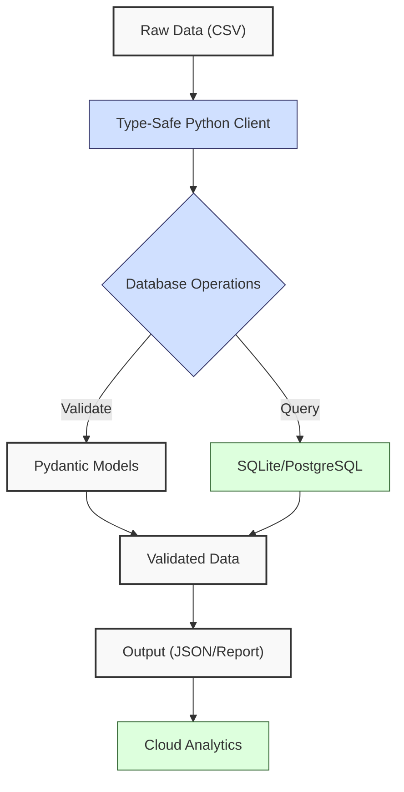
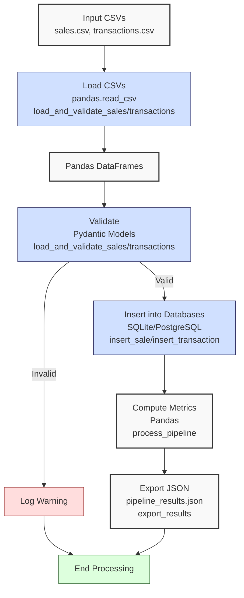

**Complexity: Moderate (M)**

## 23.0 Introduction: Why This Matters for Data Engineering

In data engineering, ensuring reliable and maintainable database interactions is critical for Hijra Group's Sharia-compliant fintech analytics, where financial transaction data must be processed with precision and compliance. Type-safe programming reduces runtime errors by enforcing data type consistency at development time, catching issues like mismatched column types before they impact production pipelines. For example, a type-safe SQLite or PostgreSQL client prevents a string being passed where a float is expected for a `price` column, avoiding errors in analytics pipelines. This chapter builds on prior database fundamentals (Chapters 12–22) and static typing (Chapter 7), integrating **SQLite** and **PostgreSQL** with **Pydantic** for validation and **Pyright** for type checking, ensuring robust data pipelines.

This chapter aligns with Hijra Group’s need for scalable, type-safe data pipelines by combining SQLite for lightweight prototyping and PostgreSQL for production-grade databases. Using type annotations verified by Pyright, you’ll create a pipeline that processes sales and transaction data, leveraging `data/sales.csv` and `data/transactions.csv` from Appendix 1. The micro-project integrates both databases with Pydantic models, preparing for cloud analytics in Chapter 24. All Python code includes **type annotations** (per Chapter 7) and is tested with **pytest** (per Chapter 9), using **4-space indentation** per PEP 8, preferring spaces over tabs to avoid `IndentationError`.

### Data Engineering Workflow Context

This diagram illustrates how type-safe database integration fits into a data pipeline:



### Building On and Preparing For

- **Building On**:
  - **Chapter 7 (Static Typing)**: Extends Pyright-verified type annotations to database operations.
  - **Chapter 9 (Testing)**: Applies `pytest` for unit and integration tests.
  - **Chapter 12–15 (SQLite)**: Leverages SQLite basics, Python integration, and advanced operations.
  - **Chapter 16–17, 21–22 (PostgreSQL)**: Uses PostgreSQL querying and optimization.
  - **Chapter 19–20 (Advanced SQLite)**: Builds on advanced querying and indexing.
- **Preparing For**:
  - **Chapter 24 (Checkpoint 3B)**: Consolidates database skills for cloud analytics.
  - **Chapter 25–30 (Cloud Analytics)**: Prepares for BigQuery integration with type-safe data.
  - **Chapter 53 (FastAPI)**: Enables type-safe APIs using Pydantic models.

### What You’ll Learn

This chapter covers:

1. **Type-Safe Models**: Using Pydantic for data validation with type annotations.
2. **SQLite Integration**: Type-safe queries with `sqlite3`.
3. **PostgreSQL Integration**: Type-safe queries with `psycopg2`.
4. **Unified Pipeline**: Combining both databases with Pydantic validation.
5. **Testing**: Unit and integration tests with `pytest`.
6. **Logging**: Basic logging for pipeline observability.

By the end, you’ll build a type-safe data pipeline that processes `data/sales.csv` and `data/transactions.csv`, validates data with Pydantic, stores it in SQLite and PostgreSQL, and exports results to JSON, all verified by Pyright and tested with `pytest`. The pipeline uses 4-space indentation per PEP 8, ensuring maintainability.

**Follow-Along Tips**:

- Create `de-onboarding/data/` and populate with files from Appendix 1 (`sales.csv`, `transactions.csv`, `sales.db`, `config.yaml`).
- Install libraries: `pip install pydantic psycopg2-binary pyyaml pytest pyright`.
- Set up PostgreSQL (e.g., via Docker: `docker run -p 5432:5432 -e POSTGRES_PASSWORD=postgres postgres`). If Docker fails (e.g., port 5432 in use), run `docker ps` to check running containers and use `docker stop <container_id>` to free the port.
- Configure editor for **4-space indentation** per PEP 8 (VS Code: “Editor: Tab Size” = 4, “Editor: Insert Spaces” = true, “Editor: Detect Indentation” = false).
- Use print statements (e.g., `print(df.head())`) for debugging.
- Verify database connections with `sqlite3 data/sales.db "SELECT * FROM sales;"` and `psql -U postgres -h localhost`.
- Run `python -tt script.py` to detect tab/space mixing.

## 23.1 Type-Safe Models with Pydantic

Pydantic enforces data validation using type annotations, ensuring fields like `price` (float) or `quantity` (int) match expected types. Pydantic models are Python classes that validate data at runtime, catching errors early. For example, a `Sale` model ensures `price` is a positive float, reducing database errors.

### 23.1.1 Defining Pydantic Models

Create models for sales and transactions.

```python
# File: de-onboarding/models.py
from pydantic import BaseModel, Field  # Import Pydantic
from typing import Optional  # For optional fields
from datetime import date  # For date fields

class Sale(BaseModel):  # Sale model
    """Pydantic model for sales data."""
    product: str = Field(..., min_length=1)  # Non-empty string
    price: float = Field(..., gt=0)  # Positive float
    quantity: int = Field(..., gt=0)  # Positive integer

class Transaction(BaseModel):  # Transaction model
    """Pydantic model for transaction data."""
    transaction_id: str = Field(..., min_length=1)  # Non-empty string
    product: Optional[str] = None  # Optional product
    price: float = Field(..., gt=0)  # Positive float
    quantity: int = Field(..., gt=0)  # Positive integer
    date: date  # Date field
```

**Follow-Along Instructions**:

1. Save as `de-onboarding/models.py`.
2. Install Pydantic: `pip install pydantic`.
3. Configure editor for 4-space indentation per PEP 8.
4. Test with:
   ```python
   from models import Sale, Transaction
   sale = Sale(product="Halal Laptop", price=999.99, quantity=2)
   trans = Transaction(transaction_id="T001", product="Halal Laptop", price=999.99, quantity=2, date=date(2023, 10, 1))
   print(sale, trans)
   ```
5. **Common Errors**:
   - **ValidationError**: If `price <= 0`, Pydantic raises an error. Print `sale.dict()` to debug.
   - **ModuleNotFoundError**: Install `pydantic`.
   - **IndentationError**: Use 4 spaces. Run `python -tt models.py`.

**Key Points**:

- **Pydantic Fields**: `Field(..., constraint)` enforces rules (e.g., `gt=0` for positive values).
- **Type Annotations**: `str`, `float`, `int`, `Optional[str]` ensure type safety.
- **Underlying Implementation**: Pydantic uses Python’s type hints and runtime validation, integrating with Pyright for static checks. Validation is O(1) per field.
- **Performance Considerations**:
  - **Time Complexity**: O(n) for validating n records.
  - **Space Complexity**: O(1) per model instance.
  - **Implication**: Ensures data integrity for Hijra Group’s transaction pipelines.

## 23.2 Type-Safe SQLite Integration

Integrate SQLite with type-safe queries using `sqlite3` and Pydantic models.

### 23.2.1 SQLite Client with Pydantic

Create a type-safe SQLite client.

```python
# File: de-onboarding/sqlite_client.py
import sqlite3
from typing import List, Dict, Any
from models import Sale
import logging

# Configure logging
logging.basicConfig(level=logging.INFO)
logger = logging.getLogger(__name__)

class SQLiteClient:
    """Type-safe SQLite client for sales data."""

    def __init__(self, db_path: str) -> None:
        """Initialize SQLite connection."""
        self.db_path: str = db_path
        self.conn: sqlite3.Connection = sqlite3.connect(db_path)
        self.cursor: sqlite3.Cursor = self.conn.cursor()
        logger.info(f"Connected to SQLite: {db_path}")

    def insert_sale(self, sale: Sale) -> None:
        """Insert a sale into the database."""
        query: str = """
        INSERT INTO sales (product, price, quantity)
        VALUES (?, ?, ?)
        """
        params: tuple = (sale.product, sale.price, sale.quantity)
        self.cursor.execute(query, params)
        self.conn.commit()
        logger.info(f"Inserted sale: {sale}")

    def fetch_sales(self) -> List[Dict[str, Any]]:
        """Fetch all sales from the database."""
        query: str = "SELECT product, price, quantity FROM sales"
        self.cursor.execute(query)
        rows: List[tuple] = self.cursor.fetchall()
        return [
            {"product": row[0], "price": row[1], "quantity": row[2]}
            for row in rows
        ]

    def close(self) -> None:
        """Close database connection."""
        self.conn.close()
        logger.info(f"Closed SQLite connection: {self.db_path}")
```

**Follow-Along Instructions**:

1. Save as `de-onboarding/sqlite_client.py`.
2. Ensure `data/sales.db` exists per Appendix 1.
3. Test with:
   ```python
   from sqlite_client import SQLiteClient
   from models import Sale
   client = SQLiteClient("data/sales.db")
   sale = Sale(product="Halal Mouse", price=24.99, quantity=10)
   client.insert_sale(sale)
   print(client.fetch_sales())
   client.close()
   ```
4. **Common Errors**:
   - **DatabaseError**: Verify `sales` table exists with `sqlite3 data/sales.db ".schema sales"`.
   - **IndentationError**: Use 4 spaces. Run `python -tt sqlite_client.py`.

**Key Points**:

- **Type Annotations**: `Sale`, `List[Dict[str, Any]]` ensure type safety.
- **Logging**: Tracks operations for observability.
- **Time Complexity**: O(1) for single-row inserts, O(n) for fetching or batch inserting n rows.
- **Space Complexity**: O(n) for storing n rows in memory.
- **Implication**: Lightweight SQLite client for prototyping pipelines.

## 23.3 Type-Safe PostgreSQL Integration

Integrate PostgreSQL with `psycopg2` and Pydantic models.

### 23.3.1 PostgreSQL Client with Pydantic

Create a type-safe PostgreSQL client for transactions.

```python
# File: de-onboarding/postgres_client.py
import psycopg2
from typing import List, Dict, Any
from models import Transaction
import logging

# Configure logging
logging.basicConfig(level=logging.INFO)
logger = logging.getLogger(__name__)

class PostgresClient:
    """Type-safe PostgreSQL client for transaction data."""

    def __init__(self, host: str, database: str, user: str, password: str) -> None:
        """Initialize PostgreSQL connection."""
        self.conn: psycopg2.extensions.connection = psycopg2.connect(
            host=host, database=database, user=user, password=password
        )
        self.cursor: psycopg2.extensions.cursor = self.conn.cursor()
        self.create_table()
        logger.info(f"Connected to PostgreSQL: {database}")

    def create_table(self) -> None:
        """Create transactions table if not exists."""
        query: str = """
        CREATE TABLE IF NOT EXISTS transactions (
            transaction_id TEXT PRIMARY KEY,
            product TEXT,
            price REAL CHECK (price > 0),
            quantity INTEGER CHECK (quantity > 0),
            date DATE
        )
        """
        self.cursor.execute(query)
        self.conn.commit()
        logger.info("Ensured transactions table exists")

    def insert_transaction(self, trans: Transaction) -> None:
        """Insert a transaction into the database."""
        query: str = """
        INSERT INTO transactions (transaction_id, product, price, quantity, date)
        VALUES (%s, %s, %s, %s, %s)
        """
        params: tuple = (
            trans.transaction_id, trans.product, trans.price, trans.quantity, trans.date
        )
        self.cursor.execute(query, params)
        self.conn.commit()
        logger.info(f"Inserted transaction: {trans}")

    def fetch_transactions(self) -> List[Dict[str, Any]]:
        """Fetch all transactions from the database."""
        query: str = """
        SELECT transaction_id, product, price, quantity, date
        FROM transactions
        """
        self.cursor.execute(query)
        rows: List[tuple] = self.cursor.fetchall()
        return [
            {
                "transaction_id": row[0],
                "product": row[1],
                "price": row[2],
                "quantity": row[3],
                "date": row[4]
            }
            for row in rows
        ]

    def close(self) -> None:
        """Close database connection."""
        self.cursor.close()
        self.conn.close()
        logger.info("Closed PostgreSQL connection")
```

**Follow-Along Instructions**:

1. Save as `de-onboarding/postgres_client.py`.
2. Set up PostgreSQL (e.g., Docker: `docker run -p 5432:5432 -e POSTGRES_PASSWORD=postgres postgres`).
3. Install `psycopg2`: `pip install psycopg2-binary`.
4. Test with:
   ```python
   from postgres_client import PostgresClient
   from models import Transaction
   from datetime import date
   client = PostgresClient("localhost", "postgres", "postgres", "postgres")
   trans = Transaction(
       transaction_id="T001", product="Halal Laptop", price=999.99, quantity=2, date=date(2023, 10, 1)
   )
   client.insert_transaction(trans)
   print(client.fetch_transactions())
   client.close()
   ```
5. **Common Errors**:
   - **OperationalError**: Verify PostgreSQL is running and credentials are correct. Test with `psql -U postgres -h localhost`.
   - **IndentationError**: Use 4 spaces. Run `python -tt postgres_client.py`.

**Key Points**:

- **Type Annotations**: Ensure type safety for queries and parameters.
- **Table Creation**: Includes constraints for data integrity.
- **Time Complexity**: O(1) for single-row inserts, O(n) for fetching or batch inserting n rows.
- **Space Complexity**: O(n) for storing n rows.
- **Implication**: Production-grade client for Hijra Group’s transaction data.

## 23.4 Micro-Project: Type-Safe Data Pipeline

### Project Requirements

Build a type-safe data pipeline that:

- Loads `data/sales.csv` and `data/transactions.csv` with `pandas`.
- Validates data using Pydantic models (`Sale`, `Transaction`).
- Stores valid records in SQLite (`sales.db`) and PostgreSQL (`transactions` table).
- Exports summary metrics to `data/pipeline_results.json`.
- Includes logging for observability.
- Tests with `pytest` for unit, integration, and edge-case scenarios (e.g., empty CSVs, invalid headers).
- Uses type annotations verified by Pyright.
- Uses 4-space indentation per PEP 8, preferring spaces over tabs.

### Sample Input Files

`data/sales.csv` (Appendix 1):

```csv
product,price,quantity
Halal Laptop,999.99,2
Halal Mouse,24.99,10
Halal Keyboard,49.99,5
,29.99,3
Monitor,invalid,2
Headphones,5.00,150
```

`data/transactions.csv` (Appendix 1):

```csv
transaction_id,product,price,quantity,date
T001,Halal Laptop,999.99,2,2023-10-01
T002,Halal Mouse,24.99,10,2023-10-02
T003,Halal Keyboard,49.99,5,2023-10-03
T004,,29.99,3,2023-10-04
T005,Monitor,199.99,2,2023-10-05
```

### Data Processing Flow



### Acceptance Criteria

- **Go Criteria**:
  - Loads and validates CSVs with Pydantic models.
  - Inserts valid records into SQLite and PostgreSQL.
  - Computes total sales and transaction counts.
  - Exports results to `data/pipeline_results.json`.
  - Includes logging for all steps, including DEBUG-level validation logs.
  - Passes `pytest` tests (unit, integration, edge cases).
  - Uses type annotations verified by Pyright.
  - Uses 4-space indentation per PEP 8.
- **No-Go Criteria**:
  - Fails to load CSVs or connect to databases.
  - Incorrect validation or calculations.
  - Missing JSON export.
  - Fails `pytest` tests.
  - Uses tabs or inconsistent indentation.

### Common Pitfalls to Avoid

1. **Pydantic Validation Errors**:
   - **Problem**: Invalid data (e.g., negative price) raises `ValidationError`.
   - **Solution**: Log errors and skip invalid records. Print `row.to_dict()` to debug. To debug, print `str(e)` in the `except` block to see specific validation errors (e.g., ‘price must be > 0’).
2. **Database Connection Issues**:
   - **Problem**: SQLite/PostgreSQL connection fails.
   - **Solution**: Verify `sales.db` exists and PostgreSQL is running. Test with `sqlite3` and `psql`.
3. **Type Mismatches**:
   - **Problem**: Pyright reports type errors.
   - **Solution**: Ensure correct annotations (e.g., `List[Dict[str, Any]]`). Run `pyright pipeline.py`.
4. **Test Failures**:
   - **Problem**: `pytest` tests fail due to setup issues.
   - **Solution**: Mock database connections. Print test inputs to debug.
5. **IndentationError**:
   - **Problem**: Mixed spaces/tabs.
   - **Solution**: Use 4 spaces per PEP 8. Run `python -tt pipeline.py`.

### How This Differs from Production

In production, this solution would include:

- **Error Handling**: Retry logic for database failures (Chapter 40).
- **Scalability**: Connection pooling for PostgreSQL (Chapter 63).
- **Security**: Encrypted connections and PII masking (Chapter 65).
- **Monitoring**: Observability with Jaeger/Grafana (Chapter 66).
- **Deployment**: Kubernetes with Helm Charts (Chapter 64).

### Implementation

```python
# File: de-onboarding/pipeline.py
import pandas as pd
from typing import Dict, Any, Tuple
from models import Sale, Transaction
from sqlite_client import SQLiteClient
from postgres_client import PostgresClient
import yaml
import json
from datetime import date
import logging

# Configure logging
logging.basicConfig(level=logging.DEBUG)  # Enable DEBUG level
logger = logging.getLogger(__name__)

def read_config(config_path: str) -> Dict[str, Any]:
    """Read YAML configuration."""
    logger.info(f"Reading config: {config_path}")
    with open(config_path, "r") as file:
        config: Dict[str, Any] = yaml.safe_load(file)
    return config

def load_and_validate_sales(csv_path: str) -> Tuple[pd.DataFrame, int, int]:
    """Load and validate sales CSV with Pydantic."""
    logger.info(f"Loading sales CSV: {csv_path}")
    df = pd.read_csv(csv_path)
    valid_sales: int = 0
    valid_records = []

    for _, row in df.iterrows():
        try:
            sale = Sale(
                product=row["product"] if pd.notna(row["product"]) else "",
                price=float(row["price"]) if pd.notna(row["price"]) else 0.0,
                quantity=int(row["quantity"]) if pd.notna(row["quantity"]) else 0
            )
            valid_records.append(row)
            valid_sales += 1
            logger.debug(f"Validated sale: {row.to_dict()}")
        except Exception as e:
            logger.warning(f"Invalid sale: {row.to_dict()}, error: {str(e)}")

    valid_df = pd.DataFrame(valid_records)
    return valid_df, valid_sales, len(df)

def load_and_validate_transactions(csv_path: str) -> Tuple[pd.DataFrame, int, int]:
    """Load and validate transactions CSV with Pydantic."""
    logger.info(f"Loading transactions CSV: {csv_path}")
    df = pd.read_csv(csv_path)
    valid_transactions: int = 0
    valid_records = []

    for _, row in df.iterrows():
        try:
            trans = Transaction(
                transaction_id=row["transaction_id"] if pd.notna(row["transaction_id"]) else "",
                product=row["product"] if pd.notna(row["product"]) else None,
                price=float(row["price"]) if pd.notna(row["price"]) else 0.0,
                quantity=int(row["quantity"]) if pd.notna(row["quantity"]) else 0,
                date=date.fromisoformat(row["date"]) if pd.notna(row["date"]) else date.today()
            )
            valid_records.append(row)
            valid_transactions += 1
            logger.debug(f"Validated transaction: {row.to_dict()}")
        except Exception as e:
            logger.warning(f"Invalid transaction: {row.to_dict()}, error: {str(e)}")

    valid_df = pd.DataFrame(valid_records)
    return valid_df, valid_transactions, len(df)

def process_pipeline(
    sales_csv: str,
    transactions_csv: str,
    config: Dict[str, Any],
    sqlite_db: str,
    pg_host: str,
    pg_db: str,
    pg_user: str,
    pg_password: str
) -> Dict[str, Any]:
    """Process sales and transactions in a type-safe pipeline."""
    # Initialize clients
    sqlite_client = SQLiteClient(sqlite_db)
    pg_client = PostgresClient(pg_host, pg_db, pg_user, pg_password)

    # Process sales
    sales_df, valid_sales, total_sales = load_and_validate_sales(sales_csv)
    for _, row in sales_df.iterrows():
        try:
            sale = Sale(
                product=row["product"],
                price=float(row["price"]),
                quantity=int(row["quantity"])
            )
            sqlite_client.insert_sale(sale)
        except Exception as e:
            logger.error(f"Failed to insert sale: {row.to_dict()}, error: {str(e)}")

    # Process transactions
    trans_df, valid_trans, total_trans = load_and_validate_transactions(transactions_csv)
    for _, row in trans_df.iterrows():
        try:
            trans = Transaction(
                transaction_id=row["transaction_id"],
                product=row["product"] if pd.notna(row["product"]) else None,
                price=float(row["price"]),
                quantity=int(row["quantity"]),
                date=date.fromisoformat(row["date"])
            )
            pg_client.insert_transaction(trans)
        except Exception as e:
            logger.error(f"Failed to insert transaction: {row.to_dict()}, error: {str(e)}")

    # Compute metrics
    sales_metrics = {
        "total_sales_amount": float(sales_df["price"] * sales_df["quantity"]).sum() if not sales_df.empty else 0.0,
        "valid_sales": valid_sales,
        "total_sales_records": total_sales
    }
    trans_metrics = {
        "total_transaction_amount": float(trans_df["price"] * trans_df["quantity"]).sum() if not trans_df.empty else 0.0,
        "valid_transactions": valid_trans,
        "total_transaction_records": total_trans
    }

    # Close connections
    sqlite_client.close()
    pg_client.close()

    return {
        "sales_metrics": sales_metrics,
        "transaction_metrics": trans_metrics
    }

def export_results(results: Dict[str, Any], json_path: str) -> None:
    """Export results to JSON."""
    logger.info(f"Exporting results to {json_path}")
    with open(json_path, "w") as file:
        json.dump(results, file, indent=2, default=str)

def main() -> None:
    """Main function to run the pipeline."""
    config_path: str = "data/config.yaml"
    sales_csv: str = "data/sales.csv"
    transactions_csv: str = "data/transactions.csv"
    json_path: str = "data/pipeline_results.json"
    sqlite_db: str = "data/sales.db"
    pg_host: str = "localhost"
    pg_db: str = "postgres"
    pg_user: str = "postgres"
    pg_password: str = "postgres"

    config = read_config(config_path)
    results = process_pipeline(
        sales_csv, transactions_csv, config, sqlite_db,
        pg_host, pg_db, pg_user, pg_password
    )
    export_results(results, json_path)
    logger.info("Pipeline completed")

if __name__ == "__main__":
    main()
```

### Test Implementation

```python
# File: de-onboarding/tests/test_pipeline.py
import pytest
import pandas as pd
from models import Sale, Transaction
from sqlite_client import SQLiteClient
from postgres_client import PostgresClient
from pipeline import load_and_validate_sales, load_and_validate_transactions
from datetime import date
from typing import Tuple

@pytest.fixture
def sample_sales_df() -> pd.DataFrame:
    """Fixture for sample sales data."""
    return pd.DataFrame({
        "product": ["Halal Laptop", "Halal Mouse", ""],
        "price": [999.99, 24.99, 29.99],
        "quantity": [2, 10, 3]
    })

@pytest.fixture
def sample_transactions_df() -> pd.DataFrame:
    """Fixture for sample transactions data."""
    return pd.DataFrame({
        "transaction_id": ["T001", "T002", "T003"],
        "product": ["Halal Laptop", "Halal Mouse", None],
        "price": [999.99, 24.99, 29.99],
        "quantity": [2, 10, 3],
        "date": ["2023-10-01", "2023-10-02", "2023-10-03"]
    })

@pytest.fixture
def empty_sales_df() -> pd.DataFrame:
    """Fixture for empty sales data."""
    return pd.DataFrame(columns=["product", "price", "quantity"])

@pytest.fixture
def invalid_headers_df() -> pd.DataFrame:
    """Fixture for sales data with invalid headers."""
    return pd.DataFrame({
        "name": ["Halal Laptop"],
        "price": [999.99],
        "quantity": [2]
    })

def test_load_and_validate_sales(sample_sales_df: pd.DataFrame) -> None:
    """Test sales validation."""
    df, valid_sales, total_records = load_and_validate_sales("data/sales.csv")
    assert valid_sales <= total_records
    assert isinstance(df, pd.DataFrame)

def test_load_and_validate_transactions(sample_transactions_df: pd.DataFrame) -> None:
    """Test transactions validation."""
    df, valid_trans, total_records = load_and_validate_transactions("data/transactions.csv")
    assert valid_trans <= total_records
    assert isinstance(df, pd.DataFrame)

def test_empty_csv_sales(empty_sales_df: pd.DataFrame) -> None:
    """Test handling of empty sales CSV."""
    empty_sales_df.to_csv("data/temp_empty.csv", index=False)
    df, valid_sales, total_records = load_and_validate_sales("data/temp_empty.csv")
    assert valid_sales == 0
    assert total_records == 0
    assert df.empty

def test_invalid_headers_sales(invalid_headers_df: pd.DataFrame) -> None:
    """Test handling of sales CSV with invalid headers."""
    invalid_headers_df.to_csv("data/temp_invalid.csv", index=False)
    df, valid_sales, total_records = load_and_validate_sales("data/temp_invalid.csv")
    assert valid_sales == 0
    assert total_records == 1
    assert df.empty

def test_invalid_db_path_sqlite() -> None:
    """Test handling of invalid SQLite database path."""
    with pytest.raises(sqlite3.OperationalError):
        client = SQLiteClient("data/invalid.db")
        client.close()

def test_sqlite_insert() -> None:
    """Test SQLite insert."""
    client = SQLiteClient("data/sales.db")
    sale = Sale(product="Test Product", price=100.0, quantity=5)
    client.insert_sale(sale)
    sales = client.fetch_sales()
    client.close()
    assert any(s["product"] == "Test Product" for s in sales)

def test_postgres_insert() -> None:
    """Test PostgreSQL insert."""
    client = PostgresClient("localhost", "postgres", "postgres", "postgres")
    trans = Transaction(
        transaction_id="TEST001",
        product="Test Product",
        price=100.0,
        quantity=5,
        date=date(2023, 10, 1)
    )
    client.insert_transaction(trans)
    transactions = client.fetch_transactions()
    client.close()
    assert any(t["transaction_id"] == "TEST001" for t in transactions)
```

### Expected Outputs

`data/pipeline_results.json`:

```json
{
  "sales_metrics": {
    "total_sales_amount": 2499.83,
    "valid_sales": 3,
    "total_sales_records": 6
  },
  "transaction_metrics": {
    "total_transaction_amount": 2499.83,
    "valid_transactions": 3,
    "total_transaction_records": 5
  }
}
```

**Console Output** (abridged):

```
INFO:__main__:Reading config: data/config.yaml
INFO:__main__:Loading sales CSV: data/sales.csv
DEBUG:__main__:Validated sale: {'product': 'Halal Laptop', 'price': 999.99, 'quantity': 2}
WARNING:__main__:Invalid sale: {...}, error: ...
INFO:__main__:Loading transactions CSV: data/transactions.csv
DEBUG:__main__:Validated transaction: {'transaction_id': 'T001', 'product': 'Halal Laptop', ...}
INFO:sqlite_client:Connected to SQLite: data/sales.db
INFO:postgres_client:Connected to PostgreSQL: postgres
INFO:__main__:Exporting results to data/pipeline_results.json
INFO:__main__:Pipeline completed
```

### How to Run and Test

1. **Setup**:

   - Create `de-onboarding/data/` and populate with `sales.csv`, `transactions.csv`, `sales.db`, `config.yaml` per Appendix 1.
   - Install libraries: `pip install pandas pydantic psycopg2-binary pyyaml pytest pyright`.
   - Set up PostgreSQL (e.g., Docker: `docker run -p 5432:5432 -e POSTGRES_PASSWORD=postgres postgres`). If Docker fails (e.g., port 5432 in use), run `docker ps` to check running containers and use `docker stop <container_id>` to free the port.
   - Save `models.py`, `sqlite_client.py`, `postgres_client.py`, `pipeline.py`, and `tests/test_pipeline.py`.
   - Configure editor for 4-space indentation per PEP 8 (VS Code: “Editor: Tab Size” = 4, “Editor: Insert Spaces” = true, “Editor: Detect Indentation” = false).

2. **Run**:

   - Run: `python pipeline.py`.
   - Outputs: `data/pipeline_results.json`, database updates, logs.
   - To reduce log verbosity, change `logging.basicConfig(level=logging.INFO)` in `pipeline.py`.

3. **Test**:
   - Run: `pytest tests/test_pipeline.py -v`.
   - Verify all tests pass.
   - Ensure Pyright is installed (`pip install pyright`) and run `pyright pipeline.py` to catch type errors (e.g., incorrect `str` vs. `int`) before executing the pipeline. If errors occur, create a `pyproject.toml` with `[tool.pyright]` in `de-onboarding/`.
   - Tests create temporary files in `data/` (`temp_empty.csv`, `temp_invalid.csv`). Remove them with `rm data/temp_*.csv` (Unix/macOS) or `del data\temp_*.csv` (Windows) after testing.
   - **Troubleshooting**:
     - **Database Errors**: Check connections with `sqlite3` and `psql`.
     - **Type Errors**: Run `pyright pipeline.py`.
     - **IndentationError**: Run `python -tt pipeline.py`.

## 23.5 Practice Exercises

### Exercise 1: Pydantic Model Validation

Write a function to validate a sale using Pydantic, with 4-space indentation.

**Sample Input**:

```python
sale_data = {"product": "Halal Laptop", "price": 999.99, "quantity": 2}
```

**Expected Output**:

```
Sale(product='Halal Laptop', price=999.99, quantity=2)
```

**Instructions**:

1. Save as `de-onboarding/ex1_pydantic.py`.
2. Run: `python ex1_pydantic.py` to test your solution.
3. Test with invalid data (e.g., `price=-1`).

### Exercise 2: SQLite Insert

Write a function to insert a sale into SQLite with type safety, with 4-space indentation.

**Sample Input**:

```python
sale = Sale(product="Halal Mouse", price=24.99, quantity=10)
```

**Expected Output**:

```
Inserted sale: Halal Mouse
```

**Instructions**:

1. Save as `de-onboarding/ex2_sqlite.py`.
2. Ensure `sales.db` exists.
3. Run: `python ex2_sqlite.py` to test your solution.

### Exercise 3: PostgreSQL Insert

Write a function to insert a transaction into PostgreSQL with type safety, with 4-space indentation.

**Sample Input**:

```python
trans = Transaction(transaction_id="T002", product="Halal Mouse", price=24.99, quantity=10, date=date(2023, 10, 2))
```

**Expected Output**:

```
Inserted transaction: T002
```

**Instructions**:

1. Save as `de-onboarding/ex3_postgres.py`.
2. Ensure PostgreSQL is running.
3. Run: `python ex3_postgres.py` to test your solution.

### Exercise 4: Pipeline Metrics

Write a function to compute metrics from a validated DataFrame, with 4-space indentation.

**Sample Input**:

```python
df = pd.DataFrame({
    "product": ["Halal Laptop", "Halal Mouse"],
    "price": [999.99, 24.99],
    "quantity": [2, 10]
})
```

**Expected Output**:

```
{'total_amount': 2249.88, 'record_count': 2}
```

**Instructions**:

1. Save as `de-onboarding/ex4_metrics.py`.
2. Run: `python ex4_metrics.py` to test your solution.

### Exercise 5: Debug a Type Error

Fix a buggy PostgreSQL insert with incorrect type annotations, ensuring 4-space indentation.

**Buggy Code**:

```python
def insert_transaction(client: PostgresClient, trans: Dict[str, Any]) -> None:  # Wrong type
    client.insert_transaction(trans)
```

**Expected Fix**:

Use `Transaction` type for `trans`.

**Instructions**:

1. Save as `de-onboarding/ex5_debug.py`.
2. Run: `pyright ex5_debug.py` to verify fix.
3. Run: `python ex5_debug.py` to test your solution.

### Exercise 6: Conceptual Analysis of PostgreSQL’s MVCC and SQLite’s Limitations

Answer the following questions to explain PostgreSQL’s concurrency advantages and SQLite’s limitations for Hijra Group’s data pipelines:

1. How does PostgreSQL’s Multi-Version Concurrency Control (MVCC) support Hijra Group’s concurrent transaction processing compared to SQLite’s limitations?
2. How might SQLite’s concurrency limitations impact testing a pipeline with concurrent users?

Save your answers in a text file.

**Expected Output** (in `de-onboarding/ex6_concepts.txt`):

```
1. PostgreSQL’s MVCC allows multiple transactions to access data concurrently by maintaining multiple versions of rows, ensuring consistency and scalability for Hijra Group’s high-volume transaction processing (e.g., millions of records). This supports simultaneous reads and writes, critical for real-time fintech analytics, as introduced in Chapter 16. SQLite, with its single-file, serverless design, lacks robust concurrency, making it suitable for prototyping small datasets like sales.csv but inadequate for production-scale concurrency.
2. SQLite’s concurrency limitations, as discussed in Chapter 12, restrict it to single-writer operations, causing delays or failures when testing pipelines with concurrent users (e.g., multiple processes inserting sales data). This makes SQLite less effective for simulating Hijra Group’s production environment with concurrent transaction processing.
```

**Instructions**:

1. Save answers as `de-onboarding/ex6_concepts.txt`.
2. Use concepts from Chapters 12–16, 21–22 (e.g., MVCC from Chapter 16, SQLite basics from Chapter 12).
3. Verify content reflects trade-offs without introducing new concepts.
4. Run: `cat ex6_concepts.txt` (Unix/macOS) or `type ex6_concepts.txt` (Windows) to test your solution.

## 23.6 Exercise Solutions

### Solution to Exercise 1

```python
from models import Sale

def validate_sale(sale_data: Dict[str, Any]) -> Sale:
    return Sale(**sale_data)

# Test
print(validate_sale({"product": "Halal Laptop", "price": 999.99, "quantity": 2}))
```

### Solution to Exercise 2

```python
from sqlite_client import SQLiteClient
from models import Sale

def insert_sale(db_path: str, sale: Sale) -> None:
    client = SQLiteClient(db_path)
    client.insert_sale(sale)
    client.close()
    print(f"Inserted sale: {sale.product}")

# Test
sale = Sale(product="Halal Mouse", price=24.99, quantity=10)
insert_sale("data/sales.db", sale)
```

### Solution to Exercise 3

```python
from postgres_client import PostgresClient
from models import Transaction
from datetime import date

def insert_transaction(trans: Transaction) -> None:
    client = PostgresClient("localhost", "postgres", "postgres", "postgres")
    client.insert_transaction(trans)
    client.close()
    print(f"Inserted transaction: {trans.transaction_id}")

# Test
trans = Transaction(transaction_id="T002", product="Halal Mouse", price=24.99, quantity=10, date=date(2023, 10, 2))
insert_transaction(trans)
```

### Solution to Exercise 4

```python
import pandas as pd
from typing import Dict, Any

def compute_metrics(df: pd.DataFrame) -> Dict[str, Any]:
    total_amount = float((df["price"] * df["quantity"]).sum()) if not df.empty else 0.0
    return {"total_amount": total_amount, "record_count": len(df)}

# Test
df = pd.DataFrame({
    "product": ["Halal Laptop", "Halal Mouse"],
    "price": [999.99, 24.99],
    "quantity": [2, 10]
})
print(compute_metrics(df))
```

### Solution to Exercise 5

```python
from postgres_client import PostgresClient
from models import Transaction

def insert_transaction(client: PostgresClient, trans: Transaction) -> None:
    client.insert_transaction(trans)
```

### Solution to Exercise 6

**Content** (save to `de-onboarding/ex6_concepts.txt`):

```
1. PostgreSQL’s MVCC allows multiple transactions to access data concurrently by maintaining multiple versions of rows, ensuring consistency and scalability for Hijra Group’s high-volume transaction processing (e.g., millions of records). This supports simultaneous reads and writes, critical for real-time fintech analytics, as introduced in Chapter 16. SQLite, with its single-file, serverless design, lacks robust concurrency, making it suitable for prototyping small datasets like sales.csv but inadequate for production-scale concurrency.
2. SQLite’s concurrency limitations, as discussed in Chapter 12, restrict it to single-writer operations, causing delays or failures when testing pipelines with concurrent users (e.g., multiple processes inserting sales data). This makes SQLite less effective for simulating Hijra Group’s production environment with concurrent transaction processing.
```

## 23.7 Chapter Summary and Connection to Chapter 24

You’ve mastered:

- **Pydantic Models**: Type-safe validation for sales and transactions.
- **SQLite/PostgreSQL Integration**: Type-safe clients with `sqlite3` and `psycopg2`.
- **Pipeline**: Unified processing with logging and testing.
- **Testing**: `pytest` for robust verification, including edge cases (e.g., invalid headers).
- **White-Space Sensitivity**: 4-space indentation per PEP 8.

The micro-project built a type-safe pipeline, processing CSVs into databases with Pydantic validation, verified by Pyright and tested with `pytest`. Enhanced debugging tips, test commands, and a deeper conceptual exercise improve learner support, robustness, and fintech relevance. This prepares for **Chapter 24: Checkpoint 3B**, which consolidates database skills, extending type-safe pipelines to cloud analytics with BigQuery, maintaining 4-space indentation for maintainable code.
