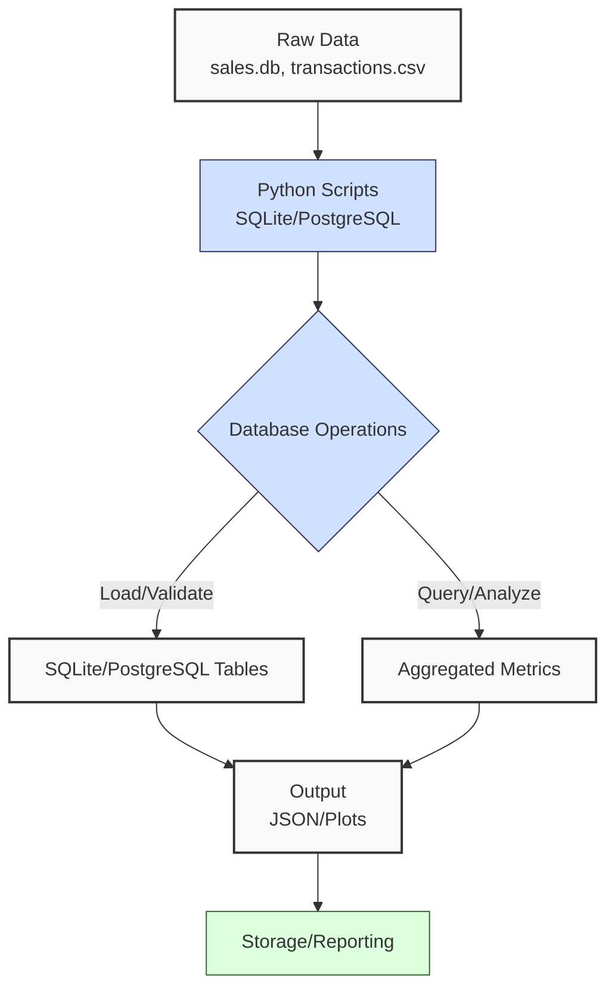
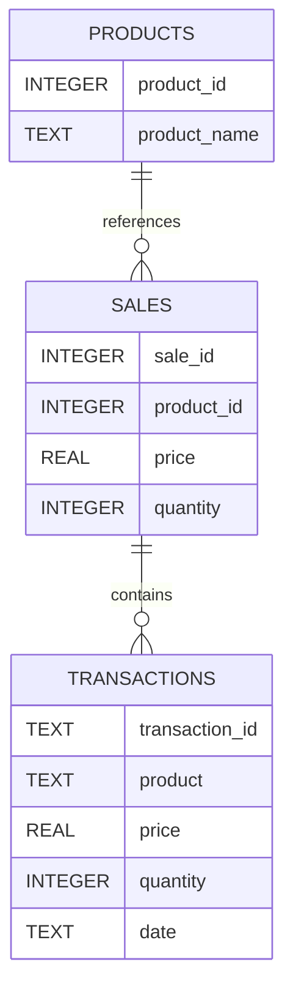
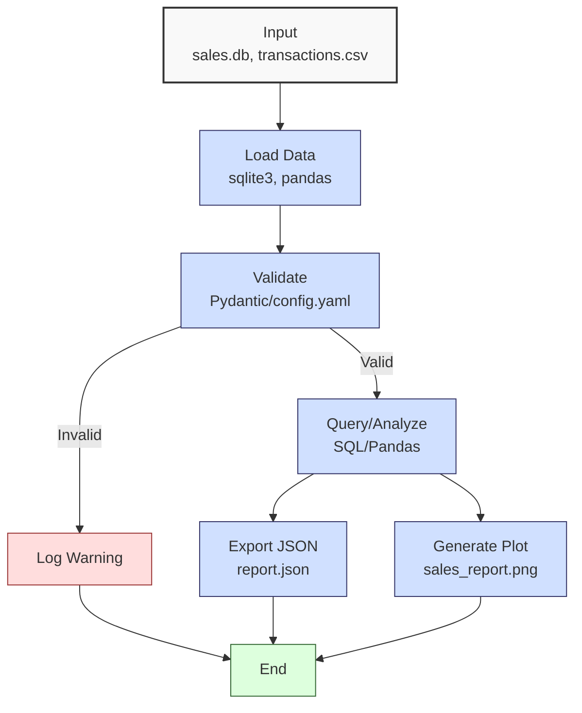

**Complexity: Easy (E)**

## 24.0 Introduction: Why This Matters for Data Engineering

In data engineering at Hijra Group, robust database skills are critical for managing Sharia-compliant financial transaction data, enabling scalable analytics for stakeholder reporting. This checkpoint consolidates advanced SQL querying, indexing, optimization, schema design, and type-safe Python integration with SQLite and PostgreSQL from Chapters 12–23, ensuring you can build efficient, reliable data pipelines. These skills are foundational for cloud analytics in Phase 4 (Chapters 25–30) and production-grade deployments in Phase 9 (Chapters 60–66). The micro-project integrates these concepts into a comprehensive database tool, processing sales data from `data/sales.db` and `data/transactions.csv`, producing a JSON report and visualizations, all with **4-space indentation** per PEP 8, preferring spaces over tabs to avoid `IndentationError`.

### Data Engineering Workflow Context

This diagram illustrates the database pipeline:



### Building On and Preparing For

- **Building On**:
  - **Chapter 12**: SQL basics with SQLite, extended to advanced queries.
  - **Chapter 13**: Python-SQLite integration, now with type safety.
  - **Chapter 14**: Advanced SQLite operations (transactions, views).
  - **Chapter 15**: Type-safe SQLite programming with Pydantic.
  - **Chapter 16–17**: PostgreSQL fundamentals and Python integration.
  - **Chapter 18**: Schema design with ER diagrams.
  - **Chapter 19**: Advanced SQL querying (joins, subqueries).
  - **Chapter 20**: SQLite indexing and optimization.
  - **Chapter 21–22**: Advanced PostgreSQL querying and optimization.
  - **Chapter 23**: Type-safe database integration.
- **Preparing For**:
  - **Chapter 25**: BigQuery fundamentals, extending SQL skills.
  - **Chapter 26**: Python-BigQuery integration, building on type-safe programming.
  - **Chapter 47**: Data access patterns for web applications.

### What You’ll Learn

This chapter reinforces:

1. **Advanced SQL Querying**: Joins, subqueries, CTEs, and window functions.
2. **Schema Design**: Normalized tables with ER diagrams.
3. **Indexing and Optimization**: Efficient query performance.
4. **Type-Safe Integration**: Python with SQLite/PostgreSQL using Pydantic.
5. **Visualization**: Matplotlib plots for stakeholder reporting.
6. **Testing**: Unit and integration tests with `pytest`.

The micro-project builds a type-annotated database tool that queries `sales.db`, validates data with `config.yaml`, and produces a JSON report and plot, tested with `pytest` and verified by Pyright, all with 4-space indentation per PEP 8.

**Follow-Along Tips**:

- Create `de-onboarding/data/` and populate with files from Appendix 1 (`sales.db`, `transactions.csv`, `config.yaml`, `empty.csv`, `invalid.csv`, `malformed.csv`, `negative.csv`).
- Install libraries: `pip install numpy pandas matplotlib pyyaml sqlite3 psycopg2-binary pydantic pytest`.
- Configure editor for **4-space indentation** per PEP 8 (VS Code: “Editor: Tab Size” = 4, “Editor: Insert Spaces” = true, “Editor: Detect Indentation” = false).
- Use print statements (e.g., `print(df.head())`) to debug DataFrames.
- Save plots to `data/` (e.g., `data/sales_report.png`).
- Verify file paths with `ls data/` (Unix/macOS) or `dir data\` (Windows).
- Use UTF-8 encoding to avoid `UnicodeDecodeError`.
- Run `pytest` with `-v` for verbose output.

## 24.1 Core Concepts

### 24.1.1 Advanced SQL Querying

Advanced SQL techniques include:

- **Joins**: Combine tables (e.g., `sales` and `transactions`).
- **Subqueries**: Nested queries for filtering.
- **CTEs**: Readable query structures.
- **Window Functions**: Compute rankings or running totals.

**Example** (SQLite, from Chapter 19):

```sql
WITH SalesCTE AS (
    SELECT product, price * quantity AS amount
    FROM sales
)
SELECT product, amount,
       RANK() OVER (ORDER BY amount DESC) AS sales_rank
FROM SalesCTE;
```

**Time Complexity**: O(n log n) for sorting in window functions, O(n) for joins.
**Space Complexity**: O(n) for result sets.

### 24.1.2 Schema Design

Normalized schemas use ER diagrams to define relationships, reducing redundancy. From Chapter 18, normalization ensures data integrity by adhering to:

- **First Normal Form (1NF)**: Eliminates repeating groups (e.g., each sale has one product).
- **Second Normal Form (2NF)**: Removes partial dependencies (e.g., product details in a separate table).
- **Third Normal Form (3NF)**: Eliminates transitive dependencies (e.g., no derived fields like `amount` stored).

**Example**: Splitting `sales` into two tables:

```sql
CREATE TABLE products (
    product_id INTEGER PRIMARY KEY,
    product_name TEXT
);
CREATE TABLE sales (
    sale_id INTEGER PRIMARY KEY,
    product_id INTEGER,
    price REAL,
    quantity INTEGER,
    FOREIGN KEY (product_id) REFERENCES products(product_id)
);
```

This reduces redundancy (e.g., storing `Halal Laptop` once) and ensures consistency.



**Implication**: Ensures data integrity for Hijra Group’s transaction analytics.

### 24.1.3 Indexing and Optimization

Indexes improve query performance (Chapter 20, 22):

- **B-Tree Indexes**: O(log n) for lookups.
- **Query Optimization**: Use `EXPLAIN` to analyze plans.

**Example** (SQLite):

```sql
CREATE INDEX idx_product ON sales(product);
SELECT * FROM sales WHERE product = 'Halal Laptop';
```

**Performance**: Reduces query time from O(n) to O(log n).

### 24.1.4 Type-Safe Integration

Type annotations with Pydantic (Chapter 15, 23) ensure data integrity:

```python
from pydantic import BaseModel
class Sale(BaseModel):
    product: str
    price: float
    quantity: int
```

**Implication**: Prevents runtime errors in pipelines.

## 24.2 Micro-Project: Type-Safe Database Tool

### Project Requirements

Build a type-annotated database tool that:

- Queries `sales.db` and `transactions.csv` for sales analytics.
- Validates data using `config.yaml` with Pydantic.
- Computes metrics (total sales, top products) with Pandas/NumPy.
- Exports results to `data/report.json`.
- Generates a sales plot saved to `data/sales_report.png` with `dpi=100` for clarity.
- Includes `pytest` tests for unit and integration testing.
- Uses 4-space indentation per PEP 8, verified by Pyright.
- Tests edge cases with `empty.csv`, `invalid.csv`, `malformed.csv`, `negative.csv`.

**Note on Plot Resolution**: The plot uses `dpi=100` to ensure clarity for stakeholder reports, increasing file size slightly (e.g., ~100KB vs. ~70KB for `dpi=72`). Test with `dpi=72` if smaller files are needed, checking with `ls -lh data/sales_report.png` (Unix/macOS) or `dir data\sales_report.png` (Windows).

### Sample Input Files

`data/sales.db` (from Appendix 1):

```sql
CREATE TABLE sales (
    product TEXT,
    price REAL,
    quantity INTEGER
);
INSERT INTO sales VALUES
('Halal Laptop', 999.99, 2),
('Halal Mouse', 24.99, 10),
('Halal Keyboard', 49.99, 5);
```

`data/transactions.csv` (from Appendix 1):

```csv
transaction_id,product,price,quantity,date
T001,Halal Laptop,999.99,2,2023-10-01
T002,Halal Mouse,24.99,10,2023-10-02
T003,Halal Keyboard,49.99,5,2023-10-03
T004,,29.99,3,2023-10-04
T005,Monitor,199.99,2,2023-10-05
```

`data/config.yaml` (from Appendix 1):

```yaml
min_price: 10.0
max_quantity: 100
required_fields:
  - product
  - price
  - quantity
product_prefix: 'Halal'
max_decimals: 2
```

### Data Processing Flow



### Acceptance Criteria

- **Go Criteria**:
  - Loads `sales.db` and `transactions.csv` correctly.
  - Validates data with Pydantic and `config.yaml`.
  - Computes total sales and top 3 products.
  - Exports to `data/report.json`.
  - Saves plot to `data/sales_report.png`.
  - Includes `pytest` tests (unit, integration).
  - Uses type annotations, verified by Pyright.
  - Uses 4-space indentation per PEP 8.
  - Handles edge cases (`empty.csv`, etc.).
- **No-Go Criteria**:
  - Fails to load data or validate.
  - Incorrect metrics or outputs.
  - Missing tests or type annotations.
  - Inconsistent indentation.

### Common Pitfalls to Avoid

1. **Database Connection Issues**:
   - **Problem**: `sqlite3.OperationalError` due to missing `sales.db`.
   - **Solution**: Verify `sales.db` exists with `ls data/sales.db` (Unix/macOS) or `dir data\sales.db` (Windows). Print `db_path`.
2. **Type Mismatches**:
   - **Problem**: Pydantic validation fails due to non-numeric values.
   - **Solution**: Print `df.dtypes` and use `astype(int)` for `quantity`.
3. **SQL Query Errors**:
   - **Problem**: `sqlite3.ProgrammingError` from incorrect query syntax.
   - **Solution**: Print query and use `EXPLAIN QUERY PLAN` to debug.
4. **PostgreSQL Connection Issues**:
   - **Problem**: `psycopg2.OperationalError` due to incorrect host/port (if testing PostgreSQL locally).
   - **Solution**: Print connection parameters (e.g., `host=localhost, port=5432`) and verify PostgreSQL is running.
5. **IndentationError**:
   - **Problem**: Mixed spaces/tabs.
   - **Solution**: Use 4 spaces per PEP 8. Run `python -tt database_tool.py`.
6. **Test Failures**:
   - **Problem**: `pytest` errors due to incorrect test setup.
   - **Solution**: Run `pytest -v` and print test inputs (e.g., `print(df.head())`).

### How This Differs from Production

- **Scalability**: Handles small datasets; production uses chunked queries (Chapter 40).
- **Security**: Lacks encryption (Chapter 65).
- **Observability**: Uses print logs; production uses Grafana (Chapter 66).
- **Deployment**: Local execution; production uses Kubernetes (Chapter 61).

### Implementation

```python
# File: de-onboarding/utils.py
from pydantic import BaseModel, validator
from typing import Dict, List
import yaml

class Config(BaseModel):
    min_price: float
    max_quantity: int
    required_fields: List[str]
    product_prefix: str
    max_decimals: int

    @validator('required_fields')
    def check_required_fields(cls, v):
        if not all(isinstance(f, str) for f in v):
            raise ValueError("All required fields must be strings")
        return v

def read_config(config_path: str) -> Dict:
    """Read YAML configuration."""
    print(f"Opening config: {config_path}")  # Debug
    with open(config_path, "r") as file:
        config = yaml.safe_load(file)
    config_model = Config(**config)
    print(f"Loaded config: {config_model.dict()}")  # Debug
    return config_model.dict()

def clean_string(s: str) -> str:
    """Strip whitespace from string."""
    return s.strip()

def is_numeric_value(x: float) -> bool:
    """Check if value is numeric."""
    return isinstance(x, (int, float))

def is_integer(x: float) -> bool:
    """Check if value is integer."""
    return isinstance(x, int) or (isinstance(x, float) and x.is_integer())

def has_valid_decimals(x: float, max_decimals: int) -> bool:
    """Check if value has valid decimal places."""
    if not is_numeric_value(x):
        return False
    parts = str(x).split(".")
    return len(parts) == 1 or len(parts[1]) <= max_decimals

# File: de-onboarding/database_tool.py
import sqlite3
import pandas as pd
import numpy as np
import matplotlib.pyplot as plt
import json
import os
from typing import Tuple, Dict, List
from pydantic import BaseModel
import utils

class Sale(BaseModel):
    product: str
    price: float
    quantity: int

def connect_db(db_path: str) -> sqlite3.Connection:
    """Connect to SQLite database."""
    print(f"Connecting to: {db_path}")  # Debug
    conn = sqlite3.connect(db_path)
    return conn

def load_transactions(csv_path: str, config: Dict) -> pd.DataFrame:
    """Load and validate transactions CSV."""
    print(f"Loading CSV: {csv_path}")  # Debug
    df = pd.read_csv(csv_path)
    print("Initial DataFrame:")  # Debug
    print(df.head())

    required_fields = config["required_fields"]
    missing_fields = [f for f in required_fields if f not in df.columns]
    if missing_fields:
        print(f"Missing columns: {missing_fields}")  # Log
        return pd.DataFrame()

    df = df.dropna(subset=["product"])
    df = df[df["product"].str.startswith(config["product_prefix"])]
    df = df[df["quantity"].apply(utils.is_integer)]
    df["quantity"] = df["quantity"].astype(int)
    df = df[df["quantity"] <= config["max_quantity"]]
    df = df[df["price"].apply(utils.is_numeric_value)]
    df = df[df["price"] > 0]
    df = df[df["price"] >= config["min_price"]]
    df = df[df["price"].apply(lambda x: utils.has_valid_decimals(x, config["max_decimals"]))]

    print("Validated DataFrame:")  # Debug
    print(df)
    return df

def query_sales(conn: sqlite3.Connection, config: Dict) -> pd.DataFrame:
    """Query sales data with advanced SQL."""
    query = """
    WITH SalesCTE AS (
        SELECT product, price * quantity AS amount
        FROM sales
        WHERE product LIKE ? || '%'
            AND price >= ?
            AND quantity <= ?
            AND price = ROUND(price, 2)  -- Ensure up to 2 decimal places
    )
    SELECT product, amount,
           RANK() OVER (ORDER BY amount DESC) AS sales_rank
    FROM SalesCTE;
    """
    # Example PostgreSQL query (optional, test locally if PostgreSQL is installed):
    # query = """
    # WITH SalesCTE AS (
    #     SELECT product, price * quantity AS amount
    #     FROM sales
    #     WHERE product LIKE %s || '%'
    #         AND price >= %s
    #         AND quantity <= %s
    #         AND price = ROUND(price, 2)
    # )
    # SELECT product, amount,
    #        ROW_NUMBER() OVER (ORDER BY amount DESC) AS sales_rank
    # FROM SalesCTE;
    # """
    params = (config["product_prefix"], config["min_price"], config["max_quantity"])
    df = pd.read_sql_query(query, conn, params=params)
    print("Queried DataFrame:")  # Debug
    print(df)
    return df

def process_data(sales_df: pd.DataFrame, transactions_df: pd.DataFrame) -> Dict:
    """Process data and compute metrics."""
    if sales_df.empty and transactions_df.empty:
        print("No valid data")  # Log
        return {"total_sales": 0.0, "top_products": {}, "unique_products": []}

    # Combine data
    combined_df = pd.concat([sales_df[["product", "amount"]], transactions_df[["product", "amount"]]])
    combined_df["amount"] = combined_df["amount"].astype(float)

    total_sales = np.sum(combined_df["amount"].values)
    unique_products = combined_df["product"].unique().tolist()
    sales_by_product = combined_df.groupby("product")["amount"].sum()
    top_products = sales_by_product.sort_values(ascending=False).head(3).to_dict()

    print(f"Total Sales: {total_sales}")  # Debug
    print(f"Top Products: {top_products}")  # Debug
    return {
        "total_sales": float(total_sales),
        "unique_products": unique_products,
        "top_products": top_products
    }

def export_results(results: Dict, json_path: str) -> None:
    """Export results to JSON."""
    print(f"Writing to: {json_path}")  # Debug
    with open(json_path, "w") as file:
        json.dump(results, file, indent=2)
    print(f"Exported to: {json_path}")  # Confirm

def plot_sales(df: pd.DataFrame, plot_path: str) -> None:
    """Generate sales plot."""
    if df.empty:
        print("No data to plot")  # Log
        return

    plt.figure(figsize=(8, 6))
    plt.bar(df["product"], df["amount"])
    plt.title("Sales by Product")
    plt.xlabel("Product")
    plt.ylabel("Sales Amount ($)")
    plt.xticks(rotation=45)
    plt.grid(True)
    plt.tight_layout()
    plt.savefig(plot_path, dpi=100)
    plt.close()
    print(f"Plot saved to: {plot_path}")  # Confirm

def main() -> None:
    """Main function."""
    db_path = "data/sales.db"
    csv_path = "data/transactions.csv"
    config_path = "data/config.yaml"
    json_path = "data/report.json"
    plot_path = "data/sales_report.png"

    config = utils.read_config(config_path)
    conn = connect_db(db_path)
    sales_df = query_sales(conn, config)
    transactions_df = load_transactions(csv_path, config)
    transactions_df["amount"] = transactions_df["price"] * transactions_df["quantity"]

    results = process_data(sales_df, transactions_df)
    export_results(results, json_path)
    plot_sales(sales_df, plot_path)

    print("\nSales Report:")
    print(f"Total Sales: ${round(results['total_sales'], 2)}")
    print(f"Unique Products: {results['unique_products']}")
    print(f"Top Products: {results['top_products']}")

    conn.close()

if __name__ == "__main__":
    main()

# File: de-onboarding/test_database_tool.py
import pytest
import pandas as pd
import sqlite3
import os
from database_tool import connect_db, query_sales, load_transactions, process_data, export_results, plot_sales
from utils import read_config

@pytest.fixture
def setup_db(tmp_path):
    db_path = tmp_path / "test.db"
    conn = sqlite3.connect(db_path)
    cursor = conn.cursor()
    cursor.execute("""
    CREATE TABLE sales (
        product TEXT,
        price REAL,
        quantity INTEGER
    )
    """)
    cursor.executemany(
        "INSERT INTO sales VALUES (?, ?, ?)",
        [("Halal Laptop", 999.99, 2), ("Halal Mouse", 24.99, 10)]
    )
    conn.commit()
    yield str(db_path)
    conn.close()

@pytest.fixture
def config():
    return read_config("data/config.yaml")

def test_connect_db(setup_db):
    conn = connect_db(setup_db)
    assert isinstance(conn, sqlite3.Connection)
    conn.close()

def test_query_sales(setup_db, config):
    conn = connect_db(setup_db)
    df = query_sales(conn, config)
    assert not df.empty
    assert "product" in df.columns
    assert "amount" in df.columns
    assert df["amount"].iloc[0] == 1999.98  # Halal Laptop
    conn.close()

def test_load_transactions(config):
    df = load_transactions("data/transactions.csv", config)
    assert not df.empty
    assert df["product"].str.startswith("Halal").all()
    assert df["quantity"].max() <= config["max_quantity"]

def test_process_data():
    sales_df = pd.DataFrame({
        "product": ["Halal Laptop"],
        "amount": [1999.98]
    })
    transactions_df = pd.DataFrame({
        "product": ["Halal Mouse"],
        "amount": [249.90]
    })
    results = process_data(sales_df, transactions_df)
    assert results["total_sales"] == 2249.88
    assert "Halal Laptop" in results["unique_products"]
    assert results["top_products"]["Halal Laptop"] == 1999.98

def test_export_results(tmp_path):
    results = {"total_sales": 2499.83, "unique_products": ["Halal Laptop"], "top_products": {"Halal Laptop": 1999.98}}
    json_path = tmp_path / "test.json"
    export_results(results, str(json_path))
    assert os.path.exists(json_path)

def test_plot_sales(tmp_path):
    df = pd.DataFrame({
        "product": ["Halal Laptop"],
        "amount": [1999.98]
    })
    plot_path = tmp_path / "test.png"
    plot_sales(df, str(plot_path))
    assert os.path.exists(plot_path)
```

### Expected Outputs

`data/report.json`:

```json
{
  "total_sales": 4999.66,
  "unique_products": ["Halal Laptop", "Halal Mouse", "Halal Keyboard"],
  "top_products": {
    "Halal Laptop": 3999.96,
    "Halal Mouse": 499.8,
    "Halal Keyboard": 499.9
  }
}
```

`data/sales_report.png`: Bar plot of sales amounts by product.

**Console Output** (abridged):

```
Opening config: data/config.yaml
Loaded config: {'min_price': 10.0, 'max_quantity': 100, 'required_fields': ['product', 'price', 'quantity'], 'product_prefix': 'Halal', 'max_decimals': 2}
Connecting to: data/sales.db
Queried DataFrame:
          product   amount  sales_rank
0   Halal Laptop  1999.98           1
1    Halal Mouse   249.90           3
2  Halal Keyboard   249.95           2
Loading CSV: data/transactions.csv
Validated DataFrame:
  transaction_id       product   price  quantity        date   amount
0          T001  Halal Laptop  999.99         2  2023-10-01  1999.98
1          T002   Halal Mouse   24.99        10  2023-10-02   249.90
2          T003  Halal Keyboard   49.99         5  2023-10-03   249.95
Total Sales: 4999.66
Exported to: data/report.json
Plot saved to: data/sales_report.png

Sales Report:
Total Sales: $4999.66
Unique Products: ['Halal Laptop', 'Halal Mouse', 'Halal Keyboard']
Top Products: {'Halal Laptop': 3999.96, 'Halal Mouse': 499.8, 'Halal Keyboard': 499.9}
```

### How to Run and Test

1. **Setup**:

   - Create `de-onboarding/data/` and populate per Appendix 1.
   - Install: `pip install numpy pandas matplotlib pyyaml sqlite3 psycopg2-binary pydantic pytest`.
   - Save `utils.py`, `database_tool.py`, `test_database_tool.py`.
   - Configure editor for 4-space indentation per PEP 8.
   - Create virtual environment: `python -m venv venv`, activate (Windows: `venv\Scripts\activate`, Unix: `source venv/bin/activate`).

2. **Run**:

   - Open terminal in `de-onboarding/`.
   - Run: `python database_tool.py`.
   - Outputs: `data/report.json`, `data/sales_report.png`.

3. **Test**:
   - Run: `pytest test_database_tool.py -v`.
   - Verify all tests pass.
   - **Edge Case Testing**:
     - Modify `csv_path` in `main()` to test edge cases:
       ```python
       config = utils.read_config("data/config.yaml")
       df = load_transactions("data/empty.csv", config)
       print(df)  # Expected: Empty DataFrame
       df = load_transactions("data/invalid.csv", config)
       print(df)  # Expected: Empty DataFrame
       df = load_transactions("data/malformed.csv", config)
       print(df)  # Expected: Only Halal Mouse row
       df = load_transactions("data/negative.csv", config)
       print(df)  # Expected: Only Halal Mouse row
       ```

## 24.3 Practice Exercises

### Exercise 1: Advanced SQL Query

Write a function to query `sales.db` with a CTE and window function, returning a ranked DataFrame.

**Expected Output**:

```
          product   amount  sales_rank
0   Halal Laptop  1999.98           1
1  Halal Keyboard   249.95           2
2    Halal Mouse   249.90           3
```

**Follow-Along**:

- Save as `ex1_sql.py`.
- Configure editor for 4-space indentation per PEP 8.
- Run: `python ex1_sql.py`.
- Test: Verify output with `print(df)`.

### Exercise 2: Type-Safe Validation

Write a type-annotated function to validate transactions using Pydantic.

**Expected Output**:

```
Validated DataFrame:
          product   price  quantity
0   Halal Laptop  999.99         2
```

**Follow-Along**:

- Save as `ex2_validation.py`.
- Configure editor for 4-space indentation per PEP 8.
- Run: `python ex2_validation.py`.
- Test: Verify with `empty.csv` (should return empty DataFrame).

### Exercise 3: Indexing Optimization

Write a function to create an index on `sales.db` and measure query performance.

**Expected Output**:

```
Query Time Before: 0.002s
Query Time After: 0.001s
```

**Follow-Along**:

- Save as `ex3_index.py`.
- Configure editor for 4-space indentation per PEP 8.
- Run: `python ex3_index.py`.
- Test: Verify index creation with `sqlite3 data/sales.db ".indexes"`.

### Exercise 4: Visualization

Write a function to plot sales from `sales.db`, saving to `data/ex4_plot.png`.

**Expected Output**:

```
Plot saved to data/ex4_plot.png
```

**Follow-Along**:

- Save as `ex4_plot.py`.
- Configure editor for 4-space indentation per PEP 8.
- Run: `python ex4_plot.py`.
- Test: Verify plot exists with `ls data/ex4_plot.png` (Unix/macOS) or `dir data\ex4_plot.png` (Windows).

### Exercise 5: Debug SQL Query

Fix a buggy SQL query that fails to filter Halal products.

**Buggy Code**:

```python
def query_sales(conn):
    query = "SELECT product, price * quantity AS amount FROM sales"
    return pd.read_sql_query(query, conn)
```

**Expected Output**:

```
          product   amount
0   Halal Laptop  1999.98
1    Halal Mouse   249.90
2  Halal Keyboard   249.95
```

**Follow-Along**:

- Save as `ex5_debug.py`.
- Configure editor for 4-space indentation per PEP 8.
- Run: `python ex5_debug.py`.
- Test: Verify filtered output with `print(df)`.

### Exercise 6: Conceptual Analysis of Indexing

Explain why B-Tree indexes reduce query time from O(n) to O(log n) for `sales.db`, saving the response to `data/ex6_concepts.txt`.

**Expected Output** (`data/ex6_concepts.txt`):

```
B-Tree indexes reduce query time from O(n) to O(log n) because they organize data in a balanced tree structure, allowing logarithmic-time lookups. For example, querying `sales` for `product = 'Halal Laptop'` without an index scans all rows (O(n)). With a B-Tree index on `product`, the database traverses the tree, reducing comparisons to O(log n).
```

**Follow-Along**:

- Save explanation as `data/ex6_concepts.txt`.
- Verify with `cat data/ex6_concepts.txt` (Unix/macOS) or `type data\ex6_concepts.txt` (Windows).
- Test: Ensure the explanation references `sales.db` and complexity correctly.

## 24.4 Exercise Solutions

### Solution to Exercise 1

```python
import sqlite3
import pandas as pd

def query_sales(db_path: str) -> pd.DataFrame:
    conn = sqlite3.connect(db_path)
    query = """
    WITH SalesCTE AS (
        SELECT product, price * quantity AS amount
        FROM sales
        WHERE product LIKE 'Halal%'
    )
    SELECT product, amount,
           RANK() OVER (ORDER BY amount DESC) AS sales_rank
    FROM SalesCTE;
    """
    df = pd.read_sql_query(query, conn)
    conn.close()
    return df

print(query_sales("data/sales.db"))
```

### Solution to Exercise 2

```python
import pandas as pd
from pydantic import BaseModel
from typing import Dict
import utils

class Transaction(BaseModel):
    product: str
    price: float
    quantity: int

def validate_transactions(csv_path: str, config: Dict) -> pd.DataFrame:
    df = pd.read_csv(csv_path)
    df = df[df["product"].str.startswith(config["product_prefix"])]
    df = df[df["quantity"].apply(utils.is_integer)]
    df["quantity"] = df["quantity"].astype(int)
    df = df[df["price"].apply(utils.is_numeric_value)]
    for _, row in df.iterrows():
        Transaction(**row[["product", "price", "quantity"]].to_dict())
    return df

config = utils.read_config("data/config.yaml")
print(validate_transactions("data/transactions.csv", config))
```

### Solution to Exercise 3

```python
import sqlite3
import time

def optimize_index(db_path: str) -> Tuple[float, float]:
    conn = sqlite3.connect(db_path)
    cursor = conn.cursor()

    query = "SELECT * FROM sales WHERE product = 'Halal Laptop'"
    start = time.time()
    cursor.execute(query)
    cursor.fetchall()
    before = time.time() - start

    cursor.execute("CREATE INDEX IF NOT EXISTS idx_product ON sales(product)")
    start = time.time()
    cursor.execute(query)
    cursor.fetchall()
    after = time.time() - start

    conn.close()
    return before, after

before, after = optimize_index("data/sales.db")
print(f"Query Time Before: {before:.3f}s")
print(f"Query Time After: {after:.3f}s")
```

### Solution to Exercise 4

```python
import sqlite3
import pandas as pd
import matplotlib.pyplot as plt

def plot_sales(db_path: str, plot_path: str) -> None:
    conn = sqlite3.connect(db_path)
    df = pd.read_sql_query("SELECT product, price * quantity AS amount FROM sales WHERE product LIKE 'Halal%'", conn)
    plt.figure(figsize=(8, 6))
    plt.bar(df["product"], df["amount"])
    plt.title("Sales by Product")
    plt.xlabel("Product")
    plt.ylabel("Sales Amount ($)")
    plt.xticks(rotation=45)
    plt.grid(True)
    plt.tight_layout()
    plt.savefig(plot_path, dpi=100)
    plt.close()
    print(f"Plot saved to: {plot_path}")

plot_sales("data/sales.db", "data/ex4_plot.png")
```

### Solution to Exercise 5

```python
import sqlite3
import pandas as pd

def query_sales(db_path: str) -> pd.DataFrame:
    conn = sqlite3.connect(db_path)
    query = "SELECT product, price * quantity AS amount FROM sales WHERE product LIKE 'Halal%'"
    df = pd.read_sql_query(query, conn)
    conn.close()
    return df

print(query_sales("data/sales.db"))
```

### Solution to Exercise 6

```python
# Save this explanation to data/ex6_concepts.txt
explanation = """
B-Tree indexes reduce query time from O(n) to O(log n) because they organize data in a balanced tree structure, allowing logarithmic-time lookups. For example, querying `sales` for `product = 'Halal Laptop'` without an index scans all rows (O(n)). With a B-Tree index on `product`, the database traverses the tree, reducing comparisons to O(log n).
"""
with open("data/ex6_concepts.txt", "w") as file:
    file.write(explanation)
print("Explanation saved to data/ex6_concepts.txt")
```

## 24.5 Chapter Summary and Connection to Chapter 25

This chapter consolidated advanced SQL, schema design, indexing, optimization, and type-safe Python integration, building a robust database tool for Hijra Group’s analytics. The micro-project demonstrated practical application, producing a JSON report and visualization, tested with `pytest` and verified by Pyright, all with 4-space indentation per PEP 8. These skills prepare you for cloud-based analytics in Chapter 25, **BigQuery Fundamentals**, where you’ll extend SQL querying to BigQuery, load data with `google-cloud-bigquery`, and compute metrics, leveraging `sales.csv` for cloud analytics, maintaining type safety and testing practices.
