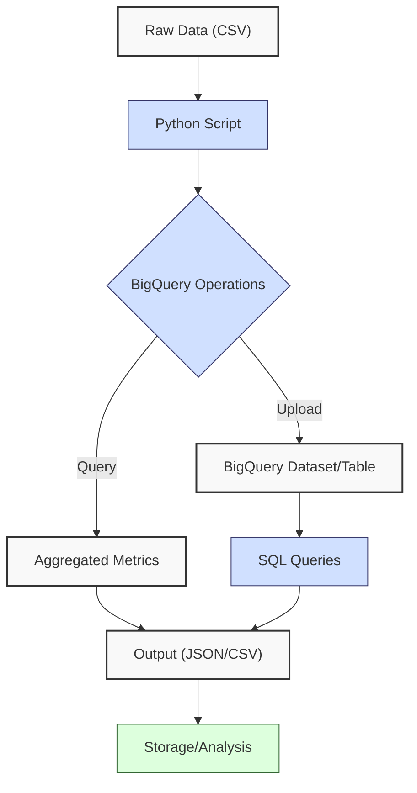
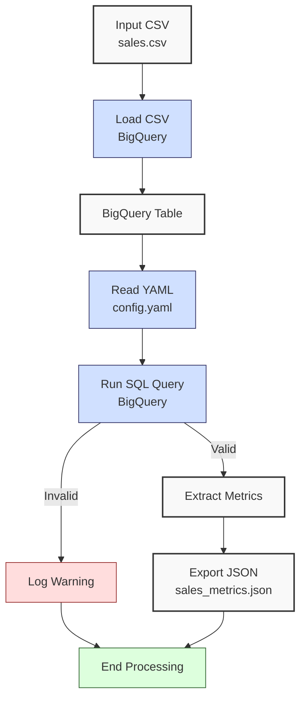

**Complexity: Moderate (M)**

## 25.0 Introduction: Why This Matters for Data Engineering

In data engineering, cloud-based analytics platforms like Google BigQuery are critical for processing large-scale financial transaction data, enabling Hijra Group to deliver Sharia-compliant fintech insights efficiently. BigQuery, a serverless data warehouse, supports petabyte-scale datasets with SQL-based querying, achieving query execution times of seconds for millions of rows due to its columnar storage and distributed architecture. This chapter introduces BigQuery fundamentals, including dataset creation, table management, and basic SQL queries, building on prior database knowledge from Chapters 12–24 (SQLite, PostgreSQL) and preparing for Python integration in Chapter 26.

BigQuery’s columnar storage optimizes analytical queries (e.g., aggregations) with O(n) complexity for n rows, leveraging Google’s Dremel engine for parallel processing. For Hijra Group’s analytics, BigQuery enables rapid sales data analysis, crucial for stakeholder reporting. This chapter uses `data/sales.csv` from Appendix 1, uploading it to BigQuery for querying, and avoids advanced concepts like type annotations (introduced in Chapter 7) or testing (Chapter 9) to focus on core operations. All code adheres to **PEP 8's 4-space indentation**, preferring spaces over tabs to prevent `IndentationError`.

### 25.0.1 Setup Instructions

To work with BigQuery, set up your environment as follows:

1. **Install Google Cloud SDK**:
   - Download and install from [Google Cloud SDK](https://cloud.google.com/sdk/docs/install) for your OS (Windows, macOS, Linux).
   - Initialize with `gcloud init` and follow prompts to select your Google Cloud project.
2. **Create a Google Cloud Project**:
   - Go to [Google Cloud Console](https://console.cloud.google.com), create a new project (e.g., `hijra-analytics`), and note the project ID (e.g., `hijra-analytics-123`).
3. **Enable Billing**:
   - Ensure billing is enabled for your project (see [Billing Setup](https://cloud.google.com/billing/docs/how-to/modify-project)); the free tier covers 10 GB/month of queries.
4. **Enable BigQuery API**:
   - In the Console, navigate to “APIs & Services” > “Library,” search for “BigQuery API,” and enable it.
5. **Authenticate**:
   - Run `gcloud auth application-default login` in a terminal to authenticate with your Google account. Follow the browser prompt to log in.
6. **Install Python Libraries**:
   - Run `pip install google-cloud-bigquery pandas pyyaml` in a virtual environment.
7. **Verify Setup**:
   - Run `gcloud config list` to confirm your project ID and authentication.
   - Expected output includes `[core] project = your-project-id`.
8. **Prepare Data**:
   - Create `de-onboarding/data/` and populate with `sales.csv`, `config.yaml`, `sample.csv`, and `sales.db` per Appendix 1.
9. **Navigate BigQuery Console**:
   - Access the BigQuery Console at [https://console.cloud.google.com/bigquery](https://console.cloud.google.com/bigquery).
   - In “SQL Workspace,” select your project from the left panel, then view datasets and tables to verify creation (e.g., `sales_data.sales`).

**Troubleshooting**:

- If `gcloud: command not found`, ensure SDK is installed and added to PATH.
- If authentication fails, re-run `gcloud auth application-default login`.
- If `pip` errors occur, create a virtual environment: `python -m venv venv`, activate (Windows: `venv\Scripts\activate`, Unix: `source venv/bin/activate`).
- If console navigation is unclear, refer to [BigQuery Console Guide](https://cloud.google.com/bigquery/docs/quickstarts/query-public-dataset#run_the_query).
- If billing errors occur, verify billing setup in Google Cloud Console.

### Data Engineering Workflow Context

This diagram illustrates BigQuery’s role in a cloud analytics pipeline:



### Building On and Preparing For

- **Building On**:
  - Chapters 12–15, 19–20: Leverages SQL skills from SQLite for BigQuery’s SQL syntax.
  - Chapters 16–17, 21–23: Applies PostgreSQL querying and schema design to BigQuery tables.
  - Chapter 24: Extends database fundamentals for cloud-based analytics.
- **Preparing For**:
  - Chapter 26: Enables Python integration with BigQuery for programmatic analytics.
  - Chapters 27–29: Prepares for advanced querying, warehousing, and optimization.
  - Chapter 32: Supports data mart creation with BigQuery.
  - Chapter 51: Lays groundwork for BI visualizations using BigQuery data.

### What You’ll Learn

This chapter covers:

1. **BigQuery Setup**: Configuring Google Cloud SDK and creating datasets.
2. **Table Management**: Uploading CSVs and defining schemas.
3. **Basic SQL Queries**: Filtering, grouping, and aggregating sales data.
4. **Query Execution**: Running queries via BigQuery Console and Python.
5. **Output Handling**: Exporting query results to JSON.

By the end, you’ll create a BigQuery dataset, upload `data/sales.csv`, query sales metrics, and export results to `data/sales_metrics.json`, all with 4-space indentation per PEP 8. The micro-project ensures robust handling of sales data, aligning with Hijra Group’s analytics needs.

**Follow-Along Tips**:

- Complete setup instructions above before running code.
- Use print statements (e.g., `print(query_job.result())`) to debug BigQuery queries.
- Verify file paths with `ls data/` (Unix/macOS) or `dir data\` (Windows).
- Use UTF-8 encoding to avoid `UnicodeDecodeError`.
- Configure editor for **4-space indentation** per PEP 8 (VS Code: “Editor: Tab Size” = 4, “Editor: Insert Spaces” = true, “Editor: Detect Indentation” = false).
- If `IndentationError` occurs, run `python -tt script.py` to detect tab/space mixing.

## 25.1 BigQuery Setup

BigQuery organizes data into **projects**, **datasets**, and **tables**. A project is a billing and access control unit, a dataset is a container for tables, and a table stores structured data. BigQuery’s serverless model eliminates infrastructure management, with costs based on data scanned (approximately $5 per terabyte queried, with a free tier of 10 GB/month; see [BigQuery Pricing](https://cloud.google.com/bigquery/pricing)). BigQuery integrates with Google Cloud Storage for loading data lakes, covered in Chapter 31. For production, authentication typically uses service accounts, covered in Chapter 65 (Security Best Practices).

### 25.1.1 Creating a Dataset

Create a dataset using Python and the `google-cloud-bigquery` library.

```python
from google.cloud import bigquery  # Import BigQuery client

# Initialize client
client = bigquery.Client()  # Connect to BigQuery

# Define dataset
project_id = "your-project-id"  # Replace with your project ID
dataset_id = f"{project_id}.sales_data"  # Dataset name
dataset = bigquery.Dataset(dataset_id)  # Create dataset object
dataset.location = "US"  # Set location (e.g., US, EU)

# Create dataset
client.create_dataset(dataset, exists_ok=True)  # Create if not exists
print(f"Created dataset: {dataset_id}")  # Confirm creation

# Expected Output:
# Created dataset: your-project-id.sales_data
```

**Follow-Along Instructions**:

1. Install library: `pip install google-cloud-bigquery`.
2. Replace `your-project-id` with your Google Cloud project ID (from `gcloud config list`).
3. Save as `de-onboarding/create_dataset.py`.
4. Configure editor for 4-space indentation per PEP 8.
5. Run: `python create_dataset.py`.
6. Verify dataset in BigQuery Console (https://console.cloud.google.com/bigquery).
7. **Common Errors**:
   - **AuthenticationError**: Ensure `gcloud auth application-default login` was run. Verify with `gcloud config list`.
   - **NotFound**: Confirm project ID. Print `client.project`.
   - **IndentationError**: Use 4 spaces (not tabs). Run `python -tt create_dataset.py`.

**Key Points**:

- **Dataset Creation**: O(1) operation, metadata-based.
- **Underlying Implementation**: BigQuery datasets are logical containers, stored in Google’s Colossus filesystem, enabling scalable metadata operations.
- **Implication**: Datasets organize sales data for Hijra Group’s analytics.

## 25.2 Table Management

Upload `data/sales.csv` to a BigQuery table with a defined schema.

### 25.2.1 Uploading a CSV

Define a schema and load `data/sales.csv` into a table.

```python
from google.cloud import bigquery  # Import BigQuery client

# Initialize client
client = bigquery.Client()  # Connect to BigQuery

# Define table
dataset_id = "your-project-id.sales_data"  # Replace with your dataset
table_id = f"{dataset_id}.sales"  # Table name
table = bigquery.Table(table_id)  # Create table object

# Define schema
schema = [
    bigquery.SchemaField("product", "STRING"),  # Product name
    bigquery.SchemaField("price", "FLOAT"),  # Sale price
    bigquery.SchemaField("quantity", "INTEGER")  # Quantity sold
]

table.schema = schema  # Assign schema
client.create_table(table, exists_ok=True)  # Create table if not exists

# Load CSV
job_config = bigquery.LoadJobConfig(
    source_format=bigquery.SourceFormat.CSV,  # CSV format
    skip_leading_rows=1,  # Skip header
    schema=schema,  # Apply schema
    write_disposition="WRITE_TRUNCATE"  # Overwrite table
)

with open("data/sales.csv", "rb") as source_file:
    job = client.load_table_from_file(source_file, table_id, job_config=job_config)

job.result()  # Wait for job to complete
print(f"Loaded {job.output_rows} rows into {table_id}")  # Confirm load

# Expected Output:
# Loaded 6 rows into your-project-id.sales_data.sales
```

**Follow-Along Instructions**:

1. Ensure `data/sales.csv` exists in `de-onboarding/data/` per Appendix 1.
2. Replace `your-project-id` with your project ID.
3. Save as `de-onboarding/load_table.py`.
4. Configure editor for 4-space indentation per PEP 8.
5. Run: `python load_table.py`.
6. Verify table in BigQuery Console.
7. **Common Errors**:
   - **FileNotFoundError**: Ensure `data/sales.csv` exists. Print `os.path.exists("data/sales.csv")`.
   - **SchemaMismatch**: Verify CSV with `pd.read_csv("data/sales.csv").head()`.
   - **IndentationError**: Use 4 spaces (not tabs). Run `python -tt load_table.py`.

**Key Points**:

- **Schema**: Ensures data types (STRING, FLOAT, INTEGER).
- **Load Operation**: O(n) for n rows, distributed across BigQuery nodes.
- **Underlying Implementation**: BigQuery stores tables in columnar format, optimizing analytical queries.
- **Space Complexity**: O(n) for n rows, with compression reducing storage.
- **Implication**: Efficient for loading sales data into Hijra Group’s warehouse.

## 25.3 Basic SQL Queries

Run SQL queries to analyze sales data, focusing on filtering, grouping, and aggregation. Queries use parameters to improve reusability, aligning with best practices. **Note**: Before querying, verify the table schema in BigQuery Console or print it using `print(client.get_table(table_id).schema)` to ensure data types match (e.g., `price` as `FLOAT`). The `or 0.0` in result handling (e.g., `next(results).total_sales or 0.0`) ensures robustness for empty results. For example, test an empty table with:

```python
client = bigquery.Client()
query = f"SELECT SUM(price * quantity) AS total_sales FROM `{table_id}` WHERE FALSE"
job = client.query(query)
result = next(job.result()).total_sales or 0.0
print(result)  # Expected: 0.0
```

### 25.3.1 Querying Sales Data

Query total sales and top products using parameterized SQL.

```python
from google.cloud import bigquery  # Import BigQuery client

# Initialize client
client = bigquery.Client()  # Connect to BigQuery

# Define query with parameters
query = """
SELECT
    product,
    SUM(price * quantity) AS total_sales
FROM
    `your-project-id.sales_data.sales`
WHERE
    product IS NOT NULL
    AND product LIKE @prefix
    AND quantity <= @max_quantity
GROUP BY
    product
ORDER BY
    total_sales DESC
LIMIT
    3
"""
job_config = bigquery.QueryJobConfig(
    query_parameters=[
        bigquery.ScalarQueryParameter("prefix", "STRING", "Halal%"),
        bigquery.ScalarQueryParameter("max_quantity", "INTEGER", 100)
    ]
)

# Run query
query_job = client.query(query, job_config=job_config)  # Execute query
results = query_job.result()  # Get results

# Print results
print("Top Products by Sales:")  # Debug
for row in results:
    print(f"Product: {row.product}, Total Sales: {row.total_sales}")  # Show results

# Expected Output:
# Top Products by Sales:
# Product: Halal Laptop, Total Sales: 1999.98
# Product: Halal Keyboard, Total Sales: 249.95
# Product: Halal Mouse, Total Sales: 249.9
```

**Follow-Along Instructions**:

1. Replace `your-project-id` with your project ID.
2. Save as `de-onboarding/query_sales.py`.
3. Configure editor for 4-space indentation per PEP 8.
4. Run: `python query_sales.py`.
5. Verify output matches expected.
6. **Common Errors**:
   - **QueryError**: Check SQL syntax. Print `query` and test in BigQuery Console.
   - **NotFound**: Ensure table exists. Run `client.get_table("your-project-id.sales_data.sales")`.
   - **IndentationError**: Use 4 spaces (not tabs). Run `python -tt query_sales.py`.

**Key Points**:

- **SQL Syntax**: BigQuery uses Standard SQL, similar to PostgreSQL (Chapter 21).
- **Parameters**: `@prefix` and `@max_quantity` improve query reusability.
- **Time Complexity**: O(n) for scanning n rows, optimized by columnar storage.
- **Space Complexity**: O(k) for k output rows.
- **Implication**: Efficient for aggregating sales metrics.

## 25.4 Micro-Project: Sales Data Analytics Tool

### Project Requirements

Build a BigQuery-based tool to analyze `data/sales.csv`, creating a dataset, uploading data, querying metrics, and exporting results to `data/sales_metrics.json`. This tool supports Hijra Group’s cloud analytics, ensuring Sharia-compliant sales reporting.

- Create a BigQuery dataset (`sales_data`).
- Upload `data/sales.csv` to a table (`sales`).
- Read `data/config.yaml` with PyYAML for validation rules.
- Query total sales and top 3 Halal products (quantity ≤ 100) using parameterized SQL.
- Export results to `data/sales_metrics.json`.
- Log steps using print statements.
- Use **4-space indentation** per PEP 8, preferring spaces over tabs.

### Sample Input Files

`data/sales.csv` (from Appendix 1):

```csv
product,price,quantity
Halal Laptop,999.99,2
Halal Mouse,24.99,10
Halal Keyboard,49.99,5
,29.99,3
Monitor,invalid,2
Headphones,5.00,150
```

`data/config.yaml` (from Appendix 1):

```yaml
min_price: 10.0
max_quantity: 100
required_fields:
  - product
  - price
  - quantity
product_prefix: 'Halal'
max_decimals: 2
```

### Data Processing Flow



### Acceptance Criteria

- **Go Criteria**:
  - Creates dataset and table correctly.
  - Uploads `sales.csv` with defined schema.
  - Queries total sales and top 3 Halal products using parameters.
  - Exports results to `data/sales_metrics.json`.
  - Logs steps and invalid data.
  - Uses 4-space indentation per PEP 8.
- **No-Go Criteria**:
  - Fails to create dataset/table.
  - Incorrect query results.
  - Missing JSON export.
  - Uses try/except or type annotations.
  - Inconsistent indentation.

### Common Pitfalls to Avoid

1. **Authentication Issues**:
   - **Problem**: `google.api_core.exceptions.Forbidden`.
   - **Solution**: Run `gcloud auth application-default login`. Print `client.project`.
2. **Schema Mismatches**:
   - **Problem**: `BadRequest` during CSV load.
   - **Solution**: Verify CSV with `pd.read_csv("data/sales.csv").head()`.
3. **Query Errors**:
   - **Problem**: Invalid SQL syntax.
   - **Solution**: Print `query` and test in BigQuery Console.
4. **FileNotFoundError**:
   - **Problem**: Missing `sales.csv` or `config.yaml`.
   - **Solution**: Ensure files in `de-onboarding/data/`. Print `os.path.exists("data/sales.csv")`.
5. **IndentationError**:
   - **Problem**: Mixed spaces/tabs.
   - **Solution**: Use 4 spaces per PEP 8. Run `python -tt sales_analytics.py`.

### How This Differs from Production

In production, this solution would include:

- **Error Handling**: Try/except (Chapter 7).
- **Type Safety**: Type annotations (Chapter 7).
- **Testing**: Pytest tests (Chapter 9).
- **Scalability**: Partitioned tables (Chapter 29).
- **Logging**: File-based logging (Chapter 52).
- **Security**: IAM roles and encryption (Chapter 65).

### Implementation

```python
# File: de-onboarding/sales_analytics.py
import pandas as pd  # For CSV inspection
import yaml  # For YAML parsing
import json  # For JSON export
import os  # For file checks
from google.cloud import bigquery  # For BigQuery operations

# Define function to read YAML configuration
def read_config(config_path):  # Takes config file path
    """Read YAML configuration."""
    print(f"Opening config: {config_path}")  # Debug
    file = open(config_path, "r")  # Open file
    config = yaml.safe_load(file)  # Parse YAML
    file.close()  # Close file
    print(f"Loaded config: {config}")  # Debug
    return config  # Return config

# Define function to create BigQuery dataset
def create_dataset(project_id, dataset_name):  # Takes project and dataset names
    """Create BigQuery dataset."""
    client = bigquery.Client()  # Initialize client
    dataset_id = f"{project_id}.{dataset_name}"  # Full dataset ID
    dataset = bigquery.Dataset(dataset_id)  # Create dataset object
    dataset.location = "US"  # Set location
    client.create_dataset(dataset, exists_ok=True)  # Create if not exists
    print(f"Created dataset: {dataset_id}")  # Confirm
    return dataset_id  # Return dataset ID

# Define function to load CSV to BigQuery
def load_csv_to_table(dataset_id, table_name, csv_path):  # Takes dataset, table, CSV path
    """Load CSV to BigQuery table."""
    client = bigquery.Client()  # Initialize client
    table_id = f"{dataset_id}.{table_name}"  # Full table ID
    table = bigquery.Table(table_id)  # Create table object

    # Define schema
    schema = [
        bigquery.SchemaField("product", "STRING"),
        bigquery.SchemaField("price", "FLOAT"),
        bigquery.SchemaField("quantity", "INTEGER")
    ]
    table.schema = schema  # Assign schema
    client.create_table(table, exists_ok=True)  # Create table

    # Load CSV
    job_config = bigquery.LoadJobConfig(
        source_format=bigquery.SourceFormat.CSV,
        skip_leading_rows=1,
        schema=schema,
        write_disposition="WRITE_TRUNCATE"
    )
    print(f"Loading CSV: {csv_path}")  # Debug
    with open(csv_path, "rb") as source_file:
        job = client.load_table_from_file(source_file, table_id, job_config=job_config)
    job.result()  # Wait for completion
    print(f"Loaded {job.output_rows} rows into {table_id}")  # Confirm
    return table_id  # Return table ID

# Define function to query sales data
def query_sales(table_id, config):  # Takes table ID and config
    """Query sales data for metrics."""
    client = bigquery.Client()  # Initialize client
    prefix = config["product_prefix"]  # Get prefix
    max_quantity = config["max_quantity"]  # Get max quantity
    min_price = config["min_price"]  # Get min price

    # Define query with parameters
    query = f"""
    SELECT
        product,
        SUM(price * quantity) AS total_sales
    FROM
        `{table_id}`
    WHERE
        product IS NOT NULL
        AND product LIKE @prefix
        AND quantity <= @max_quantity
        AND price >= @min_price
    GROUP BY
        product
    ORDER BY
        total_sales DESC
    LIMIT
        3
    """
    job_config = bigquery.QueryJobConfig(
        query_parameters=[
            bigquery.ScalarQueryParameter("prefix", "STRING", f"{prefix}%"),
            bigquery.ScalarQueryParameter("max_quantity", "INTEGER", max_quantity),
            bigquery.ScalarQueryParameter("min_price", "FLOAT", min_price)
        ]
    )

    print(f"Running query:\n{query}")  # Debug
    query_job = client.query(query, job_config=job_config)  # Execute query
    results = query_job.result()  # Get results

    # Process results
    total_sales = 0.0
    top_products = {}
    for row in results:
        total_sales += row.total_sales  # Accumulate total
        top_products[row.product] = float(row.total_sales)  # Store top products
    print(f"Query results: {top_products}")  # Debug

    return {
        "total_sales": float(total_sales),
        "top_products": top_products
    }, len(top_products)  # Return results and count

# Define function to export results
def export_results(results, json_path):  # Takes results and file path
    """Export results to JSON."""
    print(f"Writing to: {json_path}")  # Debug
    print(f"Results: {results}")  # Debug
    file = open(json_path, "w")  # Open file
    json.dump(results, file, indent=2)  # Write JSON
    file.close()  # Close file
    print(f"Exported results to {json_path}")  # Confirm

# Define main function
def main():  # No parameters
    """Main function to analyze sales data."""
    project_id = "your-project-id"  # Replace with your project ID
    dataset_name = "sales_data"  # Dataset name
    table_name = "sales"  # Table name
    csv_path = "data/sales.csv"  # CSV path
    config_path = "data/config.yaml"  # YAML path
    json_path = "data/sales_metrics.json"  # JSON output path

    # Validate file existence
    if not os.path.exists(csv_path):
        print(f"Error: {csv_path} not found")
        return
    if not os.path.exists(config_path):
        print(f"Error: {config_path} not found")
        return

    config = read_config(config_path)  # Read config
    dataset_id = create_dataset(project_id, dataset_name)  # Create dataset
    table_id = load_csv_to_table(dataset_id, table_name, csv_path)  # Load CSV
    results, valid_records = query_sales(table_id, config)  # Query data
    export_results(results, json_path)  # Export results

    # Print report
    print("\nSales Analytics Report:")
    print(f"Valid Records: {valid_records}")
    print(f"Total Sales: ${round(results['total_sales'], 2)}")
    print(f"Top Products: {results['top_products']}")
    print("Processing completed")

if __name__ == "__main__":
    main()  # Run main function
```

### Expected Outputs

`data/sales_metrics.json`:

```json
{
  "total_sales": 2499.83,
  "top_products": {
    "Halal Laptop": 1999.98,
    "Halal Keyboard": 249.95,
    "Halal Mouse": 249.9
  }
}
```

**Console Output** (abridged):

```
Opening config: data/config.yaml
Loaded config: {'min_price': 10.0, 'max_quantity': 100, 'required_fields': ['product', 'price', 'quantity'], 'product_prefix': 'Halal', 'max_decimals': 2}
Created dataset: your-project-id.sales_data
Loading CSV: data/sales.csv
Loaded 6 rows into your-project-id.sales_data.sales
Running query:
    SELECT
        product,
        SUM(price * quantity) AS total_sales
    FROM
        `your-project-id.sales_data.sales`
    WHERE
        product IS NOT NULL
        AND product LIKE @prefix
        AND quantity <= @max_quantity
        AND price >= @min_price
    GROUP BY
        product
    ORDER BY
        total_sales DESC
    LIMIT
        3
Query results: {'Halal Laptop': 1999.98, 'Halal Keyboard': 249.95, 'Halal Mouse': 249.9}
Writing to: data/sales_metrics.json
Exported results to data/sales_metrics.json

Sales Analytics Report:
Valid Records: 3
Total Sales: $2499.83
Top Products: {'Halal Laptop': 1999.98, 'Halal Keyboard': 249.95, 'Halal Mouse': 249.9}
Processing completed
```

### How to Run and Test

1. **Setup**:

   - **Setup Checklist**:
     - [ ] Complete setup instructions in Section 25.0.1 (install Google Cloud SDK, create project, enable billing, enable BigQuery API, authenticate, install libraries).
     - [ ] Create `de-onboarding/data/` with `sales.csv`, `config.yaml`, `sample.csv`, and `sales.db` per Appendix 1.
     - [ ] Verify Python 3.10+: `python --version`.
     - [ ] Configure editor for 4-space indentation per PEP 8.
     - [ ] Save `sales_analytics.py` in `de-onboarding/`.
   - **Troubleshooting**:
     - If `FileNotFoundError`, check files with `ls data/` (Unix/macOS) or `dir data\` (Windows).
     - If `google.api_core.exceptions.Forbidden`, re-authenticate with `gcloud auth application-default login`.
     - If `IndentationError`, use 4 spaces. Run `python -tt sales_analytics.py`.
     - If `yaml.YAMLError`, print `open(config_path).read()` to check syntax.
     - If billing errors occur, verify billing setup in Google Cloud Console.

2. **Run**:

   - Open terminal in `de-onboarding/`.
   - Replace `your-project-id` in `sales_analytics.py` with your project ID.
   - Run: `python sales_analytics.py`.
   - Outputs: `data/sales_metrics.json`, console logs.

3. **Test Scenarios**:

   - **Valid Data**: Verify `sales_metrics.json` shows `total_sales: 2499.83` and top products.
   - **Empty Table**: Manually truncate table in BigQuery Console, re-run query:
     ```python
     client = bigquery.Client()
     query = f"SELECT * FROM `{table_id}` WHERE FALSE"
     query_job = client.query(query)
     results = query_job.result()
     print(list(results))  # Expected: []
     ```

## 25.5 Practice Exercises

### Exercise 1: Create BigQuery Dataset

Write a function to create a BigQuery dataset, with 4-space indentation per PEP 8.

**Expected Output**:

```
Created dataset: your-project-id.test_data
```

**Follow-Along Instructions**:

1. Save as `de-onboarding/ex1_dataset.py`.
2. Configure editor for 4-space indentation per PEP 8.
3. Run: `python ex1_dataset.py`.
4. **How to Test**:
   - Verify dataset in BigQuery Console.
   - Test with invalid project ID: Should raise `NotFound`. Print `client.project` to debug.
   - **Common Errors**:
     - **AuthenticationError**: Re-run `gcloud auth application-default login`.
     - **IndentationError**: Use 4 spaces (not tabs). Run `python -tt ex1_dataset.py`.

### Exercise 2: Load CSV to BigQuery

Write a function to load `data/sales.csv` to a BigQuery table, with 4-space indentation per PEP 8.

**Expected Output**:

```
Loaded 6 rows into your-project-id.sales_data.sales
```

**Follow-Along Instructions**:

1. Save as `de-onboarding/ex2_load.py`.
2. Ensure `data/sales.csv` exists per Appendix 1.
3. Configure editor for 4-space indentation per PEP 8.
4. Run: `python ex2_load.py`.
5. **How to Test**:
   - Verify table in BigQuery Console.
   - Test with invalid CSV path: Should raise `FileNotFoundError`. Print `os.path.exists(csv_path)`.
   - **Common Errors**:
     - **SchemaMismatch**: Print `pd.read_csv(csv_path).head()` to inspect CSV.
     - **IndentationError**: Use 4 spaces (not tabs). Run `python -tt ex2_load.py`.

### Exercise 3: Query Total Sales

Write a function to query total sales from a BigQuery table using parameterized SQL, with 4-space indentation per PEP 8.

**Expected Output**:

```
Total Sales: 2499.83
```

**Follow-Along Instructions**:

1. Save as `de-onboarding/ex3_query.py`.
2. Configure editor for 4-space indentation per PEP 8.
3. Run: `python ex3_query.py`.
4. **How to Test**:
   - Verify output matches expected.
   - Test with empty table: Should return 0.0. Truncate table in BigQuery Console.
   - **Common Errors**:
     - **QueryError**: Print `query` to check syntax.
     - **IndentationError**: Use 4 spaces (not tabs). Run `python -tt ex3_query.py`.

### Exercise 4: Debug a Query Bug

Fix this buggy code that assumes `price` is a `STRING` instead of `FLOAT`, causing a type mismatch, with 4-space indentation per PEP 8.

**Buggy Code**:

```python
from google.cloud import bigquery
def query_sales(table_id):
    client = bigquery.Client()
    query = f"""
    SELECT
        product,
        SUM(CAST(price AS FLOAT) * quantity) AS total_sales
    FROM
        `{table_id}`
    GROUP BY
        product
    """
    query_job = client.query(query)
    results = query_job.result()
    total = sum(row.total_sales for row in results)
    return total

print(query_sales("your-project-id.sales_data.sales"))
```

**Expected Output**:

```
2499.83
```

**Follow-Along Instructions**:

1. Save as `de-onboarding/ex4_debug.py`.
2. Configure editor for 4-space indentation per PEP 8.
3. Run: `python ex4_debug.py` to see error (if schema is correct, it may run but is inefficient).
4. Fix and re-run.
5. **How to Test**:
   - Verify output matches expected.
   - Check schema in BigQuery Console to confirm `price` is `FLOAT`.
   - **Common Errors**:
     - **QueryError**: Print `query` and test in BigQuery Console.
     - **IndentationError**: Use 4 spaces (not tabs). Run `python -tt ex4_debug.py`.

### Exercise 5: Conceptual Analysis with Performance Comparison

Compare BigQuery’s columnar storage to SQLite’s row-based storage for sales data analytics by writing a script that queries total sales from both a BigQuery table (`your-project-id.sales_data.sales`) and a SQLite database (`data/sales.db`, created in Chapter 12’s SQLite setup), measuring execution time with `time.time()`. Save the comparison and timing results to `ex5_concepts.txt`. **Note**: BigQuery times may vary due to network latency; focus on relative differences, as SQLite is local. Use 4-space indentation per PEP 8.

**Expected Output** (in `ex5_concepts.txt`):

```
BigQuery Time: [time] seconds
SQLite Time: [time] seconds
Comparison: BigQuery’s columnar storage optimizes analytical queries (e.g., SUM(price * quantity)) with O(n) complexity for n rows, ideal for Hijra Group’s sales aggregations. SQLite’s row-based storage is better for transactional queries (e.g., INSERT, UPDATE) but slower for aggregations due to row scanning. BigQuery’s distributed architecture scales to petabytes, while SQLite is limited to local databases.
```

**Follow-Along Instructions**:

1. Save as `de-onboarding/ex5_concepts.py`.
2. Ensure `data/sales.db` exists per Appendix 1 (created in Chapter 12).
3. Configure editor for 4-space indentation per PEP 8.
4. Run: `python ex5_concepts.py`.
5. **How to Test**:
   - Verify `ex5_concepts.txt` contains timing results and comparison.
   - Ensure BigQuery time is generally faster for the small dataset (`sales.csv`).
   - Test with empty BigQuery table: Should return 0.0 for BigQuery.
   - **Common Errors**:
     - **FileNotFoundError**: Check `data/sales.db` with `os.path.exists("data/sales.db")`.
     - **DatabaseError**: Verify `sales` table in SQLite with `sqlite3 data/sales.db "SELECT * FROM sales;"`.
     - **IndentationError**: Use 4 spaces (not tabs). Run `python -tt ex5_concepts.py`.

### Exercise 6: Synthesize BigQuery Operations

Write a script that creates a BigQuery dataset (`test_data`), loads `data/sample.csv` into a table (`sample_sales`), and queries total sales for Halal products, saving results to `ex6_results.json`. Use 4-space indentation per PEP 8.

**Sample Input** (`data/sample.csv` from Appendix 1):

```csv
product,price,quantity
Halal Laptop,999.99,2
Halal Mouse,24.99,10
```

**Expected Output** (`ex6_results.json`):

```json
{
  "total_sales": 2249.88
}
```

**Follow-Along Instructions**:

1. Save as `de-onboarding/ex6_synthesize.py`.
2. Ensure `data/sample.csv` exists per Appendix 1.
3. Configure editor for 4-space indentation per PEP 8.
4. Run: `python ex6_synthesize.py`.
5. **How to Test**:
   - Verify `ex6_results.json` matches expected output.
   - Check dataset and table in BigQuery Console.
   - Test with empty CSV (e.g., `data/empty.csv`): Should return `total_sales: 0.0`.
   - **Common Errors**:
     - **FileNotFoundError**: Print `os.path.exists("data/sample.csv")`.
     - **SchemaMismatch**: Print `pd.read_csv("data/sample.csv").head()`.
     - **IndentationError**: Use 4 spaces (not tabs). Run `python -tt ex6_synthesize.py`.

### Exercise 7: Cost Optimization Analysis

Analyze the query from Exercise 3 and suggest one way to reduce the amount of data scanned in BigQuery to lower query costs (e.g., filter rows early). Save your answer to `ex7_cost.txt`. Use 4-space indentation per PEP 8 for any code snippets.

**Expected Output** (in `ex7_cost.txt`):

```
To reduce data scanned in BigQuery for the query in Exercise 3, apply the WHERE clause filters (e.g., product LIKE 'Halal%') before aggregations to limit rows processed. For example, filtering non-Halal products early reduces the dataset size, lowering costs since BigQuery charges ~$5/TB scanned.
```

**Follow-Along Instructions**:

1. Save any code as `de-onboarding/ex7_cost.py` (if used).
2. Configure editor for 4-space indentation per PEP 8.
3. Create `ex7_cost.txt` manually or via script.
4. **How to Test**:
   - Verify `ex7_cost.txt` contains a valid suggestion (e.g., early filtering).
   - Ensure relevance to BigQuery cost model (~$5/TB).
   - **Common Errors**:
     - **FileNotFoundError**: Check write permissions with `ls -l` (Unix/macOS) or `dir` (Windows).
     - **IndentationError**: Use 4 spaces (not tabs) in code snippets. Run `python -tt ex7_cost.py`.

## 25.6 Exercise Solutions

### Solution to Exercise 1: Create BigQuery Dataset

```python
from google.cloud import bigquery  # Import BigQuery client

def create_dataset(project_id, dataset_name):  # Takes project and dataset names
    """Create BigQuery dataset."""
    client = bigquery.Client()  # Initialize client
    dataset_id = f"{project_id}.{dataset_name}"  # Full ID
    dataset = bigquery.Dataset(dataset_id)  # Create dataset
    dataset.location = "US"  # Set location
    client.create_dataset(dataset, exists_ok=True)  # Create
    print(f"Created dataset: {dataset_id}")  # Confirm

# Test
create_dataset("your-project-id", "test_data")  # Call function
```

### Solution to Exercise 2: Load CSV to BigQuery

```python
from google.cloud import bigquery  # Import BigQuery client

def load_csv_to_table(dataset_id, table_name, csv_path):  # Takes dataset, table, CSV
    """Load CSV to BigQuery table."""
    client = bigquery.Client()  # Initialize client
    table_id = f"{dataset_id}.{table_name}"  # Full ID
    table = bigquery.Table(table_id)  # Create table

    schema = [
        bigquery.SchemaField("product", "STRING"),
        bigquery.SchemaField("price", "FLOAT"),
        bigquery.SchemaField("quantity", "INTEGER")
    ]
    table.schema = schema  # Assign schema
    client.create_table(table, exists_ok=True)  # Create

    job_config = bigquery.LoadJobConfig(
        source_format=bigquery.SourceFormat.CSV,
        skip_leading_rows=1,
        schema=schema,
        write_disposition="WRITE_TRUNCATE"
    )
    with open(csv_path, "rb") as source_file:
        job = client.load_table_from_file(source_file, table_id, job_config=job_config)
    job.result()  # Wait
    print(f"Loaded {job.output_rows} rows into {table_id}")  # Confirm

# Test
load_csv_to_table("your-project-id.sales_data", "sales", "data/sales.csv")
```

### Solution to Exercise 3: Query Total Sales

```python
from google.cloud import bigquery  # Import BigQuery client

def query_total_sales(table_id):  # Takes table ID
    """Query total sales."""
    client = bigquery.Client()  # Initialize client
    query = f"""
    SELECT
        SUM(price * quantity) AS total_sales
    FROM
        `{table_id}`
    WHERE
        product IS NOT NULL
        AND product LIKE @prefix
        AND quantity <= @max_quantity
    """
    job_config = bigquery.QueryJobConfig(
        query_parameters=[
            bigquery.ScalarQueryParameter("prefix", "STRING", "Halal%"),
            bigquery.ScalarQueryParameter("max_quantity", "INTEGER", 100)
        ]
    )
    query_job = client.query(query, job_config=job_config)  # Execute
    results = query_job.result()  # Get results
    total = next(results).total_sales or 0.0  # Extract total
    print(f"Total Sales: {total}")  # Confirm
    return total  # Return total

# Test
print(query_total_sales("your-project-id.sales_data.sales"))
```

### Solution to Exercise 4: Debug a Query Bug

```python
from google.cloud import bigquery  # Import BigQuery client

def query_sales(table_id):  # Takes table ID
    """Query total sales."""
    client = bigquery.Client()  # Initialize client
    query = f"""
    SELECT
        product,
        SUM(price * quantity) AS total_sales
    FROM
        `{table_id}`
    GROUP BY
        product
    """
    query_job = client.query(query)  # Execute
    results = query_job.result()  # Get results
    total = sum(row.total_sales for row in results)  # Sum
    return total  # Return total

# Test
print(query_sales("your-project-id.sales_data.sales"))
```

**Explanation**:

- **Bug**: The query used `CAST(price AS FLOAT)`, assuming `price` was `STRING`, which is unnecessary since the schema defines `price` as `FLOAT`.
- **Fix**: Removed `CAST`, using `price` directly.

### Solution to Exercise 5: Conceptual Analysis with Performance Comparison

```python
import time  # For timing
import sqlite3  # For SQLite
from google.cloud import bigquery  # For BigQuery

def compare_storage_performance(bigquery_table_id, sqlite_db_path, output_path):
    """Compare BigQuery and SQLite query performance."""
    # BigQuery query
    client = bigquery.Client()
    bq_query = f"""
    SELECT
        SUM(price * quantity) AS total_sales
    FROM
        `{bigquery_table_id}`
    WHERE
        product IS NOT NULL
        AND product LIKE 'Halal%'
    """
    start_time = time.time()
    bq_job = client.query(bq_query)
    bq_result = bq_job.result()
    bq_total = next(bq_result).total_sales or 0.0
    bq_time = time.time() - start_time

    # SQLite query
    conn = sqlite3.connect(sqlite_db_path)
    cursor = conn.cursor()
    sqlite_query = """
    SELECT
        SUM(price * quantity) AS total_sales
    FROM
        sales
    WHERE
        product IS NOT NULL
        AND product LIKE 'Halal%'
    """
    start_time = time.time()
    cursor.execute(sqlite_query)
    sqlite_total = cursor.fetchone()[0] or 0.0
    sqlite_time = time.time() - start_time
    conn.close()

    # Write results
    analysis = f"""
BigQuery Time: {bq_time:.4f} seconds
SQLite Time: {sqlite_time:.4f} seconds
Comparison: BigQuery’s columnar storage optimizes analytical queries (e.g., SUM(price * quantity)) with O(n) complexity for n rows, ideal for Hijra Group’s sales aggregations. SQLite’s row-based storage is better for transactional queries (e.g., INSERT, UPDATE) but slower for aggregations due to row scanning. BigQuery’s distributed architecture scales to petabytes, while SQLite is limited to local databases.
"""
    print(f"Writing analysis to: {output_path}")  # Debug
    file = open(output_path, "w")  # Open file
    file.write(analysis.strip())  # Write analysis
    file.close()  # Close file
    print(f"Saved to {output_path}")  # Confirm

# Test
compare_storage_performance("your-project-id.sales_data.sales", "data/sales.db", "ex5_concepts.txt")
```

### Solution to Exercise 6: Synthesize BigQuery Operations

```python
import json  # For JSON export
import os  # For file checks
from google.cloud import bigquery  # For BigQuery operations

def synthesize_bigquery_operations(project_id, dataset_name, table_name, csv_path, output_path):
    """Create dataset, load CSV, query total sales, and save results."""
    client = bigquery.Client()

    # Create dataset
    dataset_id = f"{project_id}.{dataset_name}"
    dataset = bigquery.Dataset(dataset_id)
    dataset.location = "US"
    client.create_dataset(dataset, exists_ok=True)
    print(f"Created dataset: {dataset_id}")

    # Load CSV
    table_id = f"{dataset_id}.{table_name}"
    table = bigquery.Table(table_id)
    schema = [
        bigquery.SchemaField("product", "STRING"),
        bigquery.SchemaField("price", "FLOAT"),
        bigquery.SchemaField("quantity", "INTEGER")
    ]
    table.schema = schema
    client.create_table(table, exists_ok=True)

    job_config = bigquery.LoadJobConfig(
        source_format=bigquery.SourceFormat.CSV,
        skip_leading_rows=1,
        schema=schema,
        write_disposition="WRITE_TRUNCATE"
    )
    with open(csv_path, "rb") as source_file:
        job = client.load_table_from_file(source_file, table_id, job_config=job_config)
    job.result()
    print(f"Loaded {job.output_rows} rows into {table_id}")

    # Query total sales
    query = f"""
    SELECT
        SUM(price * quantity) AS total_sales
    FROM
        `{table_id}`
    WHERE
        product IS NOT NULL
        AND product LIKE 'Halal%'
    """
    query_job = client.query(query)
    results = query_job.result()
    total_sales = next(results).total_sales or 0.0
    print(f"Total Sales: {total_sales}")

    # Save results
    results = {"total_sales": float(total_sales)}
    file = open(output_path, "w")
    json.dump(results, file, indent=2)
    file.close()
    print(f"Saved results to {output_path}")

# Test
if os.path.exists("data/sample.csv"):
    synthesize_bigquery_operations(
        "your-project-id", "test_data", "sample_sales", "data/sample.csv", "ex6_results.json"
    )
else:
    print("Error: data/sample.csv not found")
```

### Solution to Exercise 7: Cost Optimization Analysis

```python
def analyze_cost_optimization(output_path):
    """Suggest a way to reduce BigQuery query costs."""
    suggestion = """
To reduce data scanned in BigQuery for the query in Exercise 3, apply the WHERE clause filters (e.g., product LIKE 'Halal%') before aggregations to limit rows processed. For example, filtering non-Halal products early reduces the dataset size, lowering costs since BigQuery charges ~$5/TB scanned.
"""
    print(f"Writing analysis to: {output_path}")  # Debug
    file = open(output_path, "w")  # Open file
    file.write(suggestion.strip())  # Write suggestion
    file.close()  # Close file
    print(f"Saved to {output_path}")  # Confirm

# Test
analyze_cost_optimization("ex7_cost.txt")
```

## 25.7 Chapter Summary and Connection to Chapter 26

In this chapter, you’ve mastered:

- **BigQuery Setup**: Creating datasets (O(1) metadata operations) with Google Cloud SDK.
- **Table Management**: Uploading CSVs (O(n) for n rows) with schemas.
- **SQL Queries**: Filtering and aggregating data (O(n) scanning) using parameterized SQL.
- **White-Space Sensitivity and PEP 8**: Using 4-space indentation to avoid `IndentationError`.

The micro-project built a sales analytics tool, creating a BigQuery dataset, uploading `data/sales.csv`, querying metrics with parameterized SQL, and exporting results, aligning with Hijra Group’s cloud analytics needs. The exercises reinforced these concepts, including a performance comparison of BigQuery and SQLite, a synthesized operation task, and cost optimization analysis. BigQuery tables can serve as sources for data lakes and marts, explored in Chapters 31–32.

### Connection to Chapter 26

Chapter 26 introduces **Python and BigQuery Integration**, building on this chapter:

- **Data Loading**: Extends CSV uploads to programmatic pipelines.
- **SQL Queries**: Automates parameterized queries with Python scripts.
- **Modules**: Reuses utilities for validation, preparing for OOP (Chapter 5).
- **Fintech Context**: Enables automated analytics for Hijra Group, maintaining PEP 8 compliance.
