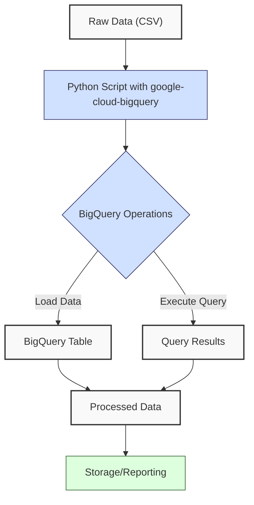
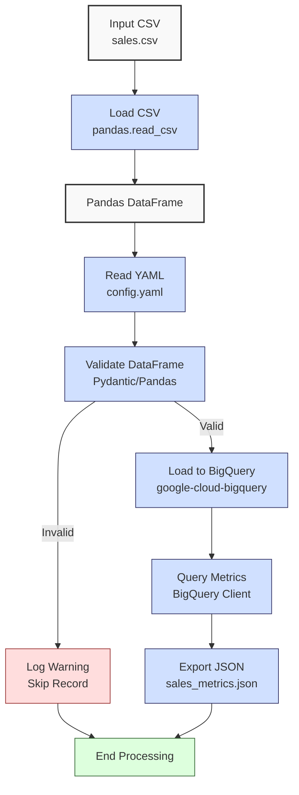
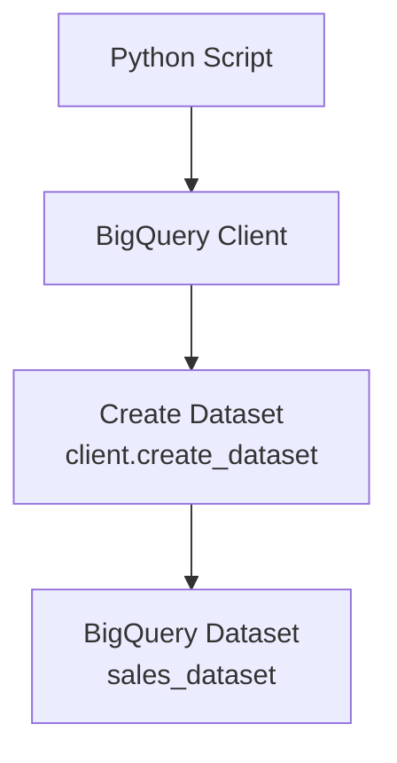

**Complexity: Moderate (M)**

## 26.0 Introduction: Why This Matters for Data Engineering

In data engineering, integrating Python with cloud-based data warehouses like Google BigQuery is essential for automating large-scale analytics, particularly for Hijra Group's Sharia-compliant fintech operations. BigQuery, a serverless data warehouse, handles petabytes of data with millisecond query performance, leveraging Google's Dremel engine for distributed query execution. Python integration via the `google-cloud-bigquery` library enables programmatic data loading, querying, and transformation, critical for building scalable data pipelines. Building on Chapter 25 (BigQuery Fundamentals), this chapter focuses on type-annotated Python code to automate sales data processing, ensuring robust, testable pipelines with Pyright verification and pytest tests, aligning with Hijra Group's need for secure, compliant analytics.

This chapter uses `data/sales.csv` and `config.yaml` (Appendix 1) for data loading and validation, avoiding advanced concepts like concurrency (Chapter 40) or dbt transformations (Chapter 54). All code includes type annotations (introduced in Chapter 7), is verified by Pyright, and is tested with pytest (introduced in Chapter 9). It adheres to **PEP 8's 4-space indentation**, preferring spaces over tabs to avoid `IndentationError`, ensuring compatibility with Hijra Group's pipeline standards.

### Data Engineering Workflow Context

This diagram illustrates Python and BigQuery integration in a data pipeline:



### Building On and Preparing For

- **Building On**:
  - Chapter 1: Uses Python basics (lists, dictionaries) for data manipulation, extended to Pandas DataFrames.
  - Chapter 2: Leverages CSV parsing and YAML configs, now integrated with BigQuery.
  - Chapter 3: Builds on Pandas for data loading (`pd.read_csv`), used for preprocessing before BigQuery upload.
  - Chapter 7: Applies type annotations for type-safe code, verified by Pyright.
  - Chapter 9: Incorporates pytest for testing pipeline components.
  - Chapter 25: Extends BigQuery table creation and querying with Python automation.
- **Preparing For**:
  - Chapter 27: Enables advanced BigQuery querying (e.g., CTEs, window functions).
  - Chapter 28: Supports data warehouse design with star schemas.
  - Chapter 31: Prepares for data lakes with Google Cloud Storage integration.
  - Chapter 54: Lays groundwork for dbt transformations in BigQuery.

### What You’ll Learn

This chapter covers:

1. **BigQuery Client Setup**: Initializing `google-cloud-bigquery` with type annotations.
2. **Data Loading**: Uploading Pandas DataFrames to BigQuery tables.
3. **Query Execution**: Running parameterized queries with type-safe results.
4. **Validation and Testing**: Ensuring data integrity with Pydantic and pytest.
5. **Micro-Project**: A type-annotated pipeline to load and query sales data, exporting results to JSON.

By the end, you’ll build a type-safe pipeline that loads `data/sales.csv` into BigQuery, validates data using `config.yaml`, queries sales metrics, and exports results, all with 4-space indentation per PEP 8. The pipeline is tested with pytest, including edge cases (`empty.csv`, `invalid.csv`, `malformed.csv`, `negative.csv`), ensuring robustness for Hijra Group's analytics.

**Follow-Along Tips**:

- Create `de-onboarding/data/` and populate with `sales.csv`, `config.yaml`, `empty.csv`, `invalid.csv`, `malformed.csv`, and `negative.csv` per Appendix 1.
- Install libraries: `pip install google-cloud-bigquery pandas pyyaml pydantic pytest`.
- Set up Google Cloud credentials (see micro-project setup).
- Use print statements (e.g., `print(df.head())`) to debug DataFrames.
- Verify file paths with `ls data/` (Unix/macOS) or `dir data\` (Windows).
- Use UTF-8 encoding to avoid `UnicodeDecodeError`.
- Configure editor for **4-space indentation** per PEP 8 (VS Code: “Editor: Tab Size” = 4, “Editor: Insert Spaces” = true, “Editor: Detect Indentation” = false).
- Run `python -tt script.py` to detect tab/space mixing.

## 26.1 BigQuery Client Setup

The `google-cloud-bigquery` library provides a type-safe client for BigQuery operations. The client requires Google Cloud credentials (a JSON key file) and a project ID, ensuring secure access to BigQuery resources.

### 26.1.1 Initializing the BigQuery Client

Create a type-annotated client to interact with BigQuery.

```python
# File: de-onboarding/bigquery_setup.py
from google.cloud import bigquery  # Import BigQuery client
from typing import Optional  # For type annotations

def init_bigquery_client(project_id: str, credentials_path: Optional[str] = None) -> bigquery.Client:
    """Initialize BigQuery client with credentials."""
    print(f"Initializing BigQuery client for project: {project_id}")  # Debug
    if credentials_path:
        print(f"Using credentials: {credentials_path}")  # Debug
        client = bigquery.Client.from_service_account_json(credentials_path, project=project_id)
    else:
        print("Using default credentials")  # Debug
        client = bigquery.Client(project=project_id)
    print("Client initialized successfully")  # Confirm
    return client

# Example usage
if __name__ == "__main__":
    project_id = "your-project-id"  # Replace with your Google Cloud project ID
    credentials_path = "path/to/credentials.json"  # Replace with your credentials path
    client = init_bigquery_client(project_id, credentials_path)
    print(f"Client project: {client.project}")  # Debug

# Expected Output:
# Initializing BigQuery client for project: your-project-id
# Using credentials: path/to/credentials.json
# Client initialized successfully
# Client project: your-project-id
```

**Follow-Along Instructions**:

1. Install library: `pip install google-cloud-bigquery`.
2. Save as `de-onboarding/bigquery_setup.py`.
3. Configure editor for 4-space indentation per PEP 8.
4. Replace `project_id` and `credentials_path` with your Google Cloud details (see micro-project setup).
5. Run: `python bigquery_setup.py`.
6. Verify output confirms client initialization.
7. **Common Errors**:
   - **GoogleAuthError**: Ensure `credentials_path` points to a valid JSON key file. Print `os.path.exists(credentials_path)`.
   - **ModuleNotFoundError**: Install `google-cloud-bigquery`.
   - **IndentationError**: Use 4 spaces (not tabs). Run `python -tt bigquery_setup.py`.

**Key Points**:

- **Type Annotations**: `bigquery.Client` ensures type-safe operations, verified by Pyright.
- **Credentials**: JSON key file from Google Cloud Console authenticates the client.
- **Underlying Implementation**: The client uses OAuth 2.0 for authentication, connecting to BigQuery’s REST API.
- **Performance Considerations**:
  - **Time Complexity**: O(1) for client initialization.
  - **Space Complexity**: O(1) for client object.
  - **Implication**: Secure client setup enables programmatic BigQuery access for Hijra Group’s pipelines.

## 26.2 Data Loading to BigQuery

Load Pandas DataFrames into BigQuery tables using type-annotated code. BigQuery supports schema auto-detection, but explicit schemas ensure type safety.

### 26.2.1 Uploading a DataFrame

Upload a cleaned DataFrame to a BigQuery table.

```python
# File: de-onboarding/bigquery_load.py
from google.cloud import bigquery  # Import BigQuery client
import pandas as pd  # Import Pandas
from typing import List  # For type annotations

def load_dataframe_to_bigquery(
    client: bigquery.Client,
    df: pd.DataFrame,
    dataset_id: str,
    table_id: str
) -> None:
    """Load DataFrame to BigQuery table."""
    print(f"Loading DataFrame to {dataset_id}.{table_id}")  # Debug
    table_ref = f"{client.project}.{dataset_id}.{table_id}"  # Full table path
    job_config = bigquery.LoadJobConfig(
        write_disposition="WRITE_TRUNCATE",  # Overwrite table
        schema=[
            bigquery.SchemaField("product", "STRING"),
            bigquery.SchemaField("price", "FLOAT"),
            bigquery.SchemaField("quantity", "INTEGER")
        ]
    )
    print(f"DataFrame rows: {len(df)}")  # Debug
    job = client.load_table_from_dataframe(df, table_ref, job_config=job_config)
    job.result()  # Wait for job completion
    print(f"Loaded {len(df)} rows to {table_ref}")  # Confirm

# Example usage
if __name__ == "__main__":
    project_id = "your-project-id"
    client = bigquery.Client(project=project_id)
    df = pd.read_csv("data/sales.csv").dropna()  # Load and clean CSV
    load_dataframe_to_bigquery(client, df, "sales_dataset", "sales_table")

# Expected Output:
# Loading DataFrame to sales_dataset.sales_table
# DataFrame rows: 4
# Loaded 4 rows to your-project-id.sales_dataset.sales_table
```

**Follow-Along Instructions**:

1. Ensure `data/sales.csv` exists per Appendix 1.
2. Save as `de-onboarding/bigquery_load.py`.
3. Configure editor for 4-space indentation per PEP 8.
4. Replace `project_id` and ensure dataset exists in BigQuery.
5. Run: `python bigquery_load.py`.
6. Verify table in BigQuery Console.
7. **Common Errors**:
   - **NotFound**: Ensure dataset exists. Create via BigQuery Console or `client.create_dataset(dataset_id)`.
   - **ValueError**: Check DataFrame schema matches `job_config.schema`. Print `df.dtypes`.
   - **IndentationError**: Use 4 spaces (not tabs). Run `python -tt bigquery_load.py`.

**Key Points**:

- **Type Annotations**: `pd.DataFrame` and `bigquery.Client` ensure type safety.
- **Schema Definition**: Explicit schemas prevent type mismatches.
- **Underlying Implementation**: Data is serialized to Parquet and uploaded via BigQuery’s streaming API.
- **Performance Considerations**:
  - **Time Complexity**: O(n) for n rows, dominated by network transfer.
  - **Space Complexity**: O(n) for DataFrame in memory.
  - **Implication**: Efficient for loading sales data into BigQuery for analytics.

## 26.3 Query Execution

Execute parameterized queries to retrieve metrics, ensuring type-safe results with Pydantic.

### 26.3.1 Running Queries

Run a query to compute total sales by product.

```python
# File: de-onboarding/bigquery_query.py
from google.cloud import bigquery  # Import BigQuery client
from pydantic import BaseModel  # For result validation
from typing import List  # For type annotations

class SalesResult(BaseModel):  # Pydantic model for query results
    product: str
    total_sales: float

def query_sales(
    client: bigquery.Client,
    dataset_id: str,
    table_id: str,
    max_quantity: int
) -> List[SalesResult]:
    """Query total sales by product with quantity filter."""
    query = """
    SELECT product, SUM(price * quantity) AS total_sales
    FROM `@project_id.@dataset_id.@table_id`
    WHERE quantity <= @max_quantity
    GROUP BY product
    """
    query = query.replace("@project_id", client.project).replace(
        "@dataset_id", dataset_id
    ).replace("@table_id", table_id)
    job_config = bigquery.QueryJobConfig(
        query_parameters=[bigquery.ScalarQueryParameter("max_quantity", "INT64", max_quantity)]
    )
    print(f"Running query: {query}")  # Debug
    query_job = client.query(query, job_config=job_config)
    results = [SalesResult(**row) for row in query_job.result()]
    print(f"Retrieved {len(results)} results")  # Confirm
    return results

# Example usage
if __name__ == "__main__":
    project_id = "your-project-id"
    client = bigquery.Client(project=project_id)
    results = query_sales(client, "sales_dataset", "sales_table", 100)
    for result in results:
        print(f"{result.product}: ${result.total_sales}")  # Debug

# Expected Output:
# Running query: SELECT product, SUM(price * quantity) AS total_sales ...
# Retrieved 3 results
# Halal Laptop: $1999.98
# Halal Mouse: $249.9
# Halal Keyboard: $249.95
```

**Follow-Along Instructions**:

1. Install library: `pip install pydantic`.
2. Save as `de-onboarding/bigquery_query.py`.
3. Configure editor for 4-space indentation per PEP 8.
4. Run: `python bigquery_query.py`.
5. Verify output shows sales metrics.
6. **Common Errors**:
   - **NotFound**: Ensure table exists. Print `client.list_tables(dataset_id)`.
   - **ValidationError**: Check Pydantic model matches query schema. Print query results.
   - **IndentationError**: Use 4 spaces (not tabs). Run `python -tt bigquery_query.py`.

**Key Points**:

- **Type Annotations**: `List[SalesResult]` ensures type-safe results.
- **Pydantic**: Validates query results, catching schema mismatches.
- **Parameterized Queries**: Prevent SQL injection, improving security.
- **Underlying Implementation**: Queries are executed via BigQuery’s Dremel engine, distributing computation across nodes.
- **Optimization Note**: BigQuery’s columnar storage and query engine optimize O(n) scans for large datasets. Partitioning (Chapter 29) can further reduce scanned data.
- **Performance Considerations**:
  - **Time Complexity**: O(n) for scanning n rows, optimized by BigQuery’s columnar storage.
  - **Space Complexity**: O(k) for k result rows.
  - **Implication**: Efficient for aggregating sales metrics in Hijra Group’s pipelines.

## 26.4 Micro-Project: Type-Safe Sales Data Pipeline

### Project Requirements

Build a type-annotated pipeline to load `data/sales.csv` into BigQuery, validate data using `config.yaml`, query sales metrics, and export results to `data/sales_metrics.json`. The pipeline supports Hijra Group’s analytics by ensuring Sharia-compliant data processing, with pytest tests for reliability, including edge cases (`empty.csv`, `invalid.csv`, `malformed.csv`, `negative.csv`).

- **Load**: Read `sales.csv` with Pandas and `config.yaml` with PyYAML.
- **Validate**: Use Pydantic and Pandas to enforce config rules (e.g., Halal prefix, max quantity).
- **Upload**: Load validated DataFrame to BigQuery.
- **Query**: Compute total sales by product, filtering by `max_quantity`.
- **Export**: Save results to JSON.
- **Test**: Use pytest to verify pipeline components and edge cases.
- **Use**: Type annotations, Pyright verification, and 4-space indentation per PEP 8.

### Sample Input Files

`data/sales.csv` (Appendix 1):

```csv
product,price,quantity
Halal Laptop,999.99,2
Halal Mouse,24.99,10
Halal Keyboard,49.99,5
,29.99,3
Monitor,invalid,2
Headphones,5.00,150
```

`data/config.yaml` (Appendix 1):

```yaml
min_price: 10.0
max_quantity: 100
required_fields:
  - product
  - price
  - quantity
product_prefix: 'Halal'
max_decimals: 2
```

### Data Processing Flow



### Acceptance Criteria

- **Go Criteria**:
  - Loads `sales.csv` and `config.yaml` correctly.
  - Validates data for Halal prefix, numeric price/quantity, positive prices, and config rules.
  - Uploads validated data to BigQuery table.
  - Queries total sales by product, filtering by `max_quantity`.
  - Exports results to `data/sales_metrics.json`.
  - Includes type annotations, verified by Pyright.
  - Passes pytest tests for loading, validation, querying, and edge cases (`empty.csv`, `invalid.csv`, `malformed.csv`, `negative.csv`).
  - Uses 4-space indentation per PEP 8, preferring spaces over tabs.
- **No-Go Criteria**:
  - Fails to load files or upload to BigQuery.
  - Incorrect validation or query results.
  - Missing JSON export.
  - Lacks type annotations or fails Pyright.
  - Inconsistent indentation or tab/space mixing.

### Common Pitfalls to Avoid

1. **Authentication Errors**:
   - **Problem**: Invalid credentials cause `GoogleAuthError`.
   - **Solution**: Verify credentials file path. Print `os.path.exists(credentials_path)`.
2. **Credential Setup Errors**:
   - **Problem**: `GoogleAuthError` due to missing environment variable or incorrect JSON key.
   - **Solution**: Set `export GOOGLE_APPLICATION_CREDENTIALS=path/to/credentials.json` (Unix) or `set GOOGLE_APPLICATION_CREDENTIALS=path/to/credentials.json` (Windows). Verify JSON key format in Google Cloud Console.
3. **Schema Mismatches**:
   - **Problem**: DataFrame schema doesn’t match BigQuery table.
   - **Solution**: Print `df.dtypes` and compare with `job_config.schema`.
4. **Query Errors**:
   - **Problem**: Invalid SQL syntax or missing table.
   - **Solution**: Print query string and verify table existence with `client.list_tables(dataset_id)`.
5. **Pydantic Validation**:
   - **Problem**: Query results don’t match Pydantic model.
   - **Solution**: Print raw query results to check schema.
6. **IndentationError**:
   - **Problem**: Mixed spaces/tabs.
   - **Solution**: Use 4 spaces per PEP 8. Run `python -tt sales_pipeline.py`.

### How This Differs from Production

In production, this solution would include:

- **Error Handling**: Robust try/except with retries (Chapter 40).
- **Scalability**: Chunked loading for large datasets (Chapter 40).
- **Logging**: Structured logging to files (Chapter 52).
- **Orchestration**: Airflow for scheduling (Chapter 56).
- **Security**: Encrypted credentials with Secret Manager (Chapter 65).
- **Schema Evolution**: Production systems may require schema updates (e.g., adding columns like `transaction_date`). BigQuery supports schema evolution with `SCHEMA_UPDATE_OPTION` (Chapter 28).

### Performance Considerations

- **Validation**:
  - **Time Complexity**: O(n) for iterating n rows, dominated by Pandas filtering and Pydantic validation.
  - **Space Complexity**: O(n) for storing validated DataFrame.
- **Data Loading**:
  - **Time Complexity**: O(n) for n rows, dominated by network transfer.
  - **Space Complexity**: O(n) for DataFrame in memory.
- **Querying**:
  - **Time Complexity**: O(n) for scanning n rows, optimized by BigQuery’s columnar storage.
  - **Space Complexity**: O(k) for k result rows.

### Implementation

```python
# File: de-onboarding/utils.py (updated from Chapter 3)
from typing import Union, Dict, Any  # For type annotations

def is_numeric(s: str, max_decimals: int = 2) -> bool:
    """Check if string is a decimal number with up to max_decimals. Allows negative numbers, filtered by price > 0."""
    parts = s.split(".")  # Split on decimal point
    if len(parts) != 2 or not parts[0].replace("-", "").isdigit() or not parts[1].isdigit():
        return False  # Invalid format
    return len(parts[1]) <= max_decimals  # Check decimal places

def clean_string(s: Union[str, Any]) -> str:
    """Strip whitespace from string or convert to string."""
    return str(s).strip()

def is_numeric_value(x: Any) -> bool:
    """Check if value is an integer or float."""
    return isinstance(x, (int, float))

def has_valid_decimals(x: Any, max_decimals: int) -> bool:
    """Check if value has valid decimal places."""
    return is_numeric(str(x), max_decimals)

def apply_valid_decimals(x: Any, max_decimals: int) -> bool:
    """Apply has_valid_decimals to a value."""
    return has_valid_decimals(x, max_decimals)

def is_integer(x: Any) -> bool:
    """Check if value is an integer when converted to string."""
    return str(x).isdigit()

def validate_sale(sale: Dict[str, Any], config: Dict[str, Any]) -> bool:
    """Validate sale based on config rules."""
    required_fields = config["required_fields"]
    min_price = config["min_price"]
    max_quantity = config["max_quantity"]
    prefix = config["product_prefix"]
    max_decimals = config["max_decimals"]

    print(f"Validating sale: {sale}")  # Debug
    for field in required_fields:
        if field not in sale or not sale[field] or clean_string(sale[field]) == "":
            print(f"Invalid sale: missing {field}: {sale}")
            return False

    product = clean_string(sale["product"])
    if not product.startswith(prefix):
        print(f"Invalid sale: product lacks '{prefix}' prefix: {sale}")
        return False

    price = clean_string(sale["price"])
    if not is_numeric(price, max_decimals) or float(price) < min_price or float(price) <= 0:
        print(f"Invalid sale: invalid price: {sale}")
        return False

    quantity = clean_string(sale["quantity"])
    if not quantity.isdigit() or int(quantity) > max_quantity:
        print(f"Invalid sale: invalid quantity: {sale}")
        return False

    return True

# File: de-onboarding/sales_pipeline.py
from google.cloud import bigquery  # Import BigQuery client
import pandas as pd  # Import Pandas
import yaml  # For YAML parsing
import json  # For JSON export
from pydantic import BaseModel  # For validation
from typing import List, Dict, Any, Optional  # For type annotations
import os  # For file operations
import utils  # Import custom utils

class Sale(BaseModel):  # Pydantic model for sales data
    product: str
    price: float
    quantity: int

class SalesResult(BaseModel):  # Pydantic model for query results
    product: str
    total_sales: float

def init_bigquery_client(project_id: str, credentials_path: Optional[str] = None) -> bigquery.Client:
    """Initialize BigQuery client with credentials."""
    print(f"Initializing BigQuery client for project: {project_id}")
    if credentials_path:
        print(f"Using credentials: {credentials_path}")
        client = bigquery.Client.from_service_account_json(credentials_path, project=project_id)
    else:
        print("Using default credentials")
        client = bigquery.Client(project=project_id)
    print("Client initialized successfully")
    return client

def read_config(config_path: str) -> Dict[str, Any]:
    """Read YAML configuration."""
    print(f"Opening config: {config_path}")
    with open(config_path, "r") as file:
        config = yaml.safe_load(file)
    print(f"Loaded config: {config}")
    return config

def load_and_validate_sales(csv_path: str, config: Dict[str, Any]) -> pd.DataFrame:
    """Load and validate sales CSV."""
    print(f"Loading CSV: {csv_path}")
    df = pd.read_csv(csv_path)
    print("Initial DataFrame:")
    print(df.head())

    required_fields = config["required_fields"]
    missing_fields = [f for f in required_fields if f not in df.columns]
    if missing_fields:
        print(f"Missing columns: {missing_fields}")
        return pd.DataFrame()

    df = df.dropna(subset=["product"])
    df = df[df["product"].str.startswith(config["product_prefix"])]
    df = df[df["quantity"].apply(utils.is_integer)]
    df["quantity"] = df["quantity"].astype(int)
    df = df[df["quantity"] <= config["max_quantity"]]
    df = df[df["price"].apply(utils.is_numeric_value)]
    df = df[df["price"] > 0]
    df = df[df["price"] >= config["min_price"]]
    df = df[df["price"].apply(lambda x: utils.apply_valid_decimals(x, config["max_decimals"]))]

    # Validate with Pydantic
    valid_rows = []
    for _, row in df.iterrows():
        sale = {"product": row["product"], "price": row["price"], "quantity": row["quantity"]}
        try:
            Sale(**sale)
            valid_rows.append(row)
        except ValueError as e:
            print(f"Invalid sale: {sale}, Error: {e}")

    df = pd.DataFrame(valid_rows)
    print("Validated DataFrame:")
    print(df)
    return df

def load_dataframe_to_bigquery(
    client: bigquery.Client,
    df: pd.DataFrame,
    dataset_id: str,
    table_id: str
) -> None:
    """Load DataFrame to BigQuery table."""
    print(f"Loading DataFrame to {dataset_id}.{table_id}")
    table_ref = f"{client.project}.{dataset_id}.{table_id}"
    job_config = bigquery.LoadJobConfig(
        write_disposition="WRITE_TRUNCATE",
        schema=[
            bigquery.SchemaField("product", "STRING"),
            bigquery.SchemaField("price", "FLOAT"),
            bigquery.SchemaField("quantity", "INTEGER")
        ]
    )
    print(f"DataFrame rows: {len(df)}")
    job = client.load_table_from_dataframe(df, table_ref, job_config=job_config)
    job.result()
    print(f"Loaded {len(df)} rows to {table_ref}")

def query_sales(
    client: bigquery.Client,
    dataset_id: str,
    table_id: str,
    max_quantity: int
) -> List[SalesResult]:
    """Query total sales by product."""
    query = """
    SELECT product, SUM(price * quantity) AS total_sales
    FROM `@project_id.@dataset_id.@table_id`
    WHERE quantity <= @max_quantity
    GROUP BY product
    """
    query = query.replace("@project_id", client.project).replace(
        "@dataset_id", dataset_id
    ).replace("@table_id", table_id)
    job_config = bigquery.QueryJobConfig(
        query_parameters=[bigquery.ScalarQueryParameter("max_quantity", "INT64", max_quantity)]
    )
    print(f"Running query: {query}")
    query_job = client.query(query, job_config=job_config)
    results = [SalesResult(**row) for row in query_job.result()]
    print(f"Retrieved {len(results)} results")
    return results

def export_results(results: List[SalesResult], json_path: str) -> None:
    """Export query results to JSON."""
    print(f"Writing to: {json_path}")
    results_dict = [result.dict() for result in results]
    print(f"Results: {results_dict}")
    with open(json_path, "w") as file:
        json.dump(results_dict, file, indent=2)
    print(f"Exported results to {json_path}")

def main() -> None:
    """Main function to run the sales pipeline."""
    project_id = "your-project-id"  # Replace with your project ID
    credentials_path = "path/to/credentials.json"  # Replace with your credentials
    csv_path = "data/sales.csv"
    config_path = "data/config.yaml"
    dataset_id = "sales_dataset"
    table_id = "sales_table"
    json_path = "data/sales_metrics.json"

    client = init_bigquery_client(project_id, credentials_path)
    config = read_config(config_path)
    df = load_and_validate_sales(csv_path, config)
    if not df.empty:
        load_dataframe_to_bigquery(client, df, dataset_id, table_id)
        results = query_sales(client, dataset_id, table_id, config["max_quantity"])
        export_results(results, json_path)
        print("\nSales Report:")
        for result in results:
            print(f"{result.product}: ${result.total_sales}")
    else:
        print("No valid data to process")

if __name__ == "__main__":
    main()
```

### Test Implementation

```python
# File: de-onboarding/tests/test_sales_pipeline.py
import pytest
import pandas as pd
from google.cloud import bigquery
from sales_pipeline import init_bigquery_client, load_and_validate_sales, query_sales, SalesResult
from typing import List
import yaml
from unittest.mock import MagicMock

@pytest.fixture
def config() -> dict:
    """Load config.yaml."""
    with open("data/config.yaml", "r") as file:
        return yaml.safe_load(file)

@pytest.fixture
def mock_client() -> bigquery.Client:
    """Mock BigQuery client for testing."""
    client = MagicMock(spec=bigquery.Client)
    client.project = "your-project-id"
    return client

def test_load_and_validate_sales(config: dict) -> None:
    """Test loading and validating sales.csv."""
    df = load_and_validate_sales("data/sales.csv", config)
    assert len(df) == 3  # Expect 3 valid rows
    assert all(df["product"].str.startswith("Halal"))
    assert all(df["price"] >= config["min_price"])
    assert all(df["quantity"] <= config["max_quantity"])

def test_empty_csv(config: dict) -> None:
    """Test loading empty.csv."""
    df = load_and_validate_sales("data/empty.csv", config)
    assert df.empty, "Empty CSV should return empty DataFrame"

def test_invalid_csv(config: dict) -> None:
    """Test loading invalid.csv with incorrect headers."""
    df = load_and_validate_sales("data/invalid.csv", config)
    assert df.empty, "Invalid headers should return empty DataFrame"

def test_malformed_csv(config: dict) -> None:
    """Test loading malformed.csv with non-integer quantity."""
    df = load_and_validate_sales("data/malformed.csv", config)
    assert len(df) == 1  # Expect 1 valid row (Halal Mouse)
    assert df["product"].iloc[0] == "Halal Mouse"

def test_negative_csv(config: dict) -> None:
    """Test loading negative.csv with negative price."""
    df = load_and_validate_sales("data/negative.csv", config)
    assert len(df) == 1  # Expect 1 valid row (Halal Mouse)
    assert df["product"].iloc[0] == "Halal Mouse"

def test_query_sales(mock_client: bigquery.Client, config: dict) -> None:
    """Test querying sales with mocked client."""
    # Mock query results
    mock_results = [
        {"product": "Halal Laptop", "total_sales": 1999.98},
        {"product": "Halal Mouse", "total_sales": 249.9},
        {"product": "Halal Keyboard", "total_sales": 249.95}
    ]
    mock_client<DL><PRETTYPRINT>query.return_value.result.return_value = mock_results

    results: List[SalesResult] = query_sales(mock_client, "sales_dataset", "sales_table", config["max_quantity"])
    assert len(results) == 3
    assert any(result.product == "Halal Laptop" and abs(result.total_sales - 1999.98) < 0.01 for result in results)

def test_query_sales_buggy_mock() -> None:
    """Test for Exercise 7: Debug faulty mock."""
    client = MagicMock()
    client.project = "your-project-id"
    # Correct mock results
    client.query.return_value.result.return_value = [
        {"product": "Halal Laptop", "total_sales": 1999.98}
    ]
    results = query_sales(client, "sales_dataset", "sales_table", 100)
    assert len(results) == 1
    assert results[0].product == "Halal Laptop"
```

### Expected Outputs

`data/sales_metrics.json`:

```json
[
  {
    "product": "Halal Laptop",
    "total_sales": 1999.98
  },
  {
    "product": "Halal Mouse",
    "total_sales": 249.9
  },
  {
    "product": "Halal Keyboard",
    "total_sales": 249.95
  }
]
```

**Console Output** (abridged):

```
Initializing BigQuery client for project: your-project-id
Using credentials: path/to/credentials.json
Client initialized successfully
Opening config: data/config.yaml
Loaded config: {'min_price': 10.0, 'max_quantity': 100, ...}
Loading CSV: data/sales.csv
Initial DataFrame:
          product   price  quantity
0   Halal Laptop  999.99         2
...
Validated DataFrame:
          product   price  quantity
0   Halal Laptop  999.99         2
1    Halal Mouse   24.99        10
2  Halal Keyboard   49.99         5
Loading DataFrame to sales_dataset.sales_table
DataFrame rows: 3
Loaded 3 rows to your-project-id.sales_dataset.sales_table
Running query: SELECT product, SUM(price * quantity) AS total_sales ...
Retrieved 3 results
Writing to: data/sales_metrics.json
Exported results to data/sales_metrics.json

Sales Report:
Halal Laptop: $1999.98
Halal Mouse: $249.9
Halal Keyboard: $249.95
```

### How to Run and Test

1. **Setup**:

   - **Setup Checklist**:
     - [ ] Create `de-onboarding/data/` and save `sales.csv`, `config.yaml`, `empty.csv`, `invalid.csv`, `malformed.csv`, `negative.csv` per Appendix 1.
     - [ ] Install libraries: `pip install google-cloud-bigquery pandas pyyaml pydantic pytest`.
     - [ ] Create Google Cloud project and download service account JSON key to `path/to/credentials.json`.
     - [ ] Create BigQuery dataset `sales_dataset` via BigQuery Console.
     - [ ] Set environment variable: `export GOOGLE_APPLICATION_CREDENTIALS=path/to/credentials.json` (Unix) or `set GOOGLE_APPLICATION_CREDENTIALS=path/to/credentials.json` (Windows).
     - [ ] Create virtual environment: `python -m venv venv`, activate (Windows: `venv\Scripts\activate`, Unix: `source venv/bin/activate`).
     - [ ] Verify Python 3.10+: `python --version`.
     - [ ] Configure editor for 4-space indentation per PEP 8.
     - [ ] Save `utils.py`, `sales_pipeline.py`, and `tests/test_sales_pipeline.py`.
     - [ ] **Note on Costs**: BigQuery charges for storage and query processing (e.g., $5/TB queried). Use the free tier (10 GB storage, 1 TB queries/month) for this project, and monitor usage in Google Cloud Console.
     - [ ] **Best Practices**: Review Google Cloud’s BigQuery best practices (https://cloud.google.com/bigquery/docs/best-practices) for naming conventions and query optimization.
   - **Troubleshooting**:
     - If `GoogleAuthError`, verify credentials path and project ID. Check `GOOGLE_APPLICATION_CREDENTIALS` environment variable.
     - If `NotFound`, create dataset in BigQuery Console.
     - If `yaml.YAMLError`, print `open(config_path).read()` to check syntax.
     - If `IndentationError`, use 4 spaces. Run `python -tt sales_pipeline.py`.

2. **Run**:

   - Open terminal in `de-onboarding/`.
   - Run: `python sales_pipeline.py`.
   - Outputs: `data/sales_metrics.json`, console logs.

3. **Test**:

   - Run: `pytest tests/test_sales_pipeline.py -v`.
   - Verify tests pass, confirming loading, querying, and edge cases.

## 26.5 Practice Exercises

### Exercise 1: BigQuery Client Initialization

Write a type-annotated function to initialize a BigQuery client, with 4-space indentation per PEP 8.

**Expected Output**:

```
Client initialized for project: your-project-id
```

**Follow-Along Instructions**:

1. Save as `de-onboarding/ex1_bigquery_client.py`.
2. Configure editor for 4-space indentation per PEP 8.
3. Run: `python ex1_bigquery_client.py`.
4. **How to Test**:
   - Add: `client = init_client("your-project-id", "path/to/credentials.json"); print(f"Client initialized for project: {client.project}")`.
   - Verify output matches expected.
   - Test with invalid credentials: Should raise `GoogleAuthError`.

### Exercise 2: DataFrame Upload

Write a type-annotated function to upload a DataFrame to BigQuery, with 4-space indentation per PEP 8.

**Sample Input**:

```python
df = pd.DataFrame({
    "product": ["Halal Laptop", "Halal Mouse"],
    "price": [999.99, 24.99],
    "quantity": [2, 10]
})
```

**Expected Output**:

```
Loaded 2 rows to your-project-id.sales_dataset.sales_table
```

**Follow-Along Instructions**:

1. Save as `de-onboarding/ex2_upload.py`.
2. Configure editor for 4-space indentation per PEP 8.
3. Run: `python ex2_upload.py`.
4. **How to Test**:
   - Verify table in BigQuery Console.
   - Test with empty DataFrame: Should load no rows.

### Exercise 3: Query Sales Metrics

Write a type-annotated function to query total sales by product, with 4-space indentation per PEP 8.

**Expected Output**:

```
[
    {"product": "Halal Laptop", "total_sales": 1999.98},
    {"product": "Halal Mouse", "total_sales": 249.9}
]
```

**Follow-Along Instructions**:

1. Save as `de-onboarding/ex3_query.py`.
2. Configure editor for 4-space indentation per PEP 8.
3. Run: `python ex3_query.py`.
4. **How to Test**:
   - Verify results match expected.
   - Test with invalid table: Should raise `NotFound`.

### Exercise 4: Pydantic Validation

Write a type-annotated function to validate query results with Pydantic, with 4-space indentation per PEP 8.

**Sample Input**:

```python
results = [
    {"product": "Halal Laptop", "total_sales": 1999.98},
    {"product": "Halal Mouse", "total_sales": 249.9}
]
```

**Expected Output**:

```
Validated 2 results
```

**Follow-Along Instructions**:

1. Save as `de-onboarding/ex4_validate.py`.
2. Configure editor for 4-space indentation per PEP 8.
3. Run: `python ex4_validate.py`.
4. **How to Test**:
   - Test with invalid data (e.g., negative `total_sales`): Should raise `ValidationError`.

### Exercise 5: Debug a Query Bug

Fix buggy code that uses incorrect query parameters, with 4-space indentation per PEP 8.

**Buggy Code**:

```python
from google.cloud import bigquery
from pydantic import BaseModel
from typing import List

class SalesResult(BaseModel):
    product: str
    total_sales: float

def query_sales(client: bigquery.Client, dataset_id: str, table_id: str) -> List[SalesResult]:
    query = """
    SELECT product, SUM(price * quantity) AS total_sales
    FROM `@project_id.@dataset_id.@table_id`
    WHERE quantity <= @max_quantity
    GROUP BY product
    """
    query = query.replace("@project_id", client.project).replace(
        "@dataset_id", dataset_id
    ).replace("@table_id", table_id)
    job_config = bigquery.QueryJobConfig()  # Bug: Missing query parameter
    query_job = client.query(query, job_config=job_config)
    return [SalesResult(**row) for row in query_job.result()]
```

**Expected Output**:

```
[
    {"product": "Halal Laptop", "total_sales": 1999.98},
    {"product": "Halal Mouse", "total_sales": 249.9}
]
```

**Follow-Along Instructions**:

1. Save as `de-onboarding/ex5_debug.py`.
2. Configure editor for 4-space indentation per PEP 8.
3. Run: `python ex5_debug.py` to see error.
4. Fix and re-run.
5. **How to Test**:
   - Verify output matches expected.
   - Test with different `max_quantity` values.

### Exercise 6: Create BigQuery Dataset

Write a type-annotated function to create a BigQuery dataset, with 4-space indentation per PEP 8.



**Note**: The `exists_ok=True` parameter makes dataset creation idempotent, preventing errors if the dataset already exists.

**Expected Output**:

```
Dataset sales_dataset created
```

**Follow-Along Instructions**:

1. Save as `de-onboarding/ex6_dataset.py`.
2. Configure editor for 4-space indentation per PEP 8.
3. Run: `python ex6_dataset.py`.
4. **How to Test**:
   - Verify dataset in BigQuery Console.
   - Test with existing dataset: Should not raise an error (idempotent).

### Exercise 7: Debug a Mock Test

Fix buggy code that mocks a BigQuery query but returns incorrect results, with 4-space indentation per PEP 8.

**Buggy Code**:

```python
from unittest.mock import MagicMock
from sales_pipeline import query_sales, SalesResult
from typing import List

def test_query_sales() -> List[SalesResult]:
    client = MagicMock()
    client.query.return_value.result.return_value = [{"product": "Halal Laptop"}]  # Bug: Incomplete result
    results = query_sales(client, "sales_dataset", "sales_table", 100)
    assert len(results) == 1
    return results
```

**Expected Output**:

```
[{"product": "Halal Laptop", "total_sales": 1999.98}]
```

**Follow-Along Instructions**:

1. Save as `de-onboarding/ex7_mock_debug.py`.
2. Configure editor for 4-space indentation per PEP 8.
3. Run: `python ex7_mock_debug.py` to see error.
4. Fix and re-run.
5. **How to Test**:
   - Verify output matches expected.
   - Test with additional mock results to ensure correct validation.
   - **Debugging Tips**: If `ValidationError` occurs, print mock results (`print(client.query.return_value.result.return_value)`). Ensure mock data matches `SalesResult` fields (`product`, `total_sales`).

### Exercise 8: Analyze Query Parameterization

Explain why parameterized queries are used in `query_sales` instead of string concatenation, with 4-space indentation per PEP 8.

**Expected Output** (save to `de-onboarding/ex8_concepts.txt`):

```
Parameterized queries prevent SQL injection by separating query logic from user input, ensuring safety. String concatenation risks malicious input altering the query, compromising security.
```

**Follow-Along Instructions**:

1. Save explanation as `de-onboarding/ex8_concepts.txt`.
2. Configure editor for 4-space indentation per PEP 8.
3. **How to Test**:
   - Verify explanation addresses SQL injection and security.
   - Compare with `query_sales` code to ensure accuracy.

## 26.6 Exercise Solutions

### Solution to Exercise 1: BigQuery Client Initialization

```python
from google.cloud import bigquery
from typing import Optional

def init_client(project_id: str, credentials_path: Optional[str] = None) -> bigquery.Client:
    """Initialize BigQuery client."""
    print(f"Initializing client for project: {project_id}")
    if credentials_path:
        client = bigquery.Client.from_service_account_json(credentials_path, project=project_id)
    else:
        client = bigquery.Client(project=project_id)
    print(f"Client initialized for project: {client.project}")
    return client

# Test
client = init_client("your-project-id", "path/to/credentials.json")
```

### Solution to Exercise 2: DataFrame Upload

```python
from google.cloud import bigquery
import pandas as pd
from typing import List

def upload_dataframe(
    client: bigquery.Client,
    df: pd.DataFrame,
    dataset_id: str,
    table_id: str
) -> None:
    """Upload DataFrame to BigQuery."""
    print(f"Uploading to {dataset_id}.{table_id}")
    table_ref = f"{client.project}.{dataset_id}.{table_id}"
    job_config = bigquery.LoadJobConfig(
        write_disposition="WRITE_TRUNCATE",
        schema=[
            bigquery.SchemaField("product", "STRING"),
            bigquery.SchemaField("price", "FLOAT"),
            bigquery.SchemaField("quantity", "INTEGER")
        ]
    )
    job = client.load_table_from_dataframe(df, table_ref, job_config=job_config)
    job.result()
    print(f"Loaded {len(df)} rows to {table_ref}")

# Test
client = bigquery.Client(project="your-project-id")
df = pd.DataFrame({
    "product": ["Halal Laptop", "Halal Mouse"],
    "price": [999.99, 24.99],
    "quantity": [2, 10]
})
upload_dataframe(client, df, "sales_dataset", "sales_table")
```

### Solution to Exercise 3: Query Sales Metrics

```python
from google.cloud import bigquery
from pydantic import BaseModel
from typing import List

class SalesResult(BaseModel):
    product: str
    total_sales: float

def query_sales_metrics(
    client: bigquery.Client,
    dataset_id: str,
    table_id: str,
    max_quantity: int
) -> List[SalesResult]:
    """Query sales metrics."""
    query = """
    SELECT product, SUM(price * quantity) AS total_sales
    FROM `@project_id.@dataset_id.@table_id`
    WHERE quantity <= @max_quantity
    GROUP BY product
    """
    query = query.replace("@project_id", client.project).replace(
        "@dataset_id", dataset_id
    ).replace("@table_id", table_id)
    job_config = bigquery.QueryJobConfig(
        query_parameters=[bigquery.ScalarQueryParameter("max_quantity", "INT64", max_quantity)]
    )
    query_job = client.query(query, job_config=job_config)
    results = [SalesResult(**row) for row in query_job.result()]
    print(results)
    return results

# Test
client = bigquery.Client(project="your-project-id")
results = query_sales_metrics(client, "sales_dataset", "sales_table", 100)
```

### Solution to Exercise 4: Pydantic Validation

```python
from pydantic import BaseModel
from typing import List

class SalesResult(BaseModel):
    product: str
    total_sales: float

def validate_results(results: List[dict]) -> List[SalesResult]:
    """Validate query results with Pydantic."""
    validated = [SalesResult(**result) for result in results]
    print(f"Validated {len(validated)} results")
    return validated

# Test
results = [
    {"product": "Halal Laptop", "total_sales": 1999.98},
    {"product": "Halal Mouse", "total_sales": 249.9}
]
validated = validate_results(results)
```

### Solution to Exercise 5: Debug a Query Bug

```python
from google.cloud import bigquery
from pydantic import BaseModel
from typing import List

class SalesResult(BaseModel):
    product: str
    total_sales: float

def query_sales(client: bigquery.Client, dataset_id: str, table_id: str, max_quantity: int) -> List[SalesResult]:
    """Query sales with fixed parameters."""
    query = """
    SELECT product, SUM(price * quantity) AS total_sales
    FROM `@project_id.@dataset_id.@table_id`
    WHERE quantity <= @max_quantity
    GROUP BY product
    """
    query = query.replace("@project_id", client.project).replace(
        "@dataset_id", dataset_id
    ).replace("@table_id", table_id)
    job_config = bigquery.QueryJobConfig(
        query_parameters=[bigquery.ScalarQueryParameter("max_quantity", "INT64", max_quantity)]
    )
    query_job = client.query(query, job_config=job_config)
    return [SalesResult(**row) for row in query_job.result()]

# Test
client = bigquery.Client(project="your-project-id")
results = query_sales(client, "sales_dataset", "sales_table", 100)
print([result.dict() for result in results])
```

**Explanation**:

- **Bug**: Missing `query_parameters` in `job_config` caused a query error.
- **Fix**: Added `ScalarQueryParameter` for `max_quantity`.

### Solution to Exercise 6: Create BigQuery Dataset

```python
from google.cloud import bigquery
from typing import Optional

def create_dataset(client: bigquery.Client, dataset_id: str) -> None:
    """Create a BigQuery dataset."""
    dataset_ref = f"{client.project}.{dataset_id}"
    dataset = bigquery.Dataset(dataset_ref)
    client.create_dataset(dataset, exists_ok=True)  # Idempotent creation, ignores existing dataset
    print(f"Dataset {dataset_id} created")

# Test
client = bigquery.Client(project="your-project-id")
create_dataset(client, "sales_dataset")
```

### Solution to Exercise 7: Debug a Mock Test

```python
from unittest.mock import MagicMock
from sales_pipeline import query_sales, SalesResult
from typing import List

def test_query_sales() -> List[SalesResult]:
    """Test query_sales with correct mock."""
    client = MagicMock()
    client.project = "your-project-id"
    # Fixed mock results
    client.query.return_value.result.return_value = [
        {"product": "Halal Laptop", "total_sales": 1999.98}
    ]
    results = query_sales(client, "sales_dataset", "sales_table", 100)
    assert len(results) == 1
    assert results[0].product == "Halal Laptop"
    assert abs(results[0].total_sales - 1999.98) < 0.01
    print([result.dict() for result in results])
    return results
```

**Explanation**:

- **Bug**: The mock result `[{"product": "Halal Laptop"}]` lacked the `total_sales` field, causing a Pydantic `ValidationError`.
- **Fix**: Added `total_sales` to the mock result, ensuring it matches the `SalesResult` model.

### Solution to Exercise 8: Analyze Query Parameterization

```text
# File: de-onboarding/ex8_concepts.txt
Parameterized queries prevent SQL injection by separating query logic from user input, ensuring safety. String concatenation risks malicious input altering the query, compromising security.
```

**Explanation**:

- Parameterized queries in `query_sales` use `bigquery.QueryJobConfig` with `ScalarQueryParameter` to bind `max_quantity`, preventing SQL injection. String concatenation (e.g., `query.format(max_quantity)`) allows malicious input (e.g., `"; DROP TABLE sales;"`) to alter the query, risking data loss or unauthorized access.

## 26.7 Chapter Summary and Connection to Chapter 27

In this chapter, you’ve mastered:

- **BigQuery Client**: Type-safe initialization with `google-cloud-bigquery`.
- **Data Loading**: Uploading Pandas DataFrames to BigQuery (O(n) time).
- **Querying**: Parameterized queries with Pydantic validation (O(n) scan time).
- **Testing**: Pytest with mocking for pipeline reliability, including edge cases (`empty.csv`, `invalid.csv`, `malformed.csv`, `negative.csv`).
- **White-Space Sensitivity and PEP 8**: 4-space indentation, avoiding `IndentationError`.

The micro-project built a type-annotated pipeline to load, validate, and query sales data, exporting results to JSON, verified by Pyright and tested with pytest. Edge case tests ensure robustness, dataset creation reinforces Chapter 25’s concepts, mock testing enhances accessibility, and query parameterization analysis highlights security. This prepares for Chapter 27’s advanced querying techniques, such as CTEs and window functions, enhancing analytical capabilities for Hijra Group’s pipelines.

### Connection to Chapter 27

Chapter 27 (BigQuery Advanced Querying) builds on this chapter:

- **Querying**: Extends parameterized queries to complex analytics (e.g., window functions).
- **Data Structures**: Uses DataFrames for query results, building on Pandas integration.
- **Type Safety**: Continues type annotations for robust code.
- **Fintech Context**: Prepares for advanced sales trend analysis, maintaining PEP 8 compliance.
