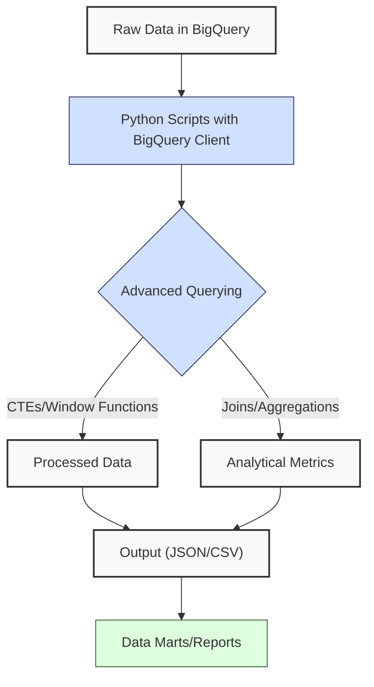
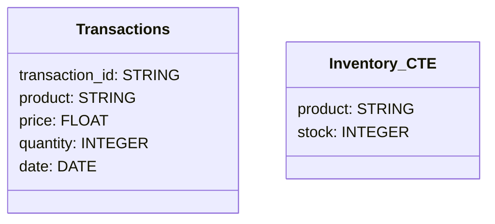
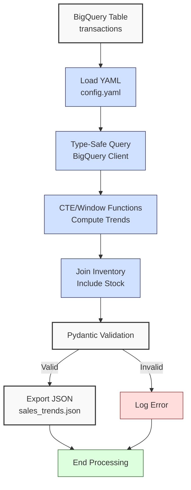
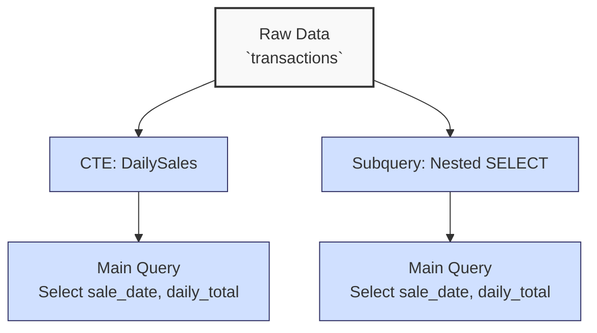

**Complexity: Moderate (M)**

## 27.0 Introduction: Why This Matters for Data Engineering

In data engineering, advanced querying in Google BigQuery is crucial for extracting actionable insights from large-scale financial transaction datasets, such as those used in Hijra Group’s Sharia-compliant fintech analytics. BigQuery’s serverless architecture enables querying terabytes of data in seconds, with features like window functions and Common Table Expressions (CTEs) optimizing complex analytics tasks. These capabilities are essential for generating reports on sales trends, customer behavior, or compliance metrics, which are critical for stakeholder decision-making. Building on Chapters 25 (BigQuery Fundamentals) and 26 (Python and BigQuery Integration), this chapter introduces advanced querying techniques, including CTEs, window functions, and joins, to process transaction data efficiently.

This chapter leverages type-annotated Python code (introduced in Chapter 7) verified by Pyright and tested with `pytest` (introduced in Chapter 9), ensuring robust, production-ready pipelines. It avoids concepts not yet introduced, such as data warehousing (Chapter 28) or optimization techniques (Chapter 29). All code uses **PEP 8's 4-space indentation**, preferring spaces over tabs to avoid `IndentationError`, aligning with Hijra Group’s pipeline standards.

**Setup Note**: This chapter assumes `data/transactions.csv` is loaded into a BigQuery table, as covered in Chapter 26. Refer to Section 27.4’s setup instructions for a reminder on loading the data.

### Data Engineering Workflow Context

This diagram illustrates how advanced BigQuery querying fits into a data engineering pipeline:



### Building On and Preparing For

- **Building On**:
  - Chapter 25: Uses BigQuery basics (datasets, tables, SQL queries) to execute advanced queries.
  - Chapter 26: Leverages `google-cloud-bigquery` for programmatic query execution and YAML configuration parsing.
  - Chapter 7: Applies type annotations for robust code.
  - Chapter 9: Incorporates `pytest` for testing query results.
  - Chapter 23: Extends type-safe database integration concepts to BigQuery.
- **Preparing For**:
  - Chapter 28: Prepares for data warehouse design with star schemas.
  - Chapter 29: Lays groundwork for BigQuery optimization (e.g., partitioning, clustering).
  - Chapter 32: Enables data mart creation for targeted analytics.
  - Chapter 51: Supports BI dashboard creation with query results.

### What You’ll Learn

This chapter covers:

1. **Common Table Expressions (CTEs)**: Simplify complex queries for readability and modularity.
2. **Window Functions**: Compute running totals, rankings, and moving averages.
3. **Advanced Joins**: Combine multiple tables for comprehensive analytics.
4. **Type-Safe Query Execution**: Use `google-cloud-bigquery` with Pydantic validation.
5. **Testing Queries**: Validate results with `pytest`.

By the end, you’ll build a micro-project that queries `data/transactions.csv` (loaded into BigQuery) to analyze sales trends, using CTEs, window functions, and joins, producing a JSON report and validated with `pytest`. All code adheres to PEP 8’s 4-space indentation.

**Follow-Along Tips**:

- Ensure `de-onboarding/data/` contains `transactions.csv` and `config.yaml` per Appendix 1.
- Install libraries: `pip install google-cloud-bigquery pyyaml pydantic pytest`.
- Set up Google Cloud credentials (see Chapter 25).
- Use print statements (e.g., `print(query)`) to debug SQL queries.
- Verify BigQuery dataset/table existence with `bq ls` or Google Cloud Console.
- Configure editor for **4-space indentation** per PEP 8 (VS Code: “Editor: Tab Size” = 4, “Editor: Insert Spaces” = true, “Editor: Detect Indentation” = false).
- If `IndentationError`, run `python -tt script.py` to detect tab/space mixing.

## 27.1 Common Table Expressions (CTEs)

CTEs provide a way to define temporary result sets within a query, improving readability and modularity. They are particularly useful for breaking down complex analytics, such as calculating daily sales aggregates before computing trends. Note that BigQuery charges based on bytes scanned, critical for cost efficiency in Hijra Group’s high-volume transaction analytics; CTEs can reduce costs by reusing results. Query execution plans, accessible via the BigQuery Console, provide insights into performance, with details covered in Chapter 29.

### 27.1.1 Using CTEs in BigQuery

CTEs are defined using the `WITH` clause, followed by a named subquery.

```python
from google.cloud import bigquery  # Import BigQuery client
from typing import List, Dict, Any  # For type annotations

def run_cte_query(project_id: str, dataset_id: str, table_id: str) -> List[Dict[str, Any]]:
    """Execute a CTE query to compute daily sales."""
    client = bigquery.Client(project=project_id)  # Initialize client
    query = f"""
    WITH DailySales AS (
        SELECT
            DATE(date) AS sale_date,
            SUM(price * quantity) AS daily_total
        FROM `{project_id}.{dataset_id}.{table_id}`
        GROUP BY DATE(date)
    )
    SELECT
        sale_date,
        daily_total,
        AVG(daily_total) OVER (
            ORDER BY sale_date
            ROWS BETWEEN 2 PRECEDING AND CURRENT ROW
        ) AS moving_avg
    FROM DailySales
    ORDER BY sale_date
    """
    print(f"Executing query:\n{query}")  # Debug: print query
    query_job = client.query(query)  # Run query
    results = [dict(row) for row in query_job]  # Convert to list of dicts
    print(f"Query results: {results}")  # Debug: print results
    return results  # Return results
```

**Follow-Along Instructions**:

1. Ensure `transactions.csv` is loaded into a BigQuery table (see Chapter 26 or Section 27.4).
2. Save as `de-onboarding/cte_query.py`.
3. Replace `project_id`, `dataset_id`, `table_id` with your BigQuery details.
4. Configure editor for 4-space indentation per PEP 8.
5. Run: `python cte_query.py`.
6. Verify results show daily totals and moving averages.
7. **Common Errors**:
   - **NotFound**: Verify table exists with `bq show {project_id}.{dataset_id}.{table_id}`.
   - **SyntaxError**: Print `query` to check SQL syntax.
   - **IndentationError**: Use 4 spaces (not tabs). Run `python -tt cte_query.py`.

**Key Points**:

- **CTEs**: Temporary result sets defined with `WITH`, scoped to the query.
- **Underlying Implementation**: BigQuery materializes CTEs as temporary tables, optimized for parallel execution across distributed nodes.
- **Performance Considerations**:
  - **Time Complexity**: O(n) for scanning n rows, O(k log k) for sorting k groups in aggregations.
  - **Space Complexity**: O(k) for storing CTE results (k aggregated rows).
  - **Implication**: Use CTEs for modular analytics in Hijra Group’s pipelines.

## 27.2 Window Functions

Window functions perform calculations across a set of rows (a “window”) without grouping, enabling running totals, rankings, and moving averages.

### 27.2.1 Using Window Functions

Compute a running total of sales by date.

```python
from google.cloud import bigquery  # Import BigQuery client
from typing import List, Dict, Any  # For type annotations

def run_window_query(project_id: str, dataset_id: str, table_id: str) -> List[Dict[str, Any]]:
    """Execute a window function query for running sales total."""
    client = bigquery.Client(project=project_id)  # Initialize client
    query = f"""
    SELECT
        DATE(date) AS sale_date,
        product,
        price * quantity AS sale_amount,
        SUM(price * quantity) OVER (
            PARTITION BY DATE(date)
            ORDER BY product
        ) AS running_total
    FROM `{project_id}.{dataset_id}.{table_id}`
    ORDER BY sale_date, product
    """
    print(f"Executing query:\n{query}")  # Debug: print query
    query_job = client.query(query)  # Run query
    results = [dict(row) for row in query_job]  # Convert to list of dicts
    print(f"Query results: {results}")  # Debug: print results
    return results  # Return results
```

**Follow-Along Instructions**:

1. Save as `de-onboarding/window_query.py`.
2. Configure editor for 4-space indentation per PEP 8.
3. Run: `python window_query.py`.
4. Verify results show running totals per date.
5. **Common Errors**:
   - **InvalidQuery**: Ensure `PARTITION BY` and `ORDER BY` are correct. Print `query`.
   - **IndentationError**: Use 4 spaces (not tabs). Run `python -tt window_query.py`.

**Key Points**:

- **Window Functions**: `SUM() OVER` computes aggregates over a window.
- **PARTITION BY**: Groups rows into partitions (e.g., by date).
- **ORDER BY**: Defines the window’s row order.
- **Time Complexity**: O(n log n) for sorting n rows in window functions.
- **Space Complexity**: O(n) for storing results.
- **Implication**: Ideal for sales trend analysis in Hijra Group’s analytics.

## 27.3 Advanced Joins

Joins combine data from multiple tables, such as sales and inventory, for comprehensive analytics.

### 27.3.1 Using Joins

Join transactions with a hypothetical inventory table.

```python
from google.cloud import bigquery  # Import BigQuery client
from typing import List, Dict, Any  # For type annotations

def run_join_query(project_id: str, dataset_id: str, table_id: str) -> List[Dict[str, Any]]:
    """Execute a join query to combine transactions and inventory."""
    client = bigquery.Client(project=project_id)  # Initialize client
    query = f"""
    WITH Inventory AS (
        SELECT 'Halal Laptop' AS product, 10 AS stock
        UNION ALL
        SELECT 'Halal Mouse', 50
        UNION ALL
        SELECT 'Halal Keyboard', 20
    )
    SELECT
        t.product,
        SUM(t.price * t.quantity) AS total_sales,
        i.stock,
        i.stock - SUM(t.quantity) AS remaining_stock
    FROM `{project_id}.{dataset_id}.{table_id}` t
    LEFT JOIN Inventory i
        ON t.product = i.product
    GROUP BY t.product, i.stock
    ORDER BY total_sales DESC
    """
    print(f"Executing query:\n{query}")  # Debug: print query
    query_job = client.query(query)  # Run query
    results = [dict(row) for row in query_job]  # Convert to list of dicts
    print(f"Query results: {results}")  # Debug: print results
    return results  # Return results
```

**Follow-Along Instructions**:

1. Save as `de-onboarding/join_query.py`.
2. Configure editor for 4-space indentation per PEP 8.
3. Run: `python join_query.py`.
4. Verify results show sales and stock data.
5. **Common Errors**:
   - **NotFound**: Ensure table exists. Print `client.list_tables(dataset_id)`.
   - **IndentationError**: Use 4 spaces (not tabs). Run `python -tt join_query.py`.

**Key Points**:

- **LEFT JOIN**: Includes all transaction rows, with nulls for unmatched inventory.
- **Time Complexity**: O(n + m) for joining n transaction rows with m inventory rows, plus O(k log k) for sorting k groups.
- **Space Complexity**: O(k) for k joined rows.
- **Implication**: Useful for inventory management in Hijra Group’s pipelines.

## 27.4 Micro-Project: Sales Trend Analyzer

### Project Requirements

Build a type-safe BigQuery query tool to analyze sales trends from `data/transactions.csv` (loaded into BigQuery), producing a JSON report with daily sales, moving averages, and top products. This supports Hijra Group’s need for real-time transaction analytics, ensuring compliance with Sharia standards by validating Halal products per Islamic Financial Services Board (IFSB) standards.

- Load configuration from `data/config.yaml`.
- Execute a CTE-based query with window functions to compute daily sales and 3-day moving averages.
- Join with an inventory CTE to include stock data.
- Validate results with Pydantic and export to `data/sales_trends.json`.
- Test queries with `pytest` for accuracy.
- Use 4-space indentation per PEP 8, preferring spaces over tabs.
- Log steps using print statements.

_Note_: This project uses explicit file operations (e.g., `file.open()`, `file.close()`) to align with prerequisites, as context managers (`with` statements) are introduced in Chapter 40. In production, `with` statements are preferred for automatic resource management and will be covered later.

### Sample Input Files

`data/transactions.csv` (from Appendix 1):

```csv
transaction_id,product,price,quantity,date
T001,Halal Laptop,999.99,2,2023-10-01
T002,Halal Mouse,24.99,10,2023-10-02
T003,Halal Keyboard,49.99,5,2023-10-03
T004,,29.99,3,2023-10-04
T005,Monitor,199.99,2,2023-10-05
```

`data/config.yaml` (from Appendix 1):

```yaml
min_price: 10.0
max_quantity: 100
required_fields:
  - product
  - price
  - quantity
product_prefix: 'Halal'
max_decimals: 2
```

**Table Schema**:

This diagram shows the `transactions` table and inventory CTE schemas:



### Data Processing Flow



### Acceptance Criteria

- **Go Criteria**:
  - Loads `config.yaml` correctly.
  - Executes CTE-based query with window functions and joins.
  - Validates results with Pydantic (e.g., positive sales, Halal products).
  - Exports results to `data/sales_trends.json`.
  - Passes `pytest` tests for query accuracy.
  - Uses 4-space indentation per PEP 8.
  - Logs steps and invalid data.
- **No-Go Criteria**:
  - Fails to load configuration or execute query.
  - Incorrect calculations or validation.
  - Missing JSON export.
  - Non-type-annotated code or untested queries.
  - Inconsistent indentation.

### Common Pitfalls to Avoid

1. **BigQuery Authentication**:
   - **Problem**: `DefaultCredentialsError`.
   - **Solution**: Set `GOOGLE_APPLICATION_CREDENTIALS` environment variable. Verify with `gcloud auth list`.
2. **Query Syntax Errors**:
   - **Problem**: `InvalidQuery`.
   - **Solution**: Print `query` and validate in BigQuery Console.
3. **Pydantic Validation**:
   - **Problem**: Validation errors due to unexpected data types (e.g., `NULL` values).
   - **Solution**: Print `row` types with `print({k: type(v) for k, v in row_dict.items()})` to debug schema mismatches.
4. **Table Not Found**:
   - **Problem**: `NotFound`.
   - **Solution**: Verify table with `bq show {project_id}.{dataset_id}.{table_id}`.
5. **IndentationError**:
   - **Problem**: Mixed spaces/tabs.
   - **Solution**: Use 4 spaces per PEP 8. Run `python -tt sales_trend_analyzer.py`.
6. **Pydantic Schema Mismatch**:
   - **Problem**: Validation fails due to mismatched column types or names.
   - **Solution**: Print `row_dict` types with `print({k: type(v) for k, v in row_dict.items()})` and verify against `SalesTrend` model.

### How This Differs from Production

In production, this solution would include:

- **Error Handling**: Try/except for robust error management (Chapter 7).
- **Optimization**: Partitioning/clustering for query performance (Chapter 29).
- **Logging**: File-based logging with structured formats (Chapter 52).
- **Scalability**: Handling petabyte-scale datasets with streaming or chunked processing (Chapter 40), unlike the small educational dataset used here.
- **Security**: Encrypted connections and PII masking (Chapter 65).

### Implementation

```python
# File: de-onboarding/utils.py
from typing import Any  # For type annotations

def is_numeric(s: str, max_decimals: int = 2) -> bool:
    """Check if string is a decimal number with up to max_decimals."""
    parts = s.split(".")  # Split on decimal point
    if len(parts) != 2 or not parts[0].isdigit() or not parts[1].isdigit():
        return False  # Invalid format
    return len(parts[1]) <= max_decimals  # Check decimal places

def clean_string(s: str) -> str:
    """Strip whitespace from string."""
    return s.strip()

def is_numeric_value(x: Any) -> bool:
    """Check if value is an integer or float."""
    return isinstance(x, (int, float))  # Return True for numeric types

def has_valid_decimals(x: Any, max_decimals: int) -> bool:
    """Check if value has valid decimal places."""
    return is_numeric(str(x), max_decimals)  # Use is_numeric for validation

def apply_valid_decimals(x: Any, max_decimals: int) -> bool:
    """Apply has_valid_decimals to a value."""
    return has_valid_decimals(x, max_decimals)

def is_integer(x: Any) -> bool:
    """Check if value is an integer when converted to string."""
    return str(x).isdigit()  # Return True for integer strings

def validate_sale(sale: dict, config: dict) -> bool:
    """Validate sale based on config rules."""
    required_fields = config["required_fields"]  # Get required fields
    min_price = config["min_price"]  # Get minimum price
    max_quantity = config["max_quantity"]  # Get maximum quantity
    prefix = config["product_prefix"]  # Get product prefix
    max_decimals = config["max_decimals"]  # Get max decimal places

    print(f"Validating sale: {sale}")  # Debug: print sale
    # Check for missing or empty fields
    for field in required_fields:  # Loop through required fields
        if not sale[field] or sale[field].strip() == "":
            print(f"Invalid sale: missing {field}: {sale}")  # Log invalid
            return False

    # Validate product: non-empty and matches prefix
    product = clean_string(sale["product"])  # Clean product string
    if not product.startswith(prefix):  # Check prefix
        print(f"Invalid sale: product lacks '{prefix}' prefix: {sale}")  # Log invalid
        return False

    # Validate price: numeric, meets minimum, and positive
    price = clean_string(str(sale["price"]))  # Clean price string
    if not is_numeric(price, max_decimals) or float(price) < min_price or float(price) <= 0:
        print(f"Invalid sale: invalid price: {sale}")  # Log invalid
        return False

    # Validate quantity: integer and within limit
    quantity = clean_string(str(sale["quantity"]))  # Clean quantity string
    if not quantity.isdigit() or int(quantity) > max_quantity:
        print(f"Invalid sale: invalid quantity: {sale}")  # Log invalid
        return False

    return True  # Return True if all checks pass
```

```python
# File: de-onboarding/sales_trend_analyzer.py
from google.cloud import bigquery  # For BigQuery queries
from typing import List, Dict, Any  # For type annotations
import yaml  # For YAML parsing
import json  # For JSON export
import os  # For file existence check
from pydantic import BaseModel, validator  # For data validation
import utils  # Import custom utils module

# Pydantic model for query results
class SalesTrend(BaseModel):
    sale_date: str
    daily_total: float
    moving_avg: float
    product: str
    stock: int
    remaining_stock: int

    @validator("daily_total", "moving_avg")
    def check_positive(cls, v: float) -> float:
        if v < 0:
            raise ValueError("Sales values must be non-negative")
        return v

    @validator("product")
    def check_halal(cls, v: str) -> str:
        if not v.startswith("Halal"):
            raise ValueError("Product must start with 'Halal'")
        return v

# Define function to read YAML configuration
def read_config(config_path: str) -> Dict[str, Any]:
    """Read YAML configuration."""
    print(f"Opening config: {config_path}")  # Debug: print path
    file = open(config_path, "r")  # Open YAML
    config = yaml.safe_load(file)  # Parse YAML
    file.close()  # Close file
    print(f"Loaded config: {config}")  # Debug: print config
    return config  # Return config dictionary

# Define function to execute trend query
def run_trend_query(project_id: str, dataset_id: str, table_id: str, config: Dict[str, Any]) -> List[Dict[str, Any]]:
    """Execute CTE and window function query for sales trends."""
    client = bigquery.Client(project=project_id)  # Initialize client
    query = f"""
    WITH Inventory AS (
        SELECT 'Halal Laptop' AS product, 10 AS stock
        UNION ALL
        SELECT 'Halal Mouse', 50
        UNION ALL
        SELECT 'Halal Keyboard', 20
    ),
    DailySales AS (
        SELECT
            DATE(date) AS sale_date,
            product,
            SUM(price * quantity) AS daily_total,
            SUM(quantity) AS total_quantity
        FROM `{project_id}.{dataset_id}.{table_id}`
        WHERE product LIKE '{config["product_prefix"]}%'
        GROUP BY DATE(date), product
    )
    SELECT
        d.sale_date,
        d.daily_total,
        AVG(d.daily_total) OVER (
            PARTITION BY d.product
            ORDER BY d.sale_date
            ROWS BETWEEN 2 PRECEDING AND CURRENT ROW
        ) AS moving_avg,
        d.product,
        i.stock,
        i.stock - d.total_quantity AS remaining_stock
    FROM DailySales d
    LEFT JOIN Inventory i
        ON d.product = i.product
    ORDER BY d.sale_date, d.product
    """
    print(f"Executing query:\n{query}")  # Debug: print query
    query_job = client.query(query)  # Run query
    results = []
    for row in query_job:  # Iterate rows
        row_dict = dict(row)  # Convert to dict
        try:
            SalesTrend(**row_dict)  # Validate with Pydantic
            results.append(row_dict)  # Append valid row
        except ValueError as e:
            print(f"Invalid row: {row_dict}, Error: {e}")  # Log invalid
    print(f"Query results: {results}")  # Debug: print results
    return results  # Return validated results

# Define function to export results
def export_results(results: List[Dict[str, Any]], json_path: str) -> None:
    """Export results to JSON."""
    print(f"Writing to: {json_path}")  # Debug: print path
    print(f"Results: {results}")  # Debug: print results
    file = open(json_path, "w")  # Open JSON file
    json.dump(results, file, indent=2)  # Write JSON
    file.close()  # Close file
    print(f"Exported results to {json_path}")  # Confirm export
    print(f"File exists: {os.path.exists(json_path)}")  # Confirm file creation

# Define main function
def main() -> None:
    """Main function to analyze sales trends."""
    config_path: str = "data/config.yaml"  # YAML path
    json_path: str = "data/sales_trends.json"  # JSON output path
    project_id: str = "your-project-id"  # Replace with your project ID
    dataset_id: str = "your-dataset-id"  # Replace with your dataset ID
    table_id: str = "transactions"  # Table ID

    config: Dict[str, Any] = read_config(config_path)  # Read config
    results: List[Dict[str, Any]] = run_trend_query(project_id, dataset_id, table_id, config)  # Run query
    export_results(results, json_path)  # Export results

    print("\nSales Trend Report:")  # Print header
    print(f"Total Records Processed: {len(results)}")  # Total records
    for result in results:  # Print each result
        print(f"Date: {result['sale_date']}, Product: {result['product']}, "
              f"Daily Total: ${result['daily_total']:.2f}, "
              f"Moving Avg: ${result['moving_avg']:.2f}, "
              f"Stock: {result['stock']}, Remaining: {result['remaining_stock']}")

if __name__ == "__main__":
    main()  # Run main function
```

```python
# File: de-onboarding/test_sales_trend_analyzer.py
import pytest  # For testing
from sales_trend_analyzer import run_trend_query, read_config  # Import functions
from typing import Dict, Any  # For type annotations

@pytest.fixture
def config() -> Dict[str, Any]:
    """Fixture for configuration."""
    return read_config("data/config.yaml")  # Load config

def test_trend_query(config: Dict[str, Any]) -> None:
    """Test trend query results."""
    project_id: str = "your-project-id"  # Replace with your project ID
    dataset_id: str = "your-dataset-id"  # Replace with your dataset ID
    table_id: str = "transactions"  # Table ID

    results = run_trend_query(project_id, dataset_id, table_id, config)  # Run query
    assert len(results) > 0, "No results returned"  # Check non-empty
    for result in results:  # Validate each result
        assert result["daily_total"] >= 0, f"Negative daily total: {result}"
        assert result["moving_avg"] >= 0, f"Negative moving avg: {result}"
        assert result["product"].startswith("Halal"), f"Non-Halal product: {result}"
```

### Expected Outputs

`data/sales_trends.json`:

```json
[
  {
    "sale_date": "2023-10-01",
    "daily_total": 1999.98,
    "moving_avg": 1999.98,
    "product": "Halal Laptop",
    "stock": 10,
    "remaining_stock": 8
  },
  {
    "sale_date": "2023-10-02",
    "daily_total": 249.9,
    "moving_avg": 249.9,
    "product": "Halal Mouse",
    "stock": 50,
    "remaining_stock": 40
  },
  {
    "sale_date": "2023-10-03",
    "daily_total": 249.95,
    "moving_avg": 249.95,
    "product": "Halal Keyboard",
    "stock": 20,
    "remaining_stock": 15
  }
]
```

**Console Output** (abridged):

```
Opening config: data/config.yaml
Loaded config: {'min_price': 10.0, 'max_quantity': 100, ...}
Executing query:
WITH Inventory AS (
    SELECT 'Halal Laptop' AS product, 10 AS stock
    ...
)
Query results: [{'sale_date': '2023-10-01', ...}, ...]
Writing to: data/sales_trends.json
Exported results to data/sales_trends.json
File exists: True

Sales Trend Report:
Total Records Processed: 3
Date: 2023-10-01, Product: Halal Laptop, Daily Total: $1999.98, Moving Avg: $1999.98, Stock: 10, Remaining: 8
...
```

### How to Run and Test

1. **Setup**:

   - **Setup Checklist**:
     - [ ] Create `de-onboarding/data/` with `transactions.csv` and `config.yaml` per Appendix 1.
     - [ ] Install libraries: `pip install google-cloud-bigquery pyyaml pydantic pytest`.
     - [ ] Set `GOOGLE_APPLICATION_CREDENTIALS` environment variable.
     - [ ] Load `transactions.csv` into BigQuery. **Note**: The following script is a reference from Chapter 26 and should not be run directly here; verify table existence with `bq ls`:
       ```python
       # Example: Load transactions.csv into BigQuery (run in Chapter 26)
       # from google.cloud import bigquery
       # client = bigquery.Client(project="your-project-id")
       # table_id = "your-dataset-id.transactions"
       # job_config = bigquery.LoadJobConfig(source_format="CSV", skip_leading_rows=1)
       # with open("data/transactions.csv", "rb") as file:
       #     job = client.load_table_from_file(file, table_id, job_config=job_config)
       # job.result()
       ```
     - [ ] Verify Python 3.10+: `python --version`.
     - [ ] Configure editor for 4-space indentation per PEP 8 (VS Code: “Editor: Tab Size” = 4, “Editor: Insert Spaces” = true, “Editor: Detect Indentation” = false).
     - [ ] Save `utils.py`, `sales_trend_analyzer.py`, and `test_sales_trend_analyzer.py`.
   - **Troubleshooting**:
     - If `NotFound`, verify table with `bq show {project_id}.{dataset_id}.{table_id}`.
     - If `DefaultCredentialsError`, check `gcloud auth list`.
     - If `IndentationError`, run `python -tt sales_trend_analyzer.py`.
     - If `yaml.YAMLError`, print `print(open(config_path).read())` to inspect `config.yaml`.

2. **Run**:

   - Open terminal in `de-onboarding/`.
   - Run: `python sales_trend_analyzer.py`.
   - Outputs: `data/sales_trends.json`, console logs.

3. **Test**:

   - Run: `pytest test_sales_trend_analyzer.py -v`.
   - Verify tests pass, checking non-negative totals and Halal products.
   - **Manual Test**: Query BigQuery Console with the same SQL to compare results.

## 27.5 Practice Exercises

### Exercise 1: CTE for Monthly Sales

Write a type-annotated function to query monthly sales totals using a CTE, with 4-space indentation per PEP 8.

**Expected Output**:

```python
[
    {"month": "2023-10", "monthly_total": 2499.83}
]
```

**Follow-Along Instructions**:

1. Save as `de-onboarding/ex1_cte.py`.
2. Configure editor for 4-space indentation per PEP 8.
3. Run: `python ex1_cte.py`.
4. **How to Test**:
   - Verify output matches expected.
   - Test with empty table: Should return empty list.

### Exercise 2: Window Function for Product Rankings

Write a type-annotated function to rank products by sales using a window function, with 4-space indentation per PEP 8.

**Expected Output**:

```python
[
    {"product": "Halal Laptop", "sale_amount": 1999.98, "sales_rank": 1},
    ...
]
```

**Follow-Along Instructions**:

1. Save as `de-onboarding/ex2_window.py`.
2. Configure editor for 4-space indentation per PEP 8.
3. Run: `python ex2_window.py`.
4. **How to Test**:
   - Verify rankings are correct.
   - Test with single product: Should rank 1.

### Exercise 3: Join with Customer Data

Write a type-annotated function to join transactions with a customer CTE, with 4-space indentation per PEP 8.

**Expected Output**:

```python
[
    {"product": "Halal Laptop", "total_sales": 1999.98, "customer_id": "C001"},
    ...
]
```

**Follow-Along Instructions**:

1. Save as `de-onboarding/ex3_join.py`.
2. Configure editor for 4-space indentation per PEP 8.
3. Run: `python ex3_join.py`.
4. **How to Test**:
   - Verify joined data is correct.
   - Test with unmatched products: Should include null customer IDs.

### Exercise 4: Pydantic Validation

Write a type-annotated function to validate query results with Pydantic, with 4-space indentation per PEP 8.

**Expected Output**:

```python
[
    {"sale_date": "2023-10-01", "daily_total": 1999.98}
]
```

**Follow-Along Instructions**:

1. Save as `de-onboarding/ex4_pydantic.py`.
2. Configure editor for 4-space indentation per PEP 8.
3. Run: `python ex4_pydantic.py`.
4. **How to Test**:
   - Verify validation catches negative totals.
   - Test with invalid data: Should log errors.

### Exercise 5: Debug a Window Function Bug

Fix a buggy query that uses incorrect window function syntax, with 4-space indentation per PEP 8.

**Buggy Code**:

```python
def run_buggy_query(project_id: str, dataset_id: str, table_id: str) -> List[Dict[str, Any]]:
    client = bigquery.Client(project=project_id)
    query = f"""
    SELECT
        DATE(date) AS sale_date,
        product,
        price * quantity AS sale_amount,
        SUM(price * quantity) OVER (
            ORDER BY product  # Bug: Missing PARTITION BY
        ) AS running_total
    FROM `{project_id}.{dataset_id}.{table_id}`
    """
    query_job = client.query(query)
    return [dict(row) for row in query_job]
```

**Expected Output**:

```python
[
    {"sale_date": "2023-10-01", "product": "Halal Laptop", "sale_amount": 1999.98, "running_total": 1999.98},
    ...
]
```

**Follow-Along Instructions**:

1. Save as `de-onboarding/ex5_debug.py`.
2. Configure editor for 4-space indentation per PEP 8.
3. Run: `python ex5_debug.py`.
4. Fix and re-run.
5. **How to Test**:
   - Verify running totals are correct per date.
   - **Common Errors**:
     - **InvalidQuery**: Print `query` to check syntax.
     - **IndentationError**: Use 4 spaces (not tabs). Run `python -tt ex5_debug.py`.

### Exercise 6: Debug a Join Query Bug

Fix a buggy join query with incorrect column aliases, causing mismatched results, with 4-space indentation per PEP 8.

**Buggy Code**:

```python
def run_buggy_join(project_id: str, dataset_id: str, table_id: str) -> List[Dict[str, Any]]:
    client = bigquery.Client(project=project_id)
    query = f"""
    WITH Inventory AS (
        SELECT 'Halal Laptop' AS product, 10 AS stock
        UNION ALL
        SELECT 'Halal Mouse', 50
    )
    SELECT
        t.product,
        SUM(t.price * t.quantity) AS total_sales,
        i.stock AS product  # Bug: Incorrect alias
    FROM `{project_id}.{dataset_id}.{table_id}` t
    LEFT JOIN Inventory i
        ON t.product = i.product
    GROUP BY t.product, i.stock
    """
    query_job = client.query(query)
    return [dict(row) for row in query_job]
```

**Expected Output**:

```python
[
    {"product": "Halal Laptop", "total_sales": 1999.98, "stock": 10},
    ...
]
```

**Follow-Along Instructions**:

1. Save as `de-onboarding/ex6_debug.py`.
2. Configure editor for 4-space indentation per PEP 8.
3. Run: `python ex6_debug.py`.
4. Fix and re-run.
5. **How to Test**:
   - Verify join results are correct.
   - Test with unmatched products: Should include null stock values.
   - **Debugging Steps**:
     1. Print `query` to inspect SQL syntax.
     2. Check column names with `bq show {project_id}.{dataset_id}.{table_id}`.
     3. Inspect result keys with `print([row.keys() for row in results])`.
   - **Common Errors**:
     - **InvalidQuery**: Print `query` to check aliases.
     - **IndentationError**: Use 4 spaces (not tabs). Run `python -tt ex6_debug.py`.

### Exercise 7: CTE vs. Subquery Performance Analysis

Write a function to query daily sales using both a CTE and a nested subquery, and explain the performance trade-offs of CTEs vs. nested subqueries, saving the explanation to `de-onboarding/ex7_concepts.txt`, with 4-space indentation per PEP 8.

**Sample Input**:

```python
project_id = "your-project-id"
dataset_id = "your-dataset-id"
table_id = "transactions"
```

**Query Structure Diagram**:

This diagram illustrates the CTE and subquery structures:



**Expected Output** (in `ex7_concepts.txt`):

```
CTEs improve query readability and modularity by defining temporary result sets, ideal for breaking down complex analytics like daily sales. They may reduce bytes scanned by reusing results, lowering costs. Nested subqueries can achieve similar results but are less readable and may increase query complexity, potentially scanning more data. Detailed optimization is covered in Chapter 29.
```

**Follow-Along Instructions**:

1. Save as `de-onboarding/ex7_cte_subquery.py`.
2. Configure editor for 4-space indentation per PEP 8.
3. Run: `python ex7_cte_subquery.py`.
4. **How to Test**:
   - Verify `ex7_concepts.txt` contains the expected explanation.
   - Verify both CTE and subquery queries produce identical results.
   - Test with empty table: Should return empty results.
   - **Common Errors**:
     - **FileNotFoundError**: Ensure write permissions for `de-onboarding/`. Print `os.path.exists("de-onboarding/")`.
     - **IndentationError**: Use 4 spaces (not tabs). Run `python -tt ex7_cte_subquery.py`.

### Exercise 8: Pydantic Schema Validation

Extend the `SalesTrend` Pydantic model to validate non-null stock values and test it with a query that includes null stocks, with 4-space indentation per PEP 8.

**Sample Input**:

```python
project_id = "your-project-id"
dataset_id = "your-dataset-id"
table_id = "transactions"
```

**Expected Output**:

```python
[
    {"sale_date": "2023-10-01", "daily_total": 1999.98, "product": "Halal Laptop", "stock": 10},
    ...
]
```

**Follow-Along Instructions**:

1. Save as `de-onboarding/ex8_pydantic.py`.
2. Configure editor for 4-space indentation per PEP 8.
3. Run: `python ex8_pydantic.py`.
4. **How to Test**:
   - Verify validation catches null stock values (logs errors).
   - Test with valid data: Should return expected output.
   - Test with null stocks: Should exclude invalid rows.
   - **Common Errors**:
     - **ValueError**: Print `row_dict` types with `print({k: type(v) for k, v in row_dict.items()})` to debug.
     - **IndentationError**: Use 4 spaces (not tabs). Run `python -tt ex8_pydantic.py`.

## 27.6 Exercise Solutions

### Solution to Exercise 1: CTE for Monthly Sales

```python
from google.cloud import bigquery
from typing import List, Dict, Any

def run_monthly_sales(project_id: str, dataset_id: str, table_id: str) -> List[Dict[str, Any]]:
    """Query monthly sales using CTE."""
    client = bigquery.Client(project=project_id)
    query = f"""
    WITH MonthlySales AS (
        SELECT
            FORMAT_DATE('%Y-%m', DATE(date)) AS month,
            SUM(price * quantity) AS monthly_total
        FROM `{project_id}.{dataset_id}.{table_id}`
        GROUP BY FORMAT_DATE('%Y-%m', DATE(date))
    )
    SELECT month, monthly_total
    FROM MonthlySales
    ORDER BY month
    """
    print(f"Executing query:\n{query}")
    query_job = client.query(query)
    results = [dict(row) for row in query_job]
    print(f"Query results: {results}")
    # Expected BigQuery output: [{"month": "2023-10", "monthly_total": 2499.83}]
    return results

# Test
print(run_monthly_sales("your-project-id", "your-dataset-id", "transactions"))
```

### Solution to Exercise 2: Window Function for Product Rankings

```python
from google.cloud import bigquery
from typing import List, Dict, Any

def run_ranking_query(project_id: str, dataset_id: str, table_id: str) -> List[Dict[str, Any]]:
    """Rank products by sales using window function."""
    client = bigquery.Client(project=project_id)
    query = f"""
    SELECT
        product,
        SUM(price * quantity) AS sale_amount,
        RANK() OVER (
            ORDER BY SUM(price * quantity) DESC
        ) AS sales_rank
    FROM `{project_id}.{dataset_id}.{table_id}`
    GROUP BY product
    ORDER BY sales_rank
    """
    print(f"Executing query:\n{query}")
    query_job = client.query(query)
    results = [dict(row) for row in query_job]
    print(f"Query results: {results}")
    # Expected BigQuery output: [{"product": "Halal Laptop", "sale_amount": 1999.98, "sales_rank": 1}, ...]
    return results

# Test
print(run_ranking_query("your-project-id", "your-dataset-id", "transactions"))
```

### Solution to Exercise 3: Join with Customer Data

```python
from google.cloud import bigquery
from typing import List, Dict, Any

def run_customer_join(project_id: str, dataset_id: str, table_id: str) -> List[Dict[str, Any]]:
    """Join transactions with customer data."""
    client = bigquery.Client(project=project_id)
    query = f"""
    WITH Customers AS (
        SELECT 'T001' AS transaction_id, 'C001' AS customer_id
        UNION ALL
        SELECT 'T002', 'C002'
    )
    SELECT
        t.product,
        SUM(t.price * t.quantity) AS total_sales,
        c.customer_id
    FROM `{project_id}.{dataset_id}.{table_id}` t
    LEFT JOIN Customers c
        ON t.transaction_id = c.transaction_id
    GROUP BY t.product, c.customer_id
    ORDER BY total_sales DESC
    """
    print(f"Executing query:\n{query}")
    query_job = client.query(query)
    results = [dict(row) for row in query_job]
    print(f"Query results: {results}")
    # Expected BigQuery output: [{"product": "Halal Laptop", "total_sales": 1999.98, "customer_id": "C001"}, ...]
    return results

# Test
print(run_customer_join("your-project-id", "your-dataset-id", "transactions"))
```

### Solution to Exercise 4: Pydantic Validation

```python
from google.cloud import bigquery
from typing import List, Dict, Any
from pydantic import BaseModel, validator

class SaleRecord(BaseModel):
    sale_date: str
    daily_total: float

    @validator("daily_total")
    def check_positive(cls, v: float) -> float:
        if v < 0:
            raise ValueError("Daily total must be non-negative")
        return v

def run_validated_query(project_id: str, dataset_id: str, table_id: str) -> List[Dict[str, Any]]:
    """Query and validate sales data."""
    client = bigquery.Client(project=project_id)
    query = f"""
    SELECT
        DATE(date) AS sale_date,
        SUM(price * quantity) AS daily_total
    FROM `{project_id}.{dataset_id}.{table_id}`
    GROUP BY DATE(date)
    """
    print(f"Executing query:\n{query}")
    query_job = client.query(query)
    results = []
    for row in query_job:
        row_dict = dict(row)
        try:
            SaleRecord(**row_dict)
            results.append(row_dict)
        except ValueError as e:
            print(f"Invalid row: {row_dict}, Error: {e}")
    print(f"Query results: {results}")
    return results

# Test
print(run_validated_query("your-project-id", "your-dataset-id", "transactions"))
```

### Solution to Exercise 5: Debug a Window Function Bug

```python
from google.cloud import bigquery
from typing import List, Dict, Any

def run_fixed_query(project_id: str, dataset_id: str, table_id: str) -> List[Dict[str, Any]]:
    """Fixed query for running sales total."""
    client = bigquery.Client(project=project_id)
    query = f"""
    SELECT
        DATE(date) AS sale_date,
        product,
        price * quantity AS sale_amount,
        SUM(price * quantity) OVER (
            PARTITION BY DATE(date)
            ORDER BY product
        ) AS running_total
    FROM `{project_id}.{dataset_id}.{table_id}`
    ORDER BY sale_date, product
    """
    print(f"Executing query:\n{query}")
    query_job = client.query(query)
    results = [dict(row) for row in query_job]
    print(f"Query results: {results}")
    return results

# Test
print(run_fixed_query("your-project-id", "your-dataset-id", "transactions"))
```

**Explanation**:

- **Bug**: Missing `PARTITION BY` caused running total to span all rows.
- **Fix**: Added `PARTITION BY DATE(date)` to reset total per date.

### Solution to Exercise 6: Debug a Join Query Bug

```python
from google.cloud import bigquery
from typing import List, Dict, Any

def run_fixed_join(project_id: str, dataset_id: str, table_id: str) -> List[Dict[str, Any]]:
    """Fixed join query for transactions and inventory."""
    client = bigquery.Client(project=project_id)
    query = f"""
    WITH Inventory AS (
        SELECT 'Halal Laptop' AS product, 10 AS stock
        UNION ALL
        SELECT 'Halal Mouse', 50
    )
    SELECT
        t.product,
        SUM(t.price * t.quantity) AS total_sales,
        i.stock  # Fix: Correct alias
    FROM `{project_id}.{dataset_id}.{table_id}` t
    LEFT JOIN Inventory i
        ON t.product = i.product
    GROUP BY t.product, i.stock
    """
    print(f"Executing query:\n{query}")
    query_job = client.query(query)
    results = [dict(row) for row in query_job]
    print(f"Query results: {results}")
    return results

# Test
print(run_fixed_join("your-project-id", "your-dataset-id", "transactions"))
```

**Explanation**:

- **Bug**: Incorrect alias `i.stock AS product` overwrote the `product` column, causing confusion.
- **Fix**: Changed to `i.stock` to preserve correct column names.
- **Debugging Steps**: Print `query` to inspect aliases, verify column names with `bq show {project_id}.{dataset_id}.{table_id}`, and check result keys with `print([row.keys() for row in results])`.

### Solution to Exercise 7: CTE vs. Subquery Performance Analysis

```python
from google.cloud import bigquery
from typing import List, Dict, Any

def analyze_daily_sales(project_id: str, dataset_id: str, table_id: str) -> List[Dict[str, Any]]:
    """Query daily sales using CTE and subquery, and analyze performance."""
    client = bigquery.Client(project=project_id)

    # CTE-based query
    cte_query = f"""
    WITH DailySales AS (
        SELECT
            DATE(date) AS sale_date,
            SUM(price * quantity) AS daily_total
        FROM `{project_id}.{dataset_id}.{table_id}`
        GROUP BY DATE(date)
    )
    SELECT sale_date, daily_total
    FROM DailySales
    ORDER BY sale_date
    """
    print(f"Executing CTE query:\n{cte_query}")
    cte_job = client.query(cte_query)
    cte_results = [dict(row) for row in cte_job]
    print(f"CTE query results: {cte_results}")

    # Subquery-based query
    subquery = f"""
    SELECT sale_date, daily_total
    FROM (
        SELECT
            DATE(date) AS sale_date,
            SUM(price * quantity) AS daily_total
        FROM `{project_id}.{dataset_id}.{table_id}`
        GROUP BY DATE(date)
    ) AS DailySales
    ORDER BY sale_date
    """
    print(f"Executing subquery:\n{subquery}")
    subquery_job = client.query(subquery)
    subquery_results = [dict(row) for row in subquery_job]
    print(f"Subquery results: {subquery_results}")

    # Write performance analysis
    analysis = """
CTEs improve query readability and modularity by defining temporary result sets, ideal for breaking down complex analytics like daily sales. They may reduce bytes scanned by reusing results, lowering costs. Nested subqueries can achieve similar results but are less readable and may increase query complexity, potentially scanning more data. Detailed optimization is covered in Chapter 29.
    """
    file = open("ex7_concepts.txt", "w")
    file.write(analysis.strip())
    file.close()
    print("Performance analysis saved to ex7_concepts.txt")

    # Verify results match
    assert cte_results == subquery_results, "CTE and subquery results differ"
    return cte_results

# Test
print(analyze_daily_sales("your-project-id", "your-dataset-id", "transactions"))
```

### Solution to Exercise 8: Pydantic Schema Validation

```python
from google.cloud import bigquery
from typing import List, Dict, Any
from pydantic import BaseModel, validator

class ExtendedSalesTrend(BaseModel):
    sale_date: str
    daily_total: float
    product: str
    stock: int

    @validator("daily_total")
    def check_positive(cls, v: float) -> float:
        if v < 0:
            raise ValueError("Daily total must be non-negative")
        return v

    @validator("product")
    def check_halal(cls, v: str) -> str:
        if not v.startswith("Halal"):
            raise ValueError("Product must start with 'Halal'")
        return v

    @validator("stock")
    def check_non_null(cls, v: int) -> int:
        if v is None:
            raise ValueError("Stock must not be null")
        return v

def run_extended_validation(project_id: str, dataset_id: str, table_id: str) -> List[Dict[str, Any]]:
    """Query sales data and validate with extended Pydantic model."""
    client = bigquery.Client(project=project_id)
    query = f"""
    WITH Inventory AS (
        SELECT 'Halal Laptop' AS product, 10 AS stock
        UNION ALL
        SELECT 'Halal Mouse', 50
        UNION ALL
        SELECT 'Monitor', NULL  # Include null stock for testing
    ),
    DailySales AS (
        SELECT
            DATE(date) AS sale_date,
            product,
            SUM(price * quantity) AS daily_total
        FROM `{project_id}.{dataset_id}.{table_id}`
        GROUP BY DATE(date), product
    )
    SELECT
        d.sale_date,
        d.daily_total,
        d.product,
        i.stock
    FROM DailySales d
    LEFT JOIN Inventory i
        ON d.product = i.product
    ORDER BY d.sale_date, d.product
    """
    print(f"Executing query:\n{query}")
    query_job = client.query(query)
    results = []
    for row in query_job:
        row_dict = dict(row)
        try:
            ExtendedSalesTrend(**row_dict)
            results.append(row_dict)
        except ValueError as e:
            print(f"Invalid row: {row_dict}, Error: {e}")
    print(f"Query results: {results}")
    return results

# Test
print(run_extended_validation("your-project-id", "your-dataset-id", "transactions"))
```

**Explanation**:

- The `ExtendedSalesTrend` model adds a `stock` validator to reject null values.
- The query includes a null stock for “Monitor” to test validation, which is excluded from results due to the `check_non_null` validator.
- Debug with `print({k: type(v) for k, v in row_dict.items()})` if validation fails.

## 27.7 Chapter Summary and Connection to Chapter 28

In this chapter, you’ve mastered:

- **CTEs**: Modular queries for readability (O(n) scan, O(k) storage).
- **Window Functions**: Running totals and rankings (O(n log n) for sorting).
- **Joins**: Combining tables for analytics (O(n + m) for joins).
- **Type-Safe Queries**: Pydantic validation and `pytest` testing.
- **White-Space Sensitivity and PEP 8**: 4-space indentation to avoid `IndentationError`.

The micro-project built a sales trend analyzer using CTEs, window functions, and joins, producing a validated JSON report compliant with IFSB standards, all with 4-space indentation per PEP 8. It prepared for data warehousing by handling complex analytics tasks, which will be structured into star schemas in Chapter 28.

### Connection to Chapter 28

Chapter 28 introduces **BigQuery Data Warehousing**, building on this chapter:

- **Querying**: Extends CTEs and window functions to design fact and dimension tables.
- **Data Structures**: Uses query results to populate star schemas.
- **Type Safety**: Continues type-annotated code for warehouse operations.
- **Fintech Context**: Prepares for structured analytics in Hijra Group’s data marts, maintaining PEP 8 standards.
