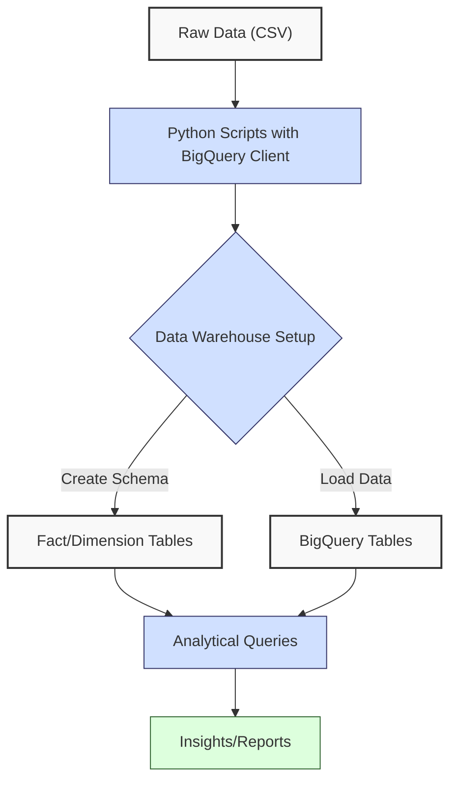
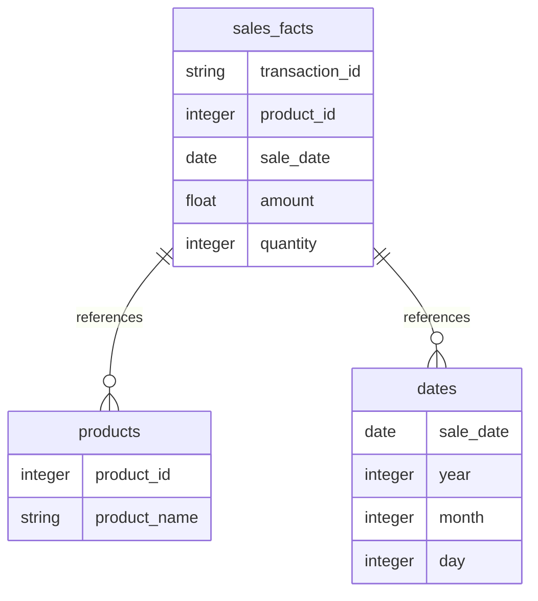
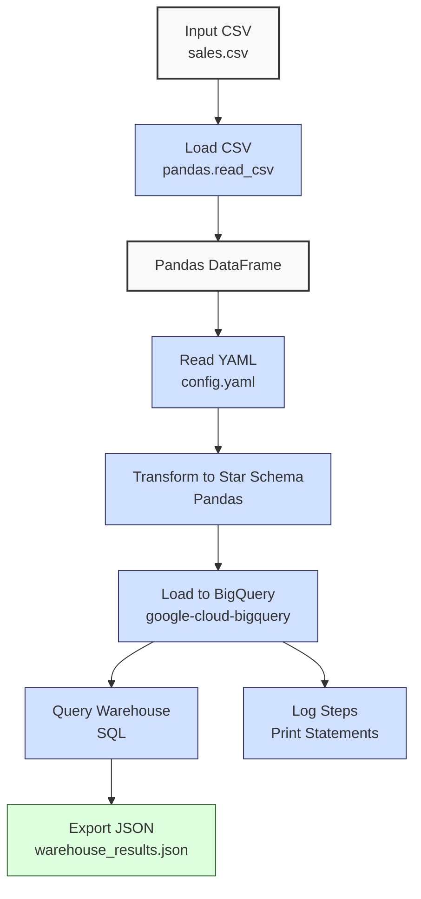

**Complexity: Moderate (M)**

## 28.0 Introduction: Why This Matters for Data Engineering

In data engineering, **data warehouses** are centralized systems optimized for analytical querying, enabling Hijra Group to derive insights from large-scale financial transaction data for Sharia-compliant fintech analytics. Google BigQuery, a serverless data warehouse, supports petabyte-scale analytics with SQL, achieving query times of seconds for billions of rows via its columnar storage and Dremel engine. This chapter builds on Chapter 25 (BigQuery Fundamentals), Chapter 26 (Python and BigQuery Integration), and Chapter 27 (BigQuery Advanced Querying), introducing **data warehouse** design with star schemas, fact and dimension tables, and data loading for sales analytics. You’ll learn to create a sales data warehouse using `data/sales.csv` (Appendix 1), preparing for optimization (Chapter 29), data lakes (Chapter 31), and foundational Python processing (Chapters 34 and 36).

This chapter uses type-annotated Python (post-Chapter 7) with Pyright verification, `unittest`/`pytest` testing (post-Chapter 9), and **4-space indentation** per PEP 8, preferring spaces over tabs to avoid `IndentationError`. It avoids advanced optimization (Chapter 29) or data mart specifics (Chapter 32), focusing on schema design and data loading. The micro-project creates a tested sales data warehouse, aligning with Hijra Group’s need for scalable analytics.

### Data Engineering Workflow Context

This diagram illustrates BigQuery’s role in a data warehouse pipeline:



### Building On and Preparing For

- **Building On**:
  - Chapter 25: Uses BigQuery setup and basic queries for table creation.
  - Chapter 26: Leverages `google-cloud-bigquery` for programmatic data loading.
  - Chapter 27: Applies advanced querying (e.g., joins) for star schema analytics.
  - Chapter 13: Reuses YAML parsing for configuration.
  - Chapter 3: Extends Pandas for data preparation.
- **Preparing For**:
  - Chapter 29: Optimizes warehouse queries with partitioning and clustering.
  - Chapter 31: Introduces data lakes for raw data storage.
  - Chapter 34: Builds foundational Python processing for data lakes.
  - Chapter 36: Optimizes Python processing for efficient ETL pipelines.

### What You’ll Learn

This chapter covers:

1. **Data Warehouse Concepts**: Star schemas, fact, and dimension tables.
2. **BigQuery Table Creation**: Programmatic schema definition with type annotations.
3. **Data Loading**: Loading `data/sales.csv` into BigQuery tables.
4. **Star Schema Queries**: Joining fact and dimension tables for analytics.
5. **Testing**: Unit and integration tests with `pytest`.

By the end, you’ll create a sales data warehouse with a star schema, load data, and query metrics, producing a JSON report, all with type annotations and tests. The micro-project uses `data/sales.csv` and `config.yaml` (Appendix 1), ensuring compliance with Hijra Group’s analytics needs.

**Follow-Along Tips**:

- Create `de-onboarding/data/` and populate with `sales.csv`, `config.yaml`, `empty.csv`, `invalid.csv`, `malformed.csv`, and `negative.csv` (Appendix 1).
- Install libraries: `pip install google-cloud-bigquery pandas pyyaml pytest`.
- Set up Google Cloud credentials: Export `GOOGLE_APPLICATION_CREDENTIALS` to your JSON key file (see Section 28.5 setup checklist).
- Use **4-space indentation** per PEP 8. Run `python -tt script.py` to detect tab/space mixing.
- Debug with print statements (e.g., `print(table.schema)`).
- Verify BigQuery datasets/tables in Google Cloud Console.
- Use `pytest` for testing with `pytest test_warehouse.py`.

## 28.1 Data Warehouse Concepts

A **data warehouse** is a centralized repository for analytical data, optimized for read-heavy queries. BigQuery uses columnar storage, enabling O(n) scans with sub-second latency for large datasets via parallel execution. A **star schema** organizes data into:

- **Fact Tables**: Store quantitative metrics (e.g., sales amounts), with foreign keys to dimension tables.
- **Dimension Tables**: Store descriptive attributes (e.g., product details), enabling filtering and grouping.

### Star Schema Example

For sales data:

- **Fact Table**: `sales_facts` (sales amounts, product IDs, dates).
- **Dimension Tables**: `products` (product details), `dates` (date attributes).



**Key Points**:

- **Fact Tables**: High cardinality, millions of rows, O(n) joins.
- **Dimension Tables**: Lower cardinality, thousands of rows, O(1) lookups with indexes.
- **Space Complexity**: O(n) for fact tables, O(m) for dimension tables (n >> m).
- **Implication**: Star schemas enable efficient analytics for Hijra Group’s transaction data.

## 28.2 BigQuery Table Creation

Create tables programmatically with `google-cloud-bigquery`, using type-annotated schemas.

```python
from google.cloud import bigquery
from typing import List

# Initialize BigQuery client
client: bigquery.Client = bigquery.Client()

# Define schema for products dimension table
product_schema: List[bigquery.SchemaField] = [
    bigquery.SchemaField("product_id", "INTEGER", mode="REQUIRED"),
    bigquery.SchemaField("product_name", "STRING", mode="REQUIRED"),
]

# Create dataset and table
dataset_id: str = "sales_warehouse"
table_id: str = f"{dataset_id}.products"
dataset_ref: bigquery.DatasetReference = client.dataset(dataset_id)

# Create dataset if not exists
client.create_dataset(dataset_ref, exists_ok=True)
print(f"Created dataset {dataset_id}")  # Debug

# Create products table
table: bigquery.Table = bigquery.Table(table_id, schema=product_schema)
client.create_table(table, exists_ok=True)
print(f"Created table {table_id}")  # Debug
print(f"Schema: {table.schema}")  # Debug
```

**Follow-Along Instructions**:

1. Save as `de-onboarding/create_table.py`.
2. Set `GOOGLE_APPLICATION_CREDENTIALS` environment variable (see Section 28.5).
3. Install: `pip install google-cloud-bigquery`.
4. Configure editor for **4-space indentation** per PEP 8.
5. Run: `python create_table.py`.
6. Verify dataset/table in BigQuery Console.
7. **Common Errors**:
   - **NotFound**: Check credentials. Print `client.project`.
   - **IndentationError**: Use 4 spaces. Run `python -tt create_table.py`.

**Key Points**:

- **SchemaField**: Defines column types and modes (REQUIRED, NULLABLE).
- **Time Complexity**: O(1) for table creation (metadata operation).
- **Space Complexity**: O(1) until data is loaded.
- **Implication**: Programmatic schemas ensure consistency in Hijra Group’s warehouse.

## 28.3 Data Loading

Load `data/sales.csv` into BigQuery tables, transforming data into star schema format. For simplicity, this chapter uses two static `sale_date` values (“2023-10-01” and “2023-11-01”) in the `dates` dimension table to demonstrate temporal analysis while focusing on schema design and loading. The alternating assignment (`i % 2`) is a minimal example for educational purposes, not a production strategy; more robust date handling, such as parsing dates from `transactions.csv` (Chapter 4), will be explored in Chapter 32 for data mart analytics. The `WRITE_TRUNCATE` option in `LoadJobConfig` overwrites existing data; other options like `WRITE_APPEND` are introduced in Chapter 29.

```python
import pandas as pd
from google.cloud import bigquery
from typing import List

# Load CSV
df: pd.DataFrame = pd.read_csv("data/sales.csv")
df = df.dropna(subset=["product", "price"])  # Clean data
df = df[df["product"].str.startswith("Halal")]  # Filter Halal products

# Create products dimension
products: pd.DataFrame = pd.DataFrame({
    "product_id": range(1, len(df) + 1),
    "product_name": df["product"]
})

# Create sales facts
sales_facts: pd.DataFrame = pd.DataFrame({
    "transaction_id": [f"T{i+1:03d}" for i in range(len(df))],
    "product_id": range(1, len(df) + 1),
    "sale_date": ["2023-10-01" if i % 2 == 0 else "2023-11-01" for i in range(len(df))],  # Alternating dates
    "amount": df["price"] * df["quantity"],
    "quantity": df["quantity"]
})

# Create dates dimension
dates: pd.DataFrame = pd.DataFrame({
    "sale_date": ["2023-10-01", "2023-11-01"],
    "year": [2023, 2023],
    "month": [10, 11],
    "day": [1, 1]
})

# Load to BigQuery
client: bigquery.Client = bigquery.Client()
dataset_id: str = "sales_warehouse"

# Load products
product_table_id: str = f"{dataset_id}.products"
job_config: bigquery.LoadJobConfig = bigquery.LoadJobConfig(
    schema=[
        bigquery.SchemaField("product_id", "INTEGER"),
        bigquery.SchemaField("product_name", "STRING"),
    ],
    write_disposition="WRITE_TRUNCATE"
)
client.load_table_from_dataframe(products, product_table_id, job_config=job_config).result()
print(f"Loaded {len(products)} rows to {product_table_id}")  # Debug
```

**Follow-Along Instructions**:

1. Save as `de-onboarding/load_data.py`.
2. Ensure `data/sales.csv` exists (Appendix 1).
3. Run: `python load_data.py`.
4. Verify data in BigQuery Console.
5. **Common Errors**:
   - **FileNotFoundError**: Check `data/sales.csv`. Print path.
   - **TypeError**: Ensure DataFrame columns match schema. Print `products.dtypes`.

**Key Points**:

- **LoadJobConfig**: Specifies schema and write mode.
- **Time Complexity**: O(n) for loading n rows.
- **Space Complexity**: O(n) for n rows in BigQuery.
- **Implication**: Efficient loading supports Hijra Group’s large datasets.

## 28.4 Star Schema Queries

Query the star schema to compute metrics, e.g., total sales by product. Join operations typically have O(n log n) complexity in BigQuery, assuming the query optimizer uses hash or merge joins, though actual performance may vary based on data distribution and query execution plans (see https://cloud.google.com/bigquery/docs/query-execution).

```python
from google.cloud import bigquery
from typing import Dict

# Query sales by product
client: bigquery.Client = bigquery.Client()
query: str = """
SELECT p.product_name, SUM(f.amount) as total_sales
FROM `sales_warehouse.sales_facts` f
JOIN `sales_warehouse.products` p ON f.product_id = p.product_id
GROUP BY p.product_name
"""
query_job = client.query(query)
results: Dict[str, float] = {row["product_name"]: row["total_sales"] for row in query_job}
print("Sales by Product:", results)  # Debug

# Expected Output:
# Sales by Product: {'Halal Laptop': 1999.98, 'Halal Mouse': 249.9, 'Halal Keyboard': 249.95}
```

**Key Points**:

- **JOIN**: Combines fact and dimension tables, O(n) for n rows.
- **Time Complexity**: O(n log n) for joins with sorting.
- **Space Complexity**: O(k) for k result rows.
- **Implication**: Enables analytical insights for Hijra Group.

## 28.5 Micro-Project: Sales Data Warehouse

### Project Requirements

Create a BigQuery sales data warehouse with a star schema, loading `data/sales.csv` and producing a JSON report. The warehouse supports Hijra Group’s analytics for Sharia-compliant sales, handling thousands of daily transactions. Pytest tests, introduced in Chapter 9, ensure reliability for these analytics, validating schema creation, data loading, and query results. In production, warehouses manage terabytes, requiring partitioning (Chapter 29) and data marts (Chapter 32).

- Create dataset `sales_warehouse`.
- Define star schema: `sales_facts`, `products`, `dates` tables.
- Load `data/sales.csv` into tables.
- Query total sales by product.
- Export results to `data/warehouse_results.json`.
- Use type annotations and pytest tests.
- Log steps with print statements.
- Use **4-space indentation** per PEP 8.

### Sample Input Files

`data/sales.csv` (Appendix 1):

```csv
product,price,quantity
Halal Laptop,999.99,2
Halal Mouse,24.99,10
Halal Keyboard,49.99,5
,29.99,3
Monitor,invalid,2
Headphones,5.00,150
```

`data/config.yaml` (Appendix 1):

```yaml
min_price: 10.0
max_quantity: 100
required_fields:
  - product
  - price
  - quantity
product_prefix: 'Halal'
max_decimals: 2
```

### Data Processing Flow



### Acceptance Criteria

- **Go Criteria**:
  - Creates `sales_warehouse` dataset and tables.
  - Loads valid Halal sales data into star schema.
  - Queries total sales by product.
  - Exports results to `data/warehouse_results.json`.
  - Uses type annotations, verified by Pyright.
  - Passes pytest tests for schema, loading, and queries.
  - Uses **4-space indentation** per PEP 8.
- **No-Go Criteria**:
  - Fails to create dataset/tables.
  - Incorrect data loading or queries.
  - Missing JSON export.
  - Lacks type annotations or tests.
  - Inconsistent indentation.

### Common Pitfalls to Avoid

1. **Authentication Issues**:
   - **Problem**: `DefaultCredentialsError` in BigQuery client.
   - **Solution**: Set `GOOGLE_APPLICATION_CREDENTIALS`. Print `client.project`.
2. **Schema Mismatches**:
   - **Problem**: `ValueError` during loading.
   - **Solution**: Print `df.dtypes` and `table.schema`.
3. **Query Errors**:
   - **Problem**: `BadRequest` in SQL query.
   - **Solution**: Print `query` and test in BigQuery Console.
4. **IndentationError**:
   - **Problem**: Mixed spaces/tabs.
   - **Solution**: Use 4 spaces. Run `python -tt warehouse.py`.

### How This Differs from Production

In production, this solution would include:

- **Partitioning**: For large datasets (Chapter 29).
- **Data Quality**: dbt tests (Chapter 54).
- **Orchestration**: Airflow DAGs (Chapter 56).
- **Monitoring**: Observability with Grafana (Chapter 66).

### Implementation

```python
# File: de-onboarding/warehouse.py
from google.cloud import bigquery
import pandas as pd
import yaml
import json
from typing import List, Dict, Tuple
import os

def read_config(config_path: str) -> Dict:
    """Read YAML configuration."""
    print(f"Opening config: {config_path}")  # Debug
    with open(config_path, "r") as file:
        config: Dict = yaml.safe_load(file)
    print(f"Loaded config: {config}")  # Debug
    return config

def create_dataset_and_tables(client: bigquery.Client, dataset_id: str) -> Tuple[bigquery.Table, bigquery.Table, bigquery.Table]:
    """Create dataset and star schema tables."""
    dataset_ref: bigquery.DatasetReference = client.dataset(dataset_id)
    client.create_dataset(dataset_ref, exists_ok=True)
    print(f"Created dataset {dataset_id}")  # Debug

    # Products schema
    product_schema: List[bigquery.SchemaField] = [
        bigquery.SchemaField("product_id", "INTEGER", mode="REQUIRED"),
        bigquery.SchemaField("product_name", "STRING", mode="REQUIRED"),
    ]
    product_table_id: str = f"{dataset_id}.products"
    product_table: bigquery.Table = bigquery.Table(product_table_id, schema=product_schema)
    client.create_table(product_table, exists_ok=True)
    print(f"Created table {product_table_id}")  # Debug

    # Dates schema
    date_schema: List[bigquery.SchemaField] = [
        bigquery.SchemaField("sale_date", "DATE", mode="REQUIRED"),
        bigquery.SchemaField("year", "INTEGER", mode="REQUIRED"),
        bigquery.SchemaField("month", "INTEGER", mode="REQUIRED"),
        bigquery.SchemaField("day", "INTEGER", mode="REQUIRED"),
    ]
    date_table_id: str = f"{dataset_id}.dates"
    date_table: bigquery.Table = bigquery.Table(date_table_id, schema=date_schema)
    client.create_table(date_table, exists_ok=True)
    print(f"Created table {date_table_id}")  # Debug

    # Sales facts schema
    sales_schema: List[bigquery.SchemaField] = [
        bigquery.SchemaField("transaction_id", "STRING", mode="REQUIRED"),
        bigquery.SchemaField("product_id", "INTEGER", mode="REQUIRED"),
        bigquery.SchemaField("sale_date", "DATE", mode="REQUIRED"),
        bigquery.SchemaField("amount", "FLOAT", mode="REQUIRED"),
        bigquery.SchemaField("quantity", "INTEGER", mode="REQUIRED"),
    ]
    sales_table_id: str = f"{dataset_id}.sales_facts"
    sales_table: bigquery.Table = bigquery.Table(sales_table_id, schema=sales_schema)
    client.create_table(sales_table, exists_ok=True)
    print(f"Created table {sales_table_id}")  # Debug

    return product_table, date_table, sales_table

def load_sales_data(csv_path: str, config: Dict, client: bigquery.Client, dataset_id: str) -> Tuple[pd.DataFrame, pd.DataFrame, pd.DataFrame]:
    """Load and transform sales data into star schema."""
    df: pd.DataFrame = pd.read_csv(csv_path)
    print("Initial DataFrame:", df.head().to_dict())  # Debug
    df = df.dropna(subset=["product", "price"])
    df = df[df["product"].str.startswith(config["product_prefix"])]
    df = df[df["price"] >= config["min_price"]]
    df = df[df["quantity"] <= config["max_quantity"]]
    df = df[df["price"].apply(lambda x: isinstance(x, (int, float)))]
    print("Filtered DataFrame:", df.to_dict())  # Debug

    # Products dimension
    products: pd.DataFrame = pd.DataFrame({
        "product_id": range(1, len(df) + 1),
        "product_name": df["product"]
    })

    # Dates dimension
    dates: pd.DataFrame = pd.DataFrame({
        "sale_date": ["2023-10-01", "2023-11-01"],
        "year": [2023, 2023],
        "month": [10, 11],
        "day": [1, 1]
    })

    # Sales facts
    sales_facts: pd.DataFrame = pd.DataFrame({
        "transaction_id": [f"T{i+1:03d}" for i in range(len(df))],
        "product_id": range(1, len(df) + 1),
        "sale_date": ["2023-10-01" if i % 2 == 0 else "2023-11-01" for i in range(len(df))],
        "amount": df["price"] * df["quantity"],
        "quantity": df["quantity"].astype(int)
    })

    # Load data
    job_config: bigquery.LoadJobConfig = bigquery.LoadJobConfig(write_disposition="WRITE_TRUNCATE")
    client.load_table_from_dataframe(products, f"{dataset_id}.products", job_config=job_config).result()
    print(f"Loaded {len(products)} rows to {dataset_id}.products")  # Debug
    client.load_table_from_dataframe(dates, f"{dataset_id}.dates", job_config=job_config).result()
    print(f"Loaded {len(dates)} rows to {dataset_id}.dates")  # Debug
    client.load_table_from_dataframe(sales_facts, f"{dataset_id}.sales_facts", job_config=job_config).result()
    print(f"Loaded {len(sales_facts)} rows to {dataset_id}.sales_facts")  # Debug

    return products, dates, sales_facts

def query_warehouse(client: bigquery.Client, dataset_id: str) -> Dict[str, float]:
    """Query total sales by product."""
    query: str = f"""
    SELECT p.product_name, SUM(f.amount) as total_sales
    FROM `{dataset_id}.sales_facts` f
    JOIN `{dataset_id}.products` p ON f.product_id = p.product_id
    GROUP BY p.product_name
    """
    query_job = client.query(query)
    results: Dict[str, float] = {row["product_name"]: float(row["total_sales"]) for row in query_job}
    print("Query Results:", results)  # Debug
    return results

def export_results(results: Dict[str, float], json_path: str) -> None:
    """Export results to JSON."""
    print(f"Writing to: {json_path}")  # Debug
    with open(json_path, "w") as file:
        json.dump(results, file, indent=2)
    print(f"Exported results to {json_path}")  # Debug

def main() -> None:
    """Main function to create and query sales data warehouse."""
    csv_path: str = "data/sales.csv"
    config_path: str = "data/config.yaml"
    json_path: str = "data/warehouse_results.json"
    dataset_id: str = "sales_warehouse"

    config: Dict = read_config(config_path)
    client: bigquery.Client = bigquery.Client()
    create_dataset_and_tables(client, dataset_id)
    load_sales_data(csv_path, config, client, dataset_id)
    results: Dict[str, float] = query_warehouse(client, dataset_id)
    export_results(results, json_path)

if __name__ == "__main__":
    main()
```

```python
# File: de-onboarding/test_warehouse.py
import pytest
from google.cloud import bigquery
import pandas as pd
from warehouse import create_dataset_and_tables, load_sales_data, query_warehouse
from typing import Dict
import os

@pytest.fixture
def client() -> bigquery.Client:
    return bigquery.Client()

@pytest.fixture
def config() -> Dict:
    return {
        "min_price": 10.0,
        "max_quantity": 100,
        "product_prefix": "Halal",
        "required_fields": ["product", "price", "quantity"],
        "max_decimals": 2
    }

def test_create_tables(client: bigquery.Client, config: Dict) -> None:
    dataset_id: str = "test_sales_warehouse"
    product_table, date_table, sales_table = create_dataset_and_tables(client, dataset_id)
    assert len(product_table.schema) == 2
    assert len(date_table.schema) == 4
    assert len(sales_table.schema) == 5

def test_load_data(client: bigquery.Client, config: Dict) -> None:
    dataset_id: str = "test_sales_warehouse"
    create_dataset_and_tables(client, dataset_id)
    products, dates, sales_facts = load_sales_data("data/sales.csv", config, client, dataset_id)
    assert len(products) == 3  # 3 Halal products
    assert len(dates) == 2  # 2 dates
    assert len(sales_facts) == 3

def test_query_warehouse(client: bigquery.Client, config: Dict) -> None:
    dataset_id: str = "test_sales_warehouse"
    create_dataset_and_tables(client, dataset_id)
    load_sales_data("data/sales.csv", config, client, dataset_id)
    results: Dict[str, float] = query_warehouse(client, dataset_id)
    assert "Halal Laptop" in results
    assert abs(results["Halal Laptop"] - 1999.98) < 0.01

def test_schema_correction(client: bigquery.Client, config: Dict) -> None:
    dataset_id: str = "test_sales_warehouse"
    dataset_ref: bigquery.DatasetReference = client.dataset(dataset_id)
    client.create_dataset(dataset_ref, exists_ok=True)

    # Incorrect schema with wrong type
    wrong_schema: List[bigquery.SchemaField] = [
        bigquery.SchemaField("transaction_id", "INTEGER"),  # Should be STRING
        bigquery.SchemaField("product_id", "INTEGER"),
        bigquery.SchemaField("sale_date", "DATE"),
        bigquery.SchemaField("amount", "FLOAT"),
        bigquery.SchemaField("quantity", "INTEGER"),
    ]
    table_id: str = f"{dataset_id}.sales_facts"
    table: bigquery.Table = bigquery.Table(table_id, schema=wrong_schema)
    client.create_table(table, exists_ok=True)

    # Correct schema
    correct_schema: List[bigquery.SchemaField] = [
        bigquery.SchemaField("transaction_id", "STRING"),
        bigquery.SchemaField("product_id", "INTEGER"),
        bigquery.SchemaField("sale_date", "DATE"),
        bigquery.SchemaField("amount", "FLOAT"),
        bigquery.SchemaField("quantity", "INTEGER"),
    ]
    table.schema = correct_schema
    client.update_table(table, ["schema"])
    assert table.schema[0].field_type == "STRING"

def test_conceptual_question() -> None:
    """Test existence and content of conceptual answer file."""
    answer_path = "data/star_schema_answer.txt"
    assert os.path.exists(answer_path)
    with open(answer_path, "r") as file:
        content = file.read()
    assert "denormalized structure" in content
    assert "faster query performance" in content
```

### How to Run and Test

1. **Setup Checklist**:

   - [ ] Create `de-onboarding/data/` directory.
   - [ ] Save `sales.csv`, `config.yaml`, `empty.csv`, `invalid.csv`, `malformed.csv`, `negative.csv` per Appendix 1.
   - [ ] Install libraries: `pip install google-cloud-bigquery pandas pyyaml pytest`.
   - [ ] Create a Google Cloud project: Follow https://cloud.google.com/bigquery/docs/quickstarts/quickstart-client-libraries.
   - [ ] Enable BigQuery API in Google Cloud Console under APIs & Services. If disabled, enable it at https://console.cloud.google.com/apis/library/bigquery.googleapis.com.
   - [ ] Set up a billing account in Google Cloud Console if required for BigQuery API usage: Follow https://cloud.google.com/billing/docs/how-to/manage-billing-account.
   - [ ] Download service account JSON key and set environment variable:
     ```bash
     export GOOGLE_APPLICATION_CREDENTIALS="/path/to/key.json"  # Unix/macOS
     set GOOGLE_APPLICATION_CREDENTIALS=C:\path\to\key.json     # Windows
     ```
   - [ ] Create virtual environment: `python -m venv venv`, activate (Windows: `venv\Scripts\activate`, Unix: `source venv/bin/activate`).
   - [ ] Verify Python 3.10+: `python --version`.
   - [ ] Configure editor for **4-space indentation** per PEP 8 (VS Code: “Editor: Tab Size” = 4, “Editor: Insert Spaces” = true, “Editor: Detect Indentation” = false).
   - [ ] Save `warehouse.py` and `test_warehouse.py` in `de-onboarding/`.
   - **Troubleshooting**:
     - If `DefaultCredentialsError`, verify `GOOGLE_APPLICATION_CREDENTIALS`. Print `client.project`.
     - If `FileNotFoundError`, check file paths. Print `csv_path`.
     - If `IndentationError`, use 4 spaces. Run `python -tt warehouse.py`.
     - If `yaml.YAMLError`, print `open(config_path).read()` to inspect `config.yaml`.
     - If BigQuery queries fail due to quota limits, check quotas at https://console.cloud.google.com/iam-admin/quotas and upgrade to a paid tier if needed.

2. **Run**:

   - Open terminal in `de-onboarding/`.
   - Run: `python warehouse.py`.
   - Outputs: `data/warehouse_results.json`, BigQuery tables in `sales_warehouse`.

3. **Test Scenarios**:
   - **Valid Data**: Run `python warehouse.py` with `sales.csv`. Verify `data/warehouse_results.json`:
     ```json
     {
       "Halal Laptop": 1999.98,
       "Halal Mouse": 249.9,
       "Halal Keyboard": 249.95
     }
     ```
   - **Empty CSV**: Test with `empty.csv`:
     ```python
     from warehouse import load_sales_data, query_warehouse
     client = bigquery.Client()
     config = read_config("data/config.yaml")
     products, dates, sales_facts = load_sales_data("data/empty.csv", config, client, "sales_warehouse")
     results = query_warehouse(client, "sales_warehouse")
     print(results)  # Expected: {}
     ```
     - **Note**: `empty.csv` has only headers, resulting in empty DataFrames and no query results.
   - **Invalid Headers**: Test with `invalid.csv`:
     ```python
     products, dates, sales_facts = load_sales_data("data/invalid.csv", config, client, "sales_warehouse")
     print(products)  # Expected: Empty DataFrame
     ```
     - **Note**: Missing `product` column causes validation failure, returning an empty DataFrame.
   - **Malformed Data**: Test with `malformed.csv`:
     ```python
     products, dates, sales_facts = load_sales_data("data/malformed.csv", config, client, "sales_warehouse")
     print(products)  # Expected: DataFrame with 1 row (Halal Mouse)
     ```
     - **Note**: Non-integer `quantity` is filtered out, loading only valid rows.
   - **Negative Prices**: Test with `negative.csv`:
     ```python
     products, dates, sales_facts = load_sales_data("data/negative.csv", config, client, "sales_warehouse")
     print(products)  # Expected: DataFrame with 1 row (Halal Mouse)
     ```
     - **Note**: Negative prices are filtered per `min_price`, loading only valid rows.
   - **Run Tests**: `pytest test_warehouse.py -v`. Verify all tests pass.

## 28.6 Practice Exercises

### Exercise 1: Create Dimension Table

Write a function to create a `categories` dimension table with columns `category_id` (INTEGER) and `category_name` (STRING), using **4-space indentation**.

**Expected Output**:

```
Created table sales_warehouse.categories
```

**Follow-Along Instructions**:

1. **Setup**: Ensure `de-onboarding/data/` contains required files per Appendix 1. Set `GOOGLE_APPLICATION_CREDENTIALS` (see Section 28.5).
2. Save as `de-onboarding/ex1_categories.py`.
3. Configure editor for **4-space indentation** per PEP 8.
4. Run: `python ex1_categories.py`.
5. **How to Test**:
   - Add: `create_category_table()`.
   - Verify table in BigQuery Console.
   - **Common Errors**:
     - **NotFound**: Check credentials. Print `client.project`.
     - **IndentationError**: Use 4 spaces. Run `python -tt ex1_categories.py`.

### Exercise 2: Load Fact Table

Write a function to load `sales_facts` from `data/sales.csv`, filtering Halal products, with **4-space indentation**.

**Sample Input** (`data/sales.csv`):

```csv
product,price,quantity
Halal Laptop,999.99,2
Halal Mouse,24.99,10
Halal Keyboard,49.99,5
```

**Expected Output**:

```
Loaded 3 rows to sales_warehouse.sales_facts
```

**Follow-Along Instructions**:

1. **Setup**: Ensure `de-onboarding/data/` contains required files per Appendix 1. Set `GOOGLE_APPLICATION_CREDENTIALS` (see Section 28.5).
2. Save as `de-onboarding/ex2_load_facts.py`.
3. Run: `python ex2_load_facts.py`.
4. **How to Test**:
   - Verify table data in BigQuery Console.
   - Test with `empty.csv`: Should load 0 rows.

### Exercise 3: Query Sales by Year

Write a function to query total sales by year from `dates` and `sales_facts`, with **4-space indentation**.

**Expected Output**:

```
{'2023': 2499.83}
```

**Sample Output Table**:

| year | total_sales |
| ---- | ----------- |
| 2023 | 2499.83     |

**Follow-Along Instructions**:

1. **Setup**: Ensure `de-onboarding/data/` contains required files per Appendix 1. Set `GOOGLE_APPLICATION_CREDENTIALS` (see Section 28.5).
2. Save as `de-onboarding/ex3_query_year.py`.
3. Run: `python ex3_query_year.py`.
4. **How to Test**:
   - Verify results match expected output.
   - Test with empty tables: Should return `{}`.

### Exercise 4: Test Schema Creation

Write a pytest test to verify `products` table schema, with **4-space indentation**.

**Expected Output**:

```
test_schema_creation: PASSED
```

**Follow-Along Instructions**:

1. **Setup**: Ensure `de-onboarding/data/` contains required files per Appendix 1. Set `GOOGLE_APPLICATION_CREDENTIALS` (see Section 28.5).
2. Save as `de-onboarding/test_ex4_schema.py`.
3. Run: `pytest test_ex4_schema.py -v`.
4. **How to Test**:
   - Verify test passes.
   - **Common Errors**:
     - **AssertionError**: Print `table.schema`.

### Exercise 5: Debug Schema Mismatch

Fix buggy code with an incorrect `sales_facts` schema (wrong `transaction_id` type), ensuring **4-space indentation**.

**Buggy Code**:

```python
from google.cloud import bigquery
from typing import List

def create_sales_facts_table():
    client: bigquery.Client = bigquery.Client()
    dataset_id: str = "sales_warehouse"
    table_id: str = f"{dataset_id}.sales_facts"
    schema: List[bigquery.SchemaField] = [
        bigquery.SchemaField("transaction_id", "INTEGER"),  # Bug: Should be STRING
        bigquery.SchemaField("product_id", "INTEGER"),
        bigquery.SchemaField("sale_date", "DATE"),
        bigquery.SchemaField("amount", "FLOAT"),
        bigquery.SchemaField("quantity", "INTEGER"),
    ]
    table = bigquery.Table(table_id, schema=schema)
    client.create_table(table, exists_ok=True)
    print(f"Created table {table_id}")
```

**Expected Output**:

```
Created table sales_warehouse.sales_facts
```

**Follow-Along Instructions**:

1. **Setup**: Ensure `de-onboarding/data/` contains required files per Appendix 1. Set `GOOGLE_APPLICATION_CREDENTIALS` (see Section 28.5).
2. Save as `de-onboarding/ex5_debug.py`.
3. Run: `python ex5_debug.py` to see schema issue.
4. Fix and re-run.
5. **How to Test**:
   - Verify table schema in BigQuery Console (`transaction_id` is STRING).
   - **Common Errors**:
     - **ValueError**: Print `table.schema` to debug.

### Exercise 6: Conceptual Question on Star Schemas

Explain why star schemas are preferred over normalized schemas for analytical queries, and describe how the star schema could integrate with a data lake (Chapter 31). Save your answer to `data/star_schema_answer.txt`, using **4-space indentation** for any code.

**Expected Output**:

```
Answer saved to data/star_schema_answer.txt
```

**Follow-Along Instructions**:

1. **Setup**: Ensure `de-onboarding/data/` contains required files per Appendix 1. Set `GOOGLE_APPLICATION_CREDENTIALS` (see Section 28.5).
2. Save as `de-onboarding/ex6_conceptual.py`.
3. Write answer and save to `data/star_schema_answer.txt`.
4. Run: `python ex6_conceptual.py`.
5. **How to Test**:
   - Verify `data/star_schema_answer.txt` exists and contains key points (e.g., “denormalized structure”, “faster query performance”).
   - **Troubleshooting**: If the file is empty or incorrect, check content with `cat data/star_schema_answer.txt` (Unix/macOS) or `type data\star_schema_answer.txt` (Windows).
   - **Common Errors**:
     - **FileNotFoundError**: Check write permissions for `data/`. Print `os.path.exists("data/")`.

## 28.7 Exercise Solutions

### Solution to Exercise 1: Create Dimension Table

```python
from google.cloud import bigquery
from typing import List

def create_category_table() -> None:
    """Create categories dimension table."""
    client: bigquery.Client = bigquery.Client()
    dataset_id: str = "sales_warehouse"
    table_id: str = f"{dataset_id}.categories"
    schema: List[bigquery.SchemaField] = [
        bigquery.SchemaField("category_id", "INTEGER", mode="REQUIRED"),
        bigquery.SchemaField("category_name", "STRING", mode="REQUIRED"),
    ]
    table = bigquery.Table(table_id, schema=schema)
    client.create_table(table, exists_ok=True)
    print(f"Created table {table_id}")

create_category_table()
```

### Solution to Exercise 2: Load Fact Table

```python
from google.cloud import bigquery
import pandas as pd
from typing import None

def load_sales_facts(csv_path: str) -> None:
    """Load sales_facts from CSV."""
    df: pd.DataFrame = pd.read_csv(csv_path)
    df = df.dropna(subset=["product", "price"])
    df = df[df["product"].str.startswith("Halal")]
    sales_facts: pd.DataFrame = pd.DataFrame({
        "transaction_id": [f"T{i+1:03d}" for i in range(len(df))],
        "product_id": range(1, len(df) + 1),
        "sale_date": ["2023-10-01" if i % 2 == 0 else "2023-11-01" for i in range(len(df))],
        "amount": df["price"] * df["quantity"],
        "quantity": df["quantity"].astype(int)
    })
    client: bigquery.Client = bigquery.Client()
    table_id: str = "sales_warehouse.sales_facts"
    job_config = bigquery.LoadJobConfig(write_disposition="WRITE_TRUNCATE")
    client.load_table_from_dataframe(sales_facts, table_id, job_config=job_config).result()
    print(f"Loaded {len(sales_facts)} rows to {table_id}")

load_sales_facts("data/sales.csv")
```

### Solution to Exercise 3: Query Sales by Year

```python
from google.cloud import bigquery
from typing import Dict

def query_sales_by_year() -> Dict[str, float]:
    """Query total sales by year."""
    client: bigquery.Client = bigquery.Client()
    query: str = """
    SELECT d.year, SUM(f.amount) as total_sales
    FROM `sales_warehouse.sales_facts` f
    JOIN `sales_warehouse.dates` d ON f.sale_date = d.sale_date
    GROUP BY d.year
    """
    query_job = client.query(query)
    results: Dict[str, float] = {str(row["year"]): float(row["total_sales"]) for row in query_job}
    print(results)
    return results

print(query_sales_by_year())
```

### Solution to Exercise 4: Test Schema Creation

```python
import pytest
from google.cloud import bigquery

def test_schema_creation():
    client: bigquery.Client = bigquery.Client()
    dataset_id: str = "test_sales_warehouse"
    table_id: str = f"{dataset_id}.products"
    dataset_ref = client.dataset(dataset_id)
    client.create_dataset(dataset_ref, exists_ok=True)
    schema = [
        bigquery.SchemaField("product_id", "INTEGER", mode="REQUIRED"),
        bigquery.SchemaField("product_name", "STRING", mode="REQUIRED"),
    ]
    table = bigquery.Table(table_id, schema=schema)
    client.create_table(table, exists_ok=True)
    assert len(table.schema) == 2
    assert table.schema[0].name == "product_id"
```

### Solution to Exercise 5: Debug Schema Mismatch

```python
from google.cloud import bigquery
from typing import List

def create_sales_facts_table():
    """Create sales_facts table with correct schema."""
    client: bigquery.Client = bigquery.Client()
    dataset_id: str = "sales_warehouse"
    table_id: str = f"{dataset_id}.sales_facts"
    schema: List[bigquery.SchemaField] = [
        bigquery.SchemaField("transaction_id", "STRING"),  # Fixed: STRING
        bigquery.SchemaField("product_id", "INTEGER"),
        bigquery.SchemaField("sale_date", "DATE"),
        bigquery.SchemaField("amount", "FLOAT"),
        bigquery.SchemaField("quantity", "INTEGER"),
    ]
    table = bigquery.Table(table_id, schema=schema)
    client.create_table(table, exists_ok=True)
    print(f"Created table {table_id}")

create_sales_facts_table()
```

**Explanation**:

- **Schema Bug**: `transaction_id` was INTEGER, causing type mismatches. Fixed to STRING.

### Solution to Exercise 6: Conceptual Question on Star Schemas

```python
def explain_star_schema() -> None:
    """Explain why star schemas are preferred for analytical queries."""
    answer: str = (
        "Star schemas are preferred over normalized schemas for analytical queries because their "
        "denormalized structure reduces the number of joins, enabling faster query performance. Fact "
        "tables store metrics (e.g., sales amounts), while dimension tables provide context (e.g., "
        "product details), supporting efficient aggregations and filtering for analytics. In a data "
        "lake (Chapter 31), raw sales data can be processed into a star schema for structured analytics, "
        "with fact tables aggregating metrics from raw CSV files and dimension tables linking to reference data."
    )
    with open("data/star_schema_answer.txt", "w") as file:
        file.write(answer)
    print("Answer saved to data/star_schema_answer.txt")

explain_star_schema()
```

**Expected Content** (`data/star_schema_answer.txt`):

```
Star schemas are preferred over normalized schemas for analytical queries because their denormalized structure reduces the number of joins, enabling faster query performance. Fact tables store metrics (e.g., sales amounts), while dimension tables provide context (e.g., product details), supporting efficient aggregations and filtering for analytics. In a data lake (Chapter 31), raw sales data can be processed into a star schema for structured analytics, with fact tables aggregating metrics from raw CSV files and dimension tables linking to reference data.
```

## 28.8 Chapter Summary and Connection to Chapter 29

You’ve mastered:

- **Star Schemas**: Fact and dimension tables for analytics, organized for efficient querying.
- **BigQuery Tables**: Programmatic creation and loading (O(n) for n rows) with type-annotated schemas.
- **Queries**: Joins and aggregations (O(n log n) with BigQuery’s optimizer) for sales metrics.
- **Testing**: Type-safe pytest tests ensuring warehouse reliability.
- **White-Space Sensitivity and PEP 8**: Using 4-space indentation, preferring spaces over tabs to avoid `IndentationError`.

The micro-project created a sales data warehouse with a star schema, loading `data/sales.csv`, querying metrics, and exporting to `data/warehouse_results.json`. It tested edge cases (`empty.csv`, `invalid.csv`, `malformed.csv`, `negative.csv`) per Appendix 1, ensuring robustness. The conceptual exercise reinforced schema design principles and introduced data lake integration, preparing for capstone planning. This foundation supports Hijra Group’s scalable analytics, preparing for:

- **Chapter 29 (BigQuery Optimization Techniques)**: Introduces partitioning and clustering to reduce query costs, critical for petabyte-scale datasets. The star schema created here will be optimized for performance.
- **Chapter 31 (Data Lakes with Google Cloud Storage)**: Introduces raw data storage, building on the warehouse’s structured analytics.
- **Chapters 34 and 36 (Python for Data Lake Processing)**: Develop foundational and optimized Python processing for data lakes, enabling efficient ETL pipelines.
- **Capstone Projects (Chapters 68–71)**: The warehouse enables scalable analytics for FastAPI endpoints (Chapter 53) and BI dashboards (Chapter 51), integrating with Airflow (Chapter 56) and dbt (Chapter 54) for end-to-end pipelines. For example, querying `sales_facts` can support a FastAPI endpoint delivering sales trends to stakeholders or a Metabase dashboard visualizing sales trends, key components of the capstone projects.
