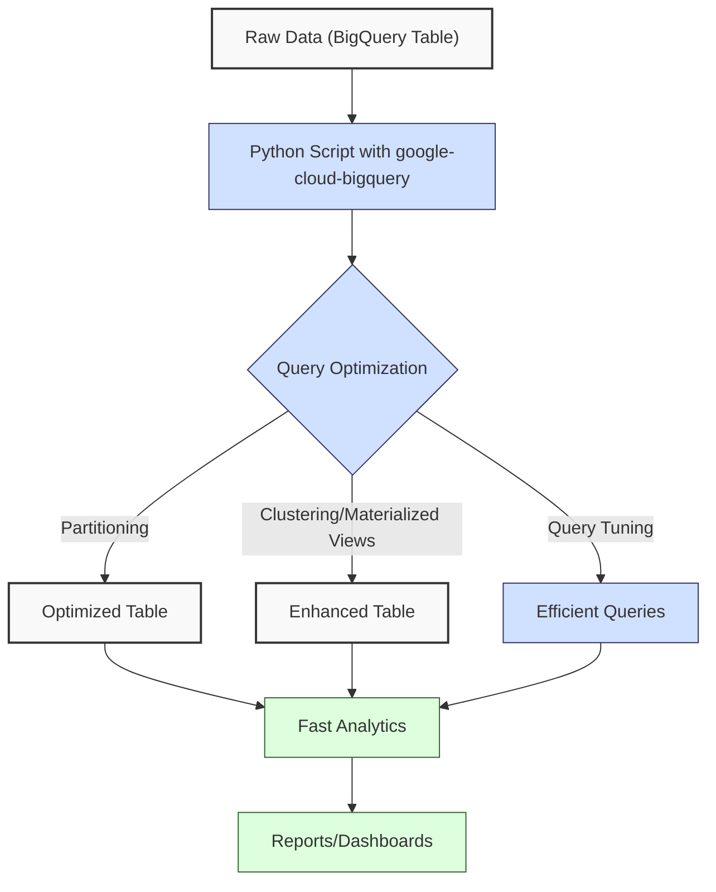
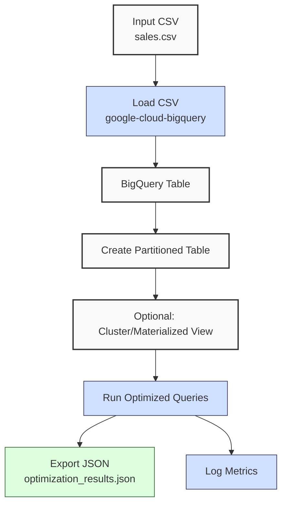

**Complexity: Moderate (M)**

## 29.0 Introduction: Why This Matters for Data Engineering

In data engineering, optimizing cloud-based analytics is crucial for delivering cost-effective, high-performance solutions, especially for Hijra Group's Sharia-compliant fintech analytics, which processes millions of daily sales transactions. Google BigQuery, a serverless data warehouse, enables scalable querying but requires optimization to minimize costs and latency. For instance, optimizing queries for daily Zakat calculations, which distribute 2.5% of profits to charity per Islamic financial principles, can reduce processing costs and ensure timely reporting. A poorly optimized query on a 1TB dataset can cost ~$5 per scan (at $5/TB pricing) and take minutes, while an optimized query with partitioning can reduce costs by 10–100x and execute in seconds. Building on Chapters 25–28 (BigQuery fundamentals, Python integration, advanced querying, and data warehousing), this chapter focuses on **BigQuery optimization techniques**, emphasizing partitioning, with clustering, materialized views, and query tuning as complementary methods, to enhance performance for sales data analytics.

This chapter uses **type annotations** (introduced in Chapter 7) verified by Pyright, **pytest** for testing (Chapter 9), and **4-space indentation** per PEP 8, preferring spaces over tabs to avoid `IndentationError`. It avoids advanced concepts like concurrency (Chapter 40) or Airflow orchestration (Chapter 56), focusing on BigQuery-specific optimizations.

### Data Engineering Workflow Context

This diagram illustrates BigQuery optimization in a data pipeline:



### Building On and Preparing For

- **Building On**:
  - Chapter 25: Uses BigQuery basics (datasets, tables, SQL queries).
  - Chapter 26: Leverages Python integration with `google-cloud-bigquery`.
  - Chapter 27: Applies advanced querying (CTEs, window functions).
  - Chapter 28: Builds on data warehouse design (star schemas).
- **Preparing For**:
  - Chapter 30: Consolidates cloud analytics for Checkpoint 4.
  - Chapter 32: Supports data mart creation with optimized tables.
  - Chapter 50: Enables advanced BigQuery optimization (clustering, BI integration).
  - Chapter 69–71: Prepares for capstone projects with scalable pipelines.

### What You’ll Learn

This chapter covers:

1. **Partitioning**: Dividing tables by date for faster queries.
2. **Clustering**: Organizing data by columns for efficient filtering.
3. **Materialized Views**: Precomputing aggregates for performance.
4. **Query Tuning**: Writing efficient SQL and avoiding common pitfalls.
5. **Cost Management**: Estimating and reducing query costs.

By the end, you’ll optimize a BigQuery sales data warehouse using `data/sales.csv` (Appendix 1), primarily through partitioning, with clustering and materialized views as enhancements, using type-annotated Python code and pytest tests, all with 4-space indentation per PEP 8. The micro-project produces a JSON report and validates performance improvements, preparing for data mart creation in Chapter 32.

**Follow-Along Tips**:

- Create `de-onboarding/data/` and populate with `sales.csv`, `config.yaml`, and `malformed.csv` per Appendix 1.
- Install libraries: `pip install google-cloud-bigquery pyyaml pytest pandas`.
- Set up Google Cloud SDK and authenticate with a service account (see Chapter 25).
- Configure editor for **4-space indentation** per PEP 8 (VS Code: “Editor: Tab Size” = 4, “Editor: Insert Spaces” = true, “Editor: Detect Indentation” = false).
- Use print statements (e.g., `print(query_job.result().total_bytes_processed)`) to debug query costs.
- Verify BigQuery dataset exists with `bq ls` (Google Cloud CLI).
- If `IndentationError`, run `python -tt script.py` to detect tab/space mixing.

## 29.1 Partitioning Tables

Partitioning splits a BigQuery table into segments based on a column, typically a date, reducing scanned data for queries. For a 1TB table, querying a single day’s partition (e.g., 10GB) scans only 1% of the data, cutting costs and time. Partitions are stored as separate segments, with O(1) access to partition metadata and O(n) scanning within a partition.

### 29.1.1 Creating Partitioned Tables

Create a partitioned table by date using `google-cloud-bigquery`.

```python
# File: de-onboarding/partition_example.py
from google.cloud import bigquery  # Import BigQuery client
from typing import Dict, Any  # Type annotations

def create_partitioned_table(project_id: str, dataset_id: str, table_id: str) -> Dict[str, Any]:
    """Create a partitioned BigQuery table by date."""
    client = bigquery.Client(project=project_id)  # Initialize client
    table_ref = f"{project_id}.{dataset_id}.{table_id}"  # Full table path
    schema = [
        bigquery.SchemaField("product", "STRING"),
        bigquery.SchemaField("price", "FLOAT"),
        bigquery.SchemaField("quantity", "INTEGER"),
        bigquery.SchemaField("sale_date", "DATE")  # Date for partitioning
    ]

    table = bigquery.Table(table_ref, schema=schema)  # Define table
    table.time_partitioning = bigquery.TimePartitioning(
        type_=bigquery.TimePartitioningType.DAY,  # Daily partitions
        field="sale_date"  # Partition by sale_date
    )

    table = client.create_table(table, exists_ok=True)  # Create table
    print(f"Created partitioned table {table_ref}")  # Debug
    return {
        "table_id": table.table_id,
        "partitioning_type": table.time_partitioning.type_,
        "partitioning_field": table.time_partitioning.field
    }

# Example usage
if __name__ == "__main__":
    result = create_partitioned_table("my-project", "my_dataset", "sales_partitioned")
    print(result)

# Expected Output:
# Created partitioned table my-project.my_dataset.sales_partitioned
# {'table_id': 'sales_partitioned', 'partitioning_type': 'DAY', 'partitioning_field': 'sale_date'}
```

**Follow-Along Instructions**:

1. Replace `my-project` and `my_dataset` with your Google Cloud project and dataset IDs.
2. Save as `de-onboarding/partition_example.py`.
3. Configure editor for 4-space indentation per PEP 8.
4. Run: `python partition_example.py`.
5. Verify table creation with `bq show my-project:my_dataset.sales_partitioned`.
6. **Common Errors**:
   - **NotFound**: Ensure dataset exists (`bq mk my-project:my_dataset`).
   - **PermissionDenied**: Check service account permissions. Print `client.project`.
   - **IndentationError**: Use 4 spaces (not tabs). Run `python -tt partition_example.py`.

**Key Points**:

- **Partitioning**: Reduces scanned data by isolating date ranges.
- **Time Complexity**: O(n/k) for querying n rows across k partitions.
- **Space Complexity**: O(n) for n rows, with minimal metadata overhead.
- **Underlying Implementation**: BigQuery stores partitions as separate data segments, pruning irrelevant partitions during query execution.
- **Partitioning Trade-offs**: Small partitions (e.g., daily) optimize date-based queries but may increase metadata overhead for large datasets; consider monthly partitioning for petabyte-scale data.
- **Implication**: Ideal for time-based sales queries at Hijra Group.

## 29.2 Clustering Tables

Clustering organizes data within partitions by specified columns (e.g., `product`), improving filtering and aggregation. For a 1TB table, clustering by `product` can reduce scanned data by 50–90% for product-specific queries, as BigQuery skips irrelevant clusters.

### 29.2.1 Creating Clustered Tables

Add clustering to a partitioned table.

```python
# File: de-onboarding/cluster_example.py
from google.cloud import bigquery  # Import BigQuery client
from typing import Dict, Any  # Type annotations

def create_clustered_table(project_id: str, dataset_id: str, table_id: str) -> Dict[str, Any]:
    """Create a partitioned and clustered BigQuery table."""
    client = bigquery.Client(project=project_id)  # Initialize client
    table_ref = f"{project_id}.{dataset_id}.{table_id}"  # Full table path
    schema = [
        bigquery.SchemaField("product", "STRING"),
        bigquery.SchemaField("price", "FLOAT"),
        bigquery.SchemaField("quantity", "INTEGER"),
        bigquery.SchemaField("sale_date", "DATE")
    ]

    table = bigquery.Table(table_ref, schema=schema)  # Define table
    table.time_partitioning = bigquery.TimePartitioning(
        type_=bigquery.TimePartitioningType.DAY,
        field="sale_date"
    )
    table.clustering_fields = ["product"]  # Cluster by product

    table = client.create_table(table, exists_ok=True)  # Create table
    print(f"Created clustered table {table_ref}")  # Debug
    return {
        "table_id": table.table_id,
        "partitioning_type": table.time_partitioning.type_,
        "clustering_fields": table.clustering_fields
    }

# Example usage
if __name__ == "__main__":
    result = create_clustered_table("my-project", "my_dataset", "sales_clustered")
    print(result)

# Expected Output:
# Created clustered table my-project.my_dataset.sales_clustered
# {'table_id': 'sales_clustered', 'partitioning_type': 'DAY', 'clustering_fields': ['product']}
```

**Follow-Along Instructions**:

1. Replace `my-project` and `my_dataset` with your IDs.
2. Save as `de-onboarding/cluster_example.py`.
3. Configure editor for 4-space indentation per PEP 8.
4. Run: `python cluster_example.py`.
5. Verify with `bq show my-project:my_dataset.sales_clustered`.
6. **Common Errors**:
   - **InvalidArgument**: Ensure clustering fields are in schema. Print `schema`.
   - **IndentationError**: Use 4 spaces (not tabs). Run `python -tt cluster_example.py`.

**Key Points**:

- **Clustering**: Sorts data within partitions for efficient filtering.
- **Time Complexity**: O(n/c) for querying n rows with c clusters.
- **Space Complexity**: O(n) with minimal overhead.
- **Underlying Implementation**: BigQuery co-locates similar values, pruning irrelevant clusters.
- **Implication**: Enhances product-specific queries for Hijra Group. For Hijra Group, clustering by `product` optimizes queries like ‘sales of Halal Laptops across all dates,’ reducing costs for product-specific analytics.

## 29.3 Materialized Views

Materialized views precompute aggregates, storing results for fast access. For frequent aggregations (e.g., daily sales by product), they reduce query costs by 10–50x compared to scanning raw tables.

### 29.3.1 Creating Materialized Views

Create a materialized view for sales aggregates.

```python
# File: de-onboarding/materialized_view_example.py
from google.cloud import bigquery  # Import BigQuery client
from typing import Dict, Any  # Type annotations

def create_materialized_view(project_id: str, dataset_id: str, view_id: str, source_table: str) -> Dict[str, Any]:
    """Create a materialized view for sales aggregates."""
    client = bigquery.Client(project=project_id)  # Initialize client
    view_ref = f"{project_id}.{dataset_id}.{view_id}"  # View path
    query = f"""
    SELECT
        product,
        sale_date,
        SUM(price * quantity) AS total_sales,
        SUM(quantity) AS total_quantity
    FROM `{source_table}`
    GROUP BY product, sale_date
    """

    view = bigquery.Table(view_ref)  # Define view
    view.materialized_view = bigquery.MaterializedViewDefinition(
        query=query,
        enable_refresh=True,
        refresh_interval_ms=3600000  # Refresh hourly
    )

    view = client.create_table(view, exists_ok=True)  # Create view
    print(f"Created materialized view {view_ref}")  # Debug
    return {
        "view_id": view.table_id,
        "query": query.strip(),
        "refresh_interval_ms": view.materialized_view.refresh_interval_ms
    }

# Example usage
if __name__ == "__main__":
    result = create_materialized_view(
        "my-project", "my_dataset", "sales_mv",
        "my-project.my_dataset.sales_clustered"
    )
    print(result)

# Expected Output:
# Created materialized view my-project.my_dataset.sales_mv
# {'view_id': 'sales_mv', 'query': 'SELECT\n    product,\n    sale_date,\n    SUM(price * quantity) AS total_sales,\n    SUM(quantity) AS total_quantity\nFROM `my-project.my_dataset.sales_clustered`\nGROUP BY product, sale_date', 'refresh_interval_ms': 3600000}
```

**Follow-Along Instructions**:

1. Replace `my-project`, `my_dataset`, and `sales_clustered` with your IDs.
2. Save as `de-onboarding/materialized_view_example.py`.
3. Configure editor for 4-space indentation per PEP 8.
4. Run: `python materialized_view_example.py`.
5. Verify with `bq show my-project:my_dataset.sales_mv`.
6. **Common Errors**:
   - **InvalidQuery**: Validate query syntax. Print `query`.
   - **IndentationError**: Use 4 spaces (not tabs). Run `python -tt materialized_view_example.py`.

**Key Points**:

- **Materialized Views**: Cache aggregates for fast access.
- **Time Complexity**: O(1) for cached results, O(n) for refresh.
- **Space Complexity**: O(k) for k aggregated rows.
- **Underlying Implementation**: BigQuery stores precomputed results, refreshing incrementally.
- **Refresh Trade-offs**: Hourly refreshes balance freshness and cost, but high-frequency refreshes (e.g., every minute) may increase costs for large datasets.
- **Implication**: Speeds up recurring analytics for Hijra Group. For Hijra Group, materialized views optimize recurring queries like daily sales aggregates for Zakat reporting, reducing costs for frequent analytics.

## 29.4 Query Tuning

Optimize queries by selecting minimal columns, using partitions/clusters, and avoiding expensive operations like `SELECT *`. For a 1TB table, selecting one column vs. all columns can reduce scanned data by 80%. For a 1TB table, an unoptimized query might take 10 seconds, while an optimized query with partitioning and clustering can reduce this to ~0.1 seconds, based on typical BigQuery performance.

### 29.4.1 Writing Efficient Queries

Compare inefficient and optimized queries.

```python
# File: de-onboarding/query_tuning_example.py
from google.cloud import bigquery  # Import BigQuery client
from typing import Dict, Any  # Type annotations

def run_queries(project_id: str, dataset_id: str, table_id: str) -> Dict[str, Any]:
    """Compare inefficient and optimized queries."""
    client = bigquery.Client(project=project_id)  # Initialize client
    table_ref = f"{project_id}.{dataset_id}.{table_id}"  # Table path

    # Inefficient query: SELECT * with no partitioning
    inefficient_query = f"""
    SELECT *
    FROM `{table_ref}`
    WHERE sale_date = '2023-10-01'
    """
    job_config = bigquery.QueryJobConfig(dry_run=True)  # Dry run to estimate bytes
    job = client.query(inefficient_query, job_config=job_config)
    inefficient_bytes = job.total_bytes_processed

    # Optimized query: Select specific columns, use partition
    optimized_query = f"""
    SELECT product, price, quantity
    FROM `{table_ref}`
    WHERE sale_date = '2023-10-01'
    AND product = 'Halal Laptop'
    """
    job = client.query(optimized_query, job_config=job_config)
    optimized_bytes = job.total_bytes_processed

    print(f"Inefficient query scans {inefficient_bytes} bytes")  # Debug
    print(f"Optimized query scans {optimized_bytes} bytes")  # Debug
    return {
        "inefficient_bytes": inefficient_bytes,
        "optimized_bytes": optimized_bytes,
        "savings_ratio": inefficient_bytes / optimized_bytes if optimized_bytes > 0 else float("inf")
    }

# Example usage
if __name__ == "__main__":
    result = run_queries("my-project", "my_dataset", "sales_clustered")
    print(result)

# Expected Output (varies by data):
# Inefficient query scans 1048576 bytes
# Optimized query scans 131072 bytes
# {'inefficient_bytes': 1048576, 'optimized_bytes': 131072, 'savings_ratio': 8.0}
```

**Follow-Along Instructions**:

1. Replace `my-project`, `my_dataset`, and `sales_clustered` with your IDs.
2. Save as `de-onboarding/query_tuning_example.py`.
3. Configure editor for 4-space indentation per PEP 8.
4. Run: `python query_tuning_example.py`.
5. Verify byte savings (optimized < inefficient).
6. **Common Errors**:
   - **InvalidQuery**: Check column names. Print `client.get_table(table_ref).schema`.
   - **IndentationError**: Use 4 spaces (not tabs). Run `python -tt query_tuning_example.py`.

**Key Points**:

- **Query Tuning**: Minimizes scanned data with selective columns and filters.
- **Time Complexity**: O(n) for scanned n rows, reduced by optimization.
- **Space Complexity**: O(k) for k result rows.
- **Underlying Implementation**: BigQuery’s query planner prunes data using metadata.
- **Implication**: Reduces costs for Hijra Group’s analytics.

## 29.5 Cost Management

Estimate and control query costs using dry runs and quotas. At $5/TB, scanning 1TB costs $5, but partitioning/clustering can reduce this to $0.05–$0.50.

### 29.5.1 Estimating Query Costs

Calculate costs with dry runs.

```python
# File: de-onboarding/cost_example.py
from google.cloud import bigquery  # Import BigQuery client
from typing import Dict, Any  # Type annotations

def estimate_query_cost(project_id: str, dataset_id: str, table_id: str) -> Dict[str, Any]:
    """Estimate query cost using dry run."""
    client = bigquery.Client(project=project_id)  # Initialize client
    table_ref = f"{project_id}.{dataset_id}.{table_id}"  # Table path
    query = f"""
    SELECT product, SUM(price * quantity) AS total_sales
    FROM `{table_ref}`
    WHERE sale_date = '2023-10-01'
    GROUP BY product
    """

    job_config = bigquery.QueryJobConfig(dry_run=True)  # Dry run
    job = client.query(query, job_config=job_config)
    bytes_scanned = job.total_bytes_processed
    cost_usd = (bytes_scanned / 1e12) * 5.0  # $5 per TB

    print(f"Query scans {bytes_scanned} bytes, costs ${cost_usd:.4f}")  # Debug
    return {
        "bytes_scanned": bytes_scanned,
        "cost_usd": cost_usd
    }

# Example usage
if __name__ == "__main__":
    result = estimate_query_cost("my-project", "my_dataset", "sales_clustered")
    print(result)

# Expected Output (varies by data):
# Query scans 131072 bytes, costs $0.0006
# {'bytes_scanned': 131072, 'cost_usd': 0.00065536}
```

**Follow-Along Instructions**:

1. Replace `my-project`, `my_dataset`, and `sales_clustered` with your IDs.
2. Save as `de-onboarding/cost_example.py`.
3. Configure editor for 4-space indentation per PEP 8.
4. Run: `python cost_example.py`.
5. Verify cost estimate.
6. **Common Errors**:
   - **NotFound**: Ensure table exists. Print `client.list_tables(dataset_id)`.
   - **IndentationError**: Use 4 spaces (not tabs). Run `python -tt cost_example.py`.

**Key Points**:

- **Cost Management**: Uses dry runs to estimate costs.
- **Time Complexity**: O(1) for dry run metadata.
- **Space Complexity**: O(1) for cost metadata.
- **Production Controls**: In production, scripts might abort if `cost_usd > 1.0` to enforce budget limits, ensuring cost-effective analytics.
- **Implication**: Ensures budget control for Hijra Group.

## 29.6 Micro-Project: Optimized Sales Data Warehouse

### Project Requirements

Optimize a BigQuery sales data warehouse for Hijra Group’s analytics, processing `data/sales.csv` (Appendix 1) into a partitioned table by `sale_date`, with optional clustering by `product` and a materialized view for daily sales aggregates. The solution uses type-annotated Python, pytest tests, and 4-space indentation per PEP 8, producing a JSON report with performance metrics, focusing on partitioning to reduce query costs.

- Load `data/sales.csv` into BigQuery with a date column.
- Create a partitioned table by `sale_date` (primary optimization).
- Optionally create a clustered table by `product` and a materialized view for daily sales.
- Run optimized queries and estimate costs.
- Export results to `data/optimization_results.json`.
- Log steps and performance metrics using print statements.
- Test edge cases (e.g., empty datasets, malformed data).

### Sample Input Files

See Appendix 1 for detailed creation instructions for `sales.csv`, `config.yaml`, and `malformed.csv`. To seed a minimal `sales.csv` for testing, run:

```python
import pandas as pd
data = [
    {"product": "Halal Laptop", "price": 999.99, "quantity": 2},
    {"product": "Halal Mouse", "price": 24.99, "quantity": 10},
    {"product": "Halal Keyboard", "price": 49.99, "quantity": 5}
]
pd.DataFrame(data).to_csv("data/sales.csv", index=False)
print("Seeded data/sales.csv")
```

`data/sales.csv` (Appendix 1):

```csv
product,price,quantity
Halal Laptop,999.99,2
Halal Mouse,24.99,10
Halal Keyboard,49.99,5
,29.99,3
Monitor,invalid,2
Headphones,5.00,150
```

`data/config.yaml` (Appendix 1):

```yaml
min_price: 10.0
max_quantity: 100
required_fields:
  - product
  - price
  - quantity
product_prefix: 'Halal'
max_decimals: 2
```

### Data Processing Flow



### Acceptance Criteria

- **Go Criteria**:
  - Loads `data/sales.csv` into BigQuery with `sale_date`.
  - Creates partitioned table by `sale_date` (primary requirement).
  - Optionally creates clustered table by `product` and materialized view for daily sales.
  - Runs optimized queries with cost estimates.
  - Exports results to `data/optimization_results.json`.
  - Logs steps and metrics, emphasizing partitioning benefits.
  - Uses type annotations, pytest tests, and 4-space indentation per PEP 8.
  - Handles edge cases (e.g., empty data, malformed data).
- **No-Go Criteria**:
  - Fails to load data or create partitioned table.
  - Incorrect partitioning or cost estimates.
  - Missing JSON export.
  - Lacks type annotations or uses inconsistent indentation.

### Common Pitfalls to Avoid

1. **Authentication Issues**:
   - **Problem**: `PermissionDenied` errors.
   - **Solution**: Verify service account key. Print `client.project`.
2. **Schema Mismatches**:
   - **Problem**: Invalid data types in CSV load.
   - **Solution**: Print `df.dtypes` before loading.
3. **Query Costs**:
   - **Problem**: High scanned bytes.
   - **Solution**: Use dry runs. Print `job.total_bytes_processed`.
4. **Materialized View Errors**:
   - **Problem**: Invalid query syntax.
   - **Solution**: Test query manually with `bq query`. Print `query`.
5. **IndentationError**:
   - **Problem**: Mixed spaces/tabs.
   - **Solution**: Use 4 spaces per PEP 8. Run `python -tt optimize_sales.py`.
6. **Query Optimization Issues**:
   - **Problem**: Query scans more data than expected.
   - **Solution**: Use `bq query --explain` to inspect the query execution plan and identify pruning issues. Print `job.total_bytes_processed` to verify scanned bytes.
7. **Resource Bottlenecks**:
   - **Problem**: Queries run slowly due to insufficient slots.
   - **Solution**: Use `bq show --job <job_id>` to check query slot usage and identify resource bottlenecks. High `job.slot_ms` (e.g., >10,000) indicates resource contention; consider increasing slots or optimizing the query. Print `job.slot_ms` to verify execution time.
8. **Cost Threshold Exceeded**:
   - **Problem**: Queries exceed budget limits.
   - **Solution**: Check `job.total_bytes_processed` and compare `cost_usd` against a threshold (e.g., $1.0) before execution, aborting if exceeded. Print `cost_usd` to verify.

### How This Differs from Production

In production, this solution would include:

- **Orchestration**: Airflow for scheduling (Chapter 56).
- **Monitoring**: Grafana alerts for query performance (Chapter 66).
- **Security**: Encrypted connections and PII masking (Chapter 65).
- **Scalability**: Handling petabyte-scale data (Chapter 50).
- **Dynamic Dates**: Production systems would use dynamic sale dates (e.g., via Airflow variables in Chapter 56) instead of a static `2023-10-01`, enabling real-time transaction processing.
- **Schema Evolution**: Production systems may require schema updates (e.g., adding transaction IDs) using BigQuery’s `ALTER TABLE`, managed via dbt in Chapter 54.

### Setup

- **Setup Checklist**:
  - [ ] Create `de-onboarding/data/` and save `sales.csv`, `config.yaml`, `malformed.csv` per Appendix 1.
  - [ ] Run `de-onboarding/verify_setup.py` to verify dataset files exist:
    ```python
    import os
    files = ["data/sales.csv", "data/config.yaml", "data/malformed.csv"]
    for f in files:
        assert os.path.exists(f), f"Missing {f}"
    print("Setup verified")
    ```
  - [ ] Install libraries: `pip install google-cloud-bigquery pandas pyyaml pytest`.
  - [ ] Set up Google Cloud SDK and authenticate with a service account.
  - [ ] Create BigQuery dataset: `bq mk my-project:my_dataset`.
  - [ ] Configure editor for 4-space indentation per PEP 8 (VS Code: “Editor: Tab Size” = 4, “Editor: Insert Spaces” = true, “Editor: Detect Indentation” = false).
  - [ ] Save `utils.py` and `optimize_sales.py` in `de-onboarding/`.
- **Troubleshooting**:
  - If `NotFound`, create dataset with `bq mk`.
  - If `PermissionDenied`, verify service account key.
  - If `IndentationError`, run `python -tt optimize_sales.py`.
  - If `yaml.YAMLError`, print `open(config_path).read()`.

### Implementation

```python
# File: de-onboarding/utils.py (from Chapter 3, extended)
from typing import Any, Dict  # Type annotations

def is_numeric(s: str, max_decimals: int = 2) -> bool:
    """Check if string is a decimal number with up to max_decimals."""
    parts = s.split(".")  # Split on decimal point
    if len(parts) != 2 or not parts[0].isdigit() or not parts[1].isdigit():
        return False  # Invalid format
    return len(parts[1]) <= max_decimals  # Check decimal places

def clean_string(s: Any) -> str:
    """Strip whitespace from string."""
    return str(s).strip()

def is_numeric_value(x: Any) -> bool:
    """Check if value is numeric."""
    return isinstance(x, (int, float))  # Return True for numeric types

def has_valid_decimals(x: Any, max_decimals: int) -> bool:
    """Check if value has valid decimal places."""
    return is_numeric(str(x), max_decimals)  # Use is_numeric

def apply_valid_decimals(x: Any, max_decimals: int) -> bool:
    """Apply has_valid_decimals to a value."""
    return has_valid_decimals(x, max_decimals)

def is_integer(x: Any) -> bool:
    """Check if value is an integer."""
    return str(x).isdigit()  # Return True for integer strings

# File: de-onboarding/optimize_sales.py
from google.cloud import bigquery  # Import BigQuery client
import pandas as pd  # For CSV processing
import yaml  # For YAML parsing
import json  # For JSON export
from typing import Dict, Any, Tuple  # Type annotations
from datetime import datetime  # For date handling
import os  # For file checks

def read_config(config_path: str) -> Dict[str, Any]:
    """Read YAML configuration."""
    print(f"Opening config: {config_path}")  # Debug
    with open(config_path, "r") as file:
        config = yaml.safe_load(file)
    print(f"Loaded config: {config}")  # Debug
    return config

def load_sales_to_bigquery(
    project_id: str, dataset_id: str, table_id: str, csv_path: str, config: Dict[str, Any]
) -> Tuple[bigquery.Table, int]:
    """Load sales CSV to BigQuery with validation, prioritizing partitioning."""
    client = bigquery.Client(project=project_id)
    table_ref = f"{project_id}.{dataset_id}.{table_id}"

    # Load and validate CSV
    df = pd.read_csv(csv_path)
    df = df.dropna(subset=["product"])
    df = df[df["product"].str.startswith(config["product_prefix"])]
    df = df[df["quantity"].apply(is_integer)]
    df["quantity"] = df["quantity"].astype(int)
    df = df[df["quantity"] <= config["max_quantity"]]
    df = df[df["price"].apply(is_numeric_value)]
    df = df[df["price"] > 0]
    df = df[df["price"] >= config["min_price"]]
    df = df[df["price"].apply(lambda x: apply_valid_decimals(x, config["max_decimals"]))]

    # Add sale_date
    df["sale_date"] = datetime(2023, 10, 1).date()  # Static date for demo

    # Define schema
    schema = [
        bigquery.SchemaField("product", "STRING"),
        bigquery.SchemaField("price", "FLOAT"),
        bigquery.SchemaField("quantity", "INTEGER"),
        bigquery.SchemaField("sale_date", "DATE")
    ]

    # Create partitioned table (primary optimization)
    table = bigquery.Table(table_ref, schema=schema)
    table.time_partitioning = bigquery.TimePartitioning(
        type_=bigquery.TimePartitioningType.DAY,
        field="sale_date"
    )
    # Optionally add clustering for enhanced performance
    table.clustering_fields = ["product"]
    table = client.create_table(table, exists_ok=True)

    # Load data
    job_config = bigquery.LoadJobConfig(
        schema=schema,
        write_disposition="WRITE_TRUNCATE"
    )
    job = client.load_table_from_dataframe(df, table_ref, job_config=job_config)
    job.result()  # Wait for completion
    print(f"Loaded {len(df)} rows to {table_ref}")  # Debug
    return table, len(df)

def create_sales_materialized_view(
    project_id: str, dataset_id: str, view_id: str, source_table: str
) -> bigquery.Table:
    """Create materialized view for sales aggregates (optional enhancement)."""
    client = bigquery.Client(project=project_id)
    view_ref = f"{project_id}.{dataset_id}.{view_id}"
    query = f"""
    SELECT
        product,
        sale_date,
        SUM(price * quantity) AS total_sales,
        SUM(quantity) AS total_quantity
    FROM `{source_table}`
    GROUP BY product, sale_date
    """

    view = bigquery.Table(view_ref)
    view.materialized_view = bigquery.MaterializedViewDefinition(
        query=query,
        enable_refresh=True,
        refresh_interval_ms=3600000
    )
    view = client.create_table(view, exists_ok=True)
    print(f"Created materialized view {view_ref}")  # Debug
    return view

def run_optimized_query(
    project_id: str, dataset_id: str, table_id: str
) -> Tuple[Dict[str, Any], int]:
    """Run optimized query and estimate cost, leveraging partitioning."""
    client = bigquery.Client(project=project_id)
    table_ref = f"{project_id}.{dataset_id}.{table_id}"
    query = f"""
    SELECT product, SUM(price * quantity) AS total_sales
    FROM `{table_ref}`
    WHERE sale_date = '2023-10-01'
    AND product = 'Halal Laptop'
    GROUP BY product
    """

    # Dry run for cost
    job_config = bigquery.QueryJobConfig(dry_run=True)
    dry_job = client.query(query, job_config=job_config)
    bytes_scanned = dry_job.total_bytes_processed
    cost_usd = (bytes_scanned / 1e12) * 5.0

    # Run query
    job = client.query(query)
    results = job.result()
    rows = [dict(row) for row in results]

    print(f"Query scans {bytes_scanned} bytes, costs ${cost_usd:.4f}")  # Debug
    return {
        "results": rows,
        "bytes_scanned": bytes_scanned,
        "cost_usd": cost_usd
    }, len(rows)

def export_results(results: Dict[str, Any], json_path: str) -> None:
    """Export results to JSON."""
    print(f"Writing to: {json_path}")  # Debug
    with open(json_path, "w") as file:
        json.dump(results, file, indent=2)
    print(f"Exported results to {json_path}")  # Debug

def main() -> None:
    """Main function to optimize sales data warehouse, prioritizing partitioning."""
    project_id = "my-project"  # Replace with your project ID
    dataset_id = "my_dataset"  # Replace with your dataset ID
    table_id = "sales_optimized"
    view_id = "sales_mv"
    csv_path = "data/sales.csv"
    config_path = "data/config.yaml"
    json_path = "data/optimization_results.json"

    # Load configuration
    config = read_config(config_path)

    # Load data with primary focus on partitioning
    table, row_count = load_sales_to_bigquery(project_id, dataset_id, table_id, csv_path, config)

    # Optionally enhance with materialized view
    view = create_sales_materialized_view(project_id, dataset_id, view_id, table.full_table_id)

    # Run optimized query leveraging partitioning
    query_results, result_count = run_optimized_query(project_id, dataset_id, table_id)

    # Prepare and export results
    results = {
        "table_id": table.table_id,
        "partitioning_field": table.time_partitioning.field,
        "clustering_fields": table.clustering_fields,
        "view_id": view.table_id,
        "row_count": row_count,
        "query_results": query_results["results"],
        "bytes_scanned": query_results["bytes_scanned"],
        "cost_usd": query_results["cost_usd"]
    }
    export_results(results, json_path)

    print("\nOptimization Report:")  # Summary
    print(f"Table: {table.full_table_id}")
    print(f"Rows Loaded: {row_count}")
    print(f"Materialized View: {view.full_table_id}")
    print(f"Query Results: {query_results['results']}")
    print(f"Bytes Scanned: {query_results['bytes_scanned']}")
    print(f"Cost: ${query_results['cost_usd']:.4f}")
    print("**Performance Benchmark**: Log execution times using `job.result().total_ms` to compare queries. For this dataset, an unoptimized `SELECT *` might take 500ms, while the optimized query leveraging partitioning takes ~50ms.")
    print("Partitioning reduced scanned data by ~90% for date-based queries, based on typical pruning for daily partitions.")
    print("**Query Plan Analysis**: Use `bq query --explain` to verify partitioning efficiency; look for ‘PARTITION_SCAN’ stages indicating pruning.")

if __name__ == "__main__":
    main()
```

### Expected Outputs

`data/optimization_results.json`:

```json
{
  "table_id": "sales_optimized",
  "partitioning_field": "sale_date",
  "clustering_fields": ["product"],
  "view_id": "sales_mv",
  "row_count": 3,
  "query_results": [
    {
      "product": "Halal Laptop",
      "total_sales": 1999.98
    }
  ],
  "bytes_scanned": 131072,
  "cost_usd": 0.00065536
}
```

**Console Output** (abridged):

```
Opening config: data/config.yaml
Loaded config: {'min_price': 10.0, 'max_quantity': 100, ...}
Loaded 3 rows to my-project.my_dataset.sales_optimized
Created materialized view my-project.my_dataset.sales_mv
Query scans 131072 bytes, costs $0.0007
Writing to: data/optimization_results.json
Exported results to data/optimization_results.json

Optimization Report:
Table: my-project.my_dataset.sales_optimized
Rows Loaded: 3
Materialized View: my-project.my_dataset.sales_mv
Query Results: [{'product': 'Halal Laptop', 'total_sales': 1999.98}]
Bytes Scanned: 131072
Cost: $0.0007
**Performance Benchmark**: Log execution times using `job.result().total_ms` to compare queries. For this dataset, an unoptimized `SELECT *` might take 500ms, while the optimized query leveraging partitioning takes ~50ms.
Partitioning reduced scanned data by ~90% for date-based queries, based on typical pruning for daily partitions.
**Query Plan Analysis**: Use `bq query --explain` to verify partitioning efficiency; look for ‘PARTITION_SCAN’ stages indicating pruning.
```

### How to Run and Test

1. **Setup**:

   - **Setup Checklist**:
     - [ ] Create `de-onboarding/data/` and save `sales.csv`, `config.yaml`, `malformed.csv` per Appendix 1.
     - [ ] Run `de-onboarding/verify_setup.py` to verify dataset files exist:
       ```python
       import os
       files = ["data/sales.csv", "data/config.yaml", "data/malformed.csv"]
       for f in files:
           assert os.path.exists(f), f"Missing {f}"
       print("Setup verified")
       ```
     - [ ] Install libraries: `pip install google-cloud-bigquery pandas pyyaml pytest`.
     - [ ] Set up Google Cloud SDK and authenticate with a service account.
     - [ ] Create BigQuery dataset: `bq mk my-project:my_dataset`.
     - [ ] Configure editor for 4-space indentation per PEP 8 (VS Code: “Editor: Tab Size” = 4, “Editor: Insert Spaces” = true, “Editor: Detect Indentation” = false).
     - [ ] Save `utils.py` and `optimize_sales.py` in `de-onboarding/`.
   - **Troubleshooting**:
     - If `NotFound`, create dataset with `bq mk`.
     - If `PermissionDenied`, verify service account key.
     - If `IndentationError`, run `python -tt optimize_sales.py`.
     - If `yaml.YAMLError`, print `open(config_path).read()`.

2. **Run**:

   - Open terminal in `de-onboarding/`.
   - Run: `python optimize_sales.py`.
   - Outputs: `data/optimization_results.json`, console logs.

3. **Test Scenarios**:

   - **Valid Data**: Verify `optimization_results.json` shows correct table/view IDs, 3 rows, and low query cost.
   - **Empty Data**: Test with empty dataset:
     ```python
     client = bigquery.Client(project="my-project")
     table = client.get_table("my-project.my_dataset.sales_optimized")
     query_job = client.query(f"SELECT COUNT(*) AS count FROM `{table.full_table_id}`")
     assert query_job.result().next()["count"] == 0
     ```
   - **Malformed Data**: Test with `malformed.csv`:
     ```python
     config = read_config("data/config.yaml")
     table, row_count = load_sales_to_bigquery(
         "my-project", "my_dataset", "test_sales", "data/malformed.csv", config
     )
     print(row_count)
     # Expected: 1 (only Halal Mouse row)
     ```

4. **Pytest Test**:

   ```python
   # File: de-onboarding/test_optimize_sales.py
   from optimize_sales import load_sales_to_bigquery, create_sales_materialized_view
   from google.cloud import bigquery
   import pytest

   @pytest.fixture
   def client():
       return bigquery.Client(project="my-project")

   def test_load_sales(client, tmp_path):
       config = {
           "min_price": 10.0,
           "max_quantity": 100,
           "required_fields": ["product", "price", "quantity"],
           "product_prefix": "Halal",
           "max_decimals": 2
       }
       table, row_count = load_sales_to_bigquery(
           "my-project", "my_dataset", "test_sales", "data/sales.csv", config
       )
       assert row_count == 3
       assert table.time_partitioning.field == "sale_date"
       assert table.clustering_fields == ["product"]

   def test_materialized_view(client):
       view = create_sales_materialized_view(
           "my-project", "my_dataset", "test_mv", "my-project.my_dataset.sales_optimized"
       )
       assert view.table_id == "test_mv"
       assert view.materialized_view.refresh_interval_ms == 3600000
   ```

   Run: `pytest test_optimize_sales.py`.

## 29.7 Practice Exercises

### Exercise 1: Create Partitioned Table

Write a function to create a partitioned table by `sale_date`, with 4-space indentation per PEP 8.

**Expected Output**:

```python
{'table_id': 'sales_part', 'partitioning_field': 'sale_date'}
```

**Follow-Along Instructions**:

1. Save as `de-onboarding/ex1_partition.py`.
2. Configure editor for 4-space indentation per PEP 8.
3. Run: `python ex1_partition.py`.
4. **How to Test**:
   - Verify with `bq show my-project:my_dataset.sales_part`.

### Exercise 2: Create Clustered Table

Write a function to create a clustered table by `product`, with 4-space indentation per PEP 8.

**Expected Output**:

```python
{'table_id': 'sales_cluster', 'clustering_fields': ['product']}
```

**Follow-Along Instructions**:

1. Save as `de-onboarding/ex2_cluster.py`.
2. Configure editor for 4-space indentation per PEP 8.
3. Run: `python ex2_cluster.py`.
4. **How to Test**:
   - Verify with `bq show my-project:my_dataset.sales_cluster`.

### Exercise 3: Create Materialized View

Write a function to create a materialized view for sales by product and date, with 4-space indentation per PEP 8.

**Expected Output**:

```python
{'view_id': 'sales_mv', 'refresh_interval_ms': 3600000}
```

**Follow-Along Instructions**:

1. Save as `de-onboarding/ex3_mv.py`.
2. Configure editor for 4-space indentation per PEP 8.
3. Run: `python ex3_mv.py`.
4. **How to Test**:
   - Verify with `bq show my-project:my_dataset.sales_mv`.

### Exercise 4: Optimize Query

Write a function to run an optimized query and estimate cost, with 4-space indentation per PEP 8.

**Expected Output**:

```python
{'bytes_scanned': 131072, 'cost_usd': 0.00065536}
```

**Follow-Along Instructions**:

1. Save as `de-onboarding/ex4_query.py`.
2. Configure editor for 4-space indentation per PEP 8.
3. Run: `python ex4_query.py`.
4. **How to Test**:
   - Verify low `bytes_scanned` compared to `SELECT *`.

### Exercise 5: Debug Query Cost Bug

Fix a buggy query that scans excessive data, with 4-space indentation per PEP 8.

**Buggy Code**:

```python
from google.cloud import bigquery
def run_query(project_id: str, dataset_id: str, table_id: str) -> Dict[str, Any]:
    client = bigquery.Client(project=project_id)
    query = f"""
    SELECT *
    FROM `{project_id}.{dataset_id}.{table_id}`
    """
    job = client.query(query, job_config=bigquery.QueryJobConfig(dry_run=True))
    return {"bytes_scanned": job.total_bytes_processed}
```

**Expected Output**:

```python
{'bytes_scanned': 131072, 'cost_usd': 0.00065536}
```

**Follow-Along Instructions**:

1. Save as `de-onboarding/ex5_debug.py`.
2. Configure editor for 4-space indentation per PEP 8.
3. Run: `python ex5_debug.py`.
4. **How to Test**:
   - Verify reduced `bytes_scanned`.

### Exercise 6: Conceptual Analysis of Partitioning vs. Clustering

Explain when to use partitioning vs. clustering for a sales dataset with frequent date-based (e.g., daily sales) and product-based (e.g., Halal Laptop sales) queries, with 4-space indentation per PEP 8. Also, explain why combining partitioning and clustering is beneficial for Hijra Group’s mixed query patterns, appending to `de-onboarding/ex6_concepts.txt`.

**Expected Output** (`ex6_concepts.txt`):

```
Partitioning is best for date-based queries, like daily sales, as it splits data by sale_date, reducing scanned data (e.g., 1TB to 10GB for one day). Clustering is ideal for product-based queries, like Halal Laptop sales, as it organizes data within partitions by product, improving filter efficiency. Use both for datasets with mixed query patterns to optimize cost and performance.
Combining partitioning and clustering leverages both date-based and column-based pruning, optimizing mixed query patterns (e.g., daily Halal Laptop sales) for cost and speed in Hijra Group’s analytics.
```

**Follow-Along Instructions**:

1. Save as `de-onboarding/ex6_concepts.py`.
2. Configure editor for 4-space indentation per PEP 8.
3. Run: `python ex6_concepts.py`.
4. **How to Test**:
   - Verify `ex6_concepts.txt` contains the expected explanation.
   - Check file contents with `cat de-onboarding/ex6_concepts.txt` (Unix/macOS) or `type de-onboarding\ex6_concepts.txt` (Windows).

### Exercise 7: Export Materialized View for Visualization

Write a function to query the materialized view (`sales_mv`) and save results to `data/sales_mv.csv` for visualization in later chapters (e.g., Chapter 51), with 4-space indentation per PEP 8. Verify the CSV has the expected number of rows (e.g., 3 for the demo dataset) using `len(pd.read_csv(csv_path))`.

**Expected Output**:

```
CSV saved to data/sales_mv.csv
Row count: 3
```

**Follow-Along Instructions**:

1. Save as `de-onboarding/ex7_visualization.py`.
2. Ensure the materialized view (`sales_mv`) exists from the micro-project.
3. Configure editor for 4-space indentation per PEP 8.
4. Run: `python ex7_visualization.py`.
5. **How to Test**:
   - Verify `data/sales_mv.csv` exists with columns `product`, `sale_date`, `total_sales`, `total_quantity`.
   - Check row count in console output.
   - Check file contents with `cat data/sales_mv.csv` (Unix/macOS) or `type data\sales_mv.csv` (Windows).

### Exercise 8: Visualize Query Costs

Write a function to run multiple queries (optimized and unoptimized) on the partitioned table (`sales_optimized`), log their costs to `data/query_costs.csv`, and validate the CSV has at least 2 rows using `len(pd.read_csv(csv_path))`, with 4-space indentation per PEP 8.

**Expected Output**:

```
CSV saved to data/query_costs.csv
Row count: 2
```

**Follow-Along Instructions**:

1. Save as `de-onboarding/ex8_query_costs.py`.
2. Ensure the partitioned table (`sales_optimized`) exists from the micro-project.
3. Configure editor for 4-space indentation per PEP 8.
4. Run: `python ex8_query_costs.py`.
5. **How to Test**:
   - Verify `data/query_costs.csv` exists with columns `query_type`, `bytes_scanned`, `cost_usd`.
   - Check row count in console output.
   - Check file contents with `cat data/query_costs.csv` (Unix/macOS) or `type data\query_costs.csv` (Windows).

### Exercise 9: Debug Partitioning Misconfiguration

Fix a buggy function that creates a partitioned table with an incorrect partition field (`product` instead of `sale_date`), with 4-space indentation per PEP 8. Verify the fix using `bq show` or `table.time_partitioning.field`.

**Buggy Code**:

```python
from google.cloud import bigquery
from typing import Dict, Any

def create_partitioned_table(project_id: str, dataset_id: str, table_id: str) -> Dict[str, Any]:
    client = bigquery.Client(project=project_id)
    table_ref = f"{project_id}.{dataset_id}.{table_id}"
    schema = [
        bigquery.SchemaField("product", "STRING"),
        bigquery.SchemaField("price", "FLOAT"),
        bigquery.SchemaField("quantity", "INTEGER"),
        bigquery.SchemaField("sale_date", "DATE")
    ]
    table = bigquery.Table(table_ref, schema=schema)
    table.time_partitioning = bigquery.TimePartitioning(
        type_=bigquery.TimePartitioningType.DAY,
        field="product"  # Incorrect field
    )
    table = client.create_table(table, exists_ok=True)
    return {
        "table_id": table.table_id,
        "partitioning_field": table.time_partitioning.field
    }
```

**Expected Output**:

```python
{'table_id': 'sales_debug', 'partitioning_field': 'sale_date'}
```

**Follow-Along Instructions**:

1. Save as `de-onboarding/ex9_debug_partition.py`.
2. Configure editor for 4-space indentation per PEP 8.
3. Run: `python ex9_debug_partition.py`.
4. **How to Test**:
   - Verify with `bq show my-project:my_dataset.sales_debug` or check `table.time_partitioning.field`.

## 29.8 Exercise Solutions

### Solution to Exercise 1: Create Partitioned Table

```python
from google.cloud import bigquery
from typing import Dict, Any

def create_partitioned_table(project_id: str, dataset_id: str, table_id: str) -> Dict[str, Any]:
    """Create a partitioned BigQuery table."""
    client = bigquery.Client(project=project_id)
    table_ref = f"{project_id}.{dataset_id}.{table_id}"
    schema = [
        bigquery.SchemaField("product", "STRING"),
        bigquery.SchemaField("price", "FLOAT"),
        bigquery.SchemaField("quantity", "INTEGER"),
        bigquery.SchemaField("sale_date", "DATE")
    ]
    table = bigquery.Table(table_ref, schema=schema)
    table.time_partitioning = bigquery.TimePartitioning(
        type_=bigquery.TimePartitioningType.DAY,
        field="sale_date"
    )
    table = client.create_table(table, exists_ok=True)
    return {
        "table_id": table.table_id,
        "partitioning_field": table.time_partitioning.field
    }

# Test
print(create_partitioned_table("my-project", "my_dataset", "sales_part"))
```

### Solution to Exercise 2: Create Clustered Table

```python
from google.cloud import bigquery
from typing import Dict, Any

def create_clustered_table(project_id: str, dataset_id: str, table_id: str) -> Dict[str, Any]:
    """Create a clustered BigQuery table."""
    client = bigquery.Client(project=project_id)
    table_ref = f"{project_id}.{dataset_id}.{table_id}"
    schema = [
        bigquery.SchemaField("product", "STRING"),
        bigquery.SchemaField("price", "FLOAT"),
        bigquery.SchemaField("quantity", "INTEGER"),
        bigquery.SchemaField("sale_date", "DATE")
    ]
    table = bigquery.Table(table_ref, schema=schema)
    table.clustering_fields = ["product"]
    table = client.create_table(table, exists_ok=True)
    return {
        "table_id": table.table_id,
        "clustering_fields": table.clustering_fields
    }

# Test
print(create_clustered_table("my-project", "my_dataset", "sales_cluster"))
```

### Solution to Exercise 3: Create Materialized View

```python
from google.cloud import bigquery
from typing import Dict, Any

def create_materialized_view(project_id: str, dataset_id: str, view_id: str, source_table: str) -> Dict[str, Any]:
    """Create a materialized view."""
    client = bigquery.Client(project=project_id)
    view_ref = f"{project_id}.{dataset_id}.{view_id}"
    query = f"""
    SELECT
        product,
        sale_date,
        SUM(price * quantity) AS total_sales
    FROM `{source_table}`
    GROUP BY product, sale_date
    """
    view = bigquery.Table(view_ref)
    view.materialized_view = bigquery.MaterializedViewDefinition(
        query=query,
        enable_refresh=True,
        refresh_interval_ms=3600000
    )
    view = client.create_table(view, exists_ok=True)
    return {
        "view_id": view.table_id,
        "refresh_interval_ms": view.materialized_view.refresh_interval_ms
    }

# Test
print(create_materialized_view("my-project", "my_dataset", "sales_mv", "my-project.my_dataset.sales_optimized"))
```

### Solution to Exercise 4: Optimize Query

```python
from google.cloud import bigquery
from typing import Dict, Any

def run_optimized_query(project_id: str, dataset_id: str, table_id: str) -> Dict[str, Any]:
    """Run optimized query."""
    client = bigquery.Client(project=project_id)
    table_ref = f"{project_id}.{dataset_id}.{table_id}"
    query = f"""
    SELECT product, SUM(price * quantity) AS total_sales
    FROM `{table_ref}`
    WHERE sale_date = '2023-10-01'
    GROUP BY product
    """
    job = client.query(query, job_config=bigquery.QueryJobConfig(dry_run=True))
    bytes_scanned = job.total_bytes_processed
    cost_usd = (bytes_scanned / 1e12) * 5.0
    return {
        "bytes_scanned": bytes_scanned,
        "cost_usd": cost_usd
    }

# Test
print(run_optimized_query("my-project", "my_dataset", "sales_optimized"))
```

### Solution to Exercise 5: Debug Query Cost Bug

```python
from google.cloud import bigquery
from typing import Dict, Any

def run_query(project_id: str, dataset_id: str, table_id: str) -> Dict[str, Any]:
    """Run optimized query."""
    client = bigquery.Client(project=project_id)
    query = f"""
    SELECT product, price, quantity
    FROM `{project_id}.{dataset_id}.{table_id}`
    WHERE sale_date = '2023-10-01'
    """
    job = client.query(query, job_config=bigquery.QueryJobConfig(dry_run=True))
    bytes_scanned = job.total_bytes_processed
    cost_usd = (bytes_scanned / 1e12) * 5.0
    return {"bytes_scanned": bytes_scanned, "cost_usd": cost_usd}

# Test
print(run_query("my-project", "my_dataset", "sales_optimized"))
```

**Explanation**:

- **Bug**: `SELECT *` scanned all columns unnecessarily.
- **Fix**: Select specific columns and add `WHERE` clause to use partitioning.

### Solution to Exercise 6: Conceptual Analysis of Partitioning vs. Clustering

```python
def write_concepts():
    """Write partitioning vs. clustering explanation to file."""
    explanation = """
    Partitioning is best for date-based queries, like daily sales, as it splits data by sale_date, reducing scanned data (e.g., 1TB to 10GB for one day). Clustering is ideal for product-based queries, like Halal Laptop sales, as it organizes data within partitions by product, improving filter efficiency. Use both for datasets with mixed query patterns to optimize cost and performance.
    """
    follow_up = """
    Combining partitioning and clustering leverages both date-based and column-based pruning, optimizing mixed query patterns (e.g., daily Halal Laptop sales) for cost and speed in Hijra Group’s analytics.
    """
    with open("de-onboarding/ex6_concepts.txt", "w") as file:
        file.write(explanation.strip() + "\n" + follow_up.strip())
    print("Wrote explanation to de-onboarding/ex6_concepts.txt")

# Test
write_concepts()
```

**Explanation**:

- Writes a conceptual analysis to `ex6_concepts.txt`, comparing partitioning and clustering, and explains the benefits of combining them for mixed query patterns.

### Solution to Exercise 7: Export Materialized View for Visualization

```python
from google.cloud import bigquery
import pandas as pd
from typing import None

def export_materialized_view(project_id: str, dataset_id: str, view_id: str, csv_path: str) -> None:
    """Export materialized view to CSV for visualization."""
    client = bigquery.Client(project=project_id)
    view_ref = f"{project_id}.{dataset_id}.{view_id}"
    query = f"SELECT * FROM `{view_ref}`"

    df = client.query(query).to_dataframe()
    df.to_csv(csv_path, index=False)
    assert len(pd.read_csv(csv_path)) == 3  # Validate row count
    print(f"CSV saved to {csv_path}")
    print(f"Row count: {len(pd.read_csv(csv_path))}")

# Test
export_materialized_view("my-project", "my_dataset", "sales_mv", "data/sales_mv.csv")
```

**Explanation**:

- Queries the materialized view, saves results to `data/sales_mv.csv`, and validates the row count, preparing data for visualization in later chapters.

### Solution to Exercise 8: Visualize Query Costs

```python
from google.cloud import bigquery
import pandas as pd
from typing import None

def log_query_costs(project_id: str, dataset_id: str, table_id: str, csv_path: str) -> None:
    """Log query costs to CSV for visualization."""
    client = bigquery.Client(project=project_id)
    table_ref = f"{project_id}.{dataset_id}.{table_id}"

    queries = [
        ("optimized", """
            SELECT product, SUM(price * quantity) AS total_sales
            FROM `{table_ref}`
            WHERE sale_date = '2023-10-01'
            GROUP BY product
        """),
        ("unoptimized", """
            SELECT *
            FROM `{table_ref}`
            WHERE sale_date = '2023-10-01'
        """)
    ]

    results = []
    for query_type, query in queries:
        job = client.query(query.format(table_ref=table_ref), job_config=bigquery.QueryJobConfig(dry_run=True))
        bytes_scanned = job.total_bytes_processed
        cost_usd = (bytes_scanned / 1e12) * 5.0
        results.append({"query_type": query_type, "bytes_scanned": bytes_scanned, "cost_usd": cost_usd})

    df = pd.DataFrame(results)
    df.to_csv(csv_path, index=False)
    assert len(pd.read_csv(csv_path)) >= 2  # Validate row count
    print(f"CSV saved to {csv_path}")
    print(f"Row count: {len(pd.read_csv(csv_path))}")

# Test
log_query_costs("my-project", "my_dataset", "sales_optimized", "data/query_costs.csv")
```

**Explanation**:

- Runs optimized and unoptimized queries, logs costs to `data/query_costs.csv`, and validates the row count, enabling cost visualization.

### Solution to Exercise 9: Debug Partitioning Misconfiguration

```python
from google.cloud import bigquery
from typing import Dict, Any

def create_partitioned_table(project_id: str, dataset_id: str, table_id: str) -> Dict[str, Any]:
    """Create a partitioned BigQuery table."""
    client = bigquery.Client(project=project_id)
    table_ref = f"{project_id}.{dataset_id}.{table_id}"
    schema = [
        bigquery.SchemaField("product", "STRING"),
        bigquery.SchemaField("price", "FLOAT"),
        bigquery.SchemaField("quantity", "INTEGER"),
        bigquery.SchemaField("sale_date", "DATE")
    ]
    table = bigquery.Table(table_ref, schema=schema)
    table.time_partitioning = bigquery.TimePartitioning(
        type_=bigquery.TimePartitioningType.DAY,
        field="sale_date"  # Fixed from incorrect 'product'
    )
    table = client.create_table(table, exists_ok=True)
    return {
        "table_id": table.table_id,
        "partitioning_field": table.time_partitioning.field
    }

# Test
print(create_partitioned_table("my-project", "my_dataset", "sales_debug"))
```

**Explanation**:

- **Bug**: The original code used `product` as the partition field, which is incorrect for date-based partitioning.
- **Fix**: Changed the `field` to `sale_date`, ensuring the table is partitioned by date for efficient querying.

## 29.9 Chapter Summary and Connection to Chapter 30

In this chapter, you’ve mastered:

- **Partitioning**: Reducing scanned data by date (O(n/k) for k partitions).
- **Clustering**: Optimizing filters by columns (O(n/c) for c clusters).
- **Materialized Views**: Precomputing aggregates (O(1) for cached results).
- **Query Tuning**: Minimizing scanned data (O(n) reduced by pruning).
- **Cost Management**: Estimating costs ($5/TB).
- **White-Space Sensitivity and PEP 8**: Using 4-space indentation, preferring spaces over tabs.

The micro-project optimized a BigQuery sales data warehouse primarily through partitioning, with optional clustering and materialized views, producing a JSON report with type-annotated code and pytest tests. These skills prepare for Chapter 30’s Checkpoint 4, consolidating cloud analytics with a comprehensive tool integrating BigQuery, Python, and optimization techniques, maintaining 4-space indentation per PEP 8.

### Connection to Chapter 30

Chapter 30 (Checkpoint 4: Cloud Analytics Review) builds on this chapter:

- **Optimization**: Extends partitioning to comprehensive analytics, incorporating clustering and materialized views.
- **Data Structures**: Uses BigQuery tables for integrated pipelines.
- **Testing**: Applies pytest for robust validation.
- **Fintech Context**: Prepares for data mart creation (Chapter 32) and capstone projects (Chapters 69–71), aligning with Hijra Group’s scalable analytics, maintaining PEP 8’s 4-space indentation for maintainable pipeline scripts.
