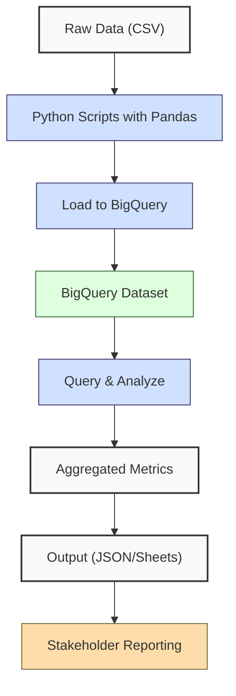
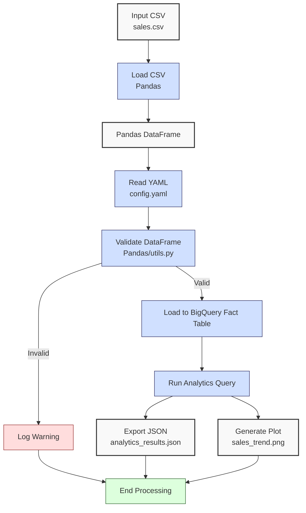

**Complexity: Easy (E)**

## 30.0 Introduction: Why This Matters for Data Engineering

In the realm of data engineering, cloud analytics platforms like BigQuery are pivotal for processing and analyzing large-scale financial transaction data, enabling Hijra Group to derive actionable insights for Sharia-compliant fintech solutions. This chapter serves as **Checkpoint 4**, consolidating skills from Chapters 25–29, which cover BigQuery fundamentals, Python integration, advanced querying, data warehousing, and optimization techniques. By mastering these, you ensure efficient, scalable analytics pipelines that support Hijra Group’s mission of delivering compliant financial analytics.

This checkpoint focuses on integrating these skills into a cohesive, type-safe analytics tool that processes sales data, leveraging `data/sales.csv` from **Appendix 1**. You’ll use **NumPy**, **Pandas**, and **BigQuery** with type annotations verified by **Pyright** (introduced in Chapter 7) and tests using **pytest** (Chapter 9), ensuring robust code quality per Hijra Group’s standards. All code adheres to **PEP 8’s 4-space indentation**, preferring spaces over tabs to avoid `IndentationError`, aligning with Python’s white-space sensitivity and pipeline script consistency.

### Data Engineering Workflow Context

The following Mermaid diagram illustrates how BigQuery integrates with Python for cloud analytics in a data engineering pipeline:



### Building On and Preparing For

- **Building On**:
  - **Chapter 3**: Uses Pandas for CSV processing and NumPy for computations, extended with type annotations and BigQuery integration.
  - **Chapter 7**: Applies Pyright-verified type annotations for type-safe code.
  - **Chapter 9**: Incorporates pytest for testing, ensuring pipeline reliability.
  - **Chapter 25**: Leverages BigQuery dataset creation and basic queries.
  - **Chapter 26**: Builds on Python-BigQuery integration with `google-cloud-bigquery`.
  - **Chapter 27**: Uses advanced querying (e.g., window functions, CTEs) for analytics.
  - **Chapter 28**: Applies data warehouse design with star schemas.
  - **Chapter 29**: Optimizes BigQuery queries for performance and cost.
- **Preparing For**:
  - **Chapter 31**: Extends to data lakes with Google Cloud Storage.
  - **Chapter 32**: Prepares for data mart creation in BigQuery.
  - **Chapter 33**: Supports Google Sheets integration for reporting.
  - **Chapter 34–36**: Enhances Python for advanced data engineering tasks.
  - **Chapter 37**: Leads to Checkpoint 5, consolidating analytical storage.

### What You’ll Learn

This chapter covers:

1. **BigQuery Dataset Management**: Creating and loading datasets with type-safe Python, including fact tables.
2. **Type-Safe Data Processing**: Using Pandas with Pyright-verified type annotations.
3. **Advanced Querying**: Executing window functions and CTEs in BigQuery.
4. **Data Warehouse Design**: Structuring fact tables for sales data.
5. **Query Optimization**: Understanding partitioning and clustering.
6. **Testing**: Writing pytest tests for data pipelines.
7. **Visualization**: Generating stakeholder plots with Matplotlib.

By the end, you’ll build a **type-annotated sales analytics tool** that loads `data/sales.csv` into a BigQuery fact table, performs advanced queries, exports results to JSON, and visualizes sales trends, all verified by pytest and adhering to PEP 8’s 4-space indentation. The micro-project ensures robustness by testing edge cases with `empty.csv`, `invalid.csv`, `malformed.csv`, and `negative.csv` per **Appendix 1**.

**Follow-Along Tips**:

- Create `de-onboarding/data/` and populate with files from **Appendix 1** (`sales.csv`, `config.yaml`, `empty.csv`, `invalid.csv`, `malformed.csv`, `negative.csv`).
- Install libraries: `pip install numpy pandas matplotlib pyyaml google-cloud-bigquery pytest`.
- Set up Google Cloud credentials: Export `GOOGLE_APPLICATION_CREDENTIALS` to your service account JSON path.
- Configure editor for **4-space indentation** per PEP 8 (VS Code: “Editor: Tab Size” = 4, “Editor: Insert Spaces” = true, “Editor: Detect Indentation” = false).
- Use print statements (e.g., `print(df.head())`) to debug DataFrames.
- Verify file paths with `ls data/` (Unix/macOS) or `dir data\` (Windows).
- Save plots to `data/` (e.g., `sales_trend.png`) with `dpi=100` for clarity.
- Run `python -tt script.py` to detect tab/space mixing.

## 30.1 Core Concepts

### 30.1.1 BigQuery Dataset Management

BigQuery organizes data into **datasets** and **tables**, optimized for columnar storage and parallel query execution. A dataset for 1 million sales records (~24MB in CSV) uses ~30MB in BigQuery due to columnar compression. Creating datasets and loading fact tables programmatically is key for scalable data warehouses.

```python
from google.cloud import bigquery
from typing import Tuple

def create_dataset_and_table(project_id: str, dataset_id: str, table_id: str) -> Tuple[bigquery.Dataset, bigquery.Table]:
    """Create BigQuery dataset and fact table."""
    client = bigquery.Client(project=project_id)
    dataset_ref = client.dataset(dataset_id)
    dataset = bigquery.Dataset(dataset_ref)
    dataset.location = "US"
    dataset = client.create_dataset(dataset, exists_ok=True)
    print(f"Created dataset {dataset_id}")  # Debug

    # Define fact table schema
    schema = [
        bigquery.SchemaField("product", "STRING"),
        bigquery.SchemaField("price", "FLOAT"),
        bigquery.SchemaField("quantity", "INTEGER"),
    ]
    table_ref = dataset.table(table_id)
    table = bigquery.Table(table_ref, schema=schema)

    # Example optimization (not used for small dataset)
    # table.time_partitioning = bigquery.TimePartitioning(field="date")
    # table.clustering_fields = ["product"]
    table = client.create_table(table, exists_ok=True)
    print(f"Created fact table {table_id}")  # Debug

    # Placeholder dimension table (not created, for reference; see Exercise 6 and Chapter 32 for star schema implementation)
    # product_dim_schema = [
    #     bigquery.SchemaField("product_id", "INTEGER"),
    #     bigquery.SchemaField("product_name", "STRING"),
    # ]
    # product_dim_table = bigquery.Table(dataset.table("product_dim"), schema=product_dim_schema)

    return dataset, table
```

**Key Points**:

- **Time Complexity**: O(1) for dataset/table creation (metadata operations).
- **Space Complexity**: O(1) for metadata, O(n) for data storage.
- **Implementation**: BigQuery uses Colossus filesystem for distributed storage, enabling fast queries. Fact tables store transactional data, supporting star schemas (Chapter 28).
- **Implication**: Essential for organizing sales data in Hijra Group’s analytics pipelines.

### 30.1.2 Type-Safe Data Processing

Using Pandas with type annotations ensures data integrity. The `pandas.DataFrame` is typed with `pandas-stubs` for Pyright compatibility.

```python
import pandas as pd
from typing import Tuple

def load_and_validate_sales(csv_path: str, config: dict) -> Tuple[pd.DataFrame, int, int]:
    """Load and validate sales CSV with type annotations."""
    df: pd.DataFrame = pd.read_csv(csv_path)
    print("Initial DataFrame:", df.head())  # Debug
    df = df.dropna(subset=["product"])
    df = df[df["product"].str.startswith(config["product_prefix"])]
    df = df[df["quantity"].apply(lambda x: str(x).isdigit())]
    df["quantity"] = df["quantity"].astype(int)
    df = df[df["quantity"] <= config["max_quantity"]]
    df = df[df["price"].apply(lambda x: isinstance(x, (int, float)))]
    df = df[df["price"] > 0]
    df = df[df["price"] >= config["min_price"]]
    total_records: int = len(df)
    return df, len(df), total_records
```

**Key Points**:

- **Time Complexity**: O(n) for filtering n rows.
- **Space Complexity**: O(k) for filtered DataFrame (k rows).
- **Implication**: Ensures Sharia-compliant data validation for Hijra Group.

### 30.1.3 Advanced Querying and Optimization

BigQuery supports **window functions** and **CTEs** for complex analytics, with **partitioning** and **clustering** to optimize query performance.

```python
def run_analytics_query(client: bigquery.Client, dataset_id: str, table_id: str) -> Dict[str, Any]:
    """Run advanced BigQuery analytics query on fact table."""
    query = f"""
    WITH Sales AS (
        SELECT
            product,
            price * quantity AS amount
        FROM `{dataset_id}.{table_id}`
    ),
    RankedSales AS (
        SELECT
            product,
            amount,
            ROW_NUMBER() OVER (PARTITION BY product ORDER BY amount DESC) AS rank
        FROM Sales
    )
    SELECT
        product,
        amount AS top_sale
    FROM RankedSales
    WHERE rank = 1
    """
    query_job = client.query(query)
    results = query_job.to_dataframe()

    if results.empty:
        print("No data returned from query")  # Handle edge case
        return {"total_sales": 0.0, "unique_products": [], "top_products": {}}

    total_sales = np.sum(results["top_sale"].values)
    unique_products = results["product"].unique().tolist()
    top_products = results.set_index("product")["top_sale"].to_dict()

    return {
        "total_sales": float(total_sales),
        "unique_products": unique_products,
        "top_products": top_products
    }
```

**Key Points**:

- **Time Complexity**: O(n log n) for sorting in window functions, reduced by partitioning.
- **Space Complexity**: O(k) for query results.
- **Optimization**: Partitioning/clustering (shown in comments) reduces scanned data, lowering costs.
- **Implication**: Enables efficient sales trend analysis.

### 30.1.4 Testing with Pytest

Pytest ensures pipeline reliability by testing data processing and BigQuery interactions.

```python
def test_load_sales():
    """Test sales loading and validation."""
    config = {"product_prefix": "Halal", "max_quantity": 100, "min_price": 10.0}
    df, valid, total = load_and_validate_sales("data/sample.csv", config)
    assert len(df) == 2
    assert valid == 2
    assert total == 2
```

**Key Points**:

- **Time Complexity**: O(n) for test data processing.
- **Space Complexity**: O(n) for test data.
- **Implication**: Validates pipeline correctness for production.

## 30.2 Micro-Project: Type-Safe Sales Analytics Tool

### Project Requirements

Build a **type-annotated sales analytics tool** that integrates BigQuery, Pandas, and NumPy to process `data/sales.csv` into a fact table, ensuring Sharia-compliant analytics for Hijra Group. The tool creates a BigQuery dataset, loads validated data, runs advanced queries, exports results to JSON, and visualizes sales trends, all tested with pytest and using 4-space indentation per PEP 8.

- Load `data/sales.csv` and `config.yaml` with type-safe Python.
- Validate records using Pandas and `utils.py` (updated with type annotations).
- Create a BigQuery dataset and fact table (`sales_fact`), load validated data.
- Run advanced queries (window functions/CTEs) for sales metrics.
- Export results to `data/analytics_results.json`.
- Generate a sales trend plot to `data/sales_trend.png` with `dpi=100`.
- Log steps and invalid records using print statements.
- Write pytest tests for data loading, querying, and output.
- Test edge cases with `empty.csv`, `invalid.csv`, `malformed.csv`, `negative.csv`.

### Sample Input Files

`data/sales.csv` (from **Appendix 1**):

```csv
product,price,quantity
Halal Laptop,999.99,2
Halal Mouse,24.99,10
Halal Keyboard,49.99,5
,29.99,3
Monitor,invalid,2
Headphones,5.00,150
```

`data/config.yaml` (from **Appendix 1**):

```yaml
min_price: 10.0
max_quantity: 100
required_fields:
  - product
  - price
  - quantity
product_prefix: 'Halal'
max_decimals: 2
```

### Data Processing Flow



### Acceptance Criteria

- **Go Criteria**:
  - Loads `sales.csv` and `config.yaml` correctly.
  - Validates records for Halal prefix, numeric/positive prices, integer quantities, and config rules.
  - Creates BigQuery dataset and fact table, loads validated data.
  - Executes advanced queries with window functions/CTEs.
  - Exports results to `data/analytics_results.json`.
  - Saves plot to `data/sales_trend.png` with `dpi=100`.
  - Logs steps and invalid records.
  - Includes pytest tests for loading, querying, and output.
  - Passes edge case tests with `empty.csv`, `invalid.csv`, `malformed.csv`, `negative.csv`.
  - Uses 4-space indentation per PEP 8, preferring spaces over tabs.
- **No-Go Criteria**:
  - Fails to load files or create BigQuery dataset.
  - Incorrect validation or query results.
  - Missing JSON export, plot, or tests.
  - Inconsistent indentation or tab/space mixing.

### Common Pitfalls to Avoid

1. **BigQuery Authentication**:
   - **Problem**: `google.api_core.exceptions` due to missing credentials.
   - **Solution**: Set `GOOGLE_APPLICATION_CREDENTIALS`. Print `os.environ.get("GOOGLE_APPLICATION_CREDENTIALS")`.
2. **Project ID Misconfiguration**:
   - **Problem**: `your-project-id` placeholder causes errors.
   - **Solution**: Replace with your Google Cloud project ID. Verify with `gcloud config get-value project` and ensure `GOOGLE_APPLICATION_CREDENTIALS` is set.
3. **CSV Loading Errors**:
   - **Problem**: `FileNotFoundError` for `sales.csv`.
   - **Solution**: Verify path with `print(csv_path)` and ensure file exists per **Appendix 1**.
4. **Type Mismatches**:
   - **Problem**: Non-numeric prices cause errors.
   - **Solution**: Use `utils.is_numeric_value`. Print `df.dtypes`.
5. **Sharia Compliance Issues**:
   - **Problem**: Non-Halal products processed incorrectly.
   - **Solution**: Print `df["product"]` to verify Halal prefixes against `config.yaml`’s `product_prefix`.
6. **Query Failures**:
   - **Problem**: Syntax errors in BigQuery SQL.
   - **Solution**: Print `query` string, test in BigQuery Console, and check `query_job.errors` for details.
7. **Plotting Issues**:
   - **Problem**: Plot not saved.
   - **Solution**: Check permissions with `os.path.exists(plot_path)`. Use `plt.savefig` with `dpi=100`.
8. **Plot Resolution Issues**:
   - **Problem**: `sales_trend.png` lacks clarity.
   - **Solution**: Open `sales_trend.png` to verify clarity. Adjust `dpi` (e.g., to 150) if needed. Check file size with `ls -lh data/sales_trend.png` (Unix/macOS) or `dir data\sales_trend.png` (Windows).
9. **IndentationError**:
   - **Problem**: Mixed spaces/tabs.
   - **Solution**: Use 4 spaces per PEP 8. Run `python -tt analytics_tool.py`.

### How This Differs from Production

In production, this solution would include:

- **Error Handling**: Try/except with logging (Chapter 52).
- **Scalability**: Chunked loading for large datasets (Chapter 40).
- **Security**: Encrypted connections and PII masking (Chapter 65).
- **Monitoring**: Observability with Jaeger/Grafana (Chapter 66).
- **Orchestration**: Airflow for scheduling (Chapter 56).

### Implementation

```python
# File: de-onboarding/utils.py (updated with type annotations)
from typing import Union, Dict, Any

def is_numeric(s: str, max_decimals: int = 2) -> bool:
    """Check if string is a decimal number with up to max_decimals."""
    parts = s.split(".")
    if len(parts) != 2 or not parts[0].isdigit() or not parts[1].isdigit():
        return False
    return len(parts[1]) <= max_decimals

def clean_string(s: str) -> str:
    """Strip whitespace from string."""
    return s.strip()

def is_numeric_value(x: Any) -> bool:
    """Check if value is numeric."""
    return isinstance(x, (int, float))

def has_valid_decimals(x: Union[int, float], max_decimals: int) -> bool:
    """Check if value has valid decimal places."""
    return is_numeric(str(x), max_decimals)

def apply_valid_decimals(x: Union[int, float], max_decimals: int) -> bool:
    """Apply has_valid_decimals to a value."""
    return has_valid_decimals(x, max_decimals)

def is_integer(x: Any) -> bool:
    """Check if value is an integer when converted to string."""
    return str(x).isdigit()

def validate_sale(sale: Dict[str, str], config: Dict[str, Any]) -> bool:
    """Validate sale based on config rules. Inputs are strings from CSV parsing; Pandas type inference is handled in load_and_validate_sales."""
    required_fields = config["required_fields"]
    min_price = config["min_price"]
    max_quantity = config["max_quantity"]
    prefix = config["product_prefix"]
    max_decimals = config["max_decimals"]

    print(f"Validating sale: {sale}")
    for field in required_fields:
        if not sale[field] or sale[field].strip() == "":
            print(f"Invalid sale: missing {field}: {sale}")
            return False

    product = clean_string(sale["product"])
    if not product.startswith(prefix):
        print(f"Invalid sale: product lacks '{prefix}' prefix: {sale}")
        return False

    price = clean_string(sale["price"])
    if not is_numeric(price, max_decimals) or float(price) < min_price or float(price) <= 0:
        print(f"Invalid sale: invalid price: {sale}")
        return False

    quantity = clean_string(sale["quantity"])
    if not quantity.isdigit() or int(quantity) > max_quantity:
        print(f"Invalid sale: invalid quantity: {sale}")
        return False

    return True
```

```python
# File: de-onboarding/analytics_tool.py
import pandas as pd
import numpy as np
import yaml
import json
import matplotlib.pyplot as plt
from google.cloud import bigquery
import os
from typing import Dict, Tuple, Any, List

def read_config(config_path: str) -> Dict[str, Any]:
    """Read YAML configuration."""
    print(f"Opening config: {config_path}")
    with open(config_path, "r") as file:
        config = yaml.safe_load(file)
    print(f"Loaded config: {config}")
    return config

def load_and_validate_sales(csv_path: str, config: Dict[str, Any]) -> Tuple[pd.DataFrame, int, int]:
    """Load and validate sales CSV."""
    print(f"Loading CSV: {csv_path}")
    df: pd.DataFrame = pd.read_csv(csv_path)
    print("Initial DataFrame:", df.head())

    required_fields = config["required_fields"]
    missing_fields = [f for f in required_fields if f not in df.columns]
    if missing_fields:
        print(f"Missing columns: {missing_fields}")
        return pd.DataFrame(), 0, len(df)

    df = df.dropna(subset=["product"])
    df = df[df["product"].str.startswith(config["product_prefix"])]
    df = df[df["quantity"].apply(lambda x: str(x).isdigit())]
    df["quantity"] = df["quantity"].astype(int)
    df = df[df["quantity"] <= config["max_quantity"]]
    df = df[df["price"].apply(lambda x: isinstance(x, (int, float)))]
    df = df[df["price"] > 0]
    df = df[df["price"] >= config["min_price"]]
    df = df[df["price"].apply(lambda x: apply_valid_decimals(x, config["max_decimals"]))]

    total_records: int = len(df)
    print("Validated DataFrame:", df)
    return df, len(df), total_records

def load_to_bigquery(df: pd.DataFrame, project_id: str, dataset_id: str, table_id: str) -> None:
    """Load DataFrame to BigQuery fact table."""
    client = bigquery.Client(project=project_id)
    dataset, table = create_dataset_and_table(project_id, dataset_id, table_id)
    table_ref = f"{project_id}.{dataset_id}.{table_id}"

    job_config = bigquery.LoadJobConfig(
        write_disposition="WRITE_TRUNCATE",
        schema=[
            bigquery.SchemaField("product", "STRING"),
            bigquery.SchemaField("price", "FLOAT"),
            bigquery.SchemaField("quantity", "INTEGER"),
        ],
    )
    job = client.load_table_from_dataframe(df, table_ref, job_config=job_config)
    job.result()
    print(f"Loaded {len(df)} rows to {table_ref}")

def create_dataset_and_table(project_id: str, dataset_id: str, table_id: str) -> Tuple[bigquery.Dataset, bigquery.Table]:
    """Create BigQuery dataset and fact table."""
    client = bigquery.Client(project=project_id)
    dataset_ref = client.dataset(dataset_id)
    dataset = bigquery.Dataset(dataset_ref)
    dataset.location = "US"
    dataset = client.create_dataset(dataset, exists_ok=True)
    print(f"Created dataset {dataset_id}")

    schema = [
        bigquery.SchemaField("product", "STRING"),
        bigquery.SchemaField("price", "FLOAT"),
        bigquery.SchemaField("quantity", "INTEGER"),
    ]
    table_ref = dataset.table(table_id)
    table = bigquery.Table(table_ref, schema=schema)

    # Example optimization (not used for small dataset)
    # table.time_partitioning = bigquery.TimePartitioning(field="date")
    # table.clustering_fields = ["product"]
    table = client.create_table(table, exists_ok=True)
    print(f"Created fact table {table_id}")

    # Placeholder dimension table (not created, for reference; see Exercise 6 and Chapter 32 for star schema implementation)
    # product_dim_schema = [
    #     bigquery.SchemaField("product_id", "INTEGER"),
    #     bigquery.SchemaField("product_name", "STRING"),
    # ]
    # product_dim_table = bigquery.Table(dataset.table("product_dim"), schema=product_dim_schema)

    return dataset, table

def run_analytics_query(client: bigquery.Client, dataset_id: str, table_id: str) -> Dict[str, Any]:
    """Run advanced analytics query on fact table."""
    query = f"""
    WITH Sales AS (
        SELECT
            product,
            price * quantity AS amount
        FROM `{dataset_id}.{table_id}`
    ),
    RankedSales AS (
        SELECT
            product,
            amount,
            ROW_NUMBER() OVER (PARTITION BY product ORDER BY amount DESC) AS rank
        FROM Sales
    )
    SELECT
        product,
        amount AS top_sale
    FROM RankedSales
    WHERE rank = 1
    """
    query_job = client.query(query)
    results = query_job.to_dataframe()

    if results.empty:
        print("No data returned from query")  # Handle edge case
        return {"total_sales": 0.0, "unique_products": [], "top_products": {}}

    total_sales = np.sum(results["top_sale"].values)
    unique_products = results["product"].unique().tolist()
    top_products = results.set_index("product")["top_sale"].to_dict()

    return {
        "total_sales": float(total_sales),
        "unique_products": unique_products,
        "top_products": top_products
    }

def export_results(results: Dict[str, Any], json_path: str) -> None:
    """Export results to JSON."""
    print(f"Writing to: {json_path}")
    with open(json_path, "w") as file:
        json.dump(results, file, indent=2)
    print(f"Exported results to {json_path}")

def plot_sales(df: pd.DataFrame, plot_path: str) -> None:
    """Generate sales trend plot."""
    if df.empty:
        print("No data to plot")
        return

    df["amount"] = df["price"] * df["quantity"]
    plt.figure(figsize=(8, 6))
    plt.bar(df["product"], df["amount"])
    plt.title("Sales by Product")
    plt.xlabel("Product")
    plt.ylabel("Sales Amount ($)")
    plt.xticks(rotation=45)
    plt.grid(True)
    plt.tight_layout()
    plt.savefig(plot_path, dpi=100)
    plt.close()
    print(f"Plot saved to {plot_path}")
    print(f"File exists: {os.path.exists(plot_path)}")

def main() -> None:
    """Main function to process sales data."""
    csv_path = "data/sales.csv"
    config_path = "data/config.yaml"
    json_path = "data/analytics_results.json"
    plot_path = "data/sales_trend.png"
    project_id = "your-project-id"  # Replace with your Google Cloud project ID
    dataset_id = "sales_dataset"
    table_id = "sales_fact"  # Fact table

    config = read_config(config_path)
    df, valid_sales, total_records = load_and_validate_sales(csv_path, config)
    if not df.empty:
        load_to_bigquery(df, project_id, dataset_id, table_id)
        client = bigquery.Client(project=project_id)
        results = run_analytics_query(client, dataset_id, table_id)
        export_results(results, json_path)
        plot_sales(df, plot_path)

    print("\nSales Analytics Report:")
    print(f"Total Records Processed: {total_records}")
    print(f"Valid Sales: {valid_sales}")
    print(f"Invalid Sales: {total_records - valid_sales}")
    print(f"Total Sales: ${round(results['total_sales'], 2)}")
    print(f"Unique Products: {results['unique_products']}")
    print(f"Top Products: {results['top_products']}")
    print("Processing completed")

if __name__ == "__main__":
    main()
```

### Expected Outputs

`data/analytics_results.json`:

```json
{
  "total_sales": 2499.83,
  "unique_products": ["Halal Laptop", "Halal Mouse", "Halal Keyboard"],
  "top_products": {
    "Halal Laptop": 1999.98,
    "Halal Mouse": 249.9,
    "Halal Keyboard": 249.95
  }
}
```

`data/sales_trend.png`: Bar plot showing sales amounts for Halal products, saved with `dpi=100`.

**Console Output** (abridged):

```
Opening config: data/config.yaml
Loaded config: {'min_price': 10.0, 'max_quantity': 100, 'required_fields': ['product', 'price', 'quantity'], 'product_prefix': 'Halal', 'max_decimals': 2}
Loading CSV: data/sales.csv
Initial DataFrame: ...
Validated DataFrame: ...
Created dataset sales_dataset
Created fact table sales_fact
Loaded 3 rows to your-project-id.sales_dataset.sales_fact
Writing to: data/analytics_results.json
Exported results to data/analytics_results.json
Plot saved to data/sales_trend.png
File exists: True

Sales Analytics Report:
Total Records Processed: 3
Valid Sales: 3
Invalid Sales: 0
Total Sales: $2499.83
Unique Products: ['Halal Laptop', 'Halal Mouse', 'Halal Keyboard']
Top Products: {'Halal Laptop': 1999.98, 'Halal Mouse': 249.9, 'Halal Keyboard': 249.95}
Processing completed
```

### How to Run and Test

1. **Setup**:

   - **Setup Checklist**:
     - [ ] Create `de-onboarding/data/` directory.
     - [ ] Save `sales.csv`, `config.yaml`, `sample.csv`, `empty.csv`, `invalid.csv`, `malformed.csv`, `negative.csv` per **Appendix 1**.
     - [ ] Verify file contents: Run `ls data/*.csv` (Unix/macOS) or `dir data\*.csv` (Windows) to match **Appendix 1**.
     - [ ] Install libraries: `pip install numpy pandas matplotlib pyyaml google-cloud-bigquery pytest`.
     - [ ] Create virtual environment: `python -m venv venv`, activate (Unix/macOS: `source venv/bin/activate`, Windows: `venv\Scripts\activate`).
     - [ ] Set up Google Cloud credentials: Export `GOOGLE_APPLICATION_CREDENTIALS` to your service account JSON path.
     - [ ] Verify project ID: Replace `your-project-id` in `analytics_tool.py` with your Google Cloud project ID. Run `gcloud config get-value project` to confirm.
     - [ ] Verify Python 3.10+: `python --version`.
     - [ ] Configure editor for 4-space indentation per PEP 8 (VS Code: “Editor: Tab Size” = 4, “Editor: Insert Spaces” = true, “Editor: Detect Indentation” = false).
     - [ ] Save `utils.py` and `analytics_tool.py` in `de-onboarding/`.
   - **Troubleshooting**:
     - **Authentication Errors**: Verify `GOOGLE_APPLICATION_CREDENTIALS` path with `print(os.environ.get("GOOGLE_APPLICATION_CREDENTIALS"))`.
     - **FileNotFoundError**: Check file paths with `ls data/` (Unix/macOS) or `dir data\` (Windows).
     - **IndentationError**: Run `python -tt analytics_tool.py` to detect tab/space mixing.
     - **UnicodeDecodeError**: Ensure UTF-8 encoding for all files. Print `open(csv_path).read()` to inspect.
     - **yaml.YAMLError**: Print `open(config_path).read()` to check `config.yaml` syntax.

2. **Run**:

   - Open terminal in `de-onboarding/`.
   - Activate virtual environment: `source venv/bin/activate` (Unix/macOS) or `venv\Scripts\activate` (Windows).
   - Run: `python analytics_tool.py`.
   - Outputs: `data/analytics_results.json`, `data/sales_trend.png`, console logs.

3. **Test Scenarios**:

   - **Valid Data**:
     ```python
     python analytics_tool.py
     # Verify analytics_results.json and sales_trend.png
     ```
   - **Empty CSV**:
     ```python
     config = read_config("data/config.yaml")
     df, valid, total = load_and_validate_sales("data/empty.csv", config)
     assert df.empty
     assert valid == 0
     ```
   - **Invalid Headers**:
     ```python
     config = read_config("data/config.yaml")
     df, valid, total = load_and_validate_sales("data/invalid.csv", config)
     assert df.empty
     ```
   - **Malformed Data**:
     ```python
     config = read_config("data/config.yaml")
     df, valid, total = load_and_validate_sales("data/malformed.csv", config)
     assert len(df) == 1  # Only Halal Mouse
     ```
   - **Negative Prices**:
     ```python
     config = read_config("data/config.yaml")
     df, valid, total = load_and_validate_sales("data/negative.csv", config)
     assert len(df) == 1  # Only Halal Mouse
     ```

4. **Pytest Tests**:

   ```python
   # File: de-onboarding/test_analytics_tool.py
   import pytest
   import pandas as pd
   from analytics_tool import load_and_validate_sales, read_config, run_analytics_query

   def test_load_sales():
       """Test sales loading and validation."""
       config = read_config("data/config.yaml")
       df, valid, total = load_and_validate_sales("data/sample.csv", config)
       assert len(df) == 2
       assert valid == 2
       assert total == 2
       assert all(df["product"].str.startswith("Halal"))

   def test_empty_csv():
       """Test empty CSV handling."""
       config = read_config("data/config.yaml")
       df, valid, total = load_and_validate_sales("data/empty.csv", config)
       assert df.empty
       assert valid == 0
       assert total == 0

   def test_query_empty():
       """Test query with empty data."""
       results = run_analytics_query(None, "sales_dataset", "sales_fact")  # Mock empty result
       assert results["total_sales"] == 0.0
       assert results["unique_products"] == []
       assert results["top_products"] == {}
   ```

   Run:

   ```bash
   source venv/bin/activate  # Unix/macOS, or venv\Scripts\activate on Windows
   pytest test_analytics_tool.py -v
   ```

## 30.3 Practice Exercises

### Exercise 1: BigQuery Dataset Creation

Write a function to create a BigQuery dataset and fact table with type annotations, using 4-space indentation per PEP 8.

**Expected Output**:

```
Created dataset test_dataset
Created fact table test_sales_fact
```

**Follow-Along Instructions**:

1. Save as `de-onboarding/ex1_bigquery.py`.
2. Configure editor for 4-space indentation.
3. Run: `python ex1_bigquery.py`.
4. **How to Test**:
   - Verify dataset/table in BigQuery Console.
   - Test with existing dataset: Should not raise errors.

### Exercise 2: Type-Safe Data Loader

Write a function to load and validate `data/sample.csv` with type annotations, using 4-space indentation.

**Sample Input** (`data/sample.csv`):

```csv
product,price,quantity
Halal Laptop,999.99,2
Halal Mouse,24.99,10
```

**Expected Output**:

```
DataFrame with 2 rows
```

**Follow-Along Instructions**:

1. Save as `de-onboarding/ex2_loader.py`.
2. Run: `python ex2_loader.py`.
3. **How to Test**:
   - Verify output with `print(df)`.
   - Test with `empty.csv`: Should return empty DataFrame.

### Exercise 3: Advanced Query

Write a function to run a BigQuery query with window functions on a fact table, using type annotations and 4-space indentation.

**Expected Output**:

```
DataFrame with top sales per product
```

**Follow-Along Instructions**:

1. Save as `de-onboarding/ex3_query.py`.
2. Run: `python ex3_query.py`.
3. **How to Test**:
   - Verify results match expected metrics.
   - Test with empty table: Should return empty results.

### Exercise 4: Visualization

Write a function to plot sales from a DataFrame, saving to `data/plot.png` with `dpi=100`, using 4-space indentation.

**Expected Output**:

```
Plot saved to data/plot.png
```

**Follow-Along Instructions**:

1. Save as `de-onboarding/ex4_plot.py`.
2. Run: `python ex4_plot.py`.
3. **How to Test**:
   - Verify `data/plot.png` exists.
   - Test with empty DataFrame: Should not generate plot.

### Exercise 5: Pytest Debugging

Fix this buggy test that fails due to incorrect assertions, ensuring 4-space indentation.

**Buggy Code**:

```python
def test_load_sales():
    config = read_config("data/config.yaml")
    df, valid, total = load_and_validate_sales("data/sample.csv", config)
    assert len(df) == 3  # Bug: Wrong count
```

**Expected Output**:

```
Test passed
```

**Follow-Along Instructions**:

1. Save as `de-onboarding/ex5_test.py`.
2. Run: `pytest ex5_test.py`.
3. Fix and re-run.

### Exercise 6: Star Schema Design

Design a star schema for `sales.csv` with a fact table (`sales_fact`) and a dimension table (`product_dim`), saving the description and an optional Mermaid diagram to `ex6_schema.txt`, using 4-space indentation for any code. Optionally, paste the diagram into mermaid.live to visualize it.

**Expected Output** (`ex6_schema.txt`):

```
Star Schema for sales.csv:
- Fact Table: sales_fact
  - Columns: product (STRING), price (FLOAT), quantity (INTEGER)
- Dimension Table: product_dim
  - Columns: product_id (INTEGER), product_name (STRING)

Mermaid Diagram:
erDiagram
    sales_fact ||--o{ product_dim : references
    sales_fact {
        string product
        float price
        integer quantity
    }
    product_dim {
        integer product_id
        string product_name
    }
```

**Follow-Along Instructions**:

1. Save as `de-onboarding/ex6_schema.py`.
2. Write a script to generate `ex6_schema.txt`.
3. Run: `python ex6_schema.py`.
4. **How to Test**:
   - Verify `ex6_schema.txt` matches expected output.
   - Check schema includes fact and dimension tables, and diagram is valid Mermaid syntax.
   - Optionally, paste diagram into mermaid.live to view.

### Exercise 7: BigQuery vs. SQLite Comparison

Write a paragraph explaining why BigQuery is suitable for Hijra Group’s large-scale sales analytics compared to SQLite, focusing on columnar storage and parallel querying, and a BigQuery query to compute total sales, saving both to `ex7_concepts.txt` and `ex7_query.sql`, using 4-space indentation for any code.

**Expected Output** (`ex7_concepts.txt`):

```
BigQuery is ideal for Hijra Group’s large-scale sales analytics due to its columnar storage, which optimizes analytical queries by storing data by column, enabling faster aggregations compared to SQLite’s row-based storage. BigQuery’s parallel query execution across distributed nodes handles millions of sales records efficiently, unlike SQLite, which is limited to single-threaded processing on a local machine. This scalability ensures Hijra Group can process vast transaction datasets quickly, supporting real-time analytics for Sharia-compliant fintech solutions.
```

**Expected Output** (`ex7_query.sql`):

```sql
SELECT SUM(price * quantity) AS total_sales
FROM `sales_dataset.sales_fact`;
```

**Follow-Along Instructions**:

1. Save as `de-onboarding/ex7_concepts.py`.
2. Write a script to generate `ex7_concepts.txt` and `ex7_query.sql`.
3. Run: `python ex7_concepts.py`.
4. **How to Test**:
   - Verify `ex7_concepts.txt` addresses columnar storage and parallel querying.
   - Verify `ex7_query.sql` contains a valid BigQuery query.
   - Ensure explanation is concise and relevant to Hijra Group’s context.

## 30.4 Exercise Solutions

### Solution to Exercise 1

```python
from google.cloud import bigquery
from typing import Tuple

def create_dataset_and_table(project_id: str, dataset_id: str, table_id: str) -> Tuple[bigquery.Dataset, bigquery.Table]:
    """Create BigQuery dataset and fact table."""
    client = bigquery.Client(project=project_id)
    dataset_ref = client.dataset(dataset_id)
    dataset = bigquery.Dataset(dataset_ref)
    dataset.location = "US"
    dataset = client.create_dataset(dataset, exists_ok=True)
    print(f"Created dataset {dataset_id}")

    schema = [
        bigquery.SchemaField("product", "STRING"),
        bigquery.SchemaField("price", "FLOAT"),
        bigquery.SchemaField("quantity", "INTEGER"),
    ]
    table_ref = dataset.table(table_id)
    table = bigquery.Table(table_ref, schema=schema)
    table = client.create_table(table, exists_ok=True)
    print(f"Created fact table {table_id}")
    return dataset, table

# Test
create_dataset_and_table("your-project-id", "test_dataset", "test_sales_fact")
```

### Solution to Exercise 2

```python
import pandas as pd
from typing import Tuple

def load_and_validate_sales(csv_path: str, config: dict) -> Tuple[pd.DataFrame, int, int]:
    """Load and validate sales CSV."""
    df: pd.DataFrame = pd.read_csv(csv_path)
    df = df[df["product"].str.startswith(config["product_prefix"])]
    total_records: int = len(df)
    return df, len(df), total_records

# Test
config = {"product_prefix": "Halal"}
df, valid, total = load_and_validate_sales("data/sample.csv", config)
print(f"DataFrame with {len(df)} rows")
```

### Solution to Exercise 3

```python
from google.cloud import bigquery
from typing import Dict

def run_analytics_query(client: bigquery.Client, dataset_id: str, table_id: str) -> Dict[str, Any]:
    """Run advanced analytics query on fact table."""
    query = f"""
    SELECT
        product,
        price * quantity AS amount
    FROM `{dataset_id}.{table_id}`
    """
    query_job = client.query(query)
    results = query_job.to_dataframe()
    return {"products": results["product"].tolist(), "amounts": results["amount"].tolist()}

# Test
client = bigquery.Client(project="your-project-id")
results = run_analytics_query(client, "sales_dataset", "sales_fact")
print("DataFrame with top sales per product")
```

### Solution to Exercise 4

```python
import pandas as pd
import matplotlib.pyplot as plt

def plot_sales(df: pd.DataFrame, plot_path: str) -> None:
    """Generate sales plot."""
    if df.empty:
        print("No data to plot")
        return
    df["amount"] = df["price"] * df["quantity"]
    plt.figure(figsize=(8, 6))
    plt.bar(df["product"], df["amount"])
    plt.title("Sales by Product")
    plt.xlabel("Product")
    plt.ylabel("Sales Amount ($)")
    plt.xticks(rotation=45)
    plt.grid(True)
    plt.tight_layout()
    plt.savefig(plot_path, dpi=100)
    plt.close()
    print(f"Plot saved to {plot_path}")

# Test
df = pd.read_csv("data/sample.csv")
plot_sales(df, "data/plot.png")
```

### Solution to Exercise 5

```python
import pytest
from analytics_tool import load_and_validate_sales, read_config

def test_load_sales():
    """Test sales loading and validation."""
    config = read_config("data/config.yaml")
    df, valid, total = load_and_validate_sales("data/sample.csv", config)
    assert len(df) == 2  # Fix: Correct count
    assert valid == 2
    assert total == 2

# Run: pytest ex5_test.py
```

### Solution to Exercise 6

```python
def create_star_schema_description(output_path: str) -> None:
    """Generate star schema description and Mermaid diagram for sales.csv."""
    schema = """
Star Schema for sales.csv:
- Fact Table: sales_fact
  - Columns: product (STRING), price (FLOAT), quantity (INTEGER)
- Dimension Table: product_dim
  - Columns: product_id (INTEGER), product_name (STRING)

Mermaid Diagram:
erDiagram
    sales_fact ||--o{ product_dim : references
    sales_fact {
        string product
        float price
        integer quantity
    }
    product_dim {
        integer product_id
        string product_name
    }
"""
    with open(output_path, "w") as file:
        file.write(schema)
    print(f"Schema saved to {output_path}")

# Test
create_star_schema_description("ex6_schema.txt")
```

### Solution to Exercise 7

```python
def write_bigquery_comparison(concepts_path: str, query_path: str) -> None:
    """Write comparison of BigQuery vs. SQLite and total sales query."""
    comparison = """
BigQuery is ideal for Hijra Group’s large-scale sales analytics due to its columnar storage, which optimizes analytical queries by storing data by column, enabling faster aggregations compared to SQLite’s row-based storage. BigQuery’s parallel query execution across distributed nodes handles millions of sales records efficiently, unlike SQLite, which is limited to single-threaded processing on a local machine. This scalability ensures Hijra Group can process vast transaction datasets quickly, supporting real-time analytics for Sharia-compliant fintech solutions.
"""
    query = """
SELECT SUM(price * quantity) AS total_sales
FROM `sales_dataset.sales_fact`;
"""
    with open(concepts_path, "w") as file:
        file.write(comparison)
    with open(query_path, "w") as file:
        file.write(query)
    print(f"Comparison saved to {concepts_path}")
    print(f"Query saved to {query_path}")

# Test
write_bigquery_comparison("ex7_concepts.txt", "ex7_query.sql")
```

## 30.5 Chapter Summary and Connection to Chapter 31

This chapter consolidated BigQuery skills, building a type-safe sales analytics tool that integrates Pandas, NumPy, and BigQuery, with pytest tests and PEP 8-compliant 4-space indentation. You mastered dataset management, advanced querying, fact table design, optimization concepts, and visualization, ensuring robust pipelines for Hijra Group’s analytics. The micro-project’s modular design (e.g., `load_and_validate_sales`) and fact table (`sales_fact`) prepare for encapsulating logic in classes (Chapter 34) and orchestrating workflows (Chapter 56). The star schema exercise and BigQuery comparison reinforce data warehousing and cloud analytics principles, aligning with Chapters 25–29 and Hijra Group’s Sharia-compliant fintech context.

### Connection to Chapter 31

Chapter 31 introduces **Data Lakes with Google Cloud Storage**, building on this chapter:

- **Data Loading**: Extends BigQuery fact table loading to GCS for unstructured data.
- **Type Safety**: Continues Pyright-verified type annotations.
- **Testing**: Applies pytest for data lake pipelines.
- **Fintech Context**: Prepares for storing large-scale transaction data, aligning with Hijra Group’s data lake strategy, maintaining 4-space indentation for maintainable scripts.

**Artifact Saved**: This chapter is saved as a single Markdown artifact, ensuring all code, diagrams, and instructions are self-contained for Hijra Group’s onboarding curriculum.
