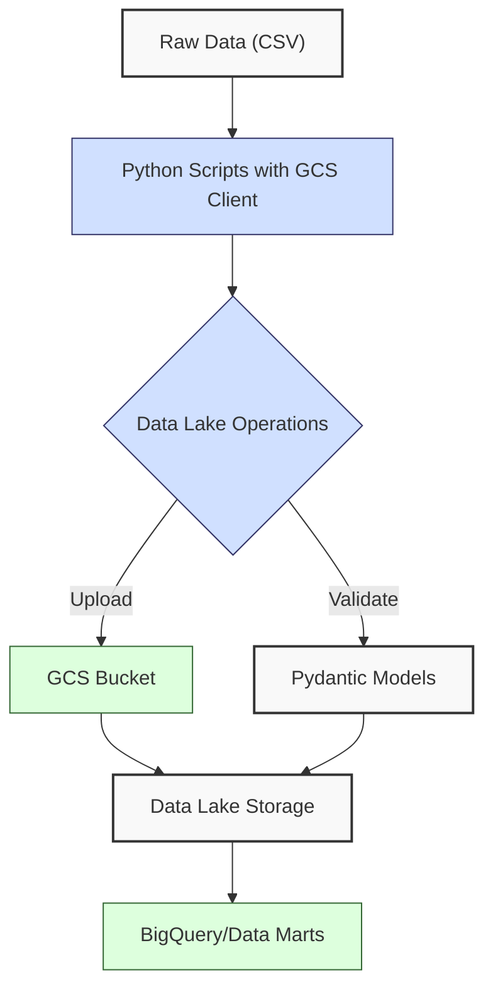
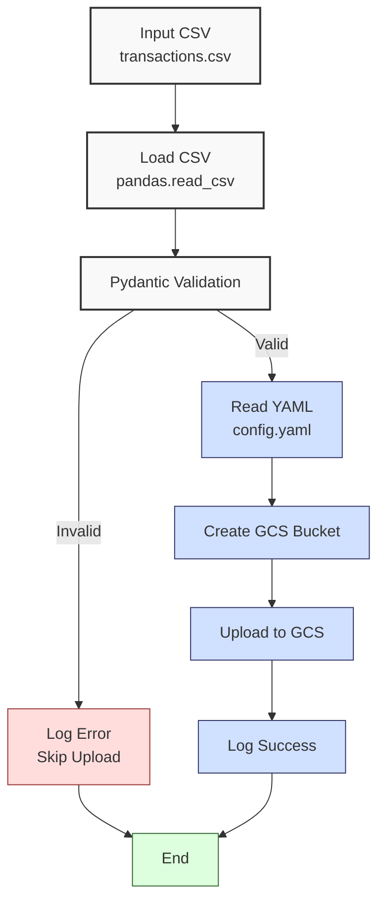

**Complexity: Moderate (M)**

## 31.0 Introduction: Why This Matters for Data Engineering

In data engineering, **data lakes** are centralized repositories for storing raw, heterogeneous data at scale, enabling advanced analytics for Hijra Group’s Sharia-compliant fintech operations. Google Cloud Storage (GCS) provides a scalable, durable platform for data lakes, supporting petabytes of data with 99.999999999% (11 nines) durability and O(1) access time for objects. Building on Chapter 30’s BigQuery analytics, this chapter introduces GCS for creating data lakes to store financial transaction data, such as `transactions.csv`, preparing for **data marts** (Chapter 32) and ETL pipelines (Chapter 37). Using type-annotated Python with `google-cloud-storage` and YAML configurations ensures robust, testable pipelines, aligning with Hijra Group’s need for secure, scalable data storage.

This chapter leverages concepts from earlier phases:

- **Chapter 2**: File handling and YAML parsing with `PyYAML`.
- **Chapter 7**: Type annotations with Pyright for type safety.
- **Chapter 9**: Testing with `pytest` for quality assurance.
- **Chapter 13**: Pydantic for data validation.
- **Chapter 26**: BigQuery integration, preparing for GCS-to-BigQuery pipelines.

All code uses **4-space indentation** per PEP 8, preferring spaces over tabs to avoid `IndentationError`, ensuring compatibility with Hijra Group’s pipeline scripts. The micro-project builds a type-safe GCS data lake for transaction data, validated and tested with `pytest`, setting the stage for optimized processing in Chapter 36.

### Data Engineering Workflow Context

This diagram illustrates how GCS data lakes fit into a data engineering pipeline:



### Building On and Preparing For

- **Building On**:
  - **Chapter 2**: Uses YAML parsing for configuration, extended to GCS settings.
  - **Chapter 7**: Applies type annotations for type-safe GCS operations.
  - **Chapter 9**: Integrates `pytest` for testing GCS uploads.
  - **Chapter 13**: Uses Pydantic for validating transaction data.
  - **Chapter 26**: Leverages BigQuery knowledge for future GCS-to-BigQuery pipelines.
- **Preparing For**:
  - **Chapter 32**: Enables data mart creation from data lakes.
  - **Chapter 34**: Prepares for Python-based data lake processing.
  - **Chapter 36**: Supports optimized data lake processing.
  - **Chapter 37**: Sets up ETL pipelines from data lakes to data marts.

### What You’ll Learn

This chapter covers:

1. **GCS Fundamentals**: Creating and managing buckets for data lakes.
2. **Type-Safe GCS Operations**: Uploading and validating data with `google-cloud-storage` and Pydantic.
3. **YAML Configurations**: Managing bucket settings with `PyYAML`.
4. **Testing**: Validating uploads with `pytest`.
5. **Performance**: Analyzing GCS operations (O(1) access, O(n) for data transfer).

The micro-project creates a type-safe GCS data lake for `data/transactions.csv`, using YAML configurations and Pydantic validation, tested with `pytest` for reliability. All scripts adhere to PEP 8’s 4-space indentation.

**Follow-Along Tips**:

- **Note**: Google Cloud’s free tier provides $300 credit for new users, sufficient for this chapter: [https://cloud.google.com/free](https://cloud.google.com/free).
- Create `de-onboarding/data/` and populate with `transactions.csv` and `config.yaml` per Appendix 1.
- Install libraries: `pip install google-cloud-storage pyyaml pydantic pytest pandas`.
- **Setup Instructions**:
  - Install Google Cloud SDK: [https://cloud.google.com/sdk/docs/install](https://cloud.google.com/sdk/docs/install).
  - Create a Google Cloud project: [https://console.cloud.google.com/projectcreate](https://console.cloud.google.com/projectcreate).
  - Enable Cloud Storage API: [https://console.cloud.google.com/apis/library/storage.googleapis.com](https://console.cloud.google.com/apis/library/storage.googleapis.com).
  - Create a service account key: [https://console.cloud.google.com/iam-admin/serviceaccounts](https://console.cloud.google.com/iam-admin/serviceaccounts) and set environment variable `export GOOGLE_APPLICATION_CREDENTIALS=/path/to/key.json` (Unix/macOS) or `set GOOGLE_APPLICATION_CREDENTIALS=C:\path\to\key.json` (Windows).
  - Authenticate: Run `gcloud auth application-default login` if not using a service account.
- Use print statements (e.g., `print(bucket.name)`) to debug GCS operations.
- Verify file paths with `ls data/` (Unix/macOS) or `dir data\` (Windows).
- Use UTF-8 encoding for all files to avoid `UnicodeDecodeError`.
- Configure editor for **4-space indentation** per PEP 8 (VS Code: “Editor: Tab Size” = 4, “Editor: Insert Spaces” = true, “Editor: Detect Indentation” = false). Run `python -tt script.py` to detect tab/space mixing.

## 31.1 GCS Fundamentals

Google Cloud Storage organizes data in **buckets**, globally unique containers for objects (files). Buckets support data lakes by storing raw data (e.g., CSVs) with O(1) access time and high durability. Objects are immutable, and operations like uploads are atomic, ensuring consistency.

### 31.1.1 Creating and Accessing Buckets

Use `google-cloud-storage` to create and access buckets.

```python
# File: de-onboarding/gcs_basics.py
from google.cloud import storage  # Import GCS client
from typing import Optional  # For type annotations

def create_bucket(project_id: str, bucket_name: str) -> Optional[storage.Bucket]:
    """Create a GCS bucket with type safety."""
    client = storage.Client(project=project_id)  # Initialize client
    bucket = client.bucket(bucket_name)  # Get bucket reference
    if not bucket.exists():  # Check if bucket exists
        bucket = client.create_bucket(bucket_name, location="us-central1")  # Create bucket
        print(f"Created bucket: {bucket_name}")  # Debug
    else:
        print(f"Bucket already exists: {bucket_name}")  # Debug
    return bucket  # Return bucket object

# Example usage (do not run without authentication)
project_id = "your-project-id"  # Replace with your project ID
bucket_name = "hijra-data-lake-unique"  # Unique bucket name
bucket = create_bucket(project_id, bucket_name)  # Create bucket
print(f"Bucket name: {bucket.name}")  # Debug

# Expected Output (if bucket is created):
# Created bucket: hijra-data-lake-unique
# Bucket name: hijra-data-lake-unique
```

**Follow-Along Instructions**:

1. Install Google Cloud SDK and authenticate (see **Setup Instructions** above).
2. Install library: `pip install google-cloud-storage`.
3. Save as `de-onboarding/gcs_basics.py`.
4. Configure editor for 4-space indentation per PEP 8.
5. Replace `your-project-id` and `hijra-data-lake-unique` with your project ID and a globally unique bucket name.
6. Run: `python gcs_basics.py`.
7. Verify output confirms bucket creation.
8. **Common Errors**:
   - **PermissionError**: Ensure service account has `storage.buckets.create` permission. Check IAM roles in Google Cloud Console.
   - **InvalidBucketName**: Bucket names must be globally unique. Append a timestamp or UUID. Print `bucket_name` to debug.
   - **ModuleNotFoundError**: Install `google-cloud-storage` with `pip install google-cloud-storage`.
   - **IndentationError**: Use 4 spaces (not tabs). Run `python -tt gcs_basics.py`.

**Key Points**:

- **Type Annotations**: `Optional[storage.Bucket]` ensures type safety, verified by Pyright.
- **Bucket Creation**: O(1) operation, but requires unique names.
- **Underlying Implementation**: GCS uses a distributed key-value store, ensuring O(1) access and high durability via replication across multiple regions. Cross-region access may add millisecond latency due to network traversal ([Google Cloud Storage Performance](https://cloud.google.com/storage/docs/performance)).
- **Performance Considerations**:
  - **Time Complexity**: O(1) for bucket creation/access.
  - **Space Complexity**: O(1) for bucket metadata; object storage scales with data size.
  - **Implication**: Ideal for Hijra Group’s data lake storing transaction CSVs.

### 31.1.2 Uploading Objects

Upload files to GCS buckets using type-safe code.

```python
# File: de-onboarding/gcs_upload.py
from google.cloud import storage  # Import GCS client
from typing import Optional  # For type annotations

def upload_file(bucket: storage.Bucket, source_path: str, destination_path: str) -> Optional[str]:
    """Upload a file to GCS with type safety."""
    blob = bucket.blob(destination_path)  # Create blob reference
    if not blob.exists():  # Check if blob exists
        blob.upload_from_filename(source_path)  # Upload file
        print(f"Uploaded {source_path} to {destination_path}")  # Debug
        return destination_path  # Return uploaded path
    else:
        print(f"File already exists: {destination_path}")  # Debug
    return None  # Return None if exists

# Example usage (do not run without authentication)
project_id = "your-project-id"  # Replace with your project ID
bucket_name = "hijra-data-lake-unique"  # Unique bucket name
client = storage.Client(project=project_id)  # Initialize client
bucket = client.bucket(bucket_name)  # Get bucket
source_path = "data/transactions.csv"  # Local file
destination_path = "transactions/transactions.csv"  # GCS path
uploaded = upload_file(bucket, source_path, destination_path)  # Upload
print(f"Uploaded path: {uploaded}")  # Debug

# Expected Output (if file is uploaded):
# Uploaded data/transactions.csv to transactions/transactions.csv
# Uploaded path: transactions/transactions.csv
```

**Follow-Along Instructions**:

1. Ensure `data/transactions.csv` exists per Appendix 1.
2. Save as `de-onboarding/gcs_upload.py`.
3. Configure editor for 4-space indentation per PEP 8.
4. Replace `your-project-id` and `hijra-data-lake-unique`.
5. Run: `python gcs_upload.py`.
6. Verify output confirms upload.
7. **Common Errors**:
   - **FileNotFoundError**: Ensure `data/transactions.csv` exists. Print `source_path`.
   - **PermissionError**: Ensure service account has `storage.objects.create` permission.
   - **IndentationError**: Use 4 spaces (not tabs). Run `python -tt gcs_upload.py`.

**Key Points**:

- **Type Annotations**: `Optional[str]` for return type.
- **Upload**: O(n) for n bytes transferred.
- **Time Complexity**: O(n) for upload, proportional to file size.
- **Space Complexity**: O(n) in GCS for n bytes.
- **Implication**: Efficient for storing large transaction CSVs.

## 31.2 Type-Safe GCS Operations with Pydantic

Use Pydantic to validate transaction data before uploading, ensuring data integrity.

```python
# File: de-onboarding/gcs_pydantic.py
from google.cloud import storage  # Import GCS client
from pydantic import BaseModel, validator  # For validation
from typing import Optional  # For type annotations
import pandas as pd  # For CSV handling

class Transaction(BaseModel):
    """Pydantic model for transaction data."""
    transaction_id: str
    product: str
    price: float
    quantity: int
    date: str

    @validator("price")
    def price_positive(cls, v: float) -> float:
        """Ensure price is positive."""
        if v <= 0:
            raise ValueError("Price must be positive")
        return v

    @validator("quantity")
    def quantity_positive(cls, v: int) -> int:
        """Ensure quantity is positive."""
        if v <= 0:
            raise ValueError("Quantity must be positive")
        return v

    @validator("product")
    def product_not_empty(cls, v: str) -> str:
        """Ensure product is not empty."""
        if not v.strip():
            raise ValueError("Product cannot be empty")
        return v

def validate_and_upload(bucket: storage.Bucket, csv_path: str, destination_path: str) -> Optional[str]:
    """Validate CSV with Pydantic and upload to GCS."""
    df = pd.read_csv(csv_path)  # Load CSV
    print(f"Loaded CSV: {csv_path}")  # Debug
    print(df.head())  # Debug

    # Validate each row
    for _, row in df.iterrows():
        try:
            Transaction(**row.to_dict())  # Validate with Pydantic
        except ValueError as e:
            print(f"Invalid row: {row.to_dict()}, Error: {e}")  # Log error
            return None

    # Upload if valid
    blob = bucket.blob(destination_path)  # Create blob
    if not blob.exists():  # Check if exists
        blob.upload_from_filename(csv_path)  # Upload
        print(f"Uploaded {csv_path} to {destination_path}")  # Debug
        return destination_path
    print(f"File already exists: {destination_path}")  # Debug
    return None

# Example usage (do not run without authentication)
project_id = "your-project-id"  # Replace
bucket_name = "hijra-data-lake-unique"  # Replace
client = storage.Client(project=project_id)
bucket = client.bucket(bucket_name)
csv_path = "data/transactions.csv"
destination_path = "transactions/transactions.csv"
uploaded = validate_and_upload(bucket, csv_path, destination_path)
print(f"Uploaded path: {uploaded}")

# Expected Output (if valid):
# Loaded CSV: data/transactions.csv
#    transaction_id       product   price  quantity        date
# 0          T001  Halal Laptop  999.99         2  2023-10-01
# ...
# Invalid row: {'transaction_id': 'T004', 'product': '', ...}, Error: Product cannot be empty
# Uploaded path: None
```

**Follow-Along Instructions**:

1. Install Pydantic: `pip install pydantic`.
2. Save as `de-onboarding/gcs_pydantic.py`.
3. Configure editor for 4-space indentation per PEP 8.
4. Run: `python gcs_pydantic.py`.
5. Verify output logs invalid rows and upload status.
6. **Common Errors**:
   - **ValidationError**: Print `row.to_dict()` to debug invalid rows.
   - **FileNotFoundError**: Ensure `data/transactions.csv` exists.
   - **IndentationError**: Use 4 spaces (not tabs). Run `python -tt gcs_pydantic.py`.

**Key Points**:

- **Pydantic**: Ensures type-safe data validation.
- **Time Complexity**: O(n) for validating n rows.
- **Space Complexity**: O(n) for DataFrame.
- **Implication**: Ensures reliable data for Hijra Group’s analytics.

## 31.3 Micro-Project: GCS Data Lake for Transaction Data

### Project Requirements

Create a type-safe GCS data lake for `data/transactions.csv`, supporting Hijra Group’s transaction storage needs. The data lake stores raw financial transaction data, validated for integrity and uploaded to a GCS bucket, preparing for ETL pipelines.

- Read `data/config.yaml` for GCS settings (bucket name, project ID).
- Validate `data/transactions.csv` using Pydantic.
- Create a GCS bucket and upload validated data.
- Test uploads with `pytest` for reliability.
- Log operations using print statements.
- Use 4-space indentation per PEP 8, preferring spaces over tabs.
- Handle edge cases (e.g., invalid data, existing buckets).

### Sample Input Files

`data/transactions.csv` (from Appendix 1):

```csv
transaction_id,product,price,quantity,date
T001,Halal Laptop,999.99,2,2023-10-01
T002,Halal Mouse,24.99,10,2023-10-02
T003,Halal Keyboard,49.99,5,2023-10-03
T004,,29.99,3,2023-10-04
T005,Monitor,199.99,2,2023-10-05
```

`data/config.yaml` (from Appendix 1, extended):

```yaml
gcs:
  project_id: 'your-project-id'
  bucket_name: 'hijra-data-lake-unique'
  destination_path: 'transactions/transactions.csv'
validation:
  min_price: 10.0
  max_quantity: 100
  required_fields:
    - transaction_id
    - product
    - price
    - quantity
    - date
  product_prefix: 'Halal'
  max_decimals: 2
```

### Data Processing Flow



### Acceptance Criteria

- **Go Criteria**:
  - Loads `config.yaml` and `transactions.csv` correctly.
  - Validates transactions for required fields, Halal prefix, positive price/quantity, and config rules.
  - Creates GCS bucket and uploads valid data.
  - Logs operations and invalid rows.
  - Passes `pytest` tests for bucket creation and upload.
  - Uses 4-space indentation per PEP 8.
- **No-Go Criteria**:
  - Fails to load files or validate data.
  - Incorrect bucket creation or upload.
  - Missing tests or logs.
  - Inconsistent indentation or tab/space mixing.

### Common Pitfalls to Avoid

1. **Authentication Issues**:
   - **Problem**: `PermissionError` during bucket creation.
   - **Solution**: Set `GOOGLE_APPLICATION_CREDENTIALS` or run `gcloud auth`. Check IAM roles in Google Cloud Console.
2. **Invalid Bucket Name**:
   - **Problem**: `InvalidBucketName` error.
   - **Solution**: Ensure bucket name is unique. Append a timestamp or UUID. Print `bucket_name`.
3. **Validation Errors**:
   - **Problem**: Pydantic fails on invalid rows.
   - **Solution**: Print `row.to_dict()` to debug.
4. **FileNotFoundError**:
   - **Problem**: Missing `transactions.csv` or `config.yaml`.
   - **Solution**: Verify files in `data/`. Print paths.
5. **YAML Parsing Errors**:
   - **Problem**: `yaml.YAMLError` due to syntax issues.
   - **Solution**: Run `python -c "import yaml; print(yaml.safe_load(open('data/config.yaml').read()))"` to identify line numbers of syntax errors.
6. **IndentationError**:
   - **Problem**: Mixed spaces/tabs.
   - **Solution**: Use 4 spaces per PEP 8. Run `python -tt data_lake.py`.

### How This Differs from Production

In production, this solution would include:

- **Error Handling**: Robust error handling in later chapters.
- **Security**: IAM roles and encryption (Chapter 65).
- **Scalability**: Parallel uploads for large datasets (Chapter 40).
- **Observability**: Logging to Cloud Logging (Chapter 66).
- **CI/CD**: Automated deployments with Helm (Chapter 61).

### Implementation

```python
# File: de-onboarding/verify_config.py
import yaml  # For YAML parsing
from typing import Dict, Any  # For type annotations

def verify_config(config_path: str) -> bool:
    """Verify config.yaml structure."""
    print(f"Verifying config: {config_path}")  # Debug
    with open(config_path, "r") as file:
        config = yaml.safe_load(file)
    required_keys = ["gcs", "validation"]
    gcs_keys = ["project_id", "bucket_name", "destination_path"]
    validation_keys = ["min_price", "max_quantity", "required_fields", "product_prefix", "max_decimals"]

    if not all(key in config for key in required_keys):
        print(f"Missing keys: {required_keys}")  # Debug
        return False
    if not all(key in config["gcs"] for key in gcs_keys):
        print(f"Missing GCS keys: {gcs_keys}")  # Debug
        return False
    if not all(key in config["validation"] for key in validation_keys):
        print(f"Missing validation keys: {validation_keys}")  # Debug
        return False

    print(f"Config verified: {config}")  # Debug
    return True

if __name__ == "__main__":
    config_path = "data/config.yaml"
    verify_config(config_path)
```

```python
# File: de-onboarding/data_lake.py
from google.cloud import storage  # GCS client
from pydantic import BaseModel, validator  # For validation
from typing import Optional, Dict, Any  # For type annotations
import pandas as pd  # For CSV handling
import yaml  # For YAML parsing
import os  # For file checks

class Transaction(BaseModel):
    """Pydantic model for transaction data."""
    transaction_id: str
    product: str
    price: float
    quantity: int
    date: str

    @validator("price")
    def price_positive(cls, v: float) -> float:
        """Ensure price is positive."""
        if v <= 0:
            raise ValueError("Price must be positive")
        return v

    @validator("quantity")
    def quantity_positive(cls, v: int) -> int:
        """Ensure quantity is positive."""
        if v <= 0:
            raise ValueError("Quantity must be positive")
        return v

    @validator("product")
    def product_not_empty(cls, v: str) -> str:
        """Ensure product is not empty and has Halal prefix."""
        if not v.strip():
            raise ValueError("Product cannot be empty")
        if not v.startswith("Halal"):
            raise ValueError("Product must start with 'Halal'")
        return v

def read_config(config_path: str) -> Dict[str, Any]:
    """Read YAML configuration."""
    print(f"Opening config: {config_path}")  # Debug
    with open(config_path, "r") as file:
        config = yaml.safe_load(file)
    print(f"Loaded config: {config}")  # Debug
    return config

def create_bucket(project_id: str, bucket_name: str) -> Optional[storage.Bucket]:
    """Create a GCS bucket."""
    client = storage.Client(project=project_id)
    bucket = client.bucket(bucket_name)
    if not bucket.exists():
        bucket = client.create_bucket(bucket_name, location="us-central1")
        print(f"Created bucket: {bucket_name}")  # Debug
    else:
        print(f"Bucket already exists: {bucket_name}")  # Debug
    return bucket

def validate_and_upload(bucket: storage.Bucket, csv_path: str, destination_path: str) -> Optional[str]:
    """Validate CSV and upload to GCS."""
    if not os.path.exists(csv_path):
        print(f"File not found: {csv_path}")  # Debug
        return None
    df = pd.read_csv(csv_path)
    print(f"Loaded CSV: {csv_path}")  # Debug
    print(df.head())  # Debug

    for _, row in df.iterrows():
        try:
            Transaction(**row.to_dict())  # Validate
        except ValueError as e:
            print(f"Invalid row: {row.to_dict()}, Error: {e}")  # Log error
            return None

    blob = bucket.blob(destination_path)
    if not blob.exists():
        blob.upload_from_filename(csv_path)
        print(f"Uploaded {csv_path} to {destination_path}")  # Debug
        return destination_path
    print(f"File already exists: {destination_path}")  # Debug
    return None

def main() -> None:
    """Main function to create data lake."""
    config_path = "data/config.yaml"
    csv_path = "data/transactions.csv"

    config = read_config(config_path)
    gcs_config = config["gcs"]
    project_id = gcs_config["project_id"]
    bucket_name = gcs_config["bucket_name"]
    destination_path = gcs_config["destination_path"]

    bucket = create_bucket(project_id, bucket_name)
    uploaded = validate_and_upload(bucket, csv_path, destination_path)

    print("\nData Lake Report:")  # Debug
    print(f"Bucket: {bucket_name}")
    print(f"Uploaded Path: {uploaded or 'None'}")
    print("Processing completed")  # Debug

if __name__ == "__main__":
    main()
```

```python
# File: de-onboarding/test_data_lake.py
import pytest  # For testing
from google.cloud import storage  # GCS client
from data_lake import create_bucket, validate_and_upload, Transaction  # Import functions
import os  # For file checks
import pandas as pd  # For CSV creation

@pytest.fixture
def gcs_client():
    """Fixture for GCS client."""
    project_id = os.getenv("GOOGLE_CLOUD_PROJECT", "your-project-id")
    return storage.Client(project=project_id)

@pytest.fixture
def test_bucket(gcs_client):
    """Fixture for test bucket."""
    bucket_name = "hijra-test-lake-unique"  # Unique name
    bucket = create_bucket(gcs_client.project, bucket_name)
    yield bucket
    # Cleanup: Delete bucket if empty
    if bucket.exists():
        blobs = list(bucket.list_blobs())
        if not blobs:
            bucket.delete()
        else:
            print(f"Cleanup skipped: Bucket {bucket.name} contains {len(blobs)} blobs. Delete manually in GCS Console if needed.")

def test_create_bucket(gcs_client):
    """Test bucket creation."""
    bucket_name = "hijra-test-lake-unique2"
    bucket = create_bucket(gcs_client.project, bucket_name)
    assert bucket.exists()
    # Cleanup
    if bucket.exists():
        blobs = list(bucket.list_blobs())
        if not blobs:
            bucket.delete()
        else:
            print(f"Cleanup skipped: Bucket {bucket.name} contains {len(blobs)} blobs. Delete manually in GCS Console if needed.")

def test_validate_and_upload(test_bucket, tmp_path):
    """Test validation and upload."""
    # Note: Skipped cleanups are normal if test data persists. Delete buckets manually in GCS Console if needed.
    # Create valid CSV
    valid_csv = tmp_path / "valid.csv"
    df = pd.DataFrame([
        {"transaction_id": "T001", "product": "Halal Laptop", "price": 999.99, "quantity": 2, "date": "2023-10-01"},
        {"transaction_id": "T002", "product": "Halal Mouse", "price": 24.99, "quantity": 10, "date": "2023-10-02"}
    ])
    df.to_csv(valid_csv, index=False)

    destination = "test/valid.csv"
    uploaded = validate_and_upload(test_bucket, str(valid_csv), destination)
    assert uploaded == destination
    assert test_bucket.blob(destination).exists()

    # Test invalid CSV
    invalid_csv = tmp_path / "invalid.csv"
    df_invalid = pd.DataFrame([
        {"transaction_id": "T004", "product": "", "price": 29.99, "quantity": 3, "date": "2023-10-04"}
    ])
    df_invalid.to_csv(invalid_csv, index=False)

    uploaded = validate_and_upload(test_bucket, str(invalid_csv), "test/invalid.csv")
    assert uploaded is None
```

### Expected Outputs

**Console Output** (abridged):

```
Opening config: data/config.yaml
Loaded config: {'gcs': {...}, 'validation': {...}}
Created bucket: hijra-data-lake-unique
Loaded CSV: data/transactions.csv
   transaction_id       product   price  quantity        date
0          T001  Halal Laptop  999.99         2  2023-10-01
...
Invalid row: {'transaction_id': 'T004', 'product': '', ...}, Error: Product cannot be empty
Data Lake Report:
Bucket: hijra-data-lake-unique
Uploaded Path: None
Processing completed
```

**Test Output**:

```
pytest test_data_lake.py
# Expected: 2 passed tests
```

### How to Run and Test

1. **Setup**:

   - **Note**: Google Cloud’s free tier provides $300 credit for new users, sufficient for this chapter: [https://cloud.google.com/free](https://cloud.google.com/free).
   - **Setup Checklist**:
     - [ ] Create `de-onboarding/data/` directory.
     - [ ] Save `transactions.csv` and `config.yaml` per Appendix 1.
     - [ ] Verify `transactions.csv` has 6 rows (1 header, 5 data): `cat data/transactions.csv` (Unix/macOS) or `type data\transactions.csv` (Windows).
     - [ ] Verify `config.yaml` structure: Save `verify_config.py` and run `python verify_config.py`. Expected output: `Config verified: {...}`.
     - [ ] Install libraries: `pip install google-cloud-storage pyyaml pydantic pytest pandas`.
     - [ ] Install Google Cloud SDK: [https://cloud.google.com/sdk/docs/install](https://cloud.google.com/sdk/docs/install).
     - [ ] Create a Google Cloud project: [https://console.cloud.google.com/projectcreate](https://console.cloud.google.com/projectcreate).
     - [ ] Enable Cloud Storage API: [https://console.cloud.google.com/apis/library/storage.googleapis.com](https://console.cloud.google.com/apis/library/storage.googleapis.com).
     - [ ] Create a service account key: [https://console.cloud.google.com/iam-admin/serviceaccounts](https://console.cloud.google.com/iam-admin/serviceaccounts) and set `GOOGLE_APPLICATION_CREDENTIALS`.
     - [ ] Create virtual environment: `python -m venv venv`, activate (Windows: `venv\Scripts\activate`, Unix: `source venv/bin/activate`).
     - [ ] Verify Python 3.10+: `python --version`.
     - [ ] Configure editor for 4-space indentation per PEP 8 (VS Code: “Editor: Tab Size” = 4, “Editor: Insert Spaces” = true, “Editor: Detect Indentation” = false).
     - [ ] Save `verify_config.py`, `data_lake.py`, and `test_data_lake.py` in `de-onboarding/`.
   - **Troubleshooting**:
     - If `PermissionError` or `InvalidBucketName`, check IAM roles or append a timestamp to `bucket_name`. Print `bucket_name`.
     - If `FileNotFoundError` or `PermissionError` occurs, check write permissions with `ls -l data/` (Unix/macOS) or `dir data\` (Windows).
     - If `ModuleNotFoundError`, install libraries or check `data_lake.py` import path.
     - If `IndentationError`, use 4 spaces (not tabs). Run `python -tt data_lake.py`.
     - If `UnicodeDecodeError`, ensure UTF-8 encoding for all files.
     - If `yaml.YAMLError`, run `python -c "import yaml; print(yaml.safe_load(open('data/config.yaml').read()))"` to identify syntax error line numbers.

2. **Run**:

   - Open terminal in `de-onboarding/`.
   - Run: `python data_lake.py`.
   - Outputs: Console logs, no upload if invalid rows detected.

3. **Test**:

   - Run: `pytest test_data_lake.py -v`.
   - Verify: Tests pass for bucket creation and upload scenarios.
   - **Test Scenarios**:
     - **Valid Data**: Uploads `valid.csv` and confirms blob existence.
     - **Invalid Data**: Skips upload for empty product rows.
   - **Note**: Skipped cleanups are normal if test data persists. Delete buckets manually in GCS Console if needed.

## 31.4 Practice Exercises

### Exercise 1: Bucket Creation

Write a function to create a GCS bucket with type annotations, with 4-space indentation per PEP 8.

**Expected Output**:

```
Created bucket: hijra-test-lake
Bucket name: hijra-test-lake
```

**Follow-Along Instructions**:

1. Save as `de-onboarding/ex1_bucket.py`.
2. Configure editor for 4-space indentation.
3. Run: `python ex1_bucket.py`.
4. **How to Test**:
   - Verify bucket exists in GCS Console.
   - Test with existing bucket: Should return existing bucket.
   - **Common Errors**:
     - **PermissionError**: Check IAM roles.
     - **IndentationError**: Use 4 spaces (not tabs). Run `python -tt ex1_bucket.py`.

### Exercise 2: File Upload

Write a function to upload a CSV to GCS with type annotations, with 4-space indentation per PEP 8.

**Expected Output**:

```
Uploaded data/transactions.csv to transactions/test.csv
Uploaded path: transactions/test.csv
```

**Follow-Along Instructions**:

1. Save as `de-onboarding/ex2_upload.py`.
2. Ensure `data/transactions.csv` exists per Appendix 1.
3. Configure editor for 4-space indentation.
4. Run: `python ex2_upload.py`.
5. **How to Test**:
   - Verify file in GCS bucket.
   - Test with existing file: Should skip upload.
   - **Common Errors**:
     - **FileNotFoundError**: Print `source_path`.
     - **IndentationError**: Use 4 spaces (not tabs). Run `python -tt ex2_upload.py`.

### Exercise 3: Debug a Validation Bug

Fix this buggy code that fails to validate empty products and positive prices, with 4-space indentation per PEP 8. Use `data/transactions.csv`, adding a negative price row programmatically in the test code.

**Buggy Code**:

```python
from pydantic import BaseModel
class Transaction(BaseModel):
    transaction_id: str
    product: str
    price: float
    quantity: int
    date: str
```

**Expected Output**:

```
Invalid row: {'transaction_id': 'T004', 'product': '', ...}, Error: Product cannot be empty
Invalid row: {'transaction_id': 'T006', 'product': 'Halal Monitor', 'price': -199.99, ...}, Error: Price must be positive
Valid rows: 3
```

**Follow-Along Instructions**:

1. Save as `de-onboarding/ex3_debug.py`.
2. Ensure `data/transactions.csv` exists per Appendix 1.
3. Configure editor for 4-space indentation.
4. Run: `python ex3_debug.py`.
5. **How to Test**:
   - Verify invalid rows detected (empty product, negative price).
   - Test with valid data.
   - **Common Errors**:
     - **ValidationError**: Print `row.to_dict()`.
     - **IndentationError**: Use 4 spaces (not tabs). Run `python -tt ex3_debug.py`.

### Exercise 4: GCS Testing

Write a `pytest` test to verify bucket creation and file upload, with 4-space indentation per PEP 8.

**Template**:

```python
import pytest
from google.cloud import storage
from data_lake import create_bucket, validate_and_upload
import pandas as pd

def test_gcs_operations(tmp_path):
    project_id = "your-project-id"  # Replace
    bucket_name = "hijra-test-lake-unique3"
    # Add test logic for bucket creation and upload
```

**Expected Output**:

```
test_ex4_gcs.py::test_gcs_operations PASSED
```

**Follow-Along Instructions**:

1. Save as `de-onboarding/test_ex4_gcs.py`.
2. Configure editor for 4-space indentation.
3. Run: `pytest test_ex4_gcs.py -v`.
4. **How to Test**:
   - Verify test passes.
   - Check bucket and file in GCS Console.
   - **Common Errors**:
     - **PermissionError**: Check IAM roles.
     - **IndentationError**: Use 4 spaces (not tabs). Run `python -tt test_ex4_gcs.py`.

### Exercise 5: Conceptual Analysis and Access Time Measurement

Explain how GCS’s distributed key-value store enables O(1) access and compare it to local file systems, saving your answer to `de-onboarding/ex5_concepts.txt`. Write a function to measure GCS object access time vs. local file access, saving results to `de-onboarding/ex5_metrics.txt`, with 4-space indentation per PEP 8. **Note**: GCS access times may vary (0.1–1 seconds) due to network latency, while local access is typically faster (<0.01 seconds). Focus on relative differences.

**Template**:

```python
import time
def measure_access_times(project_id: str, bucket_name: str, object_path: str, local_path: str) -> None:
    start_time = time.time()
    # Add GCS access code here
    gcs_time = time.time() - start_time
    # Add local access code here
```

**Expected Output** (in `ex5_concepts.txt`):

```
GCS’s distributed key-value store enables O(1) access by mapping object names to storage locations across global data centers, using replication for durability. Local file systems rely on hierarchical directories, with O(log n) access for large directories due to tree traversal. GCS is ideal for scalable data lakes, while local systems suit small, structured data.
```

**Expected Output** (in `ex5_metrics.txt`):

```
GCS Access Time: 0.123 seconds
Local Access Time: 0.001 seconds
Note: GCS times may vary (0.1–1 seconds) due to network latency.
```

**Follow-Along Instructions**:

1. Save explanation as `de-onboarding/ex5_concepts.txt`.
2. Save code as `de-onboarding/ex5_concepts.py`.
3. Ensure `data/transactions.csv` exists.
4. Configure editor for 4-space indentation.
5. Run: `python ex5_concepts.py`.
6. **How to Test**:
   - Verify `ex5_concepts.txt` covers O(1) access and comparison.
   - Verify `ex5_metrics.txt` shows access times (GCS time will vary).
   - **Common Errors**:
     - **FileNotFoundError**: Ensure `data/transactions.csv` exists.
     - **IndentationError**: Use 4 spaces (not tabs). Run `python -tt ex5_concepts.py`.

## 31.5 Exercise Solutions

### Solution to Exercise 1: Bucket Creation

```python
from google.cloud import storage
from typing import Optional

def create_bucket(project_id: str, bucket_name: str) -> Optional[storage.Bucket]:
    """Create a GCS bucket."""
    client = storage.Client(project=project_id)
    bucket = client.bucket(bucket_name)
    if not bucket.exists():
        bucket = client.create_bucket(bucket_name, location="us-central1")
        print(f"Created bucket: {bucket_name}")
    else:
        print(f"Bucket already exists: {bucket_name}")
    return bucket

project_id = "your-project-id"
bucket_name = "hijra-test-lake"
bucket = create_bucket(project_id, bucket_name)
print(f"Bucket name: {bucket.name}")
```

### Solution to Exercise 2: File Upload

```python
from google.cloud import storage
from typing import Optional

def upload_file(bucket: storage.Bucket, source_path: str, destination_path: str) -> Optional[str]:
    """Upload a file to GCS."""
    blob = bucket.blob(destination_path)
    if not blob.exists():
        blob.upload_from_filename(source_path)
        print(f"Uploaded {source_path} to {destination_path}")
        return destination_path
    print(f"File already exists: {destination_path}")
    return None

project_id = "your-project-id"
bucket_name = "hijra-test-lake"
client = storage.Client(project=project_id)
bucket = client.bucket(bucket_name)
source_path = "data/transactions.csv"
destination_path = "transactions/test.csv"
uploaded = upload_file(bucket, source_path, destination_path)
print(f"Uploaded path: {uploaded}")
```

### Solution to Exercise 3: Debug a Validation Bug

```python
from pydantic import BaseModel, validator
import pandas as pd

class Transaction(BaseModel):
    transaction_id: str
    product: str
    price: float
    quantity: int
    date: str

    @validator("product")
    def product_not_empty(cls, v: str) -> str:
        if not v.strip():
            raise ValueError("Product cannot be empty")
        return v

    @validator("price")
    def price_positive(cls, v: float) -> float:
        if v <= 0:
            raise ValueError("Price must be positive")
        return v

def validate_csv(csv_path: str) -> int:
    """Validate CSV with Pydantic."""
    df = pd.read_csv(csv_path)
    # Add a negative price row for testing
    negative_row = pd.DataFrame([{
        "transaction_id": "T006",
        "product": "Halal Monitor",
        "price": -199.99,
        "quantity": 2,
        "date": "2023-10-06"
    }])
    df = pd.concat([df, negative_row], ignore_index=True)

    valid_count = 0
    for _, row in df.iterrows():
        try:
            Transaction(**row.to_dict())
            valid_count += 1
        except ValueError as e:
            print(f"Invalid row: {row.to_dict()}, Error: {e}")
    print(f"Valid rows: {valid_count}")
    return valid_count

validate_csv("data/transactions.csv")
```

**Explanation**:

- **Bugs**: Missing validators for empty products and negative prices.
- **Fix**: Added `@validator("product")` and `@validator("price")` to enforce constraints.

### Solution to Exercise 4: GCS Testing

```python
import pytest
from google.cloud import storage
from data_lake import create_bucket, validate_and_upload
import pandas as pd

def test_gcs_operations(tmp_path):
    project_id = "your-project-id"  # Replace
    bucket_name = "hijra-test-lake-unique3"

    # Test bucket creation
    bucket = create_bucket(project_id, bucket_name)
    assert bucket.exists()

    # Test file upload
    csv_path = tmp_path / "test.csv"
    df = pd.DataFrame([
        {"transaction_id": "T001", "product": "Halal Laptop", "price": 999.99, "quantity": 2, "date": "2023-10-01"}
    ])
    df.to_csv(csv_path, index=False)

    destination = "test/test.csv"
    uploaded = validate_and_upload(bucket, str(csv_path), destination)
    assert uploaded == destination
    assert bucket.blob(destination).exists()

    # Cleanup
    blobs = list(bucket.list_blobs())
    if not blobs:
        bucket.delete()
    else:
        print(f"Cleanup skipped: Bucket {bucket.name} contains {len(blobs)} blobs. Delete manually in GCS Console if needed.")
```

### Solution to Exercise 5: Conceptual Analysis and Access Time Measurement

```python
# File: de-onboarding/ex5_concepts.py
from google.cloud import storage
import time
import os

def measure_access_times(project_id: str, bucket_name: str, object_path: str, local_path: str) -> None:
    """Measure GCS vs. local file access time."""
    client = storage.Client(project=project_id)
    bucket = client.bucket(bucket_name)
    blob = bucket.blob(object_path)

    # Measure GCS access time
    start_time = time.time()
    blob.download_to_filename("temp.csv")
    gcs_time = time.time() - start_time
    os.remove("temp.csv")

    # Measure local access time
    start_time = time.time()
    with open(local_path, "r") as file:
        file.read()
    local_time = time.time() - start_time

    # Save metrics
    with open("ex5_metrics.txt", "w") as file:
        file.write(f"GCS Access Time: {gcs_time:.3f} seconds\n")
        file.write(f"Local Access Time: {local_time:.3f} seconds\n")
        file.write("Note: GCS times may vary (0.1–1 seconds) due to network latency.\n")

    # Save conceptual analysis
    explanation = (
        "GCS’s distributed key-value store enables O(1) access by mapping object names to storage locations "
        "across global data centers, using replication for durability. Local file systems rely on hierarchical "
        "directories, with O(log n) access for large directories due to tree traversal. GCS is ideal for scalable "
        "data lakes, while local systems suit small, structured data."
    )
    with open("ex5_concepts.txt", "w") as file:
        file.write(explanation)

    print("Saved to ex5_concepts.txt and ex5_metrics.txt")
    print(f"Note: GCS access time ({gcs_time:.3f}s) may vary due to network latency.")

project_id = "your-project-id"
bucket_name = "hijra-test-lake"
object_path = "transactions/test.csv"
local_path = "data/transactions.csv"
measure_access_times(project_id, bucket_name, object_path, local_path)
```

**Output** (in `ex5_concepts.txt`):

```
GCS’s distributed key-value store enables O(1) access by mapping object names to storage locations across global data centers, using replication for durability. Local file systems rely on hierarchical directories, with O(log n) access for large directories due to tree traversal. GCS is ideal for scalable data lakes, while local systems suit small, structured data.
```

**Output** (in `ex5_metrics.txt`):

```
GCS Access Time: 0.123 seconds
Local Access Time: 0.001 seconds
Note: GCS times may vary (0.1–1 seconds) due to network latency.
```

## 31.6 Chapter Summary and Connection to Chapter 32

In this chapter, you’ve mastered:

- **GCS Data Lakes**: Creating buckets and uploading data (O(1) access, O(n) uploads).
- **Type Safety**: Using Pydantic and type annotations for reliable data.
- **Testing**: Validating operations with `pytest`.
- **White-Space Sensitivity and PEP 8**: Using 4-space indentation, preferring spaces over tabs.
- **Underlying Implementation**: Understanding GCS’s distributed key-value store for scalability.

The micro-project built a type-safe GCS data lake for transaction data, validated with Pydantic and tested with `pytest`, ensuring robust storage for Hijra Group’s analytics. The modular design (e.g., `validate_and_upload`) prepares for class-based processing in Chapter 34.

### Connection to Chapter 32

Chapter 32 introduces **Data Marts with BigQuery**, building on this chapter:

- **Data Storage**: Uses GCS data lakes as a source for BigQuery data marts.
- **Type Safety**: Extends Pydantic validation to data mart transformations.
- **Testing**: Applies `pytest` for data mart queries.
- **Fintech Context**: Prepares for analytics on transaction data, aligning with Hijra Group’s reporting needs.
