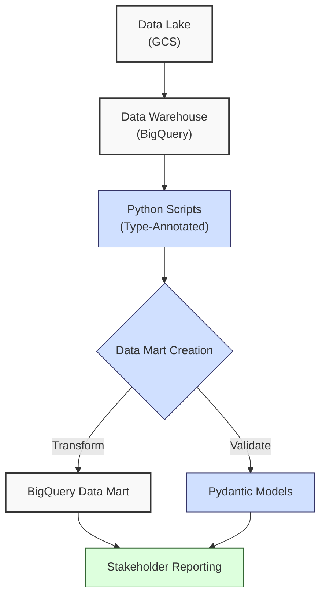
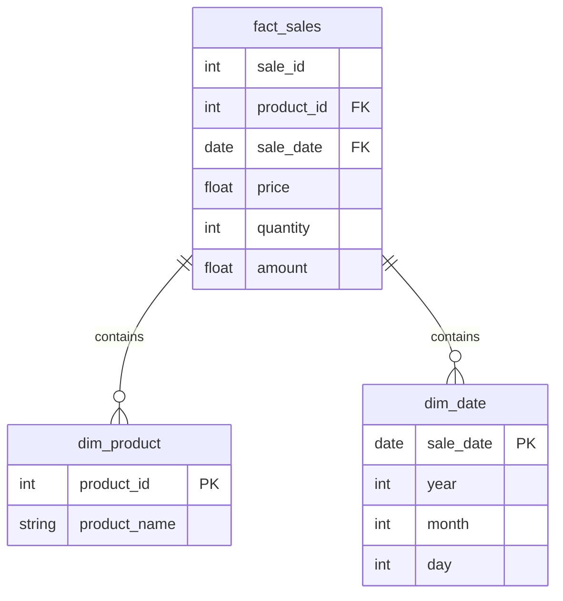
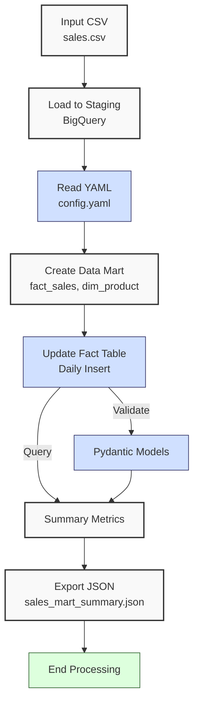

**Complexity: Moderate (M)**

## 32.0 Introduction: Why This Matters for Data Engineering

In data engineering, **data marts** are specialized subsets of **data warehouses**, designed to serve specific business needs with optimized, analytics-ready data. For Hijra Group’s Sharia-compliant fintech analytics, **data marts** enable stakeholders to access curated sales data for reporting and decision-making, such as tracking Halal product performance. This **data mart** enables real-time sales analytics, feeding into FastAPI dashboards (Chapter 53) and capstone projects (Chapters 67–71) for end-to-end fintech solutions. BigQuery, Google Cloud’s serverless **data warehouse**, supports **data marts** with its columnar storage and SQL interface, processing terabytes of data efficiently (e.g., ~1TB scanned in seconds with partitioning). This chapter builds on **data lake** (Chapter 31) and **data warehouse** (Chapter 28) concepts, focusing on creating **data marts** in BigQuery with type-annotated Python, ensuring data freshness and performance.

This chapter leverages skills from prior chapters:

- **Chapter 26**: Python and BigQuery integration for programmatic data loading.
- **Chapter 27**: Advanced querying with window functions and CTEs for analytics.
- **Chapter 28**: **Data warehouse** design with star schemas.
- **Chapter 29**: BigQuery optimization for cost and performance.

It avoids advanced concepts like Kubernetes (Chapter 61) or Airflow orchestration (Chapter 56), focusing on type-safe data modeling, querying, and validation. All Python code includes type annotations verified by Pyright (introduced in Chapter 7) and is tested with `pytest` (introduced in Chapter 9), using **4-space indentation** per PEP 8, preferring spaces over tabs to avoid `IndentationError`.

### Data Engineering Workflow Context

This diagram illustrates how **data marts** fit into Hijra Group’s analytics pipeline:



### Building On and Preparing For

- **Building On**:
  - **Chapter 25–30**: BigQuery fundamentals, querying, and optimization for **data warehouse** operations.
  - **Chapter 31**: **Data lake** management for sourcing raw data.
  - **Chapter 13, 17, 23**: Type-safe database integration with Pydantic and YAML configs.
  - **Chapter 7–9**: Type annotations and testing for robust code.
- **Preparing For**:
  - **Chapter 33**: Exporting **data mart** results to Google Sheets for stakeholder reporting.
  - **Chapter 51–52**: Visualizing **data mart** data with BI tools and web frameworks (Django/FastAPI).
  - **Chapter 54**: Transforming **data marts** with dbt for pipeline orchestration.

### What You’ll Learn

This chapter covers:

1. **Data Mart Concepts**: Purpose, structure, and benefits in BigQuery.
2. **Type-Safe Data Loading**: Loading sales data with `google-cloud-bigquery` and Pydantic.
3. **Data Mart Design**: Creating optimized tables with star schemas.
4. **Query Optimization**: Ensuring data freshness and performance.
5. **Testing**: Validating **data mart** integrity with `pytest`.
6. **Visualization**: Generating summary metrics for reporting.

By the end, you’ll build a **data mart** for sales analytics, processing `data/sales.csv` into a BigQuery **data mart**, validated with Pydantic, and tested with `pytest`, all with 4-space indentation per PEP 8. The micro-project ensures data freshness (e.g., daily updates) and performance, aligning with Hijra Group’s need for real-time analytics.

**Follow-Along Tips**:

- Create `de-onboarding/data/` and populate with `sales.csv` and `config.yaml` per Appendix 1.
- Install libraries: `pip install google-cloud-bigquery pydantic pyyaml pytest pandas`.
- Set up Google Cloud SDK and authenticate: `gcloud auth application-default login`.
- Configure editor for **4-space indentation** per PEP 8 (VS Code: “Editor: Tab Size” = 4, “Editor: Insert Spaces” = true, “Editor: Detect Indentation” = false).
- Use print statements (e.g., `print(dataset_id)`) to debug BigQuery operations.
- Verify file paths with `ls data/` (Unix/macOS) or `dir data\` (Windows).
- Use UTF-8 encoding for all files to avoid `UnicodeDecodeError`.
- Run `python -tt script.py` to detect tab/space mixing.

## 32.1 Data Mart Concepts

A **data mart** is a curated subset of a **data warehouse**, optimized for specific business units (e.g., sales analytics). In BigQuery, **data marts** are tables or views with star schemas, leveraging columnar storage for fast queries (O(n) scan time, reduced with partitioning). For 1 million sales records, a **data mart** uses ~24MB (3 numeric columns), with queries scanning ~10MB/s on BigQuery’s shared infrastructure.

### 32.1.1 Purpose and Structure

- **Purpose**: Deliver analytics-ready data for reporting (e.g., Halal product sales trends). For Hijra Group, **data marts** reduce query latency to seconds, enabling real-time analytics for daily sales decisions, such as adjusting Halal product inventory.
- **Structure**: Star schema with a fact table (e.g., sales transactions) and dimension tables (e.g., products, dates).
- **Benefits**: Faster queries, simplified access, and data freshness (e.g., daily updates).

**Example Star Schema**:



### 32.1.2 BigQuery Implementation

- **Tables**: Create fact and dimension tables using `google-cloud-bigquery`.
- **Partitioning**: Use `sale_date` for daily updates (O(1) access for recent data).
- **Data Freshness**: Schedule updates with SQL or Python to ensure current data.

**Performance Considerations**:

- **Time Complexity**: O(n) for table creation and querying n rows.
- **Space Complexity**: O(n) for n rows (~24MB for 1M rows with numeric types).
- **Implication**: **Data marts** enable efficient analytics for Hijra Group’s stakeholders.

## 32.2 Type-Safe Data Loading

Load data into BigQuery using `google-cloud-bigquery` with type-annotated Python and Pydantic for validation.

```python
# File: de-onboarding/load_bigquery.py
from typing import Dict, Any
from google.cloud import bigquery
import pandas as pd
import pydantic

# Define Pydantic model for sales data
class SaleModel(pydantic.BaseModel):
    product: str
    price: float
    quantity: int

# Load data to BigQuery
def load_to_bigquery(csv_path: str, dataset_id: str, table_id: str) -> int:
    """Load CSV to BigQuery with type validation."""
    client = bigquery.Client()  # Initialize BigQuery client
    print(f"Loading data to {dataset_id}.{table_id}")  # Debug

    # Read CSV
    df = pd.read_csv(csv_path)
    print("Initial DataFrame:", df.head())  # Debug

    # Validate with Pydantic
    valid_rows = []
    for _, row in df.iterrows():
        try:
            sale = SaleModel(
                product=str(row["product"]),
                price=float(row["price"]),
                quantity=int(row["quantity"])
            )
            valid_rows.append(sale.dict())
        except (pydantic.ValidationError, ValueError) as e:
            print(f"Invalid row: {row}, Error: {e}")  # Log invalid

    if not valid_rows:
        print("No valid data to load")  # Log empty
        return 0

    # Convert to DataFrame
    valid_df = pd.DataFrame(valid_rows)

    # Define table schema
    schema = [
        bigquery.SchemaField("product", "STRING"),
        bigquery.SchemaField("price", "FLOAT"),
        bigquery.SchemaField("quantity", "INTEGER")
    ]

    # Configure job
    table_ref = f"{dataset_id}.{table_id}"
    job_config = bigquery.LoadJobConfig(
        schema=schema,
        write_disposition="WRITE_TRUNCATE"
    )

    # Load data
    job = client.load_table_from_dataframe(valid_df, table_ref, job_config=job_config)
    job.result()  # Wait for job completion

    print(f"Loaded {len(valid_rows)} rows to {table_ref}")  # Confirm
    return len(valid_rows)
```

**Follow-Along Instructions**:

1. Ensure `data/sales.csv` exists per Appendix 1.
2. Install libraries: `pip install google-cloud-bigquery pydantic pandas`.
3. Authenticate: `gcloud auth application-default login`.
4. Save as `de-onboarding/load_bigquery.py`.
5. Configure editor for 4-space indentation per PEP 8.
6. Run: `python load_bigquery.py`.
7. **Common Errors**:
   - **GoogleCloudError**: Verify credentials and project ID. Print `client.project`.
   - **FileNotFoundError**: Ensure `csv_path` is correct. Print `csv_path`.
   - **IndentationError**: Use 4 spaces (not tabs). Run `python -tt load_bigquery.py`.

**Key Points**:

- **Pydantic**: Ensures type safety for data loading.
- **Time Complexity**: O(n) for loading n rows.
- **Space Complexity**: O(n) for DataFrame in memory.
- **Implication**: Validates sales data for **data mart** integrity.

## 32.3 Data Mart Design

Design a **data mart** with a star schema, creating fact and dimension tables.

```python
# File: de-onboarding/create_datamart.py
from typing import Dict, Any
from google.cloud import bigquery
import yaml

def create_datamart(dataset_id: str, fact_table: str, dim_table: str) -> None:
    """Create data mart tables in BigQuery."""
    client = bigquery.Client()
    print(f"Creating data mart in {dataset_id}")  # Debug

    # Check if dataset exists
    dataset_ref = client.dataset(dataset_id)
    datasets = [ds.dataset_id for ds in client.list_datasets()]
    if dataset_id not in datasets:
        dataset = bigquery.Dataset(dataset_ref)
        client.create_dataset(dataset)
        print(f"Created dataset {dataset_id}")  # Confirm

    # Create fact table
    fact_schema = [
        bigquery.SchemaField("sale_id", "INTEGER"),
        bigquery.SchemaField("product_id", "INTEGER"),
        bigquery.SchemaField("sale_date", "DATE"),
        bigquery.SchemaField("price", "FLOAT"),
        bigquery.SchemaField("quantity", "INTEGER"),
        bigquery.SchemaField("amount", "FLOAT")
    ]
    fact_table_ref = f"{dataset_id}.{fact_table}"
    fact_table_obj = bigquery.Table(fact_table_ref, schema=fact_schema)
    fact_table_obj.time_partitioning = bigquery.TimePartitioning(field="sale_date")
    client.create_table(fact_table_obj, exists_ok=True)
    print(f"Created fact table {fact_table_ref}")  # Confirm

    # Create dimension table
    dim_schema = [
        bigquery.SchemaField("product_id", "INTEGER"),
        bigquery.SchemaField("product_name", "STRING")
    ]
    dim_table_ref = f"{dataset_id}.{dim_table}"
    dim_table_obj = bigquery.Table(dim_table_ref, schema=dim_schema)
    client.create_table(dim_table_obj, exists_ok=True)
    print(f"Created dimension table {dim_table_ref}")  # Confirm
```

**Follow-Along Instructions**:

1. Save as `de-onboarding/create_datamart.py`.
2. Configure editor for 4-space indentation per PEP 8.
3. Run: `python create_datamart.py`.
4. **Common Errors**:
   - **NotFound**: Ensure project ID is correct. Print `client.project`.
   - **IndentationError**: Use 4 spaces (not tabs). Run `python -tt create_datamart.py`.

**Key Points**:

- **Star Schema**: Fact table links to dimension tables via keys.
- **Partitioning**: Improves query performance for time-based data.
- **Time Complexity**: O(1) for table creation.
- **Space Complexity**: O(1) for table metadata.

## 32.4 Query Optimization and Data Freshness

Optimize queries and ensure data freshness with scheduled updates.

**Note**: This chapter manually updates the data mart for learning purposes. Chapter 55 introduces APScheduler for scheduling, and Chapter 56 uses Airflow for production-grade orchestration.

**Query Optimization Tip**: Use BigQuery’s query execution plan in the Google Cloud Console (Query Plan tab) to visualize query stages and optimize performance. See [BigQuery Query Plan Documentation](https://cloud.google.com/bigquery/docs/query-plan-explanation). Chapter 50 explores advanced optimization techniques like clustering.

```python
# File: de-onboarding/update_datamart.py
from typing import Dict, Any
from google.cloud import bigquery
import datetime

def update_datamart(dataset_id: str, fact_table: str, source_table: str) -> int:
    """Update data mart with fresh data."""
    client = bigquery.Client()
    today = datetime.date.today().strftime("%Y-%m-%d")
    print(f"Updating data mart {dataset_id}.{fact_table} for {today}")  # Debug

    # SQL to update fact table
    query = f"""
    INSERT INTO `{dataset_id}.{fact_table}` (sale_id, product_id, sale_date, price, quantity, amount)
    SELECT
        ROW_NUMBER() OVER () AS sale_id,
        CASE
            WHEN product = 'Halal Laptop' THEN 1
            WHEN product = 'Halal Mouse' THEN 2
            WHEN product = 'Halal Keyboard' THEN 3
            ELSE 0
        END AS product_id,
        '{today}' AS sale_date,
        price,
        quantity,
        price * quantity AS amount
    FROM `{dataset_id}.{source_table}`
    WHERE product LIKE 'Halal%'
    """

    job = client.query(query)
    job.result()  # Wait for completion
    rows = job.num_rows
    print(f"Inserted {rows} rows into {fact_table}")  # Confirm
    return rows
```

**Follow-Along Instructions**:

1. Save as `de-onboarding/update_datamart.py`.
2. Configure editor for 4-space indentation per PEP 8.
3. Run: `python update_datamart.py`.
4. **Common Errors**:
   - **QueryError**: Validate SQL syntax. Print `query`.
   - **IndentationError**: Use 4 spaces (not tabs). Run `python -tt update_datamart.py`.

**Key Points**:

- **Data Freshness**: Daily inserts ensure current data.
- **Optimization**: Filters reduce scanned data.
- **Time Complexity**: O(n) for querying n rows.
- **Space Complexity**: O(n) for inserted rows.

## 32.5 Micro-Project: Sales Data Mart

### Project Requirements

Build a BigQuery **data mart** for sales analytics, processing `data/sales.csv` into a star schema with type-annotated Python, validated with Pydantic, and tested with `pytest`. The **data mart** supports Hijra Group’s need for daily sales reports, ensuring Sharia-compliant product analytics.

- Load `data/sales.csv` into a staging table using `google-cloud-bigquery`.
- Read `data/config.yaml` for validation rules.
- Create a **data mart** with a fact table (`fact_sales`) and dimension table (`dim_product`).
- Update the fact table daily with fresh data, ensuring Halal products.
- Export summary metrics to `data/sales_mart_summary.json`.
- Test data integrity with `pytest`.
- Use 4-space indentation per PEP 8, preferring spaces over tabs.

### Sample Input Files

`data/sales.csv` (from Appendix 1):

```csv
product,price,quantity
Halal Laptop,999.99,2
Halal Mouse,24.99,10
Halal Keyboard,49.99,5
,29.99,3
Monitor,invalid,2
Headphones,5.00,150
```

`data/config.yaml` (from Appendix 1):

```yaml
min_price: 10.0
max_quantity: 100
required_fields:
  - product
  - price
  - quantity
product_prefix: 'Halal'
max_decimals: 2
```

### Data Processing Flow



### Acceptance Criteria

- **Go Criteria**:
  - Loads `sales.csv` into a BigQuery staging table.
  - Validates data with Pydantic and config rules.
  - Creates **data mart** with fact and dimension tables.
  - Updates fact table with daily Halal sales.
  - Exports metrics to `data/sales_mart_summary.json`.
  - Passes `pytest` tests for data integrity.
  - Uses 4-space indentation per PEP 8.
- **No-Go Criteria**:
  - Fails to load or validate data.
  - Incorrect table schema or updates.
  - Missing JSON export.
  - Fails tests or uses inconsistent indentation.

### Common Pitfalls to Avoid

1. **Authentication Issues**:
   - **Problem**: `GoogleCloudError` due to missing credentials.
   - **Solution**: Run `gcloud auth application-default login`. Print `client.project`.
2. **Schema Mismatches**:
   - **Problem**: Column type errors in BigQuery.
   - **Solution**: Print `schema` to verify fields.
3. **Pydantic Validation**:
   - **Problem**: Invalid rows cause failures.
   - **Solution**: Print `row` and `e` in validation loop.
4. **Query Errors**:
   - **Problem**: SQL syntax errors.
   - **Solution**: Print `query` to debug.
5. **IndentationError**:
   - **Problem**: Mixed spaces/tabs.
   - **Solution**: Use 4 spaces per PEP 8. Run `python -tt sales_mart.py`.
6. **Memory Constraints**:
   - **Problem**: Loading large CSVs into memory may cause `MemoryError`.
   - **Solution**: Chapter 40 introduces chunked processing with `pd.read_csv(chunksize=...)`. Print `len(df)` to check input size.
7. **BigQuery Costs**:
   - **Problem**: Unoptimized queries may increase costs.
   - **Solution**: Use `client.query(...).total_bytes_processed` to estimate scanned data. Chapter 50 covers advanced cost optimization. Example:
     ```python
     query_job = client.query(query)
     bytes_processed = query_job.total_bytes_processed / (1024 ** 3)  # Convert to GB
     print(f"Query scanned {bytes_processed:.2f} GB")
     ```

### How This Differs from Production

In production, this solution would include:

- **Orchestration**: Airflow for scheduling (Chapter 56).
- **Security**: Encrypted connections and PII masking (Chapter 65).
- **Monitoring**: Observability with Grafana (Chapter 66).
- **Scalability**: Partitioning and clustering for large datasets (Chapter 50).
- **Dynamic Mapping**: Query `dim_product` for product IDs to handle new products, explored in Chapter 54 with dbt transformations.

### Implementation

```python
# File: de-onboarding/sales_mart.py
from typing import Dict, Any, List
from google.cloud import bigquery
import pandas as pd
import pydantic
import yaml
import json
import datetime
import os

# Pydantic model for sales data
class SaleModel(pydantic.BaseModel):
    product: str
    price: float
    quantity: int

# Read YAML configuration
def read_config(config_path: str) -> Dict[str, Any]:
    """Read YAML configuration."""
    print(f"Opening config: {config_path}")  # Debug
    with open(config_path, "r") as file:
        config = yaml.safe_load(file)
    print(f"Loaded config: {config}")  # Debug
    return config

# Load CSV to BigQuery staging table
def load_to_staging(csv_path: str, dataset_id: str, table_id: str) -> int:
    """Load CSV to BigQuery staging table."""
    client = bigquery.Client()
    print(f"Loading to {dataset_id}.{table_id}")  # Debug

    df = pd.read_csv(csv_path)
    valid_rows: List[Dict[str, Any]] = []

    # Validate with Pydantic
    for _, row in df.iterrows():
        try:
            sale = SaleModel(
                product=str(row["product"]) if pd.notna(row["product"]) else "",
                price=float(row["price"]) if pd.notna(row["price"]) else 0.0,
                quantity=int(row["quantity"]) if pd.notna(row["quantity"]) else 0
            )
            valid_rows.append(sale.dict())
        except (pydantic.ValidationError, ValueError) as e:
            print(f"Invalid row: {row}, Error: {e}")  # Log

    if not valid_rows:
        print("No valid data")  # Log
        return 0

    valid_df = pd.DataFrame(valid_rows)
    schema = [
        bigquery.SchemaField("product", "STRING"),
        bigquery.SchemaField("price", "FLOAT"),
        bigquery.SchemaField("quantity", "INTEGER")
    ]

    table_ref = f"{dataset_id}.{table_id}"
    job_config = bigquery.LoadJobConfig(
        schema=schema,
        write_disposition="WRITE_TRUNCATE"
    )

    job = client.load_table_from_dataframe(valid_df, table_ref, job_config=job_config)
    job.result()
    print(f"Loaded {len(valid_rows)} rows")  # Confirm
    return len(valid_rows)

# Create data mart tables
def create_datamart(dataset_id: str, fact_table: str, dim_table: str) -> None:
    """Create data mart tables."""
    client = bigquery.Client()
    print(f"Creating data mart in {dataset_id}")  # Debug

    dataset_ref = client.dataset(dataset_id)
    datasets = [ds.dataset_id for ds in client.list_datasets()]
    if dataset_id not in datasets:
        dataset = bigquery.Dataset(dataset_ref)
        client.create_dataset(dataset)
        print(f"Created dataset {dataset_id}")  # Confirm

    fact_schema = [
        bigquery.SchemaField("sale_id", "INTEGER"),
        bigquery.SchemaField("product_id", "INTEGER"),
        bigquery.SchemaField("sale_date", "DATE"),
        bigquery.SchemaField("price", "FLOAT"),
        bigquery.SchemaField("quantity", "INTEGER"),
        bigquery.SchemaField("amount", "FLOAT")
    ]
    fact_table_ref = f"{dataset_id}.{fact_table}"
    fact_table_obj = bigquery.Table(fact_table_ref, schema=fact_schema)
    fact_table_obj.time_partitioning = bigquery.TimePartitioning(field="sale_date")
    client.create_table(fact_table_obj, exists_ok=True)
    print(f"Created fact table {fact_table_ref}")  # Confirm

    dim_schema = [
        bigquery.SchemaField("product_id", "INTEGER"),
        bigquery.SchemaField("product_name", "STRING")
    ]
    dim_table_ref = f"{dataset_id}.{dim_table}"
    dim_table_obj = bigquery.Table(dim_table_ref, schema=dim_schema)
    client.create_table(dim_table_obj, exists_ok=True)
    print(f"Created dimension table {dim_table_ref}")  # Confirm

    # Populate dimension table
    query = f"""
    INSERT INTO `{dataset_id}.{dim_table}` (product_id, product_name)
    VALUES
        (1, 'Halal Laptop'),
        (2, 'Halal Mouse'),
        (3, 'Halal Keyboard')
    """
    client.query(query).result()
    print(f"Populated dimension table {dim_table_ref}")  # Confirm

# Update data mart
def update_datamart(dataset_id: str, fact_table: str, source_table: str, config: Dict[str, Any]) -> int:
    """Update data mart with fresh data."""
    client = bigquery.Client()
    today = datetime.date.today().strftime("%Y-%m-%d")
    print(f"Updating {dataset_id}.{fact_table} for {today}")  # Debug

    query = f"""
    INSERT INTO `{dataset_id}.{fact_table}` (sale_id, product_id, sale_date, price, quantity, amount)
    SELECT
        ROW_NUMBER() OVER () AS sale_id,
        CASE
            WHEN product = 'Halal Laptop' THEN 1
            WHEN product = 'Halal Mouse' THEN 2
            WHEN product = 'Halal Keyboard' THEN 3
            ELSE 0
        END AS product_id,
        '{today}' AS sale_date,
        price,
        quantity,
        price * quantity AS amount
    FROM `{dataset_id}.{source_table}`
    WHERE product LIKE '{config["product_prefix"]}%'
        AND price >= {config["min_price"]}
        AND quantity <= {config["max_quantity"]}
        AND ROUND(price, {config["max_decimals"]}) = price
    """

    job = client.query(query)
    job.result()
    rows = job.num_rows
    print(f"Inserted {rows} rows into {fact_table}")  # Confirm
    return rows

# Generate summary metrics
def generate_summary(dataset_id: str, fact_table: str, dim_table: str) -> Dict[str, Any]:
    """Generate summary metrics."""
    client = bigquery.Client()
    query = f"""
    SELECT
        d.product_name,
        SUM(f.amount) as total_sales,
        SUM(f.quantity) as total_quantity
    FROM `{dataset_id}.{fact_table}` f
    JOIN `{dataset_id}.{dim_table}` d ON f.product_id = d.product_id
    GROUP BY d.product_name
    """

    df = client.query(query).to_dataframe()
    print("Summary DataFrame:", df)  # Debug

    summary = {
        "total_sales": float(df["total_sales"].sum()),
        "products": df[["product_name", "total_sales", "total_quantity"]].to_dict(orient="records")
    }
    return summary

# Export summary
def export_summary(summary: Dict[str, Any], json_path: str) -> None:
    """Export summary to JSON."""
    print(f"Writing to: {json_path}")  # Debug
    with open(json_path, "w") as file:
        json.dump(summary, file, indent=2)
    print(f"Exported to {json_path}")  # Confirm

# Main function
def main() -> None:
    """Main function to create and update data mart."""
    csv_path = "data/sales.csv"
    config_path = "data/config.yaml"
    json_path = "data/sales_mart_summary.json"
    dataset_id = "sales_dataset"  # Replace with your Google Cloud project ID (e.g., 'my-project-123')
    staging_table = "staging_sales"
    fact_table = "fact_sales"
    dim_table = "dim_product"

    config = read_config(config_path)
    load_to_staging(csv_path, dataset_id, staging_table)
    create_datamart(dataset_id, fact_table, dim_table)
    update_datamart(dataset_id, fact_table, staging_table, config)
    summary = generate_summary(dataset_id, fact_table, dim_table)
    export_summary(summary, json_path)
```

```python
# File: de-onboarding/test_sales_mart.py
import pytest
from google.cloud import bigquery
from sales_mart import load_to_staging, create_datamart, update_datamart, generate_summary

def test_load_to_staging():
    dataset_id = "test_dataset"
    table_id = "test_staging"
    count = load_to_staging("data/sales.csv", dataset_id, table_id)
    assert count >= 0
    client = bigquery.Client()
    table = client.get_table(f"{dataset_id}.{table_id}")
    assert table.num_rows == count

def test_create_datamart():
    dataset_id = "test_dataset"
    fact_table = "test_fact"
    dim_table = "test_dim"
    create_datamart(dataset_id, fact_table, dim_table)
    client = bigquery.Client()
    assert client.get_table(f"{dataset_id}.{fact_table}")
    assert client.get_table(f"{dataset_id}.{dim_table}")

def test_update_datamart():
    dataset_id = "test_dataset"
    fact_table = "test_fact"
    source_table = "test_staging"
    config = {
        "product_prefix": "Halal",
        "min_price": 10.0,
        "max_quantity": 100,
        "max_decimals": 2
    }
    rows = update_datamart(dataset_id, fact_table, source_table, config)
    assert rows >= 0
```

### How to Run and Test

1. **Setup**:

   - **Google Cloud Configuration**:
     - Create a Google Cloud project: Visit [console.cloud.google.com](https://console.cloud.google.com) and create a new project.
     - Enable BigQuery API: Navigate to APIs & Services > Library, search for BigQuery, and enable.
     - **Free Tier Option**: Use BigQuery’s sandbox mode for free experimentation without a billing account ([cloud.google.com/bigquery/docs/sandbox](https://cloud.google.com/bigquery/docs/sandbox)). Note that sandbox mode limits features like streaming inserts and job scheduling, which are covered in Chapters 56–66 with a billed project.
     - Set project ID: Replace `dataset_id = "sales_dataset"` in `sales_mart.py` with your project ID (e.g., `my-project-123`). The `dataset_id` is a placeholder; find your project ID in the Google Cloud Console under Project Info.
   - Create `de-onboarding/data/` directory and save `sales.csv`, `config.yaml` per Appendix 1.
   - Install libraries: `pip install google-cloud-bigquery pydantic pyyaml pytest pandas`.
   - Authenticate: Run `gcloud auth application-default login`.
   - Create virtual environment: `python -m venv venv`, activate (Windows: `venv\Scripts\activate`, Unix: `source venv/bin/activate`).
   - Verify Python 3.10+: `python --version`.
   - Configure editor for 4-space indentation per PEP 8 (VS Code: “Editor: Tab Size” = 4, “Editor: Insert Spaces” = true, “Editor: Detect Indentation” = false).
   - Save `sales_mart.py` and `test_sales_mart.py` in `de-onboarding/`.
   - **Troubleshooting**:
     - If `FileNotFoundError` or `PermissionError` occurs when saving `sales_mart_summary.json`, check write permissions with `ls -l data/` (Unix/macOS) or `dir data\` (Windows).
     - If `GoogleCloudError`, verify project ID and credentials with `print(client.project)`.
     - If `IndentationError`, use 4 spaces (not tabs). Run `python -tt sales_mart.py`.
     - If `UnicodeDecodeError`, ensure UTF-8 encoding for all files.
     - If `yaml.YAMLError`, print `print(open(config_path).read())` to inspect `config.yaml`.

2. **Run**:

   - Open terminal in `de-onboarding/`.
   - Run: `python sales_mart.py`.
   - Outputs: `data/sales_mart_summary.json`, BigQuery tables (`staging_sales`, `fact_sales`, `dim_product`).

3. **Test**:
   - Run: `pytest test_sales_mart.py -v`.
   - Verify tests pass, checking table creation, data loading, and row counts.
   - **Test Scenarios**:
     - **Valid Data**: Verify `sales_mart_summary.json` shows `total_sales: 2499.83` and correct product metrics.
     - **Invalid Data**: The Pydantic validation in `load_to_staging` filters out invalid rows (e.g., missing product, non-numeric price), ensuring only Halal products are loaded.
     - **Empty Dataset**: If no valid rows are loaded, `load_to_staging` returns 0, and `update_datamart` inserts no rows, producing an empty summary.

### Expected Outputs

`data/sales_mart_summary.json`:

```json
{
  "total_sales": 2499.83,
  "products": [
    {
      "product_name": "Halal Laptop",
      "total_sales": 1999.98,
      "total_quantity": 2
    },
    {
      "product_name": "Halal Mouse",
      "total_sales": 249.9,
      "total_quantity": 10
    },
    {
      "product_name": "Halal Keyboard",
      "total_sales": 249.95,
      "total_quantity": 5
    }
  ]
}
```

**Console Output** (abridged):

```
Opening config: data/config.yaml
Loaded config: {'min_price': 10.0, 'max_quantity': 100, 'required_fields': ['product', 'price', 'quantity'], 'product_prefix': 'Halal', 'max_decimals': 2}
Loading to sales_dataset.staging_sales
Loaded 3 rows
Creating data mart in sales_dataset
Created dataset sales_dataset
Created fact table sales_dataset.fact_sales
Created dimension table sales_dataset.dim_product
Populated dimension table sales_dataset.dim_product
Updating sales_dataset.fact_sales for 2025-04-24
Inserted 3 rows into fact_sales
Summary DataFrame: ...
Exported to data/sales_mart_summary.json
```

## 32.6 Practice Exercises

### Exercise 1: Load and Validate Sales Data

Write a function to load `data/sales.csv` into a BigQuery staging table with Pydantic validation.

**Expected Output**: Number of loaded rows (e.g., 3).

**Follow-Along Instructions**:

1. Save as `de-onboarding/ex1_load.py`.
2. Configure editor for 4-space indentation per PEP 8.
3. Run: `python ex1_load.py`.
4. Test: Add `print(load_sales("data/sales.csv", "test_dataset", "test_staging"))`.

### Exercise 2: Create Data Mart Schema

Write a function to create a **data mart** with fact and dimension tables.

**Expected Output**: Console confirmation of table creation.

**Follow-Along Instructions**:

1. Save as `de-onboarding/ex2_schema.py`.
2. Configure editor for 4-space indentation per PEP 8.
3. Run: `python ex2_schema.py`.
4. Test: Verify tables exist in BigQuery console.

### Exercise 3: Update Data Mart

Write a function to update the fact table with daily sales data, filtering Halal products.

**Expected Output**: Number of inserted rows.

**Follow-Along Instructions**:

1. Save as `de-onboarding/ex3_update.py`.
2. Configure editor for 4-space indentation per PEP 8.
3. Run: `python ex3_update.py`.
4. Test: Add `print(update_sales("test_dataset", "test_fact", "test_staging", config))`.

### Exercise 4: Generate Summary Metrics

Write a function to generate summary metrics from the **data mart**.

**Expected Output**: Dictionary with total sales and product metrics.

**Follow-Along Instructions**:

1. Save as `de-onboarding/ex4_summary.py`.
2. Configure editor for 4-space indentation per PEP 8.
3. Run: `python ex4_summary.py`.
4. Test: Add `print(get_summary("test_dataset", "test_fact", "test_dim"))`.

### Exercise 5: Debug a Query Bug

Fix a buggy SQL query that fails to filter Halal products correctly.

**Buggy Code**:

```python
query = f"""
INSERT INTO `{dataset_id}.{fact_table}` (sale_id, product_id, sale_date, price, quantity, amount)
SELECT
    ROW_NUMBER() OVER () AS sale_id,
    CASE
        WHEN product = 'Halal Laptop' THEN 1
        ELSE 0
    END AS product_id,
    '{today}' AS sale_date,
    price,
    quantity,
    price * quantity AS amount
FROM `{dataset_id}.{source_table}`
"""
```

**Expected Output**: Correctly inserts all Halal products.

**Sample Error**: `BigQuery: No rows inserted; missing Halal Mouse and Keyboard due to incomplete CASE statement.`

**Follow-Along Instructions**:

1. Save as `de-onboarding/ex5_debug.py`.
2. Configure editor for 4-space indentation per PEP 8.
3. Run: `python ex5_debug.py` to see incorrect output.
4. Fix and re-run.
5. Test: Verify all Halal products are inserted.

### Exercise 6: Conceptual Analysis of Data Marts

Explain the benefits of **data marts** over **data warehouses** and **data lakes** for Hijra Group’s sales analytics, focusing on how they support Sharia-compliant reporting (e.g., filtering Halal products) and real-time inventory decisions. Save your answer in `de-onboarding/datamart_concepts.txt`.

**Expected Output** (in `datamart_concepts.txt`):

```
Data marts are optimized for specific business units (e.g., sales), offering faster queries and simpler access than data warehouses, which store all enterprise data. Unlike data lakes, which hold raw data, data marts provide curated, analytics-ready data. For Hijra Group, data marts enable rapid filtering of Halal products, ensuring Sharia compliance, and support real-time inventory adjustments by reducing query latency.
```

**Follow-Along Instructions**:

1. Create `de-onboarding/datamart_concepts.txt`.
2. Write your explanation.
3. Verify with `cat de-onboarding/datamart_concepts.txt` (Unix/macOS) or `type de-onboarding\datamart_concepts.txt` (Windows).

### Exercise 7: Debug a Pydantic Validation Bug

Debug a buggy `load_sales` function that fails to handle NaN values correctly, causing Pydantic validation errors.

**Buggy Code**:

```python
def load_sales(csv_path: str, dataset_id: str, table_id: str) -> int:
    client = bigquery.Client()
    df = pd.read_csv(csv_path)
    valid_rows = []
    for _, row in df.iterrows():
        try:
            sale = SaleModel(
                product=row["product"],
                price=row["price"],
                quantity=row["quantity"]
            )
            valid_rows.append(sale.dict())
        except (pydantic.ValidationError, ValueError) as e:
            print(f"Invalid row: {row}, Error: {e}")
    if not valid_rows:
        return 0
    valid_df = pd.DataFrame(valid_rows)
    schema = [
        bigquery.SchemaField("product", "STRING"),
        bigquery.SchemaField("price", "FLOAT"),
        bigquery.SchemaField("quantity", "INTEGER")
    ]
    table_ref = f"{dataset_id}.{table_id}"
    job_config = bigquery.LoadJobConfig(
        schema=schema,
        write_disposition="WRITE_TRUNCATE"
    )
    job = client.load_table_from_dataframe(valid_df, table_ref, job_config=job_config)
    job.result()
    return len(valid_rows)
```

**Expected Output**: Correctly loads 3 valid rows from `data/sales.csv`.

**Sample Error**: `pydantic.error_wrappers.ValidationError: value is not a valid float (field: price)`

**Debugging Tip**: Pydantic validation errors specify the field and type (e.g., `ValueError: invalid literal for float`). Print `e.errors()` in the exception block to see detailed error messages, helping identify issues like NaN values.

**Follow-Along Instructions**:

1. Save as `de-onboarding/ex7_pydantic_debug.py`.
2. Configure editor for 4-space indentation per PEP 8.
3. Run: `python ex7_pydantic_debug.py` to see validation errors.
4. Fix and re-run.
5. Test: Add `print(load_sales("data/sales.csv", "test_dataset", "test_staging"))`.

## 32.7 Exercise Solutions

### Solution to Exercise 1

```python
from google.cloud import bigquery
import pandas as pd
import pydantic

class SaleModel(pydantic.BaseModel):
    product: str
    price: float
    quantity: int

def load_sales(csv_path: str, dataset_id: str, table_id: str) -> int:
    client = bigquery.Client()
    df = pd.read_csv(csv_path)
    valid_rows = []
    for _, row in df.iterrows():
        try:
            sale = SaleModel(
                product=str(row["product"]) if pd.notna(row["product"]) else "",
                price=float(row["price"]) if pd.notna(row["price"]) else 0.0,
                quantity=int(row["quantity"]) if pd.notna(row["quantity"]) else 0
            )
            valid_rows.append(sale.dict())
        except (pydantic.ValidationError, ValueError) as e:
            print(f"Invalid row: {row}, Error: {e}")
    if not valid_rows:
        return 0
    valid_df = pd.DataFrame(valid_rows)
    schema = [
        bigquery.SchemaField("product", "STRING"),
        bigquery.SchemaField("price", "FLOAT"),
        bigquery.SchemaField("quantity", "INTEGER")
    ]
    table_ref = f"{dataset_id}.{table_id}"
    job_config = bigquery.LoadJobConfig(
        schema=schema,
        write_disposition="WRITE_TRUNCATE"
    )
    job = client.load_table_from_dataframe(valid_df, table_ref, job_config=job_config)
    job.result()
    return len(valid_rows)
```

### Solution to Exercise 2

```python
from google.cloud import bigquery

def create_schema(dataset_id: str, fact_table: str, dim_table: str) -> None:
    client = bigquery.Client()
    dataset_ref = client.dataset(dataset_id)
    datasets = [ds.dataset_id for ds in client.list_datasets()]
    if dataset_id not in datasets:
        dataset = bigquery.Dataset(dataset_ref)
        client.create_dataset(dataset)
    fact_schema = [
        bigquery.SchemaField("sale_id", "INTEGER"),
        bigquery.SchemaField("product_id", "INTEGER"),
        bigquery.SchemaField("sale_date", "DATE"),
        bigquery.SchemaField("price", "FLOAT"),
        bigquery.SchemaField("quantity", "INTEGER"),
        bigquery.SchemaField("amount", "FLOAT")
    ]
    fact_table_ref = f"{dataset_id}.{fact_table}"
    fact_table_obj = bigquery.Table(fact_table_ref, schema=fact_schema)
    fact_table_obj.time_partitioning = bigquery.TimePartitioning(field="sale_date")
    client.create_table(fact_table_obj, exists_ok=True)
    dim_schema = [
        bigquery.SchemaField("product_id", "INTEGER"),
        bigquery.SchemaField("product_name", "STRING")
    ]
    dim_table_ref = f"{dataset_id}.{dim_table}"
    dim_table_obj = bigquery.Table(dim_table_ref, schema=dim_schema)
    client.create_table(dim_table_obj, exists_ok=True)
    print(f"Created tables {fact_table_ref}, {dim_table_ref}")
```

### Solution to Exercise 3

```python
from google.cloud import bigquery
import datetime
from typing import Dict, Any

def update_sales(dataset_id: str, fact_table: str, source_table: str, config: Dict[str, Any]) -> int:
    client = bigquery.Client()
    today = datetime.date.today().strftime("%Y-%m-%d")
    query = f"""
    INSERT INTO `{dataset_id}.{fact_table}` (sale_id, product_id, sale_date, price, quantity, amount)
    SELECT
        ROW_NUMBER() OVER () AS sale_id,
        CASE
            WHEN product = 'Halal Laptop' THEN 1
            WHEN product = 'Halal Mouse' THEN 2
            WHEN product = 'Halal Keyboard' THEN 3
            ELSE 0
        END AS product_id,
        '{today}' AS sale_date,
        price,
        quantity,
        price * quantity AS amount
    FROM `{dataset_id}.{source_table}`
    WHERE product LIKE '{config["product_prefix"]}%'
    """
    job = client.query(query)
    job.result()
    return job.num_rows
```

### Solution to Exercise 4

```python
from google.cloud import bigquery
from typing import Dict, Any

def get_summary(dataset_id: str, fact_table: str, dim_table: str) -> Dict[str, Any]:
    client = bigquery.Client()
    query = f"""
    SELECT
        d.product_name,
        SUM(f.amount) as total_sales,
        SUM(f.quantity) as total_quantity
    FROM `{dataset_id}.{fact_table}` f
    JOIN `{dataset_id}.{dim_table}` d ON f.product_id = d.product_id
    GROUP BY d.product_name
    """
    df = client.query(query).to_dataframe()
    return {
        "total_sales": float(df["total_sales"].sum()),
        "products": df[["product_name", "total_sales", "total_quantity"]].to_dict(orient="records")
    }
```

### Solution to Exercise 5

```python
from google.cloud import bigquery
import datetime
from typing import Dict, Any

def update_sales_fixed(dataset_id: str, fact_table: str, source_table: str, config: Dict[str, Any]) -> int:
    client = bigquery.Client()
    today = datetime.date.today().strftime("%Y-%m-%d")
    query = f"""
    INSERT INTO `{dataset_id}.{fact_table}` (sale_id, product_id, sale_date, price, quantity, amount)
    SELECT
        ROW_NUMBER() OVER () AS sale_id,
        CASE
            WHEN product = 'Halal Laptop' THEN 1
            WHEN product = 'Halal Mouse' THEN 2
            WHEN product = 'Halal Keyboard' THEN 3
            ELSE 0
        END AS product_id,
        '{today}' AS sale_date,
        price,
        quantity,
        price * quantity AS amount
    FROM `{dataset_id}.{source_table}`
    WHERE product LIKE '{config["product_prefix"]}%'
    """
    job = client.query(query)
    job.result()
    return job.num_rows
```

**Explanation**:

- **Bug**: The query only mapped “Halal Laptop” to a product ID, ignoring other Halal products.
- **Fix**: Added CASE statements for all Halal products and a LIKE filter for the prefix.

### Solution to Exercise 6

```python
# File: de-onboarding/ex6_concepts.py
def write_concepts() -> None:
    """Write data mart concepts to file."""
    explanation = (
        "Data marts are optimized for specific business units (e.g., sales), offering faster queries and simpler access "
        "than data warehouses, which store all enterprise data. Unlike data lakes, which hold raw data, data marts provide "
        "curated, analytics-ready data. For Hijra Group, data marts enable rapid filtering of Halal products, ensuring Sharia "
        "compliance, and support real-time inventory adjustments by reducing query latency."
    )
    with open("de-onboarding/datamart_concepts.txt", "w") as file:
        file.write(explanation)
    print("Wrote concepts to de-onboarding/datamart_concepts.txt")

# Test
write_concepts()
```

**Output** (in `de-onboarding/datamart_concepts.txt`):

```
Data marts are optimized for specific business units (e.g., sales), offering faster queries and simpler access than data warehouses, which store all enterprise data. Unlike data lakes, which hold raw data, data marts provide curated, analytics-ready data. For Hijra Group, data marts enable rapid filtering of Halal products, ensuring Sharia compliance, and support real-time inventory adjustments by reducing query latency.
```

### Solution to Exercise 7

```python
from google.cloud import bigquery
import pandas as pd
import pydantic

class SaleModel(pydantic.BaseModel):
    product: str
    price: float
    quantity: int

def load_sales(csv_path: str, dataset_id: str, table_id: str) -> int:
    """Load CSV to BigQuery with type validation."""
    client = bigquery.Client()
    df = pd.read_csv(csv_path)
    valid_rows = []
    for _, row in df.iterrows():
        try:
            sale = SaleModel(
                product=str(row["product"]) if pd.notna(row["product"]) else "",
                price=float(row["price"]) if pd.notna(row["price"]) else 0.0,
                quantity=int(row["quantity"]) if pd.notna(row["quantity"]) else 0
            )
            valid_rows.append(sale.dict())
        except pydantic.ValidationError as e:
            print(f"Invalid row: {row}, Error: {e.errors()}")
        except ValueError as e:
            print(f"Invalid row: {row}, Error: {e}")
    if not valid_rows:
        return 0
    valid_df = pd.DataFrame(valid_rows)
    schema = [
        bigquery.SchemaField("product", "STRING"),
        bigquery.SchemaField("price", "FLOAT"),
        bigquery.SchemaField("quantity", "INTEGER")
    ]
    table_ref = f"{dataset_id}.{table_id}"
    job_config = bigquery.LoadJobConfig(
        schema=schema,
        write_disposition="WRITE_TRUNCATE"
    )
    job = client.load_table_from_dataframe(valid_df, table_ref, job_config=job_config)
    job.result()
    return len(valid_rows)
```

**Explanation**:

- **Bug**: The buggy code passed `row["product"]`, `row["price"]`, and `row["quantity"]` directly to `SaleModel`, causing validation errors for NaN values.
- **Fix**: Added `pd.notna` checks and default values (`""` for product, `0.0` for price, `0` for quantity) to handle missing or invalid data, ensuring only valid rows are processed. Printing `e.errors()` provides detailed Pydantic error messages.

## 32.8 Chapter Summary and Connection to Chapter 33

In this chapter, you’ve mastered:

- **Data Marts**: Curated subsets for analytics, using star schemas in BigQuery.
- **Type-Safe Loading**: Pydantic for validation, ensuring data integrity.
- **Optimization**: Partitioning and filtering for performance and freshness.
- **Testing**: `pytest` for data integrity, with 4-space indentation per PEP 8.

The micro-project built a sales **data mart**, processing `data/sales.csv` into a BigQuery star schema, validated with Pydantic, and tested with `pytest`, aligning with Hijra Group’s analytics needs. The modular functions prepare for orchestration in Chapter 56 (Airflow) and visualization in Chapter 51 (BI tools).

### Connection to Chapter 33

Chapter 33 introduces **BigQuery and Google Sheets Integration**, building on this chapter:

- **Data Export**: Exports **data mart** results to Sheets using `gspread`.
- **Visualization**: Enhances stakeholder reporting with Sheets charts.
- **Type Safety**: Continues using Pydantic for validation.
- **Fintech Context**: Supports real-time reporting for Hijra Group, maintaining PEP 8’s 4-space indentation.
