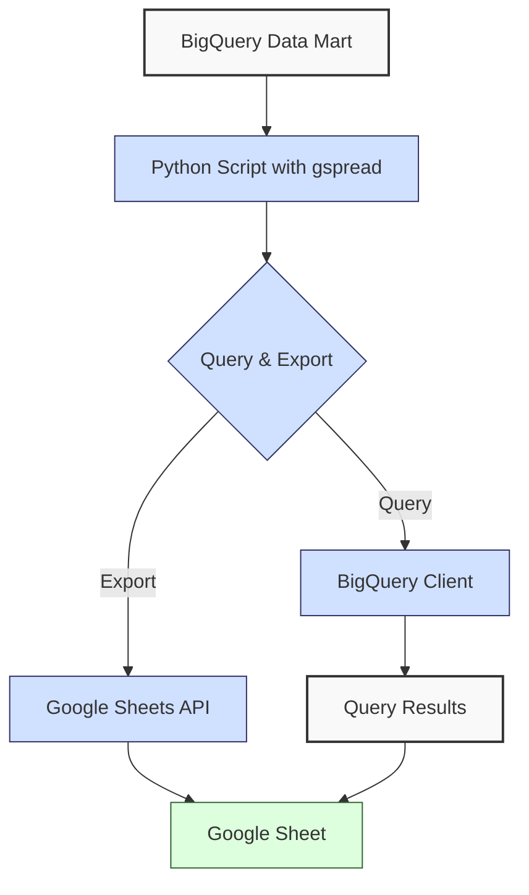
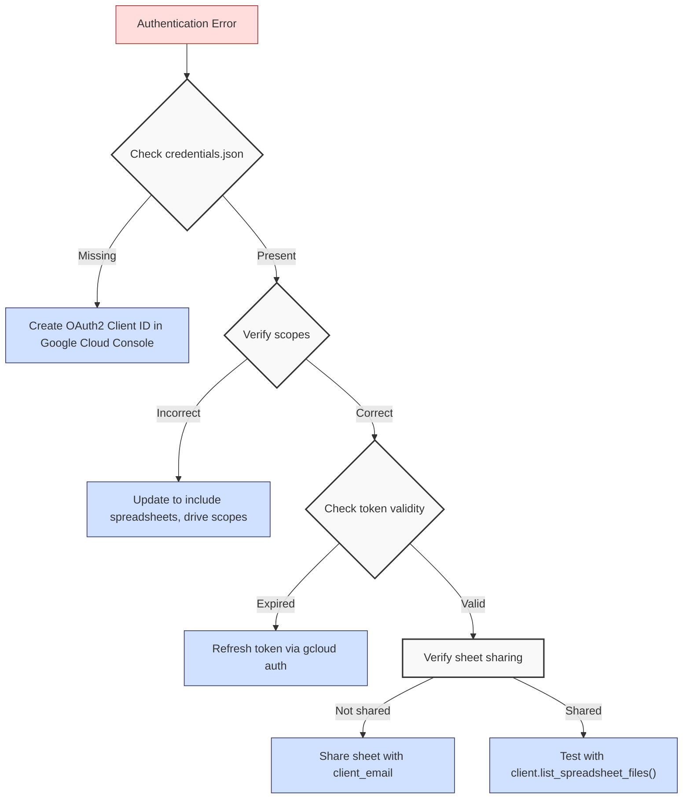
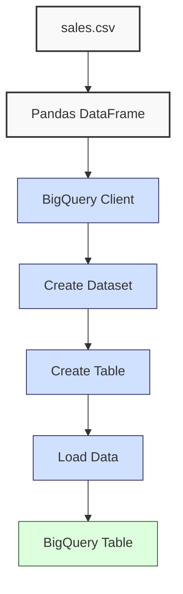
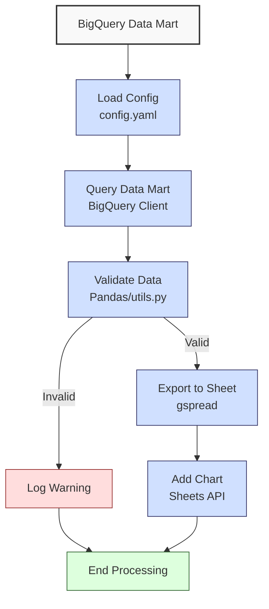

**Complexity: Moderate (M)**

## 33.0 Introduction: Why This Matters for Data Engineering

In data engineering, integrating analytical results with tools like Google Sheets enables stakeholders at Hijra Group to access Sharia-compliant financial analytics in a familiar, collaborative environment. Google Sheets supports real-time data sharing, basic visualizations, and stakeholder collaboration, bridging the gap between complex BigQuery data marts and actionable insights. Building on Chapter 32’s data mart creation, this chapter uses the `gspread` library with type annotations (introduced in Chapter 7) to export BigQuery query results to Google Sheets, ensuring robust, testable pipelines. All Python code is verified by Pyright for type safety and tested with `pytest` (introduced in Chapter 9), aligning with Hijra Group’s quality standards.

This chapter focuses on programmatic sheet manipulation, avoiding advanced error handling (e.g., try/except beyond basic checks) or concurrency (Chapter 40). It uses `data/sales.csv` and `config.yaml` from Appendix 1, ensuring consistent dataset seeding. All code adheres to **PEP 8's 4-space indentation**, preferring spaces over tabs to avoid `IndentationError`, ensuring compatibility with Hijra Group’s pipeline scripts.

### Data Engineering Workflow Context

This diagram illustrates the integration process:



### Building On and Preparing For

- **Building On**:
  - Chapter 25–30: Leverages BigQuery querying and data mart creation for analytics.
  - Chapter 7: Uses type annotations for robust code.
  - Chapter 9: Incorporates `pytest` for testing.
  - Chapter 32: Uses data marts for stakeholder reporting.
- **Preparing For**:
  - Chapter 34: Prepares for data lake processing with configuration-driven workflows.
  - Chapter 51: Supports BI visualization with Metabase.
  - Chapter 52–53: Enables web-based reporting with Django/FastAPI.

### What You’ll Learn

This chapter covers:

1. **Google Sheets Setup**: Configuring `gspread` with OAuth2 credentials.
2. **BigQuery Integration**: Querying data marts with type-annotated `google-cloud-bigquery`.
3. **Exporting to Sheets**: Writing query results to Google Sheets using `gspread`.
4. **Testing**: Validating exports with `pytest`.
5. **Visualization**: Creating basic charts in Google Sheets programmatically.

By the end, you’ll build a micro-project that queries a sales data mart, exports results to Google Sheets, and adds a chart, all with type annotations, Pyright verification, and pytest tests, using 4-space indentation per PEP 8.

**Follow-Along Tips**:

- Create `de-onboarding/data/` and populate with `sales.csv` and `config.yaml` from Appendix 1.
- Install libraries: `pip install gspread google-auth google-cloud-bigquery pandas pyyaml pytest`.
- Set up Google Cloud credentials and Sheets API (detailed in setup).
- Use print statements (e.g., `print(worksheet.get_all_values())`) to debug sheet contents.
- Verify file paths with `ls data/` (Unix/macOS) or `dir data\` (Windows).
- Use UTF-8 encoding to avoid `UnicodeDecodeError`.
- Configure editor for **4-space indentation** per PEP 8 (VS Code: “Editor: Tab Size” = 4, “Editor: Insert Spaces” = true, “Editor: Detect Indentation” = false).

## 33.1 Google Sheets Setup with gspread

The `gspread` library enables programmatic access to Google Sheets via the Google Sheets API, using OAuth2 credentials for authentication. This section covers setup and basic operations, ensuring type safety with annotations.

### 33.1.1 Authentication Setup

To access Google Sheets, you need a Google Cloud project with the Sheets API enabled and OAuth2 credentials.

**Setup Instructions** (do this once):

1. **Create a Google Cloud Project**:
   - Go to [Google Cloud Console](https://console.cloud.google.com).
   - Create a project (e.g., `de-onboarding`).
   - Enable the Google Sheets API and BigQuery API under “APIs & Services” > “Library”.
2. **Create OAuth2 Credentials**:
   - In “APIs & Services” > “Credentials”, create an “OAuth 2.0 Client ID” (select “Desktop app”).
   - Download the JSON credentials file (e.g., `credentials.json`).
   - Save it to `de-onboarding/credentials.json`.
3. **Share Google Sheet**:
   - Create a Google Sheet (e.g., “Sales Analytics”).
   - Share it with the “client_email” from `credentials.json` (e.g., `your-service-account@your-project.iam.gserviceaccount.com`) with “Editor” access.
   - Note the Sheet ID from the URL (e.g., `https://docs.google.com/spreadsheets/d/SHEET_ID/edit`).
4. **Install Libraries**:
   ```bash
   pip install gspread google-auth google-cloud-bigquery pandas pyyaml pytest
   ```

**Debugging Authentication Flowchart**:



**Basic gspread Usage**:

```python
from typing import List  # For type annotations
import gspread  # For Google Sheets API
from google.oauth2.credentials import Credentials  # For OAuth2

# Authenticate with Google Sheets
creds = Credentials.from_authorized_user_file("credentials.json", scopes=[
    "https://www.googleapis.com/auth/spreadsheets",
    "https://www.googleapis.com/auth/drive"
])
client = gspread.authorize(creds)  # Create gspread client

# Open a Google Sheet by ID
sheet = client.open_by_key("YOUR_SHEET_ID")  # Replace with your Sheet ID
worksheet = sheet.get_worksheet(0)  # Access first worksheet

# Write data
data: List[List[str]] = [
    ["Product", "Total Sales"],
    ["Halal Laptop", "1999.98"],
    ["Halal Mouse", "249.90"]
]
worksheet.update("A1", data)  # Write data starting at A1

# Read data
values: List[List[str]] = worksheet.get_all_values()  # Read all values
print("Sheet Contents:")  # Debug
print(values)  # Print values

# Expected Output:
# Sheet Contents:
# [['Product', 'Total Sales'], ['Halal Laptop', '1999.98'], ['Halal Mouse', '249.90']]
```

**Follow-Along Instructions**:

1. Save as `de-onboarding/sheets_basics.py`.
2. Replace `YOUR_SHEET_ID` with your Google Sheet ID.
3. Save `credentials.json` in `de-onboarding/`.
4. Configure editor for 4-space indentation per PEP 8.
5. Run: `python sheets_basics.py`.
6. Verify output matches sheet contents.
7. **Common Errors**:
   - **FileNotFoundError**: Ensure `credentials.json` exists. Print path with `print("credentials.json")`.
   - **gspread.exceptions.APIError**: Use the debugging flowchart above. Verify Sheet ID and sharing permissions. Print `client.list_spreadsheet_files()` to check accessible sheets.
   - **IndentationError**: Use 4 spaces (not tabs). Run `python -tt sheets_basics.py`.

**Key Points**:

- **Type Annotations**: `List[List[str]]` ensures type safety for sheet data.
- **Underlying Implementation**: `gspread` uses HTTP requests to the Sheets API, with O(n) time for n cells.
- **Performance Considerations**:
  - **Time Complexity**: O(n) for reading/writing n cells.
  - **Space Complexity**: O(n) for n cells in memory.
  - **Implication**: Efficient for small datasets like sales summaries, but batch updates are needed for large data (Chapter 40).

## 33.2 BigQuery Integration

Query the sales data mart created in Chapter 32 using `google-cloud-bigquery` with type annotations.

```python
from typing import List, Dict, Any  # For type annotations
from google.cloud import bigquery  # For BigQuery
import pandas as pd  # For DataFrame conversion

# Initialize BigQuery client
client = bigquery.Client.from_service_account_json("credentials.json")

# Query data mart
query = """
SELECT product, SUM(price * quantity) AS total_sales
FROM `your-project.sales_data_mart.sales`
GROUP BY product
"""
job = client.query(query)  # Run query
results: List[Dict[str, Any]] = [dict(row) for row in job.result()]  # Convert to list of dicts

# Convert to DataFrame
df = pd.DataFrame(results)
print("Query Results:")  # Debug
print(df)  # Print DataFrame

# Expected Output:
# Query Results:
#           product  total_sales
# 0   Halal Laptop      1999.98
# 1    Halal Mouse       249.90
# 2  Halal Keyboard       249.95
```

**Follow-Along Instructions**:

1. Save as `de-onboarding/bigquery_query.py`.
2. Replace `your-project.sales_data_mart.sales` with your BigQuery dataset and table.
3. Ensure `credentials.json` has BigQuery API access.
4. Configure editor for 4-space indentation per PEP 8.
5. Run: `python bigquery_query.py`.
6. Verify output shows grouped sales.
7. **Common Errors**:
   - **google.api_core.exceptions.NotFound**: Verify dataset/table exists. Print `client.list_datasets()` to check.
   - **IndentationError**: Use 4 spaces (not tabs). Run `python -tt bigquery_query.py`.

**Key Points**:

- **Type Annotations**: `List[Dict[str, Any]]` handles dynamic query results.
- **Performance Considerations**:
  - **Time Complexity**: O(n) for querying n rows, depending on BigQuery optimization.
  - **Space Complexity**: O(n) for n rows in memory.
  - **Implication**: Efficient for aggregated analytics in Hijra Group’s pipelines.

## 33.3 Exporting to Google Sheets

Export BigQuery results to Google Sheets, ensuring type safety and logging.

```python
from typing import List, Dict, Any  # For type annotations
import gspread  # For Google Sheets
from google.cloud import bigquery  # For BigQuery
from google.oauth2.credentials import Credentials  # For OAuth2
import pandas as pd  # For DataFrame

# Authenticate and open sheet
creds = Credentials.from_authorized_user_file("credentials.json", scopes=[
    "https://www.googleapis.com/auth/spreadsheets",
    "https://www.googleapis.com/auth/drive"
])
client = gspread.authorize(creds)
sheet = client.open_by_key("YOUR_SHEET_ID")
worksheet = sheet.get_worksheet(0)

# Query BigQuery
bq_client = bigquery.Client.from_service_account_json("credentials.json")
query = """
SELECT product, SUM(price * quantity) AS total_sales
FROM `your-project.sales_data_mart.sales`
GROUP BY product
"""
job = bq_client.query(query)
results: List[Dict[str, Any]] = [dict(row) for row in job.result()]
df = pd.DataFrame(results)
print("Query Results:")  # Debug
print(df)

# Prepare data for Sheets
header: List[str] = df.columns.tolist()
data: List[List[Any]] = df.values.tolist()
sheet_data: List[List[Any]] = [header] + data
worksheet.update("A1", sheet_data)  # Write to sheet

# Read back for verification
values: List[List[str]] = worksheet.get_all_values()
print("Sheet Contents:")  # Debug
print(values)

# Expected Output:
# Query Results:
#           product  total_sales
# 0   Halal Laptop      1999.98
# 1    Halal Mouse       249.90
# 2  Halal Keyboard       249.95
# Sheet Contents:
# [['product', 'total_sales'], ['Halal Laptop', '1999.98'], ['Halal Mouse', '249.9'], ['Halal Keyboard', '249.95']]
```

**Follow-Along Instructions**:

1. Save as `de-onboarding/sheets_export.py`.
2. Replace `YOUR_SHEET_ID` and `your-project.sales_data_mart.sales`.
3. Configure editor for 4-space indentation per PEP 8.
4. Run: `python sheets_export.py`.
5. Verify sheet contains data.
6. **Common Errors**:
   - **ValueError**: Ensure `df` has data. Print `df.empty`.
   - **IndentationError**: Use 4 spaces (not tabs). Run `python -tt sheets_export.py`.

**Key Points**:

- **Type Safety**: `List[List[Any]]` accommodates mixed types.
- **Performance Considerations**:
  - **Time Complexity**: O(n) for writing n cells.
  - **Space Complexity**: O(n) for n cells.
  - **Implication**: Suitable for stakeholder summaries.

## 33.4 Testing with pytest

Test the export process using `pytest`, ensuring type safety and modularity.

```python
# File: de-onboarding/test_sheets_export.py
from typing import List, Dict, Any
import gspread
from google.cloud import bigquery
from google.oauth2.credentials import Credentials
import pandas as pd
import pytest
import sheets_exporter
import tempfile
import os
import yaml

@pytest.fixture
def setup_sheets():
    creds_path = "credentials.json"
    sheet_id = "YOUR_SHEET_ID"
    dataset = "your-project.sales_data_mart"
    table = "sales"
    config_path = "data/config.yaml"
    return creds_path, sheet_id, dataset, table, config_path

def test_sheets_export(setup_sheets):
    creds_path, sheet_id, dataset, table, config_path = setup_sheets
    config = sheets_exporter.read_config(config_path)
    df = sheets_exporter.query_data_mart(creds_path, dataset, table)
    df = sheets_exporter.validate_data(df, config, dataset)

    creds = Credentials.from_authorized_user_file(creds_path, scopes=[
        "https://www.googleapis.com/auth/spreadsheets",
        "https://www.googleapis.com/auth/drive"
    ])
    client = gspread.authorize(creds)
    sheet = client.open_by_key(sheet_id)
    worksheet = sheet.get_worksheet(0)

    initial_sheets = len(sheet.worksheets())
    sheets_exporter.export_to_sheets(df, sheet_id, creds_path)
    values: List[List[str]] = worksheet.get_all_values()

    assert len(values) == len(df) + 1, "Incorrect number of rows"
    assert values[0] == df.columns.tolist(), "Header mismatch"
    assert len(sheet.worksheets()) == initial_sheets + 1, "Chart sheet not created"
    print("Test passed: Data and chart exported correctly")

def test_empty_query_result(setup_sheets):
    creds_path, sheet_id, dataset, table, config_path = setup_sheets
    config = sheets_exporter.read_config(config_path)

    # Simulate empty query result
    empty_df = pd.DataFrame(columns=["product", "total_sales"])
    validated_df = sheets_exporter.validate_data(empty_df, config, dataset)

    assert validated_df.empty, "Empty DataFrame not handled correctly"
    print("Test passed: Empty query result handled")

def test_invalid_config(setup_sheets):
    creds_path, sheet_id, dataset, table, _ = setup_sheets

    # Create temporary invalid config
    invalid_config = {
        "min_price": 10.0,
        "max_quantity": 100,
        "required_fields": ["product", "price", "quantity"],
        "max_decimals": 2
        # Missing product_prefix
    }
    with tempfile.NamedTemporaryFile(mode='w', suffix='.yaml', delete=False) as temp_file:
        yaml.safe_dump(invalid_config, temp_file)
        temp_config_path = temp_file.name

    try:
        config = sheets_exporter.read_config(temp_config_path)
        df = sheets_exporter.query_data_mart(creds_path, dataset, table)
        validated_df = sheets_exporter.validate_data(df, config, dataset)
        assert validated_df.empty, "Invalid config should result in empty DataFrame"
        print("Test passed: Invalid config handled")
    finally:
        os.unlink(temp_config_path)  # Clean up temporary file
```

**Follow-Along Instructions**:

1. Save as `de-onboarding/test_sheets_export.py`.
2. Replace `YOUR_SHEET_ID` and `your-project.sales_data_mart.sales`.
3. Configure editor for 4-space indentation per PEP 8.
4. Run: `pytest test_sheets_export.py -v`.
5. Verify tests pass.
6. **Common Errors**:
   - **AssertionError**: Print `values` and `df` to debug data export; print `config` for invalid config test.
   - **IndentationError**: Use 4 spaces (not tabs). Run `python -tt test_sheets_export.py`.

**Key Points**:

- **Testing**: Ensures data integrity and edge case handling.
- **Performance Considerations**:
  - **Time Complexity**: O(n) for reading n cells.
  - **Space Complexity**: O(n) for test data.
  - **Implication**: Validates pipeline reliability.

## 33.5 Adding Visualizations in Google Sheets

Programmatically add a chart to the Google Sheet using `gspread`. To make this accessible, we first show a simplified chart configuration.

**Simplified Chart Example**:

```python
# Simplified chart configuration for a bar chart
chart_config = {
    "requests": [{
        "addChart": {
            "chart": {
                "spec": {
                    "title": "Simple Sales Chart",
                    "basicChart": {
                        "chartType": "BAR",
                        "domains": [{"domain": {"sourceRange": {"sources": [{"startColumnIndex": 0}]}}}]  # X-axis: product
                        "series": [{"series": {"sourceRange": {"sources": [{"startColumnIndex": 1}]}}}]  # Y-axis: total_sales
                    }
                },
                "position": {"newSheet": True}
            }
        }
    }]
}
# Key fields:
# - domains: Defines the X-axis data (e.g., product names).
# - series: Defines the Y-axis data (e.g., sales amounts).
# - position: Places the chart on a new sheet.
```

**Full Chart Implementation**:

```python
from typing import List, Dict, Any
import gspread
from google.cloud import bigquery
from google.oauth2.credentials import Credentials
import pandas as pd

# Authenticate and open sheet
creds = Credentials.from_authorized_user_file("credentials.json", scopes=[
    "https://www.googleapis.com/auth/spreadsheets",
    "https://www.googleapis.com/auth/drive"
])
client = gspread.authorize(creds)
sheet = client.open_by_key("YOUR_SHEET_ID")
worksheet = sheet.get_worksheet(0)

# Query BigQuery
bq_client = bigquery.Client.from_service_account_json("credentials.json")
query = """
SELECT product, SUM(price * quantity) AS total_sales
FROM `your-project.sales_data_mart.sales`
GROUP BY product
"""
job = bq_client.query(query)
results: List[Dict[str, Any]] = [dict(row) for row in job.result()]
df = pd.DataFrame(results)

# Export to sheet
header: List[str] = df.columns.tolist()
data: List[List[Any]] = df.values.tolist()
sheet_data: List[List[Any]] = [header] + data
worksheet.update("A1", sheet_data)

# Add chart (bar chart)
chart_config = {
    "requests": [{
        "addChart": {
            "chart": {
                "spec": {
                    "title": "Sales by Product",
                    "basicChart": {
                        "chartType": "BAR",
                        "legendPosition": "RIGHT_LEGEND",
                        "domains": [{"domain": {"sourceRange": {"sources": [{"startRowIndex": 0, "endRowIndex": len(df) + 1, "startColumnIndex": 0, "endColumnIndex": 1}]}}}}],
                        "series": [{"series": {"sourceRange": {"sources": [{"startRowIndex": 0, "endRowIndex": len(df) + 1, "startColumnIndex": 1, "endColumnIndex": 2}]}}}}]
                    }
                },
                "position": {"newSheet": True}
            }
        }
    }]
}
sheet.batch_update(chart_config)
print("Chart added to new sheet")
```

**Follow-Along Instructions**:

1. Save as `de-onboarding/sheets_chart.py`.
2. Replace `YOUR_SHEET_ID` and `your-project.sales_data_mart.sales`.
3. Configure editor for 4-space indentation per PEP 8.
4. Run: `python sheets_chart.py`.
5. Verify new sheet with bar chart.
6. **Common Errors**:
   - **gspread.exceptions.APIError**: Ensure API scope includes spreadsheets. Print `creds.scopes`.
   - **Chart Configuration Error**: If chart fails to render, print `chart_config` and verify `len(df)` for correct range indices. See [Google Sheets API charts](https://developers.google.com/sheets/api/guides/charts).
   - **IndentationError**: Use 4 spaces (not tabs). Run `python -tt sheets_chart.py`.

**Key Points**:

- **Charting**: Enhances stakeholder reporting.
- **Performance Considerations**:
  - **Time Complexity**: O(1) for chart creation, as it involves a single API call with fixed metadata, unlike data export’s O(n) for n cells.
  - **Space Complexity**: O(1) for chart metadata.
  - **Implication**: Improves accessibility of analytics.

## 33.6 Micro-Project: Sales Data Mart to Google Sheets Exporter

### Project Requirements

Build a type-annotated pipeline to query a BigQuery sales data mart, export results to Google Sheets, and add a bar chart, supporting Hijra Group’s stakeholder reporting. The pipeline uses `data/sales.csv` and `config.yaml` for seeding and validation, ensuring compliance with Sharia-compliant analytics per Islamic Financial Services Board (IFSB) standards, which mandate clear product naming (e.g., “Halal” prefix) for transparency. Optionally, extend validation to exclude non-Sharia-compliant products (e.g., interest-based items) as an exercise.

- Query the sales data mart for total sales by product.
- Validate data using `utils.py` (from Chapter 32).
- Export results to a Google Sheet with a header row.
- Add a bar chart to visualize sales.
- Log steps and invalid records using print statements.
- Test with `pytest` for data and chart integrity.
- Use 4-space indentation per PEP 8, preferring spaces over tabs.

### Dataset Setup

To ensure the BigQuery data mart is available, create and seed the table using `data/sales.csv`. If you completed Chapter 32, this may already exist. Alternatively, use a public dataset for testing.

**Setup Process**:

This diagram illustrates the table creation and seeding:



**Setup Script**:

```python
# File: de-onboarding/setup_bigquery.py
from typing import List, Dict, Any
from google.cloud import bigquery
import pandas as pd

def setup_bigquery_table(creds_path: str, dataset_id: str, table_id: str, csv_path: str) -> None:
    """Create and seed BigQuery table with sales data."""
    client = bigquery.Client.from_service_account_json(creds_path)

    # Create dataset if not exists
    dataset_ref = client.dataset(dataset_id)
    dataset = bigquery.Dataset(dataset_ref)
    client.create_dataset(dataset, exists_ok=True)

    # Define schema
    schema = [
        bigquery.SchemaField("product", "STRING"),
        bigquery.SchemaField("price", "FLOAT"),
        bigquery.SchemaField("quantity", "INTEGER")
    ]

    # Create table
    table_ref = dataset_ref.table(table_id)
    table = bigquery.Table(table_ref, schema=schema)
    client.create_table(table, exists_ok=True)

    # Load data from CSV
    df = pd.read_csv(csv_path)
    job_config = bigquery.LoadJobConfig(
        schema=schema,
        skip_leading_rows=1,
        write_disposition="WRITE_TRUNCATE"
    )
    job = client.load_table_from_dataframe(df, table_ref, job_config=job_config)
    job.result()
    print(f"Loaded {job.output_rows} rows into {dataset_id}.{table_id}")

# Run setup
setup_bigquery_table(
    creds_path="credentials.json",
    dataset_id="your-project.sales_data_mart",
    table_id="sales",
    csv_path="data/sales.csv"
)
```

**Using a Public Dataset for Testing**:

If you cannot set up a custom dataset, use the public dataset `bigquery-public-data.samples.wikipedia` for testing. Modify the query in `sheets_exporter.py` and `test_sheets_exporter.py`:

```python
query = """
SELECT title AS product, COUNT(*) AS total_sales
FROM `bigquery-public-data.samples.wikipedia`
GROUP BY title
LIMIT 10
"""
```

**Adjust Validation**:

- In `validate_data`, skip `product_prefix` validation for the public dataset, as `title` does not follow the “Halal” prefix:
  ```python
  if dataset == "bigquery-public-data.samples.wikipedia":
      df = df.dropna(subset=["product"])  # Skip prefix validation
  else:
      df = df[df["product"].str.startswith(config["product_prefix"])]
  ```
- **Mock Data Example**:
  ```python
  mock_df = pd.DataFrame({
      "product": ["Main_Page", "Special:Search"],
      "total_sales": [123456, 78901]
  })
  # Test validation
  config = sheets_exporter.read_config("data/config.yaml")
  validated_df = sheets_exporter.validate_data(mock_df, config, "bigquery-public-data.samples.wikipedia")
  print(validated_df)
  # Expected:
  #           product  total_sales
  # 0      Main_Page       123456
  # 1 Special:Search        78901
  ```

**Follow-Along Instructions**:

1. Save as `de-onboarding/setup_bigquery.py`.
2. Replace `your-project.sales_data_mart` with your dataset ID.
3. Ensure `data/sales.csv` exists per Appendix 1.
4. Run: `python setup_bigquery.py`.
5. Verify table creation with `bq show your-project:sales_data_mart.sales`.
6. For public dataset, update queries and validation as above.
7. See [BigQuery Quickstart](https://cloud.google.com/bigquery/docs/quickstarts/quickstart-web-ui) for setup help.

### Sample Input Files

`data/sales.csv` (from Appendix 1):

```csv
product,price,quantity
Halal Laptop,999.99,2
Halal Mouse,24.99,10
Halal Keyboard,49.99,5
,29.99,3
Monitor,invalid,2
Headphones,5.00,150
```

`data/config.yaml` (from Appendix 1):

```yaml
min_price: 10.0
max_quantity: 100
required_fields:
  - product
  - price
  - quantity
product_prefix: 'Halal'
max_decimals: 2
```

### Data Processing Flow



### Acceptance Criteria

- **Go Criteria**:
  - Queries BigQuery data mart correctly.
  - Validates data per config rules and IFSB standards.
  - Exports results to Google Sheet with header.
  - Adds bar chart on a new sheet.
  - Logs steps and invalid records.
  - Uses type annotations, verified by Pyright.
  - Passes pytest tests for data, chart, and edge cases.
  - Uses 4-space indentation per PEP 8.
- **No-Go Criteria**:
  - Fails to query or export data.
  - Incorrect validation or chart creation.
  - Missing type annotations or tests.
  - Inconsistent indentation or tab/space mixing.

### Common Pitfalls to Avoid

1. **Authentication Issues**:
   - **Problem**: Invalid `credentials.json` or expired tokens (`InvalidGrantError`).
   - **Solution**: Follow the debugging flowchart in Section 33.1.1. Verify credentials with `gcloud auth application-default print-access-token`. Refresh tokens via [Google Cloud’s OAuth2 guide](https://developers.google.com/identity/protocols/oauth2). Print `creds.valid`.
2. **Sheet Access Errors**:
   - **Problem**: Sheet not shared with service account.
   - **Solution**: Check sharing settings in Google Sheets. Print `client.list_spreadsheet_files()` to verify accessible sheets.
3. **BigQuery Query Errors**:
   - **Problem**: Invalid dataset/table.
   - **Solution**: Print `client.list_datasets()` to check available datasets. Ensure `setup_bigquery.py` ran successfully.
4. **Type Mismatches**:
   - **Problem**: Incorrect types in sheet data.
   - **Solution**: Print `df.dtypes` and use `List[List[Any]]` for flexibility.
5. **Chart Configuration Error**:
   - **Problem**: Chart fails to render due to invalid `sourceRange`.
   - **Solution**: Print `chart_config` and verify `len(df)` for correct range indices. See [Google Sheets API charts](https://developers.google.com/sheets/api/guides/charts).
6. **IndentationError**:
   - **Problem**: Mixed spaces/tabs.
   - **Solution**: Use 4 spaces per PEP 8. Run `python -tt sheets_exporter.py`.

### How This Differs from Production

In production at Hijra Group, this solution would include:

- **Error Handling**: Robust try/except for API failures (Chapter 40).
- **Scalability**: Batch updates for large datasets to handle high-volume reporting (Chapter 40).
- **Security**: Encrypted credentials with secret management (Chapter 65).
- **Monitoring**: File-based logging and observability with Jaeger/Grafana (Chapter 66).
- **Automation**: Scheduled exports using Airflow (Chapter 56) for automated stakeholder updates.
- **Deployment**: Scalable Kubernetes deployments (Chapter 64) to manage thousands of daily transactions.

### Implementation

```python
# File: de-onboarding/utils.py (updated from Chapter 32)
from typing import Dict, Any, Union  # For type annotations

def is_numeric(s: str, max_decimals: int = 2) -> bool:
    """Check if string is a decimal number with up to max_decimals."""
    parts = s.split(".")  # Split on decimal point
    if len(parts) != 2 or not parts[0].replace("-", "").isdigit() or not parts[1].isdigit():
        return False  # Invalid format
    return len(parts[1]) <= max_decimals  # Check decimal places

def clean_string(s: Union[str, Any]) -> str:
    """Strip whitespace from string."""
    return str(s).strip()

def is_numeric_value(x: Any) -> bool:
    """Check if value is numeric."""
    return isinstance(x, (int, float)) and not isinstance(x, bool)

def has_valid_decimals(x: Any, max_decimals: int) -> bool:
    """Check if value has valid decimal places."""
    return is_numeric(str(x), max_decimals)

def apply_valid_decimals(x: Any, max_decimals: int) -> bool:
    """Apply has_valid_decimals to a value."""
    return has_valid_decimals(x, max_decimals)

def is_integer(x: Any) -> bool:
    """Check if value is an integer."""
    try:
        return float(str(x)).is_integer()
    except (ValueError, TypeError):
        return False

def validate_sale(sale: Dict[str, Any], config: Dict[str, Any]) -> bool:
    """Validate sale based on config rules."""
    required_fields = config["required_fields"]
    min_price = config["min_price"]
    max_quantity = config["max_quantity"]
    prefix = config["product_prefix"]
    max_decimals = config["max_decimals"]

    print(f"Validating sale: {sale}")  # Debug
    for field in required_fields:
        if field not in sale or not sale[field] or clean_string(sale[field]) == "":
            print(f"Invalid sale: missing {field}: {sale}")
            return False

    product = clean_string(sale["product"])
    if not product.startswith(prefix):
        print(f"Invalid sale: product lacks '{prefix}' prefix: {sale}")
        return False

    price = sale["price"]
    if not is_numeric_value(price) or float(price) < min_price or float(price) <= 0:
        print(f"Invalid sale: invalid price: {sale}")
        return False

    if not has_valid_decimals(price, max_decimals):
        print(f"Invalid sale: too many decimals in price: {sale}")
        return False

    quantity = sale["quantity"]
    if not is_integer(quantity) or int(quantity) > max_quantity:
        print(f"Invalid sale: invalid quantity: {sale}")
        return False

    return True
```

```python
# File: de-onboarding/sheets_exporter.py
from typing import List, Dict, Any  # For type annotations
import gspread
from google.cloud import bigquery
from google.oauth2.credentials import Credentials
import pandas as pd
import yaml
import os
from utils import is_numeric_value, apply_valid_decimals  # Import utils

def read_config(config_path: str) -> Dict[str, Any]:
    """Read YAML configuration."""
    print(f"Opening config: {config_path}")  # Debug
    with open(config_path, "r") as file:
        config = yaml.safe_load(file)
    print(f"Loaded config: {config}")  # Debug
    return config

def query_data_mart(creds_path: str, dataset: str, table: str) -> pd.DataFrame:
    """Query BigQuery data mart."""
    client = bigquery.Client.from_service_account_json(creds_path)
    query = f"""
    SELECT product, SUM(price * quantity) AS total_sales
    FROM `{dataset}.{table}`
    GROUP BY product
    """
    print(f"Running query: {query}")  # Debug
    job = client.query(query)
    results: List[Dict[str, Any]] = [dict(row) for row in job.result()]
    df = pd.DataFrame(results)
    print("Query Results:")  # Debug
    print(df)
    return df

def validate_data(df: pd.DataFrame, config: Dict[str, Any], dataset: str = "") -> pd.DataFrame:
    """Validate DataFrame using config rules."""
    if df.empty:
        print("No data to validate")
        return df

    required_fields = config["required_fields"]
    missing_fields = [f for f in required_fields if f not in df.columns]
    if missing_fields:
        print(f"Missing columns: {missing_fields}")
        return pd.DataFrame()

    df = df.dropna(subset=["product"])
    if dataset != "bigquery-public-data.samples.wikipedia":
        if "product_prefix" not in config:
            print("Missing product_prefix in config")
            return pd.DataFrame()
        df = df[df["product"].str.startswith(config["product_prefix"])]
    df = df[df["total_sales"].apply(is_numeric_value)]
    df = df[df["total_sales"] >= config["min_price"]]
    df = df[df["total_sales"].apply(lambda x: apply_valid_decimals(x, config["max_decimals"]))]

    print("Validated DataFrame:")  # Debug
    print(df)
    return df

def export_to_sheets(df: pd.DataFrame, sheet_id: str, creds_path: str) -> None:
    """Export DataFrame to Google Sheet and add chart."""
    if df.empty:
        print("No data to export")
        return

    creds = Credentials.from_authorized_user_file(creds_path, scopes=[
        "https://www.googleapis.com/auth/spreadsheets",
        "https://www.googleapis.com/auth/drive"
    ])
    client = gspread.authorize(creds)
    sheet = client.open_by_key(sheet_id)
    worksheet = sheet.get_worksheet(0)

    header: List[str] = df.columns.tolist()
    data: List[List[Any]] = df.values.tolist()
    sheet_data: List[List[Any]] = [header] + data
    worksheet.update("A1", sheet_data)
    print("Data exported to sheet")

    chart_config = {
        "requests": [{
            "addChart": {
                "chart": {
                    "spec": {
                        "title": "Sales by Product",
                        "basicChart": {
                            "chartType": "BAR",
                            "legendPosition": "RIGHT_LEGEND",
                            "domains": [{"domain": {"sourceRange": {"sources": [{"startRowIndex": 0, "endRowIndex": len(df) + 1, "startColumnIndex": 0, "endColumnIndex": 1}]}}}}],
                            "series": [{"series": {"sourceRange": {"sources": [{"startRowIndex": 0, "endRowIndex": len(df) + 1, "startColumnIndex": 1, "endColumnIndex": 2}]}}}}]
                        }
                    },
                    "position": {"newSheet": True}
                }
            }
        }]
    }
    sheet.batch_update(chart_config)
    print("Chart added to new sheet")

def main() -> None:
    """Main function to export sales data to Google Sheets."""
    config_path = "data/config.yaml"
    creds_path = "credentials.json"
    sheet_id = "YOUR_SHEET_ID"
    dataset = "your-project.sales_data_mart"
    table = "sales"

    config = read_config(config_path)
    df = query_data_mart(creds_path, dataset, table)
    df = validate_data(df, config, dataset)
    export_to_sheets(df, sheet_id, creds_path)

    print("\nExport Report:")
    print(f"Records Processed: {len(df)}")
    print("Export completed")

if __name__ == "__main__":
    main()
```

```python
# File: de-onboarding/test_sheets_exporter.py
from typing import List, Dict, Any
import gspread
from google.cloud import bigquery
from google.oauth2.credentials import Credentials
import pandas as pd
import pytest
import sheets_exporter
import tempfile
import os
import yaml

@pytest.fixture
def setup_sheets():
    creds_path = "credentials.json"
    sheet_id = "YOUR_SHEET_ID"
    dataset = "your-project.sales_data_mart"
    table = "sales"
    config_path = "data/config.yaml"
    return creds_path, sheet_id, dataset, table, config_path

def test_sheets_export(setup_sheets):
    creds_path, sheet_id, dataset, table, config_path = setup_sheets
    config = sheets_exporter.read_config(config_path)
    df = sheets_exporter.query_data_mart(creds_path, dataset, table)
    df = sheets_exporter.validate_data(df, config, dataset)

    creds = Credentials.from_authorized_user_file(creds_path, scopes=[
        "https://www.googleapis.com/auth/spreadsheets",
        "https://www.googleapis.com/auth/drive"
    ])
    client = gspread.authorize(creds)
    sheet = client.open_by_key(sheet_id)
    worksheet = sheet.get_worksheet(0)

    initial_sheets = len(sheet.worksheets())
    sheets_exporter.export_to_sheets(df, sheet_id, creds_path)
    values: List[List[str]] = worksheet.get_all_values()

    assert len(values) == len(df) + 1, "Incorrect number of rows"
    assert values[0] == df.columns.tolist(), "Header mismatch"
    assert len(sheet.worksheets()) == initial_sheets + 1, "Chart sheet not created"
    print("Test passed: Data and chart exported correctly")

def test_empty_query_result(setup_sheets):
    creds_path, sheet_id, dataset, table, config_path = setup_sheets
    config = sheets_exporter.read_config(config_path)

    # Simulate empty query result
    empty_df = pd.DataFrame(columns=["product", "total_sales"])
    validated_df = sheets_exporter.validate_data(empty_df, config, dataset)

    assert validated_df.empty, "Empty DataFrame not handled correctly"
    print("Test passed: Empty query result handled")

def test_invalid_config(setup_sheets):
    creds_path, sheet_id, dataset, table, _ = setup_sheets

    # Create temporary invalid config
    invalid_config = {
        "min_price": 10.0,
        "max_quantity": 100,
        "required_fields": ["product", "price", "quantity"],
        "max_decimals": 2
        # Missing product_prefix
    }
    with tempfile.NamedTemporaryFile(mode='w', suffix='.yaml', delete=False) as temp_file:
        yaml.safe_dump(invalid_config, temp_file)
        temp_config_path = temp_file.name

    try:
        config = sheets_exporter.read_config(temp_config_path)
        df = sheets_exporter.query_data_mart(creds_path, dataset, table)
        validated_df = sheets_exporter.validate_data(df, config, dataset)
        assert validated_df.empty, "Invalid config should result in empty DataFrame"
        print("Test passed: Invalid config handled")
    finally:
        os.unlink(temp_config_path)  # Clean up temporary file
```

### Expected Outputs

**Google Sheet**:

- Worksheet 1:
  ```
  product,total_sales
  Halal Laptop,1999.98
  Halal Mouse,249.90
  Halal Keyboard,249.95
  ```
- New Sheet: Bar chart titled “Sales by Product”.

**Console Output** (abridged):

```
Opening config: data/config.yaml
Loaded config: {'min_price': 10.0, 'max_quantity': 100, 'required_fields': ['product', 'price', 'quantity'], 'product_prefix': 'Halal', 'max_decimals': 2}
Running query: ...
Query Results:
          product  total_sales
0   Halal Laptop      1999.98
1    Halal Mouse       249.90
2  Halal Keyboard       249.95
Validated DataFrame:
          product  total_sales
0   Halal Laptop      1999.98
1    Halal Mouse       249.90
2  Halal Keyboard       249.95
Data exported to sheet
Chart added to new sheet

Export Report:
Records Processed: 3
Export completed
```

### How to Run and Test

1. **Setup**:

   - **Setup Checklist**:
     - [ ] Create `de-onboarding/data/` and save `sales.csv`, `config.yaml` per Appendix 1.
     - [ ] Save `credentials.json` in `de-onboarding/`.
     - [ ] Install libraries: `pip install gspread google-auth google-cloud-bigquery pandas pyyaml pytest`.
     - [ ] Create virtual environment: `python -m venv venv`, activate.
     - [ ] Verify Python 3.10+: `python --version`.
     - [ ] Configure editor for 4-space indentation per PEP 8.
     - [ ] Save `utils.py`, `setup_bigquery.py`, `sheets_exporter.py`, `test_sheets_exporter.py`.
     - [ ] Run `setup_bigquery.py` to create BigQuery table.
   - **Troubleshooting**:
     - If `FileNotFoundError`, check file paths and permissions.
     - If `gspread.exceptions.APIError`, verify Sheet ID and sharing.
     - If `yaml.YAMLError`, print `open(config_path).read()` to check syntax.
     - If `IndentationError`, use 4 spaces. Run `python -tt sheets_exporter.py`.

2. **Run**:

   - Open terminal in `de-onboarding/`.
   - Run: `python sheets_exporter.py`.
   - Outputs: Updated Google Sheet with data and chart.

3. **Test**:

   - Run: `pytest test_sheets_exporter.py -v`.
   - Verify tests pass, confirming data, chart, and edge case handling.
   - **Test Scenarios**:
     - **Valid Data**: Verify sheet contains data and chart as expected.
     - **Empty Query Result**:
       ```python
       df = pd.DataFrame(columns=["product", "total_sales"])
       config = sheets_exporter.read_config("data/config.yaml")
       validated_df = sheets_exporter.validate_data(df, config)
       print(validated_df)
       # Expected: Empty DataFrame
       ```
     - **Invalid Config**:
       - Automatically handled by `test_invalid_config` in `test_sheets_exporter.py`.
       - Manual test:
         ```python
         invalid_config = {
             "min_price": 10.0,
             "max_quantity": 100,
             "required_fields": ["product", "price", "quantity"],
             "max_decimals": 2
         }
         with open("data/invalid_config.yaml", "w") as f:
             yaml.safe_dump(invalid_config, f)
         config = sheets_exporter.read_config("data/invalid_config.yaml")
         df = sheets_exporter.query_data_mart("credentials.json", "your-project.sales_data_mart", "sales")
         validated_df = sheets_exporter.validate_data(df, config)
         print(validated_df)
         # Expected: Empty DataFrame
         ```

## 33.7 Practice Exercises

### Exercise 1: BigQuery Query Function

Write a type-annotated function to query a BigQuery data mart, with 4-space indentation per PEP 8.

**Sample Input**:

```python
creds_path = "credentials.json"
dataset = "your-project.sales_data_mart"
table = "sales"
```

**Expected Output**:

```
          product  total_sales
0   Halal Laptop      1999.98
1    Halal Mouse       249.90
2  Halal Keyboard       249.95
```

**Follow-Along Instructions**:

1. Save as `de-onboarding/ex1_query.py`.
2. Configure editor for 4-space indentation per PEP 8.
3. Run: `python ex1_query.py`.
4. **How to Test**:
   - Add: `print(query_data_mart("credentials.json", "your-project.sales_data_mart", "sales"))`.
   - Verify output matches expected.
   - Test with invalid dataset: Should return empty DataFrame.

### Exercise 2: Sheets Export Function

Write a type-annotated function to export a DataFrame to Google Sheets, with 4-space indentation per PEP 8.

**Sample Input**:

```python
df = pd.DataFrame({"product": ["Halal Laptop", "Halal Mouse"], "total_sales": [1999.98, 249.90]})
sheet_id = "YOUR_SHEET_ID"
creds_path = "credentials.json"
```

**Expected Output**:

```
Data exported to sheet
```

**Follow-Along Instructions**:

1. Save as `de-onboarding/ex2_export.py`.
2. Configure editor for 4-space indentation per PEP 8.
3. Run: `python ex2_export.py`.
4. **How to Test**:
   - Verify sheet contains data.
   - Test with empty DataFrame: Should skip export.

### Exercise 3: Chart Addition

Write a type-annotated function to add a bar chart to a Google Sheet, with 4-space indentation per PEP 8.

**Sample Input**:

```python
df = pd.DataFrame({"product": ["Halal Laptop", "Halal Mouse"], "total_sales": [1999.98, 249.90]})
sheet_id = "YOUR_SHEET_ID"
creds_path = "credentials.json"
```

**Expected Output**:

```
Chart added to new sheet
```

**Follow-Along Instructions**:

1. Save as `de-onboarding/ex3_chart.py`.
2. Configure editor for 4-space indentation per PEP 8.
3. Run: `python ex3_chart.py`.
4. **How to Test**:
   - Verify new sheet with bar chart.
   - Test with empty DataFrame: Should skip chart creation.

### Exercise 4: Debug a Sheets Export Bug

Fix buggy code that exports incorrect headers, with 4-space indentation per PEP 8.

**Buggy Code**:

```python
from typing import List
import gspread
from google.oauth2.credentials import Credentials
import pandas as pd

def export_to_sheets(df: pd.DataFrame, sheet_id: str, creds_path: str) -> None:
    creds = Credentials.from_authorized_user_file(creds_path, scopes=[
        "https://www.googleapis.com/auth/spreadsheets"
    ])
    client = gspread.authorize(creds)
    sheet = client.open_by_key(sheet_id)
    worksheet = sheet.get_worksheet(0)
    header: List[str] = ["Product", "Sales"]  # Bug: Hardcoded headers
    data: List[List[Any]] = df.values.tolist()
    sheet_data: List[List[Any]] = [header] + data
    worksheet.update("A1", sheet_data)
```

**Sample Input**:

```python
df = pd.DataFrame({"product": ["Halal Laptop"], "total_sales": [1999.98]})
export_to_sheets(df, "YOUR_SHEET_ID", "credentials.json")
```

**Expected Output**:

```
Data exported to sheet
(Sheet contains: [['product', 'total_sales'], ['Halal Laptop', 1999.98]])
```

**Follow-Along Instructions**:

1. Save as `de-onboarding/ex4_debug.py`.
2. Configure editor for 4-space indentation per PEP 8.
3. Run: `python ex4_debug.py` to see bug.
4. Fix and re-run.
5. **How to Test**:
   - Verify sheet headers match DataFrame columns.
   - Test with different column names.

### Exercise 5: Performance Trade-Offs Analysis

Write a conceptual analysis comparing the performance of `gspread` for Google Sheets exports vs. manual CSV exports in the context of Hijra Group’s stakeholder reporting, providing an example like exporting daily sales summaries. Save the explanation to `ex5_concepts.txt`, with 4-space indentation per PEP 8.

**Expected Output** (in `ex5_concepts.txt`):

```
For Hijra Group’s stakeholder reporting, gspread uses the Google Sheets API, incurring network latency (O(n) for n cells due to HTTP requests, ~100ms per call) but enables real-time collaboration and programmatic chart creation. For example, exporting daily sales summaries to a shared Sheet allows stakeholders to view live updates and create dashboards. CSV exports involve file I/O (O(n) for n rows, ~10ms for small files) and are faster for local storage but lack collaboration features. gspread is preferred for cloud-based, interactive analytics like sales dashboards, while CSV is better for batch processing large datasets.
```

**Follow-Along Instructions**:

1. Save as `de-onboarding/ex5_concepts.py`.
2. Configure editor for 4-space indentation per PEP 8.
3. Run: `python ex5_concepts.py`.
4. **How to Test**:
   - Verify `ex5_concepts.txt` contains the expected text.
   - Test by modifying the explanation to include a different example (e.g., weekly sales reports) and re-run.

### Exercise 6: Handle Empty DataFrame in Sheets Export

Modify the `export_to_sheets` function to write “No sales data available” to cell A1 of the Google Sheet when the DataFrame is empty, with 4-space indentation per PEP 8.

**Sample Input**:

```python
df = pd.DataFrame(columns=["product", "total_sales"])
sheet_id = "YOUR_SHEET_ID"
creds_path = "credentials.json"
```

**Expected Output**:

```
No data to export, writing message to sheet
(Sheet contains: [['No sales data available']])
```

**Follow-Along Instructions**:

1. Save as `de-onboarding/ex6_empty_export.py`.
2. Configure editor for 4-space indentation per PEP 8.
3. Run: `python ex6_empty_export.py`.
4. **How to Test**:
   - Add: `export_to_sheets(pd.DataFrame(columns=["product", "total_sales"]), "YOUR_SHEET_ID", "credentials.json")`.
   - Verify sheet contains the message.
   - Test with non-empty DataFrame to ensure normal export works.

## 33.8 Exercise Solutions

### Solution to Exercise 1: BigQuery Query Function

```python
from typing import List, Dict, Any
from google.cloud import bigquery
import pandas as pd

def query_data_mart(creds_path: str, dataset: str, table: str) -> pd.DataFrame:
    """Query BigQuery data mart."""
    client = bigquery.Client.from_service_account_json(creds_path)
    query = f"""
    SELECT product, SUM(price * quantity) AS total_sales
    FROM `{dataset}.{table}`
    GROUP BY product
    """
    print(f"Running query: {query}")
    job = client.query(query)
    results: List[Dict[str, Any]] = [dict(row) for row in job.result()]
    df = pd.DataFrame(results)
    print("Query Results:")
    print(df)
    return df

# Test
print(query_data_mart("credentials.json", "your-project.sales_data_mart", "sales"))
```

### Solution to Exercise 2: Sheets Export Function

```python
from typing import List, Any
import gspread
from google.oauth2.credentials import Credentials
import pandas as pd

def export_to_sheets(df: pd.DataFrame, sheet_id: str, creds_path: str) -> None:
    """Export DataFrame to Google Sheet."""
    if df.empty:
        print("No data to export")
        return
    creds = Credentials.from_authorized_user_file(creds_path, scopes=[
        "https://www.googleapis.com/auth/spreadsheets"
    ])
    client = gspread.authorize(creds)
    sheet = client.open_by_key(sheet_id)
    worksheet = sheet.get_worksheet(0)
    header: List[str] = df.columns.tolist()
    data: List[List[Any]] = df.values.tolist()
    sheet_data: List[List[Any]] = [header] + data
    worksheet.update("A1", sheet_data)
    print("Data exported to sheet")

# Test
df = pd.DataFrame({"product": ["Halal Laptop"], "total_sales": [1999.98]})
export_to_sheets(df, "YOUR_SHEET_ID", "credentials.json")
```

### Solution to Exercise 3: Chart Addition

```python
from typing import List, Any
import gspread
from google.oauth2.credentials import Credentials
import pandas as pd

def add_chart(df: pd.DataFrame, sheet_id: str, creds_path: str) -> None:
    """Add bar chart to Google Sheet."""
    if df.empty:
        print("No data for chart")
        return
    creds = Credentials.from_authorized_user_file(creds_path, scopes=[
        "https://www.googleapis.com/auth/spreadsheets"
    ])
    client = gspread.authorize(creds)
    sheet = client.open_by_key(sheet_id)
    chart_config = {
        "requests": [{
            "addChart": {
                "chart": {
                    "spec": {
                        "title": "Sales by Product",
                        "basicChart": {
                            "chartType": "BAR",
                            "legendPosition": "RIGHT_LEGEND",
                            "domains": [{"domain": {"sourceRange": {"sources": [{"startRowIndex": 0, "endRowIndex": len(df) + 1, "startColumnIndex": 0, "endColumnIndex": 1}]}}}}],
                            "series": [{"series": {"sourceRange": {"sources": [{"startRowIndex": 0, "endRowIndex": len(df) + 1, "startColumnIndex": 1, "endColumnIndex": 2}]}}}}]
                        }
                    },
                    "position": {"newSheet": True}
                }
            }
        }]
    }
    sheet.batch_update(chart_config)
    print("Chart added to new sheet")

# Test
df = pd.DataFrame({"product": ["Halal Laptop"], "total_sales": [1999.98]})
add_chart(df, "YOUR_SHEET_ID", "credentials.json")
```

### Solution to Exercise 4: Debug a Sheets Export Bug

```python
from typing import List, Any
import gspread
from google.oauth2.credentials import Credentials
import pandas as pd

def export_to_sheets(df: pd.DataFrame, sheet_id: str, creds_path: str) -> None:
    """Export DataFrame to Google Sheet."""
    creds = Credentials.from_authorized_user_file(creds_path, scopes=[
        "https://www.googleapis.com/auth/spreadsheets"
    ])
    client = gspread.authorize(creds)
    sheet = client.open_by_key(sheet_id)
    worksheet = sheet.get_worksheet(0)
    header: List[str] = df.columns.tolist()  # Fix: Use DataFrame columns
    data: List[List[Any]] = df.values.tolist()
    sheet_data: List[List[Any]] = [header] + data
    worksheet.update("A1", sheet_data)
    print("Data exported to sheet")

# Test
df = pd.DataFrame({"product": ["Halal Laptop"], "total_sales": [1999.98]})
export_to_sheets(df, "YOUR_SHEET_ID", "credentials.json")
```

**Explanation**:

- **Bug**: Hardcoded headers mismatched DataFrame columns.
- **Fix**: Used `df.columns.tolist()` for dynamic headers.

### Solution to Exercise 5: Performance Trade-Offs Analysis

```python
def analyze_performance() -> None:
    """Analyze performance trade-offs of gspread vs. CSV exports."""
    explanation = """
For Hijra Group’s stakeholder reporting, gspread uses the Google Sheets API, incurring network latency (O(n) for n cells due to HTTP requests, ~100ms per call) but enables real-time collaboration and programmatic chart creation. For example, exporting daily sales summaries to a shared Sheet allows stakeholders to view live updates and create dashboards. CSV exports involve file I/O (O(n) for n rows, ~10ms for small files) and are faster for local storage but lack collaboration features. gspread is preferred for cloud-based, interactive analytics like sales dashboards, while CSV is better for batch processing large datasets.
"""
    with open("ex5_concepts.txt", "w") as file:
        file.write(explanation.strip())
    print("Analysis saved to ex5_concepts.txt")

# Test
analyze_performance()
```

### Solution to Exercise 6: Handle Empty DataFrame in Sheets Export

```python
from typing import List, Any
import gspread
from google.oauth2.credentials import Credentials
import pandas as pd

def export_to_sheets(df: pd.DataFrame, sheet_id: str, creds_path: str) -> None:
    """Export DataFrame to Google Sheet, handling empty DataFrame."""
    creds = Credentials.from_authorized_user_file(creds_path, scopes=[
        "https://www.googleapis.com/auth/spreadsheets"
    ])
    client = gspread.authorize(creds)
    sheet = client.open_by_key(sheet_id)
    worksheet = sheet.get_worksheet(0)

    if df.empty:
        worksheet.update("A1", [["No sales data available"]])
        print("No data to export, writing message to sheet")
        return

    header: List[str] = df.columns.tolist()
    data: List[List[Any]] = df.values.tolist()
    sheet_data: List[List[Any]] = [header] + data
    worksheet.update("A1", sheet_data)
    print("Data exported to sheet")

# Test
df = pd.DataFrame(columns=["product", "total_sales"])
export_to_sheets(df, "YOUR_SHEET_ID", "credentials.json")
```

## 33.9 Chapter Summary and Connection to Chapter 34

In this chapter, you’ve mastered:

- **Google Sheets Integration**: Using `gspread` for programmatic access.
- **BigQuery Querying**: Extracting data mart analytics with O(n) complexity.
- **Export and Visualization**: Writing data and charts to Sheets (O(n) for data, O(1) for charts).
- **Testing**: Validating pipelines with `pytest`, including edge cases (empty results, invalid config).
- **Type Safety**: Using annotations for robust code, verified by Pyright.
- **White-Space Sensitivity and PEP 8**: Using 4-space indentation to avoid `IndentationError`.

The micro-project built a type-safe pipeline to export BigQuery sales data to Google Sheets with a chart, ensuring Sharia compliance per IFSB standards and supporting Hijra Group’s stakeholder reporting. It prepares for Chapter 34’s data lake processing by establishing configuration-driven workflows with `config.yaml`. The modular functions (e.g., `query_data_mart`) can be reused in Chapter 34’s Python processing scripts, ensuring consistency in Hijra Group’s analytics pipelines.

### Connection to Chapter 34

Chapter 34, **Python for Data Lake Processing: Foundations**, builds on this chapter:

- **Configuration**: Extends `config.yaml` usage for data lake processing.
- **Data Processing**: Uses Pandas for data lake transformations, building on BigQuery DataFrame handling.
- **Logging**: Introduces file-based logging, enhancing print-based logging.
- **Modularity**: Prepares for encapsulating processing logic in classes (Chapter 5’s OOP principles).
- **Fintech Context**: Aligns with Hijra Group’s need for scalable, configuration-driven pipelines, maintaining PEP 8’s 4-space indentation.
